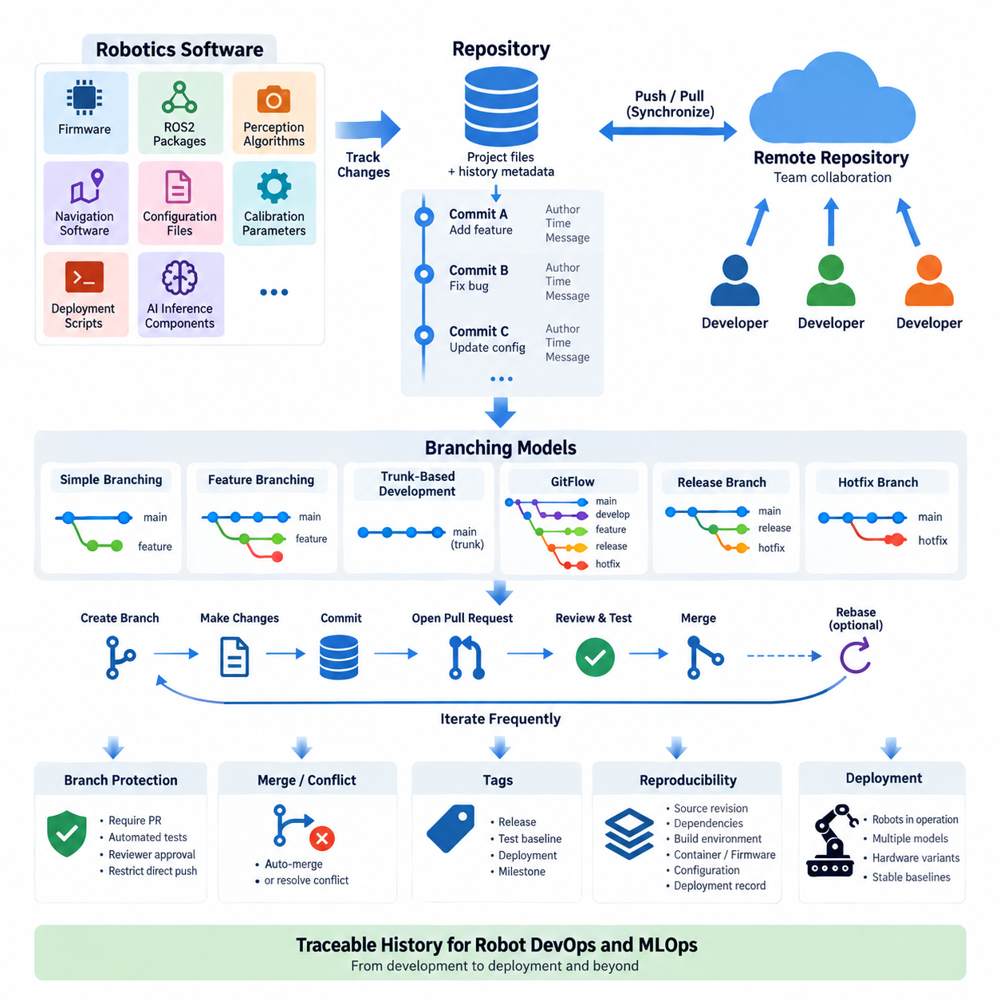
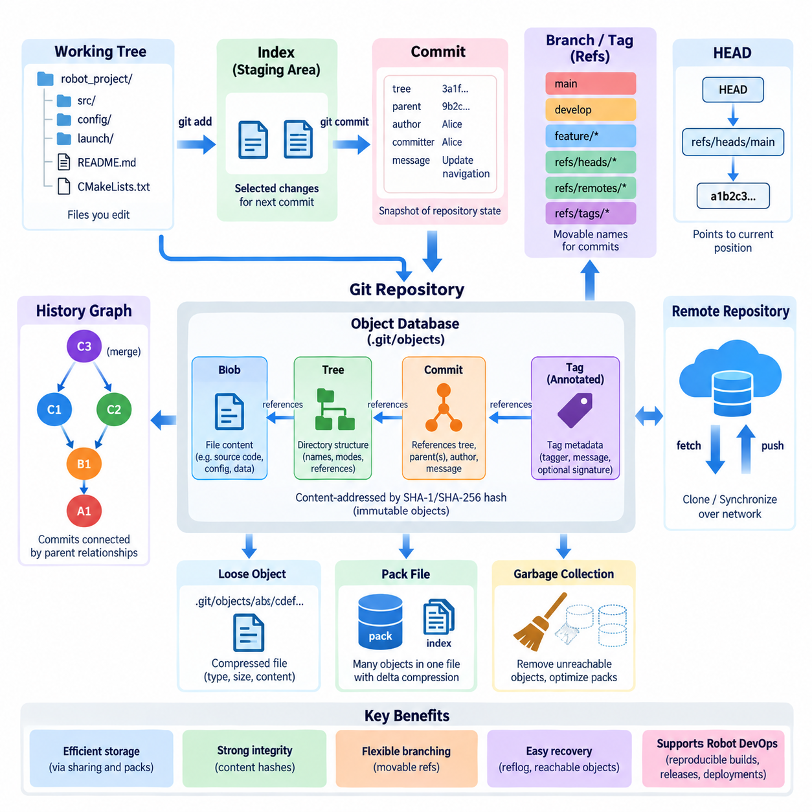
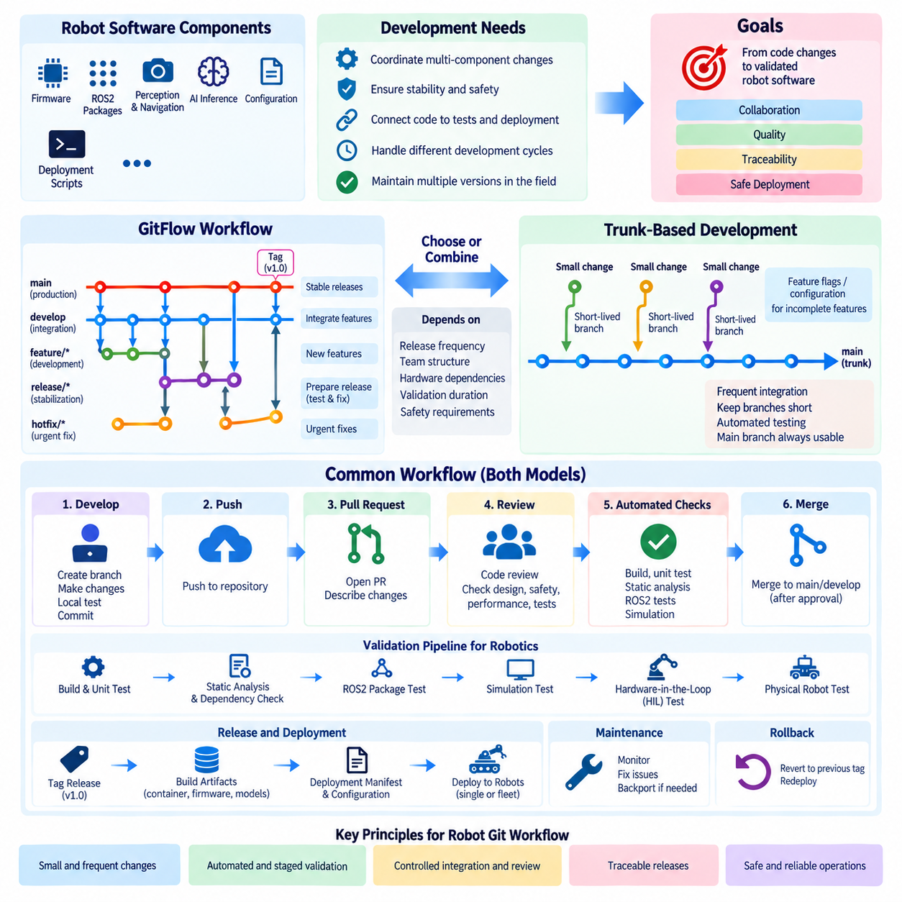
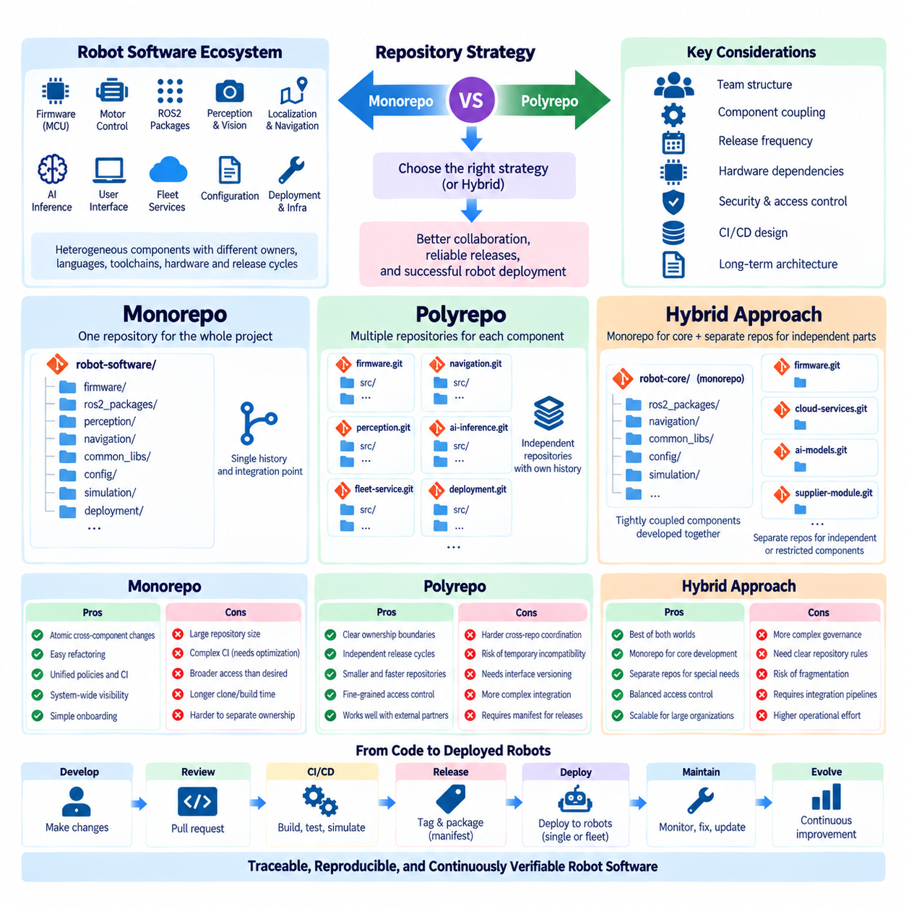
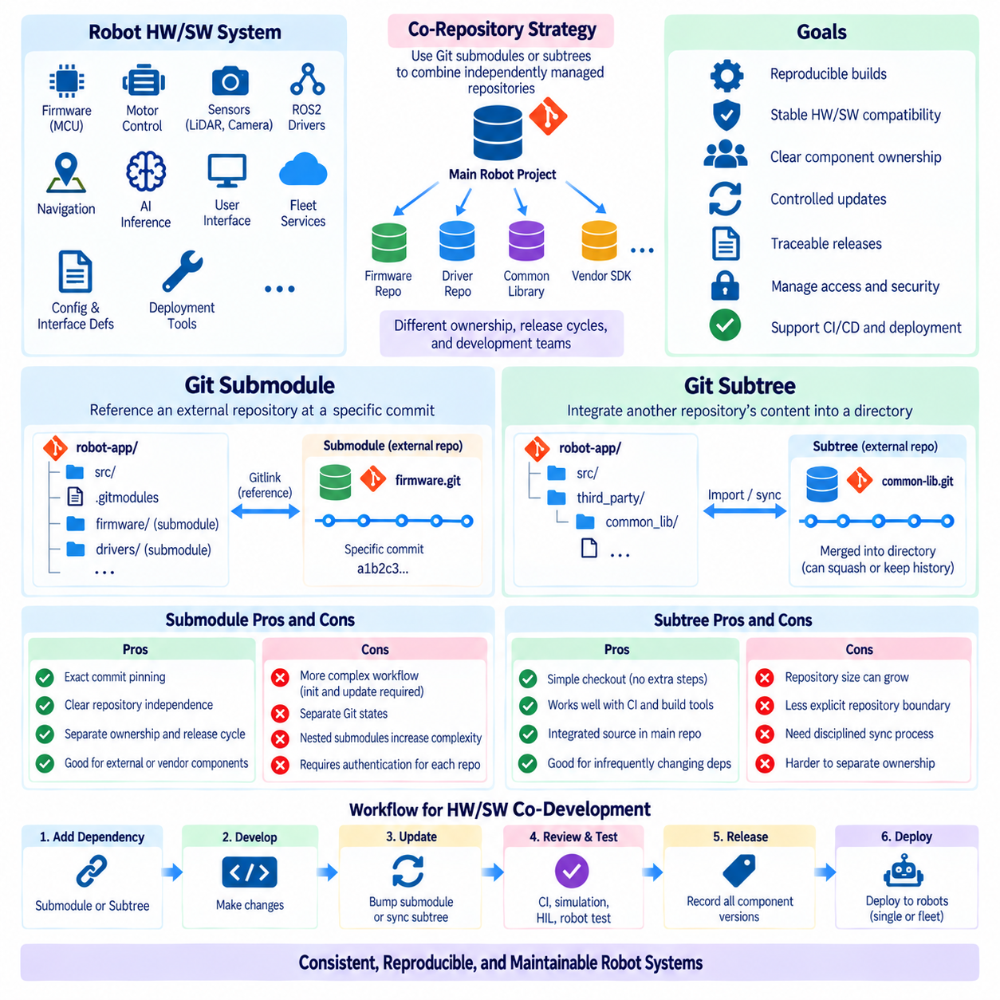
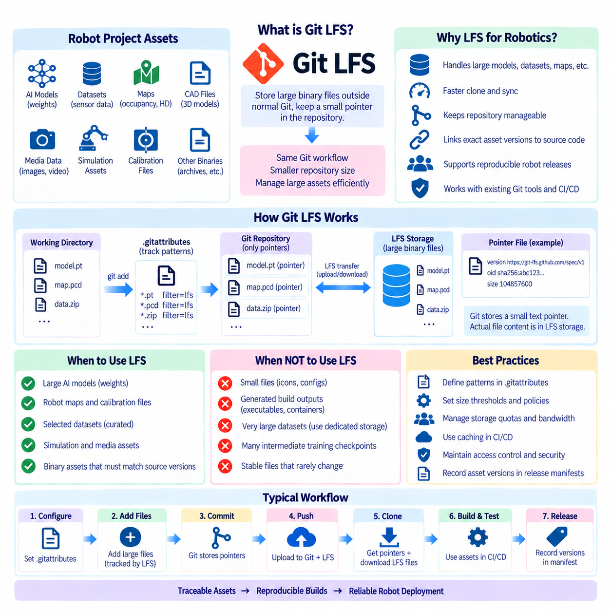
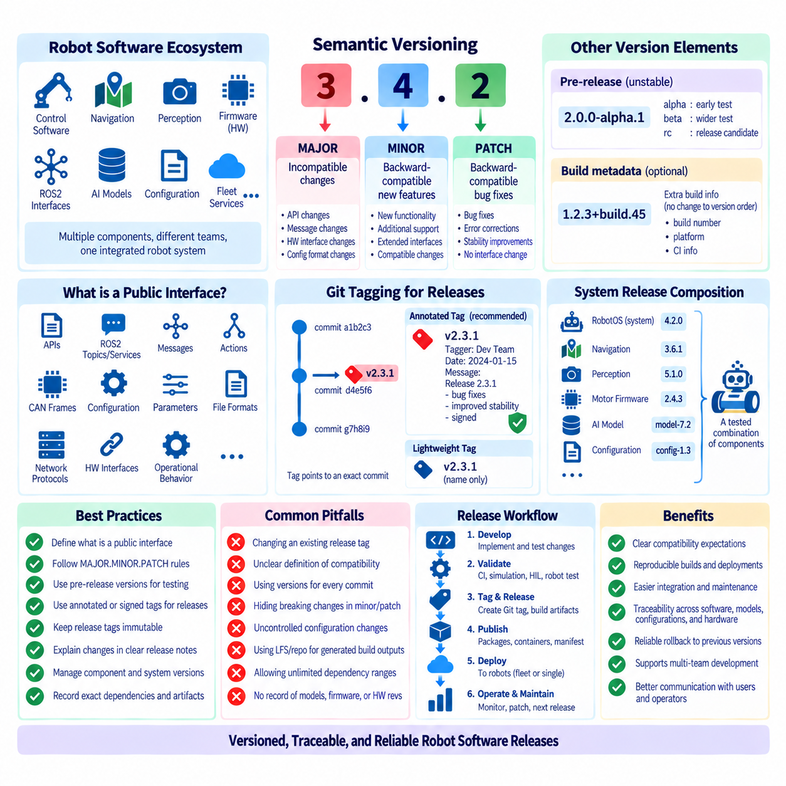
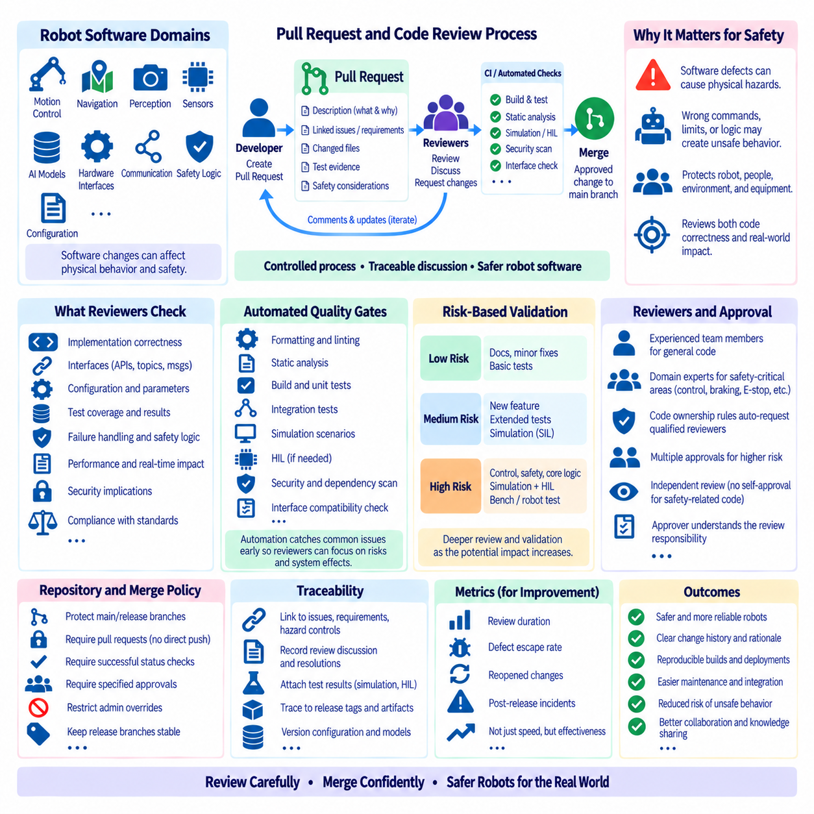
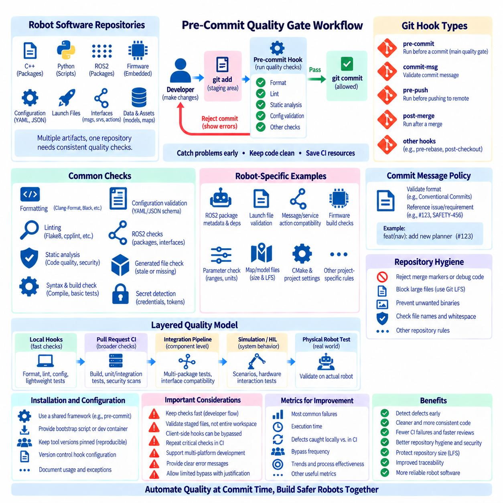
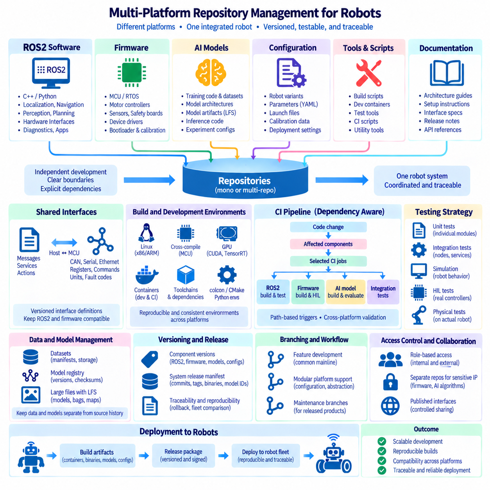

**Volume 10 Robot DevOps and MLOps**


# 1. Git and Version Control

##  

## 1.1. Version Control Fundamentals and Branching Models

{width="7.268055555555556in" height="7.268055555555556in"}

Version control is a systematic method for recording and managing changes to software artifacts over time. Instead of treating source files as isolated documents, a version control system maintains a history of modifications, allowing developers to identify what changed, who made the change, and when it occurred. This history provides the foundation for collaboration, traceability, rollback, and controlled software evolution.

Modern robot software makes version control especially important because a robotic system rarely consists of a single application. A production robot may contain embedded firmware, ROS2 packages, perception algorithms, navigation software, configuration files, calibration parameters, deployment scripts, and AI inference components. Version control provides a common mechanism for coordinating these artifacts while preserving their individual development histories.

A repository is the fundamental storage unit of a version control system. It contains the current project files together with metadata describing their historical states. Developers create commits to capture meaningful snapshots of the repository. Each commit represents a defined state of development and normally includes information about the author, timestamp, parent commit, and a message explaining the purpose of the change.

Commits should represent logical development units rather than arbitrary collections of modified files. For example, correcting a ROS2 localization node, updating its associated configuration, and modifying the corresponding test may belong to one commit. Keeping commits logically focused makes code review, debugging, regression analysis, and rollback easier because engineers can understand the intent and technical scope of each historical change.

Distributed version control systems such as Git allow each developer to maintain a complete local repository containing project history. Developers can therefore create commits, inspect differences, switch development lines, and examine previous versions without continuously communicating with a central server. Remote repositories provide synchronization points through which teams exchange changes and establish shared development states.

Branching allows multiple lines of development to evolve from a common history. A branch can isolate experimental algorithms, new robot capabilities, bug fixes, release preparation, or hardware-specific modifications without immediately changing the stable development line. When work becomes sufficiently validated, its changes can be integrated through merging or another controlled integration process.

The simplest branching approach uses a primary branch as the authoritative development line and creates short-lived branches for individual changes. A developer branches from the current primary state, implements and tests a modification, submits it for review, and integrates it after verification. This approach limits divergence between branches and encourages developers to integrate small changes frequently rather than accumulating large modifications.

Feature branching provides stronger isolation for development activities that require several related commits. A perception engineer might develop a new object-tracking function while navigation engineers continue modifying path-planning components. Both activities can proceed independently until the feature reaches an acceptable integration state. However, branches that remain separated for long periods increase the probability of difficult integration conflicts.

Trunk-based development minimizes long-lived branches by encouraging developers to integrate small changes into a shared primary branch frequently. Incomplete capabilities can remain disabled through configuration or feature flags rather than being maintained in isolated branches for extended periods. This model works well with continuous integration because the shared codebase is repeatedly built and tested as development progresses.

GitFlow introduces more explicit branch roles. A typical structure separates production releases, ongoing development, features, release preparation, and urgent fixes. This provides clear lifecycle boundaries for projects requiring formal release coordination, but it also increases branch-management complexity. Robotics organizations should therefore select such a model according to release requirements rather than assuming that more branches automatically provide better control.

Release branches can be useful when deployed robots must continue operating on a stable software generation while development proceeds toward the next generation. Critical corrections can be applied to the maintained release without introducing unrelated experimental functions. This separation becomes particularly valuable when multiple robot models, customer installations, or hardware revisions require different supported software baselines.

Hotfix branches address urgent defects discovered in an operational release. A correction can be created from the affected stable version, validated independently, and merged into the maintained development lines where appropriate. In robotics, such fixes may involve sensor drivers, communication faults, navigation behavior, or deployment configuration, making accurate identification of the affected software baseline essential.

Merging combines changes from separate development histories. When modifications affect independent files or code regions, Git can often integrate them automatically. Conflicts occur when competing changes cannot be reconciled safely without developer input. A merge conflict should therefore be treated as a semantic engineering decision rather than merely a textual inconvenience, particularly when robot behavior or safety-related logic is involved.

Rebasing provides another mechanism for integrating development histories by replaying commits onto a different base. It can produce a cleaner and more linear history, especially for local feature development, but it rewrites commit ancestry. Teams should establish clear rules governing where rebasing is permitted so that developers do not unexpectedly rewrite history already shared with other contributors.

Branch protection helps convert branching conventions into enforceable development policy. Important branches can require pull requests, successful automated tests, reviewer approval, or restrictions on direct modification. For robot software, these controls create a foundation for later CI/CD processes by ensuring that integration occurs only after defined quality checks rather than through uncontrolled direct changes.

Tags identify important repository states without creating another development line. They are commonly used to mark releases, validated test baselines, field deployments, or milestone versions. When a robot exhibits unexpected behavior in operation, a recorded release tag can help engineers reconstruct the exact source baseline associated with the deployed software and compare it with later or earlier versions.

Version control also supports reproducibility when repository history is connected with build environments, dependencies, configuration, and deployment metadata. A source commit alone may not completely describe an operational robot. Engineers should therefore maintain relationships among source revisions, container versions, firmware releases, AI models, configuration sets, and deployment records wherever these elements jointly determine system behavior.

Robot development introduces hardware dependencies that conventional application projects may not encounter. Different branches can temporarily correspond to prototype sensor configurations, controller revisions, compute platforms, or actuator interfaces. However, using permanent branches solely to represent hardware variants can create extensive divergence. Configuration management and modular interfaces are generally preferable when variants must coexist over long periods.

A practical branching model balances isolation with integration frequency. Too little isolation allows unstable work to disrupt shared development, while excessive branching produces divergent histories and expensive merges. The appropriate model depends on team size, release frequency, hardware diversity, validation requirements, and the operational consequences of software failure. The branch structure should therefore reflect the engineering lifecycle of the robot.

Version control ultimately provides more than file history. It establishes a traceable engineering record connecting development decisions with executable software states. Within the broader Robot DevOps and MLOps architecture, this repository history becomes the starting point for code review, continuous integration, automated testing, release management, container builds, OTA deployment, model management, and fleet-wide software operations.

버전 관리(Version Control)는 시간의 흐름에 따라 소프트웨어 산출물(Software Artifact)의 변경 사항을 기록하고 관리하기 위한 체계적인 방법이다. 소스 파일(Source File)을 서로 독립된 문서로 취급하는 대신, 버전 관리 시스템(Version Control System)은 수정 이력을 유지하여 무엇이 변경되었는지, 누가 변경했는지, 그리고 언제 변경되었는지를 확인할 수 있게 한다. 이러한 이력은 협업(Collaboration), 추적성(Traceability), 롤백(Rollback), 통제된 소프트웨어 진화(Controlled Software Evolution)의 기반을 제공한다.

현대의 로봇 소프트웨어(Robot Software)에서는 하나의 로봇 시스템이 단일 애플리케이션(Application)으로 구성되는 경우가 거의 없기 때문에 버전 관리가 특히 중요하다. 실제 운영되는 로봇은 임베디드 펌웨어(Embedded Firmware), ROS2 패키지(ROS2 Package), 인식 알고리즘(Perception Algorithm), 내비게이션 소프트웨어(Navigation Software), 구성 파일(Configuration File), 보정 파라미터(Calibration Parameter), 배포 스크립트(Deployment Script), AI 추론 구성요소(AI Inference Component) 등을 포함할 수 있다. 버전 관리는 이러한 산출물을 각각의 개발 이력을 보존하면서 통합적으로 관리할 수 있는 공통 메커니즘을 제공한다.

저장소(Repository)는 버전 관리 시스템의 기본 저장 단위이다. 저장소에는 현재 프로젝트 파일과 함께 과거 상태를 설명하는 메타데이터(Metadata)가 저장된다. 개발자는 커밋(Commit)을 생성하여 저장소의 의미 있는 상태를 스냅샷(Snapshot)으로 기록한다. 각 커밋은 특정 개발 상태를 나타내며 일반적으로 작성자(Author), 타임스탬프(Timestamp), 부모 커밋(Parent Commit), 변경 목적을 설명하는 커밋 메시지(Commit Message) 등의 정보를 포함한다.

커밋(Commit)은 임의로 수정된 파일들의 집합이 아니라 논리적인 개발 단위(Logical Development Unit)를 나타내는 것이 바람직하다. 예를 들어 ROS2 위치추정 노드(Localization Node)를 수정하면서 관련 구성과 테스트도 함께 변경했다면 이를 하나의 커밋으로 구성할 수 있다. 커밋을 논리적으로 명확하게 유지하면 각 변경의 목적과 기술적 범위를 쉽게 이해할 수 있으므로 코드 리뷰(Code Review), 디버깅(Debugging), 회귀 분석(Regression Analysis), 롤백(Rollback)이 쉬워진다.

Git과 같은 분산 버전 관리 시스템(Distributed Version Control System)은 각 개발자가 프로젝트 전체 이력을 포함하는 완전한 로컬 저장소(Local Repository)를 유지할 수 있도록 한다. 따라서 개발자는 중앙 서버와 지속적으로 통신하지 않고도 커밋을 생성하고, 차이점을 확인하고, 개발 라인을 전환하고, 이전 버전을 조사할 수 있다. 원격 저장소(Remote Repository)는 팀 구성원이 변경 사항을 교환하고 공통 개발 상태를 형성하기 위한 동기화 지점(Synchronization Point)을 제공한다.

브랜칭(Branching)은 하나의 공통 이력에서 여러 개발 라인이 독립적으로 발전할 수 있도록 한다. 브랜치(Branch)를 사용하면 실험적 알고리즘, 새로운 로봇 기능, 버그 수정(Bug Fix), 릴리스 준비(Release Preparation), 하드웨어별 수정 사항 등을 안정적인 개발 라인에 즉시 반영하지 않고 분리하여 개발할 수 있다. 작업이 충분히 검증되면 병합(Merging) 또는 다른 통제된 통합 절차를 통해 변경 사항을 통합할 수 있다.

가장 단순한 브랜칭 방식(Branching Approach)은 기본 브랜치(Primary Branch)를 공식적인 개발 라인으로 사용하고 각각의 변경 작업을 위해 수명이 짧은 브랜치(Short-Lived Branch)를 생성하는 것이다. 개발자는 현재 기본 상태에서 브랜치를 생성하고 변경 사항을 구현하고 테스트한 다음 리뷰(Review)를 요청하며, 검증이 완료되면 이를 통합한다. 이러한 방식은 브랜치 간 차이를 줄이고 대규모 변경을 장기간 축적하는 대신 작은 변경 사항을 자주 통합하도록 유도한다.

기능 브랜칭(Feature Branching)은 여러 개의 관련 커밋이 필요한 개발 작업을 보다 강하게 격리할 수 있도록 한다. 예를 들어 인식 엔지니어(Perception Engineer)가 새로운 객체 추적(Object Tracking) 기능을 개발하는 동안 내비게이션 엔지니어(Navigation Engineer)는 경로 계획(Path Planning) 구성요소를 계속 수정할 수 있다. 두 작업은 기능이 적절한 통합 상태에 도달할 때까지 독립적으로 진행할 수 있지만, 브랜치가 장기간 분리될수록 복잡한 통합 충돌(Integration Conflict)이 발생할 가능성도 증가한다.

트렁크 기반 개발(Trunk-Based Development)은 개발자가 작은 변경 사항을 공유 기본 브랜치에 자주 통합하도록 함으로써 장기 브랜치(Long-Lived Branch)의 사용을 최소화한다. 완성되지 않은 기능은 장기간 별도의 브랜치에 유지하는 대신 구성(Configuration)이나 기능 플래그(Feature Flag)를 통해 비활성화할 수 있다. 이러한 모델은 개발 과정에서 공유 코드베이스(Codebase)를 반복적으로 빌드하고 테스트할 수 있기 때문에 지속적 통합(Continuous Integration)과 잘 결합된다.

GitFlow는 보다 명확한 브랜치 역할(Branch Role)을 정의한다. 일반적인 구조에서는 운영 릴리스(Production Release), 진행 중인 개발(Ongoing Development), 기능 개발(Feature Development), 릴리스 준비(Release Preparation), 긴급 수정(Urgent Fix)을 서로 구분한다. 명확한 생명주기 경계를 제공하지만 브랜치 관리 복잡성도 증가하므로, 로보틱스 조직은 브랜치 수가 많을수록 통제가 향상된다고 가정하기보다 실제 릴리스 요구사항(Release Requirement)에 따라 이러한 모델을 선택해야 한다.

릴리스 브랜치(Release Branch)는 배포된 로봇이 안정적인 소프트웨어 세대(Software Generation)를 계속 사용하는 동안 다음 세대 소프트웨어 개발을 진행해야 할 때 유용하다. 관련 없는 실험 기능을 포함하지 않고 유지보수 중인 릴리스에 중요한 수정 사항만 적용할 수 있다. 이러한 분리는 여러 로봇 모델, 고객 설치 환경(Customer Installation), 하드웨어 리비전(Hardware Revision)이 서로 다른 소프트웨어 기준선(Software Baseline)을 유지해야 하는 경우 특히 중요하다.

핫픽스 브랜치(Hotfix Branch)는 운영 릴리스에서 발견된 긴급한 결함을 처리한다. 문제가 발생한 안정 버전을 기준으로 수정 사항을 생성하고 독립적으로 검증한 후 필요한 경우 유지되고 있는 다른 개발 라인에도 병합할 수 있다. 로보틱스에서는 이러한 수정이 센서 드라이버(Sensor Driver), 통신 장애(Communication Fault), 내비게이션 동작(Navigation Behavior), 배포 구성(Deployment Configuration)과 관련될 수 있으므로 영향을 받은 소프트웨어 기준선을 정확하게 식별하는 것이 중요하다.

병합(Merging)은 서로 다른 개발 이력에서 발생한 변경 사항을 결합한다. 수정 사항이 서로 독립적인 파일이나 코드 영역에 적용되었다면 Git은 이를 자동으로 통합할 수 있다. 서로 경쟁하는 변경 사항을 안전하게 조정할 수 없는 경우 병합 충돌(Merge Conflict)이 발생한다. 특히 로봇 동작이나 안전 관련 로직(Safety-Related Logic)이 포함된 경우 병합 충돌은 단순한 텍스트 문제라기보다 의미적 엔지니어링 판단(Semantic Engineering Decision)의 대상으로 취급해야 한다.

리베이스(Rebase)는 커밋을 다른 기준점(Base)에 다시 적용하여 개발 이력을 통합하는 또 다른 방법이다. 특히 로컬 기능 개발(Local Feature Development)에서 보다 깔끔하고 선형적인 이력(Linear History)을 구성할 수 있지만 커밋의 계보(Commit Ancestry)를 다시 작성한다. 따라서 팀은 다른 개발자와 이미 공유된 이력을 예기치 않게 다시 작성하지 않도록 리베이스가 허용되는 범위를 명확한 규칙으로 정의해야 한다.

브랜치 보호(Branch Protection)는 브랜칭 규칙을 실제로 강제할 수 있는 개발 정책으로 전환한다. 중요한 브랜치에 대해 풀 리퀘스트(Pull Request), 자동화 테스트(Automated Test) 성공, 리뷰어 승인(Reviewer Approval), 직접 수정 제한 등을 요구할 수 있다. 로봇 소프트웨어에서 이러한 통제는 정의된 품질 검증 없이 변경 사항이 직접 통합되는 것을 방지하고 이후의 CI/CD 프로세스를 구축하기 위한 기반을 제공한다.

태그(Tag)는 새로운 개발 라인을 만들지 않으면서 저장소의 중요한 상태를 식별한다. 일반적으로 릴리스(Release), 검증된 테스트 기준선(Validated Test Baseline), 현장 배포(Field Deployment), 주요 마일스톤(Milestone) 버전을 표시하는 데 사용된다. 운영 중인 로봇에서 예상하지 못한 동작이 발생하면 기록된 릴리스 태그를 통해 배포된 소프트웨어와 연관된 정확한 소스 기준선을 재구성하고 이전 또는 이후 버전과 비교할 수 있다.

버전 관리는 저장소 이력이 빌드 환경(Build Environment), 의존성(Dependency), 구성(Configuration), 배포 메타데이터(Deployment Metadata)와 연결될 때 재현성(Reproducibility)도 지원한다. 소스 커밋 하나만으로는 운영 중인 로봇의 전체 상태를 설명하지 못할 수 있다. 따라서 소스 리비전(Source Revision), 컨테이너 버전(Container Version), 펌웨어 릴리스(Firmware Release), AI 모델(AI Model), 구성 세트(Configuration Set), 배포 기록(Deployment Record)이 시스템 동작을 함께 결정하는 경우 이들 사이의 관계를 유지해야 한다.

로봇 개발에는 일반적인 애플리케이션 프로젝트에서는 발생하지 않을 수 있는 하드웨어 의존성(Hardware Dependency)이 존재한다. 서로 다른 브랜치가 일시적으로 프로토타입 센서 구성, 제어기 리비전(Controller Revision), 컴퓨팅 플랫폼(Compute Platform), 액추에이터 인터페이스(Actuator Interface)에 대응할 수 있다. 그러나 하드웨어 변형만을 표현하기 위해 영구 브랜치를 사용하면 개발 이력이 크게 분기될 수 있으므로, 장기간 여러 변형을 동시에 유지해야 한다면 구성 관리(Configuration Management)와 모듈형 인터페이스(Modular Interface)를 사용하는 것이 일반적으로 더 적절하다.

실용적인 브랜칭 모델(Branching Model)은 격리(Isolation)와 통합 빈도(Integration Frequency) 사이에서 균형을 유지해야 한다. 격리가 부족하면 불안정한 작업이 공유 개발 환경에 영향을 줄 수 있으며, 과도한 브랜칭은 개발 이력을 분산시키고 병합 비용을 증가시킨다. 적절한 모델은 팀 규모, 릴리스 빈도, 하드웨어 다양성, 검증 요구사항, 소프트웨어 장애가 운영에 미치는 영향에 따라 달라진다. 따라서 브랜치 구조는 로봇의 실제 엔지니어링 생명주기(Engineering Lifecycle)를 반영해야 한다.

궁극적으로 버전 관리(Version Control)는 단순한 파일 이력 관리 이상의 역할을 한다. 버전 관리는 개발 과정의 의사결정과 실행 가능한 소프트웨어 상태를 연결하는 추적 가능한 엔지니어링 기록(Traceable Engineering Record)을 구축한다. 더 넓은 로봇 데브옵스 및 머신러닝 운영(Robot DevOps and MLOps) 아키텍처에서 이러한 저장소 이력은 코드 리뷰(Code Review), 지속적 통합(Continuous Integration), 자동화 테스트(Automated Testing), 릴리스 관리(Release Management), 컨테이너 빌드(Container Build), 무선 업데이트(OTA Deployment), 모델 관리(Model Management), 플릿 단위 소프트웨어 운영(Fleet-Wide Software Operations)의 출발점이 된다.

##  

## 1.2. Git Internals Objects Refs and Pack Files

{width="7.268055555555556in" height="7.268055555555556in"}

Git is often described as a distributed version control system, but internally it behaves more like a content-addressable object database combined with a set of references. Instead of storing each project version as a complete directory or recording only textual differences between revisions, Git represents repository history through immutable objects identified by cryptographic object IDs. Understanding these objects explains why branching, merging, tagging, rollback, and distributed synchronization can operate efficiently.

At the core of Git are four principal object types: blob, tree, commit, and annotated tag. These objects are stored in the repository's internal object database and are addressed by hashes derived from their contents. Because an object's identity depends on its content, identical content can naturally share the same stored object. Modifying content produces a different object ID rather than altering the existing historical object, giving Git its largely immutable historical structure.

A blob object represents file content. It does not inherently contain the original filename, directory location, author, or modification timestamp. If two files contain exactly the same data, Git can reference the same blob object for both. When a file changes, Git creates a new blob representing the changed content while the previous blob remains available to commits that reference the earlier state.

Tree objects describe directory structures. A tree contains entries that associate names and file modes with blob objects or other tree objects. In this way, Git can represent an entire project hierarchy recursively. A source directory containing ROS2 packages, configuration files, launch files, and scripts becomes a graph of trees and blobs rather than a conventional collection of independently versioned files.

A commit object records a particular repository state by referencing a root tree object. It also contains information such as parent commit identifiers, author information, committer information, timestamps, and the commit message. A normal commit usually references one parent, while a merge commit may reference multiple parents. Following these parent relationships backward produces the directed history commonly visualized as the Git commit graph.

This structure means that Git fundamentally records snapshots rather than treating repository history as a sequence of patches. Unchanged files can continue to reference existing blob objects, while changed files receive new objects and affected tree structures are reconstructed accordingly. The resulting graph shares unchanged content efficiently. Conceptually, each commit identifies a complete project state even though Git does not need to duplicate every unchanged file for every revision.

Git objects are normally located beneath the \`.git/objects\` area of a repository. A loose object is compressed and stored using a path derived from its object ID. The internal representation includes an object type and size together with the content. Developers normally interact with higher-level Git commands rather than manipulating these files directly, but the object database is the persistent foundation beneath familiar operations such as commit, checkout, merge, and reset.

Cryptographic hashes connect Git objects into a content-addressed graph. A tree references blobs and subtrees by object ID, while a commit references its tree and parent commits. Consequently, changing lower-level content produces new identifiers that propagate into newly created higher-level objects. This relationship provides strong integrity characteristics because repository history is structurally connected through content-derived identifiers rather than arbitrary sequential version numbers.

References, commonly called refs, provide human-manageable names for positions in this object graph. Instead of requiring developers to remember a long commit identifier, Git can associate names such as \`main\`, \`develop\`, or a release branch with particular commits. A branch is therefore fundamentally a movable reference that normally advances when new commits are created on that branch, rather than a separate physical copy of the project.

Local branch references are typically represented under \`refs/heads\`, while remote-tracking references appear under \`refs/remotes\`. Tags are associated with \`refs/tags\`. These namespaces help Git organize different kinds of symbolic names while ultimately connecting them to repository objects. This distinction is important because a local branch and a remote-tracking branch may point to different commits even when their names appear closely related.

HEAD is a special reference representing the currently checked-out development position. In normal operation, HEAD symbolically refers to a branch such as \`refs/heads/main\`, and that branch points to a commit. Creating a new commit updates the branch reference while HEAD continues to identify the branch. In a detached HEAD state, HEAD instead identifies a commit directly, allowing inspection or experimentation without automatically advancing a normal branch.

Tags provide relatively stable names for significant historical points. A lightweight tag behaves primarily as a direct reference to an object, while an annotated tag introduces a tag object containing additional metadata such as the tagger, message, and potentially a cryptographic signature. Release tags are particularly useful in robotics because they can associate validated source states with software releases, integration tests, or deployed robot configurations.

Git also maintains the index, often called the staging area, between the working tree and the committed repository history. The working tree contains files currently visible to the developer, while the index describes the content prepared for the next commit. A commit is constructed from the staged state rather than simply copying every file currently present in the working directory. This separation enables precise control over which modifications become part of a particular commit.

As repository history grows, storing every object individually as a loose object would become inefficient. Git therefore uses pack files to combine many objects into compact storage units. Pack files reduce filesystem overhead and can compress related objects efficiently. They are accompanied by index files that allow Git to locate individual objects within the packed representation without scanning the complete pack sequentially.

Pack files can use delta compression between related objects. Rather than storing every similar object independently in full, Git may store one object and represent another through differences relative to a suitable base object. This optimization is primarily an internal storage mechanism and does not change Git's logical snapshot model. At the conceptual level, commits still describe complete repository states even when the physical representation uses deltas to reduce storage requirements.

Packing becomes especially important during repository maintenance and network transfer. Operations associated with garbage collection can consolidate loose objects, optimize packs, and remove unreachable objects when they are no longer protected by Git's retention mechanisms. During clone, fetch, and push operations, Git can also exchange packed object data efficiently, reducing the amount of storage and network traffic required to synchronize distributed repositories.

Reachability determines which objects belong to meaningful repository history. Starting from references such as branches and tags, Git follows commits, trees, blobs, and parent relationships to discover reachable objects. Objects that are no longer reachable may temporarily remain in the object database before later cleanup. This behavior explains why some apparently deleted commits can sometimes be recovered before repository maintenance permanently removes their unreachable objects.

The reflog provides another important recovery mechanism by recording recent movements of local references such as branches and HEAD. If a developer accidentally resets a branch or moves it away from a desired commit, the reflog may preserve information needed to locate the previous position. For complex robot software repositories, this can be valuable when recovering development states after incorrect rebasing, resetting, or branch manipulation.

Git's internal model is particularly useful for robotics projects containing many interconnected software components. Firmware, ROS2 packages, navigation modules, AI inference code, deployment scripts, and configuration files can evolve within a traceable commit graph. Branch references identify active development lines, tags identify validated releases, and object IDs provide precise identities that can be connected with CI results, container images, firmware builds, and deployment records.

Understanding objects, references, and pack files changes Git from a collection of commands into a coherent data model. Blobs preserve content, trees organize project structure, commits connect snapshots into history, refs provide usable names, HEAD identifies the current position, and pack files optimize physical storage and transfer. Together these mechanisms form the internal foundation upon which collaborative development, reproducible builds, release management, and Robot DevOps workflows can be constructed.

Git은 흔히 분산 버전 관리 시스템(Distributed Version Control System)으로 설명되지만, 내부적으로는 참조(Reference) 집합과 결합된 콘텐츠 주소 지정 객체 데이터베이스(Content-Addressable Object Database)에 더 가깝게 동작한다. Git은 프로젝트의 각 버전을 완전한 디렉터리로 저장하거나 리비전(Revision) 사이의 텍스트 차이만 기록하는 대신, 암호학적 객체 ID(Cryptographic Object ID)로 식별되는 불변 객체(Immutable Object)를 통해 저장소 이력을 표현한다. 이러한 객체를 이해하면 브랜칭(Branching), 병합(Merging), 태깅(Tagging), 롤백(Rollback), 분산 동기화(Distributed Synchronization)가 효율적으로 동작하는 원리를 이해할 수 있다.

Git의 핵심에는 블롭(Blob), 트리(Tree), 커밋(Commit), 주석 태그(Annotated Tag)라는 네 가지 주요 객체 유형(Object Type)이 있다. 이러한 객체는 저장소 내부의 객체 데이터베이스(Object Database)에 저장되며, 객체 내용에서 계산된 해시(Hash)를 통해 주소가 지정된다. 객체의 식별자가 내용에 의해 결정되므로 동일한 내용은 자연스럽게 동일한 객체를 공유할 수 있다. 내용을 수정하면 기존의 과거 객체를 변경하는 것이 아니라 새로운 객체 ID를 가진 객체가 생성되므로 Git의 이력은 기본적으로 불변 구조(Immutable Structure)를 갖는다.

블롭 객체(Blob Object)는 파일의 내용을 나타낸다. 블롭 자체에는 원래 파일 이름, 디렉터리 위치, 작성자 또는 수정 시간이 포함되지 않는다. 두 파일에 정확히 동일한 데이터가 포함되어 있다면 Git은 두 파일에서 동일한 블롭 객체를 참조할 수 있다. 파일 내용이 변경되면 Git은 변경된 내용을 나타내는 새로운 블롭을 생성하며, 이전 블롭은 이전 상태를 참조하는 커밋에서 계속 사용할 수 있도록 유지된다.

트리 객체(Tree Object)는 디렉터리 구조(Directory Structure)를 설명한다. 트리는 이름과 파일 모드(File Mode)를 블롭 객체 또는 다른 트리 객체와 연결하는 엔트리(Entry)를 포함한다. 이러한 방식으로 Git은 전체 프로젝트 계층구조(Project Hierarchy)를 재귀적으로 표현할 수 있다. ROS2 패키지, 구성 파일(Configuration File), 실행 파일(Launch File), 스크립트(Script)가 포함된 소스 디렉터리는 독립적으로 버전이 관리되는 일반 파일들의 집합이 아니라 트리와 블롭으로 구성된 그래프(Graph)로 표현된다.

커밋 객체(Commit Object)는 루트 트리 객체(Root Tree Object)를 참조하여 특정 저장소 상태를 기록한다. 또한 부모 커밋 식별자(Parent Commit Identifier), 작성자 정보(Author Information), 커미터 정보(Committer Information), 타임스탬프(Timestamp), 커밋 메시지(Commit Message) 등의 정보를 포함한다. 일반적인 커밋은 하나의 부모를 참조하지만 병합 커밋(Merge Commit)은 여러 부모를 참조할 수 있다. 이러한 부모 관계를 역방향으로 따라가면 일반적으로 Git 커밋 그래프(Commit Graph)로 시각화되는 방향성 이력(Directed History)이 만들어진다.

이러한 구조는 Git이 저장소 이력을 일련의 패치(Patch)로 처리하기보다 기본적으로 스냅샷(Snapshot)으로 기록한다는 것을 의미한다. 변경되지 않은 파일은 기존 블롭 객체를 계속 참조할 수 있으며, 변경된 파일에는 새로운 객체가 생성되고 영향을 받은 트리 구조도 이에 따라 다시 구성된다. 결과적으로 객체 그래프는 변경되지 않은 내용을 효율적으로 공유한다. 개념적으로 각 커밋은 완전한 프로젝트 상태를 식별하지만, Git이 모든 리비전마다 변경되지 않은 모든 파일을 중복 저장할 필요는 없다.

Git 객체는 일반적으로 저장소의 \`.git/objects\` 영역에 위치한다. 루스 객체(Loose Object)는 압축된 상태로 객체 ID에서 파생된 경로에 저장된다. 내부 표현에는 객체 유형과 크기, 그리고 실제 콘텐츠가 포함된다. 개발자는 일반적으로 이러한 파일을 직접 조작하지 않고 상위 수준의 Git 명령을 사용하지만, 객체 데이터베이스는 커밋(Commit), 체크아웃(Checkout), 병합(Merge), 리셋(Reset)과 같은 익숙한 작업을 지원하는 영속적인 기반이다.

암호학적 해시(Cryptographic Hash)는 Git 객체들을 콘텐츠 주소 기반 그래프(Content-Addressed Graph)로 연결한다. 트리는 객체 ID를 통해 블롭과 하위 트리(Subtree)를 참조하고, 커밋은 자신의 트리와 부모 커밋을 참조한다. 따라서 하위 수준의 콘텐츠가 변경되면 새로운 식별자가 생성되고 이것이 새롭게 생성되는 상위 객체에 반영된다. 이러한 관계는 임의의 순차 버전 번호가 아니라 콘텐츠에서 파생된 식별자를 통해 저장소 이력이 구조적으로 연결되기 때문에 강력한 무결성(Integrity) 특성을 제공한다.

일반적으로 레프(Ref)라고 부르는 참조(Reference)는 객체 그래프의 특정 위치에 사람이 관리하기 쉬운 이름을 제공한다. 개발자가 긴 커밋 식별자를 기억하는 대신 Git은 \`main\`, \`develop\` 또는 릴리스 브랜치(Release Branch)와 같은 이름을 특정 커밋에 연결할 수 있다. 따라서 브랜치(Branch)는 프로젝트의 별도 물리적 복사본이 아니라 새로운 커밋이 생성될 때 일반적으로 앞으로 이동하는 가변 참조(Movable Reference)라고 할 수 있다.

로컬 브랜치 참조(Local Branch Reference)는 일반적으로 \`refs/heads\` 아래에 표현되며, 원격 추적 참조(Remote-Tracking Reference)는 \`refs/remotes\` 아래에 위치한다. 태그(Tag)는 \`refs/tags\`와 연결된다. 이러한 네임스페이스(Namespace)는 서로 다른 종류의 심볼릭 이름(Symbolic Name)을 체계적으로 구성하면서 궁극적으로 저장소 객체와 연결한다. 따라서 이름이 서로 유사하더라도 로컬 브랜치와 원격 추적 브랜치는 서로 다른 커밋을 가리킬 수 있다는 점을 이해하는 것이 중요하다.

HEAD는 현재 체크아웃된 개발 위치를 나타내는 특별한 참조(Special Reference)이다. 일반적인 동작에서 HEAD는 \`refs/heads/main\`과 같은 브랜치를 심볼릭하게 참조하며 해당 브랜치는 다시 하나의 커밋을 가리킨다. 새로운 커밋을 생성하면 브랜치 참조가 업데이트되는 동안 HEAD는 계속 해당 브랜치를 가리킨다. 분리된 HEAD 상태(Detached HEAD State)에서는 HEAD가 커밋을 직접 가리키므로 일반 브랜치를 자동으로 이동시키지 않고 특정 상태를 조사하거나 실험할 수 있다.

태그(Tag)는 중요한 과거 시점에 비교적 안정적인 이름을 제공한다. 경량 태그(Lightweight Tag)는 주로 객체에 대한 직접적인 참조로 동작하는 반면, 주석 태그(Annotated Tag)는 태거(Tagger), 메시지(Message), 경우에 따라 암호학적 서명(Cryptographic Signature)과 같은 추가 메타데이터를 포함하는 태그 객체를 생성한다. 릴리스 태그(Release Tag)는 검증된 소스 상태를 소프트웨어 릴리스, 통합 테스트(Integration Test), 배포된 로봇 구성과 연결할 수 있기 때문에 로보틱스에서 특히 유용하다.

Git은 작업 트리(Working Tree)와 커밋된 저장소 이력 사이에 스테이징 영역(Staging Area)이라고도 불리는 인덱스(Index)를 유지한다. 작업 트리에는 현재 개발자가 확인하고 수정하는 파일이 존재하며, 인덱스는 다음 커밋을 위해 준비된 콘텐츠를 나타낸다. 커밋은 현재 작업 디렉터리에 존재하는 모든 파일을 단순히 복사하는 것이 아니라 스테이징된 상태(Staged State)를 기반으로 구성된다. 이러한 분리를 통해 특정 커밋에 포함할 변경 사항을 정밀하게 제어할 수 있다.

저장소 이력이 증가하면 모든 객체를 개별적인 루스 객체로 저장하는 방식은 비효율적이 된다. 따라서 Git은 팩 파일(Pack File)을 사용하여 많은 객체를 하나의 압축된 저장 단위로 결합한다. 팩 파일은 파일 시스템 오버헤드(Filesystem Overhead)를 줄이고 서로 관련된 객체를 효율적으로 압축할 수 있다. 또한 Git이 전체 팩을 순차적으로 검색하지 않고 개별 객체의 위치를 찾을 수 있도록 인덱스 파일(Index File)이 함께 사용된다.

팩 파일(Pack File)은 관련된 객체 사이에 델타 압축(Delta Compression)을 사용할 수 있다. 서로 유사한 객체를 각각 완전한 형태로 저장하는 대신 하나의 객체를 저장하고 다른 객체는 적절한 기준 객체(Base Object)와의 차이로 표현할 수 있다. 이러한 최적화는 주로 내부 저장 방식이며 Git의 논리적인 스냅샷 모델(Logical Snapshot Model)을 변경하지 않는다. 따라서 물리적 표현에서 저장 공간을 줄이기 위해 델타를 사용하더라도 개념적으로 커밋은 여전히 완전한 저장소 상태를 나타낸다.

패킹(Packing)은 저장소 유지관리(Repository Maintenance)와 네트워크 전송(Network Transfer) 과정에서 특히 중요하다. 가비지 컬렉션(Garbage Collection)과 관련된 작업은 루스 객체를 통합하고 팩을 최적화하며, Git의 보존 메커니즘(Retention Mechanism)에 의해 더 이상 보호되지 않는 도달 불가능한 객체(Unreachable Object)를 제거할 수 있다. 또한 클론(Clone), 페치(Fetch), 푸시(Push) 과정에서 Git은 패킹된 객체 데이터를 효율적으로 교환하여 분산 저장소를 동기화하는 데 필요한 저장 공간과 네트워크 트래픽을 줄일 수 있다.

도달 가능성(Reachability)은 어떤 객체가 의미 있는 저장소 이력에 속하는지를 결정한다. Git은 브랜치와 태그 같은 참조에서 시작하여 커밋, 트리, 블롭, 부모 관계를 따라가면서 도달 가능한 객체(Reachable Object)를 탐색한다. 더 이상 도달할 수 없는 객체도 이후 정리 작업이 수행되기 전까지 객체 데이터베이스에 일시적으로 남아 있을 수 있다. 이러한 특성 때문에 삭제된 것처럼 보이는 일부 커밋도 저장소 유지관리 과정에서 완전히 제거되기 전에는 복구할 수 있는 경우가 있다.

리플로그(Reflog)는 브랜치와 HEAD 같은 로컬 참조의 최근 이동 이력을 기록하여 또 다른 중요한 복구 메커니즘을 제공한다. 개발자가 실수로 브랜치를 리셋하거나 원하는 커밋에서 다른 위치로 이동시킨 경우 리플로그에 이전 위치를 찾는 데 필요한 정보가 남아 있을 수 있다. 복잡한 로봇 소프트웨어 저장소에서는 잘못된 리베이스(Rebase), 리셋(Reset), 브랜치 조작 이후 개발 상태를 복구할 때 특히 유용할 수 있다.

Git의 내부 모델(Internal Model)은 서로 연결된 다양한 소프트웨어 구성요소를 포함하는 로보틱스 프로젝트에 특히 유용하다. 펌웨어(Firmware), ROS2 패키지, 내비게이션 모듈(Navigation Module), AI 추론 코드(AI Inference Code), 배포 스크립트(Deployment Script), 구성 파일(Configuration File)은 추적 가능한 커밋 그래프 안에서 함께 발전할 수 있다. 브랜치 참조는 활성 개발 라인을 식별하고, 태그는 검증된 릴리스를 나타내며, 객체 ID는 CI 결과, 컨테이너 이미지(Container Image), 펌웨어 빌드(Firmware Build), 배포 기록(Deployment Record)과 연결할 수 있는 정확한 식별자를 제공한다.

객체(Object), 참조(Reference), 팩 파일(Pack File)을 이해하면 Git을 단순한 명령어 집합이 아니라 일관된 데이터 모델(Data Model)로 이해할 수 있다. 블롭은 콘텐츠를 보존하고, 트리는 프로젝트 구조를 구성하며, 커밋은 스냅샷을 이력으로 연결하고, 참조는 사람이 사용할 수 있는 이름을 제공하며, HEAD는 현재 위치를 나타내고, 팩 파일은 물리적 저장과 전송을 최적화한다. 이러한 메커니즘은 함께 협업 개발(Collaborative Development), 재현 가능한 빌드(Reproducible Build), 릴리스 관리(Release Management), 로봇 데브옵스(Robot DevOps) 워크플로를 구축하기 위한 내부 기반을 형성한다.

##  

## 1.3. Git Workflow for Robot SW GitFlow Trunk Based [w/Code]

{width="7.268055555555556in" height="7.268055555555556in"}

A Git workflow defines how developers create, review, integrate, release, and maintain software changes within a repository. For robot software, the workflow must coordinate components with very different development cycles, including embedded firmware, ROS2 packages, perception and navigation modules, AI inference software, configuration, and deployment scripts. The objective is not merely to organize branches, but to maintain a controlled path from engineering changes to validated robot software.

Robot software development introduces constraints that make workflow design more important than in many conventional applications. A change to a sensor driver can affect perception, localization, navigation, and safety behavior, while firmware modifications may require physical hardware validation. The Git workflow should therefore connect source changes with review, automated testing, simulation, hardware testing, release identification, and deployment rather than treating a successful merge as the end of development.

Two widely applicable approaches are GitFlow and trunk-based development. GitFlow emphasizes explicit branches for different lifecycle stages, while trunk-based development emphasizes frequent integration into a shared primary branch. Neither model is universally superior. The appropriate workflow depends on release frequency, team structure, hardware dependencies, validation duration, safety requirements, and the number of software versions that must remain operational in deployed robots.

GitFlow normally organizes development around persistent \`main\` and \`develop\` branches together with temporary feature, release, and hotfix branches. The \`main\` branch represents production-quality releases, while \`develop\` acts as the integration line for upcoming development. Engineers create feature branches from \`develop\`, complete their work, perform reviews and tests, and merge validated changes back into the development branch.

Feature branches provide isolation for work that may temporarily destabilize the system. A navigation engineer can modify path planning while another developer changes a LiDAR driver without immediately affecting the same integration baseline. This isolation is useful when robot functions require several development iterations, but long-lived feature branches should be avoided because increasing divergence makes integration and validation progressively more difficult.

When a planned software generation reaches sufficient maturity, GitFlow can create a release branch from \`develop\`. Only stabilization activities, such as defect correction, configuration adjustment, documentation, and final validation, should normally occur there. Robot-specific verification can include simulation regression, sensor integration tests, Hardware-in-the-Loop testing, and controlled physical robot tests before the release is merged into the production branch and tagged.

A hotfix branch provides a controlled path for correcting urgent problems discovered in an operational release. It is typically created from the affected production baseline so that unrelated development changes are excluded. After validation, the correction is integrated into the production line and also propagated to the active development history when necessary. This prevents a field correction from disappearing in the next planned software release.

GitFlow provides visible lifecycle boundaries, but those boundaries create operational cost. Developers must maintain several branch categories, synchronize fixes across development lines, and resolve conflicts caused by branch divergence. In robotics projects with long hardware validation cycles this structure can be useful, but excessive branching can delay integration until problems involving sensors, middleware, control, and AI modules become expensive to diagnose.

Trunk-based development takes a different approach. Developers integrate small changes frequently into a shared trunk, commonly represented by \`main\`, while branches are kept short-lived when they are used at all. Integration happens continuously rather than near the end of a large feature-development period. Automated build, test, static analysis, simulation, and quality gates become essential because the shared branch must remain usable.

Incomplete functions do not necessarily require long-lived branches in trunk-based development. Feature flags, configuration switches, modular interfaces, or disabled runtime paths can keep unfinished capabilities from affecting production behavior. For example, a new perception algorithm can exist in the shared codebase while the deployed configuration continues selecting the validated algorithm until evaluation demonstrates that the new implementation is ready.

Short integration cycles reduce the distance between a developer\'s local state and the shared repository state. Merge conflicts tend to remain smaller, and failures introduced by recent changes can be associated with a narrower set of commits. This is valuable in robot software because failures may emerge from interactions among multiple subsystems rather than from a single module, making frequent system-level integration an important engineering practice.

A practical robot software workflow can combine principles from both models. Daily development may follow trunk-based practices with small pull requests and rapid integration, while release branches are created only when a deployed robot generation requires extended stabilization or maintenance. This hybrid approach avoids unnecessary permanent branching while still supporting fielded robots that cannot immediately move to the newest development baseline.

Regardless of the branching model, a change should pass through a controlled integration path. A developer begins from an approved baseline, creates a focused change, performs local verification, and commits logically related modifications. The change is then pushed to the shared repository and submitted through a pull request or equivalent review mechanism. Automated checks and human review determine whether it is acceptable for integration.

Pull requests provide an engineering boundary between individual development and shared software. Reviewers can evaluate architecture, interfaces, error handling, concurrency, resource usage, configuration effects, and test coverage before a change enters the primary development line. For robotics, reviewers should also consider whether the modification affects timing, actuator behavior, sensor assumptions, coordinate frames, safety logic, or hardware compatibility.

Continuous integration strengthens the workflow by converting repository policies into repeatable checks. Each proposed change can trigger compilation, unit tests, dependency checks, static analysis, ROS2 package tests, container builds, simulation scenarios, and other automated validation. Failures prevent integration until they are resolved, reducing the probability that the shared branch becomes unusable because of a change that could have been detected automatically.

Not every robot behavior can be validated in software-only CI. Changes involving motors, sensors, timing, communication buses, compute platforms, or physical interaction may require Hardware-in-the-Loop or robot-level testing. The workflow should distinguish tests that execute for every commit from more expensive validation stages triggered before releases or safety-relevant integrations. Git therefore becomes the event source for progressively deeper verification.

Branch protection should enforce the workflow rather than relying entirely on developer discipline. Important branches can prohibit direct pushes, require approved pull requests, demand successful automated checks, and restrict who can perform sensitive merges. Release tags can then identify software states that completed the required validation process, providing a reproducible reference for deployment, incident investigation, and maintenance.

Robot software repositories often support multiple hardware configurations. A tempting strategy is to create permanent branches for every robot model, sensor set, or compute platform, but this can fragment the codebase. Where possible, common software should remain integrated while differences are expressed through configuration, abstraction layers, build options, or platform-specific modules. Branches should represent development or release history rather than becoming substitutes for architecture.

Commit size also influences workflow quality. Small, coherent commits are easier to review, test, revert, and associate with failures than large commits containing unrelated modifications. A robot feature may span several packages, but each commit should still represent a comprehensible engineering step. Clear commit messages and pull-request descriptions further connect implementation changes with their intended behavior and validation evidence.

Release management completes the transition from repository history to operational software. A validated commit can be assigned a release tag and connected with container images, firmware binaries, AI model versions, configuration packages, and deployment manifests. This relationship makes it possible to determine precisely which software combination is operating on a robot and to reproduce that state when diagnosing field failures or preparing a rollback.

Rollback should be designed into the workflow rather than treated as an emergency improvisation. If a newly deployed software version produces unacceptable behavior, the organization should be able to identify the previous validated release, restore its associated artifacts, and redeploy it through a controlled process. Reliable tags, immutable build artifacts, deployment records, and compatible configuration management make this possible.

The most effective Git workflow for robotics therefore combines rapid engineering feedback with controlled operational stability. GitFlow provides explicit release and maintenance boundaries, while trunk-based development promotes continuous integration and limits branch divergence. By adapting these principles to simulation, HIL testing, physical validation, release tagging, and fleet deployment, Git becomes the foundation of a traceable Robot DevOps lifecycle from source modification to field operation.

Git 워크플로(Git Workflow)는 개발자가 저장소(Repository) 내에서 소프트웨어 변경 사항을 생성하고, 검토하고, 통합하고, 릴리스하고, 유지관리하는 방법을 정의한다. 로봇 소프트웨어(Robot Software)의 경우 워크플로는 임베디드 펌웨어(Embedded Firmware), ROS2 패키지(ROS2 Package), 인식 및 내비게이션 모듈(Perception and Navigation Module), AI 추론 소프트웨어(AI Inference Software), 구성(Configuration), 배포 스크립트(Deployment Script)처럼 서로 다른 개발 주기를 가진 구성요소를 조정해야 한다. 목표는 단순히 브랜치를 정리하는 것이 아니라 엔지니어링 변경에서 검증된 로봇 소프트웨어까지 통제된 경로를 유지하는 것이다.

로봇 소프트웨어 개발(Robot Software Development)은 일반적인 애플리케이션보다 워크플로 설계를 중요하게 만드는 여러 제약조건을 가진다. 센서 드라이버(Sensor Driver)의 변경은 인식, 위치추정(Localization), 내비게이션, 안전 동작에 영향을 줄 수 있으며, 펌웨어 수정은 실제 하드웨어 검증(Physical Hardware Validation)을 요구할 수 있다. 따라서 Git 워크플로는 성공적인 병합(Merge)을 개발의 끝으로 간주하기보다 소스 변경을 리뷰(Review), 자동화 테스트(Automated Testing), 시뮬레이션(Simulation), 하드웨어 테스트(Hardware Testing), 릴리스 식별(Release Identification), 배포(Deployment)와 연결해야 한다.

널리 적용할 수 있는 두 가지 접근 방식은 깃플로(GitFlow)와 트렁크 기반 개발(Trunk-Based Development)이다. GitFlow는 서로 다른 생명주기 단계(Lifecycle Stage)를 위한 명확한 브랜치를 강조하는 반면, 트렁크 기반 개발은 공유 기본 브랜치(Shared Primary Branch)에 대한 빈번한 통합을 강조한다. 어느 모델도 모든 상황에서 절대적으로 우수하지 않다. 적절한 워크플로는 릴리스 빈도, 팀 구조, 하드웨어 의존성(Hardware Dependency), 검증 기간, 안전 요구사항, 실제 로봇에서 유지해야 하는 소프트웨어 버전 수에 따라 달라진다.

GitFlow는 일반적으로 영구적인 \`main\` 및 \`develop\` 브랜치와 임시 기능 브랜치(Feature Branch), 릴리스 브랜치(Release Branch), 핫픽스 브랜치(Hotfix Branch)를 중심으로 개발을 구성한다. \`main\` 브랜치는 운영 품질(Production-Quality)의 릴리스를 나타내며, \`develop\`은 다음 개발 버전을 위한 통합 라인(Integration Line)으로 사용된다. 엔지니어는 \`develop\`에서 기능 브랜치를 생성하고 작업을 완료한 후 리뷰와 테스트를 수행하며, 검증된 변경 사항을 다시 개발 브랜치에 병합한다.

기능 브랜치(Feature Branch)는 일시적으로 시스템을 불안정하게 만들 수 있는 작업을 격리(Isolation)할 수 있게 한다. 예를 들어 한 내비게이션 엔지니어가 경로 계획(Path Planning)을 수정하는 동안 다른 개발자는 동일한 통합 기준선(Integration Baseline)에 즉각적인 영향을 주지 않고 LiDAR 드라이버를 변경할 수 있다. 이러한 격리는 로봇 기능에 여러 차례의 개발 반복이 필요한 경우 유용하지만, 장기 기능 브랜치(Long-Lived Feature Branch)는 분기가 증가할수록 통합과 검증이 점차 어려워지므로 피하는 것이 바람직하다.

계획된 소프트웨어 세대(Software Generation)가 충분히 성숙하면 GitFlow에서는 \`develop\`으로부터 릴리스 브랜치(Release Branch)를 생성할 수 있다. 일반적으로 여기에서는 결함 수정, 구성 조정, 문서화, 최종 검증과 같은 안정화 작업(Stabilization Activity)만 수행해야 한다. 로봇 특화 검증에는 시뮬레이션 회귀 테스트(Simulation Regression), 센서 통합 테스트(Sensor Integration Test), 하드웨어 인 더 루프(Hardware-in-the-Loop, HIL) 테스트, 통제된 실제 로봇 테스트가 포함될 수 있으며, 이후 릴리스는 운영 브랜치에 병합되고 태그(Tag)가 지정된다.

핫픽스 브랜치(Hotfix Branch)는 운영 릴리스에서 발견된 긴급한 문제를 수정하기 위한 통제된 경로를 제공한다. 일반적으로 문제가 발생한 운영 기준선(Production Baseline)에서 생성되므로 관련 없는 개발 변경 사항을 제외할 수 있다. 검증이 완료되면 수정 사항을 운영 라인에 통합하고 필요한 경우 현재 개발 이력에도 반영한다. 이를 통해 현장 수정(Field Correction)이 다음 계획된 소프트웨어 릴리스에서 사라지는 문제를 방지할 수 있다.

GitFlow는 명확한 생명주기 경계(Lifecycle Boundary)를 제공하지만 이러한 경계에는 운영 비용(Operational Cost)이 따른다. 개발자는 여러 종류의 브랜치를 유지하고, 서로 다른 개발 라인에 수정 사항을 동기화하며, 브랜치 분기로 발생하는 충돌을 해결해야 한다. 하드웨어 검증 주기가 긴 로보틱스 프로젝트에서는 이러한 구조가 유용할 수 있지만, 과도한 브랜칭(Excessive Branching)은 센서, 미들웨어(Middleware), 제어(Control), AI 모듈 사이의 문제가 통합 단계까지 늦게 발견되어 진단 비용을 증가시킬 수 있다.

트렁크 기반 개발(Trunk-Based Development)은 다른 접근 방식을 사용한다. 개발자는 일반적으로 \`main\`으로 표현되는 공유 트렁크(Shared Trunk)에 작은 변경 사항을 자주 통합하며, 브랜치를 사용하더라도 수명을 짧게 유지한다. 대규모 기능 개발이 끝나는 시점까지 기다리지 않고 지속적으로 통합을 수행한다. 공유 브랜치를 항상 사용 가능한 상태로 유지해야 하므로 자동화 빌드(Automated Build), 테스트(Test), 정적 분석(Static Analysis), 시뮬레이션, 품질 게이트(Quality Gate)가 필수적이다.

트렁크 기반 개발에서 완성되지 않은 기능이 반드시 장기 브랜치를 필요로 하는 것은 아니다. 기능 플래그(Feature Flag), 구성 스위치(Configuration Switch), 모듈형 인터페이스(Modular Interface), 비활성화된 실행 경로(Disabled Runtime Path)를 사용하면 완성되지 않은 기능이 운영 동작에 영향을 미치는 것을 방지할 수 있다. 예를 들어 새로운 인식 알고리즘을 공유 코드베이스(Codebase)에 포함시키면서도 평가를 통해 준비가 완료되기 전까지 배포 구성에서는 기존에 검증된 알고리즘을 계속 선택할 수 있다.

짧은 통합 주기(Short Integration Cycle)는 개발자의 로컬 상태와 공유 저장소 상태 사이의 차이를 줄인다. 병합 충돌(Merge Conflict)은 상대적으로 작게 유지되며, 최근 변경으로 발생한 장애를 더 좁은 범위의 커밋과 연결할 수 있다. 로봇 소프트웨어의 장애는 단일 모듈보다 여러 서브시스템(Subsystem) 사이의 상호작용에서 발생할 수 있기 때문에 빈번한 시스템 수준 통합(System-Level Integration)은 중요한 엔지니어링 방법이 된다.

실용적인 로봇 소프트웨어 워크플로는 두 모델의 원칙을 결합할 수 있다. 일상적인 개발은 작은 풀 리퀘스트(Pull Request)와 빠른 통합을 사용하는 트렁크 기반 방식을 따르고, 배포된 로봇 소프트웨어 세대가 장기간 안정화 또는 유지보수를 필요로 할 때만 릴리스 브랜치를 생성할 수 있다. 이러한 하이브리드 접근 방식(Hybrid Approach)은 불필요한 영구 브랜칭을 줄이면서 최신 개발 기준선으로 즉시 전환할 수 없는 현장 로봇도 지원한다.

어떤 브랜칭 모델을 사용하더라도 변경 사항은 통제된 통합 경로(Controlled Integration Path)를 통과해야 한다. 개발자는 승인된 기준선에서 시작하여 명확한 범위의 변경 사항을 생성하고, 로컬 검증(Local Verification)을 수행하며, 논리적으로 연관된 수정 사항을 커밋한다. 이후 변경 사항을 공유 저장소에 푸시(Push)하고 풀 리퀘스트 또는 이에 상응하는 리뷰 메커니즘을 통해 제출한다. 자동화 검사와 사람의 리뷰를 통해 통합 가능 여부를 결정한다.

풀 리퀘스트(Pull Request)는 개인 개발과 공유 소프트웨어 사이의 엔지니어링 경계(Engineering Boundary)를 제공한다. 리뷰어(Reviewer)는 변경 사항이 기본 개발 라인에 들어가기 전에 아키텍처, 인터페이스, 오류 처리(Error Handling), 동시성(Concurrency), 자원 사용(Resource Usage), 구성 영향, 테스트 커버리지(Test Coverage)를 검토할 수 있다. 로보틱스에서는 수정 사항이 타이밍(Timing), 액추에이터 동작(Actuator Behavior), 센서 가정(Sensor Assumption), 좌표 프레임(Coordinate Frame), 안전 로직(Safety Logic), 하드웨어 호환성(Hardware Compatibility)에 영향을 주는지도 검토해야 한다.

지속적 통합(Continuous Integration, CI)은 저장소 정책을 반복 가능한 검사로 전환하여 워크플로를 강화한다. 제안된 각각의 변경은 컴파일(Compilation), 단위 테스트(Unit Test), 의존성 검사(Dependency Check), 정적 분석, ROS2 패키지 테스트, 컨테이너 빌드(Container Build), 시뮬레이션 시나리오 및 기타 자동화 검증을 실행할 수 있다. 실패가 발생하면 문제가 해결될 때까지 통합을 차단하여 자동으로 탐지할 수 있는 변경으로 인해 공유 브랜치가 사용 불가능한 상태가 될 가능성을 줄인다.

모든 로봇 동작을 소프트웨어 기반 CI만으로 검증할 수 있는 것은 아니다. 모터, 센서, 타이밍, 통신 버스(Communication Bus), 컴퓨팅 플랫폼(Compute Platform), 물리적 상호작용과 관련된 변경은 하드웨어 인 더 루프(Hardware-in-the-Loop) 또는 로봇 수준 테스트(Robot-Level Testing)가 필요할 수 있다. 워크플로는 모든 커밋에서 수행하는 테스트와 릴리스 또는 안전 관련 통합 전에 실행되는 비용이 높은 검증 단계를 구분해야 한다. 따라서 Git은 점진적으로 깊어지는 검증 과정의 이벤트 소스(Event Source)가 된다.

브랜치 보호(Branch Protection)는 개발자의 규율에만 의존하지 않고 워크플로 자체를 강제해야 한다. 중요한 브랜치에서는 직접 푸시(Direct Push)를 금지하고, 승인된 풀 리퀘스트를 요구하며, 자동화 검사 성공을 필수 조건으로 설정하고, 민감한 병합 작업을 수행할 수 있는 사용자를 제한할 수 있다. 이후 릴리스 태그(Release Tag)를 사용하여 필요한 검증 과정을 완료한 소프트웨어 상태를 식별하면 배포, 장애 조사(Incident Investigation), 유지보수를 위한 재현 가능한 참조를 제공할 수 있다.

로봇 소프트웨어 저장소는 여러 하드웨어 구성(Hardware Configuration)을 지원하는 경우가 많다. 각각의 로봇 모델, 센서 구성, 컴퓨팅 플랫폼을 위해 영구 브랜치를 생성하고 싶은 유혹이 있지만 이러한 방식은 코드베이스를 분산시킬 수 있다. 가능한 경우 공통 소프트웨어는 통합된 상태로 유지하고 차이는 구성(Configuration), 추상화 계층(Abstraction Layer), 빌드 옵션(Build Option), 플랫폼별 모듈(Platform-Specific Module)을 통해 표현해야 한다. 브랜치는 아키텍처를 대신하는 수단이 아니라 개발 또는 릴리스 이력을 나타내야 한다.

커밋 크기(Commit Size) 역시 워크플로 품질에 영향을 미친다. 작고 일관된 커밋은 관련 없는 수정 사항을 포함하는 대규모 커밋보다 리뷰, 테스트, 되돌리기(Revert), 장애 연계가 쉽다. 하나의 로봇 기능이 여러 패키지에 걸쳐 있더라도 각 커밋은 이해할 수 있는 엔지니어링 단계를 나타내야 한다. 명확한 커밋 메시지와 풀 리퀘스트 설명은 구현 변경 사항을 의도된 동작 및 검증 증거(Validation Evidence)와 연결한다.

릴리스 관리(Release Management)는 저장소 이력을 실제 운영 소프트웨어로 전환하는 과정을 완성한다. 검증된 커밋에는 릴리스 태그를 부여하고 이를 컨테이너 이미지(Container Image), 펌웨어 바이너리(Firmware Binary), AI 모델 버전(AI Model Version), 구성 패키지(Configuration Package), 배포 매니페스트(Deployment Manifest)와 연결할 수 있다. 이러한 관계를 통해 특정 로봇에서 어떤 소프트웨어 조합이 실행되고 있는지 정확하게 확인하고 현장 장애를 진단하거나 롤백을 준비할 때 해당 상태를 재현할 수 있다.

롤백(Rollback)은 긴급 상황에서 임시로 처리하는 작업이 아니라 워크플로에 처음부터 설계되어야 한다. 새롭게 배포된 소프트웨어 버전이 허용할 수 없는 동작을 발생시키는 경우 조직은 이전에 검증된 릴리스를 식별하고 관련 산출물을 복원하여 통제된 절차로 다시 배포할 수 있어야 한다. 신뢰할 수 있는 태그, 불변 빌드 산출물(Immutable Build Artifact), 배포 기록, 호환 가능한 구성 관리(Configuration Management)가 이러한 복구를 가능하게 한다.

따라서 로보틱스를 위한 가장 효과적인 Git 워크플로는 빠른 엔지니어링 피드백(Engineering Feedback)과 통제된 운영 안정성(Operational Stability)을 결합한다. GitFlow는 명확한 릴리스 및 유지보수 경계를 제공하며, 트렁크 기반 개발은 지속적인 통합을 촉진하고 브랜치 분기를 제한한다. 이러한 원칙을 시뮬레이션, HIL 테스트, 실제 로봇 검증(Physical Validation), 릴리스 태깅(Release Tagging), 플릿 배포(Fleet Deployment)에 맞게 적용하면 Git은 소스 변경부터 현장 운영(Field Operation)에 이르는 추적 가능한 로봇 데브옵스(Robot DevOps) 생명주기의 기반이 된다.

##  

## 1.4. Monorepo vs Polyrepo Strategy for Robot Projects

{width="7.268055555555556in" height="7.268055555555556in"}

A repository strategy determines how the source code and related engineering assets of a robot system are divided across version-controlled repositories. Two fundamental approaches are the monorepo, where multiple components are maintained in one repository, and the polyrepo, where components are distributed across multiple repositories. The choice influences collaboration, dependency management, CI/CD design, release processes, access control, and long-term software architecture.

Robot projects make this decision particularly important because they combine heterogeneous software layers. A single robot may include MCU firmware, motor-control software, ROS2 drivers, localization and navigation packages, perception pipelines, AI inference modules, user interfaces, fleet services, configuration files, and deployment infrastructure. These components interact at runtime but may have different owners, programming languages, toolchains, hardware targets, and release cycles.

A monorepo places many or all related components under one repository hierarchy. For example, firmware, ROS2 packages, perception software, navigation modules, common libraries, configuration, simulation assets, and deployment scripts can exist as directories within the same repository. Developers can inspect and modify relationships across the complete system while Git maintains one unified history and one common integration point.

One major advantage of a monorepo is atomic cross-component change. If a sensor interface changes together with a ROS2 driver and a perception module, all required modifications can be included in one commit or pull request. The repository therefore captures the relationship among dependent changes directly. This reduces situations in which one repository is updated while another temporarily remains incompatible with the new interface.

A unified repository can also simplify refactoring. Shared APIs, message definitions, libraries, configuration structures, or build conventions can be modified across many components in a coordinated operation. Code review can examine the complete effect of a change rather than reviewing separate repository updates independently. For tightly coupled robot software, this system-wide visibility can make architectural evolution easier to manage.

Monorepos also support centralized engineering policies. Formatting rules, static analysis, test conventions, dependency policies, security scanning, and common CI templates can be maintained consistently. Developers can discover related code more easily, and new engineers can inspect the overall software structure from a single repository. These characteristics are useful when many robot functions are developed by a closely coordinated engineering organization.

However, repository size and dependency complexity can become significant disadvantages. A large robot monorepo may contain software for multiple compute architectures, hardware generations, simulation environments, and AI workloads. Running every build and test for every modification would waste substantial computing resources. Effective monorepo CI therefore requires change detection, dependency graphs, build caching, and selective test execution.

A monorepo can also create broader access than desired. Firmware, cloud services, AI models, customer-specific integrations, and proprietary algorithms may have different confidentiality requirements. Although repository platforms provide various permission mechanisms, repository-level access control is often easier to manage than fine-grained restrictions inside one large repository. Organizational boundaries can therefore become a reason to separate selected components.

A polyrepo strategy assigns independent repositories to components, services, packages, or engineering domains. Firmware might reside in one repository, ROS2 navigation in another, perception in another, and fleet cloud services in additional repositories. Each repository can maintain its own branch policy, CI pipeline, release tags, dependency definitions, maintainers, and permissions according to the requirements of that component.

Independent repositories provide strong ownership boundaries. A firmware team can release controller software without forcing unrelated cloud services to share the same repository lifecycle. An AI team can iterate on inference software independently of low-level motor-control development. Smaller repositories may also be faster to clone, easier to understand locally, and simpler to protect when external partners or suppliers require access to only part of the robot system.

The principal difficulty of polyrepo development is coordination across repository boundaries. A change to a shared interface may require synchronized updates to several repositories. Separate pull requests can be merged at different times, producing temporary incompatibility. Teams therefore need explicit interface versioning, dependency declarations, release coordination, compatibility testing, and integration environments that reconstruct the correct combination of repository versions.

Version identification becomes especially important in polyrepo systems. A deployed robot cannot be described accurately by naming only one Git commit if its software originates from many repositories. A higher-level manifest can record the exact commit, tag, package, container image, firmware version, AI model, and configuration revision used in a validated system. This manifest effectively becomes the reproducible definition of a robot software release.

ROS2 supports both strategies because packages can coexist in a single workspace while their source code originates from one or many Git repositories. A monorepo may directly contain a complete ROS2 workspace, whereas a polyrepo environment can assemble the workspace from multiple repositories. The important architectural distinction is therefore not the runtime ROS2 graph itself, but how ownership, versioning, integration, and change history are managed.

Hardware diversity further affects repository strategy. If several robot products share navigation, perception, communication, and fleet components, duplicating these modules into product-specific repositories can create long-term maintenance problems. Shared libraries or services should generally have explicit ownership and reusable interfaces, while hardware-specific implementations can remain separated where their lifecycle and validation requirements genuinely differ.

Repository boundaries should follow architectural boundaries where practical. A component with a stable interface, independent ownership, independent release lifecycle, and limited coupling is a strong candidate for a separate repository. Conversely, components that change together frequently may become unnecessarily difficult to manage when separated. Repository structure should therefore reflect actual change relationships rather than arbitrary organizational charts.

CI/CD architecture differs substantially between the two approaches. A monorepo pipeline must determine which components are affected by a change and execute only the necessary builds, tests, simulations, and hardware validation. A polyrepo pipeline can remain smaller per repository but requires additional integration pipelines to verify compatibility among released components. Neither architecture eliminates complexity; it moves complexity to different parts of the engineering system.

Release management follows the same pattern. A monorepo can associate one commit or tag with a coordinated system state, although individual components may still require separate version numbers. Polyrepo development naturally supports independent component releases but needs a mechanism for composing them into a validated robot release. Container registries, artifact repositories, package indexes, and deployment manifests can provide the bridge between source repositories and operational software.

Security and supplier collaboration can favor selective repository separation. A motor-controller supplier may require access to firmware interfaces but should not necessarily access proprietary perception algorithms. A customer integration team may need deployment configuration without access to internal AI development. Polyrepo boundaries can provide straightforward isolation, while shared specifications, generated interfaces, or published packages preserve controlled interoperability.

The choice between monorepo and polyrepo does not need to be absolute. Large robotics organizations can use a hybrid repository strategy in which tightly coupled robot runtime software resides in a monorepo while firmware, cloud infrastructure, AI training systems, safety-critical components, or supplier-owned modules remain separate. This preserves atomic development where coupling is high while retaining independent lifecycle and access boundaries where separation provides real value.

A hybrid design requires explicit rules to prevent repository fragmentation from growing without control. Teams should define criteria for creating a new repository, ownership responsibilities, interface versioning, dependency publication, compatibility guarantees, and integration testing. Without such rules, a polyrepo environment can evolve into numerous poorly coordinated repositories, while an unrestricted monorepo can become a large collection of unrelated projects sharing little beyond storage.

For robot projects, repository strategy should ultimately optimize system integration rather than repository count. Monorepos favor coordinated change, unified visibility, and centralized policy, while polyrepos favor independent ownership, lifecycle separation, and access boundaries. A carefully designed hybrid can combine both characteristics. The correct structure is the one that keeps software dependencies explicit, releases reproducible, interfaces controlled, and the complete robot system continuously verifiable within the broader Robot DevOps lifecycle.

저장소 전략(Repository Strategy)은 로봇 시스템의 소스 코드와 관련 엔지니어링 산출물(Engineering Asset)을 버전 관리 저장소(Version-Controlled Repository)에 어떻게 분할할 것인지를 결정한다. 두 가지 기본적인 접근 방식은 여러 구성요소를 하나의 저장소에서 관리하는 모노레포(Monorepo)와 구성요소를 여러 저장소에 분산하는 폴리레포(Polyrepo)이다. 이러한 선택은 협업(Collaboration), 의존성 관리(Dependency Management), CI/CD 설계, 릴리스 프로세스(Release Process), 접근 제어(Access Control), 장기적인 소프트웨어 아키텍처(Software Architecture)에 영향을 미친다.

로봇 프로젝트(Robot Project)는 이질적인 소프트웨어 계층(Heterogeneous Software Layer)을 결합하기 때문에 이러한 결정이 특히 중요하다. 하나의 로봇에는 MCU 펌웨어(MCU Firmware), 모터 제어 소프트웨어(Motor-Control Software), ROS2 드라이버(ROS2 Driver), 위치추정 및 내비게이션 패키지(Localization and Navigation Package), 인식 파이프라인(Perception Pipeline), AI 추론 모듈(AI Inference Module), 사용자 인터페이스(User Interface), 플릿 서비스(Fleet Service), 구성 파일(Configuration File), 배포 인프라(Deployment Infrastructure)가 포함될 수 있다. 이들은 실행 시 상호작용하지만 서로 다른 담당자, 프로그래밍 언어, 툴체인(Toolchain), 하드웨어 대상, 릴리스 주기를 가질 수 있다.

모노레포(Monorepo)는 관련된 여러 구성요소 또는 전체 구성요소를 하나의 저장소 계층구조(Repository Hierarchy) 아래에 배치한다. 예를 들어 펌웨어, ROS2 패키지, 인식 소프트웨어, 내비게이션 모듈, 공통 라이브러리(Common Library), 구성, 시뮬레이션 자산(Simulation Asset), 배포 스크립트(Deployment Script)를 동일한 저장소 내부의 디렉터리로 구성할 수 있다. 개발자는 전체 시스템의 관계를 확인하고 수정할 수 있으며 Git은 하나의 통합된 이력(Unified History)과 공통 통합 지점(Common Integration Point)을 유지한다.

모노레포의 주요 장점 중 하나는 원자적 구성요소 간 변경(Atomic Cross-Component Change)이다. 센서 인터페이스(Sensor Interface)가 ROS2 드라이버 및 인식 모듈과 함께 변경되어야 한다면 필요한 모든 수정 사항을 하나의 커밋(Commit)이나 풀 리퀘스트(Pull Request)에 포함할 수 있다. 따라서 저장소는 서로 의존하는 변경 사항 사이의 관계를 직접 기록하며, 하나의 저장소만 업데이트되고 다른 저장소는 일시적으로 새로운 인터페이스와 호환되지 않는 상황을 줄일 수 있다.

통합 저장소(Unified Repository)는 리팩터링(Refactoring)도 단순화할 수 있다. 공유 API, 메시지 정의(Message Definition), 라이브러리, 구성 구조(Configuration Structure), 빌드 규칙(Build Convention)을 여러 구성요소에 걸쳐 조정된 방식으로 수정할 수 있다. 코드 리뷰(Code Review)에서도 개별 저장소의 변경을 따로 검토하는 대신 변경이 전체 시스템에 미치는 영향을 함께 확인할 수 있다. 긴밀하게 결합된 로봇 소프트웨어에서는 이러한 시스템 전체 가시성(System-Wide Visibility)을 통해 아키텍처의 진화를 보다 쉽게 관리할 수 있다.

모노레포는 중앙화된 엔지니어링 정책(Centralized Engineering Policy)도 지원한다. 포맷팅 규칙(Formatting Rule), 정적 분석(Static Analysis), 테스트 규칙(Test Convention), 의존성 정책(Dependency Policy), 보안 스캐닝(Security Scanning), 공통 CI 템플릿(Common CI Template)을 일관되게 유지할 수 있다. 개발자는 관련 코드를 보다 쉽게 찾을 수 있으며 신규 엔지니어도 하나의 저장소에서 전체 소프트웨어 구조를 파악할 수 있다. 이러한 특성은 여러 로봇 기능을 긴밀하게 협력하는 하나의 엔지니어링 조직에서 개발할 때 유용하다.

그러나 저장소 크기와 의존성 복잡성(Dependency Complexity)은 중요한 단점이 될 수 있다. 대규모 로봇 모노레포에는 여러 컴퓨팅 아키텍처(Compute Architecture), 하드웨어 세대(Hardware Generation), 시뮬레이션 환경, AI 워크로드(AI Workload)를 위한 소프트웨어가 함께 포함될 수 있다. 모든 변경마다 모든 빌드와 테스트를 실행하면 상당한 컴퓨팅 자원이 낭비될 수 있다. 따라서 효과적인 모노레포 CI에는 변경 감지(Change Detection), 의존성 그래프(Dependency Graph), 빌드 캐싱(Build Caching), 선택적 테스트 실행(Selective Test Execution)이 필요하다.

모노레포는 필요한 범위보다 더 넓은 접근 권한을 제공하는 문제도 발생할 수 있다. 펌웨어, 클라우드 서비스(Cloud Service), AI 모델, 고객별 통합(Customer-Specific Integration), 독점 알고리즘(Proprietary Algorithm)은 서로 다른 기밀성 요구사항(Confidentiality Requirement)을 가질 수 있다. 저장소 플랫폼에서 다양한 권한 관리 기능을 제공하더라도 하나의 대규모 저장소 내부에서 세밀하게 제한하는 것보다 저장소 수준 접근 제어(Repository-Level Access Control)가 관리하기 쉬운 경우가 많다. 따라서 조직적 경계(Organizational Boundary)는 일부 구성요소를 별도의 저장소로 분리하는 이유가 될 수 있다.

폴리레포 전략(Polyrepo Strategy)은 구성요소, 서비스, 패키지 또는 엔지니어링 영역(Engineering Domain)을 독립적인 저장소에 할당한다. 펌웨어는 하나의 저장소, ROS2 내비게이션은 다른 저장소, 인식 소프트웨어는 또 다른 저장소, 플릿 클라우드 서비스는 추가적인 저장소에서 관리할 수 있다. 각각의 저장소는 해당 구성요소의 요구사항에 따라 독립적인 브랜치 정책(Branch Policy), CI 파이프라인(CI Pipeline), 릴리스 태그(Release Tag), 의존성 정의(Dependency Definition), 유지관리 담당자(Maintainer), 접근 권한을 가질 수 있다.

독립적인 저장소는 명확한 소유권 경계(Ownership Boundary)를 제공한다. 펌웨어 팀은 관련 없는 클라우드 서비스와 동일한 저장소 생명주기(Repository Lifecycle)를 공유하지 않고 제어기 소프트웨어를 릴리스할 수 있다. AI 팀 역시 저수준 모터 제어 개발과 독립적으로 추론 소프트웨어를 반복 개발할 수 있다. 작은 저장소는 복제(Clone)가 더 빠르고 로컬에서 이해하기 쉬우며, 외부 파트너나 공급업체가 로봇 시스템의 일부에만 접근해야 하는 경우 권한 관리도 단순해질 수 있다.

폴리레포 개발의 가장 큰 어려움은 저장소 경계를 넘어서는 조정(Coordination)이다. 공유 인터페이스(Shared Interface)를 변경하면 여러 저장소를 동기화하여 수정해야 할 수 있다. 별도의 풀 리퀘스트가 서로 다른 시점에 병합되면 일시적인 비호환성(Incompatibility)이 발생할 수 있다. 따라서 팀은 명확한 인터페이스 버전 관리(Interface Versioning), 의존성 선언(Dependency Declaration), 릴리스 조정(Release Coordination), 호환성 테스트(Compatibility Testing), 올바른 저장소 버전 조합을 재구성하는 통합 환경(Integration Environment)을 갖추어야 한다.

폴리레포 시스템에서는 버전 식별(Version Identification)이 특히 중요하다. 소프트웨어가 여러 저장소에서 제공된다면 하나의 Git 커밋만으로 배포된 로봇의 상태를 정확하게 설명할 수 없다. 상위 수준의 매니페스트(Manifest)를 사용하여 검증된 시스템에 적용된 정확한 커밋, 태그, 패키지, 컨테이너 이미지(Container Image), 펌웨어 버전(Firmware Version), AI 모델, 구성 리비전(Configuration Revision)을 기록할 수 있다. 이러한 매니페스트는 사실상 재현 가능한 로봇 소프트웨어 릴리스의 정의가 된다.

ROS2는 패키지가 하나의 워크스페이스(Workspace)에 공존하면서 소스 코드는 하나 또는 여러 Git 저장소에서 가져올 수 있으므로 두 전략을 모두 지원한다. 모노레포에서는 완전한 ROS2 워크스페이스를 직접 포함할 수 있으며, 폴리레포 환경에서는 여러 저장소를 결합하여 워크스페이스를 구성할 수 있다. 따라서 중요한 아키텍처적 차이는 런타임 ROS2 그래프(Runtime ROS2 Graph) 자체가 아니라 소유권, 버전 관리, 통합, 변경 이력을 어떻게 관리하느냐에 있다.

하드웨어 다양성(Hardware Diversity) 역시 저장소 전략에 영향을 미친다. 여러 로봇 제품이 내비게이션, 인식, 통신, 플릿 구성요소를 공유한다면 이러한 모듈을 제품별 저장소에 복제하는 방식은 장기적인 유지보수 문제를 발생시킬 수 있다. 공유 라이브러리(Shared Library)나 서비스에는 명확한 소유권과 재사용 가능한 인터페이스(Reusable Interface)를 부여하고, 하드웨어별 구현은 생명주기와 검증 요구사항이 실제로 다른 경우에 분리하여 유지할 수 있다.

가능한 경우 저장소 경계(Repository Boundary)는 아키텍처 경계(Architectural Boundary)를 따라야 한다. 안정적인 인터페이스, 독립적인 소유권, 독립적인 릴리스 생명주기, 제한된 결합도(Coupling)를 가진 구성요소는 별도의 저장소를 사용하기에 적합하다. 반대로 자주 함께 변경되는 구성요소를 분리하면 불필요하게 관리가 어려워질 수 있다. 따라서 저장소 구조는 임의의 조직도(Organizational Chart)가 아니라 실제 변경 관계(Change Relationship)를 반영해야 한다.

CI/CD 아키텍처는 두 접근 방식에서 상당한 차이를 보인다. 모노레포 파이프라인은 변경으로 영향을 받는 구성요소를 판단하여 필요한 빌드, 테스트, 시뮬레이션, 하드웨어 검증만 실행해야 한다. 폴리레포 파이프라인은 개별 저장소 수준에서는 더 작게 구성할 수 있지만 릴리스된 구성요소 사이의 호환성을 검증하기 위한 추가적인 통합 파이프라인(Integration Pipeline)이 필요하다. 어느 아키텍처도 복잡성을 제거하는 것은 아니며 단지 복잡성이 위치하는 영역을 변경한다.

릴리스 관리(Release Management)도 동일한 패턴을 따른다. 모노레포에서는 하나의 커밋이나 태그를 조정된 시스템 상태(Coordinated System State)와 연결할 수 있지만 개별 구성요소에는 별도의 버전 번호가 필요할 수도 있다. 폴리레포 개발은 독립적인 구성요소 릴리스를 자연스럽게 지원하지만 이를 검증된 로봇 릴리스로 조합하기 위한 메커니즘이 필요하다. 컨테이너 레지스트리(Container Registry), 아티팩트 저장소(Artifact Repository), 패키지 인덱스(Package Index), 배포 매니페스트(Deployment Manifest)는 소스 저장소와 운영 소프트웨어를 연결하는 역할을 할 수 있다.

보안(Security)과 공급업체 협업(Supplier Collaboration)은 선택적인 저장소 분리를 선호하게 만드는 요인이 될 수 있다. 모터 제어기 공급업체는 펌웨어 인터페이스에 접근해야 하지만 독점적인 인식 알고리즘에 접근할 필요는 없을 수 있다. 고객 통합 팀(Customer Integration Team)은 배포 구성이 필요하지만 내부 AI 개발 코드에 접근할 필요는 없을 수 있다. 폴리레포 경계는 이러한 격리를 직접적으로 제공할 수 있으며, 공유 사양(Shared Specification), 생성된 인터페이스(Generated Interface), 배포된 패키지(Published Package)를 통해 통제된 상호운용성(Interoperability)을 유지할 수 있다.

모노레포와 폴리레포 사이의 선택이 반드시 절대적일 필요는 없다. 대규모 로보틱스 조직은 긴밀하게 결합된 로봇 런타임 소프트웨어(Robot Runtime Software)를 모노레포에서 관리하면서 펌웨어, 클라우드 인프라(Cloud Infrastructure), AI 학습 시스템(AI Training System), 안전 필수 구성요소(Safety-Critical Component), 공급업체 소유 모듈(Supplier-Owned Module)은 별도의 저장소로 유지하는 하이브리드 저장소 전략(Hybrid Repository Strategy)을 사용할 수 있다. 이를 통해 결합도가 높은 영역에서는 원자적 개발을 유지하면서 실제로 분리가 필요한 영역에서는 독립적인 생명주기와 접근 경계를 확보할 수 있다.

하이브리드 설계(Hybrid Design)는 저장소 분산이 통제되지 않은 상태로 증가하지 않도록 명확한 규칙을 필요로 한다. 팀은 새로운 저장소를 생성하기 위한 기준, 소유권 책임(Ownership Responsibility), 인터페이스 버전 관리, 의존성 배포(Dependency Publication), 호환성 보장(Compatibility Guarantee), 통합 테스트(Integration Testing)를 정의해야 한다. 이러한 규칙이 없으면 폴리레포 환경은 제대로 조정되지 않는 수많은 저장소로 분산될 수 있으며, 제한 없는 모노레포는 저장 공간만 공유할 뿐 서로 관련성이 낮은 프로젝트의 거대한 집합이 될 수 있다.

로봇 프로젝트에서 저장소 전략은 궁극적으로 저장소의 개수보다 시스템 통합(System Integration)을 최적화해야 한다. 모노레포는 조정된 변경(Coordinated Change), 통합된 가시성(Unified Visibility), 중앙화된 정책(Centralized Policy)에 유리하며, 폴리레포는 독립적인 소유권, 생명주기 분리(Lifecycle Separation), 접근 경계(Access Boundary)에 유리하다. 신중하게 설계된 하이브리드 방식은 두 특성을 결합할 수 있다. 올바른 구조란 소프트웨어 의존성을 명확하게 유지하고, 릴리스를 재현 가능하게 만들며, 인터페이스를 통제하고, 전체 로봇 시스템을 더 넓은 로봇 데브옵스(Robot DevOps) 생명주기 내에서 지속적으로 검증할 수 있게 하는 구조이다.

##  

## 1.5. Git Submodules and Subtrees for HW SW Co Repos [w/Code]

{width="7.268055555555556in" height="7.268055555555556in"}

Git submodules and Git subtrees provide two different mechanisms for combining independently managed repositories into a larger software structure. This capability is especially useful in robotics, where a complete system may depend on firmware, hardware-interface libraries, ROS2 drivers, navigation modules, vendor SDKs, and deployment tools maintained with different ownership and release cycles. Both approaches preserve repository boundaries, but they manage dependency relationships differently.

A hardware-software co-repository environment often requires one project to depend on another without copying its development history manually. For example, a robot application repository may depend on a motor-controller firmware repository, a LiDAR driver, or a shared communication library. The engineering problem is therefore not simply how to obtain external source code, but how to identify, reproduce, update, validate, and release an exact combination of dependent repositories.

A Git submodule represents an external Git repository through a specific commit recorded inside the parent repository. The parent does not directly store the complete contents and history of the dependency as ordinary files. Instead, it records a Gitlink referencing a particular commit, while a \`.gitmodules\` file describes information such as the submodule path and repository location. This creates an explicit relationship between the parent project and an independently versioned repository.

The fixed commit reference is one of the most important characteristics of submodules. If a robot release is validated using a particular motor-control firmware revision, the parent repository can point to that exact firmware commit. Developers checking out the same parent revision can reconstruct the intended dependency version rather than automatically receiving the newest firmware. This behavior supports reproducibility and controlled hardware-software compatibility.

Submodules also preserve strong ownership boundaries. The external repository maintains its own branches, tags, permissions, issues, CI pipelines, and release process. A supplier-developed driver or an independently maintained embedded project can therefore remain autonomous while being referenced from the larger robot software repository. Changes to the dependency are committed in its own repository before the parent repository updates its recorded submodule pointer.

This separation introduces workflow complexity. Cloning the parent repository does not always produce a fully populated working tree unless submodules are initialized and updated. Developers must understand that the parent repository and submodule have distinct Git states. Switching parent branches may also require synchronizing submodules to the commits expected by the newly checked-out revision, otherwise the workspace can contain an unintended combination of component versions.

Nested submodules can increase this complexity further. If a robot project references a navigation repository that itself references additional libraries, dependency initialization can become multi-level. CI runners, container builds, and deployment systems must explicitly retrieve the required submodules, and authentication must be available for every private dependency. Poorly managed submodules can therefore create confusing failures even when the parent repository itself is correctly checked out.

Git subtree takes a different approach by integrating another repository's content directly into a directory of the parent repository. From the perspective of a normal checkout, the imported files behave like ordinary files in the main repository. Developers do not generally need a separate initialization step to obtain them, making the resulting working tree simpler for users, CI systems, and build environments that only need the combined source state.

Subtree integration can preserve a relationship with the original external repository while allowing updates to be pulled into a designated directory. Changes can also be pushed back when the workflow is intentionally designed for bidirectional synchronization. Git subtree operations may use squashing to condense imported history or preserve more detailed history depending on the chosen process. The parent repository therefore carries more dependency content than with a submodule.

The major operational advantage of subtree is checkout simplicity. A developer cloning the robot project immediately receives the integrated dependency content as part of the repository. Automated build environments do not need additional submodule initialization logic, and archived source snapshots naturally contain the imported files. This can reduce onboarding and CI complexity when dependencies change infrequently or when independent repository manipulation is not required during normal development.

The trade-off is that repository boundaries become less explicit in everyday work. Imported code appears directly within the parent repository, and synchronization with the upstream project must follow a disciplined subtree process. If developers modify imported files without understanding their upstream relationship, later synchronization can become difficult. Repository size can also increase because the parent contains the integrated source rather than merely referencing an external commit.

The choice between submodule and subtree therefore depends strongly on ownership and update behavior. Submodules are attractive when a component must remain clearly independent, has its own release lifecycle, and needs exact revision pinning. Subtrees can be attractive when ease of checkout and build is more important than maintaining a visibly separate repository state during daily development. Neither mechanism eliminates the need for dependency governance.

Hardware-software co-development provides a practical example. Suppose an autonomous robot uses a motor-control board whose firmware is developed separately from the ROS2 vehicle-control stack. A submodule can pin the application repository to the exact firmware revision validated with a particular controller hardware revision. Alternatively, a subtree can import shared protocol definitions or communication libraries that application developers need frequently but update only occasionally.

Interface definitions require particular attention. Firmware and higher-level robot software may share CAN message definitions, register maps, protobuf schemas, ROS2 interfaces, or generated communication code. Duplicating these definitions manually across repositories creates synchronization risk. A dedicated interface repository referenced through a submodule, subtree, generated package, or versioned artifact can establish a controlled source of truth for both hardware and software development.

Dependency updates should be treated as engineering changes rather than routine file synchronization. Updating a submodule pointer or importing a newer subtree revision may alter interfaces, timing behavior, memory requirements, hardware compatibility, or runtime behavior. The update should therefore pass through code review and the same appropriate CI, simulation, Hardware-in-the-Loop, and physical robot validation used for other system-level changes.

CI pipelines must understand the selected dependency mechanism. With submodules, the pipeline should retrieve the exact referenced commits, including nested dependencies where required, before building. Credentials and repository permissions must also be configured for private submodules. With subtrees, source retrieval is simpler because dependency files are already present, but pipelines should still verify compatibility and detect unintended modifications to imported code.

Release management should capture more than the parent repository version. For submodule-based systems, release records should preserve the parent commit and all referenced submodule commits. For subtree-based systems, the parent commit already identifies the imported source state, but recording the upstream version or synchronization point remains useful. These records can be connected with firmware binaries, container images, AI models, configuration packages, and deployment manifests.

Submodules are particularly effective when multiple robot products must consume different validated revisions of the same independently developed component. Each parent repository or release branch can point to the appropriate dependency commit without duplicating the dependency's complete development process. However, frequent coordinated changes across parent and submodule repositories may become cumbersome because a logically single system modification requires commits and reviews across repository boundaries.

Subtrees can reduce that friction when coordinated editing is more common and strict repository independence is less important. Developers work with imported code as part of the normal source tree, which can simplify cross-component refactoring and local testing. The cost is greater responsibility for maintaining synchronization rules and understanding which changes belong to the parent project versus which should eventually be propagated to the upstream repository.

For large robot platforms, submodules and subtrees should not automatically become the default mechanism for every dependency. Stable third-party libraries may be better consumed through package managers or artifact registries, while binary firmware and AI models may belong in dedicated artifact storage. Git-based repository composition is most valuable when source-level relationships, revision traceability, and coordinated engineering access are genuinely required.

A robust strategy therefore defines why each external repository is connected, who owns it, how revisions are selected, how updates are approved, and how compatibility is verified. Submodules emphasize explicit repository independence and precise commit pinning, while subtrees emphasize integrated source availability and simpler checkout behavior. Applied selectively, both mechanisms can support reproducible hardware-software integration and traceable Robot DevOps workflows across complex robotic systems.

Git 서브모듈(Git Submodule)과 Git 서브트리(Git Subtree)는 독립적으로 관리되는 저장소(Repository)를 더 큰 소프트웨어 구조 안에 결합하기 위한 서로 다른 두 가지 메커니즘을 제공한다. 이는 완전한 시스템이 서로 다른 소유권과 릴리스 주기로 관리되는 펌웨어(Firmware), 하드웨어 인터페이스 라이브러리(Hardware-Interface Library), ROS2 드라이버(ROS2 Driver), 내비게이션 모듈(Navigation Module), 공급업체 SDK(Vendor SDK), 배포 도구(Deployment Tool)에 의존할 수 있는 로보틱스에서 특히 유용하다. 두 방식 모두 저장소 경계를 유지하지만 의존성 관계(Dependency Relationship)를 관리하는 방식에는 차이가 있다.

하드웨어-소프트웨어 공동 저장소(Hardware-Software Co-Repository) 환경에서는 하나의 프로젝트가 다른 프로젝트의 개발 이력을 수동으로 복사하지 않고도 해당 프로젝트에 의존해야 하는 경우가 많다. 예를 들어 로봇 애플리케이션 저장소(Application Repository)는 모터 제어기 펌웨어 저장소, LiDAR 드라이버 또는 공유 통신 라이브러리(Shared Communication Library)에 의존할 수 있다. 따라서 엔지니어링 문제는 단순히 외부 소스 코드를 가져오는 것이 아니라 의존 저장소의 정확한 조합을 어떻게 식별하고, 재현하고, 업데이트하고, 검증하고, 릴리스할 것인가에 있다.

Git 서브모듈(Git Submodule)은 부모 저장소(Parent Repository) 내부에 기록된 특정 커밋(Commit)을 통해 외부 Git 저장소를 표현한다. 부모 저장소는 의존 저장소의 전체 콘텐츠와 이력을 일반 파일처럼 직접 저장하지 않는다. 대신 특정 커밋을 참조하는 Git 링크(Gitlink)를 기록하고, \`.gitmodules\` 파일에는 서브모듈 경로(Submodule Path)와 저장소 위치 등의 정보가 기록된다. 이를 통해 부모 프로젝트와 독립적으로 버전이 관리되는 저장소 사이에 명시적인 관계가 형성된다.

고정된 커밋 참조(Fixed Commit Reference)는 서브모듈의 가장 중요한 특성 중 하나이다. 특정 모터 제어 펌웨어 리비전(Firmware Revision)을 사용하여 로봇 릴리스를 검증했다면 부모 저장소가 해당 펌웨어의 정확한 커밋을 가리키도록 할 수 있다. 동일한 부모 리비전을 체크아웃(Checkout)하는 개발자는 자동으로 최신 펌웨어를 받는 대신 의도된 의존성 버전을 재구성할 수 있다. 이러한 동작은 재현성(Reproducibility)과 통제된 하드웨어-소프트웨어 호환성(Hardware-Software Compatibility)을 지원한다.

서브모듈은 명확한 소유권 경계(Ownership Boundary)도 유지한다. 외부 저장소는 자체 브랜치(Branch), 태그(Tag), 권한(Permission), 이슈(Issue), CI 파이프라인(CI Pipeline), 릴리스 프로세스(Release Process)를 독립적으로 유지한다. 따라서 공급업체가 개발한 드라이버나 독립적으로 관리되는 임베디드 프로젝트(Embedded Project)는 자율성을 유지하면서 더 큰 로봇 소프트웨어 저장소에서 참조될 수 있다. 의존 저장소의 변경 사항은 자체 저장소에 먼저 커밋되고 이후 부모 저장소에서 기록된 서브모듈 포인터(Submodule Pointer)를 업데이트한다.

이러한 분리는 워크플로 복잡성(Workflow Complexity)을 증가시킨다. 부모 저장소를 복제(Clone)하는 것만으로는 서브모듈을 초기화하고 업데이트하지 않는 한 완전한 작업 트리(Working Tree)가 구성되지 않을 수 있다. 개발자는 부모 저장소와 서브모듈이 서로 다른 Git 상태를 가진다는 점을 이해해야 한다. 부모 브랜치를 전환할 때도 새롭게 체크아웃한 리비전이 요구하는 커밋으로 서브모듈을 동기화해야 하며, 그렇지 않으면 워크스페이스(Workspace)에 의도하지 않은 구성요소 버전 조합이 존재할 수 있다.

중첩 서브모듈(Nested Submodule)은 이러한 복잡성을 더욱 증가시킬 수 있다. 로봇 프로젝트가 내비게이션 저장소를 참조하고 해당 저장소가 다시 추가적인 라이브러리를 참조한다면 의존성 초기화가 여러 단계로 이루어질 수 있다. CI 실행기(CI Runner), 컨테이너 빌드(Container Build), 배포 시스템(Deployment System)은 필요한 서브모듈을 명시적으로 가져와야 하며 모든 비공개 의존 저장소(Private Dependency)에 대한 인증도 제공되어야 한다. 따라서 서브모듈을 제대로 관리하지 않으면 부모 저장소가 올바르게 체크아웃된 경우에도 혼란스러운 장애가 발생할 수 있다.

Git 서브트리(Git Subtree)는 다른 저장소의 콘텐츠를 부모 저장소의 특정 디렉터리에 직접 통합하는 다른 접근 방식을 사용한다. 일반적인 체크아웃의 관점에서 가져온 파일은 기본 저장소의 일반 파일처럼 동작한다. 개발자는 일반적으로 별도의 초기화 과정을 수행하지 않아도 해당 파일을 사용할 수 있으므로 결합된 소스 상태를 필요로 하는 사용자, CI 시스템, 빌드 환경(Build Environment)에서 작업 트리를 보다 단순하게 구성할 수 있다.

서브트리 통합(Subtree Integration)은 지정된 디렉터리로 업데이트를 가져오면서 원래 외부 저장소와의 관계를 유지할 수 있다. 워크플로가 양방향 동기화(Bidirectional Synchronization)를 목적으로 설계된 경우 변경 사항을 원래 저장소로 다시 푸시(Push)할 수도 있다. Git 서브트리 작업에서는 선택한 프로세스에 따라 가져온 이력을 압축하는 스쿼시(Squash)를 사용하거나 보다 상세한 이력을 유지할 수 있다. 따라서 부모 저장소는 서브모듈을 사용할 때보다 더 많은 의존성 콘텐츠를 직접 보유하게 된다.

서브트리의 주요 운영상 장점은 체크아웃 단순성(Checkout Simplicity)이다. 개발자가 로봇 프로젝트를 복제하면 통합된 의존성 콘텐츠가 저장소의 일부로 즉시 제공된다. 자동화된 빌드 환경에서도 추가적인 서브모듈 초기화 로직이 필요하지 않으며, 보관된 소스 스냅샷(Source Snapshot)에도 가져온 파일이 자연스럽게 포함된다. 이는 의존성이 자주 변경되지 않거나 일반 개발 과정에서 독립적인 저장소 조작이 필요하지 않을 때 신규 개발자 온보딩(Onboarding)과 CI 복잡성을 줄일 수 있다.

반면 일상적인 개발 과정에서는 저장소 경계가 덜 명확해질 수 있다는 절충점(Trade-Off)이 존재한다. 가져온 코드는 부모 저장소 내부에 직접 나타나며 업스트림 프로젝트(Upstream Project)와의 동기화는 정해진 서브트리 프로세스를 따라야 한다. 개발자가 가져온 파일과 업스트림 사이의 관계를 이해하지 못한 상태에서 수정하면 이후 동기화가 어려워질 수 있다. 또한 부모 저장소가 외부 커밋을 참조하기만 하는 것이 아니라 통합된 소스를 직접 포함하므로 저장소 크기도 증가할 수 있다.

따라서 서브모듈과 서브트리의 선택은 소유권과 업데이트 방식(Update Behavior)에 크게 좌우된다. 구성요소가 명확하게 독립된 상태를 유지해야 하고 자체 릴리스 생명주기(Release Lifecycle)를 가지며 정확한 리비전 고정(Revision Pinning)이 필요한 경우 서브모듈이 적합하다. 반면 일상적인 개발에서 별도의 저장소 상태를 명확하게 유지하는 것보다 간단한 체크아웃과 빌드가 중요하다면 서브트리가 적합할 수 있다. 어느 방식도 의존성 거버넌스(Dependency Governance)의 필요성을 제거하지는 않는다.

하드웨어-소프트웨어 공동 개발(Hardware-Software Co-Development)은 이를 설명하는 실용적인 사례이다. 자율주행 로봇이 ROS2 차량 제어 스택(Vehicle-Control Stack)과 별도로 개발되는 모터 제어 보드 펌웨어를 사용한다고 가정할 수 있다. 서브모듈은 특정 제어기 하드웨어 리비전과 함께 검증된 정확한 펌웨어 리비전을 애플리케이션 저장소에 고정할 수 있다. 반대로 애플리케이션 개발자가 자주 사용하지만 업데이트 빈도가 낮은 공유 프로토콜 정의(Shared Protocol Definition)나 통신 라이브러리는 서브트리를 통해 가져올 수 있다.

인터페이스 정의(Interface Definition)는 특별한 주의가 필요하다. 펌웨어와 상위 수준 로봇 소프트웨어는 CAN 메시지 정의(CAN Message Definition), 레지스터 맵(Register Map), 프로토콜 버퍼 스키마(Protobuf Schema), ROS2 인터페이스, 생성된 통신 코드(Generated Communication Code)를 공유할 수 있다. 이러한 정의를 여러 저장소에 수동으로 복제하면 동기화 위험이 발생한다. 서브모듈, 서브트리, 생성 패키지(Generated Package), 버전 관리 아티팩트(Versioned Artifact)를 통해 참조되는 전용 인터페이스 저장소(Interface Repository)를 사용하면 하드웨어와 소프트웨어 개발 모두를 위한 통제된 단일 진실 공급원(Source of Truth)을 구축할 수 있다.

의존성 업데이트(Dependency Update)는 단순한 파일 동기화가 아니라 엔지니어링 변경(Engineering Change)으로 취급해야 한다. 서브모듈 포인터를 업데이트하거나 새로운 서브트리 리비전을 가져오면 인터페이스, 타이밍 동작(Timing Behavior), 메모리 요구사항(Memory Requirement), 하드웨어 호환성, 런타임 동작(Runtime Behavior)이 변경될 수 있다. 따라서 업데이트는 코드 리뷰(Code Review)를 거쳐야 하며 시스템 수준의 다른 변경과 마찬가지로 적절한 CI, 시뮬레이션(Simulation), 하드웨어 인 더 루프(Hardware-in-the-Loop, HIL), 실제 로봇 검증(Physical Robot Validation)을 통과해야 한다.

CI 파이프라인(CI Pipeline)은 선택한 의존성 메커니즘을 이해해야 한다. 서브모듈을 사용하는 경우 파이프라인은 빌드 전에 필요한 중첩 의존성을 포함하여 정확하게 참조된 커밋을 가져와야 한다. 비공개 서브모듈을 위해 인증 정보와 저장소 권한도 구성해야 한다. 서브트리에서는 의존성 파일이 이미 저장소에 존재하기 때문에 소스 검색(Source Retrieval)이 더 단순하지만, 파이프라인은 여전히 호환성을 검증하고 가져온 코드에 의도하지 않은 수정이 발생했는지 확인해야 한다.

릴리스 관리(Release Management)는 부모 저장소의 버전만 기록하는 것보다 더 많은 정보를 보존해야 한다. 서브모듈 기반 시스템에서는 릴리스 기록에 부모 커밋과 참조되는 모든 서브모듈 커밋을 보존해야 한다. 서브트리 기반 시스템에서는 부모 커밋 자체가 가져온 소스 상태를 식별하지만 업스트림 버전(Upstream Version)이나 동기화 시점(Synchronization Point)을 함께 기록하는 것이 유용하다. 이러한 기록은 펌웨어 바이너리(Firmware Binary), 컨테이너 이미지(Container Image), AI 모델, 구성 패키지(Configuration Package), 배포 매니페스트(Deployment Manifest)와 연결할 수 있다.

서브모듈은 여러 로봇 제품이 동일한 독립 개발 구성요소의 서로 다른 검증된 리비전을 사용해야 할 때 특히 효과적이다. 각 부모 저장소나 릴리스 브랜치(Release Branch)는 의존 구성요소의 전체 개발 프로세스를 복제하지 않고 적절한 의존성 커밋을 가리킬 수 있다. 그러나 부모 저장소와 서브모듈 저장소에 걸쳐 조정된 변경이 자주 발생한다면 논리적으로 하나인 시스템 변경을 위해 여러 저장소에서 커밋과 리뷰를 수행해야 하므로 작업이 번거로워질 수 있다.

서브트리는 조정된 편집(Coordinated Editing)이 더 빈번하고 엄격한 저장소 독립성이 상대적으로 중요하지 않을 때 이러한 마찰을 줄일 수 있다. 개발자는 가져온 코드를 일반 소스 트리의 일부처럼 다룰 수 있으므로 구성요소 간 리팩터링(Cross-Component Refactoring)과 로컬 테스트(Local Testing)를 단순화할 수 있다. 대신 동기화 규칙을 유지하고 어떤 변경이 부모 프로젝트에 속하며 어떤 변경을 궁극적으로 업스트림 저장소에 반영해야 하는지 구분해야 하는 책임이 증가한다.

대규모 로봇 플랫폼에서는 모든 의존성에 서브모듈이나 서브트리를 기본 메커니즘으로 자동 적용해서는 안 된다. 안정적인 서드파티 라이브러리(Third-Party Library)는 패키지 관리자(Package Manager)나 아티팩트 레지스트리(Artifact Registry)를 통해 사용하는 것이 더 적절할 수 있으며, 바이너리 펌웨어(Binary Firmware)와 AI 모델은 전용 아티팩트 저장소(Artifact Storage)에 보관하는 것이 적합할 수 있다. Git 기반 저장소 구성은 소스 수준 관계(Source-Level Relationship), 리비전 추적성(Revision Traceability), 조정된 엔지니어링 접근(Coordinated Engineering Access)이 실제로 필요한 경우에 가장 가치가 있다.

따라서 견고한 전략은 각각의 외부 저장소가 연결되는 이유, 소유 주체, 리비전 선택 방법, 업데이트 승인 방법, 호환성 검증 방법을 명확하게 정의해야 한다. 서브모듈은 명시적인 저장소 독립성(Repository Independence)과 정확한 커밋 고정(Commit Pinning)을 강조하는 반면, 서브트리는 통합된 소스 가용성(Integrated Source Availability)과 단순한 체크아웃 동작을 강조한다. 두 메커니즘을 선택적으로 적용하면 복잡한 로봇 시스템 전반에서 재현 가능한 하드웨어-소프트웨어 통합과 추적 가능한 로봇 데브옵스(Robot DevOps) 워크플로를 지원할 수 있다.

##  

## 1.6. Git LFS for Large Binary Assets Models Datasets [w/Code]

{width="7.268055555555556in" height="7.268055555555556in"}

Git Large File Storage, commonly called Git LFS, extends Git so that large binary assets can be managed without placing every binary version directly into the normal Git object database. Instead of committing the full large file as an ordinary Git blob, the repository stores a small pointer file while the actual binary content is maintained in separate LFS storage. This preserves familiar Git workflows while reducing repository growth caused by repeatedly changing large files.

This capability is particularly relevant to robotics and AI projects because their repositories often interact with assets that are much larger than conventional source files. Neural-network weights, trained models, recorded sensor samples, maps, CAD exports, simulation resources, calibration packages, and selected datasets can range from megabytes to many gigabytes. Storing repeated versions of these binaries directly in Git can rapidly increase repository size and make cloning and synchronization inefficient.

Conventional Git is highly effective for source code because textual files are usually relatively small and Git can efficiently organize their historical states. Large binary files behave differently. A small logical modification to a model checkpoint or compressed archive can produce an entirely different binary representation. Git may therefore need to retain large objects for multiple historical revisions, even when developers conceptually regard the change as minor.

Git LFS addresses this problem through indirection. When a configured file is added, Git LFS replaces the content recorded in normal Git history with a lightweight pointer containing metadata that identifies the corresponding LFS object. The actual large file is transferred to LFS object storage. From the developer\'s working-tree perspective, however, the normal file appears at its expected path after the required LFS content has been retrieved.

The pointer typically identifies the LFS specification version, a cryptographic object identifier, and the size of the referenced object. Because this pointer is small text, normal Git history contains lightweight records rather than complete copies of large binary content. The identifier connects the repository revision to the corresponding binary object, allowing a particular Git commit to specify the exact large-file version expected by that source state.

File tracking is commonly defined through patterns stored in \`.gitattributes\`. A project can specify that files with extensions associated with model weights, binary maps, archives, or other large assets should pass through Git LFS filters. Because these rules are themselves committed to the repository, team members can share a consistent policy regarding which file types belong in normal Git storage and which should be managed through LFS.

Git LFS does not mean that every non-text file should automatically be tracked through LFS. Small icons, compact configuration binaries, and stable assets may not justify the additional storage and transfer mechanism. Teams should define practical thresholds and asset categories based on file size, update frequency, collaboration requirements, hosting quotas, and reproducibility needs rather than applying LFS indiscriminately to every binary format.

AI model files are a strong LFS use case when the organization needs Git-level association between source code and specific model revisions. A robot perception release might require a particular object-detection weight file, preprocessing configuration, and inference implementation. Tracking the model through LFS can allow the release commit or tag to identify the exact binary required for reproduction while keeping the large content outside the ordinary Git object database.

Robot maps and calibration assets can also benefit from controlled versioning. Occupancy maps, localization maps, camera calibration packages, or sensor-specific binary resources may change less frequently than source code but still need precise release association. If an incorrect map or calibration file is deployed, knowing exactly which asset revision accompanied the robot software can be as important as knowing which source commit produced the executable.

Datasets require more careful treatment because Git LFS is not automatically a complete dataset-management platform. Small or moderately sized curated datasets that must remain closely associated with source revisions may fit well. Very large training corpora, continuously collected fleet data, raw camera recordings, LiDAR sequences, and multi-terabyte datasets are generally better stored in dedicated object storage, dataset repositories, or data-management infrastructure.

A useful architecture therefore separates source versioning from bulk data storage while preserving references between them. Git can maintain training code, metadata, schemas, manifests, and experiment configuration. Git LFS can manage selected large artifacts requiring repository-level versioning, while very large datasets reside in external storage. Dataset manifests can then record locations, checksums, versions, partitions, or other identifiers required to reconstruct a training or evaluation input.

Cloning an LFS-enabled repository involves both Git metadata and LFS-managed content. Git first obtains repository history containing the pointer files, while Git LFS retrieves the binary objects needed for the checked-out state. This distinction matters in CI environments because runners must have Git LFS support installed and correctly configured. Authentication must also permit access to both the Git repository and its associated LFS storage.

Network usage remains an important consideration. Git LFS reduces the amount of large binary history stored directly in ordinary Git objects, but required LFS files still need to be transferred when they are needed. Robot projects containing several gigabytes of models or simulation assets can therefore experience substantial download times. Caching and selective retrieval can reduce repeated transfers across CI runners, developer systems, and build infrastructure.

Storage quotas and bandwidth policies should be included in repository planning. Hosted Git services may apply limits or billing rules to LFS storage and data transfer. Frequent revisions of large model files can consume capacity quickly because historical LFS objects may need to remain available for older commits and releases. Teams should therefore monitor asset growth and avoid using the repository as an uncontrolled dumping location for generated binaries.

Generated build outputs are usually poor candidates for Git LFS simply because they are large. Executables, container images, installation packages, and frequently regenerated artifacts are generally better handled by artifact repositories, container registries, or release systems. Git LFS is most valuable when the large file itself is a meaningful version-controlled input or engineering asset whose relationship to source history must remain explicit.

The same distinction applies to AI training checkpoints. A final validated model used in a robot release may justify controlled LFS tracking, while thousands of intermediate checkpoints produced during training normally should not be committed. Experiment-tracking systems and model registries are better suited to high-volume intermediate artifacts. Only selected models that form part of an engineering baseline may need direct association with Git revisions.

Migration requires caution when a repository already contains large binaries in normal Git history. Simply enabling LFS for future commits does not remove historical blobs from earlier commits. History-rewriting migration tools can convert existing large files to LFS references, but rewriting commit history changes commit identifiers and can disrupt branches, tags, forks, and developer clones. Such migration should therefore be planned as a coordinated repository operation.

Removing a large file from the current working tree similarly does not necessarily remove it from historical storage. Previous commits may still reference the original Git blob or LFS object. Repository cleanup, retention policies, and hosting-provider behavior must therefore be considered separately from ordinary file deletion. Understanding historical reachability is important when teams attempt to reduce repository storage or remove obsolete large assets.

CI/CD pipelines should treat LFS assets as explicit dependencies. A pipeline can verify that required LFS objects are available before compilation, simulation, model packaging, or deployment begins. Build caching can prevent repeated downloads, while integrity checks can confirm that retrieved content corresponds to the expected object identifier. These controls reduce failures caused by missing assets or accidental use of inconsistent model versions.

Release manifests can extend this traceability beyond Git itself. A robot release may record the source commit, Git LFS model identifiers, firmware version, container digest, configuration revision, dataset version, and calibration package. Together these references describe the operational software state more accurately than a Git tag alone. This becomes particularly important when diagnosing fleet incidents or reproducing historical robot behavior.

Security also matters because LFS objects may contain proprietary models, customer-specific maps, sensitive test data, or licensed assets. Access permissions, authentication, retention, encryption, and backup policies should be aligned with the sensitivity of the stored content. Git LFS should not be treated as a mechanism that automatically provides appropriate governance merely because the pointer is stored inside a controlled Git repository.

For Robot DevOps and MLOps, Git LFS is therefore best understood as one layer of a broader artifact-management architecture. Normal Git manages source code and lightweight configuration, LFS manages selected large version-controlled assets, model registries manage model lifecycle, dataset platforms manage large data collections, and artifact or container registries manage build outputs. Clear boundaries prevent Git from becoming overloaded with assets it was not designed to manage.

A disciplined Git LFS strategy connects each large asset with an explicit engineering purpose. Teams should define which assets are tracked, how they are named and versioned, where the underlying objects are stored, how CI retrieves them, and how releases record their identities. Used selectively, Git LFS provides traceable links between source code, models, maps, calibration data, and other large assets while preserving manageable repository performance and reproducible robot software releases.

Git 대용량 파일 저장소(Git Large File Storage), 일반적으로 Git LFS라고 불리는 기능은 모든 대용량 바이너리 파일(Binary Asset)의 버전을 일반적인 Git 객체 데이터베이스(Git Object Database)에 직접 저장하지 않고 관리할 수 있도록 Git을 확장한다. 전체 대용량 파일을 일반 Git 블롭(Git Blob)으로 커밋하는 대신 저장소에는 작은 포인터 파일(Pointer File)을 저장하고, 실제 바이너리 콘텐츠는 별도의 LFS 저장소(LFS Storage)에 보관한다. 이를 통해 익숙한 Git 워크플로를 유지하면서 반복적으로 변경되는 대용량 파일로 인한 저장소 크기 증가를 줄일 수 있다.

이 기능은 로보틱스와 AI 프로젝트에서 특히 중요하다. 이러한 프로젝트의 저장소에서는 일반적인 소스 파일보다 훨씬 큰 자산을 다루는 경우가 많기 때문이다. 신경망 가중치(Neural-Network Weight), 학습된 모델(Trained Model), 기록된 센서 샘플(Sensor Sample), 지도(Map), CAD 내보내기 파일(CAD Export), 시뮬레이션 리소스(Simulation Resource), 보정 패키지(Calibration Package), 일부 데이터셋(Dataset)은 수 메가바이트에서 수 기가바이트에 이를 수 있다. 이러한 바이너리의 반복된 버전을 Git에 직접 저장하면 저장소 크기가 빠르게 증가하고 복제와 동기화 효율이 저하될 수 있다.

일반적인 Git은 텍스트 기반 소스 코드가 비교적 작고 과거 상태를 효율적으로 관리할 수 있기 때문에 소스 코드 관리에 매우 효과적이다. 그러나 대용량 바이너리 파일은 다르게 동작한다. 모델 체크포인트(Model Checkpoint)나 압축 아카이브(Compressed Archive)에 논리적으로 작은 변경만 발생해도 바이너리 표현은 완전히 달라질 수 있다. 따라서 개발자가 개념적으로는 작은 변경으로 판단하더라도 Git은 여러 과거 리비전에 대해 대용량 객체를 각각 유지해야 할 수 있다.

Git LFS는 간접 참조(Indirection)를 통해 이러한 문제를 해결한다. 설정된 파일을 추가하면 Git LFS는 일반 Git 이력에 기록되는 콘텐츠를 해당 LFS 객체를 식별하는 메타데이터가 포함된 경량 포인터(Lightweight Pointer)로 대체한다. 실제 대용량 파일은 LFS 객체 저장소(LFS Object Storage)로 전송된다. 그러나 개발자의 작업 트리(Working Tree)에서는 필요한 LFS 콘텐츠를 가져온 후 일반 파일이 원래 위치에 존재하는 것처럼 사용할 수 있다.

포인터에는 일반적으로 LFS 사양 버전(LFS Specification Version), 암호학적 객체 식별자(Cryptographic Object Identifier), 참조 객체의 크기가 기록된다. 이 포인터는 작은 텍스트이므로 일반 Git 이력에는 대용량 바이너리 콘텐츠 전체가 아니라 경량 기록만 저장된다. 객체 식별자는 저장소 리비전과 해당 바이너리 객체를 연결하여 특정 Git 커밋이 그 소스 상태에서 요구되는 정확한 대용량 파일 버전을 지정할 수 있도록 한다.

파일 추적(File Tracking)은 일반적으로 \`.gitattributes\`에 저장된 패턴을 통해 정의된다. 프로젝트에서는 모델 가중치, 바이너리 지도, 아카이브 또는 기타 대용량 자산과 관련된 확장자를 가진 파일이 Git LFS 필터(Filter)를 통과하도록 지정할 수 있다. 이러한 규칙 자체도 저장소에 커밋되므로 팀 구성원은 어떤 파일 유형을 일반 Git 저장소에서 관리하고 어떤 파일을 LFS를 통해 관리할 것인지에 대한 일관된 정책을 공유할 수 있다.

Git LFS를 사용한다고 해서 모든 비텍스트 파일(Non-Text File)을 자동으로 LFS로 추적해야 하는 것은 아니다. 작은 아이콘, 크기가 작은 구성 바이너리(Configuration Binary), 안정적인 자산은 추가적인 저장 및 전송 메커니즘을 사용할 필요가 없을 수 있다. 팀은 모든 바이너리 형식에 LFS를 무차별적으로 적용하는 대신 파일 크기, 업데이트 빈도, 협업 요구사항, 호스팅 할당량(Hosting Quota), 재현성 요구사항(Reproducibility Requirement)을 기준으로 실용적인 임계값과 자산 범주를 정의해야 한다.

AI 모델 파일은 조직에서 소스 코드와 특정 모델 리비전 사이의 Git 수준 연계가 필요한 경우 Git LFS를 적용하기 좋은 대상이다. 로봇 인식 릴리스(Robot Perception Release)는 특정 객체 탐지 가중치(Object-Detection Weight), 전처리 구성(Preprocessing Configuration), 추론 구현(Inference Implementation)을 요구할 수 있다. 모델을 LFS로 추적하면 대용량 콘텐츠는 일반 Git 객체 데이터베이스 외부에 유지하면서 릴리스 커밋이나 태그가 재현에 필요한 정확한 바이너리를 식별하도록 할 수 있다.

로봇 지도와 보정 자산(Calibration Asset) 역시 통제된 버전 관리의 이점을 얻을 수 있다. 점유 지도(Occupancy Map), 위치추정 지도(Localization Map), 카메라 보정 패키지(Camera Calibration Package), 센서별 바이너리 리소스는 소스 코드보다 변경 빈도가 낮더라도 정확한 릴리스 연계(Release Association)가 필요할 수 있다. 잘못된 지도나 보정 파일이 배포되었다면 어떤 자산 리비전이 해당 로봇 소프트웨어와 함께 사용되었는지를 파악하는 것은 어떤 소스 커밋으로 실행 파일이 생성되었는지를 파악하는 것만큼 중요할 수 있다.

데이터셋은 Git LFS가 자동적으로 완전한 데이터셋 관리 플랫폼(Dataset-Management Platform)이 되는 것은 아니므로 더욱 신중하게 다루어야 한다. 소스 리비전과 긴밀하게 연계되어야 하는 소규모 또는 중간 규모의 정제된 데이터셋(Curated Dataset)은 적합할 수 있다. 반면 매우 큰 학습 코퍼스(Training Corpus), 지속적으로 수집되는 플릿 데이터(Fleet Data), 원시 카메라 기록(Raw Camera Recording), LiDAR 시퀀스(LiDAR Sequence), 수 테라바이트 규모의 데이터셋은 일반적으로 전용 객체 저장소(Object Storage), 데이터셋 저장소(Dataset Repository), 데이터 관리 인프라(Data-Management Infrastructure)에 저장하는 것이 더 적합하다.

따라서 유용한 아키텍처는 소스 버전 관리(Source Versioning)와 대규모 데이터 저장(Bulk Data Storage)을 분리하면서 이들 사이의 참조 관계를 유지한다. Git은 학습 코드, 메타데이터(Metadata), 스키마(Schema), 매니페스트(Manifest), 실험 구성(Experiment Configuration)을 관리할 수 있다. Git LFS는 저장소 수준의 버전 관리가 필요한 일부 대용량 자산을 관리하고, 매우 큰 데이터셋은 외부 저장소에 보관할 수 있다. 이후 데이터셋 매니페스트는 학습 또는 평가 입력을 재구성하는 데 필요한 위치, 체크섬(Checksum), 버전, 파티션(Partition), 기타 식별자를 기록할 수 있다.

LFS가 활성화된 저장소를 복제하는 과정에는 Git 메타데이터와 LFS 관리 콘텐츠가 모두 포함된다. Git은 먼저 포인터 파일이 포함된 저장소 이력을 가져오고, Git LFS는 체크아웃된 상태에 필요한 바이너리 객체를 가져온다. 이러한 차이는 CI 환경에서 중요하다. CI 실행기(CI Runner)에는 Git LFS 지원 기능이 설치되고 올바르게 구성되어 있어야 하며, 인증(Authentication) 역시 Git 저장소와 연결된 LFS 저장소 모두에 대한 접근을 허용해야 한다.

네트워크 사용량(Network Usage) 역시 중요한 고려사항이다. Git LFS는 일반 Git 객체에 직접 저장되는 대용량 바이너리 이력의 양을 줄이지만 필요한 LFS 파일은 실제 사용 시 여전히 전송되어야 한다. 수 기가바이트 규모의 모델이나 시뮬레이션 자산을 포함하는 로봇 프로젝트에서는 상당한 다운로드 시간이 발생할 수 있다. 캐싱(Caching)과 선택적 검색(Selective Retrieval)을 사용하면 CI 실행기, 개발 시스템, 빌드 인프라(Build Infrastructure) 사이에서 반복적으로 발생하는 전송을 줄일 수 있다.

저장소 계획에는 저장 용량 할당량(Storage Quota)과 대역폭 정책(Bandwidth Policy)도 포함해야 한다. 호스팅 Git 서비스(Hosted Git Service)는 LFS 저장 용량과 데이터 전송량에 제한 또는 과금 정책을 적용할 수 있다. 대용량 모델 파일을 자주 수정하면 이전 커밋과 릴리스에서 과거 LFS 객체를 계속 사용할 수 있어야 하므로 저장 용량을 빠르게 소비할 수 있다. 따라서 팀은 자산 증가량을 모니터링하고 저장소를 생성된 바이너리를 무분별하게 보관하는 장소로 사용하지 않아야 한다.

생성된 빌드 결과물(Generated Build Output)은 단순히 크기가 크다는 이유만으로 Git LFS에 저장하기에는 일반적으로 적절하지 않다. 실행 파일(Executable), 컨테이너 이미지(Container Image), 설치 패키지(Installation Package), 빈번하게 재생성되는 아티팩트는 일반적으로 아티팩트 저장소(Artifact Repository), 컨테이너 레지스트리(Container Registry), 릴리스 시스템(Release System)을 통해 관리하는 것이 적절하다. Git LFS는 대용량 파일 자체가 의미 있는 버전 관리 입력 또는 엔지니어링 자산이며 소스 이력과의 관계를 명확하게 유지해야 할 때 가장 유용하다.

동일한 구분은 AI 학습 체크포인트(AI Training Checkpoint)에도 적용된다. 로봇 릴리스에 사용되는 최종 검증 모델(Final Validated Model)은 통제된 LFS 추적이 필요할 수 있지만, 학습 과정에서 생성되는 수천 개의 중간 체크포인트(Intermediate Checkpoint)를 일반적으로 모두 커밋해서는 안 된다. 실험 추적 시스템(Experiment-Tracking System)과 모델 레지스트리(Model Registry)는 대량의 중간 아티팩트를 관리하는 데 더 적합하다. 엔지니어링 기준선(Engineering Baseline)의 일부가 되는 선별된 모델만 Git 리비전과 직접 연결할 필요가 있을 수 있다.

기존 저장소가 이미 일반 Git 이력에 대용량 바이너리를 포함하고 있다면 마이그레이션(Migration)에 주의해야 한다. 이후 커밋부터 LFS를 활성화하는 것만으로는 이전 커밋에 존재하는 과거 블롭(Historical Blob)이 제거되지 않는다. 이력 재작성 마이그레이션 도구(History-Rewriting Migration Tool)를 사용하여 기존 대용량 파일을 LFS 참조로 변환할 수 있지만 커밋 이력을 재작성하면 커밋 식별자가 변경되어 브랜치, 태그, 포크(Fork), 개발자의 로컬 복제본에 영향을 줄 수 있다. 따라서 이러한 마이그레이션은 조정된 저장소 작업(Coordinated Repository Operation)으로 계획해야 한다.

현재 작업 트리에서 대용량 파일을 삭제하는 것 역시 해당 파일이 과거 저장 공간에서 반드시 제거된다는 의미는 아니다. 이전 커밋이 기존 Git 블롭이나 LFS 객체를 계속 참조할 수 있다. 따라서 저장소 정리(Repository Cleanup), 보존 정책(Retention Policy), 호스팅 제공업체의 동작은 일반적인 파일 삭제와 별도로 고려해야 한다. 팀이 저장소 용량을 줄이거나 오래된 대용량 자산을 제거하려는 경우 과거 객체의 도달 가능성(Historical Reachability)을 이해하는 것이 중요하다.

CI/CD 파이프라인은 LFS 자산을 명시적인 의존성(Explicit Dependency)으로 취급해야 한다. 파이프라인은 컴파일, 시뮬레이션, 모델 패키징(Model Packaging), 배포가 시작되기 전에 필요한 LFS 객체가 사용 가능한지 검증할 수 있다. 빌드 캐싱을 통해 반복적인 다운로드를 방지할 수 있으며, 무결성 검사(Integrity Check)를 통해 가져온 콘텐츠가 예상된 객체 식별자와 일치하는지 확인할 수 있다. 이러한 제어는 자산 누락이나 일관되지 않은 모델 버전 사용으로 발생하는 실패를 줄여준다.

릴리스 매니페스트(Release Manifest)를 사용하면 이러한 추적성을 Git 자체보다 더 넓은 범위로 확장할 수 있다. 하나의 로봇 릴리스에는 소스 커밋, Git LFS 모델 식별자, 펌웨어 버전, 컨테이너 다이제스트(Container Digest), 구성 리비전(Configuration Revision), 데이터셋 버전, 보정 패키지를 기록할 수 있다. 이러한 참조를 결합하면 Git 태그 하나만 사용하는 것보다 운영 소프트웨어 상태(Operational Software State)를 더 정확하게 설명할 수 있으며, 플릿 장애(Fleet Incident)를 분석하거나 과거 로봇 동작을 재현할 때 특히 중요하다.

LFS 객체에는 독점 모델(Proprietary Model), 고객별 지도(Customer-Specific Map), 민감한 테스트 데이터(Sensitive Test Data), 라이선스 자산(Licensed Asset)이 포함될 수 있으므로 보안(Security) 역시 중요하다. 접근 권한, 인증, 보존, 암호화(Encryption), 백업 정책(Backup Policy)은 저장되는 콘텐츠의 민감도에 맞게 구성해야 한다. 포인터가 통제된 Git 저장소 내부에 저장된다는 이유만으로 Git LFS가 자동으로 적절한 거버넌스(Governance)를 제공한다고 간주해서는 안 된다.

로봇 데브옵스(Robot DevOps)와 머신러닝 운영(MLOps)에서 Git LFS는 더 광범위한 아티팩트 관리 아키텍처(Artifact-Management Architecture)를 구성하는 하나의 계층으로 이해하는 것이 적절하다. 일반 Git은 소스 코드와 경량 구성을 관리하고, LFS는 선택된 대용량 버전 관리 자산을 관리하며, 모델 레지스트리는 모델 생명주기(Model Lifecycle)를 관리한다. 데이터셋 플랫폼(Dataset Platform)은 대규모 데이터 집합을 관리하고, 아티팩트 또는 컨테이너 레지스트리는 빌드 결과물을 관리한다. 명확한 경계를 설정하면 Git이 본래 관리하도록 설계되지 않은 자산으로 과도하게 확장되는 것을 방지할 수 있다.

체계적인 Git LFS 전략은 각각의 대용량 자산을 명확한 엔지니어링 목적과 연결한다. 팀은 어떤 자산을 추적할 것인지, 어떻게 이름을 지정하고 버전을 관리할 것인지, 실제 객체를 어디에 저장할 것인지, CI가 이를 어떻게 가져올 것인지, 릴리스에서 해당 자산의 식별자를 어떻게 기록할 것인지를 정의해야 한다. Git LFS를 선택적으로 사용하면 관리 가능한 저장소 성능과 재현 가능한 로봇 소프트웨어 릴리스를 유지하면서 소스 코드, 모델, 지도, 보정 데이터 및 기타 대용량 자산 사이에 추적 가능한 연결 관계를 구축할 수 있다.

##  

## 1.7. Semantic Versioning and Release Tagging for Robot SW [w/Code]

{width="7.268055555555556in" height="7.268055555555556in"}

Semantic Versioning provides a structured method for communicating software change through version numbers. In its common form, a release uses the pattern MAJOR.MINOR.PATCH, such as 3.4.2. The numbers are not merely chronological counters; they describe compatibility expectations. For robot software, this convention helps developers, integrators, operators, and CI/CD systems understand whether an update represents an incompatible change, a compatible feature addition, or a compatible correction.

The MAJOR version changes when a release introduces incompatible behavior or interface changes that require dependent components to adapt. In robotics, this may include changing a ROS2 message definition, replacing a control API, modifying a hardware abstraction interface, or restructuring configuration semantics. Increasing the MAJOR number signals that existing software, deployment configurations, or integration procedures may require corresponding changes before the new release can be adopted safely.

The MINOR version normally increases when backward-compatible functionality is added. A navigation package might introduce a new planner while retaining existing interfaces, or a perception component might support an additional camera without disrupting current configurations. The PATCH version represents backward-compatible corrections, such as fixing a memory leak, correcting an error condition, or improving robustness without intentionally changing the public interface expected by dependent software.

Semantic Versioning becomes valuable only when the team clearly defines what constitutes a public interface. For a conventional library this may primarily mean programming APIs, but robot software exposes many additional contracts. ROS2 topics, services, actions, message definitions, CAN frames, configuration schemas, parameter names, network protocols, file formats, hardware interfaces, and operational behaviors can all function as interfaces that other components depend upon.

Compatibility must therefore be evaluated at the system level rather than only at compilation time. A software update may compile successfully while changing timing, coordinate conventions, sensor interpretation, control limits, or parameter defaults in ways that affect robot behavior. A disciplined versioning policy should identify which externally observable behaviors are covered by compatibility guarantees and which internal implementation details may change without requiring a major release.

Pre-release identifiers can represent software that is not yet considered a stable production release. Versions such as \`2.0.0-alpha.1\`, \`2.0.0-beta.2\`, or \`2.0.0-rc.1\` can distinguish experimental, beta, and release-candidate stages. Robot development benefits from these stages because software can progress through simulation, Software-in-the-Loop, Hardware-in-the-Loop, laboratory testing, and controlled field validation before receiving a final production version.

Build metadata can provide additional information without changing the precedence of a Semantic Version. A release identifier may include metadata describing a build, platform, or CI execution when the organization requires it. However, metadata should not become a substitute for reproducible release records. The exact Git commit, dependency versions, compiler environment, container digest, firmware revision, model version, and configuration should remain available through associated release metadata or manifests.

Git tags connect human-readable release versions with precise repository states. A tag such as \`v2.3.1\` can identify the commit from which a release was created. This establishes a durable relationship between the version communicated to users and the underlying source history. In a controlled release process, the tag should identify source that has passed the required review, automated testing, integration testing, and applicable robot validation stages.

Annotated Git tags are generally useful for formal releases because they can contain tagger information, timestamps, messages, and cryptographic signatures when signing is used. Lightweight tags simply provide names pointing to commits and contain less metadata. A robotics organization can establish a policy in which formal production releases use annotated or signed tags, while temporary development markers follow a separate convention.

Release tags should normally be treated as immutable references. Moving an existing production tag to another commit destroys the assumption that a version uniquely identifies one source state. If a defect is discovered after \`v2.3.1\` has been released, the correction should normally produce a new version such as \`v2.3.2\` rather than silently changing the commit referenced by the previous tag. This preserves traceability for robots already deployed with the earlier release.

Tagging also needs coordination with branch strategy. A trunk-based workflow may create release tags directly from validated commits on the main branch, while a release-branch workflow may maintain branches for supported product versions. Hotfixes can be applied to an appropriate maintenance branch and released with a new PATCH version. The important requirement is that the relationship among branches, commits, tags, and deployed versions remains explicit and reproducible.

Robotic systems often contain components with independent version numbers. Navigation software may be versioned separately from firmware, perception software, fleet services, and AI models. A complete robot release therefore cannot always be represented accurately by one component version. A system-level release manifest can identify the exact versions or commits of all components that have been validated together as a deployable robot configuration.

This distinction between component version and system version is important. A robot platform might be released as \`RobotOS 4.2.0\` while internally containing navigation \`3.6.1\`, motor firmware \`2.4.3\`, perception \`5.1.0\`, and a separately identified AI model. The system release does not replace component versions; it defines a tested composition of them. This allows individual components to evolve while preserving a reproducible integrated baseline.

Hardware revisions should also participate in release compatibility management. Software version \`3.0.0\` may support controller board revisions B and C but not revision A, while another firmware version may require a specific sensor generation. Release metadata should therefore describe validated hardware-software combinations. This prevents Semantic Versioning from being interpreted as a guarantee that every software release is compatible with every physical robot configuration.

AI models create another versioning dimension. A perception application may retain the same source-code version while deploying a newly trained model that materially changes runtime behavior. Model identity should therefore be recorded independently through a model version, registry identifier, checksum, or immutable artifact digest. Robot releases should associate the application version with the exact validated model rather than assuming that source version alone completely defines behavior.

Configuration requires similar treatment. Navigation parameters, safety thresholds, sensor calibration, feature flags, and site-specific settings can significantly alter robot behavior without changing executable code. A reproducible release should associate software tags with versioned configuration artifacts or configuration commits. For safety-related or operationally important parameters, uncontrolled configuration changes can undermine the traceability provided by otherwise disciplined source versioning.

Automated CI/CD pipelines can enforce release conventions. A pipeline can verify version syntax, ensure that a release tag points to an approved commit, execute required test suites, build artifacts, calculate checksums, generate release notes, and publish packages or containers. Automation reduces manual inconsistencies and makes the transition from validated source to distributable robot software repeatable across releases.

Release notes provide the human-readable interpretation of version changes. They should explain important features, corrected defects, interface changes, known limitations, migration requirements, hardware compatibility, and operational considerations. For a MAJOR release, migration guidance is particularly important because dependent software or configuration may need modification. Release notes complement version numbers rather than expecting the numbers themselves to describe every behavioral difference.

Dependency constraints should use version ranges carefully. Allowing an integration environment to retrieve any newer dependency can undermine reproducibility even when Semantic Versioning suggests compatibility. Robotics validation often depends on exact combinations of software and hardware behavior. Development environments may permit compatible ranges, while production manifests and validated releases can pin exact versions, commits, package hashes, or container digests.

Rollback planning should be part of release design. If a newly deployed version produces unexpected behavior, operators need to identify and restore the previous validated combination of application software, firmware, models, and configuration. Immutable tags and release manifests make this process much more reliable. Rollback should restore a known system state rather than merely checking out an older source branch while leaving other dependencies unchanged.

Version numbers should not be used to encode every internal event. Individual commits, CI builds, experiments, and temporary integration states already have identifiers suited to those purposes. Semantic versions are most useful when they communicate meaningful release compatibility. Excessive version increments without clear semantics reduce their value, while infrequent versioning that hides significant interface changes creates uncertainty for dependent teams.

A mature Robot DevOps process therefore connects Semantic Versioning, Git tags, release manifests, artifact identities, and validation evidence. The version communicates compatibility intent, the tag identifies source state, the manifest records the complete component composition, and CI/CD produces traceable artifacts from that state. Together these mechanisms allow teams to determine not only what software is current, but exactly what was built, tested, deployed, and operated on each robot.

For robot software, effective versioning ultimately serves reproducibility and controlled system evolution. A release should connect source code, firmware, AI models, configuration, hardware compatibility, test evidence, and deployment artifacts through immutable identifiers. When Semantic Versioning and disciplined Git release tagging are combined with these records, teams can evolve complex robotic platforms while preserving clear compatibility expectations, reliable rollback, and end-to-end release traceability.

시맨틱 버저닝(Semantic Versioning)은 버전 번호를 통해 소프트웨어 변경 사항을 전달하기 위한 구조화된 방법을 제공한다. 일반적으로 릴리스는 \`MAJOR.MINOR.PATCH\` 형식을 사용하며, 예를 들어 \`3.4.2\`와 같이 표현된다. 이 숫자들은 단순한 시간 순서상의 번호가 아니라 호환성 기대치(Compatibility Expectation)를 나타낸다. 로봇 소프트웨어에서 이러한 규칙은 개발자, 통합 담당자, 운영자, CI/CD 시스템이 업데이트가 비호환 변경인지, 호환 가능한 기능 추가인지, 또는 호환 가능한 수정인지 이해하는 데 도움을 준다.

메이저 버전(MAJOR Version)은 종속 구성요소가 대응해야 하는 비호환 동작 또는 인터페이스 변경(Incompatible Interface Change)이 발생할 때 증가한다. 로보틱스에서는 ROS2 메시지 정의(Message Definition)의 변경, 제어 API(Control API)의 교체, 하드웨어 추상화 인터페이스(Hardware Abstraction Interface)의 수정, 구성 의미 체계(Configuration Semantics)의 재구성 등이 이에 해당할 수 있다. 메이저 번호의 증가는 새로운 릴리스를 안전하게 적용하기 전에 기존 소프트웨어, 배포 구성 또는 통합 절차에 상응하는 변경이 필요할 수 있음을 나타낸다.

마이너 버전(MINOR Version)은 일반적으로 하위 호환성(Backward Compatibility)을 유지하면서 기능이 추가될 때 증가한다. 내비게이션 패키지(Navigation Package)는 기존 인터페이스를 유지하면서 새로운 플래너(Planner)를 추가할 수 있고, 인식 구성요소(Perception Component)는 기존 구성을 방해하지 않으면서 추가 카메라를 지원할 수 있다. 패치 버전(PATCH Version)은 메모리 누수 수정, 오류 조건 수정, 종속 소프트웨어가 기대하는 공개 인터페이스를 의도적으로 변경하지 않는 안정성 개선과 같은 하위 호환 수정(Backward-Compatible Correction)을 나타낸다.

시맨틱 버저닝은 팀이 무엇을 공개 인터페이스(Public Interface)로 간주하는지 명확하게 정의할 때 의미가 있다. 일반적인 라이브러리에서는 주로 프로그래밍 API를 의미할 수 있지만 로봇 소프트웨어는 훨씬 다양한 계약(Contract)을 외부에 제공한다. ROS2 토픽(Topic), 서비스(Service), 액션(Action), 메시지 정의, CAN 프레임(CAN Frame), 구성 스키마(Configuration Schema), 파라미터 이름(Parameter Name), 네트워크 프로토콜(Network Protocol), 파일 형식(File Format), 하드웨어 인터페이스, 운영 동작(Operational Behavior) 모두 다른 구성요소가 의존하는 인터페이스가 될 수 있다.

따라서 호환성(Compatibility)은 단순히 컴파일 시점이 아니라 시스템 수준에서 평가해야 한다. 소프트웨어 업데이트가 성공적으로 컴파일되더라도 타이밍(Timing), 좌표계 규칙(Coordinate Convention), 센서 해석(Sensor Interpretation), 제어 제한(Control Limit), 파라미터 기본값(Parameter Default)을 변경하여 로봇 동작에 영향을 줄 수 있다. 체계적인 버전 관리 정책(Versioning Policy)은 외부에서 관찰 가능한 어떤 동작이 호환성 보장(Compatibility Guarantee)의 대상이며, 어떤 내부 구현 세부사항이 메이저 릴리스 없이 변경될 수 있는지를 정의해야 한다.

사전 릴리스 식별자(Pre-Release Identifier)는 아직 안정적인 운영 릴리스(Production Release)로 간주되지 않는 소프트웨어를 표현할 수 있다. \`2.0.0-alpha.1\`, \`2.0.0-beta.2\`, \`2.0.0-rc.1\`과 같은 버전은 실험 단계, 베타 단계, 릴리스 후보(Release Candidate) 단계를 구분할 수 있다. 로봇 개발에서는 소프트웨어가 최종 운영 버전을 부여받기 전에 시뮬레이션(Simulation), 소프트웨어 인 더 루프(Software-in-the-Loop, SIL), 하드웨어 인 더 루프(Hardware-in-the-Loop, HIL), 실험실 시험(Laboratory Testing), 통제된 현장 검증(Controlled Field Validation)을 단계적으로 거칠 수 있으므로 이러한 구분이 유용하다.

빌드 메타데이터(Build Metadata)는 시맨틱 버전의 우선순위(Precedence)를 변경하지 않으면서 추가적인 정보를 제공할 수 있다. 조직에서 필요한 경우 릴리스 식별자에 빌드, 플랫폼 또는 CI 실행 정보를 설명하는 메타데이터를 포함할 수 있다. 그러나 메타데이터가 재현 가능한 릴리스 기록(Reproducible Release Record)을 대체해서는 안 된다. 정확한 Git 커밋, 의존성 버전, 컴파일러 환경(Compiler Environment), 컨테이너 다이제스트(Container Digest), 펌웨어 리비전(Firmware Revision), 모델 버전, 구성 정보는 관련 릴리스 메타데이터 또는 매니페스트(Manifest)를 통해 계속 확인할 수 있어야 한다.

Git 태그(Git Tag)는 사람이 이해할 수 있는 릴리스 버전과 정확한 저장소 상태를 연결한다. \`v2.3.1\`과 같은 태그는 특정 릴리스가 생성된 커밋을 식별할 수 있다. 이를 통해 사용자에게 전달되는 버전과 기본 소스 이력(Source History) 사이에 지속적인 관계가 형성된다. 통제된 릴리스 프로세스(Controlled Release Process)에서는 태그가 필요한 리뷰, 자동화 테스트, 통합 테스트(Integration Testing), 해당 로봇 검증 단계를 통과한 소스를 식별해야 한다.

주석 태그(Annotated Git Tag)는 태그 작성자 정보(Tagger Information), 타임스탬프(Timestamp), 메시지, 그리고 서명을 사용하는 경우 암호학적 서명(Cryptographic Signature)을 포함할 수 있기 때문에 공식 릴리스에 일반적으로 유용하다. 경량 태그(Lightweight Tag)는 단순히 커밋을 가리키는 이름을 제공하며 더 적은 메타데이터를 가진다. 로보틱스 조직에서는 공식 운영 릴리스에는 주석 태그 또는 서명된 태그(Signed Tag)를 사용하고, 임시 개발 표시는 별도의 규칙을 따르도록 정책을 수립할 수 있다.

릴리스 태그(Release Tag)는 일반적으로 변경 불가능한 참조(Immutable Reference)로 취급해야 한다. 기존 운영 태그를 다른 커밋으로 이동시키면 하나의 버전이 하나의 소스 상태를 고유하게 식별한다는 전제가 무너진다. \`v2.3.1\`이 릴리스된 이후 결함이 발견되었다면 기존 태그가 참조하는 커밋을 조용히 변경하는 대신 일반적으로 \`v2.3.2\`와 같은 새로운 버전으로 수정 사항을 릴리스해야 한다. 이를 통해 이미 이전 릴리스가 배포된 로봇에 대한 추적성(Traceability)을 유지할 수 있다.

태깅(Tagging)은 브랜치 전략(Branch Strategy)과도 조정되어야 한다. 트렁크 기반 워크플로(Trunk-Based Workflow)에서는 메인 브랜치(Main Branch)의 검증된 커밋에서 직접 릴리스 태그를 생성할 수 있으며, 릴리스 브랜치 워크플로(Release-Branch Workflow)에서는 지원되는 제품 버전에 대한 별도의 브랜치를 유지할 수 있다. 핫픽스(Hotfix)는 적절한 유지보수 브랜치(Maintenance Branch)에 적용한 후 새로운 패치 버전으로 릴리스할 수 있다. 중요한 것은 브랜치, 커밋, 태그, 배포 버전 사이의 관계가 명확하고 재현 가능하게 유지되는 것이다.

로봇 시스템에는 서로 독립적인 버전 번호를 가진 구성요소가 포함되는 경우가 많다. 내비게이션 소프트웨어는 펌웨어, 인식 소프트웨어, 플릿 서비스(Fleet Service), AI 모델과 별도로 버전이 관리될 수 있다. 따라서 완전한 로봇 릴리스는 하나의 구성요소 버전만으로 정확하게 표현되지 않을 수 있다. 시스템 수준 릴리스 매니페스트(System-Level Release Manifest)를 사용하면 배포 가능한 로봇 구성으로 함께 검증된 모든 구성요소의 정확한 버전 또는 커밋을 식별할 수 있다.

구성요소 버전(Component Version)과 시스템 버전(System Version)의 이러한 구분은 중요하다. 로봇 플랫폼이 \`RobotOS 4.2.0\`으로 릴리스되면서 내부적으로 내비게이션 \`3.6.1\`, 모터 펌웨어 \`2.4.3\`, 인식 소프트웨어 \`5.1.0\`, 별도로 식별되는 AI 모델을 포함할 수 있다. 시스템 릴리스는 구성요소 버전을 대체하는 것이 아니라 함께 시험된 구성(Composition)을 정의한다. 이를 통해 개별 구성요소가 독립적으로 발전하면서도 재현 가능한 통합 기준선(Integrated Baseline)을 유지할 수 있다.

하드웨어 리비전(Hardware Revision) 역시 릴리스 호환성 관리(Release Compatibility Management)에 포함되어야 한다. 소프트웨어 버전 \`3.0.0\`은 제어기 보드 리비전 B와 C를 지원하지만 리비전 A는 지원하지 않을 수 있으며, 다른 펌웨어 버전은 특정 센서 세대를 요구할 수 있다. 따라서 릴리스 메타데이터에는 검증된 하드웨어-소프트웨어 조합(Hardware-Software Combination)을 기술해야 한다. 이를 통해 시맨틱 버저닝이 모든 소프트웨어 릴리스가 모든 물리적 로봇 구성과 호환된다는 보장으로 잘못 해석되는 것을 방지할 수 있다.

AI 모델은 또 다른 버전 관리 차원(Versioning Dimension)을 만든다. 인식 애플리케이션은 동일한 소스 코드 버전을 유지하면서도 런타임 동작(Runtime Behavior)을 실질적으로 변경하는 새롭게 학습된 모델을 배포할 수 있다. 따라서 모델 식별 정보(Model Identity)는 모델 버전, 레지스트리 식별자(Registry Identifier), 체크섬(Checksum), 변경 불가능한 아티팩트 다이제스트(Immutable Artifact Digest)를 통해 독립적으로 기록해야 한다. 로봇 릴리스에서는 소스 버전만으로 동작이 완전히 정의된다고 가정하지 말고 애플리케이션 버전과 정확하게 검증된 모델을 연결해야 한다.

구성(Configuration) 역시 동일하게 관리해야 한다. 내비게이션 파라미터, 안전 임계값(Safety Threshold), 센서 보정(Sensor Calibration), 기능 플래그(Feature Flag), 현장별 설정(Site-Specific Setting)은 실행 코드를 변경하지 않더라도 로봇 동작에 큰 영향을 줄 수 있다. 재현 가능한 릴리스는 소프트웨어 태그와 버전 관리된 구성 아티팩트(Configuration Artifact) 또는 구성 커밋(Configuration Commit)을 연결해야 한다. 안전 또는 운영상 중요한 파라미터가 통제되지 않은 상태에서 변경되면 체계적인 소스 버전 관리가 제공하는 추적성을 약화시킬 수 있다.

자동화된 CI/CD 파이프라인은 릴리스 규칙(Release Convention)을 강제할 수 있다. 파이프라인은 버전 형식(Version Syntax)을 검증하고, 릴리스 태그가 승인된 커밋을 가리키는지 확인하며, 필요한 테스트 스위트(Test Suite)를 실행하고, 아티팩트를 빌드하고, 체크섬을 계산하고, 릴리스 노트(Release Note)를 생성하며, 패키지나 컨테이너를 배포할 수 있다. 자동화는 수동 작업의 불일치를 줄이고 검증된 소스에서 배포 가능한 로봇 소프트웨어로 전환되는 과정을 반복 가능하게 만든다.

릴리스 노트는 버전 변경 사항을 사람이 이해할 수 있도록 설명한다. 여기에는 중요한 기능, 수정된 결함, 인터페이스 변경, 알려진 제한사항(Known Limitation), 마이그레이션 요구사항(Migration Requirement), 하드웨어 호환성, 운영상 고려사항을 설명해야 한다. 특히 메이저 릴리스에서는 종속 소프트웨어나 구성을 수정해야 할 수 있으므로 마이그레이션 지침(Migration Guidance)이 중요하다. 릴리스 노트는 버전 번호 자체가 모든 동작 차이를 설명하도록 기대하는 것이 아니라 버전 번호를 보완하는 역할을 한다.

의존성 제약조건(Dependency Constraint)은 버전 범위(Version Range)를 신중하게 사용해야 한다. 시맨틱 버저닝이 호환 가능성을 나타내더라도 통합 환경에서 임의의 최신 의존성을 가져오도록 허용하면 재현성이 저하될 수 있다. 로보틱스 검증은 특정 소프트웨어와 하드웨어 동작의 정확한 조합에 의존하는 경우가 많다. 개발 환경에서는 호환 가능한 버전 범위를 허용할 수 있지만 운영 매니페스트(Production Manifest)와 검증된 릴리스에서는 정확한 버전, 커밋, 패키지 해시(Package Hash), 컨테이너 다이제스트를 고정할 수 있다.

롤백 계획(Rollback Planning)은 릴리스 설계의 일부가 되어야 한다. 새롭게 배포된 버전에서 예상하지 못한 동작이 발생하면 운영자는 이전에 검증된 애플리케이션 소프트웨어, 펌웨어, 모델, 구성의 조합을 식별하고 복원할 수 있어야 한다. 변경 불가능한 태그와 릴리스 매니페스트는 이러한 과정을 훨씬 신뢰성 있게 만든다. 롤백은 다른 의존성을 그대로 둔 채 단순히 이전 소스 브랜치를 체크아웃하는 것이 아니라 알려진 시스템 상태(Known System State)를 복원해야 한다.

버전 번호를 모든 내부 이벤트를 표현하는 데 사용해서는 안 된다. 개별 커밋, CI 빌드, 실험, 임시 통합 상태(Temporary Integration State)는 이미 각각의 목적에 적합한 식별자를 가지고 있다. 시맨틱 버전은 의미 있는 릴리스 호환성을 전달할 때 가장 유용하다. 명확한 의미 없이 버전을 지나치게 자주 증가시키면 그 가치가 감소하고, 중요한 인터페이스 변경을 숨길 정도로 버전 변경을 드물게 수행하면 종속 팀에 불확실성을 발생시킨다.

성숙한 로봇 데브옵스(Robot DevOps) 프로세스는 시맨틱 버저닝, Git 태그, 릴리스 매니페스트, 아티팩트 식별자(Artifact Identity), 검증 증거(Validation Evidence)를 서로 연결한다. 버전은 호환성 의도(Compatibility Intent)를 전달하고, 태그는 소스 상태를 식별하며, 매니페스트는 전체 구성요소 조합을 기록하고, CI/CD는 해당 상태에서 추적 가능한 아티팩트를 생성한다. 이러한 메커니즘을 결합하면 팀은 현재 어떤 소프트웨어가 사용되는지를 넘어 각 로봇에서 정확히 무엇이 빌드되고, 테스트되고, 배포되고, 운영되었는지를 파악할 수 있다.

로봇 소프트웨어에서 효과적인 버전 관리(Effective Versioning)는 궁극적으로 재현성과 통제된 시스템 진화(Controlled System Evolution)를 위한 것이다. 하나의 릴리스는 소스 코드, 펌웨어, AI 모델, 구성, 하드웨어 호환성, 테스트 증거, 배포 아티팩트(Deployment Artifact)를 변경 불가능한 식별자(Immutable Identifier)를 통해 연결해야 한다. 시맨틱 버저닝과 체계적인 Git 릴리스 태깅(Disciplined Git Release Tagging)을 이러한 기록과 결합하면 복잡한 로봇 플랫폼을 발전시키면서 명확한 호환성 기대치, 신뢰성 있는 롤백, 종단 간 릴리스 추적성(End-to-End Release Traceability)을 유지할 수 있다.

##  

## 1.8. Code Review Process Pull Request Policy for Safety SW

{width="7.268055555555556in" height="7.268055555555556in"}

Code review is a systematic engineering process in which software changes are examined by developers other than the original author before integration. In robot software, review is not limited to coding style or readability because changes can influence motion, sensing, localization, control, communication, and safety behavior. A pull request provides a controlled boundary where proposed changes, discussion, automated evidence, approvals, and final integration decisions can be recorded.

Safety-related robot software requires stronger review discipline because a software defect can propagate into physical behavior. Incorrect velocity limits, coordinate transformations, actuator commands, obstacle thresholds, watchdog logic, or emergency-state transitions may create hazards that ordinary application testing cannot adequately represent. The review process should therefore evaluate both software correctness and the possible effect of a change on the robot, environment, operator, and surrounding equipment.

A pull request should clearly describe what is being changed and why the change is necessary. Reviewers need sufficient context to distinguish an intentional behavioral modification from an accidental side effect. For robot software, useful context can include the affected subsystem, interfaces, hardware dependencies, safety implications, configuration changes, expected runtime behavior, test evidence, and any known limitations that remain after the proposed modification.

Small and focused pull requests are generally easier to review reliably than large changes containing unrelated modifications. A change that simultaneously restructures navigation code, modifies sensor interfaces, updates configuration, and performs extensive formatting can hide important behavioral differences. Separating independent concerns allows reviewers to reason about each change, compare it with its stated purpose, and identify unintended consequences with less cognitive load.

Review policy should define who is permitted to approve particular classes of changes. General application code may require approval from an experienced team member, while motor control, braking, safety monitoring, power management, or emergency-stop logic may require reviewers with specific subsystem knowledge. Code ownership rules can automatically request qualified reviewers when files belonging to safety-sensitive areas are modified.

Independence is particularly valuable for safety-related review. The author naturally understands the intended implementation and may unconsciously interpret ambiguous code according to that intention. A reviewer approaches the change from another perspective and may identify assumptions, missing failure cases, or interactions overlooked during implementation. For higher-risk components, organizations can require multiple approvals or a designated safety reviewer before merging.

A review should examine interfaces as carefully as implementation details. Changes to ROS2 topics, services, actions, message definitions, CAN frames, network protocols, parameter schemas, units, coordinate conventions, or timing assumptions can affect components outside the modified repository. Even a locally correct implementation can produce system-level failures when dependent software interprets an interface differently.

Configuration changes deserve similar scrutiny because robot behavior is frequently controlled through parameters rather than source-code modifications. Changing maximum velocity, acceleration, obstacle margins, localization tolerances, watchdog timeouts, or sensor confidence thresholds can materially alter system behavior. Pull-request policies should therefore place safety-relevant configuration under version control and require appropriate review instead of treating configuration as operational data without engineering governance.

Automated quality gates complement human review by checking repeatable properties consistently. A pull request pipeline can execute formatting checks, static analysis, compilation, unit tests, integration tests, security scans, interface compatibility checks, and simulation scenarios. Automation should reject known classes of problems early so that human reviewers can concentrate on architecture, assumptions, failure behavior, and system consequences that automated tools cannot fully judge.

Passing automated tests does not by itself prove that a robot software change is safe. Tests demonstrate behavior only for the conditions they cover, while physical systems operate under uncertainty, sensor noise, communication delays, mechanical variation, environmental disturbances, and hardware faults. Reviewers should therefore examine whether the test scope is appropriate for the risk introduced by the change rather than treating a green CI result as sufficient evidence.

Risk-based review can determine the validation depth required for each modification. A documentation correction may require little additional validation, whereas a change to steering control or collision avoidance can require simulation, Software-in-the-Loop, Hardware-in-the-Loop, bench testing, and controlled robot testing. The objective is not to apply maximum process to every commit, but to increase review and validation rigor as the possible consequence of failure increases.

Simulation is especially useful when a change affects dynamic robot behavior. Reviewers can examine results from repeatable scenarios involving obstacles, localization loss, sensor dropout, communication interruption, degraded perception, or unusual trajectories. Simulation cannot reproduce every physical effect, but it provides scalable evidence that important nominal and failure scenarios were considered before software reaches actual hardware.

Hardware-in-the-Loop testing adds evidence about interactions with controllers, buses, sensors, and timing behavior that pure simulation may not reveal. Changes involving firmware interfaces, CAN communication, actuator commands, watchdogs, or hardware synchronization can require HIL validation before approval. Physical robot testing may then confirm behavior under controlled conditions, particularly when mechanical dynamics or real sensor characteristics influence the safety argument.

Pull requests should preserve traceability between requirements, implementation, and verification where the development process requires it. A change can reference an issue, defect report, requirement, hazard-control item, or engineering change request, while test results provide evidence that the intended behavior was verified. This creates a review history explaining not only what code changed, but why it changed and how the team established confidence in the result.

Reviewer comments and resolutions form part of this engineering record. Significant concerns should be resolved explicitly rather than disappearing through informal communication that cannot later be reconstructed. When a reviewer identifies an unsafe assumption, missing test, or interface conflict, the resulting code modification and discussion provide valuable evidence for future debugging, audits, incident investigation, and maintenance.

Merge policy should prevent unreviewed or insufficiently validated changes from bypassing the normal process. Protected branches can prohibit direct pushes, require pull requests, enforce successful status checks, demand specified approvals, and prevent merging when required conditions are unresolved. Administrative override capabilities should be tightly controlled because routinely bypassing protections can invalidate the purpose of the review system.

The person approving a pull request should understand the meaning of approval. Approval should not merely indicate that the code looks reasonable; it should indicate that the reviewer examined the change according to the responsibilities defined by the project. For safety-sensitive modifications, this may include checking assumptions, failure handling, interface compatibility, test adequacy, rollback implications, and consistency with established safety mechanisms.

Self-approval should generally not replace independent review for safety-relevant code. Small teams may face practical staffing constraints, but the workflow should still preserve meaningful separation where risk justifies it. When immediate emergency corrections are necessary, an organization can define an exceptional process with restricted authority, documented justification, required automated checks, and mandatory retrospective review rather than silently bypassing normal controls.

Changes generated or substantially assisted by automated coding tools should pass through the same review policy as manually written software. Generated code can contain plausible but incorrect assumptions, insecure patterns, incomplete error handling, or interfaces that compile without satisfying system requirements. Responsibility for the merged software remains with the engineering process, so tool-generated changes require verification based on their behavior and risk rather than their origin.

Security review is also relevant because modern robots are networked cyber-physical systems. Changes to authentication, update mechanisms, remote interfaces, communication services, permissions, dependency versions, or externally reachable APIs can influence both cybersecurity and physical operation. Pull-request review should identify whether a modification changes the robot\'s attack surface or weakens controls protecting safety-critical functions.

Release branches should contain only reviewed and validated changes appropriate for the targeted release. When a defect is corrected through a hotfix, the same traceability and review principles should apply even when schedule pressure is high. The corresponding release tag, artifact, test evidence, and change record should identify exactly which approved source state was deployed, allowing operators to distinguish different software states across a robot fleet.

Metrics can help evaluate the review process, but they should not encourage superficial behavior. Review duration, defect escape rate, failed validation, reopened changes, and post-release incidents can reveal process weaknesses, while simply maximizing pull-request count or minimizing review time may reduce quality. The purpose of measurement is to improve engineering effectiveness and identify recurring failure patterns rather than reward rapid approval.

A mature review culture treats pull requests as engineering decision points rather than administrative obstacles. Authors provide understandable changes and evidence, reviewers actively challenge assumptions, automation verifies repeatable conditions, and higher-risk modifications receive deeper validation. This combination allows software development to remain efficient while ensuring that changes affecting physical robot behavior receive scrutiny proportional to their consequences.

Within Robot DevOps, code review connects development with continuous integration, validation, release management, and operational traceability. A disciplined pull-request policy establishes who may change critical software, who must review it, which evidence must exist before merging, and how decisions are recorded. For safety-related robot software, this process creates a reproducible chain from engineering intent through verified implementation to an identifiable deployed release.

코드 리뷰(Code Review)는 소프트웨어 변경 사항이 통합되기 전에 원래 작성자가 아닌 다른 개발자가 이를 검토하는 체계적인 엔지니어링 프로세스(Engineering Process)이다. 로봇 소프트웨어에서 리뷰는 코딩 스타일이나 가독성만을 검토하는 과정이 아니다. 변경 사항이 이동, 센싱, 위치추정, 제어, 통신, 안전 동작에 영향을 줄 수 있기 때문이다. 풀 리퀘스트(Pull Request)는 제안된 변경, 논의, 자동화된 검증 증거, 승인, 최종 통합 결정을 기록할 수 있는 통제된 경계(Controlled Boundary)를 제공한다.

안전 관련 로봇 소프트웨어(Safety-Related Robot Software)는 소프트웨어 결함이 물리적 동작으로 이어질 수 있기 때문에 더욱 엄격한 리뷰 규율(Review Discipline)이 필요하다. 잘못된 속도 제한, 좌표 변환(Coordinate Transformation), 액추에이터 명령(Actuator Command), 장애물 임계값(Obstacle Threshold), 워치독 로직(Watchdog Logic), 비상 상태 전환(Emergency-State Transition)은 일반적인 애플리케이션 테스트만으로 충분히 표현하기 어려운 위험을 발생시킬 수 있다. 따라서 리뷰 프로세스는 소프트웨어의 정확성과 함께 변경이 로봇, 환경, 운영자, 주변 장비에 미칠 수 있는 영향도 평가해야 한다.

풀 리퀘스트는 무엇을 변경하는지와 왜 해당 변경이 필요한지를 명확하게 설명해야 한다. 리뷰어(Reviewer)는 의도적인 동작 변경과 우발적인 부작용을 구분할 수 있을 만큼 충분한 맥락을 제공받아야 한다. 로봇 소프트웨어에서는 영향을 받는 서브시스템(Subsystem), 인터페이스, 하드웨어 의존성, 안전 영향(Safety Implication), 구성 변경(Configuration Change), 예상 런타임 동작(Runtime Behavior), 테스트 증거(Test Evidence), 제안된 변경 이후에도 남아 있는 알려진 제한사항(Known Limitation) 등이 유용한 맥락이 될 수 있다.

작고 집중된 풀 리퀘스트는 일반적으로 서로 관련 없는 변경 사항을 포함하는 대규모 변경보다 신뢰성 있게 검토하기 쉽다. 내비게이션 코드를 재구성하면서 동시에 센서 인터페이스를 수정하고, 구성을 업데이트하고, 광범위한 포맷팅까지 수행하면 중요한 동작 차이가 가려질 수 있다. 독립적인 관심사항(Concern)을 분리하면 리뷰어가 각 변경을 논리적으로 검토하고 명시된 목적과 비교하며 더 적은 인지 부하(Cognitive Load)로 의도하지 않은 결과를 식별할 수 있다.

리뷰 정책(Review Policy)은 특정 유형의 변경을 누가 승인할 수 있는지 정의해야 한다. 일반 애플리케이션 코드는 숙련된 팀 구성원의 승인이 필요할 수 있지만, 모터 제어, 제동, 안전 모니터링(Safety Monitoring), 전원 관리(Power Management), 비상 정지 로직(Emergency-Stop Logic)은 해당 서브시스템에 대한 전문 지식을 가진 리뷰어의 승인이 필요할 수 있다. 코드 소유권 규칙(Code Ownership Rule)을 사용하면 안전 민감 영역(Safety-Sensitive Area)의 파일이 수정될 때 자격을 갖춘 리뷰어를 자동으로 지정할 수 있다.

독립성(Independence)은 안전 관련 리뷰에서 특히 중요하다. 작성자는 자연스럽게 의도한 구현 방식을 이해하고 있기 때문에 모호한 코드를 자신의 의도에 따라 무의식적으로 해석할 수 있다. 리뷰어는 다른 관점에서 변경 사항을 검토하며 구현 과정에서 간과된 가정, 누락된 고장 사례(Failure Case), 상호작용을 발견할 수 있다. 위험도가 높은 구성요소에서는 병합 전에 여러 명의 승인 또는 지정된 안전 리뷰어(Safety Reviewer)의 승인을 요구할 수 있다.

리뷰에서는 구현 세부사항만큼 인터페이스도 신중하게 검토해야 한다. ROS2 토픽(Topic), 서비스(Service), 액션(Action), 메시지 정의(Message Definition), CAN 프레임(CAN Frame), 네트워크 프로토콜(Network Protocol), 파라미터 스키마(Parameter Schema), 단위(Unit), 좌표계 규칙(Coordinate Convention), 타이밍 가정(Timing Assumption)의 변경은 수정된 저장소 외부의 구성요소에도 영향을 줄 수 있다. 로컬에서는 올바른 구현이라도 종속 소프트웨어가 인터페이스를 다르게 해석하면 시스템 수준 장애(System-Level Failure)를 발생시킬 수 있다.

로봇 동작은 소스 코드 변경뿐 아니라 파라미터를 통해 제어되는 경우가 많으므로 구성 변경(Configuration Change)도 동일하게 신중하게 검토해야 한다. 최대 속도, 가속도, 장애물 여유 거리(Obstacle Margin), 위치추정 허용오차(Localization Tolerance), 워치독 타임아웃(Watchdog Timeout), 센서 신뢰도 임계값(Sensor Confidence Threshold)을 변경하면 시스템 동작이 실질적으로 달라질 수 있다. 따라서 풀 리퀘스트 정책은 안전 관련 구성을 버전 관리 대상으로 포함하고, 엔지니어링 거버넌스(Engineering Governance)가 없는 단순 운영 데이터로 취급하지 말고 적절한 리뷰를 요구해야 한다.

자동화된 품질 게이트(Automated Quality Gate)는 반복적으로 검사할 수 있는 특성을 일관되게 확인함으로써 사람의 리뷰를 보완한다. 풀 리퀘스트 파이프라인은 포맷 검사(Formatting Check), 정적 분석(Static Analysis), 컴파일, 단위 테스트(Unit Test), 통합 테스트(Integration Test), 보안 스캔(Security Scan), 인터페이스 호환성 검사(Interface Compatibility Check), 시뮬레이션 시나리오(Simulation Scenario)를 실행할 수 있다. 자동화는 알려진 유형의 문제를 조기에 차단하고, 사람 리뷰어가 아키텍처, 가정, 고장 동작, 자동화 도구가 완전히 판단하기 어려운 시스템 수준의 결과에 집중할 수 있도록 해야 한다.

자동화 테스트를 통과했다는 사실만으로 로봇 소프트웨어 변경이 안전하다고 입증되는 것은 아니다. 테스트는 포함된 조건에 대해서만 동작을 보여주지만 실제 물리 시스템은 불확실성, 센서 노이즈, 통신 지연, 기계적 편차(Mechanical Variation), 환경 교란(Environmental Disturbance), 하드웨어 고장 속에서 동작한다. 따라서 리뷰어는 녹색 CI 결과(Green CI Result)를 충분한 증거로 간주하기보다 변경으로 발생하는 위험에 대해 테스트 범위(Test Scope)가 적절한지를 검토해야 한다.

위험 기반 리뷰(Risk-Based Review)를 통해 각 변경에 필요한 검증 수준(Validation Depth)을 결정할 수 있다. 문서 수정은 추가 검증이 거의 필요하지 않을 수 있지만 조향 제어(Steering Control)나 충돌 회피(Collision Avoidance)의 변경은 시뮬레이션, 소프트웨어 인 더 루프(Software-in-the-Loop, SIL), 하드웨어 인 더 루프(Hardware-in-the-Loop, HIL), 벤치 테스트(Bench Testing), 통제된 로봇 테스트(Controlled Robot Testing)가 필요할 수 있다. 목적은 모든 커밋에 최대 수준의 프로세스를 적용하는 것이 아니라 고장으로 인한 잠재적 결과가 커질수록 리뷰와 검증의 엄격성을 높이는 것이다.

시뮬레이션(Simulation)은 변경 사항이 동적인 로봇 동작에 영향을 미칠 때 특히 유용하다. 리뷰어는 장애물, 위치추정 상실(Localization Loss), 센서 데이터 누락(Sensor Dropout), 통신 중단, 성능이 저하된 인식(Degraded Perception), 비정상적인 궤적(Unusual Trajectory) 등이 포함된 반복 가능한 시나리오의 결과를 검토할 수 있다. 시뮬레이션이 모든 물리적 영향을 재현할 수는 없지만 소프트웨어가 실제 하드웨어에 적용되기 전에 중요한 정상 및 고장 시나리오를 고려했다는 확장 가능한 검증 증거를 제공한다.

하드웨어 인 더 루프 테스트(Hardware-in-the-Loop Testing)는 순수한 시뮬레이션에서 발견하지 못할 수 있는 제어기, 버스, 센서, 타이밍 동작과의 상호작용에 대한 추가 증거를 제공한다. 펌웨어 인터페이스, CAN 통신, 액추에이터 명령, 워치독, 하드웨어 동기화(Hardware Synchronization)와 관련된 변경은 승인 전에 HIL 검증이 필요할 수 있다. 이후 실제 로봇 테스트(Physical Robot Testing)를 통해 특히 기계적 동역학(Mechanical Dynamics)이나 실제 센서 특성이 안전성 판단에 영향을 미치는 경우 통제된 조건에서 동작을 확인할 수 있다.

개발 프로세스에서 요구되는 경우 풀 리퀘스트는 요구사항(Requirement), 구현(Implementation), 검증(Verification) 사이의 추적성(Traceability)을 보존해야 한다. 변경 사항은 이슈(Issue), 결함 보고서(Defect Report), 요구사항, 위험 제어 항목(Hazard-Control Item), 엔지니어링 변경 요청(Engineering Change Request)을 참조할 수 있으며, 테스트 결과는 의도된 동작이 검증되었다는 증거를 제공한다. 이를 통해 어떤 코드가 변경되었는지만이 아니라 왜 변경되었고 팀이 어떤 방법으로 결과에 대한 신뢰성을 확보했는지를 설명하는 리뷰 이력을 구축할 수 있다.

리뷰어의 의견과 해결 과정도 이러한 엔지니어링 기록(Engineering Record)의 일부를 구성한다. 중요한 문제는 나중에 재구성할 수 없는 비공식적인 의사소통으로 사라지게 하지 말고 명시적으로 해결해야 한다. 리뷰어가 안전하지 않은 가정, 누락된 테스트, 인터페이스 충돌을 발견했다면 그에 따른 코드 수정과 논의 기록은 향후 디버깅(Debugging), 감사(Audit), 사고 조사(Incident Investigation), 유지보수(Maintenance)를 위한 중요한 증거가 된다.

병합 정책(Merge Policy)은 리뷰되지 않았거나 충분히 검증되지 않은 변경 사항이 정상적인 프로세스를 우회하지 못하도록 해야 한다. 보호된 브랜치(Protected Branch)는 직접 푸시(Direct Push)를 금지하고, 풀 리퀘스트를 의무화하며, 상태 검사(Status Check)의 성공을 요구하고, 지정된 승인을 요구하며, 필수 조건이 해결되지 않은 경우 병합을 차단할 수 있다. 관리자 우회 권한(Administrative Override)은 엄격하게 통제해야 한다. 보호 절차를 반복적으로 우회하면 리뷰 시스템의 목적 자체가 무력화될 수 있기 때문이다.

풀 리퀘스트를 승인하는 사람은 승인(Approval)이 무엇을 의미하는지 이해해야 한다. 승인은 단순히 코드가 적절해 보인다는 의미가 아니라 프로젝트에서 정의한 책임에 따라 리뷰어가 변경 사항을 검토했다는 의미여야 한다. 안전 민감 변경(Safety-Sensitive Modification)의 경우 가정, 고장 처리(Failure Handling), 인터페이스 호환성, 테스트 적절성(Test Adequacy), 롤백 영향(Rollback Implication), 기존 안전 메커니즘(Safety Mechanism)과의 일관성을 확인하는 과정이 포함될 수 있다.

안전 관련 코드에서는 자체 승인(Self-Approval)이 일반적으로 독립적인 리뷰를 대체해서는 안 된다. 소규모 팀은 현실적인 인력 제약을 가질 수 있지만 위험 수준이 요구하는 경우 워크플로는 의미 있는 역할 분리(Separation)를 유지해야 한다. 즉각적인 긴급 수정이 필요한 경우에도 정상적인 통제를 조용히 우회하는 대신 제한된 권한, 문서화된 정당성(Documented Justification), 필수 자동화 검사, 의무적인 사후 리뷰(Retrospective Review)를 포함하는 예외 프로세스를 정의할 수 있다.

자동화된 코딩 도구(Automated Coding Tool)가 생성했거나 상당 부분 지원한 변경 사항도 사람이 직접 작성한 소프트웨어와 동일한 리뷰 정책을 통과해야 한다. 생성된 코드에는 그럴듯하지만 잘못된 가정, 안전하지 않은 패턴, 불완전한 오류 처리(Error Handling), 컴파일은 가능하지만 시스템 요구사항을 만족하지 못하는 인터페이스가 포함될 수 있다. 병합된 소프트웨어에 대한 책임은 엔지니어링 프로세스에 있으므로 도구가 생성한 변경 역시 생성 방식이 아니라 동작과 위험을 기준으로 검증해야 한다.

현대의 로봇은 네트워크에 연결된 사이버 물리 시스템(Cyber-Physical System)이므로 보안 리뷰(Security Review)도 중요하다. 인증(Authentication), 업데이트 메커니즘(Update Mechanism), 원격 인터페이스(Remote Interface), 통신 서비스, 권한, 의존성 버전, 외부 접근 가능 API의 변경은 사이버보안(Cybersecurity)과 물리적 동작 모두에 영향을 줄 수 있다. 풀 리퀘스트 리뷰에서는 변경 사항이 로봇의 공격 표면(Attack Surface)을 확대하거나 안전 필수 기능(Safety-Critical Function)을 보호하는 통제를 약화시키는지 확인해야 한다.

릴리스 브랜치(Release Branch)에는 목표 릴리스에 적합하도록 리뷰되고 검증된 변경 사항만 포함되어야 한다. 핫픽스(Hotfix)를 통해 결함을 수정하는 경우 일정 압박이 있더라도 동일한 추적성과 리뷰 원칙을 적용해야 한다. 해당 릴리스 태그(Release Tag), 아티팩트(Artifact), 테스트 증거, 변경 기록(Change Record)은 어떤 승인된 소스 상태가 실제로 배포되었는지를 정확하게 식별해야 하며, 이를 통해 운영자는 로봇 플릿(Robot Fleet)에 존재하는 서로 다른 소프트웨어 상태를 구분할 수 있다.

메트릭(Metric)은 리뷰 프로세스를 평가하는 데 도움을 줄 수 있지만 피상적인 행동을 유도해서는 안 된다. 리뷰 소요 시간(Review Duration), 결함 유출률(Defect Escape Rate), 검증 실패(Failed Validation), 다시 열린 변경 사항(Reopened Change), 릴리스 이후 사고(Post-Release Incident)는 프로세스의 약점을 보여줄 수 있다. 반면 풀 리퀘스트 수를 단순히 최대화하거나 리뷰 시간을 최소화하려는 목표는 품질을 저하시킬 수 있다. 측정의 목적은 빠른 승인을 보상하는 것이 아니라 엔지니어링 효과성을 향상시키고 반복되는 실패 패턴을 식별하는 데 있다.

성숙한 리뷰 문화(Mature Review Culture)는 풀 리퀘스트를 행정적인 장애물이 아니라 엔지니어링 의사결정 지점(Engineering Decision Point)으로 취급한다. 작성자는 이해하기 쉬운 변경 사항과 증거를 제공하고, 리뷰어는 가정을 적극적으로 검증하며, 자동화는 반복 가능한 조건을 확인하고, 위험도가 높은 변경에는 더욱 심층적인 검증을 적용한다. 이러한 조합을 통해 소프트웨어 개발의 효율성을 유지하면서 물리적인 로봇 동작에 영향을 주는 변경 사항에는 그 결과에 비례하는 수준의 검토를 적용할 수 있다.

로봇 데브옵스(Robot DevOps)에서 코드 리뷰는 개발(Development)을 지속적 통합(Continuous Integration), 검증(Validation), 릴리스 관리(Release Management), 운영 추적성(Operational Traceability)과 연결한다. 체계적인 풀 리퀘스트 정책(Disciplined Pull Request Policy)은 누가 핵심 소프트웨어를 변경할 수 있는지, 누가 이를 검토해야 하는지, 병합 전에 어떤 증거가 존재해야 하는지, 의사결정을 어떻게 기록할 것인지를 정의한다. 안전 관련 로봇 소프트웨어에서는 이러한 프로세스를 통해 엔지니어링 의도(Engineering Intent)에서 검증된 구현을 거쳐 식별 가능한 배포 릴리스까지 이어지는 재현 가능한 추적 체계(Reproducible Traceability Chain)를 구축할 수 있다.

##  

## 1.9. Git Hooks and Pre Commit Quality Gates [w/Code]

{width="7.268055555555556in" height="7.268055555555556in"}

Git hooks are event-driven scripts that Git executes automatically at defined points in a repository workflow. They can run before a commit is created, after a commit is completed, during merges, or around other Git operations. In Robot DevOps, hooks provide an early automation layer close to the developer, allowing common quality problems to be detected before defective code enters shared branches or consumes CI resources.

A pre-commit hook runs before Git finalizes a commit and can inspect the files or changes staged for that commit. If a required check fails, the hook can reject the commit and return diagnostic information to the developer. This creates a local quality gate at the earliest practical point in the development process, reducing the delay between introducing a defect and receiving feedback about it.

Robot software benefits from early checks because a repository may combine C++, Python, ROS2 packages, firmware, configuration, launch files, interface definitions, and deployment scripts. Each artifact type can require different validation. A pre-commit framework can coordinate multiple tools so that formatting, linting, syntax validation, configuration checks, and other lightweight tests are applied consistently before changes become part of repository history.

Formatting checks are a common first quality gate. Tools can verify or automatically normalize C++, Python, YAML, JSON, XML, CMake, and other project files according to agreed conventions. Automated formatting reduces review discussions about presentation and helps reviewers concentrate on behavior and architecture. It also prevents repeated formatting-only changes from obscuring meaningful modifications in later diffs.

Linting and static analysis can identify problems that formatting alone cannot detect. Depending on the language and toolchain, checks can detect unused variables, suspicious expressions, unsafe constructs, import problems, type inconsistencies, or common programming errors. For robot software, these checks are valuable because small implementation mistakes can propagate into control, perception, communication, or hardware-interface behavior.

ROS2 projects can add domain-specific validation to local quality gates. Hooks may inspect package metadata, launch files, interface definitions, dependency declarations, naming conventions, or configuration syntax. Changes to messages, services, actions, and parameters can also trigger compatibility checks. The objective is to detect integration problems before a developer pushes a branch and activates a more expensive multi-package CI workflow.

Firmware repositories can use similar mechanisms for embedded development. A pre-commit gate can verify source formatting, compiler warnings, static-analysis rules, generated interface consistency, register definitions, or protocol files. Lightweight host-side tests may also be practical. However, hardware-dependent validation should normally remain in CI, HIL, or laboratory workflows rather than making every local commit depend on connected physical hardware.

Configuration files deserve explicit validation because malformed or inappropriate parameters can alter robot behavior without modifying executable source code. Hooks can validate YAML structure, schema requirements, parameter names, units, ranges, and prohibited values where such rules are formally defined. This is particularly useful for motion limits, sensor settings, network configuration, and deployment parameters that influence system operation.

Generated files require a clear repository policy. If generated ROS2 interfaces, protocol code, documentation, or configuration outputs are committed, a hook can verify that they match their source definitions. Alternatively, the project may prohibit generated outputs from being committed at all. Detecting stale or unintended generated files locally prevents inconsistent source and generated artifacts from reaching code review.

Pre-commit checks should normally remain fast enough to preserve developer flow. If every commit launches a full robot simulation, builds multiple architectures, downloads large models, and executes extensive integration tests, developers may avoid committing frequently or attempt to bypass the checks. Local gates are most effective when they provide rapid feedback, while computationally expensive validation is delegated to CI and dedicated test infrastructure.

This creates a layered quality model. Local hooks handle fast deterministic checks, pull-request CI performs broader compilation and automated testing, integration pipelines verify interactions among components, and simulation or HIL environments validate system behavior. Physical robot testing addresses effects that cannot be represented adequately in software-only environments. Each layer increases confidence without forcing every validation activity into one stage.

The staged content of a commit is an important consideration. A developer may have additional modifications in the working directory that are not intended for the current commit. A well-designed pre-commit process should evaluate the content that will actually be committed rather than accidentally validating unrelated working-tree changes. This preserves the connection between the accepted quality gate and the precise Git object that enters history.

Hooks can also detect repository hygiene problems. Checks may reject unresolved merge markers, accidental debug statements, oversized files, prohibited file types, trailing whitespace, invalid filenames, or unexpected binary assets. Secret-detection tools can identify patterns resembling credentials, tokens, or private keys before they are committed. Preventing these mistakes locally is substantially easier than removing them after they have entered shared Git history.

Large-file checks are especially useful in robotics and AI repositories. Model weights, datasets, recorded sensor data, bag files, maps, and simulation assets can accidentally be added to ordinary Git storage. A hook can enforce size limits or require designated extensions to use Git LFS or external artifact storage. This protects repository performance and supports the asset-management strategy defined by the project.

Commit-message validation can support traceability when a team uses structured identifiers. A hook may verify that a message follows an agreed format or references an issue, requirement, or change identifier where required. Such checks should serve an engineering purpose rather than impose unnecessary ceremony. In safety-related development, structured references can help connect implementation changes with review records, verification evidence, and release documentation.

Client-side Git hooks have an important limitation: they execute on developer machines and can usually be bypassed or may not be installed correctly. Git does not automatically distribute the contents of the local \`.git/hooks\` directory through ordinary repository cloning. A team therefore needs a reproducible installation mechanism, such as a shared hook framework, bootstrap script, development environment, or repository-managed configuration.

Because local hooks are not a security boundary, critical quality requirements must be repeated on trusted CI infrastructure. A developer may intentionally bypass a hook, use an incorrectly configured environment, or commit through a tool that does not execute the expected workflow. CI should independently enforce mandatory formatting, tests, security checks, or policy validation before protected branches permit a pull request to merge.

The relationship between hooks and CI should avoid unnecessary duplication while preserving enforcement. Developers benefit when the same underlying commands or configuration files are used locally and remotely. A formatter, linter, or static analyzer should ideally behave consistently in both environments. Shared tool versions and configuration reduce situations in which a local check succeeds but the corresponding CI check fails because the environments apply different rules.

Tool version pinning is therefore important for reproducibility. Different versions of a formatter or analyzer can produce different output or diagnostics even when applied to identical source code. Projects can define exact or controlled tool versions through development containers, package lock files, virtual environments, or pre-commit framework revisions. CI should use compatible definitions so that quality-gate results remain predictable across machines.

Hooks must also handle multi-platform robot development. A repository may be edited on Linux, Windows, and containerized environments while targeting x86, ARM, MCU, or GPU systems. Local gates should avoid unnecessary platform assumptions and clearly distinguish portable checks from target-specific validation. Platform-dependent builds can then be executed by CI runners configured for the required architecture or toolchain.

Failure messages strongly influence whether developers use quality gates effectively. A hook that merely reports failure without identifying the responsible file or corrective action creates friction. Useful output should indicate which check failed and provide enough information to reproduce or correct the problem. Where safe and predictable, formatting or trivial cleanup can be automated, while semantic modifications should remain under developer control.

Bypass mechanisms such as skipping hooks may still be necessary for exceptional situations, but their role should be understood. A local bypass should not allow a change to circumvent mandatory repository policy because protected branches and CI remain authoritative. Teams can permit local flexibility while maintaining centralized enforcement, ensuring that emergency or unusual workflows do not silently weaken the quality requirements applied before integration.

Hook configuration itself should be reviewed and versioned as engineering infrastructure. Adding a new analyzer, changing a formatting rule, excluding directories, or modifying failure thresholds can affect the entire development team. These changes should pass through normal pull-request review so that developers understand why the gate exists and how it relates to repository quality, safety requirements, and CI behavior.

Metrics can reveal whether pre-commit gates are providing useful early feedback. Teams may examine which checks fail most frequently, which CI failures could have been detected locally, or whether particular gates impose excessive execution time. The goal is not to maximize the number of checks but to move appropriate defect detection as early as possible while keeping the developer workflow practical and predictable.

Within Robot DevOps, Git hooks and pre-commit quality gates form the first layer of continuous verification. They cannot replace code review, CI, simulation, HIL, security validation, or physical robot testing, but they can prevent many inexpensive and repetitive defects from progressing to those stages. A well-designed system combines fast local feedback with authoritative centralized checks, creating a development pipeline in which quality is evaluated continuously from the developer workstation to the deployed robot.

Git 훅(Git Hook)은 저장소 워크플로(Repository Workflow)의 특정 지점에서 Git이 자동으로 실행하는 이벤트 기반 스크립트(Event-Driven Script)이다. 훅은 커밋이 생성되기 전이나 커밋 완료 후, 병합 과정 또는 기타 Git 작업 전후에 실행될 수 있다. 로봇 데브옵스(Robot DevOps)에서 훅은 개발자와 가까운 위치에서 동작하는 초기 자동화 계층(Early Automation Layer)을 제공하여 결함이 있는 코드가 공유 브랜치에 들어가거나 CI 자원을 소비하기 전에 일반적인 품질 문제를 발견할 수 있도록 한다.

프리커밋 훅(Pre-Commit Hook)은 Git이 커밋을 최종 생성하기 전에 실행되며 해당 커밋을 위해 스테이징된 파일이나 변경 사항을 검사할 수 있다. 필수 검사가 실패하면 훅은 커밋을 거부하고 개발자에게 진단 정보(Diagnostic Information)를 반환할 수 있다. 이를 통해 개발 프로세스에서 가능한 가장 이른 시점에 로컬 품질 게이트(Local Quality Gate)를 구성하여 결함이 발생한 시점과 이에 대한 피드백을 받는 시점 사이의 지연을 줄일 수 있다.

로봇 소프트웨어는 하나의 저장소에 C++, Python, ROS2 패키지, 펌웨어(Firmware), 구성(Configuration), 실행 파일(Launch File), 인터페이스 정의(Interface Definition), 배포 스크립트(Deployment Script)가 함께 존재할 수 있으므로 초기 검사의 이점이 크다. 각각의 산출물 유형에는 서로 다른 검증이 필요할 수 있다. 프리커밋 프레임워크(Pre-Commit Framework)는 여러 도구를 조정하여 포맷팅(Formatting), 린팅(Linting), 구문 검증(Syntax Validation), 구성 검사(Configuration Check), 기타 경량 테스트(Lightweight Test)를 변경 사항이 저장소 이력에 포함되기 전에 일관되게 적용할 수 있다.

포맷팅 검사(Formatting Check)는 가장 일반적인 초기 품질 게이트 중 하나이다. 도구를 사용하여 C++, Python, YAML, JSON, XML, CMake 및 기타 프로젝트 파일이 합의된 규칙을 따르는지 검증하거나 자동으로 정규화할 수 있다. 자동 포맷팅(Automated Formatting)은 코드 표현 방식에 관한 리뷰 논의를 줄여 리뷰어가 동작과 아키텍처에 집중하도록 한다. 또한 반복적인 포맷팅 전용 변경이 이후 차이 비교(Diff)에서 의미 있는 수정 사항을 가리는 문제도 방지할 수 있다.

린팅과 정적 분석(Static Analysis)은 포맷팅만으로는 발견할 수 없는 문제를 식별할 수 있다. 언어와 툴체인(Toolchain)에 따라 사용되지 않는 변수, 의심스러운 표현식, 안전하지 않은 구문, 임포트 문제(Import Problem), 타입 불일치(Type Inconsistency), 일반적인 프로그래밍 오류를 탐지할 수 있다. 로봇 소프트웨어에서는 작은 구현 오류도 제어, 인식, 통신, 하드웨어 인터페이스 동작으로 전파될 수 있기 때문에 이러한 검사가 중요하다.

ROS2 프로젝트에서는 로컬 품질 게이트에 도메인별 검증(Domain-Specific Validation)을 추가할 수 있다. 훅은 패키지 메타데이터(Package Metadata), 실행 파일, 인터페이스 정의, 의존성 선언(Dependency Declaration), 명명 규칙(Naming Convention), 구성 구문(Configuration Syntax)을 검사할 수 있다. 메시지, 서비스, 액션, 파라미터 변경 시 호환성 검사(Compatibility Check)를 실행할 수도 있다. 목적은 개발자가 브랜치를 푸시하고 더 많은 비용이 필요한 다중 패키지 CI 워크플로가 시작되기 전에 통합 문제를 발견하는 것이다.

펌웨어 저장소(Firmware Repository)에서도 임베디드 개발(Embedded Development)을 위해 유사한 메커니즘을 사용할 수 있다. 프리커밋 게이트(Pre-Commit Gate)는 소스 포맷팅, 컴파일러 경고(Compiler Warning), 정적 분석 규칙, 생성된 인터페이스의 일관성, 레지스터 정의(Register Definition), 프로토콜 파일(Protocol File)을 검증할 수 있다. 경량 호스트 측 테스트(Host-Side Test)도 적용할 수 있다. 그러나 하드웨어 의존적 검증은 모든 로컬 커밋이 연결된 실제 하드웨어에 의존하도록 만들기보다 일반적으로 CI, HIL 또는 실험실 워크플로에서 수행하는 것이 적절하다.

잘못 구성되거나 부적절한 파라미터가 실행 소스 코드를 수정하지 않고도 로봇 동작을 변경할 수 있으므로 구성 파일(Configuration File)은 명시적으로 검증해야 한다. 훅은 공식적인 규칙이 정의되어 있는 경우 YAML 구조, 스키마 요구사항(Schema Requirement), 파라미터 이름, 단위, 범위, 금지된 값을 검증할 수 있다. 이는 시스템 동작에 영향을 주는 이동 제한(Motion Limit), 센서 설정, 네트워크 구성, 배포 파라미터(Deployment Parameter)에 특히 유용하다.

생성 파일(Generated File)은 명확한 저장소 정책(Repository Policy)을 필요로 한다. 생성된 ROS2 인터페이스, 프로토콜 코드, 문서 또는 구성 출력물을 커밋하는 경우 훅을 통해 해당 파일이 원본 정의(Source Definition)와 일치하는지 확인할 수 있다. 반대로 프로젝트 정책에 따라 생성된 출력물의 커밋 자체를 금지할 수도 있다. 오래되었거나 의도하지 않은 생성 파일을 로컬에서 탐지하면 서로 일치하지 않는 소스와 생성 산출물이 코드 리뷰 단계에 도달하는 것을 방지할 수 있다.

프리커밋 검사는 일반적으로 개발 흐름(Developer Flow)을 방해하지 않을 정도로 빠르게 실행되어야 한다. 모든 커밋에서 전체 로봇 시뮬레이션을 실행하고, 여러 아키텍처를 빌드하고, 대용량 모델을 다운로드하고, 광범위한 통합 테스트를 수행한다면 개발자가 빈번한 커밋을 피하거나 검사를 우회하려 할 수 있다. 로컬 게이트는 빠른 피드백을 제공할 때 가장 효과적이며 계산 비용이 높은 검증은 CI와 전용 테스트 인프라(Dedicated Test Infrastructure)에 맡기는 것이 적절하다.

이를 통해 계층형 품질 모델(Layered Quality Model)을 구성할 수 있다. 로컬 훅은 빠르고 결정론적인 검사(Deterministic Check)를 담당하고, 풀 리퀘스트 CI(Pull-Request CI)는 보다 광범위한 컴파일과 자동화 테스트를 수행하며, 통합 파이프라인(Integration Pipeline)은 구성요소 사이의 상호작용을 검증한다. 시뮬레이션 또는 HIL 환경은 시스템 동작을 검증하고, 실제 로봇 테스트(Physical Robot Testing)는 소프트웨어 환경만으로 충분히 표현하기 어려운 영향을 확인한다. 각 계층은 모든 검증 활동을 하나의 단계에 집중시키지 않으면서 신뢰도를 높인다.

커밋의 스테이징된 콘텐츠(Staged Content)는 중요한 고려사항이다. 개발자의 작업 디렉터리(Working Directory)에는 현재 커밋에 포함할 의도가 없는 추가 변경 사항이 존재할 수 있다. 잘 설계된 프리커밋 프로세스는 관련 없는 작업 트리 변경 사항을 실수로 검증하는 대신 실제로 커밋될 콘텐츠를 평가해야 한다. 이를 통해 통과된 품질 게이트와 Git 이력에 들어가는 정확한 Git 객체 사이의 연관성을 유지할 수 있다.

훅은 저장소 위생(Repository Hygiene) 문제도 탐지할 수 있다. 검사를 통해 해결되지 않은 병합 표시(Merge Marker), 실수로 남겨진 디버그 문장(Debug Statement), 지나치게 큰 파일, 금지된 파일 유형, 후행 공백(Trailing Whitespace), 잘못된 파일 이름, 예상하지 못한 바이너리 자산(Binary Asset)을 거부할 수 있다. 비밀정보 탐지 도구(Secret-Detection Tool)는 자격 증명(Credential), 토큰(Token), 개인 키(Private Key)와 유사한 패턴을 커밋 전에 발견할 수 있다. 이러한 문제는 공유 Git 이력에 들어간 이후 제거하는 것보다 로컬에서 예방하는 것이 훨씬 쉽다.

대용량 파일 검사(Large-File Check)는 로보틱스와 AI 저장소에서 특히 유용하다. 모델 가중치(Model Weight), 데이터셋(Dataset), 기록된 센서 데이터, 백 파일(Bag File), 지도, 시뮬레이션 자산이 실수로 일반 Git 저장소에 추가될 수 있다. 훅은 파일 크기 제한을 적용하거나 지정된 확장자가 Git LFS 또는 외부 아티팩트 저장소(External Artifact Storage)를 사용하도록 강제할 수 있다. 이를 통해 저장소 성능을 보호하고 프로젝트에서 정의한 자산 관리 전략(Asset-Management Strategy)을 유지할 수 있다.

팀에서 구조화된 식별자(Structured Identifier)를 사용하는 경우 커밋 메시지 검증(Commit-Message Validation)을 통해 추적성을 지원할 수 있다. 훅은 메시지가 합의된 형식을 따르는지 확인하거나 필요한 경우 이슈, 요구사항 또는 변경 식별자(Change Identifier)를 참조하는지 검증할 수 있다. 이러한 검사는 불필요한 형식적 절차를 강요하기보다 명확한 엔지니어링 목적을 가져야 한다. 안전 관련 개발에서는 구조화된 참조를 통해 구현 변경을 리뷰 기록, 검증 증거(Verification Evidence), 릴리스 문서와 연결할 수 있다.

클라이언트 측 Git 훅(Client-Side Git Hook)에는 중요한 한계가 있다. 훅은 개발자 컴퓨터에서 실행되므로 일반적으로 우회할 수 있으며 올바르게 설치되지 않을 수도 있다. 또한 Git은 일반적인 저장소 복제 과정에서 로컬 \`.git/hooks\` 디렉터리의 내용을 자동으로 배포하지 않는다. 따라서 팀은 공유 훅 프레임워크(Shared Hook Framework), 부트스트랩 스크립트(Bootstrap Script), 개발 환경(Development Environment), 저장소 관리 구성(Repository-Managed Configuration)과 같은 재현 가능한 설치 메커니즘을 마련해야 한다.

로컬 훅은 보안 경계(Security Boundary)가 아니므로 핵심 품질 요구사항은 신뢰할 수 있는 CI 인프라(Trusted CI Infrastructure)에서 다시 검증해야 한다. 개발자가 의도적으로 훅을 우회하거나 잘못 구성된 환경을 사용하거나 예상된 워크플로를 실행하지 않는 도구를 통해 커밋할 수도 있다. 따라서 보호된 브랜치(Protected Branch)가 풀 리퀘스트 병합을 허용하기 전에 CI에서 필수 포맷팅, 테스트, 보안 검사, 정책 검증(Policy Validation)을 독립적으로 강제해야 한다.

훅과 CI의 관계는 강제력을 유지하면서 불필요한 중복을 최소화해야 한다. 동일한 기본 명령이나 구성 파일(Configuration File)을 로컬과 원격 환경에서 사용하면 개발자에게 유리하다. 포매터(Formatter), 린터(Linter), 정적 분석기는 이상적으로 두 환경에서 일관되게 동작해야 한다. 공유된 도구 버전과 구성을 사용하면 환경마다 서로 다른 규칙을 적용하여 로컬 검사는 성공했지만 해당 CI 검사는 실패하는 상황을 줄일 수 있다.

따라서 도구 버전 고정(Tool Version Pinning)은 재현성을 위해 중요하다. 동일한 소스 코드에 적용하더라도 포매터나 분석기의 버전이 다르면 서로 다른 출력이나 진단 결과가 발생할 수 있다. 프로젝트는 개발 컨테이너(Development Container), 패키지 잠금 파일(Package Lock File), 가상 환경(Virtual Environment), 프리커밋 프레임워크 리비전(Pre-Commit Framework Revision)을 통해 정확하거나 통제된 도구 버전을 정의할 수 있다. CI에서도 호환되는 정의를 사용하여 품질 게이트 결과를 여러 시스템에서 예측 가능하게 유지해야 한다.

훅은 다중 플랫폼 로봇 개발(Multi-Platform Robot Development)도 처리할 수 있어야 한다. 하나의 저장소를 Linux, Windows, 컨테이너 환경에서 편집하면서 x86, ARM, MCU, GPU 시스템을 대상으로 개발할 수 있다. 로컬 게이트는 불필요한 플랫폼 가정을 피하고 이식 가능한 검사(Portable Check)와 대상별 검증(Target-Specific Validation)을 명확하게 구분해야 한다. 플랫폼 의존적인 빌드는 필요한 아키텍처 또는 툴체인에 맞게 구성된 CI 실행기(CI Runner)에서 수행할 수 있다.

실패 메시지(Failure Message)는 개발자가 품질 게이트를 얼마나 효과적으로 사용하는지에 큰 영향을 준다. 어떤 파일에 문제가 있는지 또는 어떻게 수정해야 하는지를 알려주지 않고 단순히 실패만 보고하는 훅은 개발 과정에 마찰을 발생시킨다. 유용한 출력은 어떤 검사가 실패했는지 알려주고 문제를 재현하거나 수정하는 데 충분한 정보를 제공해야 한다. 안전하고 예측 가능한 경우 포맷팅이나 단순 정리 작업은 자동화할 수 있지만 의미적 변경(Semantic Modification)은 개발자의 통제 아래 유지해야 한다.

훅 건너뛰기(Skipping Hooks)와 같은 우회 메커니즘(Bypass Mechanism)은 예외적인 상황에서 필요할 수 있지만 그 역할을 명확히 이해해야 한다. 보호된 브랜치와 CI가 최종적인 강제 수단으로 유지되므로 로컬 우회가 필수 저장소 정책을 회피하도록 허용해서는 안 된다. 팀은 로컬 작업에서는 일정한 유연성을 제공하면서도 중앙화된 강제 정책(Centralized Enforcement)을 유지하여 긴급하거나 비정상적인 워크플로가 통합 전에 적용되는 품질 요구사항을 조용히 약화시키지 않도록 할 수 있다.

훅 구성(Hook Configuration) 자체도 엔지니어링 인프라(Engineering Infrastructure)로서 리뷰되고 버전 관리되어야 한다. 새로운 분석기를 추가하거나 포맷팅 규칙을 변경하고, 특정 디렉터리를 제외하거나, 실패 임계값(Failure Threshold)을 수정하는 것은 전체 개발팀에 영향을 줄 수 있다. 이러한 변경은 일반적인 풀 리퀘스트 리뷰를 거쳐 개발자가 해당 게이트가 왜 존재하며 저장소 품질, 안전 요구사항, CI 동작과 어떻게 연관되는지 이해할 수 있도록 해야 한다.

메트릭(Metric)을 활용하면 프리커밋 게이트가 유용한 초기 피드백을 제공하고 있는지 확인할 수 있다. 팀은 어떤 검사가 가장 자주 실패하는지, 어떤 CI 실패를 로컬에서 미리 발견할 수 있었는지, 특정 게이트가 지나치게 긴 실행 시간을 요구하는지 등을 분석할 수 있다. 목적은 검사 개수를 최대화하는 것이 아니라 개발 워크플로를 실용적이고 예측 가능하게 유지하면서 적절한 결함 탐지를 가능한 한 초기 단계로 이동시키는 것이다.

로봇 데브옵스(Robot DevOps)에서 Git 훅과 프리커밋 품질 게이트(Pre-Commit Quality Gate)는 지속적 검증(Continuous Verification)의 첫 번째 계층을 구성한다. 이들은 코드 리뷰(Code Review), CI, 시뮬레이션(Simulation), HIL, 보안 검증(Security Validation), 실제 로봇 테스트를 대체할 수는 없지만 비용이 낮고 반복적으로 발생하는 많은 결함이 이후 단계로 진행되는 것을 방지할 수 있다. 잘 설계된 시스템은 빠른 로컬 피드백과 중앙에서 강제되는 신뢰할 수 있는 검사를 결합하여 개발자 워크스테이션(Developer Workstation)에서 실제 배포된 로봇까지 품질을 지속적으로 평가하는 개발 파이프라인을 구축한다.

##  

## 1.10. Multi Platform Repo Management ROS2 Firmware AI Models

{width="7.268055555555556in" height="7.268055555555556in"}

Multi-platform repository management organizes software and engineering assets that must operate across different robot computers, processors, operating environments, and development domains. A modern robot may combine ROS2 applications on Linux, real-time firmware on microcontrollers, GPU-based perception software, AI models, cloud interfaces, and deployment configuration. Repository structure must keep these elements independently manageable while preserving the relationships required to build and validate the complete robot.

The challenge is greater than supporting several programming languages. ROS2 packages may use C++ and Python on x86 or ARM processors, firmware may execute on an MCU under an RTOS, and perception workloads may depend on CUDA-enabled GPUs. AI models introduce separate training and inference lifecycles. Each platform can therefore require different compilers, dependencies, build systems, test environments, release procedures, and hardware validation.

Repository boundaries should reflect both architectural coupling and lifecycle independence. Components that frequently change together can benefit from common version control, while software with independent ownership, release cadence, toolchains, or access requirements may belong in separate repositories. The objective is not to maximize or minimize repository count, but to make dependencies explicit while avoiding unnecessary synchronization among unrelated engineering activities.

ROS2 software commonly forms the integration layer of the robot. Packages for localization, navigation, perception, planning, hardware interfaces, diagnostics, and application logic can share message definitions and runtime communication patterns. Whether maintained in one repository or several repositories, their dependency relationships should remain visible so that developers can reconstruct a consistent ROS2 workspace and reproduce the software composition used on a deployed robot.

Firmware requires a different management perspective because it is tightly coupled to physical electronics. Motor controllers, battery systems, safety boards, sensor interfaces, and auxiliary controllers may use different MCU families and toolchains. Firmware repositories should clearly associate source revisions with target board revisions, bootloaders, communication protocols, calibration assumptions, and binary releases so that software cannot be separated from the hardware context in which it was validated.

Shared interfaces are critical where ROS2 software communicates with firmware. CAN frames, serial protocols, Ethernet messages, register maps, command identifiers, units, scaling rules, and fault codes form contracts between platforms. These definitions should have explicit ownership and versioning. Generated interface code can reduce duplication, but the authoritative specification must remain identifiable so that host software and embedded firmware do not silently evolve into incompatible implementations.

AI components introduce another repository dimension because model development differs fundamentally from application development. Training code, dataset definitions, preprocessing pipelines, experiment configuration, model architectures, inference code, and deployed model artifacts can evolve at different rates. A production robot must identify not only the inference software revision but also the exact model artifact and preprocessing assumptions that were validated with it.

Large AI models should normally be separated conceptually from ordinary source history. Git can manage training and inference code, configuration, manifests, and lightweight metadata, while Git LFS, model registries, or artifact storage can manage selected model binaries. The repository should reference immutable model identities such as versions, checksums, or artifact digests so that changing a model cannot silently change the behavior associated with an existing software release.

Dataset management requires similar separation. Raw camera streams, LiDAR recordings, ROS bags, synthetic datasets, and large training corpora can exceed practical Git storage limits. Repository-controlled manifests can instead identify dataset versions, partitions, checksums, preprocessing rules, and storage locations. This allows training and evaluation experiments to remain reproducible without turning the source repository into a bulk data-storage system.

Build systems must accommodate the different targets represented by the repository architecture. ROS2 may use colcon and CMake, embedded firmware may use vendor toolchains or cross-compilers, and AI components may require Python environments, CUDA libraries, TensorRT, or other accelerators. Each build definition should identify its target environment clearly rather than assuming that every developer workstation can compile every component directly.

Containerization can standardize many host-side development and CI environments. Development containers can pin Linux distributions, ROS2 versions, Python packages, compilers, CUDA dependencies, and build tools. Containers cannot completely abstract hardware-specific requirements such as MCU programmers, GPU architectures, kernel drivers, or physical buses, but they can significantly reduce variation in the software layers surrounding those dependencies.

CI pipelines should use path and dependency awareness to avoid rebuilding every platform for every change. A documentation update should not trigger firmware compilation, GPU model packaging, and complete robot simulation unless relevant dependencies require it. Changes to shared interface definitions, however, may need to activate ROS2 builds, firmware checks, compatibility tests, and integration validation because their impact crosses platform boundaries.

A multi-platform CI architecture therefore benefits from a dependency graph that connects source areas with required validation jobs. ROS2 changes may trigger package builds and simulation, firmware changes may trigger cross-compilation and HIL tests, and AI inference changes may trigger GPU builds and model evaluation. Shared protocol modifications can intentionally fan out into several pipelines, making cross-platform impact explicit rather than relying on developers to remember every dependency.

Cross-compilation is particularly important when development hosts differ from robot targets. Engineers may work on x86 Linux machines while deployment computers use ARM processors and embedded controllers use MCU architectures. Toolchain files, sysroots, compiler versions, target libraries, and build options should be versioned or reproducibly provisioned. A successful native workstation build must not be treated as evidence that the target-platform build will behave identically.

Testing should follow the same layered approach. Unit tests can run independently for individual packages, firmware modules, and AI utilities. Integration tests verify communication among ROS2 nodes and services, while protocol tests verify host-to-firmware behavior. Simulation validates robot-level interactions, HIL introduces real controllers and timing constraints, and physical testing confirms behavior that depends on sensors, actuators, mechanical dynamics, or target compute hardware.

Configuration must be separated from platform-independent logic where practical. Robot models may differ in sensors, motor controllers, GPU availability, network topology, or calibration values while sharing substantial software. Versioned configuration profiles can represent these differences without duplicating entire codebases. Each deployed configuration should identify the hardware variant and software assumptions for which it has been validated.

Hardware abstraction helps prevent platform-specific details from spreading through the entire repository. Stable interfaces can isolate device drivers, communication layers, accelerator backends, and board-specific implementations from higher-level robot logic. This allows ROS2 applications or AI pipelines to evolve against defined contracts while platform-specific implementations handle differences among sensors, controllers, processors, and operating environments.

Branching should generally represent software development history rather than permanent hardware variants. Maintaining long-lived branches for every robot model can create duplicated fixes and divergent behavior. Where possible, shared source should remain on a common development line while hardware differences are represented through modular implementations and configuration. Separate maintenance branches remain useful when released product generations require independent long-term support.

Versioning must distinguish component releases from complete robot releases. ROS2 navigation, MCU firmware, perception applications, AI models, and configuration packages may each have independent versions. A system release manifest can then record the exact combination validated together, including Git commits, release tags, firmware binaries, container digests, model identifiers, configuration revisions, and applicable hardware revisions.

This manifest becomes the software bill of composition for a deployed robot. When an operational problem occurs, engineers should be able to determine exactly which source, firmware, model, and configuration were running on the affected unit. The same information enables rollback, fleet comparison, regression analysis, and reconstruction of historical test conditions without assuming that the current state of each repository represents the deployed system.

Access control may also influence repository organization. Firmware supplied by an external partner, proprietary AI algorithms, customer-specific integrations, and safety-related software may require different permissions. Repository separation can create straightforward security boundaries, while published packages and versioned interfaces allow controlled collaboration. Access boundaries should therefore align with engineering responsibility without unnecessarily hiding information required for integration.

Documentation should explain how the repositories form one robot system. Developers need to know which repositories are required, how compatible versions are selected, how workspaces are assembled, where model artifacts are retrieved, and which pipeline validates the integrated product. Machine-readable manifests and bootstrap tools can complement human documentation by automatically constructing known development or release environments.

A mature multi-platform repository strategy treats source repositories, model registries, artifact stores, container registries, dataset systems, and CI infrastructure as connected parts of one configuration-management architecture. No individual repository contains the complete operational state of a sophisticated robot. Traceability emerges from immutable identifiers and explicit relationships among the engineering assets distributed across these systems.

Effective management ultimately enables independent development without losing system-level control. ROS2 software, firmware, AI models, datasets, hardware configurations, and deployment artifacts can follow workflows suited to their own lifecycles while remaining connected through interfaces, dependency definitions, validation pipelines, and release manifests. This balance allows Robot DevOps to scale across heterogeneous platforms while preserving reproducibility, compatibility, traceability, and reliable deployment.

다중 플랫폼 저장소 관리(Multi-Platform Repository Management)는 서로 다른 로봇 컴퓨터, 프로세서, 운영 환경, 개발 도메인에서 동작해야 하는 소프트웨어와 엔지니어링 자산을 체계적으로 구성하는 방법이다. 현대의 로봇은 Linux 기반 ROS2 애플리케이션, 마이크로컨트롤러(Microcontroller)의 실시간 펌웨어(Real-Time Firmware), GPU 기반 인식 소프트웨어, AI 모델, 클라우드 인터페이스(Cloud Interface), 배포 구성(Deployment Configuration)을 결합할 수 있다. 저장소 구조는 이러한 요소를 독립적으로 관리하면서 전체 로봇을 빌드하고 검증하는 데 필요한 관계를 유지해야 한다.

이러한 문제는 단순히 여러 프로그래밍 언어를 지원하는 것보다 복잡하다. ROS2 패키지는 x86 또는 ARM 프로세서에서 C++와 Python을 사용할 수 있고, 펌웨어는 실시간 운영체제(RTOS) 환경의 MCU에서 실행될 수 있으며, 인식 워크로드(Perception Workload)는 CUDA 지원 GPU에 의존할 수 있다. AI 모델은 별도의 학습 및 추론 수명주기(Training and Inference Lifecycle)를 갖는다. 따라서 각 플랫폼에는 서로 다른 컴파일러, 의존성, 빌드 시스템, 테스트 환경, 릴리스 절차, 하드웨어 검증이 필요할 수 있다.

저장소 경계(Repository Boundary)는 아키텍처 결합도(Architectural Coupling)와 수명주기 독립성(Lifecycle Independence)을 모두 반영해야 한다. 자주 함께 변경되는 구성요소는 공통 버전 관리의 이점을 얻을 수 있지만, 독립적인 소유권, 릴리스 주기, 툴체인(Toolchain), 접근 요구사항을 가진 소프트웨어는 별도의 저장소에 위치할 수 있다. 목적은 저장소 수를 최대화하거나 최소화하는 것이 아니라 의존성을 명시적으로 표현하면서 관련 없는 엔지니어링 활동 사이의 불필요한 동기화를 방지하는 것이다.

ROS2 소프트웨어는 일반적으로 로봇의 통합 계층(Integration Layer)을 형성한다. 위치추정(Localization), 내비게이션(Navigation), 인식(Perception), 계획(Planning), 하드웨어 인터페이스(Hardware Interface), 진단(Diagnostics), 애플리케이션 로직(Application Logic)을 위한 패키지는 메시지 정의와 런타임 통신 패턴(Runtime Communication Pattern)을 공유할 수 있다. 하나의 저장소에서 관리하든 여러 저장소에서 관리하든 의존 관계를 명확하게 유지하여 개발자가 일관된 ROS2 워크스페이스(Workspace)를 재구성하고 실제 로봇에 배포된 소프트웨어 구성을 재현할 수 있어야 한다.

펌웨어(Firmware)는 물리적인 전자 하드웨어와 밀접하게 결합되므로 다른 관리 관점이 필요하다. 모터 제어기, 배터리 시스템, 안전 보드(Safety Board), 센서 인터페이스, 보조 제어기는 서로 다른 MCU 계열과 툴체인을 사용할 수 있다. 펌웨어 저장소는 소스 리비전(Source Revision)을 대상 보드 리비전(Target Board Revision), 부트로더(Bootloader), 통신 프로토콜, 보정 가정(Calibration Assumption), 바이너리 릴리스(Binary Release)와 명확하게 연결하여 검증된 하드웨어 환경과 소프트웨어를 분리하여 해석하지 않도록 해야 한다.

ROS2 소프트웨어가 펌웨어와 통신하는 영역에서는 공유 인터페이스(Shared Interface)가 매우 중요하다. CAN 프레임(CAN Frame), 직렬 프로토콜(Serial Protocol), Ethernet 메시지, 레지스터 맵(Register Map), 명령 식별자(Command Identifier), 단위, 스케일링 규칙(Scaling Rule), 고장 코드(Fault Code)는 플랫폼 사이의 계약(Contract)을 형성한다. 이러한 정의에는 명확한 소유권과 버전 관리가 필요하다. 생성된 인터페이스 코드(Generated Interface Code)를 사용하면 중복을 줄일 수 있지만 호스트 소프트웨어와 임베디드 펌웨어가 서로 호환되지 않는 구현으로 조용히 변화하지 않도록 권위 있는 명세(Authoritative Specification)를 식별할 수 있어야 한다.

AI 구성요소는 모델 개발이 애플리케이션 개발과 근본적으로 다르기 때문에 또 다른 저장소 관리 차원을 만든다. 학습 코드, 데이터셋 정의, 전처리 파이프라인(Preprocessing Pipeline), 실험 구성(Experiment Configuration), 모델 아키텍처(Model Architecture), 추론 코드(Inference Code), 배포 모델 아티팩트(Deployed Model Artifact)는 서로 다른 속도로 발전할 수 있다. 운영 로봇에서는 추론 소프트웨어 리비전뿐 아니라 함께 검증된 정확한 모델 아티팩트와 전처리 가정(Preprocessing Assumption)도 식별할 수 있어야 한다.

대규모 AI 모델은 일반적인 소스 이력과 개념적으로 분리하여 관리하는 것이 적절하다. Git은 학습 및 추론 코드, 구성, 매니페스트(Manifest), 경량 메타데이터를 관리하고, Git LFS, 모델 레지스트리(Model Registry), 아티팩트 저장소(Artifact Storage)는 선택된 모델 바이너리를 관리할 수 있다. 저장소는 버전, 체크섬(Checksum), 아티팩트 다이제스트(Artifact Digest)와 같은 불변 모델 식별자(Immutable Model Identity)를 참조하여 모델 변경이 기존 소프트웨어 릴리스와 연결된 동작을 조용히 변경하지 못하도록 해야 한다.

데이터셋 관리(Dataset Management)에도 유사한 분리가 필요하다. 원시 카메라 스트림, LiDAR 기록, ROS 백(ROS Bag), 합성 데이터셋(Synthetic Dataset), 대규모 학습 코퍼스(Training Corpus)는 실용적인 Git 저장 용량을 초과할 수 있다. 대신 저장소에서 관리되는 매니페스트를 통해 데이터셋 버전, 파티션(Partition), 체크섬, 전처리 규칙, 저장 위치를 식별할 수 있다. 이를 통해 소스 저장소를 대용량 데이터 저장 시스템으로 만들지 않으면서도 학습 및 평가 실험의 재현성을 유지할 수 있다.

빌드 시스템(Build System)은 저장소 아키텍처에 포함된 서로 다른 대상을 지원해야 한다. ROS2는 colcon과 CMake를 사용할 수 있고, 임베디드 펌웨어는 공급업체 툴체인(Vendor Toolchain) 또는 크로스 컴파일러(Cross-Compiler)를 사용할 수 있으며, AI 구성요소에는 Python 환경, CUDA 라이브러리, TensorRT 또는 기타 가속기(Accelerator)가 필요할 수 있다. 모든 개발자 워크스테이션에서 모든 구성요소를 직접 컴파일할 수 있다고 가정하기보다 각 빌드 정의에서 대상 환경(Target Environment)을 명확하게 식별해야 한다.

컨테이너화(Containerization)는 많은 호스트 측 개발 환경과 CI 환경을 표준화할 수 있다. 개발 컨테이너(Development Container)를 통해 Linux 배포판, ROS2 버전, Python 패키지, 컴파일러, CUDA 의존성, 빌드 도구의 버전을 고정할 수 있다. 컨테이너가 MCU 프로그래머, GPU 아키텍처, 커널 드라이버(Kernel Driver), 물리 버스(Physical Bus)와 같은 하드웨어별 요구사항을 완전히 추상화할 수는 없지만 이러한 의존성을 둘러싼 소프트웨어 계층의 변동성을 크게 줄일 수 있다.

CI 파이프라인(CI Pipeline)은 경로(Path)와 의존성을 인식하여 모든 변경마다 모든 플랫폼을 다시 빌드하는 상황을 피해야 한다. 문서 업데이트 때문에 관련 의존성이 없음에도 펌웨어 컴파일, GPU 모델 패키징, 전체 로봇 시뮬레이션을 실행할 필요는 없다. 반면 공유 인터페이스 정의가 변경되면 영향이 플랫폼 경계를 넘어가므로 ROS2 빌드, 펌웨어 검사, 호환성 테스트(Compatibility Test), 통합 검증(Integration Validation)을 함께 실행해야 할 수 있다.

따라서 다중 플랫폼 CI 아키텍처(Multi-Platform CI Architecture)는 소스 영역과 필요한 검증 작업을 연결하는 의존성 그래프(Dependency Graph)를 활용하는 것이 효과적이다. ROS2 변경은 패키지 빌드와 시뮬레이션을 실행하고, 펌웨어 변경은 크로스 컴파일과 HIL 테스트를 실행하며, AI 추론 변경은 GPU 빌드와 모델 평가(Model Evaluation)를 실행할 수 있다. 공유 프로토콜 변경은 의도적으로 여러 파이프라인으로 확장되어 개발자가 모든 의존성을 기억하는 데 의존하지 않고 플랫폼 간 영향을 명시적으로 표현할 수 있다.

개발 호스트와 로봇 대상 시스템이 서로 다른 경우 크로스 컴파일(Cross-Compilation)은 특히 중요하다. 엔지니어는 x86 Linux 시스템에서 개발하지만 배포 컴퓨터는 ARM 프로세서를 사용하고 임베디드 제어기는 MCU 아키텍처를 사용할 수 있다. 툴체인 파일(Toolchain File), 시스템 루트(Sysroot), 컴파일러 버전, 대상 라이브러리(Target Library), 빌드 옵션은 버전 관리되거나 재현 가능한 방식으로 제공되어야 한다. 개발 워크스테이션의 네이티브 빌드(Native Build)가 성공했다는 사실만으로 대상 플랫폼 빌드가 동일하게 동작한다고 판단해서는 안 된다.

테스트도 동일한 계층형 접근 방식(Layered Approach)을 따라야 한다. 단위 테스트(Unit Test)는 개별 패키지, 펌웨어 모듈, AI 유틸리티에서 독립적으로 실행할 수 있다. 통합 테스트(Integration Test)는 ROS2 노드와 서비스 사이의 통신을 검증하고, 프로토콜 테스트(Protocol Test)는 호스트와 펌웨어 사이의 동작을 검증한다. 시뮬레이션은 로봇 수준의 상호작용을 검증하며, HIL은 실제 제어기와 타이밍 제약(Timing Constraint)을 추가하고, 물리적 테스트(Physical Testing)는 센서, 액추에이터, 기계적 동역학(Mechanical Dynamics), 대상 컴퓨팅 하드웨어에 의존하는 동작을 최종적으로 확인한다.

가능한 경우 구성(Configuration)은 플랫폼 독립적인 로직(Platform-Independent Logic)과 분리해야 한다. 로봇 모델은 상당한 소프트웨어를 공유하면서도 센서, 모터 제어기, GPU 가용성, 네트워크 토폴로지(Network Topology), 보정값(Calibration Value)이 서로 다를 수 있다. 버전 관리된 구성 프로파일(Configuration Profile)을 사용하면 전체 코드베이스를 복제하지 않고 이러한 차이를 표현할 수 있다. 배포된 각 구성은 검증 대상이 된 하드웨어 변형(Hardware Variant)과 소프트웨어 가정을 식별할 수 있어야 한다.

하드웨어 추상화(Hardware Abstraction)는 플랫폼별 세부사항이 저장소 전체로 확산되는 것을 방지하는 데 도움이 된다. 안정적인 인터페이스를 통해 장치 드라이버(Device Driver), 통신 계층, 가속기 백엔드(Accelerator Backend), 보드별 구현(Board-Specific Implementation)을 상위 수준 로봇 로직과 분리할 수 있다. 이를 통해 ROS2 애플리케이션이나 AI 파이프라인은 정의된 계약을 기반으로 발전하고, 플랫폼별 구현은 센서, 제어기, 프로세서, 운영 환경의 차이를 처리할 수 있다.

브랜칭(Branching)은 일반적으로 영구적인 하드웨어 변형보다 소프트웨어 개발 이력을 표현해야 한다. 각각의 로봇 모델마다 장기간 유지되는 브랜치를 운영하면 수정 사항이 중복되고 동작이 서로 달라질 수 있다. 가능한 경우 공유 소스는 공통 개발 라인(Common Development Line)을 유지하고 하드웨어 차이는 모듈형 구현(Modular Implementation)과 구성으로 표현하는 것이 적절하다. 별도의 유지보수 브랜치(Maintenance Branch)는 독립적인 장기 지원이 필요한 출시 제품 세대에 유용하다.

버전 관리(Versioning)는 개별 구성요소 릴리스와 전체 로봇 릴리스를 구분해야 한다. ROS2 내비게이션, MCU 펌웨어, 인식 애플리케이션, AI 모델, 구성 패키지는 각각 독립적인 버전을 가질 수 있다. 시스템 릴리스 매니페스트(System Release Manifest)는 Git 커밋, 릴리스 태그(Release Tag), 펌웨어 바이너리, 컨테이너 다이제스트(Container Digest), 모델 식별자(Model Identifier), 구성 리비전(Configuration Revision), 적용 가능한 하드웨어 리비전(Hardware Revision)을 포함하여 함께 검증된 정확한 조합을 기록할 수 있다.

이 매니페스트는 배포된 로봇의 소프트웨어 구성 명세(Software Bill of Composition) 역할을 한다. 운영 문제가 발생하면 엔지니어는 해당 로봇에서 정확히 어떤 소스, 펌웨어, 모델, 구성이 실행되고 있었는지를 확인할 수 있어야 한다. 동일한 정보는 각 저장소의 현재 상태가 배포 시스템을 나타낸다고 가정하지 않고도 롤백(Rollback), 플릿 비교(Fleet Comparison), 회귀 분석(Regression Analysis), 과거 테스트 조건의 재구성(Reconstruction)을 가능하게 한다.

접근 제어(Access Control)도 저장소 구성에 영향을 줄 수 있다. 외부 파트너가 제공하는 펌웨어, 독점 AI 알고리즘(Proprietary AI Algorithm), 고객별 통합(Customer-Specific Integration), 안전 관련 소프트웨어는 서로 다른 권한을 요구할 수 있다. 저장소 분리는 명확한 보안 경계(Security Boundary)를 제공할 수 있으며 공개된 패키지와 버전 관리된 인터페이스를 통해 통제된 협업을 수행할 수 있다. 따라서 접근 경계는 통합에 필요한 정보를 불필요하게 감추지 않으면서 엔지니어링 책임과 일치해야 한다.

문서화(Documentation)는 여러 저장소가 하나의 로봇 시스템을 어떻게 구성하는지 설명해야 한다. 개발자는 어떤 저장소가 필요한지, 호환되는 버전을 어떻게 선택하는지, 워크스페이스를 어떻게 구성하는지, 모델 아티팩트를 어디에서 가져오는지, 어떤 파이프라인이 통합 제품을 검증하는지 이해할 수 있어야 한다. 기계 판독 가능 매니페스트(Machine-Readable Manifest)와 부트스트랩 도구(Bootstrap Tool)는 알려진 개발 환경이나 릴리스 환경을 자동으로 구성함으로써 사람이 읽는 문서를 보완할 수 있다.

성숙한 다중 플랫폼 저장소 전략(Multi-Platform Repository Strategy)은 소스 저장소(Source Repository), 모델 레지스트리(Model Registry), 아티팩트 저장소(Artifact Store), 컨테이너 레지스트리(Container Registry), 데이터셋 시스템(Dataset System), CI 인프라를 하나의 구성 관리 아키텍처(Configuration-Management Architecture)를 이루는 연결된 요소로 취급한다. 복잡한 로봇에서는 어느 하나의 저장소도 전체 운영 상태를 포함하지 않는다. 추적성(Traceability)은 이러한 시스템에 분산된 엔지니어링 자산 사이의 불변 식별자(Immutable Identifier)와 명시적인 관계를 통해 형성된다.

효과적인 관리는 궁극적으로 시스템 수준의 통제(System-Level Control)를 잃지 않으면서 독립적인 개발을 가능하게 한다. ROS2 소프트웨어, 펌웨어, AI 모델, 데이터셋, 하드웨어 구성, 배포 아티팩트는 각각의 수명주기에 적합한 워크플로를 따르면서 인터페이스, 의존성 정의(Dependency Definition), 검증 파이프라인(Validation Pipeline), 릴리스 매니페스트를 통해 서로 연결될 수 있다. 이러한 균형을 통해 로봇 데브옵스(Robot DevOps)는 이기종 플랫폼(Heterogeneous Platform) 전반으로 확장되면서 재현성(Reproducibility), 호환성(Compatibility), 추적성, 신뢰성 있는 배포(Reliable Deployment)를 유지할 수 있다.
