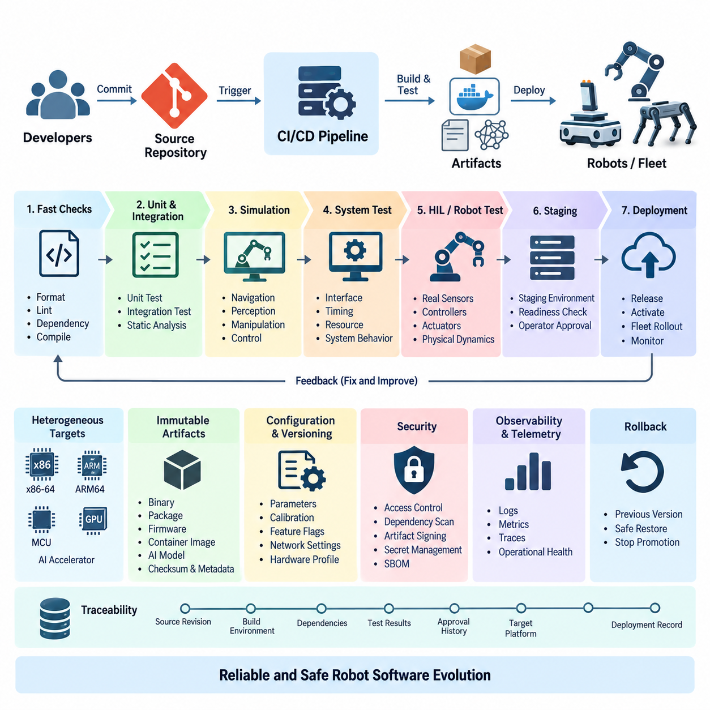
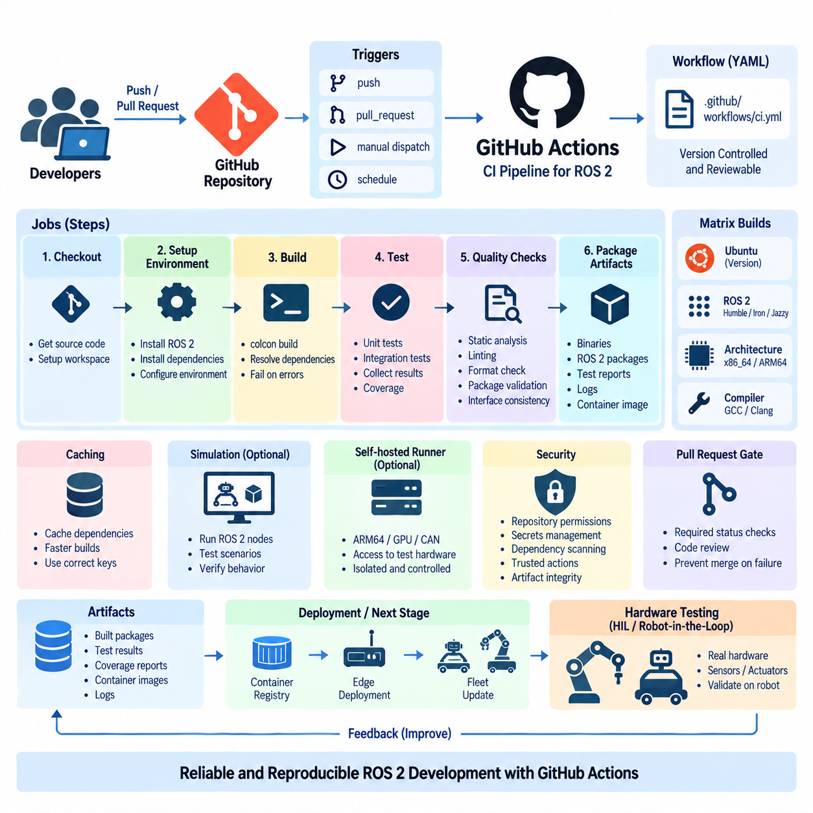
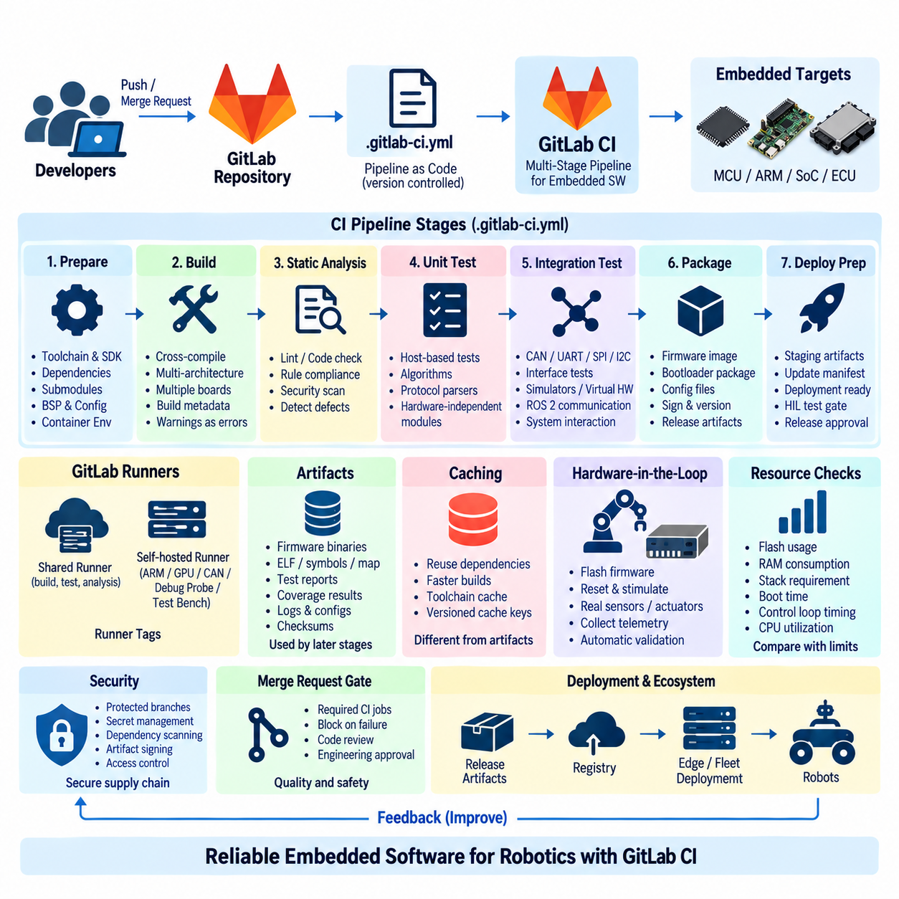
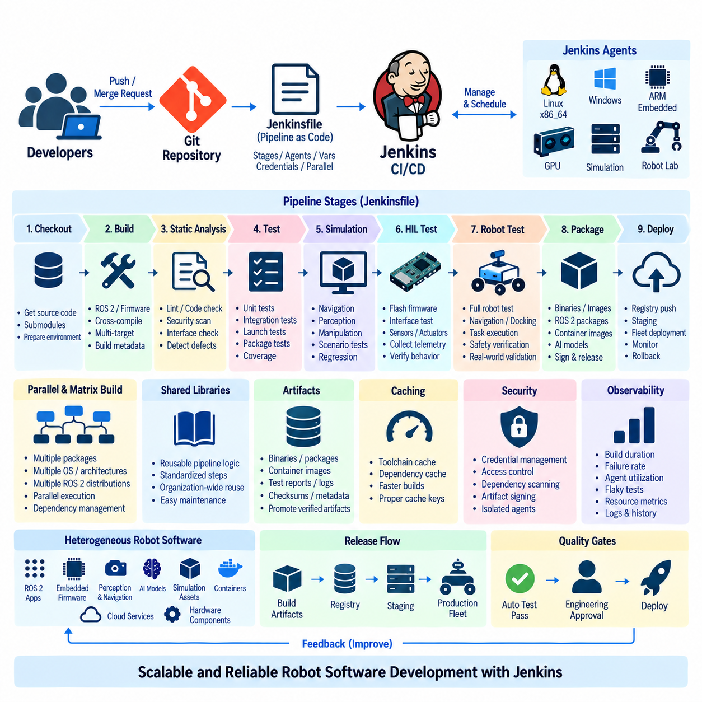
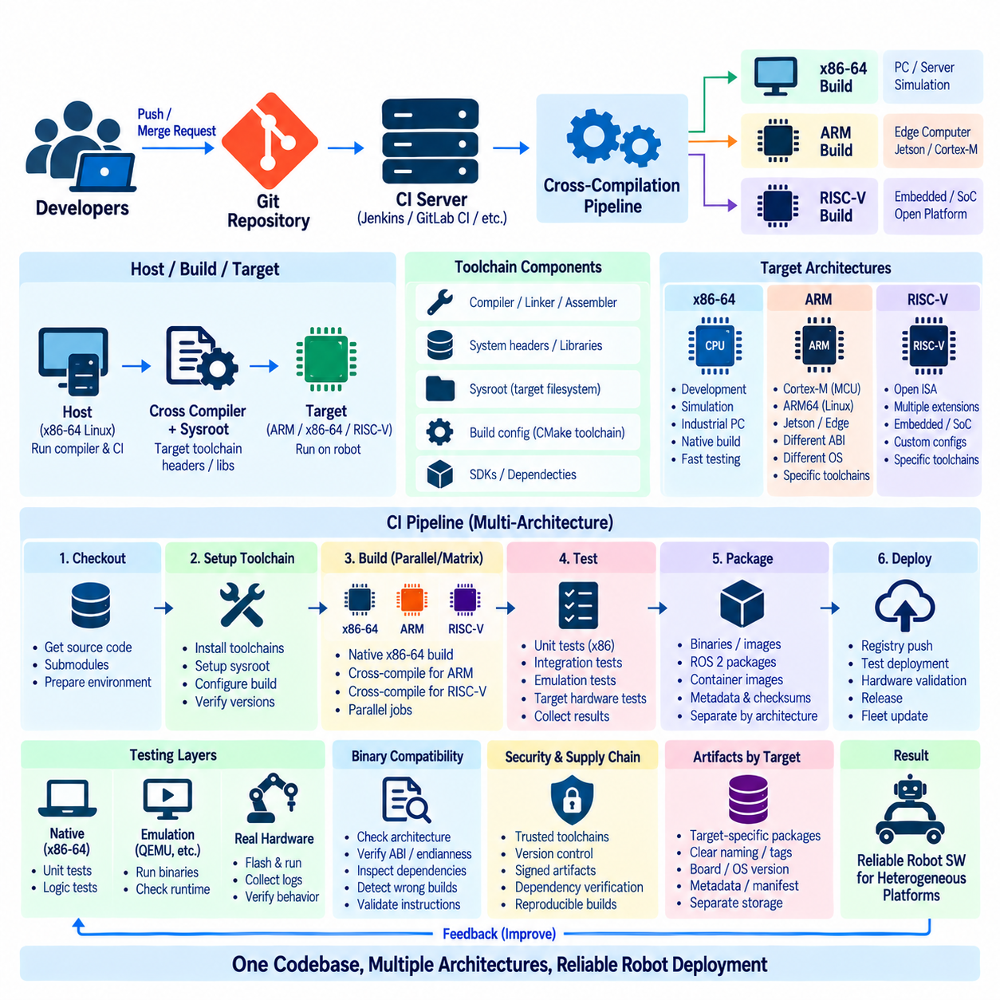
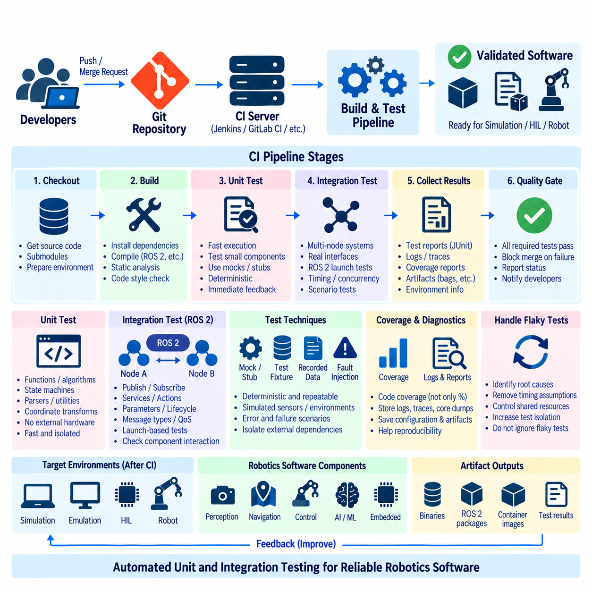
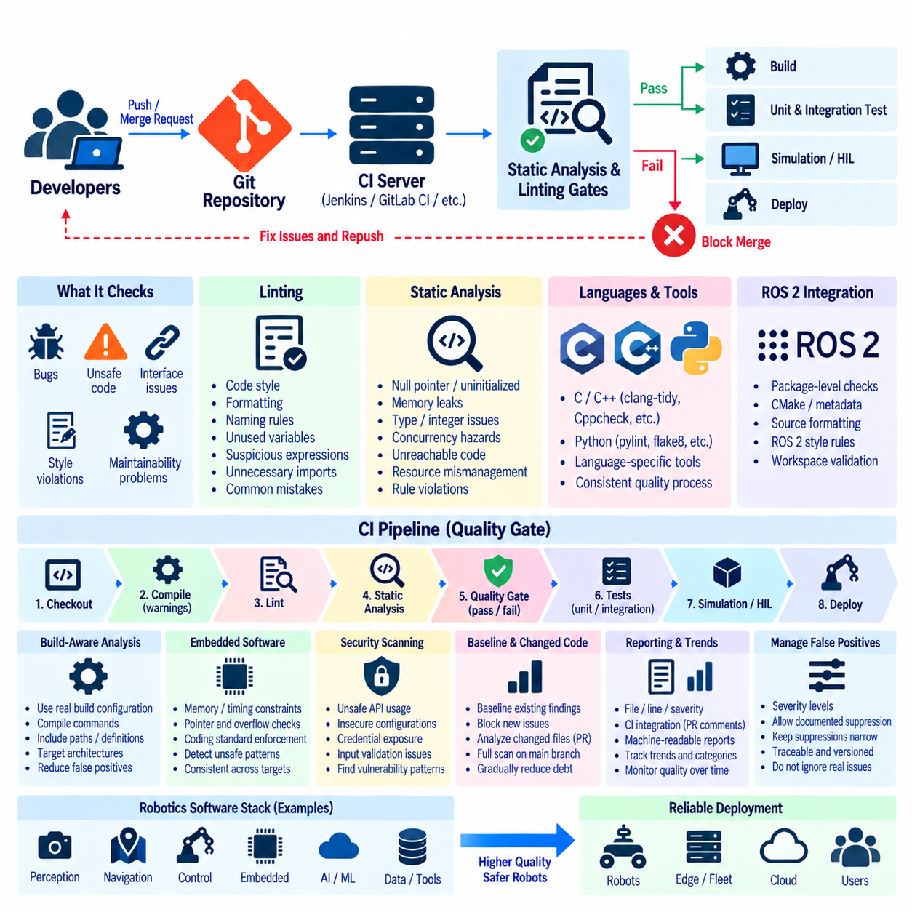
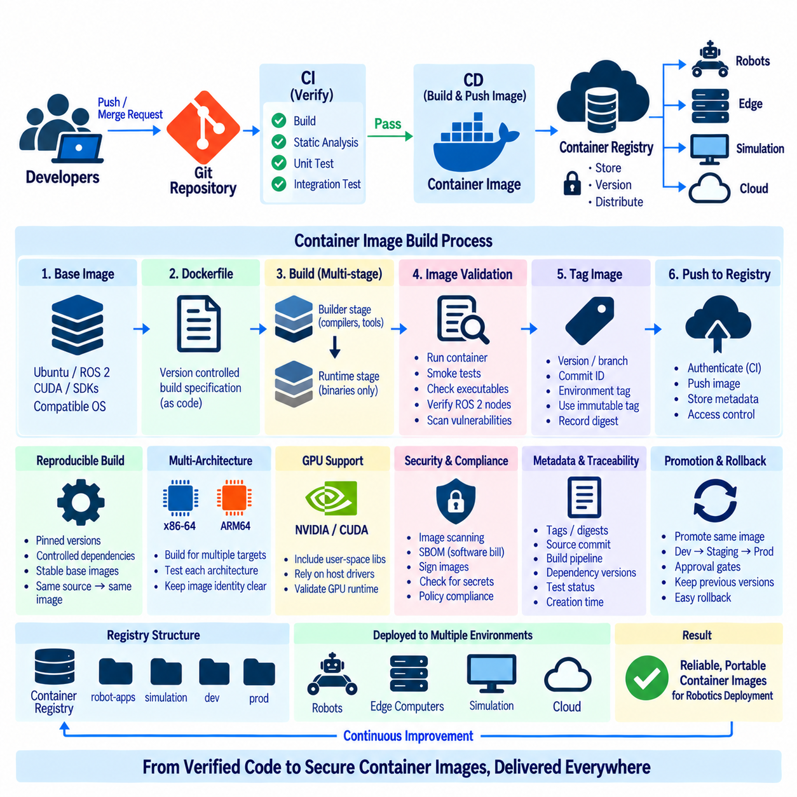
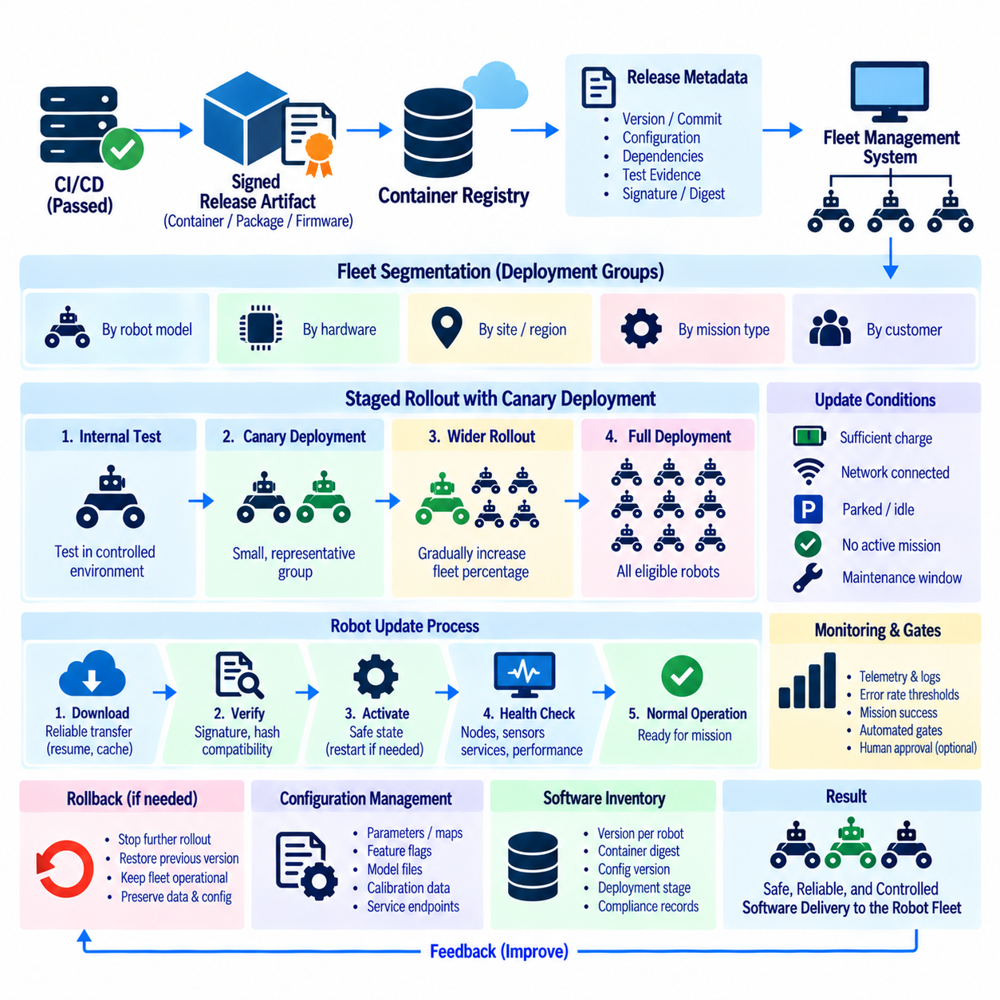
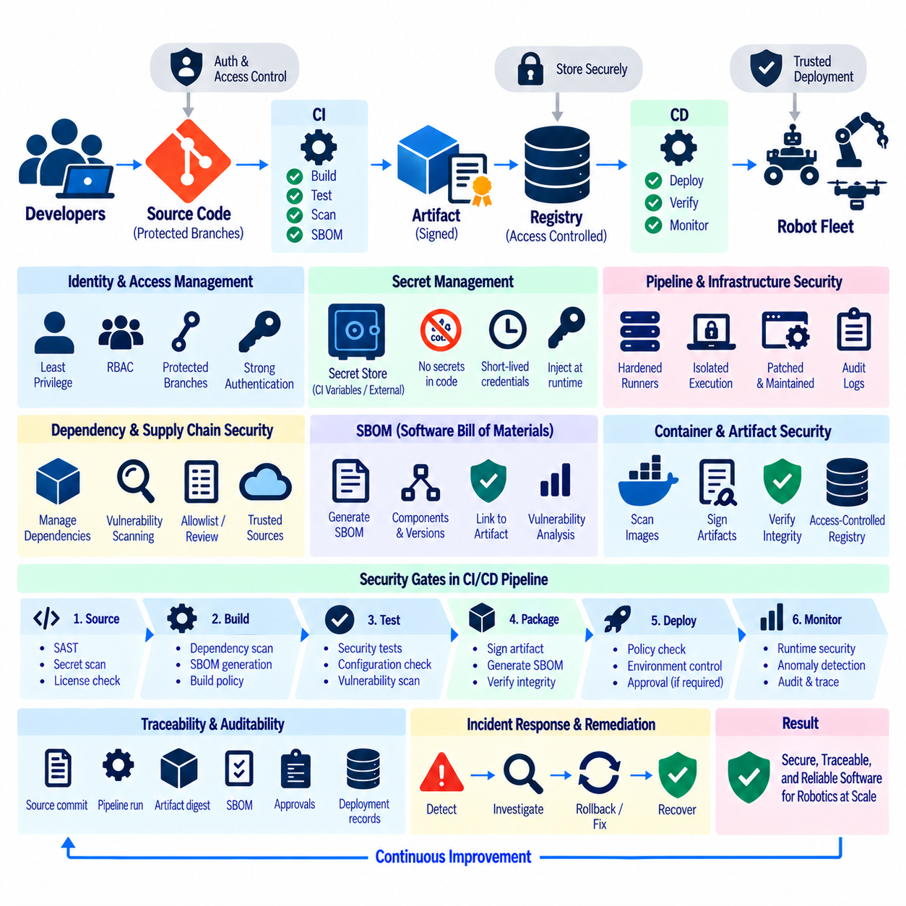

**Volume 10 Robot DevOps and MLOps**

# 2. CI/CD

## 2.1. CI CD Principles and Pipeline Architecture for Robotics

{width="7.268055555555556in" height="7.268055555555556in"}

Continuous Integration and Continuous Delivery provide a disciplined method for transforming frequent software changes into verified, deployable robot software. In robotics, the pipeline must handle more than application code because a release may combine ROS 2 packages, embedded firmware, device drivers, AI models, configuration files, containers, and hardware-specific dependencies.

Continuous Integration, or CI, begins when developers regularly merge changes into a shared repository. Each change automatically triggers activities such as dependency resolution, compilation, static analysis, unit testing, integration testing, and artifact generation. The objective is to detect defects close to the moment they are introduced rather than allowing incompatible changes to accumulate until a late system-integration phase.

Continuous Delivery extends this process by ensuring that software passing the required quality gates remains ready for deployment. Continuous Deployment goes further by automatically releasing approved artifacts to target environments. Robotics commonly requires a controlled interpretation of these practices because deploying software to a physical robot can affect motion, actuators, sensors, communication interfaces, and ultimately physical safety.

A robotics CI/CD architecture can therefore be viewed as a sequence of increasingly realistic verification environments. Source changes first pass inexpensive checks such as formatting, linting, dependency validation, and compilation. Successful builds proceed to unit and integration tests, followed by simulation, system tests, hardware-in-the-loop validation, staging environments, and finally controlled deployment to physical robots or fleets.

The pipeline should preserve the same software artifact as it progresses through these stages whenever practical. Rebuilding an application separately for testing and production creates the possibility that the deployed binary differs from the verified binary. Immutable binaries, packages, firmware images, container images, and AI model artifacts allow the pipeline to promote a known version while retaining its checksum, metadata, dependency information, and test evidence.

Robotics pipelines must also address heterogeneous computing targets. A development server may use an x86-64 processor while deployed robots use ARM64 processors, Jetson platforms, microcontrollers, or specialized AI accelerators. CI infrastructure therefore needs native builders or cross-compilation environments capable of producing reproducible artifacts for each supported target while maintaining consistent compiler versions, SDKs, libraries, and build options.

Pipeline stages should be separated according to cost and feedback speed. Fast checks belong near the beginning because they reject simple defects within minutes. Expensive simulation, GPU-based inference evaluation, hardware tests, and long-running regression suites can execute after basic quality gates succeed. This ordering reduces wasted infrastructure time while still allowing progressively stronger evidence before software reaches physical equipment.

Testing in robotics must cover interactions that conventional application pipelines may not encounter. A ROS 2 node can compile correctly while publishing an incorrect message rate, violating a timing constraint, using an incompatible QoS policy, or producing unstable behavior when connected to other nodes. CI should consequently validate interfaces, launch configurations, message contracts, timing assumptions, resource consumption, and system-level behavior in addition to source-level correctness.

Simulation provides an important bridge between software integration and physical deployment. A pipeline can automatically launch representative robot models and environments to exercise navigation, perception, manipulation, or control functions under repeatable scenarios. Simulation cannot reproduce every hardware characteristic, but it enables scalable regression testing and helps identify behavioral failures before scarce physical robots are allocated to testing.

Hardware-in-the-loop and robot-in-the-loop testing introduce real sensors, controllers, actuators, computing platforms, or complete robots into later pipeline stages. These tests can reveal failures caused by timing, electrical interfaces, device drivers, accelerator behavior, communication latency, or physical dynamics. Because hardware resources are limited, CI systems normally schedule them only after software has passed less expensive automated validation stages.

Deployment architecture must distinguish software release from software activation. A package can be transferred to a robot without immediately becoming the active runtime version. Separating these operations enables maintenance windows, readiness checks, operator approval, staged rollout, and coordinated activation across dependent components. It also provides a safer mechanism for preparing updates when robots have intermittent network connectivity.

Fleet deployment introduces another level of control. Instead of updating every robot simultaneously, a CD pipeline can deploy a release to development robots, internal test units, a small production subset, and progressively larger groups. Telemetry and operational health information from each stage can determine whether promotion continues. This approach limits the operational impact of defects that escaped pre-deployment testing.

Rollback capability is therefore a fundamental pipeline requirement rather than an optional recovery feature. Robots should retain or have reliable access to a previously validated software version, configuration set, firmware package, or container image. When deployment checks detect startup failure, abnormal resource consumption, degraded behavior, or communication problems, the system can stop promotion and restore a known operational baseline.

Configuration must be versioned together with software because robot behavior often depends as strongly on parameters as on executable code. Navigation limits, controller gains, sensor calibration references, feature flags, network settings, and hardware profiles should be traceable to specific releases. Separating configuration from undocumented manual changes improves reproducibility and allows engineers to reconstruct the exact operating state associated with a field failure.

Security must operate throughout the CI/CD architecture. Source repositories, build runners, package registries, signing keys, credentials, and deployment services are part of the robot software supply chain. Access control, isolated runners, protected branches, dependency scanning, artifact signing, secret management, and software bill of materials generation help prevent unauthorized or compromised components from progressing toward deployed robots.

Traceability connects source code to operational behavior. A production artifact should be associated with its source revision, build environment, dependency versions, test results, approval history, target platform, and deployment record. When a fleet reports a failure, engineers can then identify exactly which software and configuration were active, reproduce the relevant build, examine verification evidence, and determine which other robots may be affected.

A mature robotics CI/CD pipeline is therefore not simply an automation script that builds code and copies files to robots. It is an engineering control system that progressively converts source changes into trusted operational artifacts. By combining reproducible builds, layered verification, simulation, hardware testing, controlled fleet rollout, rollback, security, and traceability, CI/CD becomes a foundation for reliable large-scale robot software evolution.

## 2.2. GitHub Actions CI Pipeline for ROS2 Packages [w/Code]

{width="7.268055555555556in" height="7.268055555555556in"}

GitHub Actions provides a repository-integrated automation platform for implementing Continuous Integration pipelines for ROS 2 packages. In a robotics project, each push or pull request can automatically trigger compilation, dependency validation, static analysis, and testing. This converts repository activity into a repeatable verification process and gives developers rapid feedback before changes are merged into a shared development branch.

A GitHub Actions pipeline is defined through workflow files stored with the source code, normally under the repository's \`.github/workflows\` directory. Because the workflow definition is version controlled together with ROS 2 source code, changes to build and test procedures can be reviewed through the same pull request process. This makes the CI configuration itself traceable and reproducible instead of depending on manually configured build servers.

Workflow execution begins with events such as \`push\`, \`pull_request\`, manual dispatch, or scheduled execution. Robotics teams can use different triggers for different validation levels. A pull request may launch fast compilation and unit tests, while changes merged into the main branch can initiate broader integration tests, package generation, container builds, or preparation of artifacts for later deployment and hardware validation stages.

Each workflow consists of one or more jobs executed by GitHub-hosted or self-hosted runners. Jobs contain ordered steps that check out source code, prepare the operating system, install ROS 2 and project dependencies, build packages, execute tests, and collect results. Independent jobs can run in parallel, while dependencies between jobs allow expensive validation stages to begin only after earlier quality gates have succeeded.

ROS 2 projects are commonly organized as workspaces containing multiple packages with explicit package dependencies. A CI job must therefore reproduce the expected ROS 2 environment before compilation begins. The runner prepares the required ROS distribution, obtains external dependencies, sources the appropriate setup environment, and constructs the workspace so that package discovery and dependency relationships behave consistently with the developer and target environments.

Dependency management is especially important because ROS 2 applications frequently combine packages from the operating system, ROS repositories, third-party libraries, and project-specific source repositories. Automated dependency resolution reduces differences between developer machines and CI runners. Pinning important versions and recording the build environment also helps prevent a pipeline from producing different results merely because an external dependency changed unexpectedly.

Compilation is typically performed using the ROS 2 build system and the package metadata contained within the workspace. The CI pipeline should treat compiler errors and unresolved dependencies as immediate failures. For repositories containing many packages, selective builds can shorten feedback time, while periodic complete workspace builds can verify that apparently independent changes have not introduced incompatibilities elsewhere in the overall robot software stack.

Testing should occur immediately after a successful build. Unit tests verify individual algorithms and components, while integration tests examine interactions among ROS 2 nodes, libraries, interfaces, and services. Test results should be collected as machine-readable artifacts so that failures remain visible after a runner terminates. This allows developers to inspect which package, test case, or integration boundary caused the pipeline to fail.

ROS 2 CI should verify more than whether source code compiles. Static analysis, formatting checks, linting, package metadata validation, and interface consistency can be introduced as explicit quality gates. These inexpensive checks are particularly valuable near the beginning of the workflow because they reject basic defects before computationally expensive simulation or system-level validation resources are allocated to the change.

A matrix strategy allows the same workflow to validate several environments without duplicating the complete pipeline definition. A project may test supported operating-system versions, ROS 2 distributions, compiler configurations, or processor-oriented build settings through separate matrix jobs. This is useful when robot software must remain compatible with development workstations, edge computers, embedded targets, and multiple generations of deployed hardware.

Caching can significantly reduce CI execution time, but it must be used carefully. Repeated downloading or rebuilding of unchanged dependencies wastes runner resources, whereas incorrect caches can hide dependency problems or introduce non-reproducible behavior. Cache keys should therefore reflect relevant operating-system, ROS distribution, dependency, and build configuration changes so that performance improvements do not compromise the reliability of validation.

Artifacts provide the connection between CI verification and later delivery stages. Successful jobs can preserve binaries, ROS packages, test reports, coverage information, logs, firmware components, or container-related outputs. Downstream jobs should consume these verified artifacts rather than rebuilding equivalent software independently whenever possible. This supports the principle that the artifact tested by the pipeline should remain identifiable throughout subsequent deployment stages.

Containerized build environments can further improve reproducibility when ROS 2 projects depend on complex combinations of system libraries, CUDA versions, device SDKs, or specialized middleware. A controlled container image gives the runner a predictable environment and reduces configuration drift. The resulting image or packaged application can later become an input to container registry, edge deployment, and fleet update workflows addressed by downstream CI/CD processes.

Self-hosted runners become important when standard hosted environments cannot reproduce robot-specific hardware conditions. A runner located inside the development infrastructure may provide ARM64 processors, NVIDIA GPUs, CAN interfaces, sensors, or access to dedicated test equipment. Such runners should be isolated and carefully controlled because CI jobs execute repository-provided instructions and may interact with valuable hardware or internal network resources.

GitHub Actions can also coordinate simulation-based verification before physical hardware is used. After compilation and basic testing succeed, a workflow can launch a predefined simulation environment, execute representative ROS 2 nodes, and evaluate expected behavior. Navigation, perception, manipulation, communication, and lifecycle behavior can therefore be regression-tested automatically before a software revision proceeds toward hardware-in-the-loop or robot-in-the-loop testing.

Security controls must be integrated into the workflow rather than added only at deployment time. Repository permissions, protected branches, workflow permissions, secrets, dependency scanning, artifact integrity, and third-party actions all influence the software supply chain. Secrets should not be embedded in workflow files, and external actions should be selected and versioned carefully because they execute as part of the trusted build and validation environment.

Pull requests provide a natural quality boundary for ROS 2 development. Required status checks can prevent merging until designated workflows have completed successfully, while code review examines architectural and behavioral issues that automated tests may not detect. Together, automated CI and human review establish a controlled path from individual developer changes to the shared software baseline used by the robot development organization.

A mature GitHub Actions pipeline therefore acts as more than a remote ROS 2 build service. It connects repository events, reproducible environments, dependency management, compilation, automated testing, static analysis, simulation, artifacts, security controls, and merge policies into one traceable workflow. This foundation enables later stages such as container delivery, staged fleet deployment, hardware-in-the-loop testing, and continuous robot software evolution.

## 2.3. GitLab CI Multi Stage Pipeline for Embedded SW [w/Code]

{width="7.268055555555556in" height="7.268055555555556in"}

GitLab CI provides an integrated automation framework for building multi-stage pipelines that can manage the complexity of embedded software used in robotic systems. Unlike conventional application software, embedded robot software may include microcontroller firmware, real-time control code, hardware abstraction layers, communication drivers, bootloaders, and board-specific configurations. A structured pipeline allows these components to be verified systematically before they reach physical hardware.

A GitLab CI pipeline is normally defined in a version-controlled \`.gitlab-ci.yml\` file located with the project source code. This file describes pipeline stages, jobs, execution rules, dependencies, variables, artifacts, and runner requirements. Keeping the pipeline definition beside the embedded software means that changes to build procedures are reviewed and versioned together with the source code, creating a reproducible relationship between a software revision and its validation process.

Multi-stage design divides verification into ordered layers such as preparation, build, static analysis, unit testing, integration testing, packaging, and deployment preparation. Jobs within the same stage can execute in parallel when they are independent, while later stages depend on successful completion of required earlier jobs. This structure prevents expensive hardware or system-level testing from consuming resources when basic compilation or software-quality checks have already failed.

The preparation stage establishes a deterministic build environment. It can obtain toolchains, SDKs, libraries, submodules, board support packages, and project dependencies required by the target platform. Embedded development often depends strongly on exact compiler and vendor SDK versions, so these dependencies should be controlled rather than implicitly inherited from a developer workstation. Containerized runners can further improve consistency between local development and CI execution.

The build stage transforms source code into target-specific binaries. A robotics repository may need separate jobs for ARM-based Linux computers, Cortex-M microcontrollers, real-time processors, or other embedded targets. Cross-compilation enables powerful x86-64 CI servers to generate software for these architectures. Matrix-like job definitions and reusable templates can reduce duplication when several boards share most of the same build procedure but require different toolchains or compile options.

Compilation should be treated as a quality gate rather than merely an artifact-generation step. Compiler warnings can be promoted to errors for critical modules, while configuration errors, unresolved symbols, incompatible interfaces, or excessive binary size can cause immediate pipeline failure. Build metadata should record the source revision, compiler version, target board, build type, and relevant options so that the generated firmware can later be reproduced and investigated.

Static analysis provides another early verification layer before physical hardware is involved. Linters, coding-rule checkers, compiler diagnostics, and specialized analyzers can identify suspicious memory operations, unreachable code, unsafe conversions, concurrency problems, or violations of project coding standards. Because these checks require relatively little hardware infrastructure, they can run automatically for merge requests and prevent avoidable defects from progressing into later test stages.

Unit testing separates embedded logic from physical devices wherever practical. Control algorithms, state machines, protocol parsers, diagnostic functions, mathematical routines, and hardware-independent libraries can often execute on a host runner. Host-based testing provides rapid feedback and high test throughput, while target-based tests can subsequently verify assumptions that depend on processor architecture, timing behavior, memory layout, or embedded runtime characteristics.

Integration testing examines interactions among firmware modules and external interfaces. Communication through CAN, UART, SPI, I2C, Ethernet, or other interfaces may require simulators, virtual devices, or dedicated test fixtures. For robotic systems, these tests can also verify exchanges between low-level controllers and higher-level software such as ROS 2 nodes. The objective is to detect interface and protocol failures before complete robot-level validation becomes necessary.

GitLab Runner provides the execution layer for pipeline jobs. Shared runners may handle generic compilation and analysis, whereas self-hosted runners can provide specialized toolchains, ARM machines, GPUs, debugging probes, CAN interfaces, programmable power supplies, or access to test benches. Runner tags allow jobs to request appropriate infrastructure, ensuring that hardware-dependent tasks are scheduled only on systems capable of executing them safely and correctly.

Artifacts transfer verified outputs between pipeline stages. Firmware binaries, ELF files, symbol information, map files, test reports, coverage results, logs, configuration packages, and checksums can be retained after individual jobs finish. Later stages should consume these artifacts instead of rebuilding software independently whenever possible. This maintains a direct relationship between the software that passed verification and the binary eventually prepared for deployment.

Caching serves a different purpose from artifacts. A cache accelerates repeated jobs by preserving reusable dependencies, compiler downloads, or intermediate resources, while artifacts represent outputs that must remain associated with a particular pipeline execution. Confusing the two can weaken reproducibility. Cache keys should therefore reflect relevant toolchain and dependency versions, while release-relevant binaries should be managed as immutable pipeline artifacts.

Hardware-in-the-loop testing can be introduced after software-only stages have succeeded. A dedicated runner may flash firmware onto an embedded controller, reset the target, stimulate digital or communication interfaces, collect telemetry, and evaluate expected responses. More advanced test benches can connect real motor controllers, sensors, actuators, or robot subsystems, allowing timing and hardware interaction problems to be detected automatically before deployment to complete robots.

Embedded pipelines must also consider resource constraints that conventional server applications rarely face. Flash usage, RAM consumption, stack requirements, boot time, control-loop timing, communication latency, and CPU utilization may all determine whether a build is acceptable. CI can compare these metrics with predefined limits or previous baselines, allowing a functionally correct change to be rejected when it creates unacceptable resource growth or real-time performance degradation.

Release packaging converts verified outputs into deployable units. Depending on the target, this may include firmware images, bootloader-compatible packages, update manifests, configuration files, cryptographic signatures, and version metadata. The package should preserve a clear identity linking it to the source revision and pipeline that produced it. This relationship becomes essential when robots deployed in the field must be diagnosed, updated, or rolled back.

Security controls should protect both the CI infrastructure and the embedded software supply chain. Protected branches, restricted runners, controlled variables, secret management, dependency scanning, artifact signing, and access policies reduce the possibility that unauthorized code or credentials enter the build process. Hardware-connected runners require particular protection because malicious or erroneous jobs could potentially reprogram devices or interfere with laboratory equipment.

Merge requests can combine automated pipeline results with human engineering review. Required jobs can prevent merging when compilation, tests, analysis, or target validation fails, while reviewers evaluate architectural changes and hardware implications that automated checks cannot fully understand. This establishes a controlled transition from an individual firmware modification to a shared embedded software baseline suitable for system integration and robot testing.

A mature GitLab CI multi-stage pipeline therefore becomes an engineering backbone for embedded robotic software rather than simply a remote compiler. It connects source control, reproducible toolchains, cross-compilation, static analysis, automated tests, hardware runners, artifacts, resource checks, security, and release packaging into a traceable sequence. This foundation supports reliable integration of embedded controllers with the broader ROS 2, edge-computing, and robot deployment architecture.

## 2.4. Jenkins Pipeline for Large Scale Robot SW Projects [w/Code]

{width="7.268055555555556in" height="7.268055555555556in"}

Jenkins provides a highly extensible automation platform for constructing Continuous Integration and Continuous Delivery pipelines for large-scale robot software projects. Such projects may combine ROS 2 applications, embedded firmware, perception and navigation modules, AI models, simulation assets, containers, cloud services, and hardware-specific components. Jenkins coordinates these heterogeneous elements through repeatable workflows that can scale across multiple development teams and computing environments.

A Jenkins pipeline is commonly defined as code in a version-controlled \`Jenkinsfile\`, allowing the build and validation process to evolve together with the robot software. Declarative or scripted pipeline definitions can describe stages, agents, environment variables, credentials, conditions, parallel execution, and post-build actions. Pipeline-as-code also makes changes reviewable and helps engineers reconstruct the automation logic associated with a particular software revision.

Large robotics repositories rarely require every component to use the same execution environment. Jenkins addresses this through a controller-agent architecture in which the controller coordinates jobs while agents provide the actual computing resources. Different agents can be prepared for Linux builds, Windows tools, ARM targets, GPU workloads, embedded toolchains, simulation servers, or physical robot laboratories, allowing each task to execute on suitable infrastructure.

A typical pipeline begins with source checkout and environment preparation before progressing through compilation, analysis, testing, packaging, and deployment preparation. Early stages should perform inexpensive checks rapidly so that obvious defects are rejected before costly resources are allocated. Later stages can introduce increasingly realistic environments, including simulation, hardware-in-the-loop testing, robot-in-the-loop validation, and controlled deployment to staging fleets.

Parallel execution is particularly valuable for large robot software stacks. Independent ROS 2 packages, firmware targets, operating-system configurations, simulation scenarios, and AI inference tests can execute simultaneously on different agents. This reduces overall feedback time compared with sequential processing. Jenkins can also coordinate dependencies so that downstream stages begin only when the required upstream builds and verification tasks have completed successfully.

Matrix-style validation can extend this approach across heterogeneous targets. A project may need to verify x86-64 development systems, ARM64 edge computers, Jetson platforms, microcontrollers, or several ROS 2 distributions and compiler configurations. Jenkins can distribute these combinations across appropriately labeled agents, enabling one logical pipeline to verify software compatibility across the hardware and software variants used throughout a robot product family.

Build reproducibility is essential when hundreds of software components and external dependencies are involved. Jenkins agents should therefore use controlled toolchains, containers, dependency versions, and environment definitions rather than relying on manually configured machines. Ephemeral container-based agents can provide clean environments for generic builds, while persistent specialized agents may remain necessary for proprietary SDKs, GPUs, debugging interfaces, or physical test equipment.

ROS 2 integration requires more than successful compilation. Jenkins can execute workspace builds, package tests, launch tests, linting, interface checks, and system-level validation while preserving reports for later inspection. Failures should identify the affected package or subsystem rather than presenting only a generic pipeline failure. This becomes increasingly important as navigation, perception, control, communication, and fleet software are developed by different teams.

Large projects benefit from separating reusable pipeline logic from project-specific configuration. Jenkins Shared Libraries can encapsulate common functions for source checkout, ROS 2 environment preparation, compilation, testing, artifact publication, container creation, and deployment procedures. Teams can then reuse standardized pipeline behavior without copying large scripts between repositories, while centrally maintained libraries allow organization-wide improvements to propagate systematically.

Artifacts connect the many stages of a distributed Jenkins pipeline. Successful builds can preserve binaries, ROS packages, firmware images, container images, AI model packages, test reports, logs, checksums, and metadata. Later stages should promote verified artifacts instead of independently rebuilding equivalent software whenever possible. This maintains traceability between the exact output that passed validation and the version eventually delivered to a robot or fleet.

Simulation can consume substantial CPU and GPU resources, making scheduling an important architectural concern. Jenkins can route simulation jobs to dedicated agents and execute scenarios in parallel when infrastructure permits. Navigation regressions, perception pipelines, manipulation tasks, communication failures, and environmental variations can therefore be tested before scarce physical robots are reserved, while failed simulations can prevent unnecessary progression to hardware validation.

Hardware-in-the-loop testing introduces specialized Jenkins agents connected to embedded controllers, sensors, actuators, network equipment, or complete robot subsystems. Pipeline jobs may flash firmware, start ROS 2 nodes, stimulate interfaces, collect telemetry, and evaluate expected behavior. Resource locking is important because multiple jobs must not attempt to control the same robot or test bench simultaneously, especially when motion-producing hardware is involved.

Robot-in-the-loop stages can extend validation to complete physical platforms after software and subsystem tests have passed. Dedicated test robots may execute predefined navigation, docking, manipulation, communication, or safety scenarios while Jenkins records results. Because physical testing is slower and more expensive than software testing, pipelines should reserve these resources for revisions that have already passed compilation, static analysis, unit tests, integration tests, and simulation.

Jenkins can also coordinate container-oriented delivery for robot edge computers. Verified software may be assembled into versioned container images and transferred to a registry, while metadata links each image to its source revision and test history. Subsequent deployment stages can promote the same image through development, staging, and production environments, reducing differences between what was tested and what ultimately executes on deployed robots.

Security becomes increasingly important as Jenkins gains access to repositories, registries, cloud infrastructure, signing keys, internal networks, and physical hardware. Credentials should be managed through controlled credential mechanisms rather than embedded in pipeline scripts. Agent permissions, plugin governance, access control, artifact signing, dependency scanning, and isolation of untrusted jobs help protect both the automation infrastructure and the robot software supply chain.

Observability of the CI/CD infrastructure is necessary at large scale. Teams should track queue time, build duration, failure rate, agent utilization, flaky tests, simulation capacity, and hardware-test availability. These metrics reveal whether slow feedback originates from software complexity or insufficient infrastructure. Logs and historical build records also provide evidence for diagnosing recurring failures and improving pipeline efficiency over time.

Pipeline gates provide controlled transitions between increasingly critical environments. A failed test should stop dependent stages, while selected releases may require engineering approval before hardware testing or fleet deployment. Combined with protected source branches and code review, these gates prevent an individual change from bypassing the verification process and provide a clear path from developer commits to an approved robot software baseline.

For large-scale robot software, Jenkins therefore functions as an orchestration layer connecting distributed repositories, heterogeneous build agents, ROS 2 testing, embedded targets, simulation infrastructure, GPU resources, hardware laboratories, artifacts, security controls, and deployment systems. Its value lies not simply in automating individual jobs, but in coordinating the complete verification path required to evolve complex robot software safely, reproducibly, and at organizational scale.

## 2.5. Cross Compilation CI ARM x86 RISC V Targets [w/Code]

{width="7.268055555555556in" height="7.268055555555556in"}

Cross-compilation is a software development technique in which source code is compiled on one processor architecture while the resulting executable is intended to run on another. In robotics, powerful x86-64 workstations or CI servers may build software for ARM64 edge computers, ARM microcontrollers, or RISC-V processors. This approach enables centralized and automated builds without requiring every target device to perform its own compilation.

A cross-compilation environment consists of more than a compiler. It normally includes a target-specific compiler, linker, assembler, system headers, runtime libraries, sysroot, build-system configuration, and architecture-specific dependencies. These components must represent the target environment accurately. If the build system accidentally uses host libraries or headers, compilation may succeed while producing binaries that cannot execute correctly on the intended robot hardware.

The host, build, and target concepts should therefore be clearly distinguished. The host system executes the compiler and CI jobs, while the target architecture executes the generated software. In many robotics environments, an x86-64 Linux server acts as the host while ARM64 or RISC-V Linux computers operate inside robots. Microcontroller firmware introduces additional targets where no general-purpose operating system or conventional Linux runtime is available.

ARM targets are common in robotics because they span embedded microcontrollers and high-performance edge computers. CI pipelines may build firmware for Cortex-M devices while separately producing Linux applications for ARM64 processors or Jetson-class platforms. Although these targets belong to the broader ARM ecosystem, their execution environments, application binary interfaces, operating systems, floating-point options, and toolchains can differ substantially and must be treated as distinct build configurations.

x86-64 remains important as both a development architecture and a deployment target. Engineering workstations, simulation servers, industrial PCs, and some robot edge computers use x86-64 processors. Maintaining native x86 builds alongside cross-compiled ARM or RISC-V builds provides fast feedback because many unit and integration tests can execute directly on CI runners before target-specific binaries proceed to emulation, hardware testing, or physical robot validation.

RISC-V introduces an open instruction-set architecture that is increasingly relevant to embedded and specialized computing. A CI pipeline targeting RISC-V must define the required instruction-set extensions, application binary interface, compiler configuration, and runtime environment explicitly. A generic label such as RISC-V is insufficient because implementations may support different combinations of integer, multiplication, atomic, floating-point, compressed-instruction, vector, or other extensions.

Toolchain version control is essential for reproducible cross-compilation. Different compiler releases can change optimization behavior, warnings, generated instructions, binary size, or library compatibility. CI environments should therefore identify and control compiler versions, binutils, C/C++ standard libraries, SDKs, and target runtime components. Container images or immutable build environments can package these dependencies so that developers and automated runners use consistent toolchains.

A sysroot provides the filesystem view required by the cross-compiler for a target Linux environment. It may contain target headers, shared libraries, startup files, and other development resources corresponding to the robot computer. The sysroot should match the deployed operating-system image closely. An outdated or inconsistent sysroot can produce binaries that link successfully during CI but fail on the robot because required library versions or symbols are unavailable.

Build systems must also understand that compilation is targeting a different architecture. CMake toolchain files can define the target system, processor, compiler, sysroot, search paths, and related options. In ROS 2 projects, these settings must cooperate with the workspace build process and package dependency structure. Architecture assumptions hidden inside individual packages can otherwise cause failures when software that worked on x86-64 is cross-compiled for ARM64 or RISC-V.

CI pipelines can organize multi-architecture builds as parallel jobs or build matrices. A single source revision may trigger native x86-64 compilation together with ARM64, embedded ARM, and RISC-V cross-builds. Architecture-specific failures then become visible before changes are merged. Parallel execution also reduces total validation time, especially when different targets require independent toolchains, SDKs, operating-system images, or compiler options.

Not every test needs to execute on the final architecture. Hardware-independent algorithms, parsers, mathematical functions, state machines, and many ROS 2 components can first be tested natively on x86-64 runners. Target binaries can then undergo architecture-specific validation using emulation or real hardware. Separating portable functional tests from target-dependent tests provides rapid feedback while preserving verification of architecture-specific behavior.

Emulation provides an intermediate layer between cross-compilation and physical hardware testing. User-mode or system-level emulators can execute some ARM or RISC-V binaries on x86-64 infrastructure, allowing CI to detect instruction-set, dynamic-linking, startup, and runtime problems. Emulation does not reproduce every timing, peripheral, accelerator, or hardware behavior, so successful emulated execution should not be treated as a complete substitute for target hardware validation.

Target-based testing verifies the assumptions that cross-compilation alone cannot prove. A self-hosted runner or laboratory controller can transfer artifacts to an ARM or RISC-V device, launch the application, collect logs, execute tests, and return results to the CI system. Embedded firmware can similarly be flashed onto development boards. This stage confirms that the generated artifact actually starts and operates in the intended processor and runtime environment.

Hardware-specific acceleration requires additional attention. Robot computers may combine ARM or x86 CPUs with GPUs, NPUs, DSPs, or other accelerators whose SDKs and runtime libraries are architecture dependent. Cross-compiling perception or AI applications therefore requires compatible headers and libraries for both the CPU architecture and accelerator stack. CI should distinguish compile-time availability from runtime validation on hardware containing the actual accelerator.

Binary compatibility should be treated as an explicit quality requirement. Architecture, ABI, endianness, instruction extensions, dynamic-linker paths, and library versions determine whether an executable can run on its target. CI jobs can inspect generated binaries and metadata before deployment, helping detect accidental host builds or unsupported instructions. Such checks are inexpensive compared with diagnosing incompatible binaries after they have reached physical robots.

Artifacts should remain clearly separated by architecture and target profile. Package names, directory structures, container tags, firmware metadata, or release manifests can encode the target architecture, board, operating-system version, and software revision. This prevents an ARM64 package from being mistaken for an x86-64 build or a RISC-V binary from being deployed to an incompatible processor variant within a heterogeneous robot fleet.

Security and supply-chain controls also apply to cross-compilation. Toolchains, sysroots, SDKs, container images, and external libraries become part of the trusted build environment and should be obtained from controlled sources and versioned where practical. Generated artifacts can be checksummed or signed, while CI records preserve the source revision and toolchain identity associated with each build. This improves both integrity and later incident investigation.

A mature cross-compilation CI architecture therefore combines native builds, controlled toolchains, sysroots, architecture-aware build configuration, parallel multi-target jobs, emulation, and target hardware testing. x86-64 can provide high-speed development and CI execution, while ARM and RISC-V artifacts are produced and validated through progressively more target-specific stages. This allows one robot software codebase to evolve reliably across increasingly heterogeneous computing platforms.

## 2.6. Automated Unit and Integration Test in CI [w/Code]

{width="7.268055555555556in" height="7.268055555555556in"}

Automated unit and integration testing is a central quality mechanism in Continuous Integration for robotics software. Every relevant source change can trigger repeatable tests that verify individual functions and interactions among software components before code is merged or released. For robot systems combining ROS 2, embedded controllers, perception, navigation, and AI modules, automated testing reduces the risk of defects propagating into expensive simulation or physical hardware stages.

Unit tests focus on the smallest practical software components in isolation. Mathematical functions, state machines, path-processing algorithms, protocol parsers, coordinate transformations, diagnostic logic, and utility libraries can be tested with predefined inputs and expected outputs. Because these tests normally require little external infrastructure, they execute quickly and should provide developers with immediate feedback when a local code change alters expected behavior.

Good unit tests should be deterministic, independent, and repeatable. The same software revision and test input should produce the same result regardless of execution order or unrelated system state. Dependencies such as sensors, databases, network services, clocks, or hardware interfaces can be replaced with mocks, stubs, or controlled test doubles. This isolates the component under test and makes failures easier to reproduce and diagnose inside a CI environment.

Integration tests examine whether multiple components operate correctly when connected through their real interfaces. In ROS 2 systems, this may involve publishers, subscribers, services, actions, lifecycle nodes, parameters, and launch configurations. A component can pass every unit test while still failing when message types, namespaces, Quality of Service policies, initialization sequences, or timing assumptions differ between interacting nodes.

A CI pipeline should normally execute inexpensive unit tests before more resource-intensive integration tests. Source checkout, dependency preparation, compilation, static checks, and unit tests form an early verification layer. Only successful revisions should proceed to integration environments requiring multiple processes, middleware communication, databases, containers, simulators, or specialized hardware. This ordering shortens feedback time and reduces unnecessary consumption of shared infrastructure.

ROS 2 provides testing mechanisms that can be incorporated directly into package build and test workflows. Tests can be associated with individual packages and executed automatically after compilation, while launch-based tests can start several nodes and evaluate their interactions. CI systems should collect structured test results and logs so that developers can identify the failing package, node, interface, or assertion without manually reproducing the entire robot environment.

Interface testing is particularly important in distributed robot software. Message definitions, service contracts, action interfaces, topic names, parameter schemas, and serialization assumptions may evolve independently across repositories or teams. Automated tests can verify that producers and consumers remain compatible. Contract-oriented testing helps detect breaking changes before they propagate through perception, planning, control, fleet management, or cloud-connected services.

Timing and concurrency introduce additional challenges that ordinary application tests may not expose. Robot software frequently contains asynchronous callbacks, multi-threaded executors, sensor streams, timers, and real-time or near-real-time control loops. Integration tests should therefore examine startup ordering, timeout handling, race conditions, synchronization, message frequency, and recovery behavior. Repeated execution can also help expose intermittent failures that appear only under particular scheduling conditions.

Test fixtures create controlled environments in which repeatable integration scenarios can be executed. A fixture may provide predefined configuration files, recorded sensor data, simulated messages, temporary databases, virtual network endpoints, or mock hardware interfaces. By resetting these resources before each test, CI can prevent one test from contaminating another. Reproducible fixtures are especially valuable when diagnosing failures that otherwise depend on complex robot state.

Recorded datasets can support deterministic testing of perception and sensor-processing software. Instead of requiring a live camera, LiDAR, IMU, or GNSS receiver for every CI run, selected recordings can provide known input sequences. Algorithms can then be evaluated against expected outputs, tolerances, or performance metrics. Such tests do not replace real sensor validation, but they allow frequent regression checks without consuming physical laboratory resources.

Fault injection expands integration testing beyond normal operating conditions. Tests can deliberately introduce delayed messages, missing sensor data, malformed packets, network interruption, unavailable services, invalid parameters, or simulated component failures. Robot software should respond predictably through retries, degraded operation, safe shutdown, or error reporting. Automating these scenarios helps verify resilience rather than testing only ideal execution paths.

Test coverage provides visibility into which parts of the software are exercised by automated tests, but coverage percentage alone does not demonstrate correctness. High coverage can coexist with weak assertions or missing behavioral scenarios. CI should therefore use coverage as diagnostic evidence rather than as the sole quality objective. Changes to safety-critical, control, communication, or recovery logic may require focused tests even when overall coverage already appears high.

Flaky tests are particularly damaging to CI because they sometimes pass and sometimes fail without a relevant software change. Common causes include timing assumptions, uncontrolled concurrency, external services, shared state, resource exhaustion, and nondeterministic data. Repeatedly ignoring such failures weakens confidence in the entire pipeline. Teams should identify, isolate, investigate, and repair flaky tests rather than routinely rerunning them until they pass.

Parallel test execution can reduce feedback time for large robotics repositories. Independent package tests or integration suites can run simultaneously on multiple CI workers, while dependencies determine which suites must remain sequential. Parallelization must not introduce hidden interference through shared ports, files, devices, databases, or ROS domains. Test isolation and explicit resource allocation therefore become increasingly important as CI infrastructure scales.

Failures should produce useful diagnostic evidence. CI systems can retain test reports, console logs, ROS 2 logs, core dumps, traces, coverage data, configuration snapshots, and selected runtime artifacts. For integration tests, recording the software versions and environment used during execution is equally important. A failure that cannot be reproduced or associated with its exact configuration provides limited engineering value even when the pipeline correctly marks it as failed.

Automated tests should function as explicit quality gates. A failed required unit or integration test should prevent the affected revision from progressing toward release unless an authorized process deliberately overrides the gate. Pull requests or merge requests can require successful test status before integration into protected branches. This converts automated testing from optional developer assistance into an enforceable part of the software engineering process.

Unit and integration tests should also connect naturally to later verification layers. Software that passes host-based tests may proceed to simulation, emulation, hardware-in-the-loop, and robot-in-the-loop validation. Each layer addresses different failure modes, so no single stage is sufficient by itself. Fast software tests provide broad and frequent feedback, while progressively more realistic environments verify assumptions that cannot be reproduced through isolated software execution.

A mature CI testing architecture therefore combines deterministic unit tests, interface-aware integration tests, controlled fixtures, recorded data, fault injection, coverage analysis, failure diagnostics, and enforceable quality gates. By automatically executing these mechanisms whenever robot software changes, development teams can detect regressions close to their origin and reserve expensive simulation and physical robot resources for revisions that have already demonstrated a strong software-level baseline.

## 2.7. Static Analysis and Linting Gates in CI [w/Code]

{width="7.268055555555556in" height="7.268055555555556in"}

Static analysis and linting provide an early quality-control layer in Continuous Integration by examining source code without requiring the complete robot system to execute. In robotics projects, these checks can detect programming defects, unsafe constructs, inconsistent interfaces, style violations, and maintainability problems before expensive simulation or hardware testing begins. CI gates convert these checks from optional developer tools into repeatable requirements for every relevant software change.

Linting focuses primarily on source consistency, coding conventions, and common programming mistakes. A linter can identify unused variables, suspicious expressions, inconsistent formatting, naming violations, unnecessary imports, or patterns associated with likely defects. Although many findings appear minor individually, enforcing consistent rules reduces ambiguity during code review and prevents low-level issues from accumulating across large ROS 2, embedded, perception, and control codebases.

Static analysis performs deeper examination of program structure and behavior without executing the application under normal runtime conditions. Depending on the analyzer, it can detect possible null-pointer dereferences, uninitialized values, memory misuse, resource leaks, unreachable code, incorrect type conversions, integer problems, concurrency hazards, or violations of defined programming rules. Such defects can be especially significant in robot software where failures may propagate into physical behavior.

A CI quality gate defines whether analysis results permit a software revision to continue through the pipeline. The gate may reject a change when compilation warnings, lint violations, critical analyzer findings, or policy violations exceed defined criteria. By placing these gates before unit tests, integration tests, simulation, and hardware-in-the-loop validation, development teams can eliminate inexpensive-to-detect defects before consuming more costly computing and laboratory resources.

Different languages require different analysis strategies. C and C++ are common in ROS 2 nodes, real-time control, device drivers, and embedded firmware, while Python is frequently used for orchestration, AI processing, tooling, and experimentation. CI pipelines should therefore select analyzers and linters appropriate to each language while presenting their results through a consistent quality process. The objective is not tool uniformity but consistent enforcement of engineering expectations.

Compiler diagnostics can form the first static quality layer. Modern compilers detect suspicious conversions, unused values, questionable control flow, deprecated features, and other potentially unsafe constructs. Projects can enable stronger warning levels and selectively treat important warnings as errors. However, enabling every possible warning without considering the target toolchain can create excessive noise, particularly when robotics software must compile across x86-64, ARM, RISC-V, and embedded environments.

ROS 2 projects can integrate linting directly into package-level testing and workspace validation. Source formatting, copyright checks, CMake conventions, package metadata, Python style, and C++ coding rules can be evaluated automatically for each package. When these checks are executed during pull or merge requests, contributors receive feedback before integration. This helps maintain consistent engineering practices even when a repository contains packages maintained by different teams.

Static analysis becomes more valuable when it understands the actual build configuration. Compile commands, preprocessor definitions, include paths, language standards, target architecture settings, and generated headers influence how C and C++ code is interpreted. An analyzer operating with incomplete build information may generate false positives or miss real defects. CI should therefore connect analysis tools to the same controlled build configuration used to produce the software artifacts.

Embedded software introduces additional concerns because memory, timing, and hardware access are tightly constrained. Analysis can identify dangerous pointer operations, implicit conversions, arithmetic overflow risks, recursion, unreachable branches, or violations of project-specific coding rules. Coding standards may also restrict language features that are difficult to verify or inappropriate for deterministic control software. Automated CI enforcement makes these restrictions consistent across developers and target platforms.

Security-oriented static analysis can complement general code-quality checks. Source scanning may identify unsafe API usage, command construction problems, insecure temporary files, exposed credentials, weak input validation, or other vulnerability patterns. These checks do not replace security testing, but they provide a low-cost opportunity to detect suspicious code before software reaches containers, robot edge computers, fleet infrastructure, or externally connected services.

Not every warning should automatically block development. Static analysis tools can produce false positives, particularly in template-heavy C++, generated code, hardware abstractions, and platform-specific implementations. A practical gate therefore distinguishes severity levels and allows documented suppression when engineers have reviewed a finding and determined that it is acceptable. Suppressions should remain narrow, traceable, and version controlled rather than disabling entire categories of analysis.

Baseline management is useful when static analysis is introduced into an existing codebase containing many historical findings. Requiring immediate correction of every legacy warning may prevent teams from adopting the gate at all. A baseline can record accepted existing findings while requiring new or modified code not to introduce additional violations. Over time, the baseline can be reduced as technical debt is corrected without allowing code quality to deteriorate further.

Changed-code analysis can shorten feedback cycles in very large repositories. Pull requests may first analyze files or packages affected by the current modification, while scheduled or main-branch pipelines perform complete repository scans. This layered approach provides developers with rapid feedback while preserving broader regression detection. Care is required because a local source change can influence dependent components even when their files were not directly modified.

Machine-readable reports make analysis results useful beyond the console output of a single CI job. Findings can be associated with source files, line numbers, severity, rule identifiers, and explanatory messages. CI platforms can expose these results directly in pull or merge requests, while archived reports preserve evidence for later investigation. Clear reporting reduces the time developers spend locating problems and helps reviewers understand why a quality gate failed.

Trend monitoring provides a broader view than individual pipeline results. Teams can track warning counts, defect categories, duplicated code, complexity indicators, suppression growth, and recurring violations across releases. The purpose is not to optimize arbitrary numerical scores, but to identify areas where maintainability or defect risk is worsening. Sudden increases can reveal architectural problems that individual code reviews may not easily recognize.

Static analysis should operate together with dynamic testing rather than replace it. A source analyzer may identify a possible memory error but cannot fully verify runtime timing, ROS 2 communication behavior, sensor interaction, or physical robot dynamics. Conversely, unit and integration tests execute only selected scenarios and may never trigger a hidden unsafe code path. Combining static inspection with automated execution provides stronger evidence than either approach alone.

The quality gate should also preserve developer productivity. Fast linting and targeted static checks can run early, while deeper whole-program analysis can execute later or in parallel. Caching, incremental analysis, distributed CI workers, and carefully scoped rules reduce feedback time. A gate that consistently takes excessive time or generates large volumes of irrelevant warnings encourages developers to distrust or bypass it, weakening the intended engineering control.

A mature CI architecture therefore treats static analysis and linting as enforceable, traceable, and continuously maintained quality gates. Compiler diagnostics, language-specific linters, deeper analyzers, security scanning, controlled suppressions, baselines, reporting, and trend monitoring work together before expensive validation stages. This approach helps robotics teams prevent avoidable defects from entering the shared software baseline while preserving consistent quality across heterogeneous robot software and hardware targets.

## 2.8. Container Image Build and Registry Push in CD [w/Code]

{width="7.268055555555556in" height="7.268055555555556in"}

Container image creation is a central stage of Continuous Delivery for modern robotics software because it converts validated source code and dependencies into a portable deployment unit. After CI has completed compilation, static analysis, unit testing, and integration testing, the CD pipeline can package the verified application into a container image. This image provides a controlled runtime environment that can be deployed consistently across robot computers, edge servers, simulation systems, and cloud infrastructure.

A container image contains the application together with the runtime libraries, system packages, configuration components, and supporting software required for execution. The image is normally defined through a version-controlled build specification such as a Dockerfile. Treating this specification as source code allows changes to the runtime environment to undergo the same review and traceability processes as application code, reducing differences between development, testing, and production environments.

The base image establishes the initial operating environment for the container. Robotics applications may require Ubuntu, ROS 2, CUDA, vendor SDKs, communication libraries, or specialized runtime components. Selecting a suitable base image affects compatibility, security, image size, and build time. The operating-system version and middleware environment should remain compatible with the target robot platform so that deployment does not introduce unexpected runtime differences.

Container builds should be reproducible rather than dependent on uncontrolled external state. Package versions, language dependencies, system libraries, and important build tools should be constrained where practical. If a pipeline repeatedly downloads unspecified latest versions, identical source revisions may produce different images at different times. Controlled dependency definitions and stable base-image references improve the ability to reproduce, diagnose, and roll back deployed robot software.

Multi-stage container builds can separate compilation resources from the final runtime environment. An initial build stage may contain compilers, development headers, ROS 2 build tools, and other large dependencies, while the final stage contains only the binaries and runtime components required for operation. This approach can reduce image size and unnecessary software exposure while preserving a repeatable build process for complex robotics applications.

The CD pipeline should build images only from software revisions that have satisfied the required CI quality gates. A failed unit test, integration test, static analysis check, or security policy should prevent the revision from becoming a release image. This relationship ensures that containerization does not become an independent packaging process disconnected from software verification. The generated image should represent a known and validated software baseline.

Image tagging provides an identity for each generated container artifact. Tags may represent a software version, release channel, branch, commit identifier, or deployment environment. Human-readable tags such as release versions are useful operationally, while immutable identifiers provide stronger traceability. A deployment system should be able to determine exactly which source revision, CI execution, and container image correspond to the software running on a particular robot.

Mutable tags require careful handling because the same tag can later refer to different image content. A tag such as \`latest\` can be convenient during development but provides weak evidence about the exact artifact deployed in production. Image digests provide content-addressable identifiers and can be recorded with release metadata. Using immutable references for controlled deployment improves reproducibility and makes rollback or incident investigation more reliable.

Before an image is published, automated validation can inspect both its functionality and composition. The pipeline may start the container, execute smoke tests, verify required executables, inspect environment configuration, and confirm that expected ROS 2 nodes can initialize. Image scanning can additionally identify known vulnerabilities, inappropriate packages, exposed secrets, or configuration weaknesses before the artifact becomes available for downstream deployment.

Robotics containers frequently require architecture-specific builds because development servers and deployed robots may use different processors. A pipeline can create images for x86-64 simulation systems and ARM64 edge computers from the same software revision. Multi-platform build mechanisms can coordinate these variants while keeping their identities explicit. Each architecture should still be tested appropriately because successful image construction does not guarantee equivalent runtime behavior across targets.

GPU-enabled robot applications introduce another compatibility layer. Perception, AI inference, mapping, or simulation containers may depend on NVIDIA runtime components, CUDA libraries, and architecture-specific acceleration software. The container should include compatible user-space dependencies while relying on the deployment platform for appropriate device access and driver integration. CI/CD validation should therefore distinguish ordinary container execution from hardware-accelerated runtime verification.

After successful construction and validation, the image is pushed to a container registry. The registry provides centralized storage, versioning, distribution, and access control for container artifacts. Depending on organizational infrastructure, separate repositories or namespaces can distinguish robot applications, simulation tools, development images, and production releases. The registry becomes an important boundary between software creation and controlled deployment.

Authentication to the registry should use CI-managed credentials rather than passwords or tokens embedded in source repositories or build scripts. Secrets can be injected only into jobs that require them and restricted according to repository, branch, environment, or runner permissions. Short-lived credentials and narrowly scoped access reduce the consequences of accidental exposure and help protect the software delivery infrastructure from unauthorized image publication.

Registry push operations should occur only after all required gates have succeeded. A common pipeline sequence progresses from source validation to build, test, image construction, image scanning, and registry publication. Additional approval gates may be placed before production release. This staged process prevents unverified images from entering trusted production namespaces and separates ordinary development artifacts from software approved for robot deployment.

Container registries can retain metadata associated with each release, including tags, digests, creation time, architecture, and related provenance information. The CD system can additionally record the source commit, build pipeline, dependency versions, and test status associated with an image. Together, these records establish traceability from source code through CI verification and container creation to the exact artifact distributed to deployed systems.

Software supply-chain security can be strengthened by signing container images and verifying signatures before deployment. A signature allows downstream systems to check whether an image originated from an authorized release process and whether its identity matches the expected artifact. Software bills of materials can further describe packages and dependencies contained within an image, supporting vulnerability management, compliance analysis, and later security investigations.

Promotion should preferably move an already verified image between environments rather than rebuild the application independently for each stage. The same immutable artifact can progress from development testing to staging and finally to production after satisfying the required approvals and validations. Rebuilding at every environment boundary risks creating subtle differences, whereas artifact promotion preserves the relationship between what was tested and what is eventually deployed.

Rollback becomes simpler when container releases are immutable and previous image versions remain available. If a newly deployed robot software version exhibits unexpected behavior, the deployment system can select an earlier validated image rather than reconstructing historical source code under a potentially changed build environment. Effective rollback still requires compatibility with configuration, persistent data, firmware, and external interfaces, so these dependencies should also be managed explicitly.

A mature container-oriented CD pipeline therefore connects validated source revisions, reproducible image builds, multi-architecture packaging, security scanning, immutable identification, registry authentication, artifact signing, publication, promotion, and rollback. For robotics systems, this process establishes a controlled bridge between CI verification and deployment to heterogeneous robots, edge computers, simulation platforms, and cloud services while preserving traceability throughout the software delivery lifecycle.

## 2.9. CD to Fleet Staged Rollout Canary Deployment [w/Code]

{width="7.268055555555556in" height="7.268055555555556in"}

Continuous Delivery to a robot fleet extends software deployment beyond a single machine. A validated release may need to reach tens, hundreds, or thousands of robots operating with different hardware configurations, missions, connectivity conditions, and availability windows. Staged rollout controls this process by deploying software progressively rather than updating the entire fleet simultaneously, reducing the operational impact of defects that escaped earlier CI, simulation, and hardware validation.

The deployment process should begin with an immutable release artifact that has already passed the required CI/CD quality gates. A container image, package bundle, firmware image, or signed release can be associated with its source revision, configuration, dependencies, test evidence, and deployment metadata. Fleet deployment should promote this exact validated artifact rather than rebuilding software, preserving traceability between what was tested and what eventually executes on each robot.

A fleet management system can organize robots into deployment groups according to model, hardware revision, processor architecture, sensor configuration, operating site, customer, mission type, or software compatibility. These groups provide the basic unit for controlled rollout. Deployment policies can then specify which robots receive a release first, which remain on the previous version, and what conditions must be satisfied before expansion continues.

Staged rollout divides fleet deployment into progressively larger phases. A release may first reach internal test robots, then a small operational group, followed by larger percentages of the eligible fleet. Each stage creates an observation period during which telemetry, logs, failures, mission completion, resource utilization, and safety-related events can be evaluated. Expansion occurs only when the defined acceptance criteria remain satisfied.

Canary deployment is a specialized staged rollout in which a small representative subset of robots receives the new software before the majority of the fleet. Canary robots operate under realistic conditions and expose the release to workloads that laboratory environments may not reproduce. The purpose is not merely to confirm that installation succeeds, but to determine whether the new version behaves acceptably during actual robot operation before broader distribution.

Selecting appropriate canary robots is important because a convenient but unrepresentative sample may provide misleading evidence. The canary group should reflect relevant combinations of hardware, sensors, environments, workloads, and communication conditions. For heterogeneous fleets, separate canaries may be required for different robot models or hardware generations. High-risk or mission-critical deployments may also begin with dedicated internal systems before customer-operated robots are included.

Deployment orchestration must consider robot operational state. Unlike conventional servers, robots may be driving, charging, manipulating objects, transporting payloads, or operating in areas where interruption is unsafe. Updates should therefore occur only when defined preconditions are satisfied, such as being parked, docked, sufficiently charged, connected through an approved network, and free from an active mission. The deployment controller should treat these conditions as explicit gates rather than assumptions.

Reliable package transfer is also necessary when robots operate over wireless or cellular networks. Software artifacts may be large, connectivity may be intermittent, and bandwidth may vary significantly among sites. The update mechanism should tolerate interrupted downloads, verify artifact integrity, and avoid activating incomplete software. Local caching, resumable transfer, scheduled download windows, and bandwidth-aware distribution can reduce network load across large fleets.

Before activation, the robot should verify the downloaded artifact. Cryptographic signatures, hashes, release metadata, architecture compatibility, available storage, required runtime versions, and configuration prerequisites can be checked locally. A robot should reject an artifact that is corrupted, unauthorized, incompatible, or incomplete. These checks establish a final trust boundary between the fleet delivery infrastructure and the software that will control the physical system.

Activation should be separated from download whenever practical. A robot may download an update while idle or connected to a high-bandwidth network but postpone activation until it reaches a safe maintenance state. This separation reduces operational disruption and gives the fleet manager greater control over rollout timing. Some systems may additionally require a controlled restart of containers, services, middleware, or the complete robot computer after activation.

Post-deployment verification determines whether an updated robot is actually healthy. Successful installation alone is insufficient. The system can verify process startup, ROS 2 node availability, expected topics and services, sensor connectivity, localization status, controller readiness, CPU and GPU utilization, memory consumption, network behavior, and diagnostic states. A short automated functional check can provide evidence that the robot is ready to return to normal operation.

Observability is essential during canary and staged deployment. Fleet telemetry should compare the new release with the previous baseline using operationally meaningful indicators. These may include software crashes, restart frequency, communication failures, mission success, localization loss, perception errors, latency, resource consumption, battery behavior, or safety events. Deployment decisions should rely on predefined measurements rather than informal observation alone.

Automated rollout gates can evaluate these indicators before allowing the next deployment stage. If the canary group remains within acceptable thresholds for a defined observation period, the deployment controller can expand the release to another group. If error rates or health indicators violate policy, rollout can pause automatically. Human approval can also be required at selected transitions, especially when updates affect safety-critical functions or customer operations.

Rollback provides the primary recovery path when a deployment causes unacceptable behavior. Robots should retain access to a previously validated software version or another known-good release. The fleet system can then stop further rollout and return affected robots to that version. Rollback design must account for configuration files, persistent data, database schemas, firmware, and communication protocols because reverting application binaries alone may not restore compatibility.

Not every failure requires immediate fleet-wide rollback. A staged deployment system can isolate the affected group while robots still running the previous release continue operating normally. This limits the blast radius of a defect and gives engineers time to investigate logs, telemetry, traces, and deployment history. The ability to pause progression is therefore as important as the ability to deploy quickly, particularly for autonomous systems operating in physical environments.

Configuration management should remain synchronized with software rollout. A new robot application may require modified parameters, feature flags, maps, model files, calibration data, or service endpoints. These dependencies should be versioned and associated with the release rather than changed manually on individual robots. Feature flags can sometimes separate software distribution from feature activation, allowing new functionality to remain disabled until operational validation is complete.

Fleet deployment must maintain a precise inventory of software state. Operators should be able to determine which release, container digest, configuration version, firmware level, and deployment stage are active on each robot. Mixed-version operation is normal during staged rollout, so backend services and robot-to-robot interfaces may need temporary backward compatibility. Accurate inventory also supports incident investigation, maintenance planning, and later compliance audits.

A mature fleet CD architecture therefore combines immutable artifacts, fleet segmentation, canary selection, safe update conditions, secure transfer, local verification, staged activation, observability, automated gates, rollback, and software inventory management. Instead of treating deployment as a single push to every robot, it becomes a controlled feedback process in which evidence from a small operational population determines whether a release progresses safely through the wider fleet.

## 2.10. CI CD Pipeline Security Secret Management SBOM [w/Code]

{width="7.268055555555556in" height="7.268055555555556in"}

CI/CD pipeline security is essential in robotics because the delivery system has authority to transform source code into software that eventually controls physical machines. A compromised repository, build runner, credential, dependency, or release artifact can propagate malicious or unintended behavior across an entire robot fleet. Security must therefore protect not only application code but also the complete path from development and testing through packaging, registry storage, deployment, and operation.

The CI/CD system should be treated as production infrastructure rather than merely a development convenience. Build servers, runners, artifact repositories, container registries, deployment controllers, and automation accounts require explicit access policies and continuous maintenance. Administrative privileges should be limited, software should be patched, network exposure should be minimized, and security-relevant actions should generate audit records that can later establish who or what initiated a change.

Identity and access management provides the foundation for pipeline security. Developers, services, CI runners, and deployment agents should receive only the permissions required for their responsibilities. Protected branches, mandatory reviews, role-based access control, and environment-specific permissions can prevent a single compromised account from modifying source code and immediately deploying it to robots. Privileged production actions may require stronger authentication or additional approval.

Secrets are frequently required for package repositories, cloud services, container registries, signing systems, deployment APIs, and robot fleet infrastructure. These credentials should never be embedded directly in source code, Dockerfiles, configuration files, or CI definitions committed to repositories. Once a secret enters version history, simply deleting the visible string may be insufficient because previous revisions, caches, logs, or cloned repositories can continue to contain the credential.

A dedicated secret-management mechanism allows CI jobs to obtain credentials only when required. Secrets can be stored in protected CI variables, external secret stores, or platform-specific credential systems and injected into authorized jobs at runtime. Access should be restricted according to repository, branch, environment, job, or identity. Production deployment credentials should not automatically become available to ordinary build or pull-request pipelines.

Short-lived credentials are preferable to long-lived static secrets whenever infrastructure supports them. A CI workload can authenticate using its workload identity and receive a temporary token for a specific registry, cloud service, or deployment action. The credential expires after a limited period and can be restricted to narrowly defined permissions. This reduces the value of a leaked credential and decreases the operational burden associated with distributing persistent secrets.

Pipeline logs require careful handling because sensitive information can leak even when secrets are stored correctly. Commands may accidentally print tokens, environment variables, URLs containing credentials, or configuration values. CI systems should mask known secrets, while scripts should avoid verbose output that exposes authentication material. Debugging features that print complete environments should be disabled or tightly controlled, particularly in jobs with production privileges.

Build runners form another important trust boundary. Shared runners may execute code from multiple repositories or contributors, while self-hosted runners can have access to internal networks, hardware devices, signing keys, or deployment systems. Jobs should be isolated appropriately, temporary workspaces should be cleaned, and untrusted code should not execute with unnecessary privileges. Persistent runners require particular attention because malicious state can potentially survive between pipeline executions.

Third-party dependencies create software supply-chain risk even when the project's own source code is secure. Robotics applications may depend on operating-system packages, ROS 2 packages, Python modules, C/C++ libraries, GPU runtimes, vendor SDKs, firmware tools, and container base images. Dependency versions and sources should therefore be controlled and traceable. Automated scanning can identify known vulnerabilities, unexpected changes, or packages that require engineering review.

A Software Bill of Materials, or SBOM, provides a structured inventory of software components included in a release artifact. It can describe packages, libraries, versions, suppliers, and dependency relationships contained in an application or container image. Generating an SBOM during CI/CD creates a machine-readable record of what was actually delivered, supporting vulnerability analysis, license review, incident response, and software supply-chain traceability.

The SBOM should be associated with the exact release artifact rather than maintained as an unrelated document. If multiple architectures or container variants are generated, each artifact may contain different components and therefore require corresponding inventory information. Linking the SBOM to an image digest, package checksum, or other immutable artifact identifier helps ensure that later analysis refers to the software that was actually built and deployed.

Vulnerability scanning can use SBOM data or inspect artifacts directly to identify components associated with known security issues. Findings should be evaluated according to severity, exploitability, deployment context, and available remediation rather than interpreted only as raw vulnerability counts. A pipeline may block critical findings according to defined policy while allowing documented exceptions when immediate remediation is unavailable and the operational risk has been reviewed.

Artifact integrity must be preserved after a build completes. Checksums and content-addressable identifiers can detect modification, while digital signatures can provide evidence that an artifact was produced or approved by an authorized process. Deployment systems can verify these properties before installation. For robot fleets, verification at the target device creates an important final control against corrupted, substituted, or unauthorized software reaching the physical platform.

Signing keys require stronger protection than ordinary application secrets because compromise may allow an attacker to create artifacts that appear legitimate. Keys should be isolated from general-purpose build jobs and exposed only to controlled signing operations. Hardware-backed or managed signing services can further reduce direct key exposure. Key rotation, revocation, and auditability should be planned so that trust can be restored if credentials are suspected of compromise.

Container security should extend from the Dockerfile to the deployed runtime. Pipelines can scan base images and installed packages, detect embedded credentials, minimize unnecessary software, and avoid running applications with excessive privileges. Images should be identified by immutable digests and stored in access-controlled registries. Production repositories can accept artifacts only from authorized pipelines, preventing arbitrary developer-built images from bypassing the release process.

Pipeline configuration itself is security-sensitive code. Workflow files, Jenkinsfiles, GitLab CI definitions, deployment manifests, and automation scripts determine which commands execute and which secrets or infrastructure they can access. Changes to these files should therefore receive appropriate review and branch protection. A seemingly small pipeline modification can alter permissions, disable security checks, expose credentials, or redirect release artifacts to an unauthorized destination.

Security gates should be positioned throughout CI/CD rather than concentrated in one final scan. Early stages can check source code, credentials, dependencies, and configuration, while later stages can inspect binaries, containers, SBOMs, signatures, and deployment metadata. High-severity findings can stop progression automatically. Layered controls reduce dependence on any single security tool and make it more difficult for one overlooked defect to reach production robots.

Traceability and auditability connect these controls into an operational security system. A release record should make it possible to identify the source revision, pipeline execution, build environment, dependencies, test results, SBOM, vulnerability status, artifact digest, signature, approval history, and deployment targets. If a vulnerability or incident is discovered later, operators can determine which robot versions are affected and coordinate remediation or rollback with significantly greater precision.

A mature robotics CI/CD security architecture therefore combines least-privilege access, protected pipelines, isolated runners, secure secret management, controlled dependencies, SBOM generation, vulnerability scanning, immutable artifacts, signing, verification, and complete audit records. These mechanisms establish a chain of trust from source code to deployed robot, helping ensure that software delivered at fleet scale is identifiable, authorized, inspectable, and resistant to supply-chain compromise.
