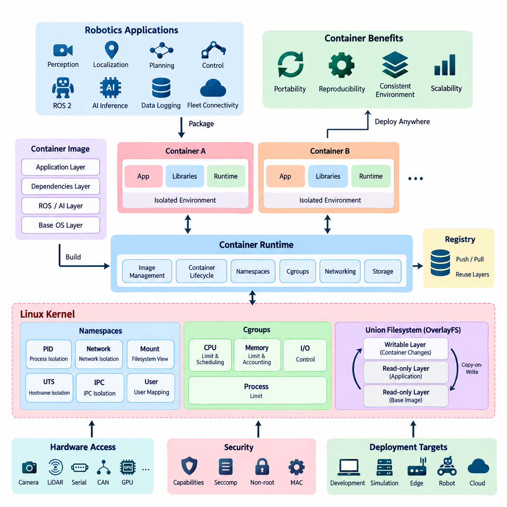
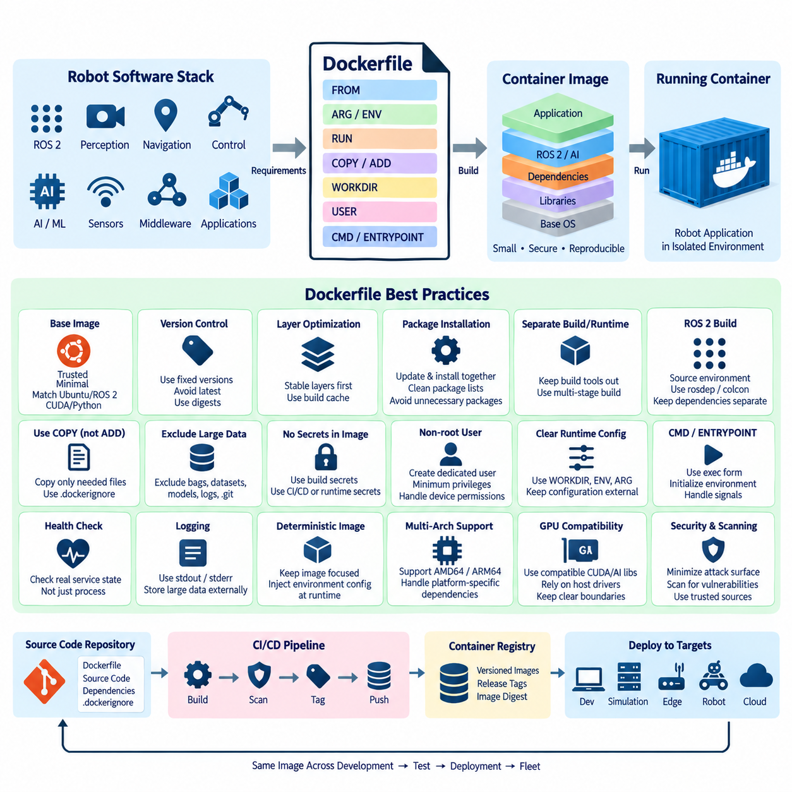
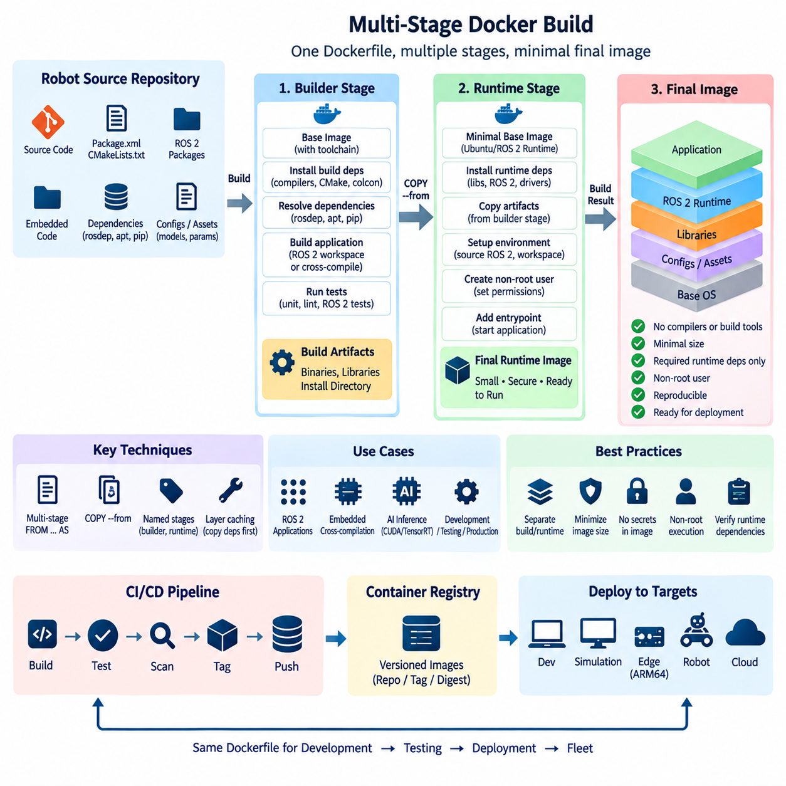
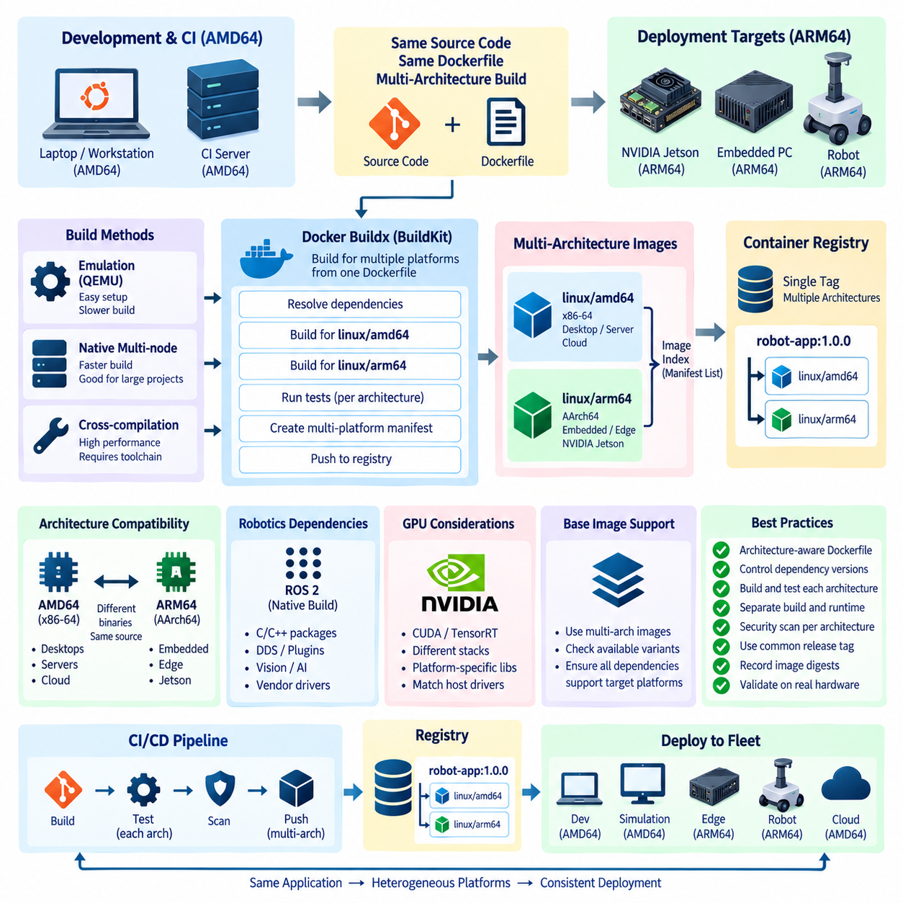
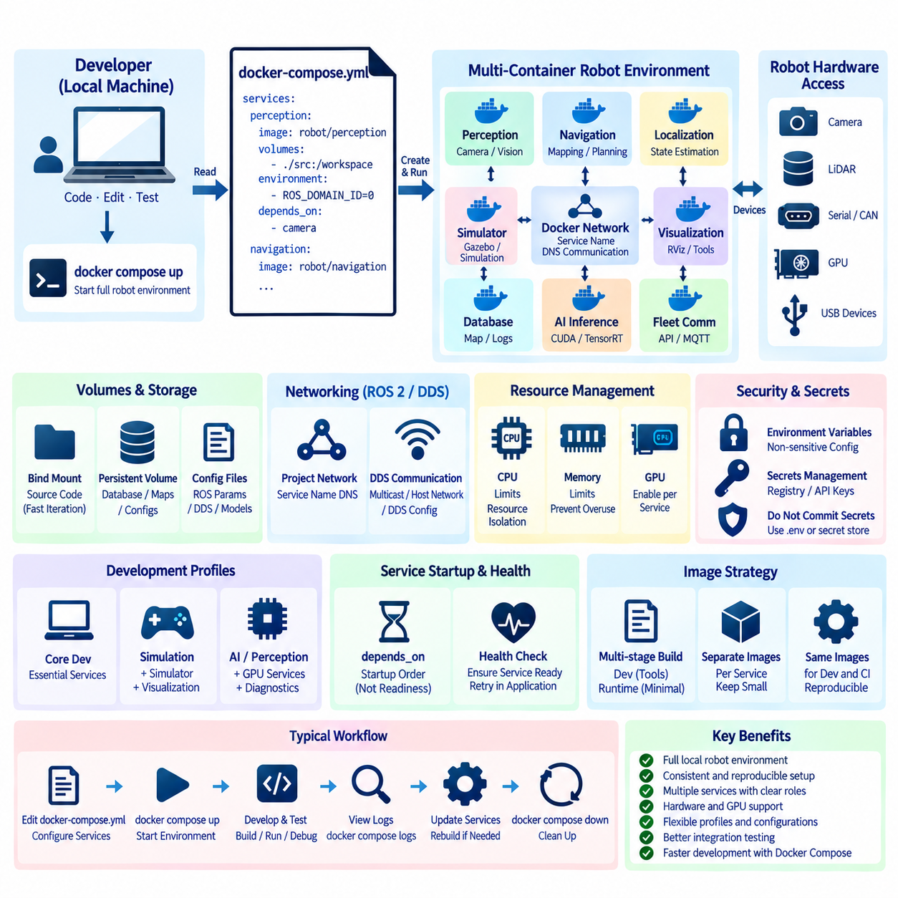
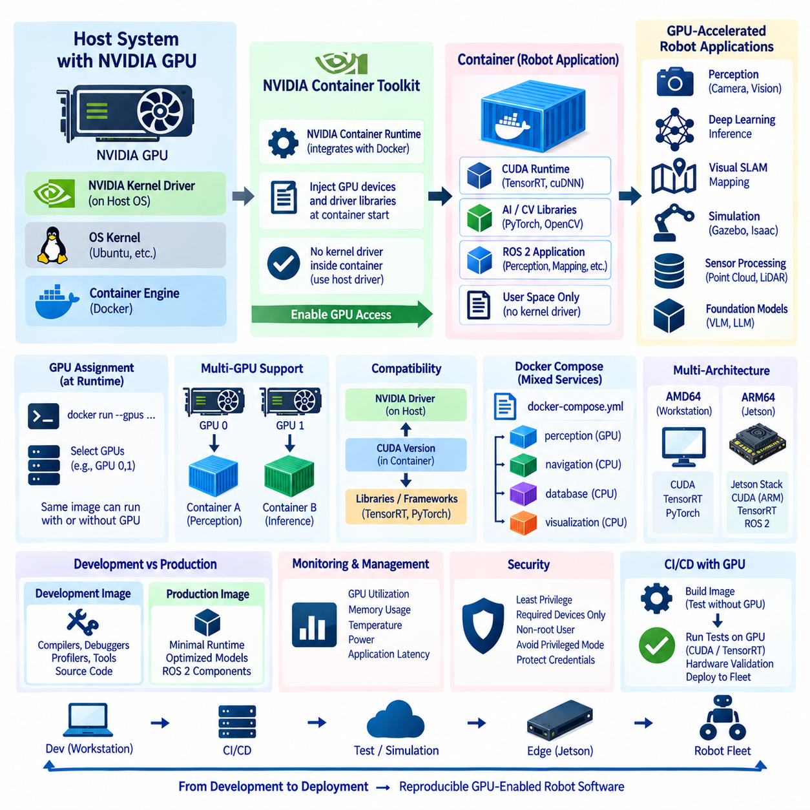
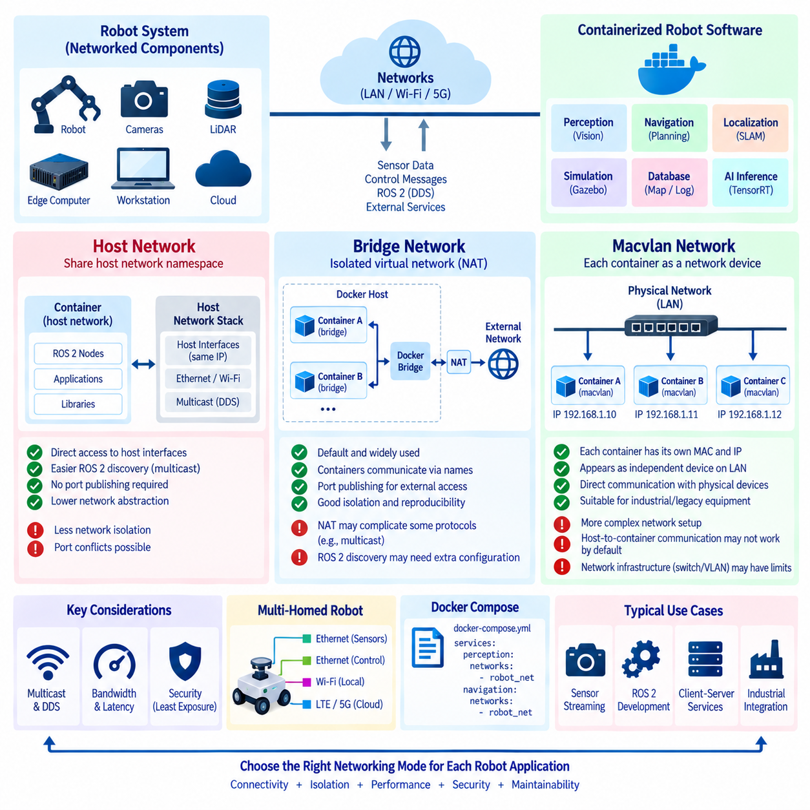
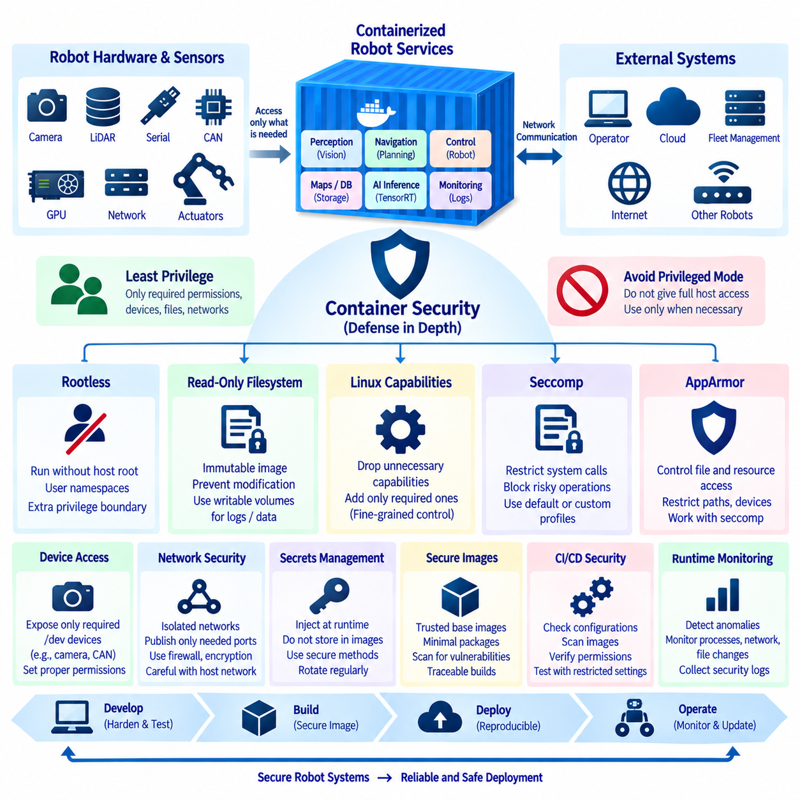
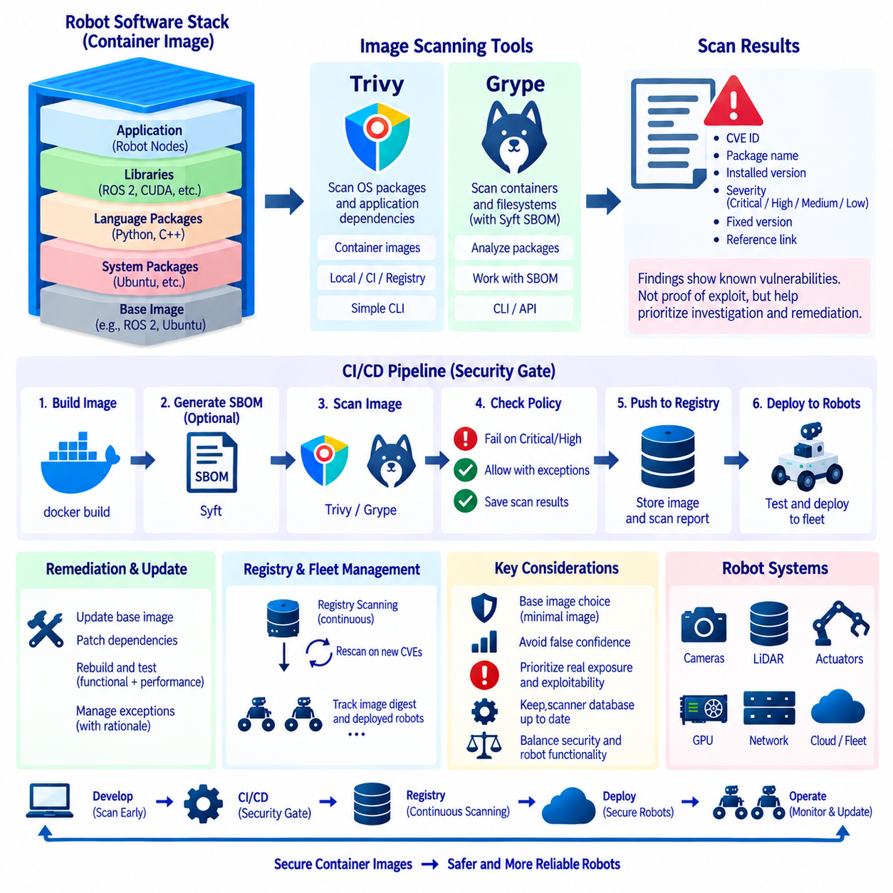
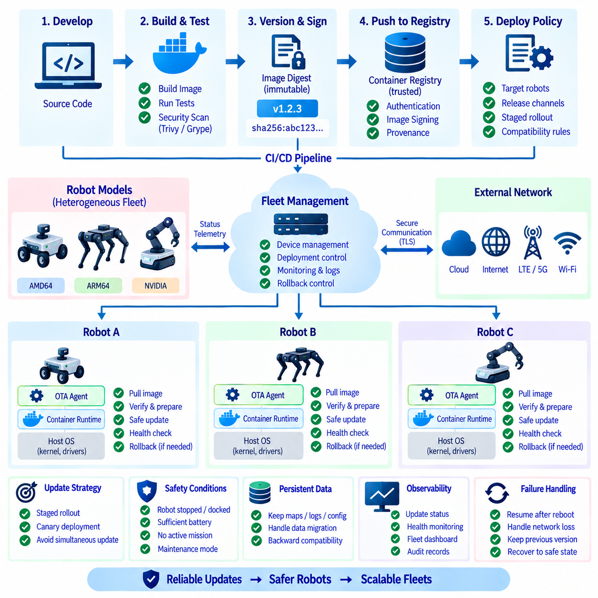

**Volume 10 Robot DevOps and MLOps**

# 3. Containerization

## 3.1. Container Fundamentals Namespaces Cgroups Union FS

{width="7.268055555555556in" height="7.268055555555556in"}

Containerization provides a lightweight method for packaging software together with its runtime dependencies while isolating it from other processes on the same operating system. Unlike a virtual machine, a container normally does not include a complete guest operating system. Multiple containers share the host kernel while maintaining logically separated execution environments.

This model is particularly useful for robotics because a robot software stack often combines ROS 2 packages, perception libraries, AI frameworks, device interfaces, middleware, and application-specific dependencies. Packaging these components into containers reduces differences between development, testing, simulation, edge deployment, and fleet operation environments while improving reproducibility.

A container should not be understood as a single Linux kernel feature. Linux container isolation emerges from several mechanisms working together, especially namespaces, control groups, filesystem isolation, capabilities, and security policies. Container runtimes coordinate these mechanisms to create an environment that appears to an application like an independent system even though it remains part of the host.

Linux namespaces provide the fundamental mechanism for separating the resources visible to processes. When a process is placed inside a namespace, its view of a particular system resource can differ from the view available to processes outside that namespace. Containers commonly combine several namespace types so that processes, networking, mount points, host names, users, and interprocess communication can be isolated independently.

The PID namespace isolates process identifiers and process trees. A process may appear as PID 1 inside a container while having a completely different PID on the host. This creates an independent process hierarchy for the container and prevents ordinary container processes from seeing every host process. PID 1 also has special responsibilities for signal handling and orphaned child processes.

Network namespaces isolate networking resources such as interfaces, routing tables, firewall rules, and sockets. A container can therefore possess its own virtual network interface and IP configuration while sharing the same physical host. Container runtimes can connect network namespaces through virtual Ethernet devices, software bridges, host networking, or more specialized networking mechanisms.

Mount namespaces provide independent views of filesystem mount points. They allow a container to see a filesystem hierarchy that differs from the host hierarchy even though both use the same kernel. Combined with layered container filesystems and bind mounts, mount namespaces make it possible to expose only the files and directories required by an application while attaching persistent or hardware-related paths when necessary.

UTS namespaces isolate host and domain names, while IPC namespaces separate mechanisms such as System V IPC and POSIX message queues. User namespaces can map user and group identifiers inside a container to different identifiers on the host. This is especially valuable for reducing privileges because a process that appears to run as root inside a container does not necessarily need equivalent root privileges on the host.

Namespaces primarily determine what a container can see, but they do not by themselves control how much hardware capacity it can consume. Linux control groups, commonly called cgroups, provide resource accounting, limitation, and prioritization. They can regulate resources such as CPU time, memory, process counts, and I/O behavior, allowing multiple workloads to share a host without unrestricted competition.

CPU controls can constrain the processor capacity available to a container or influence scheduling priority among workloads. Memory controls can establish limits and track consumption so that one application cannot freely consume all available system memory. These mechanisms become important on robot computers where localization, perception, planning, logging, and AI inference may execute concurrently under strict resource constraints.

Modern Linux systems increasingly use cgroup v2, which provides a unified hierarchy and more consistent resource-control model than the multiple hierarchies associated with earlier cgroup implementations. Container engines and orchestration platforms translate higher-level resource configurations into cgroup controls, allowing deployment policies to specify resource boundaries without applications directly managing kernel interfaces.

Filesystem layering addresses another requirement of containerization: efficiently distributing application environments without copying a complete filesystem for every container. Container images are commonly constructed from multiple read-only layers. Each layer represents filesystem changes, and the runtime combines these layers into a unified view that appears to the application as a normal directory hierarchy.

This concept is often described through union or layered filesystem behavior. Technologies such as OverlayFS can combine lower read-only layers with an upper writable layer. When a container modifies a file originating from a lower layer, copy-on-write behavior allows the modification to be represented in the writable layer rather than altering the original image layer. Unchanged data can therefore remain shared.

Layering makes container images efficient to build, distribute, cache, and reuse. For example, several robot applications may share an Ubuntu base layer, common ROS 2 libraries, CUDA components, and organization-wide middleware packages while differing only in their application layers. A registry and local runtime can reuse existing layers instead of repeatedly transferring identical content.

The writable container layer should generally be considered ephemeral rather than permanent application storage. When a container is deleted and recreated, data stored only in that layer may disappear. Persistent robot configuration, maps, calibration information, recorded sensor data, databases, and operational logs therefore require deliberate storage strategies such as volumes, bind mounts, or external storage services.

Container images and running containers represent related but different concepts. An image is an immutable package describing the filesystem and execution metadata required to start an application. A container is a runtime instance created from that image with additional writable state, namespaces, cgroups, networking, and other runtime configuration. Many containers can consequently be instantiated from the same image.

The container runtime is responsible for converting an image and its configuration into an executing process environment. Modern container ecosystems commonly separate high-level image management and user interfaces from lower-level runtime functions. Open Container Initiative specifications help standardize image formats and runtime behavior, reducing dependence on a single implementation and improving portability.

For robotics, container boundaries should follow operational requirements rather than simply placing the entire robot software stack into one large container. Perception, navigation, fleet connectivity, diagnostics, or AI inference may require different dependencies and update cycles. Separating appropriate services can reduce dependency conflicts and enable independent deployment, although excessive fragmentation increases communication and management complexity.

Hardware access requires special consideration because container isolation can hide devices that robot applications need. Cameras, LiDAR interfaces, serial devices, CAN adapters, GPUs, and other accelerators must be deliberately exposed to the container. Device permissions, users, kernel drivers, runtime configuration, and host libraries must therefore be coordinated instead of assuming that containerization completely abstracts hardware.

Containers also do not provide the same isolation boundary as conventional virtual machines. Because containers share the host kernel, kernel vulnerabilities, excessive privileges, exposed devices, or unsafe runtime configurations can weaken isolation. Production robot systems should consequently combine namespaces and cgroups with Linux capabilities, seccomp filtering, mandatory access controls, non-root execution, and restricted filesystem permissions.

Together, namespaces, cgroups, and layered filesystems explain the core container model. Namespaces define isolated views of system resources, cgroups regulate resource consumption, and layered filesystems provide efficient application packaging and copy-on-write storage. Container runtimes integrate these mechanisms into a repeatable deployment unit suitable for development computers, edge devices, robot platforms, and fleet infrastructure.

In a DevOps-oriented robotics architecture, this foundation enables the same versioned software artifact to move through CI testing, simulation, hardware-in-the-loop validation, registry storage, and robot deployment with fewer environmental differences. Containerization therefore becomes not merely an application packaging technique, but a fundamental building block for reproducible robot software delivery and lifecycle management.

## 3.2. Dockerfile Best Practices for Robot SW Stacks [w/Code]

{width="7.268055555555556in" height="7.268055555555556in"}

A Dockerfile defines how a container image is assembled from a reproducible sequence of instructions. For robot software stacks, it serves as executable documentation of the runtime environment, including the operating-system base, ROS 2 distribution, system libraries, middleware, AI frameworks, application dependencies, configuration, and startup behavior required by the robot application.

Choosing the base image is one of the most important Dockerfile decisions because every subsequent layer inherits its operating-system libraries and compatibility constraints. Robot projects should prefer trusted, maintained, and appropriately minimal base images while explicitly matching Ubuntu, ROS 2, CUDA, Python, and hardware-runtime requirements. Smaller images reduce transfer time and unnecessary attack surface.

Image versions should be controlled explicitly rather than relying on floating tags whenever reproducibility matters. A tag such as latest may resolve to different content at different times, causing identical Dockerfiles to produce different environments. Robot deployments benefit from fixed distribution versions, package versions where practical, and immutable image digests for releases that require precise reconstruction.

Dockerfile instructions should be organized with the image layer model in mind. Instructions such as RUN, COPY, and ADD can create filesystem changes that become part of image layers. Stable operations, including installation of rarely changing system dependencies, should generally appear before frequently changing application source files so that Docker\'s build cache can reuse expensive earlier layers.

Package installation should minimize unnecessary files and intermediate artifacts. On Debian- and Ubuntu-based robot images, package index updates and package installation should normally occur within the same RUN instruction, followed by removal of cached package lists. Recommended packages that are not actually required by the robot application should be avoided when possible to reduce image size and dependency complexity.

Robot software frequently depends on ROS 2 packages distributed through both operating-system repositories and workspace source trees. The Dockerfile should clearly separate installation of external dependencies from compilation of the robot workspace. Copying package manifests or dependency metadata before application source code can improve caching because dependency installation does not need to repeat after every source-code modification.

ROS 2 workspace builds require careful management of environment initialization. The required ROS distribution must be sourced before invoking tools such as rosdep or colcon when their behavior depends on the environment. Runtime containers must likewise initialize the ROS environment and application workspace before launching nodes, otherwise package discovery, shared libraries, message definitions, and middleware configuration may fail.

A Dockerfile should distinguish build-time dependencies from runtime dependencies. Compilers, header packages, source trees, debugging utilities, and build systems may be required to compile a ROS 2 or native C++ application but are often unnecessary during operation. Keeping these tools out of production images reduces storage requirements, startup distribution cost, maintenance burden, and potential security exposure.

This separation becomes particularly important for robot AI software because development environments can contain CUDA toolchains, Python build utilities, model conversion tools, and large intermediate artifacts. The production container may require only the resulting binaries, Python environment, inference libraries, models, and compatible GPU runtime components. Later multi-stage build techniques can formalize this separation more efficiently.

The COPY instruction should normally be preferred when files only need to be transferred from the build context into the image. ADD provides additional behaviors that are unnecessary for many ordinary robot software builds. Explicit file-copy operations make Dockerfiles easier to understand and reduce unexpected behavior, while a carefully designed .dockerignore file prevents irrelevant data from entering the build context.

A robotics repository may contain recorded ROS bags, simulation assets, neural-network checkpoints, datasets, build directories, logs, and Git metadata that should not automatically become part of every container build. Excluding these resources can substantially reduce build-context size and accidental image growth. Large models should be incorporated deliberately according to the deployment and model-versioning strategy.

Dockerfile commands should avoid embedding credentials, access tokens, private registry passwords, SSH keys, or other secrets into image layers. Removing a secret in a later instruction does not guarantee that it disappears from previous layers. Build-time secret mechanisms, controlled CI/CD credentials, and external runtime secret management should be used instead of permanently storing sensitive information inside robot images.

Container processes should run with the minimum privileges required by the application. Creating a dedicated non-root user in the Dockerfile reduces the consequences of application compromise. Robotics introduces additional complexity because access to serial ports, CAN interfaces, cameras, LiDAR devices, and other hardware may require specific users, groups, device mappings, or runtime permissions rather than unrestricted root execution.

WORKDIR should define a predictable working directory instead of repeatedly relying on shell directory changes. ENV can establish stable runtime environment variables, while ARG is useful for build-time parameters that do not need to remain runtime configuration. These mechanisms should be used deliberately because excessive build arguments and environment variables can make image behavior difficult to reproduce and diagnose.

CMD and ENTRYPOINT define how the container starts and should reflect the intended operational model. ENTRYPOINT is useful for establishing initialization behavior, such as sourcing ROS 2 environments before execution, while CMD can provide the default application or arguments. Exec-form commands are generally preferable because they preserve clearer process and signal behavior inside the container.

Signal handling is especially important in robotics because containers may host ROS 2 nodes controlling sensors, navigation processes, or hardware interfaces. The primary process should correctly receive termination signals and perform orderly shutdown when possible. Poor entrypoint design can interfere with signal propagation, leave child processes behind, or delay controlled termination during deployment, restart, and OTA operations.

Health checking should distinguish whether a process merely exists from whether the robot service is operational. A container may remain running while a ROS 2 node has lost communication, a sensor stream has stopped, or an inference service has become unresponsive. Docker-level health mechanisms can provide basic checks, while application-level observability should evaluate richer robot-specific operational conditions.

Image contents should remain deterministic and application-focused. Configuration that differs between robots, sites, fleets, or deployment stages should generally be injected at runtime rather than creating a separate image for every configuration. The same tested image can then move through development, simulation, hardware-in-the-loop testing, staging, and production while configuration remains independently controlled.

Logging should also respect the container execution model. Applications should preferably expose operational logs through standard output and standard error when appropriate, allowing the container platform to collect them consistently. High-volume sensor recordings, maps, diagnostic archives, and persistent robot data should be directed to explicitly managed storage rather than accumulating invisibly in the container\'s writable layer.

Build reproducibility should be integrated with CI/CD. A Dockerfile committed with robot source code allows automated pipelines to build the same environment used for testing and deployment. Images can be tagged using software versions, release identifiers, or source revisions, scanned for vulnerabilities, stored in a registry, and promoted through deployment stages without rebuilding application contents unnecessarily.

Robot software images must also account for target architecture. Development servers may use AMD64 processors while deployed edge computers use ARM64 platforms such as NVIDIA Jetson systems. Dockerfile design should therefore avoid unnecessary architecture assumptions, while architecture-specific packages, binary dependencies, CUDA components, and hardware libraries must be selected deliberately when multi-platform deployment is required.

GPU-enabled robot containers require particularly strict compatibility management. The image must provide appropriate user-space CUDA, inference, and AI framework components while remaining compatible with the host GPU driver and container runtime. Bundling arbitrary host driver components into the image can create conflicts, so the boundary between host-managed hardware support and container-managed application libraries must remain clear.

A well-designed Dockerfile ultimately represents more than a list of installation commands. It defines a controlled software supply boundary for the robot application. Minimal dependencies, deterministic versions, efficient layers, non-root execution, clean runtime configuration, proper signal handling, and CI/CD integration collectively make containerized robot software easier to reproduce, test, secure, distribute, update, and operate across a fleet.

## 3.3. Multi Stage Build for Embedded and ROS2 Images [w/Code]

{width="7.268055555555556in" height="7.268055555555556in"}

Multi-stage builds allow a Dockerfile to contain multiple build environments while producing a final image that contains only the components required for execution. Each stage begins from its own base image and can perform a specialized task such as dependency resolution, compilation, testing, artifact generation, or runtime packaging. Selected artifacts are then copied between stages without carrying the complete build environment into production.

This approach is especially valuable for embedded and ROS 2 software because development environments are usually much larger than runtime environments. Building C++ packages may require compilers, CMake, colcon, header files, debugging utilities, rosdep, and source repositories. The deployed robot normally needs only compiled executables, shared libraries, ROS interfaces, configuration files, and selected runtime dependencies.

A typical multi-stage Dockerfile starts with a builder stage containing the complete toolchain. Source code and dependency metadata are copied into this stage, required packages are installed, and the ROS 2 workspace or embedded application is compiled. A later runtime stage starts from a cleaner base image and copies only the generated installation artifacts and other files required to operate the application.

Docker identifies stages through FROM instructions, and stages can be assigned descriptive names using the AS syntax. Naming stages such as builder, tester, and runtime makes the Dockerfile easier to understand and prevents fragile references based only on numerical stage order. The COPY \--from mechanism then transfers selected files or directories from an earlier stage into a later stage.

For ROS 2 projects, the builder stage commonly contains the source workspace and all packages required by rosdep and colcon. After dependencies are resolved, colcon builds the workspace and generates install artifacts. The runtime stage can then receive the install directory rather than the entire source and build trees, substantially reducing the amount of development material included in the deployed image.

ROS 2 environment handling remains important across stages. The builder must initialize the appropriate ROS distribution before compilation, and the final runtime environment must source both the underlying ROS installation and the copied workspace overlay. If this initialization is omitted, package discovery, shared-library resolution, interface definitions, plugins, and executable lookup may behave differently from the original build environment.

Multi-stage builds also improve dependency separation. Build dependencies such as gcc, g++, make, CMake, development headers, Python build tools, and source-control clients can remain exclusively in the builder stage. Runtime packages can be installed independently in the final stage. This creates a clearer distinction between software needed to manufacture an artifact and software needed to execute that artifact.

The same principle applies to embedded Linux applications. Cross-compilation may require architecture-specific toolchains, sysroots, board support packages, SDKs, code generators, and development libraries that can occupy substantial storage. These components can remain in a dedicated build stage while only target binaries, required shared objects, configuration files, and runtime assets are transferred into the deployment image.

Cross-compilation introduces an important architectural distinction between the machine performing the build and the machine executing the resulting software. An AMD64 CI server may build software intended for an ARM64 robot computer. Multi-stage design can isolate host-side compilation tools from target-side runtime components, making architecture assumptions more visible and simplifying later multi-architecture container strategies.

AI-enabled ROS 2 images can benefit even more because their build environments may contain CUDA development packages, TensorRT development components, model converters, Python compilers, and temporary model artifacts. If the deployed application only performs inference, the final stage can contain the appropriate runtime libraries and optimized model artifacts without retaining the complete development toolchain.

Image size reduction is an important consequence, but it is not the only objective of multi-stage builds. Removing compilers, package managers, source code, temporary files, and debugging utilities from production images reduces unnecessary software inventory and potential attack surface. The final image becomes easier to scan, distribute, cache, audit, and maintain across a large robot fleet.

However, a smaller final image must still contain every runtime dependency required by the copied artifacts. A compiled executable may depend on shared libraries that existed automatically in the builder image but are absent from the runtime image. Native ROS 2 packages, plugins, DDS implementations, GPU libraries, Python modules, and dynamically loaded components must therefore be checked carefully when constructing the runtime stage.

Using the same or compatible operating-system family across builder and runtime stages can reduce binary compatibility problems. Differences in C libraries, compiler runtime libraries, ABI versions, ROS distributions, or middleware implementations may prevent an apparently successful build artifact from running correctly. Multi-stage optimization should therefore preserve compatibility rather than pursuing minimal image size without considering the runtime dependency chain.

Docker build caching remains highly relevant in multi-stage designs. Dependency metadata should generally be copied before frequently changing application source so that dependency installation can remain cached. Expensive operations such as rosdep installation, package downloads, and compilation of stable libraries should be structured to avoid unnecessary repetition whenever only a small portion of the robot application changes.

Separate stages can also be used for testing. A builder stage may compile the software, while an intermediate test stage executes unit tests, static checks, or ROS 2 package tests before artifacts are admitted to the runtime stage. In CI/CD, failure of this stage prevents an invalid image from progressing further, allowing the Dockerfile itself to represent part of the software quality gate.

Artifact ownership and file permissions must be considered when copying data between stages. Files generated as root in the builder may later be used by a non-root runtime process. The final image should establish appropriate ownership, executable permissions, directory access, and device-related group configuration so that the deployed application does not require unnecessary privilege simply because of how artifacts were created.

Runtime configuration should remain separate from build artifacts wherever practical. Robot-specific identifiers, network parameters, DDS configuration, map selection, sensor calibration, fleet endpoints, and site settings often vary independently of the software version. Multi-stage builds should create a reusable application image while runtime configuration is injected through environment variables, mounted files, volumes, or deployment configuration mechanisms.

Large datasets, ROS bag files, simulation resources, and temporary build outputs should not pass automatically from one stage to another. COPY \--from should be deliberately scoped so that only required artifacts enter the final image. This explicit transfer boundary provides a useful opportunity to inspect what the production robot actually receives and prevents accidental inclusion of development data.

For embedded robots, the final runtime stage may also require controlled access to physical devices such as serial ports, CAN interfaces, cameras, LiDAR sensors, and GPU accelerators. These devices are generally exposed when the container starts rather than embedded during image construction. Multi-stage builds optimize software contents, while runtime device mapping and permissions remain deployment responsibilities.

Multi-stage Dockerfiles can support several deliverables from a shared build process. One target may provide a development environment with debugging tools, another may support automated testing, and another may produce a minimal production runtime. Explicit build targets allow CI pipelines and developers to select the appropriate stage without maintaining completely separate Dockerfiles that gradually diverge from one another.

This pattern improves traceability when combined with version-controlled source and automated CI/CD. The same Dockerfile can compile a defined source revision, execute validation, create runtime artifacts, generate a production image, and associate that image with a release tag or immutable digest. The resulting container can then be promoted through simulation, hardware-in-the-loop testing, staging, and robot fleet deployment.

Multi-stage builds therefore establish a controlled boundary between software construction and software execution. For embedded and ROS 2 systems, they help isolate complex toolchains from deployed workloads, reduce image size and attack surface, preserve reproducible build procedures, and support architecture-specific packaging. When dependency compatibility and runtime configuration are managed carefully, they provide a strong foundation for reliable containerized robot software delivery.

## 3.4. Multi Architecture Image Build ARM64 AMD64 [w/Code]

{width="7.268055555555556in" height="7.268055555555556in"}

Multi-architecture container images allow the same application release to run across different processor architectures while preserving a common image name and deployment workflow. In robotics, this capability is particularly important because development workstations and cloud CI servers commonly use AMD64 processors, while embedded robot computers frequently use ARM64 platforms such as NVIDIA Jetson systems.

AMD64, also known as x86-64, dominates conventional desktop computers, workstations, servers, and many cloud environments. ARM64, also called AArch64, is widely used in power-efficient embedded and edge computing platforms. Although application source code may be identical, compiled binaries, operating-system packages, native libraries, and hardware-specific components must match the instruction set architecture of the target processor.

A conventional container image normally contains binaries for one architecture. Attempting to execute an AMD64 binary directly on an ARM64 processor, or the reverse, generally fails unless an emulation mechanism is available. Multi-architecture image design solves the distribution problem by associating architecture-specific images with a common image reference that allows a container runtime to select the appropriate variant.

This mechanism is commonly implemented through an image index or manifest list. Instead of a single tag identifying only one architecture-specific image, the tag references metadata describing several platform variants. When a client pulls the image, the container runtime evaluates the host operating system and processor architecture and retrieves the matching image automatically.

For example, a robotics release can publish both linux/amd64 and linux/arm64 variants under the same version tag. An AMD64 development workstation receives the AMD64 image, while an ARM64 edge computer receives the ARM64 image. This provides a consistent deployment interface even though the underlying binaries and some dependencies differ between the two platforms.

Docker Buildx provides a practical mechanism for creating multi-platform images using the BuildKit build engine. A build can specify several target platforms and generate architecture-specific outputs from one Dockerfile. The resulting images can then be pushed to a registry together with a multi-platform manifest, allowing downstream systems to use a single logical image reference.

Multi-architecture builds require a clear distinction between the build platform and the target platform. The build platform identifies the architecture executing the Docker build process, while the target platform identifies the architecture for which a particular image stage is being produced. Dockerfile variables and BuildKit platform metadata can be used to make architecture-dependent behavior explicit when necessary.

There are several ways to build images for architectures different from the host. Emulation can execute foreign-architecture binaries through mechanisms such as QEMU and Linux binary-format registration. This approach is convenient for CI and relatively simple builds, but emulated compilation can be significantly slower than native execution, particularly for large C++, ROS 2, computer vision, and AI workloads.

Native multi-node builders provide another strategy. An AMD64 builder can produce AMD64 artifacts while an ARM64 builder produces ARM64 artifacts, with BuildKit coordinating the outputs. Native builders avoid much of the performance penalty associated with emulation and are attractive for large robotics projects where ROS 2 compilation, CUDA components, or extensive native dependencies make build times significant.

Cross-compilation is a third approach and can be particularly effective for embedded software. A compiler running on an AMD64 machine can generate ARM64 binaries using an appropriate cross-toolchain and target sysroot. This method can provide excellent performance, but the build system, libraries, package discovery, and architecture-specific dependencies must all be designed carefully to prevent host components from contaminating target artifacts.

Multi-stage builds combine naturally with multi-architecture workflows. A builder stage can contain architecture-specific compilers and development dependencies, while the runtime stage receives only the resulting target binaries and required libraries. This separation keeps production images smaller and makes it easier to reason about which components belong to the build host and which belong to the deployed robot.

ROS 2 adds another compatibility layer because many packages include native C or C++ code. Pure Python ROS 2 nodes may require fewer architecture-specific changes, but native packages must be compiled for each target. DDS implementations, message-support libraries, plugins, computer-vision packages, and vendor drivers must also be available and compatible with the selected architecture and ROS 2 distribution.

Architecture-independent Dockerfile design should be preferred whenever possible. Hard-coded downloads containing amd64 or arm64 in filenames can break multi-platform builds unless the architecture is selected dynamically. Package repositories, installation scripts, and externally downloaded binaries should therefore be examined to ensure that the correct artifact is selected for the active target platform.

The base image must also support every intended architecture. Many official Linux and ROS-related images publish variants for multiple platforms, but specialized images may support only a subset. A Dockerfile cannot produce a valid ARM64 runtime merely by requesting linux/arm64 if the chosen base image or a required binary dependency is unavailable for that architecture.

GPU-enabled robotics introduces additional constraints. An AMD64 workstation with a discrete NVIDIA GPU and an ARM64 NVIDIA Jetson platform may both use CUDA-based applications, but their software stacks are not necessarily interchangeable. CUDA versions, TensorRT packages, platform libraries, device drivers, and Jetson-specific components must be aligned with the corresponding hardware and operating environment.

For this reason, a single Dockerfile does not necessarily imply that every instruction and dependency must be identical across architectures. Shared logic should remain common, while legitimate platform-specific differences can be handled explicitly. The objective is to minimize unnecessary divergence while acknowledging hardware-specific runtime requirements rather than forcing incompatible platforms into an artificial uniform configuration.

CI/CD pipelines should build and validate each supported architecture independently. Successful compilation on AMD64 does not demonstrate that an ARM64 image is functional. Each variant should undergo appropriate dependency checks, automated tests, vulnerability scanning, startup validation, and where necessary hardware-in-the-loop testing on representative target devices before fleet deployment.

Testing becomes particularly important when emulation is used during the build. QEMU can confirm many installation and execution paths, but it cannot fully reproduce physical robot hardware, GPU behavior, device drivers, timing characteristics, or architecture-specific performance. Native ARM64 validation remains necessary for software that interacts closely with sensors, accelerators, real-time workloads, or vendor-specific hardware.

Image tagging should separate application version identity from platform selection. Instead of requiring operators to manually choose unrelated tags for every processor architecture, a common release tag can reference a manifest containing the supported variants. Architecture-specific tags may still be retained for debugging or traceability, while normal deployment uses the common multi-platform reference.

Registries store the architecture-specific images and the manifest metadata that connects them. This makes distribution transparent to most deployment tools. A fleet management system can request the same application version for heterogeneous robots, while each robot\'s container runtime retrieves the variant appropriate for its processor architecture, assuming the registry manifest contains that supported platform.

Software supply-chain controls should apply to every architecture variant. Each image can contain different binaries and potentially different package versions, so vulnerability scanning and software bill of materials generation should not assume that the AMD64 result represents ARM64. Release records should preserve the image digests, provenance, dependencies, and validation status associated with each platform variant.

Reproducibility also requires controlling external dependencies. If an AMD64 build and ARM64 build independently download packages without version constraints, their contents may diverge beyond unavoidable architectural differences. Fixed package versions where practical, controlled repositories, deterministic build procedures, and immutable release references help ensure that both variants represent the same logical software release.

In robotics, multi-architecture images support a broader software-defined platform strategy. Developers can work on AMD64 laptops or workstations, CI systems can build on scalable server infrastructure, simulation can run on high-performance x86 machines, and production software can be deployed to ARM64 edge computers without maintaining completely separate application repositories and release processes.

A robust ARM64 and AMD64 image strategy therefore combines common source code, architecture-aware Dockerfiles, BuildKit or equivalent build infrastructure, controlled dependencies, architecture-specific validation, and registry manifests. The result is not one universal binary, but one coordinated software release composed of verified platform variants that can move consistently from development and CI through simulation, edge deployment, and heterogeneous robot fleets.

## 3.5. Docker Compose for Robot SW Local Dev Environment [w/Code]

{width="7.268055555555556in" height="7.268055555555556in"}

Docker Compose provides a declarative way to define and run multiple containers as one coordinated application environment. In robot software development, this is useful because a complete local system rarely consists of a single process. ROS 2 nodes, perception services, databases, simulation tools, monitoring components, AI inference servers, and supporting middleware can be represented as separate but connected services.

A Compose configuration is normally described in a YAML file that defines services and their runtime relationships. Each service can specify an image or Dockerfile, command, environment variables, volumes, networks, device mappings, resource settings, and other parameters. Instead of manually starting many containers with long command lines, developers can describe the intended local robot environment once and recreate it consistently.

The service is the central abstraction in Docker Compose. A service represents a containerized application role such as navigation, perception, localization, simulation, database, or fleet communication. Multiple services can use different images and dependency sets while participating in the same local application. This separation helps robot developers isolate software responsibilities without requiring every component to share one oversized environment.

For ROS 2 development, Compose can organize nodes or groups of nodes according to their dependency and deployment boundaries. A perception container may contain camera and vision libraries, while a navigation container contains mapping and planning packages. Another service can provide visualization or diagnostics. ROS 2 communication can then connect these services through the networking environment created for the Compose project.

Container networking requires careful attention because ROS 2 relies on DDS-based discovery and communication. Containers attached to the same Compose network can communicate through service names and container networking, but DDS discovery behavior may vary according to middleware implementation and network configuration. Multicast, host networking, interface selection, and DDS configuration must therefore be considered when communication crosses container boundaries.

Docker Compose automatically creates a project network in typical configurations, giving services a convenient private communication environment. Service names can function as resolvable network identities, reducing dependence on manually assigned IP addresses. For conventional client-server components such as databases, APIs, dashboards, and inference services, this model provides a straightforward way to connect robot software components during local development.

Volumes and bind mounts are especially important for iterative robot software development. Instead of rebuilding an image whenever a source file changes, a developer can mount the local ROS 2 workspace into a development container. Source code can then be edited using host tools while compilation and execution occur inside the controlled container environment, combining fast iteration with consistent dependencies.

Persistent volumes can be used for information that must survive container recreation. Databases, caches, maps, configuration repositories, or selected development artifacts may require persistent storage. In contrast, temporary build outputs or generated files can remain ephemeral. Separating persistent data from disposable container state makes local environments easier to reset without accidentally deleting valuable development information.

Robot-specific configuration should be externalized whenever practical. ROS parameters, DDS settings, simulation options, model paths, network endpoints, and feature switches can be provided through mounted configuration files or environment variables. This allows developers to reuse the same container images while changing the behavior of the local system without modifying or rebuilding the image itself.

Compose also provides a convenient way to express startup relationships between services. For example, an application service may depend on a database, simulator, or supporting backend. However, container startup order should not be confused with application readiness. A container may have started while its internal service is still initializing, so robust robot software should combine dependency declarations with health checks and retry-capable application behavior.

Health checks can improve local development by identifying whether a service is actually ready rather than merely running. This is useful for databases, web APIs, inference servers, and other components with clear readiness endpoints. ROS 2 services may require application-specific checks because process existence alone does not prove that topics are being published, sensors are available, or required nodes are communicating correctly.

Profiles can be used to activate optional groups of services for different development scenarios. A lightweight developer session might start only core ROS 2 services, while a simulation profile can add a simulator and visualization tools. Another profile may enable AI inference or diagnostics. This reduces the need to maintain several nearly identical Compose files for every local development combination.

Environment-specific overrides can further separate common definitions from machine-specific or workflow-specific settings. The shared Compose configuration can describe the standard robot software topology, while local adjustments handle paths, ports, hardware devices, debugging options, or development-only behavior. Careful separation prevents personal workstation settings from becoming embedded in the common deployment definition.

Hardware access introduces challenges that ordinary web application Compose environments rarely encounter. Robot developers may need cameras, serial interfaces, CAN adapters, LiDAR devices, USB peripherals, or GPUs inside containers. Compose can express device mappings and related runtime settings, but the host must still provide compatible drivers, permissions, device nodes, and hardware-specific runtime support.

GPU workloads require coordination between the container image and host GPU environment. A perception or AI inference service may need CUDA, TensorRT, or another acceleration stack while other services do not. Keeping GPU requirements isolated to the services that actually require them avoids unnecessarily enlarging every container and allows developers to represent heterogeneous computational roles within the same local environment.

Graphical robotics tools add another consideration. Applications such as RViz or simulation interfaces may require access to the host display system, GPU acceleration, or remote visualization mechanisms. A local Compose environment should expose only the resources required by those tools and should avoid making broad host access the default simply for convenience, particularly when the same configuration may later be reused by multiple developers.

Compose can also coordinate simulation-oriented workflows. A simulator service can generate virtual sensor data, while localization, perception, planning, and control services consume the same ROS 2 interfaces expected on a physical robot. This enables developers to replace selected hardware-facing services with simulated equivalents while preserving much of the surrounding software topology and communication structure.

A useful local environment should support debugging without becoming fundamentally different from production. Development containers may include debuggers, editors, source mounts, or additional diagnostic utilities, while production images remain minimal. Multi-stage Dockerfiles can provide separate development and runtime targets, and Compose can select the appropriate target or image according to the intended workflow.

Logging becomes easier to coordinate when services are managed together. Developers can inspect logs from multiple containers through the Compose project rather than opening separate terminal sessions for every process. Applications should still produce structured and meaningful output so that failures in perception, middleware, databases, or backend services can be correlated across the local robot software stack.

Resource management is useful when a development workstation runs many computationally intensive services simultaneously. Perception, simulation, AI inference, mapping, and visualization may compete for CPU, memory, and GPU resources. Appropriate limits and service separation can prevent one component from consuming the entire workstation, although local resource behavior should not automatically be assumed to represent embedded target performance.

Secrets should not be permanently written into the Compose file or container images. Registry credentials, API tokens, cloud access information, and private certificates require controlled handling. Environment files can improve convenience but are not inherently secure if committed to source control. Development workflows should separate non-sensitive configuration from credentials and use appropriate secret-management mechanisms where available.

Docker Compose is primarily valuable as a development and integration tool rather than as a complete robot fleet orchestrator. It can reproduce a multi-container robot software environment on a workstation, test machine, or individual edge system, but large-scale scheduling, fleet health management, staged rollout, failure recovery, and distributed orchestration generally require additional infrastructure beyond a local Compose project.

For CI workflows, Compose can create repeatable integration-test environments containing several dependent services. A pipeline can start the required containers, execute ROS 2 integration tests or API tests, collect logs and results, and then destroy the environment. This helps reproduce software interactions that cannot be validated by testing an individual container independently and brings local development closer to automated verification.

The greatest benefit of Docker Compose for robot development is the ability to describe the local software system as version-controlled configuration. New developers can recreate the intended environment, CI can instantiate similar service relationships, and teams can modify individual components without manually reconstructing the entire stack. This reduces workstation-specific configuration drift and improves reproducibility across the development organization.

A well-designed Compose environment therefore becomes a bridge between individual container images and the complete robot software topology. By coordinating services, networks, volumes, configuration, hardware access, health checks, and development profiles, it provides a practical foundation for local ROS 2 integration. Used together with disciplined Dockerfiles and CI/CD, it enables faster development while preserving a clear path toward production deployment.

## 3.6. NVIDIA Container Toolkit GPU Access in Containers [w/Code]

{width="7.268055555555556in" height="7.268055555555556in"}

The NVIDIA Container Toolkit enables containerized applications to access NVIDIA GPUs while preserving the isolation and reproducibility benefits of container deployment. This capability is especially important in robotics, where perception, deep-learning inference, visual SLAM, simulation, sensor processing, and foundation-model workloads increasingly depend on GPU acceleration at development, edge, and deployment stages.

A standard container does not automatically receive direct access to an NVIDIA GPU. Containers share the host kernel, but GPU devices, driver libraries, and supporting runtime components must be deliberately exposed. The NVIDIA Container Toolkit connects the container runtime with the NVIDIA driver environment so that GPU-enabled applications can execute without installing an independent kernel-level GPU driver inside every container.

The architecture separates responsibilities between the host and container. The host operating system provides the physical GPU and compatible NVIDIA kernel driver, while the container contains application-level components such as CUDA runtime libraries, TensorRT, PyTorch, computer-vision libraries, and robot software. This boundary allows multiple containers to use host GPU resources while maintaining independently versioned application environments.

The NVIDIA Container Toolkit integrates with container engines such as Docker through NVIDIA\'s container runtime infrastructure. When a GPU-enabled container is launched, the runtime identifies the requested GPU resources and injects the necessary device interfaces and compatible driver-side libraries into the container environment. Applications inside the container can then communicate with the GPU through the host driver.

This architecture explains why installing a complete NVIDIA kernel driver inside the container is generally unnecessary and undesirable. Kernel drivers operate as part of the host operating system and must correspond to the installed hardware and kernel environment. Container images should instead contain the user-space GPU software required by the application while relying on the host to provide the actual device driver.

CUDA compatibility is therefore a central design consideration. A container may package a particular CUDA user-space environment, but the host NVIDIA driver must support the CUDA requirements of that container. Selecting arbitrary combinations of driver, CUDA, deep-learning framework, and inference runtime versions can cause initialization failures or missing functionality even when the container itself builds successfully.

GPU access can be requested when starting a Docker container rather than permanently embedding a physical GPU into the image. This distinction is fundamental because container images describe portable software environments, while device assignment belongs to runtime configuration. The same image can consequently run with different available GPUs or without GPU access when the application supports an appropriate fallback mode.

GPU visibility can also be restricted to selected devices. On a multi-GPU workstation or robot computer, one container may use one GPU while another service uses a different GPU. Explicit device assignment helps isolate workloads such as perception, mapping, large-model inference, or simulation and prevents applications from automatically assuming unrestricted access to every accelerator installed in the system.

Environment variables and runtime configuration can further control which GPUs and driver capabilities are exposed. This is useful when containers require only compute functionality or when multiple services share the same host. However, GPU visibility is not equivalent to complete resource isolation. Applications sharing one physical GPU may still compete for memory capacity, compute cycles, bandwidth, and scheduling opportunities.

This distinction is important for robotics because GPU memory exhaustion can affect several safety-relevant software functions simultaneously. A large perception model or temporary tensor allocation may consume memory required by another inference process. GPU workload architecture should therefore consider memory budgets, process separation, model scheduling, monitoring, and platform-specific resource controls rather than relying only on container boundaries.

Docker Compose can represent GPU requirements alongside other robot services. A perception service may request GPU access while localization, database, communication, and diagnostics services remain CPU-only. This allows the local development topology to express computational roles explicitly and avoids adding CUDA or AI dependencies to containers that do not need GPU acceleration.

GPU-enabled images should be based on carefully selected CUDA or application framework images rather than assembled from unrelated binary components without compatibility planning. The operating-system version, CUDA runtime, cuDNN where required, TensorRT, Python packages, and ROS 2 dependencies form a compatibility chain. A change in one layer can influence whether the final application loads libraries and initializes the GPU correctly.

Multi-stage builds are useful for reducing the size of GPU-enabled robot images. A builder stage may include CUDA development tools, compilers, headers, model conversion utilities, and other large dependencies. The runtime stage can then contain only compiled artifacts, required CUDA runtime libraries, inference engines, optimized models, and the ROS 2 components needed during actual robot operation.

Development and production GPU images may consequently have different purposes. A development image can include compilers, profilers, debuggers, visualization tools, and source code, while a production image should normally contain a smaller validated runtime environment. Maintaining these roles through related build stages reduces duplication while preventing development utilities from unnecessarily expanding fleet deployment images.

NVIDIA Jetson platforms require additional attention because their software architecture differs from a conventional AMD64 workstation equipped with a discrete NVIDIA GPU. Jetson combines ARM64 processors with integrated NVIDIA acceleration and platform-specific software components. Container images intended for Jetson must therefore align with the supported Jetson software stack rather than assuming that an ordinary desktop CUDA image is directly interchangeable.

This difference becomes important in multi-architecture robot fleets. An AMD64 development workstation and an ARM64 Jetson may execute logically equivalent perception software, but their container variants can require different base images, CUDA components, TensorRT packages, and platform libraries. Multi-architecture manifests can provide a common release identity while retaining valid GPU software stacks for each target architecture.

ROS 2 GPU applications should keep hardware acceleration boundaries clear. Camera acquisition, preprocessing, neural-network inference, point-cloud processing, and visualization may have different GPU requirements. Placing every ROS 2 node into one GPU-enabled container can simplify initial development but may create excessive coupling, larger images, and more difficult resource management as the software stack grows.

A more modular architecture can expose GPU access only to services that need it. For example, an AI perception container can process camera frames and publish detection results through ROS 2, while navigation services consume those results without requiring CUDA libraries. This approach reduces dependency propagation and makes GPU-specific components easier to update, test, monitor, and replace independently.

Containerized GPU applications also require appropriate access to other robot hardware. A perception service may need both an NVIDIA GPU and one or more cameras, while a LiDAR processing service may require network or USB access. GPU enablement does not automatically provide access to these devices, so Docker or Compose runtime configuration must separately define the required device mappings, permissions, networking, and mounted resources.

Verification should occur at several levels. The host should first confirm that the NVIDIA driver recognizes the GPU correctly. A simple GPU-enabled container can then verify that the runtime exposes the accelerator, after which the actual CUDA, TensorRT, PyTorch, or ROS 2 application should be tested. Separating these checks helps distinguish host-driver failures from container-runtime problems and application dependency errors.

Monitoring is equally important after deployment. GPU utilization, memory consumption, temperature, power behavior, and application latency can reveal conditions that container health checks alone cannot detect. For edge robots operating continuously, GPU telemetry can be integrated with system diagnostics and fleet monitoring so that degraded acceleration performance or repeated memory pressure can be detected before broader application failure.

Security principles still apply when GPU devices are exposed. Containers should receive only the devices and capabilities they require, run as non-root users where practical, and avoid unnecessary privileged execution. Granting broad host access simply to make GPU software work weakens container isolation and can obscure the actual permissions required by the robot application.

CI/CD pipelines should distinguish builds that merely create a GPU image from tests that genuinely execute on GPU hardware. Many syntax, dependency, and unit tests can run without physical accelerators, but CUDA initialization, TensorRT engine execution, performance validation, and hardware-specific integration require GPU-capable runners. Production releases should therefore include appropriate native hardware validation before fleet deployment.

The NVIDIA Container Toolkit ultimately forms the bridge between portable containerized robot software and host-managed NVIDIA acceleration. By separating host drivers from application-level GPU libraries, controlling device exposure at runtime, and integrating with Docker, Compose, and CI/CD workflows, it enables reproducible GPU-enabled environments without abandoning the container model.

For modern robot software stacks, this capability supports a consistent path from GPU development workstations to AI-enabled edge computers and heterogeneous robot platforms. Reliable deployment depends on treating the GPU as an explicitly managed runtime resource, maintaining driver and CUDA compatibility, separating development from production images, validating target hardware, and monitoring accelerator behavior throughout the robot software lifecycle.

## 3.7. Container Networking Modes Host Bridge Macvlan [w/Code]

{width="7.268055555555556in" height="7.268055555555556in"}

Container networking determines how containerized robot software communicates with other containers, the host operating system, sensors, edge computers, and external networks. Unlike conventional web applications, robotic systems frequently depend on multicast discovery, high-bandwidth sensor streams, low-latency control messages, and direct communication with physical devices. Choosing the correct networking mode is therefore an architectural decision rather than only a deployment detail.

Docker provides several networking models, among which host, bridge, and macvlan are particularly relevant to robotics. Each model creates a different relationship between the container and the physical network. Host networking minimizes network abstraction, bridge networking provides isolated virtual networks with address translation, and macvlan allows containers to appear as independent devices directly connected to the local network.

Bridge networking is the common default for Docker containers. Docker creates a virtual bridge on the host and connects containers to it through virtual network interfaces. Each container receives an internal IP address within the bridge subnet, while communication with networks outside the host normally passes through network address translation. This provides useful isolation while allowing containers to communicate with each other and external systems.

User-defined bridge networks improve multi-container development because containers can discover each other through service or container names instead of fixed IP addresses. A perception service can therefore communicate with a database, inference server, or monitoring service using stable logical names. Docker Compose commonly creates such a network automatically, making bridge mode convenient for reproducible local robot software environments.

Port publishing is required when services inside a bridge network must be accessed through the host network. A container may listen on an internal port while Docker maps that port to a selected host port. This approach works naturally for HTTP APIs, dashboards, databases, telemetry gateways, and many client-server applications, but becomes more complicated for protocols that dynamically use multiple ports or depend heavily on multicast communication.

ROS 2 communication requires particular attention in bridge networks because DDS discovery behavior depends on multicast, network interfaces, middleware configuration, and routing. Two ROS 2 containers on the same properly configured Docker network may communicate successfully, while communication between containers, the host, and external robots can require additional configuration. The result may also vary according to the selected DDS implementation and discovery mechanism.

Host networking removes much of this virtual networking boundary. A container using host mode shares the host network namespace rather than receiving an isolated container network interface. Applications inside the container can therefore use the host\'s interfaces and network addresses directly, avoiding the conventional bridge, network address translation, and explicit port-publishing mechanisms normally used by Docker.

This simplicity makes host networking attractive for ROS 2 development and robotics applications that rely on DDS discovery. Multicast packets and interfaces are often easier to manage when the application sees the same network environment as the host. Host mode can also eliminate some translation and forwarding overhead, although performance differences should be measured for the actual workload rather than assumed to be significant.

The primary tradeoff of host networking is reduced network isolation. Because the container shares the host network namespace, port conflicts can occur when multiple applications attempt to bind to the same port. Network exposure is also broader, and Docker cannot provide the same per-container network separation available with bridge networks. Host mode should therefore be selected for a clear communication requirement rather than simply used as a universal solution.

For robot computers running several containerized services, host networking may simplify ROS 2 communication but can make service boundaries less explicit. A perception container, navigation container, and diagnostics container may all observe the host\'s interfaces directly. Teams must consequently manage ports, middleware settings, security rules, and service ownership carefully to prevent accidental interference between independently maintained components.

Macvlan networking takes a different approach by assigning a distinct MAC address and network identity to each container. From the perspective of the physical network, a macvlan container can appear similar to an independent computer connected to the same Ethernet segment. It can receive its own IP address and communicate directly with other network devices without using the host\'s IP address as its primary network identity.

This model can be valuable when legacy equipment, industrial controllers, sensors, or robot subsystems expect each communicating endpoint to exist as a distinct device on the local network. A container can participate directly in an existing subnet and interact with devices using conventional Layer 2 and Layer 3 networking behavior. This can reduce the need for host-port mappings and make network topology more explicit.

Macvlan also introduces operational complexity. The physical network must accommodate additional MAC addresses, and IP address allocation must be coordinated to prevent conflicts with DHCP or statically configured devices. Switch configuration, VLAN policies, wireless interfaces, cloud environments, and security infrastructure may impose limitations. Macvlan should therefore be evaluated against the actual robot network rather than treated as a portable default.

A notable macvlan characteristic is that communication between the host and its macvlan containers is not always available through the same interface by default. This behavior can surprise developers who expect the host to communicate with a container exactly as another LAN device does. When host-to-container communication is required, an additional macvlan interface or another deliberate networking arrangement may be necessary.

The three modes therefore represent different isolation and connectivity priorities. Bridge mode favors container isolation and controlled service exposure, host mode favors direct use of the host networking environment, and macvlan favors independent network identities for containers. No single mode is optimal for every robot subsystem, and different services on the same robot may justify different networking strategies.

Sensor traffic is an important selection factor. Cameras, LiDAR units, radar devices, and other Ethernet sensors may produce continuous high-bandwidth streams using unicast, multicast, or vendor-specific protocols. The network design should consider packet rate, bandwidth, multicast behavior, socket requirements, and interface binding. Container networking must not become an unexamined bottleneck between physical sensing and perception software.

Latency-sensitive control traffic requires similar care. Containerization does not automatically guarantee deterministic networking, and selecting host mode alone does not make communication real-time. Scheduling, kernel configuration, middleware queues, DDS quality-of-service settings, network hardware, CPU contention, and application architecture can all influence latency and jitter. Networking mode is only one part of the end-to-end control path.

DDS quality-of-service policies remain logically separate from Docker networking. Reliability, durability, history depth, deadline, and related ROS 2 communication properties are configured at the middleware level, while Docker networking determines whether packets can reach the required endpoints. A correct DDS configuration cannot compensate for blocked multicast or incorrect routing, just as a working network cannot correct incompatible QoS policies.

Multi-homed robot computers add another layer of complexity. A robot may simultaneously use Ethernet for LiDAR, a second Ethernet interface for control equipment, Wi-Fi for local access, and LTE or 5G for cloud connectivity. Containers must use the intended interfaces rather than unintentionally exposing discovery or traffic across every available network. Explicit interface selection can improve reliability, security, and bandwidth management.

Network security should follow the principle of least exposure. Services that need only internal communication can remain on isolated bridge networks, while only required APIs or gateways are published externally. Host or macvlan networking should not automatically imply unrestricted access. Host firewalls, VLAN segmentation, application authentication, encrypted transport, and robot-specific network policies remain important regardless of container mode.

Docker Compose can describe networks alongside services, allowing developers to represent communication boundaries as part of the robot software configuration. Separate networks can isolate backend services from sensor-facing components, while selected containers participate in multiple networks when acting as gateways. This makes network topology version-controlled and reproducible rather than dependent on manually configured development machines.

Testing should include the actual communication patterns expected on the robot. Successful ICMP connectivity or a simple TCP connection does not prove that ROS 2 discovery, multicast sensor streams, high-rate UDP traffic, or failover behavior will work correctly. Integration tests should verify discovery, topic communication, bandwidth, latency, reconnection, and behavior after container restart or network interruption.

Simulation environments may use simpler bridge networks because all components execute on one development host, while physical robots can require host networking or carefully designed macvlan connections for hardware integration. The difference should be represented explicitly in configuration rather than hidden in manual setup. Environment-specific Compose files or overrides can preserve common service definitions while adapting networking to each target.

A robust robot networking strategy therefore begins with communication requirements rather than a preferred Docker mode. Bridge networking is appropriate when isolation and controlled exposure dominate, host networking is useful when direct interface visibility and discovery simplicity are required, and macvlan is valuable when containers must behave as independent LAN devices. The final choice should reflect ROS 2 behavior, hardware interfaces, security boundaries, and deployment topology.

Container networking ultimately connects software isolation with the physical communication architecture of the robot. Treating host, bridge, and macvlan as deliberate architectural tools allows developers to balance reproducibility, connectivity, isolation, performance, and maintainability. When combined with explicit DDS configuration, network security, monitoring, and realistic hardware testing, containerized robot services can communicate reliably from local development to deployed fleets.

## 3.8. Container Security Rootless Read Only Seccomp AppArmor [w/Code]

{width="7.268055555555556in" height="7.268055555555556in"}

Container security is especially important in robotics because containers frequently interact with cameras, LiDAR sensors, serial interfaces, CAN devices, GPUs, network interfaces, and control processes. A compromised container may therefore affect more than application data. Security design should assume that software can fail or be exploited and should limit what each container can access, modify, and execute.

Containers provide process isolation, but they are not equivalent to independent virtual machines. They normally share the host Linux kernel, which means a vulnerability or excessive privilege can create a path from a container toward host resources. Secure robot deployments should therefore combine several protection mechanisms rather than assuming that containerization alone creates a sufficient security boundary.

The principle of least privilege provides the foundation for container security. Each robot service should receive only the permissions, devices, files, network access, and kernel capabilities required for its function. A navigation service does not automatically need camera devices, and a perception container does not necessarily require access to CAN control interfaces. Explicit boundaries reduce the impact of software defects and compromise.

Running containers as root creates unnecessary risk when applications do not require administrative privileges. Even though root inside a container is constrained by namespaces and other isolation mechanisms, excessive privileges can increase the consequences of configuration errors or vulnerabilities. Application processes should therefore run as non-root users whenever practical, with file ownership and permissions designed accordingly.

Rootless containers extend this idea by allowing the container engine and containers to operate without conventional host root privileges. Rootless operation uses mechanisms such as user namespaces to map container identities to unprivileged host identities. If a container or runtime component is compromised, the attacker encounters an additional privilege boundary before obtaining administrative control over the host.

Rootless operation also introduces limitations that must be considered in robotics. Direct access to hardware devices, privileged network configuration, low-numbered ports, GPU resources, and certain kernel features may require additional configuration or may not behave identically to rootful containers. Rootless mode should therefore be validated against the actual camera, CAN, serial, LiDAR, and accelerator requirements of the robot.

A read-only root filesystem provides another strong protection layer. In this configuration, the container\'s primary filesystem cannot be modified during normal execution. An application can read its binaries, libraries, and configuration but cannot arbitrarily replace them or permanently write new files into the image filesystem. This reduces opportunities for persistence and unintended modification after deployment.

Robot applications still require writable locations for temporary files, logs, caches, maps, databases, or generated artifacts. Instead of making the complete filesystem writable, specific directories can be provided through writable volumes, bind mounts, or temporary filesystems. This creates a clear distinction between immutable application content and the limited data locations that are intentionally writable.

An immutable container design also improves operational consistency. If applications cannot modify their installed software during execution, restarting a container returns it to a known image state. Software changes should then occur through a new image build and controlled deployment rather than manual modification inside a running robot. This aligns container security with reproducible DevOps and OTA update practices.

Linux capabilities provide finer-grained privilege control than granting unrestricted root authority. Traditional root privileges contain many distinct powers, such as changing network settings, manipulating processes, or performing system administration operations. Containers can drop unnecessary capabilities and add only specific capabilities when an application genuinely requires them, reducing the privilege available to compromised processes.

Privileged container mode should be avoided unless there is a carefully justified requirement. A privileged container receives broad access to host devices and kernel capabilities, significantly weakening the isolation boundary. During robotics development it may appear convenient because hardware immediately becomes accessible, but it can conceal which permissions are actually necessary and encourage insecure production configurations.

Seccomp, or Secure Computing Mode, restricts the Linux system calls that processes are permitted to invoke. Containers interact with the host kernel through system calls, so limiting this interface reduces the kernel functionality exposed to an application. Docker can apply a seccomp profile that blocks selected system calls while permitting those commonly required by ordinary containerized software.

This mechanism is valuable because many applications use only a subset of the Linux system-call interface. A ROS 2 node performing perception does not normally need every kernel operation available to a general-purpose root process. If exploited software attempts a prohibited system call, the seccomp policy can prevent that operation and reduce the available attack surface before deeper host resources are reached.

Custom seccomp profiles can provide stronger restrictions but require careful testing. Robotics software may use unusual system calls through middleware, shared-memory transport, hardware drivers, debugging tools, real-time scheduling, or GPU runtimes. An overly restrictive policy can therefore break valid behavior. Profiles should be refined using observed application requirements rather than disabling seccomp whenever incompatibilities appear.

AppArmor provides mandatory access control at a different layer. Instead of focusing primarily on system calls, AppArmor profiles can restrict which files, paths, capabilities, and other operating-system resources a process may access. A containerized application can therefore be constrained even when conventional Unix file permissions would otherwise allow broader access.

For a robot service, an AppArmor policy can help limit access to configuration directories, device resources, application files, or other host paths exposed to the container. This becomes particularly valuable when bind mounts are used. Mounting a host directory into a container creates a direct relationship with host data, so access should be limited to the smallest required path and preferably made read-only when modification is unnecessary.

Seccomp and AppArmor address different aspects of the security boundary and can be used together. Seccomp reduces the set of kernel operations available through system calls, while AppArmor constrains access according to security policy. Combined with namespaces, capabilities, non-root execution, and filesystem restrictions, these mechanisms form defense in depth rather than depending on a single protection layer.

Device exposure should follow the same principle. Robot containers often require \`/dev\` resources for cameras, serial adapters, CAN interfaces, or other peripherals. Mapping the entire host device space into a container is rarely necessary. Only required devices should be exposed, with appropriate ownership and permissions, so that compromise of one service does not automatically provide access to unrelated actuators or sensors.

Network exposure must also be minimized. Internal services can remain on isolated container networks, while only necessary APIs, telemetry gateways, or ROS 2 interfaces are reachable externally. Host networking can simplify robotics communication but reduces network separation, so firewall rules, interface selection, DDS configuration, authentication, and encryption become more important when containers directly share host networking resources.

Secrets require separate handling from ordinary configuration. API tokens, registry credentials, certificates, cloud keys, and other sensitive values should not be embedded into container images or committed into source repositories. They should be injected at runtime through controlled mechanisms and made available only to services that require them. Rebuilding an image should never be necessary merely to rotate a credential.

Container images themselves form part of the robot\'s software supply chain. Production images should originate from controlled base images, use pinned or otherwise managed dependencies, avoid unnecessary packages, and maintain traceable build records. Smaller images reduce both storage requirements and potential attack surface because fewer tools, libraries, shells, and utilities are available to an attacker after compromise.

Development and production security profiles may differ, but the differences should be explicit. Developers may temporarily require debugging tools, source mounts, profilers, or additional device access. Production containers should remove these conveniences unless operationally necessary. Maintaining separate development and runtime targets prevents temporary debugging requirements from silently becoming permanent fleet privileges.

Security validation should be integrated into CI/CD rather than performed only after a robot image is completed. Pipelines can inspect configuration, scan container images for known vulnerabilities, verify expected users and filesystem permissions, and check whether prohibited privileged settings are present. Security tests can also confirm that applications still function when unnecessary capabilities and writable paths are removed.

Runtime monitoring complements preventive controls. Unexpected process execution, unusual network connections, repeated permission failures, filesystem changes, or abnormal device access may indicate software defects or compromise. Robot fleet monitoring should therefore combine application health information with relevant container and host security telemetry, especially for remotely deployed systems that operate without continuous human supervision.

No single mechanism makes a container secure. Rootless execution reduces host privilege, read-only filesystems restrict modification, Linux capabilities limit administrative powers, seccomp reduces system-call exposure, and AppArmor constrains resource access. Their value is greatest when applied together according to the requirements of each robot service rather than enabled or disabled uniformly across the entire software stack.

A secure robot container architecture therefore begins by defining what each service genuinely needs. From that requirement, developers can select users, capabilities, devices, writable paths, networks, system calls, and access-control policies. Combined with controlled images, CI/CD validation, runtime monitoring, and disciplined updates, these layers create a practical defense-in-depth model for containerized robot software.

## 3.9. Container Image Vulnerability Scanning Trivy Grype [w/Code]

{width="7.268055555555556in" height="7.268055555555556in"}

Container image vulnerability scanning identifies known security weaknesses in the operating-system packages, libraries, language dependencies, and other components included in a container image. In robotics, these images may operate close to sensors, actuators, networks, GPUs, and fleet infrastructure. A vulnerable package can therefore become part of the attack surface of a physical system rather than remaining only an application-security concern.

Container images are assembled from multiple dependency layers. A robot application may begin with an Ubuntu or ROS 2 base image and then add system packages, Python modules, C++ libraries, CUDA components, middleware, and application binaries. Even when the robot source code is secure, inherited components can contain published vulnerabilities. Scanning provides visibility into this accumulated software supply-chain risk.

Vulnerability scanners generally inspect the packages and metadata contained in an image and compare them with vulnerability databases. Findings are commonly associated with identifiers such as CVEs and include information about affected packages, installed versions, severity, and available fixes. The result is not proof that a vulnerability can be exploited in the robot, but it provides evidence for prioritizing investigation and remediation.

Trivy is widely used as a security scanner for container images and related software artifacts. It can inspect operating-system packages and application dependencies while also supporting broader security checks in development pipelines. Its straightforward command-line workflow makes it suitable for local developer checks, automated CI jobs, registry-oriented processes, and security gates applied before robot software is released.

Grype provides another container and filesystem vulnerability-scanning approach. It analyzes software packages discovered in an image or software inventory and matches them against known vulnerability information. Grype is often used together with Syft, which generates a Software Bill of Materials, allowing package inventory and vulnerability analysis to become connected parts of a software supply-chain workflow.

A Software Bill of Materials, or SBOM, describes the software components contained in an artifact. For robot containers, an SBOM can record operating-system packages, libraries, and other dependencies that form a release. Maintaining this inventory improves traceability because teams can determine whether deployed images contain a newly disclosed vulnerable component without manually reconstructing every historical build environment.

Scanning can be performed directly against a locally built image before it is pushed to a registry. This provides rapid feedback during development and allows obvious problems to be corrected before distribution. Developers can identify whether a newly introduced dependency significantly changes the vulnerability profile of an image, making security feedback part of normal image development rather than a separate late-stage activity.

CI/CD integration makes vulnerability scanning repeatable. After a pipeline builds a robot container image, Trivy or Grype can analyze it before the release proceeds to later stages. The pipeline can store scan results as artifacts, associate them with the image digest, and apply defined policies. This creates a documented security checkpoint between software construction and deployment to robots.

A security gate can fail a pipeline when findings exceed an organization\'s defined policy. For example, teams may treat critical or high-severity vulnerabilities differently from lower-severity findings. However, severity alone should not determine every decision. Whether vulnerable code is reachable, whether the affected component is used, whether a fix exists, and how the container is exposed all influence the actual operational risk.

False confidence is a major risk in vulnerability scanning. A report containing zero detected vulnerabilities does not prove that an image is secure. Scanners depend on available package metadata, vulnerability databases, ecosystem support, and accurate component identification. Unknown vulnerabilities, application logic flaws, insecure configuration, leaked credentials, excessive privileges, and unsafe network exposure require other security controls.

The opposite problem also occurs when scanners report large numbers of vulnerabilities that have limited relevance to the running application. A package may exist in the image but never be executed, or vulnerable functionality may not be reachable in the deployed configuration. Findings should therefore be triaged rather than blindly counted, with priority given to realistic exposure, exploitability, asset importance, and remediation availability.

Base-image selection strongly influences scan results. Large general-purpose images contain more packages and therefore create a larger potential vulnerability surface. Minimal runtime images can reduce unnecessary packages, tools, and libraries. Multi-stage builds are especially valuable because compilers, package managers, development headers, and build utilities can remain in builder stages instead of being included in the final robot runtime image.

Updating the base image can remove vulnerabilities when patched package versions become available, but uncontrolled updates can also introduce compatibility problems. Robotics stacks may depend on specific ROS 2, CUDA, TensorRT, driver, or middleware combinations. Security remediation must therefore balance vulnerability reduction with functional validation, using controlled image rebuilds and testing rather than indiscriminately upgrading every dependency.

Image tags alone are insufficient for precise security traceability because mutable tags can eventually refer to different image contents. Image digests provide immutable identifiers for exact image versions. Scan reports, SBOMs, test records, and deployment metadata can be associated with a digest so that teams know exactly which binary artifact was evaluated and which artifact is currently running on a robot.

Registry scanning can complement CI scanning by continuously evaluating stored images or rescanning them when vulnerability databases change. An image that passed its original pipeline may later become vulnerable when a new CVE is disclosed. This is particularly important for robots with long operational lifetimes because software that was considered acceptable at deployment time may require remediation months or years later.

Periodic rescanning should therefore be part of fleet security maintenance. Teams need to know not only whether a vulnerability exists in a repository image but also whether that exact image is deployed on physical robots. Connecting image inventory, digests, SBOM information, scanner results, and fleet deployment records allows newly disclosed vulnerabilities to be mapped to affected robot populations.

Robot software introduces special remediation constraints because an update cannot be evaluated only as an IT security patch. Changing a library may influence sensor processing, inference performance, DDS communication, GPU compatibility, or control behavior. A patched container should pass regression, integration, hardware, and performance tests before fleet rollout, particularly when it participates in safety-relevant robot functions.

Trivy and Grype should therefore be viewed as detection components within a larger DevSecOps process rather than complete security solutions. Their results can initiate dependency updates, image rebuilds, exception reviews, or deployment blocks. Other controls such as secret scanning, configuration analysis, least-privilege enforcement, image signing, provenance verification, and runtime monitoring address risks that vulnerability databases cannot cover.

Scanner databases must also remain current. A scan performed with outdated vulnerability intelligence may miss recently disclosed issues or report obsolete status information. Automated environments should update vulnerability data according to the scanner\'s supported workflow and preserve enough metadata to understand when and how an image was evaluated. Reproducible security decisions require both artifact identity and scan context.

Exceptions sometimes become necessary when no patched dependency is available or when upgrading would break validated robot functionality. Such findings should not simply be ignored. A documented exception can identify the affected component, operational exposure, compensating controls, responsible owner, review date, and expected remediation path, turning an unresolved vulnerability into a managed engineering risk.

Security scanning also benefits from comparing releases rather than examining each report in isolation. If a new robot image introduces several high-impact findings that were absent from the previous version, the change can be investigated before deployment. Conversely, successful remediation should be visible as vulnerabilities disappear after dependencies or base images are updated and the image is rebuilt.

For heterogeneous robot fleets, scanning should cover every architecture-specific image variant. AMD64 and ARM64 images may use different base packages, platform libraries, CUDA components, or vendor dependencies. A clean AMD64 scan cannot automatically represent an ARM64 Jetson image. Each published artifact should therefore have its own vulnerability results and traceability information.

A mature workflow connects source code, container builds, SBOM generation, vulnerability scanning, testing, registry storage, and fleet deployment into one traceable chain. Trivy or Grype can provide the vulnerability-analysis stage, while image digests connect scan evidence to immutable artifacts. This allows teams to answer not only what vulnerabilities exist, but also which release and which deployed robots are affected.

Container image scanning ultimately converts hidden dependency risk into actionable engineering information. Used continuously rather than as a one-time release check, Trivy and Grype help teams detect vulnerable components before deployment and respond when new vulnerabilities emerge later. Combined with controlled remediation, SBOMs, CI/CD gates, and fleet traceability, scanning becomes a core element of secure robot software lifecycle management.

## 3.10. Container Based OTA Update Design for Robot Fleets

{width="7.268055555555556in" height="7.268055555555556in"}

Container-based OTA updates provide a scalable mechanism for distributing robot software to deployed fleets without manually reinstalling complete operating systems or application stacks. Instead of modifying individual packages directly on each robot, software services are packaged as versioned container images. Robots retrieve approved images from a registry and replace running application containers according to a controlled deployment policy.

This approach separates the relatively stable host operating system from frequently updated robot applications. The host can provide the Linux kernel, container runtime, hardware drivers, networking, and essential device services, while perception, navigation, AI inference, monitoring, and fleet communication run in containers. Application updates can therefore occur independently without rebuilding the entire robot system image.

An OTA architecture normally begins with a CI/CD pipeline that builds and tests container images from controlled source code. Successful images are assigned version information, scanned for vulnerabilities, and pushed to a trusted container registry. Deployment metadata then identifies which image digest should run on a particular robot model, software channel, fleet group, or operational environment.

Immutable image digests are preferable to relying only on mutable tags. A tag such as \`latest\` can point to different content over time, while a digest uniquely identifies the exact image artifact. Recording the digest allows the fleet management system to determine precisely which software is installed on each robot and provides a reliable reference for deployment verification and rollback.

The robot-side update agent acts as the execution point for OTA operations. It can periodically contact the fleet management service, receive a desired software state, authenticate the update request, download required images, verify their integrity, and coordinate container replacement. The agent should itself be small and stable because failure of the update mechanism can make remote recovery significantly more difficult.

Downloading a new image should not immediately imply activating it. A safer design separates acquisition from deployment so that images can be pulled and verified while the robot remains operational. Before activation, the system can confirm sufficient storage, image integrity, configuration compatibility, hardware requirements, battery condition, network status, and whether the robot is currently in a safe operational state.

Container registries become critical infrastructure in this architecture. They store approved image versions and provide a distribution point for robots operating across multiple sites. Registry authentication and encrypted communication should prevent unauthorized access, while image signing and provenance verification can help ensure that robots execute artifacts produced by trusted build pipelines rather than modified or unapproved images.

OTA security must protect both software authenticity and deployment authorization. An attacker who can substitute an image or issue unauthorized deployment commands may gain control over robot software. Secure update designs therefore combine authenticated fleet communication, protected credentials, trusted registries, image verification, least-privilege update agents, audit records, and controlled release permissions.

Robot updates should normally occur only when the platform is in an appropriate state. Replacing navigation or perception software while a mobile robot is actively moving can create unacceptable operational behavior. The update controller can require conditions such as stopped motion, docking, adequate battery charge, no active mission, or explicit maintenance mode before switching safety-relevant application containers.

A useful deployment strategy prepares the new container version before stopping the current one. Required images are downloaded and checked in advance, reducing the interruption during the actual transition. The system can then stop the old service, start the new version, perform startup validation, and confirm communication with dependent services before declaring the update successful.

Health checks are essential because successful container startup does not guarantee correct robot operation. A process may be running while failing to access a camera, GPU, LiDAR, map database, ROS 2 network, or inference model. Post-update validation should therefore include application-level readiness checks and, where appropriate, hardware communication and functional checks before the robot resumes autonomous operation.

Rollback provides the primary recovery mechanism when a new release fails validation. The robot should retain information about the previously validated image and configuration so that it can restore the earlier software state without downloading everything again. Rollback criteria may include failed health checks, repeated container crashes, missing dependencies, communication failure, or unsuccessful initialization within a defined period.

Persistent data requires special attention during rollback. Containers may be replaceable, but maps, calibration files, mission databases, learned parameters, logs, and configuration can exist in persistent volumes. If a new application version changes a data format incompatibly, returning to an older container may not restore functionality. Data migration and backward compatibility must therefore be considered as part of OTA design.

Configuration should be versioned together with software compatibility requirements even when it is stored separately from the container image. A particular navigation image may require specific sensor parameters, map formats, middleware settings, or model versions. Fleet deployment records should identify the complete operational configuration rather than assuming that the image version alone describes the robot\'s software state.

Fleet-wide updates should avoid deploying a new version to every robot simultaneously. A staged rollout begins with development or test robots and then expands to a small production group before reaching larger portions of the fleet. Observed health, mission completion, resource consumption, and error rates can be evaluated at each stage, reducing the impact of defects that escaped pre-deployment testing.

Canary deployment applies this principle by exposing a limited number of robots to a new release first. The selected robots should provide meaningful evidence for the target hardware and operational environment. If monitoring indicates abnormal behavior, rollout can stop before the release reaches the remaining fleet. Successful validation allows the deployment controller to progressively expand the update population.

Robot fleets are often heterogeneous, making target selection essential. Different robots may use AMD64 or ARM64 processors, different GPU platforms, sensor configurations, or hardware revisions. The OTA system must select compatible image variants and configuration sets rather than assuming that every robot can execute the same binary artifact. Hardware identity should therefore participate in deployment policy.

Network conditions also influence OTA design. Robots connected through Wi-Fi, LTE, or 5G may experience limited bandwidth, unstable connectivity, or data-transfer costs. Images should be kept reasonably small, and downloads should support retry behavior without corrupting the update state. Scheduling large transfers during suitable operational windows can prevent software distribution from interfering with telemetry or mission communication.

Disk capacity must be managed because safe updates may temporarily require both old and new images. Repeated deployments can also leave unused layers consuming storage. The update agent should monitor available space, preserve images required for rollback, and safely remove obsolete artifacts according to retention policy. Storage cleanup should never delete the only known-good recovery version before a new release is validated.

Service dependencies complicate updates when several containers must change together. A perception service may publish a message format consumed by navigation, while an API gateway may depend on a particular backend version. Deployment manifests should define compatible service sets, startup ordering, health dependencies, and interface versions so that an update does not leave the robot operating with an incompatible mixture of containers.

Some updates require coordinated replacement of multiple services, while others can be performed independently. Separating robot software into well-defined services reduces the update scope and allows unchanged components to remain running. However, excessive fragmentation can increase orchestration complexity. Container boundaries should therefore reflect meaningful lifecycle, dependency, security, and recovery boundaries.

Observability is necessary throughout the OTA lifecycle. Fleet systems should record update requests, image versions, digests, download progress, activation status, health-check results, rollback events, and final deployment state. Operators need to distinguish robots that successfully updated from those that are offline, downloading, waiting for safe conditions, failed, or operating on a previous release.

CI/CD and OTA should form one traceable software delivery chain. Source commits lead to tested images, images receive immutable identities and security evidence, approved artifacts enter the registry, deployment policies assign them to robots, and telemetry confirms the resulting runtime state. This traceability enables engineers to connect field behavior to the exact software artifact that produced it.

Container OTA does not eliminate the need for host operating-system or firmware updates. Kernel security patches, bootloader changes, GPU drivers, device firmware, and low-level safety controllers may require separate mechanisms. A robust robot platform therefore distinguishes application-container updates from host and firmware lifecycle management while coordinating compatibility among all three layers.

Failure handling should assume that power loss, network interruption, container crashes, and partial updates will eventually occur. Update operations should be restartable and designed around explicit states rather than fragile sequences of commands. After reboot, the robot should determine whether it was downloading, validating, activating, or rolling back and continue toward a known safe software state.

A mature container-based OTA system therefore combines immutable artifacts, secure distribution, staged rollout, health validation, rollback, configuration management, fleet targeting, and continuous observability. The objective is not merely to transfer new software remotely, but to change the software state of physical robots predictably while preserving recoverability and operational safety.

For robot fleets, container-based OTA becomes the operational extension of DevOps. Containers provide reproducible deployment units, CI/CD produces verified releases, registries distribute trusted artifacts, and fleet management controls when and where they are activated. Together, these mechanisms enable frequent software evolution while maintaining traceability, security, controlled risk, and reliable recovery across deployed robots.
