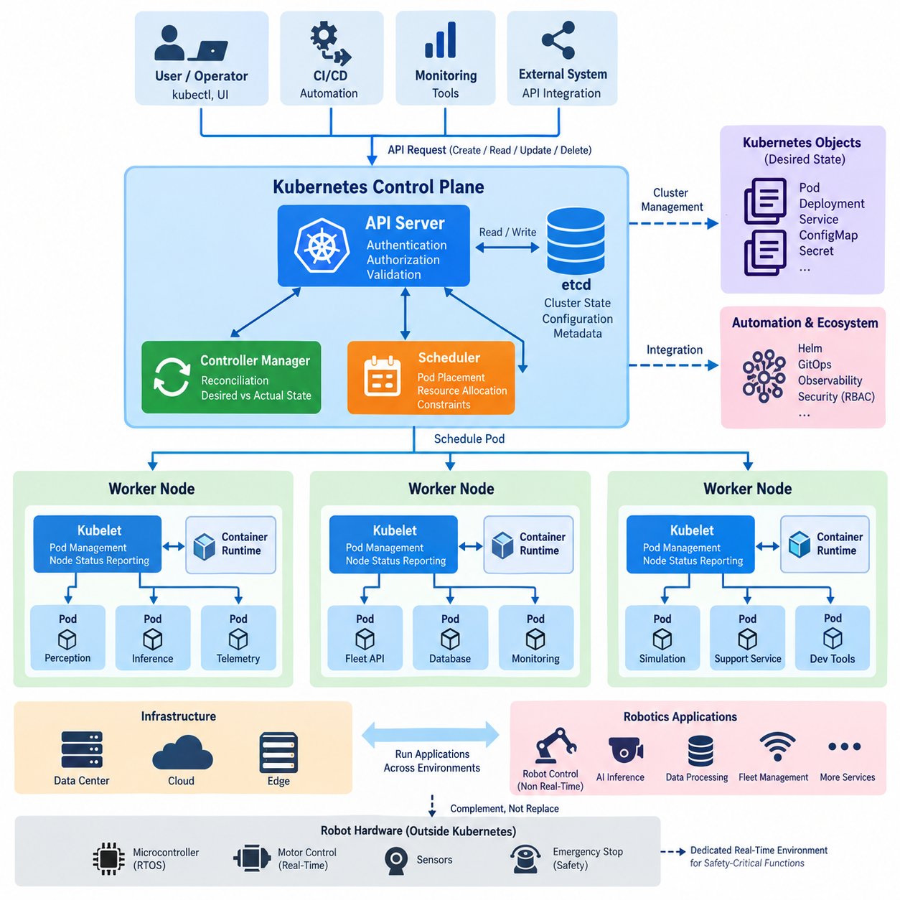
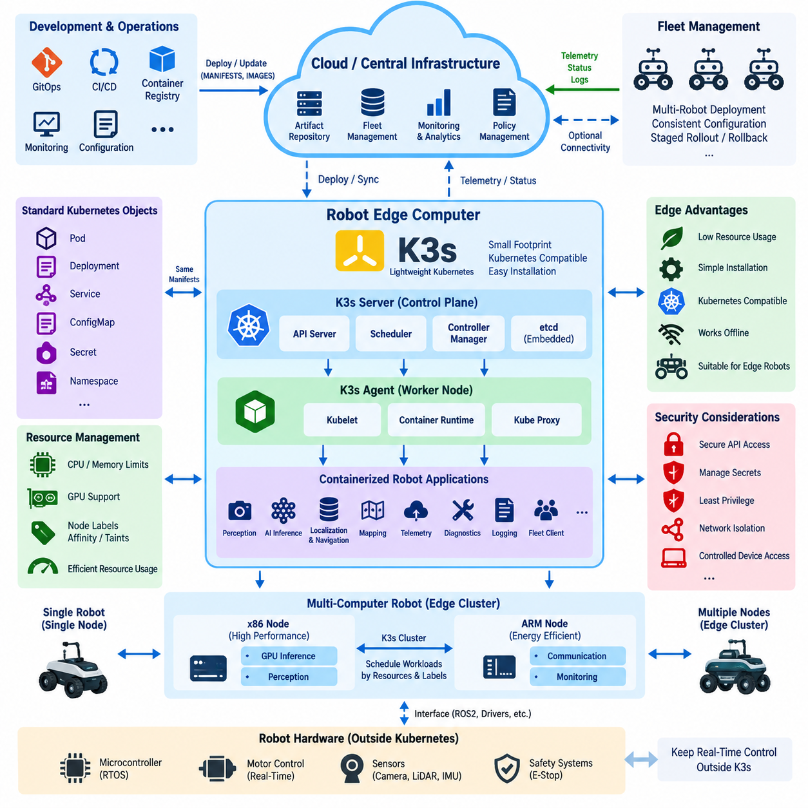
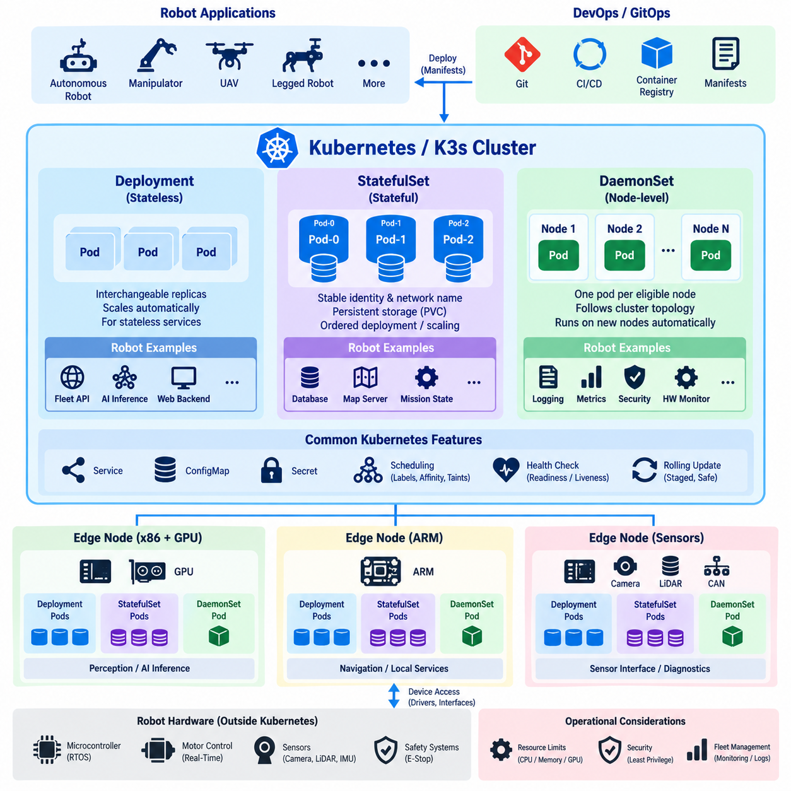
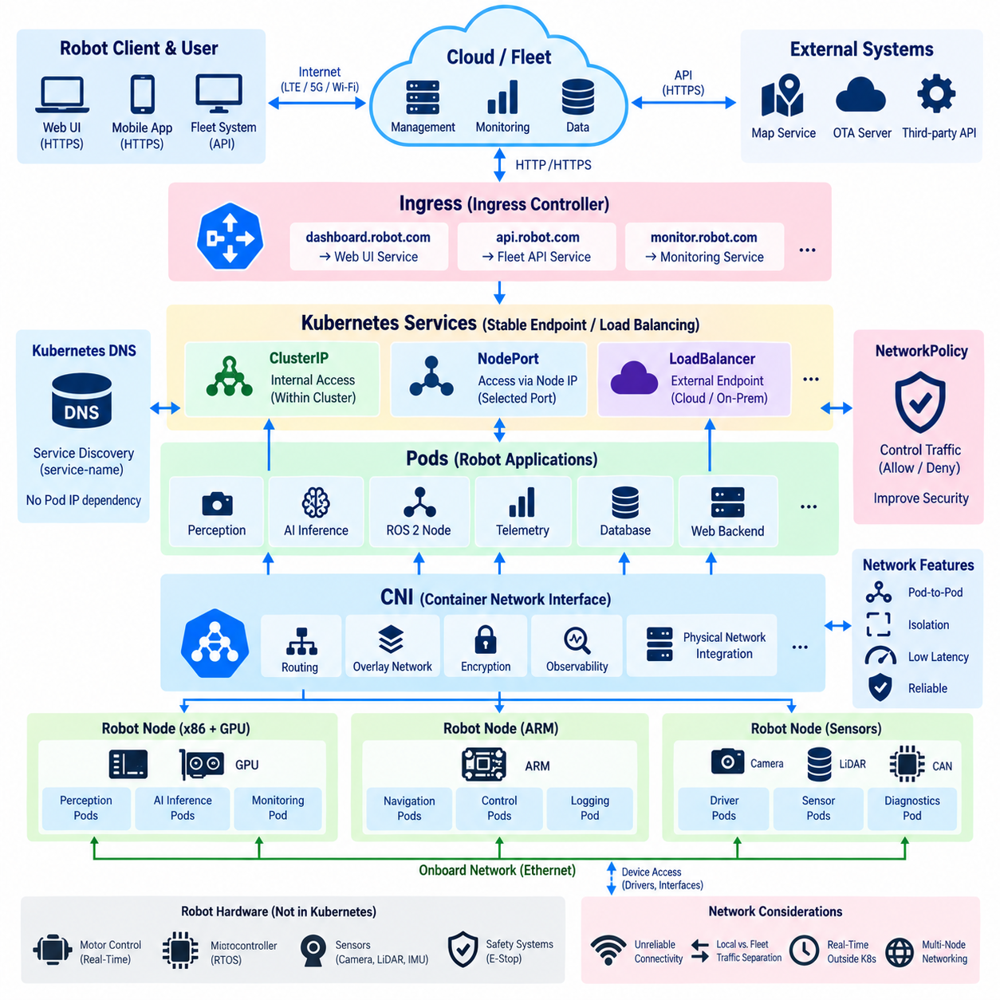
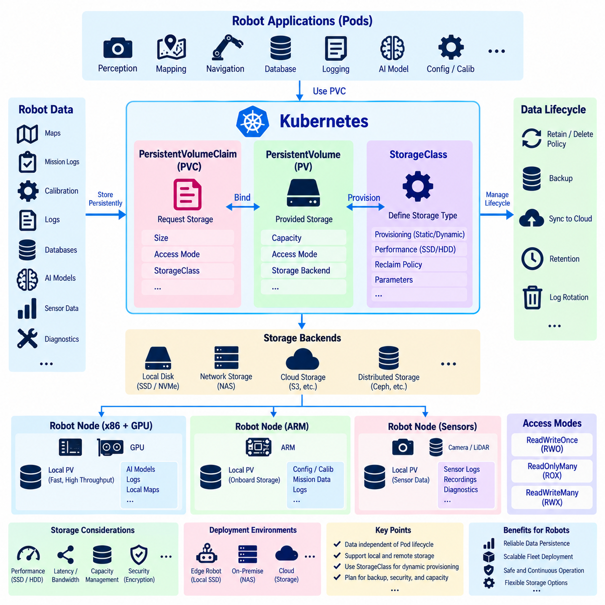
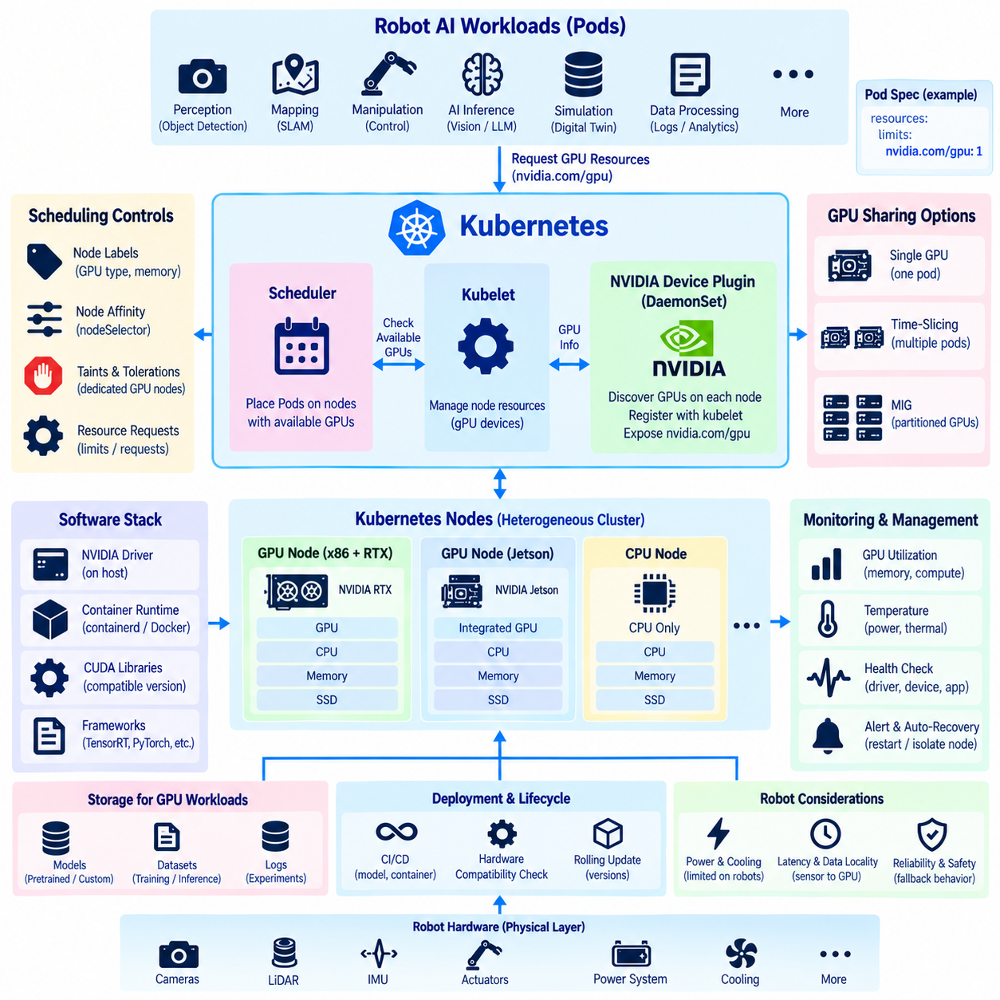
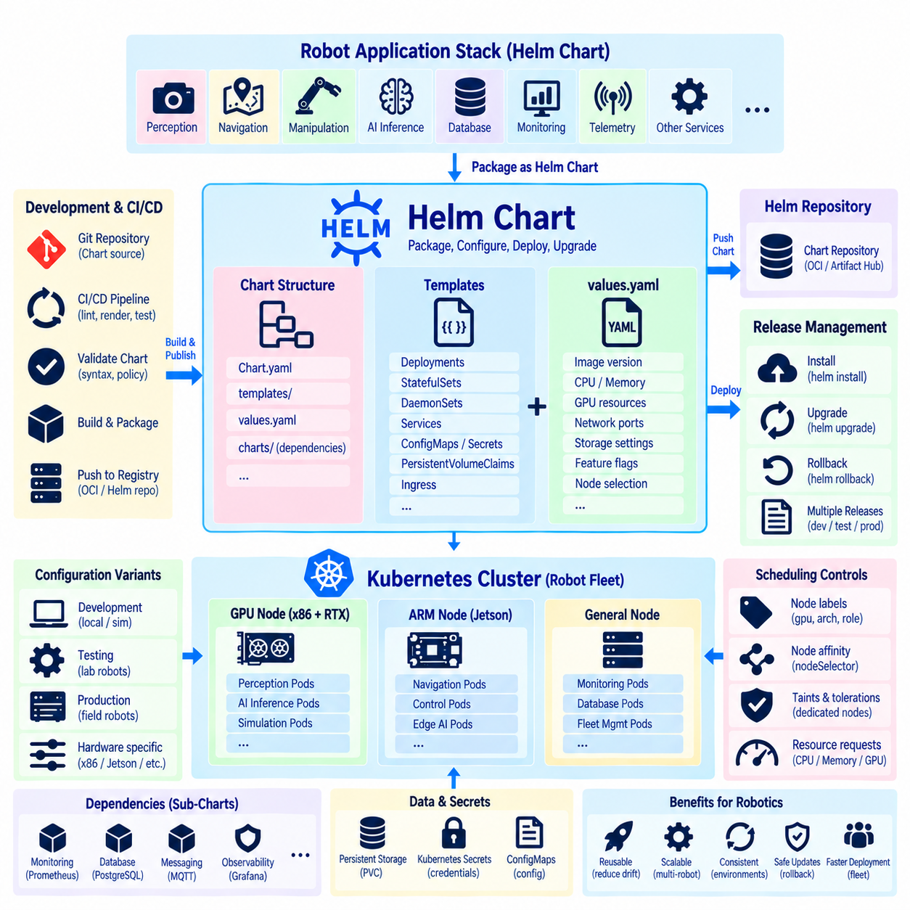
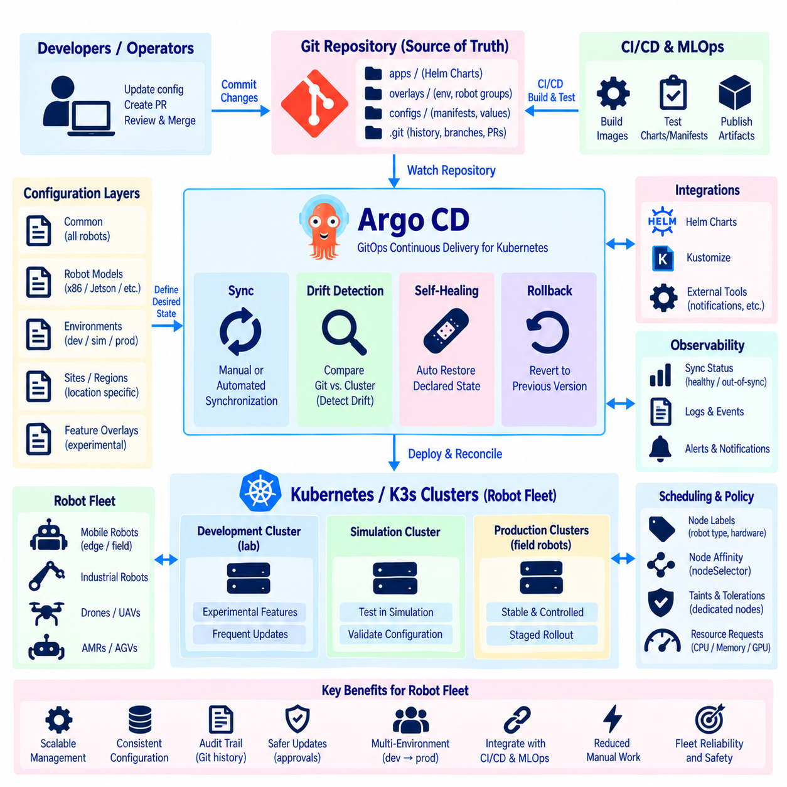
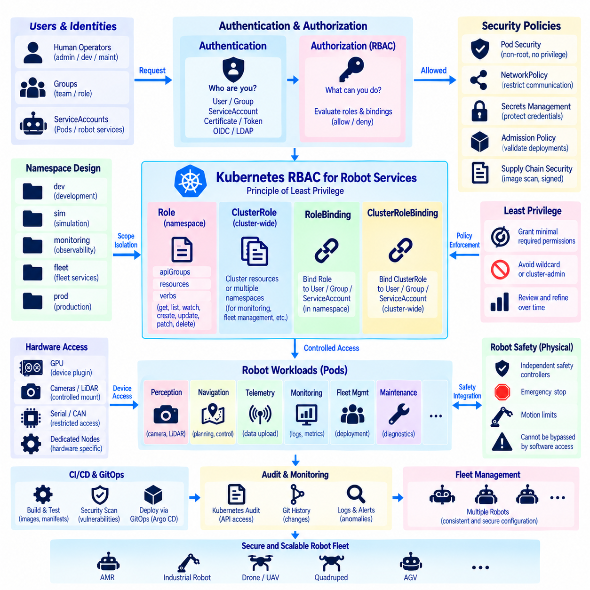
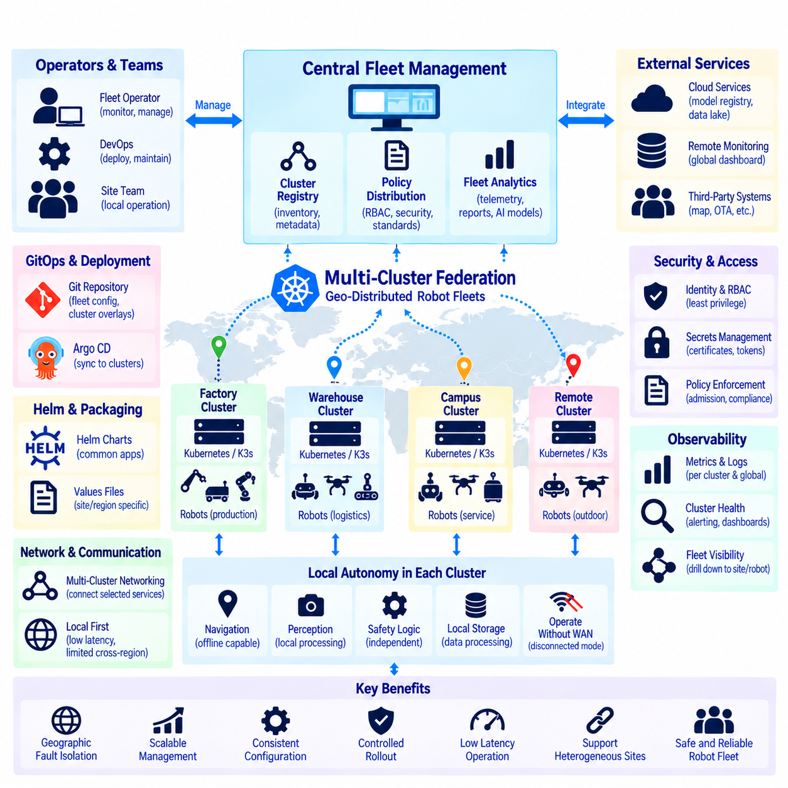

**Volume 10 Robot DevOps and MLOps**

# 4. Kubernetes

## 4.1. Kubernetes Architecture API Server etcd Scheduler Kubelet

{width="7.268055555555556in" height="7.268055555555556in"}

Kubernetes provides a distributed orchestration layer for deploying, scaling, and managing containerized applications across multiple computing nodes. Instead of treating each container or machine as an isolated resource, Kubernetes represents the cluster through declarative objects that describe the desired system state. Controllers continuously compare this desired state with the actual state and perform corrective actions when differences appear.

A Kubernetes cluster is logically divided into the control plane and worker nodes. The control plane maintains cluster-wide configuration, scheduling decisions, and orchestration logic, while worker nodes execute application workloads inside Pods. This separation allows applications to move between machines without requiring operators to manually manage individual processes, containers, or servers whenever infrastructure conditions change.

The API Server is the central communication gateway of the Kubernetes control plane. Administrative tools, controllers, schedulers, kubelets, and external automation systems interact with cluster resources through its API. When an operator submits a deployment specification, the API Server authenticates and authorizes the request, validates the resource definition, and coordinates persistence of the accepted cluster state.

This API-centered architecture is important because Kubernetes components normally do not modify cluster state by directly manipulating each other. Instead, they observe and update resource objects through the API Server. This creates a consistent control interface for Pods, Deployments, Services, Nodes, configuration objects, security policies, and custom resources, while also enabling automation tools and CI/CD systems to use the same management model.

Persistent cluster state is maintained in etcd, a distributed key-value store used as the authoritative data store for Kubernetes control-plane information. Resource definitions, configuration metadata, node information, and other persistent state are represented through data managed by the API Server and stored in etcd. Because loss or corruption of this information can affect cluster recovery, etcd availability, backup, and restoration are critical operational concerns.

The Scheduler determines where newly created Pods should execute. When a Pod exists without an assigned node, the Scheduler evaluates available worker nodes according to resource requirements and scheduling constraints. CPU and memory requests, node selectors, affinity and anti-affinity rules, taints and tolerations, topology constraints, and specialized resources such as GPUs can influence the resulting placement decision.

Scheduling is therefore more than simple load distribution. A robot workload may require an NVIDIA GPU, a particular CPU architecture, direct access to hardware, or execution at a designated edge location. Kubernetes can express these requirements as scheduling constraints so that perception, inference, telemetry, fleet-management, and supporting services are assigned only to nodes capable of executing them correctly.

After scheduling assigns a Pod to a worker node, the kubelet on that node becomes responsible for ensuring that the specified workload is running. The kubelet observes Pod specifications associated with its node and communicates with the container runtime to create and supervise containers. It also reports node and workload status back through the Kubernetes control plane, connecting centralized orchestration with actual execution on each machine.

The kubelet works with a container runtime through the Container Runtime Interface rather than implementing container execution itself. The runtime obtains container images, prepares the required execution environment, and starts or stops containers according to requests originating from Kubernetes. This separation allows the orchestration layer to focus on desired workload state while the runtime handles low-level container lifecycle operations.

Controllers provide the continuous reconciliation behavior that makes Kubernetes fundamentally different from a simple remote execution system. A controller watches selected resources, determines whether their actual condition matches the declared desired condition, and initiates actions when they differ. If a Pod disappears, a node fails, or the requested replica count changes, controllers cooperate through Kubernetes resources to drive the system toward the requested state.

For example, a Deployment can declare that several replicas of a robot fleet backend must remain available. The associated controllers maintain the required replica structure, while the Scheduler finds suitable nodes and kubelets start the resulting Pods. If one Pod fails, Kubernetes does not depend on an administrator manually restarting that exact process; reconciliation creates replacement workload state and allows the orchestration mechanisms to restore the declared configuration.

Communication among these components forms a control loop. A user or automation system submits desired state to the API Server, the accepted state is persisted, controllers observe required changes, the Scheduler assigns unscheduled Pods, and kubelets realize those assignments on worker nodes. Status information then returns through the API, allowing the control plane to continually evaluate whether the running cluster corresponds to its declared configuration.

This architecture is especially useful for robotics platforms that contain many supporting services with different deployment lifecycles. Fleet APIs, telemetry processors, databases, monitoring agents, simulation services, AI inference servers, and development infrastructure can be packaged independently while remaining under a common orchestration model. Kubernetes can therefore provide a consistent operational layer across data centers, cloud infrastructure, and capable edge computers.

However, Kubernetes should not automatically replace the real-time execution mechanisms inside a robot. Hard real-time motor control, emergency stopping, deterministic actuator loops, and tightly bounded safety functions usually require dedicated real-time software or embedded control environments. Kubernetes is better positioned above these layers, orchestrating containerized services whose timing and failure characteristics are compatible with distributed operating infrastructure.

In an edge robotics architecture, this distinction creates a practical hierarchy. Deterministic control can remain within microcontrollers, RTOS environments, or real-time Linux components, while Kubernetes manages higher-level perception, AI inference, data processing, monitoring, and fleet-facing applications. Lightweight Kubernetes distributions can further extend this management model to resource-constrained edge systems, which connects directly to subsequent deployment patterns for robot computing.

## 4.2. K3s Lightweight Kubernetes for Edge Robot Compute [w/Code]

{width="7.268055555555556in" height="7.268055555555556in"}

K3s is a lightweight Kubernetes distribution designed to provide Kubernetes-compatible orchestration with a smaller operational footprint than a conventional cluster installation. It packages essential Kubernetes components into a compact distribution while retaining familiar concepts such as Pods, Deployments, Services, namespaces, and declarative configuration. This makes K3s particularly suitable for edge computing environments where computing, memory, storage, and administrative resources may be constrained.

Traditional Kubernetes deployments are commonly associated with servers, cloud infrastructure, or clusters that have sufficient resources for multiple control-plane services. Edge robots operate under different conditions. Their computers may simultaneously execute perception, localization, navigation, AI inference, telemetry, and hardware interfaces. An orchestration platform therefore needs to minimize its own resource consumption while still providing deployment automation, workload isolation, recovery, and lifecycle management.

K3s addresses this requirement by simplifying the Kubernetes installation and packaging process. Many components required to establish a functional cluster are distributed in an integrated form, reducing the number of separate packages and configuration procedures that operators must manage. A robot developer can consequently deploy a Kubernetes-compatible environment without reproducing the complexity normally associated with building and maintaining a larger data-center-oriented Kubernetes installation.

A K3s system follows the same fundamental control-plane and worker-node model introduced by Kubernetes. Server nodes provide cluster management functions, while agent nodes execute workloads assigned to them. The server side exposes the Kubernetes API and coordinates cluster state, scheduling, and controllers. Agents run the node-side services required to receive workload definitions and execute containers, allowing applications to use standard Kubernetes deployment abstractions.

This compatibility is operationally important because applications developed for Kubernetes can often be transferred to K3s without introducing an entirely different deployment model. Deployment manifests, Services, ConfigMaps, Secrets, namespaces, resource requests, and other Kubernetes objects can remain part of the software delivery process. Development teams can therefore maintain similar operational practices across cloud clusters, on-premise infrastructure, laboratory computers, and robot edge systems.

For a single autonomous robot, K3s can operate as a compact orchestration layer on the robot\'s edge computer. Containerized services such as perception pipelines, AI inference servers, telemetry collectors, diagnostics, logging agents, fleet communication clients, and application-level ROS 2 components can be managed as separate workloads. Their deployment state becomes declarative, allowing software configuration to be reproduced more consistently across multiple robot units.

K3s becomes even more useful when a robot contains several computing devices. A high-performance x86 computer may execute GPU-intensive perception or inference, while an ARM-based edge computer handles communication, monitoring, or auxiliary applications. These computers can participate as nodes in an edge cluster, while Kubernetes scheduling mechanisms determine where compatible workloads should run according to architecture, resource availability, labels, and application constraints.

Resource management is especially important in this environment. A robot computer cannot allow orchestration workloads to consume resources required by navigation or perception. Kubernetes resource requests and limits can define expected CPU and memory consumption, while node labels, affinity rules, taints, and tolerations can restrict particular applications to appropriate hardware. GPU workloads can similarly be directed toward nodes equipped with supported accelerator resources.

Container images also provide a useful deployment boundary for heterogeneous robot software. Different services may require different versions of libraries, middleware, inference frameworks, or system dependencies. Packaging them separately reduces dependency conflicts and makes software versions easier to reproduce. K3s then provides a common mechanism for starting, stopping, replacing, and monitoring these containers rather than relying on numerous machine-specific startup scripts.

The self-healing behavior inherited from Kubernetes is valuable for long-running autonomous systems. If a managed application container terminates unexpectedly, the orchestration layer can attempt to restore the declared workload state. Health checks can help determine whether an application is functioning correctly, while controllers maintain the requested deployment configuration. This does not guarantee robot safety, but it improves operational resilience for appropriately containerized non-real-time services.

Edge networking introduces additional design considerations. Robots may move between wireless networks, operate through LTE or 5G connections, temporarily lose cloud connectivity, or experience variable latency and bandwidth. The local K3s environment should therefore avoid assuming that continuous access to a central cloud system is always available. Critical edge applications should continue performing their local functions when external connectivity becomes degraded or temporarily unavailable.

This leads naturally to a cloud-edge architecture in which central infrastructure manages software artifacts, configuration, monitoring, and fleet-level policies while each robot retains sufficient local computing capability for autonomous operation. Container images and configuration can be prepared centrally and delivered to edge systems through controlled deployment processes. Telemetry and operational status can travel in the opposite direction when network connectivity is available.

K3s can also support multi-robot operational consistency. Instead of configuring every robot manually, a fleet can use standardized manifests and version-controlled configuration to define common application stacks. Hardware-specific differences can be represented through labels, configuration objects, or deployment policies. This approach reduces configuration drift and establishes a foundation for GitOps, staged rollout, rollback, observability, and fleet-wide software lifecycle management.

Security remains essential even when the Kubernetes distribution is lightweight. API access, credentials, certificates, Secrets, container privileges, network exposure, and host-device access must be managed deliberately. Robot applications frequently require access to cameras, LiDARs, GPUs, serial devices, CAN interfaces, or other hardware, but granting unrestricted host privileges merely for convenience can weaken isolation and expand the consequences of compromised software.

K3s should therefore be positioned as an application orchestration layer rather than as the primary controller for hard real-time robot functions. Motor control loops, emergency-stop processing, low-level actuator safety, and other deterministic functions should remain within appropriate microcontrollers, RTOS platforms, safety controllers, or real-time Linux environments. K3s can manage higher-level services while these lower layers preserve deterministic behavior independently of container orchestration.

For edge robotics, the main architectural value of K3s is therefore not simply that it is a smaller Kubernetes distribution. It provides a bridge between modern cloud-native software operations and resource-constrained physical machines. By extending Kubernetes-style deployment, scheduling, recovery, configuration, and lifecycle management toward robot computers, K3s enables edge applications to participate in a unified DevOps architecture without forcing safety-critical real-time control into the orchestration layer.

## 4.3. Robot SW Deployment StatefulSet DaemonSet Patterns [w/Code]

{width="7.268055555555556in" height="7.268055555555556in"}

Kubernetes provides several workload controllers for deploying robot software, and selecting the correct controller depends on the operational behavior of each service. A Deployment is appropriate for largely interchangeable stateless applications, while StatefulSet and DaemonSet address workloads that require persistent identity, ordered lifecycle behavior, or execution on specific nodes. Robot platforms often require all three patterns because their software combines cloud-like services with hardware-dependent edge processes.

A StatefulSet is designed for applications whose individual instances cannot always be treated as interchangeable replicas. Each Pod receives a stable identity that can persist logically across rescheduling and restart operations. This characteristic is useful when software depends on predictable naming, persistent storage, ordered initialization, or stable relationships between application instances rather than simply requiring an arbitrary number of identical Pods.

Persistent storage is one of the most important reasons to use StatefulSet. Through persistent volume claims, individual replicas can maintain storage resources associated with their identities even when containers or Pods are recreated. In robotics infrastructure, this pattern can support local databases, persistent metadata services, map repositories, mission-state stores, or other applications where replacing a Pod must not automatically imply losing its operational data.

Stable network identity is another distinguishing property. StatefulSet Pods receive predictable names rather than being treated solely as anonymous replicas behind a service endpoint. Applications can therefore identify particular members of a distributed system when required. This can be valuable for clustered databases, replicated storage services, coordination systems, or robot infrastructure components whose peers need stable identities during initialization and recovery.

StatefulSet also supports controlled ordering during deployment and scaling. Some distributed applications require one instance to become available before another is initialized, or they may need predictable termination behavior during scale-down operations. Kubernetes can manage this lifecycle more deliberately than a conventional Deployment, although application-level consistency, replication, leader election, and data recovery must still be implemented by the software using the StatefulSet.

A DaemonSet solves a different deployment problem. Instead of maintaining a requested number of interchangeable replicas, it ensures that a particular Pod runs on every eligible node, or on every node matching specified scheduling conditions. When a new node joins the cluster, the corresponding DaemonSet workload can be placed there automatically. When the node disappears, its associated Pod naturally disappears with it.

This behavior is well suited to node-level robot infrastructure. Logging agents, metrics collectors, hardware monitoring services, security agents, network components, device discovery processes, and diagnostic collectors frequently need to operate wherever a robot computing node exists. A DaemonSet allows these functions to follow the cluster topology automatically instead of requiring operators to deploy and maintain one manually configured instance on every edge computer.

Robot hardware interfaces can also benefit from the DaemonSet pattern when carefully constrained. For example, nodes equipped with cameras, LiDAR interfaces, GPUs, CAN adapters, or specialized accelerators can be labeled according to their capabilities. Node selectors, affinity rules, taints, and tolerations can then restrict a DaemonSet so that its Pod runs only on nodes containing the corresponding hardware rather than indiscriminately across the entire cluster.

This distinction between Deployment, StatefulSet, and DaemonSet should reflect software responsibility rather than convenience. A fleet-facing REST service with interchangeable replicas may fit a Deployment. A persistent database may require StatefulSet semantics. A telemetry or hardware-monitoring agent that must exist once per eligible robot computer may fit a DaemonSet. Selecting the controller according to workload behavior makes failure handling and lifecycle management more predictable.

Containerized ROS 2 software introduces additional considerations because processes may depend on network discovery, device access, shared memory, timing behavior, and relationships with other nodes. Packaging every ROS 2 process as an independent Kubernetes workload is not automatically beneficial. Deployment boundaries should instead reflect failure isolation, resource ownership, update frequency, hardware dependencies, communication characteristics, and the operational consequences of restarting individual components.

A robot edge cluster may therefore combine multiple patterns simultaneously. Perception or AI inference services can run as Deployments when replicas are replaceable, node-level monitoring can run as DaemonSets, and persistent operational services can run as StatefulSets. Scheduling constraints can bind GPU-intensive workloads to accelerated nodes and hardware interface services to computers physically connected to sensors, while general services remain movable across compatible computing resources.

Health management is critical regardless of the controller type. Kubernetes probes can help distinguish whether an application has started, remains alive, or is ready to receive dependent traffic. Restarting an unhealthy container may restore a software service, but robotics requires careful interpretation of health. A restarted perception process, for example, may temporarily invalidate downstream data even though Kubernetes successfully restores the container itself.

Rolling updates must therefore consider physical-system behavior. Updating a web backend and updating navigation software on an operating autonomous robot have different consequences. Robot deployments may require staged rollout, maintenance modes, mission-aware update policies, readiness gates, or coordination with fleet management before Pods are replaced. Kubernetes supplies deployment mechanisms, but higher-level operational logic must determine when software replacement is safe for the physical system.

Persistent workloads require similar caution. StatefulSet preserves identity and storage relationships, but it does not by itself guarantee application-level data integrity. Databases and mission-state services still require appropriate replication, transaction handling, backup, recovery, and corruption protection. Likewise, DaemonSet guarantees placement intent rather than functional correctness; a hardware agent can be running as a Pod while the physical device it manages is disconnected or malfunctioning.

For robot fleets, these workload patterns become building blocks for standardized software deployment. Common manifests can define which services are stateless, stateful, or node-bound, while configuration and scheduling policies adapt them to different robot models. Combined with version control and automated deployment pipelines, this reduces manual configuration and enables repeatable software composition across development systems, test robots, production fleets, and edge clusters.

The architectural objective is not to place every robot process under Kubernetes, but to map each software responsibility to the appropriate execution environment. StatefulSet provides stable identity and persistent state, DaemonSet provides topology-aware node-level execution, and Deployment provides replaceable application replicas. Used together, they allow Kubernetes or K3s to manage higher-level robot software while deterministic control and safety-critical functions remain within dedicated real-time layers.

## 4.4. Kubernetes Networking CNI Service Ingress for Robots [w/Code]

{width="7.268055555555556in" height="7.268055555555556in"}

Kubernetes networking provides the communication foundation that allows Pods, Services, nodes, and external systems to exchange data across a cluster. In robotics, this network layer must support more than conventional web applications because robot workloads may include perception, telemetry, fleet APIs, ROS 2 services, monitoring, and edge-to-cloud communication. The architecture must therefore balance connectivity, performance, isolation, mobility, and operational reliability.

The Kubernetes network model assumes that each Pod can obtain its own network identity and communicate with other reachable Pods without requiring application-level address translation between them. This model simplifies distributed application communication because workloads can interact through a consistent network abstraction even when containers are recreated or moved between nodes. The actual implementation of this connectivity is provided by the cluster networking infrastructure.

The Container Network Interface, commonly called CNI, defines the mechanism through which Kubernetes integrates networking implementations with Pods. When a Pod is created, the node invokes the configured CNI implementation to establish its network interface, assign addressing information, and connect it to the cluster network. Kubernetes therefore defines the networking model while CNI-compatible plugins implement the underlying packet forwarding and network behavior.

Different CNI implementations can provide capabilities such as routing, overlays, network policy enforcement, encryption, observability, or integration with physical infrastructure. The appropriate choice for robotics depends on the deployment environment. A data-center fleet backend, an edge cluster inside a robot, and a group of robot computers connected through wireless networks may have very different requirements for latency, bandwidth, topology, and failure recovery.

Pod addresses are dynamic because Pods can be destroyed and recreated during normal Kubernetes operation. Applications should therefore avoid depending directly on a particular Pod IP address. Kubernetes Service provides a stable logical endpoint in front of a changing set of Pods. Services select appropriate backend Pods and allow clients to communicate with an application without needing to know which individual Pod instance currently provides the function.

A ClusterIP Service exposes an application primarily within the cluster and is useful for communication among internal components. For example, perception metadata processing, mission management, telemetry aggregation, or internal APIs may communicate through stable Service names instead of direct Pod addresses. Kubernetes DNS complements this model by allowing applications to discover Services using predictable names rather than embedding changing network addresses in configuration.

Other Service types can expose workloads beyond the internal cluster. NodePort makes a Service reachable through designated ports on cluster nodes, while LoadBalancer can integrate with infrastructure capable of provisioning external load-balancing endpoints. The correct mechanism depends on whether the cluster operates in a cloud environment, an on-premise server environment, or a robot edge network where conventional cloud load balancers may not exist.

Ingress provides an application-level mechanism for routing incoming HTTP and HTTPS traffic toward Services. Rather than exposing every web-facing application independently, an Ingress configuration can define routing according to hostnames or URL paths. An Ingress controller interprets these rules and implements the actual traffic handling, enabling dashboards, fleet APIs, monitoring interfaces, and management applications to share controlled external entry points.

Ingress should not be interpreted as a universal solution for every robot communication protocol. Many robotics workloads use UDP, DDS, ROS 2 discovery traffic, streaming protocols, custom TCP communication, or direct device interfaces that do not naturally fit HTTP-oriented routing. These applications may require Services, host networking, specialized gateways, CNI configuration, or network designs outside the conventional Ingress model.

ROS 2 introduces particularly important networking considerations because its communication commonly relies on DDS-based discovery and data exchange. Multicast behavior, interface selection, Quality of Service, container boundaries, and communication across subnets can influence whether ROS 2 nodes discover one another correctly. A Kubernetes network that works well for ordinary REST microservices may therefore require additional design and testing before it can transparently support ROS 2 communication.

Host networking can sometimes simplify access to robot hardware networks or DDS communication by allowing a Pod to use the node\'s network namespace directly. However, this approach reduces network isolation and can create port conflicts or increase security exposure. It should therefore be applied selectively to workloads with a clear requirement rather than becoming the default method for every containerized robot process.

NetworkPolicy provides an important security mechanism by defining which network flows should be permitted between workloads when supported by the selected networking implementation. A robot platform can use such policies to restrict communication among perception services, fleet clients, databases, monitoring systems, and management APIs. This limits unnecessary connectivity and reduces the potential impact of a compromised container or incorrectly configured service.

Robot edge networks must also account for unreliable external connectivity. An autonomous mobile robot may transition between Wi-Fi access points, move through weak coverage areas, or communicate through LTE or 5G links with changing latency and bandwidth. Local Kubernetes or K3s networking should therefore allow essential onboard services to continue communicating even when the connection to a central fleet or cloud platform is temporarily unavailable.

This requirement encourages separation between local robot traffic and external fleet traffic. High-rate sensor streams, local perception results, navigation messages, and control-related data should normally remain within the robot or local edge network whenever possible. Fleet status, mission commands, software management, selected telemetry, and aggregated events can cross the external network boundary through controlled interfaces, reducing bandwidth consumption and dependence on remote connectivity.

Multi-computer robots introduce another layer of complexity. An x86 GPU computer, ARM edge controller, and additional sensor-processing computers may participate in the same K3s cluster while communicating over Ethernet or another onboard network. CNI configuration, node addressing, routing, MTU settings, firewall rules, and interface selection must remain consistent so that workloads can communicate predictably across these heterogeneous computing nodes.

Network design must also respect the separation between Kubernetes-managed applications and deterministic robot control. Emergency-stop signals, safety buses, tightly bounded motor-control communication, and other safety-critical paths should not depend solely on ordinary Kubernetes networking. These functions generally belong to dedicated real-time or safety communication layers, while Kubernetes networking manages higher-level software communication, telemetry, monitoring, APIs, and application data.

For robot fleets, CNI, Service, and Ingress therefore form complementary layers rather than competing mechanisms. CNI establishes Pod connectivity, Service provides stable discovery and access to changing workloads, and Ingress controls selected application-level traffic entering the cluster. Combined with DNS, security policies, edge-aware routing, and appropriate separation of real-time functions, these mechanisms provide a scalable networking foundation for Kubernetes- and K3s-based robot software deployments.

## 4.5. Persistent Storage PV PVC StorageClass for Robot Data [w/Code]

{width="7.268055555555556in" height="7.268055555555556in"}

Persistent storage is essential in Kubernetes-based robot systems because containers and Pods are intentionally replaceable, while many forms of robot data must survive restarts, rescheduling, software updates, and node maintenance. Maps, mission records, calibration parameters, logs, databases, learned models, diagnostic histories, and selected sensor data may need lifetimes much longer than the containers that create or consume them. Kubernetes separates these persistent data requirements from the application lifecycle.

A PersistentVolume, or PV, represents storage capacity made available to the Kubernetes cluster. The underlying storage can originate from local disks, network-attached storage, cloud storage systems, distributed storage platforms, or other supported storage backends. Kubernetes exposes this capacity through a standardized resource abstraction, allowing applications to consume persistent storage without embedding every physical storage implementation detail directly into their container configuration.

A PersistentVolumeClaim, or PVC, represents an application\'s request for persistent storage. Instead of requiring a Pod to identify a particular disk or storage server, the workload specifies characteristics such as requested capacity and access requirements through a PVC. Kubernetes then binds the claim to an appropriate PV, separating what the application needs from how the infrastructure administrator or storage system actually provides that capacity.

This separation is particularly valuable for robot fleets because identical application software may operate on different hardware configurations. A development robot may store data on a local SSD, a production robot may use redundant onboard storage, and a data-center service may use network or cloud storage. The application can continue requesting storage through the same Kubernetes abstraction while the physical implementation changes according to the deployment environment.

StorageClass extends this model by describing categories of storage and enabling dynamic provisioning when supported by the storage environment. Rather than requiring administrators to manually create every PV in advance, a PVC can request a particular StorageClass and trigger creation of suitable storage. Different classes can represent distinctions such as local high-performance storage, network storage, archival capacity, or infrastructure-specific storage policies.

Dynamic provisioning can simplify large robot deployments because storage resources can be created according to standardized policies instead of being configured individually for every application instance. However, edge robots require careful consideration because their storage is often physically attached to a particular computer. A dynamically provisioned local volume cannot automatically acquire the mobility characteristics of shared network storage simply because Kubernetes represents it through a common abstraction.

Access modes describe how a volume is intended to be mounted by workloads. Depending on the storage technology, a volume may support access from a single node or from multiple nodes under defined read and write conditions. The selected mode must match both the application\'s behavior and the capabilities of the storage backend. Kubernetes declarations cannot provide concurrent access characteristics that the underlying storage technology itself does not support.

Local persistent storage is attractive for robotics because it can provide high throughput, predictable access, and continued operation without cloud connectivity. High-rate logs, local maps, inference models, temporary sensor recordings, and mission data can remain close to the robot\'s compute resources. The disadvantage is that local storage is tied to physical hardware, so workload rescheduling to another node may not automatically make the same data available there.

Network-attached storage provides a different tradeoff. Multiple computing nodes can potentially access centrally managed data, simplifying sharing, backup, and fleet-level data collection. However, network latency, bandwidth, availability, and disconnection must be considered carefully. A mobile robot should not require continuous access to remote storage for functions that must continue when Wi-Fi, LTE, 5G, or an external network connection becomes unavailable.

For this reason, robot data should be classified according to operational importance and access patterns. Data required immediately for autonomous operation, such as active maps, essential configuration, or locally required models, should normally remain available on the robot. Large historical logs, training datasets, fleet analytics data, and long-term archives can be synchronized or uploaded to central infrastructure when suitable connectivity is available.

StatefulSet commonly works with PVCs when each replica requires persistent storage associated with a stable identity. A database Pod, for example, can be recreated while retaining the volume associated with that logical instance. This relationship is useful for persistent robot infrastructure services, but StatefulSet does not eliminate the need for database replication, backup, integrity checking, or recovery procedures. Kubernetes manages resources, not application-level data correctness.

Storage lifecycle policies also require deliberate design. Depending on the storage configuration, deleting a claim or application may retain or remove the underlying data. This distinction is important for robotics because automatically deleting mission records, diagnostic evidence, calibration data, or operational logs could be undesirable. Conversely, retaining every temporary dataset indefinitely can exhaust limited onboard storage and eventually interfere with robot operation.

Capacity management is therefore a practical concern on edge computers. Cameras, LiDARs, telemetry systems, debugging tools, and AI pipelines can generate data rapidly, while robot SSD capacity remains finite. Storage quotas, log rotation, retention periods, compression, event-based recording, and controlled synchronization to central storage should complement Kubernetes volume management. Persistent storage prevents unintended loss, but it does not automatically prevent uncontrolled accumulation.

Performance requirements should also influence storage placement. AI models and frequently accessed map data may benefit from fast local SSD or NVMe storage, while long-term logs may tolerate slower storage. Databases may require predictable latency and durability guarantees, whereas temporary processing data may prioritize throughput. StorageClass and scheduling policies can help represent these differences, but actual performance still depends on the physical storage devices and network architecture.

Security must extend to persistent data as well as running containers. Robot storage can contain operational logs, maps, credentials, configuration, recorded sensor information, or proprietary models. Access should therefore be limited to workloads that require it, and appropriate encryption, credential management, filesystem permissions, backup protection, and secure deletion policies should be considered according to the sensitivity and operational importance of the stored information.

Backup and synchronization should be designed separately from persistence. A PV can allow data to survive a Pod restart while still being vulnerable to SSD failure, node damage, filesystem corruption, or loss of the robot itself. Important robot data may therefore require replication or scheduled transfer to another device, NAS, data center, or cloud environment. Persistence provides continuity at one failure level, whereas backup provides recovery from broader failures.

In a Kubernetes or K3s robot architecture, PV, PVC, and StorageClass therefore form a layered storage model. PV represents available persistent capacity, PVC expresses the workload\'s storage requirement, and StorageClass defines how appropriate storage can be provisioned according to policy. Combined with local storage, centralized synchronization, lifecycle controls, security, and backup strategies, these abstractions allow robot data to remain independent from the replaceable lifecycle of containers and Pods.

## 4.6. GPU Resource Management nvidia device plugin in K8s [w/Code]

{width="7.268055555555556in" height="7.268055555555556in"}

GPU acceleration is increasingly important in robot computing because perception, deep learning inference, visual localization, mapping, simulation, and foundation-model workloads can require substantially more parallel computation than CPUs alone provide. In Kubernetes, GPUs must be represented as schedulable resources so that workloads can request accelerators explicitly and the scheduler can place Pods only on nodes where suitable GPU resources are available.

Kubernetes does not directly implement vendor-specific GPU management inside its core scheduling system. Instead, hardware vendors can expose specialized devices through device plugins. For NVIDIA GPUs, the NVIDIA device plugin integrates GPU resources with Kubernetes and makes detected devices visible to the kubelet. Once registered, GPU capacity becomes part of the node\'s allocatable resources and can be requested by containerized applications.

The NVIDIA device plugin typically operates as a DaemonSet so that an instance runs on each eligible GPU-equipped node. Each plugin instance discovers supported NVIDIA devices on its local machine and communicates their availability to the kubelet. This node-level deployment pattern automatically follows cluster topology, allowing newly added GPU nodes to advertise their accelerator resources without manually configuring every application workload.

A container requests NVIDIA GPU resources through its Kubernetes resource specification, commonly using the extended resource name nvidia.com/gpu. The scheduler considers this request when selecting a node and avoids placing the Pod on nodes without sufficient advertised GPU capacity. This creates a declarative relationship between AI workload requirements and physical accelerator availability instead of relying on manually selected machines.

GPU requests differ from ordinary CPU and memory resource management. CPU resources can commonly be divided into fractional quantities, whereas conventional Kubernetes GPU allocation generally treats exposed GPU devices as discrete resources. A workload requesting one GPU is therefore assigned an available GPU resource rather than an arbitrary fraction of GPU compute. More advanced sharing mechanisms require additional GPU-specific configuration and platform support.

The software stack beneath the device plugin remains important. A GPU node requires compatible NVIDIA drivers and a container runtime environment capable of exposing GPU devices to containers. CUDA libraries and application dependencies must also be compatible with the host driver environment. Kubernetes scheduling can correctly assign a GPU workload while the application still fails if the underlying driver, runtime, CUDA, or framework versions are incompatible.

Robot clusters frequently contain heterogeneous computing hardware. One node may contain an NVIDIA RTX-class GPU, another may use a Jetson platform with an integrated GPU, and additional nodes may provide only CPU resources. Labels and scheduling constraints can describe these differences so that perception, inference, mapping, or simulation workloads are directed toward appropriate hardware while lightweight services remain free to execute on general-purpose nodes.

Node labels can express characteristics that are not represented by the simple GPU count. A robot platform may distinguish GPU architecture, memory capacity, performance class, power profile, or application role. Node selectors and node affinity can then combine these labels with GPU resource requests. This prevents a workload from being scheduled merely because a node has a GPU when the application actually requires a particular accelerator capability.

Taints and tolerations provide another control mechanism for dedicated accelerator nodes. A high-performance GPU computer can be tainted so that ordinary workloads are not scheduled there unless they explicitly tolerate the restriction. GPU-intensive applications can then receive both the required accelerator resource and permission to use the specialized node. This helps preserve expensive GPU capacity for workloads that actually benefit from it.

GPU memory introduces a resource-management challenge because requesting a GPU does not automatically express the detailed memory behavior of an application. Two inference workloads may have very different VRAM requirements even when both request GPU access. Model size, batch size, sensor resolution, TensorRT engines, intermediate tensors, and concurrent CUDA workloads can all affect memory consumption, so GPU deployment requires application-level profiling in addition to Kubernetes resource declarations.

Sharing a GPU among multiple workloads can improve utilization when individual applications do not consume the entire device. NVIDIA-supported approaches may include time-slicing or hardware partitioning technologies on compatible GPUs. These mechanisms can increase workload density, but they introduce additional considerations involving isolation, memory usage, latency, scheduling predictability, and failure behavior. They should therefore be selected according to the robot workload rather than enabled only to maximize utilization.

Multi-Instance GPU, commonly called MIG, provides hardware-supported partitioning on compatible NVIDIA GPUs. A physical GPU can be divided into isolated GPU instances with defined compute and memory resources, allowing multiple workloads to use separate partitions. In Kubernetes environments that support the required configuration, these instances can be exposed as schedulable resources, providing stronger resource separation than simple time-based sharing.

Robotics places additional constraints on GPU scheduling because accelerator workloads may participate in latency-sensitive processing pipelines. Camera frames may pass through preprocessing, object detection, tracking, localization, and planning stages under strict timing expectations. Moving a workload to any available GPU node may be undesirable if sensor data must cross a slower network link. Scheduling therefore needs to consider data locality and physical robot topology as well as GPU availability.

GPU failure handling also requires more than restarting a container. A process can become unhealthy because of exhausted GPU memory, driver errors, device faults, thermal conditions, or application failures. Kubernetes health mechanisms can restart workloads, while monitoring systems can observe application and node status. However, repeated failures may indicate a hardware or driver problem that requires node isolation, workload relocation, maintenance, or robot-level fallback behavior.

Monitoring GPU utilization is essential for designing and operating robot clusters efficiently. Metrics such as GPU utilization, memory usage, temperature, power consumption, and workload behavior can reveal whether accelerators are overloaded, underused, or approaching thermal limits. This information is especially important for mobile robots because electrical power and cooling capacity are limited and GPU load directly influences energy consumption and thermal design.

GPU resource management should also be coordinated with software deployment and model lifecycle management. A new AI model may require more VRAM, different CUDA libraries, or a different accelerator architecture than the previous version. CI/CD and MLOps pipelines should therefore validate hardware compatibility before rollout. Scheduling policies, container images, model artifacts, and node capabilities must evolve together rather than being managed as independent concerns.

In a Kubernetes or K3s robot architecture, the NVIDIA device plugin therefore acts as the bridge between physical NVIDIA accelerators and Kubernetes resource scheduling. Device discovery exposes GPUs to the cluster, resource requests connect workloads to available accelerators, and labels, affinity, taints, partitioning, and monitoring refine placement and utilization. Together, these mechanisms enable scalable GPU orchestration while robot-specific design preserves latency, power, thermal, and safety requirements.

## 4.7. Helm Charts for Robot Application Packaging [w/Code]

{width="7.268055555555556in" height="7.268055555555556in"}

Helm is a package manager for Kubernetes that simplifies the definition, installation, configuration, and upgrade of complex applications. Instead of maintaining many independent Kubernetes manifests for every robot service, Helm groups related resources into a reusable package called a Chart. For robotics, this provides a practical way to package perception, navigation, telemetry, monitoring, AI inference, and supporting services as versioned deployment units.

A Helm Chart contains templates and configuration information required to generate Kubernetes resources. Typical resources may include Deployments, StatefulSets, DaemonSets, Services, ConfigMaps, Secrets references, PersistentVolumeClaims, and Ingress definitions. Rather than duplicating nearly identical YAML files for different robots or environments, templates define common structures while configurable values describe the differences between deployments.

The values.yaml file is central to this configuration model. It provides default parameters that Helm templates can reference when generating Kubernetes manifests. A robot application can expose settings such as container image versions, CPU and memory requirements, GPU requests, network ports, storage capacity, logging levels, feature switches, or node-selection rules. These parameters can then be changed without modifying the underlying resource templates.

This separation between templates and values is useful when one robot software stack must support multiple hardware variants. An x86 robot with an NVIDIA RTX GPU may require different resource limits and scheduling rules from an ARM-based Jetson robot. The same Chart structure can represent both systems while separate values files define hardware-specific container images, GPU requirements, storage paths, node labels, and application configuration.

Helm templates use parameter substitution and template logic to generate the final Kubernetes resource definitions. Conditional sections can include or exclude resources according to configuration, while loops can generate repeated structures when appropriate. This allows a single Chart to support optional components such as GPU inference, monitoring, external storage, or fleet connectivity without requiring a completely separate manifest collection for every combination.

A Chart normally includes metadata describing the package itself and can distinguish the Chart version from the application version being deployed. This distinction is important because deployment logic and application software may evolve independently. A new container image may update the robot application, while a Chart revision may change Kubernetes configuration, resource policies, probes, storage definitions, or scheduling behavior without necessarily changing the application code.

Helm releases represent installed instances of Charts. The same Chart can be installed multiple times with different release names and configuration values, allowing development, simulation, testing, and production environments to share a common packaging structure. In robot fleets, release configuration can also distinguish robot models, hardware generations, laboratory systems, field-test units, or groups operating with different software policies.

Upgrade management is one of Helm\'s most valuable operational functions. When container versions, configuration parameters, resource definitions, or deployment policies change, Helm can apply an updated release based on the revised Chart and values. This provides a structured alternative to manually editing individual Kubernetes resources and helps operators understand which package configuration represents the intended application state.

Helm also maintains release information that can support rollback when an update must be reversed. If a new application configuration produces unacceptable behavior, operators can restore a previous release revision. However, rollback of Kubernetes resources does not automatically reverse external database changes, model formats, firmware updates, or physical robot state. Robot deployment procedures must therefore consider application compatibility beyond the Helm release itself.

Dependencies allow one Chart to incorporate other Charts required by an application. A robot management platform might depend on monitoring, database, message-processing, or observability components that are maintained separately. Dependency management enables these components to be assembled into a larger application package while preserving modularity. Care is still required to control versions and avoid introducing unnecessary infrastructure onto resource-constrained robot computers.

Helm Charts can represent different Kubernetes workload patterns within the same application package. A stateless fleet communication service may be generated as a Deployment, node-level monitoring as a DaemonSet, and a persistent database as a StatefulSet with PVCs. Services can provide stable networking, while GPU requests and scheduling constraints can direct AI workloads toward nodes exposing NVIDIA accelerator resources.

This makes Helm particularly useful for multi-computer robot architectures. A Chart can define which workloads belong on GPU nodes, ARM edge computers, sensor-connected machines, or general-purpose nodes. Node selectors, affinity, taints and tolerations, resource requests, and configurable labels can be expressed through templates and values, allowing deployment policy to remain version-controlled alongside the rest of the robot application configuration.

Configuration should nevertheless be divided carefully. Values files are appropriate for deployment parameters, but sensitive credentials should not simply be stored as plain text in source repositories. Kubernetes Secrets or external secret-management mechanisms should be integrated where appropriate. Similarly, robot-specific calibration data or unique hardware identifiers may require separate lifecycle management rather than being embedded permanently inside a generic Chart.

Helm fits naturally into CI/CD and GitOps workflows. A pipeline can validate Chart syntax, render templates, inspect generated manifests, verify container versions, and test deployment behavior before promotion. Approved Chart versions and values can then become reproducible descriptions of the robot software stack. This creates traceability between source changes, container artifacts, deployment configuration, and the software actually installed on a robot cluster.

Testing is particularly important because a syntactically valid Chart can still generate an operationally incorrect robot deployment. Templates should be checked with representative values for different hardware profiles, and generated resources should be reviewed for scheduling, networking, storage, permissions, and resource allocation. Integration testing can further verify that services discover one another and that hardware-dependent workloads reach the correct devices.

Robot software updates also require awareness of physical operating state. Helm can execute an upgrade, but it does not inherently know whether a robot is moving, charging, carrying a payload, or performing a safety-sensitive mission. Fleet-management or deployment systems should therefore determine when an upgrade is permitted. Helm provides packaging and release mechanisms, while robot-level operational logic controls the safe timing of deployment.

For large fleets, reusable Charts reduce configuration duplication and help prevent drift between individual robots. Common defaults can define the standard software stack, while controlled values files represent differences among hardware models, environments, or deployment groups. Combined with version control, automated validation, staged rollout, and observability, this approach supports repeatable software delivery from development clusters to production edge robots.

Helm therefore serves as a packaging and configuration layer above Kubernetes or K3s resources. Charts organize related manifests, templates convert reusable definitions into environment-specific resources, values describe deployment differences, and releases track installed application configurations. For robotics, these mechanisms provide a scalable foundation for packaging complex software stacks while preserving hardware awareness, reproducibility, controlled updates, and fleet-wide lifecycle management.

## 4.8. GitOps with ArgoCD for Robot Fleet Config Mgmt [w/Code]

{width="7.268055555555556in" height="7.268055555555556in"}

GitOps is an operational model in which Git repositories serve as the authoritative source for the desired state of software infrastructure and application configuration. Instead of operators manually changing Kubernetes resources on individual robots, configuration changes are committed to Git and automatically reconciled with running clusters. For robot fleets, this creates a controlled and traceable method for managing software configuration across many distributed systems.

Argo CD is a declarative continuous delivery tool designed for Kubernetes and commonly used to implement GitOps workflows. It continuously compares the desired application state stored in Git with the actual state running in a Kubernetes or K3s cluster. When differences are detected, Argo CD can report the drift or synchronize the cluster so that deployed resources return to the approved configuration defined in the repository.

This model changes the role of Git from a source-code repository into a configuration control plane. Kubernetes manifests, Helm Charts, Kustomize definitions, and environment-specific configuration can be versioned together with change history. A commit therefore becomes more than a documentation event: it can represent an intended operational change to robot software, resource allocation, networking, storage, monitoring, or deployment policy.

A robot fleet usually requires configuration at several levels. Some settings are common to every robot, while others depend on robot model, hardware generation, operational site, development stage, or mission role. A Git repository can organize these layers so that shared configuration remains centralized while overlays or values files describe controlled differences between groups without duplicating the entire deployment definition.

Argo CD represents managed deployments through Application resources. An Application identifies the desired source in Git, the relevant path or package, the target Kubernetes cluster and namespace, and synchronization behavior. A fleet-management architecture can therefore associate applications with development clusters, simulation environments, field robots, or regional robot groups while retaining a common Git-based management model.

Synchronization can be manual or automated according to operational requirements. Manual synchronization allows an operator to review an approved Git change before applying it, while automated synchronization can continuously reconcile selected environments. Robot systems often benefit from combining both approaches because laboratory clusters may accept rapid automation whereas field robots may require controlled maintenance windows or additional safety checks before software changes are activated.

Configuration drift occurs when the actual state of a cluster differs from the desired state stored in Git. Manual edits, emergency troubleshooting, failed updates, or unintended configuration changes can create such differences. Argo CD detects this condition by comparing live resources with repository definitions. Operators can then investigate the difference or use synchronization to restore the declared configuration, reducing long-term divergence among fleet members.

Self-healing extends this reconciliation concept by allowing Argo CD to correct certain unauthorized or accidental changes automatically. If a managed Kubernetes resource is modified directly, the controller can restore the Git-defined state. This behavior improves consistency, but robotics requires careful policy design because some runtime changes may be intentional responses to hardware faults, degraded operation, or field maintenance and should not always be overwritten automatically.

Git history provides an important audit trail for robot fleet configuration. Changes can be associated with commits, authors, reviews, branches, and pull requests, making it possible to determine how a deployment definition evolved. When a field problem appears after an update, engineers can compare revisions and identify configuration changes associated with the event rather than relying only on manually maintained deployment records.

Rollback in a GitOps workflow is normally achieved by restoring or reverting the desired configuration in Git and allowing reconciliation to apply the previous state. This keeps recovery consistent with the same source-of-truth mechanism used for normal deployment. As with Helm rollback, however, reverting Kubernetes configuration does not automatically reverse database migrations, firmware changes, model formats, calibration updates, or physical state transitions.

Argo CD integrates naturally with Helm-based robot application packaging. Helm defines reusable application templates and configurable values, while Git stores the approved Chart references and environment-specific configuration. Argo CD observes these definitions and deploys the rendered resources to target clusters. This separates application packaging from fleet configuration management while allowing both to participate in a unified declarative delivery process.

A practical fleet repository may separate base application definitions from robot-group overlays. Development robots might receive experimental container versions, test features, or additional debugging services, while production robots use validated images and stricter resource policies. Site-specific overlays can describe storage, networking, endpoints, or hardware-related values while preserving common application definitions across the wider fleet.

Progressive deployment is particularly important for robot fleets because a configuration that works in simulation may behave differently on physical hardware. Changes can first be applied to development systems, then to a small validation group, and finally to broader production groups after observation. Git branches, directories, version references, and external rollout mechanisms can support this staged promotion while preserving an auditable path between deployment stages.

Robot connectivity introduces challenges that are less prominent in conventional data centers. Mobile robots may temporarily lose network access, operate through cellular connections, or remain offline for extended periods. GitOps architecture should therefore avoid assuming uninterrupted connectivity. Local Kubernetes workloads must continue operating safely when disconnected, while synchronization can resume when communication with the management infrastructure becomes available again.

Security is critical because a GitOps repository can indirectly control software running across an entire fleet. Repository permissions, branch protection, review policies, deployment credentials, Kubernetes RBAC, and Argo CD access controls should restrict who can modify or apply configuration. Sensitive credentials should remain outside ordinary Git content and be handled through appropriate secret-management mechanisms rather than committed as plain text.

Observability should accompany synchronization so that configuration success is not confused with robot operational success. Argo CD can indicate whether Kubernetes resources match the desired state, but this does not prove that perception accuracy, navigation, sensors, actuators, or mission behavior are functioning correctly. Fleet telemetry and application monitoring must therefore validate the physical and functional consequences of each deployment.

GitOps also strengthens CI/CD and MLOps integration. CI pipelines can build and test containers, validate manifests or Helm Charts, and publish approved artifacts. A subsequent Git change can reference the validated image or model version, after which Argo CD performs deployment reconciliation. This separates artifact creation from deployment authorization and creates traceability from source code and models to the configuration running on robots.

For robot fleets, GitOps with Argo CD therefore provides a scalable configuration-management layer above Kubernetes or K3s. Git defines the desired state, Argo CD continuously compares it with deployed clusters, and synchronization controls how approved changes propagate. Combined with Helm, CI/CD, staged rollout, security controls, telemetry, and robot-aware safety policies, this architecture enables reproducible and auditable fleet configuration without depending on manual updates to individual robots.

## 4.9. Kubernetes RBAC and Security Policy for Robot Services [w/Code]

{width="7.268055555555556in" height="7.268055555555556in"}

Kubernetes Role-Based Access Control, or RBAC, provides a structured mechanism for determining which users, services, and automated processes can perform specific actions on cluster resources. In a robot system, this is important because navigation, perception, telemetry, fleet management, monitoring, and maintenance services should not automatically receive identical privileges. Access should instead follow the principle of least privilege.

Kubernetes authentication identifies who is making a request, while authorization determines whether that identity is permitted to perform the requested operation. RBAC participates in the authorization stage by evaluating rules associated with users, groups, and ServiceAccounts. This separation allows robot platforms to distinguish human operators from software workloads and assign permissions according to operational responsibility.

A Role defines permissions within a particular namespace. Its rules can specify API groups, resource types, and allowed verbs such as get, list, watch, create, update, patch, or delete. A robot telemetry service, for example, may require permission to read selected configuration resources without receiving permission to modify Deployments or Secrets. Restricting permissions reduces the potential impact of compromised or malfunctioning software.

A ClusterRole uses a similar rule structure but can represent permissions that apply across namespaces or to cluster-scoped resources. ClusterRoles are useful for monitoring agents, infrastructure controllers, or fleet-management components that legitimately require broader visibility. Because these permissions can affect a larger portion of the system, they should be designed carefully and granted only where cluster-wide access is operationally necessary.

Roles and ClusterRoles do not grant permissions by themselves. RoleBindings and ClusterRoleBindings associate these permission definitions with identities such as users, groups, or ServiceAccounts. A RoleBinding normally grants permissions within a namespace, while a ClusterRoleBinding can provide cluster-wide access. This separation between permission definition and assignment makes authorization policies reusable and easier to audit.

ServiceAccounts are especially important for robot services because Pods use them to authenticate to the Kubernetes API. Instead of allowing every workload to operate through a broadly privileged default identity, separate ServiceAccounts can be assigned to navigation, perception, monitoring, deployment, or maintenance components. Each account can then receive only the API permissions required by the corresponding service.

Namespace design provides another security boundary for organizing robot workloads. Development, simulation, monitoring, fleet services, and production applications can be separated into namespaces with different RBAC policies. Namespaces do not provide complete security isolation by themselves, but they create useful administrative scopes for permissions, quotas, configuration, and operational ownership when combined with additional security controls.

The least-privilege principle should guide RBAC design throughout the robot software lifecycle. Permissions should begin with the minimum operations required by a service and expand only when a verified requirement exists. Broad wildcard permissions or unnecessary cluster-admin access can simplify initial development but significantly increase risk if credentials are exposed or an application vulnerability allows an attacker to reach the Kubernetes API.

RBAC protects access to Kubernetes API resources, but it does not control every form of communication between robot services. NetworkPolicy can complement RBAC by restricting which Pods or namespaces may communicate over the network. A perception service may need to communicate with localization and planning components while having no reason to accept connections from unrelated workloads. Network segmentation reduces unnecessary paths between compromised services and critical functions.

Pod-level security is another important layer. Containers should avoid privileged execution unless hardware access genuinely requires it, and unnecessary Linux capabilities should be removed. Running processes as non-root users, restricting privilege escalation, using read-only filesystems where practical, and carefully controlling hostPath volumes or host namespaces can reduce the ability of a compromised container to affect the underlying robot computer.

Robot workloads often require direct access to hardware such as cameras, GPUs, LiDAR interfaces, serial devices, CAN adapters, or specialized accelerators. Granting this access can weaken normal container isolation if broad host privileges are used. Device access should therefore be limited to the workloads that require it, using mechanisms such as device plugins, controlled mounts, runtime configuration, and dedicated nodes rather than granting unrestricted host access.

Secrets require particularly careful treatment because robot systems may contain API credentials, certificates, registry authentication data, VPN information, or service tokens. RBAC should restrict which ServiceAccounts can read Kubernetes Secrets, and sensitive information should not be embedded directly in container images or ordinary configuration repositories. External secret-management systems may be integrated when stronger lifecycle control is required.

Security policies should also protect the software supply chain. Container images can be built in CI/CD pipelines, scanned for known vulnerabilities, stored in controlled registries, and referenced using validated versions or immutable digests. Admission policies can enforce deployment requirements before workloads enter a cluster. Together with GitOps, these controls help ensure that authorized configuration changes deploy approved software rather than arbitrary containers.

Auditability is essential for fleet security because configuration and authorization changes can affect many robots simultaneously. Kubernetes audit information, Git history, Argo CD deployment records, CI/CD logs, and security monitoring can provide complementary evidence about who changed a policy, which software was deployed, and when a resource was modified. Centralized analysis can help identify unusual access patterns or unauthorized changes across distributed robot systems.

Security policy must also account for the difference between cloud infrastructure and physical robots. A compromised cloud service may expose data or computing resources, while a compromised robot service can potentially influence sensors, motion, actuators, or interaction with people. Kubernetes security controls should therefore be combined with robot-level safety mechanisms so that software authorization alone cannot bypass independent motion limits, emergency stops, or safety controllers.

Fleet environments require controlled variation in security policy. Development robots may need debugging permissions that should never appear on production systems, while maintenance personnel may require temporary elevated access for diagnosis. Helm values, GitOps repositories, namespaces, and policy definitions can represent these differences, but exceptions should remain explicit, reviewable, time-limited where possible, and traceable to an operational need.

RBAC and security policies should be tested as part of CI/CD rather than verified only after deployment. Automated checks can detect overly broad permissions, privileged containers, unsafe host mounts, missing resource restrictions, or policy violations before changes reach field robots. Integration testing can also confirm that legitimate services retain required access while unauthorized operations are rejected, preventing security hardening from unexpectedly breaking robot functionality.

Kubernetes security for robot services is therefore a layered architecture rather than a single RBAC configuration. Authentication establishes identity, RBAC controls API authorization, ServiceAccounts separate workload privileges, NetworkPolicy limits communication, and pod security reduces container-level exposure. Combined with secrets management, supply-chain controls, auditing, GitOps, and independent robot safety mechanisms, these layers provide scalable protection for distributed robot fleets.

## 4.10. Multi Cluster Federation for Geo Distributed Robot Fleets

{width="7.268055555555556in" height="7.268055555555556in"}

Multi-cluster federation extends Kubernetes management beyond a single cluster by coordinating workloads, policies, services, and configuration across multiple independent clusters. For geographically distributed robot fleets, each factory, warehouse, campus, city, or operational region may maintain its own Kubernetes or K3s cluster while participating in a larger fleet architecture. This preserves local autonomy while enabling centralized operational governance.

A single Kubernetes cluster can manage many nodes, but geographically separated robots introduce network latency, intermittent connectivity, administrative boundaries, and different failure domains. Placing every robot under one remote cluster can create unnecessary dependencies on wide-area communication. Multi-cluster designs instead allow robot groups to operate through local control planes while higher-level systems coordinate configuration and fleet-wide services.

Each cluster should remain capable of supporting essential local robot operations when communication with central infrastructure is unavailable. Navigation, perception, safety-related application logic, sensor processing, and local mission execution should not depend on continuous access to a remote control plane. Federation therefore complements edge autonomy by separating local operational continuity from global management and coordination.

A geo-distributed architecture can organize clusters according to physical sites or operational regions. A warehouse may run one local K3s cluster, a manufacturing plant another, and remote outdoor robots a separate cluster. Regional or cloud systems can provide fleet analytics, software distribution, model management, monitoring, and configuration governance without requiring every low-latency robot interaction to cross geographic network boundaries.

Multi-cluster management does not necessarily mean merging independent clusters into one logical Kubernetes control plane. Modern architectures often preserve separate cluster control planes and coordinate them through management platforms, GitOps, service discovery, policy distribution, or dedicated multi-cluster technologies. This isolation limits the impact of failures and allows each site to maintain infrastructure appropriate to its local robot environment.

Cluster registration and identity are fundamental to fleet-wide management. A central management layer must know which clusters exist, what robot groups they represent, which hardware capabilities they contain, and what policies apply to them. Metadata can describe location class, robot model, GPU capability, environment, software channel, or operational role, allowing management systems to target configuration without manually addressing every individual robot.

GitOps provides a practical configuration model for this architecture. A central Git repository can define common fleet configuration together with cluster-specific or regional overlays. Argo CD or related deployment controllers can synchronize approved definitions to designated clusters. Common robot services remain standardized while site-specific networking, storage, hardware configuration, and operational policies can be represented as controlled variations.

Application packaging with Helm further reduces duplication across clusters. A common Helm Chart can describe perception, telemetry, monitoring, or fleet-agent services, while separate values files define regional endpoints, hardware profiles, storage classes, resource limits, or feature settings. The same application package can therefore be deployed consistently across heterogeneous clusters without forcing every location to use identical runtime parameters.

Workload placement across clusters requires a different decision layer from scheduling Pods within a cluster. The Kubernetes scheduler selects nodes inside its own cluster, whereas fleet-level orchestration must determine which cluster should receive a workload or configuration. Decisions may consider geography, robot population, hardware availability, regulatory boundaries, network quality, data locality, operational role, or software release stage.

Service communication also becomes more complex when applications span clusters. Robot services should normally keep latency-sensitive communication local, while fleet telemetry, model distribution, reporting, and management traffic can cross regional boundaries. Multi-cluster networking or service-discovery mechanisms may connect selected services, but connectivity should be introduced deliberately rather than assuming that every Pod in every cluster requires transparent global communication.

Data locality is especially important for robot fleets because sensors can generate large volumes of images, video, LiDAR, logs, and AI data. Sending all raw information continuously to a central cloud can consume excessive bandwidth and increase latency. Local clusters can process and filter data near robots, while selected events, metrics, compressed results, training samples, or archived datasets are transferred to regional or central infrastructure.

Failure-domain isolation is one of the major advantages of multi-cluster architecture. A control-plane failure, networking problem, configuration error, or overloaded service in one site should not automatically disable robots operating elsewhere. Separate clusters create boundaries that can contain failures. Central management can still observe affected regions and coordinate recovery without turning every local incident into a fleet-wide outage.

Software rollout should also respect these failure domains. A new robot application or AI model can first be deployed to development clusters, then to a selected site or canary group, and later promoted to additional regions. If abnormal behavior appears, rollout can stop before the entire fleet is affected. GitOps, versioned Helm packages, telemetry, and deployment policies together provide the foundation for controlled geographic promotion.

Security becomes more complex because trust must be managed across multiple clusters and networks. Each cluster requires its own authentication, authorization, ServiceAccounts, secrets, certificates, and RBAC policies, while central management requires carefully controlled access to remote environments. Compromise of one site should not automatically grant unrestricted access to other clusters, making identity boundaries and least-privilege federation essential.

Observability must provide both local detail and fleet-wide visibility. Each cluster can collect application logs, resource metrics, GPU status, robot telemetry, and Kubernetes events locally, while selected information is aggregated into regional or central dashboards. Operators can then view global fleet health and drill down into a specific cluster or robot without requiring all operational data to be processed centrally in real time.

Disconnected operation must be treated as a normal design condition rather than an exceptional failure. A remote robot site may lose Internet or WAN connectivity while the local cluster and robots remain functional. Local configuration, container images, essential services, and safety logic should therefore support continued operation. When connectivity returns, telemetry, configuration synchronization, and software management can resume in a controlled manner.

Scalability in a multi-cluster fleet depends on automation rather than manual administration. Cluster provisioning, registration, policy assignment, application deployment, certificate management, monitoring, and lifecycle updates should use repeatable processes. Standard cluster profiles can establish common baselines, while controlled overlays accommodate regional hardware or operational differences without creating independently maintained configurations for every site.

Multi-cluster federation for geo-distributed robot fleets therefore combines local autonomy with centralized governance. Independent Kubernetes or K3s clusters provide geographic fault isolation and low-latency robot operation, while GitOps, Helm, security policies, observability, and fleet-level orchestration coordinate them as a larger system. This architecture enables robot fleets to expand across sites and regions without making safe local operation dependent on a continuously available central cluster.
