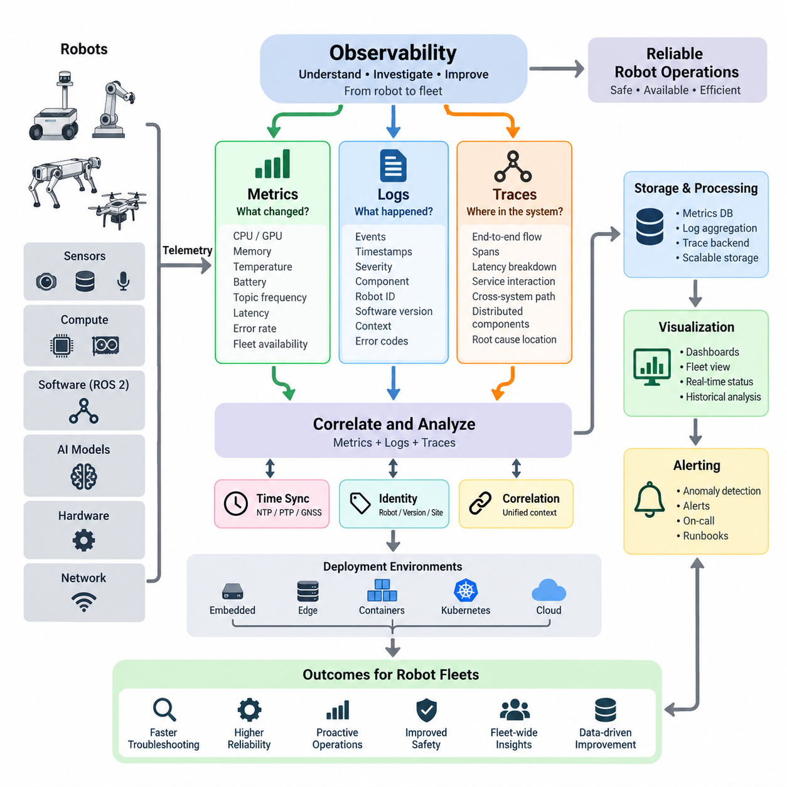
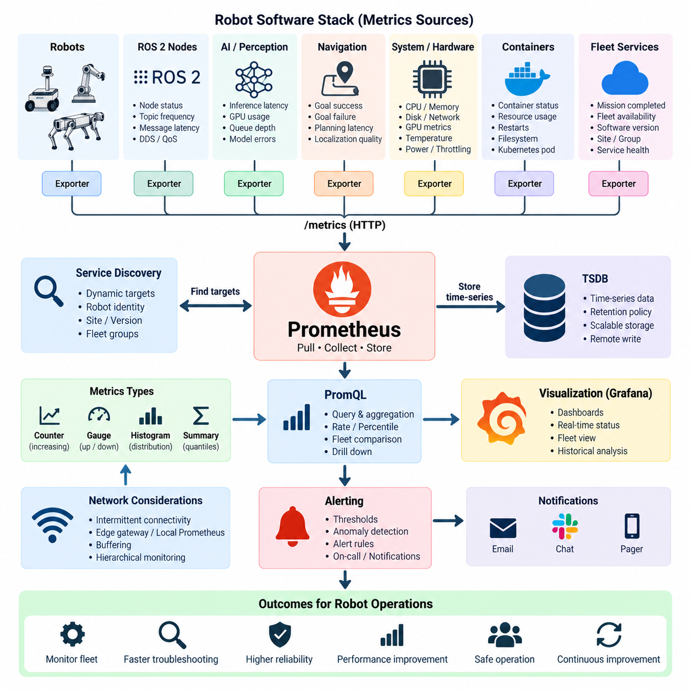
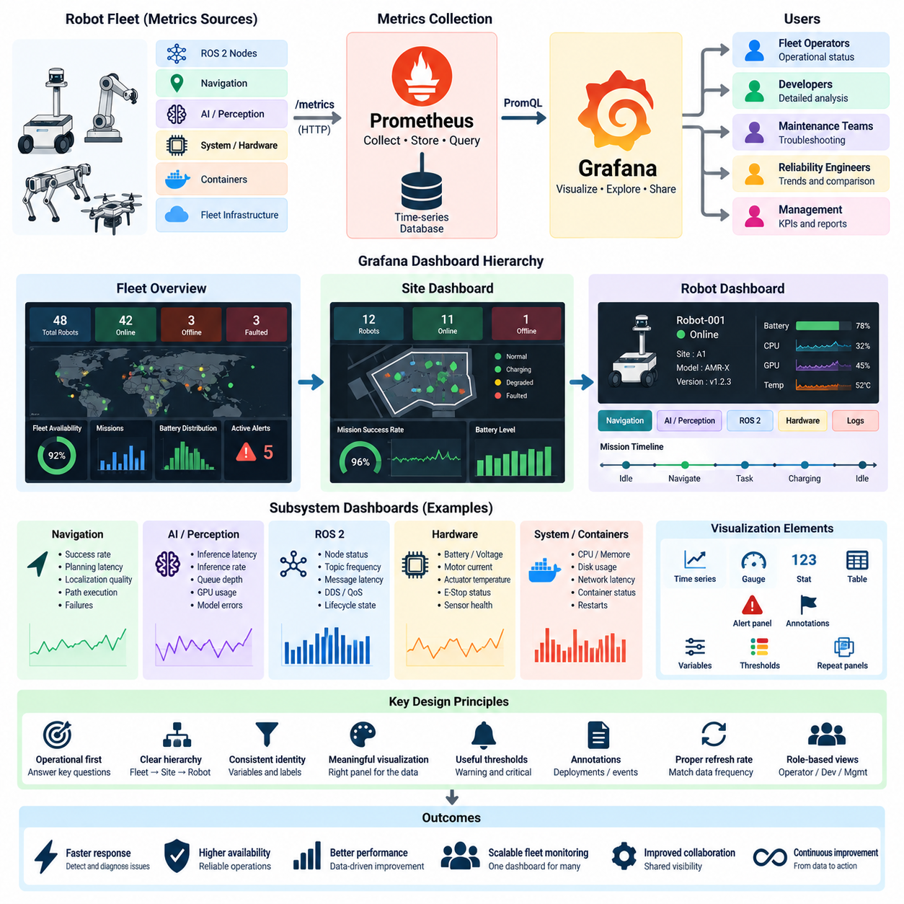
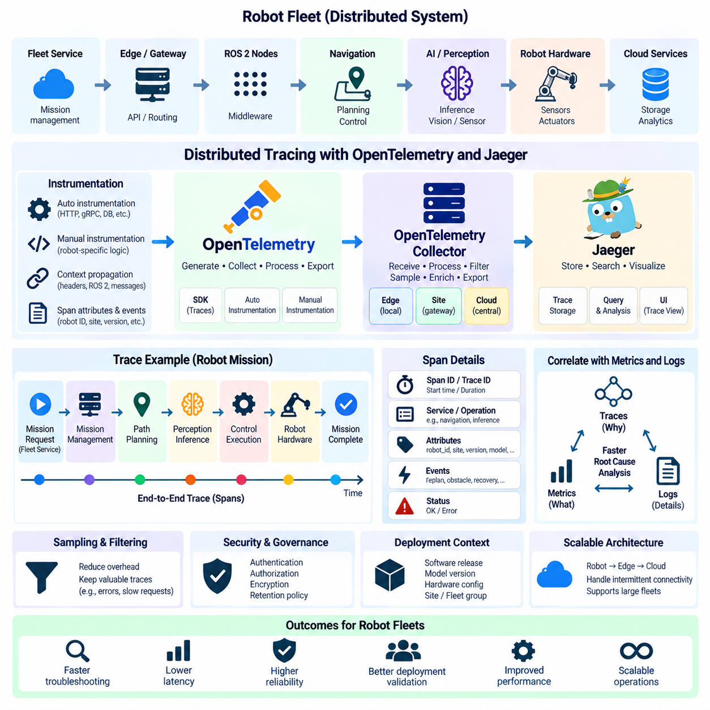
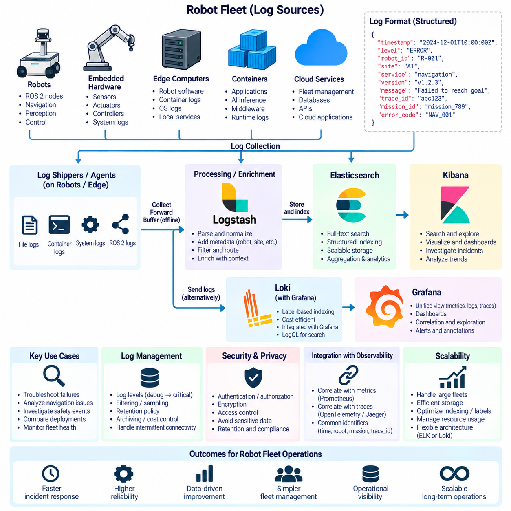
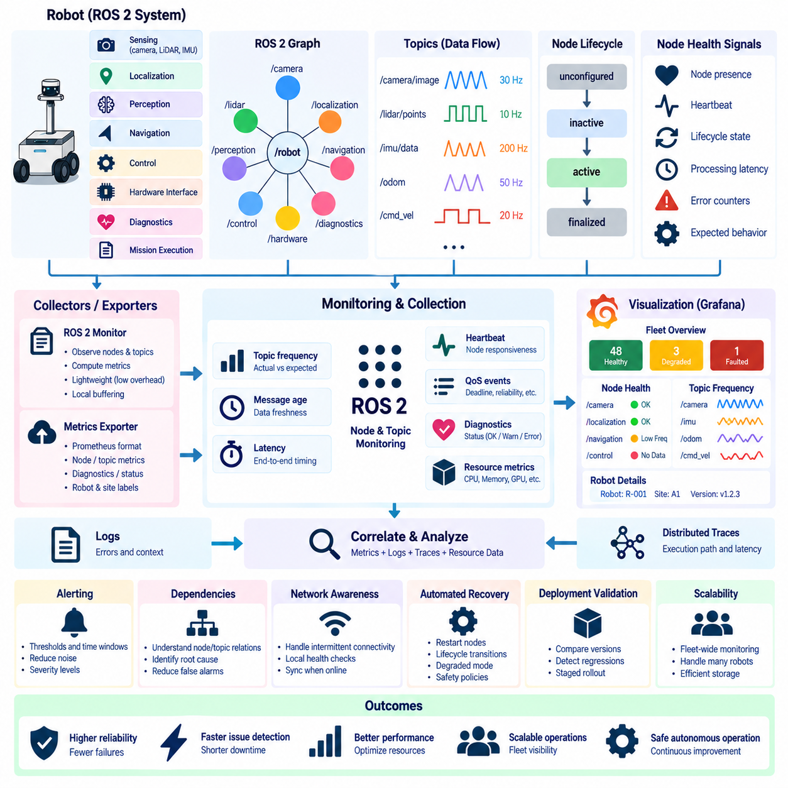
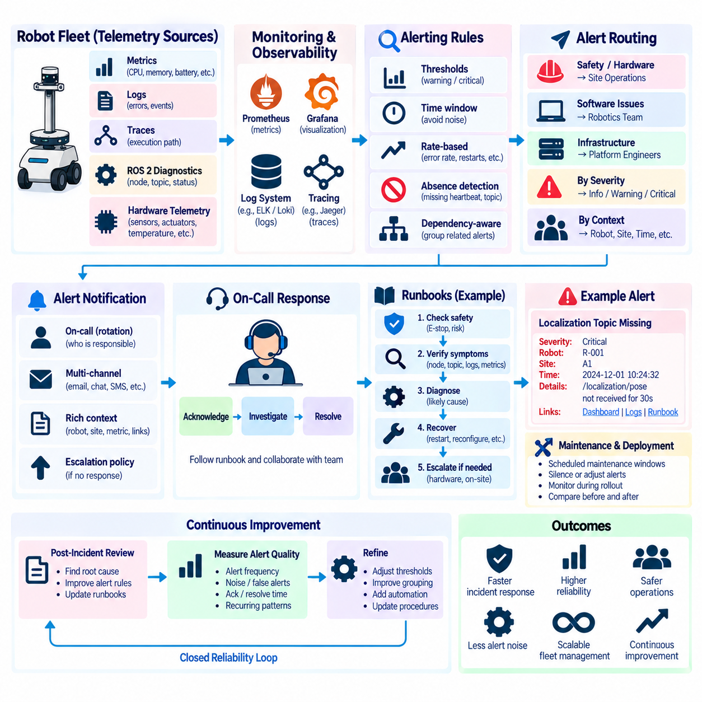
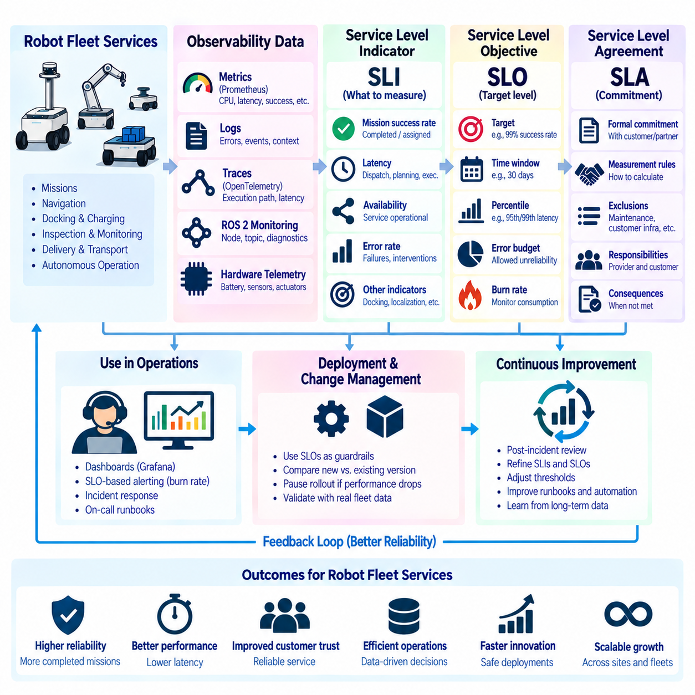
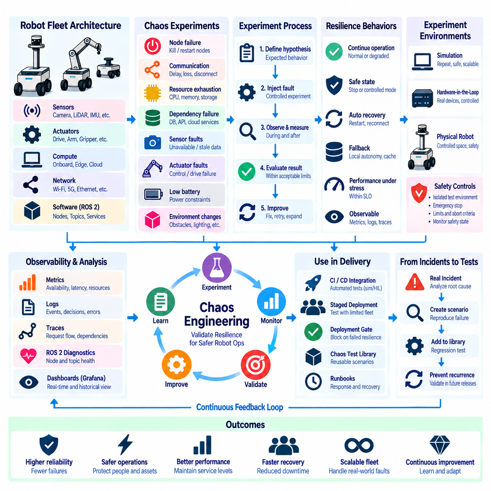
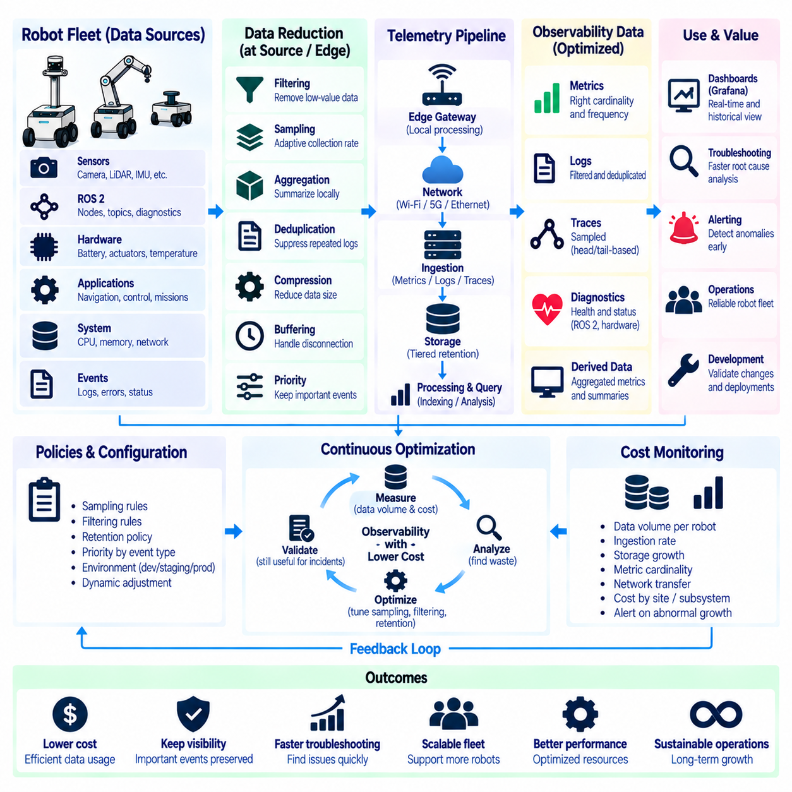

**Volume 10 Robot DevOps and MLOps**


# 5. Observability

##  

## 5.1. Observability Pillars Metrics Logs Traces for Robotics

{width="7.268055555555556in" height="7.268055555555556in"}

Observability in robotics is the ability to understand the internal state of a robot software system by examining the signals it produces during operation. Unlike simple monitoring, which checks predefined conditions, observability supports investigation of unexpected behaviors whose causes may not be known in advance. This distinction is important because robots combine software, sensors, networks, AI models, computing hardware, and physical mechanisms in continuously changing environments.

The classical observability model is built around three complementary pillars: metrics, logs, and traces. Each pillar describes the system from a different perspective. Metrics quantify behavior over time, logs record discrete events with contextual information, and traces reconstruct the execution path of operations across distributed components. Together they transform raw runtime telemetry into evidence that engineers can use to detect anomalies, diagnose failures, and understand system performance.

Metrics are numerical measurements collected repeatedly and represented as time-series data. In a robot, useful metrics include CPU and GPU utilization, memory consumption, temperature, battery state of charge, network latency, ROS 2 topic frequency, message loss, localization error, planning latency, motor current, and inference time. Fleet-level metrics may additionally measure robot availability, mission completion rate, charging utilization, intervention frequency, and failure rates across deployed units.

A major advantage of metrics is their efficiency. Thousands of robots can continuously report compact numerical values without transmitting every internal event. Aggregation functions such as averages, percentiles, rates, and histograms reveal patterns that are difficult to recognize from individual measurements. Engineers can therefore observe both individual robots and fleet-wide behavior while establishing baselines that distinguish normal variation from operational degradation.

Logs provide event-oriented descriptions of what occurred inside software components. A ROS 2 node might report that a sensor connection was lost, a localization process restarted, a navigation goal was rejected, or a safety controller entered a degraded state. Effective logs normally include timestamps, severity levels, component identities, robot identifiers, software versions, correlation identifiers, and structured fields that allow events to be searched and analyzed systematically.

Robotic logging requires greater contextual discipline than conventional server logging because physical events and software events are tightly connected. A message such as "navigation failed" is insufficient without information about robot pose, planner state, obstacle conditions, sensor availability, map version, and relevant error codes. Structured logging makes these relationships machine-searchable and enables fleet operators to compare similar failures across robots, sites, software releases, and operating conditions.

Distributed traces describe how an operation propagates through multiple software components. A navigation request, for example, may travel from a fleet management service to a mission manager, behavior tree, global planner, local planner, controller, and hardware interface. By assigning trace and span identifiers to related operations, engineers can reconstruct this sequence and determine where latency accumulated, where execution failed, or which dependency produced an abnormal response.

Tracing becomes particularly valuable as robot architectures become distributed across embedded computers, edge GPU systems, containers, Kubernetes services, and cloud infrastructure. A single user-visible delay may originate from network communication, inference processing, database access, ROS 2 middleware, or an overloaded edge service. Distributed tracing exposes these boundaries and creates an end-to-end timeline rather than forcing engineers to inspect each subsystem independently.

Metrics, logs, and traces become substantially more powerful when they are correlated. A temperature metric may reveal that GPU temperature increased before perception latency degraded. A trace can identify which inference operation became slow, while logs may show thermal throttling or resource allocation events occurring at the same time. The three signals therefore answer related questions: what changed, what happened, and where the behavior propagated through the system.

Time synchronization is essential for this correlation. Robots generate telemetry across sensors, embedded controllers, edge computers, and remote services, so timestamps must represent a sufficiently consistent temporal reference. Technologies such as NTP, PTP, or GNSS-derived synchronization may be applied according to precision requirements. Without reliable timing, apparently related events can be incorrectly ordered, making root-cause analysis difficult or even misleading.

Robot identity and software identity are equally important dimensions of observability. Telemetry should indicate which robot generated a signal, where it operated, which software and configuration versions were active, and which hardware or AI model versions were involved. These attributes allow engineers to distinguish a fleet-wide defect from a problem associated with a particular robot, deployment group, environment, firmware revision, container image, or model release.

Observability architecture must also account for intermittent connectivity. A cloud server normally assumes persistent network access, whereas mobile robots may enter elevators, warehouses, underground facilities, remote outdoor areas, or congested wireless networks. Robots therefore need local buffering and resilient telemetry pipelines that can preserve important information during disconnection and forward it after communication is restored without overwhelming limited network bandwidth.

Not every telemetry signal deserves identical retention or transmission priority. Safety events, critical faults, mission failures, and diagnostic context may require durable storage, while high-frequency debugging information can often be sampled, aggregated, filtered, or retained locally for shorter periods. Designing observability therefore involves balancing diagnostic value against storage capacity, wireless bandwidth, edge computing resources, cloud ingestion costs, and operational requirements.

ROS 2 systems introduce observability requirements at both application and middleware levels. Engineers may need to observe node lifecycle states, topic publication frequencies, subscriber counts, message latency, DDS discovery behavior, QoS incompatibilities, executor delays, service response times, and action execution. These signals complement application metrics such as localization quality, navigation success, perception throughput, actuator state, and mission progress.

Observability should also span the physical layer because software health alone cannot describe a robot\'s operational condition. Battery voltage, motor current, wheel velocity, actuator temperature, emergency-stop state, vibration, communication errors, and sensor health can provide early evidence of hardware degradation. Correlating these signals with software telemetry helps determine whether an observed failure originates in algorithms, computing resources, networking, electronics, or mechanical behavior.

Fleet observability extends the concept from individual machines to populations of robots. Operators need to identify whether failures are isolated or correlated across a site, software release, robot model, or operational scenario. Aggregated telemetry can expose systematic patterns such as increasing navigation failures after deployment, abnormal battery consumption at one facility, or elevated inference latency among robots using a particular hardware configuration.

A mature observability system ultimately supports both reactive troubleshooting and proactive operations. Real-time telemetry enables alerts and incident investigation, while historical data supports reliability analysis, capacity planning, regression detection, and engineering improvement. Observability can also provide evidence for defining service indicators and operational objectives, connecting low-level technical behavior with robot availability, mission success, safety, and fleet service quality.

For robotics DevOps, observability should therefore be designed as part of the software architecture rather than added after deployment. Instrumentation conventions, timestamps, identifiers, metadata, telemetry schemas, retention policies, and correlation mechanisms should evolve together with robot software. When metrics, logs, and traces share consistent context, engineers gain a coherent operational view extending from physical hardware and ROS 2 processes to edge services and cloud systems.

This foundation also prepares the system for specialized observability technologies introduced later in the lifecycle. Metrics can be collected and queried by platforms such as Prometheus, dashboards can visualize fleet behavior, centralized logging can consolidate events, and distributed tracing can reconstruct service interactions. OpenTelemetry-style instrumentation can further standardize signal generation and propagation across heterogeneous software components without tying application logic to one backend.

The central objective is not to collect the largest possible volume of telemetry, but to preserve enough meaningful context to explain robot behavior. A well-designed observability architecture enables engineers to move from a fleet-level anomaly to an affected robot, from that robot to a subsystem, and from the subsystem to the specific execution path or event associated with the failure. This capability is fundamental to operating increasingly autonomous and distributed robot fleets reliably at scale.

로보틱스에서 관측 가능성(Observability)이란 로봇 소프트웨어 시스템이 동작하는 동안 생성하는 신호를 조사하여 시스템의 내부 상태를 이해할 수 있는 능력을 의미한다. 미리 정의된 조건을 확인하는 단순 모니터링(Monitoring)과 달리, 관측 가능성은 원인이 사전에 알려지지 않은 예상 밖의 동작까지 조사할 수 있도록 한다. 이는 로봇이 소프트웨어, 센서, 네트워크, 인공지능(AI) 모델, 컴퓨팅 하드웨어와 물리적 메커니즘을 지속적으로 변화하는 환경에서 결합하기 때문에 특히 중요하다.

전통적인 관측 가능성(Observability) 모델은 메트릭(Metrics), 로그(Logs), 트레이스(Traces)라는 상호 보완적인 세 가지 핵심 축(Pillars)을 중심으로 구성된다. 각각은 서로 다른 관점에서 시스템을 설명한다. 메트릭은 시간에 따른 동작을 수치화하고, 로그는 상황 정보와 함께 개별 이벤트를 기록하며, 트레이스는 분산된 구성요소를 통과하는 작업의 실행 경로를 재구성한다. 이들을 결합하면 원시 런타임 텔레메트리(Runtime Telemetry)를 이상 탐지, 장애 진단, 시스템 성능 분석에 활용할 수 있는 증거로 변환할 수 있다.

메트릭(Metrics)은 반복적으로 수집되어 시계열 데이터(Time-Series Data)로 표현되는 수치 측정값이다. 로봇에서는 CPU와 GPU 사용률, 메모리 사용량, 온도, 배터리 충전 상태(State of Charge), 네트워크 지연시간, ROS 2 토픽(Topic) 주기, 메시지 손실, 위치추정 오차, 경로계획 지연시간, 모터 전류, 추론 시간 등이 유용한 메트릭에 해당한다. 플릿(Fleet) 수준에서는 로봇 가용성, 임무 완료율, 충전 활용률, 작업자 개입 빈도와 전체 배치 로봇의 장애율 등을 추가로 측정할 수 있다.

메트릭(Metrics)의 주요 장점은 높은 효율성이다. 수천 대의 로봇은 모든 내부 이벤트를 전송하지 않고도 압축된 수치 값을 지속적으로 보고할 수 있다. 평균, 백분위수(Percentile), 변화율(Rate), 히스토그램(Histogram)과 같은 집계 함수를 사용하면 개별 측정값만으로는 발견하기 어려운 패턴을 파악할 수 있다. 따라서 엔지니어는 개별 로봇과 전체 플릿의 상태를 동시에 관찰하면서 정상적인 변동과 운영 성능 저하를 구분하기 위한 기준선(Baseline)을 설정할 수 있다.

로그(Logs)는 소프트웨어 구성요소 내부에서 발생한 사건을 이벤트 중심으로 설명한다. 예를 들어 ROS 2 노드(Node)는 센서 연결이 끊어졌거나, 위치추정 프로세스가 재시작되었거나, 내비게이션 목표가 거부되었거나, 안전 제어기가 성능 저하 상태(Degraded State)에 진입했음을 기록할 수 있다. 효과적인 로그에는 일반적으로 타임스탬프(Timestamp), 심각도 수준(Severity Level), 구성요소 식별자, 로봇 식별자, 소프트웨어 버전, 상관관계 식별자(Correlation Identifier), 구조화된 필드(Structured Field)가 포함된다.

로봇의 로깅(Logging)은 물리적 이벤트와 소프트웨어 이벤트가 밀접하게 연결되기 때문에 일반적인 서버 로깅보다 더 많은 상황 정보가 필요하다. 예를 들어 "내비게이션 실패"라는 메시지만으로는 충분하지 않으며 로봇 위치와 자세(Pose), 플래너(Planner) 상태, 장애물 조건, 센서 가용성, 지도 버전과 관련 오류 코드 등이 함께 필요하다. 구조화 로깅(Structured Logging)은 이러한 관계를 기계적으로 검색할 수 있도록 하며, 플릿 운영자가 여러 로봇, 사이트, 소프트웨어 릴리스와 운용 조건에서 발생한 유사 장애를 비교할 수 있도록 한다.

분산 트레이스(Distributed Traces)는 하나의 작업이 여러 소프트웨어 구성요소를 통해 어떻게 전달되는지를 설명한다. 예를 들어 내비게이션 요청은 플릿 관리 서비스(Fleet Management Service)에서 임무 관리자(Mission Manager), 행동 트리(Behavior Tree), 전역 플래너(Global Planner), 지역 플래너(Local Planner), 제어기(Controller), 하드웨어 인터페이스(Hardware Interface)로 전달될 수 있다. 관련 작업에 트레이스(Trace)와 스팬(Span) 식별자를 부여하면 전체 실행 순서를 재구성하고 지연이 누적된 위치나 실행 실패 지점을 확인할 수 있다.

로봇 아키텍처가 임베디드 컴퓨터(Embedded Computer), 엣지 GPU 시스템(Edge GPU System), 컨테이너(Container), 쿠버네티스(Kubernetes) 서비스와 클라우드 인프라(Cloud Infrastructure)에 걸쳐 분산될수록 트레이싱(Tracing)의 중요성은 더욱 커진다. 사용자가 경험하는 하나의 지연 현상도 네트워크 통신, 추론 처리, 데이터베이스 접근, ROS 2 미들웨어(Middleware), 과부하된 엣지 서비스 등에서 발생할 수 있다. 분산 트레이싱은 이러한 경계를 가시화하여 각각의 하위 시스템을 독립적으로 조사하지 않고도 종단간(End-to-End) 실행 시간선을 제공한다.

메트릭(Metrics), 로그(Logs), 트레이스(Traces)는 서로 연계될 때 훨씬 강력해진다. 온도 메트릭을 통해 GPU 온도가 상승한 이후 인지(Perception) 지연시간이 증가했음을 발견할 수 있고, 트레이스를 통해 어떤 추론 작업이 느려졌는지 확인할 수 있으며, 로그에서는 같은 시점에 발생한 열 스로틀링(Thermal Throttling)이나 자원 할당 이벤트를 찾을 수 있다. 따라서 세 가지 신호는 무엇이 변했는지, 어떤 사건이 발생했는지, 그리고 그 영향이 시스템의 어느 경로로 전파되었는지를 함께 설명한다.

이러한 상관관계를 확보하려면 시간 동기화(Time Synchronization)가 필수적이다. 로봇은 센서, 임베디드 제어기, 엣지 컴퓨터와 원격 서비스에 걸쳐 텔레메트리(Telemetry)를 생성하므로 타임스탬프는 충분히 일관된 시간 기준을 사용해야 한다. 요구되는 정밀도에 따라 NTP(Network Time Protocol), PTP(Precision Time Protocol), GNSS 기반 동기화 등을 적용할 수 있다. 신뢰할 수 있는 시간 기준이 없으면 실제로 연관된 이벤트의 순서가 잘못 해석되어 근본 원인 분석(Root Cause Analysis)이 어려워지거나 잘못된 결론으로 이어질 수 있다.

로봇 식별 정보와 소프트웨어 식별 정보 역시 관측 가능성의 중요한 차원이다. 텔레메트리는 어떤 로봇이 신호를 생성했는지, 어디에서 운용되었는지, 어떤 소프트웨어 및 설정 버전이 활성화되어 있었는지, 어떤 하드웨어나 AI 모델 버전이 사용되었는지를 나타내야 한다. 이러한 속성을 활용하면 전체 플릿에 영향을 주는 결함과 특정 로봇, 배포 그룹, 환경, 펌웨어 개정판, 컨테이너 이미지 또는 모델 릴리스에 국한된 문제를 구분할 수 있다.

관측 가능성 아키텍처(Observability Architecture)는 간헐적인 네트워크 연결도 고려해야 한다. 클라우드 서버는 일반적으로 지속적인 네트워크 연결을 가정하지만 이동 로봇은 엘리베이터, 창고, 지하시설, 원격 야외 지역 또는 무선 네트워크 혼잡 구간으로 진입할 수 있다. 따라서 로봇에는 연결이 끊어진 동안 중요한 정보를 보존하고 통신이 복구된 이후 제한된 네트워크 대역폭을 과도하게 점유하지 않으면서 데이터를 전송할 수 있는 로컬 버퍼링(Local Buffering)과 복원력 있는 텔레메트리 파이프라인(Resilient Telemetry Pipeline)이 필요하다.

모든 텔레메트리 신호를 동일한 우선순위로 저장하거나 전송할 필요는 없다. 안전 이벤트, 치명적 장애, 임무 실패와 관련 진단 정보는 장기간 보존이 필요할 수 있지만, 고주파 디버깅 정보는 샘플링(Sampling), 집계(Aggregation), 필터링(Filtering)을 적용하거나 로컬에 짧은 기간만 보관할 수 있다. 따라서 관측 가능성 설계에서는 진단 가치와 저장 용량, 무선 대역폭, 엣지 컴퓨팅 자원, 클라우드 수집 비용 및 운영 요구사항 사이의 균형을 고려해야 한다.

ROS 2 시스템은 애플리케이션(Application)과 미들웨어(Middleware) 수준 모두에서 관측 가능성을 요구한다. 엔지니어는 노드 생명주기 상태(Node Lifecycle State), 토픽 발행 주기, 구독자 수, 메시지 지연시간, DDS(Data Distribution Service) 검색 동작, QoS(Quality of Service) 비호환성, 실행기(Executor) 지연, 서비스 응답시간과 액션(Action) 실행 상태를 관찰해야 할 수 있다. 이러한 신호는 위치추정 품질, 내비게이션 성공률, 인지 처리량, 액추에이터 상태와 임무 진행 상황 등의 애플리케이션 메트릭을 보완한다.

소프트웨어 상태만으로는 로봇의 실제 운용 상태를 완전히 설명할 수 없기 때문에 관측 가능성은 물리 계층(Physical Layer)까지 확장되어야 한다. 배터리 전압, 모터 전류, 휠 속도, 액추에이터 온도, 비상정지(Emergency Stop) 상태, 진동, 통신 오류와 센서 상태는 하드웨어 성능 저하를 조기에 파악할 수 있는 증거를 제공한다. 이러한 신호를 소프트웨어 텔레메트리와 연계하면 관찰된 장애가 알고리즘, 컴퓨팅 자원, 네트워크, 전자장치 또는 기계적 동작 중 어디에서 발생했는지를 판단하는 데 도움이 된다.

플릿 관측 가능성(Fleet Observability)은 이러한 개념을 개별 장비에서 다수의 로봇 집단으로 확장한다. 운영자는 장애가 특정 로봇에 국한된 것인지, 특정 사이트, 소프트웨어 릴리스, 로봇 모델 또는 운용 시나리오에 걸쳐 상관관계를 가지는지를 파악해야 한다. 집계된 텔레메트리는 새로운 배포 이후 증가한 내비게이션 장애, 특정 시설의 비정상적인 배터리 소비, 특정 하드웨어 구성을 사용하는 로봇에서 증가한 추론 지연시간과 같은 체계적인 패턴을 발견할 수 있게 한다.

성숙한 관측 가능성 시스템은 궁극적으로 사후 대응형 문제 해결(Reactive Troubleshooting)과 선제적 운영(Proactive Operations)을 모두 지원한다. 실시간 텔레메트리는 경보(Alert)와 사고 조사(Incident Investigation)를 가능하게 하고, 과거 데이터는 신뢰성 분석, 용량 계획(Capacity Planning), 회귀 탐지(Regression Detection)와 엔지니어링 개선에 활용된다. 또한 관측 가능성은 서비스 지표(Service Indicator)와 운영 목표를 정의하기 위한 근거를 제공하여 저수준 기술 동작을 로봇 가용성, 임무 성공, 안전성과 플릿 서비스 품질에 연결한다.

따라서 로보틱스 데브옵스(Robotics DevOps)에서 관측 가능성은 배포 이후 추가하는 기능이 아니라 소프트웨어 아키텍처의 일부로 설계되어야 한다. 계측 규칙(Instrumentation Convention), 타임스탬프, 식별자, 메타데이터, 텔레메트리 스키마(Telemetry Schema), 보존 정책과 상관관계 메커니즘은 로봇 소프트웨어와 함께 발전해야 한다. 메트릭, 로그, 트레이스가 일관된 상황 정보를 공유하면 엔지니어는 물리적 하드웨어와 ROS 2 프로세스에서 엣지 서비스와 클라우드 시스템까지 연결되는 통합된 운영 관점을 확보할 수 있다.

이러한 기반은 이후 로봇 생명주기에서 도입되는 전문적인 관측 가능성 기술을 적용할 준비도 제공한다. 프로메테우스(Prometheus)와 같은 플랫폼을 통해 메트릭을 수집하고 조회할 수 있으며, 대시보드(Dashboard)를 통해 플릿 동작을 시각화하고, 중앙집중식 로깅(Centralized Logging)을 통해 이벤트를 통합하며, 분산 트레이싱을 이용해 서비스 간 상호작용을 재구성할 수 있다. 오픈텔레메트리(OpenTelemetry) 방식의 계측은 애플리케이션 로직을 특정 백엔드에 종속시키지 않으면서 이질적인 소프트웨어 구성요소 전반의 신호 생성과 전달을 표준화할 수 있다.

핵심 목적은 가능한 한 많은 양의 텔레메트리를 수집하는 것이 아니라 로봇의 동작을 설명하는 데 충분한 의미 있는 상황 정보를 보존하는 것이다. 잘 설계된 관측 가능성 아키텍처를 통해 엔지니어는 플릿 수준의 이상 현상에서 영향을 받은 개별 로봇으로, 해당 로봇에서 특정 하위 시스템으로, 다시 그 하위 시스템에서 장애와 관련된 구체적인 실행 경로나 이벤트까지 단계적으로 추적할 수 있다. 이러한 능력은 점점 더 자율화되고 분산되는 로봇 플릿을 대규모로 안정적으로 운영하기 위한 핵심 기반이다.

##  

## 5.2. Prometheus Metrics Collection for Robot SW Stacks [w/Code]

{width="7.268055555555556in" height="7.268055555555556in"}

Prometheus is a monitoring and time-series metrics platform well suited to robot software stacks because it provides a consistent mechanism for collecting numerical measurements from distributed components. In a robotic system, metrics may originate from ROS 2 nodes, navigation processes, AI inference services, embedded computers, GPU systems, operating systems, containers, and fleet services. Prometheus brings these heterogeneous measurements into a common model that supports monitoring, analysis, and automated alerting.

The fundamental Prometheus architecture is based primarily on a pull model. Instead of every robot application continuously pushing monitoring data toward a central server, Prometheus periodically requests metrics from configured HTTP endpoints. Each monitored component exposes measurements through an exporter or application endpoint, commonly using a \`/metrics\` interface. This approach separates metric collection from application execution and allows the monitoring system to control collection intervals and target discovery.

Prometheus represents measurements as time-series data identified by a metric name and a set of labels. A metric such as \`robot_cpu_usage\` can be associated with labels describing the robot ID, site, software version, computing device, or deployment group. The same logical metric can therefore represent thousands of individual series across a fleet. Labels provide powerful multidimensional analysis, but their design must be controlled carefully because excessive label combinations can create very high cardinality.

Several metric types are useful when instrumenting robot software. A counter represents a cumulative value that normally increases, such as completed missions, navigation failures, dropped messages, or emergency-stop events. A gauge represents a value that can increase or decrease, such as battery state of charge, CPU utilization, GPU temperature, localization uncertainty, or the number of active tasks. Histograms and summaries describe distributions such as planning latency, inference duration, network delay, or mission execution time.

Robot software can expose application-specific metrics directly through Prometheus client libraries. A navigation component, for example, can publish counters for successful and failed goals, gauges for localization quality, and histograms for planning latency. An AI perception service may expose inference frequency, processing latency, GPU memory utilization, queue depth, and model errors. Instrumentation should focus on measurements that reveal operational behavior rather than simply exporting every internal software variable.

ROS 2 introduces another important layer of metrics. Operational monitoring may track whether expected nodes are alive, whether lifecycle nodes are active, how frequently topics are published, how long messages take to propagate, and whether expected publishers or subscribers are present. DDS and QoS-related problems may also appear indirectly through message loss, frequency changes, or communication errors. These measurements help distinguish application failures from middleware and communication problems.

System-level exporters complement application instrumentation by exposing operating-system and hardware measurements. CPU load, memory usage, filesystem capacity, network traffic, process state, and host availability provide essential context for diagnosing robot software behavior. GPU-equipped robots additionally require measurements such as GPU utilization, memory consumption, temperature, power usage, and throttling conditions because perception and AI workloads can degrade when computational resources become constrained.

Containerized robot software adds another monitoring boundary. Metrics should make it possible to distinguish the health of the physical computer from the resource consumption of individual containers and services. CPU throttling, memory limits, container restarts, filesystem utilization, and network activity may explain failures that appear at the ROS 2 or application level. When Kubernetes or lightweight edge orchestration is used, pod state and resource allocation can also become part of the monitoring model.

A typical robot-side metrics architecture therefore contains multiple exporters and instrumented applications. ROS 2 nodes and AI services expose domain-specific measurements, while host and GPU exporters describe computing resources. A local monitoring agent or Prometheus instance can collect these signals before they are transferred to a central infrastructure. This local layer is particularly useful when robots operate across unreliable wireless, LTE, 5G, or intermittently connected networks.

Network conditions require special consideration because the conventional Prometheus pull model assumes that monitoring targets are reachable. Robots may temporarily disappear from the network while moving between access points, entering elevators, traveling underground, or operating at remote sites. Edge gateways, local Prometheus instances, buffering mechanisms, or hierarchical monitoring architectures can therefore be introduced so that temporary connectivity failures do not automatically result in the permanent loss of operational metrics.

Service discovery becomes increasingly important as the number of robots grows. Manually maintaining static monitoring targets may be practical for a laboratory with a few robots but becomes difficult for fleets containing hundreds or thousands of dynamically connected devices. Robot identity, site, hardware class, software release, and fleet group should therefore be represented consistently so monitoring infrastructure can discover targets and aggregate metrics according to operational boundaries.

Prometheus Query Language, commonly called PromQL, transforms collected measurements into operational information. Engineers can calculate rates from counters, aggregate measurements across robot groups, compare software versions, calculate latency percentiles, or identify robots whose behavior differs from fleet baselines. Instead of examining thousands of individual measurements, queries can summarize the fleet while preserving the ability to drill down into a specific robot, process, or subsystem.

For example, navigation reliability can be represented as a relationship between completed navigation goals and failed goals over a selected time interval. CPU or GPU saturation can be evaluated across specific robot models, while inference latency can be compared between software releases. These queries become the analytical foundation for dashboards and alerting rules, allowing the same underlying metrics to support developers, fleet operators, reliability engineers, and maintenance personnel.

Metric naming and labeling conventions should be established early. Names should clearly describe the measured quantity and, where appropriate, communicate units such as seconds or bytes. Labels should represent stable dimensions that engineers actually need for aggregation and diagnosis. Robot identifiers, deployment sites, software versions, hardware classes, and service names are useful dimensions, while highly dynamic values such as timestamps, request identifiers, or arbitrary error messages should generally not become labels.

Cardinality management is especially important in large robot fleets. If every metric contains many labels with thousands of possible values, the number of resulting time series can grow dramatically. This increases memory consumption, storage requirements, query cost, and network traffic. Metrics should therefore capture reusable operational dimensions, while detailed event-specific information is better stored in logs or traces. Prometheus should summarize system behavior rather than become a replacement for event logging.

Scrape intervals should also reflect the dynamics of the measured subsystem. CPU utilization or robot health may require relatively frequent sampling, while slowly changing information may be collected less often. Very high-frequency control-loop data should generally not be exported directly as Prometheus metrics because millisecond-level actuator or sensor streams can create excessive telemetry volume. Such data is better handled through specialized robot data recording mechanisms when detailed analysis is required.

Alerting converts metrics from passive observations into operational actions. Rules can detect conditions such as low battery charge, unavailable robots, repeated navigation failures, excessive CPU or GPU temperature, abnormal inference latency, disk exhaustion, or missing telemetry. Effective alerts should represent conditions requiring attention rather than every transient deviation. Time windows, thresholds, persistence conditions, and fleet context help prevent short-lived variations from producing excessive alarm noise.

Prometheus metrics become more useful when correlated with software and deployment metadata. If navigation failures increase immediately after a new release, labels can separate the affected software version from previous versions. If GPU temperature problems appear only on one hardware configuration, fleet-wide queries can expose the pattern. Metrics therefore provide not only current health information but also quantitative evidence for regression detection, staged deployment evaluation, and operational comparison.

Retention strategy depends on how metrics will be used. Recent high-resolution data may be required for incident diagnosis, while long-term trends can often be stored at reduced resolution or transferred to scalable remote storage. Large fleets may use hierarchical or remote-write architectures to separate robot-local collection from centralized historical analysis. The objective is to retain sufficient operational evidence without allowing telemetry storage and transmission costs to grow without control.

Security must also be considered because monitoring data can reveal robot identities, software versions, network structure, resource capacity, and operational patterns. Metrics endpoints should not be exposed unnecessarily, and communication between robots, edge infrastructure, and monitoring servers should follow appropriate authentication, authorization, and network security policies. Monitoring infrastructure itself becomes an important operational service and should therefore be protected and observed like other production components.

Within a robotics DevOps architecture, Prometheus provides the quantitative foundation of observability. Metrics collected from ROS 2, AI workloads, operating systems, GPUs, containers, networks, and fleet services can be combined into a consistent time-series model. Dashboards can visualize these measurements, alerting systems can detect abnormal conditions, and engineers can correlate changes with deployments, hardware configurations, and operating environments.

The ultimate goal is not simply to install Prometheus but to design a meaningful metrics system for the complete robot lifecycle. Well-selected measurements allow engineers to move from fleet-level indicators to an individual robot and then to the responsible software or hardware subsystem. When instrumentation, labels, collection intervals, connectivity handling, retention, and alerting are designed together, Prometheus becomes a practical foundation for reliable operation and continuous improvement of large-scale robot software stacks.

프로메테우스(Prometheus)는 분산된 구성요소에서 생성되는 수치 측정값을 일관된 방식으로 수집할 수 있기 때문에 로봇 소프트웨어 스택(Robot Software Stack)에 적합한 모니터링(Monitoring) 및 시계열 메트릭(Time-Series Metrics) 플랫폼이다. 로봇 시스템의 메트릭은 ROS 2 노드(Node), 내비게이션 프로세스, AI 추론 서비스, 임베디드 컴퓨터, GPU 시스템, 운영체제, 컨테이너(Container), 플릿 서비스(Fleet Service) 등에서 생성될 수 있다. 프로메테우스는 이러한 이질적인 측정값을 공통 모델로 통합하여 모니터링, 분석 및 자동 경보에 활용할 수 있도록 한다.

프로메테우스의 기본 아키텍처는 주로 풀 모델(Pull Model)을 기반으로 한다. 모든 로봇 애플리케이션이 중앙 서버로 모니터링 데이터를 지속적으로 푸시(Push)하는 대신, 프로메테우스가 설정된 HTTP 엔드포인트(Endpoint)에 주기적으로 메트릭을 요청한다. 각각의 모니터링 대상 구성요소는 익스포터(Exporter) 또는 애플리케이션 엔드포인트를 통해 측정값을 제공하며, 일반적으로 \`/metrics\` 인터페이스가 사용된다. 이 방식은 메트릭 수집을 애플리케이션 실행과 분리하고 모니터링 시스템이 수집 주기와 대상 검색을 제어할 수 있도록 한다.

프로메테우스는 메트릭 이름(Metric Name)과 레이블(Label)의 조합으로 식별되는 시계열 데이터 형태로 측정값을 표현한다. 예를 들어 \`robot_cpu_usage\`라는 메트릭에 로봇 ID, 사이트, 소프트웨어 버전, 컴퓨팅 장치 또는 배포 그룹을 설명하는 레이블을 연결할 수 있다. 따라서 하나의 논리적인 메트릭으로 플릿 전체의 수천 개 개별 시계열을 표현할 수 있다. 레이블은 강력한 다차원 분석(Multidimensional Analysis)을 제공하지만 지나치게 많은 레이블 조합은 매우 높은 카디널리티(Cardinality)를 발생시킬 수 있으므로 신중하게 설계해야 한다.

로봇 소프트웨어를 계측(Instrumentation)할 때는 여러 종류의 메트릭을 활용할 수 있다. 카운터(Counter)는 완료된 임무, 내비게이션 실패, 손실된 메시지 또는 비상정지 이벤트처럼 일반적으로 누적 증가하는 값을 나타낸다. 게이지(Gauge)는 배터리 충전 상태, CPU 사용률, GPU 온도, 위치추정 불확실성 또는 활성 작업 수처럼 증가하거나 감소할 수 있는 값을 표현한다. 히스토그램(Histogram)과 서머리(Summary)는 경로계획 지연시간, 추론 처리시간, 네트워크 지연 또는 임무 실행시간 등의 분포를 표현한다.

로봇 소프트웨어는 프로메테우스 클라이언트 라이브러리(Prometheus Client Library)를 이용하여 애플리케이션별 메트릭을 직접 제공할 수 있다. 예를 들어 내비게이션 구성요소는 성공 및 실패한 목표에 대한 카운터, 위치추정 품질에 대한 게이지, 경로계획 지연시간에 대한 히스토그램을 제공할 수 있다. AI 인지 서비스는 추론 주기, 처리 지연시간, GPU 메모리 사용률, 큐 깊이(Queue Depth), 모델 오류 등을 노출할 수 있다. 계측은 모든 내부 소프트웨어 변수를 내보내는 것이 아니라 운영 동작을 설명할 수 있는 측정값에 집중해야 한다.

ROS 2는 또 다른 중요한 메트릭 계층을 제공한다. 운영 모니터링에서는 예상된 노드가 정상적으로 동작하는지, 생명주기 노드(Lifecycle Node)가 활성 상태인지, 토픽(Topic)이 얼마나 자주 발행되는지, 메시지가 전달되는 데 얼마나 시간이 걸리는지, 예상된 퍼블리셔(Publisher) 또는 서브스크라이버(Subscriber)가 존재하는지를 추적할 수 있다. DDS(Data Distribution Service) 및 QoS(Quality of Service) 관련 문제도 메시지 손실, 주기 변화 또는 통신 오류를 통해 간접적으로 나타날 수 있다. 이러한 측정값은 애플리케이션 장애와 미들웨어 및 통신 문제를 구분하는 데 도움을 준다.

시스템 수준 익스포터(System-Level Exporter)는 운영체제와 하드웨어의 측정값을 제공하여 애플리케이션 계측을 보완한다. CPU 부하, 메모리 사용량, 파일시스템 용량, 네트워크 트래픽, 프로세스 상태 및 호스트 가용성은 로봇 소프트웨어 동작을 진단하는 데 필수적인 상황 정보를 제공한다. GPU가 탑재된 로봇에서는 GPU 사용률, 메모리 소비량, 온도, 전력 사용량 및 스로틀링(Throttling) 상태도 측정해야 한다. 컴퓨팅 자원이 제한되면 인지 및 AI 워크로드의 성능이 저하될 수 있기 때문이다.

컨테이너화된(Containerized) 로봇 소프트웨어는 또 하나의 모니터링 경계를 형성한다. 메트릭을 통해 물리적 컴퓨터 자체의 상태와 개별 컨테이너 및 서비스의 자원 사용량을 구분할 수 있어야 한다. CPU 스로틀링, 메모리 제한, 컨테이너 재시작, 파일시스템 사용량 및 네트워크 활동은 ROS 2 또는 애플리케이션 수준에서 나타나는 장애의 원인을 설명할 수 있다. 쿠버네티스(Kubernetes) 또는 경량 엣지 오케스트레이션(Edge Orchestration)을 사용하는 경우에는 파드(Pod) 상태와 자원 할당도 모니터링 모델의 일부가 될 수 있다.

따라서 일반적인 로봇 측 메트릭 아키텍처에는 여러 익스포터와 계측된 애플리케이션이 포함된다. ROS 2 노드와 AI 서비스는 도메인별 측정값을 제공하고, 호스트 및 GPU 익스포터는 컴퓨팅 자원의 상태를 설명한다. 로컬 모니터링 에이전트(Local Monitoring Agent) 또는 프로메테우스 인스턴스가 이러한 신호를 먼저 수집한 후 중앙 인프라로 전달할 수 있다. 이러한 로컬 계층은 로봇이 불안정한 무선 네트워크, LTE, 5G 또는 간헐적으로 연결되는 네트워크 환경에서 운용될 때 특히 유용하다.

일반적인 프로메테우스 풀 모델은 모니터링 대상에 접근할 수 있다고 가정하기 때문에 네트워크 조건을 특별히 고려해야 한다. 로봇은 액세스 포인트 사이를 이동하거나 엘리베이터에 진입하고, 지하 또는 원격 지역에서 운용되는 동안 일시적으로 네트워크에서 사라질 수 있다. 따라서 엣지 게이트웨이(Edge Gateway), 로컬 프로메테우스 인스턴스, 버퍼링 메커니즘(Buffering Mechanism) 또는 계층형 모니터링 아키텍처(Hierarchical Monitoring Architecture)를 도입하여 일시적인 연결 장애가 운영 메트릭의 영구적인 손실로 이어지지 않도록 할 수 있다.

로봇의 수가 증가할수록 서비스 디스커버리(Service Discovery)의 중요성도 커진다. 소수의 로봇을 사용하는 연구실에서는 정적인 모니터링 대상을 수동으로 관리할 수 있지만, 수백 또는 수천 대의 장치가 동적으로 연결되는 플릿에서는 이러한 방식이 어려워진다. 따라서 로봇 식별자, 사이트, 하드웨어 등급, 소프트웨어 릴리스 및 플릿 그룹을 일관된 방식으로 표현하여 모니터링 인프라가 대상을 검색하고 운영 경계에 따라 메트릭을 집계할 수 있도록 해야 한다.

일반적으로 PromQL이라고 부르는 프로메테우스 쿼리 언어(Prometheus Query Language)는 수집된 측정값을 운영 정보로 변환한다. 엔지니어는 카운터에서 변화율을 계산하고, 로봇 그룹별 측정값을 집계하며, 소프트웨어 버전을 비교하고, 지연시간 백분위수(Percentile)를 계산하거나 플릿 기준선과 다른 동작을 보이는 로봇을 식별할 수 있다. 수천 개의 개별 측정값을 직접 조사하는 대신 플릿 전체를 요약하면서도 특정 로봇, 프로세스 또는 하위 시스템까지 상세하게 분석할 수 있다.

예를 들어 내비게이션 신뢰성은 선택된 시간 구간 동안 완료된 내비게이션 목표와 실패한 목표 사이의 관계로 표현할 수 있다. CPU 또는 GPU 포화 상태를 특정 로봇 모델별로 평가할 수 있으며, 추론 지연시간을 서로 다른 소프트웨어 릴리스 사이에서 비교할 수도 있다. 이러한 쿼리는 대시보드(Dashboard)와 경보 규칙(Alerting Rule)의 분석 기반이 되며 동일한 메트릭을 개발자, 플릿 운영자, 신뢰성 엔지니어 및 유지보수 담당자가 공동으로 활용할 수 있도록 한다.

메트릭 이름과 레이블의 규칙은 초기 단계부터 정의해야 한다. 이름은 측정되는 값을 명확하게 설명해야 하며 필요한 경우 초(Seconds), 바이트(Bytes) 등의 단위를 표현해야 한다. 레이블은 엔지니어가 실제 집계와 진단에 사용하는 안정적인 차원을 나타내야 한다. 로봇 식별자, 배포 사이트, 소프트웨어 버전, 하드웨어 등급 및 서비스 이름은 유용한 차원이지만 타임스탬프, 요청 식별자 또는 임의의 오류 메시지처럼 매우 동적인 값은 일반적으로 레이블로 사용하지 않는 것이 적절하다.

카디널리티 관리(Cardinality Management)는 대규모 로봇 플릿에서 특히 중요하다. 모든 메트릭에 수천 개의 가능한 값을 가지는 여러 레이블을 포함하면 생성되는 시계열의 수가 급격하게 증가할 수 있다. 이는 메모리 소비량, 저장공간 요구량, 쿼리 비용 및 네트워크 트래픽을 증가시킨다. 따라서 메트릭은 반복적으로 활용 가능한 운영 차원을 표현해야 하며, 이벤트별 세부 정보는 로그(Logs)나 트레이스(Traces)에 저장하는 것이 적절하다. 프로메테우스는 이벤트 로깅을 대체하기보다 시스템 동작을 요약하는 역할을 해야 한다.

스크레이프 주기(Scrape Interval) 역시 측정 대상 하위 시스템의 동적 특성을 반영해야 한다. CPU 사용률이나 로봇 상태는 비교적 빈번한 샘플링이 필요할 수 있지만 천천히 변화하는 정보는 더 긴 간격으로 수집할 수 있다. 매우 높은 주파수의 제어 루프(Control Loop) 데이터는 일반적으로 프로메테우스 메트릭으로 직접 내보내지 않는 것이 좋다. 밀리초 단위의 액추에이터 또는 센서 스트림은 과도한 텔레메트리 양을 발생시킬 수 있으므로 상세 분석이 필요한 경우 전문적인 로봇 데이터 기록 메커니즘을 사용하는 것이 적합하다.

경보(Alerting)는 메트릭을 수동적인 관찰 정보에서 운영 행동으로 전환한다. 규칙을 이용하여 낮은 배터리 충전량, 연결되지 않는 로봇, 반복되는 내비게이션 실패, 과도한 CPU 또는 GPU 온도, 비정상적인 추론 지연시간, 디스크 공간 부족 또는 텔레메트리 손실 등의 상태를 탐지할 수 있다. 효과적인 경보는 모든 일시적인 편차가 아니라 실제로 대응이 필요한 상태를 나타내야 한다. 시간 구간, 임계값, 지속 조건 및 플릿 상황 정보를 적용하면 짧은 변동으로 인해 과도한 경보가 발생하는 것을 방지할 수 있다.

프로메테우스 메트릭은 소프트웨어 및 배포 메타데이터(Deployment Metadata)와 연계될 때 더욱 유용해진다. 새로운 릴리스 직후 내비게이션 실패가 증가했다면 레이블을 이용하여 영향을 받은 소프트웨어 버전과 이전 버전을 구분할 수 있다. GPU 온도 문제가 특정 하드웨어 구성에서만 나타나는 경우에는 플릿 전체 쿼리를 통해 해당 패턴을 확인할 수 있다. 따라서 메트릭은 현재 상태 정보뿐만 아니라 회귀 탐지, 단계적 배포 평가 및 운영 비교를 위한 정량적 근거도 제공한다.

메트릭 보존 전략(Retention Strategy)은 데이터를 어떤 목적으로 활용할 것인지에 따라 달라진다. 최근의 고해상도 데이터는 사고 진단에 필요할 수 있지만 장기적인 추세 분석에서는 해상도를 낮추거나 확장 가능한 원격 저장소(Remote Storage)로 이전할 수 있다. 대규모 플릿에서는 로봇 로컬 수집과 중앙 집중식 장기 분석을 분리하기 위해 계층형 구조 또는 원격 쓰기(Remote Write) 아키텍처를 사용할 수 있다. 목표는 운영에 필요한 충분한 증거를 유지하면서 텔레메트리 저장 및 전송 비용이 통제되지 않은 상태로 증가하지 않도록 하는 것이다.

모니터링 데이터는 로봇 식별 정보, 소프트웨어 버전, 네트워크 구조, 자원 용량 및 운영 패턴을 노출할 수 있으므로 보안(Security) 역시 고려해야 한다. 메트릭 엔드포인트를 불필요하게 외부에 노출해서는 안 되며 로봇, 엣지 인프라 및 모니터링 서버 사이의 통신에는 적절한 인증(Authentication), 권한 부여(Authorization) 및 네트워크 보안 정책을 적용해야 한다. 모니터링 인프라 자체도 중요한 운영 서비스이므로 다른 프로덕션 구성요소와 마찬가지로 보호하고 관찰해야 한다.

로보틱스 데브옵스(Robotics DevOps) 아키텍처에서 프로메테우스는 관측 가능성(Observability)의 정량적 기반을 제공한다. ROS 2, AI 워크로드, 운영체제, GPU, 컨테이너, 네트워크 및 플릿 서비스에서 수집된 메트릭을 일관된 시계열 모델로 결합할 수 있다. 대시보드는 이러한 측정값을 시각화하고, 경보 시스템은 비정상적인 상태를 탐지하며, 엔지니어는 변화와 소프트웨어 배포, 하드웨어 구성 및 운용 환경 사이의 관계를 분석할 수 있다.

궁극적인 목표는 단순히 프로메테우스를 설치하는 것이 아니라 전체 로봇 생명주기를 위한 의미 있는 메트릭 시스템을 설계하는 것이다. 적절하게 선정된 측정값을 통해 엔지니어는 플릿 수준의 지표에서 개별 로봇으로 이동하고, 다시 문제를 발생시킨 소프트웨어 또는 하드웨어 하위 시스템까지 추적할 수 있다. 계측, 레이블, 수집 주기, 네트워크 연결 처리, 데이터 보존 및 경보를 통합적으로 설계하면 프로메테우스는 대규모 로봇 소프트웨어 스택의 안정적인 운영과 지속적인 개선을 위한 실질적인 기반이 된다.

##  

## 5.3. Grafana Dashboard Design for Robot Fleet Monitoring [w/Code]

{width="7.268055555555556in" height="7.268055555555556in"}

Grafana is a visualization and operational dashboard platform that transforms robot telemetry into views that engineers and fleet operators can interpret quickly. In a robot fleet, dashboards may combine infrastructure metrics, ROS 2 status, navigation performance, AI inference behavior, battery condition, mission progress, and fleet availability. The objective is not simply to display measurements, but to organize them into operational information that supports rapid understanding and decision-making.

A robot fleet dashboard should be designed around operational questions rather than around every metric available in the monitoring system. Operators typically need to know whether the fleet is healthy, which robots require attention, what subsystem is responsible, and whether a problem is isolated or widespread. Grafana panels should therefore create a hierarchy that moves from fleet-level indicators toward individual robots, software processes, computing resources, and detailed diagnostic measurements.

Grafana commonly receives robot metrics from time-series systems such as Prometheus. Prometheus collects measurements from ROS 2 nodes, operating systems, GPUs, containers, navigation components, AI services, and fleet infrastructure, while Grafana queries and visualizes those measurements. This separation allows metric collection and visualization to evolve independently and enables the same underlying telemetry to support multiple dashboards designed for developers, operators, maintenance teams, and management.

The highest-level dashboard should provide an immediate fleet overview. Useful indicators include the number of online and offline robots, fleet availability, active missions, completed and failed missions, robots requiring intervention, battery distribution, and current alerts. These indicators should answer whether operations are generally normal before presenting detailed technical information. Excessive detail at this level can obscure the operational state instead of clarifying it.

Dashboard hierarchy becomes especially important as fleets scale. A fleet overview can link to site-level dashboards, which can then link to individual robot dashboards and subsystem-specific views. This drill-down structure allows an operator to begin with an abnormal fleet indicator, identify the affected site or robot, and then inspect navigation, perception, compute, network, or hardware measurements without searching manually through unrelated telemetry.

Robot identity must remain consistent throughout the dashboard architecture. Variables and labels can allow users to filter views by robot ID, site, robot model, deployment group, hardware configuration, or software version. A dashboard designed in this way can represent many robots without creating a separate static dashboard for every unit. Template variables also allow engineers to reuse the same diagnostic structure across development systems, test fleets, and production deployments.

Status panels should emphasize information that requires rapid interpretation. A robot may be represented as available, busy, charging, disconnected, degraded, or faulted according to the fleet\'s operational state model. These states should originate from defined telemetry rather than subjective visual assumptions. Consistent status definitions are important because operators may otherwise interpret similar colors or labels differently across dashboards, reducing the reliability of operational decisions.

Time-series panels are useful for understanding how robot behavior changes over time. Battery state of charge, CPU and GPU utilization, temperature, memory usage, network latency, localization uncertainty, inference latency, topic frequency, and mission throughput can be plotted across selected intervals. Historical context allows engineers to distinguish temporary spikes from persistent degradation and to determine whether abnormal behavior began before or after a deployment, mission, or environmental change.

Navigation dashboards can combine mission success rates with planner latency, localization quality, path execution state, recovery behavior, and navigation failures. Fleet-level aggregation may reveal whether failures are concentrated at a particular site or software version, while robot-level views can expose the detailed behavior of an individual platform. This relationship between aggregated and detailed views is essential for moving efficiently from detection toward diagnosis.

AI and perception dashboards require measurements that reflect both model execution and computing resources. Useful signals include inference latency, inference frequency, queue depth, GPU utilization, GPU memory consumption, temperature, model errors, and model version. Monitoring only GPU utilization is insufficient because a model can produce degraded operational behavior even when hardware resources appear healthy. Model-level and infrastructure-level metrics should therefore be visualized together.

ROS 2 dashboards can provide visibility into node and communication health. Panels may show node availability, lifecycle state, topic publication frequency, message latency, subscriber or publisher presence, and selected DDS or QoS-related indicators. A decrease in sensor topic frequency, for example, can be correlated with navigation or perception degradation. Grafana therefore becomes a point where middleware behavior can be connected to application-level symptoms.

Hardware monitoring should extend the dashboard beyond computing infrastructure. Battery voltage and state of charge, motor current, actuator temperature, emergency-stop state, sensor health, communication faults, and other available hardware signals can provide important operational context. When physical and software measurements share timestamps and robot identifiers, engineers can investigate whether a software symptom corresponds to power limitations, thermal conditions, sensor degradation, or actuator problems.

Panel selection should match the semantic meaning of the data. Time-series charts are appropriate for trends, gauges can communicate bounded measurements such as battery charge, stat panels can highlight current values, and tables can summarize many robots simultaneously. A visualization should make the intended comparison obvious. Adding unnecessary panels, decorative graphics, or redundant representations increases cognitive load and can make critical abnormalities harder to identify.

Thresholds provide visual context but must be based on meaningful operating limits. CPU temperature, battery level, disk capacity, latency, or localization uncertainty may require warning and critical regions, but thresholds should reflect hardware characteristics and operational requirements rather than arbitrary values. Dynamic or robot-specific limits may be necessary when a fleet contains multiple hardware generations, payload configurations, computing platforms, or operating environments.

Color should reinforce operational meaning consistently. Normal, warning, critical, disconnected, and unknown states should use a stable visual convention across dashboards. However, color should not be the only carrier of information because operators may view dashboards on different displays or have difficulty distinguishing particular colors. Text, icons, state labels, and numerical values can provide redundant cues while maintaining rapid visual interpretation.

Grafana variables and repeated panels support scalable fleet monitoring. Selecting a site or robot can automatically update related queries and panels, while repeated structures can show comparable information for multiple units. This approach reduces dashboard duplication and helps maintain consistent operational views. Care is still required when displaying very large fleets because rendering hundreds of panels simultaneously can reduce readability and increase query load.

PromQL queries used by Grafana should perform aggregation at the appropriate level. Fleet dashboards may calculate availability ratios, mission failure rates, latency percentiles, or resource utilization across robot groups, while diagnostic dashboards preserve individual time series. Query design affects both interpretation and system performance. Expensive queries over high-cardinality metrics can slow dashboards, particularly when operators request long historical time ranges.

Dashboard refresh intervals should reflect operational requirements and data collection frequency. A rapidly changing robot status may justify frequent updates, whereas long-term reliability trends do not require second-by-second refreshes. Refreshing every panel faster than the underlying metrics are collected provides little additional information and can unnecessarily increase load on Grafana and its data sources. Different dashboards may therefore use different update strategies.

Annotations provide valuable context for interpreting telemetry. Software deployments, configuration changes, model updates, maintenance events, tests, and operational incidents can be marked on dashboard timelines. If navigation failures increase immediately after a release, a deployment annotation makes the relationship visible without requiring engineers to consult another system. Annotations connect DevOps activities with observable changes in physical robot behavior.

Alert information should be integrated with dashboards without turning the dashboard itself into an uncontrolled alarm surface. Operators should be able to see active alerts, affected robots, severity, duration, and related measurements, then navigate directly to diagnostic views. Dashboards provide context for alerts, while alerting rules determine when operational attention is required. Maintaining this separation helps prevent visual monitoring from becoming a substitute for structured incident management.

Different audiences require different dashboard views. Fleet operators need concise operational status and actionable exceptions, while developers may require detailed ROS 2, process, latency, and resource measurements. Reliability engineers may focus on failure trends and historical comparisons, while management may require availability and mission-level indicators. Reusing common telemetry while providing role-oriented dashboards prevents a single interface from becoming overloaded with incompatible levels of detail.

A mature Grafana architecture ultimately creates a navigable operational model of the robot fleet. Users should be able to move from fleet health to a site, from a site to a robot, and from that robot to navigation, AI, ROS 2, computing, network, or hardware diagnostics. When dashboard hierarchy, variables, PromQL queries, thresholds, annotations, refresh intervals, and alert context are designed coherently, Grafana becomes an effective interface between raw observability data and reliable robot fleet operations.

그라파나(Grafana)는 로봇 텔레메트리(Robot Telemetry)를 엔지니어와 플릿 운영자가 빠르게 이해할 수 있는 형태로 변환하는 시각화(Visualization) 및 운영 대시보드(Operational Dashboard) 플랫폼이다. 로봇 플릿에서는 인프라 메트릭, ROS 2 상태, 내비게이션 성능, AI 추론 동작, 배터리 상태, 임무 진행 상황 및 플릿 가용성을 하나의 대시보드에서 결합할 수 있다. 목적은 단순히 측정값을 표시하는 것이 아니라 신속한 상황 이해와 의사결정을 지원하는 운영 정보로 체계화하는 것이다.

로봇 플릿 대시보드(Robot Fleet Dashboard)는 모니터링 시스템에서 제공되는 모든 메트릭을 나열하는 방식이 아니라 운영상의 질문을 중심으로 설계해야 한다. 운영자는 일반적으로 플릿이 정상인지, 어떤 로봇에 주의가 필요한지, 어떤 하위 시스템이 문제의 원인인지, 그리고 문제가 개별적인지 광범위한지를 파악해야 한다. 따라서 그라파나 패널(Grafana Panel)은 플릿 수준 지표에서 개별 로봇, 소프트웨어 프로세스, 컴퓨팅 자원 및 상세 진단 측정값으로 이동할 수 있는 계층 구조를 제공해야 한다.

그라파나는 일반적으로 프로메테우스(Prometheus)와 같은 시계열 시스템(Time-Series System)에서 로봇 메트릭을 제공받는다. 프로메테우스는 ROS 2 노드, 운영체제, GPU, 컨테이너, 내비게이션 구성요소, AI 서비스 및 플릿 인프라에서 측정값을 수집하고, 그라파나는 이러한 측정값을 쿼리(Query)하여 시각화한다. 이러한 분리를 통해 메트릭 수집과 시각화를 독립적으로 발전시킬 수 있으며 동일한 텔레메트리를 개발자, 운영자, 유지보수팀 및 관리자를 위한 여러 대시보드에서 활용할 수 있다.

가장 상위 수준의 대시보드는 플릿 전체의 상태를 즉시 파악할 수 있는 개요(Fleet Overview)를 제공해야 한다. 유용한 지표에는 온라인 및 오프라인 로봇 수, 플릿 가용성, 진행 중인 임무, 완료 및 실패한 임무, 작업자 개입이 필요한 로봇, 배터리 분포 및 현재 활성화된 경보가 포함된다. 이러한 지표는 세부적인 기술 정보를 제시하기 전에 전체 운영이 정상적인지를 판단할 수 있도록 해야 한다. 이 수준에서 지나치게 많은 세부 정보를 제공하면 운영 상태를 명확히 하기보다 오히려 이해를 방해할 수 있다.

플릿 규모가 증가할수록 대시보드 계층 구조(Dashboard Hierarchy)는 더욱 중요해진다. 플릿 개요에서 사이트 수준 대시보드로 연결하고, 다시 개별 로봇 대시보드와 하위 시스템별 화면으로 이동하도록 구성할 수 있다. 이러한 드릴다운(Drill-Down) 구조를 통해 운영자는 비정상적인 플릿 지표에서 시작하여 영향을 받은 사이트나 로봇을 식별하고, 관련 없는 텔레메트리를 수동으로 검색하지 않고도 내비게이션, 인지, 컴퓨팅, 네트워크 또는 하드웨어 측정값을 조사할 수 있다.

로봇 식별 정보(Robot Identity)는 전체 대시보드 아키텍처에서 일관성을 유지해야 한다. 변수(Variable)와 레이블(Label)을 이용하면 로봇 ID, 사이트, 로봇 모델, 배포 그룹, 하드웨어 구성 또는 소프트웨어 버전에 따라 화면을 필터링할 수 있다. 이러한 방식으로 설계된 대시보드는 각 로봇마다 별도의 정적 대시보드를 생성하지 않고도 많은 로봇을 표현할 수 있다. 템플릿 변수(Template Variable)를 이용하면 개발 시스템, 시험 플릿 및 실제 운영 배포 환경에서 동일한 진단 구조를 재사용할 수도 있다.

상태 패널(Status Panel)은 빠르게 해석해야 하는 정보를 강조해야 한다. 로봇은 플릿의 운영 상태 모델에 따라 사용 가능(Available), 작업 중(Busy), 충전 중(Charging), 연결 끊김(Disconnected), 성능 저하(Degraded) 또는 장애(Faulted) 상태로 표현될 수 있다. 이러한 상태는 주관적인 시각적 판단이 아니라 정의된 텔레메트리에서 도출되어야 한다. 대시보드마다 유사한 색상이나 레이블을 서로 다르게 해석하면 운영 판단의 신뢰성이 떨어질 수 있으므로 일관된 상태 정의가 중요하다.

시계열 패널(Time-Series Panel)은 시간에 따라 로봇의 동작이 어떻게 변화하는지를 이해하는 데 유용하다. 배터리 충전 상태, CPU 및 GPU 사용률, 온도, 메모리 사용량, 네트워크 지연시간, 위치추정 불확실성, 추론 지연시간, 토픽 주기 및 임무 처리량 등을 선택된 시간 구간에 따라 표시할 수 있다. 과거 상황을 함께 확인하면 일시적인 급증과 지속적인 성능 저하를 구분하고 비정상적인 동작이 배포, 임무 또는 환경 변화 전후 중 어느 시점에 시작되었는지를 파악할 수 있다.

내비게이션 대시보드(Navigation Dashboard)는 임무 성공률과 함께 플래너 지연시간, 위치추정 품질, 경로 실행 상태, 복구 동작 및 내비게이션 실패를 결합할 수 있다. 플릿 수준의 집계는 장애가 특정 사이트나 소프트웨어 버전에 집중되는지를 보여줄 수 있으며, 로봇 수준의 화면에서는 개별 플랫폼의 상세 동작을 확인할 수 있다. 이러한 집계 화면과 상세 화면의 연결은 이상 탐지에서 진단 단계로 효율적으로 이동하기 위해 필수적이다.

AI 및 인지 대시보드(AI and Perception Dashboard)는 모델 실행과 컴퓨팅 자원을 모두 반영하는 측정값을 필요로 한다. 유용한 신호에는 추론 지연시간, 추론 주기, 큐 깊이(Queue Depth), GPU 사용률, GPU 메모리 소비량, 온도, 모델 오류 및 모델 버전 등이 포함된다. 하드웨어 자원이 정상적으로 보이더라도 모델의 실제 운영 성능은 저하될 수 있으므로 GPU 사용률만 모니터링하는 것은 충분하지 않다. 따라서 모델 수준 메트릭과 인프라 수준 메트릭을 함께 시각화해야 한다.

ROS 2 대시보드는 노드와 통신 상태에 대한 가시성을 제공할 수 있다. 패널에는 노드 가용성, 생명주기 상태(Lifecycle State), 토픽 발행 주기, 메시지 지연시간, 서브스크라이버(Subscriber) 또는 퍼블리셔(Publisher)의 존재 여부 및 선택된 DDS(Data Distribution Service) 또는 QoS(Quality of Service) 관련 지표를 표시할 수 있다. 예를 들어 센서 토픽 주기의 감소를 내비게이션 또는 인지 성능 저하와 연관시킬 수 있다. 따라서 그라파나는 미들웨어 동작과 애플리케이션 수준 증상을 연결하는 지점이 된다.

하드웨어 모니터링(Hardware Monitoring)은 컴퓨팅 인프라를 넘어 대시보드의 범위를 확장해야 한다. 배터리 전압과 충전 상태, 모터 전류, 액추에이터 온도, 비상정지(Emergency Stop) 상태, 센서 상태, 통신 장애 및 기타 사용 가능한 하드웨어 신호는 중요한 운영 상황 정보를 제공할 수 있다. 물리적 측정값과 소프트웨어 측정값이 동일한 타임스탬프와 로봇 식별자를 공유하면 엔지니어는 소프트웨어에서 나타난 증상이 전력 제한, 열적 상태, 센서 성능 저하 또는 액추에이터 문제와 연관되는지를 조사할 수 있다.

패널 선택은 데이터의 의미적 특성에 맞아야 한다. 시계열 차트(Time-Series Chart)는 추세를 표현하는 데 적합하고, 게이지(Gauge)는 배터리 충전량처럼 범위가 제한된 측정값을 전달하는 데 사용할 수 있으며, 스탯 패널(Stat Panel)은 현재 값을 강조하고 테이블(Table)은 다수의 로봇을 동시에 요약하는 데 적합하다. 시각화는 의도된 비교를 명확하게 보여주어야 한다. 불필요한 패널, 장식적인 그래픽 또는 중복된 표현을 추가하면 인지 부하가 증가하고 중요한 이상 상태를 발견하기 어려워질 수 있다.

임계값(Threshold)은 시각적인 상황 정보를 제공하지만 의미 있는 운용 한계를 기반으로 설정해야 한다. CPU 온도, 배터리 수준, 디스크 용량, 지연시간 또는 위치추정 불확실성에는 경고(Warning)와 위험(Critical) 구간이 필요할 수 있지만 임계값은 임의의 값이 아니라 하드웨어 특성과 운영 요구사항을 반영해야 한다. 하나의 플릿에 여러 세대의 하드웨어, 서로 다른 페이로드 구성, 컴퓨팅 플랫폼 또는 운용 환경이 존재한다면 동적 또는 로봇별 임계값이 필요할 수 있다.

색상(Color)은 전체 대시보드에서 운영상의 의미를 일관되게 강화해야 한다. 정상(Normal), 경고(Warning), 위험(Critical), 연결 끊김(Disconnected), 알 수 없음(Unknown) 등의 상태는 안정된 시각적 규칙을 사용해야 한다. 그러나 운영자가 서로 다른 디스플레이를 사용하거나 특정 색상을 구분하기 어려울 수 있으므로 색상만으로 정보를 전달해서는 안 된다. 텍스트, 아이콘, 상태 레이블 및 수치 값을 함께 사용하면 빠른 시각적 해석을 유지하면서 중복된 정보 단서를 제공할 수 있다.

그라파나 변수(Grafana Variable)와 반복 패널(Repeated Panel)은 확장 가능한 플릿 모니터링을 지원한다. 사이트나 로봇을 선택하면 관련 쿼리와 패널이 자동으로 갱신되도록 구성할 수 있으며 반복 구조를 사용하면 여러 로봇의 정보를 동일한 형식으로 비교할 수 있다. 이러한 접근법은 대시보드 중복을 줄이고 일관된 운영 화면을 유지하는 데 도움이 된다. 다만 매우 큰 플릿에서 수백 개의 패널을 동시에 렌더링하면 가독성이 떨어지고 쿼리 부하가 증가할 수 있으므로 주의가 필요하다.

그라파나에서 사용하는 PromQL(Prometheus Query Language) 쿼리는 적절한 수준에서 집계를 수행해야 한다. 플릿 대시보드는 로봇 그룹 전체의 가용성 비율, 임무 실패율, 지연시간 백분위수 또는 자원 사용률을 계산할 수 있으며, 진단 대시보드는 개별 시계열을 유지할 수 있다. 쿼리 설계는 정보 해석뿐만 아니라 시스템 성능에도 영향을 준다. 높은 카디널리티(Cardinality)를 가진 메트릭에 대해 비용이 큰 쿼리를 실행하면 특히 긴 과거 시간 범위를 요청할 때 대시보드 응답이 느려질 수 있다.

대시보드 새로고침 주기(Refresh Interval)는 운영 요구사항과 데이터 수집 주기를 반영해야 한다. 빠르게 변화하는 로봇 상태는 빈번한 갱신이 필요할 수 있지만 장기적인 신뢰성 추세는 초 단위로 새로고침할 필요가 없다. 모든 패널을 기본 메트릭 수집 속도보다 빠르게 갱신해도 추가적인 정보는 거의 얻을 수 없으며 그라파나와 데이터 소스에 불필요한 부하만 증가시킬 수 있다. 따라서 대시보드의 목적에 따라 서로 다른 갱신 전략을 사용할 수 있다.

주석(Annotation)은 텔레메트리를 해석하는 데 중요한 상황 정보를 제공한다. 소프트웨어 배포, 설정 변경, 모델 업데이트, 유지보수 이벤트, 시험 및 운영 사고 등을 대시보드의 시간선(Timeline)에 표시할 수 있다. 새로운 릴리스 직후 내비게이션 실패가 증가한 경우 배포 주석을 통해 엔지니어가 다른 시스템을 확인하지 않고도 그 관계를 시각적으로 파악할 수 있다. 주석은 데브옵스(DevOps) 활동과 실제 로봇 동작에서 관측된 변화를 연결한다.

경보 정보(Alert Information)는 대시보드 자체를 통제되지 않은 경보 화면으로 만들지 않으면서 통합되어야 한다. 운영자는 활성화된 경보, 영향을 받은 로봇, 심각도, 지속시간 및 관련 측정값을 확인하고 곧바로 진단 화면으로 이동할 수 있어야 한다. 대시보드는 경보의 상황 정보를 제공하고 경보 규칙(Alerting Rule)은 운영상 대응이 필요한 시점을 결정한다. 이러한 역할을 분리하면 시각적 모니터링이 구조화된 사고 관리(Incident Management)를 대체하는 것을 방지할 수 있다.

사용자 역할에 따라 서로 다른 대시보드 화면이 필요하다. 플릿 운영자는 간결한 운영 상태와 즉시 대응할 수 있는 예외 정보를 필요로 하지만 개발자는 상세한 ROS 2, 프로세스, 지연시간 및 자원 측정값이 필요할 수 있다. 신뢰성 엔지니어(Reliability Engineer)는 장애 추세와 과거 비교에 집중할 수 있으며 관리자는 가용성과 임무 수준의 지표를 요구할 수 있다. 공통 텔레메트리를 재사용하면서 역할 중심 대시보드(Role-Oriented Dashboard)를 제공하면 하나의 인터페이스에 서로 다른 수준의 정보가 과도하게 혼합되는 것을 방지할 수 있다.

성숙한 그라파나 아키텍처는 궁극적으로 로봇 플릿 전체를 탐색할 수 있는 운영 모델(Operational Model)을 구성한다. 사용자는 플릿 상태에서 사이트로, 사이트에서 개별 로봇으로, 다시 해당 로봇의 내비게이션, AI, ROS 2, 컴퓨팅, 네트워크 또는 하드웨어 진단 영역으로 이동할 수 있어야 한다. 대시보드 계층 구조, 변수, PromQL 쿼리, 임계값, 주석, 새로고침 주기 및 경보 상황 정보를 일관되게 설계하면 그라파나는 원시 관측 가능성 데이터(Raw Observability Data)와 신뢰성 높은 로봇 플릿 운영을 연결하는 효과적인 인터페이스가 된다.

##  

## 5.4. Distributed Tracing with Jaeger and OpenTelemetry [w/Code]

{width="7.268055555555556in" height="7.268055555555556in"}

Distributed tracing provides a method for reconstructing how an operation travels through multiple software components in a robot system. Modern robots rarely execute a mission inside one process; commands may pass through fleet services, ROS 2 nodes, navigation modules, AI inference services, databases, edge computers, and cloud applications. Tracing connects these interactions into an end-to-end execution timeline, allowing engineers to identify where latency, errors, or unexpected behavior originated.

The fundamental unit of distributed tracing is the trace, which represents the complete execution path of one logical operation. A trace is composed of spans, where each span describes an individual unit of work such as receiving a mission request, calculating a route, performing inference, calling another service, or accessing a database. Parent-child relationships between spans reconstruct the sequence and concurrency of operations across distributed components.

Each trace normally carries a trace identifier that remains associated with the operation as it crosses process and service boundaries. Individual spans receive their own span identifiers and contain attributes such as start time, duration, service name, operation name, status, and contextual metadata. This shared identity is essential because timestamps alone are insufficient for reliably determining which events belong to the same robot mission or software transaction.

Trace context propagation transfers identifiers and related metadata between communicating components. When one service invokes another, the outgoing request carries enough context for the receiving component to create a related span. In conventional distributed applications this propagation commonly occurs through HTTP, gRPC, or messaging headers. Robotics requires similar propagation across middleware boundaries, ROS 2 communications, edge services, and fleet APIs when end-to-end correlation is required.

OpenTelemetry provides a vendor-neutral framework for generating, collecting, processing, and exporting telemetry. Its tracing APIs and software development kits allow applications to create spans without embedding dependencies on a specific tracing backend. This separation is valuable in robotics because ROS 2 applications, AI services, cloud components, and supporting infrastructure can use a common instrumentation model while the telemetry storage and analysis platform can evolve independently.

Instrumentation may be automatic or manual. Automatic instrumentation can capture supported frameworks, HTTP requests, gRPC calls, database operations, and other common software interactions with relatively little application modification. Manual instrumentation is required when engineers need traces that represent robotics-specific semantics such as mission execution, localization recovery, path planning, perception inference, docking, charging, manipulation, or safety-related state transitions.

Span design determines whether traces are operationally useful. Creating a span for every low-level function call can generate excessive telemetry while providing little diagnostic value. Instead, spans should represent meaningful boundaries in the robot workflow. A navigation trace might contain mission dispatch, goal acceptance, global planning, local planning, controller execution, recovery behavior, and completion spans, allowing engineers to understand the mission without exposing every internal calculation.

Span attributes provide the context needed to compare traces. Useful attributes may include robot identifier, site, software version, service name, mission type, navigation mode, model version, hardware platform, and deployment group. These dimensions allow engineers to search for traces associated with particular configurations or failures. Attributes should remain controlled because unrestricted high-cardinality metadata can significantly increase telemetry processing and storage requirements.

Events can be attached to spans when an important occurrence happens during an operation without requiring a separate span. A navigation span might record events for replanning, obstacle detection, recovery activation, or goal cancellation. Status information can indicate whether a span completed successfully or encountered an error. Together, span timing, attributes, events, and status create a structured explanation of how a distributed operation behaved.

The OpenTelemetry Collector provides an intermediate telemetry processing layer between instrumented robot applications and observability backends. Applications can export trace data to a collector, which can receive, process, batch, filter, sample, enrich, and forward telemetry. This architecture reduces direct dependencies between robot software and external monitoring systems and provides a centralized location for controlling telemetry behavior before data leaves the robot or edge environment.

Collectors can be deployed at several levels of a robotics infrastructure. A collector may run directly on an edge computer, at a site gateway, inside a Kubernetes cluster, or within centralized infrastructure. Robot-local or site-local collectors are particularly useful when connectivity is intermittent because they can aggregate telemetry close to its source and reduce the number of direct connections between individual applications and remote observability services.

Jaeger provides a distributed tracing backend and user interface for storing, searching, and analyzing trace information. Engineers can search traces using service names, operation names, durations, tags, and other available metadata, then inspect individual traces as timelines of related spans. The resulting visualization makes it possible to identify slow operations, failed dependencies, unusual execution paths, and components that contribute disproportionately to end-to-end latency.

A robot mission can illustrate the relationship between OpenTelemetry and Jaeger. A fleet service creates the initial mission span and propagates trace context toward the robot. Mission management, navigation, planning, perception, and supporting services create additional spans as the operation progresses. OpenTelemetry instrumentation and collectors transport this telemetry, while Jaeger reconstructs and presents the resulting trace for investigation.

Tracing is particularly useful for latency analysis because total execution time can be decomposed across multiple components. If a navigation request requires several seconds, a trace may reveal whether time was consumed by communication, global planning, perception inference, map access, local planning, or another dependency. Engineers can therefore investigate the critical execution path instead of optimizing a component simply because its resource utilization appears high.

Distributed tracing also supports failure analysis. A mission failure may appear at the fleet management layer even though its actual cause occurred deeper inside the robot stack. A trace can show that planning called a localization service, localization reported degraded confidence, a recovery behavior was triggered, and the navigation operation eventually failed. The relationship between these events becomes visible without manually aligning independent logs from multiple processes.

ROS 2 creates special tracing challenges because communication is mediated by publishers, subscribers, services, actions, executors, and DDS. Trace context does not automatically represent every robotics-level relationship unless instrumentation is designed to preserve it. Engineers must determine which communication paths require end-to-end correlation and where spans should represent ROS 2 operations without creating excessive overhead in high-frequency message pipelines.

High-frequency sensor and control paths require particular caution. Creating and exporting a detailed span for every camera frame, LiDAR message, IMU sample, or control-loop iteration can produce enormous telemetry volumes and may interfere with real-time workloads. Tracing should therefore focus on diagnostically meaningful operations, while sampling, filtering, and aggregation are used to limit overhead. Detailed sensor data belongs in specialized recording systems rather than general-purpose distributed traces.

Sampling controls how many traces are retained or exported. Head-based sampling makes a decision near the beginning of an operation, while more advanced processing can preserve traces based on characteristics observed later, such as errors or unusually long durations. For robot fleets, sampling strategies should retain diagnostically valuable abnormal operations while reducing routine successful traces that provide little additional information.

Tracing becomes significantly more useful when correlated with metrics and logs. Metrics may reveal that navigation latency increased across a fleet, traces can identify the execution stage responsible for the increase, and logs can provide detailed error messages from the affected component. Shared robot identifiers, service names, software versions, timestamps, trace identifiers, and span identifiers allow engineers to move between these observability signals during root-cause analysis.

Deployment metadata should also be incorporated into trace analysis. Software releases, AI model versions, hardware configurations, sites, and robot groups can explain why execution paths differ across a fleet. If traces from one software release consistently show increased planning duration, engineers gain quantitative evidence of a possible regression. Tracing therefore contributes not only to incident investigation but also to deployment validation and performance engineering.

Trace data can expose sensitive architectural and operational information, including service relationships, robot identities, internal endpoints, execution patterns, and error details. Collection pipelines should therefore apply appropriate authentication, authorization, encryption, access control, and retention policies. Attributes should avoid unnecessary secrets or personally identifiable information, and telemetry infrastructure should be treated as part of the production security boundary.

The operational objective of distributed tracing is not to trace every internal operation, but to make important robot workflows explainable across component boundaries. OpenTelemetry provides standardized instrumentation and telemetry transport, while Jaeger provides trace-oriented storage, search, and visualization capabilities. Combined with metrics and logs, distributed tracing enables engineers to move from a fleet-level symptom to the precise execution path that produced it.

In a mature robotics observability architecture, traces connect cloud services, fleet management, edge computing, ROS 2 applications, AI workloads, and selected hardware-facing operations into coherent operational narratives. Careful context propagation, meaningful span boundaries, controlled attributes, appropriate sampling, and correlation with other telemetry make tracing scalable. This capability becomes increasingly important as robot software evolves from individual machines toward distributed, heterogeneous, and large-scale autonomous fleets.

분산 트레이싱(Distributed Tracing)은 로봇 시스템에서 하나의 작업이 여러 소프트웨어 구성요소를 거쳐 어떻게 전달되는지를 재구성하는 방법을 제공한다. 현대의 로봇은 하나의 프로세스 내부에서 전체 임무를 수행하는 경우가 드물며, 명령은 플릿 서비스(Fleet Service), ROS 2 노드(Node), 내비게이션 모듈, AI 추론 서비스, 데이터베이스, 엣지 컴퓨터(Edge Computer), 클라우드 애플리케이션을 거쳐 전달될 수 있다. 트레이싱은 이러한 상호작용을 하나의 종단간(End-to-End) 실행 시간선으로 연결하여 지연, 오류 또는 예상하지 못한 동작이 어디에서 발생했는지를 식별할 수 있도록 한다.

분산 트레이싱의 기본 단위는 하나의 논리적 작업 전체의 실행 경로를 나타내는 트레이스(Trace)이다. 하나의 트레이스는 여러 스팬(Span)으로 구성되며, 각 스팬은 임무 요청 수신, 경로 계산, 추론 수행, 다른 서비스 호출 또는 데이터베이스 접근과 같은 개별 작업 단위를 설명한다. 스팬 사이의 부모-자식 관계(Parent-Child Relationship)를 이용하면 분산된 구성요소 전반에서 작업이 실행되는 순서와 동시에 수행되는 관계를 재구성할 수 있다.

각 트레이스에는 일반적으로 작업이 프로세스와 서비스 경계를 통과하더라도 계속 유지되는 트레이스 식별자(Trace Identifier)가 포함된다. 개별 스팬에는 자체 스팬 식별자(Span Identifier)가 부여되며 시작 시간, 지속시간, 서비스 이름, 작업 이름, 상태 및 상황 메타데이터(Contextual Metadata) 등의 속성을 포함한다. 타임스탬프만으로는 어떤 이벤트가 동일한 로봇 임무 또는 소프트웨어 트랜잭션에 속하는지를 안정적으로 판단하기 어렵기 때문에 이러한 공유 식별 정보가 필수적이다.

트레이스 컨텍스트 전파(Trace Context Propagation)는 통신하는 구성요소 사이에서 식별자와 관련 메타데이터를 전달한다. 하나의 서비스가 다른 서비스를 호출하면 송신 요청에는 수신 구성요소가 연관된 스팬을 생성할 수 있도록 충분한 컨텍스트가 포함된다. 일반적인 분산 애플리케이션에서는 HTTP, gRPC 또는 메시징 헤더를 통해 이러한 전파가 이루어진다. 로보틱스에서도 종단간 상관관계가 필요한 경우 미들웨어 경계, ROS 2 통신, 엣지 서비스 및 플릿 API 전반에 유사한 컨텍스트 전파가 필요하다.

오픈텔레메트리(OpenTelemetry)는 텔레메트리를 생성, 수집, 처리 및 내보내기 위한 벤더 중립적(Vendor-Neutral) 프레임워크를 제공한다. 트레이싱 API와 소프트웨어 개발 키트(SDK)를 이용하면 특정 트레이싱 백엔드(Tracing Backend)에 대한 종속성을 애플리케이션 내부에 포함하지 않고도 스팬을 생성할 수 있다. 이러한 분리는 ROS 2 애플리케이션, AI 서비스, 클라우드 구성요소 및 지원 인프라에서 공통 계측 모델을 사용하면서 텔레메트리 저장 및 분석 플랫폼을 독립적으로 발전시킬 수 있기 때문에 로보틱스에서 특히 유용하다.

계측(Instrumentation)은 자동 또는 수동 방식으로 수행할 수 있다. 자동 계측(Automatic Instrumentation)은 지원되는 프레임워크, HTTP 요청, gRPC 호출, 데이터베이스 작업 및 기타 일반적인 소프트웨어 상호작용을 비교적 적은 애플리케이션 수정만으로 수집할 수 있다. 반면 임무 실행, 위치추정 복구, 경로계획, 인지 추론, 도킹, 충전, 매니퓰레이션(Manipulation) 또는 안전 관련 상태 전환처럼 로보틱스에 특화된 의미를 표현해야 하는 경우에는 수동 계측(Manual Instrumentation)이 필요하다.

스팬 설계(Span Design)는 트레이스가 실제 운영에서 유용한지를 결정한다. 모든 저수준 함수 호출마다 스팬을 생성하면 진단 가치는 거의 증가하지 않으면서 과도한 텔레메트리가 발생할 수 있다. 따라서 스팬은 로봇 작업 흐름에서 의미 있는 경계를 표현해야 한다. 예를 들어 내비게이션 트레이스는 임무 전달, 목표 수락, 전역 경로계획, 지역 경로계획, 제어기 실행, 복구 동작 및 완료 스팬을 포함하여 모든 내부 계산을 노출하지 않고도 전체 임무를 이해할 수 있도록 구성할 수 있다.

스팬 속성(Span Attribute)은 트레이스를 비교하는 데 필요한 상황 정보를 제공한다. 유용한 속성에는 로봇 식별자, 사이트, 소프트웨어 버전, 서비스 이름, 임무 유형, 내비게이션 모드, 모델 버전, 하드웨어 플랫폼 및 배포 그룹 등이 포함될 수 있다. 이러한 차원을 이용하면 특정 구성이나 장애와 관련된 트레이스를 검색할 수 있다. 그러나 제한 없이 높은 카디널리티(High Cardinality)의 메타데이터를 사용하면 텔레메트리 처리량과 저장 요구사항이 크게 증가할 수 있으므로 속성은 통제된 방식으로 관리해야 한다.

작업 중 중요한 사건이 발생했지만 별도의 스팬을 생성할 필요가 없는 경우 이벤트(Event)를 스팬에 연결할 수 있다. 예를 들어 내비게이션 스팬에는 재경로계획(Replanning), 장애물 탐지, 복구 동작 활성화 또는 목표 취소와 같은 이벤트를 기록할 수 있다. 상태 정보(Status Information)는 스팬이 성공적으로 완료되었는지 또는 오류가 발생했는지를 나타낼 수 있다. 스팬의 실행시간, 속성, 이벤트 및 상태를 결합하면 분산된 작업이 어떻게 수행되었는지를 구조적으로 설명할 수 있다.

오픈텔레메트리 컬렉터(OpenTelemetry Collector)는 계측된 로봇 애플리케이션과 관측 가능성 백엔드(Observability Backend) 사이에서 중간 텔레메트리 처리 계층을 제공한다. 애플리케이션은 트레이스 데이터를 컬렉터로 내보낼 수 있으며, 컬렉터는 텔레메트리를 수신하고 처리하여 배치(Batch), 필터링(Filtering), 샘플링(Sampling), 정보 보강(Enrichment) 및 전달할 수 있다. 이러한 구조는 로봇 소프트웨어와 외부 모니터링 시스템 사이의 직접적인 종속성을 줄이고 데이터가 로봇 또는 엣지 환경을 벗어나기 전에 텔레메트리 동작을 제어할 수 있는 중앙 지점을 제공한다.

컬렉터(Collector)는 로보틱스 인프라의 여러 계층에 배치할 수 있다. 컬렉터는 엣지 컴퓨터에서 직접 실행하거나 사이트 게이트웨이(Site Gateway), 쿠버네티스(Kubernetes) 클러스터 또는 중앙 집중식 인프라 내부에 배치할 수 있다. 로봇 로컬 또는 사이트 로컬 컬렉터는 연결이 간헐적인 환경에서 특히 유용하다. 텔레메트리를 데이터 발생 지점 가까이에서 집계하고 개별 애플리케이션과 원격 관측 가능성 서비스 사이에 필요한 직접 연결 수를 줄일 수 있기 때문이다.

예거(Jaeger)는 트레이스 정보를 저장, 검색 및 분석하기 위한 분산 트레이싱 백엔드(Distributed Tracing Backend)와 사용자 인터페이스를 제공한다. 엔지니어는 서비스 이름, 작업 이름, 실행시간, 태그 및 기타 사용 가능한 메타데이터를 이용하여 트레이스를 검색한 다음 개별 트레이스를 서로 연관된 스팬의 시간선으로 조사할 수 있다. 이러한 시각화를 통해 느린 작업, 실패한 종속성, 비정상적인 실행 경로 및 종단간 지연시간에 과도하게 영향을 미치는 구성요소를 식별할 수 있다.

로봇 임무를 통해 오픈텔레메트리와 예거의 관계를 설명할 수 있다. 플릿 서비스가 최초의 임무 스팬을 생성하고 트레이스 컨텍스트를 로봇 방향으로 전파한다. 임무 관리, 내비게이션, 경로계획, 인지 및 지원 서비스는 작업이 진행되면서 추가적인 스팬을 생성한다. 오픈텔레메트리 계측과 컬렉터가 이러한 텔레메트리를 전달하고, 예거는 생성된 트레이스를 재구성하여 조사할 수 있는 형태로 제공한다.

트레이싱은 전체 실행시간을 여러 구성요소로 분해할 수 있기 때문에 지연시간 분석(Latency Analysis)에 특히 유용하다. 내비게이션 요청을 처리하는 데 수 초가 걸린다면 트레이스를 통해 해당 시간이 통신, 전역 경로계획, 인지 추론, 지도 접근, 지역 경로계획 또는 다른 종속 서비스 중 어디에서 소비되었는지를 확인할 수 있다. 따라서 엔지니어는 단순히 자원 사용률이 높다는 이유로 특정 구성요소를 최적화하는 대신 실제 핵심 실행 경로(Critical Execution Path)를 조사할 수 있다.

분산 트레이싱은 장애 분석(Failure Analysis)도 지원한다. 임무 실패는 플릿 관리 계층에서 나타날 수 있지만 실제 원인은 로봇 스택의 더 깊은 영역에서 발생했을 수 있다. 트레이스를 통해 경로계획이 위치추정 서비스를 호출했고, 위치추정에서 낮은 신뢰도를 보고했으며, 이후 복구 동작이 활성화되고 최종적으로 내비게이션 작업이 실패한 과정을 확인할 수 있다. 이를 통해 여러 프로세스의 독립적인 로그를 수동으로 시간 정렬하지 않고도 이벤트 사이의 관계를 파악할 수 있다.

ROS 2는 퍼블리셔(Publisher), 서브스크라이버(Subscriber), 서비스(Service), 액션(Action), 실행기(Executor) 및 DDS를 통해 통신이 중재되기 때문에 특별한 트레이싱 문제를 발생시킨다. 계측이 이러한 관계를 보존하도록 설계되지 않으면 트레이스 컨텍스트가 모든 로보틱스 수준의 관계를 자동으로 표현하지 못한다. 따라서 엔지니어는 어떤 통신 경로에 종단간 상관관계가 필요한지 결정하고 고주파 메시지 파이프라인에 과도한 오버헤드를 발생시키지 않으면서 ROS 2 작업을 어디에서 스팬으로 표현할지를 결정해야 한다.

고주파 센서 및 제어 경로(High-Frequency Sensor and Control Path)는 특히 주의해야 한다. 모든 카메라 프레임, LiDAR 메시지, IMU 샘플 또는 제어 루프 반복마다 상세한 스팬을 생성하고 내보내면 엄청난 양의 텔레메트리가 발생하고 실시간 워크로드에 영향을 줄 수 있다. 따라서 트레이싱은 진단적으로 의미 있는 작업에 집중해야 하며 샘플링, 필터링 및 집계를 사용하여 오버헤드를 제한해야 한다. 상세 센서 데이터는 범용 분산 트레이스가 아니라 전문적인 로봇 데이터 기록 시스템에서 관리하는 것이 적절하다.

샘플링(Sampling)은 얼마나 많은 트레이스를 보존하거나 외부로 내보낼지를 제어한다. 헤드 기반 샘플링(Head-Based Sampling)은 작업 시작 시점에 가까운 단계에서 보존 여부를 결정하며, 보다 발전된 처리 방식에서는 오류 발생이나 비정상적으로 긴 실행시간처럼 이후에 확인되는 특성을 기반으로 트레이스를 보존할 수 있다. 로봇 플릿에서는 진단 가치가 높은 비정상 작업은 유지하면서 추가 정보가 거의 없는 일상적인 정상 트레이스를 줄일 수 있도록 샘플링 전략을 설계해야 한다.

트레이싱은 메트릭(Metrics) 및 로그(Logs)와 상관관계를 형성할 때 훨씬 더 유용해진다. 메트릭을 통해 플릿 전체에서 내비게이션 지연시간이 증가했음을 발견하고, 트레이스를 이용하여 지연을 발생시킨 실행 단계를 식별하며, 로그에서 해당 구성요소가 생성한 상세 오류 메시지를 확인할 수 있다. 공통 로봇 식별자, 서비스 이름, 소프트웨어 버전, 타임스탬프, 트레이스 식별자 및 스팬 식별자를 사용하면 근본 원인 분석(Root-Cause Analysis) 과정에서 서로 다른 관측 가능성 신호 사이를 이동할 수 있다.

배포 메타데이터(Deployment Metadata) 역시 트레이스 분석에 포함되어야 한다. 소프트웨어 릴리스, AI 모델 버전, 하드웨어 구성, 사이트 및 로봇 그룹은 플릿 내에서 실행 경로가 서로 다른 이유를 설명할 수 있다. 특정 소프트웨어 릴리스의 트레이스에서 지속적으로 경로계획 시간이 증가한다면 엔지니어는 잠재적인 회귀(Regression)를 판단할 수 있는 정량적 근거를 확보하게 된다. 따라서 트레이싱은 사고 조사뿐만 아니라 배포 검증(Deployment Validation)과 성능 엔지니어링(Performance Engineering)에도 기여한다.

트레이스 데이터에는 서비스 관계, 로봇 식별자, 내부 엔드포인트, 실행 패턴 및 오류 세부 정보 등 민감한 아키텍처 및 운영 정보가 포함될 수 있다. 따라서 수집 파이프라인에는 적절한 인증(Authentication), 권한 부여(Authorization), 암호화(Encryption), 접근 제어(Access Control) 및 보존 정책(Retention Policy)을 적용해야 한다. 속성에는 불필요한 비밀 정보나 개인 식별 정보가 포함되지 않도록 해야 하며 텔레메트리 인프라 자체도 프로덕션 보안 경계(Production Security Boundary)의 일부로 관리해야 한다.

분산 트레이싱의 운영 목적은 모든 내부 작업을 추적하는 것이 아니라 중요한 로봇 작업 흐름을 구성요소 경계를 넘어 설명할 수 있도록 만드는 것이다. 오픈텔레메트리는 표준화된 계측과 텔레메트리 전달 기능을 제공하고, 예거는 트레이스 중심의 저장, 검색 및 시각화 기능을 제공한다. 이를 메트릭 및 로그와 결합하면 엔지니어는 플릿 수준에서 나타난 증상에서 시작하여 해당 증상을 발생시킨 정확한 실행 경로까지 추적할 수 있다.

성숙한 로보틱스 관측 가능성 아키텍처(Robotics Observability Architecture)에서 트레이스는 클라우드 서비스, 플릿 관리, 엣지 컴퓨팅, ROS 2 애플리케이션, AI 워크로드 및 선택된 하드웨어 연계 작업을 일관된 운영 흐름으로 연결한다. 신중한 컨텍스트 전파, 의미 있는 스팬 경계, 통제된 속성, 적절한 샘플링 및 다른 텔레메트리와의 상관관계를 통해 트레이싱을 확장 가능한 형태로 구축할 수 있다. 이러한 능력은 로봇 소프트웨어가 개별 로봇 중심에서 분산되고 이질적인 대규모 자율 로봇 플릿으로 발전할수록 더욱 중요해진다.

##  

## 5.5. Centralized Log Aggregation ELK Loki for Robot Fleets [w/Code]

{width="7.268055555555556in" height="7.268055555555556in"}

Centralized log aggregation is the practice of collecting logs generated by distributed robot software, computing platforms, and fleet services into a unified system for storage, search, analysis, and operational investigation. A robot fleet can generate logs from ROS 2 nodes, navigation modules, AI inference services, operating systems, containers, embedded controllers, edge computers, and cloud services. Centralization allows engineers to investigate these sources together rather than accessing each robot individually.

Logging is particularly important in robotics because failures frequently emerge from interactions between software and the physical environment. A navigation failure may involve localization uncertainty, sensor degradation, network interruption, planner errors, or actuator conditions. If these events are recorded independently on different devices, reconstructing the incident becomes difficult. Centralized logging creates a common chronological record that helps engineers connect related events across components and robots.

A useful robot log should contain more than a human-readable message. Structured fields can include timestamp, severity, robot identifier, site, software component, software version, process or container identity, event type, error code, and contextual information. When appropriate, trace identifiers and mission identifiers can also be recorded. Consistent metadata transforms logs from isolated text messages into searchable operational data that can be correlated across a fleet.

Structured logging commonly represents records in formats such as JSON so that fields can be processed independently. Instead of embedding every detail inside an unstructured sentence, the application can explicitly represent attributes such as \`robot_id\`, \`node\`, \`severity\`, \`version\`, and \`error_code\`. This approach improves filtering and aggregation and allows queries to identify patterns such as repeated failures associated with a particular robot model, deployment site, or software release.

An ELK-based architecture combines Elasticsearch, Logstash, and Kibana to provide centralized log processing and analysis. Logstash receives or processes log records, transforms and enriches them, and forwards them toward storage. Elasticsearch indexes the resulting documents for search and aggregation, while Kibana provides interfaces for querying, visualizing, and exploring the stored data. Additional lightweight log shippers can collect logs close to robot or edge applications before forwarding them into the pipeline.

Elasticsearch provides powerful full-text search and structured-field analysis, making the ELK approach useful when operators require extensive investigation across large collections of heterogeneous logs. Engineers can search error messages, filter events by robot or service, aggregate failures by software version, and analyze patterns across time. This flexibility can provide substantial diagnostic value, although indexing large volumes of detailed robot logs can require significant computing and storage resources.

Logstash acts as a processing stage that can normalize records arriving from different software stacks. A fleet may contain ROS 2 applications, system services, container logs, AI processes, and legacy software that generate different formats. Processing rules can parse messages, add robot or site metadata, normalize severity fields, remove unnecessary information, and route records toward appropriate destinations. Consistent normalization makes fleet-wide analysis substantially easier.

Kibana provides the exploration and visualization layer commonly associated with Elasticsearch deployments. Engineers can inspect individual events, build searches around error conditions, visualize event frequency, and create dashboards for recurring operational investigations. A developer diagnosing a navigation regression, for example, can filter logs by software version and robot group and then compare error patterns before and after a deployment.

Loki follows a different design philosophy that is closely integrated with the Grafana ecosystem. Instead of extensively indexing the complete contents of every log record, Loki emphasizes indexing a controlled set of labels while storing log content separately. Labels can identify dimensions such as robot, site, application, namespace, service, or deployment environment. This design can reduce indexing overhead when compared with architectures that create searchable indexes over large portions of log content.

The labeling strategy in Loki must be carefully controlled. Stable dimensions such as service name, site, environment, or bounded robot groups can be useful labels, while highly dynamic values such as timestamps, unique request identifiers, arbitrary error messages, or continuously changing identifiers can produce excessive cardinality. Detailed information can remain inside the log record and be filtered during queries instead of becoming an indexed label.

LogQL provides a query language for searching and analyzing logs stored in Loki. Operators can select streams through labels and then filter or parse their contents to locate relevant events. This makes Loki particularly useful when Grafana already provides dashboards for Prometheus metrics because operators can move between quantitative metrics and corresponding log streams within a common operational interface.

Robot-side log collection requires lightweight agents that can gather information from multiple sources. Depending on the architecture, collectors may read application files, container output, operating-system journals, or standardized log streams. A local agent can attach metadata and forward records toward an edge gateway or centralized backend. The collection layer should minimize resource consumption because CPU, memory, storage, and network bandwidth on mobile robots may be constrained.

ROS 2 logging requires consistent treatment of node identity and runtime context. Messages should identify the originating node and severity and, where useful, include namespace, robot identity, software version, mission context, or lifecycle state. Logs from navigation, perception, localization, hardware interfaces, and safety components can then be searched together. Consistent conventions are especially important when the same ROS 2 package runs simultaneously across many robots.

Containerized deployments add another source of logs and metadata. Containers may restart, migrate, or be replaced during software updates, making static host-based identifiers insufficient for long-term investigation. Log records should preserve useful application and deployment context such as service name, container identity, image version, robot identifier, and environment. This enables engineers to distinguish application failures from container lifecycle or orchestration problems.

Connectivity is a major design constraint for centralized robot logging. Mobile robots can temporarily lose communication while moving through warehouses, elevators, outdoor environments, or wireless coverage boundaries. Log agents should therefore tolerate intermittent connections through buffering or local persistence where appropriate. When connectivity returns, queued records can be forwarded while respecting available bandwidth and avoiding disruption to safety-critical or mission-critical communication.

Not every log deserves identical transmission and retention treatment. Critical safety events, mission failures, hardware faults, deployment errors, and security events may require reliable retention, whereas repetitive debugging messages may be filtered, sampled, rate-limited, or stored for shorter periods. Log levels such as debug, information, warning, error, and critical should be applied consistently so collection policies can distinguish operationally important information from diagnostic noise.

Large robot fleets can generate enormous logging volumes, making cost control an architectural requirement rather than an optimization performed later. Excessive debug logging increases robot-side storage, network traffic, ingestion load, indexing cost, and backend capacity requirements. Retention periods, compression, filtering, sampling, archival policies, and log-level controls should therefore be designed according to operational value and investigation requirements.

ELK and Loki represent different architectural tradeoffs rather than a universal winner. ELK is well suited to rich document indexing, flexible full-text investigation, and complex analysis of heterogeneous records. Loki emphasizes label-based organization and close integration with Grafana, making it attractive for observability environments where metrics and logs are investigated together. The appropriate architecture depends on query requirements, telemetry volume, operational complexity, infrastructure resources, and retention strategy.

Metrics, logs, and traces become substantially more powerful when they share correlation information. Prometheus may reveal an increase in navigation failures, Grafana can identify the affected robots, centralized logs can expose detailed error events, and distributed traces can reconstruct the execution path surrounding the failure. Shared timestamps, robot identifiers, software versions, mission identifiers, and trace identifiers allow engineers to move efficiently between these observability signals.

Security and privacy requirements apply to centralized logs because records may expose internal network information, robot identifiers, software versions, operational locations, service relationships, or application data. Collection and storage pipelines should use appropriate authentication, authorization, encryption, access control, and retention policies. Applications should also avoid recording secrets, credentials, tokens, or unnecessary sensitive information in log messages.

A mature centralized logging architecture creates a searchable operational history of the robot fleet. Engineers can begin with an alert or abnormal metric, identify the affected robot and time interval, inspect relevant logs, correlate them with traces, and compare similar incidents across deployments. This transforms logging from local debugging output into a fleet-scale reliability tool supporting incident response, regression analysis, maintenance, and continuous software improvement.

The ultimate objective is not to preserve every message indefinitely but to retain the information required to explain robot behavior. ELK provides a powerful indexed search and analytics architecture, while Loki offers a label-oriented logging model closely aligned with Grafana-based observability. When structured logging, metadata conventions, edge collection, connectivity handling, retention, cost control, and telemetry correlation are designed together, centralized logs become a fundamental component of scalable robot fleet operations.

중앙집중식 로그 집계(Centralized Log Aggregation)는 분산된 로봇 소프트웨어, 컴퓨팅 플랫폼 및 플릿 서비스(Fleet Service)에서 생성되는 로그를 하나의 통합 시스템으로 수집하여 저장, 검색, 분석 및 운영 문제 조사에 활용하는 방식이다. 로봇 플릿에서는 ROS 2 노드(Node), 내비게이션 모듈, AI 추론 서비스, 운영체제, 컨테이너(Container), 임베디드 제어기, 엣지 컴퓨터(Edge Computer) 및 클라우드 서비스에서 로그가 생성될 수 있다. 중앙집중화를 통해 엔지니어는 각 로봇에 개별적으로 접근하지 않고 이러한 로그를 통합하여 조사할 수 있다.

로보틱스에서 로깅(Logging)은 장애가 소프트웨어와 물리적 환경 사이의 상호작용에서 발생하는 경우가 많기 때문에 특히 중요하다. 내비게이션 실패에는 위치추정 불확실성, 센서 성능 저하, 네트워크 단절, 플래너 오류 또는 액추에이터 상태 등이 복합적으로 관련될 수 있다. 이러한 이벤트가 서로 다른 장치에 독립적으로 기록되면 사고를 재구성하기 어려워진다. 중앙집중식 로깅은 구성요소와 로봇에 걸쳐 연관된 이벤트를 연결할 수 있는 공통 시간순 기록을 제공한다.

유용한 로봇 로그는 사람이 읽을 수 있는 메시지 이상의 정보를 포함해야 한다. 구조화된 필드(Structured Field)에는 타임스탬프(Timestamp), 심각도(Severity), 로봇 식별자, 사이트, 소프트웨어 구성요소, 소프트웨어 버전, 프로세스 또는 컨테이너 식별자, 이벤트 유형, 오류 코드 및 상황 정보가 포함될 수 있다. 필요한 경우 트레이스 식별자(Trace Identifier)와 임무 식별자(Mission Identifier)도 기록할 수 있다. 일관된 메타데이터는 개별 텍스트 메시지를 플릿 전체에서 검색하고 연계할 수 있는 운영 데이터로 변환한다.

구조화 로깅(Structured Logging)은 일반적으로 JSON과 같은 형식으로 레코드를 표현하여 각 필드를 독립적으로 처리할 수 있도록 한다. 모든 세부 정보를 비정형 문장에 포함하는 대신 애플리케이션은 \`robot_id\`, \`node\`, \`severity\`, \`version\`, \`error_code\` 등의 속성을 명시적으로 표현할 수 있다. 이러한 방식은 필터링과 집계를 개선하고 특정 로봇 모델, 배포 사이트 또는 소프트웨어 릴리스와 연관된 반복적인 장애 패턴을 쿼리를 통해 식별할 수 있도록 한다.

ELK 기반 아키텍처는 엘라스틱서치(Elasticsearch), 로그스태시(Logstash), 키바나(Kibana)를 결합하여 중앙집중식 로그 처리와 분석을 제공한다. 로그스태시는 로그 레코드를 수신하거나 처리하고, 이를 변환하고 정보를 보강한 후 저장소로 전달한다. 엘라스틱서치는 생성된 문서를 색인(Indexing)하여 검색과 집계를 지원하며, 키바나는 저장된 데이터를 조회, 시각화 및 탐색하기 위한 인터페이스를 제공한다. 추가적인 경량 로그 전송기(Log Shipper)를 이용하면 로봇이나 엣지 애플리케이션 가까이에서 로그를 수집한 후 파이프라인으로 전달할 수 있다.

엘라스틱서치(Elasticsearch)는 강력한 전문 검색(Full-Text Search)과 구조화된 필드 분석 기능을 제공하므로 운영자가 대규모의 이질적인 로그 집합을 광범위하게 조사해야 할 때 ELK 방식이 유용하다. 엔지니어는 오류 메시지를 검색하고, 로봇이나 서비스별로 이벤트를 필터링하며, 소프트웨어 버전별로 장애를 집계하고 시간에 따른 패턴을 분석할 수 있다. 이러한 유연성은 높은 진단 가치를 제공하지만 대량의 상세 로봇 로그를 색인하려면 상당한 컴퓨팅 및 저장 자원이 필요할 수 있다.

로그스태시(Logstash)는 서로 다른 소프트웨어 스택에서 전달되는 레코드를 표준화할 수 있는 처리 단계로 동작한다. 하나의 플릿에는 ROS 2 애플리케이션, 시스템 서비스, 컨테이너 로그, AI 프로세스 및 서로 다른 형식을 생성하는 레거시 소프트웨어가 함께 존재할 수 있다. 처리 규칙을 통해 메시지를 파싱(Parsing)하고, 로봇 또는 사이트 메타데이터를 추가하며, 심각도 필드를 표준화하고, 불필요한 정보를 제거하거나 적절한 대상으로 레코드를 전달할 수 있다. 일관된 표준화는 플릿 전체의 분석을 훨씬 용이하게 한다.

키바나(Kibana)는 엘라스틱서치 배포 환경에서 일반적으로 사용되는 탐색 및 시각화 계층을 제공한다. 엔지니어는 개별 이벤트를 조사하고, 오류 조건을 중심으로 검색을 구성하며, 이벤트 발생 빈도를 시각화하고, 반복적인 운영 조사를 위한 대시보드를 구축할 수 있다. 예를 들어 내비게이션 회귀(Regression)를 진단하는 개발자는 소프트웨어 버전과 로봇 그룹에 따라 로그를 필터링한 다음 배포 전후의 오류 패턴을 비교할 수 있다.

로키(Loki)는 그라파나(Grafana) 생태계와 긴밀하게 통합되는 다른 설계 철학을 따른다. 모든 로그 레코드의 전체 내용을 광범위하게 색인하는 대신 로키는 통제된 레이블(Label) 집합을 색인하고 로그 내용은 별도로 저장하는 방식을 강조한다. 레이블은 로봇, 사이트, 애플리케이션, 네임스페이스(Namespace), 서비스 또는 배포 환경과 같은 차원을 식별할 수 있다. 이러한 설계는 로그 내용의 상당 부분을 검색 가능한 인덱스로 생성하는 아키텍처와 비교할 때 색인 오버헤드를 줄일 수 있다.

로키의 레이블링 전략(Labeling Strategy)은 신중하게 통제해야 한다. 서비스 이름, 사이트, 환경 또는 제한된 로봇 그룹처럼 안정적인 차원은 유용한 레이블이 될 수 있지만 타임스탬프, 고유 요청 식별자, 임의의 오류 메시지 또는 지속적으로 변경되는 식별자와 같은 매우 동적인 값은 과도한 카디널리티(Cardinality)를 발생시킬 수 있다. 상세 정보는 색인 레이블로 만들지 않고 로그 레코드 내부에 유지한 후 쿼리 과정에서 필터링할 수 있다.

로그QL(LogQL)은 로키에 저장된 로그를 검색하고 분석하기 위한 쿼리 언어(Query Language)를 제공한다. 운영자는 레이블을 이용하여 로그 스트림(Log Stream)을 선택한 다음 내용을 필터링하거나 파싱하여 관련 이벤트를 찾을 수 있다. 이러한 특성은 프로메테우스(Prometheus) 메트릭을 위한 대시보드를 이미 그라파나에서 제공하는 환경에서 로키를 특히 유용하게 만든다. 운영자는 하나의 공통 운영 인터페이스에서 정량적인 메트릭과 관련 로그 스트림 사이를 이동할 수 있다.

로봇 측 로그 수집에는 여러 소스에서 정보를 수집할 수 있는 경량 에이전트(Lightweight Agent)가 필요하다. 아키텍처에 따라 수집기는 애플리케이션 파일, 컨테이너 출력, 운영체제 저널(Journal) 또는 표준화된 로그 스트림을 읽을 수 있다. 로컬 에이전트는 메타데이터를 추가하고 레코드를 엣지 게이트웨이 또는 중앙 백엔드로 전달할 수 있다. 이동 로봇의 CPU, 메모리, 저장공간 및 네트워크 대역폭은 제한될 수 있으므로 수집 계층의 자원 사용량을 최소화해야 한다.

ROS 2 로깅은 노드 식별 정보와 런타임 컨텍스트(Runtime Context)를 일관되게 처리해야 한다. 메시지는 로그를 생성한 노드와 심각도를 식별해야 하며 필요한 경우 네임스페이스, 로봇 식별자, 소프트웨어 버전, 임무 컨텍스트 또는 생명주기 상태(Lifecycle State)를 포함해야 한다. 내비게이션, 인지, 위치추정, 하드웨어 인터페이스 및 안전 구성요소의 로그를 함께 검색할 수 있으며, 동일한 ROS 2 패키지가 여러 로봇에서 동시에 실행될 때 일관된 규칙이 특히 중요하다.

컨테이너화된 배포(Containerized Deployment)는 또 다른 로그 및 메타데이터 소스를 추가한다. 컨테이너는 소프트웨어 업데이트 과정에서 재시작되거나 이동 또는 교체될 수 있으므로 정적인 호스트 기반 식별자만으로는 장기적인 문제 조사에 충분하지 않다. 로그 레코드는 서비스 이름, 컨테이너 식별자, 이미지 버전, 로봇 식별자 및 환경과 같은 유용한 애플리케이션 및 배포 컨텍스트를 유지해야 한다. 이를 통해 애플리케이션 장애와 컨테이너 생명주기 또는 오케스트레이션(Orchestration) 문제를 구분할 수 있다.

네트워크 연결성(Connectivity)은 중앙집중식 로봇 로깅에서 중요한 설계 제약이다. 이동 로봇은 창고, 엘리베이터, 야외 환경 또는 무선 통신 범위의 경계를 이동하는 동안 일시적으로 통신을 잃을 수 있다. 따라서 로그 에이전트는 필요한 경우 버퍼링(Buffering) 또는 로컬 영속 저장(Local Persistence)을 이용하여 간헐적인 연결을 견딜 수 있어야 한다. 연결이 복구되면 대기 중인 레코드를 전송하되 사용 가능한 대역폭을 고려하여 안전 또는 임무 핵심 통신에 영향을 주지 않도록 해야 한다.

모든 로그를 동일한 전송 및 보존 정책으로 처리할 필요는 없다. 중요한 안전 이벤트, 임무 실패, 하드웨어 장애, 배포 오류 및 보안 이벤트는 신뢰성 있는 보존이 필요할 수 있지만 반복적인 디버깅 메시지는 필터링, 샘플링(Sampling), 속도 제한(Rate Limiting)을 적용하거나 더 짧은 기간 동안 저장할 수 있다. 디버그(Debug), 정보(Information), 경고(Warning), 오류(Error), 치명적(Critical)과 같은 로그 수준을 일관되게 적용하면 수집 정책에서 운영상 중요한 정보와 진단 노이즈를 구분할 수 있다.

대규모 로봇 플릿에서는 막대한 로그가 생성될 수 있으므로 비용 통제(Cost Control)는 나중에 수행하는 최적화가 아니라 아키텍처 요구사항이 된다. 과도한 디버그 로깅은 로봇 측 저장공간, 네트워크 트래픽, 수집 부하, 색인 비용 및 백엔드 용량 요구사항을 증가시킨다. 따라서 보존 기간, 압축, 필터링, 샘플링, 아카이빙(Archiving) 정책 및 로그 수준 제어를 운영 가치와 문제 조사 요구사항에 맞게 설계해야 한다.

ELK와 로키(Loki)는 하나의 보편적인 우열 관계가 아니라 서로 다른 아키텍처적 절충점(Architectural Tradeoff)을 제공한다. ELK는 풍부한 문서 색인, 유연한 전문 검색 및 이질적인 레코드의 복잡한 분석에 적합하다. 로키는 레이블 기반 구성과 그라파나 기반 관측 가능성 환경과의 긴밀한 통합을 강조하여 메트릭과 로그를 함께 조사하는 환경에 적합하다. 적절한 아키텍처는 쿼리 요구사항, 텔레메트리 양, 운영 복잡성, 인프라 자원 및 보존 전략에 따라 결정된다.

메트릭(Metrics), 로그(Logs), 트레이스(Traces)는 공통 상관관계 정보를 공유할 때 훨씬 강력해진다. 프로메테우스는 내비게이션 실패가 증가했음을 보여주고, 그라파나는 영향을 받은 로봇을 식별하며, 중앙집중식 로그는 상세 오류 이벤트를 제공하고, 분산 트레이스는 장애 주변의 실행 경로를 재구성할 수 있다. 공통 타임스탬프, 로봇 식별자, 소프트웨어 버전, 임무 식별자 및 트레이스 식별자를 이용하면 엔지니어가 서로 다른 관측 가능성 신호 사이를 효율적으로 이동할 수 있다.

중앙집중식 로그에는 내부 네트워크 정보, 로봇 식별자, 소프트웨어 버전, 운영 위치, 서비스 관계 또는 애플리케이션 데이터가 포함될 수 있으므로 보안(Security)과 개인정보 보호(Privacy) 요구사항을 적용해야 한다. 수집 및 저장 파이프라인에는 적절한 인증(Authentication), 권한 부여(Authorization), 암호화(Encryption), 접근 제어(Access Control) 및 보존 정책을 적용해야 한다. 또한 애플리케이션은 비밀 정보, 자격 증명, 토큰 또는 불필요한 민감 정보를 로그 메시지에 기록하지 않도록 해야 한다.

성숙한 중앙집중식 로깅 아키텍처(Centralized Logging Architecture)는 로봇 플릿에 대한 검색 가능한 운영 이력(Operational History)을 생성한다. 엔지니어는 경보 또는 비정상 메트릭에서 시작하여 영향을 받은 로봇과 시간 구간을 식별하고, 관련 로그를 조사하며, 이를 트레이스와 연계하고, 여러 배포 환경에서 발생한 유사 사고를 비교할 수 있다. 이를 통해 로깅은 단순한 로컬 디버깅 출력에서 사고 대응, 회귀 분석, 유지보수 및 지속적인 소프트웨어 개선을 지원하는 플릿 규모의 신뢰성 도구로 발전한다.

궁극적인 목표는 모든 메시지를 무기한 보존하는 것이 아니라 로봇의 동작을 설명하는 데 필요한 정보를 유지하는 것이다. ELK는 강력한 색인 검색 및 분석 아키텍처를 제공하며, 로키는 그라파나 기반 관측 가능성과 긴밀하게 연결되는 레이블 중심 로깅 모델을 제공한다. 구조화 로깅, 메타데이터 규칙, 엣지 수집, 네트워크 연결 처리, 데이터 보존, 비용 통제 및 텔레메트리 상관관계를 함께 설계하면 중앙집중식 로그는 확장 가능한 로봇 플릿 운영의 핵심 구성요소가 된다.

##  

## 5.6. ROS2 Node Health and Topic Frequency Monitoring [w/Code]

{width="7.268055555555556in" height="7.268055555555556in"}

ROS 2 node health monitoring provides continuous visibility into whether the software components responsible for robot behavior are present, responsive, and operating in their expected states. A robot may contain nodes for sensing, localization, perception, navigation, control, hardware interfaces, diagnostics, and mission execution. Monitoring these nodes helps engineers distinguish a software component failure from broader communication, computing, or physical-system problems.

Node presence is the most basic health signal, but presence alone does not guarantee correct operation. A node may remain visible in the ROS 2 graph while its processing loop is stalled, callbacks are delayed, or required data is no longer being produced. Effective health monitoring therefore combines graph-level discovery with application-level signals such as heartbeat messages, lifecycle states, processing latency, error counters, and expected communication behavior.

Lifecycle nodes provide explicit operational states that can improve health interpretation. A managed node may transition through unconfigured, inactive, active, and finalized states, with intermediate transition behavior determining whether the component is ready for operation. Monitoring lifecycle state allows a supervisory system to distinguish a deliberately inactive component from one that unexpectedly failed to activate or transitioned into an undesired state during runtime.

Heartbeat mechanisms provide another method for confirming that a node remains responsive. A node can periodically publish a lightweight status signal containing its identity, timestamp, operational state, and selected diagnostic information. Monitoring software can detect when expected heartbeats stop arriving within a defined interval. Heartbeats are especially useful for critical components whose process existence alone does not indicate whether their internal execution is progressing normally.

Topic frequency is a fundamental ROS 2 health indicator because many robot functions depend on data arriving at predictable rates. Cameras, LiDARs, IMUs, odometry sources, localization systems, planners, and controllers normally publish within characteristic frequency ranges. A significant reduction or complete loss of topic frequency may indicate sensor failure, CPU saturation, blocked callbacks, network congestion, middleware problems, or upstream node failure.

Frequency monitoring should compare observed publication behavior with expected operating ranges rather than assuming one universal threshold. A camera intended to publish at 30 Hz has different requirements from a global planner publishing only when replanning is required. Continuous sensor streams can be evaluated against nominal frequencies, while event-driven topics require monitoring rules based on their semantics. Correct interpretation therefore depends on understanding the expected behavior of each topic.

Topic monitoring should also consider message age and freshness. A topic can appear active while delivering delayed information that is no longer suitable for control or perception. Comparing message timestamps with the receiving system\'s current time can expose stale sensor data, buffering delays, synchronization problems, or overloaded processing pipelines. For autonomous robots, data freshness may be more operationally important than publication frequency alone.

Latency measurements complement frequency and freshness monitoring by describing how long information takes to move through the software stack. Engineers may measure transport latency between publisher and subscriber or application-level latency across perception, localization, planning, and control stages. Increasing latency can reveal resource contention or scheduling problems before a complete failure occurs, making it a useful indicator of gradual system degradation.

ROS 2 communication depends on DDS discovery and Quality of Service settings, so node and topic health cannot always be interpreted purely at the application level. A publisher and subscriber may both be running while communication fails because of incompatible QoS policies, discovery problems, network segmentation, or middleware configuration. Monitoring should therefore preserve enough communication context to distinguish missing applications from connectivity and configuration failures.

QoS characteristics such as reliability, durability, history, and deadline behavior can influence what constitutes healthy communication. Deadline policies are particularly relevant because they can express expectations about how frequently data should be produced or received. Missed deadline events can become useful diagnostic signals when timing expectations are explicitly configured. These middleware-level signals can complement independent frequency measurements performed by monitoring components.

ROS 2 diagnostics can provide structured health information beyond raw logs. Hardware drivers and software components can publish diagnostic status describing normal, warning, error, or stale conditions together with key-value metadata. Aggregating these diagnostics creates a standardized mechanism for representing sensor faults, actuator problems, communication failures, temperature conditions, or application degradation without requiring operators to interpret arbitrary textual messages.

A monitoring architecture should associate every signal with consistent robot and component identities. Node names, namespaces, topic names, robot identifiers, site identifiers, software versions, and hardware configurations provide the context required for fleet-level analysis. Namespaces become particularly important when identical software stacks run on many robots because monitoring infrastructure must distinguish equivalent nodes and topics belonging to different physical platforms.

Metrics exporters can translate ROS 2 health information into time-series measurements suitable for systems such as Prometheus. Node availability may be represented as a binary or state metric, topic frequency as a gauge, missed deadlines as counters, and callback or message latency as histograms. Once exported, these measurements can be queried across individual robots or entire fleets and visualized through dashboards such as Grafana.

A fleet dashboard can summarize node and topic health without exposing every measurement simultaneously. Operators may first see the number of healthy, degraded, disconnected, or faulted robots and then drill down into the affected platform. Robot-level dashboards can show missing nodes, abnormal lifecycle states, low-frequency topics, stale messages, latency increases, and communication errors, allowing investigation to proceed from fleet symptoms toward specific ROS 2 components.

Alerting rules should distinguish transient variation from sustained failures. Wireless congestion or temporary CPU load can briefly reduce topic frequency without creating an operational incident. Alerts can therefore use time windows, persistence conditions, and severity levels so that short deviations generate limited noise while prolonged data loss or failure of safety-critical nodes produces immediate attention. Different topics should use thresholds appropriate to their operational importance.

Dependencies between nodes and topics should also be considered when diagnosing failures. If a camera driver stops publishing, downstream perception and navigation components may generate secondary errors even though they are functioning correctly. A monitoring system that understands these relationships can identify the upstream loss of sensor data as the probable initiating event rather than presenting every downstream symptom as an independent failure.

Resource metrics provide additional context for ROS 2 health. CPU saturation, memory pressure, GPU overload, disk exhaustion, thermal throttling, or network congestion may cause nodes to miss deadlines or reduce publication frequency. Correlating ROS 2 measurements with host and container metrics helps engineers determine whether degradation originates inside application logic or results from insufficient computing and communication resources.

Logs and distributed traces further strengthen node-health diagnosis. A metric may show that localization frequency dropped below its expected range, centralized logs may reveal repeated sensor timeout messages, and a trace may show increased processing latency before the degradation. Shared timestamps, robot identifiers, node names, software versions, and trace context make it possible to correlate these signals during root-cause analysis.

Monitoring itself must impose limited overhead on robot execution. High-frequency topics such as camera images, LiDAR point clouds, IMU measurements, and control commands should not be duplicated or fully transmitted merely for health analysis. Monitoring components can calculate frequency, age, latency, counters, and statistical summaries locally, then export compact metrics. This preserves observability without consuming excessive CPU, memory, storage, or network bandwidth.

Intermittent connectivity requires local health evaluation because a robot may remain operational even when its connection to central monitoring infrastructure is temporarily unavailable. Robot-side supervisors can continue checking critical nodes and topics, store recent diagnostic information, and trigger local recovery or safety behavior where appropriate. Once communication is restored, summarized telemetry and important events can be forwarded for fleet-level analysis.

Health monitoring also supports automated recovery when carefully integrated with robot supervision. A failed noncritical node may be restarted, a lifecycle node may be transitioned through a controlled recovery sequence, or a subsystem may enter a degraded operating mode. Recovery policies should distinguish between faults that can be safely handled automatically and conditions requiring the robot to stop or request human intervention.

Software deployment introduces another important use case for node and topic monitoring. After a new ROS 2 release is deployed, fleet telemetry can reveal whether node availability, topic frequency, latency, or communication errors changed relative to previous versions. Comparing these indicators across deployment groups supports regression detection and staged rollout validation before a software problem propagates throughout the entire fleet.

The objective of ROS 2 health monitoring is therefore not merely to verify that processes exist, but to determine whether the robot communication graph is functioning as intended. Node state, heartbeat signals, topic frequency, message freshness, latency, QoS behavior, diagnostics, and computing resources provide complementary evidence. Together they create a practical operational model of the software stack from individual ROS 2 components to fleet-wide behavior.

In a mature robotics observability architecture, ROS 2 health information becomes part of the same telemetry environment as infrastructure metrics, centralized logs, and distributed traces. Engineers can begin with a fleet-level alert, identify a robot with abnormal topic behavior, inspect the responsible node, correlate resource and diagnostic information, and trace the failure toward its origin. This integrated approach supports reliable, scalable, and continuously improving robot fleet operations.

ROS 2 노드 상태 모니터링(Node Health Monitoring)은 로봇의 동작을 담당하는 소프트웨어 구성요소가 존재하고, 응답하며, 예상된 상태로 동작하고 있는지를 지속적으로 확인할 수 있는 가시성을 제공한다. 하나의 로봇에는 센싱(Sensing), 위치추정(Localization), 인지(Perception), 내비게이션(Navigation), 제어(Control), 하드웨어 인터페이스(Hardware Interface), 진단(Diagnostics), 임무 실행(Mission Execution)을 위한 여러 노드가 포함될 수 있다. 이러한 노드를 모니터링하면 엔지니어는 소프트웨어 구성요소 장애와 통신, 컴퓨팅 또는 물리 시스템의 광범위한 문제를 구분할 수 있다.

노드 존재 여부(Node Presence)는 가장 기본적인 상태 신호이지만, 노드가 존재한다는 사실만으로 정상 동작을 보장할 수는 없다. ROS 2 그래프(Graph)에 노드가 계속 표시되더라도 내부 처리 루프가 정지하거나, 콜백(Callback)이 지연되거나, 필요한 데이터가 더 이상 생성되지 않을 수 있다. 따라서 효과적인 상태 모니터링은 그래프 수준의 검색(Discovery)과 함께 하트비트 메시지(Heartbeat Message), 생명주기 상태(Lifecycle State), 처리 지연시간, 오류 카운터 및 예상 통신 동작과 같은 애플리케이션 수준 신호를 결합해야 한다.

생명주기 노드(Lifecycle Node)는 명시적인 운영 상태를 제공하여 상태 해석을 개선할 수 있다. 관리형 노드(Managed Node)는 설정되지 않음(Unconfigured), 비활성(Inactive), 활성(Active), 종료됨(Finalized) 상태를 거칠 수 있으며 중간 전환 동작을 통해 해당 구성요소가 실제 운용 준비 상태인지 판단할 수 있다. 생명주기 상태를 모니터링하면 감독 시스템(Supervisory System)은 의도적으로 비활성화된 구성요소와 활성화에 실패했거나 실행 중 예상하지 않은 상태로 전환된 구성요소를 구분할 수 있다.

하트비트 메커니즘(Heartbeat Mechanism)은 노드가 계속 응답하고 있는지를 확인하는 또 다른 방법을 제공한다. 노드는 자신의 식별자, 타임스탬프, 운영 상태 및 선택된 진단 정보를 포함하는 경량 상태 신호를 주기적으로 발행할 수 있다. 모니터링 소프트웨어는 정의된 시간 간격 내에 예상된 하트비트가 도착하지 않는 상황을 탐지할 수 있다. 하트비트는 프로세스가 존재한다는 사실만으로 내부 실행이 정상적으로 진행되고 있는지 판단하기 어려운 핵심 구성요소에서 특히 유용하다.

토픽 주기(Topic Frequency)는 많은 로봇 기능이 예측 가능한 주기로 도착하는 데이터에 의존하기 때문에 ROS 2의 핵심적인 상태 지표이다. 카메라, 라이다(LiDAR), 관성 측정 장치(IMU), 오도메트리(Odometry) 소스, 위치추정 시스템, 플래너(Planner), 제어기(Controller)는 일반적으로 고유한 주파수 범위에서 데이터를 발행한다. 토픽 주기가 크게 감소하거나 완전히 사라지는 현상은 센서 장애, CPU 포화, 콜백 정체, 네트워크 혼잡, 미들웨어 문제 또는 상위 노드 장애를 의미할 수 있다.

주기 모니터링(Frequency Monitoring)은 하나의 공통 임계값을 적용하는 대신 실제 관측된 발행 동작을 예상 운용 범위와 비교해야 한다. 30 Hz로 데이터를 발행하도록 설계된 카메라는 재경로계획이 필요할 때만 데이터를 발행하는 전역 플래너(Global Planner)와 서로 다른 요구사항을 가진다. 연속적인 센서 스트림은 기준 주파수와 비교할 수 있지만 이벤트 기반 토픽(Event-Driven Topic)은 해당 의미에 맞는 모니터링 규칙이 필요하다. 따라서 올바른 해석을 위해서는 각 토픽의 예상 동작을 이해해야 한다.

토픽 모니터링은 메시지 경과 시간(Message Age)과 최신성(Freshness)도 고려해야 한다. 토픽이 활성 상태로 보이더라도 제어 또는 인지에 더 이상 적합하지 않은 지연된 정보를 전달할 수 있다. 메시지 타임스탬프와 수신 시스템의 현재 시간을 비교하면 오래된 센서 데이터, 버퍼링 지연, 동기화 문제 또는 과부하된 처리 파이프라인을 발견할 수 있다. 자율 로봇에서는 데이터의 최신성이 단순한 발행 주기보다 운영적으로 더 중요할 수 있다.

지연시간 측정(Latency Measurement)은 정보가 소프트웨어 스택을 통과하는 데 걸리는 시간을 설명하여 주기 및 최신성 모니터링을 보완한다. 엔지니어는 퍼블리셔(Publisher)와 서브스크라이버(Subscriber) 사이의 전송 지연이나 인지, 위치추정, 경로계획 및 제어 단계 전반의 애플리케이션 수준 지연을 측정할 수 있다. 증가하는 지연시간은 완전한 장애가 발생하기 전에 자원 경합(Resource Contention)이나 스케줄링 문제를 보여줄 수 있으므로 점진적인 시스템 성능 저하를 탐지하는 유용한 지표가 된다.

ROS 2 통신은 DDS(Data Distribution Service) 검색과 서비스 품질(Quality of Service, QoS) 설정에 의존하기 때문에 노드 및 토픽 상태를 항상 애플리케이션 수준에서만 해석할 수는 없다. 퍼블리셔와 서브스크라이버가 모두 실행되고 있어도 호환되지 않는 QoS 정책, 검색 문제, 네트워크 분할 또는 미들웨어 설정으로 인해 통신이 실패할 수 있다. 따라서 모니터링에서는 애플리케이션 누락과 연결 및 설정 장애를 구분할 수 있도록 충분한 통신 컨텍스트를 유지해야 한다.

신뢰성(Reliability), 내구성(Durability), 히스토리(History), 데드라인(Deadline) 동작과 같은 QoS 특성은 정상적인 통신을 판단하는 기준에 영향을 줄 수 있다. 특히 데드라인 정책은 데이터가 얼마나 자주 생성되거나 수신되어야 하는지에 대한 기대 조건을 표현할 수 있다. 타이밍 요구사항이 명시적으로 설정되어 있다면 데드라인 누락(Missed Deadline) 이벤트는 유용한 진단 신호가 될 수 있다. 이러한 미들웨어 수준 신호는 모니터링 구성요소가 독립적으로 수행하는 주기 측정을 보완할 수 있다.

ROS 2 진단(Diagnostics)은 원시 로그 이상의 구조화된 상태 정보를 제공할 수 있다. 하드웨어 드라이버와 소프트웨어 구성요소는 정상(Normal), 경고(Warning), 오류(Error), 오래됨(Stale) 상태를 나타내는 진단 상태와 함께 키-값(Key-Value) 메타데이터를 발행할 수 있다. 이러한 진단 정보를 집계하면 운영자가 임의의 텍스트 메시지를 직접 해석하지 않고도 센서 장애, 액추에이터 문제, 통신 장애, 온도 상태 또는 애플리케이션 성능 저하를 표준화된 방식으로 표현할 수 있다.

모니터링 아키텍처는 모든 신호를 일관된 로봇 및 구성요소 식별 정보와 연결해야 한다. 노드 이름, 네임스페이스(Namespace), 토픽 이름, 로봇 식별자, 사이트 식별자, 소프트웨어 버전 및 하드웨어 구성은 플릿 수준 분석에 필요한 컨텍스트를 제공한다. 동일한 소프트웨어 스택이 여러 로봇에서 실행되는 경우 모니터링 인프라가 서로 다른 물리적 플랫폼에 속한 동일한 노드와 토픽을 구분해야 하므로 네임스페이스가 특히 중요해진다.

메트릭 익스포터(Metrics Exporter)는 ROS 2 상태 정보를 프로메테우스(Prometheus)와 같은 시스템에 적합한 시계열 측정값(Time-Series Measurement)으로 변환할 수 있다. 노드 가용성은 이진 또는 상태 메트릭으로, 토픽 주기는 게이지(Gauge)로, 데드라인 누락은 카운터(Counter)로, 콜백 또는 메시지 지연시간은 히스토그램(Histogram)으로 표현할 수 있다. 이렇게 내보낸 측정값은 개별 로봇이나 전체 플릿을 대상으로 조회하고 그라파나(Grafana)와 같은 대시보드를 통해 시각화할 수 있다.

플릿 대시보드(Fleet Dashboard)는 모든 측정값을 동시에 표시하지 않고도 노드 및 토픽 상태를 요약할 수 있다. 운영자는 먼저 정상(Healthy), 성능 저하(Degraded), 연결 끊김(Disconnected), 장애(Faulted) 상태의 로봇 수를 확인한 다음 영향을 받은 플랫폼의 세부 정보로 이동할 수 있다. 로봇 수준 대시보드에서는 누락된 노드, 비정상적인 생명주기 상태, 낮은 주기의 토픽, 오래된 메시지, 증가한 지연시간 및 통신 오류를 보여주어 플릿 수준 증상에서 특정 ROS 2 구성요소까지 단계적으로 조사할 수 있도록 한다.

경보 규칙(Alerting Rule)은 일시적인 변동과 지속적인 장애를 구분해야 한다. 무선 네트워크 혼잡이나 일시적인 CPU 부하는 운영 사고를 발생시키지 않으면서 잠시 토픽 주기를 감소시킬 수 있다. 따라서 경보에 시간 구간, 지속 조건 및 심각도 수준을 적용하여 짧은 편차로 인한 불필요한 경보를 줄이고, 장시간의 데이터 손실이나 안전 핵심 노드(Safety-Critical Node)의 장애에는 즉각적으로 대응할 수 있도록 해야 한다. 토픽별로 운영 중요성에 적합한 임계값을 사용해야 한다.

장애를 진단할 때는 노드와 토픽 사이의 의존 관계(Dependency)도 고려해야 한다. 카메라 드라이버가 데이터 발행을 중단하면 하위의 인지 및 내비게이션 구성요소는 정상적으로 동작하고 있음에도 이차적인 오류를 생성할 수 있다. 이러한 관계를 이해하는 모니터링 시스템은 모든 하위 증상을 독립적인 장애로 표시하는 대신 센서 데이터의 상위 손실을 장애를 시작시킨 원인으로 식별하는 데 도움을 줄 수 있다.

자원 메트릭(Resource Metrics)은 ROS 2 상태를 해석하기 위한 추가적인 컨텍스트를 제공한다. CPU 포화, 메모리 압박, GPU 과부하, 디스크 공간 부족, 열 스로틀링(Thermal Throttling) 또는 네트워크 혼잡으로 인해 노드가 데드라인을 놓치거나 발행 주기가 감소할 수 있다. ROS 2 측정값을 호스트 및 컨테이너 메트릭과 연계하면 성능 저하가 애플리케이션 로직 내부에서 발생했는지 또는 부족한 컴퓨팅 및 통신 자원으로 인해 발생했는지를 판단할 수 있다.

로그(Logs)와 분산 트레이스(Distributed Traces)는 노드 상태 진단을 더욱 강화한다. 메트릭에서 위치추정 주기가 예상 범위 이하로 감소했음을 확인하고, 중앙집중식 로그에서 반복적인 센서 타임아웃 메시지를 발견하며, 트레이스를 통해 성능 저하 이전부터 처리 지연시간이 증가했음을 확인할 수 있다. 공통 타임스탬프, 로봇 식별자, 노드 이름, 소프트웨어 버전 및 트레이스 컨텍스트를 이용하면 근본 원인 분석(Root-Cause Analysis) 과정에서 이러한 신호를 서로 연계할 수 있다.

모니터링 자체가 로봇 실행에 미치는 오버헤드(Overhead)는 제한되어야 한다. 카메라 이미지, 라이다 포인트 클라우드(LiDAR Point Cloud), IMU 측정값 및 제어 명령과 같은 고주파 토픽을 상태 분석만을 목적으로 복제하거나 전체 전송해서는 안 된다. 모니터링 구성요소는 로컬에서 주기, 데이터 경과 시간, 지연시간, 카운터 및 통계 요약을 계산한 다음 압축된 메트릭을 외부로 전송할 수 있다. 이를 통해 CPU, 메모리, 저장공간 및 네트워크 대역폭을 과도하게 소비하지 않으면서 관측 가능성을 유지할 수 있다.

간헐적인 네트워크 연결(Intermittent Connectivity) 환경에서는 로봇이 중앙 모니터링 인프라와 일시적으로 연결되지 않더라도 계속 동작할 수 있으므로 로컬 상태 평가(Local Health Evaluation)가 필요하다. 로봇 측 감독기(Supervisor)는 핵심 노드와 토픽을 계속 확인하고 최근 진단 정보를 저장하며 필요한 경우 로컬 복구 또는 안전 동작을 수행할 수 있다. 통신이 복구되면 요약된 텔레메트리와 중요한 이벤트를 중앙 시스템으로 전달하여 플릿 수준에서 분석할 수 있다.

상태 모니터링은 로봇 감독 기능과 신중하게 통합될 경우 자동 복구(Automated Recovery)도 지원할 수 있다. 장애가 발생한 비핵심 노드는 재시작할 수 있고, 생명주기 노드는 통제된 복구 절차를 통해 상태를 전환할 수 있으며, 하위 시스템은 성능 저하 운용 모드(Degraded Operating Mode)로 진입할 수 있다. 복구 정책은 안전하게 자동 처리할 수 있는 장애와 로봇 정지 또는 사람의 개입이 필요한 상태를 구분해야 한다.

소프트웨어 배포(Software Deployment)는 노드 및 토픽 모니터링의 또 다른 중요한 활용 사례이다. 새로운 ROS 2 릴리스가 배포된 후 플릿 텔레메트리를 통해 노드 가용성, 토픽 주기, 지연시간 또는 통신 오류가 이전 버전과 비교하여 변화했는지를 확인할 수 있다. 이러한 지표를 배포 그룹별로 비교하면 소프트웨어 문제가 전체 플릿으로 확산되기 전에 회귀 탐지(Regression Detection)와 단계적 롤아웃 검증(Staged Rollout Validation)을 수행할 수 있다.

따라서 ROS 2 상태 모니터링의 목적은 단순히 프로세스가 존재하는지를 확인하는 것이 아니라 로봇 통신 그래프(Robot Communication Graph)가 의도한 방식으로 동작하는지를 판단하는 것이다. 노드 상태, 하트비트 신호, 토픽 주기, 메시지 최신성, 지연시간, QoS 동작, 진단 정보 및 컴퓨팅 자원은 서로 보완적인 증거를 제공한다. 이들을 결합하면 개별 ROS 2 구성요소에서 플릿 전체 동작까지 연결되는 실질적인 운영 모델을 구축할 수 있다.

성숙한 로보틱스 관측 가능성 아키텍처(Robotics Observability Architecture)에서는 ROS 2 상태 정보가 인프라 메트릭, 중앙집중식 로그 및 분산 트레이스와 동일한 텔레메트리 환경의 일부가 된다. 엔지니어는 플릿 수준의 경보에서 시작하여 비정상적인 토픽 동작을 보이는 로봇을 식별하고, 관련 노드를 조사하며, 자원 및 진단 정보를 연계하고, 장애의 근본 원인까지 추적할 수 있다. 이러한 통합 접근법은 신뢰성 있고 확장 가능하며 지속적으로 개선되는 로봇 플릿 운영을 지원한다.

##  

## 5.7. Alerting Rules and On Call Runbooks for Robot Ops

{width="7.268055555555556in" height="7.268055555555556in"}

Alerting in robot operations converts observability signals into actionable notifications when a robot, subsystem, or fleet enters a condition that requires attention. Metrics, logs, traces, ROS 2 diagnostics, and hardware telemetry may expose thousands of changing values, but operators cannot continuously inspect them all. Alerting rules identify meaningful abnormal conditions and route them toward people or automated systems that can respond before operational degradation becomes a prolonged failure.

A useful alert represents an operational condition rather than a raw measurement crossing an arbitrary threshold. High CPU utilization alone may not require intervention, while sustained CPU saturation accompanied by increasing navigation latency can indicate a real service risk. Robot alert design should therefore connect technical signals to consequences such as mission interruption, reduced autonomy, unavailable sensors, unsafe operating states, communication loss, or inability to complete assigned work.

Alert severity should reflect the required response rather than simply the magnitude of a metric. Informational events may require recording but no immediate action, warnings may indicate developing degradation, and critical alerts may require rapid operator intervention. A safety-related controller failure, emergency-stop condition, or loss of essential localization can demand a different response from a temporary increase in GPU utilization or a brief reduction in wireless signal quality.

Thresholds should be derived from expected operating ranges, hardware limits, software requirements, and service objectives. Battery state, actuator temperature, disk capacity, inference latency, localization uncertainty, and topic frequency may each require different warning and critical boundaries. A heterogeneous fleet may also require thresholds that vary according to robot model, hardware generation, payload, mission type, software version, or operating environment.

Time windows and persistence conditions are essential for reducing alert noise. Mobile robots frequently experience short-lived variations caused by wireless transitions, temporary computational load, obstacle avoidance, charging transitions, or environmental changes. Triggering an alert for every brief deviation creates unnecessary notifications. Rules can instead require a condition to persist for a defined duration or occur repeatedly within a window before escalation.

Rate-based alerts are useful when individual events are normal but increasing frequency indicates degradation. A single navigation recovery, dropped message, sensor timeout, or container restart may not represent a serious incident. A rapidly increasing rate of these events can reveal an emerging problem. Counters collected through systems such as Prometheus can therefore be transformed into rates that better represent changing operational reliability.

Absence is itself an important alert condition in distributed robot systems. A missing heartbeat, disappearing ROS 2 node, stopped sensor topic, unavailable metrics endpoint, or silent robot can indicate failure even when no explicit error has been reported. Monitoring systems should therefore detect expected signals that stop arriving. This is particularly important because severe failures may prevent the affected component from producing its own final error message.

Alert rules should understand dependencies where possible. If a LiDAR driver fails, localization, perception, and navigation may all report secondary problems. Generating separate high-severity alerts for every downstream symptom can overwhelm the operator and hide the initiating fault. Dependency-aware alerting groups related symptoms or emphasizes the upstream failure, helping responders focus on the condition most likely to explain the broader incident.

Fleet-scale alerting requires aggregation because hundreds of robots can experience related failures simultaneously. A software regression may cause the same navigation error across an entire deployment group, while a site network outage may disconnect many robots at once. Instead of generating an independent page for every affected robot, alerting infrastructure can group incidents by site, software version, subsystem, or probable shared cause while preserving access to individual robot details.

Alert routing determines who receives each notification and through which operational channel. Safety-critical hardware faults may be routed immediately to site operations, while software regressions may require the robotics software team and infrastructure failures may belong to platform engineers. Routing policies should reflect ownership, severity, location, time of day, and escalation requirements so that alerts reach responders capable of taking meaningful action.

On-call operation provides a defined human response path when automated systems cannot resolve an incident safely. An on-call rotation identifies who is responsible for receiving urgent notifications during a given period and how responsibility transfers between team members. For robot fleets, the rotation may involve software engineers, fleet operators, site personnel, or hardware specialists depending on the operational model and the types of failures that require intervention.

An alert should contain enough context for the responder to begin investigation without first reconstructing basic information. Useful fields include robot or fleet identifier, site, severity, affected subsystem, start time, current state, software version, relevant metric values, and links or references to diagnostic dashboards and logs. Clear alert descriptions reduce the time between notification and useful investigation, particularly when the responder is unfamiliar with the affected robot.

Runbooks convert operational knowledge into repeatable response procedures. A runbook describes how to verify an alert, gather diagnostic evidence, determine likely causes, apply safe recovery actions, escalate when necessary, and confirm that service has returned to normal. The objective is not to replace engineering judgment but to prevent responders from rediscovering the same troubleshooting process during every incident.

Robot runbooks should begin with operational safety. Before restarting software, moving actuators, clearing faults, or returning a robot to autonomous operation, the responder must understand whether the action could create physical motion or affect nearby people and equipment. Procedures should clearly distinguish remote software actions from steps requiring local inspection, physical isolation, emergency-stop verification, or authorized site personnel.

A runbook for a missing ROS 2 sensor topic, for example, can guide the responder through checking node presence, lifecycle state, heartbeat, expected topic frequency, DDS communication, device connectivity, host resources, and relevant logs. If the problem cannot be resolved through approved software recovery, the procedure can escalate toward hardware inspection. This creates a consistent path from observable symptom to progressively deeper diagnosis.

Automated remediation can be integrated with alerting when recovery actions are predictable and safe. A noncritical service may be restarted after repeated failures, a lifecycle node may be reactivated, or a robot may enter a controlled degraded mode when a redundant sensor becomes unavailable. Automation should use explicit limits and escalation conditions so repeated recovery attempts do not hide persistent faults or create uncontrolled restart loops.

Escalation policies define what happens when the first responder cannot resolve an incident or when severity increases. An unresolved software problem may move from fleet operations to a robotics engineer, while suspected hardware damage may require site maintenance. Safety-related conditions may require immediate escalation regardless of duration. Clear escalation paths prevent incidents from remaining indefinitely with responders who lack the authority or expertise to resolve them.

Alert acknowledgement and incident ownership are necessary to avoid duplicate or conflicting responses. Once a responder accepts an incident, other team members should be able to see that ownership has been established. If the responder does not acknowledge the alert within the expected interval, escalation can transfer responsibility. This process becomes increasingly important when robot fleets operate continuously across multiple sites or time zones.

Maintenance windows and deployment activities should be reflected in alert behavior. Planned robot shutdowns, software upgrades, sensor calibration, charging maintenance, or site network work can intentionally create conditions that would otherwise trigger alerts. Temporary silencing or maintenance-aware routing prevents unnecessary pages while preserving visibility into unexpected failures that occur outside the planned scope.

Observability correlation accelerates incident response. An alert may originate from a Prometheus metric, Grafana can show the affected robot and historical trend, centralized logs can provide detailed error messages, and distributed traces can reveal the execution path around the failure. Consistent timestamps, robot identifiers, mission identifiers, software versions, and deployment metadata allow responders to move between these signals without repeatedly reconstructing context.

Alert quality should itself be measured. Useful operational metrics include alert frequency, duplicate-alert rate, acknowledgement time, resolution time, escalation frequency, recurring incident patterns, and alerts that repeatedly require no action. These measurements reveal noisy rules, missing automation opportunities, ineffective thresholds, and weak runbooks. Alerting systems therefore require continuous improvement just like the robot software they monitor.

Post-incident review can feed directly back into alert rules and runbooks. If an incident was detected too late, additional signals or earlier thresholds may be required. If responders spent significant time identifying a known failure mode, the runbook can be improved. If multiple alerts described one root cause, grouping logic may need refinement. Operational experience progressively converts previously unexpected failures into known and manageable conditions.

Software deployments should also interact with alerting strategy. During staged rollout, alerts can compare navigation failures, node health, inference latency, resource consumption, and mission success between deployment groups. A significant degradation after a release can trigger investigation or halt further rollout. This connects observability and incident response directly to continuous delivery and reduces the risk of propagating defects throughout a fleet.

The goal of robot alerting is not to maximize the number of notifications but to minimize the time between meaningful failure detection and safe recovery. Well-designed rules identify actionable conditions, suppress transient noise, account for dependencies, and provide sufficient context. On-call ownership ensures that important incidents reach responsible people, while runbooks transform accumulated operational experience into repeatable and safer response procedures.

In a mature robot operations environment, alerting, on-call processes, and runbooks form a closed reliability loop. Telemetry detects abnormal behavior, alert rules determine operational significance, responders or automation execute controlled recovery, and incident outcomes improve future monitoring and procedures. This loop enables robot fleets to evolve from reactive troubleshooting toward disciplined, scalable, and continuously improving operational reliability.

로봇 운영(Robot Operations)에서 경보(Alerting)는 로봇, 하위 시스템 또는 플릿(Fleet)이 대응이 필요한 상태에 진입했을 때 관측 가능성 신호(Observability Signal)를 실제 조치가 가능한 알림으로 변환한다. 메트릭(Metrics), 로그(Logs), 트레이스(Traces), ROS 2 진단(Diagnostics) 및 하드웨어 텔레메트리(Hardware Telemetry)는 수천 개의 변화하는 값을 제공할 수 있지만 운영자가 이를 모두 지속적으로 확인할 수는 없다. 경보 규칙(Alerting Rule)은 의미 있는 비정상 상태를 식별하여 운영 성능 저하가 장기적인 장애로 발전하기 전에 대응할 수 있는 사람이나 자동화 시스템으로 전달한다.

유용한 경보는 단순한 측정값이 임의의 임계값을 초과했다는 사실이 아니라 운영상의 상태를 나타내야 한다. 높은 CPU 사용률 자체는 즉각적인 대응이 필요하지 않을 수 있지만 지속적인 CPU 포화 상태와 내비게이션 지연시간 증가가 동시에 발생한다면 실제 서비스 위험을 의미할 수 있다. 따라서 로봇 경보 설계는 기술적 신호를 임무 중단, 자율성 저하, 센서 사용 불가, 안전하지 않은 운용 상태, 통신 단절 또는 할당된 작업을 완료할 수 없는 상황과 같은 실제 결과에 연결해야 한다.

경보 심각도(Alert Severity)는 단순히 메트릭 값의 크기가 아니라 요구되는 대응 수준을 반영해야 한다. 정보성 이벤트(Informational Event)는 기록만 필요하고 즉각적인 조치가 필요하지 않을 수 있으며, 경고(Warning)는 진행 중인 성능 저하를 나타낼 수 있고, 치명적 경보(Critical Alert)는 신속한 운영자 개입이 필요할 수 있다. 안전 관련 제어기 장애, 비상정지(Emergency Stop) 상태 또는 핵심 위치추정 기능 상실은 일시적인 GPU 사용률 증가나 짧은 무선 신호 품질 저하와 서로 다른 대응을 요구한다.

임계값(Threshold)은 예상 운용 범위, 하드웨어 한계, 소프트웨어 요구사항 및 서비스 목표(Service Objective)를 기반으로 설정해야 한다. 배터리 상태, 액추에이터 온도, 디스크 용량, 추론 지연시간, 위치추정 불확실성 및 토픽 주기에는 각각 서로 다른 경고 및 위험 경계가 필요할 수 있다. 이질적인 플릿(Heterogeneous Fleet)에서는 로봇 모델, 하드웨어 세대, 페이로드, 임무 유형, 소프트웨어 버전 또는 운용 환경에 따라 서로 다른 임계값이 필요할 수도 있다.

시간 구간(Time Window)과 지속 조건(Persistence Condition)은 경보 노이즈(Alert Noise)를 줄이는 데 필수적이다. 이동 로봇은 무선 네트워크 전환, 일시적인 컴퓨팅 부하, 장애물 회피, 충전 상태 전환 또는 환경 변화로 인해 짧은 변동을 자주 경험한다. 모든 순간적인 편차에 경보를 발생시키면 불필요한 알림이 증가한다. 따라서 일정 시간 동안 상태가 지속되거나 특정 시간 구간 내에서 반복적으로 발생하는 경우에만 경보가 상향되도록 규칙을 구성할 수 있다.

비율 기반 경보(Rate-Based Alert)는 개별 이벤트 자체는 정상적이지만 발생 빈도가 증가하면서 성능 저하를 나타내는 경우에 유용하다. 한 번의 내비게이션 복구, 메시지 손실, 센서 타임아웃 또는 컨테이너 재시작은 심각한 사고가 아닐 수 있다. 그러나 이러한 이벤트의 발생률이 빠르게 증가하면 새로운 문제의 발생을 의미할 수 있다. 따라서 프로메테우스(Prometheus)와 같은 시스템에서 수집한 카운터(Counter)를 변화율로 변환하면 운영 신뢰성의 변화를 더욱 효과적으로 표현할 수 있다.

신호의 부재(Absence) 자체도 분산 로봇 시스템에서는 중요한 경보 조건이다. 하트비트(Heartbeat)가 사라지거나 ROS 2 노드가 없어지고, 센서 토픽이 중단되거나, 메트릭 엔드포인트(Metrics Endpoint)에 접근할 수 없거나, 로봇 자체가 아무런 신호를 보내지 않는 상황은 명시적인 오류가 보고되지 않더라도 장애를 의미할 수 있다. 따라서 모니터링 시스템은 예상된 신호가 더 이상 도착하지 않는 상황도 탐지해야 한다. 심각한 장애에서는 해당 구성요소가 최종 오류 메시지조차 생성하지 못할 수 있기 때문에 이러한 감시가 특히 중요하다.

가능한 경우 경보 규칙은 구성요소 사이의 의존 관계(Dependency)를 이해해야 한다. 라이다(LiDAR) 드라이버가 장애를 일으키면 위치추정, 인지 및 내비게이션 구성요소가 모두 이차적인 문제를 보고할 수 있다. 모든 하위 증상에 독립적인 높은 심각도의 경보를 생성하면 운영자가 과도한 알림에 노출되고 최초 장애 원인을 파악하기 어려워진다. 의존 관계를 고려한 경보는 관련 증상을 그룹화하거나 상위 장애를 강조하여 대응자가 전체 사고를 설명할 가능성이 높은 상태에 집중할 수 있도록 한다.

플릿 규모의 경보(Fleet-Scale Alerting)에서는 수백 대의 로봇이 동시에 연관된 장애를 경험할 수 있으므로 집계(Aggregation)가 필요하다. 소프트웨어 회귀(Software Regression)로 인해 전체 배포 그룹에서 동일한 내비게이션 오류가 발생하거나 사이트 네트워크 장애로 여러 로봇의 연결이 동시에 끊어질 수 있다. 모든 로봇마다 독립적인 호출을 생성하는 대신 사이트, 소프트웨어 버전, 하위 시스템 또는 추정되는 공통 원인에 따라 사고를 그룹화하면서 개별 로봇의 세부 정보에 접근할 수 있도록 해야 한다.

경보 라우팅(Alert Routing)은 각각의 알림을 누가 어떤 운영 채널을 통해 받을 것인지를 결정한다. 안전 핵심 하드웨어 장애는 사이트 운영 담당자에게 즉시 전달할 수 있으며, 소프트웨어 회귀는 로보틱스 소프트웨어팀이 담당하고 인프라 장애는 플랫폼 엔지니어가 처리할 수 있다. 라우팅 정책은 소유권(Ownership), 심각도, 위치, 시간대 및 에스컬레이션(Escalation) 요구사항을 반영하여 실제 조치를 수행할 수 있는 대응자에게 경보가 전달되도록 해야 한다.

온콜 운영(On-Call Operation)은 자동화 시스템만으로 사고를 안전하게 해결할 수 없는 경우 명확하게 정의된 사람 중심의 대응 경로를 제공한다. 온콜 순환 체계(On-Call Rotation)는 특정 기간 동안 긴급 알림을 수신할 책임이 누구에게 있는지와 팀 구성원 사이에서 책임이 어떻게 인계되는지를 정의한다. 로봇 플릿에서는 운영 모델과 개입이 필요한 장애 유형에 따라 소프트웨어 엔지니어, 플릿 운영자, 현장 담당자 또는 하드웨어 전문가가 온콜 체계에 포함될 수 있다.

경보에는 대응자가 기본 정보를 다시 수집하지 않고도 조사를 시작할 수 있을 정도의 충분한 컨텍스트(Context)가 포함되어야 한다. 유용한 정보에는 로봇 또는 플릿 식별자, 사이트, 심각도, 영향을 받은 하위 시스템, 시작 시간, 현재 상태, 소프트웨어 버전, 관련 메트릭 값 및 진단 대시보드와 로그에 대한 연결 정보가 포함된다. 명확한 경보 설명은 특히 대응자가 해당 로봇에 익숙하지 않은 경우 알림 수신부터 실제 조사 시작까지 걸리는 시간을 줄여준다.

런북(Runbook)은 운영 지식을 반복 가능한 대응 절차로 변환한다. 런북은 경보를 검증하고, 진단 증거를 수집하며, 가능한 원인을 판단하고, 안전한 복구 조치를 적용하며, 필요한 경우 에스컬레이션하고, 서비스가 정상 상태로 복구되었는지를 확인하는 방법을 설명한다. 목적은 엔지니어의 판단을 대체하는 것이 아니라 사고가 발생할 때마다 대응자가 동일한 문제 해결 절차를 처음부터 다시 찾아내는 상황을 방지하는 것이다.

로봇 런북(Robot Runbook)은 운영 안전(Operational Safety)에서 시작해야 한다. 소프트웨어를 재시작하거나 액추에이터를 움직이고, 장애 상태를 해제하거나 로봇을 다시 자율 운용 상태로 전환하기 전에 해당 조치가 실제 물리적 움직임을 발생시키거나 주변 사람과 장비에 영향을 줄 가능성을 이해해야 한다. 절차에서는 원격 소프트웨어 조치와 현장 점검, 물리적 격리, 비상정지 확인 또는 승인된 현장 담당자가 필요한 단계를 명확하게 구분해야 한다.

예를 들어 ROS 2 센서 토픽이 사라진 상황에 대한 런북은 대응자가 노드 존재 여부, 생명주기 상태, 하트비트, 예상 토픽 주기, DDS 통신, 장치 연결 상태, 호스트 자원 및 관련 로그를 순차적으로 확인하도록 안내할 수 있다. 승인된 소프트웨어 복구 절차를 통해 문제를 해결할 수 없다면 하드웨어 점검 단계로 에스컬레이션할 수 있다. 이를 통해 관측된 증상에서 점진적으로 더 깊은 진단 단계로 이동하는 일관된 경로를 제공한다.

복구 조치가 예측 가능하고 안전한 경우 자동 복구(Automated Remediation)를 경보 시스템과 통합할 수 있다. 비핵심 서비스는 반복적인 장애 이후 재시작할 수 있고, 생명주기 노드를 다시 활성화하거나, 중복 센서를 사용할 수 없는 경우 로봇을 통제된 성능 저하 모드(Degraded Mode)로 전환할 수 있다. 자동화에는 명시적인 제한과 에스컬레이션 조건을 적용하여 반복적인 복구 시도가 지속적인 장애를 숨기거나 통제되지 않는 재시작 루프(Restart Loop)를 생성하지 않도록 해야 한다.

에스컬레이션 정책(Escalation Policy)은 최초 대응자가 사고를 해결할 수 없거나 심각도가 증가할 때 어떤 조치를 수행할지를 정의한다. 해결되지 않은 소프트웨어 문제는 플릿 운영팀에서 로보틱스 엔지니어에게 전달할 수 있으며, 하드웨어 손상이 의심되면 현장 유지보수팀의 개입이 필요할 수 있다. 안전 관련 상태는 지속시간과 관계없이 즉각적인 에스컬레이션이 필요할 수 있다. 명확한 경로를 정의하면 해결 권한이나 전문성이 부족한 대응자에게 사고가 장기간 머무는 것을 방지할 수 있다.

경보 확인(Alert Acknowledgement)과 사고 소유권(Incident Ownership)은 중복되거나 상충되는 대응을 방지하기 위해 필요하다. 한 명의 대응자가 사고를 인수하면 다른 팀 구성원도 해당 사고의 책임자가 지정되었음을 확인할 수 있어야 한다. 대응자가 예상된 시간 안에 경보를 확인하지 않으면 에스컬레이션을 통해 책임을 다른 담당자에게 이전할 수 있다. 이러한 과정은 로봇 플릿이 여러 사이트 또는 시간대에서 지속적으로 운영될수록 더욱 중요해진다.

유지보수 시간(Maintenance Window)과 배포 활동(Deployment Activity)도 경보 동작에 반영해야 한다. 계획된 로봇 종료, 소프트웨어 업그레이드, 센서 보정, 충전 장치 유지보수 또는 사이트 네트워크 작업은 일반적인 상황이라면 경보를 발생시킬 수 있는 상태를 의도적으로 만들 수 있다. 임시 경보 억제(Silencing) 또는 유지보수 인지형 라우팅(Maintenance-Aware Routing)을 사용하면 불필요한 호출을 방지하면서 계획 범위를 벗어난 예상하지 못한 장애에 대한 가시성은 유지할 수 있다.

관측 가능성 상관관계(Observability Correlation)는 사고 대응 속도를 높인다. 경보는 프로메테우스 메트릭에서 시작될 수 있고, 그라파나(Grafana)는 영향을 받은 로봇과 과거 추세를 보여주며, 중앙집중식 로그는 상세한 오류 메시지를 제공하고, 분산 트레이스(Distributed Trace)는 장애 주변의 실행 경로를 보여줄 수 있다. 일관된 타임스탬프, 로봇 식별자, 임무 식별자, 소프트웨어 버전 및 배포 메타데이터를 사용하면 대응자가 컨텍스트를 반복적으로 재구성하지 않고 이러한 신호 사이를 이동할 수 있다.

경보 품질(Alert Quality) 자체도 측정해야 한다. 유용한 운영 메트릭에는 경보 발생 빈도, 중복 경보 비율, 확인 시간(Acknowledgement Time), 해결 시간(Resolution Time), 에스컬레이션 빈도, 반복적인 사고 패턴 및 실제 조치가 반복적으로 필요하지 않았던 경보 등이 포함된다. 이러한 측정값은 노이즈가 많은 규칙, 자동화가 필요한 영역, 부적절한 임계값 및 부족한 런북을 발견하는 데 도움을 준다. 따라서 경보 시스템도 모니터링 대상 로봇 소프트웨어와 마찬가지로 지속적으로 개선되어야 한다.

사고 후 검토(Post-Incident Review)의 결과는 경보 규칙과 런북에 직접 반영할 수 있다. 사고 탐지가 지나치게 늦었다면 추가적인 신호나 더 빠른 임계값이 필요할 수 있다. 대응자가 이미 알려진 장애 유형을 식별하는 데 많은 시간을 소비했다면 런북을 개선할 수 있다. 여러 경보가 하나의 근본 원인을 설명했다면 그룹화 로직을 개선할 필요가 있다. 이러한 운영 경험을 통해 이전에는 예상하지 못했던 장애를 점차 알려지고 관리 가능한 상태로 전환할 수 있다.

소프트웨어 배포(Software Deployment) 역시 경보 전략과 연계되어야 한다. 단계적 롤아웃(Staged Rollout) 과정에서 경보 시스템은 배포 그룹 사이의 내비게이션 실패, 노드 상태, 추론 지연시간, 자원 소비 및 임무 성공률을 비교할 수 있다. 새로운 릴리스 이후 심각한 성능 저하가 나타나면 추가 조사를 시작하거나 후속 롤아웃을 중단할 수 있다. 이를 통해 관측 가능성과 사고 대응을 지속적 배포(Continuous Delivery)에 직접 연결하고 결함이 전체 플릿으로 확산될 위험을 줄일 수 있다.

로봇 경보의 목적은 알림 수를 최대화하는 것이 아니라 의미 있는 장애를 탐지한 시점부터 안전한 복구까지 걸리는 시간을 최소화하는 것이다. 잘 설계된 규칙은 실제 조치가 필요한 상태를 식별하고, 일시적인 노이즈를 억제하며, 의존 관계를 고려하고, 충분한 컨텍스트를 제공한다. 온콜 소유권은 중요한 사고가 책임 있는 담당자에게 전달되도록 하고, 런북은 축적된 운영 경험을 반복 가능하고 더욱 안전한 대응 절차로 변환한다.

성숙한 로봇 운영 환경에서 경보(Alerting), 온콜 프로세스(On-Call Process), 런북(Runbook)은 폐쇄형 신뢰성 루프(Closed Reliability Loop)를 구성한다. 텔레메트리가 비정상적인 동작을 탐지하고, 경보 규칙이 운영상 중요도를 판단하며, 대응자 또는 자동화 시스템이 통제된 복구를 수행하고, 사고 결과가 향후 모니터링과 대응 절차를 개선한다. 이러한 순환 구조를 통해 로봇 플릿은 사후 대응형 문제 해결에서 체계적이고 확장 가능하며 지속적으로 개선되는 운영 신뢰성 체계로 발전할 수 있다.

##  

## 5.8. SLI SLO SLA Definition for Robot Fleet Services

{width="7.268055555555556in" height="7.268055555555556in"}

Service reliability for robot fleets requires explicit definitions of what should be measured, what level of performance is considered acceptable, and what commitments are made to users or customers. Service Level Indicators (SLIs), Service Level Objectives (SLOs), and Service Level Agreements (SLAs) provide a structured framework for expressing these concepts. In robotics, they must represent both conventional software services and the physical outcomes produced by autonomous machines.

A Service Level Indicator (SLI) is a quantitative measurement describing an aspect of service behavior. Traditional distributed systems commonly measure availability, latency, throughput, and error rates. Robot fleet services extend this concept toward mission completion, navigation reliability, localization quality, docking performance, command response, telemetry delivery, and robot connectivity. An effective SLI converts operational behavior into a measurable signal that can be evaluated over time.

SLIs should represent outcomes that matter to the operation rather than metrics that are merely easy to collect. CPU utilization, memory consumption, and network traffic are valuable diagnostic measurements, but they do not directly describe whether a fleet is delivering its intended service. Mission success rate, autonomous operation availability, dispatch latency, successful docking rate, and time required to recover from operational faults can provide stronger representations of service quality.

An SLI requires a precise definition of successful and unsuccessful events. Mission success, for example, might require that a robot accepts an assigned task, reaches the destination, performs the requested operation, and reports completion within defined constraints. Without such definitions, different systems or teams may calculate the same indicator differently. Consistent event semantics are therefore essential for comparing robots, sites, releases, and time periods.

Availability in robotics requires more careful interpretation than simple process uptime. A robot can be powered on and connected while remaining unable to execute useful missions because localization is unavailable, a safety fault is active, a critical sensor has failed, or the battery is below an operational threshold. Service availability should therefore describe whether the robot or fleet is actually capable of providing the intended autonomous function.

Latency SLIs can be defined at several layers of a robot fleet. Infrastructure latency may measure API response time or telemetry transport, while robot-level latency can measure mission dispatch, perception inference, path planning, command execution, or response to safety events. End-to-end latency is particularly valuable because it captures the complete delay experienced by the operational workflow rather than the performance of only one software component.

Reliability indicators can measure whether repeated robot operations produce expected results. Examples include mission completion ratio, navigation success ratio, docking success ratio, localization recovery frequency, intervention rate, and mean distance or operating time between mission-affecting failures. The selected indicators should reflect the robot\'s actual operational purpose and should distinguish normal recoverable behavior from failures that materially reduce service quality.

A Service Level Objective (SLO) defines the desired target for an SLI over a specified evaluation window. An availability SLO may specify the proportion of time that a fleet service should remain operational, while a latency SLO may specify the proportion of requests or missions that must complete within a defined time. The objective transforms raw measurements into an explicit reliability expectation that engineering and operations teams can manage.

SLO evaluation requires both a target and a time window. A target evaluated over five minutes represents a different operational expectation from the same target evaluated over thirty days. Robot fleets often experience daily workload cycles, charging periods, planned maintenance, environmental variation, and site-specific operating schedules. The evaluation window should therefore correspond to how the service is actually consumed and how reliability decisions are made.

Percentile-based latency objectives are often more informative than averages. An average can appear acceptable even when a smaller but operationally important fraction of missions experiences severe delay. Percentiles such as the 95th or 99th percentile describe the tail of the latency distribution and help identify whether most operations meet expectations while a subset suffers unacceptable performance. The appropriate percentile depends on the operational consequences of delay.

Error budgets translate an SLO into the amount of unreliability that can be tolerated during an evaluation period. If the objective requires a defined level of successful service, the remaining fraction represents the available error budget. This creates a practical connection between reliability and development velocity. When the fleet operates comfortably within its budget, teams may continue deployment activity; rapid budget consumption indicates that reliability work should receive greater attention.

Error-budget consumption can also be evaluated through burn rate, which describes how quickly the available reliability budget is being exhausted. A sudden increase in mission failures may consume the budget much faster than expected even before the full evaluation window has elapsed. Burn-rate monitoring therefore allows operations teams to detect meaningful reliability degradation earlier than waiting for the final SLO calculation at the end of the period.

Robot fleet SLOs should distinguish service-wide objectives from subsystem objectives. Fleet mission availability represents an external operational outcome, while localization availability, navigation latency, sensor freshness, or inference performance describe internal dependencies. Subsystem SLOs are useful when they explain and protect the higher-level service objective, but optimizing internal measurements without connecting them to fleet outcomes can create misleading impressions of reliability.

Dependencies between cloud, edge, network, and robot components complicate service-level measurement. A fleet management service may remain available while robots cannot communicate because of a site network outage. Conversely, cloud connectivity may be temporarily unavailable while robots continue executing locally assigned missions. SLI definitions should identify the service boundary clearly so responsibility and measured availability reflect the actual architecture rather than assuming every component shares the same failure domain.

Planned maintenance should be explicitly represented in service-level definitions. Charging, calibration, scheduled inspection, software deployment, and hardware replacement may temporarily remove robots from service. Whether these periods are included or excluded from availability calculations should be defined consistently. Otherwise, reliability reports can change simply because different teams classify maintenance time differently rather than because operational performance actually improved or degraded.

Fleet-level aggregation requires careful statistical interpretation. A fleet with many healthy robots can hide persistent failures affecting a small subset, while one problematic site can distort a global metric. Reliability should therefore be observable at multiple dimensions such as fleet, site, robot model, robot identifier, software version, mission type, and deployment group. Aggregated SLOs can describe overall service while segmented views reveal localized reliability problems.

An SLA, or Service Level Agreement, formalizes service commitments between a provider and a customer or another organizational party. While an SLO is primarily an operational reliability target, an SLA can define externally meaningful commitments, measurement rules, exclusions, responsibilities, reporting expectations, and consequences when agreed service levels are not achieved. The SLA should therefore be based on measurable service behavior rather than ambiguous descriptions of system quality.

Not every internal SLO should become an external SLA commitment. Engineering teams may intentionally operate with stricter internal objectives so degradation can be detected and corrected before contractual commitments are threatened. For example, internal reliability thresholds can trigger investigation while the externally agreed service level remains satisfied. This separation creates operational margin and prevents every internal fluctuation from becoming a customer-facing service violation.

Robot SLAs require clear boundaries around conditions outside normal autonomous service. Customer infrastructure failures, inaccessible operating areas, blocked routes, unauthorized environmental changes, emergency-stop activation, scheduled maintenance, or unsupported payload conditions may affect robot performance. Agreements should define how such conditions are classified and measured so service reliability reflects responsibilities that can reasonably be controlled by each party.

Observability provides the evidence required to calculate and explain service levels. Prometheus metrics can measure availability and latency distributions, ROS 2 monitoring can expose node and topic health, centralized logs can explain failures, and distributed traces can identify where delays occur. Grafana dashboards can combine these signals into SLI and SLO views that show current performance, historical trends, error-budget consumption, and affected fleet segments.

Alerting should be connected to SLO risk rather than relying exclusively on isolated infrastructure thresholds. A temporary CPU spike may have little service impact, while rapidly increasing mission failures can threaten the reliability objective even when individual infrastructure metrics remain within limits. Burn-rate alerts and service-level indicators help operators prioritize conditions according to their effect on the robot fleet\'s ability to deliver useful work.

Software deployment can use SLOs as operational guardrails. During staged rollout, mission success, navigation latency, intervention frequency, or other relevant SLIs can be compared between the new release and established deployment groups. If reliability deteriorates beyond defined limits, rollout can be paused or investigated before the release reaches the entire fleet. Service objectives therefore connect observability directly with continuous delivery decisions.

SLO design should evolve with operational experience. Initial objectives may be based on engineering requirements and early field data, but fleet behavior can reveal which indicators actually predict customer-visible degradation. Incident reviews, maintenance records, deployment outcomes, and long-term telemetry can refine definitions and thresholds. Objectives that are permanently exceeded or constantly violated without meaningful operational consequences should be reconsidered rather than preserved mechanically.

The purpose of SLI, SLO, and SLA management is not to create arbitrary reliability percentages but to establish a common language connecting robot behavior, engineering decisions, operations, and service expectations. SLIs define what is measured, SLOs define the intended level of performance, and SLAs formalize selected commitments. Together they transform reliability from an informal judgment into an observable and manageable property of robot fleet services.

In a mature robot fleet platform, service-level management forms a feedback loop connecting telemetry, operational outcomes, reliability objectives, alerting, deployment, and continuous improvement. Fleet behavior generates SLIs, SLOs establish acceptable operating boundaries, error budgets guide engineering priorities, and SLAs communicate appropriate external commitments. This framework enables robot operations to scale while preserving measurable expectations for availability, performance, reliability, and service quality.

로봇 플릿(Robot Fleet)의 서비스 신뢰성(Service Reliability)을 관리하려면 무엇을 측정해야 하는지, 어느 수준의 성능을 허용 가능한 것으로 판단할 것인지, 그리고 사용자나 고객에게 어떠한 수준을 약속할 것인지를 명확하게 정의해야 한다. 서비스 수준 지표(Service Level Indicator, SLI), 서비스 수준 목표(Service Level Objective, SLO), 서비스 수준 협약(Service Level Agreement, SLA)은 이러한 개념을 체계적으로 표현하는 프레임워크를 제공한다. 로보틱스에서는 일반적인 소프트웨어 서비스뿐만 아니라 자율 기계가 만들어내는 물리적 결과까지 표현해야 한다.

서비스 수준 지표(Service Level Indicator, SLI)는 서비스 동작의 특정 측면을 설명하는 정량적 측정값이다. 기존 분산 시스템에서는 일반적으로 가용성(Availability), 지연시간(Latency), 처리량(Throughput), 오류율(Error Rate)을 측정한다. 로봇 플릿 서비스에서는 이를 임무 완료, 내비게이션 신뢰성, 위치추정 품질, 도킹 성능, 명령 응답, 텔레메트리 전달 및 로봇 연결성까지 확장할 수 있다. 효과적인 SLI는 운영 동작을 시간에 따라 평가할 수 있는 측정 가능한 신호로 변환한다.

SLI는 단순히 수집하기 쉬운 메트릭이 아니라 실제 운영에서 중요한 결과를 표현해야 한다. CPU 사용률, 메모리 사용량 및 네트워크 트래픽은 유용한 진단 측정값이지만 플릿이 의도된 서비스를 실제로 제공하고 있는지를 직접 설명하지는 않는다. 임무 성공률, 자율 운용 가용성, 임무 할당 지연시간, 도킹 성공률 및 운영 장애에서 복구하는 데 필요한 시간은 서비스 품질(Service Quality)을 더욱 직접적으로 나타낼 수 있다.

SLI를 정의하려면 성공 및 실패 이벤트에 대한 정확한 정의가 필요하다. 예를 들어 임무 성공(Mission Success)은 로봇이 할당된 작업을 수락하고, 목적지에 도달하며, 요청된 작업을 수행하고, 정의된 제약조건 내에서 완료를 보고하는 것까지 요구할 수 있다. 이러한 정의가 없으면 서로 다른 시스템이나 팀이 동일한 지표를 서로 다르게 계산할 수 있다. 따라서 일관된 이벤트 의미론(Event Semantics)은 로봇, 사이트, 릴리스 및 기간을 비교하는 데 필수적이다.

로보틱스에서 가용성(Availability)은 단순한 프로세스 가동시간(Process Uptime)보다 신중하게 해석해야 한다. 로봇이 전원이 켜져 있고 네트워크에 연결되어 있더라도 위치추정을 사용할 수 없거나, 안전 장애가 활성화되어 있거나, 핵심 센서가 고장 났거나, 배터리가 운용 임계값 이하라면 유용한 임무를 수행하지 못할 수 있다. 따라서 서비스 가용성은 로봇 또는 플릿이 의도된 자율 기능을 실제로 제공할 수 있는지를 나타내야 한다.

지연시간 SLI(Latency SLI)는 로봇 플릿의 여러 계층에서 정의할 수 있다. 인프라 지연시간은 API 응답시간 또는 텔레메트리 전송시간을 측정할 수 있으며, 로봇 수준에서는 임무 할당, 인지 추론, 경로계획, 명령 실행 또는 안전 이벤트 대응 시간을 측정할 수 있다. 특히 종단간 지연시간(End-to-End Latency)은 하나의 소프트웨어 구성요소 성능이 아니라 전체 운영 워크플로에서 발생하는 지연을 측정하므로 중요한 지표가 된다.

신뢰성 지표(Reliability Indicator)는 반복적인 로봇 작업이 예상된 결과를 만들어내는지를 측정할 수 있다. 예를 들어 임무 완료율, 내비게이션 성공률, 도킹 성공률, 위치추정 복구 빈도, 사람 개입률(Intervention Rate), 임무에 영향을 미치는 장애 사이의 평균 이동거리 또는 운용시간 등이 포함될 수 있다. 선택된 지표는 로봇의 실제 운영 목적을 반영해야 하며 정상적으로 복구 가능한 동작과 서비스 품질을 실질적으로 저하시키는 장애를 구분해야 한다.

서비스 수준 목표(Service Level Objective, SLO)는 지정된 평가 기간(Evaluation Window) 동안 SLI가 달성해야 하는 목표 수준을 정의한다. 가용성 SLO는 플릿 서비스가 정상적으로 운영되어야 하는 시간 비율을 정의할 수 있으며, 지연시간 SLO는 요청이나 임무 중 일정 비율이 정의된 시간 안에 완료되어야 한다고 규정할 수 있다. 이러한 목표는 원시 측정값을 엔지니어링 및 운영팀이 관리할 수 있는 명확한 신뢰성 기대치로 변환한다.

SLO를 평가하려면 목표값과 시간 구간(Time Window)이 모두 필요하다. 5분 동안 평가되는 목표는 동일한 목표를 30일 동안 평가하는 경우와 서로 다른 운영 기대치를 나타낸다. 로봇 플릿은 일반적으로 일일 작업 주기, 충전 시간, 계획된 유지보수, 환경 변화 및 사이트별 운용 일정을 가진다. 따라서 평가 기간은 서비스가 실제로 사용되는 방식과 신뢰성 관련 의사결정이 이루어지는 방식에 맞추어 설정해야 한다.

백분위수 기반 지연시간 목표(Percentile-Based Latency Objective)는 평균값보다 더 유용한 경우가 많다. 평균값은 적절하게 보이더라도 운영상 중요한 일부 임무에서 심각한 지연이 발생할 수 있다. 95번째 또는 99번째 백분위수와 같은 지표는 지연시간 분포의 꼬리 영역(Tail)을 나타내며 대부분의 작업이 기대 수준을 충족하면서 일부 작업에서 허용할 수 없는 성능 저하가 발생하는지를 파악하는 데 도움을 준다. 적절한 백분위수는 지연이 운영에 미치는 영향에 따라 결정해야 한다.

오류 예산(Error Budget)은 SLO를 평가 기간 동안 허용할 수 있는 비신뢰성의 양으로 변환한다. 목표가 일정 수준의 성공적인 서비스를 요구한다면 나머지 비율은 사용할 수 있는 오류 예산이 된다. 이를 통해 신뢰성과 개발 속도 사이에 실질적인 연결 관계가 형성된다. 플릿이 오류 예산 범위 내에서 안정적으로 운영될 때는 배포 활동을 계속할 수 있지만, 오류 예산이 빠르게 소진된다면 신뢰성 개선 작업에 더 높은 우선순위를 부여할 수 있다.

오류 예산 소비(Error-Budget Consumption)는 사용 가능한 신뢰성 예산이 얼마나 빠르게 소진되고 있는지를 나타내는 소진율(Burn Rate)을 통해 평가할 수도 있다. 임무 실패가 갑자기 증가하면 전체 평가 기간이 끝나기 전에도 예상보다 훨씬 빠르게 오류 예산을 소비할 수 있다. 따라서 소진율 모니터링(Burn-Rate Monitoring)은 평가 기간 종료 시점의 최종 SLO 계산을 기다리는 것보다 의미 있는 신뢰성 저하를 더 빠르게 탐지할 수 있도록 한다.

로봇 플릿 SLO는 서비스 전체 목표와 하위 시스템 목표를 구분해야 한다. 플릿 임무 가용성(Fleet Mission Availability)은 외부에서 관찰할 수 있는 운영 결과를 나타내지만, 위치추정 가용성, 내비게이션 지연시간, 센서 데이터 최신성 또는 추론 성능은 내부 의존성을 설명한다. 하위 시스템 SLO는 상위 서비스 목표를 설명하고 보호하는 경우 유용하지만 내부 측정값을 플릿 운영 결과와 연결하지 않은 채 최적화하면 신뢰성에 대한 잘못된 인식을 만들 수 있다.

클라우드(Cloud), 엣지(Edge), 네트워크(Network), 로봇 구성요소 사이의 의존성은 서비스 수준 측정을 복잡하게 만든다. 플릿 관리 서비스가 정상적으로 동작하더라도 사이트 네트워크 장애로 인해 로봇과 통신하지 못할 수 있다. 반대로 클라우드 연결이 일시적으로 중단되더라도 로봇은 로컬에서 할당된 임무를 계속 수행할 수 있다. 따라서 SLI 정의에서는 서비스 경계(Service Boundary)를 명확하게 규정하여 모든 구성요소가 동일한 장애 영역(Failure Domain)을 공유한다고 가정하지 않고 실제 아키텍처에 따라 책임과 가용성을 측정해야 한다.

계획된 유지보수(Planned Maintenance)는 서비스 수준 정의에 명확하게 반영되어야 한다. 충전, 보정, 정기 점검, 소프트웨어 배포 및 하드웨어 교체로 인해 로봇이 일시적으로 서비스에서 제외될 수 있다. 이러한 시간을 가용성 계산에 포함할지 제외할지는 일관되게 정의해야 한다. 그렇지 않으면 실제 운영 성능의 개선이나 저하가 아니라 각 팀이 유지보수 시간을 서로 다르게 분류한다는 이유만으로 신뢰성 보고 결과가 달라질 수 있다.

플릿 수준 집계(Fleet-Level Aggregation)는 신중한 통계적 해석이 필요하다. 많은 정상 로봇으로 구성된 플릿에서는 소수 로봇에서 지속적으로 발생하는 장애가 전체 지표에 가려질 수 있으며, 반대로 하나의 문제가 있는 사이트가 전체 글로벌 메트릭을 왜곡할 수도 있다. 따라서 신뢰성은 플릿, 사이트, 로봇 모델, 로봇 식별자, 소프트웨어 버전, 임무 유형 및 배포 그룹과 같은 여러 차원에서 관찰할 수 있어야 한다. 집계된 SLO는 전체 서비스를 설명하고 세분화된 관점은 국지적인 신뢰성 문제를 드러낼 수 있다.

서비스 수준 협약(Service Level Agreement, SLA)은 서비스 제공자와 고객 또는 다른 조직 당사자 사이의 서비스 약속을 공식화한다. SLO가 주로 운영 신뢰성 목표라면 SLA는 외부적으로 의미 있는 약속, 측정 규칙, 예외 조건, 책임, 보고 요구사항 및 합의된 서비스 수준을 달성하지 못했을 때의 결과를 정의할 수 있다. 따라서 SLA는 모호한 시스템 품질 설명이 아니라 측정 가능한 서비스 동작을 기반으로 해야 한다.

모든 내부 SLO를 외부 SLA 약속으로 전환할 필요는 없다. 엔지니어링팀은 계약상 약속이 위협받기 전에 성능 저하를 탐지하고 수정하기 위해 의도적으로 더 엄격한 내부 목표를 운용할 수 있다. 예를 들어 내부 신뢰성 임계값이 조사를 시작하도록 설정되어 있더라도 외부에서 합의된 서비스 수준은 여전히 충족될 수 있다. 이러한 분리는 운영 여유(Operational Margin)를 제공하고 모든 내부 변동이 고객에게 직접적인 서비스 위반으로 연결되는 것을 방지한다.

로봇 SLA는 정상적인 자율 서비스 범위를 벗어나는 조건에 대한 명확한 경계를 필요로 한다. 고객 인프라 장애, 접근할 수 없는 운용 영역, 차단된 이동 경로, 승인되지 않은 환경 변경, 비상정지 활성화, 계획된 유지보수 또는 지원되지 않는 페이로드 조건은 로봇 성능에 영향을 줄 수 있다. 협약에서는 이러한 조건을 어떻게 분류하고 측정할 것인지 정의하여 서비스 신뢰성이 각 당사자가 합리적으로 통제할 수 있는 책임 범위를 반영하도록 해야 한다.

관측 가능성(Observability)은 서비스 수준을 계산하고 설명하는 데 필요한 증거를 제공한다. 프로메테우스(Prometheus) 메트릭은 가용성과 지연시간 분포를 측정하고, ROS 2 모니터링은 노드와 토픽 상태를 보여주며, 중앙집중식 로그(Centralized Logs)는 장애 원인을 설명하고, 분산 트레이스(Distributed Traces)는 지연이 발생한 위치를 식별할 수 있다. 그라파나(Grafana) 대시보드는 이러한 신호를 결합하여 현재 성능, 과거 추세, 오류 예산 소비 및 영향을 받은 플릿 영역을 보여주는 SLI 및 SLO 화면을 구성할 수 있다.

경보(Alerting)는 개별 인프라 임계값에만 의존하기보다 SLO 위험과 연결되어야 한다. 일시적인 CPU 사용량 급증은 서비스에 거의 영향을 주지 않을 수 있지만 빠르게 증가하는 임무 실패는 개별 인프라 메트릭이 정상 범위에 있더라도 신뢰성 목표를 위협할 수 있다. 소진율 경보(Burn-Rate Alert)와 서비스 수준 지표를 사용하면 운영자가 로봇 플릿의 실제 작업 수행 능력에 미치는 영향을 기준으로 문제의 우선순위를 결정할 수 있다.

소프트웨어 배포(Software Deployment)에서는 SLO를 운영 가드레일(Operational Guardrail)로 사용할 수 있다. 단계적 롤아웃(Staged Rollout) 과정에서 임무 성공률, 내비게이션 지연시간, 사람 개입 빈도 또는 기타 관련 SLI를 새로운 릴리스와 기존 배포 그룹 사이에서 비교할 수 있다. 신뢰성이 정의된 한계를 넘어 저하되면 해당 릴리스가 전체 플릿에 배포되기 전에 롤아웃을 중단하거나 원인을 조사할 수 있다. 따라서 서비스 목표는 관측 가능성과 지속적 배포(Continuous Delivery) 의사결정을 직접 연결한다.

SLO 설계는 운영 경험과 함께 발전해야 한다. 초기 목표는 엔지니어링 요구사항과 초기 현장 데이터를 기반으로 설정할 수 있지만 실제 플릿 동작을 분석하면 어떤 지표가 고객에게 영향을 주는 성능 저하를 실제로 예측하는지 확인할 수 있다. 사고 검토(Incident Review), 유지보수 기록, 배포 결과 및 장기 텔레메트리를 이용하여 정의와 임계값을 개선할 수 있다. 지속적으로 초과 달성되거나 실제 운영 영향 없이 항상 위반되는 목표는 기계적으로 유지하기보다 다시 검토해야 한다.

SLI, SLO 및 SLA 관리의 목적은 임의의 신뢰성 백분율을 만드는 것이 아니라 로봇 동작, 엔지니어링 의사결정, 운영 및 서비스 기대치를 연결하는 공통 언어를 확립하는 것이다. SLI는 무엇을 측정할지를 정의하고, SLO는 목표로 하는 성능 수준을 정의하며, SLA는 선택된 서비스 약속을 공식화한다. 이들을 결합하면 신뢰성을 비공식적인 판단에서 관측 가능하고 관리 가능한 로봇 플릿 서비스의 특성으로 전환할 수 있다.

성숙한 로봇 플릿 플랫폼(Robot Fleet Platform)에서 서비스 수준 관리(Service-Level Management)는 텔레메트리, 운영 결과, 신뢰성 목표, 경보, 배포 및 지속적 개선(Continuous Improvement)을 연결하는 피드백 루프(Feedback Loop)를 형성한다. 플릿 동작으로부터 SLI가 생성되고, SLO가 허용 가능한 운영 경계를 설정하며, 오류 예산이 엔지니어링 우선순위를 안내하고, SLA가 적절한 외부 서비스 약속을 전달한다. 이러한 프레임워크를 통해 로봇 운영은 가용성, 성능, 신뢰성 및 서비스 품질에 대한 측정 가능한 기대 수준을 유지하면서 확장될 수 있다.

##  

## 5.9. Chaos Engineering for Robot SW Resilience Validation [w/Code]

{width="7.268055555555556in" height="7.268055555555556in"}

Chaos engineering applies controlled failure experiments to robot software so resilience can be evaluated before unpredictable faults occur in production. Instead of assuming that redundancy, retries, watchdogs, recovery logic, and degraded modes will work correctly, engineers deliberately introduce realistic disruptions and observe the system response. For robots, this approach extends conventional distributed-system testing into software that interacts continuously with sensors, actuators, networks, compute resources, and the physical environment.

The objective is not to create random instability but to test explicit hypotheses about system behavior under failure. An experiment may ask whether navigation remains available after a noncritical perception node terminates, whether telemetry recovers after temporary network loss, or whether a robot enters a safe state when localization becomes unreliable. Each experiment should define the expected steady state, injected fault, observation period, and acceptable recovery behavior before execution begins.

A steady-state hypothesis establishes measurable evidence that the robot or service is operating normally. Useful indicators can include mission success rate, navigation availability, localization quality, control-loop timing, topic freshness, command latency, fleet connectivity, and intervention frequency. The same indicators are monitored during and after fault injection to determine whether the system remained within acceptable operational boundaries or recovered within the expected time.

Failure scenarios should represent conditions that can realistically occur throughout the robot software stack. Engineers can terminate ROS 2 nodes, delay messages, interrupt topics, exhaust CPU or memory resources, disconnect devices, introduce packet loss, block service dependencies, restart containers, or temporarily remove cloud connectivity. Hardware-related experiments may simulate unavailable sensors, stale measurements, actuator communication failures, low battery conditions, or abnormal device responses.

ROS 2 provides several important targets for resilience validation because robot behavior depends on distributed nodes and middleware communication. Chaos experiments can examine node disappearance, lifecycle transition failures, incompatible or degraded QoS behavior, missed deadlines, discovery interruption, delayed callbacks, and topic-frequency reduction. These experiments reveal whether supervisors, diagnostics, watchdogs, and dependent nodes correctly recognize communication degradation rather than silently continuing with invalid assumptions.

Network failures are particularly important for mobile robot fleets because connectivity can vary as robots move through physical environments. Controlled experiments can introduce latency, jitter, packet loss, bandwidth reduction, DNS failure, or temporary disconnection between robots, edge systems, and cloud services. The expected behavior may involve local autonomy, buffered telemetry, delayed synchronization, controlled mission continuation, or transition into a defined degraded mode rather than immediate total failure.

Resource exhaustion testing evaluates how software behaves when computing capacity becomes constrained. CPU saturation can delay callbacks and planning, GPU contention can increase perception inference latency, memory pressure can terminate processes, and storage exhaustion can disrupt logging or model updates. Resilience requires more than surviving these conditions; the system should expose degradation through observability signals and protect safety-critical workloads from less important processing where possible.

Dependency failures should be injected at different architectural boundaries. A robot may depend on local map services, fleet management, authentication, databases, cloud APIs, edge inference, or mission orchestration. Temporarily making one dependency unavailable helps determine whether timeouts are bounded, retries use appropriate backoff, queues remain controlled, and fallback behavior operates correctly. Poorly designed retry logic can transform a small dependency failure into broader resource exhaustion or cascading failure.

Chaos experiments are especially valuable for validating degraded operating modes. A robot may be designed to continue at reduced speed after losing a redundant sensor, finish a locally cached mission during cloud disconnection, or stop safely when localization confidence falls below an acceptable boundary. Injecting the corresponding failures verifies that these transitions actually occur and that recovery to normal operation does not introduce inconsistent state or unexpected physical behavior.

Safety boundaries must govern every robotics chaos experiment. Fault injection should never create uncontrolled physical motion or disable safety mechanisms merely to observe the result. Experiments involving actuators, navigation, localization, or safety-related communication should first be validated in simulation or isolated test environments. Physical testing should use controlled spaces, appropriate supervision, emergency-stop capability, restricted speeds, and clearly defined abort conditions.

Simulation provides an efficient environment for early chaos testing because failures can be repeated without risking equipment or people. Sensor dropout, localization degradation, communication delay, obstacle changes, actuator limitations, and computing disturbances can be combined with simulated missions. Large numbers of scenarios can be executed automatically, allowing resilience weaknesses to be discovered before the same experiments are promoted to hardware-in-the-loop or physical robot environments.

Hardware-in-the-loop testing extends resilience validation by including real computers, controllers, sensors, or communication devices while maintaining control over the surrounding scenario. This stage can expose timing, driver, middleware, thermal, and hardware-interface behavior that simulation may not reproduce accurately. A progressive strategy from simulation to HIL and then carefully controlled field experiments reduces risk while increasing confidence that recovery mechanisms operate under realistic conditions.

Observability is fundamental to chaos engineering because an injected failure is useful only when its effects can be measured. Metrics can reveal availability, latency, resource saturation, and recovery time; logs can explain component decisions and errors; distributed traces can expose propagation through service dependencies; and ROS 2 diagnostics can describe node and topic health. Shared timestamps and robot identifiers allow these signals to be correlated with the exact fault-injection timeline.

Recovery time is an important resilience measurement. A system may tolerate a temporary failure but still be operationally unacceptable if recovery takes too long. Experiments can measure fault-detection time, transition time into a degraded mode, restart duration, reconnection time, state resynchronization, and restoration of mission capability. These measurements can become SLIs and support SLOs that define not only availability but also expected resilience and recovery behavior.

Blast radius describes how much of the system can be affected by an experiment. Chaos testing should begin with the smallest practical scope, such as one process, robot, simulation instance, or test environment. After behavior is understood, experiments can expand toward groups of robots or shared infrastructure. Limiting blast radius prevents a poorly understood failure from affecting unrelated missions and allows engineers to stop the experiment quickly when unexpected behavior appears.

Experiments require explicit safeguards and abort criteria. Monitoring can automatically terminate an experiment when safety state changes, mission failure exceeds a defined boundary, localization becomes invalid, resource consumption becomes dangerous, or unexpected robots are affected. A kill switch should restore the injected condition where possible. These controls make chaos engineering a disciplined validation practice rather than uncontrolled fault generation.

Fleet-scale resilience requires testing correlated failures in addition to isolated robot faults. A site network outage, defective software release, cloud-service failure, map corruption, or shared infrastructure overload can affect many robots simultaneously. Controlled fleet experiments can verify whether alert aggregation, local autonomy, workload redistribution, incident routing, and recovery coordination remain effective when multiple platforms experience the same disturbance.

Chaos engineering can be integrated with continuous integration and deployment pipelines. Lightweight software-level experiments may run automatically against simulation environments for every relevant change, while more expensive HIL experiments can execute periodically or before major releases. Selected resilience tests can become deployment gates, preventing software from progressing when recovery behavior, fault detection, or safety transitions no longer satisfy defined acceptance criteria.

Staged deployment provides another opportunity for controlled resilience validation. A new release can first be exposed to a limited robot group where telemetry, error budgets, mission success, and recovery behavior are closely observed. Carefully selected fault experiments can verify assumptions about the new software before wider rollout. This connects chaos engineering with observability, SLO management, and progressive delivery rather than treating resilience testing as an isolated activity.

Experiment results should feed directly into engineering improvement. A failed hypothesis may reveal missing timeouts, unsafe assumptions, weak monitoring, excessive coupling, poor fallback logic, or incomplete runbooks. The corrective action may involve architecture changes, improved supervision, additional telemetry, new automated recovery, or revised operational procedures. Repeating the experiment after correction verifies that the weakness has actually been removed rather than merely documented.

A reusable chaos experiment library can preserve organizational knowledge about known failure modes. Experiments can be parameterized by robot type, subsystem, software version, environment, and fault intensity, then executed consistently across releases. Over time, this library becomes a resilience regression suite covering communication failures, process crashes, resource pressure, dependency loss, sensor degradation, and recovery scenarios that previously caused operational incidents.

Post-incident analysis can generate new chaos scenarios from real fleet failures. If an unexpected network condition, ROS 2 communication problem, sensor fault, or deployment regression caused an incident, engineers can reproduce the essential failure mechanism in a controlled environment. Turning production incidents into repeatable experiments ensures that future releases are tested against previously observed weaknesses and reduces the probability of recurrence.

Chaos engineering therefore complements conventional functional testing rather than replacing it. Functional tests verify that software behaves correctly under expected conditions, while chaos experiments examine whether the system remains safe, observable, and recoverable when those conditions break down. Combined with simulation, HIL, monitoring, alerting, runbooks, and SLOs, it provides a systematic method for validating resilience across the complete robot software lifecycle.

In a mature robot operations platform, resilience validation becomes a continuous feedback loop. Real incidents identify failure modes, controlled experiments reproduce them, observability measures their effects, recovery mechanisms are improved, and automated tests prevent regressions. This process transforms failure from an unpredictable production event into an engineering input that can be studied repeatedly, helping robot fleets achieve safer, more reliable, and more scalable autonomous operation.

카오스 엔지니어링(Chaos Engineering)은 예측할 수 없는 장애가 실제 운영 환경에서 발생하기 전에 로봇 소프트웨어의 회복탄력성(Resilience)을 평가하기 위해 통제된 장애 실험을 적용하는 방법이다. 이중화(Redundancy), 재시도(Retry), 워치독(Watchdog), 복구 로직(Recovery Logic), 성능 저하 모드(Degraded Mode)가 정상적으로 동작할 것이라고 가정하는 대신 현실적인 장애를 의도적으로 주입하고 시스템의 대응을 관찰한다. 로봇에서는 이러한 접근법이 기존 분산 시스템 테스트를 센서, 액추에이터, 네트워크, 컴퓨팅 자원 및 물리적 환경과 지속적으로 상호작용하는 소프트웨어까지 확장한다.

목적은 무작위적인 불안정성을 만드는 것이 아니라 장애 상황에서 시스템이 어떻게 동작해야 하는지에 대한 명시적인 가설(Hypothesis)을 검증하는 것이다. 예를 들어 비핵심 인지 노드가 종료된 이후에도 내비게이션이 유지되는지, 일시적인 네트워크 단절 이후 텔레메트리가 복구되는지, 또는 위치추정의 신뢰성이 저하될 때 로봇이 안전 상태로 전환되는지를 실험할 수 있다. 각 실험에서는 실행 전에 예상 정상 상태(Steady State), 주입할 장애, 관찰 기간 및 허용 가능한 복구 동작을 정의해야 한다.

정상 상태 가설(Steady-State Hypothesis)은 로봇이나 서비스가 정상적으로 동작하고 있다는 것을 보여주는 측정 가능한 증거를 정의한다. 유용한 지표에는 임무 성공률, 내비게이션 가용성, 위치추정 품질, 제어 루프 타이밍, 토픽 최신성, 명령 지연시간, 플릿 연결성 및 사람 개입 빈도가 포함될 수 있다. 장애를 주입하는 동안과 이후에도 동일한 지표를 모니터링하여 시스템이 허용 가능한 운영 경계 내에 유지되었는지 또는 예상된 시간 내에 복구되었는지를 판단한다.

장애 시나리오(Failure Scenario)는 로봇 소프트웨어 스택 전체에서 현실적으로 발생할 수 있는 조건을 표현해야 한다. 엔지니어는 ROS 2 노드를 종료하거나 메시지를 지연시키고, 토픽을 중단하며, CPU 또는 메모리 자원을 고갈시키고, 장치 연결을 끊거나, 패킷 손실을 발생시키고, 서비스 의존성을 차단하거나, 컨테이너를 재시작하고, 클라우드 연결을 일시적으로 제거할 수 있다. 하드웨어 관련 실험에서는 센서 사용 불가, 오래된 측정값, 액추에이터 통신 장애, 배터리 부족 또는 비정상적인 장치 응답을 모사할 수 있다.

ROS 2는 로봇 동작이 분산 노드와 미들웨어 통신에 의존하기 때문에 회복탄력성 검증(Resilience Validation)을 위한 여러 중요한 실험 대상을 제공한다. 카오스 실험에서는 노드 소멸, 생명주기 전환 실패, 호환되지 않거나 성능이 저하된 서비스 품질(Quality of Service, QoS) 동작, 데드라인 누락, 검색(Discovery) 중단, 지연된 콜백 및 토픽 주기 감소를 검증할 수 있다. 이를 통해 감독기(Supervisor), 진단 시스템, 워치독 및 종속 노드가 잘못된 가정을 유지하지 않고 통신 성능 저하를 올바르게 인식하는지를 확인할 수 있다.

네트워크 장애(Network Failure)는 이동 로봇이 물리적 환경을 이동하면서 연결 품질이 달라질 수 있기 때문에 특히 중요하다. 통제된 실험을 통해 로봇, 엣지 시스템 및 클라우드 서비스 사이에 지연시간, 지터(Jitter), 패킷 손실, 대역폭 감소, DNS 장애 또는 일시적인 연결 단절을 발생시킬 수 있다. 이때 기대되는 동작은 즉각적인 전체 시스템 장애가 아니라 로컬 자율성(Local Autonomy), 텔레메트리 버퍼링, 지연된 동기화, 통제된 임무 지속 또는 정의된 성능 저하 모드로의 전환일 수 있다.

자원 고갈 테스트(Resource Exhaustion Testing)는 컴퓨팅 용량이 제한될 때 소프트웨어가 어떻게 동작하는지를 평가한다. CPU 포화는 콜백과 경로계획을 지연시키고, GPU 경합은 인지 추론 지연시간을 증가시키며, 메모리 압박은 프로세스를 종료시킬 수 있고, 저장공간 고갈은 로깅이나 모델 업데이트를 방해할 수 있다. 회복탄력성은 이러한 조건에서 단순히 시스템이 살아남는 것 이상을 의미하며, 시스템은 관측 가능성 신호를 통해 성능 저하를 노출하고 가능한 경우 중요도가 낮은 처리보다 안전 핵심 워크로드를 보호해야 한다.

의존성 장애(Dependency Failure)는 서로 다른 아키텍처 경계에서 주입해야 한다. 로봇은 로컬 지도 서비스, 플릿 관리, 인증, 데이터베이스, 클라우드 API, 엣지 추론 또는 임무 오케스트레이션(Mission Orchestration)에 의존할 수 있다. 특정 의존성을 일시적으로 사용할 수 없도록 만들면 타임아웃이 제한되어 있는지, 재시도가 적절한 백오프(Backoff)를 사용하는지, 큐(Queue)가 통제되는지, 대체 동작(Fallback Behavior)이 정상적으로 수행되는지를 확인할 수 있다. 잘못 설계된 재시도 로직은 작은 의존성 장애를 광범위한 자원 고갈이나 연쇄 장애(Cascading Failure)로 확대할 수 있다.

카오스 실험은 성능 저하 운용 모드(Degraded Operating Mode)를 검증하는 데 특히 유용하다. 로봇은 중복 센서 하나를 잃은 이후 속도를 낮춰 계속 운행하거나, 클라우드 연결이 끊어진 동안 로컬에 캐시된 임무를 완료하거나, 위치추정 신뢰도가 허용 가능한 경계 이하로 떨어지면 안전하게 정지하도록 설계될 수 있다. 해당 장애를 실제로 주입하면 이러한 상태 전환이 정상적으로 발생하는지와 정상 운용으로 복구하는 과정에서 상태 불일치 또는 예상하지 못한 물리적 동작이 발생하지 않는지를 검증할 수 있다.

모든 로보틱스 카오스 실험은 안전 경계(Safety Boundary)의 통제를 받아야 한다. 결과를 관찰하기 위해 장애를 주입하더라도 통제되지 않은 물리적 움직임을 발생시키거나 안전 메커니즘을 비활성화해서는 안 된다. 액추에이터, 내비게이션, 위치추정 또는 안전 관련 통신을 포함하는 실험은 먼저 시뮬레이션이나 격리된 테스트 환경에서 검증해야 한다. 물리적 테스트에서는 통제된 공간, 적절한 감독, 비상정지 기능, 제한된 속도 및 명확하게 정의된 중단 조건(Abort Condition)을 사용해야 한다.

시뮬레이션(Simulation)은 장비나 사람에게 위험을 주지 않고 장애를 반복할 수 있기 때문에 초기 카오스 테스트를 위한 효율적인 환경을 제공한다. 센서 데이터 손실, 위치추정 성능 저하, 통신 지연, 장애물 변화, 액추에이터 제한 및 컴퓨팅 장애를 시뮬레이션 임무와 결합할 수 있다. 많은 시나리오를 자동으로 실행하여 동일한 실험이 하드웨어 인 더 루프(Hardware-in-the-Loop, HIL) 또는 실제 로봇 환경으로 확대되기 전에 회복탄력성의 취약점을 발견할 수 있다.

하드웨어 인 더 루프(Hardware-in-the-Loop, HIL) 테스트는 주변 시나리오에 대한 통제력을 유지하면서 실제 컴퓨터, 제어기, 센서 또는 통신 장치를 포함하여 회복탄력성 검증을 확장한다. 이 단계에서는 시뮬레이션에서 정확하게 재현하기 어려운 타이밍, 드라이버, 미들웨어, 열 특성 및 하드웨어 인터페이스 동작을 확인할 수 있다. 시뮬레이션에서 HIL을 거쳐 신중하게 통제된 현장 실험으로 진행하는 단계적 전략은 위험을 줄이면서 현실적인 조건에서 복구 메커니즘이 동작한다는 신뢰도를 높인다.

관측 가능성(Observability)은 주입된 장애의 영향을 측정할 수 있을 때만 해당 실험이 의미를 가지므로 카오스 엔지니어링의 핵심 요소이다. 메트릭은 가용성, 지연시간, 자원 포화 및 복구 시간을 보여주고, 로그는 구성요소의 판단과 오류를 설명하며, 분산 트레이스(Distributed Trace)는 서비스 의존성을 따라 장애가 전파되는 과정을 보여줄 수 있다. ROS 2 진단은 노드와 토픽 상태를 설명하며, 공통 타임스탬프와 로봇 식별자를 이용하면 이러한 신호를 정확한 장애 주입 타임라인과 연계할 수 있다.

복구 시간(Recovery Time)은 중요한 회복탄력성 측정값이다. 시스템이 일시적인 장애를 견딜 수 있더라도 복구에 지나치게 오랜 시간이 걸리면 운영 측면에서는 허용할 수 없을 수 있다. 실험에서는 장애 탐지 시간, 성능 저하 모드로 전환하는 시간, 재시작 시간, 재연결 시간, 상태 재동기화(State Resynchronization) 시간 및 임무 수행 능력을 복원하는 시간을 측정할 수 있다. 이러한 측정값은 SLI가 될 수 있으며 가용성뿐만 아니라 예상되는 회복탄력성과 복구 동작을 정의하는 SLO를 지원할 수 있다.

영향 범위(Blast Radius)는 하나의 실험이 시스템의 어느 범위까지 영향을 줄 수 있는지를 나타낸다. 카오스 테스트는 하나의 프로세스, 로봇, 시뮬레이션 인스턴스 또는 테스트 환경과 같이 가능한 가장 작은 범위에서 시작해야 한다. 동작을 충분히 이해한 이후에는 여러 로봇이나 공유 인프라로 실험 범위를 확장할 수 있다. 영향 범위를 제한하면 충분히 이해되지 않은 장애가 관련 없는 임무에 영향을 주는 것을 방지하고 예상하지 못한 동작이 발생했을 때 실험을 신속하게 중단할 수 있다.

실험에는 명시적인 보호 장치(Safeguard)와 중단 기준(Abort Criteria)이 필요하다. 안전 상태가 변경되거나, 임무 실패가 정의된 경계를 초과하거나, 위치추정이 유효하지 않게 되거나, 자원 소비가 위험한 수준에 도달하거나, 예상하지 않은 로봇이 영향을 받으면 모니터링 시스템이 자동으로 실험을 종료할 수 있다. 가능한 경우 킬 스위치(Kill Switch)를 통해 주입된 장애 상태를 원래 상태로 복구해야 한다. 이러한 제어를 통해 카오스 엔지니어링을 통제되지 않은 장애 생성이 아니라 체계적인 검증 방법으로 유지할 수 있다.

플릿 규모의 회복탄력성(Fleet-Scale Resilience)을 검증하려면 개별 로봇 장애뿐만 아니라 상관된 장애(Correlated Failure)도 테스트해야 한다. 사이트 네트워크 장애, 결함이 있는 소프트웨어 릴리스, 클라우드 서비스 장애, 지도 손상 또는 공유 인프라 과부하는 여러 로봇에 동시에 영향을 줄 수 있다. 통제된 플릿 실험을 통해 여러 플랫폼이 동일한 장애를 경험할 때 경보 집계, 로컬 자율성, 워크로드 재분배, 사고 라우팅 및 복구 조정이 정상적으로 유지되는지를 검증할 수 있다.

카오스 엔지니어링은 지속적 통합 및 배포(Continuous Integration and Deployment) 파이프라인과 통합할 수 있다. 경량 소프트웨어 수준 실험은 관련 변경 사항마다 시뮬레이션 환경에서 자동으로 실행할 수 있으며, 비용이 더 높은 HIL 실험은 주기적으로 또는 주요 릴리스 전에 실행할 수 있다. 선택된 회복탄력성 테스트를 배포 게이트(Deployment Gate)로 사용하여 복구 동작, 장애 탐지 또는 안전 상태 전환이 정의된 승인 기준을 충족하지 못하는 경우 소프트웨어가 다음 배포 단계로 진행하지 못하도록 할 수 있다.

단계적 배포(Staged Deployment)는 통제된 회복탄력성 검증을 수행할 수 있는 또 다른 기회를 제공한다. 새로운 릴리스를 제한된 로봇 그룹에 먼저 배포하여 텔레메트리, 오류 예산(Error Budget), 임무 성공률 및 복구 동작을 면밀하게 관찰할 수 있다. 신중하게 선택된 장애 실험을 통해 새로운 소프트웨어에 대한 가정을 전체 배포 전에 검증할 수 있다. 이를 통해 카오스 엔지니어링을 독립적인 회복탄력성 테스트로 취급하지 않고 관측 가능성, SLO 관리 및 점진적 배포(Progressive Delivery)와 연결할 수 있다.

실험 결과는 엔지니어링 개선에 직접 반영되어야 한다. 실패한 가설은 누락된 타임아웃, 안전하지 않은 가정, 부족한 모니터링, 과도한 결합도, 부적절한 대체 로직 또는 불완전한 런북(Runbook)을 드러낼 수 있다. 개선 조치에는 아키텍처 변경, 감독 기능 강화, 추가 텔레메트리, 새로운 자동 복구 또는 운영 절차 개정이 포함될 수 있다. 수정 후 동일한 실험을 반복하면 해당 취약점이 단순히 문서화된 것이 아니라 실제로 제거되었는지를 검증할 수 있다.

재사용 가능한 카오스 실험 라이브러리(Chaos Experiment Library)는 알려진 장애 유형에 대한 조직의 지식을 보존할 수 있다. 실험은 로봇 유형, 하위 시스템, 소프트웨어 버전, 환경 및 장애 강도에 따라 매개변수화할 수 있으며 여러 릴리스에서 일관되게 실행할 수 있다. 시간이 지나면서 이 라이브러리는 통신 장애, 프로세스 충돌, 자원 압박, 의존성 손실, 센서 성능 저하 및 과거 운영 사고에서 발생했던 복구 시나리오를 포함하는 회복탄력성 회귀 테스트 스위트(Resilience Regression Suite)로 발전한다.

사고 후 분석(Post-Incident Analysis)을 통해 실제 플릿 장애에서 새로운 카오스 시나리오를 생성할 수 있다. 예상하지 못한 네트워크 상태, ROS 2 통신 문제, 센서 장애 또는 배포 회귀가 사고를 발생시켰다면 엔지니어는 핵심 장애 메커니즘을 통제된 환경에서 재현할 수 있다. 실제 운영 사고를 반복 가능한 실험으로 변환하면 이후 릴리스에서 과거에 발견된 취약점을 지속적으로 검증할 수 있으며 동일한 장애가 다시 발생할 가능성을 줄일 수 있다.

따라서 카오스 엔지니어링은 기존 기능 테스트(Functional Testing)를 대체하는 것이 아니라 보완한다. 기능 테스트는 예상된 조건에서 소프트웨어가 올바르게 동작하는지를 검증하는 반면, 카오스 실험은 이러한 조건이 무너졌을 때 시스템이 안전하고 관측 가능하며 복구 가능한 상태를 유지하는지를 검증한다. 시뮬레이션, HIL, 모니터링, 경보, 런북 및 SLO와 결합하면 로봇 소프트웨어 전체 생명주기에서 회복탄력성을 검증하는 체계적인 방법을 제공한다.

성숙한 로봇 운영 플랫폼(Robot Operations Platform)에서는 회복탄력성 검증이 지속적인 피드백 루프(Continuous Feedback Loop)로 발전한다. 실제 사고가 장애 유형을 식별하고, 통제된 실험이 이를 재현하며, 관측 가능성이 영향을 측정하고, 복구 메커니즘을 개선하며, 자동화된 테스트가 회귀를 방지한다. 이러한 과정은 장애를 예측할 수 없는 운영 사고에서 반복적으로 연구할 수 있는 엔지니어링 입력으로 전환하며, 로봇 플릿이 더욱 안전하고 신뢰성 높으며 확장 가능한 자율 운영을 달성하도록 지원한다.

##  

## 5.10. Observability Data Cost Optimization Sampling Filtering

{width="7.268055555555556in" height="7.268055555555556in"}

Observability provides the evidence required to understand robot behavior, but collecting every possible signal at maximum resolution can create substantial operational cost. Robot fleets generate metrics, logs, traces, ROS 2 diagnostics, sensor status, hardware telemetry, and application events continuously. As fleet size and software complexity increase, observability architecture must balance diagnostic visibility with network bandwidth, storage capacity, processing overhead, retention requirements, and monitoring-platform cost.

Robotics creates particularly demanding telemetry patterns because each robot contains many distributed software and hardware components. Cameras, LiDARs, IMUs, localization, perception, navigation, controllers, GPUs, batteries, networks, and mission services can produce data at very different rates. Transmitting every raw event to centralized infrastructure is rarely necessary. Observability systems should instead preserve information that explains operational behavior while reducing redundant or low-value data as close to the source as practical.

Cost optimization begins by understanding telemetry volume. Engineers should measure how many metrics, log records, trace spans, diagnostic events, and bytes each robot generates over time. These measurements can then be segmented by robot model, software version, site, subsystem, and telemetry type. Without this baseline, optimization decisions may reduce useful information while leaving the largest sources of storage, network, or processing cost unchanged.

Metrics are generally compact, but uncontrolled metric cardinality can become expensive. Labels such as robot identifier, site, node, topic, software version, mission type, and error category are valuable dimensions for analysis. However, labels containing highly variable values such as timestamps, request identifiers, file names, or arbitrary messages can create enormous numbers of unique time series. Metric design should therefore preserve useful operational dimensions while controlling high-cardinality labels.

Metric collection frequency should match the dynamics of the measured system. CPU utilization may justify frequent sampling, while software version, hardware configuration, or slowly changing temperature information may require much lower rates. Collecting every signal at the same interval wastes resources and can hide the distinction between fast operational behavior and slow configuration state. Adaptive collection policies can allocate higher resolution to signals that change rapidly or become important during incidents.

Logs often represent one of the largest observability data sources because applications can produce verbose textual records continuously. Production systems should distinguish operational events from debugging detail and avoid repeatedly recording information that can be represented more efficiently as metrics. Repeated status messages, successful polling events, or identical warnings can be suppressed, aggregated, or rate limited while preserving significant state transitions, failures, and diagnostic context.

Log filtering should occur as early as possible in the telemetry pipeline. Robot-side collectors or edge gateways can remove known low-value messages before they consume wireless bandwidth and centralized storage. Filtering rules may consider severity, component, event type, repetition rate, or operating state. The objective is not simply to discard logs, but to preserve information that supports incident investigation while preventing routine software behavior from dominating the observability system.

Deduplication can further reduce repeated telemetry. A failing sensor may generate the same timeout message hundreds of times per second, even though the diagnostic value of each individual record is minimal. Collectors can retain the first occurrence, count repeated events, and periodically emit a summary. This preserves evidence that the failure persisted and its approximate frequency without storing thousands of nearly identical records.

Distributed tracing requires explicit sampling because recording every request or execution path can generate large volumes of spans. Head-based sampling decides whether to record a trace near the beginning of an operation, often using a fixed probability. This approach is simple and inexpensive but may discard rare failures. A low sampling percentage can provide representative performance data while reducing storage and processing requirements for routine successful operations.

Tail-based sampling makes decisions after enough of the trace has been observed to understand its outcome. Traces containing errors, unusually high latency, retries, safety-relevant events, or other important characteristics can be retained while ordinary successful traces are sampled more aggressively. This provides greater diagnostic value than purely random sampling, although it requires temporary buffering and additional processing before the final retention decision can be made.

Sampling policies can also depend on robot operational state. During normal autonomous operation, the system may retain only a small percentage of detailed traces and debug events. When a robot enters a degraded state, experiences repeated mission failures, or triggers a critical alert, telemetry collection can temporarily increase. Dynamic sampling preserves low operating cost during normal periods while providing richer evidence around abnormal behavior.

ROS 2 monitoring should avoid copying high-bandwidth topics merely for observability. Camera images, point clouds, radar data, and high-frequency sensor streams can consume far more bandwidth than conventional metrics or logs. Monitoring components can calculate topic frequency, message age, dropped-message counts, latency statistics, and QoS events locally. These compact summaries usually provide sufficient health information without transmitting the original sensor payload.

Edge aggregation is especially valuable for robot fleets operating over wireless or constrained networks. Robot-side or site-level collectors can calculate statistical summaries, aggregate counters, compress logs, batch events, and buffer telemetry during temporary disconnection. Only processed observability data needs to cross the expensive network boundary. This architecture also allows robots to continue local monitoring even when centralized observability services are unavailable.

Data reduction should preserve temporal information required for diagnosis. High-resolution metrics may be useful for recent incidents but unnecessary months later. A tiered retention strategy can keep detailed telemetry for a short period and retain downsampled summaries for longer-term capacity planning, reliability analysis, and trend detection. Older one-second measurements, for example, may be converted into minute-level or hourly aggregates rather than stored indefinitely at original resolution.

Retention policies should reflect the value and purpose of each telemetry category. Critical safety events, deployment records, major incidents, and reliability indicators may require longer retention than routine debug logs. Development environments can often use shorter retention than production fleets. Explicit policies help prevent storage growth from becoming an accidental consequence of collecting data without deciding how long that information remains operationally useful.

Compression and batching reduce both storage and transport overhead. Structured logs and telemetry records often contain repeated field names, identifiers, and similar values that compress efficiently. Sending many small network requests also introduces protocol overhead, so collectors can batch records before transmission where latency requirements permit. These techniques are particularly useful for robots connected through cellular, Wi-Fi, or intermittently available site networks.

Local buffering requires storage limits and backpressure policies. A disconnected robot cannot retain unlimited telemetry while waiting for connectivity to return. Buffers should define maximum size, retention priority, and behavior when capacity is exhausted. Critical events and recent failure context can be preserved while low-priority routine data is discarded first. This prevents observability from consuming storage needed by robot software or destabilizing the platform during prolonged disconnection.

Telemetry pipelines should classify data by operational value. Safety events, mission failures, software crashes, deployment changes, and recovery actions generally deserve high retention priority. Routine successful operations can often be represented through aggregated metrics or sampled traces. This value-based approach ensures that optimization reduces low-information volume rather than indiscriminately reducing visibility across all data sources.

Cost controls should be applied across the entire pipeline rather than only at centralized storage. Robot CPU and memory usage, network transfer, edge processing, ingestion services, indexing, database storage, query execution, and long-term archives all contribute to total observability cost. Moving filtering closer to the robot can reduce several downstream costs simultaneously, but local processing must remain lightweight enough not to interfere with autonomy workloads.

Dashboards and queries also influence infrastructure cost. High-cardinality queries across large time ranges can consume substantial compute resources even when stored data volume is reasonable. Dashboards should use appropriately aggregated metrics, bounded time windows, and efficient dimensions. Frequently used fleet summaries can be precomputed or recorded as derived metrics so operators do not repeatedly execute expensive queries over raw telemetry.

Optimization should never remove the evidence required to investigate critical incidents. A telemetry pipeline that is inexpensive but cannot explain mission failures provides little operational value. Teams should identify minimum diagnostic datasets for important failure classes and test whether incidents can still be reconstructed after sampling, filtering, aggregation, and retention policies are applied. Chaos experiments and incident simulations can help validate that optimized observability remains diagnostically effective.

Software deployments can temporarily justify higher telemetry resolution. During canary or staged rollout, additional logs, traces, and metrics may be collected from the limited deployment group to detect regressions. Once the release demonstrates stable behavior, sampling rates can return to normal. This makes observability resolution responsive to engineering risk rather than permanently paying the cost of maximum diagnostic detail across the entire fleet.

Cost itself should become an observable property. Dashboards can track telemetry bytes per robot, log ingestion rate, trace retention percentage, metric cardinality, storage growth, network transfer, and cost by site or subsystem. Sudden increases may indicate a software regression such as uncontrolled logging or newly introduced labels. Alerting on abnormal telemetry growth can prevent observability infrastructure problems from expanding unnoticed.

The goal of observability cost optimization is therefore not minimum data collection, but maximum operational information per unit of resource consumed. Sampling reduces unnecessary detail, filtering removes low-value events, aggregation summarizes repeated behavior, retention controls historical resolution, and edge processing limits expensive transport. These mechanisms should be coordinated so important failures remain visible while routine operation remains economically scalable.

In a mature robot fleet platform, observability policies adapt to operational context. Normal robots generate compact telemetry, abnormal robots temporarily provide richer diagnostic information, edge systems summarize high-rate signals, and centralized platforms retain data according to long-term value. This adaptive architecture allows observability to scale from individual robots to large fleets without allowing monitoring overhead and data cost to grow at the same rate as raw telemetry generation.

관측 가능성(Observability)은 로봇의 동작을 이해하는 데 필요한 증거를 제공하지만 가능한 모든 신호를 최대 해상도로 수집하면 상당한 운영 비용이 발생할 수 있다. 로봇 플릿(Robot Fleet)은 메트릭(Metrics), 로그(Logs), 트레이스(Traces), ROS 2 진단(Diagnostics), 센서 상태, 하드웨어 텔레메트리(Hardware Telemetry) 및 애플리케이션 이벤트를 지속적으로 생성한다. 플릿 규모와 소프트웨어 복잡성이 증가할수록 관측 가능성 아키텍처는 진단 가시성과 네트워크 대역폭, 저장 용량, 처리 오버헤드, 보존 요구사항 및 모니터링 플랫폼 비용 사이의 균형을 유지해야 한다.

로보틱스(Robotics)는 하나의 로봇 안에 수많은 분산 소프트웨어 및 하드웨어 구성요소가 포함되기 때문에 특히 높은 텔레메트리 부하를 발생시킨다. 카메라, 라이다(LiDAR), 관성 측정 장치(IMU), 위치추정, 인지, 내비게이션, 제어기, GPU, 배터리, 네트워크 및 임무 서비스는 매우 서로 다른 속도로 데이터를 생성할 수 있다. 모든 원시 이벤트를 중앙 인프라로 전송할 필요는 거의 없다. 대신 운영 동작을 설명할 수 있는 정보를 보존하면서 중복되거나 가치가 낮은 데이터는 가능한 한 데이터 소스에 가까운 위치에서 줄여야 한다.

비용 최적화(Cost Optimization)는 텔레메트리 데이터 양을 이해하는 것에서 시작한다. 엔지니어는 각 로봇이 시간에 따라 얼마나 많은 메트릭, 로그 레코드, 트레이스 스팬(Trace Span), 진단 이벤트 및 바이트를 생성하는지 측정해야 한다. 이러한 측정값은 로봇 모델, 소프트웨어 버전, 사이트, 하위 시스템 및 텔레메트리 유형별로 세분화할 수 있다. 이러한 기준선(Baseline)이 없으면 유용한 정보를 줄이면서도 실제 저장공간, 네트워크 또는 처리 비용의 가장 큰 원인은 그대로 남겨두는 잘못된 최적화가 이루어질 수 있다.

메트릭은 일반적으로 데이터 크기가 작지만 통제되지 않은 메트릭 카디널리티(Metric Cardinality)는 높은 비용을 발생시킬 수 있다. 로봇 식별자, 사이트, 노드, 토픽, 소프트웨어 버전, 임무 유형 및 오류 범주와 같은 레이블(Label)은 분석에 유용한 차원을 제공한다. 그러나 타임스탬프, 요청 식별자, 파일 이름 또는 임의 메시지와 같이 값의 변화가 매우 큰 정보를 레이블에 포함하면 막대한 수의 고유 시계열이 생성될 수 있다. 따라서 메트릭 설계에서는 유용한 운영 차원을 보존하면서 고카디널리티 레이블(High-Cardinality Label)을 통제해야 한다.

메트릭 수집 주기(Metric Collection Frequency)는 측정 대상 시스템의 동적 특성에 맞추어야 한다. CPU 사용률은 빈번한 샘플링이 필요할 수 있지만 소프트웨어 버전, 하드웨어 구성 또는 천천히 변화하는 온도 정보는 훨씬 낮은 수집 빈도로 충분할 수 있다. 모든 신호를 동일한 간격으로 수집하면 자원을 낭비하고 빠르게 변화하는 운영 동작과 느리게 변화하는 구성 상태 사이의 차이를 구분하기 어려워진다. 적응형 수집 정책(Adaptive Collection Policy)은 빠르게 변화하거나 사고 발생 시 중요해지는 신호에 더 높은 해상도를 할당할 수 있다.

로그는 애플리케이션이 상세한 텍스트 레코드를 지속적으로 생성할 수 있기 때문에 가장 큰 관측 가능성 데이터 소스 중 하나가 되는 경우가 많다. 운영 시스템은 실제 운영 이벤트와 디버깅 세부정보(Debugging Detail)를 구분하고 메트릭으로 더 효율적으로 표현할 수 있는 정보를 반복적으로 기록하지 않아야 한다. 반복되는 상태 메시지, 성공적인 폴링 이벤트 또는 동일한 경고는 억제, 집계 또는 발생률 제한(Rate Limiting)을 적용하면서 중요한 상태 전환, 장애 및 진단 컨텍스트는 보존할 수 있다.

로그 필터링(Log Filtering)은 텔레메트리 파이프라인의 가능한 초기 단계에서 수행해야 한다. 로봇 측 수집기 또는 엣지 게이트웨이(Edge Gateway)는 가치가 낮다고 알려진 메시지가 무선 대역폭과 중앙 저장공간을 사용하기 전에 제거할 수 있다. 필터링 규칙은 심각도, 구성요소, 이벤트 유형, 반복 빈도 또는 운영 상태를 고려할 수 있다. 목적은 단순히 로그를 삭제하는 것이 아니라 사고 조사에 필요한 정보를 보존하면서 일상적인 소프트웨어 동작이 관측 가능성 시스템의 대부분을 차지하지 않도록 하는 것이다.

중복 제거(Deduplication)를 통해 반복되는 텔레메트리를 추가로 줄일 수 있다. 장애가 발생한 센서는 동일한 타임아웃 메시지를 초당 수백 번 생성할 수 있지만 각각의 레코드가 제공하는 추가적인 진단 가치는 매우 작다. 수집기는 첫 번째 발생을 보존하고 반복 이벤트 횟수를 계산한 다음 주기적으로 요약 정보를 생성할 수 있다. 이를 통해 수천 개의 거의 동일한 레코드를 저장하지 않고도 장애가 지속되었다는 사실과 대략적인 발생 빈도를 보존할 수 있다.

분산 트레이싱(Distributed Tracing)은 모든 요청이나 실행 경로를 기록할 경우 대량의 스팬을 생성할 수 있으므로 명시적인 샘플링(Sampling)이 필요하다. 헤드 기반 샘플링(Head-Based Sampling)은 작업이 시작되는 시점에 가까운 위치에서 트레이스를 기록할지를 결정하며 일반적으로 고정된 확률을 사용한다. 이 방식은 단순하고 비용이 낮지만 드물게 발생하는 장애를 놓칠 수 있다. 낮은 샘플링 비율을 사용하면 정상적인 성공 작업의 저장 및 처리 요구량을 줄이면서 대표적인 성능 데이터를 확보할 수 있다.

테일 기반 샘플링(Tail-Based Sampling)은 트레이스의 결과를 판단할 수 있을 정도로 충분한 정보가 수집된 이후 보존 여부를 결정한다. 오류, 비정상적으로 높은 지연시간, 재시도, 안전 관련 이벤트 또는 기타 중요한 특성이 포함된 트레이스는 보존하고 일반적인 성공 트레이스는 더 적극적으로 샘플링할 수 있다. 순수한 무작위 샘플링보다 높은 진단 가치를 제공하지만 최종 보존 결정을 내리기 전에 임시 버퍼링과 추가 처리가 필요하다.

샘플링 정책(Sampling Policy)은 로봇의 운영 상태에 따라 달라질 수도 있다. 정상적인 자율 운용에서는 상세 트레이스와 디버그 이벤트의 일부만 보존할 수 있다. 로봇이 성능 저하 상태에 진입하거나 반복적인 임무 실패를 경험하거나 치명적 경보(Critical Alert)가 발생하면 텔레메트리 수집량을 일시적으로 증가시킬 수 있다. 동적 샘플링(Dynamic Sampling)은 정상 상태에서 낮은 운영 비용을 유지하면서 비정상 동작 주변에서는 더욱 풍부한 진단 정보를 제공한다.

ROS 2 모니터링에서는 관측 가능성만을 위해 고대역폭 토픽을 복제하는 것을 피해야 한다. 카메라 이미지, 포인트 클라우드(Point Cloud), 레이더 데이터 및 고주파 센서 스트림은 일반적인 메트릭이나 로그보다 훨씬 많은 대역폭을 사용할 수 있다. 모니터링 구성요소는 토픽 주기, 메시지 경과 시간, 메시지 손실 횟수, 지연시간 통계 및 QoS 이벤트를 로컬에서 계산할 수 있다. 이러한 압축된 요약 정보만으로도 원본 센서 페이로드를 전송하지 않고 대부분의 상태 정보를 제공할 수 있다.

엣지 집계(Edge Aggregation)는 무선 또는 제한된 네트워크를 통해 운영되는 로봇 플릿에서 특히 중요하다. 로봇 측 또는 사이트 수준의 수집기는 통계 요약을 계산하고, 카운터를 집계하며, 로그를 압축하고, 이벤트를 배치 처리하며, 일시적인 연결 단절 동안 텔레메트리를 버퍼링할 수 있다. 처리된 관측 가능성 데이터만 비용이 높은 네트워크 경계를 통과하도록 할 수 있다. 또한 중앙 관측 가능성 서비스를 사용할 수 없는 상황에서도 로봇은 로컬 모니터링을 계속 수행할 수 있다.

데이터 축소(Data Reduction)는 진단에 필요한 시간 정보를 보존해야 한다. 고해상도 메트릭은 최근 사고를 분석하는 데 유용하지만 수개월 후까지 동일한 해상도로 유지할 필요는 없을 수 있다. 계층형 보존 전략(Tiered Retention Strategy)을 사용하면 상세 텔레메트리는 짧은 기간 동안 유지하고 장기적인 용량 계획, 신뢰성 분석 및 추세 탐지를 위해 다운샘플링된 요약 데이터를 더 오래 보존할 수 있다. 예를 들어 오래된 1초 단위 측정값은 원래 해상도로 무기한 저장하는 대신 분 단위 또는 시간 단위 집계값으로 변환할 수 있다.

보존 정책(Retention Policy)은 각 텔레메트리 범주의 가치와 목적을 반영해야 한다. 핵심 안전 이벤트, 배포 기록, 주요 사고 및 신뢰성 지표는 일상적인 디버그 로그보다 더 긴 보존 기간이 필요할 수 있다. 개발 환경에서는 일반적으로 실제 운영 플릿보다 짧은 보존 기간을 사용할 수 있다. 명확한 정책을 정의하면 데이터가 운영상 얼마나 오랫동안 유용한지 결정하지 않은 상태에서 계속 수집함으로써 저장공간이 무제한 증가하는 상황을 방지할 수 있다.

압축(Compression)과 배치 처리(Batching)는 저장공간과 전송 오버헤드를 모두 줄인다. 구조화된 로그와 텔레메트리 레코드에는 반복되는 필드 이름, 식별자 및 유사한 값이 포함되는 경우가 많아 효율적으로 압축할 수 있다. 많은 수의 작은 네트워크 요청을 전송하면 프로토콜 오버헤드가 증가하므로 지연시간 요구사항이 허용하는 범위에서 수집기가 여러 레코드를 묶어 전송할 수 있다. 이러한 기술은 셀룰러, Wi-Fi 또는 간헐적으로 연결되는 사이트 네트워크를 사용하는 로봇에서 특히 유용하다.

로컬 버퍼링(Local Buffering)에는 저장 용량 제한과 백프레셔 정책(Backpressure Policy)이 필요하다. 연결이 끊어진 로봇은 네트워크가 복구될 때까지 무제한으로 텔레메트리를 저장할 수 없다. 버퍼에는 최대 크기, 보존 우선순위 및 용량이 소진되었을 때의 동작을 정의해야 한다. 핵심 이벤트와 최근 장애 컨텍스트는 보존하면서 우선순위가 낮은 일상 데이터부터 제거할 수 있다. 이를 통해 관측 가능성 데이터가 로봇 소프트웨어에 필요한 저장공간을 소모하거나 장시간 연결 단절 중 플랫폼을 불안정하게 만드는 것을 방지한다.

텔레메트리 파이프라인(Telemetry Pipeline)은 데이터를 운영 가치에 따라 분류해야 한다. 안전 이벤트, 임무 실패, 소프트웨어 충돌, 배포 변경 및 복구 작업은 일반적으로 높은 보존 우선순위를 가져야 한다. 일상적인 성공 작업은 집계된 메트릭이나 샘플링된 트레이스로 표현할 수 있다. 이러한 가치 기반 접근법(Value-Based Approach)을 사용하면 모든 데이터 소스의 가시성을 무차별적으로 줄이는 대신 정보 가치가 낮은 데이터의 양을 우선적으로 줄일 수 있다.

비용 통제(Cost Control)는 중앙 저장소에만 적용하는 것이 아니라 전체 파이프라인에 걸쳐 적용해야 한다. 로봇의 CPU와 메모리 사용량, 네트워크 전송, 엣지 처리, 수집 서비스(Ingestion Service), 인덱싱(Indexing), 데이터베이스 저장공간, 쿼리 실행 및 장기 아카이브가 모두 전체 관측 가능성 비용에 영향을 준다. 필터링을 로봇 가까이에서 수행하면 여러 하위 비용을 동시에 줄일 수 있지만 로컬 처리는 자율주행 워크로드를 방해하지 않을 정도로 가벼워야 한다.

대시보드와 쿼리(Query)도 인프라 비용에 영향을 준다. 넓은 시간 범위에 대해 높은 카디널리티의 쿼리를 실행하면 저장된 데이터 양이 합리적인 수준이더라도 상당한 컴퓨팅 자원을 소비할 수 있다. 대시보드는 적절하게 집계된 메트릭, 제한된 시간 구간 및 효율적인 차원을 사용해야 한다. 자주 사용되는 플릿 요약은 사전에 계산하거나 파생 메트릭(Derived Metric)으로 기록하여 운영자가 원시 텔레메트리를 대상으로 비용이 높은 쿼리를 반복적으로 실행하지 않도록 할 수 있다.

최적화 과정에서 핵심 사고를 조사하는 데 필요한 증거를 제거해서는 안 된다. 비용은 낮지만 임무 실패의 원인을 설명할 수 없는 텔레메트리 파이프라인은 운영 가치가 낮다. 팀은 중요한 장애 유형별로 필요한 최소 진단 데이터셋(Minimum Diagnostic Dataset)을 정의하고 샘플링, 필터링, 집계 및 보존 정책을 적용한 이후에도 사고를 재구성할 수 있는지 검증해야 한다. 카오스 실험(Chaos Experiment)과 사고 시뮬레이션(Incident Simulation)을 통해 최적화된 관측 가능성이 여전히 충분한 진단 능력을 제공하는지 검증할 수 있다.

소프트웨어 배포(Software Deployment) 중에는 일시적으로 더 높은 텔레메트리 해상도가 필요할 수 있다. 카나리 배포(Canary Deployment) 또는 단계적 롤아웃(Staged Rollout) 과정에서는 제한된 배포 그룹에서 추가적인 로그, 트레이스 및 메트릭을 수집하여 회귀(Regression)를 탐지할 수 있다. 새로운 릴리스가 안정적인 동작을 보여주면 샘플링 비율을 정상 수준으로 되돌릴 수 있다. 이를 통해 전체 플릿에서 항상 최대 수준의 진단 데이터를 수집하는 비용을 지불하지 않고 엔지니어링 위험 수준에 따라 관측 가능성 해상도를 조절할 수 있다.

비용 자체도 관측 가능한 속성(Observable Property)이 되어야 한다. 대시보드는 로봇당 텔레메트리 바이트, 로그 수집률, 트레이스 보존 비율, 메트릭 카디널리티, 저장공간 증가량, 네트워크 전송량 및 사이트나 하위 시스템별 비용을 추적할 수 있다. 갑작스러운 증가는 통제되지 않은 로깅이나 새롭게 추가된 레이블과 같은 소프트웨어 회귀를 의미할 수 있다. 비정상적인 텔레메트리 증가에 대한 경보를 설정하면 관측 가능성 인프라 문제가 발견되지 않은 상태로 확대되는 것을 방지할 수 있다.

따라서 관측 가능성 비용 최적화(Observability Cost Optimization)의 목적은 데이터 수집량을 최소화하는 것이 아니라 소비되는 자원 단위당 운영 정보의 가치를 최대화하는 것이다. 샘플링은 불필요한 세부정보를 줄이고, 필터링은 가치가 낮은 이벤트를 제거하며, 집계는 반복되는 동작을 요약하고, 보존 정책은 과거 데이터의 해상도를 제어하며, 엣지 처리는 비용이 높은 데이터 전송을 제한한다. 이러한 메커니즘은 중요한 장애를 계속 관찰할 수 있으면서 일상적인 운영은 경제적으로 확장될 수 있도록 상호 조정되어야 한다.

성숙한 로봇 플릿 플랫폼에서는 관측 가능성 정책이 운영 상황에 따라 적응한다. 정상 상태의 로봇은 압축된 텔레메트리를 생성하고, 비정상 상태의 로봇은 일시적으로 더 풍부한 진단 정보를 제공하며, 엣지 시스템은 고속 신호를 요약하고, 중앙 플랫폼은 장기적인 가치에 따라 데이터를 보존한다. 이러한 적응형 아키텍처(Adaptive Architecture)를 통해 모니터링 오버헤드와 데이터 비용이 원시 텔레메트리 생성량과 동일한 속도로 증가하지 않도록 하면서 개별 로봇에서 대규모 플릿까지 관측 가능성을 확장할 수 있다.
