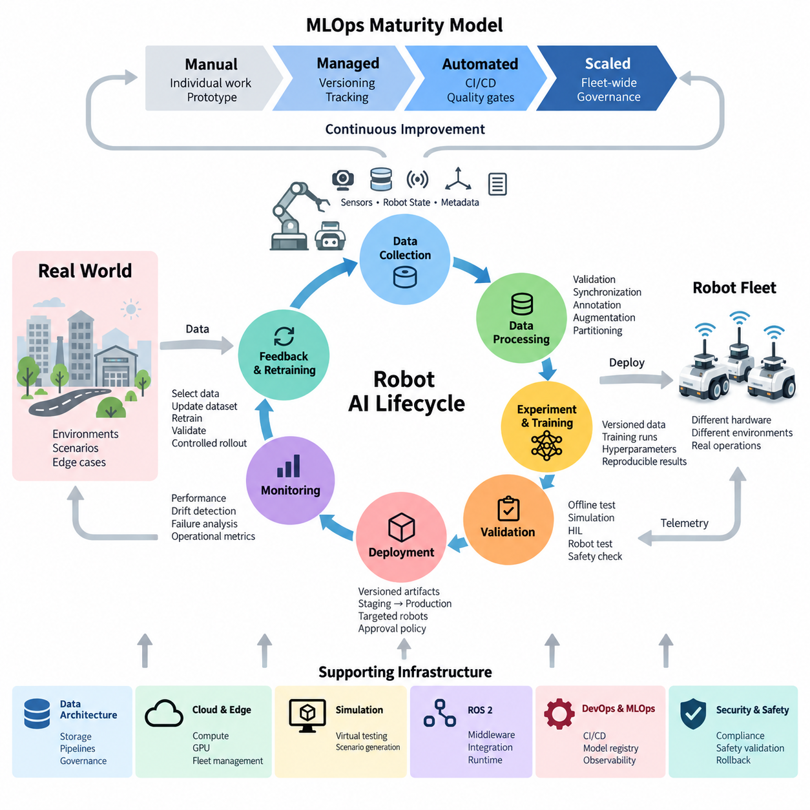
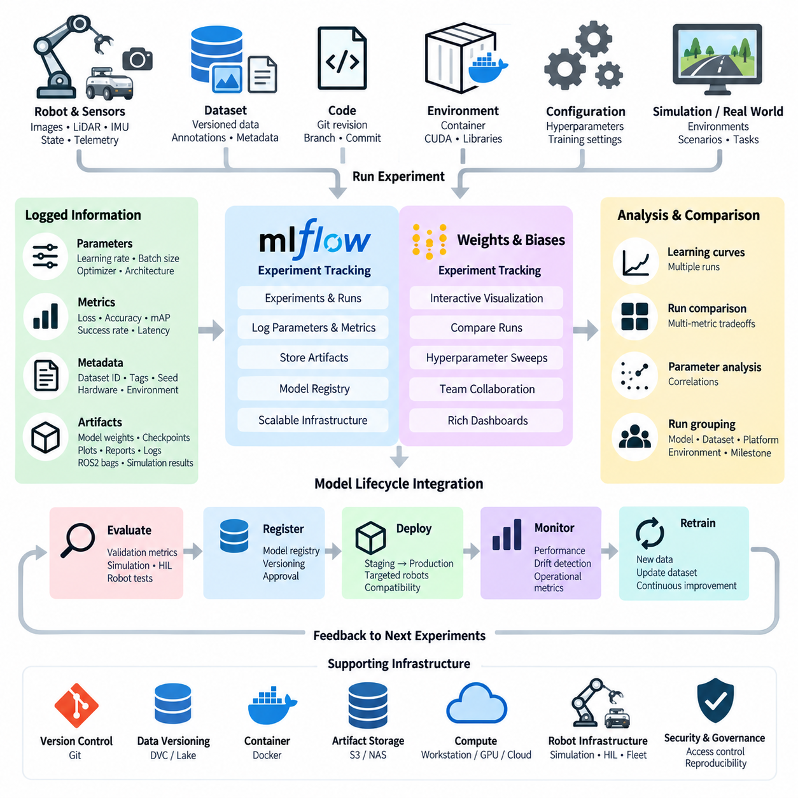
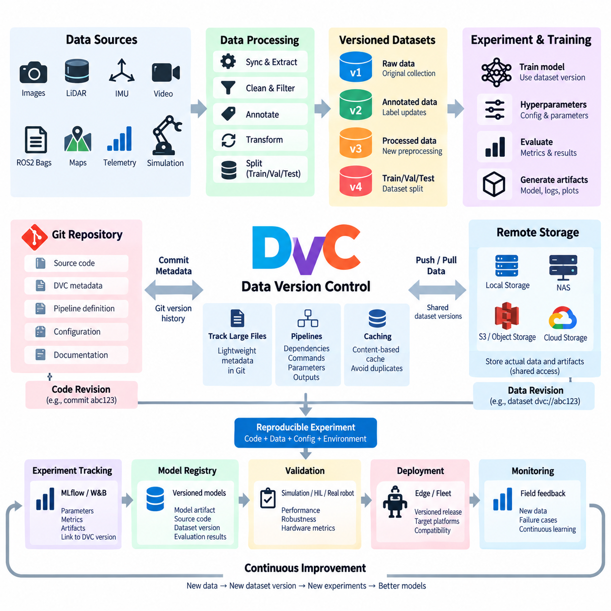
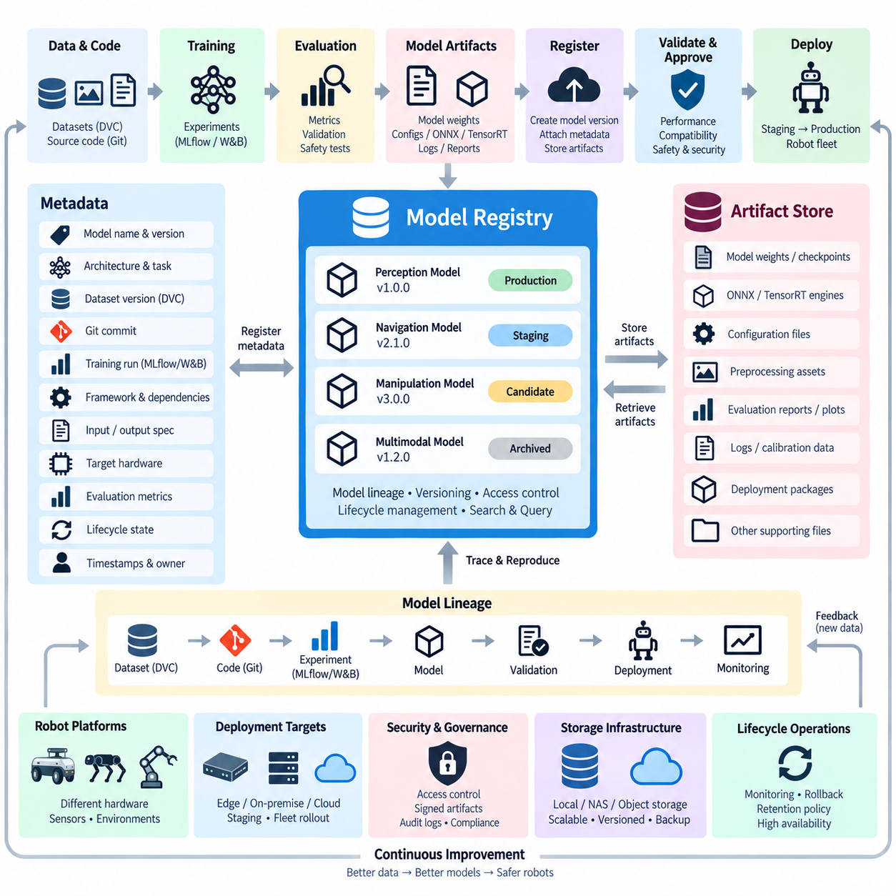
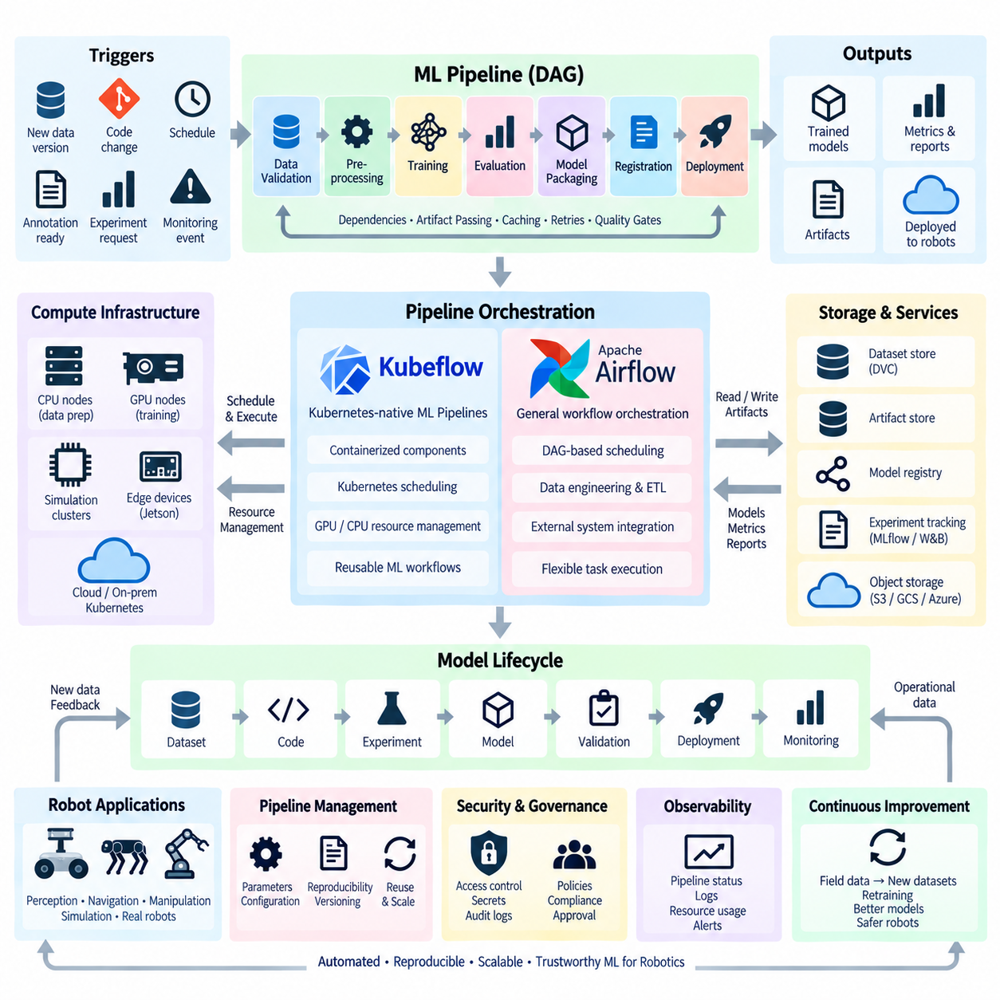
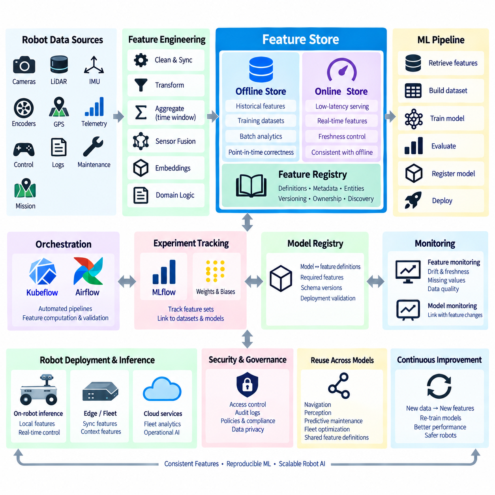
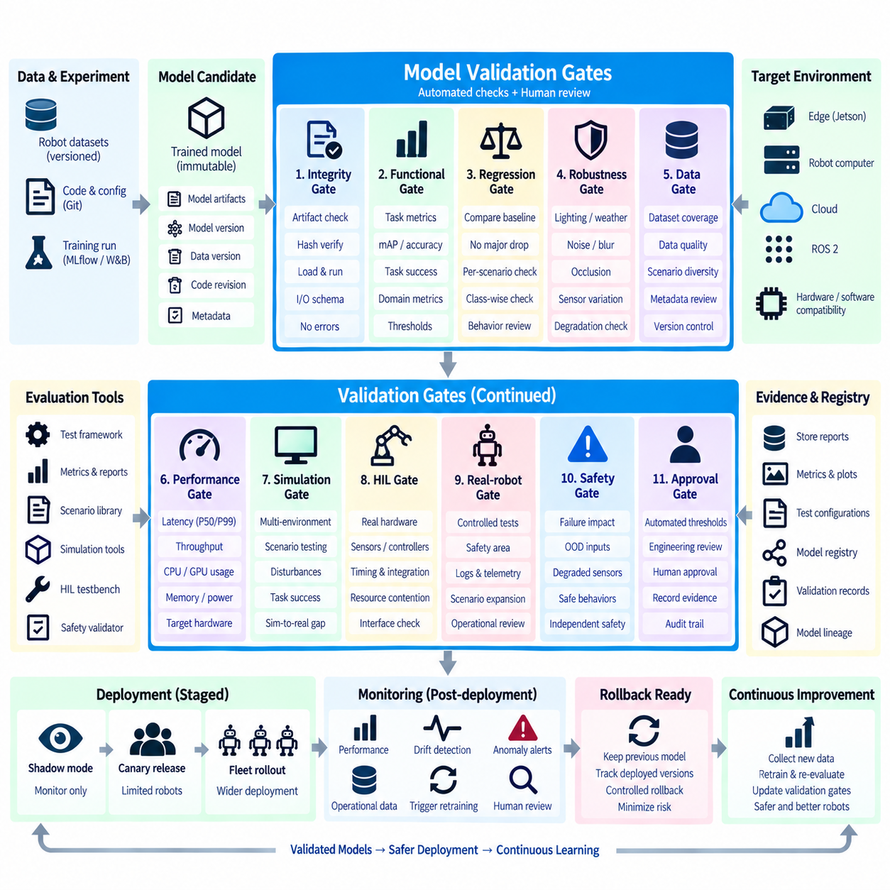
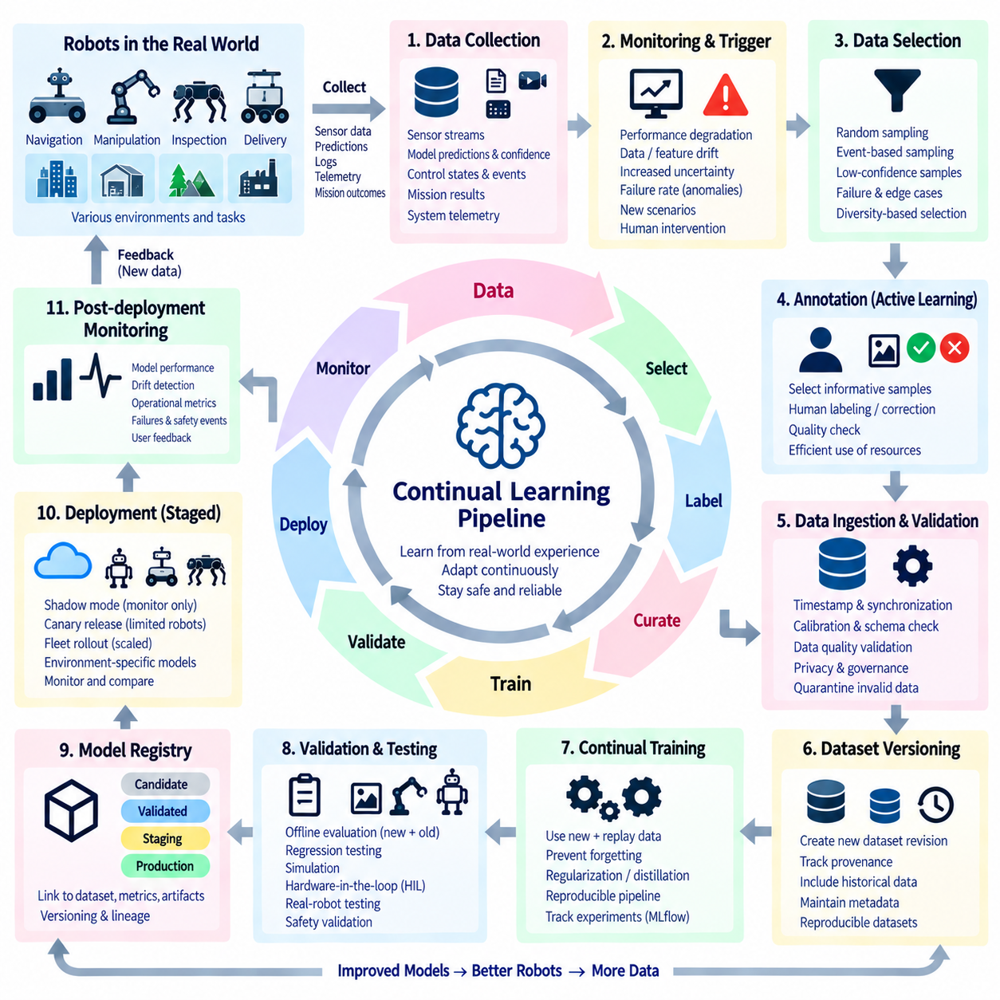
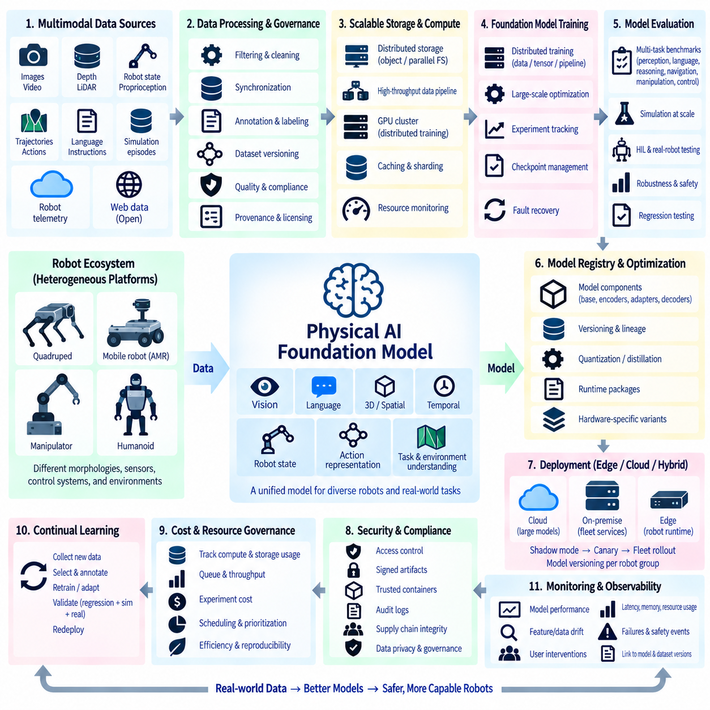
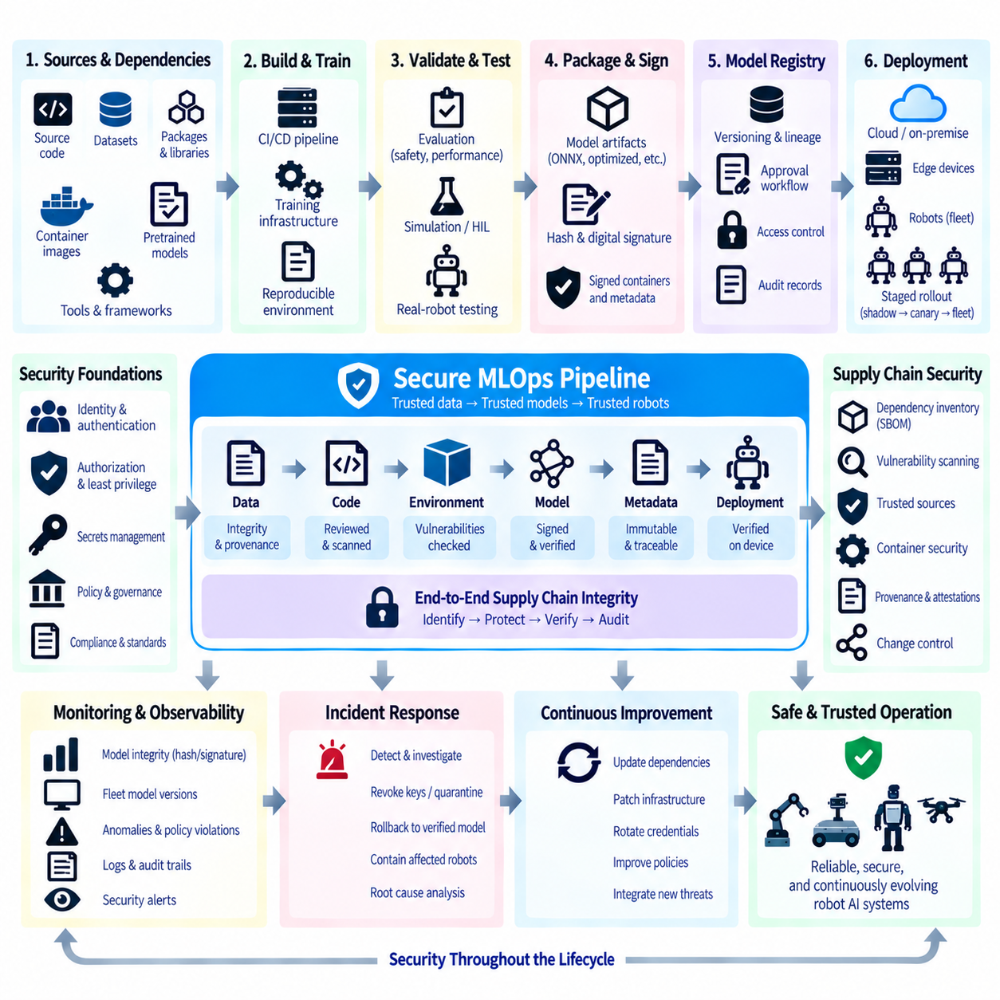

**Volume 10 Robot DevOps and MLOps**


# 6. MLOps Fundamentals

##  

## 6.1. MLOps Maturity Model and Robot AI Lifecycle

{width="7.268055555555556in" height="7.268055555555556in"}

MLOps extends DevOps principles to machine learning systems by treating data, experiments, models, deployment configurations, and production feedback as managed engineering artifacts. In robotics, this discipline becomes especially important because an AI model does not operate only inside a cloud service. It interacts with sensors, compute hardware, middleware, control software, actuators, physical environments, and humans, making the lifecycle inherently cyber-physical.

A robot AI lifecycle typically begins with operational requirements and data acquisition rather than model training itself. Cameras, LiDAR, radar, IMUs, force sensors, telemetry, and robot states generate heterogeneous datasets under changing environmental conditions. These datasets must be collected with contextual metadata such as robot configuration, sensor calibration, location class, software version, mission type, and operating conditions so that later experiments remain reproducible.

The next stage transforms raw robot data into training-ready datasets through validation, synchronization, filtering, annotation, augmentation, and partitioning. Dataset versions should be traceable to the source observations from which they were created. This lineage becomes essential when a deployed model fails because engineers must determine whether the problem originated in sensor data, annotation quality, preprocessing logic, training configuration, model architecture, or deployment conditions.

Experimentation introduces another layer of lifecycle management. Each training run may depend on a specific dataset version, source revision, container image, framework version, hyperparameters, random seed, GPU configuration, and preprocessing pipeline. Mature MLOps therefore records experiments systematically instead of relying on manually maintained notebooks or filenames. The resulting model artifact should be reproducible from an identifiable combination of code, data, configuration, and computational environment.

An MLOps maturity model describes how organizations progress from manual experimentation toward increasingly automated and governed AI operations. At an initial maturity level, individual engineers prepare datasets, execute training jobs, copy model files, and deploy them manually. This approach can support prototypes, but knowledge remains dependent on individuals and reproducing an earlier model may become difficult as datasets, software dependencies, and robot configurations evolve.

At the next maturity level, teams introduce consistent repositories, dataset versioning, experiment tracking, artifact storage, and standardized training environments. Models become identifiable assets rather than anonymous binary files. A model can be connected to its training dataset, experiment metrics, source revision, dependencies, and intended robot platform. This establishes the traceability foundation required for systematic validation and controlled deployment across multiple robots.

Pipeline automation represents a further maturity transition. Data preparation, training, evaluation, packaging, and registration are connected into repeatable workflows triggered by code changes, new datasets, schedules, or operational events. Automated execution reduces procedural variation, but automation alone does not define mature MLOps. Quality gates must determine whether a candidate model satisfies predefined accuracy, robustness, latency, memory, compatibility, and safety-related requirements.

Robotics adds an important distinction between offline model quality and physical deployment readiness. A perception model may achieve excellent benchmark accuracy yet consume excessive GPU memory or violate the latency budget of an edge computer. A navigation or manipulation policy may perform well in simulation but behave unpredictably under sensor noise, mechanical tolerances, illumination changes, terrain variation, payload changes, or previously unseen objects. Validation must therefore progressively approximate real operation.

A mature validation chain can move from offline datasets to simulation, software integration tests, hardware-in-the-loop evaluation, controlled robot tests, and limited fleet deployment. The broader software structure places MLOps alongside observability, model deployment, model monitoring, automated training, and hardware-in-the-loop CI, reflecting that robot AI cannot be validated independently from the surrounding software and hardware stack.

Deployment introduces another maturity dimension because a validated model must be associated with a known runtime environment. The deployment artifact may include model weights, inference engines, preprocessing logic, configuration, dependency versions, and hardware compatibility information. Instead of copying a model directly onto every robot, mature systems promote immutable, versioned artifacts through development, validation, staging, and production environments under explicit approval policies.

Fleet deployment also changes the meaning of production. A cloud AI service usually runs in relatively standardized infrastructure, whereas robots may operate with different sensor revisions, GPU generations, firmware versions, mechanical configurations, and environmental conditions. Model compatibility must therefore be evaluated against robot configuration. Deployment policies may restrict a model to particular hardware revisions or operational domains rather than assuming that one artifact is universally interchangeable.

Production operation closes the lifecycle through observability. Robots should report not only conventional software metrics such as CPU, GPU, memory, latency, and process health, but also AI-specific signals describing input distributions, confidence, prediction statistics, failure events, and operational outcomes. The surrounding volume explicitly separates observability, model monitoring, fleet-wide AI health, drift detection, and automated retraining, showing that production feedback is a core lifecycle component rather than an afterthought.

Monitoring enables engineers to distinguish infrastructure failures from model degradation. A perception pipeline may fail because a ROS 2 node stopped, because GPU inference latency increased, because camera calibration changed, or because the operational environment drifted beyond the training distribution. These failure classes require different responses. Effective MLOps therefore correlates model telemetry with robot software versions, hardware states, sensor health, mission context, and operational events.

Higher maturity introduces controlled feedback loops. Production data associated with difficult or failed cases can be selected for review, annotation, dataset updates, retraining, and validation. The objective is not unrestricted autonomous retraining followed by immediate deployment. Each iteration should preserve lineage so that engineers can determine which operational observations produced a dataset revision, which dataset produced a model, which validation evidence approved it, and which robots subsequently received it.

Continual learning makes governance increasingly important because model improvement and operational stability can conflict. A new model may improve average accuracy while degrading performance for a rare but important scenario. Mature systems therefore compare candidate and production models across representative scenarios, regression datasets, hardware constraints, and safety-relevant conditions. Shadow evaluation, staged rollout, canary deployment, rollback mechanisms, and fallback policies limit the impact of unexpected behavior.

At advanced maturity, MLOps becomes a fleet-scale learning infrastructure rather than merely a model-training pipeline. Robots operate as distributed data-producing edge systems, centralized infrastructure manages datasets and experiments, GPU resources perform training and evaluation, registries maintain approved artifacts, and deployment systems distribute validated models back to selected robots. Monitoring then generates evidence for subsequent development cycles, forming a controlled learning loop between field operation and engineering.

This lifecycle also connects MLOps to the wider robotics software architecture. Robot data architecture governs sensor and telemetry flows, cloud and edge infrastructure supplies computation, simulation provides scalable validation environments, ROS 2 integrates AI functions with robot services, and testing infrastructure verifies behavior before release. The overall software tree therefore positions MLOps as one layer of a broader engineering system spanning embedded software, data, cloud, simulation, perception, learning, security, and validation.

The practical goal of MLOps maturity is consequently not maximum automation. It is controlled repeatability: every important model should have identifiable origins, measurable validation evidence, a defined deployment target, observable production behavior, and a recoverable previous state. As robot fleets and Physical AI models increase in scale, these properties allow AI development to evolve from isolated experiments into a reproducible engineering process capable of supporting continuously improving physical systems.

MLOps(Machine Learning Operations)는 데이터(Data), 실험(Experiment), 모델(Model), 배포 설정(Deployment Configuration), 운영 피드백(Production Feedback)을 관리되는 엔지니어링 산출물(Engineering Artifact)로 취급함으로써 데브옵스(DevOps)의 원칙을 머신러닝 시스템(Machine Learning System)으로 확장한다. 로보틱스(Robotics)에서는 AI 모델이 클라우드 서비스(Cloud Service) 내부에서만 동작하는 것이 아니라 센서(Sensor), 컴퓨팅 하드웨어(Compute Hardware), 미들웨어(Middleware), 제어 소프트웨어(Control Software), 액추에이터(Actuator), 물리 환경(Physical Environment), 사람과 상호작용하기 때문에 이러한 체계가 특히 중요하다.

로봇 AI 수명주기(Robot AI Lifecycle)는 일반적으로 모델 학습(Model Training) 자체가 아니라 운영 요구사항(Operational Requirements)과 데이터 수집(Data Acquisition)에서 시작한다. 카메라(Camera), 라이다(LiDAR), 레이더(Radar), 관성측정장치(IMU), 힘 센서(Force Sensor), 텔레메트리(Telemetry), 로봇 상태(Robot State)는 변화하는 환경 조건에서 다양한 데이터를 생성한다. 이러한 데이터에는 로봇 구성(Robot Configuration), 센서 보정(Sensor Calibration), 위치 유형(Location Class), 소프트웨어 버전(Software Version), 임무 유형(Mission Type), 운용 조건(Operating Conditions) 등의 상황 메타데이터(Contextual Metadata)가 함께 기록되어야 이후 실험의 재현성(Reproducibility)을 확보할 수 있다.

다음 단계에서는 원시 로봇 데이터(Raw Robot Data)를 검증(Validation), 동기화(Synchronization), 필터링(Filtering), 어노테이션(Annotation), 데이터 증강(Augmentation), 데이터 분할(Partitioning)을 통해 학습 준비 데이터셋(Training-ready Dataset)으로 변환한다. 데이터셋 버전(Dataset Version)은 해당 데이터가 생성된 원본 관측(Source Observation)까지 추적할 수 있어야 한다. 배포된 모델에서 문제가 발생했을 때 원인이 센서 데이터, 어노테이션 품질, 전처리 로직(Preprocessing Logic), 학습 설정, 모델 아키텍처(Model Architecture), 배포 환경 중 어디에 있는지 판단하려면 이러한 데이터 계보(Data Lineage)가 필수적이다.

실험(Experimentation)은 수명주기 관리(Lifecycle Management)에 또 다른 계층을 추가한다. 각각의 학습 실행(Training Run)은 특정 데이터셋 버전, 소스 리비전(Source Revision), 컨테이너 이미지(Container Image), 프레임워크 버전(Framework Version), 하이퍼파라미터(Hyperparameter), 난수 시드(Random Seed), GPU 구성, 전처리 파이프라인(Preprocessing Pipeline)에 의존할 수 있다. 따라서 성숙한 MLOps는 수동으로 관리되는 노트북(Notebook)이나 파일 이름에 의존하는 대신 실험을 체계적으로 기록한다. 결과 모델 산출물(Model Artifact)은 식별 가능한 코드(Code), 데이터(Data), 설정(Configuration), 컴퓨팅 환경(Computational Environment)의 조합으로 재현할 수 있어야 한다.

MLOps 성숙도 모델(MLOps Maturity Model)은 조직이 수동 실험(Manual Experimentation)에서 점차 자동화되고 관리되는 AI 운영(AI Operations)으로 발전하는 과정을 설명한다. 초기 성숙도 단계에서는 개별 엔지니어가 데이터셋을 준비하고, 학습 작업을 실행하며, 모델 파일을 복사하고, 수동으로 배포한다. 이러한 방식은 프로토타입(Prototype) 개발에는 사용할 수 있지만 지식이 개인에게 종속되고, 데이터셋과 소프트웨어 의존성(Software Dependency), 로봇 구성이 변화하면서 과거 모델을 재현하기 어려워질 수 있다.

다음 성숙도 단계에서는 일관된 저장소(Repository), 데이터셋 버전 관리(Dataset Versioning), 실험 추적(Experiment Tracking), 산출물 저장소(Artifact Storage), 표준화된 학습 환경(Standardized Training Environment)을 도입한다. 모델은 더 이상 출처를 알 수 없는 바이너리 파일(Binary File)이 아니라 식별 가능한 자산(Identifiable Asset)이 된다. 하나의 모델은 학습 데이터셋, 실험 지표(Experiment Metric), 소스 리비전, 의존성, 적용 대상 로봇 플랫폼(Target Robot Platform)과 연결될 수 있다. 이는 여러 로봇에 대한 체계적인 검증과 통제된 배포에 필요한 추적성(Traceability)의 기반을 형성한다.

파이프라인 자동화(Pipeline Automation)는 한 단계 더 높은 성숙도로의 전환을 의미한다. 데이터 준비(Data Preparation), 학습(Training), 평가(Evaluation), 패키징(Packaging), 등록(Registration)이 코드 변경, 새로운 데이터셋, 일정 또는 운영 이벤트에 의해 실행되는 반복 가능한 워크플로(Repeatable Workflow)로 연결된다. 자동 실행은 절차상의 편차를 줄이지만 자동화 자체만으로 성숙한 MLOps가 완성되는 것은 아니다. 품질 게이트(Quality Gate)를 통해 후보 모델이 사전에 정의된 정확도(Accuracy), 강건성(Robustness), 지연시간(Latency), 메모리(Memory), 호환성(Compatibility), 안전 관련 요구사항(Safety-related Requirement)을 충족하는지 판단해야 한다.

로보틱스는 오프라인 모델 품질(Offline Model Quality)과 실제 물리적 배포 준비도(Physical Deployment Readiness)를 구분해야 한다는 중요한 특성을 가진다. 인지 모델(Perception Model)이 벤치마크(Benchmark)에서 뛰어난 정확도를 달성하더라도 과도한 GPU 메모리를 사용하거나 엣지 컴퓨터(Edge Computer)의 지연시간 예산(Latency Budget)을 초과할 수 있다. 내비게이션(Navigation)이나 조작 정책(Manipulation Policy)도 시뮬레이션에서는 우수하게 동작하지만 센서 노이즈, 기계적 공차(Mechanical Tolerance), 조명 변화, 지형 변화, 페이로드(Payload) 변화 또는 학습에서 경험하지 못한 객체에 대해 예측하지 못한 동작을 보일 수 있다. 따라서 검증 과정은 실제 운용 환경을 단계적으로 근사해야 한다.

성숙한 검증 체계(Validation Chain)는 오프라인 데이터셋(Offline Dataset)에서 시작하여 시뮬레이션(Simulation), 소프트웨어 통합 시험(Software Integration Test), 하드웨어 인 더 루프(Hardware-in-the-Loop, HIL) 평가, 통제된 로봇 시험(Controlled Robot Test), 제한적인 플릿 배포(Limited Fleet Deployment)로 발전할 수 있다. 전체 소프트웨어 구조에서는 MLOps를 관측 가능성(Observability), 모델 배포(Model Deployment), 모델 모니터링(Model Monitoring), 자동 학습(Automated Training), HIL 기반 지속적 통합(HIL CI)과 연결하고 있으며, 이는 로봇 AI가 주변 소프트웨어와 하드웨어 스택(Stack)으로부터 독립적으로 검증될 수 없음을 의미한다.

배포(Deployment)는 검증된 모델을 알려진 런타임 환경(Runtime Environment)과 연결해야 하기 때문에 또 다른 성숙도 차원을 형성한다. 배포 산출물(Deployment Artifact)은 모델 가중치(Model Weight), 추론 엔진(Inference Engine), 전처리 로직, 설정, 의존성 버전, 하드웨어 호환성(Hardware Compatibility) 정보를 포함할 수 있다. 성숙한 시스템에서는 모델을 모든 로봇에 직접 복사하는 대신 변경 불가능한 버전 관리 산출물(Immutable Versioned Artifact)을 개발(Development), 검증(Validation), 스테이징(Staging), 운영(Production) 환경을 거쳐 명시적인 승인 정책(Approval Policy)에 따라 승격한다.

플릿 배포(Fleet Deployment)는 운영(Production)의 의미도 변화시킨다. 클라우드 AI 서비스는 비교적 표준화된 인프라에서 실행되는 반면, 로봇은 서로 다른 센서 리비전(Sensor Revision), GPU 세대, 펌웨어 버전(Firmware Version), 기계적 구성(Mechanical Configuration), 환경 조건에서 운용될 수 있다. 따라서 모델 호환성(Model Compatibility)은 로봇 구성과 함께 평가되어야 한다. 하나의 모델 산출물이 모든 로봇에서 동일하게 교환 가능하다고 가정하기보다 특정 하드웨어 리비전(Hardware Revision)이나 운영 영역(Operational Domain)에만 모델을 적용하도록 배포 정책을 제한할 수 있다.

운영 단계는 관측 가능성(Observability)을 통해 수명주기의 루프(Loop)를 닫는다. 로봇은 CPU, GPU, 메모리, 지연시간, 프로세스 상태(Process Health)와 같은 일반적인 소프트웨어 지표뿐 아니라 입력 데이터 분포(Input Distribution), 신뢰도(Confidence), 예측 통계(Prediction Statistics), 실패 이벤트(Failure Event), 운영 결과(Operational Outcome)를 나타내는 AI 특화 신호도 보고해야 한다. 모델 모니터링, 플릿 전체 AI 상태(Fleet-wide AI Health), 드리프트 감지(Drift Detection), 자동 재학습(Automated Retraining)은 운영 피드백이 부가적인 기능이 아니라 핵심 수명주기 요소임을 보여준다.

모니터링(Monitoring)을 통해 엔지니어는 인프라 장애(Infrastructure Failure)와 모델 성능 저하(Model Degradation)를 구분할 수 있다. 인지 파이프라인(Perception Pipeline)은 ROS 2 노드(Node)가 중단되었기 때문에 실패할 수도 있고, GPU 추론 지연시간이 증가했거나 카메라 보정값이 변경되었거나 운영 환경이 학습 분포(Training Distribution)를 벗어나 드리프트했기 때문에 실패할 수도 있다. 이러한 실패 유형은 서로 다른 대응을 요구한다. 따라서 효과적인 MLOps는 모델 텔레메트리를 로봇 소프트웨어 버전, 하드웨어 상태, 센서 상태(Sensor Health), 임무 상황(Mission Context), 운영 이벤트와 연계한다.

더 높은 성숙도에서는 통제된 피드백 루프(Controlled Feedback Loop)를 도입한다. 어렵거나 실패한 사례와 관련된 운영 데이터를 선별하여 검토, 어노테이션, 데이터셋 업데이트, 재학습(Retraining), 검증에 활용할 수 있다. 목표는 제한 없이 자동 재학습한 뒤 즉시 배포하는 것이 아니다. 각각의 반복 과정은 어떤 운영 관측이 데이터셋 리비전(Dataset Revision)을 만들었고, 어떤 데이터셋이 모델을 생성했으며, 어떤 검증 근거(Validation Evidence)가 이를 승인했고, 이후 어떤 로봇에 배포되었는지를 엔지니어가 추적할 수 있도록 계보(Lineage)를 유지해야 한다.

지속 학습(Continual Learning)이 적용될수록 거버넌스(Governance)의 중요성도 증가한다. 모델 개선과 운영 안정성(Operational Stability)이 서로 충돌할 수 있기 때문이다. 새로운 모델이 평균 정확도를 향상시키면서도 드물지만 중요한 시나리오의 성능을 저하시킬 수 있다. 따라서 성숙한 시스템에서는 대표 시나리오, 회귀 데이터셋(Regression Dataset), 하드웨어 제약(Hardware Constraint), 안전 관련 조건을 기준으로 후보 모델과 운영 모델을 비교한다. 섀도 평가(Shadow Evaluation), 단계적 배포(Staged Rollout), 카나리 배포(Canary Deployment), 롤백 메커니즘(Rollback Mechanism), 폴백 정책(Fallback Policy)은 예상하지 못한 동작의 영향을 제한한다.

고도화된 성숙도에서 MLOps는 단순한 모델 학습 파이프라인을 넘어 플릿 규모 학습 인프라(Fleet-scale Learning Infrastructure)로 발전한다. 로봇은 분산된 데이터 생성 엣지 시스템(Distributed Data-producing Edge System)으로 동작하고, 중앙 인프라는 데이터셋과 실험을 관리하며, GPU 자원은 학습과 평가를 수행하고, 모델 레지스트리(Model Registry)는 승인된 산출물을 관리한다. 배포 시스템은 검증된 모델을 선택된 로봇으로 다시 전달하며, 모니터링 결과는 이후 개발 주기를 위한 근거를 생성하여 현장 운영(Field Operation)과 엔지니어링 사이에 통제된 학습 루프를 형성한다.

이러한 수명주기는 MLOps를 더 넓은 로보틱스 소프트웨어 아키텍처(Robotics Software Architecture)와 연결한다. 로봇 데이터 아키텍처(Robot Data Architecture)는 센서 및 텔레메트리 데이터 흐름을 관리하고, 클라우드 및 엣지 인프라(Cloud and Edge Infrastructure)는 연산 자원을 제공하며, 시뮬레이션은 확장 가능한 검증 환경을 제공한다. ROS 2는 AI 기능과 로봇 서비스를 통합하고, 시험 인프라(Testing Infrastructure)는 릴리스 전에 동작을 검증한다. 따라서 MLOps는 임베디드 소프트웨어, 데이터, 클라우드, 시뮬레이션, 인지, 학습, 보안, 검증을 연결하는 더 광범위한 엔지니어링 시스템의 한 계층으로 이해할 수 있다.

결과적으로 MLOps 성숙도의 실질적인 목표는 최대 수준의 자동화가 아니라 통제된 재현성(Controlled Repeatability)이다. 모든 중요한 모델은 식별 가능한 출처(Identifiable Origin), 측정 가능한 검증 근거, 정의된 배포 대상(Deployment Target), 관측 가능한 운영 동작(Observable Production Behavior), 복구 가능한 이전 상태(Recoverable Previous State)를 가져야 한다. 로봇 플릿과 피지컬 AI(Physical AI) 모델의 규모가 증가할수록 이러한 특성은 AI 개발을 개별적인 실험에서 지속적으로 개선되는 물리 시스템을 지원할 수 있는 재현 가능한 엔지니어링 프로세스(Reproducible Engineering Process)로 발전시키는 기반이 된다.

##  

## 6.2. ML Experiment Tracking MLflow Weights and Biases [w/Code]

{width="7.268055555555556in" height="7.268055555555556in"}

Machine learning experiment tracking is the systematic recording of everything required to understand, compare, reproduce, and audit model development. In robot AI, a single experiment may involve dataset versions, preprocessing parameters, neural network architectures, hyperparameters, source code revisions, GPU environments, evaluation metrics, and generated artifacts. Without structured tracking, hundreds of training runs quickly become difficult to distinguish or reproduce.

Traditional experimentation often begins with notebooks, shell scripts, spreadsheets, and model files named manually by engineers. This approach may work during early prototyping, but it becomes fragile when several developers train models simultaneously or when experiments run across workstations, GPU servers, and cloud infrastructure. Experiment tracking replaces these informal records with a centralized history in which each training execution becomes an identifiable and searchable run.

A tracked experiment normally contains parameters, metrics, metadata, and artifacts. Parameters describe the conditions under which training occurred, including learning rate, batch size, optimizer, model architecture, augmentation settings, random seed, and dataset identifier. Metrics record measurable results such as training loss, validation loss, precision, recall, F1 score, mean average precision, success rate, or task-specific robot performance indicators.

Artifacts represent the files generated by an experiment. These can include trained model weights, checkpoints, configuration files, plots, evaluation reports, confusion matrices, TensorRT engines, sample predictions, and diagnostic logs. For robotics, artifacts may additionally contain ROS 2 bag references, simulation results, trajectory evaluations, perception outputs, or failure-case datasets. Storing them with the corresponding run prevents results from becoming separated from their experimental context.

MLflow provides an experiment-tracking architecture centered on experiments and runs. A training application can log parameters, metrics, tags, and artifacts through tracking APIs, while a tracking server provides centralized access to experiment history. Artifact storage can be separated from metadata storage, allowing organizations to keep large model files and evaluation outputs in object storage or shared storage while maintaining searchable experiment records.

This separation is valuable for robot AI infrastructure because training may occur on heterogeneous compute resources. An engineer can initiate a small experiment on a workstation, execute larger training on multi-GPU servers, and later evaluate the resulting model on an edge platform. If these environments report to the same tracking system, their results can be compared through common experiment identifiers instead of being fragmented across individual machines.

MLflow also supports the transition from experimentation toward lifecycle management. A successful training run can produce a model artifact that is subsequently evaluated, registered, versioned, and promoted through later MLOps stages. Experiment tracking therefore serves as an upstream source of provenance for model registration and deployment. The deployed model can be traced backward to the run that produced it and ultimately to its parameters, metrics, code, and dataset references.

Weights & Biases, commonly abbreviated as W&B, approaches experiment tracking with strong emphasis on interactive visualization and collaborative machine learning workflows. Training scripts can report metrics continuously, allowing engineers to inspect learning curves, compare runs, organize experiments, visualize parameter relationships, and share results with team members. This is especially useful when model development involves many rapidly changing experiments and frequent comparison.

Visualization becomes important because model selection rarely depends on a single metric. A perception engineer may compare accuracy against inference latency, GPU memory consumption, model size, and robustness under environmental variation. A manipulation model may require comparison of task success rate, collision frequency, trajectory duration, and generalization. Experiment dashboards make these multidimensional trade-offs visible rather than reducing model selection to the lowest validation loss.

Run grouping provides another useful capability for robot learning. Experiments can be organized according to model family, dataset revision, robot platform, sensor configuration, environment, or development milestone. Hyperparameter sweeps may generate dozens or hundreds of related runs, while reinforcement learning can produce repeated trials across different seeds and simulation conditions. Structured grouping allows these experiments to be analyzed as related populations rather than isolated executions.

Experiment tracking should also capture the software environment. Two runs using identical hyperparameters may produce different behavior if they use different CUDA, PyTorch, driver, preprocessing, or library versions. Container images can reduce this variability, but the container identifier itself should still be recorded. Combining source revision, environment information, dataset version, and training configuration creates a reproducibility chain connecting software engineering practices with machine learning operations.

Dataset identity is particularly important because experiment tracking alone does not version the underlying data. The run should reference an immutable or otherwise traceable dataset revision managed by the surrounding data pipeline or data-versioning system. This allows engineers to distinguish improvements caused by model architecture from improvements caused by changed annotations, additional training samples, modified augmentation, or corrected sensor preprocessing.

Robot AI experiments require hardware-aware metrics that conventional ML projects may overlook. A candidate model intended for Jetson or another edge computer should not be evaluated solely by offline accuracy. Tracking can include inference latency, throughput, GPU utilization, peak memory, power-related measurements, initialization time, and model size. These metrics reveal whether an apparently superior model is practical within the computational constraints of the target robot.

Simulation experiments can also be incorporated into the same tracking structure. Reinforcement learning policies, navigation algorithms, and manipulation models may be evaluated across thousands of simulated episodes. Environment versions, physics parameters, randomization settings, reward configurations, success rates, collision statistics, and policy checkpoints can be attached to individual runs. This creates traceability between simulation conditions and the resulting robot behavior.

As development progresses toward physical validation, experiment records can incorporate results from software integration, hardware-in-the-loop testing, and controlled robot trials. A model originally identified by a training run can accumulate evidence showing its behavior under increasingly realistic conditions. Rather than treating training accuracy as the final result, the experiment lineage can connect offline evaluation to deployment-oriented measurements obtained from actual robot hardware.

MLflow and W&B therefore overlap substantially but can fit different operational preferences. MLflow is frequently used as an extensible tracking and model-lifecycle foundation that can be integrated with organization-controlled infrastructure, while W&B emphasizes rich experiment visualization, collaboration, and rapid analysis of large collections of runs. Teams may select one platform or design workflows in which experiment metadata remains interoperable with broader artifact and model-management systems.

The tracking platform itself should not become the only source of reproducibility. Source code belongs in version control, datasets require explicit version management, containers define executable environments, and model registries govern deployable artifacts. Experiment tracking connects these components by storing their identifiers and relationships. Its role is therefore not to replace Git, data versioning, artifact storage, or deployment systems, but to provide the contextual record that binds them together.

In a mature robot MLOps pipeline, experiment creation can be automated. A pipeline receives a dataset version and training configuration, records the source revision and environment, starts the training run, streams metrics, stores resulting artifacts, executes evaluation, and attaches validation results to the run. Candidate models satisfying predefined gates can then advance toward registration, while failed experiments remain available for comparison and engineering analysis.

Consistent naming and metadata conventions become increasingly important at fleet scale. Tags can identify robot family, sensor suite, target hardware, operational domain, model purpose, dataset generation, and release candidate status. Engineers can then search historical experiments when investigating field failures or preparing a new deployment. Instead of repeating old experiments, they can locate previous evidence and understand why earlier model candidates were accepted or rejected.

Experiment tracking ultimately converts machine learning development from a sequence of transient training jobs into an engineering knowledge system. Every meaningful model result becomes connected to the conditions that produced it, the evidence used to evaluate it, and the artifacts required to reproduce it. For robot AI, this traceability forms a critical bridge between research experimentation and controlled deployment, enabling model development to scale across teams, compute infrastructure, robot platforms, and continuously evolving datasets.

머신러닝 실험 추적(Machine Learning Experiment Tracking)은 모델 개발(Model Development)을 이해하고 비교하며 재현하고 감사(Audit)하는 데 필요한 모든 정보를 체계적으로 기록하는 과정이다. 로봇 AI(Robot AI)의 단일 실험에는 데이터셋 버전(Dataset Version), 전처리 파라미터(Preprocessing Parameter), 신경망 아키텍처(Neural Network Architecture), 하이퍼파라미터(Hyperparameter), 소스 코드 리비전(Source Code Revision), GPU 환경, 평가 지표(Evaluation Metric), 생성된 산출물(Artifact) 등이 포함될 수 있다. 체계적인 추적이 없다면 수백 개의 학습 실행(Training Run)을 구분하거나 재현하는 것은 빠르게 어려워진다.

전통적인 실험은 노트북(Notebook), 셸 스크립트(Shell Script), 스프레드시트(Spreadsheet), 엔지니어가 수동으로 이름을 지정한 모델 파일에서 시작되는 경우가 많다. 이러한 방식은 초기 프로토타이핑(Prototyping) 단계에서는 사용할 수 있지만 여러 개발자가 동시에 모델을 학습하거나 워크스테이션(Workstation), GPU 서버, 클라우드 인프라(Cloud Infrastructure)에 걸쳐 실험이 수행되면 취약해진다. 실험 추적은 이러한 비공식적인 기록을 중앙화된 이력(Centralized History)으로 대체하여 각각의 학습 실행을 식별하고 검색할 수 있는 실행 단위(Run)로 만든다.

추적되는 실험에는 일반적으로 파라미터(Parameter), 지표(Metric), 메타데이터(Metadata), 산출물(Artifact)이 포함된다. 파라미터는 학습률(Learning Rate), 배치 크기(Batch Size), 옵티마이저(Optimizer), 모델 아키텍처, 데이터 증강 설정(Augmentation Setting), 난수 시드(Random Seed), 데이터셋 식별자(Dataset Identifier) 등 학습이 수행된 조건을 설명한다. 지표는 학습 손실(Training Loss), 검증 손실(Validation Loss), 정밀도(Precision), 재현율(Recall), F1 점수(F1 Score), 평균 정밀도(mAP), 성공률(Success Rate), 로봇 작업별 성능 지표(Task-specific Robot Performance Indicator)와 같은 측정 가능한 결과를 기록한다.

산출물은 실험을 통해 생성된 파일을 의미한다. 여기에는 학습된 모델 가중치(Model Weight), 체크포인트(Checkpoint), 설정 파일(Configuration File), 그래프(Plot), 평가 보고서(Evaluation Report), 혼동 행렬(Confusion Matrix), TensorRT 엔진, 예측 샘플(Sample Prediction), 진단 로그(Diagnostic Log) 등이 포함될 수 있다. 로보틱스에서는 ROS 2 백(Bag) 참조, 시뮬레이션 결과, 궤적 평가(Trajectory Evaluation), 인지 결과(Perception Output), 실패 사례 데이터셋(Failure-case Dataset)도 산출물에 포함될 수 있다. 이러한 자료를 해당 실행과 함께 저장하면 실험 결과가 실험 맥락(Experimental Context)과 분리되는 것을 방지할 수 있다.

MLflow는 실험(Experiment)과 실행(Run)을 중심으로 하는 실험 추적 아키텍처(Experiment Tracking Architecture)를 제공한다. 학습 애플리케이션은 추적 API(Tracking API)를 통해 파라미터, 지표, 태그(Tag), 산출물을 기록할 수 있으며, 추적 서버(Tracking Server)는 실험 이력에 대한 중앙화된 접근을 제공한다. 산출물 저장소(Artifact Storage)는 메타데이터 저장소(Metadata Storage)와 분리할 수 있으므로 대용량 모델 파일과 평가 결과를 객체 스토리지(Object Storage) 또는 공유 스토리지(Shared Storage)에 저장하면서 검색 가능한 실험 기록을 유지할 수 있다.

이러한 분리는 로봇 AI 인프라에서 특히 유용하다. 학습이 서로 다른 컴퓨팅 자원(Compute Resource)에서 수행될 수 있기 때문이다. 엔지니어는 워크스테이션에서 소규모 실험을 시작하고, 멀티 GPU 서버(Multi-GPU Server)에서 대규모 학습을 수행한 뒤, 생성된 모델을 엣지 플랫폼(Edge Platform)에서 평가할 수 있다. 이러한 환경이 동일한 추적 시스템(Tracking System)에 결과를 보고하면 개별 컴퓨터에 실험 결과가 분산되는 대신 공통 실험 식별자(Experiment Identifier)를 통해 결과를 비교할 수 있다.

MLflow는 실험 단계에서 모델 수명주기 관리(Model Lifecycle Management)로 전환하는 과정도 지원한다. 성공적인 학습 실행은 이후 평가, 등록, 버전 관리, MLOps 후속 단계로의 승격(Promotion)에 사용되는 모델 산출물을 생성할 수 있다. 따라서 실험 추적은 모델 등록(Model Registration)과 배포(Deployment)를 위한 상위 단계의 출처 정보(Provenance)를 제공한다. 배포된 모델은 해당 모델을 생성한 실행까지 역추적할 수 있으며, 궁극적으로 파라미터, 지표, 코드, 데이터셋 참조 정보까지 연결할 수 있다.

Weights & Biases는 일반적으로 W&B로 줄여 부르며, 대화형 시각화(Interactive Visualization)와 협업형 머신러닝 워크플로(Collaborative Machine Learning Workflow)를 강조하는 방식으로 실험 추적을 제공한다. 학습 스크립트는 지속적으로 지표를 보고할 수 있으며, 엔지니어는 학습 곡선(Learning Curve)을 확인하고, 실행을 비교하고, 실험을 구성하며, 파라미터 간 관계를 시각화하고, 결과를 팀 구성원과 공유할 수 있다. 이는 모델 개발 과정에서 빠르게 변화하는 다수의 실험과 빈번한 비교가 필요한 경우 특히 유용하다.

모델 선택(Model Selection)은 하나의 지표만으로 결정되는 경우가 드물기 때문에 시각화(Visualization)가 중요하다. 인지 엔지니어(Perception Engineer)는 정확도와 함께 추론 지연시간(Inference Latency), GPU 메모리 사용량, 모델 크기(Model Size), 환경 변화에 대한 강건성(Robustness)을 비교할 수 있다. 조작 모델(Manipulation Model)은 작업 성공률(Task Success Rate), 충돌 빈도(Collision Frequency), 궤적 수행 시간(Trajectory Duration), 일반화 성능(Generalization)을 비교해야 할 수 있다. 실험 대시보드(Experiment Dashboard)는 모델 선택을 단순히 가장 낮은 검증 손실로 축소하지 않고 이러한 다차원적 트레이드오프(Multidimensional Trade-off)를 가시화한다.

실행 그룹화(Run Grouping)는 로봇 학습(Robot Learning)에서 유용한 또 다른 기능이다. 실험은 모델 계열(Model Family), 데이터셋 리비전(Dataset Revision), 로봇 플랫폼(Robot Platform), 센서 구성(Sensor Configuration), 환경(Environment), 개발 마일스톤(Development Milestone)에 따라 구성할 수 있다. 하이퍼파라미터 탐색(Hyperparameter Sweep)은 수십 개 또는 수백 개의 관련 실행을 생성할 수 있으며, 강화학습(Reinforcement Learning)은 서로 다른 난수 시드와 시뮬레이션 조건에서 반복 시험을 수행할 수 있다. 구조화된 그룹화는 이러한 실험을 서로 독립된 실행이 아니라 연관된 집단으로 분석할 수 있게 한다.

실험 추적에는 소프트웨어 환경(Software Environment)도 포함되어야 한다. 동일한 하이퍼파라미터를 사용하는 두 실행이라도 CUDA, PyTorch, 드라이버(Driver), 전처리 또는 라이브러리 버전이 다르면 서로 다른 동작을 보일 수 있다. 컨테이너 이미지(Container Image)를 사용하면 이러한 변동성을 줄일 수 있지만 컨테이너 식별자(Container Identifier) 자체도 기록해야 한다. 소스 리비전, 환경 정보, 데이터셋 버전, 학습 설정을 결합하면 소프트웨어 엔지니어링(Software Engineering)과 머신러닝 운영(Machine Learning Operations)을 연결하는 재현성 체인(Reproducibility Chain)을 구축할 수 있다.

데이터셋 식별성(Dataset Identity)은 특히 중요하다. 실험 추적 자체가 기반 데이터를 버전 관리하는 것은 아니기 때문이다. 각각의 실행은 주변 데이터 파이프라인(Data Pipeline)이나 데이터 버전 관리 시스템(Data Versioning System)이 관리하는 변경 불가능하거나 추적 가능한 데이터셋 리비전을 참조해야 한다. 이를 통해 모델 아키텍처 변경으로 발생한 성능 향상과 어노테이션 변경, 학습 샘플 추가, 데이터 증강 수정 또는 센서 전처리 오류 수정으로 발생한 성능 향상을 구분할 수 있다.

로봇 AI 실험에는 일반적인 머신러닝 프로젝트에서 간과할 수 있는 하드웨어 인지형 지표(Hardware-aware Metric)가 필요하다. Jetson이나 다른 엣지 컴퓨터에 적용되는 후보 모델은 오프라인 정확도만으로 평가해서는 안 된다. 실험 추적에는 추론 지연시간, 처리량(Throughput), GPU 사용률, 최대 메모리 사용량(Peak Memory), 전력 관련 측정값(Power-related Measurement), 초기화 시간(Initialization Time), 모델 크기 등을 포함할 수 있다. 이러한 지표를 통해 정확도가 더 높은 모델이 실제 대상 로봇의 컴퓨팅 제약(Computational Constraint) 내에서 실행 가능한지 판단할 수 있다.

시뮬레이션 실험(Simulation Experiment)도 동일한 추적 구조에 통합할 수 있다. 강화학습 정책(Reinforcement Learning Policy), 내비게이션 알고리즘(Navigation Algorithm), 조작 모델은 수천 개의 시뮬레이션 에피소드(Simulated Episode)를 통해 평가될 수 있다. 환경 버전(Environment Version), 물리 파라미터(Physics Parameter), 랜덤화 설정(Randomization Setting), 보상 설정(Reward Configuration), 성공률, 충돌 통계(Collision Statistics), 정책 체크포인트(Policy Checkpoint)를 각각의 실행에 연결할 수 있다. 이를 통해 시뮬레이션 조건과 그 결과로 생성된 로봇 동작 사이의 추적성을 확보할 수 있다.

개발이 실제 물리적 검증(Physical Validation) 단계로 진행되면 실험 기록에 소프트웨어 통합 시험(Software Integration Test), 하드웨어 인 더 루프(Hardware-in-the-Loop, HIL) 시험, 통제된 로봇 시험(Controlled Robot Trial)의 결과를 포함할 수 있다. 처음에는 하나의 학습 실행으로 식별된 모델에 점차 현실적인 조건에서 수행된 동작 검증 결과를 축적할 수 있다. 따라서 학습 정확도를 최종 결과로 취급하는 대신 실험 계보(Experiment Lineage)를 통해 오프라인 평가와 실제 로봇 하드웨어에서 측정한 배포 지향 지표(Deployment-oriented Measurement)를 연결할 수 있다.

MLflow와 W&B는 상당 부분 기능이 중첩되지만 서로 다른 운영 선호도(Operational Preference)에 적합할 수 있다. MLflow는 조직이 통제하는 인프라와 통합할 수 있는 확장 가능한 실험 추적 및 모델 수명주기 기반(Model Lifecycle Foundation)으로 활용되는 경우가 많으며, W&B는 풍부한 실험 시각화, 협업(Collaboration), 대규모 실행 집합에 대한 빠른 분석을 강조한다. 팀은 하나의 플랫폼을 선택하거나 실험 메타데이터가 더 광범위한 산출물 및 모델 관리 시스템과 상호운용(Interoperability)될 수 있는 워크플로를 설계할 수 있다.

추적 플랫폼(Tracking Platform) 자체가 재현성의 유일한 원천이 되어서는 안 된다. 소스 코드는 버전 관리 시스템(Version Control)에 저장하고, 데이터셋은 명시적인 버전 관리가 필요하며, 컨테이너(Container)는 실행 환경을 정의하고, 모델 레지스트리(Model Registry)는 배포 가능한 산출물을 관리해야 한다. 실험 추적은 이러한 구성요소의 식별자와 관계를 저장함으로써 서로 연결한다. 따라서 실험 추적의 역할은 Git, 데이터 버전 관리, 산출물 저장소, 배포 시스템을 대체하는 것이 아니라 이들을 하나로 연결하는 맥락적 기록(Contextual Record)을 제공하는 것이다.

성숙한 로봇 MLOps 파이프라인에서는 실험 생성(Experiment Creation)을 자동화할 수 있다. 파이프라인은 데이터셋 버전과 학습 설정을 입력받고, 소스 리비전과 환경을 기록하며, 학습 실행을 시작하고, 지표를 스트리밍(Streaming)하고, 생성된 산출물을 저장하며, 평가를 수행한 뒤 검증 결과를 해당 실행에 연결한다. 사전에 정의된 게이트(Gate)를 만족하는 후보 모델은 등록 단계로 진행할 수 있으며, 실패한 실험 역시 비교와 엔지니어링 분석을 위해 보존된다.

플릿 규모(Fleet Scale)에서는 일관된 명명 규칙(Naming Convention)과 메타데이터 규칙(Metadata Convention)이 더욱 중요해진다. 태그(Tag)를 사용하여 로봇 계열, 센서 구성, 대상 하드웨어(Target Hardware), 운영 영역(Operational Domain), 모델 목적(Model Purpose), 데이터셋 세대(Dataset Generation), 릴리스 후보 상태(Release Candidate Status)를 식별할 수 있다. 엔지니어는 현장 장애(Field Failure)를 조사하거나 새로운 배포를 준비할 때 과거 실험을 검색할 수 있다. 기존 실험을 반복하는 대신 이전의 검증 근거를 찾아 어떤 이유로 과거 모델 후보가 승인되거나 거부되었는지 이해할 수 있다.

궁극적으로 실험 추적(Experiment Tracking)은 머신러닝 개발을 일시적인 학습 작업(Transient Training Job)의 연속에서 엔지니어링 지식 시스템(Engineering Knowledge System)으로 전환한다. 의미 있는 모든 모델 결과는 해당 결과를 생성한 조건, 평가에 사용된 근거, 재현에 필요한 산출물과 연결된다. 로봇 AI에서 이러한 추적성은 연구 실험(Research Experimentation)과 통제된 배포(Controlled Deployment)를 연결하는 핵심적인 다리 역할을 하며, 여러 팀, 컴퓨팅 인프라, 로봇 플랫폼, 지속적으로 변화하는 데이터셋 전반에서 모델 개발을 확장할 수 있게 한다.

##  

## 6.3. Data Versioning and Reproducibility DVC [w/Code]

{width="7.268055555555556in" height="7.268055555555556in"}

Data versioning is the practice of assigning identifiable states to datasets so that machine learning experiments can be reproduced, compared, and audited over time. Unlike source code, robot datasets often contain gigabytes or terabytes of images, LiDAR point clouds, ROS 2 bags, video, telemetry, maps, and simulation outputs. Storing these large binary assets directly in Git is inefficient, so MLOps requires a mechanism that connects lightweight version metadata with scalable external storage.

Reproducibility means that an engineer can reconstruct the data, code, configuration, and environment associated with a particular experiment or released model. A Git commit alone cannot guarantee this because the training dataset may have changed independently from the source code. A reproducible robot AI workflow therefore records both the software revision and an exact dataset revision, allowing the training inputs used months earlier to be restored even after newer data has been collected.

Data Version Control, commonly known as DVC, extends Git-oriented development workflows to datasets, models, and other large artifacts. Instead of placing large files directly inside the Git repository, DVC stores lightweight metadata files that describe the tracked content while the actual data can reside in local storage, network storage, object storage, or cloud services. Git then versions the metadata, connecting each source-code revision with the corresponding state of the data.

This architecture separates version history from bulk data storage. A repository can contain source code, configuration files, DVC metadata, and pipeline definitions while hundreds of gigabytes of sensor recordings remain outside Git. When another engineer checks out a particular Git revision, the associated DVC metadata identifies the required dataset state. The corresponding data can then be retrieved from configured storage, reconstructing the experiment inputs without duplicating large binary histories inside the source repository.

DVC tracks files and directories through content-based information rather than relying only on human-readable filenames. When tracked data changes, its corresponding metadata changes as well. Committing that metadata to Git creates a relationship between a source revision and a specific data state. Consequently, dataset_v3 or final_dataset_new names are no longer the primary mechanism for identifying training data; reproducibility is based on version-controlled metadata and content identity.

A DVC remote provides shared storage for versioned data and artifacts. Depending on infrastructure design, this remote can be located on a shared filesystem, NAS, object storage, or supported cloud storage. Developers keep manageable working copies while the remote acts as a common source for required dataset objects. This model is especially useful in robotics laboratories where workstations, GPU training servers, simulation nodes, and edge-development machines need controlled access to common datasets.

The basic workflow parallels Git. Engineers modify or generate data, update the DVC-tracked state, commit the resulting metadata through Git, and transfer required data objects to shared storage. Other systems can retrieve the repository revision and synchronize the corresponding data. This creates coordinated versioning without requiring Git itself to transfer every camera frame, point cloud, model checkpoint, or recorded robot episode.

Robot datasets are rarely static collections. Field robots continuously generate new observations, failure cases, unusual environments, and sensor recordings. Annotation teams may correct labels, calibration procedures may change, and preprocessing pipelines may remove invalid samples or generate new representations. Each of these operations can produce a new dataset state. Versioning makes these changes explicit and allows engineers to compare models trained before and after a particular data modification.

Dataset provenance goes beyond identifying a file collection. A useful version should be associated with information describing where the data originated and how it was transformed. For robotics, this can include robot platform, sensor suite, calibration revision, recording session, operational environment, annotation version, preprocessing configuration, and filtering criteria. DVC can participate in this provenance chain by connecting versioned inputs and outputs with reproducible pipeline stages.

DVC pipelines represent data and model workflows as dependencies, commands, parameters, and outputs. A pipeline may begin with raw robot logs, continue through extraction and synchronization, generate annotations or processed tensors, execute model training, and finally produce evaluation results. When dependencies or parameters change, the affected stages can be identified and reproduced. This converts data preparation from an undocumented sequence of manual commands into an explicit computational workflow.

Pipeline reproducibility is particularly important because preprocessing can influence model behavior as strongly as architecture changes. Camera resizing, image normalization, point-cloud filtering, coordinate transforms, temporal synchronization, class balancing, augmentation, and train-validation splitting can all alter experimental results. If these transformations are represented as versioned pipeline stages, engineers can determine exactly how a particular training dataset was derived from its original sensor data.

DVC parameters provide another connection between data pipelines and experimentation. Values controlling preprocessing, training, or evaluation can be stored in structured configuration files and referenced by pipeline stages. Changing a parameter creates a detectable modification to the experiment definition. Combined with Git revisions and DVC-tracked artifacts, this helps establish a reproducibility chain from source data through processing configuration to the final model and evaluation output.

Caching improves efficiency when large datasets are used repeatedly. DVC can maintain a content-addressed cache so that unchanged data does not need to be copied unnecessarily between versions. Multiple dataset states may share common underlying objects, reducing redundant storage and transfer. This is valuable for robot learning because successive dataset revisions often add or modify only a fraction of a much larger collection of images, trajectories, or sensor recordings.

Reproducibility also requires careful separation between raw, processed, and derived data. Raw sensor observations should generally remain stable after ingestion, while corrected metadata, annotations, processed representations, and training subsets can evolve through controlled versions. Preserving this distinction makes it possible to regenerate downstream datasets when preprocessing logic changes rather than permanently overwriting the original evidence collected from robots.

DVC complements experiment-tracking platforms rather than replacing them. Experiment tracking systems such as MLflow or Weights & Biases record training parameters, metrics, runs, and model-related artifacts, while DVC focuses on reproducible versions of data and computational pipelines. A training run can record the Git revision and DVC dataset revision it consumed, creating a direct connection between experimental results and the exact training data that produced them.

The same principle applies to model registries. A registered model should ideally reference not only its model artifact and evaluation metrics but also its source-code revision, dataset version, preprocessing pipeline, and training configuration. When a model later produces unexpected behavior on a robot, engineers can reconstruct its development lineage. They can restore the relevant data state, repeat evaluation, compare it with newer datasets, and determine whether data evolution contributed to the failure.

Simulation introduces additional versioning requirements. Synthetic datasets depend on simulator versions, environment assets, robot models, sensor configurations, domain-randomization parameters, and scenario definitions. Changes to any of these components can alter generated data. Treating synthetic datasets and their generation configurations as versioned artifacts allows simulation-based experiments to be reproduced and compared with the same discipline applied to physical robot data.

At fleet scale, dataset versioning supports controlled learning loops between deployed robots and centralized AI infrastructure. Fleet telemetry and selected field observations can be ingested into candidate datasets, reviewed, annotated, and promoted into new training versions. Models trained from those versions can then pass validation and deployment gates. The relationship between field evidence, dataset revisions, experiments, model versions, and deployed robots remains traceable throughout the lifecycle.

Storage governance becomes increasingly important as datasets grow. Versioning does not mean preserving unlimited duplicate copies of every intermediate file. Organizations need policies defining authoritative raw data, reproducible derived artifacts, cache retention, remote-storage replication, access permissions, and archival rules. DVC provides technical mechanisms for tracking and synchronizing data, while broader data architecture determines how storage capacity, security, backup, and lifecycle policies are managed.

Data versioning ultimately transforms datasets from mutable folders into controlled engineering assets. DVC provides a Git-compatible mechanism for connecting large data, reproducible pipelines, parameters, and artifacts with software revisions while allowing bulk content to remain in appropriate external storage. For robot AI, this capability forms a foundation for trustworthy MLOps because every important model can be linked to the exact data state and processing workflow from which it was created.

데이터 버전 관리(Data Versioning)는 데이터셋(Dataset)에 식별 가능한 상태를 부여하여 머신러닝 실험(Machine Learning Experiment)을 시간의 흐름에 따라 재현하고 비교하며 감사(Audit)할 수 있도록 하는 방식이다. 소스 코드(Source Code)와 달리 로봇 데이터셋은 이미지(Image), 라이다 포인트 클라우드(LiDAR Point Cloud), ROS 2 백(ROS 2 Bag), 비디오(Video), 텔레메트리(Telemetry), 지도(Map), 시뮬레이션 출력(Simulation Output) 등 수 기가바이트에서 수 테라바이트 규모의 데이터를 포함하는 경우가 많다. 이러한 대용량 바이너리 자산(Binary Asset)을 Git에 직접 저장하는 것은 비효율적이므로 MLOps에서는 경량 버전 메타데이터(Version Metadata)를 확장 가능한 외부 스토리지(External Storage)와 연결하는 메커니즘이 필요하다.

재현성(Reproducibility)이란 엔지니어가 특정 실험이나 릴리스된 모델(Released Model)에 사용된 데이터, 코드, 설정(Configuration), 환경(Environment)을 다시 구성할 수 있다는 의미이다. 학습 데이터셋이 소스 코드와 독립적으로 변경될 수 있기 때문에 Git 커밋(Git Commit)만으로는 이를 보장할 수 없다. 따라서 재현 가능한 로봇 AI 워크플로(Robot AI Workflow)는 소프트웨어 리비전(Software Revision)과 정확한 데이터셋 리비전(Dataset Revision)을 모두 기록하여 새로운 데이터가 수집된 이후에도 수개월 전에 사용했던 학습 입력을 복원할 수 있어야 한다.

일반적으로 DVC라고 부르는 데이터 버전 컨트롤(Data Version Control)은 Git 중심 개발 워크플로(Git-oriented Development Workflow)를 데이터셋, 모델(Model), 기타 대용량 산출물(Large Artifact)까지 확장한다. 대용량 파일을 Git 저장소에 직접 저장하는 대신 DVC는 추적되는 콘텐츠를 설명하는 경량 메타데이터 파일(Metadata File)을 저장하고 실제 데이터는 로컬 스토리지(Local Storage), 네트워크 스토리지(Network Storage), 객체 스토리지(Object Storage), 클라우드 서비스(Cloud Service)에 배치할 수 있다. Git은 이 메타데이터를 버전 관리하여 각각의 소스 코드 리비전과 해당 데이터 상태를 연결한다.

이러한 아키텍처는 버전 이력(Version History)과 대용량 데이터 저장(Bulk Data Storage)을 분리한다. 저장소에는 소스 코드, 설정 파일, DVC 메타데이터, 파이프라인 정의(Pipeline Definition)를 저장하면서 수백 기가바이트의 센서 기록(Sensor Recording)은 Git 외부에 유지할 수 있다. 다른 엔지니어가 특정 Git 리비전을 체크아웃(Checkout)하면 관련 DVC 메타데이터가 필요한 데이터셋 상태를 식별하고, 구성된 스토리지에서 해당 데이터를 가져와 소스 저장소 내부에 대용량 바이너리 이력을 중복 저장하지 않고 실험 입력을 재구성할 수 있다.

DVC는 사람이 읽을 수 있는 파일 이름에만 의존하지 않고 콘텐츠 기반 정보(Content-based Information)를 통해 파일과 디렉터리(Directory)를 추적한다. 추적되는 데이터가 변경되면 해당 메타데이터도 함께 변경된다. 이 메타데이터를 Git에 커밋하면 소스 리비전과 특정 데이터 상태 사이의 관계가 형성된다. 따라서 dataset_v3 또는 final_dataset_new와 같은 파일 이름이 더 이상 학습 데이터를 식별하는 주요 수단이 되지 않으며, 재현성은 버전 관리된 메타데이터와 콘텐츠 식별성(Content Identity)을 기반으로 확보된다.

DVC 리모트(DVC Remote)는 버전 관리되는 데이터와 산출물을 위한 공유 스토리지(Shared Storage)를 제공한다. 인프라 설계에 따라 리모트는 공유 파일 시스템(Shared Filesystem), NAS, 객체 스토리지 또는 지원되는 클라우드 스토리지(Cloud Storage)에 위치할 수 있다. 개발자는 관리 가능한 작업 복사본(Working Copy)을 유지하고 리모트는 필요한 데이터셋 객체를 제공하는 공통 저장소 역할을 한다. 이 모델은 워크스테이션, GPU 학습 서버, 시뮬레이션 노드(Simulation Node), 엣지 개발 장비(Edge-development Machine)가 공통 데이터셋에 통제된 방식으로 접근해야 하는 로보틱스 연구 환경에서 특히 유용하다.

기본 워크플로는 Git과 유사하다. 엔지니어는 데이터를 수정하거나 생성하고 DVC가 추적하는 상태를 갱신한 다음 생성된 메타데이터를 Git을 통해 커밋하고 필요한 데이터 객체(Data Object)를 공유 스토리지로 전송한다. 다른 시스템은 저장소 리비전을 가져와 해당 데이터를 동기화할 수 있다. 이를 통해 Git 자체가 모든 카메라 프레임(Camera Frame), 포인트 클라우드, 모델 체크포인트(Model Checkpoint), 기록된 로봇 에피소드(Robot Episode)를 전송하지 않더라도 코드와 데이터의 조정된 버전 관리(Coordinated Versioning)가 가능하다.

로봇 데이터셋은 고정된 데이터 집합인 경우가 드물다. 현장에서 운용되는 로봇(Field Robot)은 새로운 관측 데이터, 실패 사례(Failure Case), 특이한 환경, 센서 기록을 지속적으로 생성한다. 어노테이션 팀(Annotation Team)은 라벨(Label)을 수정할 수 있으며, 보정 절차(Calibration Procedure)가 변경될 수도 있고, 전처리 파이프라인(Preprocessing Pipeline)이 잘못된 샘플을 제거하거나 새로운 데이터 표현을 생성할 수도 있다. 이러한 작업은 각각 새로운 데이터셋 상태를 만들 수 있으며, 버전 관리를 통해 변경 사항을 명확하게 기록하고 특정 데이터 변경 전후에 학습된 모델을 비교할 수 있다.

데이터셋 출처 추적(Dataset Provenance)은 단순히 파일 집합을 식별하는 것 이상의 의미를 가진다. 유용한 데이터 버전은 데이터가 어디에서 생성되었으며 어떻게 변환되었는지를 설명하는 정보와 연결되어야 한다. 로보틱스에서는 로봇 플랫폼(Robot Platform), 센서 구성(Sensor Suite), 보정 리비전(Calibration Revision), 기록 세션(Recording Session), 운영 환경(Operational Environment), 어노테이션 버전(Annotation Version), 전처리 설정(Preprocessing Configuration), 필터링 기준(Filtering Criteria) 등이 포함될 수 있다. DVC는 버전 관리된 입력과 출력을 재현 가능한 파이프라인 단계(Pipeline Stage)에 연결함으로써 이러한 출처 추적 체계에 참여할 수 있다.

DVC 파이프라인(DVC Pipeline)은 데이터 및 모델 워크플로를 의존성(Dependency), 명령(Command), 파라미터(Parameter), 출력(Output)의 형태로 표현한다. 하나의 파이프라인은 원시 로봇 로그(Raw Robot Log)에서 시작하여 데이터 추출과 동기화를 수행하고, 어노테이션이나 처리된 텐서(Processed Tensor)를 생성하며, 모델 학습을 실행한 뒤 최종적으로 평가 결과를 생성할 수 있다. 의존성이나 파라미터가 변경되면 영향을 받는 단계를 식별하고 다시 실행할 수 있다. 이를 통해 데이터 준비 과정을 문서화되지 않은 수동 명령의 연속에서 명시적인 계산 워크플로(Computational Workflow)로 전환할 수 있다.

파이프라인 재현성(Pipeline Reproducibility)은 특히 중요하다. 전처리 과정이 모델 아키텍처 변경만큼 모델 동작에 큰 영향을 미칠 수 있기 때문이다. 카메라 크기 조정(Camera Resizing), 이미지 정규화(Image Normalization), 포인트 클라우드 필터링(Point-cloud Filtering), 좌표 변환(Coordinate Transform), 시간 동기화(Temporal Synchronization), 클래스 균형 조정(Class Balancing), 데이터 증강, 학습-검증 데이터 분할(Train-validation Splitting)은 모두 실험 결과를 변화시킬 수 있다. 이러한 변환을 버전 관리된 파이프라인 단계로 표현하면 특정 학습 데이터셋이 원본 센서 데이터로부터 정확히 어떻게 생성되었는지를 파악할 수 있다.

DVC 파라미터(DVC Parameter)는 데이터 파이프라인과 실험을 연결하는 또 다른 수단을 제공한다. 전처리, 학습 또는 평가를 제어하는 값은 구조화된 설정 파일(Structured Configuration File)에 저장하고 파이프라인 단계에서 참조할 수 있다. 파라미터가 변경되면 실험 정의(Experiment Definition)의 변경 사항으로 감지할 수 있다. 이를 Git 리비전 및 DVC가 추적하는 산출물과 결합하면 원본 데이터에서 처리 설정을 거쳐 최종 모델과 평가 결과까지 이어지는 재현성 체인(Reproducibility Chain)을 구축하는 데 도움이 된다.

캐싱(Caching)은 대용량 데이터셋을 반복적으로 사용할 때 효율성을 높인다. DVC는 콘텐츠 주소 기반 캐시(Content-addressed Cache)를 유지하여 변경되지 않은 데이터를 버전 간에 불필요하게 복사하지 않도록 할 수 있다. 여러 데이터셋 상태가 동일한 기반 객체(Underlying Object)를 공유할 수 있으므로 중복 저장과 데이터 전송을 줄일 수 있다. 연속적인 데이터셋 리비전에서 전체 이미지, 궤적(Trajectory), 센서 기록 중 일부만 추가되거나 변경되는 경우가 많은 로봇 학습(Robot Learning)에서는 특히 유용하다.

재현성을 확보하려면 원시 데이터(Raw Data), 처리 데이터(Processed Data), 파생 데이터(Derived Data)를 명확하게 분리해야 한다. 원시 센서 관측(Raw Sensor Observation)은 일반적으로 수집 이후 안정적으로 보존되어야 하는 반면 수정된 메타데이터, 어노테이션, 처리된 표현, 학습 서브셋(Training Subset)은 통제된 버전을 통해 변화할 수 있다. 이러한 구분을 유지하면 전처리 로직이 변경되었을 때 로봇에서 수집한 원본 증거를 영구적으로 덮어쓰지 않고 하위 단계 데이터셋(Downstream Dataset)을 다시 생성할 수 있다.

DVC는 실험 추적 플랫폼(Experiment Tracking Platform)을 대체하는 것이 아니라 상호 보완한다. MLflow 또는 Weights & Biases와 같은 실험 추적 시스템은 학습 파라미터, 지표, 실행(Run), 모델 관련 산출물을 기록하는 반면 DVC는 데이터와 계산 파이프라인의 재현 가능한 버전에 초점을 맞춘다. 학습 실행은 사용한 Git 리비전과 DVC 데이터셋 리비전을 함께 기록할 수 있으며, 이를 통해 실험 결과와 해당 결과를 생성한 정확한 학습 데이터 사이에 직접적인 연결 관계를 형성할 수 있다.

동일한 원칙은 모델 레지스트리(Model Registry)에도 적용된다. 등록된 모델은 모델 산출물과 평가 지표뿐 아니라 소스 코드 리비전, 데이터셋 버전, 전처리 파이프라인, 학습 설정도 참조하는 것이 바람직하다. 이후 로봇에서 모델이 예상하지 못한 동작을 생성하면 엔지니어는 해당 모델의 개발 계보(Development Lineage)를 재구성할 수 있다. 관련 데이터 상태를 복원하고 평가를 다시 수행하며 새로운 데이터셋과 비교하여 데이터 변화가 장애에 영향을 주었는지를 분석할 수 있다.

시뮬레이션(Simulation)은 추가적인 버전 관리 요구사항을 만든다. 합성 데이터셋(Synthetic Dataset)은 시뮬레이터 버전(Simulator Version), 환경 자산(Environment Asset), 로봇 모델(Robot Model), 센서 설정(Sensor Configuration), 도메인 랜덤화 파라미터(Domain-randomization Parameter), 시나리오 정의(Scenario Definition)에 의존한다. 이러한 구성요소 중 하나만 변경되어도 생성 데이터가 달라질 수 있다. 합성 데이터셋과 데이터 생성 설정을 버전 관리되는 산출물로 취급하면 실제 로봇 데이터에 적용하는 것과 동일한 원칙으로 시뮬레이션 기반 실험을 재현하고 비교할 수 있다.

플릿 규모(Fleet Scale)에서 데이터셋 버전 관리는 배포된 로봇과 중앙 AI 인프라(Centralized AI Infrastructure) 사이의 통제된 학습 루프(Controlled Learning Loop)를 지원한다. 플릿 텔레메트리(Fleet Telemetry)와 선별된 현장 관측 데이터를 후보 데이터셋(Candidate Dataset)으로 수집한 뒤 검토하고 어노테이션하여 새로운 학습 버전으로 승격할 수 있다. 해당 버전으로 학습한 모델은 검증 및 배포 게이트(Deployment Gate)를 통과할 수 있으며, 현장 증거(Field Evidence), 데이터셋 리비전, 실험, 모델 버전, 배포된 로봇 사이의 관계는 전체 수명주기 동안 추적 가능하게 유지된다.

데이터셋 규모가 증가할수록 스토리지 거버넌스(Storage Governance)의 중요성도 높아진다. 버전 관리는 모든 중간 파일의 중복 복사본을 제한 없이 보존한다는 의미가 아니다. 조직은 권위 있는 원시 데이터(Authoritative Raw Data), 재현 가능한 파생 산출물(Reproducible Derived Artifact), 캐시 보존(Cache Retention), 리모트 스토리지 복제(Remote-storage Replication), 접근 권한(Access Permission), 아카이빙 규칙(Archival Rule)을 정의하는 정책을 마련해야 한다. DVC는 데이터를 추적하고 동기화하는 기술적 메커니즘을 제공하며, 더 광범위한 데이터 아키텍처(Data Architecture)는 저장 용량, 보안, 백업, 수명주기 정책을 관리한다.

궁극적으로 데이터 버전 관리(Data Versioning)는 데이터셋을 변경 가능한 폴더(Mutable Folder)에서 통제된 엔지니어링 자산(Controlled Engineering Asset)으로 전환한다. DVC는 대용량 데이터, 재현 가능한 파이프라인, 파라미터, 산출물을 소프트웨어 리비전과 연결하면서 실제 대용량 콘텐츠는 적절한 외부 스토리지에 유지할 수 있도록 하는 Git 호환 메커니즘(Git-compatible Mechanism)을 제공한다. 로봇 AI에서 이러한 기능은 모든 중요한 모델을 해당 모델이 생성된 정확한 데이터 상태와 처리 워크플로에 연결할 수 있게 하므로 신뢰할 수 있는 MLOps(Trustworthy MLOps)를 구축하는 핵심 기반이 된다.

##  

## 6.4. Model Registry and Artifact Store Design [w/Code]

{width="7.268055555555556in" height="7.268055555555556in"}

A model registry is the controlled system of record for machine learning models that have progressed beyond temporary experimentation. In robot AI, trained models may exist as PyTorch checkpoints, ONNX graphs, TensorRT engines, policy networks, perception models, or multimodal components. A registry gives these artifacts explicit identities, versions, lifecycle states, metadata, and relationships so teams can determine which model is approved for which robot and operating environment.

An artifact store provides the physical storage layer for the files produced throughout the machine learning lifecycle. These artifacts can include model weights, checkpoints, configuration files, evaluation reports, preprocessing assets, TensorRT engines, logs, plots, calibration information, and deployment packages. The model registry manages the logical identity and lifecycle of models, while the artifact store preserves the actual binary objects and supporting files associated with them.

Separating registry metadata from artifact storage is an important architectural principle. Registry records are relatively small and require efficient querying, lineage tracking, access control, and lifecycle management, whereas model artifacts may range from megabytes to many gigabytes. Large foundation models can be substantially larger. Keeping these responsibilities separate allows metadata services and storage capacity to scale independently while maintaining references between model versions and their corresponding files.

A registered model should have a stable logical name representing its purpose rather than a filename generated during training. Individual versions then represent immutable model candidates created from particular experiments. Metadata can describe architecture, task, dataset revision, Git commit, training run, framework version, input and output specifications, target hardware, evaluation metrics, and creation time. This converts an anonymous binary file into a traceable engineering asset.

Model lineage connects the registry to the broader MLOps lifecycle. A model version should be traceable backward to the experiment that created it, the source-code revision used for training, the dataset version consumed, and the configuration that controlled preprocessing and optimization. It should also be traceable forward to validation results, deployment packages, robot releases, and operational observations. This bidirectional lineage is essential when investigating unexpected behavior in deployed robots.

The artifact store should use immutable or strongly controlled objects whenever possible. If a file referenced by model version 12 can later be silently overwritten, the registry no longer guarantees reproducibility. Content hashes, immutable object paths, versioned storage, or equivalent integrity mechanisms can ensure that an artifact retrieved later is identical to the one originally evaluated. Human-readable names remain useful, but they should not be the sole identity mechanism.

Storage design depends on model scale and infrastructure topology. A small development team may use a shared filesystem or NAS, while larger systems commonly use object storage because it provides scalable namespaces, API-based access, lifecycle management, and distributed availability. Robot MLOps may combine local caches for high-speed training with centralized artifact storage that acts as the authoritative source for models, evaluation outputs, and deployment packages.

The registry should distinguish model registration from model approval. Training a model successfully does not mean that it is ready for deployment. A newly registered version may remain a candidate until automated and human validation confirms required performance, robustness, compatibility, and safety-related characteristics. Lifecycle states can represent progression through development, validation, staging, production, archived, or rejected conditions according to organizational governance.

Validation evidence should remain attached to the model version rather than being stored as an unrelated report. For robot perception, this may include accuracy, precision, recall, mAP, robustness tests, inference latency, GPU memory, and scenario-specific results. Navigation, manipulation, reinforcement learning, and Physical AI models may require different metrics. Hardware-in-the-loop and real-robot evaluations can provide additional evidence before a model becomes eligible for operational deployment.

Robot hardware compatibility is particularly important in registry design. Two robots performing the same task may use different Jetson generations, GPU architectures, cameras, LiDAR configurations, firmware, or preprocessing pipelines. A model version should therefore describe its expected runtime and hardware constraints. Compatibility metadata prevents deployment systems from treating every registered model as universally executable across every robot configuration.

A registry may also reference multiple representations of the same logical model. Training can produce a framework-native checkpoint, while deployment preparation generates ONNX, TensorRT, quantized, or hardware-specific variants. These should not become disconnected files with ambiguous relationships. The registry and artifact store can preserve their derivation chain so engineers know which optimized artifact originated from which validated source model and optimization process.

Artifact packaging should capture dependencies required to reproduce inference behavior. Model weights alone may be insufficient if inference depends on tokenizer files, class mappings, normalization parameters, calibration data, preprocessing graphs, post-processing logic, or runtime plugins. For multimodal and foundation models, several components may operate together. Treating the deployable unit as a structured artifact package reduces hidden dependencies and inconsistent runtime behavior.

Model promotion is the controlled transition of a validated model toward operational use. Promotion should reference explicit evidence rather than copying files into folders named production or final. Automated gates may verify accuracy, latency, memory consumption, artifact integrity, hardware compatibility, security checks, and regression results. Approval information can then be recorded in registry metadata, providing an auditable explanation of how a model reached its deployment state.

Deployment systems consume approved registry entries rather than arbitrary training outputs. A deployment pipeline can resolve a logical model version, retrieve its artifacts, verify integrity, build or select the appropriate runtime package, and deliver it to staging robots or selected fleet groups. This creates a controlled boundary between model development and robot operations, reducing the risk that an experimental checkpoint is accidentally deployed to production hardware.

Rollback requirements should influence registry architecture from the beginning. A robot fleet may need to return quickly to a previously validated model if a new version produces degraded behavior. Previous production versions and their deployment artifacts must therefore remain identifiable and retrievable. Rollback is not simply restoring old weights; the compatible preprocessing logic, runtime configuration, dependencies, and hardware-specific artifacts may also need to be restored together.

The registry can support staged deployment strategies such as shadow evaluation, canary rollout, and fleet segmentation. A model version may initially run without controlling the robot, then be activated on a small subset of compatible platforms before broader release. Deployment metadata can record which robot groups received which versions. Operational telemetry can then be correlated with registry information to compare candidate and established models under real-world conditions.

Monitoring closes the connection between registry design and continuous learning. Production metrics, drift indicators, failure events, and field observations can reference the exact model version operating on each robot. When performance degradation is detected, engineers can retrieve the corresponding model lineage, dataset revision, validation evidence, and deployment history. Selected field data may then enter a new dataset version and training cycle, producing a subsequent registered model candidate.

Security is another core artifact-store concern. Model files can represent valuable intellectual property and can also become a software supply-chain attack surface. Access controls should restrict who can publish, approve, modify metadata, retrieve sensitive artifacts, or promote models. Integrity checks, signed artifacts, audit logs, encrypted transport, storage policies, and controlled service identities can strengthen trust between training infrastructure, registries, deployment systems, and robot fleets.

Retention policies should distinguish temporary experimental artifacts from long-lived release assets. Keeping every checkpoint generated during every training epoch indefinitely can consume enormous storage capacity, particularly for large robot foundation models. Organizations can retain selected checkpoints and evaluation evidence while expiring redundant intermediate artifacts. Production releases, provenance information, validation evidence, and rollback-critical packages generally require stronger preservation policies.

High availability and disaster recovery become important when the registry serves an operational fleet. The registry database, artifact metadata, and authoritative model objects should be backed up according to their recovery requirements. Artifact storage may use replication or redundant storage tiers, while registry metadata requires consistent database protection. Losing either side can break lineage: metadata without artifacts cannot reproduce models, while artifacts without metadata lose their operational meaning.

Integration with experiment tracking and data versioning creates a complete provenance chain. MLflow or Weights & Biases can identify the training run and its metrics, DVC can identify the exact dataset and processing state, Git identifies source code, and the model registry identifies the resulting deployable model versions. The artifact store preserves the associated binaries and evidence. Together these systems connect data, code, experiments, models, validation, and deployment.

At fleet scale, the model registry becomes a coordination layer between centralized AI development and distributed physical systems. Different robot families may require different models or optimized variants while still sharing common model lineage. Registry metadata can associate versions with robot classes, sensor configurations, operational domains, deployment channels, and release policies, enabling deployment automation to select compatible artifacts without losing centralized governance.

A well-designed model registry and artifact store therefore provide more than organized model storage. They establish identity, provenance, integrity, approval state, compatibility, deployment history, and recoverability for robot AI assets. By connecting experimentation with validation and fleet deployment, this architecture transforms trained models from temporary research outputs into governed software-defined components that can be safely reproduced, distributed, monitored, and evolved throughout the robot AI lifecycle.

모델 레지스트리(Model Registry)는 일시적인 실험 단계를 넘어선 머신러닝 모델(Machine Learning Model)을 체계적으로 관리하기 위한 통제된 기록 시스템(System of Record)이다. 로봇 AI(Robot AI)에서 학습된 모델은 PyTorch 체크포인트(Checkpoint), ONNX 그래프(Graph), TensorRT 엔진(Engine), 정책 네트워크(Policy Network), 인지 모델(Perception Model), 멀티모달 구성요소(Multimodal Component) 등의 형태로 존재할 수 있다. 레지스트리는 이러한 산출물에 명확한 식별자, 버전, 수명주기 상태(Lifecycle State), 메타데이터(Metadata), 상호 관계를 부여하여 어떤 모델이 어떤 로봇과 운영 환경에 승인되었는지를 판단할 수 있게 한다.

아티팩트 저장소(Artifact Store)는 머신러닝 수명주기 전반에서 생성되는 파일을 실제로 저장하는 물리적 스토리지 계층(Physical Storage Layer)을 제공한다. 이러한 산출물에는 모델 가중치(Model Weight), 체크포인트, 설정 파일(Configuration File), 평가 보고서(Evaluation Report), 전처리 자산(Preprocessing Asset), TensorRT 엔진, 로그(Log), 그래프(Plot), 보정 정보(Calibration Information), 배포 패키지(Deployment Package) 등이 포함될 수 있다. 모델 레지스트리가 모델의 논리적 식별성과 수명주기를 관리한다면 아티팩트 저장소는 해당 모델과 관련된 실제 바이너리 객체(Binary Object)와 지원 파일을 보존한다.

레지스트리 메타데이터(Registry Metadata)와 아티팩트 스토리지(Artifact Storage)를 분리하는 것은 중요한 아키텍처 원칙(Architectural Principle)이다. 레지스트리 기록은 상대적으로 작으며 효율적인 검색, 계보 추적(Lineage Tracking), 접근 제어(Access Control), 수명주기 관리가 필요한 반면 모델 산출물은 수 메가바이트에서 수 기가바이트까지 커질 수 있고 대규모 파운데이션 모델(Foundation Model)은 이보다 훨씬 클 수 있다. 이러한 역할을 분리하면 모델 버전과 해당 파일 간의 참조 관계를 유지하면서 메타데이터 서비스와 저장 용량을 독립적으로 확장할 수 있다.

등록된 모델(Registered Model)은 학습 과정에서 생성된 파일 이름이 아니라 모델의 목적을 나타내는 안정적인 논리적 이름(Logical Name)을 가져야 한다. 각각의 버전은 특정 실험에서 생성된 변경 불가능한 모델 후보(Immutable Model Candidate)를 나타낸다. 메타데이터에는 아키텍처, 작업(Task), 데이터셋 리비전(Dataset Revision), Git 커밋(Git Commit), 학습 실행(Training Run), 프레임워크 버전(Framework Version), 입출력 명세(Input and Output Specification), 대상 하드웨어(Target Hardware), 평가 지표(Evaluation Metric), 생성 시간 등을 기록할 수 있다. 이를 통해 익명의 바이너리 파일을 추적 가능한 엔지니어링 자산(Traceable Engineering Asset)으로 전환할 수 있다.

모델 계보(Model Lineage)는 레지스트리를 더 광범위한 MLOps 수명주기와 연결한다. 하나의 모델 버전은 해당 모델을 생성한 실험, 학습에 사용된 소스 코드 리비전(Source-code Revision), 사용된 데이터셋 버전, 전처리와 최적화를 제어한 설정까지 역방향으로 추적할 수 있어야 한다. 동시에 검증 결과(Validation Result), 배포 패키지, 로봇 릴리스(Robot Release), 운영 관측(Operational Observation)까지 순방향으로도 추적할 수 있어야 한다. 이러한 양방향 계보(Bidirectional Lineage)는 배포된 로봇에서 예상하지 못한 동작을 조사할 때 필수적이다.

아티팩트 저장소는 가능한 경우 변경 불가능한 객체(Immutable Object) 또는 강력하게 통제되는 객체를 사용해야 한다. 모델 버전 12가 참조하는 파일을 이후에 아무런 기록 없이 덮어쓸 수 있다면 레지스트리는 더 이상 재현성(Reproducibility)을 보장하지 못한다. 콘텐츠 해시(Content Hash), 변경 불가능한 객체 경로(Immutable Object Path), 버전 관리 스토리지(Versioned Storage) 또는 이에 상응하는 무결성 메커니즘(Integrity Mechanism)을 사용하면 나중에 가져온 산출물이 처음 평가된 파일과 동일하다는 것을 보장할 수 있다. 사람이 읽을 수 있는 이름도 유용하지만 유일한 식별 방법으로 사용해서는 안 된다.

스토리지 설계(Storage Design)는 모델 규모와 인프라 토폴로지(Infrastructure Topology)에 따라 달라진다. 소규모 개발팀은 공유 파일 시스템(Shared Filesystem)이나 NAS를 사용할 수 있으며, 더 큰 시스템에서는 확장 가능한 네임스페이스(Namespace), API 기반 접근, 수명주기 관리, 분산 가용성(Distributed Availability)을 제공하는 객체 스토리지(Object Storage)를 일반적으로 활용한다. 로봇 MLOps에서는 고속 학습을 위한 로컬 캐시(Local Cache)와 모델, 평가 결과, 배포 패키지의 권위 있는 저장소(Authoritative Source) 역할을 하는 중앙 아티팩트 저장소를 함께 구성할 수 있다.

레지스트리는 모델 등록(Model Registration)과 모델 승인(Model Approval)을 구분해야 한다. 모델 학습이 성공적으로 완료되었다고 해서 즉시 배포할 준비가 완료된 것은 아니다. 새로 등록된 버전은 자동 검증 및 사람에 의한 검증을 통해 요구되는 성능(Performance), 강건성(Robustness), 호환성(Compatibility), 안전 관련 특성(Safety-related Characteristic)이 확인될 때까지 후보 상태로 유지될 수 있다. 수명주기 상태는 조직의 거버넌스(Governance)에 따라 개발(Development), 검증(Validation), 스테이징(Staging), 운영(Production), 보관(Archived), 거부(Rejected) 등의 진행 상태를 표현할 수 있다.

검증 근거(Validation Evidence)는 모델 버전과 분리된 별도의 보고서로 저장하기보다 해당 모델 버전에 연결하여 유지해야 한다. 로봇 인지(Robot Perception)의 경우 정확도(Accuracy), 정밀도(Precision), 재현율(Recall), 평균 정밀도(mAP), 강건성 시험(Robustness Test), 추론 지연시간(Inference Latency), GPU 메모리, 시나리오별 결과(Scenario-specific Result) 등이 포함될 수 있다. 내비게이션(Navigation), 조작(Manipulation), 강화학습(Reinforcement Learning), 피지컬 AI(Physical AI) 모델에는 서로 다른 지표가 필요할 수 있다. HIL(Hardware-in-the-Loop) 및 실제 로봇 평가(Real-robot Evaluation)는 모델이 운영 배포 대상으로 승인되기 전에 추가적인 검증 근거를 제공할 수 있다.

로봇 하드웨어 호환성(Robot Hardware Compatibility)은 레지스트리 설계에서 특히 중요하다. 동일한 작업을 수행하는 두 로봇이라도 서로 다른 Jetson 세대, GPU 아키텍처(GPU Architecture), 카메라, 라이다 구성, 펌웨어(Firmware), 전처리 파이프라인을 사용할 수 있다. 따라서 모델 버전에는 예상 런타임(Runtime)과 하드웨어 제약(Hardware Constraint)을 기술해야 한다. 호환성 메타데이터(Compatibility Metadata)는 배포 시스템이 등록된 모든 모델을 모든 로봇 구성에서 동일하게 실행 가능한 것으로 취급하는 것을 방지한다.

레지스트리는 동일한 논리적 모델(Logical Model)에 대한 여러 표현을 참조할 수도 있다. 학습 과정에서는 프레임워크 네이티브 체크포인트(Framework-native Checkpoint)를 생성하고 배포 준비 과정에서는 ONNX, TensorRT, 양자화 모델(Quantized Model), 하드웨어 특화 모델(Hardware-specific Variant)을 생성할 수 있다. 이러한 파일들이 서로 관계를 알 수 없는 개별 파일로 분리되어서는 안 된다. 레지스트리와 아티팩트 저장소는 파생 체인(Derivation Chain)을 유지하여 어떤 최적화된 산출물이 어떤 검증된 원본 모델과 최적화 과정에서 생성되었는지를 파악할 수 있게 한다.

아티팩트 패키징(Artifact Packaging)은 추론 동작을 재현하는 데 필요한 의존성(Dependency)을 포함해야 한다. 추론이 토크나이저 파일(Tokenizer File), 클래스 매핑(Class Mapping), 정규화 파라미터(Normalization Parameter), 보정 데이터(Calibration Data), 전처리 그래프(Preprocessing Graph), 후처리 로직(Post-processing Logic), 런타임 플러그인(Runtime Plugin)에 의존한다면 모델 가중치만으로는 충분하지 않을 수 있다. 멀티모달 모델과 파운데이션 모델에서는 여러 구성요소가 함께 동작할 수 있다. 배포 단위를 구조화된 아티팩트 패키지(Structured Artifact Package)로 관리하면 숨겨진 의존성과 일관되지 않은 런타임 동작을 줄일 수 있다.

모델 승격(Model Promotion)은 검증된 모델을 실제 운영 단계로 이동시키는 통제된 전환 과정이다. 단순히 파일을 production 또는 final이라는 폴더로 복사하는 대신 명시적인 검증 근거를 참조하여 승격해야 한다. 자동화된 게이트(Automated Gate)는 정확도, 지연시간, 메모리 사용량, 아티팩트 무결성, 하드웨어 호환성, 보안 검사(Security Check), 회귀 시험(Regression Test)을 검증할 수 있다. 이후 승인 정보를 레지스트리 메타데이터에 기록하여 모델이 어떤 근거를 통해 배포 상태에 도달했는지 감사 가능한 형태로 남길 수 있다.

배포 시스템(Deployment System)은 임의의 학습 결과물이 아니라 승인된 레지스트리 항목(Registry Entry)을 사용한다. 배포 파이프라인은 논리적 모델 버전을 확인하고, 해당 아티팩트를 가져오며, 무결성을 검증하고, 적절한 런타임 패키지를 생성하거나 선택한 뒤 스테이징 로봇 또는 지정된 플릿 그룹(Fleet Group)에 전달할 수 있다. 이를 통해 모델 개발과 로봇 운영 사이에 통제된 경계(Controlled Boundary)를 형성하고 실험용 체크포인트가 실수로 운영 하드웨어에 배포되는 위험을 줄인다.

롤백(Rollback) 요구사항은 초기 단계부터 레지스트리 아키텍처에 반영되어야 한다. 새로운 모델 버전이 성능 저하를 일으키면 로봇 플릿(Robot Fleet)은 이전에 검증된 모델로 신속하게 복귀해야 할 수 있다. 따라서 이전 운영 버전과 해당 배포 아티팩트는 계속 식별하고 검색할 수 있어야 한다. 롤백은 단순히 이전 가중치를 복원하는 것이 아니라 호환되는 전처리 로직, 런타임 설정, 의존성, 하드웨어 특화 산출물까지 함께 복원해야 할 수 있다.

레지스트리는 섀도 평가(Shadow Evaluation), 카나리 롤아웃(Canary Rollout), 플릿 세분화(Fleet Segmentation)와 같은 단계적 배포 전략(Staged Deployment Strategy)을 지원할 수 있다. 모델 버전은 처음에는 로봇을 직접 제어하지 않은 상태로 실행한 뒤 소수의 호환 플랫폼에서 활성화하고 이후 더 넓은 범위로 배포할 수 있다. 배포 메타데이터는 어떤 로봇 그룹이 어떤 버전을 받았는지를 기록할 수 있다. 운영 텔레메트리(Operational Telemetry)는 레지스트리 정보와 연계하여 실제 환경에서 후보 모델과 기존 모델을 비교하는 데 활용할 수 있다.

모니터링(Monitoring)은 레지스트리 설계와 지속 학습(Continuous Learning) 사이의 연결을 완성한다. 운영 지표(Production Metric), 드리프트 지표(Drift Indicator), 실패 이벤트(Failure Event), 현장 관측(Field Observation)은 각 로봇에서 실행되는 정확한 모델 버전을 참조할 수 있다. 성능 저하가 감지되면 엔지니어는 해당 모델의 계보, 데이터셋 리비전, 검증 근거, 배포 이력을 조회할 수 있다. 선별된 현장 데이터는 새로운 데이터셋 버전과 학습 주기에 입력되어 다음 등록 모델 후보를 생성할 수 있다.

보안(Security)은 아티팩트 저장소의 또 다른 핵심 고려사항이다. 모델 파일은 중요한 지식재산(Intellectual Property)이 될 수 있으며 동시에 소프트웨어 공급망 공격(Software Supply-chain Attack)의 대상이 될 수도 있다. 접근 제어를 통해 누가 모델을 게시하고, 승인하고, 메타데이터를 수정하고, 민감한 아티팩트를 가져오거나 모델을 승격할 수 있는지 제한해야 한다. 무결성 검사, 서명된 아티팩트(Signed Artifact), 감사 로그(Audit Log), 암호화된 전송(Encrypted Transport), 스토리지 정책, 통제된 서비스 아이덴티티(Service Identity)는 학습 인프라, 레지스트리, 배포 시스템, 로봇 플릿 사이의 신뢰성을 강화할 수 있다.

보존 정책(Retention Policy)은 일시적인 실험 산출물과 장기간 유지해야 하는 릴리스 자산(Release Asset)을 구분해야 한다. 모든 학습 에포크(Training Epoch)에서 생성된 모든 체크포인트를 무기한 보관하면 특히 대규모 로봇 파운데이션 모델에서 막대한 저장 용량을 소비할 수 있다. 조직은 선택된 체크포인트와 평가 근거를 보존하면서 불필요한 중간 산출물을 만료시킬 수 있다. 운영 릴리스(Production Release), 출처 정보(Provenance Information), 검증 근거, 롤백에 필수적인 패키지는 일반적으로 더 강력한 보존 정책이 필요하다.

레지스트리가 실제 운영 플릿을 지원하게 되면 고가용성(High Availability)과 재해 복구(Disaster Recovery)도 중요해진다. 레지스트리 데이터베이스(Registry Database), 아티팩트 메타데이터, 권위 있는 모델 객체(Authoritative Model Object)는 복구 요구사항에 따라 백업해야 한다. 아티팩트 스토리지는 복제(Replication) 또는 중복 스토리지 계층(Redundant Storage Tier)을 사용할 수 있으며 레지스트리 메타데이터에는 일관된 데이터베이스 보호가 필요하다. 어느 한쪽이라도 손실되면 계보가 단절될 수 있다. 메타데이터만 있고 아티팩트가 없으면 모델을 재현할 수 없으며, 아티팩트만 있고 메타데이터가 없으면 운영상의 의미를 잃게 된다.

실험 추적(Experiment Tracking)과 데이터 버전 관리(Data Versioning)를 통합하면 완전한 출처 추적 체인(Provenance Chain)을 구축할 수 있다. MLflow 또는 Weights & Biases는 학습 실행과 지표를 식별하고, DVC는 정확한 데이터셋과 처리 상태를 식별하며, Git은 소스 코드를 식별하고, 모델 레지스트리는 결과로 생성된 배포 가능한 모델 버전을 식별한다. 아티팩트 저장소는 관련 바이너리와 검증 근거를 보존한다. 이러한 시스템을 결합하면 데이터, 코드, 실험, 모델, 검증, 배포를 하나의 추적 가능한 흐름으로 연결할 수 있다.

플릿 규모(Fleet Scale)에서 모델 레지스트리는 중앙 AI 개발(Centralized AI Development)과 분산된 물리 시스템(Distributed Physical System)을 연결하는 조정 계층(Coordination Layer)이 된다. 서로 다른 로봇 계열은 공통 모델 계보를 공유하면서도 각기 다른 모델이나 최적화된 변형 모델을 필요로 할 수 있다. 레지스트리 메타데이터는 버전을 로봇 클래스(Robot Class), 센서 구성, 운영 영역(Operational Domain), 배포 채널(Deployment Channel), 릴리스 정책(Release Policy)과 연결하여 중앙화된 거버넌스를 유지하면서 배포 자동화가 호환 가능한 아티팩트를 선택할 수 있도록 한다.

잘 설계된 모델 레지스트리와 아티팩트 저장소는 단순히 모델을 정리하여 저장하는 것 이상의 기능을 제공한다. 로봇 AI 자산에 대해 식별성(Identity), 출처 추적성(Provenance), 무결성(Integrity), 승인 상태(Approval State), 호환성, 배포 이력(Deployment History), 복구 가능성(Recoverability)을 확립한다. 실험을 검증 및 플릿 배포와 연결함으로써 학습된 모델을 일시적인 연구 결과물에서 로봇 AI 수명주기 전반에 걸쳐 안전하게 재현하고 배포하며 모니터링하고 발전시킬 수 있는 통제된 소프트웨어 정의 구성요소(Software-defined Component)로 전환한다.

##  

## 6.5. Automated ML Pipeline Orchestration Kubeflow Airflow [w/Code]

{width="7.268055555555556in" height="7.268055555555556in"}

Automated ML pipeline orchestration coordinates the sequence of activities required to transform data into validated and deployable machine learning models. Instead of engineers manually executing preprocessing, training, evaluation, packaging, and registration commands, an orchestrator represents these operations as connected pipeline stages. In robot AI, this creates a repeatable workflow linking sensor data, datasets, compute resources, models, validation evidence, and deployment artifacts.

A machine learning pipeline is commonly represented as a directed acyclic graph, or DAG, in which individual tasks form nodes and dependencies define execution order. Data validation may precede preprocessing, preprocessing must finish before training, and evaluation requires a completed model. The orchestrator interprets these dependencies, schedules executable tasks, transfers references to intermediate outputs, monitors execution state, and determines how failures or retries should be handled.

Automation becomes particularly important because robot AI workflows combine heterogeneous workloads. Data preparation may execute on CPU servers, perception training may require GPUs, reinforcement learning may use large simulation clusters, and deployment optimization may target Jetson-class edge hardware. Pipeline orchestration provides a common control layer capable of coordinating these different resources while preserving the dependency relationships between each stage of the ML lifecycle.

A typical automated workflow begins when a trigger identifies work that should be performed. The trigger may originate from a new dataset version, source-code change, scheduled retraining interval, approved annotation batch, experiment request, or model-monitoring event. The pipeline then resolves the required data, code, configuration, and execution environment before launching processing and training stages. This makes pipeline execution event-driven and reproducible rather than dependent on manual procedures.

Each pipeline stage should ideally operate as an independently executable component with clearly defined inputs and outputs. A preprocessing component may receive a dataset reference and configuration, then produce a processed dataset. A training component consumes that dataset and generates checkpoints, while an evaluation component produces metrics and reports. Explicit interfaces make individual stages replaceable, testable, cacheable, and reusable across multiple model-development workflows.

Kubeflow Pipelines provides pipeline orchestration designed around containerized machine learning workloads and Kubernetes infrastructure. Pipeline components can execute as isolated container-based tasks while Kubernetes provides scheduling, resource management, storage integration, and workload isolation. This architecture is suitable for ML environments in which different stages require different container images, CPU and GPU resources, memory allocations, or execution policies.

Containerization helps preserve reproducibility because each component can specify the software environment required for execution. A data-processing stage may use one Python environment while training uses a CUDA-enabled PyTorch image and model optimization uses TensorRT tooling. Rather than installing every dependency into one shared machine, the orchestrator launches the appropriate environment for each task, reducing dependency conflicts and making execution environments easier to reproduce.

Kubernetes resource scheduling allows pipeline stages to request resources according to workload requirements. Lightweight validation may use CPU nodes, while large training jobs can request GPU-enabled workers. Labels, node selection, resource limits, persistent storage, and scheduling policies can direct workloads toward appropriate infrastructure. For robot AI organizations, this enables shared clusters to support dataset processing, simulation, training, evaluation, and model packaging without treating every workload identically.

Kubeflow is especially useful when machine learning workflows are deeply integrated with Kubernetes-native infrastructure. Training components can interact with persistent storage, object stores, experiment metadata, distributed compute resources, and model-serving systems. Pipelines can also represent reusable ML workflows rather than isolated scripts. The resulting architecture connects model development with the same scalable infrastructure principles used elsewhere in cloud-native and on-premise platforms.

Apache Airflow approaches orchestration from a general workflow scheduling perspective. Workflows are defined as DAGs containing tasks and dependencies, while the scheduler determines which tasks are ready to execute. Airflow is widely applicable to data engineering and scheduled workflows, making it useful when ML pipelines depend heavily on ingestion, ETL, database operations, batch processing, reporting, and coordination with systems outside the machine learning environment.

Airflow tasks can invoke scripts, containers, external services, cluster jobs, or other processing systems, allowing it to coordinate heterogeneous infrastructure without requiring every computation to execute directly inside Airflow itself. In a robot data platform, a workflow might ingest fleet telemetry, verify uploaded sensor logs, start preprocessing, request a GPU training job, collect evaluation results, and update downstream systems after successful completion.

The distinction between Kubeflow and Airflow is therefore primarily architectural rather than a simple comparison of features. Kubeflow Pipelines naturally aligns with Kubernetes-based ML execution and containerized model-development workflows, whereas Airflow provides general-purpose orchestration suitable for complex data and operational workflows. Some architectures may use one system exclusively, while others may use Airflow for broader data workflows and Kubernetes-oriented ML tooling for computationally intensive training stages.

Pipeline parameters make automated workflows reusable. Instead of creating a new pipeline for every experiment, engineers can supply dataset versions, model configurations, training parameters, target hardware, or evaluation profiles as inputs. The same pipeline definition can then produce different model candidates while preserving a consistent execution procedure. Parameterization separates workflow logic from experiment-specific values and reduces uncontrolled duplication of scripts.

Artifact passing connects individual stages into a coherent lineage. A preprocessing stage produces a dataset reference, training generates a model artifact, evaluation produces metrics, and optimization may generate ONNX or TensorRT variants. The pipeline should record these relationships rather than treating outputs as unrelated files. Combined with data versioning, experiment tracking, and a model registry, orchestration establishes traceability across the entire automated execution path.

Caching can significantly reduce repeated computation. If a pipeline stage receives the same inputs and configuration as a previously completed execution, its existing outputs may be reused when the orchestration environment supports deterministic caching. This is particularly valuable for expensive preprocessing or large robot datasets. However, caching requires careful identification of dependencies so that changed code, data, parameters, or environments do not incorrectly reuse obsolete results.

Failure handling is another fundamental orchestration capability. Training may fail because of exhausted GPU memory, corrupted data, unavailable storage, node failures, or software exceptions. An orchestrator records task state and can apply retry, timeout, notification, or termination policies. Failures therefore become observable workflow events rather than leaving engineers to determine manually which command completed and where a long multi-stage process stopped.

Quality gates prevent automation from turning failures into automated deployments. After training, evaluation stages should verify predefined requirements before a model advances. These gates may examine accuracy, robustness, inference latency, memory consumption, regression tests, simulation performance, HIL results, or hardware compatibility. A pipeline can stop a candidate that fails validation while preserving its experiment records and artifacts for later analysis.

Robot AI adds simulation and physical validation stages that conventional ML pipelines may not require. A candidate navigation policy might first be evaluated across simulation scenarios, then tested through HIL infrastructure, and finally deployed to a controlled robot environment. These stages can be represented as dependencies within a larger pipeline, although physical tests may require resource reservations, robot availability, safety procedures, and asynchronous execution rather than conventional compute scheduling.

Pipeline orchestration also supports distributed and parallel execution. Independent preprocessing partitions, hyperparameter experiments, simulation scenarios, or evaluation datasets can execute concurrently and later converge into an aggregation stage. Parallelism can reduce development time significantly when sufficient compute resources are available. The orchestrator provides the dependency model required to coordinate these tasks without forcing engineers to manage individual processes manually.

Observability should cover both individual ML tasks and the orchestration system itself. Engineers need visibility into pipeline status, execution duration, resource consumption, logs, retries, failed stages, queued workloads, and generated artifacts. Historical execution records help identify bottlenecks such as slow data transfer, underutilized GPUs, repeated preprocessing, or overloaded cluster resources, allowing the ML infrastructure itself to be optimized.

Security and governance must remain part of automated pipeline design. Pipeline tasks may access datasets, GPU clusters, artifact stores, model registries, and deployment systems, making service identities and permissions important. Secrets should be managed outside pipeline source code, and tasks should receive only the permissions required for their functions. Audit records should show which pipeline version produced a model and which automated or human approvals allowed it to progress.

At higher MLOps maturity, orchestration connects continuous data collection with continuous model improvement. New field observations can enter a controlled data pipeline, generate a new dataset version, trigger training, execute automated evaluation, register successful candidates, and prepare them for staged validation. Monitoring information from deployed robots then becomes another input to future workflows, closing the operational learning loop without eliminating validation and governance controls.

Automated orchestration ultimately converts a collection of ML scripts into a managed production workflow. Kubeflow provides a strong Kubernetes-oriented foundation for containerized ML pipelines, while Airflow provides flexible DAG-based orchestration across data and operational systems. For robot AI, the central objective is not automation alone, but reproducible coordination of data, computation, experiments, validation, artifacts, and deployment so that increasingly complex learning systems can evolve under controlled engineering processes.

자동화된 ML 파이프라인 오케스트레이션(Automated ML Pipeline Orchestration)은 데이터를 검증되고 배포 가능한 머신러닝 모델(Machine Learning Model)로 변환하는 데 필요한 일련의 작업을 조정한다. 엔지니어가 전처리(Preprocessing), 학습(Training), 평가(Evaluation), 패키징(Packaging), 등록(Registration) 명령을 수동으로 실행하는 대신 오케스트레이터(Orchestrator)는 이러한 작업을 서로 연결된 파이프라인 단계(Pipeline Stage)로 표현한다. 로봇 AI(Robot AI)에서는 이를 통해 센서 데이터, 데이터셋, 컴퓨팅 자원(Compute Resource), 모델, 검증 근거(Validation Evidence), 배포 산출물(Deployment Artifact)을 연결하는 반복 가능한 워크플로(Repeatable Workflow)를 구축할 수 있다.

머신러닝 파이프라인(Machine Learning Pipeline)은 일반적으로 개별 작업을 노드(Node)로 구성하고 의존성(Dependency)을 통해 실행 순서를 정의하는 방향성 비순환 그래프(Directed Acyclic Graph, DAG)로 표현된다. 데이터 검증(Data Validation)은 전처리보다 먼저 수행될 수 있으며, 전처리가 완료되어야 학습을 수행하고 완성된 모델이 있어야 평가를 진행할 수 있다. 오케스트레이터는 이러한 의존성을 해석하여 실행 가능한 작업을 스케줄링(Scheduling)하고, 중간 출력에 대한 참조를 전달하며, 실행 상태를 모니터링하고, 실패 또는 재시도(Retry)를 처리하는 방식을 결정한다.

로봇 AI 워크플로는 서로 다른 특성의 워크로드(Workload)를 결합하기 때문에 자동화가 특히 중요하다. 데이터 준비는 CPU 서버에서 실행될 수 있고, 인지 모델 학습(Perception Training)은 GPU가 필요할 수 있으며, 강화학습(Reinforcement Learning)은 대규모 시뮬레이션 클러스터(Simulation Cluster)를 사용할 수 있고, 배포 최적화(Deployment Optimization)는 Jetson 계열 엣지 하드웨어(Edge Hardware)를 대상으로 할 수 있다. 파이프라인 오케스트레이션은 ML 수명주기(ML Lifecycle)의 각 단계 사이에 존재하는 의존 관계를 유지하면서 이러한 서로 다른 자원을 조정할 수 있는 공통 제어 계층(Common Control Layer)을 제공한다.

일반적인 자동화 워크플로는 수행해야 할 작업을 식별하는 트리거(Trigger)에서 시작한다. 트리거는 새로운 데이터셋 버전(Dataset Version), 소스 코드 변경(Source-code Change), 예약된 재학습 주기(Scheduled Retraining Interval), 승인된 어노테이션 배치(Annotation Batch), 실험 요청(Experiment Request), 모델 모니터링 이벤트(Model-monitoring Event)에서 발생할 수 있다. 이후 파이프라인은 필요한 데이터, 코드, 설정(Configuration), 실행 환경(Execution Environment)을 확인한 다음 처리 및 학습 단계를 시작한다. 이를 통해 파이프라인 실행은 수동 절차에 의존하지 않고 이벤트 기반(Event-driven)이면서 재현 가능한 방식으로 이루어진다.

각각의 파이프라인 단계는 명확하게 정의된 입력(Input)과 출력(Output)을 가진 독립적으로 실행 가능한 구성요소(Component)로 동작하는 것이 바람직하다. 전처리 구성요소는 데이터셋 참조와 설정을 입력받아 처리된 데이터셋(Processed Dataset)을 생성할 수 있다. 학습 구성요소는 해당 데이터셋을 사용하여 체크포인트(Checkpoint)를 생성하고, 평가 구성요소는 지표(Metric)와 보고서를 생성한다. 명시적인 인터페이스(Explicit Interface)를 사용하면 개별 단계를 교체하고 시험하며 캐싱(Caching)하고 여러 모델 개발 워크플로에서 재사용할 수 있다.

Kubeflow Pipelines는 컨테이너화된 머신러닝 워크로드(Containerized Machine Learning Workload)와 Kubernetes 인프라를 중심으로 설계된 파이프라인 오케스트레이션 기능을 제공한다. 파이프라인 구성요소는 격리된 컨테이너 기반 작업(Container-based Task)으로 실행할 수 있으며 Kubernetes는 스케줄링, 자원 관리(Resource Management), 스토리지 통합(Storage Integration), 워크로드 격리(Workload Isolation)를 제공한다. 이러한 아키텍처는 각 단계마다 서로 다른 컨테이너 이미지(Container Image), CPU와 GPU 자원, 메모리 할당, 실행 정책(Execution Policy)이 필요한 ML 환경에 적합하다.

컨테이너화(Containerization)는 각각의 구성요소가 실행에 필요한 소프트웨어 환경(Software Environment)을 지정할 수 있기 때문에 재현성(Reproducibility)을 유지하는 데 도움이 된다. 데이터 처리 단계는 하나의 Python 환경을 사용할 수 있고, 학습 단계에서는 CUDA가 활성화된 PyTorch 이미지를 사용하며, 모델 최적화 단계에서는 TensorRT 도구를 사용할 수 있다. 모든 의존성(Dependency)을 하나의 공유 컴퓨터에 설치하는 대신 오케스트레이터가 각 작업에 적합한 환경을 실행하므로 의존성 충돌을 줄이고 실행 환경을 보다 쉽게 재현할 수 있다.

Kubernetes 자원 스케줄링(Resource Scheduling)을 사용하면 파이프라인 단계가 워크로드 요구사항에 따라 필요한 자원을 요청할 수 있다. 가벼운 검증 작업은 CPU 노드를 사용할 수 있고 대규모 학습 작업은 GPU가 장착된 워커(Worker)를 요청할 수 있다. 레이블(Label), 노드 선택(Node Selection), 자원 제한(Resource Limit), 영구 스토리지(Persistent Storage), 스케줄링 정책을 이용하여 워크로드를 적절한 인프라로 전달할 수 있다. 로봇 AI 조직에서는 이를 통해 공유 클러스터(Shared Cluster)가 데이터셋 처리, 시뮬레이션, 학습, 평가, 모델 패키징을 지원하면서 모든 워크로드를 동일한 방식으로 취급하지 않도록 구성할 수 있다.

Kubeflow는 머신러닝 워크플로가 Kubernetes 네이티브 인프라(Kubernetes-native Infrastructure)와 깊이 통합되는 환경에서 특히 유용하다. 학습 구성요소는 영구 스토리지, 객체 스토리지(Object Store), 실험 메타데이터(Experiment Metadata), 분산 컴퓨팅 자원(Distributed Compute Resource), 모델 서빙 시스템(Model-serving System)과 연동할 수 있다. 또한 파이프라인은 개별적인 스크립트가 아니라 재사용 가능한 ML 워크플로를 표현할 수 있다. 이를 통해 모델 개발을 클라우드 네이티브(Cloud-native) 및 온프레미스(On-premise) 플랫폼에서 사용하는 확장 가능한 인프라 원칙과 연결할 수 있다.

Apache Airflow는 일반적인 워크플로 스케줄링(Workflow Scheduling)의 관점에서 오케스트레이션에 접근한다. 워크플로는 작업과 의존성으로 구성된 DAG로 정의되고 스케줄러(Scheduler)는 실행할 준비가 된 작업을 결정한다. Airflow는 데이터 엔지니어링(Data Engineering)과 예약형 워크플로(Scheduled Workflow)에 폭넓게 적용할 수 있으므로 ML 파이프라인이 데이터 수집(Ingestion), ETL, 데이터베이스 작업(Database Operation), 배치 처리(Batch Processing), 보고(Reporting), 머신러닝 환경 외부 시스템과의 조정에 크게 의존하는 경우 유용하다.

Airflow 작업은 스크립트, 컨테이너, 외부 서비스(External Service), 클러스터 작업(Cluster Job), 기타 처리 시스템을 호출할 수 있으므로 모든 계산을 Airflow 자체에서 직접 실행하지 않고도 서로 다른 인프라를 조정할 수 있다. 로봇 데이터 플랫폼(Robot Data Platform)의 워크플로에서는 플릿 텔레메트리(Fleet Telemetry)를 수집하고, 업로드된 센서 로그(Sensor Log)를 검증하고, 전처리를 시작하며, GPU 학습 작업을 요청하고, 평가 결과를 수집한 다음 성공적으로 완료된 후 후속 시스템을 업데이트할 수 있다.

따라서 Kubeflow와 Airflow의 차이는 단순한 기능 비교보다는 주로 아키텍처적 차이(Architectural Difference)로 이해할 수 있다. Kubeflow Pipelines는 Kubernetes 기반 ML 실행 및 컨테이너화된 모델 개발 워크플로와 자연스럽게 결합되는 반면, Airflow는 복잡한 데이터 및 운영 워크플로에 적합한 범용 오케스트레이션(General-purpose Orchestration)을 제공한다. 일부 아키텍처에서는 하나의 시스템만 사용할 수 있으며, 다른 환경에서는 광범위한 데이터 워크플로에는 Airflow를 사용하고 계산 집약적인 학습 단계에는 Kubernetes 중심의 ML 도구를 사용하는 방식으로 구성할 수 있다.

파이프라인 파라미터(Pipeline Parameter)는 자동화된 워크플로를 재사용 가능하게 만든다. 모든 실험마다 새로운 파이프라인을 만드는 대신 엔지니어는 데이터셋 버전, 모델 설정(Model Configuration), 학습 파라미터(Training Parameter), 대상 하드웨어(Target Hardware), 평가 프로파일(Evaluation Profile)을 입력값으로 제공할 수 있다. 동일한 파이프라인 정의를 사용하여 일관된 실행 절차를 유지하면서 서로 다른 모델 후보를 생성할 수 있다. 파라미터화(Parameterization)는 워크플로 로직을 실험별 값과 분리하여 통제되지 않은 스크립트 중복을 줄인다.

아티팩트 전달(Artifact Passing)은 개별 단계를 일관된 계보(Lineage)로 연결한다. 전처리 단계는 데이터셋 참조를 생성하고, 학습 단계는 모델 아티팩트(Model Artifact)를 생성하며, 평가 단계는 지표를 생성하고, 최적화 단계는 ONNX 또는 TensorRT 변형 모델을 생성할 수 있다. 파이프라인은 이러한 출력을 서로 관련 없는 파일로 취급하지 않고 관계를 기록해야 한다. 데이터 버전 관리(Data Versioning), 실험 추적(Experiment Tracking), 모델 레지스트리(Model Registry)와 결합하면 오케스트레이션을 통해 전체 자동 실행 경로에 대한 추적성(Traceability)을 구축할 수 있다.

캐싱은 반복되는 계산을 크게 줄일 수 있다. 파이프라인 단계가 이전에 완료된 실행과 동일한 입력과 설정을 받는 경우 오케스트레이션 환경이 결정론적 캐싱(Deterministic Caching)을 지원한다면 기존 출력을 다시 사용할 수 있다. 이는 비용이 높은 전처리나 대규모 로봇 데이터셋을 다룰 때 특히 유용하다. 그러나 캐싱에서는 의존성을 정확하게 식별해야 하며, 코드, 데이터, 파라미터 또는 환경이 변경되었음에도 오래된 결과가 잘못 재사용되지 않도록 해야 한다.

실패 처리(Failure Handling)는 또 다른 핵심 오케스트레이션 기능이다. GPU 메모리 부족, 손상된 데이터(Corrupted Data), 사용할 수 없는 스토리지, 노드 장애(Node Failure), 소프트웨어 예외(Software Exception) 등으로 인해 학습이 실패할 수 있다. 오케스트레이터는 작업 상태(Task State)를 기록하고 재시도, 시간 제한(Timeout), 알림(Notification), 종료(Termination) 정책을 적용할 수 있다. 따라서 실패는 엔지니어가 긴 다단계 프로세스에서 어떤 명령이 완료되었고 어디에서 중단되었는지를 수동으로 확인해야 하는 문제가 아니라 관측 가능한 워크플로 이벤트(Observable Workflow Event)가 된다.

품질 게이트(Quality Gate)는 자동화가 실패한 모델을 자동으로 배포하는 과정으로 이어지는 것을 방지한다. 학습 이후 평가 단계에서는 모델이 다음 단계로 진행하기 전에 사전에 정의된 요구사항을 검증해야 한다. 이러한 게이트에서는 정확도, 강건성(Robustness), 추론 지연시간(Inference Latency), 메모리 사용량, 회귀 시험(Regression Test), 시뮬레이션 성능, HIL(Hardware-in-the-Loop) 결과, 하드웨어 호환성(Hardware Compatibility)을 확인할 수 있다. 파이프라인은 검증에 실패한 후보의 진행을 중단하면서도 해당 실험 기록과 산출물을 이후 분석을 위해 보존할 수 있다.

로봇 AI에는 일반적인 ML 파이프라인에서 필요하지 않을 수 있는 시뮬레이션 및 물리적 검증(Physical Validation) 단계가 추가된다. 후보 내비게이션 정책(Navigation Policy)은 먼저 여러 시뮬레이션 시나리오에서 평가하고 이후 HIL 인프라를 통해 시험한 다음 통제된 로봇 환경에 배포할 수 있다. 이러한 단계도 더 큰 파이프라인의 의존성으로 표현할 수 있지만 물리 시험은 일반적인 컴퓨팅 스케줄링과 달리 자원 예약(Resource Reservation), 로봇 가용성(Robot Availability), 안전 절차(Safety Procedure), 비동기 실행(Asynchronous Execution)이 필요할 수 있다.

파이프라인 오케스트레이션은 분산 및 병렬 실행(Distributed and Parallel Execution)도 지원한다. 서로 독립적인 전처리 파티션(Preprocessing Partition), 하이퍼파라미터 실험(Hyperparameter Experiment), 시뮬레이션 시나리오, 평가 데이터셋을 동시에 실행한 뒤 집계 단계(Aggregation Stage)에서 결과를 통합할 수 있다. 충분한 컴퓨팅 자원을 사용할 수 있다면 병렬화를 통해 개발 시간을 크게 단축할 수 있다. 오케스트레이터는 엔지니어가 개별 프로세스를 수동으로 관리하지 않고도 이러한 작업을 조정하는 데 필요한 의존성 모델(Dependency Model)을 제공한다.

관측 가능성(Observability)은 개별 ML 작업뿐 아니라 오케스트레이션 시스템 자체도 포함해야 한다. 엔지니어는 파이프라인 상태, 실행 시간(Execution Duration), 자원 사용량(Resource Consumption), 로그, 재시도, 실패 단계, 대기 중인 워크로드(Queued Workload), 생성된 산출물을 확인할 수 있어야 한다. 과거 실행 기록(Historical Execution Record)을 분석하면 느린 데이터 전송, 낮은 GPU 활용률, 반복적인 전처리, 과부하된 클러스터 자원과 같은 병목 현상(Bottleneck)을 식별하여 ML 인프라 자체를 최적화할 수 있다.

보안(Security)과 거버넌스(Governance)도 자동화된 파이프라인 설계의 일부로 유지되어야 한다. 파이프라인 작업은 데이터셋, GPU 클러스터, 아티팩트 저장소(Artifact Store), 모델 레지스트리, 배포 시스템에 접근할 수 있으므로 서비스 아이덴티티(Service Identity)와 권한(Permission)이 중요하다. 비밀 정보(Secret)는 파이프라인 소스 코드 외부에서 관리해야 하며 각 작업에는 기능 수행에 필요한 최소한의 권한만 제공해야 한다. 감사 기록(Audit Record)은 어떤 파이프라인 버전이 모델을 생성했고 어떤 자동 또는 사람의 승인을 통해 다음 단계로 진행되었는지를 보여줄 수 있어야 한다.

더 높은 MLOps 성숙도(MLOps Maturity)에서는 오케스트레이션이 지속적인 데이터 수집(Continuous Data Collection)과 지속적인 모델 개선(Continuous Model Improvement)을 연결한다. 새로운 현장 관측 데이터(Field Observation)는 통제된 데이터 파이프라인으로 들어가 새로운 데이터셋 버전을 생성하고, 학습을 트리거하며, 자동 평가를 실행하고, 성공한 후보를 등록한 뒤 단계적 검증(Staged Validation)을 준비할 수 있다. 배포된 로봇의 모니터링 정보는 다시 향후 워크플로의 입력이 되어 검증과 거버넌스 통제를 제거하지 않으면서 운영 학습 루프(Operational Learning Loop)를 완성한다.

자동화된 오케스트레이션은 궁극적으로 여러 ML 스크립트의 집합을 관리되는 운영 워크플로(Managed Production Workflow)로 전환한다. Kubeflow는 컨테이너화된 ML 파이프라인을 위한 강력한 Kubernetes 중심 기반을 제공하고, Airflow는 데이터 및 운영 시스템 전반에서 유연한 DAG 기반 오케스트레이션을 제공한다. 로봇 AI에서 핵심 목표는 단순한 자동화가 아니라 데이터, 컴퓨팅, 실험, 검증, 아티팩트, 배포를 재현 가능한 방식으로 조정하여 점점 복잡해지는 학습 시스템을 통제된 엔지니어링 프로세스(Controlled Engineering Process) 아래에서 지속적으로 발전시키는 것이다.

##  

## 6.6. Feature Store Integration in Robot ML Pipeline [w/Code]

{width="7.268055555555556in" height="7.268055555555556in"}

A feature store is a managed layer for defining, computing, storing, discovering, and serving machine learning features consistently across training and inference. In robot AI, raw sensor streams are rarely consumed directly by every model. They are transformed into reusable representations such as object statistics, localization quality, motion history, terrain descriptors, battery state, mission context, or fleet-level operational indicators that can support multiple learning tasks.

A feature represents a measurable or derived property used as an input to a machine learning model. Robot features may originate from cameras, LiDAR, radar, IMUs, encoders, GNSS, maps, control systems, telemetry, maintenance records, or mission-management software. Some features are directly observed, while others are calculated through aggregation, filtering, temporal windows, sensor fusion, embeddings, or domain-specific transformations performed by upstream data pipelines.

Without a feature store, individual teams often implement similar transformations independently in notebooks, training scripts, and production services. A perception experiment may calculate environmental context one way while the deployed inference pipeline calculates it differently. These duplicated implementations increase maintenance cost and create training-serving skew, where a model receives feature values during operation that differ systematically from those used during training.

The primary purpose of feature-store integration is therefore consistency rather than simply additional storage. Feature definitions, transformation logic, schemas, ownership, metadata, and serving interfaces are managed as reusable assets. Training pipelines retrieve historical features according to controlled definitions, while production systems obtain equivalent features for current observations. This shared feature contract connects data engineering, model development, and inference operations within the MLOps lifecycle.

Feature stores commonly distinguish offline and online access patterns. The offline store maintains historical feature values used for dataset construction, training, batch evaluation, and retrospective analysis. It can contain large volumes of robot observations accumulated over weeks or months. The online store provides low-latency access to recent or current feature values required by operational inference services, decision systems, or other applications that cannot wait for large analytical queries.

Offline features are particularly useful for constructing reproducible robot training datasets. An engineer can request features for a defined population of robot observations and a specific historical interval, then combine them with labels or task outcomes. The resulting training dataset should preserve references to feature definitions and data versions so that the same feature computation can be reconstructed when an experiment needs to be repeated or audited.

Time is a critical dimension in robotics feature engineering. Many features depend on temporal history, such as average wheel slip during the previous five seconds, obstacle density over a recent window, localization confidence trends, battery discharge rates, or repeated navigation failures. Training data must ensure that features are calculated only from information that would have been available at the prediction time, otherwise future information can leak into the model.

Point-in-time correctness addresses this problem by reconstructing historical feature values as they existed at the relevant event time. When labels describe future outcomes, the training pipeline must not accidentally join them with feature values generated after the prediction timestamp. This requirement is important for predictive maintenance, anomaly detection, navigation-risk prediction, battery estimation, and fleet analytics where temporal relationships strongly influence model validity.

Online feature serving introduces different engineering requirements. A robot or inference service may need the latest feature vector within milliseconds, making latency, availability, and freshness important. Frequently accessed values can be materialized into low-latency databases or key-value stores, while slower historical storage remains optimized for analytical workloads. The feature store coordinates these representations so that online values remain semantically consistent with their offline counterparts.

Not every robot model requires an online feature store. End-to-end perception networks may process camera or LiDAR tensors directly on the robot, and real-time control loops often cannot depend on a remote feature service because network delays and failures would violate deterministic timing requirements. Feature-store integration is most valuable when structured or reusable derived features are shared across models, especially for fleet intelligence, predictive maintenance, operational optimization, and contextual AI.

Edge deployment therefore requires careful architectural boundaries. Safety-critical or high-frequency features may need to be computed locally and retained in robot memory, ROS 2 nodes, or edge databases. Less time-critical features can be synchronized with centralized infrastructure and served through fleet or cloud services. A robot ML architecture can combine local feature computation with centralized feature governance without forcing every inference request to cross a network boundary.

Feature freshness defines how recently a value must have been updated to remain useful. A robot's current battery state may require near-real-time updates, while a seven-day maintenance statistic can tolerate slower refresh intervals. Feature definitions should therefore include freshness expectations and update semantics. Monitoring stale values is essential because a technically available feature may still produce incorrect model behavior if its operational meaning has expired.

Feature transformation pipelines can operate in batch, streaming, or hybrid modes. Batch processing is suitable for historical aggregations and large training datasets, while streaming systems can update features from telemetry and event streams as robots operate. Hybrid architectures may calculate expensive historical statistics offline and combine them with real-time state online. Orchestration systems coordinate these computations and ensure that dependent feature sets are updated in the correct order.

A feature registry provides metadata describing feature names, types, entities, owners, descriptions, transformation logic, sources, and expected freshness. Entities identify the objects to which features belong, such as robot_id, mission_id, component_id, location_id, or map_region. Standardized metadata improves discoverability and reduces redundant feature engineering because engineers can search for existing features before creating another implementation of the same concept.

Versioning becomes necessary when feature definitions evolve. Changing a rolling window from ten seconds to thirty seconds, modifying a normalization method, replacing a localization algorithm, or adding a new sensor source changes the semantic meaning of the resulting feature. Existing models may depend on the previous definition, so feature versions should remain identifiable and connected to experiments, datasets, and deployed models rather than being silently overwritten.

Feature validation protects downstream models from corrupted or incompatible inputs. Pipelines can verify data types, ranges, missing-value rates, categorical domains, update frequency, and statistical distributions before publishing features. Robot-specific validation may detect impossible velocities, invalid poses, abnormal sensor timestamps, missing transforms, or inconsistent mission states. Invalid features should be quarantined or flagged before they propagate into training or production inference.

Feature monitoring extends validation into operation. Distribution shifts, increasing missing values, stale updates, or unexpected correlations may indicate sensor degradation, software changes, environmental drift, or upstream pipeline failures. These signals can be connected with model monitoring so engineers can determine whether degraded predictions originate from the model itself or from changes in the features supplied to it.

Feature stores also improve reuse across multiple models. Localization quality features may support navigation-risk prediction, autonomous recovery, fleet monitoring, and maintenance analysis. Battery features may support remaining-runtime prediction, charging optimization, mission assignment, and anomaly detection. Reusing governed feature definitions reduces duplicated processing and helps different AI services interpret robot state using consistent semantics.

Integration with experiment tracking establishes traceability between features and model results. A training run can record the feature set, feature versions, dataset revision, code revision, and parameters used to construct its inputs. MLflow or Weights & Biases can then associate performance metrics with this configuration, while DVC or related data-versioning mechanisms preserve the underlying dataset state. This creates a reproducibility chain across data, features, experiments, and models.

Pipeline orchestration connects feature computation with the wider automated ML workflow. Kubeflow or Airflow pipelines can validate source data, calculate or materialize features, construct training datasets, launch experiments, evaluate models, and register successful artifacts. Feature computation therefore becomes a governed pipeline stage rather than hidden preprocessing embedded inside individual training scripts, complementing the surrounding MLOps orchestration architecture.

The model registry should preserve the relationship between a deployed model and the feature definitions it expects. A model package can specify required feature names, schema versions, freshness constraints, preprocessing assumptions, and compatibility information. Deployment validation can then verify that the target robot or serving environment can supply the required features before activation, preventing models from being deployed into incompatible data environments.

Security and governance are important because feature stores may aggregate operational information from an entire robot fleet. Access policies should control who can create, modify, read, and publish features, while audit records preserve important changes. Sensitive operational or customer-derived information may require additional protection. Governance also establishes ownership so that teams know which group is responsible when a feature becomes stale, invalid, or deprecated.

At fleet scale, feature stores can become a semantic bridge between distributed robots and centralized learning infrastructure. Robots generate observations and telemetry, data pipelines convert them into governed features, training systems use historical feature sets, and deployed services consume current values. Monitoring feeds new evidence back into the system, allowing feature definitions and models to evolve while retaining lineage across the complete robot AI lifecycle.

Feature-store integration ultimately transforms repeated feature engineering into shared ML infrastructure. Its value comes from consistent definitions, point-in-time-correct historical data, controlled online serving, versioning, validation, discoverability, and lineage rather than from storage alone. Within robot MLOps, the feature store connects raw physical observations with reproducible learning pipelines and operational inference while respecting the latency and reliability constraints of real robotic systems.

피처 스토어(Feature Store)는 머신러닝 피처(Machine Learning Feature)를 학습과 추론 전반에서 일관되게 정의하고, 계산하고, 저장하고, 검색하고, 제공하기 위한 관리 계층(Managed Layer)이다. 로봇 AI(Robot AI)에서는 원시 센서 스트림(Raw Sensor Stream)을 모든 모델이 직접 사용하는 경우가 드물다. 대신 객체 통계(Object Statistics), 위치추정 품질(Localization Quality), 움직임 이력(Motion History), 지형 특성(Terrain Descriptor), 배터리 상태(Battery State), 임무 맥락(Mission Context), 플릿 수준 운영 지표(Fleet-level Operational Indicator)와 같은 재사용 가능한 표현으로 변환하여 여러 학습 작업에 활용할 수 있다.

피처(Feature)는 머신러닝 모델의 입력으로 사용되는 측정 가능하거나 파생된 속성(Derived Property)을 의미한다. 로봇 피처는 카메라(Camera), 라이다(LiDAR), 레이더(Radar), 관성측정장치(IMU), 엔코더(Encoder), 위성항법시스템(GNSS), 지도(Map), 제어 시스템(Control System), 텔레메트리(Telemetry), 유지보수 기록(Maintenance Record), 임무 관리 소프트웨어(Mission-management Software) 등에서 생성될 수 있다. 일부 피처는 직접 관측되며, 다른 피처는 집계(Aggregation), 필터링(Filtering), 시간 윈도(Temporal Window), 센서 융합(Sensor Fusion), 임베딩(Embedding), 도메인 특화 변환(Domain-specific Transformation)을 통해 계산된다.

피처 스토어가 없으면 개별 팀이 노트북(Notebook), 학습 스크립트(Training Script), 운영 서비스(Production Service)에서 유사한 변환 로직을 독립적으로 구현하는 경우가 많다. 인지 실험(Perception Experiment)에서는 환경 맥락을 한 가지 방식으로 계산하지만 실제 배포된 추론 파이프라인(Inference Pipeline)에서는 다른 방식으로 계산할 수 있다. 이러한 중복 구현은 유지보수 비용을 증가시키고 운영 시 모델이 학습 과정과 체계적으로 다른 피처 값을 입력받는 학습-서빙 불일치(Training-serving Skew)를 발생시킨다.

따라서 피처 스토어 통합(Feature-store Integration)의 주요 목적은 단순히 추가적인 저장 공간을 제공하는 것이 아니라 일관성(Consistency)을 확보하는 것이다. 피처 정의(Feature Definition), 변환 로직(Transformation Logic), 스키마(Schema), 소유권(Ownership), 메타데이터(Metadata), 서빙 인터페이스(Serving Interface)를 재사용 가능한 자산으로 관리한다. 학습 파이프라인은 통제된 정의에 따라 과거 피처를 가져오고 운영 시스템은 현재 관측에 대해 이에 상응하는 피처를 획득한다. 이러한 공유 피처 계약(Shared Feature Contract)은 MLOps 수명주기에서 데이터 엔지니어링(Data Engineering), 모델 개발(Model Development), 추론 운영(Inference Operation)을 연결한다.

피처 스토어는 일반적으로 오프라인(Offline)과 온라인(Online) 접근 패턴을 구분한다. 오프라인 스토어(Offline Store)는 데이터셋 구성, 학습, 배치 평가(Batch Evaluation), 과거 분석(Retrospective Analysis)에 사용되는 과거 피처 값을 유지한다. 여기에는 수주 또는 수개월 동안 축적된 대규모 로봇 관측 데이터가 포함될 수 있다. 온라인 스토어(Online Store)는 대규모 분석 쿼리를 기다릴 수 없는 운영 추론 서비스, 의사결정 시스템 또는 기타 애플리케이션에 필요한 최근 또는 현재 피처 값을 낮은 지연시간(Low Latency)으로 제공한다.

오프라인 피처(Offline Feature)는 재현 가능한 로봇 학습 데이터셋을 구성하는 데 특히 유용하다. 엔지니어는 정의된 로봇 관측 집합과 특정 과거 시간 구간에 대한 피처를 요청한 뒤 이를 라벨(Label) 또는 작업 결과(Task Outcome)와 결합할 수 있다. 생성된 학습 데이터셋은 피처 정의와 데이터 버전에 대한 참조를 보존해야 하며, 이를 통해 실험을 반복하거나 감사해야 할 때 동일한 피처 계산 과정을 다시 구성할 수 있다.

시간(Time)은 로보틱스 피처 엔지니어링(Feature Engineering)에서 매우 중요한 차원이다. 많은 피처는 이전 5초 동안의 평균 휠 슬립(Wheel Slip), 최근 시간 구간의 장애물 밀도(Obstacle Density), 위치추정 신뢰도 변화(Localization Confidence Trend), 배터리 방전율(Battery Discharge Rate), 반복된 내비게이션 실패와 같은 시간적 이력(Temporal History)에 의존한다. 학습 데이터는 예측 시점에 실제로 사용할 수 있었던 정보만으로 피처를 계산해야 하며, 그렇지 않으면 미래 정보가 모델에 유출될 수 있다.

시점 정확성(Point-in-time Correctness)은 관련 이벤트 시점(Event Time)에 존재했던 과거 피처 값을 재구성하여 이러한 문제를 해결한다. 라벨이 미래 결과를 나타내는 경우 학습 파이프라인은 예측 타임스탬프(Prediction Timestamp) 이후에 생성된 피처 값을 실수로 결합해서는 안 된다. 이러한 요구사항은 시간 관계가 모델의 유효성에 큰 영향을 미치는 예지 정비(Predictive Maintenance), 이상 탐지(Anomaly Detection), 내비게이션 위험 예측(Navigation-risk Prediction), 배터리 추정(Battery Estimation), 플릿 분석(Fleet Analytics)에서 특히 중요하다.

온라인 피처 서빙(Online Feature Serving)은 서로 다른 엔지니어링 요구사항을 가진다. 로봇 또는 추론 서비스는 수 밀리초 이내에 최신 피처 벡터(Feature Vector)를 필요로 할 수 있으므로 지연시간, 가용성(Availability), 최신성(Freshness)이 중요하다. 자주 사용되는 값은 저지연 데이터베이스(Low-latency Database) 또는 키-값 저장소(Key-value Store)에 구체화(Materialization)할 수 있으며, 상대적으로 느린 과거 스토리지는 분석 워크로드에 최적화할 수 있다. 피처 스토어는 이러한 표현을 조정하여 온라인 값이 오프라인 값과 의미적으로 일관되도록 유지한다.

모든 로봇 모델에 온라인 피처 스토어가 필요한 것은 아니다. 엔드투엔드 인지 네트워크(End-to-end Perception Network)는 카메라 또는 LiDAR 텐서를 로봇에서 직접 처리할 수 있으며, 실시간 제어 루프(Real-time Control Loop)는 네트워크 지연이나 장애가 결정론적 타이밍(Deterministic Timing) 요구사항을 위반할 수 있기 때문에 원격 피처 서비스에 의존할 수 없는 경우가 많다. 피처 스토어 통합은 구조화되거나 재사용 가능한 파생 피처가 여러 모델에서 공유되는 경우, 특히 플릿 지능(Fleet Intelligence), 예지 정비, 운영 최적화(Operational Optimization), 맥락 기반 AI(Contextual AI)에서 가장 큰 가치를 제공한다.

따라서 엣지 배포(Edge Deployment)에서는 아키텍처 경계(Architectural Boundary)를 신중하게 설정해야 한다. 안전 필수(Safety-critical) 또는 고주파 피처(High-frequency Feature)는 로봇 내부에서 계산하여 로봇 메모리, ROS 2 노드(Node), 엣지 데이터베이스(Edge Database)에 유지해야 할 수 있다. 시간 민감도가 낮은 피처는 중앙 인프라와 동기화하여 플릿 또는 클라우드 서비스(Cloud Service)를 통해 제공할 수 있다. 로봇 ML 아키텍처는 모든 추론 요청을 네트워크 경계를 넘어 전송하지 않으면서 로컬 피처 계산(Local Feature Computation)과 중앙화된 피처 거버넌스(Centralized Feature Governance)를 결합할 수 있다.

피처 최신성(Feature Freshness)은 피처 값이 유효성을 유지하기 위해 얼마나 최근에 갱신되어야 하는지를 정의한다. 로봇의 현재 배터리 상태는 거의 실시간에 가까운 업데이트가 필요할 수 있지만 7일간의 유지보수 통계는 더 느린 갱신 주기를 허용할 수 있다. 따라서 피처 정의에는 최신성 요구사항(Freshness Expectation)과 갱신 의미론(Update Semantics)이 포함되어야 한다. 기술적으로 피처에 접근할 수 있더라도 운영적 의미가 만료되었다면 잘못된 모델 동작을 유발할 수 있으므로 오래된 값(Stale Value)을 모니터링하는 것이 중요하다.

피처 변환 파이프라인(Feature Transformation Pipeline)은 배치(Batch), 스트리밍(Streaming), 하이브리드(Hybrid) 방식으로 동작할 수 있다. 배치 처리는 과거 집계와 대규모 학습 데이터셋에 적합하고, 스트리밍 시스템은 로봇이 작동하는 동안 텔레메트리와 이벤트 스트림(Event Stream)으로부터 피처를 갱신할 수 있다. 하이브리드 아키텍처는 계산 비용이 높은 과거 통계를 오프라인에서 계산한 뒤 실시간 상태와 온라인으로 결합할 수 있다. 오케스트레이션 시스템(Orchestration System)은 이러한 계산을 조정하고 의존성을 가진 피처 집합이 올바른 순서로 갱신되도록 한다.

피처 레지스트리(Feature Registry)는 피처 이름, 타입(Type), 엔터티(Entity), 소유자(Owner), 설명(Description), 변환 로직, 데이터 소스(Source), 예상 최신성을 설명하는 메타데이터를 제공한다. 엔터티는 robot_id, mission_id, component_id, location_id, map_region과 같이 피처가 속하는 객체를 식별한다. 표준화된 메타데이터는 검색 가능성(Discoverability)을 향상시키며, 엔지니어가 동일한 개념을 다시 구현하기 전에 기존 피처를 검색할 수 있도록 하여 중복 피처 엔지니어링을 줄인다.

피처 정의가 발전함에 따라 버전 관리(Versioning)가 필요해진다. 롤링 윈도(Rolling Window)를 10초에서 30초로 변경하거나, 정규화 방식(Normalization Method)을 수정하거나, 위치추정 알고리즘(Localization Algorithm)을 교체하거나, 새로운 센서 소스를 추가하면 결과 피처의 의미가 달라진다. 기존 모델이 이전 정의에 의존할 수 있으므로 피처 버전은 자동으로 덮어쓰지 않고 식별 가능한 상태로 유지하며 실험, 데이터셋, 배포된 모델과 연결해야 한다.

피처 검증(Feature Validation)은 손상되거나 호환되지 않는 입력으로부터 하위 모델을 보호한다. 파이프라인은 피처를 게시하기 전에 데이터 타입, 값 범위(Value Range), 결측값 비율(Missing-value Rate), 범주형 도메인(Categorical Domain), 갱신 빈도(Update Frequency), 통계적 분포(Statistical Distribution)를 검증할 수 있다. 로봇 특화 검증에서는 불가능한 속도, 유효하지 않은 자세(Pose), 비정상 센서 타임스탬프, 누락된 변환(Transform), 일관되지 않은 임무 상태 등을 탐지할 수 있다. 유효하지 않은 피처는 학습이나 운영 추론으로 전달되기 전에 격리(Quarantine)하거나 표시해야 한다.

피처 모니터링(Feature Monitoring)은 검증을 실제 운영 단계까지 확장한다. 분포 변화(Distribution Shift), 증가하는 결측값, 오래된 업데이트, 예상하지 못한 상관관계(Correlation)는 센서 성능 저하, 소프트웨어 변경, 환경 드리프트(Environmental Drift), 상위 파이프라인 장애(Upstream Pipeline Failure)를 나타낼 수 있다. 이러한 신호를 모델 모니터링(Model Monitoring)과 연결하면 엔지니어는 예측 성능 저하가 모델 자체에서 발생한 것인지 아니면 모델에 공급되는 피처 변화에서 발생한 것인지를 판단할 수 있다.

피처 스토어는 여러 모델 간의 재사용(Reuse)도 향상시킨다. 위치추정 품질 피처는 내비게이션 위험 예측, 자율 복구(Autonomous Recovery), 플릿 모니터링, 유지보수 분석에 활용될 수 있다. 배터리 피처는 잔여 운용시간 예측(Remaining-runtime Prediction), 충전 최적화(Charging Optimization), 임무 할당(Mission Assignment), 이상 탐지에 활용할 수 있다. 통제된 피처 정의를 재사용하면 중복 처리를 줄이고 서로 다른 AI 서비스가 일관된 의미 체계(Semantics)를 통해 로봇 상태를 해석하도록 할 수 있다.

실험 추적(Experiment Tracking)과의 통합은 피처와 모델 결과 사이의 추적성(Traceability)을 확립한다. 하나의 학습 실행(Training Run)은 입력 구성에 사용된 피처 집합(Feature Set), 피처 버전, 데이터셋 리비전(Dataset Revision), 코드 리비전(Code Revision), 파라미터(Parameter)를 기록할 수 있다. 이후 MLflow 또는 Weights & Biases는 성능 지표를 이러한 설정과 연결하고, DVC 또는 관련 데이터 버전 관리 메커니즘은 기반 데이터셋 상태를 보존할 수 있다. 이를 통해 데이터, 피처, 실험, 모델을 연결하는 재현성 체인(Reproducibility Chain)을 구축할 수 있다.

파이프라인 오케스트레이션(Pipeline Orchestration)은 피처 계산을 더 광범위한 자동화 ML 워크플로와 연결한다. Kubeflow 또는 Airflow 파이프라인은 원본 데이터를 검증하고, 피처를 계산하거나 구체화하며, 학습 데이터셋을 구성하고, 실험을 시작하고, 모델을 평가하고, 성공한 산출물을 등록할 수 있다. 따라서 피처 계산은 개별 학습 스크립트 내부에 숨겨진 전처리가 아니라 통제된 파이프라인 단계(Governed Pipeline Stage)가 되어 주변 MLOps 오케스트레이션 아키텍처를 보완한다.

모델 레지스트리(Model Registry)는 배포된 모델과 해당 모델이 요구하는 피처 정의 사이의 관계를 보존해야 한다. 모델 패키지(Model Package)는 필요한 피처 이름, 스키마 버전(Schema Version), 최신성 제약(Freshness Constraint), 전처리 가정(Preprocessing Assumption), 호환성 정보(Compatibility Information)를 명시할 수 있다. 배포 검증(Deployment Validation)은 모델을 활성화하기 전에 대상 로봇이나 서빙 환경이 필요한 피처를 제공할 수 있는지 확인하여 모델이 호환되지 않는 데이터 환경에 배포되는 것을 방지할 수 있다.

보안(Security)과 거버넌스(Governance)는 피처 스토어가 전체 로봇 플릿의 운영 정보를 집계할 수 있기 때문에 중요하다. 접근 정책(Access Policy)은 누가 피처를 생성하고, 수정하고, 읽고, 게시할 수 있는지를 통제해야 하며 감사 기록(Audit Record)은 중요한 변경 사항을 보존해야 한다. 민감한 운영 정보 또는 고객으로부터 생성된 정보에는 추가적인 보호가 필요할 수 있다. 또한 거버넌스는 소유권을 명확하게 설정하여 피처가 오래되거나 유효하지 않거나 폐기(Deprecated)되었을 때 어느 팀이 책임지는지를 알 수 있도록 한다.

플릿 규모(Fleet Scale)에서 피처 스토어는 분산된 로봇과 중앙화된 학습 인프라(Centralized Learning Infrastructure)를 연결하는 의미적 가교(Semantic Bridge)가 될 수 있다. 로봇은 관측 데이터와 텔레메트리를 생성하고, 데이터 파이프라인은 이를 통제된 피처로 변환하며, 학습 시스템은 과거 피처 집합을 사용하고, 배포된 서비스는 현재 값을 사용한다. 모니터링은 새로운 근거를 다시 시스템으로 전달하여 전체 로봇 AI 수명주기에 걸친 계보(Lineage)를 유지하면서 피처 정의와 모델을 지속적으로 발전시킬 수 있게 한다.

궁극적으로 피처 스토어 통합은 반복적인 피처 엔지니어링을 공유 ML 인프라(Shared ML Infrastructure)로 전환한다. 피처 스토어의 가치는 단순한 저장 기능이 아니라 일관된 정의, 시점 정확성이 보장된 과거 데이터(Point-in-time-correct Historical Data), 통제된 온라인 서빙(Controlled Online Serving), 버전 관리, 검증, 검색 가능성, 계보에 있다. 로봇 MLOps에서 피처 스토어는 실제 로봇 시스템의 지연시간 및 신뢰성 제약(Latency and Reliability Constraint)을 고려하면서 원시 물리 관측(Raw Physical Observation)을 재현 가능한 학습 파이프라인과 운영 추론으로 연결한다.

##  

## 6.7. Model Validation Gates Before Robot Deployment

{width="7.268055555555556in" height="7.268055555555556in"}

Model validation gates are controlled decision points that determine whether a trained machine learning model is allowed to progress toward robot deployment. A successful training run alone is insufficient because a model may achieve strong benchmark accuracy while failing under latency, memory, robustness, compatibility, or safety constraints. Validation gates convert deployment readiness into explicit engineering criteria rather than relying on informal judgment.

In conventional software, testing verifies whether defined logic behaves as expected. Machine learning introduces additional uncertainty because behavior depends on training data, model parameters, operating conditions, and statistical generalization. Robot AI adds physical interaction to this uncertainty. An incorrect prediction can influence navigation, manipulation, motion, or mission decisions, so validation must examine both predictive quality and operational consequences before deployment.

A validation pipeline begins with an immutable model candidate whose identity is linked to its training run, source-code revision, dataset version, configuration, and artifacts. Evaluation should operate on this exact candidate rather than on a separately exported or manually modified file. Maintaining this lineage ensures that the model approved by the validation process is identical to the model eventually packaged and considered for robot deployment.

The first gate normally verifies artifact integrity and basic correctness. Model files must exist, hashes should match expected values, required dependencies must be available, and input and output schemas must be valid. The model should load successfully in the intended runtime and complete basic inference tests without exceptions, NaN values, corrupted tensors, or incompatible operators. These checks eliminate defective artifacts before expensive evaluation begins.

Functional model evaluation measures whether the candidate performs its intended AI task. A perception model may be evaluated using precision, recall, mAP, segmentation quality, depth error, or tracking metrics, while navigation and manipulation models require task-specific measures. Validation thresholds should be defined according to the model\'s operational purpose rather than assuming that a single generic accuracy metric represents deployment readiness.

Regression validation compares the candidate against an established baseline or current production model. A new model may improve an aggregate metric while degrading important scenarios, classes, environments, or robot behaviors. Evaluation should therefore examine both overall performance and relevant slices of the validation dataset. A candidate can be blocked when improvement in one dimension introduces unacceptable regression in another operationally important dimension.

Robustness gates examine performance under conditions that differ from ideal benchmark data. Robot perception may encounter illumination changes, motion blur, partial occlusion, sensor noise, weather, vibration, reflective surfaces, or unusual viewpoints. Navigation and manipulation systems may encounter localization uncertainty, object variation, dynamic obstacles, or imperfect calibration. Validation should measure degradation patterns rather than testing only nominal conditions.

Data quality and coverage must also be examined before interpreting evaluation results. A validation dataset that lacks important operational scenarios can produce misleading confidence even when measured scores are high. Dataset metadata should describe environments, sensor configurations, classes, operating domains, and known limitations. Versioned validation sets allow teams to determine exactly which evidence supported a deployment decision and how that evidence changes over time.

Performance gates evaluate whether the model satisfies real execution constraints. Measurements may include inference latency, throughput, GPU utilization, CPU utilization, memory consumption, startup time, and power-related behavior. These measurements should be performed on representative target hardware because workstation performance does not guarantee equivalent behavior on Jetson, embedded GPU, edge computer, or other robot compute platforms.

Latency validation should consider distributions rather than only average values. A model with acceptable mean inference time may still produce occasional long delays that disrupt perception or planning deadlines. Percentile latency, worst-case observations, warm-up behavior, sustained-load performance, and interactions with other robot processes can provide a more realistic view. Real-time or near-real-time systems require limits that reflect their actual scheduling and control architecture.

Hardware and software compatibility form another deployment gate. The candidate may depend on a particular CUDA version, TensorRT version, GPU architecture, preprocessing implementation, sensor resolution, ROS 2 interface, or runtime library. Validation should confirm that the intended robot configuration satisfies these assumptions. Compatibility metadata prevents a model validated on one platform from being automatically treated as valid for every robot variant.

Simulation provides a scalable intermediate validation environment between offline metrics and physical testing. Models can be evaluated across many environments, trajectories, object arrangements, disturbances, and failure scenarios without exposing hardware to unnecessary risk. Simulation is especially useful for navigation policies, reinforcement learning, manipulation, and integrated Physical AI systems where isolated dataset metrics cannot represent the complete closed-loop behavior.

Simulation results should not be interpreted as proof of real-world performance. Differences in sensor characteristics, contact dynamics, environment complexity, timing, and unmodeled disturbances create a sim-to-real gap. Simulation therefore acts as one validation layer rather than the final gate. Candidates that satisfy simulation criteria can progress toward hardware-based evaluation, while failures can be rejected before consuming limited robot testing resources.

Hardware-in-the-loop validation introduces actual compute devices, controllers, sensors, interfaces, or robot subsystems into the automated test process. HIL testing can reveal timing problems, communication failures, hardware-specific inference behavior, resource contention, and integration defects that offline evaluation misses. It creates an important bridge between reproducible software validation and more expensive full physical robot testing.

Real-robot validation evaluates the candidate under controlled physical operating conditions. Testing should begin within bounded scenarios where robot state, environment, speed, workspace, and human access can be managed. Logs, telemetry, sensor streams, predictions, and safety events should be recorded for later analysis. A candidate should progress to broader deployment only after predefined physical validation evidence has been collected and reviewed.

Safety-related gates evaluate whether model failures can propagate into hazardous robot behavior. The validation process should consider confidence limits, out-of-distribution inputs, degraded sensors, missing data, communication loss, invalid outputs, and unexpected environmental conditions. AI validation should work together with independent safety mechanisms so that model acceptance does not become the sole protection against unsafe physical actions.

Automated pass-or-fail thresholds make validation reproducible. A pipeline can compare measured metrics with predefined acceptance criteria and stop promotion when requirements are violated. However, not every deployment decision can be reduced to one numerical threshold. Complex failures, novel operating conditions, safety implications, or unexplained regressions may require engineering review before a candidate is approved for the next lifecycle stage.

Human approval can therefore complement automated gates at defined transition points. Reviewers can examine evaluation summaries, regression reports, failed scenarios, simulation evidence, HIL results, and real-robot observations. The approval itself should be recorded as lifecycle metadata rather than communicated only through email or conversation. This creates an auditable record of who approved a model, when approval occurred, and which evidence was considered.

Validation evidence should be attached to the model registry entry for the exact model version. Reports, metrics, test configurations, target hardware information, simulation results, and approval records then become part of the model\'s deployment history. A registry can distinguish candidate, validated, staging, production, rejected, and archived states, ensuring that deployment automation consumes only models that have passed the required gates.

Staged deployment extends validation into increasingly realistic operational environments. A validated model may first operate in shadow mode without controlling the robot, then progress to a limited robot group through canary deployment before wider fleet release. Telemetry from each stage can be compared against the established model. This approach limits exposure while generating evidence under conditions that cannot be completely reproduced in laboratory testing.

Rollback readiness should itself be treated as a deployment requirement. Before releasing a new model, the system should verify that the previous validated model and its compatible runtime package remain available. Deployment infrastructure must know which robot groups received each version and support controlled restoration. Validation is incomplete if a model can be deployed but cannot be safely replaced when unexpected field behavior appears.

Monitoring continues validation after deployment because no pre-deployment test can represent every physical environment. Production systems should track model performance, feature distributions, latency, resource usage, failures, and operational outcomes. Detected drift or abnormal behavior can trigger investigation, rollback, data collection, or a new training cycle, turning deployment validation into a continuous lifecycle process rather than a one-time certification event.

A mature robot MLOps pipeline therefore connects training, automated evaluation, robustness testing, target-hardware benchmarking, simulation, HIL, controlled physical testing, approval, staged deployment, and monitoring through explicit validation gates. The objective is not to prove that an AI model can never fail, but to establish traceable evidence that each model satisfies defined requirements before gaining greater authority over physical robotic systems.

모델 검증 게이트(Model Validation Gate)는 학습된 머신러닝 모델(Machine Learning Model)이 로봇 배포(Robot Deployment) 단계로 진행할 수 있는지를 결정하는 통제된 의사결정 지점(Controlled Decision Point)이다. 학습이 성공적으로 완료되었다는 사실만으로는 충분하지 않다. 모델이 높은 벤치마크 정확도(Benchmark Accuracy)를 달성하더라도 지연시간(Latency), 메모리, 강건성(Robustness), 호환성(Compatibility), 안전성(Safety) 제약을 충족하지 못할 수 있기 때문이다. 검증 게이트는 비공식적인 판단에 의존하는 대신 배포 준비 상태(Deployment Readiness)를 명시적인 엔지니어링 기준으로 전환한다.

기존 소프트웨어(Conventional Software)에서는 테스트를 통해 정의된 로직이 예상대로 동작하는지를 검증한다. 머신러닝은 동작이 학습 데이터, 모델 파라미터(Model Parameter), 운영 조건(Operating Condition), 통계적 일반화(Statistical Generalization)에 따라 달라지기 때문에 추가적인 불확실성을 발생시킨다. 로봇 AI(Robot AI)는 이러한 불확실성에 물리적 상호작용(Physical Interaction)을 추가한다. 잘못된 예측이 내비게이션(Navigation), 조작(Manipulation), 모션(Motion), 임무 의사결정(Mission Decision)에 영향을 줄 수 있으므로 배포 전에 예측 품질과 운영상의 결과를 함께 검증해야 한다.

검증 파이프라인(Validation Pipeline)은 학습 실행(Training Run), 소스 코드 리비전(Source-code Revision), 데이터셋 버전(Dataset Version), 설정(Configuration), 아티팩트(Artifact)와 연결된 변경 불가능한 모델 후보(Immutable Model Candidate)에서 시작한다. 평가는 별도로 내보내거나 수동으로 수정한 파일이 아니라 정확히 이 모델 후보를 대상으로 수행해야 한다. 이러한 계보(Lineage)를 유지하면 검증 과정에서 승인된 모델과 최종적으로 패키징되어 로봇 배포 대상으로 고려되는 모델이 동일하다는 것을 보장할 수 있다.

첫 번째 게이트는 일반적으로 아티팩트 무결성(Artifact Integrity)과 기본적인 정확성(Basic Correctness)을 검증한다. 모델 파일이 존재해야 하고 해시(Hash)가 예상값과 일치해야 하며 필요한 의존성(Dependency)을 사용할 수 있어야 하고 입출력 스키마(Input and Output Schema)가 유효해야 한다. 모델은 목표 런타임(Target Runtime)에서 정상적으로 로드되고 예외(Exception), NaN 값, 손상된 텐서(Corrupted Tensor), 호환되지 않는 연산자(Incompatible Operator) 없이 기본적인 추론 시험(Inference Test)을 완료해야 한다. 이러한 검사를 통해 비용이 높은 평가를 시작하기 전에 결함이 있는 아티팩트를 제거할 수 있다.

기능적 모델 평가(Functional Model Evaluation)는 후보 모델이 의도된 AI 작업을 제대로 수행하는지를 측정한다. 인지 모델(Perception Model)은 정밀도(Precision), 재현율(Recall), 평균 정밀도(mAP), 세그멘테이션 품질(Segmentation Quality), 깊이 오차(Depth Error), 추적 지표(Tracking Metric)를 이용하여 평가할 수 있으며, 내비게이션 및 조작 모델에는 작업별 지표(Task-specific Metric)가 필요하다. 하나의 일반적인 정확도 지표가 배포 준비 상태 전체를 나타낸다고 가정하기보다 모델의 실제 운영 목적에 따라 검증 임계값(Validation Threshold)을 정의해야 한다.

회귀 검증(Regression Validation)은 후보 모델을 기존 기준 모델(Baseline Model) 또는 현재 운영 모델(Production Model)과 비교한다. 새로운 모델이 전체적인 지표를 향상시키면서도 중요한 시나리오, 클래스(Class), 환경 또는 로봇 동작에서는 성능을 저하시킬 수 있다. 따라서 전체 성능뿐만 아니라 검증 데이터셋(Validation Dataset)의 중요한 세부 영역(Slice)도 평가해야 한다. 한 영역의 개선으로 인해 운영상 중요한 다른 영역에서 허용할 수 없는 성능 저하가 발생한다면 해당 후보의 진행을 차단할 수 있다.

강건성 게이트(Robustness Gate)는 이상적인 벤치마크 데이터와 다른 조건에서 모델의 성능을 평가한다. 로봇 인지 시스템은 조명 변화, 모션 블러(Motion Blur), 부분 가림(Partial Occlusion), 센서 노이즈(Sensor Noise), 날씨, 진동, 반사 표면, 비정상적인 시점 등을 경험할 수 있다. 내비게이션과 조작 시스템에서는 위치추정 불확실성(Localization Uncertainty), 객체 변화(Object Variation), 동적 장애물(Dynamic Obstacle), 불완전한 보정(Imperfect Calibration)이 발생할 수 있다. 검증에서는 정상 조건만 시험하는 것이 아니라 이러한 조건에서 나타나는 성능 저하 패턴(Degradation Pattern)을 측정해야 한다.

평가 결과를 해석하기 전에 데이터 품질(Data Quality)과 커버리지(Coverage)도 검토해야 한다. 중요한 운영 시나리오가 포함되지 않은 검증 데이터셋은 측정 점수가 높더라도 잘못된 신뢰를 제공할 수 있다. 데이터셋 메타데이터(Dataset Metadata)는 환경, 센서 구성(Sensor Configuration), 클래스, 운영 영역(Operating Domain), 알려진 한계(Known Limitation)를 설명해야 한다. 버전 관리된 검증 세트(Versioned Validation Set)를 사용하면 어떤 근거가 배포 결정을 뒷받침했는지, 그리고 그 근거가 시간에 따라 어떻게 변경되었는지를 정확하게 확인할 수 있다.

성능 게이트(Performance Gate)는 모델이 실제 실행 제약(Execution Constraint)을 충족하는지를 평가한다. 측정 항목에는 추론 지연시간(Inference Latency), 처리량(Throughput), GPU 사용률(GPU Utilization), CPU 사용률(CPU Utilization), 메모리 사용량(Memory Consumption), 시작 시간(Startup Time), 전력 관련 동작(Power-related Behavior)이 포함될 수 있다. 워크스테이션 성능이 Jetson, 임베디드 GPU(Embedded GPU), 엣지 컴퓨터(Edge Computer) 또는 기타 로봇 컴퓨팅 플랫폼에서 동일한 동작을 보장하지 않으므로 이러한 측정은 대표적인 대상 하드웨어(Target Hardware)에서 수행해야 한다.

지연시간 검증(Latency Validation)은 평균값뿐만 아니라 분포(Distribution)를 고려해야 한다. 평균 추론 시간이 허용 가능한 모델이라도 간헐적으로 긴 지연이 발생하여 인지 또는 계획의 데드라인(Deadline)을 방해할 수 있다. 백분위 지연시간(Percentile Latency), 최악 조건 관측(Worst-case Observation), 워밍업 동작(Warm-up Behavior), 지속 부하 성능(Sustained-load Performance), 다른 로봇 프로세스와의 상호작용을 분석하면 보다 현실적인 성능을 파악할 수 있다. 실시간 또는 준실시간 시스템은 실제 스케줄링 및 제어 아키텍처를 반영한 제한 기준을 가져야 한다.

하드웨어 및 소프트웨어 호환성(Hardware and Software Compatibility)은 또 다른 배포 게이트를 구성한다. 후보 모델은 특정 CUDA 버전, TensorRT 버전, GPU 아키텍처(GPU Architecture), 전처리 구현(Preprocessing Implementation), 센서 해상도(Sensor Resolution), ROS 2 인터페이스(Interface), 런타임 라이브러리(Runtime Library)에 의존할 수 있다. 검증에서는 대상 로봇 구성이 이러한 가정을 충족하는지 확인해야 한다. 호환성 메타데이터(Compatibility Metadata)는 하나의 플랫폼에서 검증된 모델을 모든 로봇 변형에 자동으로 유효한 것으로 간주하는 것을 방지한다.

시뮬레이션(Simulation)은 오프라인 지표와 물리적 시험 사이에서 확장 가능한 중간 검증 환경(Intermediate Validation Environment)을 제공한다. 모델은 실제 하드웨어를 불필요한 위험에 노출하지 않고 다양한 환경, 궤적(Trajectory), 객체 배치(Object Arrangement), 외란(Disturbance), 실패 시나리오(Failure Scenario)에서 평가할 수 있다. 시뮬레이션은 특히 개별 데이터셋 지표만으로 전체 폐루프 동작(Closed-loop Behavior)을 표현하기 어려운 내비게이션 정책(Navigation Policy), 강화학습(Reinforcement Learning), 조작, 통합 피지컬 AI(Physical AI) 시스템에 유용하다.

시뮬레이션 결과를 실제 환경 성능의 증명으로 해석해서는 안 된다. 센서 특성, 접촉 동역학(Contact Dynamics), 환경 복잡성(Environment Complexity), 타이밍(Timing), 모델링되지 않은 외란(Unmodeled Disturbance)의 차이로 인해 시뮬레이션-현실 격차(Sim-to-real Gap)가 발생한다. 따라서 시뮬레이션은 최종 게이트가 아니라 하나의 검증 계층(Validation Layer)으로 사용된다. 시뮬레이션 기준을 충족한 후보는 하드웨어 기반 평가로 진행할 수 있으며, 실패한 후보는 제한된 로봇 시험 자원을 사용하기 전에 제외할 수 있다.

하드웨어 인더 루프 검증(Hardware-in-the-loop Validation, HIL)은 실제 컴퓨팅 장치, 컨트롤러(Controller), 센서, 인터페이스 또는 로봇 서브시스템(Subsystem)을 자동화된 시험 프로세스에 포함한다. HIL 시험은 오프라인 평가에서 발견하기 어려운 타이밍 문제, 통신 장애(Communication Failure), 하드웨어 특화 추론 동작, 자원 경합(Resource Contention), 통합 결함(Integration Defect)을 발견할 수 있다. 이는 재현 가능한 소프트웨어 검증과 비용이 높은 전체 물리 로봇 시험 사이를 연결하는 중요한 단계이다.

실제 로봇 검증(Real-robot Validation)은 통제된 물리적 운영 조건에서 후보 모델을 평가한다. 시험은 로봇 상태, 환경, 속도, 작업 공간(Workspace), 사람의 접근을 관리할 수 있는 제한된 시나리오에서 시작해야 한다. 이후 분석을 위해 로그(Log), 텔레메트리(Telemetry), 센서 스트림(Sensor Stream), 예측 결과, 안전 이벤트(Safety Event)를 기록해야 한다. 후보 모델은 사전에 정의된 물리적 검증 근거(Physical Validation Evidence)가 수집되고 검토된 이후에만 더 광범위한 배포 단계로 진행해야 한다.

안전 관련 게이트(Safety-related Gate)는 모델 실패가 위험한 로봇 동작으로 전파될 가능성을 평가한다. 검증 과정에서는 신뢰도 한계(Confidence Limit), 분포 외 입력(Out-of-distribution Input), 성능이 저하된 센서(Degraded Sensor), 누락 데이터(Missing Data), 통신 손실(Communication Loss), 유효하지 않은 출력(Invalid Output), 예상하지 못한 환경 조건 등을 고려해야 한다. AI 검증은 독립적인 안전 메커니즘(Independent Safety Mechanism)과 함께 동작해야 하며 모델 승인 자체가 위험한 물리적 행동을 방지하는 유일한 보호 수단이 되어서는 안 된다.

자동화된 통과 또는 실패 임계값(Automated Pass-or-fail Threshold)을 사용하면 검증 과정을 재현 가능하게 만들 수 있다. 파이프라인은 측정된 지표를 사전에 정의된 승인 기준(Acceptance Criteria)과 비교하여 요구사항을 충족하지 못하면 모델 승격(Model Promotion)을 중단할 수 있다. 그러나 모든 배포 결정을 하나의 수치 임계값으로 표현할 수 있는 것은 아니다. 복잡한 실패, 새로운 운영 조건, 안전상의 영향, 원인이 설명되지 않은 회귀는 후보 모델을 다음 수명주기 단계로 승인하기 전에 엔지니어링 검토(Engineering Review)가 필요할 수 있다.

따라서 사람의 승인(Human Approval)은 정의된 전환 지점(Transition Point)에서 자동화 게이트를 보완할 수 있다. 검토자는 평가 요약(Evaluation Summary), 회귀 보고서(Regression Report), 실패 시나리오, 시뮬레이션 근거, HIL 결과, 실제 로봇 관측 결과를 확인할 수 있다. 승인 자체는 이메일이나 대화만으로 전달하지 않고 수명주기 메타데이터(Lifecycle Metadata)로 기록해야 한다. 이를 통해 누가 모델을 승인했는지, 언제 승인했는지, 어떤 근거가 검토되었는지를 확인할 수 있는 감사 가능한 기록(Auditable Record)을 생성한다.

검증 근거(Validation Evidence)는 정확한 모델 버전의 모델 레지스트리(Model Registry) 항목에 연결되어야 한다. 보고서, 지표, 시험 설정(Test Configuration), 대상 하드웨어 정보, 시뮬레이션 결과, 승인 기록은 모델의 배포 이력(Deployment History)의 일부가 된다. 레지스트리는 후보(Candidate), 검증 완료(Validated), 스테이징(Staging), 운영(Production), 거부(Rejected), 보관(Archived) 상태를 구분하여 배포 자동화(Deployment Automation)가 필요한 게이트를 통과한 모델만 사용하도록 할 수 있다.

단계적 배포(Staged Deployment)는 검증을 점차 현실적인 운영 환경으로 확장한다. 검증된 모델은 먼저 로봇을 직접 제어하지 않는 섀도 모드(Shadow Mode)에서 동작한 뒤 카나리 배포(Canary Deployment)를 통해 제한된 로봇 그룹에 적용하고 이후 더 넓은 플릿(Fleet)으로 확장할 수 있다. 각 단계에서 수집된 텔레메트리를 기존 모델과 비교할 수 있다. 이러한 접근 방식은 노출 범위(Exposure)를 제한하면서 실험실 시험에서 완전히 재현하기 어려운 조건에 대한 근거를 생성한다.

롤백 준비성(Rollback Readiness) 자체도 배포 요구사항으로 취급해야 한다. 새로운 모델을 릴리스하기 전에 이전에 검증된 모델과 호환 가능한 런타임 패키지(Runtime Package)를 계속 사용할 수 있는지 확인해야 한다. 배포 인프라는 각 로봇 그룹에 어떤 버전이 배포되었는지를 알고 있어야 하며 통제된 복원(Controlled Restoration)을 지원해야 한다. 모델을 배포할 수 있지만 예상하지 못한 현장 동작이 발생했을 때 안전하게 교체할 수 없다면 검증은 완전하다고 볼 수 없다.

어떠한 사전 배포 시험도 모든 물리적 환경을 완전히 표현할 수 없기 때문에 모니터링(Monitoring)은 배포 이후에도 검증을 지속한다. 운영 시스템은 모델 성능, 피처 분포(Feature Distribution), 지연시간, 자원 사용량(Resource Usage), 실패, 운영 결과(Operational Outcome)를 추적해야 한다. 드리프트(Drift) 또는 비정상적인 동작이 탐지되면 조사, 롤백, 데이터 수집 또는 새로운 학습 주기(Training Cycle)를 시작할 수 있으며, 이를 통해 배포 검증을 일회성 인증 이벤트가 아니라 지속적인 수명주기 프로세스(Continuous Lifecycle Process)로 전환한다.

성숙한 로봇 MLOps 파이프라인은 학습, 자동 평가(Automated Evaluation), 강건성 시험(Robustness Testing), 대상 하드웨어 벤치마킹(Target-hardware Benchmarking), 시뮬레이션, HIL, 통제된 물리 시험(Controlled Physical Testing), 승인, 단계적 배포, 모니터링을 명시적인 검증 게이트를 통해 연결한다. 목표는 AI 모델이 절대 실패하지 않는다는 것을 증명하는 것이 아니라 각각의 모델이 물리적 로봇 시스템에 대해 더 큰 제어 권한(Authority)을 갖기 전에 정의된 요구사항을 충족한다는 추적 가능한 근거(Traceable Evidence)를 확립하는 것이다.

##  

## 6.8. Continual Learning Pipeline for Robot AI Models [w/Code]

{width="7.268055555555556in" height="7.268055555555556in"}

Continual learning enables robot AI models to improve as new operational data becomes available after initial deployment. Unlike conventional training, where a model is trained once on a fixed dataset and periodically replaced, continual learning establishes a controlled cycle connecting field observations, data selection, retraining, validation, and redeployment. The objective is to adapt to changing environments and tasks without sacrificing previously acquired capabilities or operational reliability.

Robots continuously encounter conditions that may be poorly represented in their original training datasets. New buildings, objects, lighting conditions, terrain, sensor configurations, user behaviors, mission patterns, and failure cases can gradually change the distribution of operational data. A continual learning pipeline converts selected evidence from these experiences into new training opportunities rather than assuming that the original dataset will remain representative throughout the robot lifecycle.

The process begins with systematic collection of operational data. Robots can generate sensor streams, model predictions, confidence values, control states, mission outcomes, fault events, and system telemetry. Collecting everything indefinitely is rarely practical because fleet-scale data volumes can become enormous. Data collection policies should therefore determine which observations are retained, at what resolution, for how long, and under which operational or model conditions.

Monitoring provides an important trigger for continual learning. Model-performance degradation, feature drift, data drift, increased uncertainty, repeated intervention, abnormal failure rates, or newly encountered scenarios may indicate that existing models no longer represent the operating environment sufficiently. These signals should initiate investigation and data collection rather than automatically causing unrestricted retraining and deployment of a replacement model.

Data selection determines which field observations are valuable enough to enter the learning pipeline. Random sampling can preserve broad operational coverage, while event-based sampling focuses on failures, low-confidence predictions, safety interventions, rare objects, difficult environments, or disagreement between models. Diversity-based selection can reduce redundant examples, allowing limited annotation and storage resources to focus on observations that provide greater learning value.

Active learning can further prioritize samples for human annotation. Instead of labeling large quantities of routine robot data, the system identifies uncertain, novel, or informative examples and submits them to annotation workflows. Human reviewers provide labels or corrections, after which quality checks verify consistency. This approach can make continual learning more efficient when field data grows much faster than the organization's capacity to label it.

Collected data should not immediately become trusted training data. Ingestion pipelines need to verify timestamps, sensor synchronization, calibration information, file integrity, schemas, metadata, and privacy or governance requirements. Invalid or incomplete observations can be quarantined before dataset construction. Robot-specific checks may also verify coordinate frames, localization state, sensor health, mission context, and software versions associated with each recorded event.

Dataset versioning establishes a reproducible boundary between operational data and training. Newly accepted samples are combined with selected historical data to produce an identifiable dataset revision rather than silently modifying an existing dataset. The dataset version should preserve provenance linking observations to robot configurations, collection periods, environments, annotation states, and preprocessing logic so that future experiments can reconstruct the exact training inputs.

A central challenge in continual learning is catastrophic forgetting. When a model is trained primarily on recent observations, it may improve on new conditions while losing capabilities learned from earlier data. Robot AI systems cannot assume that yesterday's environments and tasks have permanently disappeared. Training strategies therefore need mechanisms that preserve important historical knowledge while introducing sufficient new information for adaptation.

Replay is one practical strategy for reducing forgetting. A replay dataset retains representative examples from previous training distributions and mixes them with newly collected data during retraining. The replay set may preserve important environments, object classes, edge cases, safety-critical situations, and known difficult scenarios. Its composition should be governed carefully because an unbalanced replay buffer can either prevent adaptation or fail to protect older capabilities.

Other continual learning strategies can complement replay. Regularization methods constrain updates to parameters important for previous tasks, while knowledge distillation can encourage a new model to preserve selected behavior of an established model. Architectural approaches may isolate task-specific parameters or introduce expandable components. The appropriate strategy depends on model architecture, task boundaries, computational resources, and the degree of environmental change.

Retraining should occur inside a reproducible MLOps pipeline rather than through manual modification of a deployed model. The pipeline resolves the new dataset version, historical replay data, source-code revision, model configuration, pretrained checkpoint, and execution environment. Experiment tracking records parameters and metrics, while orchestration systems schedule preprocessing, training, evaluation, packaging, and registration as controlled stages.

Continual learning does not necessarily mean continuous weight updates on the physical robot. Online learning may be appropriate for carefully bounded applications, but uncontrolled self-modification can make validation, rollback, and reproducibility difficult. Many robot systems benefit from a centralized or on-premise learning cycle in which field data is collected from robots, candidate models are retrained under controlled infrastructure, and only validated versions return to the fleet.

Candidate models must be evaluated against both new and historical requirements. A model that improves performance on newly collected scenarios but degrades established capabilities should not automatically replace the production model. Validation datasets should therefore include recent data, stable benchmark sets, historical edge cases, and safety-relevant scenarios. Regression testing measures whether adaptation has introduced unacceptable losses in previously validated behavior.

Simulation can expand continual learning validation beyond recorded field samples. Newly trained navigation, manipulation, or Physical AI models can be exposed to diverse environments, disturbances, sensor variations, and rare scenarios before physical testing. Simulation also allows repeated comparison between the production model and the candidate under controlled conditions. However, simulated improvement must still be followed by appropriate hardware and real-world validation.

Hardware-in-the-loop and real-robot testing provide additional gates before redeployment. A candidate may pass offline evaluation but introduce unexpected latency, memory pressure, timing behavior, sensor-interface problems, or closed-loop interactions on the actual platform. Controlled physical tests can verify that adaptation improves the intended scenarios without creating new integration failures or unsafe behaviors in the robot system.

The model registry provides the lifecycle boundary between retraining and deployment. Every continual-learning candidate should receive a unique model version linked to its dataset revision, experiment, validation results, runtime artifacts, and target hardware. Failed candidates remain traceable without becoming deployable, while approved candidates progress through defined lifecycle states. This prevents continual learning from bypassing the governance established for normal model releases.

Deployment should proceed gradually rather than updating an entire fleet immediately. A candidate can first run in shadow mode, where its predictions are observed without controlling the robot. It can then progress to a small canary group before broader fleet rollout. Operational metrics from the candidate and established model can be compared, allowing unexpected behavior to be detected while exposure remains limited.

Fleet segmentation makes continual learning more flexible when robots operate in different environments. A warehouse robot, outdoor delivery robot, manufacturing AMR, and inspection platform may encounter distinct data distributions even when they share a common model family. The pipeline can maintain shared foundation capabilities while producing validated variants for particular robot classes, sensor configurations, regions, missions, or operational domains.

Rollback remains essential because field deployment provides evidence unavailable during development. The system should retain the previous validated model, runtime package, preprocessing configuration, and compatibility metadata so that affected robots can return to a known state. Deployment records should identify exactly which model version operates on each robot or fleet segment, making rollback and incident investigation deterministic rather than dependent on manual reconstruction.

Observability closes the continual learning loop. After deployment, monitoring systems associate predictions, latency, drift indicators, failures, interventions, and mission outcomes with the exact model version operating on each robot. These observations provide evidence for determining whether the new model performs as expected and identify additional data worth collecting. Monitoring therefore becomes both a safety mechanism and a source of future learning signals.

Governance controls how quickly the learning loop is allowed to evolve. Dataset changes, annotation policies, training configurations, validation thresholds, model approvals, and deployment decisions should remain auditable. Security controls protect uploaded field data, training infrastructure, model artifacts, and deployment channels. For safety-relevant robotic systems, automation should accelerate repeatable engineering processes without eliminating explicit accountability or independent safety mechanisms.

At fleet scale, continual learning becomes a closed data-and-model lifecycle: robots generate operational evidence, monitoring identifies important changes, data pipelines select and validate observations, versioned datasets support retraining, validation gates evaluate new candidates, and controlled deployment returns approved models to selected robots. Each cycle creates additional evidence that can improve both the model and the learning process itself.

A mature continual learning pipeline therefore balances adaptation with stability. Its purpose is not to make robots change their models as frequently as possible, but to transform valuable field experience into validated improvements without losing established capabilities. By combining monitoring, data curation, replay, reproducible training, regression testing, simulation, physical validation, model registry governance, staged deployment, and rollback, robot AI can evolve continuously while remaining traceable and controllable.

지속 학습(Continual Learning)은 초기 배포 이후 새로운 운영 데이터(Operational Data)가 확보됨에 따라 로봇 AI 모델(Robot AI Model)을 지속적으로 개선할 수 있도록 한다. 고정된 데이터셋으로 모델을 한 번 학습하고 주기적으로 교체하는 기존 학습 방식과 달리, 지속 학습은 현장 관측(Field Observation), 데이터 선택(Data Selection), 재학습(Retraining), 검증(Validation), 재배포(Redeployment)를 연결하는 통제된 순환 구조를 구축한다. 목표는 기존에 습득한 능력이나 운영 신뢰성(Operational Reliability)을 훼손하지 않으면서 변화하는 환경과 작업에 적응하는 것이다.

로봇은 기존 학습 데이터셋에 충분히 반영되지 않은 조건을 지속적으로 경험한다. 새로운 건물, 객체, 조명 조건, 지형, 센서 구성(Sensor Configuration), 사용자 행동, 임무 패턴(Mission Pattern), 실패 사례 등이 발생하면서 운영 데이터의 분포(Data Distribution)가 점진적으로 변화할 수 있다. 지속 학습 파이프라인(Continual Learning Pipeline)은 초기 데이터셋이 로봇 수명주기 전체에서 계속 대표성을 유지한다고 가정하는 대신 이러한 경험에서 선별된 근거를 새로운 학습 기회로 전환한다.

프로세스는 운영 데이터의 체계적인 수집(Systematic Collection)에서 시작한다. 로봇은 센서 스트림(Sensor Stream), 모델 예측(Model Prediction), 신뢰도 값(Confidence Value), 제어 상태(Control State), 임무 결과(Mission Outcome), 장애 이벤트(Fault Event), 시스템 텔레메트리(System Telemetry)를 생성할 수 있다. 플릿 규모(Fleet Scale)의 데이터 양은 매우 커질 수 있으므로 모든 데이터를 무기한 수집하는 것은 현실적이지 않다. 따라서 데이터 수집 정책(Data Collection Policy)을 통해 어떤 관측을 보존하고, 어떤 해상도로 저장하며, 얼마 동안 유지하고, 어떤 운영 또는 모델 조건에서 수집할지를 결정해야 한다.

모니터링(Monitoring)은 지속 학습을 시작하는 중요한 트리거(Trigger)를 제공한다. 모델 성능 저하(Model-performance Degradation), 피처 드리프트(Feature Drift), 데이터 드리프트(Data Drift), 불확실성 증가(Increased Uncertainty), 반복적인 개입(Intervention), 비정상적인 실패율(Abnormal Failure Rate), 새롭게 등장한 시나리오는 기존 모델이 운영 환경을 충분히 표현하지 못한다는 신호일 수 있다. 이러한 신호는 제한 없는 자동 재학습과 대체 모델 배포를 즉시 수행하기보다 조사와 데이터 수집을 시작하는 근거로 사용해야 한다.

데이터 선택(Data Selection)은 어떤 현장 관측이 학습 파이프라인에 포함될 만큼 가치가 있는지를 결정한다. 무작위 샘플링(Random Sampling)은 광범위한 운영 범위를 유지할 수 있으며, 이벤트 기반 샘플링(Event-based Sampling)은 실패, 낮은 신뢰도 예측, 안전 개입(Safety Intervention), 희귀 객체(Rare Object), 어려운 환경 또는 모델 간 불일치에 집중할 수 있다. 다양성 기반 선택(Diversity-based Selection)은 중복된 사례를 줄여 제한된 어노테이션(Annotation) 및 저장 자원을 학습 가치가 높은 관측에 집중할 수 있게 한다.

능동 학습(Active Learning)은 사람이 어노테이션해야 할 샘플의 우선순위를 더욱 효율적으로 결정할 수 있다. 대량의 일상적인 로봇 데이터 전체에 라벨을 지정하는 대신 시스템은 불확실하거나 새로운 또는 정보 가치가 높은 사례를 식별하여 어노테이션 워크플로(Annotation Workflow)로 전달한다. 사람 검토자(Human Reviewer)가 라벨이나 수정 정보를 제공한 이후 품질 검사(Quality Check)를 통해 일관성을 검증한다. 이러한 방식은 현장 데이터가 조직의 라벨링 능력보다 훨씬 빠르게 증가하는 상황에서 지속 학습의 효율성을 높일 수 있다.

수집된 데이터가 즉시 신뢰할 수 있는 학습 데이터(Trusted Training Data)가 되어서는 안 된다. 수집 파이프라인(Ingestion Pipeline)은 타임스탬프(Timestamp), 센서 동기화(Sensor Synchronization), 보정 정보(Calibration Information), 파일 무결성(File Integrity), 스키마(Schema), 메타데이터(Metadata), 개인정보 보호 또는 거버넌스 요구사항(Governance Requirement)을 검증해야 한다. 유효하지 않거나 불완전한 관측은 데이터셋 구성 전에 격리(Quarantine)할 수 있다. 로봇 특화 검사는 좌표 프레임(Coordinate Frame), 위치추정 상태(Localization State), 센서 상태(Sensor Health), 임무 맥락(Mission Context), 각 이벤트와 연관된 소프트웨어 버전도 검증할 수 있다.

데이터셋 버전 관리(Dataset Versioning)는 운영 데이터와 학습 사이에 재현 가능한 경계(Reproducible Boundary)를 형성한다. 새롭게 승인된 샘플은 기존 데이터셋을 기록 없이 수정하는 대신 선택된 과거 데이터와 결합하여 식별 가능한 데이터셋 리비전(Dataset Revision)을 생성한다. 데이터셋 버전은 관측 데이터와 로봇 구성, 수집 기간, 환경, 어노테이션 상태, 전처리 로직(Preprocessing Logic)을 연결하는 출처 정보(Provenance)를 보존하여 향후 실험에서 정확한 학습 입력을 재구성할 수 있도록 해야 한다.

지속 학습의 핵심적인 문제 중 하나는 치명적 망각(Catastrophic Forgetting)이다. 모델을 최근 관측 데이터 중심으로 학습하면 새로운 조건에서는 성능이 향상되지만 이전 데이터에서 학습한 능력을 잃을 수 있다. 로봇 AI 시스템은 과거의 환경과 작업이 영구적으로 사라졌다고 가정할 수 없다. 따라서 학습 전략은 적응에 필요한 충분한 새로운 정보를 도입하면서도 중요한 과거 지식을 보존할 수 있는 메커니즘을 필요로 한다.

리플레이(Replay)는 망각을 줄이기 위한 실용적인 전략 중 하나이다. 리플레이 데이터셋(Replay Dataset)은 이전 학습 분포를 대표하는 사례를 유지하고 재학습 과정에서 새롭게 수집된 데이터와 혼합한다. 리플레이 세트(Replay Set)는 중요한 환경, 객체 클래스(Object Class), 엣지 케이스(Edge Case), 안전 필수 상황(Safety-critical Situation), 기존에 알려진 어려운 시나리오를 보존할 수 있다. 불균형한 리플레이 버퍼(Replay Buffer)는 새로운 환경에 대한 적응을 방해하거나 기존 능력을 충분히 보호하지 못할 수 있으므로 그 구성을 신중하게 관리해야 한다.

다른 지속 학습 전략도 리플레이를 보완할 수 있다. 정규화 기법(Regularization Method)은 이전 작업에서 중요한 파라미터의 업데이트를 제한할 수 있으며, 지식 증류(Knowledge Distillation)는 새로운 모델이 기존 모델의 특정 동작을 유지하도록 유도할 수 있다. 아키텍처 기반 접근(Architectural Approach)은 작업별 파라미터(Task-specific Parameter)를 분리하거나 확장 가능한 구성요소(Expandable Component)를 도입할 수 있다. 적절한 전략은 모델 아키텍처, 작업 경계(Task Boundary), 컴퓨팅 자원, 환경 변화 정도에 따라 달라진다.

재학습은 배포된 모델을 수동으로 수정하는 방식이 아니라 재현 가능한 MLOps 파이프라인(Reproducible MLOps Pipeline) 내부에서 수행해야 한다. 파이프라인은 새로운 데이터셋 버전, 과거 리플레이 데이터, 소스 코드 리비전(Source-code Revision), 모델 설정(Model Configuration), 사전학습 체크포인트(Pretrained Checkpoint), 실행 환경(Execution Environment)을 확인한다. 실험 추적(Experiment Tracking)은 파라미터와 지표를 기록하고 오케스트레이션 시스템(Orchestration System)은 전처리, 학습, 평가, 패키징(Packaging), 등록(Registration)을 통제된 단계로 스케줄링한다.

지속 학습이 반드시 실제 로봇에서 지속적으로 가중치(Weight)를 업데이트하는 것을 의미하지는 않는다. 온라인 학습(Online Learning)은 제한적으로 정의된 응용 분야에서는 적합할 수 있지만 통제되지 않은 자기 수정(Self-modification)은 검증, 롤백(Rollback), 재현성(Reproducibility)을 어렵게 만들 수 있다. 많은 로봇 시스템에서는 현장 데이터를 로봇에서 수집하고 중앙 또는 온프레미스(On-premise) 인프라에서 후보 모델을 통제된 방식으로 재학습한 뒤 검증된 버전만 다시 플릿으로 배포하는 방식이 적합하다.

후보 모델(Candidate Model)은 새로운 요구사항과 과거 요구사항 모두에 대해 평가되어야 한다. 새롭게 수집된 시나리오에서 성능이 향상되었지만 기존 능력이 저하된 모델이 운영 모델(Production Model)을 자동으로 대체해서는 안 된다. 따라서 검증 데이터셋(Validation Dataset)에는 최근 데이터, 안정적인 벤치마크 세트(Benchmark Set), 과거 엣지 케이스, 안전 관련 시나리오가 포함되어야 한다. 회귀 시험(Regression Testing)은 적응 과정에서 이전에 검증된 동작에 허용할 수 없는 성능 손실이 발생했는지를 측정한다.

시뮬레이션(Simulation)은 기록된 현장 샘플을 넘어 지속 학습 검증의 범위를 확장할 수 있다. 새롭게 학습된 내비게이션, 조작 또는 피지컬 AI(Physical AI) 모델을 실제 시험 전에 다양한 환경, 외란(Disturbance), 센서 변화, 희귀 시나리오에 노출할 수 있다. 또한 시뮬레이션에서는 통제된 조건에서 운영 모델과 후보 모델을 반복적으로 비교할 수 있다. 그러나 시뮬레이션에서 확인된 성능 향상은 적절한 하드웨어 및 실제 환경 검증으로 이어져야 한다.

하드웨어 인더 루프(Hardware-in-the-loop, HIL)와 실제 로봇 시험(Real-robot Testing)은 재배포 전에 추가적인 게이트(Gate)를 제공한다. 후보 모델이 오프라인 평가를 통과하더라도 실제 플랫폼에서는 예상하지 못한 지연시간, 메모리 압박(Memory Pressure), 타이밍 동작(Timing Behavior), 센서 인터페이스 문제(Sensor-interface Problem), 폐루프 상호작용(Closed-loop Interaction)이 발생할 수 있다. 통제된 물리 시험(Controlled Physical Test)을 통해 새로운 적응이 의도된 시나리오를 개선하면서 로봇 시스템에 새로운 통합 장애나 위험한 동작을 발생시키지 않는지 검증할 수 있다.

모델 레지스트리(Model Registry)는 재학습과 배포 사이의 수명주기 경계(Lifecycle Boundary)를 제공한다. 모든 지속 학습 후보는 데이터셋 리비전, 실험, 검증 결과(Validation Result), 런타임 아티팩트(Runtime Artifact), 대상 하드웨어(Target Hardware)와 연결된 고유한 모델 버전(Model Version)을 가져야 한다. 실패한 후보는 배포 가능한 상태가 되지 않더라도 추적 가능한 상태로 유지되며 승인된 후보만 정의된 수명주기 상태(Lifecycle State)를 따라 진행한다. 이를 통해 지속 학습이 일반적인 모델 릴리스(Model Release)에 적용되는 거버넌스를 우회하지 못하도록 한다.

배포는 전체 플릿을 즉시 업데이트하는 대신 단계적으로 진행해야 한다. 후보 모델은 먼저 예측 결과를 관측하지만 로봇을 직접 제어하지 않는 섀도 모드(Shadow Mode)에서 실행할 수 있다. 이후 소규모 카나리 그룹(Canary Group)에 적용한 뒤 더 넓은 플릿으로 확장할 수 있다. 후보 모델과 기존 모델의 운영 지표(Operational Metric)를 비교하여 노출 범위가 제한된 상태에서 예상하지 못한 동작을 탐지할 수 있다.

플릿 세분화(Fleet Segmentation)를 사용하면 로봇이 서로 다른 환경에서 운영될 때 지속 학습을 더욱 유연하게 적용할 수 있다. 창고 로봇(Warehouse Robot), 실외 배송 로봇(Outdoor Delivery Robot), 제조 AMR, 검사 플랫폼(Inspection Platform)은 동일한 모델 계열(Model Family)을 공유하더라도 서로 다른 데이터 분포를 경험할 수 있다. 파이프라인은 공통 파운데이션 능력(Foundation Capability)을 유지하면서 특정 로봇 클래스(Robot Class), 센서 구성, 지역, 임무 또는 운영 영역(Operational Domain)에 맞게 검증된 변형 모델(Validated Variant)을 생성할 수 있다.

현장 배포는 개발 과정에서 얻을 수 없는 새로운 근거를 제공하므로 롤백은 필수적이다. 시스템은 이전에 검증된 모델, 런타임 패키지(Runtime Package), 전처리 설정(Preprocessing Configuration), 호환성 메타데이터(Compatibility Metadata)를 유지하여 영향을 받은 로봇을 알려진 안정 상태(Known State)로 복귀시킬 수 있어야 한다. 배포 기록(Deployment Record)은 각 로봇 또는 플릿 세그먼트(Fleet Segment)에서 정확히 어떤 모델 버전이 실행되는지를 식별해야 하며, 이를 통해 롤백과 사고 조사를 수동 재구성에 의존하지 않고 결정론적으로 수행할 수 있다.

관측 가능성(Observability)은 지속 학습 루프를 완성한다. 배포 이후 모니터링 시스템은 예측 결과, 지연시간, 드리프트 지표(Drift Indicator), 실패, 개입, 임무 결과를 각 로봇에서 실행되는 정확한 모델 버전과 연결한다. 이러한 관측은 새로운 모델이 예상대로 동작하는지를 판단하기 위한 근거를 제공하고 추가적으로 수집할 가치가 있는 데이터를 식별한다. 따라서 모니터링은 안전 메커니즘(Safety Mechanism)이면서 동시에 향후 학습 신호(Learning Signal)의 원천이 된다.

거버넌스(Governance)는 학습 루프가 어느 정도의 속도로 변화할 수 있는지를 통제한다. 데이터셋 변경, 어노테이션 정책(Annotation Policy), 학습 설정(Training Configuration), 검증 임계값(Validation Threshold), 모델 승인(Model Approval), 배포 결정(Deployment Decision)은 감사 가능한 상태로 유지되어야 한다. 보안 제어(Security Control)는 업로드된 현장 데이터, 학습 인프라, 모델 아티팩트, 배포 채널(Deployment Channel)을 보호한다. 안전 관련 로봇 시스템에서는 자동화가 반복 가능한 엔지니어링 프로세스를 가속화해야 하지만 명시적인 책임(Accountability)이나 독립적인 안전 메커니즘을 제거해서는 안 된다.

플릿 규모에서 지속 학습은 폐쇄형 데이터 및 모델 수명주기(Closed Data-and-model Lifecycle)가 된다. 로봇이 운영 근거(Operational Evidence)를 생성하고, 모니터링이 중요한 변화를 식별하며, 데이터 파이프라인이 관측을 선택하고 검증한다. 버전 관리된 데이터셋은 재학습을 지원하고, 검증 게이트(Validation Gate)는 새로운 후보를 평가하며, 통제된 배포(Controlled Deployment)는 승인된 모델을 선택된 로봇에 다시 전달한다. 각각의 주기는 모델 자체뿐만 아니라 학습 프로세스를 개선하기 위한 추가적인 근거를 생성한다.

성숙한 지속 학습 파이프라인은 궁극적으로 적응성(Adaptation)과 안정성(Stability)의 균형을 유지한다. 목적은 로봇이 가능한 한 자주 모델을 변경하도록 만드는 것이 아니라 기존에 확립된 능력을 잃지 않으면서 가치 있는 현장 경험을 검증된 개선으로 전환하는 것이다. 모니터링, 데이터 큐레이션(Data Curation), 리플레이, 재현 가능한 학습, 회귀 시험, 시뮬레이션, 물리적 검증(Physical Validation), 모델 레지스트리 거버넌스, 단계적 배포(Staged Deployment), 롤백을 결합함으로써 로봇 AI는 추적 가능하고 통제 가능한 상태를 유지하면서 지속적으로 발전할 수 있다.

##  

## 6.9. MLOps for Physical AI Foundation Models Scale

{width="7.268055555555556in" height="7.268055555555556in"}

Physical AI foundation models extend MLOps beyond the lifecycle of conventional task-specific models. Instead of managing a single perception network or navigation policy, the infrastructure may support large multimodal models that combine vision, language, spatial understanding, temporal context, robot state, and action representations. MLOps must therefore coordinate massive datasets, distributed training, model variants, evaluation systems, and heterogeneous robot platforms as parts of one governed lifecycle.

Scale begins with data. Physical AI foundation models can consume video, images, depth, LiDAR, proprioception, trajectories, actions, language instructions, simulation episodes, and robot telemetry collected across many platforms and environments. These modalities differ in sampling rate, format, quality, synchronization, and semantic structure. The data platform must preserve relationships among observations, robot states, actions, tasks, environments, and outcomes rather than treating them as unrelated files.

Dataset governance becomes increasingly important as training corpora grow from individual datasets into large mixtures of heterogeneous sources. Every dataset component should retain provenance, licensing information, schema, preprocessing history, quality metadata, and version identity. Mixture definitions should also be versioned because changing the proportion of manipulation, navigation, human demonstration, simulation, or web-derived data can substantially change the behavior of the resulting foundation model.

Physical AI datasets frequently contain temporal and embodied relationships that conventional image datasets do not capture. A video frame is meaningful in relation to previous observations, robot motion, action commands, and future outcomes. Training pipelines must preserve sequence boundaries, timestamps, coordinate frames, sensor calibration, action alignment, and episode structure. Incorrect synchronization can silently damage learning even when individual sensor files appear valid.

Data preparation at foundation-model scale requires distributed processing. Large raw datasets may need decoding, filtering, deduplication, normalization, annotation, embedding generation, sequence construction, or conversion into optimized training formats. These operations can consume substantial CPU, GPU, storage, and network resources before training begins. MLOps orchestration should therefore treat data processing as a first-class distributed workload with its own versioning, monitoring, caching, and failure recovery.

Storage architecture must support both capacity and throughput. Training workers may simultaneously request large volumes of multimodal samples, creating bottlenecks if storage cannot sustain aggregate read demand. Object storage, parallel filesystems, local caches, dataset shards, and optimized sequential formats can be combined according to infrastructure requirements. Storage monitoring should distinguish insufficient model compute from data starvation caused by slow I/O or network transfer.

Distributed training introduces another layer of operational complexity. Large models may require data parallelism, tensor parallelism, pipeline parallelism, sharded parameters, or combinations of these techniques. MLOps must capture the distributed configuration as part of experiment provenance because worker count, parallelization strategy, precision mode, batch construction, and communication settings can affect performance, reproducibility, resource consumption, and checkpoint compatibility.

GPU utilization alone is not sufficient for managing large training workloads. Infrastructure monitoring should include accelerator memory, compute utilization, interconnect traffic, host memory, CPU load, storage throughput, network bandwidth, data-loader performance, checkpoint duration, and failed workers. A cluster can contain expensive accelerators while achieving poor effective training throughput if any supporting subsystem becomes a bottleneck.

Experiment tracking also changes at foundation-model scale. Recording only final accuracy and a few hyperparameters is insufficient. Training runs may generate learning curves, throughput statistics, gradient information, validation suites, checkpoint histories, data-mixture definitions, distributed configurations, and resource metrics over long execution periods. Experiment metadata should allow engineers to reconstruct not only what model was trained, but also how the complete training system behaved.

Checkpoint management becomes a major infrastructure concern as model size increases. Distributed training may produce large sharded checkpoints at regular intervals, and retaining every checkpoint indefinitely can consume enormous storage capacity. Policies should distinguish temporary recovery checkpoints, evaluation checkpoints, milestone releases, and long-term model assets. Checkpoints also require integrity verification so that a failed or partial write is not mistaken for a valid recovery state.

Failure recovery must be designed into long-running training jobs. Hardware faults, worker termination, storage interruptions, network failures, software errors, or scheduler events can interrupt training after substantial computation has already been consumed. Reliable checkpointing and restart mechanisms allow the job to resume from a known state. The orchestration layer should record failure context and recovery history so repeated infrastructure problems can be identified rather than hidden by automatic retries.

Model evaluation must expand beyond a single benchmark because Physical AI foundation models are expected to support multiple tasks, embodiments, and environments. Evaluation suites may include perception, language grounding, spatial reasoning, temporal understanding, navigation, manipulation, action prediction, and closed-loop control. Results should be segmented by task and operating domain so that aggregate scores do not conceal serious regressions in particular capabilities.

Embodiment diversity creates a distinctive MLOps challenge. Robots may differ in morphology, degrees of freedom, sensors, actuators, coordinate systems, control frequencies, payloads, and compute platforms. A shared foundation model may therefore require embodiment descriptors, adapters, action tokenization, task heads, or hardware-specific runtime variants. Registry metadata must preserve which model components and configurations are compatible with each robot family.

Simulation becomes essential for evaluation at scale because testing every model candidate physically across a large robot fleet is impractical. Simulation can execute many environments and scenarios in parallel, measuring task success, robustness, recovery behavior, and generalization before scarce physical resources are used. Synthetic data can also expand training coverage, although simulated observations and behaviors must remain identifiable so their influence on training and evaluation can be analyzed.

Real-robot evaluation remains necessary because simulation cannot fully reproduce sensing, contact, timing, hardware degradation, communication behavior, or environmental complexity. Physical evaluation should therefore be treated as a scarce validation resource managed by scheduling and orchestration systems. Candidate models that pass offline and simulation gates can progress to HIL and controlled robot testing, concentrating physical resources on the most promising versions.

The model registry must represent more than a single weight file. A Physical AI foundation model may include a base checkpoint, vision encoder, language component, action decoder, adapters, tokenizer, normalization parameters, embodiment configuration, quantized variants, and optimized runtime engines. These artifacts should remain connected through explicit lineage so that a deployable package can be traced back to its validated foundation-model source.

Model optimization creates multiple deployment branches from a common model lineage. A high-capacity model may run on centralized GPU infrastructure, while compressed, quantized, distilled, or specialized variants operate on robot edge computers. MLOps should record how each variant was derived, which evaluation evidence applies to it, and which hardware it targets. Optimization should create a new traceable artifact rather than silently replacing the original model.

Hierarchical deployment can distribute intelligence across edge, on-premise, and cloud infrastructure. Time-critical perception and control components remain close to the robot, while computationally intensive reasoning, fleet learning, or large-model services may execute on centralized resources. MLOps must manage compatible versions across these layers because a robot-side model, local service, and centralized foundation model may evolve at different rates while participating in the same AI system.

Fleet-scale deployment requires segmentation and staged rollout. Model versions can be assigned according to robot family, sensor configuration, operating domain, geographic environment, or mission type. New candidates may begin in shadow mode, progress to canary groups, and then expand to larger populations. Deployment metadata must identify which combination of foundation model, adapters, runtime artifacts, and configurations is operating on each fleet segment.

Observability must connect infrastructure metrics with model and robot behavior. Training systems require monitoring of compute efficiency and failures, while deployed systems require monitoring of latency, memory, feature distributions, confidence, task outcomes, interventions, and safety events. Linking these observations to exact model and dataset versions allows engineers to distinguish infrastructure problems, data drift, model regressions, and embodiment-specific failures.

Continual learning closes the Physical AI MLOps loop. Fleet observations can identify novel environments, difficult interactions, failure cases, and underrepresented tasks. Selected data is validated, annotated when necessary, incorporated into new dataset revisions, and used in controlled retraining or adaptation. New candidates must still pass regression, simulation, HIL, and physical validation gates before returning to operational robots, preventing continuous learning from becoming uncontrolled self-modification.

Security and supply-chain integrity become more important as the number of datasets, dependencies, model components, training systems, and deployment targets increases. Access control, signed artifacts, trusted containers, dependency inventories, audit logs, secret management, and integrity verification help protect the lifecycle. Provenance should make it possible to determine which data, code, environment, and model components contributed to a deployed Physical AI system.

Cost and resource governance are also fundamental at foundation-model scale. Training, simulation, evaluation, checkpoint storage, and repeated experimentation can consume large amounts of accelerator time and storage capacity. MLOps systems should expose utilization, queue time, throughput, storage growth, and experiment cost indicators so teams can identify inefficient workflows. Reproducibility and caching reduce unnecessary repetition while scheduling policies prioritize high-value workloads.

At scale, Physical AI MLOps becomes the coordination fabric connecting multimodal data, distributed compute, foundation-model training, simulation, evaluation, model registries, heterogeneous embodiments, edge deployment, fleet monitoring, and continual learning. Its purpose is not merely to automate larger training jobs, but to preserve traceability and control as AI expands from individual models into distributed physical intelligence operating across many robots and environments.

피지컬 AI 파운데이션 모델(Physical AI Foundation Model)은 MLOps를 기존의 작업 특화 모델(Task-specific Model) 수명주기를 넘어서는 영역으로 확장한다. 하나의 인지 네트워크(Perception Network)나 내비게이션 정책(Navigation Policy)을 관리하는 대신, 인프라는 비전(Vision), 언어(Language), 공간 이해(Spatial Understanding), 시간적 맥락(Temporal Context), 로봇 상태(Robot State), 행동 표현(Action Representation)을 결합하는 대규모 멀티모달 모델(Multimodal Model)을 지원할 수 있다. 따라서 MLOps는 대규모 데이터셋, 분산 학습(Distributed Training), 모델 변형(Model Variant), 평가 시스템(Evaluation System), 이기종 로봇 플랫폼(Heterogeneous Robot Platform)을 하나의 통제된 수명주기로 조정해야 한다.

규모 확장(Scale)은 데이터에서 시작된다. 피지컬 AI 파운데이션 모델은 다양한 플랫폼과 환경에서 수집된 비디오, 이미지, 깊이(Depth), LiDAR, 고유수용감각(Proprioception), 궤적(Trajectory), 행동(Action), 언어 명령(Language Instruction), 시뮬레이션 에피소드(Simulation Episode), 로봇 텔레메트리(Robot Telemetry)를 사용할 수 있다. 이러한 모달리티(Modality)는 샘플링 속도(Sampling Rate), 형식, 품질, 동기화, 의미 구조(Semantic Structure)가 서로 다르다. 데이터 플랫폼은 이를 서로 무관한 파일로 취급하는 대신 관측, 로봇 상태, 행동, 작업, 환경, 결과 사이의 관계를 보존해야 한다.

학습 코퍼스(Training Corpus)가 개별 데이터셋에서 다양한 소스가 결합된 대규모 혼합 데이터로 확장될수록 데이터셋 거버넌스(Dataset Governance)의 중요성이 증가한다. 각각의 데이터셋 구성요소는 출처 정보(Provenance), 라이선스 정보(Licensing Information), 스키마(Schema), 전처리 이력(Preprocessing History), 품질 메타데이터(Quality Metadata), 버전 식별자(Version Identity)를 유지해야 한다. 조작(Manipulation), 내비게이션, 인간 시연(Human Demonstration), 시뮬레이션 또는 웹 기반 데이터(Web-derived Data)의 비율 변화가 결과 파운데이션 모델의 동작을 크게 변화시킬 수 있으므로 데이터 혼합 정의(Mixture Definition) 역시 버전 관리해야 한다.

피지컬 AI 데이터셋은 일반적인 이미지 데이터셋에서 다루지 않는 시간적 및 체화 관계(Temporal and Embodied Relationship)를 포함하는 경우가 많다. 하나의 비디오 프레임은 이전 관측, 로봇 움직임, 행동 명령, 미래 결과와의 관계 속에서 의미를 갖는다. 학습 파이프라인은 시퀀스 경계(Sequence Boundary), 타임스탬프(Timestamp), 좌표 프레임(Coordinate Frame), 센서 보정(Sensor Calibration), 행동 정렬(Action Alignment), 에피소드 구조(Episode Structure)를 보존해야 한다. 개별 센서 파일이 정상적으로 보이더라도 잘못된 동기화는 학습 품질을 조용히 저하시킬 수 있다.

파운데이션 모델 규모에서의 데이터 준비(Data Preparation)는 분산 처리(Distributed Processing)를 필요로 한다. 대규모 원시 데이터셋에는 학습을 시작하기 전에 디코딩(Decoding), 필터링(Filtering), 중복 제거(Deduplication), 정규화(Normalization), 어노테이션(Annotation), 임베딩 생성(Embedding Generation), 시퀀스 구성(Sequence Construction), 최적화된 학습 형식으로의 변환 등이 필요할 수 있다. 이러한 작업은 학습이 시작되기 전부터 상당한 CPU, GPU, 스토리지, 네트워크 자원을 소비할 수 있다. 따라서 MLOps 오케스트레이션(MLOps Orchestration)은 데이터 처리를 자체적인 버전 관리, 모니터링, 캐싱(Caching), 장애 복구(Failure Recovery)를 갖춘 핵심 분산 워크로드(Distributed Workload)로 다루어야 한다.

스토리지 아키텍처(Storage Architecture)는 저장 용량과 처리량(Throughput)을 모두 지원해야 한다. 여러 학습 워커(Training Worker)가 동시에 대량의 멀티모달 샘플을 요청할 수 있으므로 스토리지가 전체 읽기 요구량을 감당하지 못하면 병목 현상(Bottleneck)이 발생한다. 인프라 요구사항에 따라 객체 스토리지(Object Storage), 병렬 파일 시스템(Parallel Filesystem), 로컬 캐시(Local Cache), 데이터셋 샤드(Dataset Shard), 최적화된 순차 형식(Optimized Sequential Format)을 조합할 수 있다. 스토리지 모니터링(Storage Monitoring)은 모델 연산 능력 부족과 느린 I/O 또는 네트워크 전송으로 발생하는 데이터 공급 부족(Data Starvation)을 구분할 수 있어야 한다.

분산 학습은 또 다른 운영 복잡성(Operational Complexity)을 발생시킨다. 대규모 모델은 데이터 병렬화(Data Parallelism), 텐서 병렬화(Tensor Parallelism), 파이프라인 병렬화(Pipeline Parallelism), 파라미터 샤딩(Sharded Parameters) 또는 이러한 기술의 조합을 필요로 할 수 있다. 워커 수, 병렬화 전략(Parallelization Strategy), 정밀도 모드(Precision Mode), 배치 구성(Batch Construction), 통신 설정(Communication Setting)은 성능, 재현성(Reproducibility), 자원 소비, 체크포인트 호환성(Checkpoint Compatibility)에 영향을 줄 수 있으므로 MLOps는 분산 구성을 실험 출처 정보(Experiment Provenance)의 일부로 기록해야 한다.

GPU 사용률(GPU Utilization)만으로는 대규모 학습 워크로드를 충분히 관리할 수 없다. 인프라 모니터링(Infrastructure Monitoring)에는 가속기 메모리(Accelerator Memory), 연산 사용률(Compute Utilization), 인터커넥트 트래픽(Interconnect Traffic), 호스트 메모리(Host Memory), CPU 부하, 스토리지 처리량, 네트워크 대역폭(Network Bandwidth), 데이터 로더 성능(Data-loader Performance), 체크포인트 저장 시간(Checkpoint Duration), 실패한 워커(Failed Worker) 등이 포함되어야 한다. 고가의 가속기를 갖춘 클러스터라도 지원 서브시스템 중 하나가 병목이 되면 실제 학습 처리량은 낮아질 수 있다.

실험 추적(Experiment Tracking) 역시 파운데이션 모델 규모에서는 달라져야 한다. 최종 정확도와 몇 개의 하이퍼파라미터(Hyperparameter)만 기록하는 것으로는 충분하지 않다. 장기간 실행되는 학습 과정에서는 학습 곡선(Learning Curve), 처리량 통계, 그래디언트 정보(Gradient Information), 검증 스위트(Validation Suite), 체크포인트 이력(Checkpoint History), 데이터 혼합 정의, 분산 구성, 자원 지표(Resource Metric)가 생성될 수 있다. 실험 메타데이터는 어떤 모델을 학습했는지뿐만 아니라 전체 학습 시스템이 어떻게 동작했는지도 재구성할 수 있도록 해야 한다.

모델 크기가 증가할수록 체크포인트 관리(Checkpoint Management)는 주요 인프라 문제로 발전한다. 분산 학습은 일정한 간격으로 대규모 샤딩 체크포인트(Sharded Checkpoint)를 생성할 수 있으며 모든 체크포인트를 무기한 유지하면 막대한 스토리지 용량을 소비한다. 정책은 임시 복구 체크포인트(Recovery Checkpoint), 평가 체크포인트(Evaluation Checkpoint), 마일스톤 릴리스(Milestone Release), 장기 모델 자산(Long-term Model Asset)을 구분해야 한다. 또한 실패하거나 부분적으로 기록된 파일을 정상적인 복구 상태로 잘못 판단하지 않도록 체크포인트 무결성 검증(Integrity Verification)이 필요하다.

장시간 실행되는 학습 작업에는 장애 복구가 처음부터 설계되어야 한다. 하드웨어 장애, 워커 종료(Worker Termination), 스토리지 중단, 네트워크 장애, 소프트웨어 오류 또는 스케줄러 이벤트(Scheduler Event)는 이미 상당한 연산 자원을 소비한 이후에도 학습을 중단시킬 수 있다. 신뢰할 수 있는 체크포인팅(Checkpointing)과 재시작 메커니즘(Restart Mechanism)을 통해 알려진 상태에서 작업을 다시 시작할 수 있다. 오케스트레이션 계층은 장애 상황과 복구 이력(Recovery History)을 기록하여 반복되는 인프라 문제가 자동 재시도에 의해 숨겨지지 않도록 해야 한다.

피지컬 AI 파운데이션 모델은 여러 작업, 체화 형태(Embodiment), 환경을 지원해야 하므로 모델 평가는 하나의 벤치마크를 넘어 확장되어야 한다. 평가 스위트(Evaluation Suite)에는 인지, 언어 그라운딩(Language Grounding), 공간 추론(Spatial Reasoning), 시간적 이해(Temporal Understanding), 내비게이션, 조작, 행동 예측(Action Prediction), 폐루프 제어(Closed-loop Control)가 포함될 수 있다. 종합 점수가 특정 능력의 심각한 성능 저하를 가리지 않도록 결과를 작업 및 운영 영역(Operating Domain)에 따라 세분화해야 한다.

체화 다양성(Embodiment Diversity)은 피지컬 AI MLOps의 독특한 과제를 만든다. 로봇은 형태(Morphology), 자유도(Degrees of Freedom), 센서, 액추에이터(Actuator), 좌표계(Coordinate System), 제어 주파수(Control Frequency), 페이로드(Payload), 컴퓨팅 플랫폼이 서로 다를 수 있다. 따라서 공유 파운데이션 모델은 체화 기술자(Embodiment Descriptor), 어댑터(Adapter), 행동 토큰화(Action Tokenization), 작업 헤드(Task Head), 하드웨어 특화 런타임 변형(Hardware-specific Runtime Variant)을 필요로 할 수 있다. 레지스트리 메타데이터(Registry Metadata)는 어떤 모델 구성요소와 설정이 각 로봇 계열과 호환되는지를 보존해야 한다.

대규모 로봇 플릿 전체에서 모든 모델 후보를 물리적으로 시험하는 것은 현실적이지 않으므로 시뮬레이션(Simulation)은 규모화된 평가에 필수적이다. 시뮬레이션에서는 제한된 물리 자원을 사용하기 전에 다양한 환경과 시나리오를 병렬로 실행하여 작업 성공률(Task Success), 강건성(Robustness), 복구 동작(Recovery Behavior), 일반화(Generalization)를 측정할 수 있다. 합성 데이터(Synthetic Data)를 통해 학습 범위를 확장할 수도 있지만, 시뮬레이션 관측과 행동은 학습 및 평가에 미치는 영향을 분석할 수 있도록 명확하게 식별 가능한 상태로 유지해야 한다.

시뮬레이션은 센싱(Sensing), 접촉(Contact), 타이밍(Timing), 하드웨어 열화(Hardware Degradation), 통신 동작, 환경 복잡성을 완전히 재현할 수 없으므로 실제 로봇 평가(Real-robot Evaluation)는 여전히 필요하다. 따라서 물리적 평가는 스케줄링 및 오케스트레이션 시스템이 관리하는 제한된 검증 자원(Scarce Validation Resource)으로 취급해야 한다. 오프라인 및 시뮬레이션 게이트를 통과한 후보 모델을 HIL(Hardware-in-the-loop)과 통제된 로봇 시험으로 진행시켜 가장 가능성이 높은 버전에 물리적 자원을 집중할 수 있다.

모델 레지스트리(Model Registry)는 하나의 가중치 파일보다 훨씬 많은 요소를 표현해야 한다. 피지컬 AI 파운데이션 모델은 기본 체크포인트(Base Checkpoint), 비전 인코더(Vision Encoder), 언어 구성요소(Language Component), 행동 디코더(Action Decoder), 어댑터, 토크나이저(Tokenizer), 정규화 파라미터(Normalization Parameter), 체화 설정(Embodiment Configuration), 양자화 변형(Quantized Variant), 최적화된 런타임 엔진(Optimized Runtime Engine)을 포함할 수 있다. 이러한 아티팩트는 명시적인 계보(Lineage)를 통해 연결되어 배포 가능한 패키지를 검증된 파운데이션 모델 원본까지 추적할 수 있어야 한다.

모델 최적화(Model Optimization)는 공통 모델 계보에서 여러 개의 배포 분기(Deployment Branch)를 생성한다. 고용량 모델(High-capacity Model)은 중앙 GPU 인프라에서 실행할 수 있으며 압축(Compressed), 양자화(Quantized), 증류(Distilled) 또는 특화된 변형은 로봇 엣지 컴퓨터(Edge Computer)에서 실행할 수 있다. MLOps는 각각의 변형이 어떻게 파생되었는지, 어떤 평가 근거가 적용되는지, 어떤 하드웨어를 대상으로 하는지를 기록해야 한다. 최적화 과정에서는 원본 모델을 기록 없이 교체하는 대신 새로운 추적 가능한 아티팩트(Traceable Artifact)를 생성해야 한다.

계층적 배포(Hierarchical Deployment)는 지능을 엣지(Edge), 온프레미스(On-premise), 클라우드(Cloud) 인프라에 분산할 수 있다. 시간에 민감한 인지 및 제어 구성요소는 로봇 가까이에 유지하고, 계산 집약적인 추론(Reasoning), 플릿 학습(Fleet Learning), 대규모 모델 서비스는 중앙 자원에서 실행할 수 있다. 로봇 측 모델, 로컬 서비스(Local Service), 중앙 파운데이션 모델이 서로 다른 속도로 발전하면서도 동일한 AI 시스템에 참여할 수 있으므로 MLOps는 이러한 계층 사이에서 호환 가능한 버전을 관리해야 한다.

플릿 규모 배포(Fleet-scale Deployment)에는 세분화(Segmentation)와 단계적 롤아웃(Staged Rollout)이 필요하다. 모델 버전은 로봇 계열, 센서 구성, 운영 영역, 지리적 환경(Geographic Environment), 임무 유형(Mission Type)에 따라 할당할 수 있다. 새로운 후보는 섀도 모드(Shadow Mode)에서 시작하여 카나리 그룹(Canary Group)을 거친 뒤 더 큰 로봇 집단으로 확장할 수 있다. 배포 메타데이터(Deployment Metadata)는 각 플릿 세그먼트에서 어떤 파운데이션 모델, 어댑터, 런타임 아티팩트, 설정의 조합이 동작하는지를 식별해야 한다.

관측 가능성(Observability)은 인프라 지표(Infrastructure Metric)를 모델 및 로봇 동작과 연결해야 한다. 학습 시스템에서는 연산 효율성과 장애를 모니터링해야 하며 배포된 시스템에서는 지연시간, 메모리, 피처 분포(Feature Distribution), 신뢰도(Confidence), 작업 결과, 개입(Intervention), 안전 이벤트(Safety Event)를 모니터링해야 한다. 이러한 관측을 정확한 모델 및 데이터셋 버전과 연결하면 인프라 문제, 데이터 드리프트(Data Drift), 모델 회귀(Model Regression), 체화 특화 장애(Embodiment-specific Failure)를 구분할 수 있다.

지속 학습(Continual Learning)은 피지컬 AI MLOps 루프를 완성한다. 플릿 관측(Fleet Observation)을 통해 새로운 환경, 어려운 상호작용, 실패 사례, 충분히 표현되지 않은 작업을 식별할 수 있다. 선택된 데이터는 검증되고 필요한 경우 어노테이션된 후 새로운 데이터셋 리비전에 포함되어 통제된 재학습(Retraining) 또는 적응(Adaptation)에 사용된다. 새로운 후보는 운영 로봇으로 복귀하기 전에 회귀 시험, 시뮬레이션, HIL, 물리적 검증(Physical Validation) 게이트를 통과해야 하며, 이를 통해 지속 학습이 통제되지 않은 자기 수정(Uncontrolled Self-modification)으로 변하는 것을 방지한다.

데이터셋, 의존성(Dependency), 모델 구성요소, 학습 시스템, 배포 대상의 수가 증가함에 따라 보안(Security)과 공급망 무결성(Supply-chain Integrity)은 더욱 중요해진다. 접근 제어(Access Control), 서명된 아티팩트(Signed Artifact), 신뢰할 수 있는 컨테이너(Trusted Container), 의존성 인벤토리(Dependency Inventory), 감사 로그(Audit Log), 시크릿 관리(Secret Management), 무결성 검증을 통해 전체 수명주기를 보호할 수 있다. 출처 추적을 통해 어떤 데이터, 코드, 환경, 모델 구성요소가 배포된 피지컬 AI 시스템에 기여했는지를 확인할 수 있어야 한다.

비용 및 자원 거버넌스(Cost and Resource Governance) 역시 파운데이션 모델 규모에서는 핵심 요소이다. 학습, 시뮬레이션, 평가, 체크포인트 저장, 반복적인 실험은 막대한 가속기 시간(Accelerator Time)과 스토리지 용량을 소비할 수 있다. MLOps 시스템은 사용률(Utilization), 대기 시간(Queue Time), 처리량, 스토리지 증가량(Storage Growth), 실험 비용 지표(Experiment Cost Indicator)를 제공하여 비효율적인 워크플로를 식별할 수 있도록 해야 한다. 재현성과 캐싱은 불필요한 반복 작업을 줄이고 스케줄링 정책(Scheduling Policy)은 가치가 높은 워크로드에 우선순위를 부여한다.

대규모 환경에서 피지컬 AI MLOps는 멀티모달 데이터, 분산 컴퓨팅(Distributed Compute), 파운데이션 모델 학습, 시뮬레이션, 평가, 모델 레지스트리, 이기종 체화(Heterogeneous Embodiment), 엣지 배포(Edge Deployment), 플릿 모니터링(Fleet Monitoring), 지속 학습을 연결하는 조정 기반(Coordination Fabric)이 된다. 그 목적은 단순히 더 큰 학습 작업을 자동화하는 것이 아니라 AI가 개별 모델에서 다수의 로봇과 환경에 걸쳐 동작하는 분산 피지컬 인텔리전스(Distributed Physical Intelligence)로 확장되는 과정에서도 추적성(Traceability)과 통제 가능성(Control)을 유지하는 것이다.

##  

## 6.10. MLOps Security Model Signing Supply Chain Integrity

{width="7.268055555555556in" height="7.268055555555556in"}

MLOps security protects the complete machine learning lifecycle rather than only the deployed model. Robot AI pipelines connect source code, datasets, training infrastructure, containers, model registries, artifact stores, deployment systems, edge computers, and physical robots. A compromise at any stage can propagate downstream. Security therefore requires verifiable relationships between the data, software, models, environments, and identities participating in each release.

Machine learning introduces supply-chain risks beyond those found in conventional application development. A model may depend on pretrained checkpoints, open-source frameworks, Python packages, CUDA libraries, container images, datasets, preprocessing tools, and optimization engines. Each dependency becomes part of the effective AI supply chain. MLOps must identify these components and preserve enough provenance to determine exactly what contributed to a deployed robot model.

Threat modeling provides a structured starting point for protecting this lifecycle. Relevant threats include unauthorized modification of training data, malicious dependencies, compromised build environments, stolen credentials, model replacement, corrupted artifacts, unauthorized deployment, and manipulation of configuration files. Robot systems also require consideration of physical consequences because compromised AI artifacts can influence perception, navigation, manipulation, or autonomous decision-making.

Identity should be established for users, services, workloads, and devices participating in the pipeline. Training jobs, CI/CD systems, model registries, deployment services, and robots should authenticate using controlled identities rather than shared credentials embedded in scripts. Authorization policies can then restrict which identities are permitted to read datasets, execute training jobs, publish artifacts, approve models, or deploy releases to operational robots.

Least-privilege access limits the impact of compromised accounts or services. A training process that only requires read access to a dataset should not automatically receive permission to modify the model registry or deploy software to robots. Similarly, a robot that downloads approved inference artifacts does not necessarily require permission to publish new production models. Separating privileges creates security boundaries between development, validation, release, and operation.

Secrets such as API keys, access tokens, certificates, and signing credentials should not be stored directly in source repositories, configuration files, or model packages. Secret-management systems can provide credentials dynamically to authorized workloads and support rotation or revocation when necessary. Signing keys require particularly strong protection because possession of a trusted signing identity could allow an attacker to make malicious artifacts appear legitimate.

Model signing establishes cryptographic evidence that a model artifact originates from an authorized release process and has not been modified since signing. A cryptographic hash represents the exact artifact contents, while a digital signature binds that digest to a trusted signing identity. Any change to the model file produces a different digest, allowing deployment infrastructure to reject an artifact whose integrity or origin cannot be verified.

Signing should normally occur after the artifact intended for deployment has been finalized. If an approved model is subsequently converted to ONNX, optimized with TensorRT, quantized, or repackaged, the resulting artifact differs from the original signed object. Each deployable representation should therefore retain explicit derivation information and receive integrity protection appropriate to its release stage rather than assuming that a signature on an upstream checkpoint covers every downstream transformation.

Signature verification belongs at trust boundaries. A model registry can verify artifacts during publication, a deployment service can verify them before release, and a robot or edge runtime can verify the package before activation. Multiple verification points reduce reliance on any single infrastructure component. A failed signature, unknown signer, invalid certificate, or mismatched digest should prevent the artifact from silently entering an operational environment.

Model metadata should also be protected from unauthorized modification. An intact model file can still be dangerous if an attacker changes its declared version, target hardware, preprocessing requirements, approval state, or deployment channel. Integrity mechanisms should therefore cover the release manifest containing the model identity, hashes, dependencies, configuration, compatibility information, and other metadata required to interpret and deploy the artifact correctly.

Software dependencies form another major attack surface. Training and inference environments can contain hundreds or thousands of transitive packages. Dependency inventories and software bills of materials can identify components included in containers or runtime packages, while vulnerability scanning can detect known issues. Version pinning and controlled repositories reduce unexpected dependency changes and make build environments more reproducible.

Container security is important because containers frequently define training, evaluation, and inference environments. Base images should come from controlled sources, unnecessary packages should be removed, and images should be scanned and versioned. Immutable image references or content digests are preferable to ambiguous mutable tags. Container signing and verification can extend the same chain of trust used for model artifacts to the software environment executing them.

Build and training infrastructure must also be trusted. Signing an artifact does not prove that the system that created it was uncompromised. CI runners, orchestration services, GPU clusters, storage systems, and training containers require access controls, patch management, logging, and isolation. High-value release pipelines may separate experimental infrastructure from controlled production build environments to reduce the probability that exploratory workloads affect trusted releases.

Data integrity is part of model supply-chain integrity because manipulated training or validation data can alter model behavior without modifying the final model artifact directly. Dataset versions should therefore preserve provenance, checksums, access history, preprocessing information, and validation status. Important datasets can be treated as governed artifacts whose identities are referenced by experiments and model registry entries, creating traceability from training data to deployed models.

Model registries become security control points when they define which artifacts are eligible for deployment. Registry permissions should separate model publication, validation, approval, and promotion where appropriate. Lifecycle states must not be changeable by arbitrary users or training jobs. Audit records should capture important operations so investigators can reconstruct when a model was registered, evaluated, approved, promoted, downloaded, or replaced.

Provenance connects the individual security controls into a verifiable chain. A production model should be traceable to source-code revisions, dataset versions, training configuration, execution environment, experiment records, evaluation evidence, optimization steps, and deployment artifacts. Provenance does not itself guarantee that every component is trustworthy, but it provides the evidence required to determine what was used and where security verification should occur.

Attestations can provide structured statements about steps performed during the lifecycle. A build service may attest that an artifact was produced from a particular source revision, while a validation pipeline may record that defined tests were completed. Deployment policy can evaluate these statements together with signatures and registry state. This creates policy-driven promotion based on verifiable evidence instead of relying only on filenames or manually communicated approvals.

Security gates should be integrated into automated MLOps pipelines. Before promotion, automation can verify artifact hashes, signatures, approved identities, dependency status, container provenance, model validation results, and target compatibility. A failed security requirement should stop promotion in the same way that a failed performance or regression test does. Security consequently becomes part of release qualification rather than a separate inspection performed after deployment preparation.

Robot deployment creates an especially important trust boundary because digital artifacts begin influencing physical systems. Edge devices should accept only authorized release packages and verify their integrity before activation. Secure communication protects artifacts in transit, while local access controls protect stored models and configuration. Where platform capabilities permit, secure boot and hardware-backed trust mechanisms can strengthen confidence in the software stack executing the model.

Rollback artifacts require the same integrity controls as new releases. An older model may be operationally trusted but become unsafe to use if its stored package has been modified or its dependencies are no longer valid. Rollback procedures should therefore reference preserved, verified release packages rather than arbitrary historical files. The registry should maintain the relationship between approved versions, signatures, compatibility metadata, and deployment history.

Audit logging supports incident investigation and accountability. Logs can record authentication events, artifact publication, signature operations, registry state changes, approval actions, deployment requests, verification failures, and robot update results. These records should be protected against unauthorized alteration and correlated across services where possible. An incident can then be traced through the pipeline instead of being investigated as an isolated robot failure.

Monitoring continues security controls after deployment. Unexpected model changes, repeated signature failures, unusual download patterns, unauthorized configuration changes, abnormal deployment activity, or differences between expected and observed model versions can indicate compromise or operational errors. Fleet observability should identify the exact model and software package active on each robot so discrepancies can be detected and affected systems isolated.

Incident response should define how compromised models, credentials, dependencies, or infrastructure are handled. Signing keys may need revocation, deployment channels may need to be paused, vulnerable artifacts may need quarantine, and affected robots may require rollback to a verified release. Preserved provenance and audit information make it possible to determine the scope of exposure and identify which models, robots, datasets, or environments require remediation.

At fleet scale, MLOps security becomes a continuous chain of trust from data and source code through training, validation, packaging, signing, registry promotion, deployment, and runtime verification. Model signing is one important mechanism, but it is effective only when combined with identity, least privilege, dependency control, provenance, secure infrastructure, auditability, and monitoring. Together these controls allow Physical AI systems to evolve while preserving confidence in what software and models are operating on physical robots.

MLOps 보안(MLOps Security)은 배포된 모델만 보호하는 것이 아니라 전체 머신러닝 수명주기(Machine Learning Lifecycle)를 보호한다. 로봇 AI 파이프라인(Robot AI Pipeline)은 소스 코드(Source Code), 데이터셋(Dataset), 학습 인프라(Training Infrastructure), 컨테이너(Container), 모델 레지스트리(Model Registry), 아티팩트 저장소(Artifact Store), 배포 시스템(Deployment System), 엣지 컴퓨터(Edge Computer), 물리 로봇(Physical Robot)을 연결한다. 어느 한 단계에서 발생한 침해도 하위 단계로 전파될 수 있다. 따라서 보안은 각 릴리스(Release)에 참여하는 데이터, 소프트웨어, 모델, 환경, 아이덴티티(Identity) 사이의 검증 가능한 관계를 필요로 한다.

머신러닝은 기존 애플리케이션 개발에서 발생하는 위험을 넘어서는 공급망 위험(Supply-chain Risk)을 발생시킨다. 하나의 모델은 사전학습 체크포인트(Pretrained Checkpoint), 오픈소스 프레임워크(Open-source Framework), Python 패키지(Package), CUDA 라이브러리(Library), 컨테이너 이미지(Container Image), 데이터셋, 전처리 도구(Preprocessing Tool), 최적화 엔진(Optimization Engine)에 의존할 수 있다. 각각의 의존성(Dependency)은 실질적인 AI 공급망(AI Supply Chain)의 일부가 된다. MLOps는 이러한 구성요소를 식별하고 배포된 로봇 모델에 정확히 무엇이 기여했는지를 판단할 수 있을 만큼 충분한 출처 정보(Provenance)를 보존해야 한다.

위협 모델링(Threat Modeling)은 이러한 수명주기를 보호하기 위한 체계적인 출발점을 제공한다. 관련 위협에는 학습 데이터의 무단 변경, 악성 의존성(Malicious Dependency), 침해된 빌드 환경(Compromised Build Environment), 자격 증명 탈취(Stolen Credential), 모델 교체(Model Replacement), 손상된 아티팩트(Corrupted Artifact), 승인되지 않은 배포(Unauthorized Deployment), 설정 파일(Configuration File) 조작 등이 포함된다. 로봇 시스템에서는 침해된 AI 아티팩트가 인지(Perception), 내비게이션(Navigation), 조작(Manipulation), 자율 의사결정(Autonomous Decision-making)에 영향을 줄 수 있으므로 물리적 결과(Physical Consequence)도 고려해야 한다.

파이프라인에 참여하는 사용자, 서비스(Service), 워크로드(Workload), 장치(Device)에 대해 아이덴티티를 확립해야 한다. 학습 작업(Training Job), CI/CD 시스템, 모델 레지스트리, 배포 서비스(Deployment Service), 로봇은 스크립트에 포함된 공유 자격 증명(Shared Credential)이 아니라 통제된 아이덴티티를 사용하여 인증(Authentication)해야 한다. 이후 권한 부여 정책(Authorization Policy)을 통해 어떤 아이덴티티가 데이터셋 읽기, 학습 작업 실행, 아티팩트 게시, 모델 승인, 운영 로봇으로의 릴리스를 수행할 수 있는지 제한할 수 있다.

최소 권한 접근(Least-privilege Access)은 계정이나 서비스가 침해되었을 때 발생할 수 있는 영향을 제한한다. 데이터셋에 대한 읽기 권한만 필요한 학습 프로세스가 모델 레지스트리를 수정하거나 로봇에 소프트웨어를 배포할 수 있는 권한까지 자동으로 부여받아서는 안 된다. 마찬가지로 승인된 추론 아티팩트(Inference Artifact)를 다운로드하는 로봇에 새로운 운영 모델을 게시할 권한까지 제공할 필요는 없다. 권한을 분리하면 개발, 검증, 릴리스, 운영 사이에 보안 경계(Security Boundary)를 형성할 수 있다.

API 키(API Key), 접근 토큰(Access Token), 인증서(Certificate), 서명 자격 증명(Signing Credential)과 같은 비밀 정보(Secret)는 소스 저장소(Source Repository), 설정 파일 또는 모델 패키지(Model Package)에 직접 저장해서는 안 된다. 비밀 관리 시스템(Secret-management System)은 승인된 워크로드에 동적으로 자격 증명을 제공하고 필요한 경우 교체(Rotation) 또는 폐기(Revocation)를 지원할 수 있다. 특히 서명 키(Signing Key)는 신뢰된 서명 아이덴티티를 탈취한 공격자가 악성 아티팩트를 정상적인 것으로 위장할 수 있으므로 강력하게 보호해야 한다.

모델 서명(Model Signing)은 모델 아티팩트가 승인된 릴리스 프로세스에서 생성되었으며 서명 이후 변경되지 않았다는 암호학적 근거(Cryptographic Evidence)를 확립한다. 암호학적 해시(Cryptographic Hash)는 정확한 아티팩트 내용을 표현하고, 디지털 서명(Digital Signature)은 해당 다이제스트(Digest)를 신뢰할 수 있는 서명 아이덴티티와 연결한다. 모델 파일이 조금이라도 변경되면 서로 다른 다이제스트가 생성되므로 배포 인프라는 무결성(Integrity)이나 출처를 검증할 수 없는 아티팩트를 거부할 수 있다.

서명은 일반적으로 실제 배포에 사용할 아티팩트가 최종 확정된 이후 수행해야 한다. 승인된 모델을 이후 ONNX로 변환하거나 TensorRT를 이용해 최적화하거나 양자화(Quantization)하거나 다시 패키징하면 결과 아티팩트는 원래 서명된 객체와 달라진다. 따라서 각각의 배포 가능한 표현(Deployable Representation)은 명시적인 파생 정보(Derivation Information)를 유지하고, 상위 체크포인트에 적용된 하나의 서명이 모든 하위 변환 결과까지 보호한다고 가정하는 대신 해당 릴리스 단계에 적합한 무결성 보호를 받아야 한다.

서명 검증(Signature Verification)은 신뢰 경계(Trust Boundary)에서 수행되어야 한다. 모델 레지스트리는 게시 과정에서 아티팩트를 검증할 수 있고, 배포 서비스는 릴리스 전에 이를 검증할 수 있으며, 로봇 또는 엣지 런타임(Edge Runtime)은 활성화 전에 패키지를 검증할 수 있다. 여러 지점에서 검증을 수행하면 하나의 인프라 구성요소에 대한 의존도를 줄일 수 있다. 잘못된 서명, 알 수 없는 서명자(Unknown Signer), 유효하지 않은 인증서 또는 일치하지 않는 다이제스트가 발견되면 해당 아티팩트가 운영 환경으로 조용히 유입되는 것을 차단해야 한다.

모델 메타데이터(Model Metadata) 역시 무단 변경으로부터 보호해야 한다. 모델 파일 자체가 정상이어도 공격자가 선언된 버전, 대상 하드웨어(Target Hardware), 전처리 요구사항(Preprocessing Requirement), 승인 상태(Approval State), 배포 채널(Deployment Channel)을 변경하면 위험할 수 있다. 따라서 무결성 메커니즘(Integrity Mechanism)은 모델 아이덴티티, 해시, 의존성, 설정, 호환성 정보(Compatibility Information), 아티팩트를 올바르게 해석하고 배포하는 데 필요한 기타 메타데이터가 포함된 릴리스 매니페스트(Release Manifest)까지 보호해야 한다.

소프트웨어 의존성은 또 다른 주요 공격 표면(Attack Surface)을 형성한다. 학습 및 추론 환경에는 수백 또는 수천 개의 전이적 패키지(Transitive Package)가 포함될 수 있다. 의존성 인벤토리(Dependency Inventory)와 소프트웨어 자재명세서(Software Bill of Materials, SBOM)를 사용하면 컨테이너 또는 런타임 패키지에 포함된 구성요소를 식별할 수 있으며, 취약점 스캐닝(Vulnerability Scanning)을 통해 알려진 문제를 탐지할 수 있다. 버전 고정(Version Pinning)과 통제된 저장소(Controlled Repository)는 예상하지 못한 의존성 변경을 줄이고 빌드 환경의 재현성(Reproducibility)을 향상시킨다.

컨테이너는 학습, 평가, 추론 환경을 정의하는 데 자주 사용되므로 컨테이너 보안(Container Security)이 중요하다. 기본 이미지(Base Image)는 통제된 출처에서 가져와야 하며 불필요한 패키지는 제거하고 이미지는 스캔 및 버전 관리해야 한다. 모호하게 변경될 수 있는 태그(Mutable Tag)보다 불변 이미지 참조(Immutable Image Reference) 또는 콘텐츠 다이제스트(Content Digest)를 사용하는 것이 바람직하다. 컨테이너 서명(Container Signing)과 검증을 적용하면 모델 아티팩트에 사용되는 신뢰 체인(Chain of Trust)을 해당 모델을 실행하는 소프트웨어 환경까지 확장할 수 있다.

빌드 및 학습 인프라(Build and Training Infrastructure) 역시 신뢰할 수 있어야 한다. 아티팩트에 서명되어 있다는 사실만으로 해당 아티팩트를 생성한 시스템이 침해되지 않았음을 증명할 수는 없다. CI 실행기(CI Runner), 오케스트레이션 서비스(Orchestration Service), GPU 클러스터, 스토리지 시스템, 학습 컨테이너에는 접근 제어, 패치 관리(Patch Management), 로깅(Logging), 격리(Isolation)가 필요하다. 가치가 높은 릴리스 파이프라인에서는 실험용 인프라와 통제된 운영 빌드 환경(Production Build Environment)을 분리하여 탐색적 워크로드가 신뢰된 릴리스에 영향을 미칠 가능성을 줄일 수 있다.

데이터 무결성(Data Integrity)은 모델 공급망 무결성(Model Supply-chain Integrity)의 일부이다. 조작된 학습 또는 검증 데이터는 최종 모델 아티팩트를 직접 변경하지 않고도 모델의 동작을 변화시킬 수 있기 때문이다. 따라서 데이터셋 버전은 출처 정보, 체크섬(Checksum), 접근 이력(Access History), 전처리 정보, 검증 상태(Validation Status)를 보존해야 한다. 중요한 데이터셋은 실험과 모델 레지스트리 항목에서 식별자가 참조되는 통제된 아티팩트(Governed Artifact)로 관리하여 학습 데이터에서 배포 모델까지의 추적성(Traceability)을 구축할 수 있다.

모델 레지스트리는 어떤 아티팩트가 배포 자격을 갖는지를 정의할 때 보안 통제 지점(Security Control Point)이 된다. 필요에 따라 레지스트리 권한은 모델 게시(Publication), 검증, 승인, 승격(Promotion)을 분리해야 한다. 수명주기 상태(Lifecycle State)를 임의의 사용자나 학습 작업이 변경할 수 있어서는 안 된다. 감사 기록(Audit Record)은 중요한 작업을 기록하여 조사 과정에서 모델이 언제 등록되고, 평가되고, 승인되고, 승격되고, 다운로드되고, 교체되었는지를 재구성할 수 있도록 해야 한다.

출처 정보는 개별 보안 통제를 검증 가능한 체인으로 연결한다. 운영 모델(Production Model)은 소스 코드 리비전(Source-code Revision), 데이터셋 버전, 학습 설정(Training Configuration), 실행 환경(Execution Environment), 실험 기록(Experiment Record), 평가 근거(Evaluation Evidence), 최적화 단계(Optimization Step), 배포 아티팩트까지 추적할 수 있어야 한다. 출처 정보 자체가 모든 구성요소의 신뢰성을 보장하지는 않지만 무엇이 사용되었고 어디에서 보안 검증을 수행해야 하는지를 판단하는 데 필요한 근거를 제공한다.

증명 정보(Attestation)는 수명주기 동안 수행된 단계에 대한 구조화된 진술(Structured Statement)을 제공할 수 있다. 빌드 서비스(Build Service)는 특정 소스 리비전으로부터 아티팩트가 생성되었다는 사실을 증명할 수 있으며, 검증 파이프라인은 정의된 시험이 완료되었다는 사실을 기록할 수 있다. 배포 정책(Deployment Policy)은 이러한 증명 정보를 서명 및 레지스트리 상태와 함께 평가할 수 있다. 이를 통해 파일 이름이나 수동으로 전달된 승인에만 의존하지 않고 검증 가능한 근거에 기반한 정책 중심 승격(Policy-driven Promotion)을 구현할 수 있다.

보안 게이트(Security Gate)는 자동화된 MLOps 파이프라인에 통합되어야 한다. 승격 전에 자동화 시스템은 아티팩트 해시, 서명, 승인된 아이덴티티, 의존성 상태, 컨테이너 출처(Container Provenance), 모델 검증 결과(Model Validation Result), 대상 호환성(Target Compatibility)을 확인할 수 있다. 보안 요구사항이 실패하면 성능 시험이나 회귀 시험(Regression Test)이 실패했을 때와 동일하게 승격을 중단해야 한다. 이를 통해 보안은 배포 준비가 끝난 이후 수행하는 별도의 검사가 아니라 릴리스 적격성(Release Qualification)의 일부가 된다.

로봇 배포는 디지털 아티팩트가 물리 시스템에 영향을 주기 시작한다는 점에서 특히 중요한 신뢰 경계를 형성한다. 엣지 장치(Edge Device)는 승인된 릴리스 패키지만 허용하고 활성화 전에 무결성을 검증해야 한다. 보안 통신(Secure Communication)은 전송 중인 아티팩트를 보호하고 로컬 접근 제어(Local Access Control)는 저장된 모델과 설정을 보호한다. 플랫폼이 지원하는 경우 보안 부팅(Secure Boot)과 하드웨어 기반 신뢰 메커니즘(Hardware-backed Trust Mechanism)을 통해 모델을 실행하는 소프트웨어 스택(Software Stack)에 대한 신뢰를 강화할 수 있다.

롤백 아티팩트(Rollback Artifact)에도 새로운 릴리스와 동일한 무결성 통제를 적용해야 한다. 이전 모델이 운영적으로 신뢰된 모델이라도 저장된 패키지가 변경되었거나 의존성이 더 이상 유효하지 않다면 다시 사용하는 것이 안전하지 않을 수 있다. 따라서 롤백 절차는 임의의 과거 파일이 아니라 보존되고 검증된 릴리스 패키지(Verified Release Package)를 참조해야 한다. 레지스트리는 승인된 버전, 서명, 호환성 메타데이터, 배포 이력(Deployment History) 사이의 관계를 유지해야 한다.

감사 로깅(Audit Logging)은 사고 조사(Incident Investigation)와 책임 추적(Accountability)을 지원한다. 로그에는 인증 이벤트(Authentication Event), 아티팩트 게시, 서명 작업(Signature Operation), 레지스트리 상태 변경, 승인 작업, 배포 요청, 검증 실패(Verification Failure), 로봇 업데이트 결과 등을 기록할 수 있다. 이러한 기록은 무단 변경으로부터 보호되어야 하며 가능한 경우 여러 서비스에 걸쳐 상호 연계되어야 한다. 이를 통해 사고를 개별적인 로봇 장애로만 조사하는 대신 전체 파이프라인을 따라 추적할 수 있다.

모니터링(Monitoring)은 배포 이후에도 보안 통제를 지속한다. 예상하지 못한 모델 변경, 반복적인 서명 검증 실패, 비정상적인 다운로드 패턴, 승인되지 않은 설정 변경, 비정상적인 배포 활동, 예상 모델 버전과 실제 모델 버전의 차이는 침해 또는 운영 오류를 나타낼 수 있다. 플릿 관측 가능성(Fleet Observability)은 각 로봇에서 실제로 활성화된 정확한 모델 및 소프트웨어 패키지를 식별하여 불일치를 탐지하고 영향을 받은 시스템을 격리할 수 있어야 한다.

사고 대응(Incident Response)은 침해된 모델, 자격 증명, 의존성 또는 인프라를 어떻게 처리할지를 정의해야 한다. 서명 키를 폐기해야 할 수 있고, 배포 채널을 일시 중지해야 할 수 있으며, 취약한 아티팩트를 격리하고 영향을 받은 로봇을 검증된 릴리스로 롤백해야 할 수 있다. 보존된 출처 정보와 감사 정보를 사용하면 노출 범위(Scope of Exposure)를 판단하고 어떤 모델, 로봇, 데이터셋 또는 환경에 복구 조치(Remediation)가 필요한지를 식별할 수 있다.

플릿 규모에서 MLOps 보안은 데이터와 소스 코드에서 시작하여 학습, 검증, 패키징, 서명, 레지스트리 승격, 배포, 런타임 검증(Runtime Verification)까지 이어지는 지속적인 신뢰 체인(Continuous Chain of Trust)이 된다. 모델 서명은 중요한 메커니즘 중 하나이지만 아이덴티티, 최소 권한, 의존성 통제(Dependency Control), 출처 정보, 보안 인프라(Secure Infrastructure), 감사 가능성(Auditability), 모니터링과 결합될 때 효과적으로 작동한다. 이러한 통제를 함께 적용하면 피지컬 AI(Physical AI) 시스템이 지속적으로 발전하면서도 실제 물리 로봇에서 어떤 소프트웨어와 모델이 동작하고 있는지에 대한 신뢰를 유지할 수 있다.
