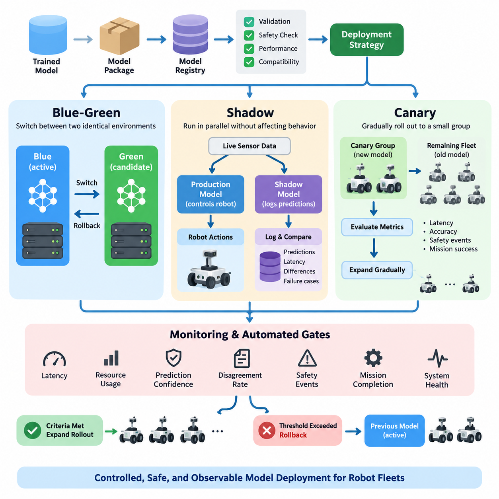
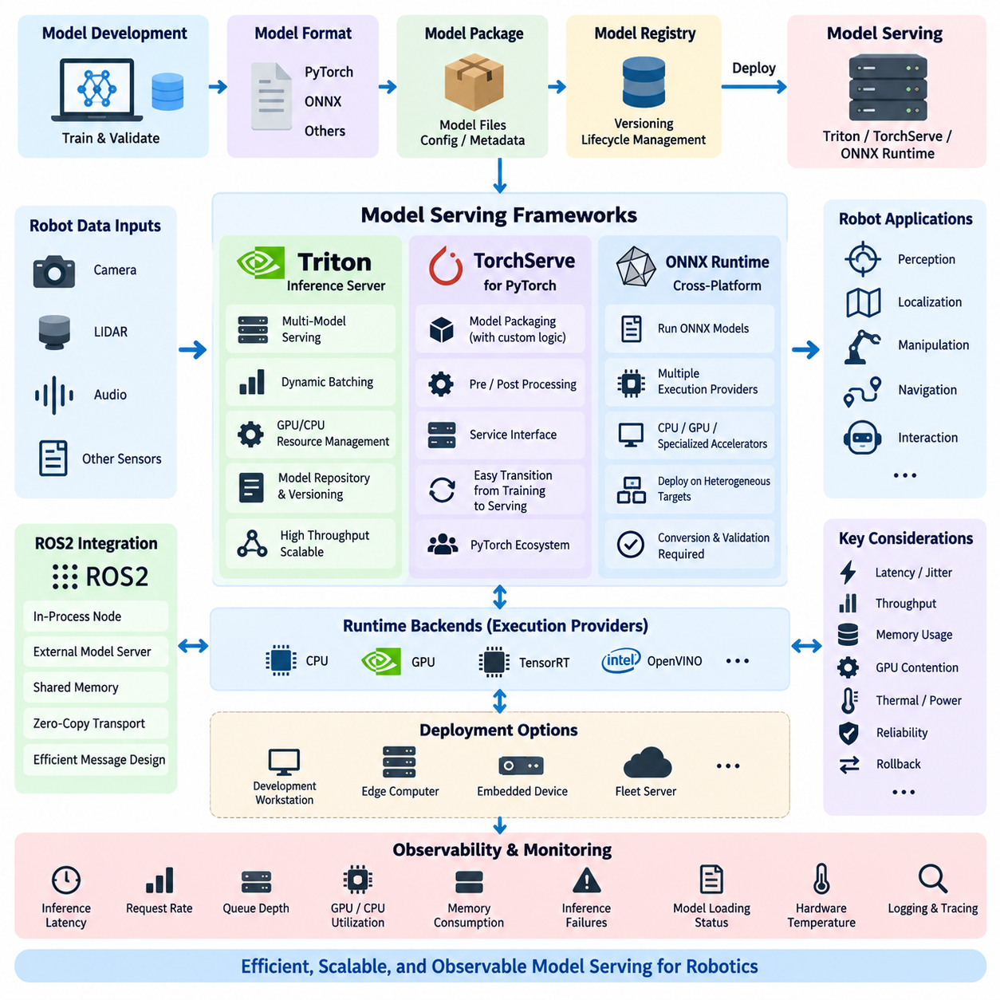
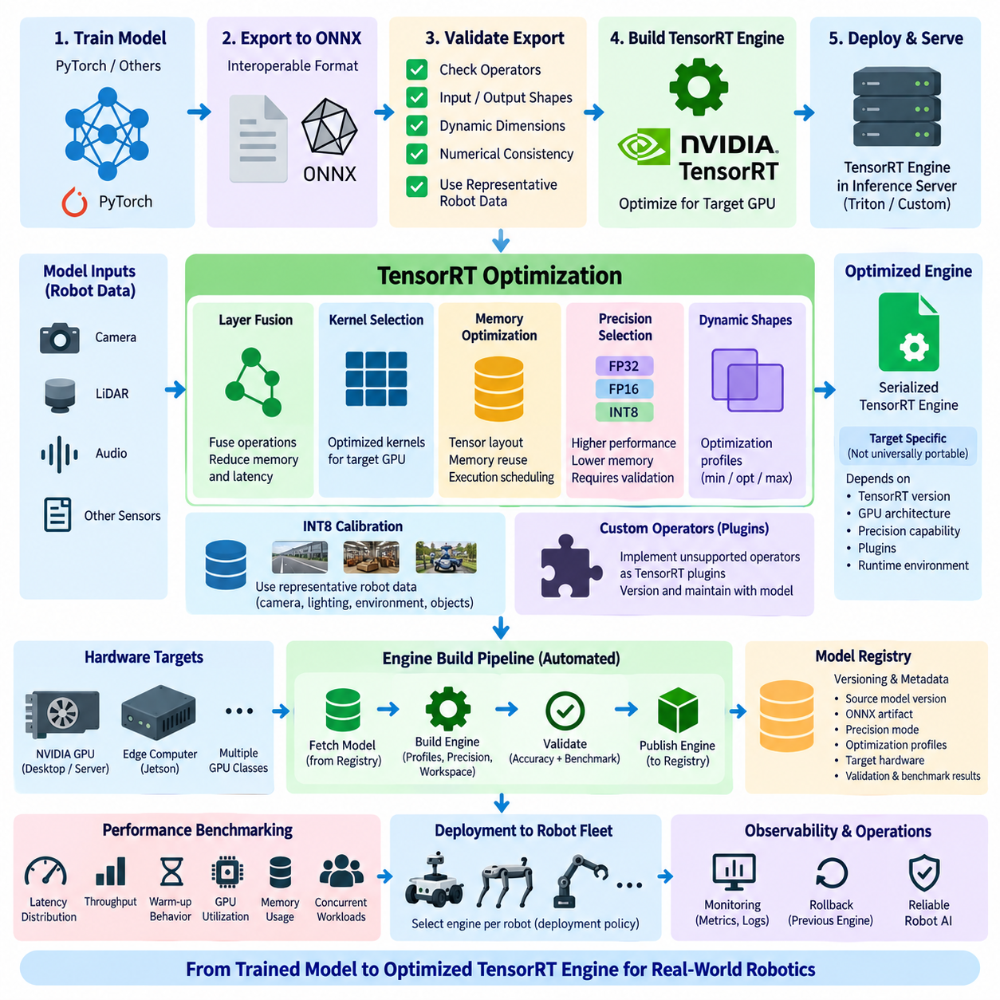
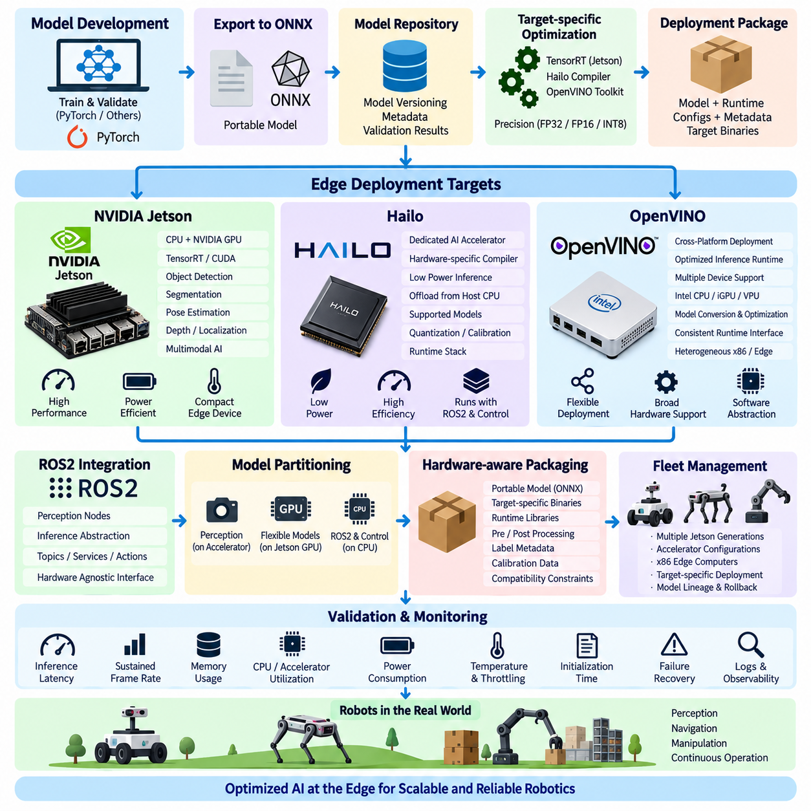
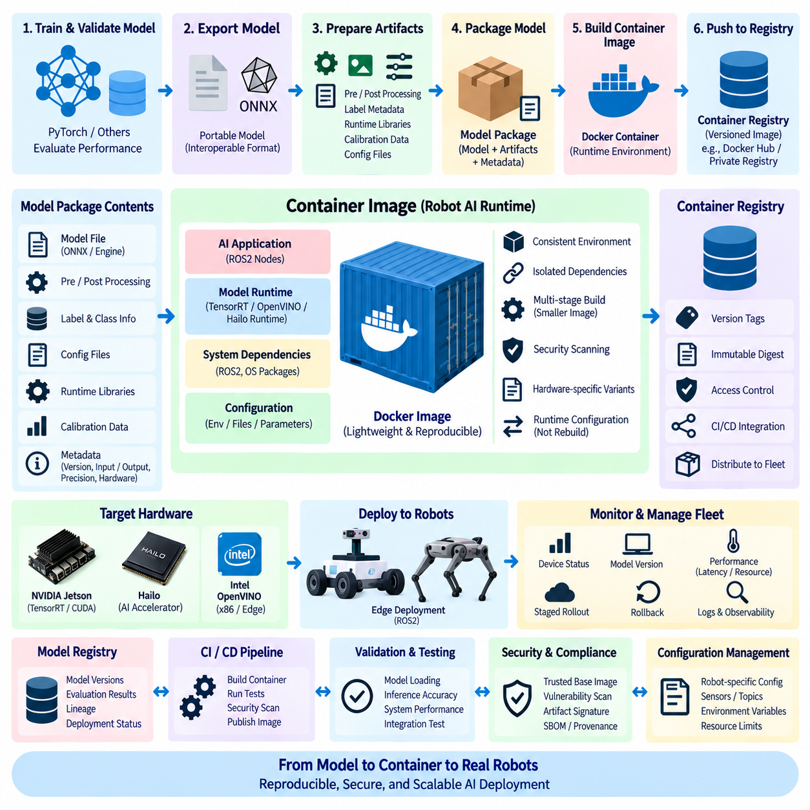
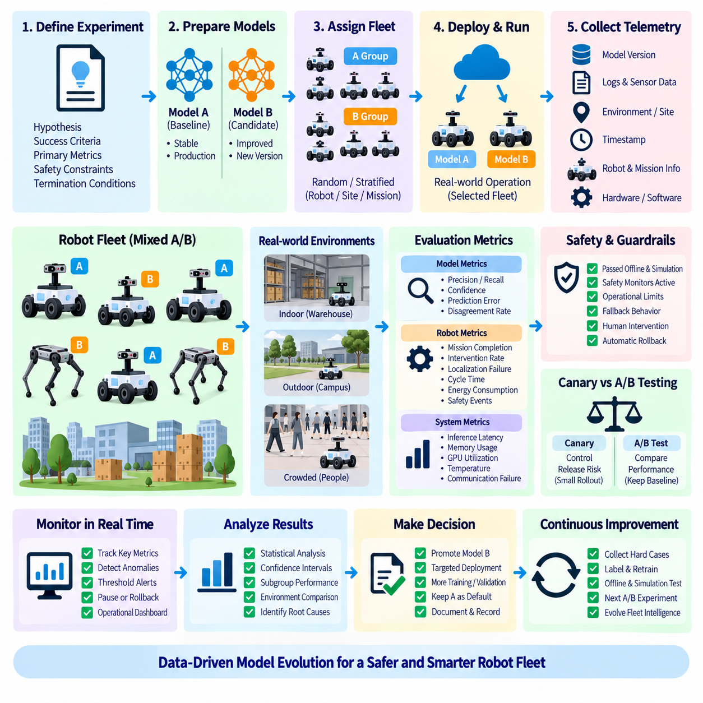
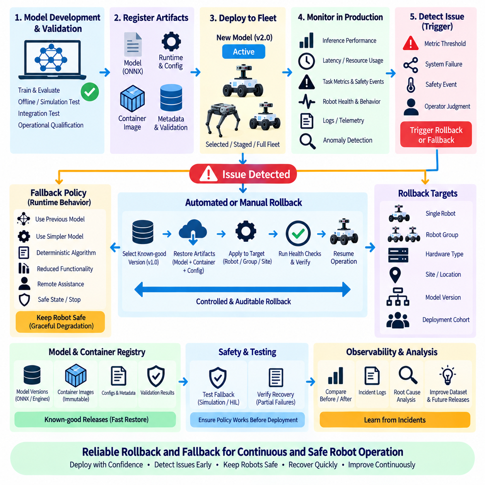
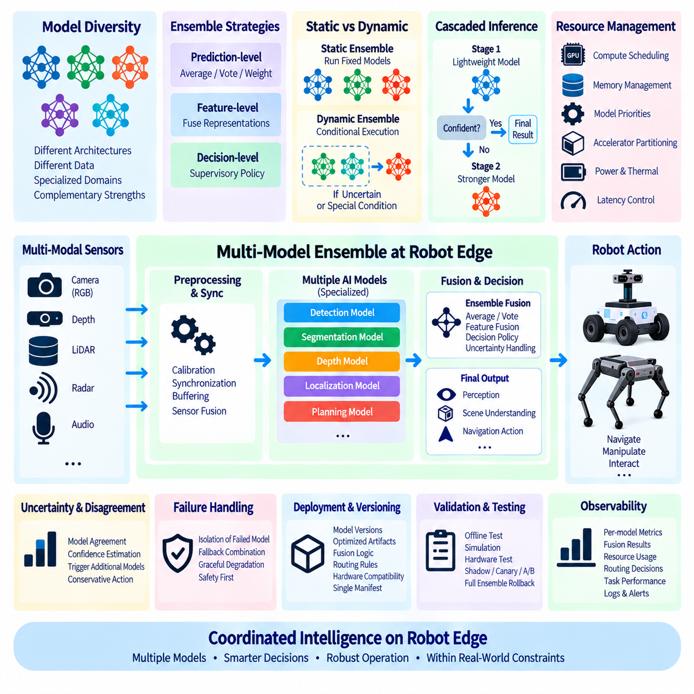
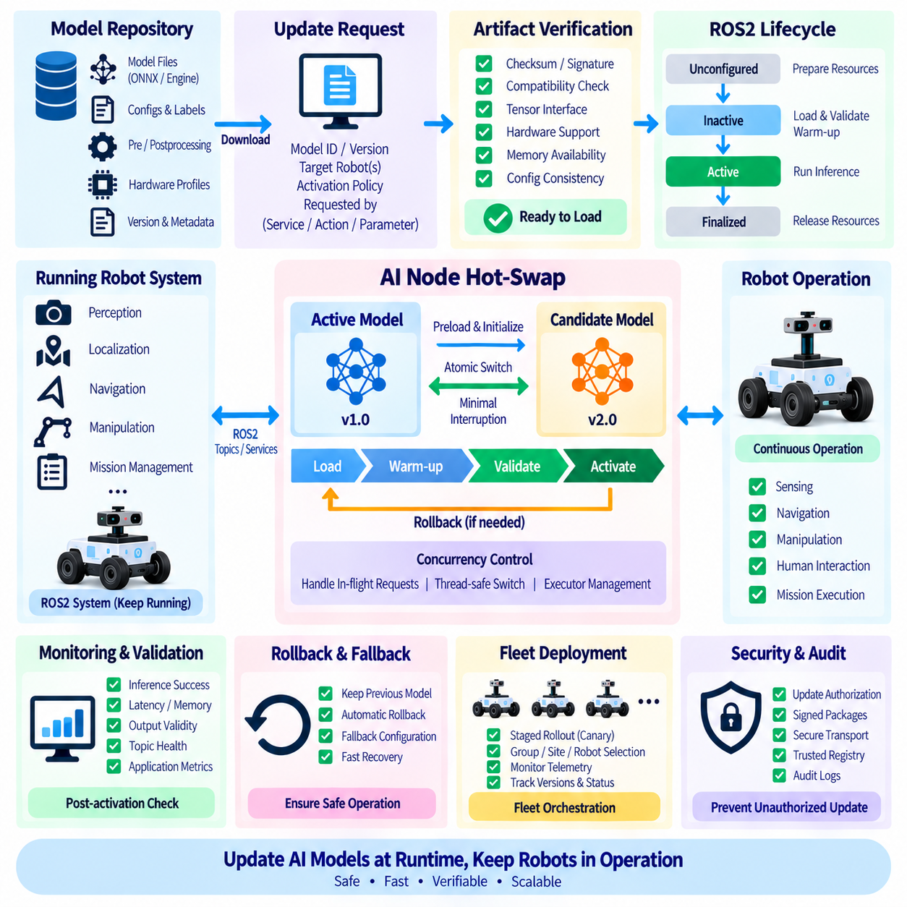
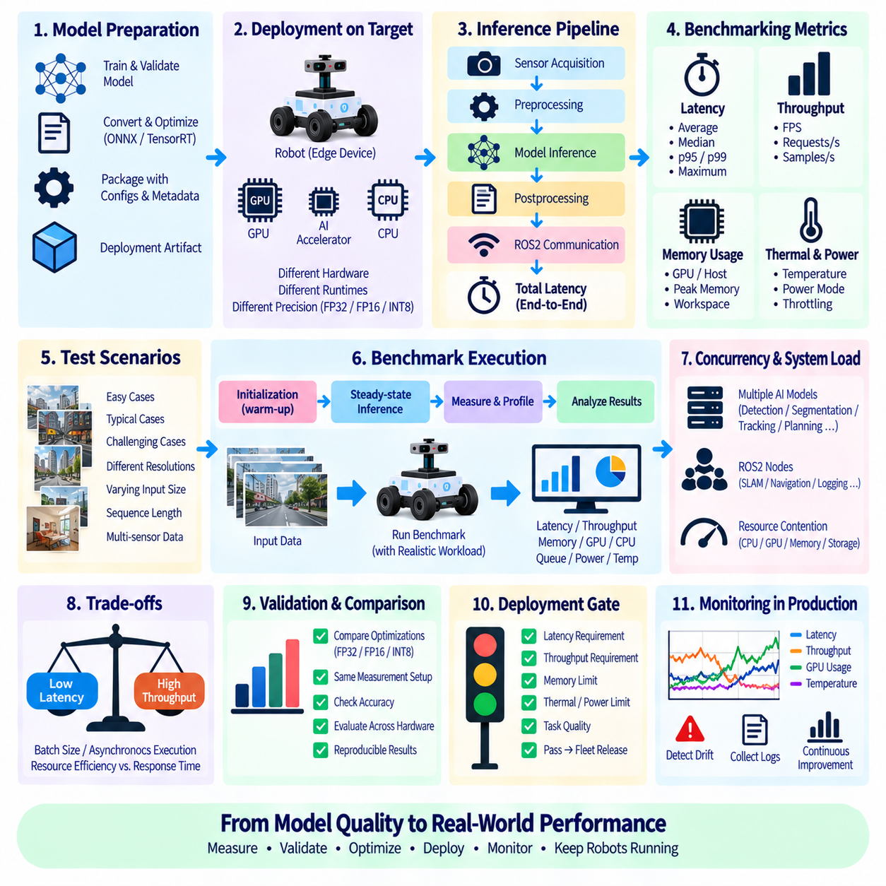

**Volume 10 Robot DevOps and MLOps**

# 7. Model Deployment

## 7.1. Model Deployment Strategies Blue Green Shadow Canary

{width="7.268055555555556in" height="7.268055555555556in"}

Deploying a machine learning model into a robotic system is not simply the act of copying a trained artifact to an edge computer. A deployment changes the behavior of a physical system that interacts with people, machines, and uncertain environments. For this reason, model deployment requires controlled transition strategies that limit operational risk while providing measurable evidence that a new model behaves correctly in production.

A deployment strategy defines how traffic, sensor data, inference requests, or robot populations move from an existing model to a new model. The central objective is to separate model release from immediate fleet-wide activation. Blue-green, shadow, and canary deployment provide different mechanisms for achieving this separation, allowing engineers to validate models progressively before making them responsible for operational decisions.

Blue-green deployment maintains two complete production environments. The blue environment normally represents the currently active and validated model, while the green environment contains the candidate replacement. Both environments should use equivalent interfaces, preprocessing logic, runtime dependencies, and hardware assumptions. Once the green environment passes validation, inference traffic can be redirected from blue to green through a controlled switching mechanism.

The main advantage of blue-green deployment is deterministic rollback. Because the previous environment remains available, operators can redirect inference traffic back to the blue model if latency, accuracy, resource consumption, or behavioral abnormalities appear after activation. In robotics, this approach is especially valuable when perception, navigation, manipulation, or safety-supporting AI components must be restored rapidly without rebuilding the previous software environment.

Blue-green deployment can nevertheless require substantial edge resources because two model environments may need to coexist. A robot equipped with a constrained GPU, accelerator, or memory subsystem may not have enough capacity to keep both models resident simultaneously. Fleet architectures can address this limitation by storing both deployment packages locally while activating only one runtime, or by performing blue-green switching at a fleet, server, or container orchestration level.

Shadow deployment takes a fundamentally different approach. The production model remains responsible for robot behavior, while the candidate model receives copies of the same sensor inputs or inference requests. Predictions from the shadow model are recorded but are not allowed to control actuators or alter operational decisions. This creates a powerful mechanism for evaluating a new model under real production conditions without exposing the robot directly to its unvalidated outputs.

For example, a robot perception system may send identical camera frames to both the production object detector and a candidate detector. Engineers can compare detections, confidence distributions, missed objects, inference latency, GPU memory usage, and disagreement patterns across realistic environments. Shadow evaluation therefore reveals failure modes that may not appear in offline datasets, simulation environments, or laboratory validation while preserving the authority of the established model.

Shadow deployment must be designed carefully because parallel inference consumes compute, memory, bandwidth, storage, and energy. Running two large perception models simultaneously on an edge GPU can reduce frame rate or interfere with other real-time workloads. A practical architecture may therefore shadow only sampled frames, selected robots, specific operational zones, or predefined time windows while collecting enough representative evidence for deployment decisions.

Canary deployment gradually exposes a small portion of production operation to the candidate model. Instead of replacing the model across the entire fleet, deployment begins with a limited group of robots or carefully selected missions. Telemetry from the canary population is compared with the baseline population, and expansion occurs only when predefined validation gates remain satisfied. This transforms fleet deployment into a progressive evidence-driven process.

A robotics canary should be defined by operational risk rather than by percentage alone. Ten percent of a fleet operating in unusually difficult environments may represent greater risk than half of a fleet operating in controlled facilities. Canary selection can therefore consider robot hardware versions, geographic sites, environmental conditions, mission types, network quality, safety constraints, and operator availability before determining which systems receive the candidate model.

Progressive rollout commonly combines automated gates with explicit rollback policies. Metrics may include inference latency, GPU utilization, memory pressure, prediction confidence, disagreement rates, perception failures, navigation interventions, mission completion, safety events, and system-level fault indicators. If monitored values cross defined thresholds, rollout should stop automatically and affected robots should return to the previously validated model rather than continuing expansion.

Blue-green, shadow, and canary deployment are complementary rather than mutually exclusive. A candidate model can first operate in shadow mode to collect production evidence, then move to a canary population where its predictions influence real behavior, and finally transition through blue-green activation across broader fleet segments. This staged sequence creates progressively stronger exposure while preserving rollback points throughout the model lifecycle.

A mature robot MLOps platform should therefore treat deployment as a state machine governed by model identity, validation evidence, fleet configuration, observability, and rollback authority. Every deployed artifact should remain traceable to its model registry entry, dataset and training lineage, runtime package, hardware compatibility, and validation results. Deployment events should also be recorded so that operational behavior can be reconstructed during debugging or incident analysis.

The broader goal is controlled evolution of robot intelligence. New models should not become trusted merely because they achieved higher offline benchmark scores. Trust must be accumulated through increasingly realistic deployment stages and observable production evidence. By combining shadow evaluation, limited canary exposure, blue-green switching, continuous monitoring, and rapid rollback, robot fleets can adopt improved AI models without turning every model update into an uncontrolled operational experiment.

## 7.2. Model Serving Frameworks Triton TorchServe ONNX RT [w/Code]

{width="7.268055555555556in" height="7.268055555555556in"}

Model serving frameworks provide the runtime layer that transforms a trained machine learning model into an operational inference service. In robotics, this layer connects perception, planning, manipulation, monitoring, and other AI components with optimized execution backends. A serving framework must manage model loading, inference requests, hardware acceleration, concurrency, memory usage, versioning, and operational interfaces while maintaining predictable latency.

Robot AI deployment differs from conventional cloud inference because inference frequently belongs to a real-time physical control loop. Camera frames, LiDAR data, audio, or multimodal observations arrive continuously, and delayed predictions can become operationally useless even when they remain mathematically correct. Model serving architecture must therefore consider not only throughput but also latency distribution, scheduling behavior, data-copy overhead, GPU contention, and interaction with ROS2 nodes and other robot processes.

NVIDIA Triton Inference Server is designed as a high-performance serving platform capable of hosting models from multiple frameworks and execution backends. A single Triton deployment can expose models through standardized inference interfaces while managing GPU and CPU execution resources. This architecture is particularly useful when a robot or edge server executes several AI workloads such as object detection, semantic segmentation, pose estimation, speech processing, and multimodal inference on shared compute hardware.

Triton supports model repositories in which individual models are organized with configuration information and versioned model artifacts. This separation allows the serving infrastructure to manage model lifecycle independently from application code. Robotics software can request inference from a stable interface while the underlying model implementation evolves, enabling model replacement, rollback, testing, and fleet-level configuration without requiring every consumer application to embed model-specific loading logic.

An important Triton capability is dynamic batching, which combines compatible inference requests into larger execution batches when workload characteristics permit. Batching can significantly improve GPU utilization and throughput, particularly on centralized edge servers serving multiple robots or multiple inference streams. However, robotics engineers must balance this benefit against added waiting time because aggressive batching can increase latency and jitter for perception functions that require immediate responses.

Triton also supports multiple model instances and concurrent model execution, allowing available GPU resources to be allocated across workloads. For a robot running several neural networks, this can improve accelerator utilization compared with isolated processes that independently manage GPU contexts. Resource planning remains essential because simultaneous models may compete for GPU memory, compute capacity, memory bandwidth, and thermal or power budgets, especially on embedded platforms.

TorchServe provides a serving architecture oriented toward PyTorch models. A model can be packaged together with the logic required for preprocessing, inference, and postprocessing, allowing PyTorch applications to expose trained models through service interfaces rather than embedding every inference pipeline directly inside application processes. This approach can simplify the transition from model development to operational serving when the training and inference ecosystem is primarily based on PyTorch.

The serving layer must nevertheless be evaluated according to the target robot architecture rather than selected only because it matches the training framework. A convenient server abstraction may introduce process boundaries, serialization, communication overhead, or additional memory consumption. For tightly constrained control loops, direct runtime integration can therefore be preferable, while service-oriented serving may be appropriate for computationally heavier perception, language, fleet, or asynchronous AI workloads.

ONNX Runtime follows a different philosophy by providing a cross-platform inference runtime for models represented through the Open Neural Network Exchange format. Models trained in frameworks such as PyTorch can be exported to ONNX and executed through ONNX Runtime using available execution providers. This creates a useful abstraction between the training framework and deployment hardware, reducing dependence on the environment in which the original model was developed.

Execution providers allow ONNX Runtime to map inference workloads to different hardware acceleration technologies. Depending on the deployment platform, inference may execute through CPU, GPU, or specialized acceleration backends. This flexibility is valuable for heterogeneous robot fleets because the same logical model interface can be deployed across development workstations, x86 edge computers, embedded devices, and other target systems while hardware-specific optimization remains beneath the runtime abstraction.

ONNX-based deployment also introduces an explicit conversion and validation stage. Exported graphs may behave differently because of unsupported operators, numerical precision changes, graph transformations, dynamic input handling, or backend-specific implementation differences. A model that passes accuracy validation in its original training framework should therefore be revalidated after ONNX export using representative robot data before the converted artifact is accepted into the production model registry.

Triton and ONNX Runtime are not necessarily competing alternatives. Triton can operate as the serving layer while optimized runtime backends execute the actual model computation. This layered architecture separates external inference management from internal execution optimization. A fleet server, for example, can use Triton to manage model versions, requests, and concurrency while models execute through suitable GPU-oriented or runtime-specific backends according to deployment requirements.

ROS2 integration introduces another architectural decision: whether inference should execute inside a ROS2 node or through an external serving process. Embedded inference reduces communication boundaries and can minimize latency, whereas an external model server improves isolation and enables independent model lifecycle management. Shared memory, zero-copy transport, intra-process communication, and careful message design become important when large camera images or point clouds cross these boundaries.

Model serving must also include observability. Average inference latency alone is insufficient because rare latency spikes may disrupt navigation or manipulation even when mean performance appears acceptable. Production systems should observe latency distributions, request rates, queue depth, GPU and CPU utilization, memory consumption, inference failures, model loading status, and hardware temperature where relevant. These metrics connect model serving directly with the broader robot observability and MLOps infrastructure.

The appropriate serving architecture therefore depends on workload characteristics and system boundaries. Triton is well suited to centralized or multi-model GPU serving where concurrency and operational model management are important. PyTorch-oriented serving can simplify workflows closely coupled to PyTorch artifacts, while ONNX Runtime provides a portable inference layer across heterogeneous targets. In many robot systems, these technologies can coexist rather than forcing a single framework across every compute tier.

A mature robotics deployment ultimately separates model development, model representation, inference execution, and service management into clearly controlled layers. Training produces validated artifacts, conversion creates deployment-compatible representations, optimized runtimes execute computation, and serving infrastructure manages operational access and lifecycle. This separation enables robot AI systems to evolve across GPUs, edge computers, and fleet servers while maintaining reproducibility, observability, rollback capability, and predictable inference behavior.

## 7.3. TensorRT Model Optimization and Engine Build Pipeline [w/Code]

{width="7.268055555555556in" height="7.268055555555556in"}

TensorRT is NVIDIA's inference optimization and runtime technology for transforming trained neural networks into highly optimized execution engines for NVIDIA GPUs. In robotics, TensorRT is commonly positioned between model development and production inference, where latency, throughput, memory consumption, and deterministic execution behavior directly affect perception and autonomous operation. The optimization pipeline converts a validated model into a hardware-aware runtime artifact suitable for deployment.

A typical TensorRT workflow begins with a trained model produced in a framework such as PyTorch. Rather than treating the training representation as the final deployment artifact, the model is exported into an interoperable representation such as ONNX. This creates a clear boundary between training and inference environments and allows deployment engineers to inspect input shapes, output tensors, operators, dynamic dimensions, and compatibility before optimization begins.

The exported model must be validated before engine generation because conversion can expose unsupported operators, graph differences, dynamic-shape problems, or numerical discrepancies. Representative robot data should be processed through both the original model and the exported representation, with outputs compared against defined tolerances. Detecting conversion problems at this stage prevents optimization errors from becoming difficult-to-diagnose failures later in the deployment pipeline.

TensorRT parses the supported network representation and constructs an internal network definition that can be optimized for the target GPU. During engine building, TensorRT analyzes layers, tensor dimensions, data types, available kernels, and hardware characteristics. It then searches for execution strategies that can reduce inference cost while satisfying configured constraints. Engine building is therefore an optimization process rather than a simple file-format conversion.

Layer and operation fusion is one of the important optimization mechanisms in this process. Operations that would otherwise require separate kernel launches and intermediate memory transfers may be combined into more efficient execution paths. TensorRT can also optimize tensor layouts, kernel selection, memory reuse, and execution scheduling. These transformations reduce overhead and improve utilization of GPU computing resources without requiring the robot application to manually implement each optimization.

Precision selection has a major influence on performance. FP32 provides a conventional numerical baseline, while FP16 can reduce memory traffic and exploit GPU hardware optimized for lower-precision computation. INT8 can provide further performance and memory advantages when the model and target hardware support it, but reduced precision requires careful validation because numerical changes can affect detection confidence, localization accuracy, segmentation boundaries, or other downstream robot behaviors.

INT8 deployment traditionally requires representative calibration data when post-training quantization is used. Calibration should reflect the sensor distributions and operational environments that the robot is expected to encounter rather than relying on arbitrary samples. Camera exposure, environmental lighting, object distributions, sensor characteristics, and operating domains can influence activation statistics. Poor calibration data may produce an apparently fast engine whose inference quality is unsuitable for actual deployment.

Dynamic input shapes introduce another design consideration. Robot perception models may process different image resolutions, batch sizes, sequence lengths, or variable-shaped inputs. TensorRT can use optimization profiles that define supported minimum, optimum, and maximum dimensions for dynamic inputs. These profiles allow engine optimization across expected operating ranges, but excessively broad ranges can increase optimization complexity and may produce less efficient execution than profiles designed around realistic workloads.

Engine generation also depends on workspace and memory constraints. During optimization, TensorRT evaluates implementation strategies that may require different temporary memory capacities and execution resources. Deployment engineers must therefore consider the actual GPU memory budget together with other robot workloads. A perception engine that performs well in isolation may create system-level problems when localization, mapping, planning, visualization, and additional AI models simultaneously compete for GPU memory.

The resulting serialized TensorRT engine represents an optimized execution plan for a particular deployment context. It should not be treated as a universally portable model artifact. Compatibility can depend on TensorRT versions, GPU architecture, precision capabilities, plugins, and other runtime characteristics. For heterogeneous robot fleets, the MLOps pipeline may therefore retain a portable source model while generating target-specific engines for different GPU classes and software environments.

Custom operators require additional consideration when the exported graph contains functionality that TensorRT cannot directly implement using built-in layers. TensorRT plugins can provide optimized implementations for such operations, but they become part of the deployment dependency chain. Plugin versions, source code, compiled binaries, target architecture, and compatibility information should therefore be versioned together with the model and engine-building configuration to preserve reproducibility.

Engine building should consequently be automated as part of the model deployment pipeline rather than performed manually on an engineer's workstation. A reproducible build process can retrieve a validated model from the model registry, verify its metadata, export or load the ONNX representation, construct optimization profiles, select precision policies, build the TensorRT engine, and execute validation and benchmarking before publishing the resulting artifact.

Validation after engine generation is essential because optimization success does not guarantee application-level correctness. The TensorRT output should be compared with the validated reference model using representative datasets and relevant task metrics. Object detection models may require accuracy and confidence comparisons, while segmentation, pose estimation, depth estimation, or control-related networks require metrics appropriate to their outputs. Numerical equivalence alone may not fully represent operational acceptability.

Performance benchmarking should evaluate more than average inference latency. Robotics systems benefit from measuring latency distributions, throughput, warm-up behavior, GPU utilization, memory consumption, and performance under concurrent workloads. The final deployment decision should reflect the complete robot software stack because an engine optimized for maximum standalone throughput may still cause unacceptable latency or resource contention when integrated with other real-time components.

TensorRT engine artifacts should remain connected to their provenance throughout the MLOps lifecycle. The registry should identify the source model version, ONNX artifact, training configuration, precision mode, optimization profiles, TensorRT and CUDA environment, target hardware, validation results, and benchmark results. This traceability makes it possible to reproduce an engine, diagnose field failures, compare optimization changes, and safely roll back to previously validated artifacts.

At fleet scale, the engine-build pipeline becomes a bridge between hardware-independent model development and hardware-specific inference deployment. A single validated model may generate several TensorRT engines optimized for different NVIDIA GPU targets, while deployment policy selects the correct artifact for each robot. Combined with model registries, automated validation, observability, and rollback mechanisms, TensorRT enables optimized inference to become a controlled and reproducible component of robot MLOps rather than an isolated performance-tuning step.

## 7.4. Edge Model Deployment Jetson Hailo OpenVINO [w/Code]

{width="7.268055555555556in" height="7.268055555555556in"}

Edge model deployment moves artificial intelligence inference from centralized cloud infrastructure toward the robot, machine, or sensor system where data is generated. For robotics, this reduces network dependency and allows perception and decision-support workloads to continue even when connectivity is intermittent. Edge deployment must balance inference performance with power consumption, thermal limits, memory capacity, hardware interfaces, physical size, and the real-time requirements of the robot software stack.

An edge AI deployment pipeline normally begins with a validated model rather than directly with hardware-specific optimization. The source model may originate from PyTorch or another training framework and then be exported into an interoperable representation such as ONNX. Maintaining this portable artifact separates model development from target-specific compilation and allows one validated model lineage to generate optimized deployment artifacts for several classes of edge hardware.

NVIDIA Jetson platforms provide heterogeneous edge computing architectures that combine CPU and NVIDIA GPU resources within compact power-constrained systems. In robot applications, Jetson devices can execute camera perception, object detection, segmentation, pose estimation, depth processing, localization support, and multimodal AI close to sensors. Their CUDA-oriented software ecosystem also enables deployment pipelines to reuse technologies commonly used on larger NVIDIA GPU systems.

Jetson deployment frequently combines CUDA, TensorRT, and platform-specific system software. A trained model can be exported to ONNX, validated, converted into an optimized TensorRT engine, and integrated into a ROS2 node or inference service. FP16 or INT8 precision can reduce computation and memory requirements when validated appropriately. The resulting engine should be benchmarked on the actual Jetson target because desktop GPU performance cannot reliably represent embedded thermal, power, and memory constraints.

Resource sharing is particularly important on Jetson-based robots. AI inference competes with image processing, localization, mapping, navigation, visualization, and other GPU or CPU workloads. Maximum neural-network throughput is therefore not necessarily the correct optimization objective. Deployment engineering should evaluate end-to-end latency, frame consistency, GPU memory pressure, CPU utilization, power mode, temperature, and system behavior under realistic concurrent workloads.

Hailo represents another edge AI approach based on dedicated neural-network acceleration rather than general-purpose GPU execution. In this architecture, supported neural-network workloads are compiled for specialized accelerator hardware and executed through the associated runtime stack. The host processor can continue handling ROS2, sensor communication, control logic, and system management while selected inference workloads are offloaded to the accelerator.

Such dedicated acceleration can be attractive when the robot has strict power and thermal constraints or when AI inference should consume fewer host computing resources. However, deployment depends strongly on model compatibility with the accelerator toolchain. Network operators, tensor dimensions, preprocessing requirements, quantization behavior, compiler support, and runtime interfaces must be evaluated before selecting an accelerator as the target for a production model.

The Hailo deployment process therefore includes model translation or parsing, optimization, quantization where required, hardware-specific compilation, and generation of an executable artifact for the target accelerator. Representative calibration or optimization data should reflect actual robot sensor conditions. After compilation, accuracy must be compared with the validated reference model because hardware-specific transformations and reduced precision can change inference behavior.

OpenVINO provides a deployment and optimization toolkit for executing AI inference across supported computing targets, particularly within Intel-oriented environments. It can transform or consume supported model representations and prepare them for efficient runtime execution. For robotics teams operating heterogeneous x86 and edge systems, this provides a software abstraction that can help separate application-level inference interfaces from details of individual compute devices.

An OpenVINO-oriented pipeline typically converts or imports a trained model into a representation supported by its runtime, applies appropriate optimization, and selects an available execution device. The robot application can then invoke inference through a consistent runtime interface while deployment configuration determines where computation executes. As with other runtimes, compatibility and numerical behavior should be validated using representative production data rather than assumed from successful model conversion.

Jetson, Hailo, and OpenVINO therefore represent different deployment layers and hardware strategies rather than perfectly equivalent alternatives. Jetson combines general-purpose embedded computing with NVIDIA GPU acceleration, Hailo focuses on dedicated AI acceleration, and OpenVINO provides an inference software stack capable of targeting supported hardware environments. A heterogeneous robot platform may even use more than one approach when different workloads have different latency, power, and flexibility requirements.

Model partitioning becomes useful in such heterogeneous systems. High-bandwidth camera perception may execute on a dedicated accelerator, while models requiring flexible CUDA operations run on Jetson GPU resources and conventional robot software remains on the CPU. The architecture should minimize unnecessary movement of large tensors between processors because data conversion, memory copies, and inter-device communication can eliminate the latency and energy advantages gained from acceleration.

ROS2 integration should expose hardware-specific inference through stable software boundaries. Perception nodes should not require extensive redesign whenever the underlying accelerator changes. An inference abstraction can isolate preprocessing, runtime invocation, and postprocessing while maintaining consistent ROS2 topics, services, or actions. This makes hardware migration easier and allows deployment teams to benchmark alternative runtimes without rewriting the entire robot application.

Hardware-aware packaging is another essential part of edge deployment. A model package may include the portable source artifact, target-specific optimized binaries, runtime libraries, preprocessing configuration, label metadata, calibration information, and compatibility constraints. The deployment system must identify robot hardware before selecting an artifact so that a Jetson TensorRT engine, dedicated accelerator binary, or OpenVINO-compatible model is delivered only to a suitable target.

Edge deployment validation must measure system behavior rather than model accuracy alone. Important observations include inference latency distribution, sustained frame rate, memory consumption, CPU and accelerator utilization, power consumption, temperature, throttling, model initialization time, and failure recovery. Tests should run long enough to reveal thermal or resource effects that short laboratory benchmarks may hide, especially for robots expected to operate continuously for many hours.

Fleet management extends this process beyond individual devices. A heterogeneous fleet may contain several Jetson generations, accelerator configurations, and x86 edge computers. The model registry should therefore associate each model version with compatible target artifacts, runtime versions, precision settings, validation results, and hardware profiles. Deployment policies can then select the correct package for each robot while preserving model lineage and rollback capability.

The broader objective of edge model deployment is not simply to maximize accelerator performance but to create predictable robot intelligence within constrained physical hardware. Jetson, Hailo, and OpenVINO provide different mechanisms for bringing inference close to sensors and actuators. When combined with portable model representations, hardware-specific optimization, ROS2 abstraction, validation, observability, fleet-aware packaging, and rollback, they form a controlled MLOps pathway from trained models to reliable edge AI operation.

## 7.5. Model Packaging and Container Image for Robot AI [w/Code]

{width="7.268055555555556in" height="7.268055555555556in"}

Model packaging is the process of transforming a validated AI model into a deployable unit that contains everything required to execute inference consistently. In robot AI systems, the model file alone is rarely sufficient. Deployment may also require preprocessing and postprocessing logic, runtime libraries, configuration files, label definitions, hardware-specific engines, calibration data, metadata, and compatibility information that collectively define the operational behavior of the model.

A reliable packaging strategy begins by separating the portable model artifact from deployment-specific artifacts. The portable representation may be a PyTorch checkpoint or ONNX model, while target-specific artifacts can include TensorRT engines or binaries generated for specialized accelerators. Preserving this separation allows the same validated model lineage to support multiple robot hardware configurations without treating every optimized binary as an independent model.

Metadata provides the connection between the model and its operational context. A package should identify the model version, expected inputs and outputs, preprocessing parameters, precision mode, runtime requirements, compatible hardware, and relevant validation information. Without this metadata, a technically valid model file can be deployed into an incompatible environment and produce incorrect behavior even though the inference runtime successfully loads it.

Preprocessing and postprocessing must be versioned with the model because they are part of the effective inference pipeline. Image resizing, normalization, color-space conversion, tensor layout, confidence thresholds, non-maximum suppression, coordinate transformation, and class mappings can substantially change model outputs. Packaging these elements together prevents application code and model behavior from silently diverging as different versions are deployed across a fleet.

Container images extend model packaging by encapsulating the software environment required to execute the model. A container can include the inference application, runtime libraries, ROS2 dependencies, Python or C++ components, system packages, and configuration required by the AI service. This provides a reproducible boundary between the host operating system and the model-serving environment, reducing deployment differences among development, validation, and production systems.

A robot AI container should remain focused on runtime requirements rather than becoming a copy of the entire development environment. Training datasets, compiler caches, temporary files, debugging utilities, package managers, and unnecessary development dependencies increase image size and expand the attack surface. Multi-stage container builds can separate compilation and packaging activities from the final runtime image so that only the components required for production execution remain.

GPU-enabled containers introduce additional dependencies between the container and host system. NVIDIA-based deployments typically require compatible GPU drivers and container runtime integration, while CUDA, TensorRT, and related user-space libraries must follow the compatibility constraints of the target environment. A container image should therefore be treated as reproducible software packaging rather than as a mechanism that automatically eliminates all hardware and driver dependencies.

Hardware-specific model artifacts require careful handling inside container workflows. A serialized TensorRT engine, for example, may depend on the GPU architecture, TensorRT environment, precision settings, and plugins used during engine generation. Instead of assuming that one container image can contain a universally compatible engine, deployment pipelines can maintain separate target variants or build the optimized engine for defined hardware profiles before publishing the final package.

Container registries provide a controlled distribution point for robot AI images. Images can be identified using immutable digests and meaningful version tags while deployment systems reference approved artifacts rather than locally built containers. The registry becomes part of the software supply chain, connecting CI/CD pipelines, model registries, security scanning, deployment policies, and fleet management systems to the exact software image installed on each robot.

Model registries and container registries serve related but different purposes. A model registry tracks AI artifacts, model versions, evaluation results, lineage, and deployment status, while a container registry stores executable software images. A mature MLOps workflow links the two so that a specific container image can be traced back to the exact model artifact, runtime configuration, preprocessing implementation, and validation evidence used to create it.

Versioning should therefore operate across several layers simultaneously. The model may have one semantic or registry version, the runtime application another software version, and the container image its own immutable digest. Deployment metadata must preserve these relationships. When a field failure occurs, engineers should be able to determine exactly which model, runtime, configuration, container, and hardware profile were active on the affected robot.

ROS2 applications can benefit from container boundaries when AI nodes have complex or conflicting dependencies. A perception container can package its own runtime environment while communicating with navigation, mapping, or fleet components through defined ROS2 interfaces. However, containerization does not remove communication costs. Large images and point clouds may require shared memory, host networking, optimized DDS configuration, or other transport strategies to avoid unnecessary serialization and copying overhead.

Configuration should normally remain separable from immutable container contents when operational values differ across robots or deployment sites. Model selection, sensor identifiers, thresholds, topic names, device assignments, and resource limits may be supplied through configuration files, environment settings, mounted resources, or orchestration mechanisms. This allows one verified container image to operate across controlled configurations without rebuilding the software for every robot.

Security is an integral part of model packaging. Container images should use trusted base images, minimize unnecessary packages, avoid embedded secrets, and undergo vulnerability scanning before release. Model artifacts and containers can also be associated with checksums, signatures, provenance records, and software bills of materials. These controls help establish that the artifact deployed to a robot is the same artifact that passed the organization's validation and release pipeline.

The container build pipeline should be automated and reproducible. A typical process retrieves an approved model artifact, selects the required runtime and hardware profile, assembles application dependencies and configuration, builds the container image, executes tests, performs security checks, and publishes the image to a registry. Deployment should occur only after validation gates confirm that both the model and its complete runtime package satisfy defined requirements.

Validation must include the assembled container rather than only the original model. Integration tests should confirm model loading, sensor input handling, preprocessing, inference, postprocessing, ROS2 communication, accelerator access, and shutdown or recovery behavior. Performance testing should measure inference latency, memory usage, startup time, CPU and accelerator utilization, and sustained operation because container-level configuration can influence system behavior even when model accuracy is unchanged.

Fleet deployment makes immutable packaging particularly valuable. Each robot can report its container digest, model version, configuration version, and hardware profile to fleet management infrastructure. Operators can then identify deployment differences, perform staged rollout, compare operational metrics, and return affected robots to a previously validated image. Rollback becomes a controlled artifact transition rather than an attempt to reconstruct an earlier software environment manually.

Model packaging and containerization ultimately establish the reproducible boundary between AI development and robot operation. The model defines learned behavior, while the package defines how that behavior is executed within a specific software and hardware environment. By linking model artifacts, runtime dependencies, configuration, container images, registries, validation evidence, security metadata, observability, and rollback, robot MLOps can deliver AI software as traceable and repeatable production units rather than collections of loosely managed files.

## 7.6. A B Model Testing in Production Robot Fleet [w/Code]

{width="7.268055555555556in" height="7.268055555555556in"}

A/B model testing in a production robot fleet is a controlled method for comparing two model variants under real operational conditions. Model A normally represents the established production baseline, while Model B represents a candidate intended to improve accuracy, latency, robustness, efficiency, or another measurable capability. Instead of replacing the entire fleet simultaneously, selected robots or missions execute each variant and generate comparable operational evidence.

The purpose of A/B testing is different from ordinary offline model evaluation. Offline datasets provide repeatable benchmarks, but they cannot fully reproduce changing lighting, sensor degradation, floor conditions, traffic patterns, human interaction, network quality, or mission complexity. Production A/B testing exposes models to real operating distributions and allows engineering teams to determine whether improvements observed during development remain meaningful when integrated into complete robot systems.

A production experiment begins with a clearly defined hypothesis and measurable success criteria. For example, Model B may be expected to reduce missed detections without increasing inference latency beyond an acceptable threshold. The experiment should define primary metrics, supporting metrics, safety constraints, and termination conditions before deployment. Without predefined criteria, teams may selectively interpret telemetry after the experiment and reach conclusions that are difficult to reproduce.

Assignment of robots to A and B groups requires careful experimental design. Simple random assignment can reduce systematic bias when robots and environments are sufficiently comparable, but fleets often contain different hardware generations, sites, mission profiles, sensors, and operating schedules. Stratified assignment can distribute these characteristics across both groups so that measured differences are more likely to reflect the model change rather than unrelated fleet composition.

The experimental unit must also be defined correctly. A/B assignment can occur at the level of robots, sites, missions, time windows, or inference requests depending on the application. Switching models for individual inference requests may be unsuitable when model outputs influence stateful navigation or temporal perception. Robot-level or mission-level assignment often provides cleaner operational boundaries because one model remains responsible for a complete sequence of related decisions.

Safety requirements place important limits on production experimentation. A candidate model should already have passed offline evaluation, simulation, integration testing, and appropriate staged validation before receiving control authority on physical robots. A/B testing should not be used as the first mechanism for discovering basic safety failures. Safety monitors, operational limits, fallback behavior, human intervention procedures, and automatic rollback conditions should remain active throughout the experiment.

A/B testing is closely related to canary deployment but serves a different primary objective. Canary deployment focuses on controlling release risk by exposing a small population to a new version before wider rollout. A/B testing focuses on obtaining comparative evidence between alternatives. The same infrastructure can support both approaches, but an experiment should preserve a meaningful baseline group rather than automatically converting every successful B robot to the candidate version before sufficient comparison data is collected.

Telemetry must connect each observation to the model variant that produced it. Logs should include model version, container or package identifier, robot hardware profile, software configuration, mission context, site information, relevant sensor conditions, and timestamps. This provenance allows analysts to distinguish genuine model effects from changes in runtime configuration or operating environment and makes abnormal behavior reproducible during subsequent investigation.

Metrics should cover both model-level and system-level behavior. Model metrics may include precision, recall, confidence distributions, disagreement rates, or task-specific prediction errors. Robot-level metrics can include mission completion, intervention frequency, localization failures, navigation recovery, cycle time, energy consumption, and safety events. Infrastructure metrics such as inference latency, memory consumption, GPU utilization, temperature, and communication failures reveal whether improved model quality introduces unacceptable computational costs.

Statistical interpretation requires attention to sample size and dependence between observations. Thousands of camera frames from one robot do not necessarily represent thousands of independent operational trials because consecutive observations are strongly correlated. Experiments should consider the number of robots, missions, sites, operating hours, and environmental conditions represented in the data. Longer experiments can improve coverage, but duration alone cannot compensate for an unrepresentative experimental population.

Environmental imbalance is a major source of misleading conclusions. If Model A primarily operates during daytime while Model B receives more nighttime missions, direct performance comparisons may reflect lighting rather than model quality. Similar confounding can arise from weather, site geometry, payload, robot age, sensor contamination, operator behavior, or traffic density. Experiment design and telemetry should therefore make important contextual variables visible during analysis.

Production experiments should include guardrail metrics in addition to the primary optimization objective. A perception model might improve detection recall while increasing latency enough to destabilize downstream planning. Another model might reduce mission time while consuming substantially more power or generating additional thermal load. Guardrails ensure that an apparent improvement in one metric does not conceal degradation elsewhere in the robot system.

Automated monitoring can continuously evaluate experiment health while A and B variants operate. Threshold violations involving safety events, inference failures, latency spikes, resource exhaustion, or abnormal robot behavior can pause the experiment or remove Model B from active operation. Rollback should restore a previously validated artifact and configuration rather than requiring engineers to rebuild an earlier environment during an incident.

Experiment analysis should preserve uncertainty rather than reducing results to a single average. Performance distributions, confidence intervals, subgroup behavior, rare failures, and site-specific differences can reveal effects hidden by aggregate metrics. A candidate that performs well on average but fails disproportionately in a particular environment may require additional training, targeted validation, or a restricted deployment policy instead of immediate fleet-wide promotion.

Successful A/B testing depends on reproducible experiment configuration. The assignment policy, model versions, container digests, hardware profiles, metric definitions, analysis rules, start and stop conditions, and rollback thresholds should be recorded with the experiment. Linking this information to the model registry and deployment history creates an auditable relationship between development evidence, production testing, and subsequent release decisions.

At fleet scale, A/B testing becomes part of a continuous model improvement loop. Production observations can identify difficult environments and failure cases, selected data can return to labeling and training pipelines, candidate models can undergo offline and simulated validation, and qualified variants can re-enter controlled fleet experiments. This connects production operations with dataset evolution and model development without allowing uncontrolled online changes to robot behavior.

The broader goal of production A/B testing is evidence-based evolution of robot intelligence. Model A provides a stable operational reference, while Model B introduces a controlled change whose effects can be measured across real missions, hardware, and environments. When experimental design, safety gates, telemetry, statistical analysis, observability, provenance, and rollback are integrated, a robot fleet becomes a disciplined validation environment for improving deployed AI while preserving operational control.

## 7.7. Model Rollback Mechanism and Fallback Policy [w/Code]

{width="7.268055555555556in" height="7.268055555555556in"}

Model rollback is the controlled process of replacing a newly deployed AI model with a previously validated version when the new model produces unacceptable behavior. In robot systems, rollback must restore more than a model file because operational behavior can depend on preprocessing, runtime libraries, configuration, container images, hardware-specific engines, and interfaces. A reliable rollback mechanism therefore restores a complete validated deployment state.

Rollback capability should be designed before a new model reaches production rather than added after an incident occurs. Every deployment should retain a known-good baseline that has already passed model validation, integration testing, and operational qualification. The deployment system must maintain enough information to identify and restore this baseline rapidly, including model versions, container digests, configuration versions, runtime dependencies, and compatible hardware profiles.

A rollback trigger can originate from automated monitoring or human operational judgment. Automated triggers may include inference failures, excessive latency, memory exhaustion, abnormal GPU utilization, degraded task metrics, repeated navigation recovery, or safety-related events. Human operators may also initiate rollback when field observations reveal behavior that automated metrics do not adequately represent. Both mechanisms should converge on the same controlled rollback procedure.

Rollback thresholds should be defined as part of deployment policy rather than improvised during operation. A system may tolerate a limited increase in latency or temporary model errors while treating repeated inference failures or safety violations as immediate rollback conditions. Thresholds should reflect the operational importance of each metric and should distinguish warning conditions from conditions that require deployment suspension or automatic restoration of the previous version.

Fallback policy extends beyond version rollback by defining how the robot behaves when the preferred AI capability is unavailable or unreliable. A fallback may use an earlier validated model, a simpler model, a deterministic algorithm, reduced functionality, remote assistance, or a controlled safe state. The appropriate response depends on whether the affected AI component supports perception, planning, manipulation, language interaction, or another function with different operational consequences.

Graceful degradation is preferable when the robot can continue operating safely with reduced capability. For example, failure of a computationally expensive perception model may allow transition to a simpler detector with lower accuracy but predictable latency. In other situations, degraded operation may be inappropriate and the robot should stop the affected mission, move to a defined safe location, or request human intervention. Fallback policy must therefore be linked to system-level safety requirements.

Rollback and fallback should be treated as separate but coordinated mechanisms. Rollback changes the deployed software or model state to a previously validated version, while fallback changes runtime behavior when normal operation cannot continue reliably. A robot may enter fallback immediately after detecting a critical problem and remain in that state while the fleet management system performs rollback. Normal operation resumes only after the restored deployment has passed required health checks.

Health checks are essential before and after rollback. Before deployment, they establish that the target robot has compatible hardware, sufficient resources, correct dependencies, and access to the required artifacts. After rollback, the system should confirm that the model loads correctly, inference requests succeed, expected sensors are available, ROS2 interfaces are functioning, and key performance indicators have returned to acceptable ranges before restoring full mission authority.

Artifact immutability makes rollback substantially more reliable. A previous release should be restored using an exact model artifact, container digest, configuration snapshot, and hardware-specific runtime package rather than rebuilding an older version from source during an incident. Rebuilding may introduce changed dependencies or toolchains, whereas immutable artifacts allow the deployment system to return to precisely the software state that was previously validated.

Model registries and container registries provide the foundation for maintaining these immutable deployment states. Each approved release can link a model version to its ONNX representation, TensorRT engine or other optimized artifact, container image, preprocessing configuration, validation results, and target hardware profile. Rollback then becomes a registry-controlled transition between known deployment states rather than an emergency file replacement operation.

Hardware-specific engines introduce additional rollback constraints. A TensorRT engine built for one GPU environment may not be appropriate for another robot configuration, while dedicated accelerator binaries may depend on specific compiler or runtime versions. The rollback system must therefore select a known-good artifact compatible with the individual robot rather than assuming that one previous model package is universally valid across a heterogeneous fleet.

Fleet-level rollback requires controlled targeting. A failure may affect every robot using a particular model version, only one hardware generation, one site, or a subset operating under specific environmental conditions. Deployment infrastructure should support rollback by model version, robot group, hardware profile, site, or deployment cohort. This prevents unnecessary fleet-wide changes when the problem is isolated to a particular configuration.

Rollback itself can also introduce operational risk if many robots change software simultaneously. Staged rollback may therefore be appropriate when the failure is not immediately safety critical. A small group can restore the known-good version first, complete health verification, and then expand restoration across affected robots. For critical failures, policy may instead require immediate fallback followed by rapid rollback across the entire affected deployment group.

State management becomes important when models participate in temporal or stateful processes. Replacing a model during navigation, tracking, manipulation, or sequence-based inference may leave internal state inconsistent with the restored model. Rollback procedures may need to reset inference state, restart associated ROS2 nodes, clear caches, reinitialize trackers, or safely restart the mission. Model replacement should therefore be coordinated with application lifecycle management.

Observability provides the evidence required to determine whether rollback has succeeded. Monitoring should compare pre-failure, failure, and post-rollback conditions using inference latency, error rates, resource consumption, task performance, safety events, and robot-level operational metrics. Logs should record the trigger, affected model, rollback artifact, timestamps, robot identity, configuration changes, health-check results, and final recovery status for later analysis.

Rollback events should also feed the broader MLOps learning process. A failed deployment may reveal dataset gaps, distribution shifts, optimization problems, runtime incompatibilities, insufficient validation scenarios, or weaknesses in deployment policy. Incident data should therefore be connected to root-cause analysis, dataset curation, retraining, simulation, regression testing, and future release gates rather than being treated only as an operational interruption.

Fallback policies should be tested before they are needed. Simulation, software-in-the-loop, hardware-in-the-loop, and controlled physical robot tests can verify that failure detection, degraded modes, model switching, node restart, safe stopping, and recovery procedures operate as intended. Testing should include partial failures and communication loss because real incidents may not present as a clean and immediately identifiable model failure.

A mature robot deployment architecture therefore treats rollback as part of normal release engineering rather than an exceptional emergency procedure. Every model release should have a known-good predecessor, immutable artifacts, defined triggers, compatible fallback behavior, health checks, observability, and recovery evidence. This structure allows teams to introduce new AI capabilities while preserving a deterministic path back to a previously validated operational state.

The broader objective of rollback and fallback policy is operational resilience. Robot intelligence will evolve through repeated model updates, but every update introduces uncertainty into a physical system interacting with the real world. By integrating detection, fallback, immutable deployment states, automated rollback, validation, fleet targeting, observability, and incident learning, robot MLOps can support continuous improvement without sacrificing controlled and recoverable operation.

## 7.8. Multi Model Ensemble Deployment on Robot Edge [w/Code]

{width="7.268055555555556in" height="7.268055555555556in"}

Multi-model ensemble deployment combines predictions or representations from multiple AI models within the robot edge computing environment. Instead of relying on a single network for every operating condition, an ensemble can exploit complementary strengths among models specialized for different sensors, environments, object classes, or uncertainty regimes. The objective is not simply to execute more models, but to improve robustness and decision quality while remaining within strict latency, memory, power, and thermal constraints.

An ensemble architecture begins by defining how individual models contribute to the final result. Models may process the same sensor input independently and combine their predictions, or different models may process separate modalities such as RGB cameras, depth sensors, LiDAR, radar, and audio. Their outputs can be fused at feature, prediction, or decision level depending on the task architecture and the amount of computational coupling that can be tolerated at the edge.

Prediction-level ensembles are relatively straightforward because each model produces an independent output that can be combined through averaging, voting, confidence weighting, or learned fusion. For classification, probabilities from multiple models can be aggregated before selecting a final class. For object detection, overlapping detections may require confidence reconciliation and spatial matching. The fusion method becomes part of the deployed inference pipeline and must therefore be validated and versioned together with the models.

Feature-level fusion can capture richer relationships by combining intermediate representations from multiple networks or sensor modalities. A camera model may provide semantic appearance information while a LiDAR network contributes geometric structure. These representations can be fused before downstream prediction. Although this approach can improve multimodal reasoning, it creates stronger dependencies between model architectures, tensor dimensions, synchronization, preprocessing, and runtime execution than independent prediction-level ensembles.

Decision-level fusion operates closer to robot behavior. Separate perception or reasoning modules may independently produce hypotheses that are reconciled by a supervisory decision layer. For example, visual perception, depth estimation, and obstacle detection can contribute evidence to a navigation decision without being merged into one neural network. This architecture can preserve modularity and make failures easier to isolate, but the decision policy must explicitly handle disagreement and missing outputs.

Model diversity is fundamental to useful ensembles. Executing several nearly identical models can increase computational cost without providing meaningful robustness. Diversity may originate from different architectures, training datasets, initialization, sensor modalities, optimization objectives, or specialized operating domains. A fleet model can also include specialists for indoor, outdoor, low-light, crowded, or unusual environments while a general model provides a stable baseline across broader conditions.

Static ensembles execute a predetermined set of models for every relevant input. Their behavior is comparatively predictable and can simplify validation because the inference path remains constant. However, continuously running several networks can consume substantial GPU memory, accelerator capacity, energy, and thermal budget. Static ensembles are therefore most practical when the combined workload fits comfortably within the robot's sustained compute envelope rather than only within short benchmark conditions.

Dynamic ensembles activate models according to runtime context. A lightweight model can process normal scenes while a specialized or computationally expensive model is invoked when uncertainty increases or particular environmental conditions are detected. Context may include confidence, lighting, robot location, mission type, sensor health, or detected scene complexity. Conditional execution can reduce average computational cost, but routing logic becomes a critical component that must itself be tested and monitored.

Cascaded inference is a useful form of dynamic deployment. An inexpensive first-stage model handles easy cases and forwards ambiguous inputs to a stronger second-stage model. This architecture can reduce average latency and power consumption while preserving higher capability for difficult observations. The effectiveness of the cascade depends on reliable confidence estimation because an overconfident first-stage model may prevent difficult or incorrect predictions from reaching the stronger model.

Edge resource scheduling becomes increasingly important as the number of models grows. Multiple networks may compete for GPU compute, accelerator memory, CPU preprocessing, memory bandwidth, and sensor buffers. Running every model concurrently can create latency spikes even when individual benchmarks appear acceptable. Deployment design should therefore consider sequential execution, controlled concurrency, model priorities, accelerator partitioning, and resource reservations according to the timing requirements of each robot function.

Memory management can become as important as raw compute performance. Several optimized engines may individually fit into device memory but exceed capacity when loaded simultaneously with ROS2, mapping, navigation, and visualization workloads. Deployment systems may keep critical models resident while loading specialists on demand, or assign different models to separate accelerators. Model loading latency must then be included in system-level timing analysis rather than hidden from performance measurements.

Heterogeneous robot edge platforms can distribute ensemble components across different compute devices. A Jetson GPU may execute flexible CUDA or TensorRT workloads, while a dedicated neural accelerator handles compatible high-frequency perception models and the CPU executes lightweight deterministic logic. Such partitioning can improve efficiency, but excessive tensor movement between devices introduces communication, synchronization, and memory-copy overhead that can eliminate the advantages of parallel acceleration.

Sensor synchronization is especially important for multimodal ensembles. Camera, LiDAR, radar, and other observations may arrive at different frequencies and timestamps. Fusion based on poorly aligned data can create incorrect conclusions even when each individual model performs accurately. The deployment pipeline should therefore define timestamp handling, buffering, synchronization tolerance, missing-data behavior, and stale-input policies as part of the ensemble's operational specification.

Uncertainty and disagreement provide useful signals for ensemble control. When multiple models agree strongly, the system may accept a prediction with higher confidence or avoid invoking additional computation. Significant disagreement can trigger another model, request additional sensor evidence, reduce robot speed, or escalate to a conservative decision policy. Disagreement should not automatically be interpreted as failure, but it provides an observable indicator that the current input may lie near a model's capability boundary.

Failure isolation is another advantage of modular ensembles. If one model becomes unavailable because of runtime failure, sensor loss, accelerator error, or incompatible input, the system may continue with a reduced subset of models when safety requirements permit. The ensemble must explicitly define which components are mandatory, which are optional, and which fallback combinations remain validated. Graceful degradation should therefore be designed and tested rather than emerging accidentally during failure.

Packaging an ensemble requires stronger dependency management than packaging a single model. Each component has a model version, optimized artifact, preprocessing configuration, runtime requirement, hardware compatibility profile, and validation history. The ensemble additionally requires fusion logic, routing rules, synchronization policies, resource allocation, and fallback configuration. These relationships should be represented as one versioned deployment manifest so that the complete operational state can be reproduced.

Observability must capture both individual model behavior and ensemble-level behavior. Metrics can include per-model latency, memory usage, confidence, invocation frequency, disagreement rate, routing decisions, fusion outcomes, accelerator utilization, and final task performance. These measurements reveal whether a theoretically stronger ensemble actually improves robot operation or merely increases computational complexity and resource contention without producing meaningful system-level benefits.

Validation should therefore progress from individual models to the complete integrated ensemble. Offline testing verifies model quality and fusion behavior, simulation evaluates interactions across broader scenarios, and hardware testing measures timing and resource effects on the target edge platform. Production deployment can then use shadow, canary, or controlled A/B strategies before wider fleet activation. Rollback must restore the complete ensemble configuration rather than only one component model.

Multi-model ensemble deployment ultimately transforms the robot edge from a single-model inference device into a coordinated intelligence platform. Multiple specialized models, sensors, runtimes, and accelerators can cooperate to improve robustness and adaptability, but every additional component increases orchestration complexity. Effective robot MLOps therefore balances ensemble diversity with resource scheduling, synchronization, uncertainty handling, observability, reproducible packaging, validation, and fallback so that added intelligence remains operationally predictable.

## 7.9. ROS2 AI Node Hot Swap and Runtime Model Update [w/Code]

{width="7.268055555555556in" height="7.268055555555556in"}

ROS2 AI node hot-swap enables a robot to replace or update an inference model while the robotic software stack remains operational. Instead of stopping the entire system whenever a new model is introduced, the deployment architecture isolates the AI component so its model state can change independently from navigation, sensing, control, and mission management. This capability is valuable for robots that require continuous availability while receiving frequent AI improvements.

A runtime model update is broader than simply replacing a weight file. An AI node may depend on preprocessing parameters, label definitions, tensor shapes, inference engines, calibration data, confidence thresholds, postprocessing logic, and hardware-specific optimization artifacts. A safe update mechanism must therefore treat the model as a versioned deployment unit and verify that all associated artifacts are compatible with the running ROS2 node before activation.

ROS2 lifecycle management provides a useful architectural foundation for controlled model replacement. A lifecycle-aware node can transition through states such as unconfigured, inactive, active, and finalized rather than behaving only as a continuously running process. Model resources can be prepared while the node is inactive, validated before activation, and released during cleanup. These explicit transitions provide predictable control points for coordinating runtime updates.

Hot-swap designs should separate model loading from model activation. A candidate model can first be downloaded, verified, loaded into memory, and initialized without immediately receiving production inference traffic. After initialization succeeds, the system can perform warm-up inference and compatibility checks. Only after these checks pass does the node switch the active inference reference from the current model to the candidate model, reducing interruption during the transition.

A double-buffered model architecture can minimize switching latency. One model instance remains active while a second slot prepares the candidate model. Sensor requests continue through the active instance until the candidate becomes ready, after which an atomic or carefully synchronized reference switch redirects new requests. The previous model can remain temporarily available for rapid rollback before its GPU memory and other resources are released.

Memory constraints can make double buffering difficult on embedded robot computers. TensorRT engines, neural network weights, activation buffers, CUDA contexts, and sensor-processing workloads may already consume much of the available memory. When two complete models cannot coexist, the update procedure may require a controlled inference pause, unloading of the existing engine, loading of the replacement, health verification, and resumption of service. The acceptable interruption must be defined according to robot behavior and safety requirements.

Concurrency control is essential because inference requests may still be executing when a model switch begins. Releasing an engine while another callback or worker thread is using it can produce failures or corrupted state. The AI node should therefore track active requests, stop or drain new requests when required, wait for in-flight inference to complete, and perform the model reference change through synchronized execution boundaries before normal request processing resumes.

ROS2 callback groups and executors influence how safely runtime updates can be implemented. Sensor callbacks, inference workers, parameter changes, service requests, and model-management operations may execute concurrently depending on executor configuration. The architecture should prevent model lifecycle operations from racing with inference callbacks while avoiding unnecessary blocking of unrelated robot functions. Explicit concurrency design is preferable to relying on accidental callback ordering.

The update interface can be exposed through ROS2 services, actions, parameters, or a dedicated deployment manager. A model-management request may specify a model identifier, artifact location, version, hardware profile, and activation policy. Parameters are appropriate for lightweight configuration changes, while larger model transitions usually benefit from an explicit transactional interface that can report preparation, validation, activation, failure, and rollback states.

Artifact verification should occur before the candidate model enters the active state. The node or deployment manager can verify checksums, signatures, manifest information, runtime compatibility, expected tensor interfaces, available memory, accelerator support, and required preprocessing configuration. Hardware-specific artifacts such as TensorRT engines must match the intended deployment environment. A successful download alone must never be interpreted as successful deployment.

Warm-up is important because the first inference requests after loading a model may experience initialization overhead that does not represent steady-state behavior. GPU kernels, memory allocations, runtime caches, and execution contexts may need to initialize before predictable performance is reached. Running controlled warm-up inputs before traffic switching allows the node to verify basic inference behavior and reduces the probability that initialization latency affects an active robot control loop.

Stateful AI models require additional coordination during hot-swap. Tracking systems, recurrent networks, temporal world models, sequence-based policies, and multimodal history buffers may contain state that is incompatible with the new model. The deployment specification must determine whether state can be migrated, transformed, preserved, or discarded. When compatibility cannot be guaranteed, the safer approach is usually to reset the affected state at a defined operational boundary.

The robot's physical state must also be considered when selecting an update boundary. Replacing a navigation or manipulation model during a critical maneuver can be more dangerous than updating it while the robot is stationary or between missions. The deployment manager can therefore combine software readiness with operational conditions, allowing preparation at any time but postponing activation until the robot reaches an approved safe update point.

Runtime validation should continue immediately after activation. The system can monitor inference success, latency distribution, GPU memory, confidence behavior, output validity, sensor connectivity, ROS2 topic health, and application-level performance. A newly activated model that loads successfully may still behave incorrectly under real inputs. A short observation window with stricter health criteria can therefore serve as a post-activation verification stage.

Rollback should be integrated directly into the hot-swap mechanism rather than implemented as a separate emergency procedure. If post-activation checks fail, the node should be able to reactivate the previous known-good model or transition to a validated fallback configuration. Keeping the previous artifact and its compatible configuration available until the candidate has demonstrated stable operation substantially reduces recovery time.

Distributed robot systems may contain several AI nodes whose models must be updated consistently. Perception, tracking, localization, planning, and manipulation models can have compatibility dependencies across interfaces or semantic outputs. Updating only one component may create an invalid combination even when every individual model is functional. A deployment manifest can define compatible model sets and allow a coordinator to perform an ordered or synchronized multi-node transition.

Fleet-scale runtime updates add another orchestration layer. A deployment service can distribute a candidate package to selected robots, prepare it locally, activate it on a small cohort, observe operational telemetry, and then expand the rollout. Each robot should report its active model version, preparation state, update result, hardware profile, health status, and rollback outcome so that the fleet controller maintains an accurate view of deployment state.

Observability and auditability are fundamental to runtime model management. Logs should capture the previous and new model identifiers, artifact versions, update requester, preparation result, activation timestamp, lifecycle transitions, validation metrics, failures, and rollback events. These records connect runtime behavior to the exact AI configuration operating on the robot and provide evidence for debugging, incident analysis, and future model improvement.

Security must also be incorporated into the update path because runtime model replacement creates a mechanism capable of changing robot intelligence without reinstalling the complete software stack. Update authorization, artifact integrity verification, trusted registries, secure transport, signed packages, and restricted model-management interfaces help prevent unauthorized or corrupted models from becoming active. The same convenience that enables rapid updates must not bypass deployment governance.

A mature ROS2 hot-swap architecture therefore treats model replacement as a controlled state transition rather than a file-copy operation. Artifact preparation, lifecycle coordination, concurrency control, warm-up, compatibility validation, safe activation boundaries, health monitoring, rollback, security, and fleet observability work together to enable continuous AI evolution. The result is a robot platform that can adopt improved intelligence at runtime while preserving predictable and recoverable operation.

## 7.10. Model Deployment Latency and Throughput Benchmarking

{width="7.268055555555556in" height="7.268055555555556in"}

Model deployment benchmarking determines whether an AI model can satisfy the timing and computational requirements of the robot after it has been converted, optimized, packaged, and integrated into the target runtime. Offline accuracy alone cannot establish deployment readiness because identical models can exhibit very different execution characteristics across GPUs, edge accelerators, precision modes, runtime engines, and system loads. Benchmarking therefore connects model quality with operational feasibility.

Latency represents the elapsed time required to transform an inference request into a usable model result. A simple benchmark may measure only neural network execution, but robot deployment usually requires a broader definition. Sensor acquisition, preprocessing, memory transfer, inference, postprocessing, middleware communication, and synchronization can all contribute to the delay experienced by the control system. The measurement boundary must therefore be explicitly defined whenever latency results are reported.

Model-only latency remains useful for comparing optimization alternatives. It isolates the inference engine and reveals the effects of architecture, precision, kernel selection, input resolution, and accelerator configuration. However, a model that executes in several milliseconds may still produce substantially greater application latency after image conversion, tensor preparation, GPU transfer, postprocessing, and ROS2 communication are included. Both model-level and end-to-end measurements are therefore necessary.

Average latency provides a convenient summary but can conceal timing instability. Robotic systems frequently care more about latency distributions because occasional long delays can disrupt perception updates, localization, planning, or control. Benchmarks should examine median behavior together with higher-percentile latency such as p95 or p99 where appropriate. Maximum observed latency is also useful during sustained tests, although its interpretation depends on test duration and workload coverage.

Throughput measures how much inference work the deployment can complete during a unit of time, commonly expressed as frames per second, requests per second, or samples per second. High throughput is important for camera streams and multi-sensor workloads, but it does not automatically imply low latency. Batching and asynchronous execution may increase throughput while causing individual requests to wait longer, creating a tradeoff between computational efficiency and response time.

Batch size therefore requires careful treatment in robot benchmarks. Cloud inference systems can often accumulate requests into larger batches to improve accelerator utilization, whereas physical robots may need immediate responses from each sensor observation. Batch size one is consequently an important baseline for real-time robot inference. Larger batches remain useful when processing multiple cameras, independent robots, recorded data, or non-critical workloads where throughput has greater importance than immediate response.

Warm-up behavior should be separated from steady-state performance. The first inference calls may include GPU context creation, kernel initialization, memory allocation, graph optimization, cache population, or lazy runtime setup. Including these requests in steady-state averages can distort normal performance, while ignoring them entirely can hide startup delays relevant to model hot-swap or recovery. Benchmark reports should therefore distinguish initialization, warm-up, and sustained inference phases.

Synchronization is another major source of measurement error, particularly with GPU execution. Accelerator operations are often asynchronous relative to the CPU, so measuring only the host-side function return time can underestimate actual inference duration. Benchmark instrumentation must ensure that the measured interval corresponds to completion of the intended device workload. The same principle applies when several streams, inference engines, or accelerators execute concurrently.

Preprocessing and postprocessing should be benchmarked independently as well as within the complete pipeline. Image resizing, normalization, color conversion, point-cloud transformation, non-maximum suppression, decoding, coordinate conversion, and tracking can consume substantial resources. Optimizing the neural network while leaving expensive surrounding operations unchanged may produce little improvement in actual robot response time. Pipeline profiling helps identify the true bottleneck rather than assuming inference is dominant.

Memory behavior should be measured alongside latency and throughput. GPU memory consumption, host memory, activation buffers, engine workspace, pinned memory, and temporary allocations can constrain deployment even when raw inference speed is acceptable. Peak memory is particularly important when several AI models coexist with localization, mapping, planning, visualization, and sensor processing. A benchmark should therefore represent the complete edge workload whenever possible.

Sustained benchmarking is necessary because short tests may hide thermal and power effects. Embedded computers can initially deliver high performance and later reduce clock frequencies when thermal or power limits are reached. Robot edge platforms should therefore be evaluated over sufficiently long workloads while observing temperature, frequency, power mode, utilization, and throttling behavior. Stable sustained performance is generally more operationally meaningful than a short peak result.

Concurrent workloads are another critical difference between laboratory model benchmarks and deployed robot performance. An AI model rarely owns the entire processor or GPU during operation. ROS2 nodes, image pipelines, localization, SLAM, navigation, logging, visualization, and additional models may compete for CPU cycles, GPU execution time, memory bandwidth, and storage access. Benchmarking under representative concurrency exposes contention that isolated model tests cannot reveal.

Hardware-specific optimization should be evaluated using identical measurement definitions. FP32, FP16, INT8, TensorRT engines, ONNX Runtime configurations, and accelerator-specific binaries can be compared only when input shapes, preprocessing, warm-up, batch size, timing boundaries, and test data remain controlled. Performance gains should also be paired with accuracy validation because a faster deployment is not useful if optimization introduces unacceptable numerical or task-level degradation.

Input characteristics can influence runtime performance. Dynamic tensor shapes, varying image resolutions, point-cloud density, numbers of detected objects, sequence lengths, and postprocessing complexity may change execution time between scenes. Benchmarks based on a single synthetic tensor can therefore underestimate real operational variability. Representative robot data should be used to capture easy, typical, and computationally demanding scenarios.

For periodic perception pipelines, the benchmark should relate inference timing to the sensor and application update rate. A camera operating at 30 frames per second provides approximately 33 milliseconds between frames, but the complete processing pipeline may have to share this interval with acquisition, preprocessing, fusion, and downstream computation. Meeting the nominal frame period once is insufficient; the system must sustain the required timing without continuously accumulating queues.

Queue behavior reveals whether the deployed pipeline can remain stable under continuous input. When requests arrive faster than they are completed, queue depth grows and observations become progressively older even if every inference eventually succeeds. Monitoring queue length, dropped frames, input age, and processing rate helps distinguish temporary latency spikes from persistent overload. For many robot applications, discarding stale observations may be preferable to processing an increasingly delayed backlog.

Multi-model robots require system-level benchmarking rather than independent model measurements alone. Detection, segmentation, depth estimation, tracking, language models, and planning networks may execute sequentially or concurrently on shared hardware. Their combined scheduling determines actual response time. Benchmarking should therefore evaluate representative execution graphs and priorities so that optimization of one model does not unintentionally degrade a more time-critical function.

ROS2 integration adds communication and scheduling effects that should be visible in deployment measurements. Topic transport, serialization, callback scheduling, executor behavior, process boundaries, and synchronization can add latency or jitter around an otherwise fast inference engine. Measuring timestamps across sensor input, AI node processing, publication, and downstream consumption provides a clearer representation of the delay experienced by the complete robotic application.

Benchmark reproducibility requires detailed configuration records. Results should identify the model version, optimized artifact, precision, input dimensions, batch size, runtime and driver versions, hardware platform, power mode, clock configuration, software environment, workload composition, warm-up policy, measurement duration, and relevant system conditions. Without this context, latency or throughput numbers cannot be reliably compared across experiments or deployment targets.

Benchmarking should ultimately become a deployment gate rather than an isolated performance experiment. Candidate models can be required to satisfy defined latency, throughput, memory, thermal, and task-quality limits on their intended hardware before fleet release. The same metrics can then be monitored after deployment to detect performance drift or resource contention. This closes the loop between laboratory optimization, edge validation, production monitoring, and continuous model improvement.
