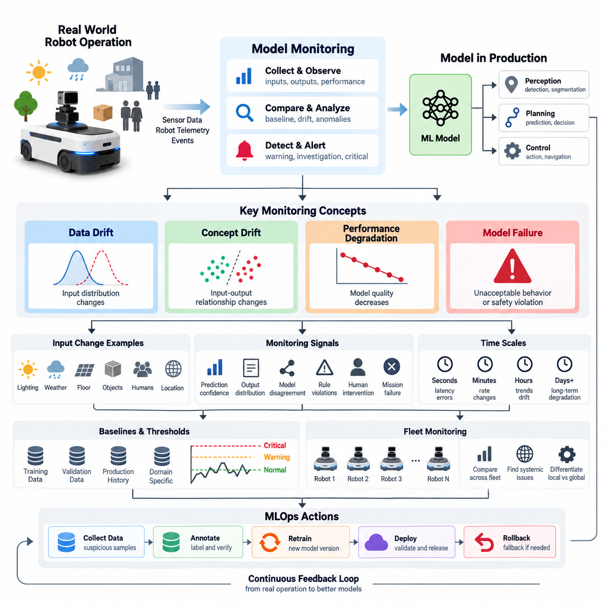
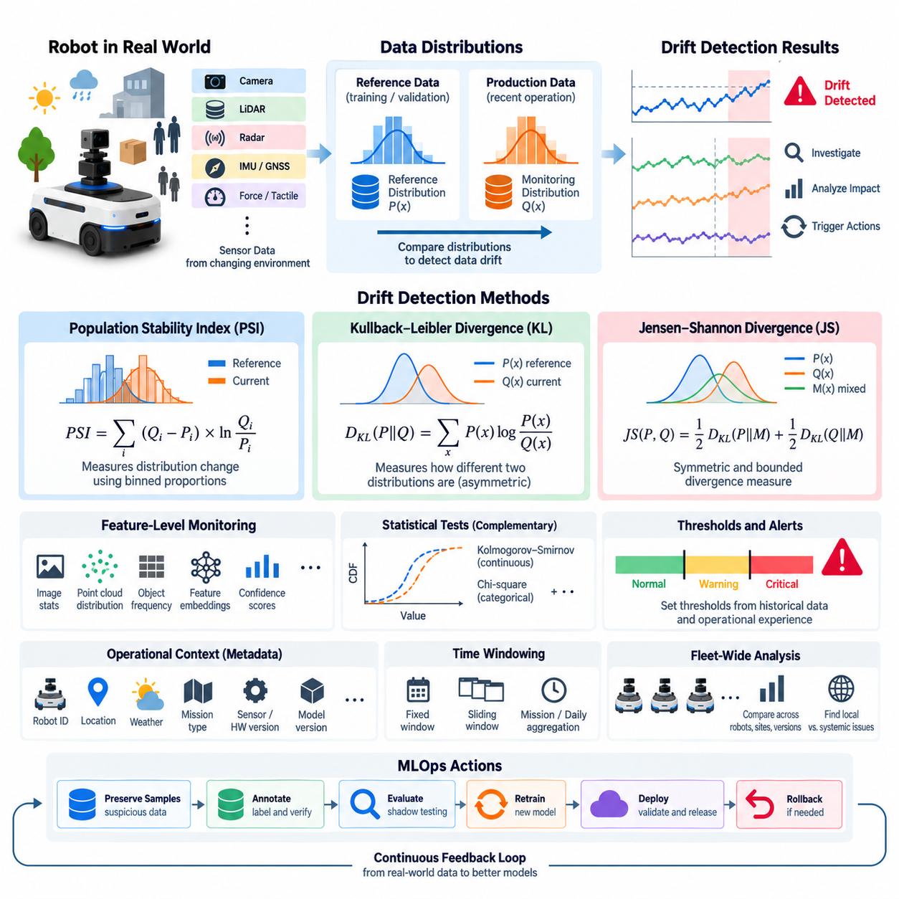
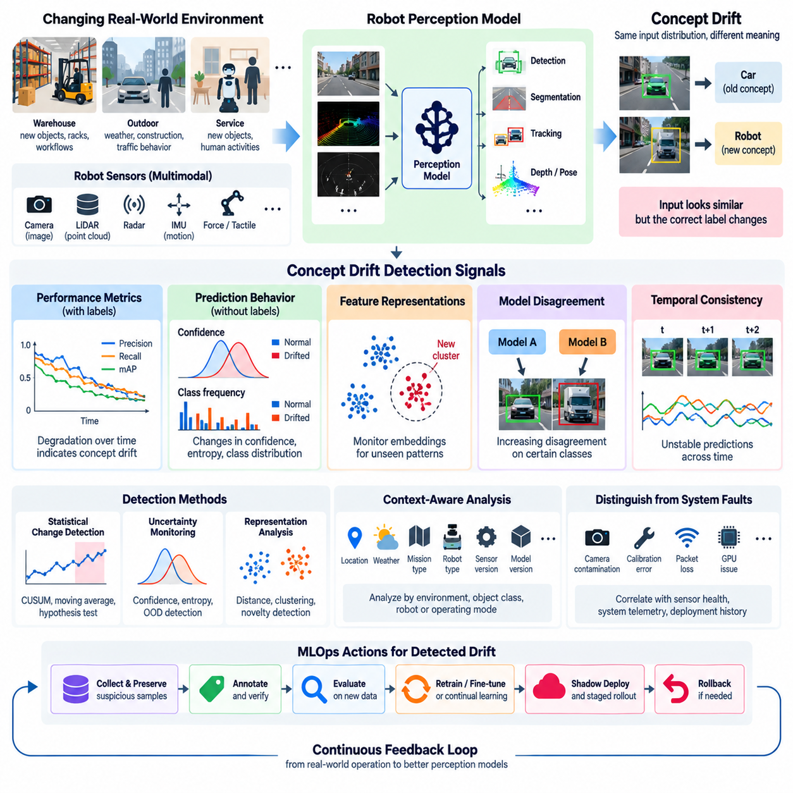
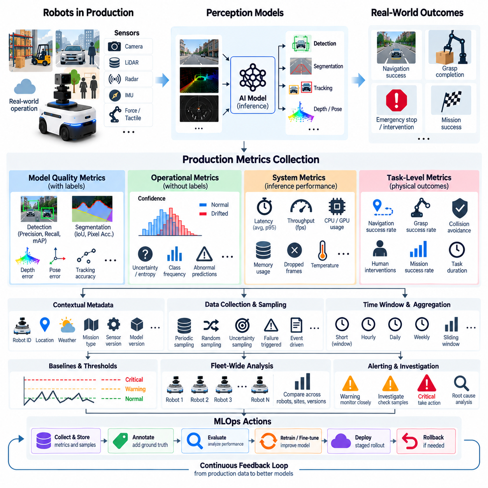
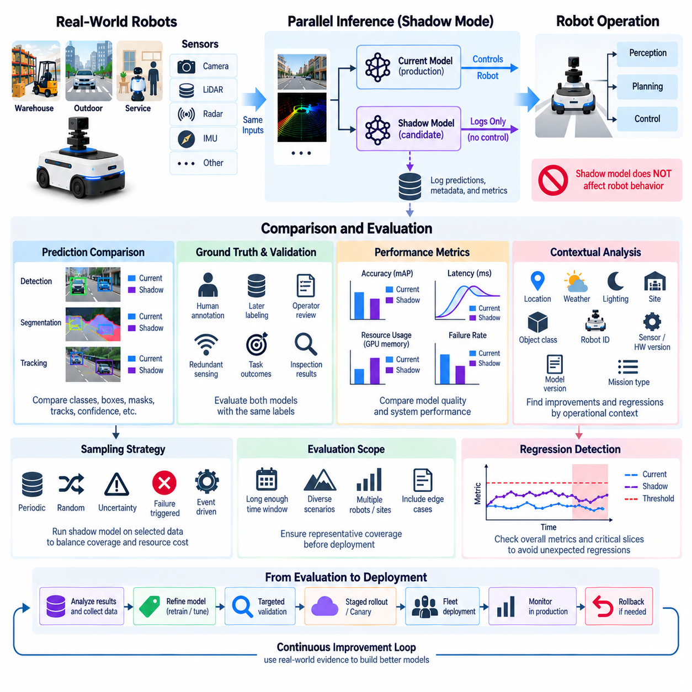
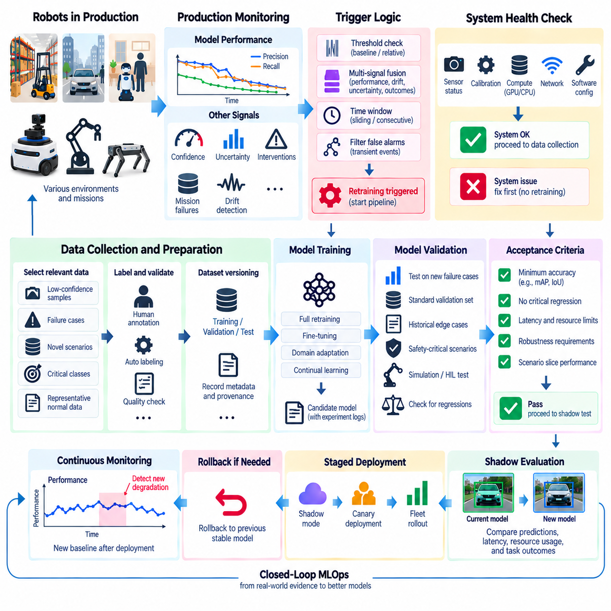
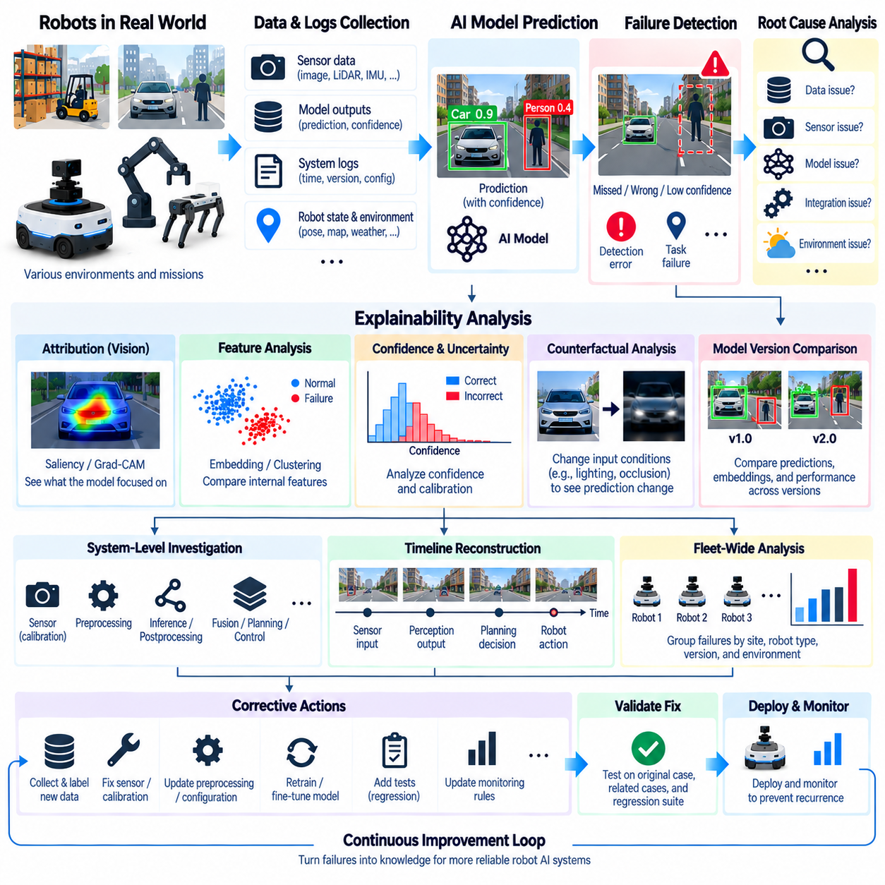
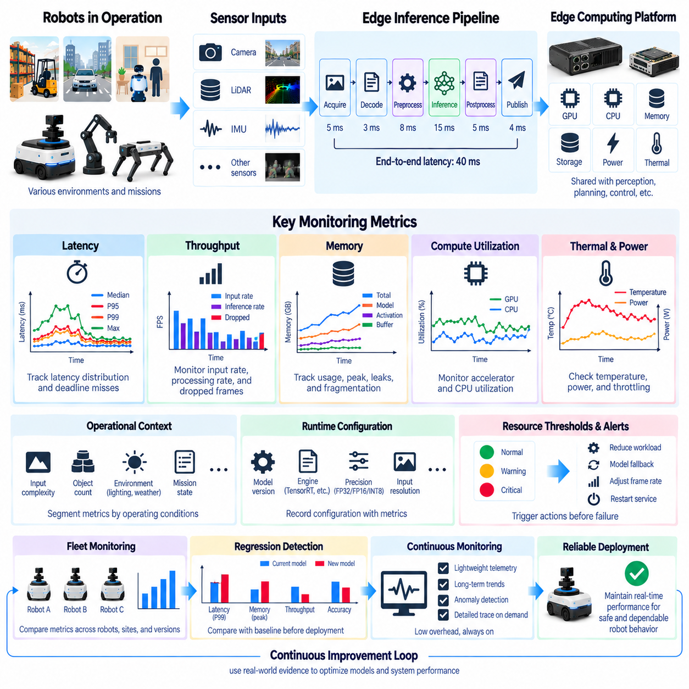
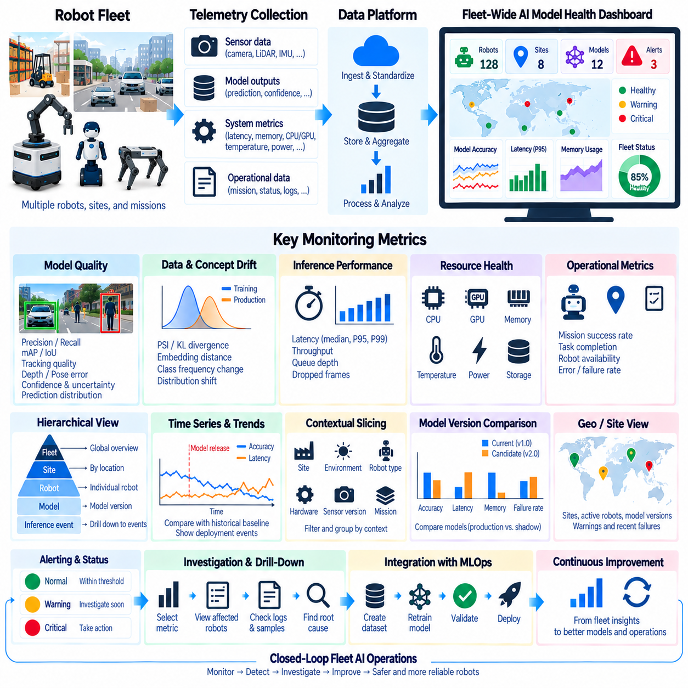
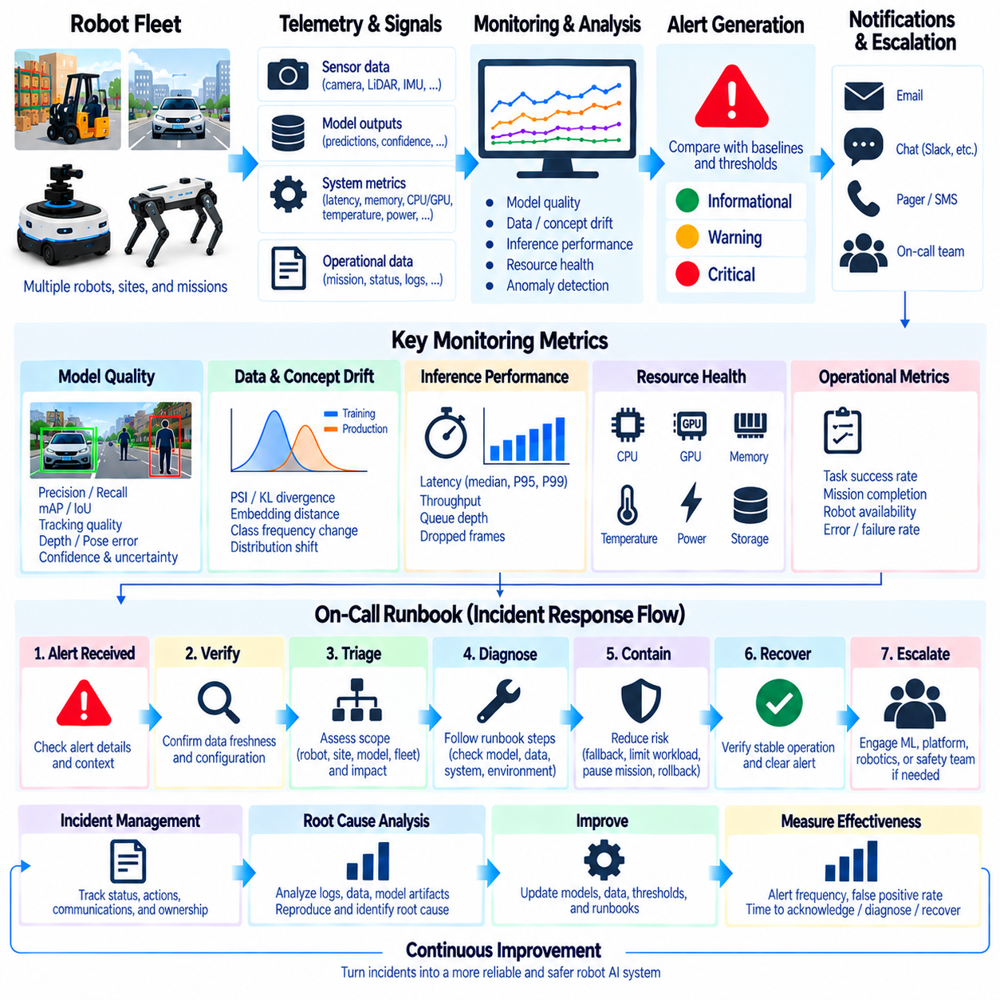

**Volume 10 Robot DevOps and MLOps**


# 8. Model Monitoring

##  

## 8.1. Model Monitoring Concepts Drift Degradation Failure

{width="7.268055555555556in" height="7.268055555555556in"}

Model monitoring is the continuous process of observing how a deployed machine learning model behaves after it leaves the controlled training and validation environment. In robotics, monitoring must extend beyond conventional prediction accuracy because an AI model interacts with sensors, software, hardware, physical environments, and human activity. A model that performed well during validation may gradually become unreliable when any part of this operational context changes.

The central objective of model monitoring is to determine whether the assumptions under which a model was developed still hold in production. Training data represents only a limited sample of possible operating conditions, while robots may encounter new lighting, weather, floor materials, obstacles, objects, human behaviors, sensor configurations, or geographic regions. Monitoring therefore compares current operational behavior with reference distributions, validation baselines, and previously established performance expectations.

A useful monitoring architecture separates several related but different phenomena: data drift, concept drift, performance degradation, and model failure. These conditions can appear independently or sequentially. Data drift describes changes in the statistical characteristics of model inputs, whereas concept drift represents changes in the relationship between inputs and the desired outputs. Performance degradation describes measurable deterioration in operational quality, while failure represents behavior that exceeds acceptable operational or safety boundaries.

Data drift occurs when the distribution of production inputs becomes different from the distribution represented in the training or reference dataset. For a robot perception model, this might happen when cameras originally trained mainly on indoor daytime scenes begin operating outdoors at night, or when a LiDAR configuration changes. Drift does not automatically mean that the model is incorrect, but it indicates that the operating environment has moved away from conditions for which model behavior was previously validated.

Different forms of drift can affect different parts of a robotic AI pipeline. Changes in brightness, image contrast, object frequencies, point-cloud density, environmental geometry, or sensor noise may alter individual features. More complex changes can affect combinations of features even when individual variables appear stable. Monitoring systems therefore require both feature-level statistics and higher-dimensional representations that reveal changes invisible to simple averages, ranges, or marginal distributions.

Concept drift is more fundamental because the mapping between observed information and the correct decision changes. A perception model may continue receiving visually similar images while the meaning of particular patterns changes because new object types, operational rules, environments, or behaviors have appeared. In robotics, concept drift can also arise when a robot moves into a new domain where previously learned correlations no longer provide reliable information for perception, prediction, planning, or action.

Performance degradation describes the gradual or sudden reduction of model quality relative to an established baseline. Depending on the application, this can appear as lower precision or recall, increased false detections, poorer segmentation quality, larger localization errors, unstable grasp predictions, or reduced navigation success. Operational monitoring should therefore connect statistical model metrics with task-level indicators because apparently small prediction changes can produce disproportionately large effects on physical robot behavior.

Ground truth is often unavailable immediately in production, making degradation difficult to measure directly. A robot may generate thousands of predictions before operators know which predictions were correct. Monitoring systems consequently combine delayed labels with proxy indicators such as prediction confidence, output distributions, disagreement between models, rule violations, human interventions, mission failures, or abnormal downstream behavior. These signals do not replace ground truth, but they can provide early evidence that investigation is required.

Model failure is generally a stronger condition than degradation. Degradation indicates worsening performance, whereas failure means that the model can no longer satisfy an operational requirement or produces unacceptable behavior under particular conditions. Failure may be systematic, intermittent, environment-specific, hardware-dependent, or associated with rare edge cases. For physical robots, the consequence of failure may propagate from perception into planning, control, mission execution, or safety mechanisms.

A critical monitoring principle is therefore to distinguish model failures from failures elsewhere in the robotic system. Reduced detection quality may originate from model drift, but it may also result from camera contamination, calibration changes, vibration, network delay, GPU throttling, corrupted preprocessing, or an incorrect model version. Effective monitoring correlates AI metrics with sensor health, software versions, hardware telemetry, environmental conditions, and robot events rather than interpreting model outputs in isolation.

Monitoring should operate at multiple time scales. Millisecond- or second-level signals can reveal inference latency spikes, missing predictions, numerical errors, or resource exhaustion. Minute- and hour-level aggregation can expose changes in confidence or detection rates, while daily or weekly analysis can identify gradual distribution drift and long-term performance decay. Combining these time scales allows the monitoring system to distinguish transient anomalies from persistent changes that justify deeper investigation or retraining.

Baselines provide the reference against which these changes are interpreted. A baseline may represent training data, validation data, a previous production period, a certified model release, or a specific operating domain. Robotics systems often require multiple baselines because normal behavior differs among warehouses, outdoor environments, weather conditions, robot hardware revisions, and mission types. Comparing every robot against one global distribution can therefore produce misleading alarms or conceal locally important degradation.

Threshold design must also account for operational context. A fixed threshold can be useful for clearly defined safety or latency limits, but statistical drift signals often require adaptive thresholds, historical envelopes, or domain-specific limits. Excessively sensitive thresholds generate alert fatigue, while insensitive thresholds allow degradation to continue unnoticed. Monitoring policies should consequently define warning, investigation, mitigation, and critical levels that correspond to increasingly significant deviations from expected behavior.

Fleet operation adds another important dimension. A single robot may show abnormal behavior because of a local sensor or hardware problem, while simultaneous degradation across many robots may indicate a model, software, dataset, or environmental issue. Fleet-wide monitoring makes it possible to compare robots by hardware version, model version, location, mission, and environmental condition. This turns individual telemetry into population-level evidence that can help separate isolated anomalies from systematic model problems.

Monitoring becomes especially valuable when connected to the broader MLOps lifecycle. Detected drift can trigger deeper evaluation, suspicious samples can enter data collection and annotation workflows, confirmed degradation can initiate validation or retraining, and serious failures can activate rollback or fallback policies. Monitoring is therefore not merely an observability dashboard; it is the feedback mechanism that connects production experience to future datasets, experiments, model releases, and deployment decisions.

For robotic systems, the final objective is controlled adaptation rather than automatic reaction to every statistical change. Drift should be treated as evidence requiring interpretation, degradation as a measurable operational concern, and failure as a condition requiring defined mitigation. A mature monitoring system combines data statistics, model outputs, task performance, robot telemetry, environmental context, and fleet history so that AI behavior can remain traceable, diagnosable, and manageable throughout its production lifecycle.

모델 모니터링(Model Monitoring)은 머신러닝 모델(Machine Learning Model)이 통제된 학습(Training) 및 검증(Validation) 환경을 벗어나 실제 환경에 배포된 이후 어떻게 동작하는지를 지속적으로 관찰하는 과정이다. 로보틱스(Robotics)에서는 AI 모델이 센서(Sensor), 소프트웨어(Software), 하드웨어(Hardware), 물리적 환경(Physical Environment), 인간 활동(Human Activity)과 상호작용하므로 일반적인 예측 정확도(Prediction Accuracy)를 넘어선 모니터링이 필요하다. 검증 단계에서 우수했던 모델도 이러한 운영 환경의 일부가 변화하면 점차 신뢰성을 잃을 수 있다.

모델 모니터링(Model Monitoring)의 핵심 목적은 모델이 개발될 당시의 가정이 실제 운영 환경에서도 여전히 유효한지를 판단하는 것이다. 학습 데이터(Training Data)는 가능한 운영 조건의 일부만을 표현하지만, 로봇은 새로운 조명, 날씨, 바닥 재질, 장애물, 객체, 사람의 행동, 센서 구성 또는 지역을 경험할 수 있다. 따라서 모니터링은 현재의 운영 동작을 기준 분포(Reference Distribution), 검증 기준선(Validation Baseline), 기존에 설정된 성능 기대치와 비교한다.

효과적인 모니터링 아키텍처(Monitoring Architecture)는 서로 연관되어 있지만 다른 현상인 데이터 드리프트(Data Drift), 개념 드리프트(Concept Drift), 성능 저하(Performance Degradation), 모델 실패(Model Failure)를 구분한다. 이러한 상태는 독립적으로 또는 순차적으로 발생할 수 있다. 데이터 드리프트는 모델 입력의 통계적 특성이 변하는 것이며, 개념 드리프트는 입력과 원하는 출력 사이의 관계가 변하는 것이다. 성능 저하는 운영 품질의 측정 가능한 악화를 의미하고, 실패는 허용 가능한 운영 또는 안전 경계를 벗어난 동작을 의미한다.

데이터 드리프트(Data Drift)는 실제 운영 입력의 분포가 학습 데이터셋(Training Dataset) 또는 기준 데이터셋(Reference Dataset)의 분포와 달라질 때 발생한다. 예를 들어 주로 실내 주간 환경에서 학습된 로봇 인식 모델(Robot Perception Model)이 야간 실외에서 작동하기 시작하거나 라이다(LiDAR) 구성이 변경되는 경우가 이에 해당한다. 드리프트 자체가 반드시 모델이 잘못되었다는 의미는 아니지만, 모델 동작이 검증되었던 조건으로부터 운영 환경이 벗어나고 있음을 나타낸다.

다양한 형태의 드리프트(Drift)는 로봇 AI 파이프라인(Robotic AI Pipeline)의 서로 다른 부분에 영향을 줄 수 있다. 밝기, 이미지 대비, 객체 출현 빈도, 포인트 클라우드 밀도(Point-Cloud Density), 환경 기하 구조(Environmental Geometry), 센서 노이즈(Sensor Noise)의 변화는 개별 특징(Feature)을 변화시킬 수 있다. 더 복잡한 변화는 개별 변수가 정상적으로 보이는 상황에서도 여러 특징의 조합에 영향을 줄 수 있다. 따라서 모니터링 시스템은 단순한 평균, 범위 또는 주변 분포(Marginal Distribution)만으로 발견하기 어려운 변화를 파악할 수 있도록 특징 수준 통계와 고차원 표현(High-Dimensional Representation)을 함께 활용해야 한다.

개념 드리프트(Concept Drift)는 관찰된 정보와 올바른 결정 사이의 대응 관계 자체가 변한다는 점에서 더욱 근본적인 문제이다. 인식 모델(Perception Model)이 시각적으로 유사한 이미지를 계속 입력받더라도 새로운 객체 유형, 운영 규칙, 환경 또는 행동이 등장하면 특정 패턴의 의미가 달라질 수 있다. 로보틱스에서는 로봇이 새로운 도메인(Domain)으로 이동하여 기존에 학습된 상관관계가 인식(Perception), 예측(Prediction), 계획(Planning), 행동(Action)에 더 이상 신뢰할 수 있는 정보를 제공하지 못할 때에도 개념 드리프트가 발생할 수 있다.

성능 저하(Performance Degradation)는 설정된 기준선(Baseline)과 비교하여 모델 품질이 점진적 또는 갑작스럽게 감소하는 현상을 의미한다. 응용 분야에 따라 정밀도(Precision) 또는 재현율(Recall) 감소, 오검출(False Detection) 증가, 분할 품질(Segmentation Quality) 저하, 위치 추정 오차(Localization Error) 증가, 불안정한 파지 예측(Grasp Prediction), 내비게이션 성공률(Navigation Success Rate) 감소 등으로 나타날 수 있다. 따라서 실제 운영 모니터링은 통계적인 모델 지표와 작업 수준 지표(Task-Level Indicator)를 연결해야 한다. 작은 예측 변화라도 실제 로봇의 물리적 동작에는 훨씬 큰 영향을 줄 수 있기 때문이다.

실제 운영 환경에서는 정답 데이터(Ground Truth)를 즉시 확보하기 어려운 경우가 많기 때문에 성능 저하를 직접 측정하는 것이 쉽지 않다. 로봇은 운영자가 어떤 예측이 정확했는지 확인하기 전에 수천 개의 예측 결과를 생성할 수 있다. 따라서 모니터링 시스템은 지연된 라벨(Delayed Label)과 함께 예측 신뢰도(Prediction Confidence), 출력 분포(Output Distribution), 모델 간 불일치(Model Disagreement), 규칙 위반(Rule Violation), 인간 개입(Human Intervention), 임무 실패(Mission Failure), 비정상적인 후속 동작(Abnormal Downstream Behavior)과 같은 대리 지표(Proxy Indicator)를 활용한다. 이러한 신호가 정답 데이터를 대체할 수는 없지만 추가 조사가 필요한 상황을 조기에 발견하는 데 활용할 수 있다.

모델 실패(Model Failure)는 일반적으로 성능 저하보다 더 심각한 상태이다. 성능 저하는 모델 성능이 악화되는 것을 의미하는 반면, 실패는 특정 조건에서 모델이 운영 요구사항(Operational Requirement)을 더 이상 충족하지 못하거나 허용할 수 없는 동작을 생성하는 것을 의미한다. 실패는 체계적(Systematic), 간헐적(Intermittent), 특정 환경 종속적(Environment-Specific), 하드웨어 종속적(Hardware-Dependent)일 수 있으며 드문 엣지 케이스(Edge Case)와 연관될 수도 있다. 물리적 로봇에서는 이러한 실패의 영향이 인식에서 계획, 제어, 임무 수행 또는 안전 메커니즘(Safety Mechanism)까지 연쇄적으로 전파될 수 있다.

따라서 중요한 모니터링 원칙은 모델 실패와 로봇 시스템의 다른 부분에서 발생한 실패를 구분하는 것이다. 객체 검출 성능 감소는 모델 드리프트(Model Drift)에서 발생할 수 있지만 카메라 오염, 캘리브레이션(Calibration) 변화, 진동, 네트워크 지연(Network Delay), GPU 스로틀링(GPU Throttling), 손상된 전처리(Corrupted Preprocessing), 잘못된 모델 버전(Model Version)에서도 발생할 수 있다. 효과적인 모니터링은 모델 출력만을 독립적으로 해석하는 것이 아니라 AI 지표를 센서 상태, 소프트웨어 버전, 하드웨어 텔레메트리(Hardware Telemetry), 환경 조건, 로봇 이벤트와 연계하여 분석한다.

모니터링은 여러 시간 척도(Time Scale)에서 수행되어야 한다. 밀리초 또는 초 단위 신호는 추론 지연(Inference Latency)의 급격한 증가, 예측 누락, 수치 오류(Numerical Error), 자원 고갈(Resource Exhaustion)을 탐지할 수 있다. 분 또는 시간 단위 집계는 신뢰도나 검출률의 변화를 보여주며, 일 또는 주 단위 분석은 점진적인 분포 드리프트(Distribution Drift)와 장기적인 성능 저하를 식별할 수 있다. 이러한 시간 척도를 결합하면 일시적인 이상 현상(Transient Anomaly)과 심층 조사 또는 재학습(Retraining)이 필요한 지속적인 변화를 구분할 수 있다.

기준선(Baseline)은 이러한 변화를 판단하는 비교 기준을 제공한다. 기준선은 학습 데이터, 검증 데이터, 이전 운영 기간, 인증된 모델 릴리스(Certified Model Release), 특정 운영 도메인을 나타낼 수 있다. 로봇 시스템은 창고, 실외 환경, 기상 조건, 로봇 하드웨어 버전, 임무 유형에 따라 정상 동작이 달라지기 때문에 여러 개의 기준선이 필요한 경우가 많다. 따라서 모든 로봇을 하나의 전역 분포(Global Distribution)와 비교하면 잘못된 경보를 발생시키거나 특정 지역에서 발생하는 중요한 성능 저하를 감출 수 있다.

임계값 설계(Threshold Design) 역시 운영 상황을 고려해야 한다. 고정 임계값(Fixed Threshold)은 명확하게 정의된 안전 또는 지연시간 제한에 유용하지만, 통계적 드리프트 신호에는 적응형 임계값(Adaptive Threshold), 과거 데이터 기반 범위(Historical Envelope), 도메인별 제한값(Domain-Specific Limit)이 필요한 경우가 많다. 지나치게 민감한 임계값은 경보 피로(Alert Fatigue)를 유발하고, 둔감한 임계값은 성능 저하가 탐지되지 않은 상태로 지속되게 한다. 따라서 모니터링 정책은 예상 동작에서 벗어난 정도에 따라 경고(Warning), 조사(Investigation), 완화(Mitigation), 심각(Critical) 수준을 정의해야 한다.

플릿 운영(Fleet Operation)은 또 다른 중요한 관점을 제공한다. 한 대의 로봇에서만 비정상적인 동작이 발생한다면 로컬 센서 또는 하드웨어 문제일 수 있지만, 여러 로봇에서 동시에 성능 저하가 발생한다면 모델, 소프트웨어, 데이터셋 또는 환경에 공통적인 문제가 존재할 가능성을 조사해야 한다. 플릿 전체 모니터링(Fleet-Wide Monitoring)을 사용하면 하드웨어 버전, 모델 버전, 위치, 임무, 환경 조건에 따라 로봇을 비교할 수 있다. 이를 통해 개별 텔레메트리를 집단 수준의 증거로 전환하고 고립된 이상과 체계적인 모델 문제를 구분할 수 있다.

모니터링은 더 넓은 MLOps 수명주기(MLOps Lifecycle)와 연결될 때 특히 높은 가치를 가진다. 탐지된 드리프트는 심층 평가(Deep Evaluation)를 유발할 수 있고, 의심스러운 샘플은 데이터 수집 및 어노테이션(Data Annotation) 워크플로에 입력될 수 있으며, 확인된 성능 저하는 검증 또는 재학습을 시작할 수 있다. 심각한 실패는 롤백(Rollback) 또는 폴백 정책(Fallback Policy)을 활성화할 수 있다. 따라서 모니터링은 단순한 관측성 대시보드(Observability Dashboard)가 아니라 실제 운영 경험을 향후 데이터셋, 실험, 모델 릴리스, 배포 결정과 연결하는 피드백 메커니즘(Feedback Mechanism)이다.

로봇 시스템에서 궁극적인 목표는 모든 통계적 변화에 자동으로 반응하는 것이 아니라 통제된 적응(Controlled Adaptation)을 구현하는 것이다. 드리프트는 해석이 필요한 증거로, 성능 저하는 측정 가능한 운영 문제로, 실패는 정의된 완화 조치가 필요한 상태로 다루어야 한다. 성숙한 모니터링 시스템은 데이터 통계, 모델 출력, 작업 성능, 로봇 텔레메트리, 환경 맥락(Environmental Context), 플릿 이력(Fleet History)을 결합함으로써 전체 운영 수명주기 동안 AI 동작을 추적 가능하고(Traceable), 진단 가능하며(Diagnosable), 관리 가능한(Manageable) 상태로 유지한다.

##  

## 8.2. Data Drift Detection PSI KL Divergence Methods [w/Code]

{width="7.268055555555556in" height="7.268055555555556in"}

Data drift detection is the process of determining whether the statistical characteristics of data observed in production have changed relative to a reference dataset. In robot AI systems, the reference is commonly derived from training, validation, or previously verified operational data. Production inputs are continuously compared against this baseline so that changes in sensor observations can be detected before they cause significant degradation in model behavior.

Data drift is especially important in robotics because robots operate in physical environments that naturally change over time. Camera images vary with illumination, weather, seasons, contamination, vibration, and viewpoint. LiDAR point clouds vary with reflectivity, environmental geometry, precipitation, and sensor condition. Radar, ultrasonic, GNSS, IMU, force, and tactile measurements can also shift as operating conditions, hardware characteristics, or robot configurations change.

A practical drift monitoring system begins by defining a reference distribution and a monitoring distribution. The reference distribution represents data considered normal or validated, while the monitoring distribution represents recently collected production data. These distributions may be compared over fixed time windows, sliding windows, robot missions, geographic regions, environmental conditions, or fleet segments. The selected comparison strategy should reflect how rapidly the operating domain is expected to change.

Population Stability Index, or PSI, is a commonly used method for measuring changes between two distributions. The values of a feature are divided into bins, and the proportion of observations falling into each bin is calculated for both the reference and current datasets. PSI then summarizes the difference between corresponding proportions. A larger PSI indicates a greater shift between the two populations, making it useful as a compact monitoring indicator.

For bins indexed by i, PSI is commonly expressed as the sum of the difference between current and reference proportions multiplied by the logarithm of their ratio. In conceptual form, PSI = Σ(Currentᵢ − Referenceᵢ) × ln(Currentᵢ / Referenceᵢ). Because zero-valued bins make the logarithm undefined, practical implementations normally introduce a small numerical constant or another smoothing strategy before calculating the ratio.

PSI is attractive for production monitoring because it is relatively simple to calculate, interpret, aggregate, and visualize. It can be applied to sensor statistics, model features, confidence scores, object counts, latency distributions, or other numerical variables. However, PSI depends strongly on binning strategy. Different bin boundaries, sample sizes, or sparse observations can produce different values, so thresholds should be validated against the characteristics of the actual robotic application.

Kullback--Leibler divergence, usually called KL divergence, provides another way to quantify differences between probability distributions. For discrete distributions P and Q, it is expressed as D_KL(P\|\|Q) = Σ P(x) log(P(x)/Q(x)). The value becomes zero when the distributions are identical under the evaluated representation and increases as they diverge. KL divergence therefore provides a mathematically grounded measure for detecting distribution changes.

KL divergence is asymmetric, meaning that D_KL(P\|\|Q) is generally different from D_KL(Q\|\|P). This matters when defining which distribution represents the reference and which represents production observations. KL divergence can also become very large or undefined when the comparison distribution assigns zero probability to an event that has positive probability in the reference distribution. Smoothing, density estimation, or carefully constructed histograms are therefore important in operational implementations.

A related alternative is Jensen--Shannon divergence, which introduces a mixture distribution and measures divergence from both distributions to that mixture. Unlike standard KL divergence, Jensen--Shannon divergence is symmetric and bounded under a fixed logarithm base. These characteristics can make it easier to interpret in monitoring dashboards. Nevertheless, the appropriate metric should be selected according to data characteristics rather than assuming that one statistical distance is universally superior.

Robot monitoring rarely involves only one scalar feature. A perception system may receive millions of image pixels, point-cloud coordinates, embeddings, confidence scores, object categories, and temporal features. Calculating PSI or KL divergence directly over raw high-dimensional sensor data is often impractical. Monitoring systems therefore extract meaningful statistics or representations such as brightness, depth distributions, object frequencies, feature embeddings, prediction confidence, or intermediate neural-network activations.

Feature-level drift monitoring helps identify which parts of the input distribution are changing. For camera perception, the system might monitor image intensity, contrast, blur, detected object frequencies, or embedding distributions. For LiDAR, it might observe point density, range distributions, intensity, missing returns, and spatial occupancy. These indicators can be associated with robot ID, location, weather, mission type, sensor version, and model version to provide operational context.

Statistical tests can complement divergence measures. Tests such as the Kolmogorov--Smirnov test for continuous variables or chi-square tests for categorical distributions can evaluate whether observed differences are statistically significant. Statistical significance alone, however, does not establish operational importance. With sufficiently large fleet datasets, even very small distribution changes may become statistically significant while having negligible impact on model performance or robot behavior.

Sample size and monitoring-window design therefore play critical roles in drift detection. Very small windows produce noisy estimates and frequent false alarms, while excessively large windows can hide rapid environmental changes. Sliding windows can provide continuous sensitivity, whereas mission-based or daily aggregation can improve stability. Large robot fleets may additionally require stratified monitoring so that different sites, hardware versions, environmental domains, or operational modes are not incorrectly mixed into one distribution.

Drift thresholds should be calibrated from historical data and operational experience rather than treated as universal constants. A warning threshold can indicate that a feature distribution is moving away from its baseline, while a higher threshold can trigger investigation or model evaluation. Thresholds may also vary by feature because a small shift in a safety-critical perception signal can be more important than a larger shift in a feature with little influence on downstream decisions.

Detecting drift does not prove that model performance has degraded. A robot may encounter a new but easy environment and maintain excellent performance despite substantial input drift. Conversely, a relatively small distribution shift can expose a weakness in the model and cause significant failures. Drift metrics should therefore be correlated with prediction confidence, accuracy when labels become available, human interventions, planning anomalies, mission outcomes, and safety-related events.

Fleet-wide analysis makes drift detection considerably more informative. If one robot exhibits abnormal camera statistics while other robots at the same site remain stable, the likely cause may be contamination, calibration, or sensor degradation. If many robots using the same model show similar distribution shifts, the cause may be environmental or systemic. Comparing robot, site, hardware, software, and model cohorts helps distinguish local sensor problems from broader changes in the operational domain.

A mature data drift pipeline therefore combines reference datasets, production sampling, feature extraction, statistical comparison, contextual metadata, thresholds, alerting, and downstream investigation. PSI and KL divergence are useful components of this pipeline rather than complete solutions by themselves. Their primary value is to convert changes in production data into measurable signals that can be tracked consistently across time, robots, models, and operating environments.

Within the broader MLOps lifecycle, drift detection forms an early-warning layer between production operation and model improvement. Significant drift can trigger sample preservation, annotation, shadow evaluation, targeted validation, or retraining workflows. By linking statistical drift signals with actual robot performance and fleet telemetry, an organization can transform changing real-world conditions into structured evidence for deciding when a model should be investigated, updated, retrained, or replaced.

데이터 드리프트 탐지(Data Drift Detection)는 실제 운영 환경에서 관찰되는 데이터의 통계적 특성이 기준 데이터셋(Reference Dataset)과 비교하여 변화했는지를 판단하는 과정이다. 로봇 AI 시스템(Robot AI System)에서 기준 데이터는 일반적으로 학습(Training), 검증(Validation) 또는 이전에 검증된 운영 데이터에서 구성된다. 실제 운영 입력을 이러한 기준선(Baseline)과 지속적으로 비교함으로써 센서 관측값의 변화가 모델 동작의 심각한 성능 저하로 이어지기 전에 이를 탐지할 수 있다.

데이터 드리프트(Data Drift)는 로봇이 시간이 지나면서 자연스럽게 변화하는 물리적 환경에서 작동하기 때문에 로보틱스(Robotics)에서 특히 중요하다. 카메라 이미지는 조명, 날씨, 계절, 오염, 진동, 시점에 따라 달라진다. 라이다(LiDAR) 포인트 클라우드(Point Cloud)는 반사율, 환경 기하 구조, 강수, 센서 상태에 따라 변한다. 레이더(Radar), 초음파(Ultrasonic), GNSS, IMU, 힘(Force), 촉각(Tactile) 측정값 역시 운영 조건, 하드웨어 특성 또는 로봇 구성 변화에 따라 달라질 수 있다.

실용적인 드리프트 모니터링 시스템(Drift Monitoring System)은 기준 분포(Reference Distribution)와 모니터링 분포(Monitoring Distribution)를 정의하는 것에서 시작한다. 기준 분포는 정상 또는 검증된 것으로 간주되는 데이터를 나타내며, 모니터링 분포는 최근 수집된 실제 운영 데이터를 나타낸다. 이러한 분포는 고정 시간 윈도(Fixed Time Window), 슬라이딩 윈도(Sliding Window), 로봇 임무, 지역, 환경 조건 또는 플릿 세그먼트(Fleet Segment)를 기준으로 비교할 수 있다. 비교 전략은 운영 도메인(Operational Domain)이 얼마나 빠르게 변화할 것으로 예상되는지를 반영해야 한다.

모집단 안정성 지수(Population Stability Index, PSI)는 두 분포 사이의 변화를 측정하기 위해 일반적으로 사용되는 방법이다. 특징(Feature)의 값을 여러 구간(Bin)으로 나누고 각 구간에 포함되는 관측값의 비율을 기준 데이터와 현재 데이터에 대해 각각 계산한다. 이후 PSI는 서로 대응되는 비율의 차이를 하나의 값으로 요약한다. PSI 값이 클수록 두 모집단 사이의 변화가 크다는 것을 나타내므로 간결한 모니터링 지표(Monitoring Indicator)로 활용할 수 있다.

구간을 i로 나타낼 때 PSI는 일반적으로 현재 비율과 기준 비율의 차이에 두 비율의 비에 대한 로그(Logarithm)를 곱한 값을 모두 합산하는 형태로 표현된다. 개념적으로 PSI = Σ(Currentᵢ − Referenceᵢ) × ln(Currentᵢ / Referenceᵢ)이다. 특정 구간의 값이 0이면 로그를 정의할 수 없으므로 실제 구현에서는 비율을 계산하기 전에 작은 수치 상수(Numerical Constant)를 추가하거나 다른 평활화 전략(Smoothing Strategy)을 적용한다.

PSI는 계산, 해석, 집계, 시각화가 비교적 간단하기 때문에 실제 운영 모니터링에 유용하다. 센서 통계, 모델 특징, 신뢰도 점수(Confidence Score), 객체 수, 지연시간 분포(Latency Distribution) 또는 기타 수치 변수에 적용할 수 있다. 그러나 PSI는 구간화 전략(Binning Strategy)에 크게 영향을 받는다. 구간 경계, 표본 크기 또는 희소한 관측값에 따라 서로 다른 결과가 발생할 수 있으므로 임계값(Threshold)은 실제 로봇 응용의 특성을 기반으로 검증해야 한다.

쿨백-라이블러 발산(Kullback--Leibler Divergence), 일반적으로 KL 발산(KL Divergence)이라고 하는 방법은 확률 분포(Probability Distribution) 사이의 차이를 정량화하는 또 다른 방법이다. 이산 분포 P와 Q에 대해서는 D_KL(P\|\|Q) = Σ P(x) log(P(x)/Q(x))로 표현된다. 평가에 사용된 표현에서 두 분포가 동일하면 값은 0이 되고 두 분포의 차이가 커질수록 값도 증가한다. 따라서 KL 발산은 분포 변화를 탐지하기 위한 수학적 기반의 측정값을 제공한다.

KL 발산(KL Divergence)은 비대칭적(Asymmetric)이므로 일반적으로 D_KL(P\|\|Q)와 D_KL(Q\|\|P)는 서로 다르다. 따라서 어느 분포를 기준으로 설정하고 어느 분포를 실제 운영 관측값으로 설정할 것인지가 중요하다. 또한 비교 대상 분포에서 기준 분포가 양의 확률을 가지는 사건에 대해 0의 확률을 부여하면 KL 발산은 매우 커지거나 정의되지 않을 수 있다. 따라서 실제 운영 구현에서는 평활화(Smoothing), 밀도 추정(Density Estimation), 또는 신중하게 구성된 히스토그램(Histogram)이 중요하다.

이와 관련된 대안으로 젠슨-섀넌 발산(Jensen--Shannon Divergence)이 있다. 이 방법은 혼합 분포(Mixture Distribution)를 생성하고 두 분포가 각각 이 혼합 분포로부터 얼마나 차이가 나는지를 측정한다. 일반적인 KL 발산과 달리 젠슨-섀넌 발산은 대칭적(Symmetric)이며 로그 밑(Logarithm Base)이 고정된 경우 유계(Bounded) 특성을 가진다. 이러한 특성은 모니터링 대시보드(Monitoring Dashboard)에서 결과를 보다 쉽게 해석하는 데 도움이 될 수 있다. 그러나 하나의 통계적 거리 측정법이 항상 우수하다고 가정하기보다는 데이터 특성에 따라 적절한 지표를 선택해야 한다.

로봇 모니터링(Robot Monitoring)은 하나의 스칼라 특징(Scalar Feature)만을 다루는 경우가 거의 없다. 인식 시스템(Perception System)은 수백만 개의 이미지 픽셀, 포인트 클라우드 좌표, 임베딩(Embedding), 신뢰도 점수, 객체 범주, 시간적 특징(Temporal Feature)을 입력으로 받을 수 있다. 이러한 고차원 센서 데이터(High-Dimensional Sensor Data)에 PSI 또는 KL 발산을 직접 계산하는 것은 현실적으로 어려운 경우가 많다. 따라서 모니터링 시스템은 밝기, 깊이 분포, 객체 빈도, 특징 임베딩(Feature Embedding), 예측 신뢰도 또는 신경망 중간 활성값(Intermediate Neural-Network Activation)과 같은 의미 있는 통계나 표현을 추출한다.

특징 수준 드리프트 모니터링(Feature-Level Drift Monitoring)은 입력 분포의 어떤 부분이 변화하고 있는지를 파악하는 데 도움이 된다. 카메라 인식에서는 이미지 밝기, 대비, 흐림 정도, 탐지 객체 빈도 또는 임베딩 분포를 모니터링할 수 있다. 라이다에서는 포인트 밀도, 거리 분포, 강도(Intensity), 누락된 반사값(Missing Return), 공간 점유(Spatial Occupancy)를 관찰할 수 있다. 이러한 지표는 로봇 ID, 위치, 날씨, 임무 유형, 센서 버전, 모델 버전과 연계하여 운영 맥락(Operational Context)을 제공할 수 있다.

통계적 검정(Statistical Test)은 발산 측정법을 보완할 수 있다. 연속 변수에는 콜모고로프-스미르노프 검정(Kolmogorov--Smirnov Test), 범주형 분포에는 카이제곱 검정(Chi-Square Test)과 같은 방법을 사용하여 관찰된 차이가 통계적으로 유의한지를 평가할 수 있다. 그러나 통계적 유의성(Statistical Significance)만으로 운영상 중요성을 판단할 수는 없다. 플릿 데이터셋이 충분히 크면 매우 작은 분포 변화도 통계적으로 유의하게 나타날 수 있지만 모델 성능이나 로봇 동작에는 거의 영향을 미치지 않을 수 있다.

따라서 표본 크기(Sample Size)와 모니터링 윈도 설계(Monitoring-Window Design)는 드리프트 탐지에서 중요한 역할을 한다. 지나치게 작은 윈도는 노이즈가 많은 추정값과 빈번한 오경보(False Alarm)를 발생시키며, 지나치게 큰 윈도는 급격한 환경 변화를 감출 수 있다. 슬라이딩 윈도는 지속적인 민감도를 제공하고, 임무 단위 또는 일 단위 집계는 안정성을 높일 수 있다. 대규모 로봇 플릿에서는 서로 다른 사이트, 하드웨어 버전, 환경 도메인 또는 운영 모드가 하나의 분포로 잘못 혼합되지 않도록 계층화 모니터링(Stratified Monitoring)이 추가로 필요할 수 있다.

드리프트 임계값(Drift Threshold)은 보편적인 상수로 취급하기보다 과거 데이터와 실제 운영 경험을 기반으로 보정해야 한다. 경고 임계값(Warning Threshold)은 특징 분포가 기준선에서 벗어나기 시작했음을 나타낼 수 있으며, 더 높은 임계값은 조사 또는 모델 평가(Model Evaluation)를 시작하도록 설정할 수 있다. 또한 특징마다 임계값을 다르게 설정할 수 있다. 안전 중요 인식 신호(Safety-Critical Perception Signal)의 작은 변화가 후속 의사결정에 거의 영향을 주지 않는 특징의 큰 변화보다 중요할 수 있기 때문이다.

드리프트가 탐지되었다고 해서 모델 성능이 반드시 저하되었다는 의미는 아니다. 로봇이 새롭지만 쉽게 처리할 수 있는 환경에 진입하면 상당한 입력 드리프트가 발생해도 우수한 성능을 유지할 수 있다. 반대로 비교적 작은 분포 변화가 모델의 약점을 노출하여 심각한 실패를 유발할 수도 있다. 따라서 드리프트 지표는 예측 신뢰도, 라벨 확보 이후의 정확도, 인간 개입(Human Intervention), 계획 이상(Planning Anomaly), 임무 결과(Mission Outcome), 안전 관련 이벤트와 연계하여 분석해야 한다.

플릿 전체 분석(Fleet-Wide Analysis)을 적용하면 드리프트 탐지의 정보 가치가 크게 높아진다. 한 대의 로봇에서만 비정상적인 카메라 통계가 나타나고 동일한 현장의 다른 로봇들은 안정적이라면 오염, 캘리브레이션 또는 센서 성능 저하가 원인일 가능성을 조사할 수 있다. 동일한 모델을 사용하는 여러 로봇에서 유사한 분포 변화가 발생한다면 환경적 또는 시스템적인 원인을 고려할 수 있다. 로봇, 사이트, 하드웨어, 소프트웨어, 모델 코호트(Model Cohort)를 비교하면 로컬 센서 문제와 운영 도메인의 광범위한 변화를 구분하는 데 도움이 된다.

성숙한 데이터 드리프트 파이프라인(Data Drift Pipeline)은 기준 데이터셋, 실제 운영 샘플링(Production Sampling), 특징 추출(Feature Extraction), 통계적 비교, 상황 메타데이터(Contextual Metadata), 임계값, 경보(Alerting), 후속 조사를 통합한다. PSI와 KL 발산은 이러한 파이프라인의 유용한 구성 요소이지만 그 자체만으로 완전한 해결책은 아니다. 이들의 핵심 가치는 실제 운영 데이터의 변화를 시간, 로봇, 모델, 운영 환경 전반에서 일관되게 추적할 수 있는 측정 가능한 신호로 변환하는 데 있다.

보다 넓은 MLOps 수명주기(MLOps Lifecycle)에서 드리프트 탐지는 실제 운영과 모델 개선 사이의 조기 경보 계층(Early-Warning Layer)을 구성한다. 의미 있는 드리프트는 샘플 보존(Sample Preservation), 어노테이션(Annotation), 섀도 평가(Shadow Evaluation), 표적 검증(Targeted Validation), 재학습(Retraining) 워크플로를 시작하는 계기가 될 수 있다. 통계적 드리프트 신호를 실제 로봇 성능 및 플릿 텔레메트리(Fleet Telemetry)와 연결하면 변화하는 현실 세계의 조건을 모델 조사, 업데이트, 재학습 또는 교체 시점을 판단하기 위한 구조화된 근거로 전환할 수 있다.

##  

## 8.3. Concept Drift Detection for Robot Perception Models [w/Code]

{width="7.268055555555556in" height="7.268055555555556in"}

Concept drift occurs when the relationship between input observations and the correct model output changes over time, even when the statistical appearance of the input data may remain relatively stable. For robot perception models, this means that visual, LiDAR, radar, or multimodal observations that previously supported reliable predictions may acquire different meanings under new operational conditions. Detecting this change is essential for maintaining dependable perception after deployment.

Concept drift differs fundamentally from data drift. Data drift describes a change in the distribution of observed inputs, while concept drift concerns a change in the conditional relationship between inputs and targets. A camera may continue producing images with similar brightness and color distributions, for example, while newly introduced objects or changed operational rules alter what the perception model is expected to recognize. Monitoring input statistics alone may therefore fail to reveal important changes.

Robot perception systems are particularly exposed to concept drift because physical environments are open and continuously evolving. Warehouses introduce new packaging, racks, vehicles, uniforms, and workflows. Outdoor robots encounter construction zones, seasonal vegetation, temporary structures, and changing traffic behavior. Service robots interact with new objects and human activities. These changes can invalidate relationships learned from historical training data without producing an obvious sensor malfunction.

Concept drift can appear gradually, suddenly, incrementally, or repeatedly. Gradual drift occurs when the operational environment evolves over weeks or months, while sudden drift can follow a facility redesign, sensor replacement, or introduction of a new object category. Incremental drift accumulates through small changes, and recurring drift appears when previously observed conditions return, such as seasonal environments or different operational modes between daytime and nighttime.

Detecting concept drift is difficult because the correct output, or ground truth, is often unavailable at the moment a robot generates a prediction. In supervised evaluation, model predictions can be directly compared with labels, but production robots may operate for hours or days before annotations become available. Monitoring systems must therefore combine delayed ground truth with indirect indicators capable of revealing suspicious changes before complete labels are collected.

When labels are available, performance-based monitoring provides one of the clearest approaches to concept drift detection. Precision, recall, F1 score, intersection over union, detection accuracy, tracking quality, depth error, or pose estimation error can be calculated over successive windows. Persistent changes in these metrics indicate that the relationship learned by the model may no longer represent current conditions, especially when sensor quality and system configuration remain stable.

Without immediate labels, prediction behavior becomes an important source of evidence. Changes in confidence distributions, entropy, class frequencies, unknown-object rates, temporal consistency, or disagreement between multiple models can indicate that the current environment no longer matches learned concepts. A perception model that becomes increasingly uncertain around a particular object category may reveal an emerging domain that deserves targeted data collection and evaluation.

Representation-level monitoring extends this approach by observing internal feature embeddings rather than only final predictions. Deep perception networks transform raw sensor inputs into latent representations containing information about objects, geometry, semantics, and context. Production embeddings can be compared with reference embeddings or clustered to identify regions that are poorly represented by training data. New clusters or increasing distance from known clusters can provide evidence of novel operating conditions.

Model disagreement is particularly useful when ground truth is delayed. A deployed production model can be compared with a shadow model, an ensemble, or models trained using different datasets. If predictions that previously agreed begin to diverge systematically for particular environments or object classes, the disagreement can be treated as an investigation signal. Disagreement alone does not prove concept drift, but it can efficiently identify samples requiring annotation.

Temporal consistency provides another valuable signal for robotic perception. Physical objects normally evolve continuously across adjacent camera frames, LiDAR scans, or tracking cycles. Unexpected fluctuations in class identity, object confidence, segmentation masks, estimated depth, or tracked trajectories may indicate unstable perception. Monitoring temporal behavior can reveal failures that frame-by-frame accuracy metrics overlook, particularly in dynamic environments where perception feeds directly into planning and control.

Change-detection algorithms can be applied to sequences of performance or proxy metrics. Statistical process-control techniques, cumulative-sum methods, moving averages, adaptive windows, and sequential hypothesis tests can identify persistent changes rather than isolated anomalies. The objective is not simply to detect every fluctuation but to determine whether accumulated evidence suggests that the underlying relationship between observations and expected predictions has changed.

Concept drift analysis should also be segmented by operational context. Aggregating all robot data into one global metric can conceal failures affecting only specific environments. Metrics can instead be grouped by location, object category, lighting condition, weather, robot type, sensor version, model version, mission, or operating mode. A model may remain stable at fleet level while degrading significantly for forklifts in one warehouse or pedestrians under a particular outdoor condition.

It is equally important to distinguish concept drift from sensor and system faults. A sudden reduction in perception accuracy may result from camera contamination, calibration errors, LiDAR misalignment, packet loss, preprocessing changes, GPU problems, or an incorrect software configuration. Effective diagnosis correlates perception metrics with sensor-health information, system telemetry, deployment history, and environmental metadata before concluding that the underlying concept has changed.

Thresholds for concept drift should represent operational significance rather than arbitrary statistical variation. Warning levels may initiate additional logging or sample preservation, while stronger evidence can trigger human review, targeted annotation, shadow evaluation, or restricted operation. Safety-critical applications may require conservative thresholds for classes such as people, vehicles, obstacles, or hazardous regions because small perception changes can have large downstream consequences.

Fleet-wide monitoring strengthens concept drift detection by providing multiple observations of similar conditions. If only one robot shows abnormal predictions, the cause may be local hardware, calibration, or contamination. If multiple robots using the same model exhibit similar changes around the same class or environment, the evidence for a systematic perception problem becomes stronger. Fleet segmentation therefore supports both drift detection and root-cause isolation.

Confirmed drift should lead to structured data collection rather than immediate uncontrolled retraining. Suspicious samples can be preserved together with images, point clouds, predictions, confidence values, robot states, environmental metadata, and model versions. Representative cases can then be annotated and added to targeted evaluation datasets. This creates evidence for determining whether the existing model remains acceptable or whether adaptation is actually required.

When adaptation is justified, new data can enter the MLOps lifecycle through validation, retraining, fine-tuning, or continual-learning workflows. Candidate models should be evaluated against both newly drifted conditions and historical reference scenarios so that adaptation does not introduce regression elsewhere. Shadow deployment and staged rollout can then compare the candidate against the current production model before broader fleet deployment, while rollback remains available if new failures emerge.

Concept drift detection for robot perception is therefore not a single statistical test but a continuous evidence-building process. Reliable systems combine labeled performance, prediction uncertainty, feature representations, temporal consistency, model disagreement, operational context, sensor health, and fleet-level comparisons. By connecting these signals to annotation, evaluation, retraining, deployment, and rollback workflows, perception monitoring becomes a closed feedback mechanism for maintaining model reliability as the physical world changes.

개념 드리프트(Concept Drift)는 입력 관측값(Input Observation)의 통계적 형태가 비교적 안정적으로 유지되는 상황에서도 입력과 올바른 모델 출력 사이의 관계가 시간에 따라 변화하는 현상을 의미한다. 로봇 인식 모델(Robot Perception Model)에서는 이전에 신뢰할 수 있는 예측을 가능하게 했던 시각, 라이다(LiDAR), 레이더(Radar) 또는 멀티모달(Multimodal) 관측값이 새로운 운영 조건에서 다른 의미를 갖게 되는 것을 의미한다. 이러한 변화를 탐지하는 것은 배포 이후에도 신뢰할 수 있는 인식 성능을 유지하기 위해 필수적이다.

개념 드리프트(Concept Drift)는 데이터 드리프트(Data Drift)와 근본적으로 다르다. 데이터 드리프트는 관찰되는 입력 데이터의 분포가 변화하는 것을 의미하지만, 개념 드리프트는 입력과 목표값(Target) 사이의 조건부 관계(Conditional Relationship)가 변화하는 것을 의미한다. 예를 들어 카메라가 비슷한 밝기와 색상 분포를 가진 이미지를 계속 생성하더라도 새롭게 도입된 객체나 변경된 운영 규칙으로 인해 인식 모델이 식별해야 하는 대상이 달라질 수 있다. 따라서 입력 통계만 모니터링하면 중요한 변화를 발견하지 못할 수 있다.

로봇 인식 시스템(Robot Perception System)은 물리적 환경이 개방되어 있고 지속적으로 변화하기 때문에 개념 드리프트에 특히 많이 노출된다. 창고에는 새로운 포장재, 랙(Rack), 차량, 작업복, 작업 절차가 도입될 수 있다. 실외 로봇은 공사 구역, 계절에 따른 식생 변화, 임시 구조물, 변화하는 교통 행동을 경험한다. 서비스 로봇(Service Robot)은 새로운 객체와 인간 활동을 접한다. 이러한 변화는 명확한 센서 고장을 발생시키지 않으면서도 과거 학습 데이터에서 학습된 관계를 무효화할 수 있다.

개념 드리프트는 점진적(Gradual), 급격한(Sudden), 증분적(Incremental) 또는 반복적(Recurring) 형태로 나타날 수 있다. 점진적 드리프트는 운영 환경이 수주 또는 수개월에 걸쳐 변화할 때 발생하며, 급격한 드리프트는 시설 재배치, 센서 교체 또는 새로운 객체 범주의 도입 이후 발생할 수 있다. 증분적 드리프트는 작은 변화들이 누적되면서 나타나고, 반복적 드리프트는 계절 환경이나 주간과 야간의 서로 다른 운영 모드처럼 이전에 관찰되었던 조건이 다시 나타날 때 발생한다.

개념 드리프트 탐지(Concept Drift Detection)가 어려운 이유는 로봇이 예측을 생성하는 시점에 올바른 출력, 즉 정답 데이터(Ground Truth)를 확보할 수 없는 경우가 많기 때문이다. 지도 평가(Supervised Evaluation)에서는 모델 예측을 라벨(Label)과 직접 비교할 수 있지만, 실제 운영 로봇은 어노테이션(Annotation)이 확보되기 전까지 수시간 또는 수일 동안 동작할 수 있다. 따라서 모니터링 시스템은 지연된 정답 데이터(Delayed Ground Truth)와 함께 완전한 라벨이 수집되기 전에 의심스러운 변화를 탐지할 수 있는 간접 지표를 결합해야 한다.

라벨을 사용할 수 있는 경우 성능 기반 모니터링(Performance-Based Monitoring)은 개념 드리프트를 탐지하는 가장 명확한 방법 중 하나를 제공한다. 정밀도(Precision), 재현율(Recall), F1 점수(F1 Score), 교집합 대비 합집합(Intersection over Union), 검출 정확도(Detection Accuracy), 추적 품질(Tracking Quality), 깊이 오차(Depth Error), 자세 추정 오차(Pose Estimation Error)를 연속적인 윈도(Window)에 대해 계산할 수 있다. 센서 품질과 시스템 구성이 안정적으로 유지되는 상황에서 이러한 지표가 지속적으로 변화한다면 모델이 학습한 관계가 현재 조건을 더 이상 적절하게 표현하지 못하고 있음을 나타낼 수 있다.

즉시 사용할 수 있는 라벨이 없다면 예측 동작(Prediction Behavior)이 중요한 근거가 된다. 신뢰도 분포(Confidence Distribution), 엔트로피(Entropy), 클래스 빈도(Class Frequency), 미지 객체 비율(Unknown-Object Rate), 시간적 일관성(Temporal Consistency), 여러 모델 간의 불일치(Model Disagreement) 변화는 현재 환경이 학습된 개념과 더 이상 일치하지 않음을 나타낼 수 있다. 특정 객체 범주에서 인식 모델의 불확실성이 지속적으로 증가한다면 표적 데이터 수집(Targeted Data Collection)과 평가가 필요한 새로운 도메인이 등장하고 있음을 보여줄 수 있다.

표현 수준 모니터링(Representation-Level Monitoring)은 최종 예측만이 아니라 내부 특징 임베딩(Feature Embedding)을 관찰함으로써 이러한 접근법을 확장한다. 딥러닝 기반 인식 네트워크(Deep Perception Network)는 원시 센서 입력을 객체, 기하 구조, 의미 정보, 문맥 정보를 포함하는 잠재 표현(Latent Representation)으로 변환한다. 실제 운영 임베딩을 기준 임베딩과 비교하거나 군집화(Clustering)하여 학습 데이터에 충분히 표현되지 않은 영역을 식별할 수 있다. 새로운 군집이 나타나거나 기존 군집으로부터의 거리가 증가하는 현상은 새로운 운영 조건의 증거가 될 수 있다.

모델 불일치(Model Disagreement)는 정답 데이터가 지연되는 상황에서 특히 유용하다. 실제 운영 모델(Production Model)을 섀도 모델(Shadow Model), 앙상블(Ensemble) 또는 서로 다른 데이터셋으로 학습된 모델과 비교할 수 있다. 이전에는 일치하던 예측이 특정 환경이나 객체 클래스에서 체계적으로 달라지기 시작한다면 이러한 불일치를 조사 신호(Investigation Signal)로 활용할 수 있다. 모델 불일치만으로 개념 드리프트를 확정할 수는 없지만 어노테이션이 필요한 샘플을 효율적으로 식별할 수 있다.

시간적 일관성(Temporal Consistency)은 로봇 인식을 위한 또 하나의 중요한 신호를 제공한다. 물리적 객체는 일반적으로 인접한 카메라 프레임, 라이다 스캔 또는 추적 주기(Tracking Cycle)에 걸쳐 연속적으로 변화한다. 클래스 정체성(Class Identity), 객체 신뢰도, 세그멘테이션 마스크(Segmentation Mask), 추정 깊이, 추적 궤적(Tracked Trajectory)이 예상하지 못하게 변동한다면 불안정한 인식을 나타낼 수 있다. 시간적 동작을 모니터링하면 프레임 단위 정확도 지표가 놓칠 수 있는 실패를 탐지할 수 있으며, 특히 인식 결과가 계획과 제어에 직접 전달되는 동적 환경에서 중요하다.

변화 탐지 알고리즘(Change-Detection Algorithm)은 성능 지표 또는 대리 지표(Proxy Metric)의 시계열에 적용할 수 있다. 통계적 공정 관리(Statistical Process Control), 누적합(Cumulative Sum), 이동 평균(Moving Average), 적응형 윈도(Adaptive Window), 순차 가설 검정(Sequential Hypothesis Test) 등의 방법을 사용하여 일시적인 이상이 아닌 지속적인 변화를 탐지할 수 있다. 목적은 모든 변동을 탐지하는 것이 아니라 축적된 증거가 관측값과 기대 예측 사이의 기본적인 관계 변화를 나타내는지를 판단하는 것이다.

개념 드리프트 분석(Concept Drift Analysis)은 운영 맥락(Operational Context)에 따라 세분화되어야 한다. 모든 로봇 데이터를 하나의 전역 지표(Global Metric)로 집계하면 특정 환경에서만 발생하는 실패가 감춰질 수 있다. 따라서 위치, 객체 범주, 조명 조건, 날씨, 로봇 유형, 센서 버전, 모델 버전, 임무 또는 운영 모드에 따라 지표를 그룹화할 수 있다. 모델이 전체 플릿(Fleet) 수준에서는 안정적으로 보이더라도 특정 창고의 지게차나 특정 실외 조건의 보행자에 대해서는 상당한 성능 저하가 발생할 수 있다.

개념 드리프트와 센서 및 시스템 고장(System Fault)을 구분하는 것도 중요하다. 인식 정확도가 갑자기 감소하는 현상은 카메라 오염, 캘리브레이션 오류(Calibration Error), 라이다 정렬 불량(LiDAR Misalignment), 패킷 손실(Packet Loss), 전처리 변경(Preprocessing Change), GPU 문제 또는 잘못된 소프트웨어 설정에서 발생할 수 있다. 효과적인 진단은 기본 개념이 변화했다고 판단하기 전에 인식 지표를 센서 상태 정보, 시스템 텔레메트리(System Telemetry), 배포 이력(Deployment History), 환경 메타데이터(Environmental Metadata)와 연계하여 분석한다.

개념 드리프트 임계값(Concept Drift Threshold)은 임의적인 통계적 변동이 아니라 운영상의 중요성을 반영해야 한다. 경고 수준(Warning Level)은 추가 로깅(Logging)이나 샘플 보존(Sample Preservation)을 시작하도록 설정할 수 있으며, 더 강한 증거가 확보되면 인간 검토(Human Review), 표적 어노테이션(Targeted Annotation), 섀도 평가(Shadow Evaluation) 또는 제한 운영(Restricted Operation)을 시작할 수 있다. 안전 중요 응용(Safety-Critical Application)에서는 사람, 차량, 장애물 또는 위험 영역과 같은 클래스의 작은 인식 변화도 후속 동작에 큰 영향을 줄 수 있으므로 보수적인 임계값이 필요할 수 있다.

플릿 전체 모니터링(Fleet-Wide Monitoring)은 유사한 조건에 대한 다수의 관측값을 제공함으로써 개념 드리프트 탐지를 강화한다. 한 대의 로봇에서만 비정상적인 예측이 발생한다면 로컬 하드웨어, 캘리브레이션 또는 오염이 원인일 수 있다. 동일한 모델을 사용하는 여러 로봇이 같은 클래스나 환경에서 유사한 변화를 보인다면 체계적인 인식 문제(Systematic Perception Problem)에 대한 근거가 더욱 강해진다. 따라서 플릿 세분화(Fleet Segmentation)는 드리프트 탐지뿐만 아니라 근본 원인 분리(Root-Cause Isolation)에도 활용할 수 있다.

확인된 드리프트(Confirmed Drift)는 즉각적이고 통제되지 않은 재학습으로 연결되기보다는 구조화된 데이터 수집(Structured Data Collection)으로 이어져야 한다. 의심스러운 샘플은 이미지, 포인트 클라우드, 예측값, 신뢰도, 로봇 상태, 환경 메타데이터, 모델 버전과 함께 보존할 수 있다. 이후 대표 사례를 어노테이션하고 표적 평가 데이터셋(Targeted Evaluation Dataset)에 추가할 수 있다. 이를 통해 기존 모델이 계속 사용 가능한지 또는 실제로 적응(Adaptation)이 필요한지를 판단할 수 있는 근거를 구축한다.

적응이 필요하다고 판단되면 새로운 데이터는 검증(Validation), 재학습(Retraining), 미세조정(Fine-Tuning) 또는 지속 학습(Continual Learning) 워크플로를 통해 MLOps 수명주기(MLOps Lifecycle)에 입력될 수 있다. 후보 모델(Candidate Model)은 새롭게 드리프트가 발생한 조건뿐만 아니라 과거 기준 시나리오에서도 평가하여 적응 과정에서 다른 영역의 회귀(Regression)가 발생하지 않는지 확인해야 한다. 이후 섀도 배포(Shadow Deployment)와 단계적 롤아웃(Staged Rollout)을 통해 후보 모델과 현재 운영 모델을 비교한 후 플릿 전체로 확대할 수 있으며, 새로운 실패가 발생할 경우 롤백(Rollback)을 사용할 수 있어야 한다.

따라서 로봇 인식 모델을 위한 개념 드리프트 탐지(Concept Drift Detection)는 하나의 통계적 검정이 아니라 지속적으로 증거를 축적하는 과정이다. 신뢰할 수 있는 시스템은 라벨 기반 성능(Labeled Performance), 예측 불확실성(Prediction Uncertainty), 특징 표현(Feature Representation), 시간적 일관성, 모델 불일치, 운영 맥락, 센서 상태, 플릿 수준 비교를 결합한다. 이러한 신호를 어노테이션, 평가, 재학습, 배포, 롤백 워크플로와 연결함으로써 인식 모니터링은 변화하는 물리적 세계에서도 모델의 신뢰성을 유지하기 위한 폐쇄형 피드백 메커니즘(Closed Feedback Mechanism)이 된다.

##  

## 8.4. Model Performance Metrics Collection in Production [w/Code]

{width="7.268055555555556in" height="7.268055555555556in"}

Production model performance monitoring extends evaluation beyond offline validation by continuously collecting evidence about how an AI model behaves after deployment. In robotic systems, this requires observing not only prediction quality but also inference timing, resource consumption, uncertainty, task outcomes, and interaction with downstream planning and control. The objective is to establish measurable operational evidence that a deployed model continues to satisfy its expected behavior under changing real-world conditions.

The first requirement is to define production metrics that correspond to the actual responsibility of each model. An object detector may require precision, recall, false-positive rate, missed-detection rate, and mean average precision, while segmentation models may use intersection over union or pixel accuracy. Depth, pose, tracking, localization, grasping, and navigation models require different error measures. Metrics should therefore reflect model function rather than relying on one generic measure of AI quality.

Production metrics can be divided conceptually into model-quality, operational, system, and task-level measurements. Model-quality metrics describe prediction correctness, while operational metrics characterize confidence, uncertainty, output frequency, and abnormal predictions. System metrics measure inference latency, throughput, memory, GPU utilization, and execution failures. Task-level metrics connect model behavior to physical outcomes such as navigation success, collision avoidance, grasp completion, intervention frequency, or mission success.

Ground-truth availability determines how directly model quality can be measured. In controlled evaluation, predictions are compared immediately with labeled data, but production robots rarely receive complete labels in real time. Ground truth may instead become available through human review, later annotation, inspection results, operator corrections, redundant sensors, or completed task outcomes. Production monitoring architectures must therefore support both immediate proxy metrics and delayed supervised performance measurements.

Prediction confidence is one of the most accessible production signals, but it should not be interpreted as equivalent to accuracy. A model can remain highly confident while producing incorrect predictions, particularly under unfamiliar operating conditions. Monitoring confidence distributions over time is nevertheless useful because changes in mean confidence, low-confidence frequency, entropy, or class-specific confidence can reveal changes in model behavior that warrant further investigation.

Performance data should be collected together with contextual metadata. A detection result becomes significantly more informative when associated with robot ID, timestamp, location, mission, model version, sensor version, software release, environmental condition, and operating mode. This context allows engineers to determine whether degradation is global or concentrated within a specific site, hardware revision, object category, weather condition, or deployment cohort.

Metric collection must preserve the relationship between model inputs, outputs, and downstream events without requiring every raw sensor stream to be permanently stored. A monitoring event may contain model identifiers, prediction summaries, confidence values, latency, selected feature statistics, sensor-health information, and task results. Raw images or point clouds can then be retained selectively for anomalous, uncertain, failed, or sampled cases, reducing storage and communication requirements.

Sampling is especially important for robot fleets because continuous raw telemetry can generate enormous data volumes. Monitoring pipelines may combine periodic sampling, random sampling, uncertainty-based sampling, failure-triggered capture, and event-driven collection. Safety-relevant events can receive higher retention priority than routine successful operation. The sampling policy should preserve enough representative evidence to detect degradation while respecting edge storage, network bandwidth, cloud capacity, and operational cost constraints.

Metrics should be aggregated across appropriate time windows. Short windows can expose sudden failures, latency spikes, or abrupt changes in prediction confidence, whereas hourly, daily, or weekly aggregation can reveal persistent degradation and long-term trends. Sliding windows provide continuous sensitivity, while mission-based aggregation helps relate AI behavior to robot tasks. Multiple windows are often necessary because transient anomalies and sustained deterioration require different operational responses.

Fleet-wide aggregation adds another analytical layer. Metrics can be compared across individual robots, groups of robots, sites, hardware configurations, sensor revisions, software releases, and model versions. If one robot exhibits lower detection performance while comparable robots remain stable, the problem may be local. If a new model version shows degradation across many robots, the evidence points toward a broader model or deployment issue that requires coordinated investigation.

Production monitoring must also measure inference-system performance because model quality is irrelevant if predictions arrive too late for physical action. Inference latency can be measured using average, median, and tail values such as high-percentile latency, while throughput indicates how many observations can be processed within a given interval. Queue delay, dropped frames, missed deadlines, GPU memory usage, CPU utilization, and accelerator temperature can reveal deployment problems that offline accuracy testing cannot detect.

For robotic systems, end-to-end latency can be more meaningful than neural-network inference time alone. A perception pipeline may include sensor acquisition, preprocessing, inference, postprocessing, middleware communication, sensor fusion, and delivery to planning. A fast neural network can still participate in a slow overall pipeline if another component becomes a bottleneck. Production telemetry should therefore distinguish component latency from complete perception-to-decision latency whenever system architecture permits.

Task-level metrics provide the connection between AI performance and actual robot behavior. A perception model may show only a small decline in conventional accuracy while causing more emergency stops, path replanning, operator interventions, failed grasps, or mission delays. Conversely, some statistical changes may have little operational effect. Connecting prediction metrics with downstream outcomes helps determine whether observed changes are technically measurable, operationally important, or safety relevant.

Production metrics should be associated with explicit baselines and service expectations. A baseline may come from validation datasets, previous production periods, a known stable release, or domain-specific operating conditions. Current measurements can then be compared against expected ranges rather than interpreted in isolation. Baselines may need segmentation because normal behavior for an indoor warehouse robot can differ substantially from an outdoor robot operating under weather, illumination, and terrain variability.

Alerting converts collected metrics into operational action. Thresholds may identify warning, investigation, and critical conditions for accuracy proxies, latency, resource usage, intervention rates, or task failures. Static limits are useful for clearly defined requirements, while adaptive thresholds can help detect deviations from historical behavior. Alerts should include sufficient context to identify the affected robot, model version, operating condition, and supporting metrics rather than reporting an isolated numerical violation.

Metric observability must also support traceability across the MLOps lifecycle. Engineers should be able to connect a production prediction to the model artifact, training dataset version, configuration, container or runtime version, deployment event, and relevant telemetry. Without version-aware monitoring, performance changes can be difficult to reproduce or diagnose. Traceability transforms monitoring data from dashboard statistics into evidence that can support debugging, validation, rollback, and future model development.

Monitoring itself must be designed so that it does not interfere with robot operation. Metric collection, serialization, buffering, and transmission consume CPU, memory, storage, and network bandwidth. Edge systems may therefore aggregate metrics locally, limit high-frequency telemetry, compress records, and upload detailed evidence only when connectivity and resources permit. Critical control and safety functions should remain isolated from monitoring workloads so that observability cannot become a source of operational instability.

When production metrics indicate deterioration, the monitoring system should support a structured response rather than automatically assuming that retraining is required. Engineers can inspect affected cohorts, retrieve representative samples, verify sensor health, compare model versions, obtain labels, and reproduce failures. Confirmed model degradation can then initiate shadow evaluation, targeted validation, retraining, fine-tuning, staged deployment, or rollback according to the severity and cause of the problem.

Production metric collection ultimately creates the measurement layer that connects deployed AI with continuous MLOps improvement. By combining prediction quality, uncertainty, latency, resource usage, task outcomes, contextual metadata, and fleet-wide comparisons, organizations can determine how models actually behave outside laboratory datasets. This evidence enables model degradation to be detected, localized, investigated, and converted into controlled data, validation, deployment, and improvement workflows.

운영 환경 모델 성능 모니터링(Production Model Performance Monitoring)은 오프라인 검증(Offline Validation)을 넘어 AI 모델이 배포된 이후 실제로 어떻게 동작하는지에 대한 근거를 지속적으로 수집하는 과정이다. 로봇 시스템에서는 예측 품질뿐만 아니라 추론 시간(Inference Timing), 자원 사용량(Resource Consumption), 불확실성(Uncertainty), 작업 결과(Task Outcome), 그리고 후속 계획(Planning) 및 제어(Control)와의 상호작용까지 관찰해야 한다. 목적은 변화하는 실제 환경에서도 배포된 모델이 기대되는 동작을 계속 충족하는지를 판단할 수 있는 측정 가능한 운영 근거를 확보하는 것이다.

첫 번째 요구사항은 각 모델이 실제로 담당하는 기능에 대응하는 운영 성능 지표(Production Metric)를 정의하는 것이다. 객체 검출기(Object Detector)는 정밀도(Precision), 재현율(Recall), 오탐률(False-Positive Rate), 미검출률(Missed-Detection Rate), 평균 정밀도 평균(Mean Average Precision)을 사용할 수 있으며, 세그멘테이션 모델(Segmentation Model)은 교집합 대비 합집합(Intersection over Union)이나 픽셀 정확도(Pixel Accuracy)를 사용할 수 있다. 깊이, 자세, 추적, 위치 추정, 파지, 내비게이션 모델은 서로 다른 오차 측정값이 필요하다. 따라서 지표는 하나의 일반적인 AI 품질 척도에 의존하지 않고 모델 기능을 반영해야 한다.

운영 환경 지표는 개념적으로 모델 품질(Model Quality), 운영(Operational), 시스템(System), 작업 수준(Task-Level)의 측정값으로 구분할 수 있다. 모델 품질 지표는 예측의 정확성을 나타내며, 운영 지표는 신뢰도(Confidence), 불확실성, 출력 빈도, 비정상 예측을 나타낸다. 시스템 지표는 추론 지연시간(Inference Latency), 처리량(Throughput), 메모리, GPU 사용률, 실행 실패를 측정한다. 작업 수준 지표는 모델 동작을 내비게이션 성공, 충돌 회피, 파지 완료, 개입 빈도(Intervention Frequency), 임무 성공과 같은 실제 물리적 결과와 연결한다.

정답 데이터 가용성(Ground-Truth Availability)은 모델 품질을 얼마나 직접적으로 측정할 수 있는지를 결정한다. 통제된 평가에서는 예측 결과를 라벨이 지정된 데이터와 즉시 비교하지만 실제 운영 로봇에서는 완전한 라벨을 실시간으로 확보하기 어렵다. 대신 인간 검토(Human Review), 사후 어노테이션(Later Annotation), 검사 결과, 운영자 수정(Operator Correction), 중복 센서(Redundant Sensor) 또는 완료된 작업 결과를 통해 정답 데이터를 확보할 수 있다. 따라서 운영 모니터링 아키텍처는 즉각적인 대리 지표(Proxy Metric)와 지연된 지도 성능 측정(Delayed Supervised Performance Measurement)을 모두 지원해야 한다.

예측 신뢰도(Prediction Confidence)는 가장 쉽게 확보할 수 있는 운영 신호 중 하나이지만 정확도(Accuracy)와 동일한 것으로 해석해서는 안 된다. 특히 익숙하지 않은 운영 조건에서는 모델이 잘못된 예측을 생성하면서도 높은 신뢰도를 유지할 수 있다. 그럼에도 시간에 따른 신뢰도 분포를 모니터링하는 것은 유용하다. 평균 신뢰도, 낮은 신뢰도 발생 빈도, 엔트로피(Entropy), 클래스별 신뢰도(Class-Specific Confidence)의 변화는 추가 조사가 필요한 모델 동작 변화를 보여줄 수 있기 때문이다.

성능 데이터는 상황 메타데이터(Contextual Metadata)와 함께 수집해야 한다. 객체 검출 결과에 로봇 ID, 타임스탬프(Timestamp), 위치, 임무, 모델 버전, 센서 버전, 소프트웨어 릴리스(Software Release), 환경 조건, 운영 모드가 연결되면 훨씬 더 유용한 정보가 된다. 이러한 맥락을 통해 엔지니어는 성능 저하가 전체 시스템에서 발생하는지 또는 특정 사이트, 하드웨어 리비전(Hardware Revision), 객체 범주, 기상 조건, 배포 코호트(Deployment Cohort)에 집중되어 있는지를 판단할 수 있다.

지표 수집(Metric Collection)은 모든 원시 센서 스트림(Raw Sensor Stream)을 영구적으로 저장하지 않으면서도 모델 입력, 출력, 후속 이벤트 사이의 관계를 보존해야 한다. 모니터링 이벤트(Monitoring Event)는 모델 식별자, 예측 요약, 신뢰도 값, 지연시간, 선택된 특징 통계, 센서 상태 정보, 작업 결과를 포함할 수 있다. 이후 원시 이미지나 포인트 클라우드(Point Cloud)는 이상, 불확실성, 실패 또는 샘플링 대상으로 선정된 사례에 대해서만 선택적으로 보존함으로써 저장 공간과 통신 요구량을 줄일 수 있다.

샘플링(Sampling)은 지속적인 원시 텔레메트리(Raw Telemetry)가 막대한 데이터량을 생성할 수 있는 로봇 플릿(Robot Fleet)에서 특히 중요하다. 모니터링 파이프라인은 주기적 샘플링(Periodic Sampling), 무작위 샘플링(Random Sampling), 불확실성 기반 샘플링(Uncertainty-Based Sampling), 실패 트리거 수집(Failure-Triggered Capture), 이벤트 기반 수집(Event-Driven Collection)을 결합할 수 있다. 안전 관련 이벤트에는 일반적인 성공 운영보다 높은 보존 우선순위를 부여할 수 있다. 샘플링 정책은 엣지 저장 공간, 네트워크 대역폭, 클라우드 용량, 운영 비용을 고려하면서도 성능 저하를 탐지할 수 있는 충분한 대표 데이터를 보존해야 한다.

지표는 적절한 시간 윈도(Time Window)를 기준으로 집계해야 한다. 짧은 윈도는 갑작스러운 실패, 지연시간 급증, 예측 신뢰도의 급격한 변화를 발견할 수 있으며, 시간별, 일별 또는 주별 집계는 지속적인 성능 저하와 장기적인 추세를 파악하는 데 사용할 수 있다. 슬라이딩 윈도(Sliding Window)는 지속적인 민감도를 제공하며, 임무 기반 집계(Mission-Based Aggregation)는 AI 동작을 로봇 작업과 연결하는 데 도움이 된다. 일시적인 이상과 지속적인 성능 악화에는 서로 다른 운영 대응이 필요하기 때문에 여러 시간 윈도를 함께 사용하는 경우가 많다.

플릿 전체 집계(Fleet-Wide Aggregation)는 또 다른 분석 계층을 제공한다. 개별 로봇, 로봇 그룹, 사이트, 하드웨어 구성, 센서 리비전, 소프트웨어 릴리스, 모델 버전별로 지표를 비교할 수 있다. 한 대의 로봇에서만 검출 성능이 낮아지고 유사한 다른 로봇은 안정적인 상태라면 로컬 문제가 원인일 수 있다. 새로운 모델 버전을 사용하는 여러 로봇에서 동시에 성능 저하가 나타난다면 보다 광범위한 모델 또는 배포 문제일 가능성을 조사해야 한다.

운영 모니터링은 추론 시스템 성능(Inference-System Performance)도 측정해야 한다. 예측 결과가 물리적 행동에 사용되기에는 너무 늦게 도착한다면 모델의 예측 품질이 아무리 높더라도 실질적인 가치가 감소하기 때문이다. 추론 지연시간은 평균(Average), 중앙값(Median), 높은 백분위 지연시간(High-Percentile Latency)과 같은 꼬리 지연값(Tail Value)을 통해 측정할 수 있으며, 처리량은 일정 시간 동안 처리할 수 있는 관측값의 수를 나타낸다. 큐 지연(Queue Delay), 프레임 손실(Dropped Frame), 데드라인 미준수(Missed Deadline), GPU 메모리 사용량, CPU 사용률, 가속기 온도(Accelerator Temperature)는 오프라인 정확도 평가에서 발견할 수 없는 배포 문제를 보여줄 수 있다.

로봇 시스템에서는 신경망 추론 시간만 측정하는 것보다 종단 간 지연시간(End-to-End Latency)을 측정하는 것이 더 중요할 수 있다. 인식 파이프라인(Perception Pipeline)은 센서 획득(Sensor Acquisition), 전처리(Preprocessing), 추론(Inference), 후처리(Postprocessing), 미들웨어 통신(Middleware Communication), 센서 융합(Sensor Fusion), 계획 모듈로의 전달 과정을 포함할 수 있다. 신경망 자체가 빠르더라도 다른 구성 요소가 병목(Bottleneck)이 되면 전체 파이프라인은 느려질 수 있다. 따라서 시스템 아키텍처가 허용하는 경우 운영 텔레메트리는 개별 구성 요소의 지연시간과 전체 인식-의사결정 지연시간(Perception-to-Decision Latency)을 구분해야 한다.

작업 수준 지표(Task-Level Metric)는 AI 성능과 실제 로봇 동작을 연결한다. 인식 모델의 일반적인 정확도가 소폭 감소했을 뿐이더라도 비상 정지(Emergency Stop), 경로 재계획(Path Replanning), 운영자 개입, 파지 실패(Failed Grasp), 임무 지연(Mission Delay)이 크게 증가할 수 있다. 반대로 일부 통계적 변화는 실제 운영에 거의 영향을 미치지 않을 수도 있다. 예측 지표를 후속 작업 결과와 연결하면 관찰된 변화가 단순히 기술적으로 측정 가능한 것인지, 실제 운영에서 중요한 것인지, 또는 안전과 관련된 것인지를 판단하는 데 도움이 된다.

운영 성능 지표는 명시적인 기준선(Baseline)과 서비스 기대 수준(Service Expectation)에 연결되어야 한다. 기준선은 검증 데이터셋, 이전 운영 기간, 안정성이 확인된 릴리스(Known Stable Release), 또는 도메인별 운영 조건에서 가져올 수 있다. 이후 현재 측정값을 독립적으로 해석하는 대신 예상 범위와 비교할 수 있다. 실내 창고 로봇의 정상 동작과 날씨, 조명, 지형 변화에 노출되는 실외 로봇의 정상 동작은 상당히 다를 수 있으므로 기준선을 세분화해야 할 수 있다.

경보(Alerting)는 수집된 지표를 실제 운영 조치로 전환한다. 임계값(Threshold)은 정확도 대리 지표, 지연시간, 자원 사용량, 개입률 또는 작업 실패에 대해 경고(Warning), 조사(Investigation), 심각(Critical) 상태를 식별하도록 설정할 수 있다. 고정 임계값(Static Limit)은 명확하게 정의된 요구사항에 유용하며, 적응형 임계값(Adaptive Threshold)은 과거 동작에서 벗어나는 변화를 탐지하는 데 도움이 된다. 경보는 단순한 수치 위반만 보고하는 것이 아니라 영향을 받은 로봇, 모델 버전, 운영 조건, 관련 지표를 식별할 수 있는 충분한 맥락을 포함해야 한다.

지표 관측성(Metric Observability)은 전체 MLOps 수명주기(MLOps Lifecycle)에 걸친 추적성(Traceability)도 지원해야 한다. 엔지니어는 실제 운영 예측을 모델 아티팩트(Model Artifact), 학습 데이터셋 버전, 구성(Configuration), 컨테이너(Container) 또는 런타임 버전(Runtime Version), 배포 이벤트(Deployment Event), 관련 텔레메트리와 연결할 수 있어야 한다. 버전을 고려한 모니터링이 없다면 성능 변화를 재현하거나 진단하기 어려울 수 있다. 추적성은 모니터링 데이터를 단순한 대시보드 통계에서 디버깅(Debugging), 검증, 롤백(Rollback), 향후 모델 개발을 지원할 수 있는 근거로 전환한다.

모니터링 자체가 로봇 운영을 방해하지 않도록 설계하는 것도 중요하다. 지표 수집, 직렬화(Serialization), 버퍼링(Buffering), 전송에는 CPU, 메모리, 저장 공간, 네트워크 대역폭이 사용된다. 따라서 엣지 시스템(Edge System)은 지표를 로컬에서 집계하고, 고빈도 텔레메트리를 제한하며, 레코드를 압축하고, 연결 상태와 자원이 허용될 때만 상세한 데이터를 업로드할 수 있다. 핵심 제어 및 안전 기능은 모니터링 작업으로부터 분리하여 관측성 자체가 운영 불안정성의 원인이 되지 않도록 해야 한다.

운영 지표에서 성능 악화가 나타났을 때 모니터링 시스템은 재학습이 필요하다고 자동으로 가정하기보다 구조화된 대응(Structured Response)을 지원해야 한다. 엔지니어는 영향을 받은 코호트(Cohort)를 조사하고, 대표 샘플을 검색하며, 센서 상태를 검증하고, 모델 버전을 비교하고, 라벨을 확보하여 실패를 재현할 수 있다. 모델 성능 저하가 확인되면 문제의 심각도와 원인에 따라 섀도 평가(Shadow Evaluation), 표적 검증(Targeted Validation), 재학습(Retraining), 미세조정(Fine-Tuning), 단계적 배포(Staged Deployment) 또는 롤백을 수행할 수 있다.

운영 성능 지표 수집(Production Metric Collection)은 궁극적으로 배포된 AI와 지속적인 MLOps 개선(Continuous MLOps Improvement)을 연결하는 측정 계층(Measurement Layer)을 구축한다. 예측 품질, 불확실성, 지연시간, 자원 사용량, 작업 결과, 상황 메타데이터, 플릿 전체 비교를 결합함으로써 조직은 실험실 데이터셋을 벗어난 환경에서 모델이 실제로 어떻게 동작하는지를 판단할 수 있다. 이러한 근거를 통해 모델 성능 저하를 탐지하고, 발생 위치와 범위를 파악하며, 원인을 조사하고, 통제된 데이터 수집, 검증, 배포 및 개선 워크플로로 연결할 수 있다.

##  

## 8.5. Shadow Mode Evaluation New vs Current Model [w/Code]

{width="7.268055555555556in" height="7.268055555555556in"}

Shadow mode evaluation is a deployment technique in which a new candidate model runs alongside the current production model while the current model remains responsible for operational decisions. Both models receive equivalent production inputs, but outputs from the shadow model are recorded only for evaluation and do not directly control the robot. This approach allows engineers to evaluate new models under real operating conditions without immediately exposing physical behavior to unverified predictions.

The current production model acts as the control reference because its behavior has already passed the organization's deployment and validation process. The shadow model represents a candidate intended to improve accuracy, robustness, latency, domain coverage, or another operational property. Running both models on the same sensor observations creates a paired comparison in which environmental conditions, robot state, mission context, and input data are naturally aligned.

Shadow evaluation is particularly valuable for robotics because offline datasets cannot reproduce every condition encountered by physical systems. Warehouses change layouts and inventory, outdoor robots experience weather and illumination variation, and mobile platforms encounter unpredictable human behavior. A candidate model that performs better on a benchmark may still behave differently under these conditions. Shadow execution exposes the candidate to real production distributions before it receives authority over physical actions.

The architecture generally duplicates the inference path after sensor acquisition or preprocessing. Camera images, LiDAR point clouds, radar measurements, or fused representations are delivered to both the current and shadow models. The production model continues sending outputs to downstream perception, planning, or control components, while shadow outputs are redirected to a monitoring pipeline. Timestamps and input identifiers should be preserved so that predictions can be compared reliably.

Isolation between the shadow model and operational control is a fundamental design requirement. Shadow predictions must not unintentionally influence navigation, manipulation, safety logic, actuator commands, or mission decisions. This separation may be implemented through dedicated topics, queues, services, processes, or containers. In ROS 2 systems, for example, shadow inference can publish to evaluation-specific interfaces that are not consumed by operational control nodes.

The simplest comparison examines disagreement between current and candidate predictions. For object detection, engineers can compare classes, bounding boxes, confidence values, missed detections, and false detections. Segmentation systems can compare masks and class probabilities, while tracking systems can compare identities and trajectories. Depth, pose, localization, grasping, and other models require corresponding domain-specific differences rather than a single universal disagreement metric.

Model disagreement alone does not determine which model is better. The current model can be wrong while the shadow model is correct, both models can fail simultaneously, or both can produce acceptable but different predictions. When ground truth becomes available, paired predictions should therefore be evaluated against the same labels. Human annotation, operator review, redundant sensing, task outcomes, or later inspection can provide evidence for determining which behavior was more accurate.

Performance comparison should be segmented by operational context rather than reduced to one fleet-wide average. A candidate may improve daytime perception while degrading at night, or perform better in one warehouse while failing with objects unique to another site. Evaluation should therefore preserve metadata such as robot ID, location, weather, lighting, mission type, object class, sensor version, hardware version, and software release so that improvements and regressions can be localized.

Shadow evaluation also provides an opportunity to compare inference-system behavior. A candidate model may improve accuracy while requiring substantially more GPU memory, increasing latency, reducing throughput, or causing thermal throttling. Production suitability therefore depends on both prediction quality and computational behavior. In robotic systems, inference latency and deadline consistency are especially important because delayed perception can affect planning and control even when the prediction itself is correct.

Resource contention must be carefully controlled because running two models simultaneously increases computational demand. The shadow model can consume GPU capacity, CPU cycles, memory, storage bandwidth, and electrical power that would otherwise be available to production workloads. Deployment architecture should ensure that shadow evaluation cannot degrade the current operational model. Dedicated accelerators, resource quotas, reduced sampling rates, or asynchronous execution can be used when edge resources are limited.

Not every production input needs to be processed by the shadow model. Fleet-scale evaluation can use controlled sampling to balance statistical coverage against computational and communication cost. The shadow model may run on selected robots, missions, geographic regions, time periods, or percentages of incoming observations. Sampling should include routine operation as well as difficult conditions so that evaluation does not become biased toward easy or frequently occurring scenarios.

A useful shadow evaluation records paired predictions together with model versions and execution context. Each comparison record can include the input identifier, timestamp, current-model output, candidate-model output, confidence, latency, resource measurements, relevant metadata, and eventual ground truth when available. Version traceability is essential because multiple candidate models may be evaluated simultaneously or sequentially across a fleet, and their results must remain attributable to exact model artifacts.

Evaluation windows should be long enough to represent operational variability. A short test may contain thousands of frames while still missing rare objects, weather conditions, unusual interactions, or safety-relevant edge cases. Coverage can therefore be measured across scenarios rather than only by sample count. Engineers can track whether the candidate has been observed across required environments, object classes, mission types, robot configurations, and known difficult conditions before making a deployment decision.

Regression detection is one of the most important purposes of shadow mode. A new model may improve an aggregate metric while degrading performance for a critical class or scenario. Comparison pipelines should therefore examine both overall metrics and targeted slices. Historical failure cases and previously corrected edge cases can also be replayed alongside live shadow evaluation to verify that improvements in new domains have not reintroduced known weaknesses.

Task-level evidence can complement prediction-level comparison. If shadow outputs can be evaluated through simulation or non-actuating downstream logic, engineers may estimate how candidate predictions would influence planning or mission behavior without allowing them to control the physical robot. Such analysis can reveal whether apparently small perception differences would lead to different obstacle decisions, trajectories, grasp selections, or other operational consequences.

Promotion criteria should be defined before interpreting shadow results. The candidate may be required to satisfy minimum quality, latency, resource, robustness, and scenario-coverage requirements while avoiding unacceptable regression in critical categories. These criteria should be tied to operational requirements rather than selected after results are observed. A model that improves one metric but violates another requirement should remain a candidate until the tradeoff has been investigated and validated.

Shadow mode is different from canary deployment. In shadow mode, the candidate processes real inputs but normally has no authority over robot behavior. In canary deployment, the candidate becomes operational for a limited portion of traffic, robots, or missions. Shadow evaluation can therefore precede canary deployment: first observe the candidate without control authority, then allow restricted operational use after predefined validation criteria have been satisfied.

When shadow evaluation reveals problems, the collected evidence becomes valuable training and validation data. Disagreement cases, low-confidence predictions, computational failures, and scenario-specific regressions can be preserved and annotated. Engineers can use these samples to diagnose failure modes, refine datasets, adjust preprocessing, retrain or fine-tune the candidate, and repeat the shadow evaluation. The process can iterate without replacing the stable production model prematurely.

When a candidate satisfies its evaluation requirements, it can progress through the broader deployment workflow. Typical next stages include targeted validation, staged rollout, canary operation, broader fleet deployment, and continued production monitoring. The former production model can remain available as a rollback target until the new release demonstrates stable behavior. Shadow evaluation therefore acts as an intermediate safety and evidence layer between offline model validation and operational authority.

Within robotic MLOps, shadow mode transforms real-world operation into a controlled comparative experiment. The current and candidate models observe the same environment while only the validated production path controls the robot. By combining paired predictions, ground truth, contextual metadata, resource measurements, scenario coverage, and regression analysis, teams can determine whether a candidate is ready for progressively greater deployment authority while preserving traceability and operational control.

섀도 모드 평가(Shadow Mode Evaluation)는 새로운 후보 모델(Candidate Model)을 현재 운영 모델(Current Production Model)과 함께 실행하면서도 실제 운영 의사결정은 기존 운영 모델이 계속 담당하도록 하는 배포 기법이다. 두 모델은 동일한 운영 입력을 받지만 섀도 모델(Shadow Model)의 출력은 평가 목적으로만 기록되며 로봇을 직접 제어하지 않는다. 이를 통해 검증되지 않은 예측을 실제 물리적 동작에 즉시 적용하지 않으면서 새로운 모델을 실제 운영 조건에서 평가할 수 있다.

현재 운영 모델(Current Production Model)은 조직의 배포 및 검증 절차를 이미 통과했으므로 제어 기준(Control Reference)의 역할을 한다. 섀도 모델은 정확도, 강건성(Robustness), 지연시간(Latency), 도메인 적용 범위(Domain Coverage) 또는 다른 운영 특성을 개선하기 위한 후보 모델을 의미한다. 두 모델을 동일한 센서 관측값에서 실행하면 환경 조건, 로봇 상태, 임무 맥락(Mission Context), 입력 데이터가 자연스럽게 정렬된 쌍대 비교(Paired Comparison)를 수행할 수 있다.

섀도 평가(Shadow Evaluation)는 오프라인 데이터셋(Offline Dataset)이 물리적 시스템이 경험하는 모든 조건을 재현할 수 없기 때문에 로보틱스(Robotics)에서 특히 중요하다. 창고의 레이아웃과 재고는 변화하고, 실외 로봇은 날씨와 조명의 변화를 경험하며, 이동 로봇은 예측하기 어려운 인간 행동을 마주한다. 벤치마크(Benchmark)에서 더 우수한 후보 모델도 이러한 조건에서는 다르게 동작할 수 있다. 섀도 실행(Shadow Execution)은 후보 모델에 물리적 행동에 대한 권한을 부여하기 전에 실제 운영 분포(Production Distribution)에 노출시킨다.

일반적인 아키텍처에서는 센서 획득(Sensor Acquisition) 또는 전처리(Preprocessing) 이후 추론 경로(Inference Path)를 복제한다. 카메라 이미지, 라이다(LiDAR) 포인트 클라우드(Point Cloud), 레이더 측정값 또는 융합 표현(Fused Representation)을 현재 모델과 섀도 모델 모두에 전달한다. 운영 모델은 계속해서 후속 인식(Perception), 계획(Planning), 제어(Control) 구성 요소에 출력을 전달하고, 섀도 모델의 출력은 모니터링 파이프라인(Monitoring Pipeline)으로 전달한다. 예측을 신뢰성 있게 비교할 수 있도록 타임스탬프(Timestamp)와 입력 식별자(Input Identifier)를 보존해야 한다.

섀도 모델과 실제 운영 제어 사이의 격리(Isolation)는 기본적인 설계 요구사항이다. 섀도 예측이 내비게이션, 조작(Manipulation), 안전 로직(Safety Logic), 액추에이터 명령(Actuator Command), 임무 의사결정에 의도하지 않은 영향을 주어서는 안 된다. 이러한 분리는 전용 토픽(Topic), 큐(Queue), 서비스(Service), 프로세스(Process), 컨테이너(Container)를 통해 구현할 수 있다. 예를 들어 ROS 2 시스템에서는 실제 운영 제어 노드가 구독하지 않는 평가 전용 인터페이스(Evaluation-Specific Interface)로 섀도 추론 결과를 발행할 수 있다.

가장 단순한 비교 방법은 현재 모델과 후보 모델의 예측 불일치(Model Disagreement)를 확인하는 것이다. 객체 검출(Object Detection)에서는 클래스, 바운딩 박스(Bounding Box), 신뢰도 값, 미검출(Missed Detection), 오검출(False Detection)을 비교할 수 있다. 세그멘테이션 시스템(Segmentation System)은 마스크와 클래스 확률을 비교할 수 있으며, 추적 시스템(Tracking System)은 객체 식별자와 궤적(Trajectory)을 비교할 수 있다. 깊이, 자세, 위치 추정, 파지 등 다른 모델에서는 하나의 범용 불일치 지표가 아니라 해당 도메인에 적합한 차이 측정 방법이 필요하다.

모델 불일치만으로 어느 모델이 더 우수한지를 판단할 수는 없다. 현재 모델이 틀리고 섀도 모델이 맞을 수도 있으며, 두 모델이 동시에 실패하거나 서로 다르지만 모두 허용 가능한 예측을 생성할 수도 있다. 따라서 정답 데이터(Ground Truth)를 확보할 수 있게 되면 두 모델의 예측을 동일한 라벨(Label)에 대해 평가해야 한다. 인간 어노테이션(Human Annotation), 운영자 검토(Operator Review), 중복 센싱(Redundant Sensing), 작업 결과 또는 사후 검사를 통해 어느 동작이 더 정확했는지를 판단할 수 있는 근거를 확보할 수 있다.

성능 비교는 하나의 플릿 전체 평균(Fleet-Wide Average)으로 축소하기보다 운영 맥락(Operational Context)에 따라 세분화해야 한다. 후보 모델이 주간 인식에서는 개선되지만 야간에는 성능이 저하될 수 있으며, 특정 창고에서는 더 좋은 성능을 보이지만 다른 사이트에만 존재하는 객체에서는 실패할 수 있다. 따라서 평가에서는 로봇 ID, 위치, 날씨, 조명, 임무 유형, 객체 클래스, 센서 버전, 하드웨어 버전, 소프트웨어 릴리스(Software Release) 등의 메타데이터를 보존하여 개선과 회귀(Regression)가 발생하는 조건을 식별할 수 있어야 한다.

섀도 평가는 추론 시스템 동작(Inference-System Behavior)을 비교할 기회도 제공한다. 후보 모델은 정확도를 향상시키는 대신 GPU 메모리를 훨씬 많이 사용하거나 지연시간을 증가시키고, 처리량(Throughput)을 감소시키거나 열 스로틀링(Thermal Throttling)을 유발할 수 있다. 따라서 실제 운영 적합성은 예측 품질뿐만 아니라 계산 동작(Computational Behavior)에 의해서도 결정된다. 로봇 시스템에서는 지연된 인식 결과가 정확하더라도 계획과 제어에 영향을 줄 수 있으므로 추론 지연시간과 데드라인 일관성(Deadline Consistency)이 특히 중요하다.

두 모델을 동시에 실행하면 계산 요구량이 증가하므로 자원 경합(Resource Contention)을 신중하게 제어해야 한다. 섀도 모델은 실제 운영 워크로드가 사용할 GPU 용량, CPU 사이클, 메모리, 저장장치 대역폭, 전력을 소비할 수 있다. 따라서 배포 아키텍처는 섀도 평가가 현재 운영 모델의 성능을 저하시키지 않도록 설계해야 한다. 엣지 자원(Edge Resource)이 제한적인 경우 전용 가속기(Dedicated Accelerator), 자원 할당량(Resource Quota), 감소된 샘플링 비율(Reduced Sampling Rate), 비동기 실행(Asynchronous Execution)을 사용할 수 있다.

모든 실제 운영 입력을 섀도 모델에서 처리할 필요는 없다. 플릿 규모 평가(Fleet-Scale Evaluation)에서는 통계적 적용 범위(Statistical Coverage)와 계산 및 통신 비용 사이의 균형을 맞추기 위해 통제된 샘플링(Controlled Sampling)을 사용할 수 있다. 섀도 모델은 선택된 로봇, 임무, 지역, 시간대 또는 일정 비율의 입력에 대해서만 실행할 수 있다. 평가가 쉽거나 빈번하게 발생하는 시나리오에 편향되지 않도록 일반적인 운영 조건뿐만 아니라 어려운 조건도 샘플링에 포함해야 한다.

유용한 섀도 평가 시스템은 쌍을 이루는 예측 결과를 모델 버전 및 실행 맥락과 함께 기록한다. 각 비교 레코드(Comparison Record)는 입력 식별자, 타임스탬프, 현재 모델 출력, 후보 모델 출력, 신뢰도, 지연시간, 자원 측정값, 관련 메타데이터, 그리고 이후 확보되는 정답 데이터를 포함할 수 있다. 여러 후보 모델을 플릿에서 동시에 또는 순차적으로 평가할 수 있으므로 각각의 결과를 정확한 모델 아티팩트(Model Artifact)에 연결할 수 있는 버전 추적성(Version Traceability)이 필수적이다.

평가 윈도(Evaluation Window)는 운영 환경의 변동성을 충분히 포함할 수 있을 만큼 길어야 한다. 짧은 테스트에서도 수천 개의 프레임을 처리할 수 있지만 희귀 객체, 특정 기상 조건, 비정상적인 상호작용 또는 안전 관련 엣지 케이스(Edge Case)를 놓칠 수 있다. 따라서 적용 범위는 단순한 샘플 수뿐만 아니라 시나리오를 기준으로 측정할 수 있다. 배포 결정을 내리기 전에 후보 모델이 필요한 환경, 객체 클래스, 임무 유형, 로봇 구성, 알려진 어려운 조건에서 충분히 관찰되었는지를 추적할 수 있다.

회귀 탐지(Regression Detection)는 섀도 모드의 가장 중요한 목적 중 하나이다. 새로운 모델은 전체 집계 지표(Aggregate Metric)를 개선하면서도 중요한 클래스나 시나리오에서 성능을 저하시킬 수 있다. 따라서 비교 파이프라인은 전체 지표와 특정 데이터 슬라이스(Targeted Slice)를 모두 분석해야 한다. 과거의 실패 사례와 이전에 수정된 엣지 케이스를 실시간 섀도 평가와 함께 재실행하여 새로운 도메인에서의 개선이 기존의 알려진 약점을 다시 발생시키지 않는지도 검증할 수 있다.

작업 수준 근거(Task-Level Evidence)는 예측 수준 비교(Prediction-Level Comparison)를 보완할 수 있다. 섀도 모델의 출력을 시뮬레이션(Simulation)이나 실제 액추에이터를 구동하지 않는 후속 로직(Non-Actuating Downstream Logic)을 통해 평가할 수 있다면 후보 모델의 예측이 실제 로봇을 제어하지 않는 상태에서도 계획이나 임무 동작에 어떤 영향을 줄 수 있는지 추정할 수 있다. 이를 통해 작은 인식 차이가 장애물 판단, 궤적, 파지 선택 또는 다른 운영 결과에 어떤 변화를 일으키는지를 파악할 수 있다.

승격 기준(Promotion Criteria)은 섀도 평가 결과를 해석하기 전에 정의되어야 한다. 후보 모델은 핵심 범주에서 허용할 수 없는 회귀를 발생시키지 않으면서 최소 품질, 지연시간, 자원 사용량, 강건성, 시나리오 적용 범위 요구사항을 만족해야 할 수 있다. 이러한 기준은 결과를 확인한 이후 선택하는 것이 아니라 운영 요구사항(Operational Requirement)에 연결되어야 한다. 하나의 지표를 개선했지만 다른 요구사항을 위반하는 모델은 해당 트레이드오프(Tradeoff)가 조사되고 검증될 때까지 후보 상태로 유지해야 한다.

섀도 모드(Shadow Mode)는 카나리 배포(Canary Deployment)와 다르다. 섀도 모드에서는 후보 모델이 실제 입력을 처리하지만 일반적으로 로봇 동작에 대한 권한을 가지지 않는다. 카나리 배포에서는 후보 모델이 제한된 일부 트래픽, 로봇 또는 임무에서 실제 운영 모델로 사용된다. 따라서 섀도 평가는 카나리 배포보다 먼저 수행할 수 있다. 먼저 제어 권한 없이 후보 모델을 관찰하고, 사전에 정의된 검증 기준을 충족한 이후 제한된 실제 운영 권한을 부여하는 방식이다.

섀도 평가에서 문제가 발견되면 수집된 근거는 유용한 학습 및 검증 데이터가 된다. 모델 불일치 사례, 낮은 신뢰도 예측, 계산 실패, 특정 시나리오에서의 회귀를 보존하고 어노테이션할 수 있다. 엔지니어는 이러한 샘플을 사용하여 실패 모드(Failure Mode)를 진단하고, 데이터셋을 개선하며, 전처리를 조정하고, 후보 모델을 재학습(Retraining)하거나 미세조정(Fine-Tuning)한 뒤 다시 섀도 평가를 수행할 수 있다. 이 과정은 안정적인 운영 모델을 성급하게 교체하지 않고 반복할 수 있다.

후보 모델이 평가 요구사항을 충족하면 더 넓은 배포 워크플로(Deployment Workflow)의 다음 단계로 진행할 수 있다. 일반적인 다음 단계에는 표적 검증(Targeted Validation), 단계적 롤아웃(Staged Rollout), 카나리 운영(Canary Operation), 더 넓은 플릿 배포(Fleet Deployment), 지속적인 운영 모니터링(Production Monitoring)이 포함된다. 새로운 릴리스가 안정적인 동작을 입증할 때까지 이전 운영 모델을 롤백 대상(Rollback Target)으로 유지할 수 있다. 따라서 섀도 평가는 오프라인 모델 검증과 실제 운영 권한 사이에서 안전성과 근거를 제공하는 중간 계층으로 기능한다.

로봇 MLOps에서 섀도 모드(Shadow Mode)는 실제 환경의 운영을 통제된 비교 실험(Controlled Comparative Experiment)으로 전환한다. 현재 모델과 후보 모델은 동일한 환경을 관찰하지만 검증된 운영 경로만 로봇을 제어한다. 쌍대 예측(Paired Prediction), 정답 데이터, 상황 메타데이터, 자원 측정값, 시나리오 적용 범위, 회귀 분석을 결합함으로써 후보 모델에 점진적으로 더 높은 배포 권한을 부여할 준비가 되었는지를 평가하면서 추적성과 운영 제어를 유지할 수 있다.

##  

## 8.6. Automated Retraining Trigger on Performance Degradation [w/Code]

{width="7.268055555555556in" height="7.268055555555556in"}

Automated retraining is the controlled process of initiating a new model-training workflow when production evidence indicates that an existing model may no longer satisfy expected performance requirements. In robotic MLOps, the trigger should not be interpreted as permission to replace a deployed model automatically. Instead, it starts a governed pipeline that collects evidence, prepares data, trains a candidate model, validates it, and determines whether deployment should proceed.

Performance degradation can be detected through several complementary signals. Labeled production data may reveal declining precision, recall, F1 score, mean average precision, segmentation IoU, tracking quality, depth error, or pose accuracy. When labels are delayed, proxy signals such as prediction confidence, uncertainty, model disagreement, intervention frequency, mission failures, or abnormal downstream behavior can provide earlier indications that the model requires investigation.

A retraining trigger should normally combine multiple signals rather than respond to a single anomalous measurement. Temporary weather, sensor contamination, network congestion, or an unusual mission can create short-lived metric changes without representing true model degradation. Trigger logic can therefore require a threshold violation to persist across several monitoring windows or combine degradation, drift, uncertainty, and operational outcomes before initiating a retraining workflow.

Thresholds provide the basic decision boundaries for automated triggering. A production metric can be compared with an absolute requirement, a validated baseline, a historical operating range, or a relative decline from previous performance. Different levels may represent normal operation, warning, investigation, and retraining eligibility. Thresholds should be calibrated for individual metrics and operational domains because identical numerical changes can have very different consequences for different robot functions.

Time-window design is essential for distinguishing persistent degradation from noise. Short windows respond quickly but can produce unstable decisions, while long windows provide more reliable estimates at the cost of slower detection. Sliding windows, exponentially weighted statistics, mission-based aggregation, or repeated threshold violations can provide more robust evidence. Safety-critical signals may require faster escalation even when other performance metrics use longer confirmation periods.

Data drift and concept drift can contribute to retraining decisions but should not independently guarantee retraining. A substantial shift in input distribution may have little effect on model performance, while a relatively small change can expose a critical weakness. Drift metrics such as PSI, KL divergence, feature-embedding distance, class-frequency change, or concept-drift indicators should therefore be correlated with model-quality and task-level evidence before expensive training resources are activated.

Robotic systems must also distinguish model degradation from sensor, software, and hardware failures. A sudden reduction in detection performance may originate from a dirty camera lens, calibration error, LiDAR misalignment, corrupted preprocessing, GPU throttling, packet loss, or an incorrect configuration. Automatically retraining on data generated by a faulty system can reinforce undesirable behavior. Trigger pipelines should therefore include system-health checks before accepting degradation as a model-learning problem.

Once a retraining condition is confirmed, the pipeline must identify the data that explains the degradation. Monitoring records can locate low-confidence predictions, disagreement cases, failed missions, human interventions, unusual feature embeddings, or scenario-specific regressions. Relevant images, point clouds, sensor sequences, robot states, environmental metadata, model versions, and task outcomes can then be preserved as candidate training and evaluation data.

Data selection should avoid simply adding every recent production sample to the training set. Large quantities of redundant normal data can dilute rare but important failure cases and increase training cost without improving the model. Sampling can prioritize uncertain predictions, novel environments, critical classes, confirmed failures, underrepresented scenarios, and representative normal examples. Dataset composition should maintain sufficient historical coverage to reduce catastrophic regression on previously solved conditions.

Annotation and data-quality validation form an important gate between trigger detection and training. Automatically collected samples may contain incomplete sensor records, synchronization errors, ambiguous labels, corrupted frames, or duplicated observations. Human annotation, automated labeling, active-learning workflows, or verified task outcomes can provide labels, but quality checks should confirm that the resulting dataset represents the intended correction rather than propagating monitoring or labeling errors.

Dataset versioning is required so that every automated retraining event remains reproducible. The training pipeline should record the production samples selected, historical datasets included, annotation versions, preprocessing configuration, augmentation settings, and train-validation-test partitions. Linking these artifacts to the triggering event allows engineers to reconstruct why a model was retrained and determine which operational evidence influenced the resulting candidate.

The training stage can then execute a predefined pipeline using controlled code, configuration, dependencies, and compute resources. Depending on the model and available evidence, the workflow may perform full retraining, fine-tuning, domain adaptation, or continual learning. Training should produce a new candidate artifact rather than modifying the deployed model directly. Experiment metadata, hyperparameters, checkpoints, logs, and resulting metrics should be registered for later comparison.

Automated validation is the critical gate that prevents retraining from becoming uncontrolled self-modification. The candidate should be evaluated on newly collected degradation cases, standard validation datasets, historical failure cases, and safety-relevant scenarios. Improvements in the affected domain must be balanced against regression elsewhere. A candidate that resolves a new failure but reduces performance on established operating conditions should not automatically progress to deployment.

Acceptance criteria should be defined before training begins. These criteria may include minimum model-quality metrics, maximum allowable regression, inference latency, memory consumption, robustness requirements, and performance on critical scenario slices. Reproducible pass-or-fail gates make retraining pipelines auditable and prevent deployment decisions from being based solely on an improved aggregate metric that may conceal important weaknesses.

Simulation and hardware-in-the-loop evaluation can provide additional validation for robot models before production exposure. Candidate perception outputs can be connected to planning and control in recorded scenarios, simulation environments, or controlled robot tests to determine whether model changes create undesirable physical consequences. This is especially valuable when a statistically improved prediction model could still alter navigation, manipulation, or safety behavior in unexpected ways.

A validated candidate can proceed to shadow mode, where it receives production inputs alongside the current model without controlling the robot. Paired predictions, latency, resource consumption, and task-related evidence can then be compared under real operating conditions. If predefined shadow criteria are satisfied, the candidate can progress to a canary or staged rollout in which operational authority is granted gradually to a limited subset of robots or missions.

Deployment should remain reversible throughout the automated retraining lifecycle. The previous stable model, configuration, and runtime artifacts should remain available so that a candidate can be rolled back if unexpected degradation appears after release. Production monitoring continues after promotion because validation cannot cover every real-world condition. A newly deployed model therefore becomes the next monitored baseline rather than the final endpoint of the process.

Fleet-scale retraining requires additional governance because different robots may operate in substantially different domains. A degradation signal from one site should not necessarily trigger a global model update. Trigger logic can segment evidence by location, robot type, hardware revision, sensor configuration, mission, or environment. This allows organizations to determine whether adaptation should be global, domain-specific, or limited to a particular fleet cohort.

Retraining frequency must also be controlled to prevent feedback loops and unnecessary computation. Repeated triggering from the same unresolved condition can launch redundant training jobs, consume GPU resources, and generate many nearly identical model versions. Cooldown periods, trigger deduplication, minimum new-data requirements, event identifiers, and pipeline state tracking can ensure that each retraining cycle corresponds to meaningful new evidence.

Automated retraining on performance degradation is therefore best understood as a closed-loop MLOps control process rather than a simple threshold-to-training connection. Production monitoring detects deterioration, diagnostic gates verify its cause, targeted data is collected and validated, training creates a candidate, validation and shadow evaluation establish evidence, and staged deployment limits operational risk. Continuous monitoring then closes the loop and provides the evidence for the next controlled adaptation cycle.

자동 재학습(Automated Retraining)은 실제 운영 환경에서 수집된 근거가 기존 모델이 더 이상 기대되는 성능 요구사항을 충족하지 못할 가능성을 나타낼 때 새로운 모델 학습 워크플로(Model-Training Workflow)를 시작하는 통제된 과정이다. 로봇 MLOps에서는 이러한 트리거(Trigger)를 배포된 모델을 자동으로 교체할 수 있는 권한으로 해석해서는 안 된다. 대신 근거를 수집하고, 데이터를 준비하며, 후보 모델을 학습하고, 이를 검증한 뒤 실제 배포 여부를 결정하는 관리된 파이프라인(Governed Pipeline)을 시작하는 역할을 한다.

성능 저하(Performance Degradation)는 여러 상호 보완적인 신호를 통해 탐지할 수 있다. 라벨이 있는 운영 데이터(Labeled Production Data)는 정밀도(Precision), 재현율(Recall), F1 점수(F1 Score), 평균 정밀도 평균(Mean Average Precision), 세그멘테이션 IoU(Segmentation IoU), 추적 품질(Tracking Quality), 깊이 오차(Depth Error), 자세 정확도(Pose Accuracy)의 감소를 보여줄 수 있다. 라벨 확보가 지연되는 경우에는 예측 신뢰도(Prediction Confidence), 불확실성(Uncertainty), 모델 불일치(Model Disagreement), 개입 빈도(Intervention Frequency), 임무 실패(Mission Failure), 비정상적인 후속 동작(Abnormal Downstream Behavior)과 같은 대리 신호(Proxy Signal)를 통해 모델 조사가 필요하다는 초기 징후를 확보할 수 있다.

재학습 트리거(Retraining Trigger)는 일반적으로 하나의 비정상적인 측정값에 반응하기보다 여러 신호를 결합해야 한다. 일시적인 날씨 변화, 센서 오염, 네트워크 혼잡 또는 특수한 임무는 실제 모델 성능 저하를 의미하지 않으면서 단기간의 지표 변화를 발생시킬 수 있다. 따라서 트리거 로직(Trigger Logic)은 여러 모니터링 윈도(Monitoring Window)에 걸쳐 임계값 위반이 지속될 것을 요구하거나 성능 저하, 드리프트(Drift), 불확실성, 운영 결과를 결합하여 재학습 워크플로를 시작하도록 구성할 수 있다.

임계값(Threshold)은 자동 트리거를 위한 기본적인 의사결정 경계를 제공한다. 운영 지표를 절대적인 요구사항, 검증된 기준선(Validated Baseline), 과거 운영 범위(Historical Operating Range) 또는 이전 성능 대비 상대적인 감소와 비교할 수 있다. 서로 다른 수준을 정상 운영(Normal Operation), 경고(Warning), 조사(Investigation), 재학습 적격(Retraining Eligibility) 상태로 정의할 수 있다. 동일한 수치 변화라도 로봇 기능에 따라 결과가 크게 달라질 수 있으므로 임계값은 개별 지표와 운영 도메인(Operational Domain)에 맞추어 보정해야 한다.

시간 윈도 설계(Time-Window Design)는 지속적인 성능 저하와 노이즈(Noise)를 구분하는 데 필수적이다. 짧은 윈도는 빠르게 반응하지만 불안정한 판단을 생성할 수 있으며, 긴 윈도는 더 신뢰할 수 있는 추정값을 제공하는 대신 탐지 속도가 느려진다. 슬라이딩 윈도(Sliding Window), 지수 가중 통계(Exponentially Weighted Statistics), 임무 기반 집계(Mission-Based Aggregation), 반복적인 임계값 위반을 통해 보다 강건한 근거를 확보할 수 있다. 안전 중요 신호(Safety-Critical Signal)는 다른 성능 지표가 더 긴 확인 기간을 사용하더라도 더 빠른 단계 상승(Escalation)이 필요할 수 있다.

데이터 드리프트(Data Drift)와 개념 드리프트(Concept Drift)는 재학습 결정에 기여할 수 있지만 그 자체만으로 재학습을 보장해서는 안 된다. 입력 분포가 크게 변화하더라도 모델 성능에는 거의 영향을 미치지 않을 수 있으며, 반대로 비교적 작은 변화가 치명적인 약점을 드러낼 수도 있다. 따라서 PSI, KL 발산(KL Divergence), 특징 임베딩 거리(Feature-Embedding Distance), 클래스 빈도 변화(Class-Frequency Change), 개념 드리프트 지표와 같은 드리프트 측정값은 고비용 학습 자원을 활성화하기 전에 모델 품질 및 작업 수준 근거(Task-Level Evidence)와 연계하여 분석해야 한다.

로봇 시스템에서는 모델 성능 저하와 센서, 소프트웨어, 하드웨어 고장도 구분해야 한다. 객체 검출 성능의 갑작스러운 감소는 오염된 카메라 렌즈, 캘리브레이션 오류(Calibration Error), 라이다 정렬 불량(LiDAR Misalignment), 손상된 전처리(Corrupted Preprocessing), GPU 스로틀링(GPU Throttling), 패킷 손실(Packet Loss), 잘못된 구성(Configuration)에서 발생할 수 있다. 결함이 있는 시스템에서 생성된 데이터로 자동 재학습하면 바람직하지 않은 동작을 강화할 수 있으므로 트리거 파이프라인은 성능 저하를 모델 학습 문제로 판단하기 전에 시스템 상태 검사(System-Health Check)를 포함해야 한다.

재학습 조건이 확인되면 파이프라인은 성능 저하를 설명하는 데이터를 식별해야 한다. 모니터링 기록을 통해 낮은 신뢰도 예측, 모델 불일치 사례, 실패한 임무, 인간 개입(Human Intervention), 비정상적인 특징 임베딩(Feature Embedding), 특정 시나리오의 회귀(Regression)를 찾을 수 있다. 관련 이미지, 포인트 클라우드(Point Cloud), 센서 시퀀스(Sensor Sequence), 로봇 상태, 환경 메타데이터(Environmental Metadata), 모델 버전, 작업 결과를 후보 학습 및 평가 데이터로 보존할 수 있다.

데이터 선택(Data Selection)은 최근 운영 샘플을 모두 학습 데이터셋에 추가하는 방식으로 이루어져서는 안 된다. 중복된 정상 데이터가 대량으로 추가되면 드물지만 중요한 실패 사례가 희석되고 모델 개선 없이 학습 비용만 증가할 수 있다. 샘플링(Sampling)은 불확실한 예측, 새로운 환경, 중요 클래스, 확인된 실패, 충분히 표현되지 않은 시나리오, 대표적인 정상 사례를 우선할 수 있다. 데이터셋 구성(Dataset Composition)은 기존에 해결된 조건에서 치명적인 회귀가 발생하는 것을 줄이기 위해 충분한 과거 데이터 범위를 유지해야 한다.

어노테이션(Annotation)과 데이터 품질 검증(Data-Quality Validation)은 트리거 탐지와 학습 사이의 중요한 게이트(Gate)를 구성한다. 자동으로 수집된 샘플에는 불완전한 센서 기록, 동기화 오류(Synchronization Error), 모호한 라벨, 손상된 프레임, 중복 관측값이 포함될 수 있다. 인간 어노테이션(Human Annotation), 자동 라벨링(Automated Labeling), 능동 학습 워크플로(Active-Learning Workflow), 검증된 작업 결과를 통해 라벨을 확보할 수 있지만, 품질 검사를 통해 생성된 데이터셋이 모니터링 또는 라벨링 오류를 전파하는 것이 아니라 의도된 수정 사항을 실제로 표현하는지 확인해야 한다.

모든 자동 재학습 이벤트를 재현할 수 있도록 데이터셋 버전 관리(Dataset Versioning)가 필요하다. 학습 파이프라인은 선택된 운영 샘플, 포함된 과거 데이터셋, 어노테이션 버전, 전처리 구성(Preprocessing Configuration), 데이터 증강 설정(Augmentation Setting), 학습-검증-테스트 분할(Train-Validation-Test Partition)을 기록해야 한다. 이러한 아티팩트(Artifact)를 트리거 이벤트와 연결하면 엔지니어가 모델이 왜 재학습되었는지를 재구성하고 어떤 운영 근거가 결과 후보 모델에 영향을 미쳤는지를 확인할 수 있다.

이후 학습 단계(Training Stage)는 통제된 코드, 구성, 의존성(Dependency), 컴퓨팅 자원을 사용하여 사전에 정의된 파이프라인을 실행할 수 있다. 모델과 확보된 근거에 따라 전체 재학습(Full Retraining), 미세조정(Fine-Tuning), 도메인 적응(Domain Adaptation), 지속 학습(Continual Learning)을 수행할 수 있다. 학습은 배포된 모델을 직접 수정하는 대신 새로운 후보 아티팩트(Candidate Artifact)를 생성해야 한다. 실험 메타데이터, 하이퍼파라미터(Hyperparameter), 체크포인트(Checkpoint), 로그(Log), 결과 지표를 등록하여 이후 비교에 사용할 수 있도록 해야 한다.

자동 검증(Automated Validation)은 재학습이 통제되지 않은 자기 수정(Uncontrolled Self-Modification)으로 변하는 것을 방지하는 핵심 게이트이다. 후보 모델은 새롭게 수집된 성능 저하 사례, 표준 검증 데이터셋, 과거 실패 사례, 안전 관련 시나리오를 대상으로 평가되어야 한다. 영향을 받은 도메인에서의 개선은 다른 영역에서 발생하는 회귀와 함께 평가해야 한다. 새로운 실패를 해결했더라도 기존 운영 조건에서 성능을 저하시키는 후보 모델은 자동으로 배포 단계로 진행해서는 안 된다.

수용 기준(Acceptance Criteria)은 학습이 시작되기 전에 정의되어야 한다. 이러한 기준에는 최소 모델 품질 지표, 최대 허용 회귀(Maximum Allowable Regression), 추론 지연시간(Inference Latency), 메모리 사용량, 강건성 요구사항(Robustness Requirement), 중요 시나리오 슬라이스(Critical Scenario Slice)의 성능이 포함될 수 있다. 재현 가능한 합격 또는 불합격 게이트(Pass-or-Fail Gate)를 사용하면 재학습 파이프라인을 감사 가능(Auditable)하게 만들고 중요한 약점을 감출 수 있는 단순한 전체 집계 지표의 개선만으로 배포 결정을 내리는 것을 방지할 수 있다.

시뮬레이션(Simulation)과 하드웨어 인 더 루프 평가(Hardware-in-the-Loop Evaluation)는 로봇 모델을 실제 운영에 노출하기 전에 추가적인 검증을 제공할 수 있다. 후보 인식 결과를 기록된 시나리오, 시뮬레이션 환경 또는 통제된 로봇 테스트의 계획 및 제어 시스템과 연결하여 모델 변경이 바람직하지 않은 물리적 결과를 발생시키는지 확인할 수 있다. 통계적으로 개선된 예측 모델이라도 내비게이션, 조작 또는 안전 동작을 예상하지 못한 방식으로 변화시킬 수 있기 때문에 이러한 검증은 특히 중요하다.

검증된 후보 모델은 섀도 모드(Shadow Mode)로 진행하여 현재 모델과 함께 실제 운영 입력을 받되 로봇을 직접 제어하지 않도록 할 수 있다. 동일한 입력에 대한 예측 결과, 지연시간, 자원 사용량, 작업 관련 근거를 실제 운영 조건에서 비교할 수 있다. 사전에 정의된 섀도 기준(Shadow Criteria)을 충족하면 후보 모델은 카나리 배포(Canary Deployment) 또는 단계적 롤아웃(Staged Rollout)으로 진행하여 제한된 로봇이나 임무부터 점진적으로 실제 운영 권한을 부여받을 수 있다.

자동 재학습 수명주기 전체에서 배포는 되돌릴 수 있는 상태(Reversible)를 유지해야 한다. 후보 모델이 릴리스된 이후 예상하지 못한 성능 저하가 발생하면 이전의 안정적인 모델, 구성, 런타임 아티팩트(Runtime Artifact)를 이용해 롤백(Rollback)할 수 있어야 한다. 검증만으로 모든 실제 환경 조건을 포괄할 수 없으므로 승격 이후에도 운영 모니터링(Production Monitoring)을 지속해야 한다. 따라서 새롭게 배포된 모델은 프로세스의 최종 지점이 아니라 다음 모니터링 주기를 위한 새로운 기준선(Baseline)이 된다.

플릿 규모 재학습(Fleet-Scale Retraining)에는 서로 다른 로봇이 상당히 다른 도메인에서 작동할 수 있기 때문에 추가적인 거버넌스(Governance)가 필요하다. 한 사이트에서 발생한 성능 저하 신호가 반드시 전체 모델 업데이트를 유발해야 하는 것은 아니다. 트리거 로직은 위치, 로봇 유형, 하드웨어 리비전(Hardware Revision), 센서 구성, 임무 또는 환경을 기준으로 근거를 세분화할 수 있다. 이를 통해 적응이 전체 시스템에 필요한지, 특정 도메인에만 필요한지, 또는 특정 플릿 코호트(Fleet Cohort)에만 제한되어야 하는지를 결정할 수 있다.

피드백 루프(Feedback Loop)와 불필요한 계산을 방지하기 위해 재학습 빈도(Retraining Frequency) 역시 통제해야 한다. 해결되지 않은 동일 조건에서 반복적으로 트리거가 발생하면 중복 학습 작업이 시작되고 GPU 자원이 소모되며 거의 동일한 모델 버전이 다수 생성될 수 있다. 쿨다운 기간(Cooldown Period), 트리거 중복 제거(Trigger Deduplication), 최소 신규 데이터 요구량(Minimum New-Data Requirement), 이벤트 식별자(Event Identifier), 파이프라인 상태 추적(Pipeline State Tracking)을 사용하여 각각의 재학습 주기가 의미 있는 새로운 근거에 대응하도록 할 수 있다.

따라서 성능 저하 기반 자동 재학습(Automated Retraining on Performance Degradation)은 단순히 임계값을 학습 과정에 연결하는 방식이 아니라 폐쇄 루프 MLOps 제어 프로세스(Closed-Loop MLOps Control Process)로 이해하는 것이 적절하다. 운영 모니터링이 성능 악화를 탐지하고, 진단 게이트(Diagnostic Gate)가 원인을 검증하며, 표적 데이터를 수집하고 검증한 뒤 학습을 통해 후보 모델을 생성한다. 이후 검증과 섀도 평가를 통해 근거를 확보하고 단계적 배포로 운영 위험을 제한한다. 지속적인 모니터링은 다시 루프를 닫고 다음 통제된 적응 주기를 위한 근거를 제공한다.

##  

## 8.7. Model Explainability and Failure Root Cause Analysis

{width="7.268055555555556in" height="7.268055555555556in"}

Model explainability is the process of making an AI model's predictions, internal reasoning signals, and failure patterns understandable enough for engineers to investigate its behavior. In robotic systems, explainability is particularly important because perception outputs can influence planning, navigation, manipulation, and safety decisions. The objective is not merely to visualize a neural network, but to produce evidence that helps explain why a prediction occurred and why a failure propagated into robot behavior.

Explainability and root cause analysis are closely related but serve different purposes. Explainability examines which inputs, features, representations, or model components contributed to a prediction, whereas root cause analysis seeks the underlying reason that an operational failure occurred. A wrong object detection may originate from insufficient training data, sensor degradation, preprocessing errors, domain shift, model architecture limitations, deployment configuration, or interactions with downstream software.

A useful failure investigation begins with reproducibility. Engineers should preserve the sensor inputs, model outputs, timestamps, model version, preprocessing configuration, robot state, software release, hardware configuration, and environmental context associated with an incident. Without this information, an observed failure may be impossible to reproduce. Production monitoring should therefore generate traceable records that connect individual predictions with the complete execution context in which they occurred.

For vision models, attribution methods can indicate which image regions contributed strongly to a prediction. Saliency maps, gradient-based attribution, activation visualization, and class activation mapping can highlight spatial areas associated with model responses. These techniques can help determine whether a detector relied on the intended object, surrounding background, reflections, shadows, or irrelevant visual patterns. Their results should be treated as diagnostic evidence rather than definitive explanations of model reasoning.

Feature-level analysis provides another perspective by examining intermediate representations produced inside the model. Embeddings from normal and failed samples can be compared using distance measures, clustering, or dimensionality reduction. Failure samples that form a distinct cluster may indicate an underrepresented environment, object appearance, sensor condition, or operational domain. Similar embeddings with different prediction outcomes can instead suggest ambiguity near a learned decision boundary.

Confidence and uncertainty analysis can reveal whether the model recognized that a situation was difficult. A low-confidence incorrect prediction differs operationally from a highly confident incorrect prediction. The first may indicate insufficient evidence, while the second can expose poor calibration, dataset bias, or an unfamiliar condition that the model incorrectly maps to a known concept. Confidence should therefore be analyzed together with correctness, class, environment, and historical behavior.

Counterfactual analysis asks how an input would need to change for the model to produce a different prediction. In robot perception, engineers might examine whether changes in illumination, occlusion, object position, scale, background, point density, or sensor noise alter the model decision. Carefully controlled perturbations can reveal sensitivity to particular conditions and help distinguish robust semantic features from fragile correlations learned from the training dataset.

Failure analysis should extend beyond the model because robotic AI operates as part of a larger perception-to-action pipeline. Sensor acquisition, synchronization, calibration, preprocessing, inference, postprocessing, sensor fusion, planning, middleware communication, and control can all contribute to an observed incident. A perception failure reported at the robot level may therefore originate upstream of the neural network or appear only after an otherwise reasonable prediction is interpreted incorrectly downstream.

Timeline reconstruction is especially useful for failures involving dynamic robot behavior. Logs from cameras, LiDAR, IMU, model inference, localization, planning, control, and safety systems can be synchronized around the event. Engineers can then reconstruct the sequence from environmental observation through perception and decision to physical action. This temporal view helps distinguish the first abnormal event from secondary effects that occurred after the original problem had already entered the system.

Root cause analysis should separate correlation from causation. A temperature spike, confidence reduction, and navigation failure may occur at approximately the same time without all three sharing the same cause. Engineers can compare successful and failed runs, reproduce the scenario, disable suspected components, replay recorded data, or modify one variable at a time. Evidence becomes stronger when changing a suspected factor repeatedly causes or eliminates the observed failure.

Comparative analysis across model versions can identify regressions introduced by training or deployment changes. The same recorded sensor sequence can be replayed through the current model, previous stable model, and candidate models. Differences in predictions, confidence, latency, and intermediate representations help isolate whether the problem is model-specific. Linking every result to exact model artifacts and dataset versions makes this comparison reproducible across development cycles.

Fleet-wide evidence can further narrow the cause of a failure. If only one robot exhibits abnormal perception while identical models operate normally elsewhere, investigation can focus on local sensors, calibration, hardware, or configuration. If many robots running the same model version fail under similar conditions, a model or dataset problem becomes a stronger hypothesis. Grouping incidents by site, robot type, sensor revision, software version, and environment supports systematic diagnosis.

Failure taxonomy helps transform isolated incidents into structured engineering knowledge. Failures can be categorized by sensor condition, data quality, domain shift, object class, preprocessing, model inference, calibration, timing, resource exhaustion, integration, or downstream behavior. Consistent categories make it possible to identify repeated failure modes and determine whether multiple incidents share a common origin rather than being treated as unrelated operational anomalies.

Explainability evidence should be connected to training-data provenance. When a model fails on a particular object or environment, engineers should determine whether comparable examples existed in the training dataset, how frequently they appeared, how they were labeled, and whether augmentation represented relevant variations. Dataset lineage can reveal missing scenarios, class imbalance, annotation inconsistencies, or spurious correlations that are difficult to identify by inspecting model outputs alone.

Simulation and replay provide controlled environments for testing root-cause hypotheses. Recorded sensor streams can reproduce perception failures without repeatedly operating the physical robot, while simulation can systematically vary lighting, weather, geometry, sensor noise, object position, or occlusion. Hardware-in-the-loop testing can extend this analysis to timing, communication, and compute behavior. Together, these methods allow suspected causes to be tested under repeatable conditions.

A root cause should lead to a corrective action that corresponds to the actual failure mechanism. Dataset coverage problems may require targeted data collection and annotation, calibration problems require sensor correction, preprocessing defects require software changes, and compute overload may require model optimization or resource reconfiguration. Retraining should therefore be one possible response rather than the default response to every AI-related incident.

Corrective actions must also be verified against the original failure. A candidate fix can be tested using the exact recorded incident, related edge cases, historical validation datasets, and broader regression suites. If a model is retrained, explainability and performance analysis should determine whether the failure was actually corrected rather than merely hidden by changes in aggregate metrics. Previously resolved incidents can then become permanent regression tests for future releases.

Explainability information should be presented at the level required by different engineering roles. ML engineers may need attribution maps, embeddings, calibration plots, and dataset lineage, while robotics engineers may need synchronized sensor and planning timelines. Operations teams may require incident summaries, affected robots, environmental conditions, and recovery actions. A shared incident identifier can connect these views without forcing every team to interpret raw model diagnostics.

The complete process forms an evidence-driven failure analysis loop. Production monitoring detects an abnormal event, traceable telemetry reconstructs its context, explainability methods examine model behavior, system-level analysis tests competing hypotheses, and reproducible experiments identify the most supported cause. Corrective action is then validated and converted into datasets, tests, monitoring rules, or deployment changes that reduce the probability of recurrence.

Model explainability and failure root cause analysis therefore provide the diagnostic layer of robotic MLOps. Their purpose is not to produce attractive visual explanations, but to connect a physical failure to measurable evidence across sensors, data, models, software, hardware, and robot behavior. When combined with versioning, replay, fleet analysis, validation, and continuous monitoring, this diagnostic process turns production failures into structured knowledge for improving the reliability of future robot AI systems.

모델 설명 가능성(Model Explainability)은 AI 모델의 예측, 내부 추론 신호(Internal Reasoning Signal), 실패 패턴(Failure Pattern)을 엔지니어가 모델의 동작을 조사할 수 있을 정도로 이해 가능하게 만드는 과정이다. 로봇 시스템에서는 인식 출력(Perception Output)이 계획(Planning), 내비게이션(Navigation), 조작(Manipulation), 안전 의사결정(Safety Decision)에 영향을 줄 수 있기 때문에 설명 가능성이 특히 중요하다. 목적은 단순히 신경망(Neural Network)을 시각화하는 것이 아니라 특정 예측이 왜 발생했고 실패가 어떻게 로봇 동작으로 전파되었는지를 설명하는 근거를 제공하는 것이다.

설명 가능성(Explainability)과 근본 원인 분석(Root Cause Analysis)은 밀접하게 관련되어 있지만 서로 다른 목적을 가진다. 설명 가능성은 어떤 입력, 특징(Feature), 표현(Representation), 모델 구성 요소가 예측에 기여했는지를 분석하는 반면, 근본 원인 분석은 실제 운영 실패가 발생한 근본적인 이유를 찾는 것을 목적으로 한다. 잘못된 객체 검출(Object Detection)은 부족한 학습 데이터, 센서 성능 저하, 전처리 오류(Preprocessing Error), 도메인 시프트(Domain Shift), 모델 아키텍처의 한계, 배포 구성 또는 후속 소프트웨어와의 상호작용에서 발생할 수 있다.

효과적인 실패 조사는 재현 가능성(Reproducibility)을 확보하는 것에서 시작한다. 엔지니어는 사고와 관련된 센서 입력, 모델 출력, 타임스탬프(Timestamp), 모델 버전, 전처리 구성, 로봇 상태, 소프트웨어 릴리스(Software Release), 하드웨어 구성, 환경 맥락(Environmental Context)을 보존해야 한다. 이러한 정보가 없다면 관찰된 실패를 재현하지 못할 수 있다. 따라서 운영 모니터링(Production Monitoring)은 개별 예측을 해당 예측이 발생한 전체 실행 맥락과 연결하는 추적 가능한 기록(Traceable Record)을 생성해야 한다.

비전 모델(Vision Model)의 경우 기여도 분석 방법(Attribution Method)을 사용하여 이미지의 어떤 영역이 예측에 강하게 기여했는지를 파악할 수 있다. 살리언시 맵(Saliency Map), 그래디언트 기반 기여도 분석(Gradient-Based Attribution), 활성화 시각화(Activation Visualization), 클래스 활성화 맵(Class Activation Mapping)은 모델 반응과 관련된 공간 영역을 강조할 수 있다. 이러한 기법은 검출기가 의도된 객체, 주변 배경, 반사, 그림자 또는 관련 없는 시각적 패턴에 의존했는지를 판단하는 데 도움이 된다. 그러나 결과는 모델 추론에 대한 결정적인 설명이 아니라 진단 근거(Diagnostic Evidence)로 다루어야 한다.

특징 수준 분석(Feature-Level Analysis)은 모델 내부에서 생성되는 중간 표현(Intermediate Representation)을 조사함으로써 또 다른 관점을 제공한다. 정상 샘플과 실패 샘플의 임베딩(Embedding)을 거리 측정(Distance Measure), 군집화(Clustering), 차원 축소(Dimensionality Reduction)를 사용하여 비교할 수 있다. 실패 샘플이 독립적인 군집을 형성한다면 충분히 표현되지 않은 환경, 객체 외형, 센서 상태 또는 운영 도메인을 나타낼 수 있다. 반대로 유사한 임베딩이 서로 다른 예측 결과를 생성한다면 학습된 결정 경계(Decision Boundary) 주변의 모호성을 의미할 수 있다.

신뢰도 및 불확실성 분석(Confidence and Uncertainty Analysis)은 모델이 해당 상황의 어려움을 인식했는지를 파악하는 데 도움이 된다. 낮은 신뢰도의 잘못된 예측과 높은 신뢰도의 잘못된 예측은 운영 측면에서 서로 다른 의미를 가진다. 전자는 충분하지 않은 근거를 나타낼 수 있으며, 후자는 잘못된 보정(Poor Calibration), 데이터셋 편향(Dataset Bias), 또는 익숙하지 않은 조건을 모델이 알려진 개념으로 잘못 대응시킨 상황을 나타낼 수 있다. 따라서 신뢰도는 정확성, 클래스, 환경, 과거 동작과 함께 분석해야 한다.

반사실 분석(Counterfactual Analysis)은 모델이 다른 예측을 생성하도록 하려면 입력이 어떻게 변경되어야 하는지를 분석한다. 로봇 인식에서는 조명, 가림(Occlusion), 객체 위치, 크기, 배경, 포인트 밀도(Point Density), 센서 노이즈(Sensor Noise)의 변화가 모델의 판단을 변경하는지 조사할 수 있다. 신중하게 통제된 섭동(Controlled Perturbation)을 적용하면 특정 조건에 대한 모델의 민감도를 파악하고, 강건한 의미 특징(Robust Semantic Feature)과 학습 데이터셋에서 학습된 취약한 상관관계(Fragile Correlation)를 구분하는 데 도움이 된다.

로봇 AI는 더 큰 인식-행동 파이프라인(Perception-to-Action Pipeline)의 일부로 작동하기 때문에 실패 분석은 모델 자체를 넘어 확장되어야 한다. 센서 획득(Sensor Acquisition), 동기화(Synchronization), 캘리브레이션(Calibration), 전처리, 추론(Inference), 후처리(Postprocessing), 센서 융합(Sensor Fusion), 계획, 미들웨어 통신(Middleware Communication), 제어 모두가 관찰된 사고에 영향을 줄 수 있다. 따라서 로봇 수준에서 인식 실패로 보고된 문제가 신경망보다 앞선 단계에서 발생했거나, 합리적인 예측이 후속 단계에서 잘못 해석된 이후에만 문제로 나타날 수도 있다.

타임라인 재구성(Timeline Reconstruction)은 동적인 로봇 동작과 관련된 실패를 분석하는 데 특히 유용하다. 카메라, 라이다, IMU, 모델 추론, 위치 추정(Localization), 계획, 제어, 안전 시스템의 로그를 이벤트 발생 시점을 중심으로 동기화할 수 있다. 이후 환경 관측에서 인식과 의사결정을 거쳐 실제 물리적 행동에 이르는 순서를 재구성할 수 있다. 이러한 시간적 관점(Temporal View)은 최초의 비정상 이벤트와 원래 문제가 이미 시스템에 유입된 이후 발생한 2차적인 영향을 구분하는 데 도움이 된다.

근본 원인 분석은 상관관계(Correlation)와 인과관계(Causation)를 구분해야 한다. 온도 급상승, 신뢰도 감소, 내비게이션 실패가 비슷한 시간에 발생하더라도 세 현상이 모두 동일한 원인을 공유한다고 단정할 수는 없다. 엔지니어는 성공 실행과 실패 실행을 비교하고, 시나리오를 재현하며, 의심되는 구성 요소를 비활성화하거나, 기록 데이터를 재생(Replay)하고, 한 번에 하나의 변수를 변경할 수 있다. 의심되는 요인을 변경했을 때 관찰된 실패가 반복적으로 발생하거나 사라진다면 해당 원인을 지지하는 근거가 더욱 강해진다.

모델 버전 간 비교 분석(Comparative Analysis)은 학습 또는 배포 변경으로 도입된 회귀(Regression)를 식별하는 데 도움이 된다. 동일하게 기록된 센서 시퀀스를 현재 모델, 이전의 안정적인 모델, 후보 모델에 각각 재생할 수 있다. 예측, 신뢰도, 지연시간(Latency), 중간 표현의 차이를 분석하면 문제가 특정 모델에만 존재하는지를 분리할 수 있다. 모든 결과를 정확한 모델 아티팩트(Model Artifact)와 데이터셋 버전에 연결하면 개발 주기 전체에서 이러한 비교를 재현할 수 있다.

플릿 전체 근거(Fleet-Wide Evidence)는 실패 원인의 범위를 더욱 좁힐 수 있다. 동일한 모델이 다른 로봇에서는 정상적으로 작동하지만 한 대의 로봇에서만 비정상적인 인식이 발생한다면 로컬 센서, 캘리브레이션, 하드웨어 또는 구성에 조사를 집중할 수 있다. 동일한 모델 버전을 사용하는 여러 로봇이 비슷한 조건에서 실패한다면 모델 또는 데이터셋 문제가 더 강력한 가설이 된다. 사이트, 로봇 유형, 센서 리비전(Sensor Revision), 소프트웨어 버전, 환경에 따라 사고를 그룹화하면 체계적인 진단(Systematic Diagnosis)을 수행할 수 있다.

실패 분류 체계(Failure Taxonomy)는 개별적인 사고를 구조화된 엔지니어링 지식으로 변환하는 데 도움이 된다. 실패를 센서 상태, 데이터 품질, 도메인 시프트, 객체 클래스, 전처리, 모델 추론, 캘리브레이션, 타이밍(Timing), 자원 고갈(Resource Exhaustion), 통합(Integration), 후속 동작 등의 범주로 분류할 수 있다. 일관된 분류 체계를 사용하면 반복적으로 발생하는 실패 모드(Failure Mode)를 식별하고 여러 사고를 서로 관련 없는 운영 이상으로 취급하는 대신 공통된 원인을 공유하는지를 판단할 수 있다.

설명 가능성 근거(Explainability Evidence)는 학습 데이터 출처 추적성(Training-Data Provenance)과 연결되어야 한다. 모델이 특정 객체나 환경에서 실패하면 엔지니어는 유사한 사례가 학습 데이터셋에 존재했는지, 얼마나 자주 포함되었는지, 어떤 방식으로 라벨링되었는지, 데이터 증강(Data Augmentation)이 관련 변형을 충분히 표현했는지를 확인해야 한다. 데이터셋 계보(Dataset Lineage)를 분석하면 모델 출력만 조사해서는 발견하기 어려운 누락된 시나리오, 클래스 불균형(Class Imbalance), 어노테이션 불일치(Annotation Inconsistency), 허위 상관관계(Spurious Correlation)를 발견할 수 있다.

시뮬레이션(Simulation)과 재생(Replay)은 근본 원인 가설을 검증할 수 있는 통제된 환경을 제공한다. 기록된 센서 스트림(Sensor Stream)을 사용하면 물리적 로봇을 반복적으로 운용하지 않고도 인식 실패를 재현할 수 있으며, 시뮬레이션에서는 조명, 날씨, 기하 구조, 센서 노이즈, 객체 위치, 가림을 체계적으로 변화시킬 수 있다. 하드웨어 인 더 루프 테스트(Hardware-in-the-Loop Testing)는 이러한 분석을 타이밍, 통신, 컴퓨팅 동작까지 확장할 수 있다. 이러한 방법을 결합하면 의심되는 원인을 반복 가능한 조건에서 검증할 수 있다.

근본 원인(Root Cause)은 실제 실패 메커니즘에 대응하는 수정 조치(Corrective Action)로 이어져야 한다. 데이터셋 적용 범위 문제에는 표적 데이터 수집(Targeted Data Collection)과 어노테이션이 필요할 수 있으며, 캘리브레이션 문제에는 센서 보정, 전처리 결함에는 소프트웨어 수정, 컴퓨팅 과부하에는 모델 최적화 또는 자원 재구성(Resource Reconfiguration)이 필요할 수 있다. 따라서 재학습(Retraining)은 모든 AI 관련 사고에 대한 기본 대응이 아니라 가능한 여러 대응 방법 중 하나로 취급해야 한다.

수정 조치는 원래 발생했던 실패를 기준으로 다시 검증해야 한다. 후보 수정 사항(Candidate Fix)은 사고 당시의 정확한 기록 데이터, 관련 엣지 케이스(Edge Case), 과거 검증 데이터셋, 더 광범위한 회귀 테스트 모음(Regression Suite)을 사용하여 시험할 수 있다. 모델을 재학습했다면 설명 가능성과 성능 분석을 통해 전체 집계 지표의 변화로 실패가 단순히 가려진 것이 아니라 실제 문제가 해결되었는지를 확인해야 한다. 이전에 해결된 사고는 이후 릴리스를 위한 영구적인 회귀 테스트(Permanent Regression Test)로 전환할 수 있다.

설명 가능성 정보는 서로 다른 엔지니어링 역할에 필요한 수준으로 제공되어야 한다. 머신러닝 엔지니어(ML Engineer)는 기여도 맵(Attribution Map), 임베딩, 보정 플롯(Calibration Plot), 데이터셋 계보가 필요할 수 있으며, 로보틱스 엔지니어(Robotics Engineer)는 동기화된 센서 및 계획 타임라인이 필요할 수 있다. 운영팀(Operations Team)은 사고 요약, 영향을 받은 로봇, 환경 조건, 복구 조치가 필요할 수 있다. 공통 사고 식별자(Shared Incident Identifier)를 사용하면 모든 팀이 원시 모델 진단 데이터를 직접 해석하지 않더라도 이러한 관점을 서로 연결할 수 있다.

전체 과정은 근거 기반 실패 분석 루프(Evidence-Driven Failure Analysis Loop)를 형성한다. 운영 모니터링이 비정상 이벤트를 탐지하면 추적 가능한 텔레메트리(Traceable Telemetry)를 사용하여 해당 상황을 재구성하고, 설명 가능성 기법으로 모델 동작을 분석하며, 시스템 수준 분석(System-Level Analysis)을 통해 서로 경쟁하는 원인 가설을 검증한다. 이후 재현 가능한 실험을 통해 가장 강하게 지지되는 원인을 식별한다. 수정 조치를 검증한 후에는 그 결과를 데이터셋, 테스트, 모니터링 규칙 또는 배포 변경으로 전환하여 동일한 문제가 다시 발생할 가능성을 낮춘다.

따라서 모델 설명 가능성 및 실패 근본 원인 분석(Model Explainability and Failure Root Cause Analysis)은 로봇 MLOps의 진단 계층(Diagnostic Layer)을 제공한다. 목적은 단순히 보기 좋은 시각적 설명을 만드는 것이 아니라 물리적 실패를 센서, 데이터, 모델, 소프트웨어, 하드웨어, 로봇 동작 전반의 측정 가능한 근거와 연결하는 것이다. 버전 관리(Versioning), 재생, 플릿 분석, 검증, 지속적인 모니터링과 결합하면 이러한 진단 프로세스는 실제 운영에서 발생한 실패를 미래 로봇 AI 시스템의 신뢰성을 향상시키기 위한 구조화된 지식(Structured Knowledge)으로 전환한다.

##  

## 8.8. Edge Inference Latency and Memory Monitoring [w/Code]

{width="7.268055555555556in" height="7.268055555555556in"}

Edge inference monitoring focuses on observing how AI models behave when executed directly on resource-constrained computing platforms deployed inside robots. Unlike cloud inference, edge execution must share limited GPU, CPU, memory, storage, power, and thermal capacity with perception, localization, planning, communication, and control workloads. Continuous latency and memory monitoring is therefore essential for determining whether an AI model can maintain predictable real-time behavior throughout robot operation.

Inference latency represents the time required for a model to transform an input into a usable prediction. For robotic applications, average latency alone is insufficient because occasional long delays can disrupt time-sensitive perception and control loops. Monitoring should therefore include median latency, percentile values such as P95 and P99, maximum observed latency, and deadline-miss frequency. These measurements reveal both normal execution behavior and rare timing events that may threaten operational reliability.

Latency should be measured across the complete inference pipeline rather than only around neural-network execution. Sensor acquisition, decoding, preprocessing, memory transfer, inference, postprocessing, and publication of results can each contribute substantial delay. A model reporting 15 ms of accelerator execution may participate in a 40 ms perception pipeline once preprocessing and communication are included. Component-level timestamps allow engineers to identify where the actual bottleneck occurs.

End-to-end latency becomes especially important when perception results influence physical actions. The relevant measurement may extend from camera exposure or LiDAR acquisition to the moment when a processed result becomes available to planning or control. This sensor-to-decision latency determines the age of information used by the robot. Monitoring it helps identify situations where individually fast components collectively produce stale observations because of queues, synchronization, or communication delays.

Throughput complements latency by measuring how many inputs can be processed during a given interval. A perception model may have acceptable latency for individual frames but still fail to process incoming sensor data at the required rate. When input frequency exceeds sustainable throughput, queues grow, frames are dropped, or increasingly old observations are processed. Monitoring input rate, inference rate, queue depth, and dropped-frame count provides a clearer view of real-time pipeline health.

Memory monitoring must distinguish among several resource types. Edge AI systems can consume system RAM, accelerator memory, shared unified memory, pinned buffers, model weights, activation memory, preprocessing buffers, and middleware queues. Tracking only total memory utilization can hide the component responsible for pressure. Monitoring should therefore associate memory consumption with processes, models, containers, and pipeline stages whenever the deployment platform provides sufficient visibility.

Peak memory usage is often more important than average consumption because short-lived allocation spikes can trigger out-of-memory failures even when normal utilization appears safe. Model initialization, dynamic input shapes, temporary tensors, concurrent inference, and sensor bursts can create transient peaks. Monitoring maximum allocation, reserved memory, free memory, allocation failures, and memory fragmentation helps reveal conditions that may cause an edge application to fail after apparently stable operation.

Memory leaks require observation over longer time periods. A robot may pass a short benchmark while slowly consuming additional memory during hours or days of continuous operation. Increasing process memory, unreleased GPU allocations, growing message queues, retained sensor frames, or accumulated logging buffers can eventually cause swapping, allocation failures, or process termination. Trend monitoring is therefore necessary in addition to instantaneous memory measurements.

GPU and accelerator utilization provide context for latency and memory measurements. High utilization may indicate that the model is efficiently using available compute, but sustained saturation can also eliminate scheduling margin for other workloads. Low utilization combined with high latency may indicate CPU preprocessing, memory transfer, synchronization, or I/O bottlenecks. Utilization should therefore be interpreted together with timing, queue, and pipeline measurements rather than treated as an independent performance objective.

CPU utilization is equally important because many inference pipelines depend heavily on host-side processing. Image decoding, resizing, normalization, point-cloud transformation, non-maximum suppression, middleware serialization, and sensor synchronization may consume substantial CPU resources. Per-core utilization can reveal scheduling imbalance that is hidden by system-wide averages, particularly when a critical preprocessing thread competes with localization, planning, or control tasks.

Thermal behavior directly affects sustained edge inference performance. Embedded GPUs and compact edge computers operate within limited cooling and power envelopes, and prolonged workloads can cause thermal throttling. A model may satisfy latency requirements immediately after startup but become slower after extended operation. Temperature, clock frequency, power mode, throttling events, and inference latency should therefore be correlated during long-duration monitoring to identify thermally induced degradation.

Power consumption is another important operational variable for mobile robots. Higher inference performance can require increased accelerator frequency and electrical power, reducing battery runtime or increasing thermal load. Monitoring power alongside latency allows engineers to understand the tradeoff between computational performance and energy consumption. This is especially relevant when robots dynamically switch between power modes or operate under different battery, mission, and environmental conditions.

Concurrent workloads can significantly change edge inference behavior. Perception models often execute alongside SLAM, localization, mapping, planning, speech processing, communications, logging, and visualization. A model benchmarked in isolation may therefore show very different latency when integrated into the complete robot software stack. Monitoring should reproduce realistic concurrency and identify whether GPU kernels, CPU threads, memory bandwidth, or shared accelerators compete for limited resources.

Runtime configuration must be recorded together with performance metrics. Model version, inference engine, precision mode, batch size, input resolution, accelerator type, driver version, runtime version, power profile, and software configuration can all affect latency and memory consumption. Without this metadata, performance changes observed across deployments may be difficult to reproduce. Version-aware telemetry makes it possible to compare measurements across robot configurations and software releases.

Optimized inference engines can reduce edge latency and memory requirements, but their effects must be measured rather than assumed. FP16 or INT8 execution, graph optimization, operator fusion, tensor reuse, and engine-specific compilation may improve performance while potentially changing numerical behavior. Monitoring should therefore connect runtime optimization settings with both computational metrics and model-quality metrics so that performance gains are not evaluated independently from prediction reliability.

Dynamic workloads require monitoring across operational scenarios rather than under a single synthetic benchmark. Image complexity, number of detected objects, point-cloud density, input resolution, tracking load, and mission state can change computational demand. Measurements should be segmented by relevant operating conditions so that worst-case or scenario-specific behavior is visible. A stable fleet-wide average can otherwise conceal severe latency spikes in complex environments.

Resource thresholds can convert telemetry into actionable operating states. Warning levels may identify rising latency, reduced memory headroom, excessive queue depth, or sustained accelerator saturation before an actual failure occurs. Critical thresholds can trigger workload reduction, model fallback, frame-rate adjustment, controlled restart, or other predefined recovery mechanisms. Thresholds should reflect application deadlines and hardware limits rather than arbitrary percentages.

Monitoring overhead itself must remain bounded. High-frequency profiling, detailed tracing, and continuous collection of large diagnostic records can consume the same resources being measured. Edge monitoring systems should therefore use lightweight counters for continuous operation and activate detailed traces selectively when anomalies occur. Local aggregation, sampling, buffering, and asynchronous telemetry transmission can reduce interference with real-time robot workloads.

Fleet-level monitoring allows engineers to compare latency and memory behavior across multiple robots using the same model. Differences can reveal hardware variation, cooling problems, software configuration errors, sensor workload differences, or gradual device degradation. Grouping metrics by robot model, compute platform, software release, inference engine, and operating environment helps distinguish local anomalies from systematic performance regressions introduced by a deployment.

Performance regression detection should be integrated into the deployment lifecycle. A new model may improve perception accuracy while increasing P99 latency or peak accelerator memory beyond acceptable limits. Candidate releases should therefore be compared against stable baselines using both offline benchmarks and production telemetry. Shadow mode and staged deployment can expose computational regressions before a new model is granted broader operational authority.

Edge inference latency and memory monitoring ultimately provide the computational observability required for reliable physical AI deployment. By combining component and end-to-end latency, throughput, queue behavior, memory trends, accelerator utilization, CPU load, temperature, power, runtime configuration, and fleet comparisons, engineers can determine whether models remain computationally sustainable in real operation. These measurements connect AI performance with the timing and resource constraints that govern safe and dependable robot behavior.

엣지 추론 모니터링(Edge Inference Monitoring)은 로봇 내부에 배치된 자원 제약형 컴퓨팅 플랫폼(Resource-Constrained Computing Platform)에서 AI 모델이 직접 실행될 때 어떻게 동작하는지를 관찰하는 데 초점을 둔다. 클라우드 추론(Cloud Inference)과 달리 엣지 실행(Edge Execution)은 제한된 GPU, CPU, 메모리, 저장장치, 전력, 열 용량(Thermal Capacity)을 인식(Perception), 위치 추정(Localization), 계획(Planning), 통신(Communication), 제어(Control) 워크로드와 공유해야 한다. 따라서 지속적인 지연시간 및 메모리 모니터링은 AI 모델이 로봇 운용 전반에서 예측 가능한 실시간 동작을 유지할 수 있는지를 판단하는 데 필수적이다.

추론 지연시간(Inference Latency)은 모델이 입력을 사용 가능한 예측 결과로 변환하는 데 필요한 시간을 의미한다. 로봇 애플리케이션에서는 간헐적으로 발생하는 긴 지연이 시간 민감형 인식 및 제어 루프를 방해할 수 있으므로 평균 지연시간만으로는 충분하지 않다. 따라서 중앙값 지연시간(Median Latency), P95 및 P99와 같은 백분위 값(Percentile Value), 관측된 최대 지연시간, 데드라인 미스 빈도(Deadline-Miss Frequency)를 함께 모니터링해야 한다. 이러한 측정값은 정상적인 실행 동작뿐만 아니라 운영 신뢰성을 위협할 수 있는 드문 타이밍 이벤트도 보여준다.

지연시간은 신경망 실행 구간만 측정하는 것이 아니라 전체 추론 파이프라인(Complete Inference Pipeline)을 대상으로 측정해야 한다. 센서 획득(Sensor Acquisition), 디코딩(Decoding), 전처리(Preprocessing), 메모리 전송(Memory Transfer), 추론, 후처리(Postprocessing), 결과 발행(Publication) 각각이 상당한 지연을 발생시킬 수 있다. 가속기 실행시간이 15 ms인 모델도 전처리와 통신을 포함하면 40 ms의 인식 파이프라인에 포함될 수 있다. 구성 요소별 타임스탬프(Component-Level Timestamp)를 사용하면 실제 병목 지점(Bottleneck)이 어디에서 발생하는지 식별할 수 있다.

종단 간 지연시간(End-to-End Latency)은 인식 결과가 실제 물리적 행동에 영향을 미칠 때 특히 중요해진다. 관련 측정 범위는 카메라 노출(Camera Exposure) 또는 라이다 데이터 획득부터 처리된 결과가 계획 또는 제어 시스템에서 사용 가능해지는 순간까지 확장될 수 있다. 이러한 센서-의사결정 지연시간(Sensor-to-Decision Latency)은 로봇이 사용하는 정보의 시간적 신선도를 결정한다. 이를 모니터링하면 개별 구성 요소는 빠르게 동작하더라도 큐(Queue), 동기화, 통신 지연으로 인해 전체적으로 오래된 관측 정보를 사용하게 되는 상황을 식별할 수 있다.

처리량(Throughput)은 일정 시간 동안 처리할 수 있는 입력 수를 측정함으로써 지연시간을 보완한다. 인식 모델이 개별 프레임에 대해서는 허용 가능한 지연시간을 보이더라도 요구되는 속도로 유입되는 센서 데이터를 모두 처리하지 못할 수 있다. 입력 빈도가 지속 가능한 처리량을 초과하면 큐가 증가하고, 프레임이 삭제되거나, 점점 오래된 관측값이 처리된다. 입력 속도(Input Rate), 추론 속도(Inference Rate), 큐 깊이(Queue Depth), 드롭 프레임 수(Dropped-Frame Count)를 모니터링하면 실시간 파이프라인 상태를 보다 명확하게 파악할 수 있다.

메모리 모니터링(Memory Monitoring)은 여러 종류의 자원을 구분해야 한다. 엣지 AI 시스템은 시스템 RAM, 가속기 메모리(Accelerator Memory), 공유 통합 메모리(Shared Unified Memory), 고정 버퍼(Pinned Buffer), 모델 가중치(Model Weight), 활성화 메모리(Activation Memory), 전처리 버퍼, 미들웨어 큐(Middleware Queue)를 사용할 수 있다. 전체 메모리 사용률만 추적하면 어떤 구성 요소가 자원 압박을 발생시키는지 파악하기 어렵다. 따라서 배포 플랫폼이 충분한 가시성을 제공하는 경우 프로세스, 모델, 컨테이너(Container), 파이프라인 단계별로 메모리 사용량을 연결하여 모니터링해야 한다.

최대 메모리 사용량(Peak Memory Usage)은 짧은 시간의 할당 급증이 정상적인 평균 사용률에서도 메모리 부족(Out-of-Memory) 오류를 발생시킬 수 있기 때문에 평균 메모리 사용량보다 더 중요할 수 있다. 모델 초기화, 동적 입력 크기(Dynamic Input Shape), 임시 텐서(Temporary Tensor), 동시 추론(Concurrent Inference), 센서 데이터 급증은 일시적인 피크를 만들 수 있다. 최대 할당량, 예약 메모리(Reserved Memory), 가용 메모리, 할당 실패(Allocation Failure), 메모리 단편화(Memory Fragmentation)를 모니터링하면 안정적으로 보이던 엣지 애플리케이션이 실패할 수 있는 조건을 파악하는 데 도움이 된다.

메모리 누수(Memory Leak)는 더 긴 시간 동안 관찰해야 한다. 로봇이 짧은 벤치마크(Benchmark)를 통과하더라도 수 시간 또는 수일 동안 연속으로 동작하면서 메모리를 조금씩 추가로 소비할 수 있다. 증가하는 프로세스 메모리, 해제되지 않은 GPU 할당, 커지는 메시지 큐, 유지되는 센서 프레임, 누적되는 로깅 버퍼(Logging Buffer)는 결국 스와핑(Swapping), 할당 실패 또는 프로세스 종료를 발생시킬 수 있다. 따라서 순간적인 메모리 측정뿐만 아니라 추세 모니터링(Trend Monitoring)도 필요하다.

GPU 및 가속기 사용률(Accelerator Utilization)은 지연시간과 메모리 측정값을 해석하기 위한 맥락을 제공한다. 높은 사용률은 모델이 사용 가능한 컴퓨팅 자원을 효율적으로 활용하고 있음을 의미할 수 있지만, 지속적인 포화(Saturation)는 다른 워크로드를 위한 스케줄링 여유를 제거할 수도 있다. 낮은 사용률과 높은 지연시간이 동시에 나타나면 CPU 전처리, 메모리 전송, 동기화 또는 입출력 병목(I/O Bottleneck)을 의미할 수 있다. 따라서 사용률은 독립적인 성능 목표로 취급하기보다 타이밍, 큐, 파이프라인 측정값과 함께 해석해야 한다.

CPU 사용률(CPU Utilization) 역시 중요하다. 많은 추론 파이프라인이 호스트 측 처리(Host-Side Processing)에 크게 의존하기 때문이다. 이미지 디코딩, 크기 조정(Resizing), 정규화(Normalization), 포인트 클라우드 변환(Point-Cloud Transformation), 비최대 억제(Non-Maximum Suppression), 미들웨어 직렬화(Middleware Serialization), 센서 동기화는 상당한 CPU 자원을 소비할 수 있다. 코어별 사용률(Per-Core Utilization)을 확인하면 전체 시스템 평균에서는 보이지 않는 스케줄링 불균형을 발견할 수 있으며, 특히 중요한 전처리 스레드가 위치 추정, 계획 또는 제어 작업과 경쟁할 때 유용하다.

열 동작(Thermal Behavior)은 지속적인 엣지 추론 성능에 직접적인 영향을 미친다. 임베디드 GPU와 소형 엣지 컴퓨터는 제한된 냉각 및 전력 범위 내에서 작동하며 장시간 높은 부하가 지속되면 열 스로틀링(Thermal Throttling)이 발생할 수 있다. 모델이 시작 직후에는 지연시간 요구사항을 만족하더라도 장시간 운용 후에는 느려질 수 있다. 따라서 장시간 모니터링 과정에서 온도, 클럭 주파수(Clock Frequency), 전력 모드(Power Mode), 스로틀링 이벤트, 추론 지연시간을 연계하여 분석함으로써 열에 의한 성능 저하를 식별해야 한다.

전력 소비(Power Consumption)는 이동 로봇(Mobile Robot)에서 또 하나의 중요한 운영 변수이다. 높은 추론 성능을 확보하기 위해 가속기 주파수와 전력 소비를 증가시키면 배터리 운용 시간이 감소하거나 열 부하가 증가할 수 있다. 지연시간과 전력을 함께 모니터링하면 계산 성능과 에너지 소비 사이의 트레이드오프(Tradeoff)를 이해할 수 있다. 로봇이 동적으로 전력 모드를 변경하거나 서로 다른 배터리 상태, 임무, 환경 조건에서 동작하는 경우 특히 중요하다.

동시 실행 워크로드(Concurrent Workload)는 엣지 추론 동작을 크게 변화시킬 수 있다. 인식 모델은 일반적으로 SLAM, 위치 추정, 매핑(Mapping), 계획, 음성 처리, 통신, 로깅, 시각화와 함께 실행된다. 따라서 단독으로 벤치마크된 모델은 전체 로봇 소프트웨어 스택에 통합되었을 때 매우 다른 지연시간을 나타낼 수 있다. 모니터링은 현실적인 동시 실행 조건을 재현하고 GPU 커널(GPU Kernel), CPU 스레드, 메모리 대역폭(Memory Bandwidth), 공유 가속기가 제한된 자원을 두고 경쟁하는지를 식별해야 한다.

런타임 구성(Runtime Configuration)은 성능 지표와 함께 기록해야 한다. 모델 버전, 추론 엔진(Inference Engine), 정밀도 모드(Precision Mode), 배치 크기(Batch Size), 입력 해상도, 가속기 유형, 드라이버 버전, 런타임 버전, 전력 프로파일(Power Profile), 소프트웨어 구성은 모두 지연시간과 메모리 소비에 영향을 줄 수 있다. 이러한 메타데이터가 없으면 서로 다른 배포 환경에서 관찰된 성능 변화를 재현하기 어려울 수 있다. 버전 인식 텔레메트리(Version-Aware Telemetry)를 사용하면 로봇 구성과 소프트웨어 릴리스 간의 측정값을 비교할 수 있다.

최적화된 추론 엔진(Optimized Inference Engine)은 엣지 지연시간과 메모리 요구량을 줄일 수 있지만 그 효과를 가정하기보다 실제로 측정해야 한다. FP16 또는 INT8 실행, 그래프 최적화(Graph Optimization), 연산자 융합(Operator Fusion), 텐서 재사용(Tensor Reuse), 엔진별 컴파일(Engine-Specific Compilation)은 성능을 향상시킬 수 있지만 수치적 동작(Numerical Behavior)을 변화시킬 가능성도 있다. 따라서 모니터링에서는 런타임 최적화 설정을 계산 성능 지표뿐만 아니라 모델 품질 지표와 연결하여 성능 향상이 예측 신뢰성과 분리되어 평가되지 않도록 해야 한다.

동적 워크로드(Dynamic Workload)는 하나의 합성 벤치마크(Synthetic Benchmark)가 아니라 다양한 운영 시나리오에서 모니터링해야 한다. 이미지 복잡도, 검출된 객체 수, 포인트 클라우드 밀도, 입력 해상도, 추적 부하(Tracking Load), 임무 상태에 따라 계산 요구량이 변화할 수 있다. 관련 운영 조건별로 측정값을 세분화하여 최악 조건(Worst-Case) 또는 특정 시나리오에서의 동작이 드러나도록 해야 한다. 그렇지 않으면 안정적으로 보이는 플릿 전체 평균(Fleet-Wide Average)이 복잡한 환경에서 발생하는 심각한 지연시간 급증을 숨길 수 있다.

자원 임계값(Resource Threshold)은 텔레메트리를 실제 대응이 가능한 운영 상태(Actionable Operating State)로 변환할 수 있다. 경고 수준(Warning Level)을 사용하면 실제 장애가 발생하기 전에 증가하는 지연시간, 감소하는 메모리 여유 공간(Memory Headroom), 과도한 큐 깊이 또는 지속적인 가속기 포화를 식별할 수 있다. 임계 수준(Critical Threshold)은 워크로드 감소, 모델 폴백(Model Fallback), 프레임 속도 조정(Frame-Rate Adjustment), 제어된 재시작(Controlled Restart) 또는 사전에 정의된 다른 복구 메커니즘을 실행할 수 있다. 임계값은 임의의 백분율이 아니라 애플리케이션 데드라인과 하드웨어 한계를 반영해야 한다.

모니터링 오버헤드(Monitoring Overhead) 자체도 제한되어야 한다. 고주파 프로파일링(High-Frequency Profiling), 상세 추적(Detailed Tracing), 대규모 진단 기록의 지속적인 수집은 측정 대상과 동일한 자원을 소비할 수 있다. 따라서 엣지 모니터링 시스템은 지속적인 운용에서는 경량 카운터(Lightweight Counter)를 사용하고 이상 현상이 발생할 때 선택적으로 상세 추적을 활성화해야 한다. 로컬 집계(Local Aggregation), 샘플링, 버퍼링(Buffering), 비동기 텔레메트리 전송(Asynchronous Telemetry Transmission)을 통해 실시간 로봇 워크로드에 대한 간섭을 줄일 수 있다.

플릿 수준 모니터링(Fleet-Level Monitoring)을 사용하면 동일한 모델을 사용하는 여러 로봇의 지연시간과 메모리 동작을 비교할 수 있다. 차이를 분석하면 하드웨어 편차, 냉각 문제, 소프트웨어 구성 오류, 센서 워크로드 차이 또는 점진적인 장치 성능 저하를 발견할 수 있다. 로봇 모델, 컴퓨팅 플랫폼, 소프트웨어 릴리스, 추론 엔진, 운영 환경에 따라 지표를 그룹화하면 로컬 이상(Local Anomaly)과 배포 과정에서 도입된 시스템적인 성능 회귀(Systematic Performance Regression)를 구분하는 데 도움이 된다.

성능 회귀 탐지(Performance Regression Detection)는 배포 수명주기(Deployment Lifecycle)에 통합되어야 한다. 새로운 모델은 인식 정확도를 향상시키면서도 P99 지연시간이나 최대 가속기 메모리 사용량을 허용 가능한 한계 이상으로 증가시킬 수 있다. 따라서 후보 릴리스(Candidate Release)는 오프라인 벤치마크와 실제 운영 텔레메트리를 모두 사용하여 안정적인 기준선과 비교해야 한다. 섀도 모드(Shadow Mode)와 단계적 배포(Staged Deployment)를 활용하면 새로운 모델에 더 넓은 운영 권한을 부여하기 전에 계산 성능 회귀를 발견할 수 있다.

궁극적으로 엣지 추론 지연시간 및 메모리 모니터링(Edge Inference Latency and Memory Monitoring)은 신뢰할 수 있는 피지컬 AI(Physical AI) 배포에 필요한 계산 관측 가능성(Computational Observability)을 제공한다. 구성 요소별 및 종단 간 지연시간, 처리량, 큐 동작, 메모리 추세, 가속기 사용률, CPU 부하, 온도, 전력, 런타임 구성, 플릿 비교를 결합하면 엔지니어는 모델이 실제 운용 환경에서도 계산적으로 지속 가능한지를 판단할 수 있다. 이러한 측정은 AI 성능을 안전하고 신뢰할 수 있는 로봇 동작을 결정하는 타이밍 및 자원 제약과 연결한다.

##  

## 8.9. Fleet Wide AI Model Health Dashboard [w/Code]

{width="7.268055555555556in" height="7.268055555555556in"}

A fleet-wide AI model health dashboard provides a centralized operational view of how deployed AI models behave across many robots, sites, missions, and hardware configurations. Instead of examining telemetry from one robot at a time, the dashboard aggregates model-quality, inference-performance, system-health, and operational signals into a common monitoring layer. Its purpose is to identify degradation, anomalies, and deployment regressions before they become widespread fleet problems.

The dashboard should preserve the hierarchy between fleet, site, robot, model, and individual inference events. Fleet-level summaries provide rapid situational awareness, while drill-down views allow engineers to investigate a specific robot or model version. This hierarchical structure prevents aggregate statistics from hiding localized failures and allows an abnormal fleet metric to be traced back to the machines, environments, and software configurations that produced it.

Model health cannot be represented by a single universal score. Perception models may require precision, recall, mAP, IoU, tracking quality, depth error, or pose accuracy, while models without immediate ground truth may rely on confidence, uncertainty, disagreement, and prediction-distribution statistics. The dashboard should display metrics appropriate to each model responsibility while preserving enough context to distinguish actual degradation from normal operational variation.

Data drift and concept drift indicators provide another dimension of fleet health. PSI, KL divergence, embedding-distance measures, class-frequency changes, and other statistical signals can reveal that production data is moving away from validated conditions. Drift should be displayed alongside model-quality and operational metrics rather than interpreted independently, because distribution change becomes most important when it correlates with declining performance or abnormal robot behavior.

Edge inference health should appear beside model-quality information. Median, P95, and P99 latency, throughput, queue depth, dropped frames, CPU utilization, accelerator utilization, memory consumption, temperature, and power can reveal computational degradation even when prediction accuracy remains stable. Combining these signals helps engineers determine whether an AI problem originates from model behavior, resource contention, thermal throttling, or the surrounding inference pipeline.

Fleet aggregation requires consistent telemetry schemas. Robots should report metrics with common names, units, timestamps, identifiers, and version metadata so that observations from different machines can be compared correctly. Every record should identify relevant dimensions such as robot ID, site, model name, model version, software release, sensor configuration, compute platform, inference engine, and mission type. Standardization is essential for reliable cross-fleet analysis.

Time-series visualization is fundamental because many model-health problems develop gradually. Dashboards should show how accuracy proxies, uncertainty, latency, memory, drift, and failure rates evolve over hours, days, or deployment cycles. Engineers can compare current behavior with historical baselines and deployment events. Overlaying model releases or configuration changes on the timeline helps determine whether degradation began after a particular software or model update.

Fleet health should be segmented by operational context. A model can appear healthy globally while failing at one warehouse, under nighttime illumination, on a particular robot generation, or during a specific mission. Filters and grouped views can separate metrics by site, environment, robot type, hardware revision, sensor version, object class, mission, or model version. Contextual slicing turns fleet averages into actionable engineering evidence.

A geographic or site-oriented view can help organizations operating robots across multiple facilities. Each location can display the number of active robots, model versions in use, warning conditions, recent failures, and aggregate performance. Such a view is not merely a map visualization; it provides a fast way to identify whether an anomaly is isolated to one site or distributed across several locations sharing the same model or configuration.

Model-version comparison is particularly important during staged deployment. The dashboard can compare a stable production model with a candidate running in shadow mode or with a new model deployed to a limited fleet cohort. Prediction quality, disagreement, latency, memory usage, task outcomes, and failure rates can be examined side by side. This provides production evidence for detecting regressions before a release is expanded across the entire fleet.

Alert states should be derived from defined operational thresholds rather than visual appearance alone. Normal, warning, and critical conditions can reflect model-quality degradation, excessive drift, latency deadline violations, memory pressure, thermal problems, or increasing task failures. Alert rules should include persistence and time-window logic so that temporary fluctuations do not generate excessive alarms while sustained deterioration receives appropriate attention.

A useful dashboard connects every alert to an investigation path. Selecting an abnormal metric should reveal affected robots, model versions, time ranges, environments, and related system signals. Engineers should be able to move from a fleet-level warning to robot-level telemetry and then to relevant inference events, logs, sensor samples, or incident records. This drill-down capability transforms the dashboard from a visualization surface into an operational diagnostic interface.

Correlation across metrics is valuable for root cause analysis. Increasing inference latency accompanied by rising GPU temperature may suggest thermal throttling, while increasing memory consumption over several days may indicate a leak. A performance drop limited to one sensor revision can point toward hardware or calibration differences. The dashboard should make such relationships visible without implying causation until additional evidence and reproducible investigation confirm the underlying cause.

Incident and deployment markers provide essential historical context. Model promotions, rollbacks, software updates, calibration changes, hardware replacements, and major operating events can be recorded on monitoring timelines. When a metric changes, engineers can determine whether the change aligns with a known deployment event. This linkage also supports post-incident review by reconstructing which versions and configurations were active when a failure occurred.

Data freshness should itself be monitored because missing telemetry can create a false appearance of system health. Each robot can report heartbeat status, last telemetry timestamp, communication state, and expected reporting interval. Dashboards should distinguish between a healthy robot and a robot for which recent data is unavailable. Fleet coverage indicators can show how much of the deployed population is represented in current health summaries.

The dashboard should support both real-time observation and longer-term trend analysis. Real-time views help operations teams detect immediate failures, while historical views allow ML and robotics engineers to identify gradual drift, recurring environmental patterns, resource degradation, and release-to-release changes. Retention policies can preserve aggregated long-term statistics while storing detailed high-volume telemetry only for selected incidents or diagnostic periods.

Scalability becomes important as fleets grow. Transmitting every raw sensor frame and inference record to a central platform is usually unnecessary and expensive. Robots can compute local summaries, aggregate high-frequency metrics, sample representative events, and upload detailed records when anomalies occur. This edge-to-central monitoring architecture reduces bandwidth and storage requirements while preserving sufficient evidence for fleet-wide analysis and targeted investigation.

Role-specific views can present the same underlying telemetry at different levels of detail. Operations teams may focus on robot availability, active alerts, mission failures, and recovery status, while ML engineers require model metrics, drift, uncertainty, and version comparisons. Platform engineers may emphasize latency, memory, GPU utilization, thermal behavior, and software releases. Shared identifiers allow these views to remain connected to the same incidents.

Fleet dashboards should integrate with the broader MLOps lifecycle rather than operate as isolated reporting systems. Confirmed degradation can create investigation records, preserve relevant samples, initiate annotation workflows, or provide evidence for a controlled retraining trigger. Candidate models can then return through validation, shadow evaluation, staged rollout, and monitoring. The dashboard becomes the operational observation layer connecting deployment with continuous model improvement.

A mature fleet-wide AI model health dashboard therefore acts as an observability and decision-support layer for deployed robotic intelligence. By combining model quality, drift, uncertainty, inference performance, resource health, contextual metadata, version history, alerts, and drill-down evidence, it converts distributed robot telemetry into structured fleet knowledge. This enables teams to detect local and systematic problems while maintaining traceability from fleet-level behavior to individual models, robots, and operational events.

플릿 전체 AI 모델 상태 대시보드(Fleet-Wide AI Model Health Dashboard)는 여러 로봇, 사이트, 임무, 하드웨어 구성에 배포된 AI 모델이 어떻게 동작하는지를 중앙에서 통합적으로 보여주는 운영 관점(Operational View)을 제공한다. 개별 로봇의 텔레메트리(Telemetry)를 하나씩 조사하는 대신 모델 품질(Model Quality), 추론 성능(Inference Performance), 시스템 상태(System Health), 운영 신호(Operational Signal)를 공통 모니터링 계층으로 집계한다. 목적은 성능 저하, 이상 현상(Anomaly), 배포 회귀(Deployment Regression)가 플릿 전체 문제로 확산되기 전에 이를 식별하는 것이다.

대시보드는 플릿(Fleet), 사이트(Site), 로봇(Robot), 모델(Model), 개별 추론 이벤트(Inference Event) 사이의 계층 구조를 유지해야 한다. 플릿 수준 요약(Fleet-Level Summary)은 전체 상황을 빠르게 파악할 수 있도록 하며, 드릴다운 뷰(Drill-Down View)는 엔지니어가 특정 로봇이나 모델 버전을 조사할 수 있도록 한다. 이러한 계층 구조는 집계 통계가 국지적인 실패를 숨기는 것을 방지하고 비정상적인 플릿 지표를 해당 지표를 발생시킨 로봇, 환경, 소프트웨어 구성까지 추적할 수 있도록 한다.

모델 상태(Model Health)는 하나의 범용 점수로 표현할 수 없다. 인식 모델(Perception Model)은 정밀도(Precision), 재현율(Recall), 평균 정밀도 평균(mAP), IoU, 추적 품질(Tracking Quality), 깊이 오차(Depth Error), 자세 정확도(Pose Accuracy)가 필요할 수 있으며, 즉각적인 정답 데이터(Ground Truth)를 확보할 수 없는 모델은 신뢰도(Confidence), 불확실성(Uncertainty), 모델 불일치(Disagreement), 예측 분포 통계(Prediction-Distribution Statistics)를 활용할 수 있다. 대시보드는 각 모델의 역할에 적합한 지표를 표시하면서 실제 성능 저하와 정상적인 운영 변동을 구분할 수 있는 충분한 맥락을 유지해야 한다.

데이터 드리프트(Data Drift)와 개념 드리프트(Concept Drift) 지표는 플릿 상태를 평가하기 위한 또 다른 차원을 제공한다. PSI, KL 발산(KL Divergence), 임베딩 거리(Embedding Distance), 클래스 빈도 변화(Class-Frequency Change) 및 기타 통계적 신호를 통해 실제 운영 데이터가 검증된 조건에서 벗어나고 있는지를 확인할 수 있다. 분포 변화는 모델 품질 저하 또는 비정상적인 로봇 동작과 연관될 때 더욱 중요해지므로 드리프트를 독립적으로 해석하기보다 모델 품질 및 운영 지표와 함께 표시해야 한다.

엣지 추론 상태(Edge Inference Health)는 모델 품질 정보와 함께 표시되어야 한다. 중앙값(Median), P95 및 P99 지연시간(Latency), 처리량(Throughput), 큐 깊이(Queue Depth), 드롭 프레임(Dropped Frame), CPU 사용률, 가속기 사용률(Accelerator Utilization), 메모리 소비, 온도, 전력은 예측 정확도가 안정적인 상황에서도 계산 성능 저하를 나타낼 수 있다. 이러한 신호를 결합하면 AI 문제가 모델 동작, 자원 경합(Resource Contention), 열 스로틀링(Thermal Throttling), 또는 주변 추론 파이프라인에서 발생하는지를 판단하는 데 도움이 된다.

플릿 집계(Fleet Aggregation)를 위해서는 일관된 텔레메트리 스키마(Telemetry Schema)가 필요하다. 서로 다른 로봇에서 수집된 관측값을 정확하게 비교하려면 로봇이 공통된 지표 이름, 단위, 타임스탬프(Timestamp), 식별자, 버전 메타데이터(Version Metadata)를 사용하여 데이터를 보고해야 한다. 각 기록에는 로봇 ID, 사이트, 모델 이름, 모델 버전, 소프트웨어 릴리스(Software Release), 센서 구성, 컴퓨팅 플랫폼, 추론 엔진(Inference Engine), 임무 유형과 같은 관련 차원이 포함되어야 한다. 이러한 표준화는 신뢰할 수 있는 플릿 간 분석에 필수적이다.

시계열 시각화(Time-Series Visualization)는 많은 모델 상태 문제가 점진적으로 발전하기 때문에 핵심적인 기능이다. 대시보드는 정확도 대리 지표(Accuracy Proxy), 불확실성, 지연시간, 메모리, 드리프트, 실패율이 시간, 일 또는 배포 주기에 따라 어떻게 변화하는지를 보여주어야 한다. 엔지니어는 현재 동작을 과거 기준선(Historical Baseline) 및 배포 이벤트와 비교할 수 있다. 타임라인에 모델 릴리스 또는 구성 변경을 중첩하면 특정 소프트웨어나 모델 업데이트 이후 성능 저하가 시작되었는지를 판단하는 데 도움이 된다.

플릿 상태는 운영 맥락(Operational Context)에 따라 세분화되어야 한다. 모델이 전체적으로는 정상으로 보이더라도 특정 창고, 야간 조명, 특정 로봇 세대 또는 특정 임무에서 실패할 수 있다. 필터(Filter)와 그룹화 뷰(Grouped View)를 사용하여 사이트, 환경, 로봇 유형, 하드웨어 리비전(Hardware Revision), 센서 버전, 객체 클래스, 임무 또는 모델 버전별로 지표를 구분할 수 있다. 이러한 맥락 기반 슬라이싱(Contextual Slicing)은 플릿 평균을 실제 대응이 가능한 엔지니어링 근거로 변환한다.

지리적 또는 사이트 중심 뷰(Geographic or Site-Oriented View)는 여러 시설에서 로봇을 운영하는 조직에 도움이 될 수 있다. 각 위치에는 활성 로봇 수, 사용 중인 모델 버전, 경고 상태, 최근 실패, 집계 성능을 표시할 수 있다. 이러한 뷰는 단순한 지도 시각화가 아니라 이상 현상이 하나의 사이트에 국한되는지 또는 동일한 모델이나 구성을 공유하는 여러 위치에 분산되어 발생하는지를 빠르게 식별하기 위한 수단을 제공한다.

모델 버전 비교(Model-Version Comparison)는 단계적 배포(Staged Deployment) 과정에서 특히 중요하다. 대시보드는 안정적인 운영 모델과 섀도 모드(Shadow Mode)에서 실행되는 후보 모델 또는 제한된 플릿 코호트(Fleet Cohort)에 배포된 새로운 모델을 비교할 수 있다. 예측 품질, 모델 불일치, 지연시간, 메모리 사용량, 작업 결과(Task Outcome), 실패율을 나란히 분석할 수 있다. 이를 통해 릴리스를 전체 플릿으로 확대하기 전에 회귀를 탐지할 수 있는 실제 운영 근거를 확보한다.

경고 상태(Alert State)는 시각적 표현 자체가 아니라 정의된 운영 임계값(Operational Threshold)을 기반으로 결정되어야 한다. 정상(Normal), 경고(Warning), 심각(Critical) 상태는 모델 품질 저하, 과도한 드리프트, 지연시간 데드라인 위반(Latency Deadline Violation), 메모리 압박(Memory Pressure), 열 문제, 증가하는 작업 실패를 반영할 수 있다. 일시적인 변동으로 과도한 경고가 발생하지 않으면서 지속적인 성능 악화에는 적절하게 대응할 수 있도록 경고 규칙에는 지속성(Persistence) 및 시간 윈도 로직(Time-Window Logic)이 포함되어야 한다.

유용한 대시보드는 모든 경고를 조사 경로(Investigation Path)와 연결한다. 비정상 지표를 선택하면 영향을 받은 로봇, 모델 버전, 시간 범위, 환경 및 관련 시스템 신호를 확인할 수 있어야 한다. 엔지니어는 플릿 수준의 경고에서 로봇 수준 텔레메트리로 이동하고, 다시 관련 추론 이벤트, 로그, 센서 샘플 또는 사고 기록(Incident Record)으로 이동할 수 있어야 한다. 이러한 드릴다운 기능은 대시보드를 단순한 시각화 화면에서 운영 진단 인터페이스(Operational Diagnostic Interface)로 전환한다.

여러 지표 사이의 상관관계(Correlation)는 근본 원인 분석(Root Cause Analysis)에 유용하다. GPU 온도 상승과 함께 추론 지연시간이 증가한다면 열 스로틀링을 의심할 수 있으며, 수일에 걸쳐 메모리 사용량이 증가한다면 메모리 누수(Memory Leak)를 나타낼 수 있다. 특정 센서 리비전에서만 성능이 감소한다면 하드웨어 또는 캘리브레이션 차이를 조사할 수 있다. 대시보드는 이러한 관계를 가시화해야 하지만 추가적인 근거와 재현 가능한 조사를 통해 근본 원인을 확인하기 전에는 인과관계(Causation)를 단정해서는 안 된다.

사고 및 배포 마커(Incident and Deployment Marker)는 중요한 과거 맥락을 제공한다. 모델 승격(Model Promotion), 롤백(Rollback), 소프트웨어 업데이트, 캘리브레이션 변경, 하드웨어 교체, 주요 운영 이벤트를 모니터링 타임라인에 기록할 수 있다. 지표가 변화하면 엔지니어는 이러한 변화가 알려진 배포 이벤트와 시간적으로 일치하는지를 판단할 수 있다. 이러한 연결은 실패 발생 당시 어떤 버전과 구성이 활성화되어 있었는지를 재구성함으로써 사고 후 검토(Post-Incident Review)도 지원한다.

데이터 최신성(Data Freshness) 자체도 모니터링해야 한다. 누락된 텔레메트리가 시스템이 정상인 것처럼 잘못 보이게 만들 수 있기 때문이다. 각 로봇은 하트비트 상태(Heartbeat Status), 마지막 텔레메트리 타임스탬프, 통신 상태, 예상 보고 주기를 전송할 수 있다. 대시보드는 정상적인 로봇과 최근 데이터를 사용할 수 없는 로봇을 구분해야 한다. 플릿 커버리지 지표(Fleet Coverage Indicator)를 사용하면 현재 상태 요약에 실제 배포된 로봇 중 어느 정도가 반영되어 있는지를 확인할 수 있다.

대시보드는 실시간 관찰(Real-Time Observation)과 장기 추세 분석(Long-Term Trend Analysis)을 모두 지원해야 한다. 실시간 뷰는 운영팀이 즉각적인 실패를 탐지하는 데 도움이 되며, 과거 데이터 뷰는 머신러닝 및 로보틱스 엔지니어가 점진적인 드리프트, 반복되는 환경 패턴, 자원 성능 저하, 릴리스 간 변화를 식별할 수 있도록 한다. 보존 정책(Retention Policy)을 사용하면 장기간의 집계 통계를 유지하면서 상세한 대용량 텔레메트리는 선택된 사고 또는 진단 기간에 대해서만 저장할 수 있다.

플릿 규모가 증가하면 확장성(Scalability)이 중요해진다. 모든 원시 센서 프레임과 추론 기록을 중앙 플랫폼으로 전송하는 것은 일반적으로 불필요하며 비용도 많이 든다. 로봇은 로컬에서 요약값을 계산하고, 고주파 지표를 집계하며, 대표 이벤트를 샘플링하고, 이상 현상이 발생했을 때 상세 기록을 업로드할 수 있다. 이러한 엣지-중앙 모니터링 아키텍처(Edge-to-Central Monitoring Architecture)는 플릿 전체 분석과 표적 조사를 위한 충분한 근거를 유지하면서 네트워크 대역폭과 저장 공간 요구량을 줄인다.

역할별 뷰(Role-Specific View)를 통해 동일한 기본 텔레메트리를 서로 다른 상세 수준으로 제공할 수 있다. 운영팀은 로봇 가용성(Robot Availability), 활성 경고, 임무 실패, 복구 상태에 집중할 수 있으며, 머신러닝 엔지니어는 모델 지표, 드리프트, 불확실성, 버전 비교를 필요로 한다. 플랫폼 엔지니어(Platform Engineer)는 지연시간, 메모리, GPU 사용률, 열 동작, 소프트웨어 릴리스에 집중할 수 있다. 공통 식별자를 사용하면 이러한 서로 다른 뷰를 동일한 사고와 연결된 상태로 유지할 수 있다.

플릿 대시보드는 독립적인 보고 시스템으로 운영되는 것이 아니라 더 광범위한 MLOps 수명주기(MLOps Lifecycle)와 통합되어야 한다. 확인된 성능 저하는 조사 기록을 생성하고, 관련 샘플을 보존하며, 어노테이션 워크플로(Annotation Workflow)를 시작하거나 통제된 재학습 트리거(Controlled Retraining Trigger)를 위한 근거를 제공할 수 있다. 이후 후보 모델은 검증, 섀도 평가(Shadow Evaluation), 단계적 롤아웃(Staged Rollout), 모니터링 과정을 다시 거칠 수 있다. 이를 통해 대시보드는 배포와 지속적인 모델 개선을 연결하는 운영 관찰 계층(Operational Observation Layer)이 된다.

성숙한 플릿 전체 AI 모델 상태 대시보드(Fleet-Wide AI Model Health Dashboard)는 결국 배포된 로봇 지능을 위한 관측 가능성 및 의사결정 지원 계층(Observability and Decision-Support Layer)으로 기능한다. 모델 품질, 드리프트, 불확실성, 추론 성능, 자원 상태, 맥락 메타데이터(Contextual Metadata), 버전 이력, 경고, 드릴다운 근거를 결합함으로써 분산된 로봇 텔레메트리를 구조화된 플릿 지식(Structured Fleet Knowledge)으로 변환한다. 이를 통해 플릿 수준 동작에서 개별 모델, 로봇, 운영 이벤트까지의 추적 가능성(Traceability)을 유지하면서 국지적 문제와 시스템적인 문제를 모두 탐지할 수 있다.

##  

## 8.10. Model Monitoring Alerting and On Call Runbooks

{width="7.268055555555556in" height="7.268055555555556in"}

Model monitoring alerting converts continuous production telemetry into actionable signals when deployed AI behavior moves outside expected operating conditions. In robotic systems, alerts can originate from model-quality degradation, data or concept drift, inference latency, memory pressure, resource saturation, abnormal uncertainty, or task failures. The goal is not to report every metric change, but to identify conditions that require investigation or operational intervention before they develop into larger failures.

An alerting architecture normally begins with monitored signals and defined baselines. Each metric should have an expected range derived from validated operation, historical behavior, application requirements, or hardware constraints. Current measurements are evaluated against these references over appropriate time windows. The alerting layer then converts meaningful deviations into events containing severity, affected resources, timestamps, model versions, operational context, and supporting telemetry.

Alert thresholds should reflect operational consequences rather than arbitrary numerical boundaries. A small increase in P99 inference latency may be critical for a high-frequency control-related perception pipeline but insignificant for a low-rate inspection model. Similarly, declining recall for a safety-relevant object class may require faster escalation than an equivalent change in a less important category. Threshold design should therefore connect technical metrics with robot-level requirements.

Multiple severity levels help distinguish conditions requiring different responses. An informational event can record an unusual but nonurgent condition, while a warning may require investigation during normal operations. A critical alert indicates that reliability, mission execution, or safety-related functionality may be affected and requires immediate attention. Severity should determine notification urgency, escalation behavior, response expectations, and whether automated protective actions are permitted.

Alert rules should incorporate persistence and time-window logic to avoid reacting to transient noise. A single latency spike, uncertain prediction, or temporary memory increase does not necessarily indicate a persistent problem. Rules can require repeated threshold violations, moving-average degradation, sustained abnormal behavior, or a minimum number of affected samples. This reduces unnecessary notifications while preserving sensitivity to genuine operational deterioration.

Composite alerts can combine several weak signals into stronger evidence. Rising uncertainty together with increasing data drift and decreasing task success may provide a more meaningful indication of model degradation than any individual metric. Similarly, high inference latency combined with elevated temperature and reduced accelerator frequency can suggest thermal throttling. Multi-signal alert logic helps represent the interconnected behavior of robotic AI systems.

Alert deduplication and grouping become essential at fleet scale. A defective model release may cause hundreds of robots to generate nearly identical alerts within minutes. Treating each notification as an independent incident can overwhelm operators and obscure the shared cause. Alerts can therefore be grouped by model version, site, robot type, software release, failure signature, or time window so that a fleet-wide event is investigated as one coordinated incident.

Every alert should carry enough context to support initial triage. Useful information includes the affected robot or fleet cohort, model name and version, first and most recent occurrence, metric values, threshold conditions, deployment version, sensor configuration, hardware platform, mission state, and relevant environment metadata. Links or identifiers for dashboards, logs, traces, sensor samples, and previous incidents can reduce the time required to begin investigation.

An on-call runbook is a predefined operational procedure that guides responders from an alert toward diagnosis, containment, recovery, and escalation. It should describe what the alert means, why it matters, what evidence should be inspected first, and which actions are considered safe. Runbooks reduce dependence on individual memory and provide consistent responses when failures occur outside normal engineering hours or under time pressure.

The first stage of a runbook is usually verification. Responders should confirm that telemetry is current, the alert is not caused by missing data, and the affected robot is actually operating under the reported configuration. They can compare recent measurements with historical baselines and neighboring robots. This prevents teams from investigating model degradation when the underlying problem is stale telemetry, communication loss, incorrect metadata, or a monitoring-system fault.

Triage then determines the probable scope and operational impact. Engineers can ask whether the problem affects one inference event, one robot, one site, one hardware configuration, one model version, or the entire fleet. They should also determine whether missions continue normally and whether safety mechanisms remain available. Scope assessment helps establish priority and identifies whether local troubleshooting or fleet-level containment is appropriate.

Runbooks should guide responders through common diagnostic branches without assuming that the model is always responsible. A perception-quality alert may originate from sensor contamination, calibration changes, preprocessing defects, domain drift, corrupted model artifacts, or hardware problems. A latency alert may result from CPU contention, GPU saturation, memory pressure, thermal throttling, or queue growth. Diagnostic steps should progressively eliminate competing explanations.

Containment actions are intended to limit operational exposure while investigation continues. Depending on system design, these actions may include reducing workload, lowering sensor or inference frequency, disabling a nonessential model, switching to a validated fallback model, pausing affected missions, isolating a robot cohort, or rolling back a recent deployment. Such actions should be predefined and tested so responders do not improvise risky changes during an active incident.

Automation can execute selected containment actions when conditions are well understood, but automatic responses should have explicit boundaries. A memory threshold might safely restart a noncritical inference service, while a model-quality anomaly may require human confirmation before changing operational authority. Automated actions should be logged with the triggering evidence, configuration, timestamp, and result so that their effects can be reconstructed during later analysis.

Escalation rules define when an incident must move beyond the initial responder. A persistent fleet-wide regression may require ML engineers, platform engineers, robotics developers, site operations, or safety personnel. The runbook should identify escalation criteria and ownership rather than relying on responders to discover the correct team during an incident. Clear responsibility reduces delay and prevents unresolved alerts from circulating between groups.

Communication is part of incident response because several teams may need a consistent view of the event. An incident record can contain the current impact, affected robots, suspected scope, containment actions, investigation status, and next decision point. Updates should distinguish confirmed facts from hypotheses. A shared incident identifier can connect notifications, dashboard events, logs, model versions, corrective actions, and later root cause analysis.

Recovery should require evidence that the affected system has returned to acceptable operating conditions. Clearing an alert because a metric briefly crosses back below its threshold can produce premature closure. Responders should verify sustained recovery across an appropriate observation window and confirm that mission behavior, model metrics, inference performance, and system health have stabilized. Recovery criteria should therefore be defined as explicitly as alert criteria.

After recovery, the incident should transition into root cause analysis when its severity or recurrence justifies deeper investigation. Relevant telemetry, sensor samples, logs, model artifacts, deployment records, and responder actions should be preserved. Engineers can reproduce the failure through replay, simulation, or controlled testing and determine whether corrective action requires new data, retraining, software changes, calibration, hardware repair, or monitoring improvements.

Runbooks themselves should evolve from operational experience. If responders repeatedly perform undocumented steps, those actions should be evaluated and incorporated into the procedure. False-positive alerts may require threshold or persistence adjustments, while missed failures may reveal missing metrics or weak detection logic. Post-incident reviews can therefore improve both the monitored system and the monitoring process that observes it.

Alerting effectiveness should also be measured. Useful operational metrics include alert frequency, false-positive rate, repeated incident rate, time to acknowledge, time to diagnose, time to contain, and time to recover. These measurements reveal whether monitoring produces actionable information or simply generates noise. A mature alerting system minimizes unnecessary interruption while ensuring that meaningful degradation receives timely engineering attention.

Model monitoring alerting and on-call runbooks ultimately form the operational response layer of robotic MLOps. Monitoring detects abnormal behavior, alert logic determines significance, responders use structured runbooks to verify and contain the problem, and root cause analysis converts incidents into corrective actions. By connecting telemetry, severity, ownership, recovery, and continuous improvement, the process turns model observability into dependable operational control for deployed robot AI systems.

모델 모니터링 경고(Model Monitoring Alerting)는 배포된 AI의 동작이 예상 운영 조건(Expected Operating Conditions)을 벗어날 때 지속적으로 수집되는 운영 텔레메트리(Production Telemetry)를 실제 대응이 가능한 신호(Actionable Signal)로 변환한다. 로봇 시스템에서는 모델 품질 저하(Model-Quality Degradation), 데이터 또는 개념 드리프트(Data or Concept Drift), 추론 지연시간(Inference Latency), 메모리 압박(Memory Pressure), 자원 포화(Resource Saturation), 비정상적인 불확실성(Abnormal Uncertainty), 작업 실패(Task Failure)로부터 경고가 발생할 수 있다. 목적은 모든 지표 변화를 보고하는 것이 아니라 더 큰 실패로 발전하기 전에 조사 또는 운영 개입이 필요한 상태를 식별하는 것이다.

경고 아키텍처(Alerting Architecture)는 일반적으로 모니터링되는 신호와 정의된 기준선(Baseline)에서 시작한다. 각 지표에는 검증된 운영, 과거 동작, 애플리케이션 요구사항 또는 하드웨어 제약으로부터 도출된 예상 범위가 있어야 한다. 현재 측정값은 적절한 시간 윈도(Time Window)를 사용하여 이러한 기준과 비교된다. 이후 경고 계층(Alerting Layer)은 의미 있는 편차를 심각도(Severity), 영향을 받는 자원, 타임스탬프(Timestamp), 모델 버전, 운영 맥락(Operational Context), 관련 텔레메트리를 포함하는 이벤트로 변환한다.

경고 임계값(Alert Threshold)은 임의의 수치 경계가 아니라 운영상 결과(Operational Consequence)를 반영해야 한다. P99 추론 지연시간의 작은 증가는 높은 주파수로 실행되는 제어 관련 인식 파이프라인에서는 심각한 문제가 될 수 있지만 낮은 빈도의 검사 모델에서는 중요하지 않을 수 있다. 마찬가지로 안전 관련 객체 클래스의 재현율(Recall) 감소는 중요도가 낮은 범주의 동일한 수준 변화보다 더 빠른 단계 상승(Escalation)이 필요할 수 있다. 따라서 임계값 설계는 기술 지표를 로봇 수준 요구사항과 연결해야 한다.

여러 심각도 수준(Severity Level)을 사용하면 서로 다른 대응이 필요한 상태를 구분할 수 있다. 정보 이벤트(Informational Event)는 비정상적이지만 긴급하지 않은 상태를 기록할 수 있으며, 경고(Warning)는 정상적인 운영 과정에서 조사가 필요할 수 있다. 심각 경고(Critical Alert)는 신뢰성, 임무 수행 또는 안전 관련 기능이 영향을 받을 가능성이 있으며 즉각적인 대응이 필요함을 의미한다. 심각도는 알림의 긴급성, 단계 상승 방식, 대응 기대 수준, 자동 보호 조치(Automated Protective Action)의 허용 여부를 결정해야 한다.

경고 규칙(Alert Rule)은 일시적인 노이즈에 반응하는 것을 방지하기 위해 지속성(Persistence)과 시간 윈도 로직(Time-Window Logic)을 포함해야 한다. 한 번의 지연시간 급증, 불확실한 예측 또는 일시적인 메모리 증가는 반드시 지속적인 문제를 의미하지 않는다. 규칙에서는 반복적인 임계값 위반, 이동 평균 성능 저하(Moving-Average Degradation), 지속적인 비정상 동작 또는 최소 영향 샘플 수를 요구할 수 있다. 이를 통해 실제 운영 악화에 대한 민감도를 유지하면서 불필요한 알림을 줄일 수 있다.

복합 경고(Composite Alert)는 여러 개의 약한 신호를 결합하여 더 강한 근거를 만들 수 있다. 불확실성 증가와 데이터 드리프트 증가, 작업 성공률 감소가 동시에 나타난다면 각각의 개별 지표보다 모델 성능 저하를 더 의미 있게 나타낼 수 있다. 마찬가지로 높은 추론 지연시간과 GPU 온도 상승, 가속기 주파수 감소가 함께 나타난다면 열 스로틀링(Thermal Throttling)을 의심할 수 있다. 다중 신호 경고 로직(Multi-Signal Alert Logic)은 로봇 AI 시스템의 상호 연결된 동작을 표현하는 데 도움이 된다.

플릿 규모에서는 경고 중복 제거(Alert Deduplication)와 그룹화(Grouping)가 필수적이다. 결함이 있는 모델 릴리스가 수분 내에 수백 대의 로봇에서 거의 동일한 경고를 발생시킬 수 있다. 각각의 알림을 독립적인 사고로 처리하면 운영 담당자가 과부하되고 공통 원인을 파악하기 어려워질 수 있다. 따라서 모델 버전, 사이트, 로봇 유형, 소프트웨어 릴리스, 실패 시그니처(Failure Signature), 시간 윈도를 기준으로 경고를 그룹화하여 플릿 전체 이벤트를 하나의 통합된 사고로 조사할 수 있다.

각 경고에는 초기 분류(Initial Triage)를 지원하기에 충분한 맥락이 포함되어야 한다. 유용한 정보에는 영향을 받은 로봇 또는 플릿 코호트(Fleet Cohort), 모델 이름과 버전, 최초 및 최근 발생 시점, 지표 값, 임계값 조건, 배포 버전, 센서 구성, 하드웨어 플랫폼, 임무 상태, 관련 환경 메타데이터(Environment Metadata)가 포함된다. 대시보드, 로그, 추적 데이터(Trace), 센서 샘플, 과거 사고를 연결하는 링크 또는 식별자를 제공하면 조사를 시작하는 데 필요한 시간을 줄일 수 있다.

온콜 런북(On-Call Runbook)은 대응 담당자가 경고 발생 이후 진단(Diagnosis), 격리 및 확산 방지(Containment), 복구(Recovery), 단계 상승으로 진행할 수 있도록 안내하는 사전에 정의된 운영 절차이다. 런북은 경고가 무엇을 의미하는지, 왜 중요한지, 어떤 근거를 먼저 확인해야 하는지, 어떤 조치가 안전한 것으로 간주되는지를 설명해야 한다. 런북은 개인의 기억에 대한 의존성을 줄이고 정상적인 엔지니어링 근무 시간 외부 또는 시간 압박 상황에서도 일관된 대응을 가능하게 한다.

런북의 첫 단계는 일반적으로 검증(Verification)이다. 대응 담당자는 텔레메트리가 최신 상태인지, 경고가 누락된 데이터로 인해 발생한 것이 아닌지, 영향을 받은 로봇이 실제로 보고된 구성으로 동작하고 있는지를 확인해야 한다. 최근 측정값을 과거 기준선 및 인접 로봇과 비교할 수도 있다. 이를 통해 실제 문제가 오래된 텔레메트리(Stale Telemetry), 통신 손실, 잘못된 메타데이터 또는 모니터링 시스템 결함인데도 모델 성능 저하를 조사하는 상황을 방지할 수 있다.

이후 초기 분류(Triage)를 통해 예상되는 문제 범위와 운영 영향을 판단한다. 엔지니어는 문제가 하나의 추론 이벤트, 한 대의 로봇, 하나의 사이트, 특정 하드웨어 구성, 특정 모델 버전 또는 전체 플릿에 영향을 미치는지를 확인할 수 있다. 또한 임무가 정상적으로 계속 수행되는지와 안전 메커니즘(Safety Mechanism)이 여전히 사용 가능한지를 판단해야 한다. 문제 범위 평가는 우선순위를 설정하고 로컬 문제 해결과 플릿 수준 격리 중 어느 방식이 적절한지를 결정하는 데 도움이 된다.

런북은 모델이 항상 문제의 원인이라고 가정하지 않으면서 일반적인 진단 분기(Diagnostic Branch)를 따라 대응 담당자를 안내해야 한다. 인식 품질 경고는 센서 오염, 캘리브레이션 변경, 전처리 결함, 도메인 드리프트(Domain Drift), 손상된 모델 아티팩트(Model Artifact), 하드웨어 문제에서 발생할 수 있다. 지연시간 경고는 CPU 경합(Contention), GPU 포화, 메모리 압박, 열 스로틀링 또는 큐 증가에서 발생할 수 있다. 진단 단계는 서로 경쟁하는 원인 설명을 점진적으로 제거할 수 있도록 구성해야 한다.

격리 및 확산 방지 조치(Containment Action)는 조사가 계속되는 동안 운영 노출(Operational Exposure)을 제한하는 것을 목적으로 한다. 시스템 설계에 따라 워크로드 감소, 센서 또는 추론 주파수 감소, 비필수 모델 비활성화, 검증된 폴백 모델(Fallback Model)로 전환, 영향을 받은 임무 일시 중지, 로봇 코호트 격리 또는 최근 배포의 롤백(Rollback)을 수행할 수 있다. 이러한 조치는 실제 사고 발생 중 위험한 변경을 즉흥적으로 수행하지 않도록 사전에 정의하고 테스트해야 한다.

자동화(Automation)는 조건이 충분히 이해된 경우 일부 격리 조치를 실행할 수 있지만 자동 대응에는 명확한 경계가 있어야 한다. 메모리 임계값 초과 시 중요도가 낮은 추론 서비스를 안전하게 재시작할 수 있는 반면, 모델 품질 이상은 운영 권한을 변경하기 전에 인간의 확인이 필요할 수 있다. 자동 조치는 트리거 근거, 구성, 타임스탬프, 결과와 함께 기록하여 이후 분석 과정에서 해당 조치의 영향을 재구성할 수 있어야 한다.

단계 상승 규칙(Escalation Rule)은 사고가 언제 초기 대응 담당자의 범위를 넘어 다른 담당자에게 전달되어야 하는지를 정의한다. 지속적인 플릿 전체 회귀(Fleet-Wide Regression)는 머신러닝 엔지니어, 플랫폼 엔지니어, 로보틱스 개발자, 사이트 운영 담당자 또는 안전 담당자의 참여를 필요로 할 수 있다. 런북은 사고 발생 중 대응 담당자가 적절한 팀을 직접 찾아야 하는 상황을 피할 수 있도록 단계 상승 기준과 담당 주체(Ownership)를 명확하게 정의해야 한다. 명확한 책임은 대응 지연을 줄이고 해결되지 않은 경고가 여러 팀 사이에서 반복적으로 전달되는 것을 방지한다.

여러 팀이 동일한 이벤트 상태를 일관되게 이해해야 할 수 있기 때문에 커뮤니케이션(Communication)도 사고 대응의 일부이다. 사고 기록(Incident Record)에는 현재 영향, 영향을 받은 로봇, 예상 문제 범위, 격리 조치, 조사 상태, 다음 의사결정 시점을 포함할 수 있다. 업데이트에서는 확인된 사실(Confirmed Fact)과 가설(Hypothesis)을 구분해야 한다. 공통 사고 식별자(Shared Incident Identifier)를 사용하면 알림, 대시보드 이벤트, 로그, 모델 버전, 수정 조치, 이후의 근본 원인 분석을 서로 연결할 수 있다.

복구(Recovery)는 영향을 받은 시스템이 허용 가능한 운영 상태로 돌아왔다는 근거를 요구해야 한다. 지표가 잠시 임계값 아래로 내려갔다는 이유만으로 경고를 해제하면 사고를 너무 일찍 종료할 수 있다. 대응 담당자는 적절한 관찰 윈도(Observation Window) 동안 지속적인 복구 상태를 확인하고 임무 동작, 모델 지표, 추론 성능, 시스템 상태가 안정화되었는지를 검증해야 한다. 따라서 복구 기준(Recovery Criteria)은 경고 기준만큼 명확하게 정의되어야 한다.

복구 이후 사고의 심각도 또는 반복성이 더 깊은 조사를 필요로 한다면 근본 원인 분석(Root Cause Analysis) 단계로 전환해야 한다. 관련 텔레메트리, 센서 샘플, 로그, 모델 아티팩트, 배포 기록, 대응 담당자의 조치를 보존해야 한다. 엔지니어는 재생(Replay), 시뮬레이션(Simulation), 통제된 테스트를 통해 실패를 재현하고 수정 조치가 새로운 데이터, 재학습(Retraining), 소프트웨어 변경, 캘리브레이션, 하드웨어 수리 또는 모니터링 개선 중 무엇을 필요로 하는지 판단할 수 있다.

런북 자체도 실제 운영 경험을 통해 지속적으로 발전해야 한다. 대응 담당자가 문서화되지 않은 단계를 반복적으로 수행한다면 해당 조치를 평가하여 공식 절차에 포함해야 한다. 거짓 양성 경고(False-Positive Alert)가 많다면 임계값이나 지속성 조건을 조정해야 할 수 있으며, 탐지되지 않은 실패(Missed Failure)는 누락된 지표 또는 취약한 탐지 로직을 의미할 수 있다. 따라서 사고 후 검토(Post-Incident Review)를 통해 모니터링 대상 시스템뿐만 아니라 이를 관찰하는 모니터링 프로세스도 개선할 수 있다.

경고의 효과성(Alerting Effectiveness) 자체도 측정해야 한다. 유용한 운영 지표에는 경고 발생 빈도(Alert Frequency), 거짓 양성률(False-Positive Rate), 반복 사고율(Repeated Incident Rate), 인지까지 걸린 시간(Time to Acknowledge), 진단까지 걸린 시간(Time to Diagnose), 격리까지 걸린 시간(Time to Contain), 복구까지 걸린 시간(Time to Recover)이 포함된다. 이러한 측정값을 통해 모니터링 시스템이 실제 대응 가능한 정보를 제공하는지 아니면 단순히 노이즈만 생성하는지를 판단할 수 있다. 성숙한 경고 시스템은 불필요한 업무 중단을 최소화하면서 의미 있는 성능 저하가 적시에 엔지니어링 대응으로 연결되도록 한다.

궁극적으로 모델 모니터링 경고 및 온콜 런북(Model Monitoring Alerting and On-Call Runbooks)은 로봇 MLOps의 운영 대응 계층(Operational Response Layer)을 형성한다. 모니터링이 비정상적인 동작을 탐지하면 경고 로직이 중요도를 판단하고, 대응 담당자는 구조화된 런북을 사용하여 문제를 검증하고 격리하며, 근본 원인 분석을 통해 사고를 수정 조치(Corrective Action)로 전환한다. 텔레메트리, 심각도, 담당 주체, 복구, 지속적인 개선(Continuous Improvement)을 연결함으로써 이 과정은 모델 관측 가능성(Model Observability)을 배포된 로봇 AI 시스템을 위한 신뢰할 수 있는 운영 제어(Dependable Operational Control)로 전환한다.
