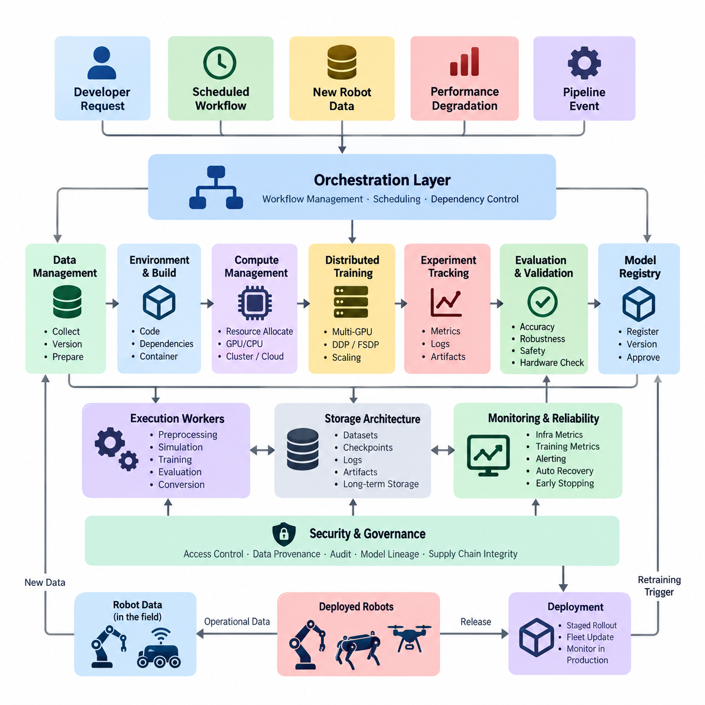
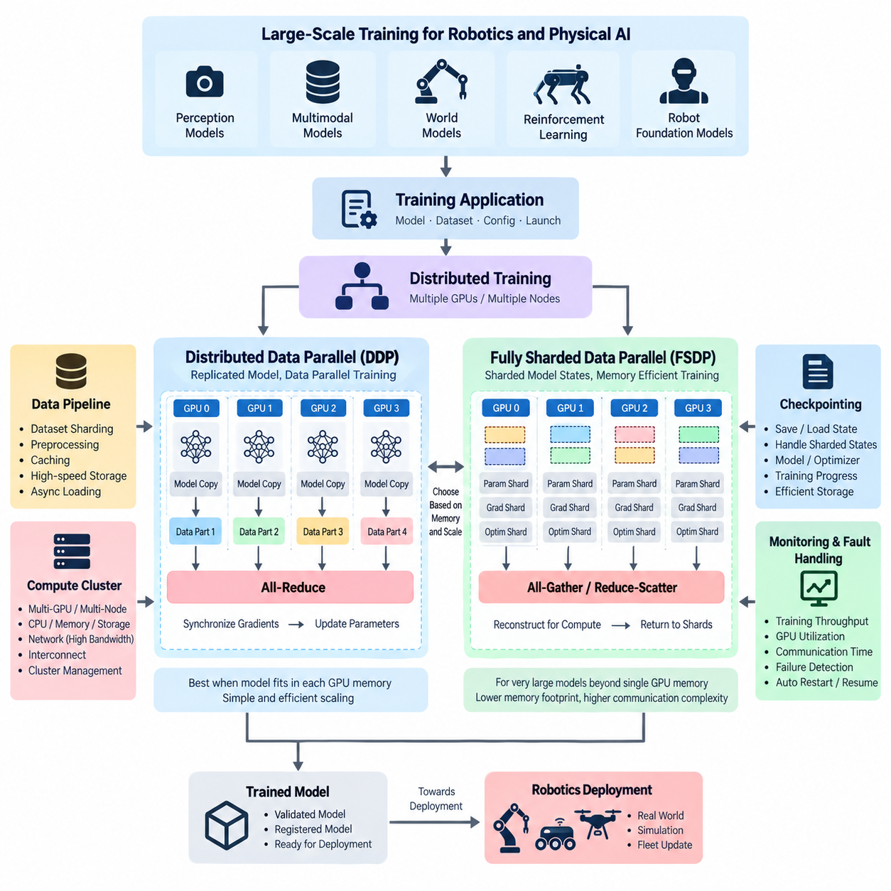
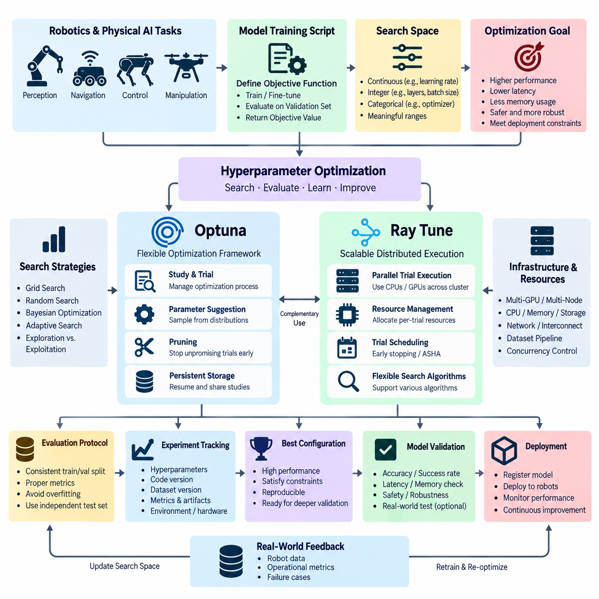
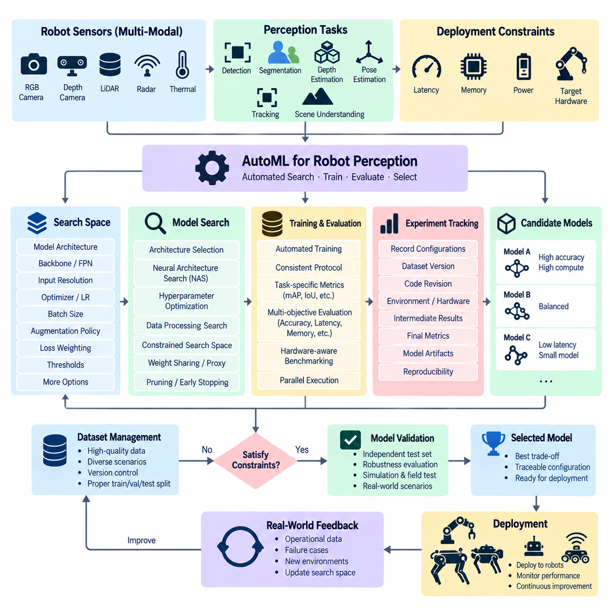
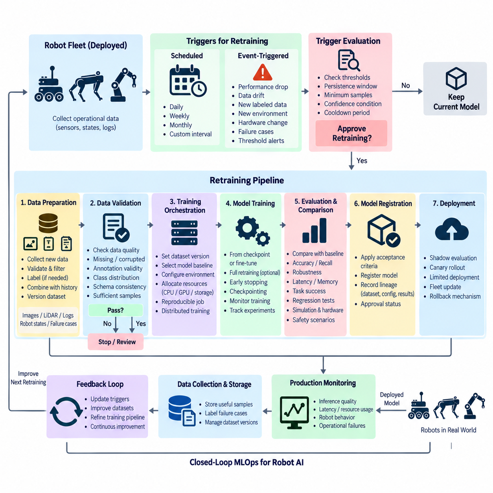
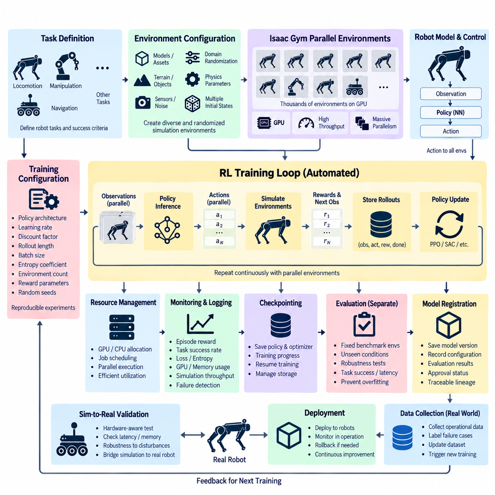
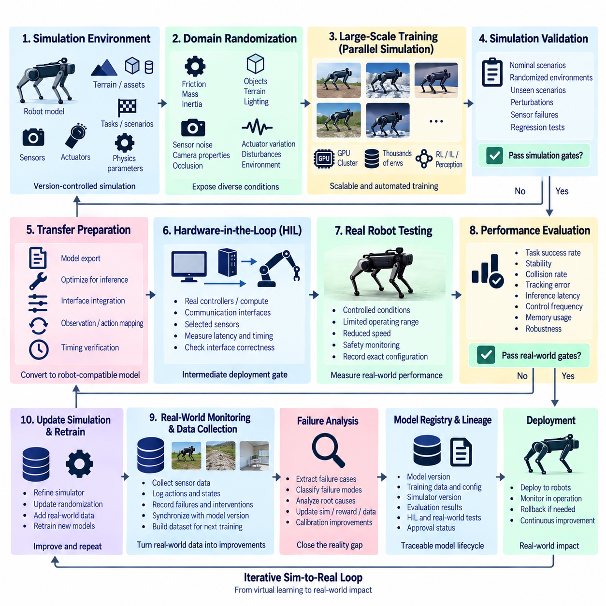
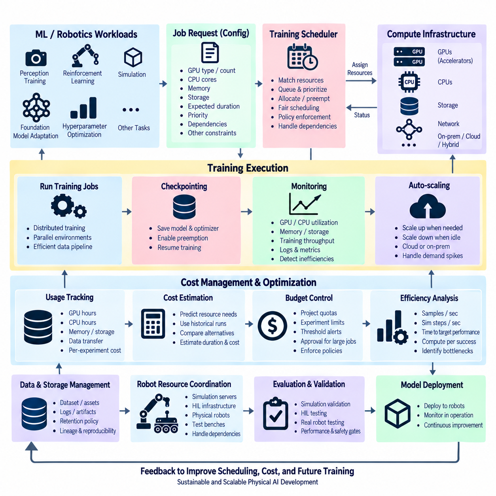
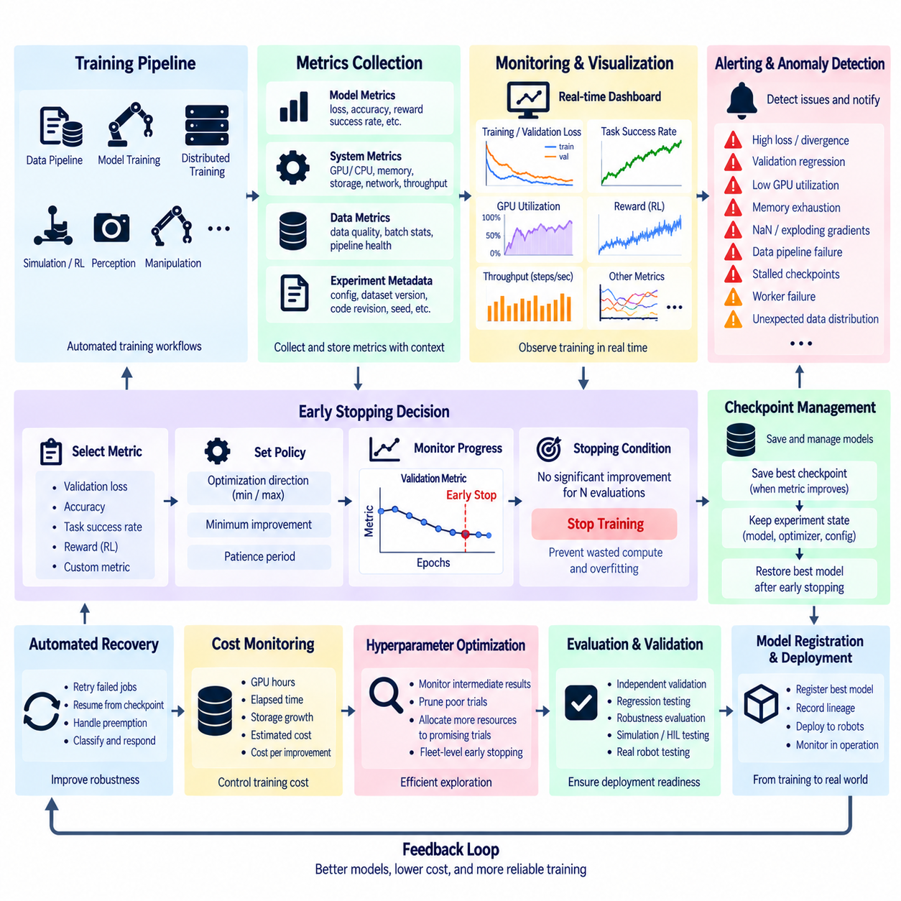
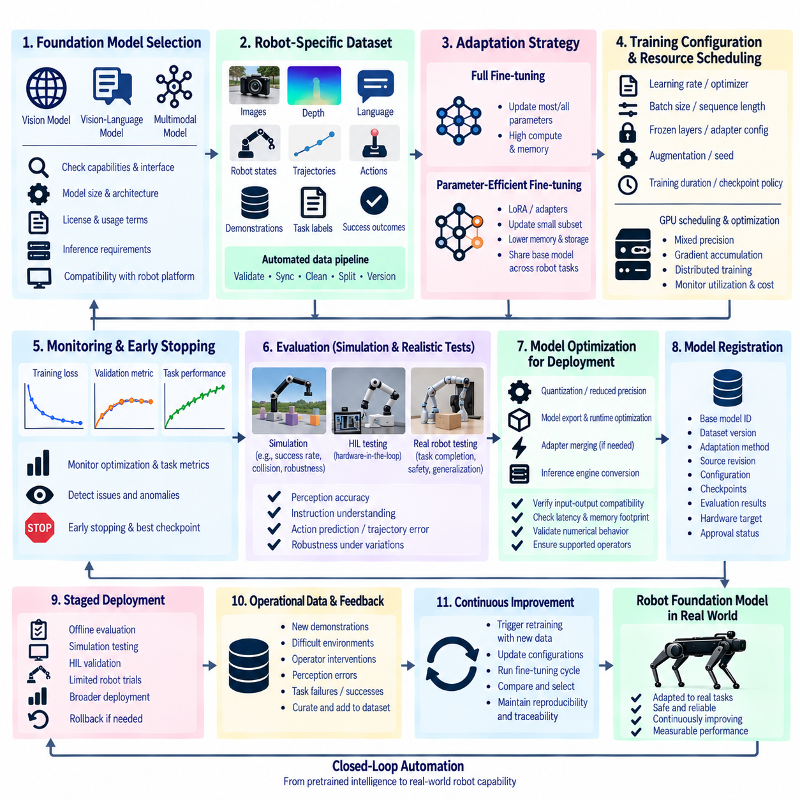

**Volume 10 Robot DevOps and MLOps**

# 9. Automated Training

## 9.1. Automated Training Infrastructure Overview

{width="7.268055555555556in" height="7.268055555555556in"}

자동화 학습 인프라(Automated Training Infrastructure)는 머신러닝 학습 워크플로(Machine Learning Training Workflow)를 최소한의 수동 개입으로 반복 실행하기 위해 필요한 계산 및 운영 기반을 제공한다. 로보틱스(Robotics)에서는 데이터셋(Dataset), 학습 코드(Training Code), 모델 구성(Model Configuration), 컴퓨팅 자원(Compute Resource), 실험 메타데이터(Experiment Metadata), 검증 절차(Validation Procedure), 결과 산출물(Artifact)을 하나의 재현 가능한 파이프라인(Reproducible Pipeline)으로 통합하여 관리해야 한다.

수동으로 실행하는 학습 스크립트(Training Script)와 달리 자동화 학습 인프라는 학습 자체를 하나의 관리 대상 시스템(Managed System)으로 취급한다. 학습 요청은 개발자(Developer), 예약된 워크플로(Scheduled Workflow), 새롭게 수집된 로봇 데이터(Robot Data), 모델 성능 저하(Model Performance Degradation), 또는 다른 파이프라인 이벤트(Pipeline Event)에서 발생할 수 있다. 인프라는 이러한 요청을 데이터 준비, 자원 할당, 실행, 평가, 산출물 등록, 배포 적격성 검증의 통제된 단계로 변환한다.

아키텍처(Architecture)는 일반적으로 오케스트레이션(Orchestration)과 실행(Execution)을 분리한다. 오케스트레이션 계층(Orchestration Layer)은 작업 간 의존성을 정의하고 각 단계가 언제 실행될지를 결정하며, 실행 워커(Execution Worker)는 전처리(Preprocessing), 시뮬레이션(Simulation), 학습(Training), 평가(Evaluation), 변환(Conversion) 작업을 수행한다. 이러한 분리를 통해 동일한 논리적 워크플로를 워크스테이션(Workstation), 온프레미스 GPU 클러스터(On-Premise GPU Cluster), 쿠버네티스(Kubernetes), 확장형 클라우드 컴퓨팅(Cloud Computing) 환경에서 전체 학습 절차를 다시 설계하지 않고 실행할 수 있다.

데이터 관리(Data Management)는 자동화 학습의 첫 번째 핵심 기반이다. 로봇 데이터셋(Robot Dataset)은 카메라 이미지(Camera Image), 라이다 포인트 클라우드(LiDAR Point Cloud), 레이더 측정값(Radar Measurement), 관성측정장치 신호(IMU Signal), 위치추정 정보(Localization Information), 제어 명령(Control Command), 의미론적 주석(Semantic Annotation), ROS2 백(ROS2 Bag), 시뮬레이션 궤적(Simulation Trajectory), 운영 메타데이터(Operational Metadata)를 포함할 수 있다. 학습 자동화는 모든 실험을 식별 가능한 데이터셋 버전(Dataset Version)과 연결하여 동일한 입력으로 모델을 재현할 수 있도록 해야 한다.

학습 환경(Training Environment) 역시 재현 가능해야 한다. 소스 코드 리비전(Source-Code Revision), 파이썬 패키지(Python Package), CUDA 라이브러리(CUDA Library), 딥러닝 프레임워크(Deep-Learning Framework), 전처리 구현(Preprocessing Implementation), 모델 정의(Model Definition), 시스템 의존성(System Dependency)은 모두 학습 결과에 영향을 줄 수 있다. 따라서 컨테이너(Container)와 불변 환경 명세(Immutable Environment Specification)를 이용해 학습 작업의 실행 경계를 정의하는 것이 중요하다. 성공적인 실험은 버전 관리된 코드, 구성, 데이터셋 참조, 환경 정보, 제어된 난수 시드(Random Seed)를 이용해 다시 구성할 수 있어야 한다.

컴퓨팅 관리(Compute Management)는 여러 로보틱스 팀이 고가의 GPU 자원을 공유할 때 특히 중요해진다. 자동화 인프라는 사용 가능한 CPU, GPU, 메모리(Memory), 스토리지(Storage), 가속기(Accelerator)의 성능과 상태를 파악하고 작업 요구사항에 따라 자원을 할당해야 한다. 소규모 인식 모델(Perception Model) 실험은 하나의 GPU로 수행할 수 있지만, 대규모 멀티모달 모델(Multimodal Model)이나 파운데이션 모델(Foundation Model)은 여러 GPU 또는 여러 노드(Node)를 요구할 수 있다. 자원 스케줄링(Resource Scheduling)은 실험 간 무분별한 자원 경쟁을 방지하고 제한된 하드웨어의 활용률을 향상시킨다.

분산 학습(Distributed Training)은 여러 가속기(Accelerator)에 계산을 분산함으로써 이러한 자원 계층을 확장한다. 데이터 병렬화(Data Parallelism)와 모델 샤딩(Model Sharding) 전략을 이용하면 단일 장치의 계산 성능이나 메모리 용량을 넘어서는 학습 작업을 수행할 수 있다. 따라서 자동화 학습 구조에서는 인프라 개요 이후 파이토치 DDP(PyTorch DDP)와 FSDP를 이용한 분산 학습, 하이퍼파라미터 최적화(Hyperparameter Optimization), 오토ML(AutoML), 재학습 자동화(Retraining Automation), 강화학습 자동화(Reinforcement Learning Automation), 시뮬레이션-현실 전이(Sim-to-Real) 파이프라인이 연속적으로 연결된다.

자동화를 위해서는 표준화된 구성 관리(Configuration Management)도 필요하다. 학습률(Learning Rate), 배치 크기(Batch Size), 옵티마이저(Optimizer), 모델 아키텍처(Model Architecture), 데이터 증강 정책(Augmentation Policy), 데이터셋 위치(Dataset Location), 체크포인트 주기(Checkpoint Frequency), 평가 임계값(Evaluation Threshold)은 소스 코드 내부에 숨겨두기보다 명시적인 구성으로 표현해야 한다. 이를 통해 하나의 파이프라인에서 구성 변경만으로 여러 통제된 학습을 생성하면서 각 모델 산출물과 이를 생성한 파라미터(Parameter)의 관계를 추적할 수 있다.

실험 추적(Experiment Tracking)은 실행 과정에서 이러한 추적 가능성(Traceability)을 제공한다. 각각의 학습 작업은 고유한 실행 식별자(Run Identity)를 생성하고 파라미터, 소스 리비전, 데이터셋 버전, 자원 정보, 학습 곡선(Training Curve), 평가 지표(Evaluation Metric), 로그(Log), 체크포인트(Checkpoint), 최종 산출물을 기록해야 한다. 이러한 정보는 단순한 GPU 작업 집합을 감사 가능한 엔지니어링 프로세스(Auditable Engineering Process)로 전환하며, 자동화 학습을 실험 추적, 데이터 버전 관리(Data Versioning), 모델 레지스트리(Model Registry), 파이프라인 오케스트레이션(Pipeline Orchestration), 검증 게이트(Validation Gate)와 연결한다.

스토리지 아키텍처(Storage Architecture)도 중요한 구성 요소이다. 로보틱스 학습은 대규모의 중간 및 최종 산출물을 생성할 수 있기 때문이다. 원시 센서 데이터셋(Raw Sensor Dataset), 변환된 데이터셋(Transformed Dataset), 캐시된 특징(Cached Feature), 체크포인트, 옵티마이저 상태(Optimizer State), 시뮬레이션 출력(Simulation Output), 로그, 학습된 모델은 소스 코드보다 훨씬 많은 저장 공간을 소비할 수 있다. 따라서 자동화 인프라에는 영구 스토리지(Persistent Storage), 임시 고속 스토리지(Temporary High-Speed Storage), 산출물 보존(Artifact Retention), 데이터셋 캐싱(Dataset Caching), 체크포인트 정리(Checkpoint Cleanup), 스토리지와 컴퓨팅 노드 간 데이터 전송 정책이 필요하다.

견고한 학습 파이프라인(Robust Training Pipeline)은 개별 작업이 실패할 수 있다는 것을 전제로 설계해야 한다. GPU 오류(GPU Error), 노드 장애(Node Failure), 메모리 부족(Out-of-Memory), 손상된 샘플(Corrupted Sample), 네트워크 중단(Network Interruption), 소프트웨어 결함(Software Defect)이 발생하더라도 전체 워크플로를 수동으로 다시 시작할 필요가 없어야 한다. 체크포인팅(Checkpointing)은 장시간 실행되는 작업을 중단 지점부터 재개할 수 있게 하며, 재시도 정책(Retry Policy)은 일시적인 장애에서 작업을 복구한다. 동시에 실패 정보는 운영자가 확인할 수 있도록 유지되어야 한다.

모니터링(Monitoring)은 인프라와 모델 학습의 두 수준에서 수행된다. 인프라 텔레메트리(Infrastructure Telemetry)는 GPU 사용률, GPU 메모리, CPU 부하, 시스템 메모리, 스토리지 처리량(Storage Throughput), 네트워크 트래픽(Network Traffic), 온도, 작업 대기열(Job Queue) 상태 등을 포함한다. 학습 텔레메트리(Training Telemetry)는 손실(Loss), 학습률, 검증 지표(Validation Metric), 수렴 동작(Convergence Behavior), 그래디언트 통계(Gradient Statistics), 체크포인트 진행 상태 등을 포함한다. 이러한 신호는 운영 진단뿐 아니라 조기 종료(Early Stopping)와 같은 자동화된 판단에도 활용된다.

자동화 학습은 생성된 모든 모델을 자동으로 승인한다는 의미가 아니다. 결과 모델은 배포(Deployment) 단계로 이동하기 전에 정의된 검증 게이트(Validation Gate)를 통과해야 한다. 로봇 응용 분야에 따라 인식 정확도(Perception Accuracy), 강건성(Robustness), 지연시간(Latency), 메모리 사용량(Memory Consumption), 안전 관련 시나리오(Safety-Related Scenario), 기존 모델 대비 회귀(Regression), 목표 엣지 하드웨어(Target Edge Hardware)와의 호환성을 평가할 수 있다. 따라서 학습 자동화는 엔지니어링 검토를 우회하는 것이 아니라 통제된 모델 배포의 상위 단계에 위치한다.

로보틱스는 유용한 학습 데이터가 실제 시스템(Physical System)과 시뮬레이션(Simulation) 모두에서 생성된다는 점에서 추가적인 복잡성을 가진다. 자동화 파이프라인은 로봇 플릿(Robot Fleet)에서 수집한 센서 데이터, 선별된 실패 사례(Curated Failure Case), 합성 장면(Synthetic Scene), 강화학습 궤적(Reinforcement-Learning Trajectory), 도메인 랜덤화 시뮬레이션 에피소드(Domain-Randomized Simulation Episode)를 결합할 수 있다. 따라서 자동화 학습에는 강화학습 자동화와 시뮬레이션-현실 전이 파이프라인이 포함되며, 시뮬레이션 및 디지털 트윈(Digital Twin)은 별도의 주요 소프트웨어 영역과 연계된다.

이벤트 기반 재학습(Event-Driven Retraining)은 배포된 로봇과 학습 인프라 사이의 폐루프(Closed Loop)를 완성한다. 운영 환경의 모니터링 시스템은 성능 저하, 익숙하지 않은 환경(Unfamiliar Environment), 새롭게 축적된 데이터를 감지하고 후보 학습 워크플로(Candidate Training Workflow)를 생성할 수 있다. 파이프라인은 데이터를 선택하고 모델을 재학습한 뒤 평가를 수행하며, 후보 모델을 기존 기준 모델(Baseline Model)과 비교하고 요구사항을 만족하는 산출물을 등록할 수 있다. 따라서 모델 모니터링(Model Monitoring)과 자동화 재학습(Automated Retraining)은 독립적인 활동이 아니라 서로 긴밀하게 연결된 운영 과정이다.

보안(Security)과 거버넌스(Governance)는 전체 인프라에 걸쳐 적용되어야 한다. 학습 서비스는 데이터셋, 저장소(Repository), GPU 클러스터, 레지스트리(Registry), 자격 증명(Credential), 모델 산출물에 대한 통제된 접근을 필요로 한다. 데이터셋 출처(Dataset Provenance), 소프트웨어 의존성, 구성 이력(Configuration History), 모델 계보(Model Lineage), 산출물 무결성(Artifact Integrity) 역시 추적 가능해야 한다. 이러한 통제는 학습된 모델이 실제 물리 시스템을 제어하는 경우 특히 중요하다. 잘못된 데이터셋이나 승인되지 않은 산출물이 학습 환경에서 실제 로봇 동작으로 전파될 수 있기 때문이다.

규모가 커질수록 자동화 학습은 머신러닝 문제인 동시에 자원 관리(Resource Management) 문제가 된다. 팀은 어떤 실험에 제한된 가속기 자원을 할당할 것인지, 작업을 얼마나 오래 실행할 것인지, 유휴 자원을 언제 회수할 것인지, 워크로드(Workload)를 로컬 인프라에서 실행할 것인지 외부 인프라에서 실행할 것인지를 결정해야 한다. 따라서 자원 스케줄링과 비용 관리(Cost Management)는 머신러닝 파이프라인 외부의 단순한 관리 업무가 아니라 자동화 학습 아키텍처 자체의 핵심 구성 요소이다.

궁극적인 목표는 로봇 데이터를 통제된 자동화를 통해 검증된 모델 개선으로 전환하는 폐루프형 재현 가능 엔지니어링 체계(Closed and Reproducible Engineering Loop)를 구축하는 것이다. 데이터 획득(Data Acquisition)은 버전 관리된 데이터셋으로 연결되고, 오케스트레이션은 재현 가능한 학습 환경을 실행하며, 스케줄러(Scheduler)는 컴퓨팅 자원을 할당한다. 모니터링은 실행 상태를 관찰하고, 검증은 결과가 요구사항을 만족하는지 판단하며, 레지스트리는 승인된 산출물을 보존한다. 이후 배포 시스템은 별도의 통제된 릴리스 메커니즘(Controlled Release Mechanism)을 통해 이러한 산출물을 사용할 수 있다.

피지컬 AI(Physical AI)와 고도화되는 로봇 시스템에서는 모델의 다양성, 데이터셋 규모, 시뮬레이션 규모, 계산 요구량이 수동 프로세스가 감당할 수 있는 속도보다 빠르게 증가하기 때문에 이러한 인프라가 필수적이다. 자동화 학습은 모델 개발 과정에서 엔지니어를 제거하는 것이 아니다. 반복적인 실행 과정을 인프라로 전환함으로써 엔지니어가 데이터 품질(Data Quality), 모델 아키텍처, 검증 기준, 실패 분석(Failure Analysis), 안전(Safety), 그리고 학습된 행동이 실제 로봇에 적합한지를 결정하는 핵심 설계 판단에 집중할 수 있도록 한다.

## 9.2. Distributed Training with PyTorch DDP and FSDP [w/Code]

{width="7.268055555555556in" height="7.268055555555556in"}

분산 학습(Distributed Training)은 로보틱스(Robotics)와 피지컬 AI(Physical AI) 모델이 여러 GPU 또는 컴퓨팅 노드(Compute Node)를 개별적인 가속기 자원으로 사용하는 대신 하나의 통합된 학습 시스템으로 활용할 수 있도록 한다. 데이터셋(Dataset), 신경망(Neural Network), 배치 요구량(Batch Requirement), 학습 시간이 단일 GPU의 실질적인 처리 능력을 초과할 때 특히 중요하다. 파이토치(PyTorch)는 이러한 워크로드를 확장하기 위한 주요 방식으로 분산 데이터 병렬화(Distributed Data Parallel, DDP)와 완전 샤딩 데이터 병렬화(Fully Sharded Data Parallel, FSDP)를 제공한다.

일반적으로 DDP라고 하는 분산 데이터 병렬화(Distributed Data Parallel)는 복제 모델 아키텍처(Replicated-Model Architecture)를 따른다. 참여하는 각 프로세스(Process)는 일반적으로 하나의 GPU를 사용하며 신경망 전체의 복사본을 유지한다. 학습 데이터는 프로세스별로 분할되므로 각 GPU가 전역 배치(Global Batch)의 서로 다른 부분에 대해 순전파(Forward Propagation)와 역전파(Backward Propagation)를 수행한다. 그래디언트(Gradient)가 계산되면 동기화 연산(Synchronization Operation)을 통해 이를 결합하여 모든 모델 복제본이 동일한 파라미터 업데이트(Parameter Update)를 적용하도록 한다.

일반적인 DDP 실행 환경은 분산 프로세스 그룹(Distributed Process Group)으로 구성된 여러 워커 프로세스(Worker Process)로 이루어진다. 각 워커에는 전체 학습 작업에서 자신의 위치를 식별하는 전역 랭크(Global Rank)와 해당 호스트에서 사용하는 가속기를 식별하는 로컬 랭크(Local Rank)가 할당된다. 월드 크기(World Size)는 참여하는 전체 프로세스 수를 나타낸다. 이러한 식별자를 통해 파이토치는 단일 노드 다중 GPU(Single-Node Multi-GPU)와 다중 노드(Multi-Node) 환경 모두에서 통신을 일관되게 조정할 수 있다.

데이터 분산(Data Distribution)은 매우 중요하다. 모든 워커가 동일한 입력 배치(Input Batch)를 처리하면 병렬 컴퓨팅(Parallel Computing) 자원을 낭비하게 되기 때문이다. 분산 샘플러(Distributed Sampler)는 의도된 샘플링 동작을 유지하면서 각 프로세스가 서로 다른 데이터 부분을 처리하도록 학습 데이터셋을 분할한다. 따라서 실질적인 전역 배치 크기(Global Batch Size)는 GPU당 배치 크기와 참여 워커 수에 따라 결정되며, 이는 학습률(Learning Rate), 수렴 동작(Convergence Behavior), 메모리 사용량(Memory Consumption), 학습 재현성(Training Reproducibility)에 영향을 줄 수 있다.

역전파 과정에서 DDP는 집합 통신 연산(Collective Communication Operation)을 이용하여 참여 워커 사이의 그래디언트를 동기화한다. 모든 그래디언트를 하나의 중앙 프로세스로 전송하는 대신 효율적인 구현에서는 일반적으로 올리듀스(All-Reduce) 통신을 이용하여 워커 전체의 그래디언트 정보를 집계한 후 각 복제본으로 전달한다. 네트워크 대역폭(Network Bandwidth), 모델 구조(Model Structure), 버킷 구성(Bucket Configuration)이 적절한 경우 그래디언트 통신과 역전파 계산을 중첩하여 동기화 오버헤드(Synchronization Overhead)를 줄일 수 있다.

DDP는 완전한 모델과 옵티마이저 상태(Optimizer State)가 각 GPU의 메모리에 충분히 들어가는 경우 특히 효과적이다. 가속기를 추가하면 사용 가능한 계산 처리량(Compute Throughput)은 증가하지만, 각 GPU가 전체 모델 복제본을 저장하는 데 필요한 메모리 자체가 근본적으로 감소하는 것은 아니다. 따라서 대규모 트랜스포머(Transformer), 멀티모달 모델(Multimodal Model), 월드 모델(World Model), 로봇 파운데이션 모델(Robot Foundation Model)은 클러스터 전체에 충분한 총 메모리가 존재하더라도 개별 GPU의 메모리 한계에 도달할 수 있다.

완전 샤딩 데이터 병렬화(Fully Sharded Data Parallel, FSDP)는 모든 GPU에 모델 관련 상태 전체를 지속적으로 복제하는 대신 여러 워커에 분산함으로써 이러한 한계를 해결한다. 파라미터(Parameter), 그래디언트(Gradient), 옵티마이저 상태(Optimizer State)를 분산 그룹 전체에 샤딩(Sharding)할 수 있어 각 가속기가 지속적으로 보유해야 하는 메모리 사용량을 크게 줄일 수 있다. 이를 통해 여러 GPU의 전체 메모리 용량을 결합하여 단일 장치의 메모리 용량을 초과하는 모델을 학습할 수 있다.

FSDP는 계산에 필요한 파라미터 데이터를 동적으로 재구성한 후 해당 상태를 다시 샤딩된 형태로 전환한다. 따라서 올개더(All-Gather)와 리듀스 스캐터(Reduce-Scatter) 같은 집합 통신이 실행 모델의 핵심 요소가 된다. 이러한 방식은 GPU당 메모리 요구량을 낮추는 대신 통신 복잡성을 증가시키므로 효율적인 실행을 위해 래핑 전략(Wrapping Strategy), 샤딩 구성(Sharding Configuration), 혼합 정밀도(Mixed Precision), 통신 토폴로지(Communication Topology)를 신중하게 결정해야 한다.

따라서 DDP와 FSDP의 선택은 실제 병목(Bottleneck)이 무엇인지에 따라 결정해야 한다. 모델의 메모리 요구량을 충분히 감당할 수 있고 주요 목표가 데이터 병렬 학습(Data-Parallel Training)의 속도를 높이는 것이라면 DDP가 비교적 직접적인 확장 아키텍처를 제공한다. 반대로 모델 파라미터, 그래디언트, 옵티마이저 상태가 가속기 메모리 한계에 접근하거나 이를 초과한다면 FSDP가 상태를 분산함으로써 더욱 효율적인 메모리 활용 전략을 제공하지만 구성과 통신 동작은 더욱 복잡해진다.

혼합 정밀도 학습(Mixed-Precision Training)은 선택된 연산을 낮은 정밀도의 수치 형식으로 수행하면서 수치 안정성(Numerical Stability)이 필요한 부분에는 높은 정밀도를 유지함으로써 두 방식 모두를 보완할 수 있다. 낮은 정밀도는 메모리 트래픽(Memory Traffic)과 텐서 저장 공간(Tensor Storage Requirement)을 줄이고 호환 가능한 하드웨어에서 가속기 처리량을 증가시킬 수 있다. 그러나 수치적 불안정성이 빠른 분산 실행에서 얻은 성능 이점을 무효화할 수 있으므로 손실 스케일링(Loss Scaling)과 정밀도 정책(Precision Policy)을 신중하게 관리해야 한다.

다중 노드 학습(Multi-Node Training)에서는 네트워크 인프라(Network Infrastructure)가 성능을 결정하는 중요한 요소로 추가된다. 하나의 서버 내부에서 이루어지는 GPU 간 통신은 서버 사이의 통신과 상당한 차이를 가질 수 있으므로 인터커넥트 토폴로지(Interconnect Topology), 네트워크 대역폭, 지연시간(Latency), 집합 통신 효율(Collective Communication Efficiency)에 따라 노드 추가가 실제 성능 향상으로 이어지는지가 결정된다. 따라서 학습 클러스터(Training Cluster)는 가속기, CPU 자원, 메모리, 스토리지(Storage), 네트워크, 통신 소프트웨어를 결합한 하나의 통합 시스템으로 평가해야 한다.

분산 학습은 데이터 파이프라인(Data Pipeline)에도 추가적인 부하를 발생시킨다. 여러 GPU가 스토리지 시스템의 데이터 공급 속도보다 빠르게 샘플을 소비하면 고가의 가속기가 입력을 기다리면서 유휴 상태가 될 수 있다. 따라서 데이터셋 샤딩(Dataset Sharding), 전처리 병렬화(Preprocessing Parallelism), 캐싱(Caching), 로컬 고속 스토리지(Local High-Speed Storage), 비동기 로딩(Asynchronous Loading), 적절한 워커 수 설정은 부수적인 데이터 엔지니어링 문제가 아니라 분산 학습 설계의 핵심 요소이다.

모델 상태가 분산되어 있으면 체크포인팅(Checkpointing)도 더욱 복잡해진다. DDP에서는 지정된 프로세스에서 일반적인 모델 상태를 저장할 수 있지만, FSDP에서는 샤딩된 상태 사전(Sharded State Dictionary)이나 재구성된 상태 사전(Reconstructed State Dictionary)을 명시적으로 처리해야 할 수 있다. 체크포인트는 불필요한 워커 간 중복을 피하면서 모델 파라미터, 옵티마이저 상태, 스케줄러 상태(Scheduler State), 학습 진행 상태, 관련 구성 정보를 보존하여 학습을 안정적으로 재개할 수 있어야 한다.

장애 처리(Fault Handling) 역시 중요하다. 분산 작업에는 장애가 발생할 수 있는 구성 요소가 더 많기 때문이다. 하나의 GPU 프로세스, 컴퓨팅 노드, 네트워크 연결, 스토리지 서비스 또는 동기화 연산의 장애가 전체 학습 그룹을 중단시킬 수 있다. 따라서 자동화 학습 인프라는 분산 로그(Distributed Log)를 수집하고 실패한 랭크를 식별하며 사용 가능한 체크포인트를 보존하고 중단된 프로세스를 정리해야 한다. 또한 엔지니어가 실패한 실험을 수동으로 다시 구성하지 않고 통제된 재시작(Restart) 또는 재개(Resume)를 수행할 수 있어야 한다.

성능 측정(Performance Measurement)은 단순히 GPU 개수를 세는 것이 아니라 확장 효율성(Scaling Efficiency)을 중심으로 이루어져야 한다. 주요 관찰 항목에는 학습 처리량(Training Throughput), 초당 처리 샘플 수(Samples per Second), 가속기 사용률(Accelerator Utilization), 통신 시간(Communication Time), 메모리 사용량, 동기화 오버헤드, 데이터 로딩 지연시간(Data-Loading Latency), 목표 모델 품질에 도달하는 데 필요한 시간이 포함된다. 서로 다른 월드 크기에서 이러한 값을 비교하면 추가 가속기가 실질적인 학습 가속을 제공하는지, 아니면 통신 및 인프라 오버헤드만 증가시키는지를 확인할 수 있다.

로보틱스 워크로드(Robotics Workload)에서 분산 학습은 대규모 인식 네트워크(Perception Network), 멀티모달 센서 모델(Multimodal Sensor Model), 월드 모델, 강화학습 정책(Reinforcement-Learning Policy), 그리고 이질적인 실제 및 시뮬레이션 데이터로 학습되는 로봇 파운데이션 모델을 지원할 수 있다. DDP는 데이터 병렬 실행에 자연스럽게 적합한 실험을 가속할 수 있으며, 트랜스포머 기반 피지컬 AI 아키텍처가 개별 가속기의 메모리 용량을 넘어서는 규모로 성장할수록 FSDP의 중요성은 더욱 커진다.

자동화 학습 인프라(Automated Training Infrastructure)에서 DDP와 FSDP는 독립적인 학습 기술이라기보다 선택 가능한 실행 전략(Execution Strategy)으로 구성되어야 한다. 오케스트레이션 계층(Orchestration Layer)은 데이터셋과 실행 환경을 준비하고, 스케줄러(Scheduler)는 GPU와 노드를 할당하며, 분산 워커(Distributed Worker)는 동기화된 최적화(Synchronized Optimization)를 수행한다. 모니터링은 성능과 장애를 관찰하고, 체크포인트 서비스(Checkpoint Service)는 상태를 보존하며, 검증 과정은 모델을 등록하거나 배포하기 전에 결과를 평가한다.

성숙한 분산 학습 시스템(Mature Distributed-Training System)은 병렬 계산(Parallel Computation)을 재현성(Reproducibility), 자원 스케줄링(Resource Scheduling), 스토리지 아키텍처(Storage Architecture), 관측 가능성(Observability), 장애 복구(Fault Recovery)와 결합한다. 성공적인 확장은 단순히 더 많은 GPU를 연결한다고 달성되는 것이 아니라 전체 파이프라인에서 계산, 메모리, 통신, 데이터 공급 사이의 균형을 맞추어야 한다. DDP는 복제 기반 데이터 병렬화(Replicated Data Parallelism)를 통해 계산 성능을 주로 확장하며, FSDP는 메모리 집약적인 모델 상태를 사용 가능한 가속기 전체에 분산함으로써 확장성을 더욱 높인다.

## 9.3. Hyperparameter Optimization Optuna Ray Tune [w/Code]

{width="7.268055555555556in" height="7.268055555555556in"}

하이퍼파라미터 최적화(Hyperparameter Optimization)는 수동으로 선택한 설정보다 더 나은 모델 성능을 생성하는 학습 구성을 체계적으로 탐색하는 과정이다. 로보틱스(Robotics)와 피지컬 AI(Physical AI)에서 중요한 하이퍼파라미터(Hyperparameter)에는 학습률(Learning Rate), 배치 크기(Batch Size), 옵티마이저 구성(Optimizer Configuration), 가중치 감쇠(Weight Decay), 네트워크 깊이(Network Depth), 데이터 증강 강도(Augmentation Strength), 스케줄러 파라미터(Scheduler Parameter), 강화학습 계수(Reinforcement-Learning Coefficient) 등이 포함될 수 있다. 자동화된 최적화는 이러한 선택을 측정 가능하고 반복 가능한 탐색 과정으로 전환한다.

하이퍼파라미터 최적화 워크플로(Hyperparameter Optimization Workflow)는 하나의 완전한 모델 학습 실험을 나타내는 목적 함수(Objective Function)를 정의하는 것에서 시작한다. 이 함수는 후보 구성(Candidate Configuration)을 입력받아 모델을 학습하거나 미세조정(Fine-Tuning)하고, 선택된 검증 지표(Validation Metric)를 이용하여 평가한 후 목적값(Objective Value)을 반환한다. 최적화 시스템은 서로 다른 구성으로 이 함수를 반복 실행함으로써 수동적인 직관에만 의존하지 않고 실험적 증거를 기반으로 탐색을 진행할 수 있다.

탐색 공간(Search Space)은 변경할 수 있는 파라미터와 각 파라미터가 가질 수 있는 값의 범위 또는 집합을 정의한다. 연속 변수(Continuous Variable)는 학습률이나 정규화 계수(Regularization Coefficient)를 표현할 수 있고, 정수 변수(Integer Variable)는 계층 수나 배치 크기를 제어할 수 있으며, 범주형 변수(Categorical Variable)는 옵티마이저, 아키텍처(Architecture), 데이터 증강 정책(Augmentation Policy)을 선택할 수 있다. 지나치게 넓은 탐색 공간은 유용할 가능성이 낮은 구성에 상당한 GPU 시간을 낭비할 수 있으므로 기술적으로 의미 있는 범위를 설정해야 한다.

전통적인 그리드 탐색(Grid Search)은 미리 정의된 조합을 체계적으로 평가하지만 하이퍼파라미터 수가 증가할수록 계산 비용이 빠르게 증가한다. 무작위 탐색(Random Search)은 구성을 더욱 유연하게 탐색하며 큰 공간을 보다 효율적으로 조사할 수 있다. 현대적인 최적화 프레임워크(Optimization Framework)는 이전 시행(Trial)의 관측 결과를 이용해 다음에 평가할 구성을 결정하는 적응형 탐색 알고리즘(Adaptive Search Algorithm)을 추가하여 계산 자원을 더욱 유망한 영역에 집중시킨다.

옵튜나(Optuna)는 자동화된 하이퍼파라미터 최적화를 위해 스터디(Study)와 시행(Trial) 추상화를 제공한다. 스터디는 전체 최적화 과정을 나타내며 각 시행은 특정 하이퍼파라미터 구성에 대한 하나의 평가를 의미한다. 시행 과정에서 정의된 분포로부터 파라미터가 제안되고 모델이 학습 및 평가되며, 결과 지표가 스터디에 전달된다. 이러한 구조를 통해 기존 파이토치(PyTorch) 학습 코드에 최적화 로직(Optimization Logic)을 비교적 쉽게 통합할 수 있다.

옵튜나의 중요한 기능 중 하나는 유망하지 않은 시행이 전체 학습 예산을 소비하기 전에 종료하는 프루닝(Pruning)이다. 학습 중간에 검증 지표를 보고하여 프루너(Pruner)가 현재 시행을 이전 결과와 비교할 수 있다. 해당 실험이 경쟁력 있는 결과를 얻을 가능성이 낮다고 판단되면 실행을 조기에 중단하고 계산 자원을 다른 후보에 재할당할 수 있다. 이는 개별 로보틱스 모델의 GPU 학습 주기가 긴 경우 특히 유용하다.

옵튜나 샘플러(Optuna Sampler)는 새로운 하이퍼파라미터 후보를 선택하는 방법을 결정한다. 최적화 전략에 따라 샘플링(Sampling)은 무작위 탐색에서 이전 관측 결과를 학습하는 알고리즘까지 다양하게 구성할 수 있다. 따라서 최적화기는 아직 탐색하지 않은 영역에 대한 탐색(Exploration)과 이미 유용한 성능을 보여준 구성의 활용(Exploitation) 사이에서 균형을 조정한다. 영구 스터디 스토리지(Persistent Study Storage)는 시행 이력을 보존하여 중단된 탐색을 재개하고 여러 워커(Worker)가 하나의 최적화 과정에 참여할 수 있도록 한다.

레이 튠(Ray Tune)은 분산 실험 실행(Distributed Experiment Execution)의 관점에서 하이퍼파라미터 최적화에 접근한다. 사용 가능한 CPU와 GPU에 여러 학습 시행을 배치하면서 각 시행에 할당되는 자원을 관리할 수 있다. 개발자는 독립적인 스크립트를 수동으로 실행하는 대신 학습 가능 워크로드(Trainable Workload), 파라미터 탐색 공간, 자원 요구사항(Resource Requirement), 탐색 알고리즘(Search Algorithm), 스케줄링 전략(Scheduling Strategy)을 정의하여 워크스테이션이나 컴퓨팅 클러스터(Compute Cluster)에서 실험을 동시에 실행할 수 있다.

GPU 자원이 제한된 환경에서는 시행 스케줄링(Trial Scheduling)이 특히 중요하다. 스케줄러(Scheduler)는 학습 중간 결과를 관찰하고 특정 시행을 계속 실행할지, 일시 중지할지, 종료할지를 결정할 수 있다. 비동기 연속 반감(Asynchronous Successive Halving)과 같은 조기 종료 전략(Early-Stopping Strategy)은 유망한 구성에 더 많은 학습 예산을 할당하면서 성능이 낮은 후보를 점진적으로 제거한다. 이를 통해 하이퍼파라미터 최적화를 모든 후보에 대한 전체 학습에서 계산 자원의 적응형 할당(Adaptive Resource Allocation) 과정으로 전환할 수 있다.

옵튜나와 레이 튠은 서로 중첩되면서도 상호 보완적인 최적화 기능을 제공한다. 옵튜나는 최적화 스터디의 유연한 정의, 파라미터 제안(Parameter Suggestion), 샘플링, 프루닝, 실험 이력 관리에 중점을 두며, 레이 튠은 확장 가능한 실행(Scalable Execution), 스케줄링, 자원 인식 병렬 시행(Resource-Aware Parallel Trial)에 중점을 둔다. 학습 아키텍처에 따라 각각 독립적으로 사용할 수도 있으며, 많은 수의 실험을 평가해야 하는 경우 최적화 로직과 분산 실행 인프라를 결합할 수도 있다.

병렬 최적화(Parallel Optimization)는 탐색 속도와 자원 효율성(Resource Efficiency) 사이에 중요한 절충 관계를 만든다. 많은 시행을 동시에 실행하면 전체 탐색에 필요한 실제 시간을 줄일 수 있지만 각 시행은 상당한 GPU 메모리, CPU 전처리 능력, 스토리지 대역폭(Storage Bandwidth), 데이터셋 접근 자원을 요구할 수 있다. 따라서 자동화 인프라는 시스템 병목을 고려하지 않고 가능한 최대 프로세스를 실행하는 대신 시행별 자원을 정의하고 실제 클러스터 용량에 맞게 동시 실행 수(Concurrency)를 제한해야 한다.

하이퍼파라미터 최적화에서도 실험 재현성(Experimental Reproducibility)을 유지해야 한다. 각 시행은 하이퍼파라미터, 데이터셋 버전(Dataset Version), 소스 코드 리비전(Source-Code Revision), 난수 시드(Random Seed), 실행 환경(Environment), 하드웨어 할당(Hardware Allocation), 중간 지표(Intermediate Metric), 최종 지표(Final Metric), 생성된 모델 산출물(Model Artifact)을 기록해야 한다. 이러한 메타데이터가 없다면 우수한 구성을 발견하더라도 결과를 재현하거나 어떤 변경이 성능 향상을 발생시켰는지 판단하기 어렵다.

로보틱스 최적화(Robotics Optimization)는 하나의 정확도 지표가 아니라 여러 목적을 동시에 고려해야 하는 경우가 많다. 인식 모델(Perception Model)은 높은 탐지 정확도(Detection Accuracy)를 제공하면서 엣지 컴퓨터(Edge Computer)의 지연시간과 메모리 한계를 만족해야 할 수 있다. 내비게이션(Navigation)이나 제어 모델(Control Model)은 작업 성공률뿐 아니라 안전성(Safety), 부드러운 동작(Smoothness), 계산 제약(Computational Constraint)을 충족해야 한다. 다목적 최적화(Multi-Objective Optimization)는 가장 높은 오프라인 정확도를 가진 모델이 자동으로 가장 적합한 로봇 모델이라고 가정하는 대신 이러한 기준 사이의 절충 관계를 드러낼 수 있다.

최적화 과정이 측정 절차의 약점을 이용하지 않도록 모든 시행에서 평가 프로토콜(Evaluation Protocol)을 일관되게 유지해야 한다. 학습 데이터와 검증 데이터는 적절하게 분리되어야 하며 전처리(Preprocessing)를 통제하고 평가 지표가 실제 목표 로봇 작업을 반영하도록 해야 한다. 동일한 검증 데이터를 이용하여 반복적으로 구성을 선택하면 최적화 과정 자체가 해당 데이터에 과적합(Overfitting)될 수 있으므로 배포 결정을 내리기 전에 독립적인 테스트 데이터(Independent Test Data) 또는 최종 검증 절차(Final Validation Procedure)를 사용하는 것이 중요하다.

강화학습(Reinforcement Learning)에서는 성능이 확률적 환경 상호작용(Stochastic Environment Interaction)에 의존하고 난수 시드에 따라 크게 달라질 수 있기 때문에 하이퍼파라미터 최적화의 비용이 더욱 증가할 수 있다. 학습률, 할인율(Discount Factor), 롤아웃 길이(Rollout Length), 엔트로피 계수(Entropy Coefficient), 보상 파라미터(Reward Parameter), 네트워크 크기(Network Size), 시뮬레이션 병렬성(Simulation Parallelism)은 서로 강하게 상호작용할 수 있다. 따라서 신뢰할 수 있는 최적화를 위해서는 하나의 우연히 성공적인 학습 결과에 의존하기보다 반복 평가, 집계 통계(Aggregated Statistics), 신중하게 정의된 종료 규칙(Stopping Rule)이 필요할 수 있다.

피지컬 AI 파이프라인(Physical AI Pipeline)에서는 최적화 범위를 일반적인 학습 파라미터에서 시스템 수준의 설계 선택(System-Level Design Choice)까지 확장할 수 있다. 후보 구성은 센서 전처리(Sensor Preprocessing), 멀티모달 융합 설정(Multimodal Fusion Setting), 시뮬레이션 랜덤화(Simulation Randomization), 모델 크기(Model Size), 정밀도(Precision), 시퀀스 길이(Sequence Length), 학습 데이터 혼합(Training-Data Mixture)을 변경할 수 있다. 따라서 목적 함수는 모델 품질뿐 아니라 추론 지연시간(Inference Latency), GPU 메모리 사용량, 에너지 제약(Energy Constraint), 목표 로봇 하드웨어(Target Robot Hardware)와의 호환성과 같은 배포 요구사항도 포함할 수 있다.

하이퍼파라미터 최적화는 독립적인 실험 도구로 동작하기보다 전체 자동화 학습 인프라(Automated Training Infrastructure)에 통합되어야 한다. 오케스트레이션 계층(Orchestration Layer)은 최적화 작업을 생성하고, 스케줄러는 컴퓨팅 자원을 할당하며, 옵튜나 또는 레이 튠은 후보 시행을 관리한다. 분산 학습(Distributed Training)은 계산 비용이 높은 구성을 실행하고, 실험 추적(Experiment Tracking)은 결과를 기록하며, 모델 검증(Model Validation)은 최적 후보가 엔지니어링 요구사항을 만족하는지 확인한 후 모델 등록(Model Registration)을 수행하도록 한다.

성숙한 최적화 파이프라인(Mature Optimization Pipeline)은 모델 튜닝(Model Tuning)을 통제된 탐색 및 검증 루프(Search-and-Validation Loop)로 전환한다. 후보 구성이 생성되고 자원이 할당되며 시행이 실행되고, 중간 지표를 이용하여 프루닝이나 조기 종료를 수행한다. 결과는 다시 탐색 전략을 갱신하며 유망한 모델은 더욱 심층적인 검증을 거친다. 궁극적인 목표는 단순히 수치적으로 가장 높은 결과를 보인 시행을 찾는 것이 아니라 모델 품질(Model Quality), 계산 비용(Computational Cost), 강건성(Robustness), 실제 배포 제약(Real-World Deployment Constraint)의 균형을 만족하는 재현 가능한 구성을 효율적으로 식별하는 것이다.

## 9.4. AutoML for Robot Perception Model Selection [w/Code]

{width="7.268055555555556in" height="7.268055555555556in"}

자동화 머신러닝(Automated Machine Learning, AutoML)은 모델 설계(Model Design), 학습(Training), 평가(Evaluation), 선택(Selection)에 체계적인 자동화를 적용하는 방법이다. 로봇 인식(Robot Perception)에서 그 목적은 단순히 가장 높은 오프라인 정확도(Offline Accuracy)를 가진 모델을 찾는 것이 아니라, 인식 품질(Perception Quality), 추론 지연시간(Inference Latency), 메모리 사용량(Memory Consumption), 계산 비용(Computational Cost), 강건성(Robustness), 목표 하드웨어(Target Hardware) 제약을 동시에 만족하는 아키텍처와 학습 구성을 식별하는 것이다.

로봇 인식은 센싱 파이프라인(Sensing Pipeline)이 RGB 카메라(RGB Camera), 깊이 카메라(Depth Camera), 라이다(LiDAR), 레이더(Radar), 열화상 센서(Thermal Sensor), 멀티모달 입력(Multimodal Input)을 결합할 수 있기 때문에 특히 까다로운 모델 선택 문제를 만든다. 후보 모델은 객체 탐지(Object Detection), 의미론적 분할(Semantic Segmentation), 인스턴스 분할(Instance Segmentation), 깊이 추정(Depth Estimation), 자세 추정(Pose Estimation), 추적(Tracking), 장면 이해(Scene Understanding)를 수행할 수 있으며, 각 작업은 서로 다른 아키텍처, 입력 해상도, 전처리 요구사항, 손실 함수(Loss Function), 평가 지표(Evaluation Metric)를 요구한다.

전통적인 개발 과정에서는 엔지니어가 익숙한 여러 아키텍처를 수동으로 선택하고 하이퍼파라미터(Hyperparameter)를 반복적으로 수정하는 방식으로 시작하는 경우가 많다. AutoML은 이러한 과정을 구조화된 탐색 문제(Structured Search Problem)로 전환한다. 시스템은 후보 모델 계열(Candidate Model Family), 학습 구성, 데이터 처리 대안(Data-Processing Alternative), 배포 제약(Deployment Constraint)을 정의한 후 일관된 평가 프로토콜(Evaluation Protocol)에 따라 비교 가능한 실험을 자동으로 실행하고 그 결과를 기록한다.

탐색 공간(Search Space)에는 모델 아키텍처(Model Architecture), 백본 네트워크(Backbone Network), 특징 피라미드 구성(Feature-Pyramid Configuration), 입력 해상도(Input Resolution), 배치 크기(Batch Size), 옵티마이저(Optimizer), 학습률(Learning Rate), 데이터 증강 정책(Augmentation Policy), 손실 가중치(Loss Weighting), 신뢰도 임계값(Confidence Threshold)이 포함될 수 있다. 더욱 발전된 탐색에서는 네트워크 깊이(Network Depth), 채널 폭(Channel Width), 어텐션 메커니즘(Attention Mechanism), 융합 전략(Fusion Strategy), 사전학습 초기화(Pretrained Initialization)까지 변경할 수 있다. 무제한적인 조합은 유효하지 않거나 불필요하게 비싼 실험을 생성할 수 있으므로 탐색 공간은 기술적으로 의미 있는 범위로 제한해야 한다.

아키텍처 선택(Architecture Selection)은 신경망 구조 자체가 하나의 변수가 된다는 점에서 일반적인 하이퍼파라미터 최적화(Hyperparameter Optimization)와 다르다. 후보 인식 모델은 표현 능력(Representation Capacity)과 계산 효율성(Computational Efficiency) 사이에서 서로 다른 절충 관계를 제공할 수 있다. 대규모 아키텍처는 어려운 인식 작업의 성능을 향상시킬 수 있지만 지연시간과 메모리 사용량이 증가하며, 경량 아키텍처(Compact Architecture)는 로봇 엣지 컴퓨터(Robot Edge Computer)에서 효율적으로 실행될 수 있지만 복잡한 환경 조건에서는 정확도가 감소할 수 있다.

신경망 아키텍처 탐색(Neural Architecture Search, NAS)은 아키텍처 대안을 자동으로 탐색함으로써 AutoML을 더욱 확장한다. 완성된 사전 정의 네트워크만 선택하는 대신 NAS는 블록(Block), 계층(Layer), 연산(Operation), 연결 패턴(Connectivity Pattern), 스케일링 파라미터(Scaling Parameter)의 조합을 탐색할 수 있다. 그러나 모든 후보 아키텍처를 처음부터 학습하는 것은 매우 많은 계산 비용을 요구하므로 실제 시스템에서는 제한된 탐색 공간, 가중치 공유(Weight Sharing), 프록시 작업(Proxy Task), 부분 학습(Partial Training), 성능 예측기(Performance Predictor)를 이용하여 탐색 비용을 줄일 수 있다.

데이터 처리(Data Processing) 역시 로봇 인식 AutoML의 중요한 탐색 차원이다. 이미지 크기 조정(Image Resizing), 자르기(Cropping), 정규화(Normalization), 기하학적 변환(Geometric Transformation), 색상 증강(Color Augmentation), 합성 손상(Synthetic Corruption), 포인트 클라우드 샘플링(Point-Cloud Sampling), 센서별 전처리(Sensor-Specific Preprocessing)는 모델 동작에 큰 영향을 줄 수 있다. 자동화 탐색은 선택된 데이터 증강 및 전처리 정책을 모델 구성과 함께 평가하여 아키텍처만 독립적으로 최적화하는 대신 강건성을 향상시키는 조합을 발견할 수 있다.

평가 지표(Evaluation Metric)는 실제 인식 작업을 반영해야 한다. 객체 탐지에서는 정밀도(Precision), 재현율(Recall), 평균 정밀도(mean Average Precision)를 사용할 수 있으며, 분할 작업에서는 교집합 대비 합집합(Intersection over Union)과 클래스별 지표(Class-Specific Metric)를 사용할 수 있다. 추적, 자세 추정, 깊이 예측, 멀티모달 인식에는 각각 다른 측정 기준이 필요하다. 따라서 AutoML은 후보 모델을 목표 로봇 기능을 나타내는 지표로 비교할 수 있도록 명확하게 정의된 평가 프로토콜에 의존한다.

로보틱스에서는 정확도만으로 충분하지 않은 경우가 많다. 후보 모델은 배포 시스템(Deployed System)의 시간 및 자원 한계 내에서 실행되어야 한다. 따라서 AutoML은 추론 지연시간, 처리량(Throughput), GPU 또는 가속기 메모리(Accelerator Memory), 모델 크기(Model Size), 계산 복잡도(Computational Complexity)를 최적화 목표 또는 강제 제약(Hard Constraint)으로 취급할 수 있다. 검증 정확도가 조금 더 높은 모델이라도 목표 로봇에서 요구되는 인식 주기(Perception Frequency)를 유지할 수 없다면 선택에서 제외될 수 있다.

하드웨어 인식 AutoML(Hardware-Aware AutoML)은 배포 플랫폼(Deployment Platform)의 특성을 모델 선택 과정에 직접 반영한다. 학습용 GPU에서 측정된 성능이 엣지 가속기(Edge Accelerator)의 동작을 반드시 예측하는 것은 아니다. 따라서 후보 모델은 실행 프레임워크(Execution Framework), 수치 정밀도(Numerical Precision), 메모리 제한(Memory Limitation), 지원 연산자(Supported Operator)를 포함한 목표 하드웨어 환경을 기준으로 벤치마킹(Benchmarking)하거나 성능을 추정해야 한다. 이를 통해 모델 선택은 순수한 알고리즘 탐색이 아니라 하드웨어-소프트웨어 공동 최적화(Hardware-Software Co-Optimization) 문제가 된다.

다목적 최적화(Multi-Objective Optimization)는 인식 모델 선택에서 서로 경쟁하는 요구사항이 존재하기 때문에 이러한 환경에 적합하다. 모델 복잡도가 증가하면 정확도가 향상될 수 있지만 지연시간, 메모리 사용량, 에너지 소비(Energy Consumption)는 악화될 수 있다. 모든 요구사항을 하나의 임의적인 점수로 축소하는 대신 AutoML은 여러 목적을 유지하면서 유용한 절충 관계를 나타내는 구성을 식별할 수 있으며, 이후 엔지니어링 제약(Engineering Constraint)을 기준으로 어떤 후보를 심층 검증할지 결정할 수 있다.

AutoML 실험은 많은 후보 모델을 학습하고 평가해야 할 수 있으므로 상당한 계산 자원(Computational Resource)을 요구한다. 병렬 시행 실행(Parallel Trial Execution)은 여러 GPU 또는 컴퓨팅 노드에 실험을 분산할 수 있으며, 자원 인식 스케줄링(Resource-Aware Scheduling)은 각 시행에 할당되는 CPU, GPU, 메모리, 스토리지를 제한한다. 조기 종료(Early Stopping)와 프루닝(Pruning)을 이용하면 성능이 낮은 후보를 전체 학습이 완료되기 전에 종료하여 사용 가능한 계산 예산(Compute Budget)을 더 유망한 구성에 집중할 수 있다.

자동화된 탐색에서도 재현성(Reproducibility)을 유지해야 한다. 각 후보는 아키텍처 정의(Architecture Definition), 하이퍼파라미터, 데이터셋 버전(Dataset Version), 전처리 구성(Preprocessing Configuration), 데이터 증강 정책, 소스 코드 리비전(Source-Code Revision), 학습 환경(Training Environment), 난수 시드(Random Seed), 하드웨어 할당(Hardware Allocation), 평가 결과를 보존해야 한다. 실험 추적(Experiment Tracking)은 수많은 개별 시행을 검색 가능한 엔지니어링 기록(Engineering Record)으로 변환하며 선택된 인식 모델을 생성한 구성을 다시 재현할 수 있도록 한다.

모델 선택이 자동화되어도 데이터셋 품질(Dataset Quality)은 여전히 매우 중요하다. AutoML은 체계적으로 잘못된 주석(Incorrect Annotation), 누락된 운영 시나리오(Missing Operational Scenario), 심각한 클래스 불균형(Class Imbalance), 실제 배포 조건을 대표하지 못하는 검증 데이터의 문제를 보상할 수 없다. 따라서 로봇 인식 데이터셋은 목표 운영 도메인(Operating Domain)에 따라 관련 조명, 날씨, 시점(Viewpoint), 움직임, 객체 크기(Object Scale), 가림(Occlusion), 센서 노이즈(Sensor Noise), 지형(Terrain), 환경 변화(Environmental Variation)를 포함해야 한다.

많은 후보 구성을 동일한 검증 세트(Validation Set)에 반복적으로 비교하면 AutoML 수준에서도 과적합(Overfitting)이 발생할 수 있다. 최적화 시스템은 실제 운용 환경으로 일반화되는 모델보다 특정 검증 데이터의 특성에 맞는 모델을 선택하게 될 수 있다. 따라서 최종 모델 적격성 평가(Model Qualification)를 위해 독립적인 테스트 세트(Independent Test Set), 시나리오 기반 검증(Scenario-Based Validation), 시뮬레이션 평가(Simulation Evaluation), 현장 시험(Field Testing)을 주요 탐색 루프의 외부 또는 후속 단계에 유지해야 한다.

물리 시스템(Physical System)에서는 강건성 평가(Robustness Evaluation)가 특히 중요하다. 인식 모델은 정상적인 데이터셋에서는 우수한 성능을 보이면서도 모션 블러(Motion Blur), 저조도(Low Illumination), 센서 오염(Sensor Contamination), 비정상적인 날씨, 부분 가림(Partial Occlusion), 이전에 경험하지 못한 환경에서 실패할 수 있다. AutoML 파이프라인은 후보 평가 과정에 강건성 테스트(Robustness Test)를 포함하여 명목 정확도(Nominal Accuracy)가 모델 선택을 지배하지 않도록 하고 취약한 모델을 배포 전에 제거할 수 있다.

AutoML은 궁극적으로 전체 자동화 학습 인프라(Automated Training Infrastructure)와 통합되어야 한다. 데이터셋 관리(Dataset Management)는 버전이 관리되는 인식 데이터를 공급하고, 오케스트레이션(Orchestration)은 탐색 작업을 실행하며, 자원 스케줄러(Resource Scheduler)는 가속기를 할당한다. 분산 학습(Distributed Training)은 계산 비용이 높은 후보를 실행하고, 최적화 프레임워크(Optimization Framework)는 시행을 관리하며, 실험 추적은 결과를 보존하고, 검증 게이트(Validation Gate)는 선택된 모델이 AI 성능과 로봇 시스템 요구사항을 모두 만족하는지 판단한다.

따라서 AutoML의 최종 결과는 단순히 가장 높은 지표값을 가진 모델이 아니다. 최종 결과는 아키텍처, 학습 구성, 데이터 계보(Data Lineage), 성능 특성(Performance Characteristic), 배포 요구사항(Deployment Requirement)을 추적할 수 있는 후보 모델이다. 로봇 인식에서 성공적인 자동 모델 선택(Automated Model Selection)은 머신러닝 탐색(Machine-Learning Search)을 하드웨어 인식 평가, 강건성 검증, 운영 제약(Operational Constraint)과 연결함으로써 인식 데이터에서 실제 배포 가능한 피지컬 AI 모델(Deployable Physical AI Model)로 이어지는 반복 가능한 경로를 구축한다.

## 9.5. Scheduled and Event Triggered Retraining Pipeline [w/Code]

{width="7.268055555555556in" height="7.268055555555556in"}

예약 및 이벤트 트리거 기반 재학습 파이프라인(Scheduled and Event-Triggered Retraining Pipeline)은 로봇 데이터, 환경, 운영 요구사항이 변화함에 따라 머신러닝 모델을 업데이트하는 과정을 자동화한다. 엔지니어가 모든 모델의 재학습 시점을 수동으로 결정하는 대신, 파이프라인은 통제된 학습 워크플로를 시작하는 명시적인 트리거(Trigger)를 정의한다. 이러한 트리거는 시간 일정에 따라 동작하거나 배포된 로봇 시스템에서 감지된 변화에 따라 동작할 수 있다.

예약 재학습(Scheduled Retraining)은 일별, 주별, 월별 또는 운영 환경에 적합한 다른 주기와 같이 사전에 정의된 시간 간격에 따라 실행된다. 이 방식은 로봇 플릿(Robot Fleet)이 새로운 센서 관측 데이터를 지속적으로 축적하고 데이터 분포(Data Distribution)가 점진적으로 변화할 것으로 예상되는 경우 유용하다. 스케줄러(Scheduler)는 정의된 시간에 워크플로를 시작하여 모델 업데이트가 정상적인 MLOps 수명주기(MLOps Lifecycle)의 예측 가능한 과정이 되도록 한다.

재학습 빈도(Retraining Frequency)는 유용한 데이터가 얼마나 빠르게 축적되는지와 학습 과정에 얼마나 많은 비용이 필요한지를 반영해야 한다. 지나치게 빈번한 재학습은 의미 있는 모델 개선 없이 GPU 자원을 소비할 수 있으며, 반대로 주기가 지나치게 길면 배포된 모델이 변화하는 운영 조건을 충분히 반영하지 못할 수 있다. 따라서 스케줄링(Scheduling)은 임의의 시간 간격을 선택하는 것이 아니라 모델 최신성(Model Freshness), 데이터셋 증가, 계산 비용, 검증 작업, 배포 위험 사이의 균형을 고려해야 한다.

이벤트 트리거 기반 재학습(Event-Triggered Retraining)은 모니터링(Monitoring), 데이터 또는 운영 시스템에서 감지된 조건에 대응한다. 대표적인 이벤트에는 모델 성능 저하(Model-Performance Degradation), 심각한 데이터 드리프트(Data Drift), 개념 드리프트(Concept Drift), 충분한 신규 샘플 축적, 새롭게 라벨링된 실패 사례(Failure Case), 새로운 운영 환경으로의 확장, 로봇 하드웨어 변경 등이 포함될 수 있다. 이벤트는 배포 모델을 자동으로 교체하는 신호가 아니라 새로운 학습 주기를 시작할 필요가 있는지를 평가하기 위한 신호가 된다.

트리거 계층(Trigger Layer)은 이벤트 감지(Event Detection)와 재학습 승인(Retraining Authorization)을 구분해야 한다. 입력 데이터의 일시적인 변화나 작은 지표 변동이 반드시 비용이 높은 학습 작업을 시작해야 하는 것은 아니다. 따라서 트리거 로직(Trigger Logic)은 임계값(Threshold), 지속 시간 구간(Persistence Window), 최소 샘플 수(Minimum Sample Count), 신뢰 조건(Confidence Condition), 쿨다운 기간(Cooldown Period)을 이용하여 관찰된 이벤트가 충분히 의미 있는지 판단할 수 있다. 이를 통해 불안정한 운영 신호가 반복적이고 불필요한 재학습을 발생시키는 것을 방지할 수 있다.

재학습 요청이 승인되면 데이터 준비(Data Preparation)가 시작된다. 새롭게 수집된 로봇 데이터는 식별, 검증, 필터링되어야 하며 필요한 경우 라벨링(Labeling)을 수행하고 기존 학습 데이터셋과 연결해야 한다. 카메라 이미지(Camera Image), 라이다 포인트 클라우드(LiDAR Point Cloud), 센서 융합 기록(Sensor Fusion Record), ROS2 백(ROS2 Bag), 로봇 상태(Robot State), 궤적(Trajectory), 운영자 개입(Operator Intervention), 실패 사례 등이 새로운 데이터셋에 포함될 수 있다. 학습 실행에 사용된 데이터셋 버전(Dataset Version)은 변경되지 않고 추적 가능하게 유지되어야 한다.

재학습 데이터셋(Retraining Dataset)은 단순히 과거 데이터를 최신 관측 데이터로 교체해서는 안 된다. 최근 샘플은 전체 운영 환경 중 좁은 일부만 나타낼 수 있으며, 업데이트된 모델이 이전 환경에서 학습한 능력을 잃게 만들 수 있다. 따라서 데이터셋 구성은 새로운 운영 데이터와 대표적인 과거 샘플(Historical Sample), 어려운 사례(Difficult Case), 안전 중요 시나리오(Safety-Critical Scenario), 선별된 참조 데이터(Curated Reference Data)를 결합하여 목표 운영 도메인(Operational Domain) 전반에서 성능을 유지하도록 해야 한다.

학습을 시작하기 전에 파이프라인은 데이터 품질(Data Quality)과 학습 적격성(Training Eligibility)을 모두 검증해야 한다. 자동화 검사는 누락된 파일, 손상된 센서 기록, 잘못된 주석(Invalid Annotation), 예상하지 못한 클래스 분포(Class Distribution), 스키마 변경(Schema Change), 불충분한 샘플 수를 탐지할 수 있다. 데이터셋이 이러한 검증 게이트(Validation Gate)를 통과하지 못하면 신뢰할 수 없는 실험에 계산 자원을 소비하지 않도록 재학습 워크플로를 중단하거나 검토 상태(Review State)로 전환해야 한다.

데이터 검증에 성공하면 오케스트레이션 시스템(Orchestration System)은 재현 가능한 학습 작업(Reproducible Training Job)을 생성한다. 작업은 정확한 데이터셋 버전, 소스 코드 리비전(Source-Code Revision), 기준 모델(Model Baseline), 구성(Configuration), 컨테이너 환경(Container Environment), 난수 시드(Random Seed), 목표 하드웨어 가정(Target Hardware Assumption)을 참조해야 한다. 이후 자원 스케줄러(Resource Scheduler)는 워크로드 요구사항에 따라 CPU, GPU, 스토리지(Storage), 분산 학습(Distributed Training) 자원을 할당하여 재학습이 다른 통제된 모델 개발 실험과 동일한 자동화 인프라를 사용할 수 있도록 한다.

재학습은 모델과 목표에 따라 서로 다른 초기화 지점(Initialization Point)에서 시작할 수 있다. 일부 워크플로는 기존 운영 체크포인트(Production Checkpoint)에서 학습을 계속하고, 다른 워크플로는 사전학습 모델(Pretrained Model)을 미세조정(Fine-Tuning)하거나 보다 완전한 재학습 주기를 수행한다. 이러한 선택은 학습 비용, 수렴 속도(Convergence Speed), 안정성(Stability), 이전 능력을 잊어버릴 위험에 영향을 미친다. 따라서 초기화 전략(Initialization Strategy)은 암묵적인 구현 세부사항이 아니라 모델 계보(Model Lineage)의 일부로 기록해야 한다.

실행 중에는 실험 추적(Experiment Tracking)을 통해 학습 지표(Training Metric), 검증 지표(Validation Metric), 구성, 자원 사용량(Resource Usage), 체크포인트(Checkpoint), 산출물(Artifact)을 기록한다. 모니터링은 비정상적인 손실 동작(Abnormal Loss Behavior), 워커 장애(Worker Failure), GPU 메모리 부족, 정체된 데이터 파이프라인(Stalled Data Pipeline), 비효율적인 자원 활용을 식별해야 한다. 조기 종료(Early Stopping)는 성능 개선 가능성이 낮은 실행을 종료할 수 있으며, 체크포인팅(Checkpointing)은 복구 가능한 장애 이후 전체 학습을 반복하지 않고 장시간 실행 작업을 재개할 수 있도록 한다.

재학습 완료가 후보 모델(Candidate Model)의 배포 준비 완료를 의미하는 것은 아니다. 새로운 모델은 일관된 검증 프로토콜(Validation Protocol)에 따라 현재 배포된 기준 모델(Baseline Model)과 비교되어야 한다. 응용 분야에 따라 정확도(Accuracy), 재현율(Recall), 강건성(Robustness), 지연시간(Latency), 메모리 사용량(Memory Consumption), 작업 성공률(Task Success), 회귀 테스트(Regression Test), 안전 관련 시나리오, 다양한 환경 조건이나 로봇 구성에서의 성능을 비교할 수 있다.

회귀 방지(Regression Protection)는 재학습이 새롭게 수집된 데이터의 성능을 향상시키면서 이전에 해결된 시나리오의 성능을 저하시킬 수 있기 때문에 특히 중요하다. 따라서 후보 모델은 최신 데이터뿐 아니라 과거 벤치마크 세트(Historical Benchmark Set)와 알려진 실패 사례를 대상으로 평가해야 한다. 피지컬 AI(Physical AI) 시스템에서는 시뮬레이션 시나리오(Simulation Scenario)와 하드웨어 인식 테스트(Hardware-Aware Test)를 오프라인 평가와 함께 사용하여 후보 모델이 실제 로봇에 적용되기 전에 동작 또는 계산 성능의 회귀를 발견할 수 있다.

검증 게이트는 가장 최신 모델이 자동으로 더 우수하다고 가정하는 대신 명시적인 승인 기준(Acceptance Criteria)을 적용해야 한다. 요구되는 지표를 충족하지 못한 후보 모델은 거부하고 현재 운영 모델(Production Model)을 그대로 유지해야 한다. 검증에 성공한 후보 모델은 데이터셋 계보(Dataset Lineage), 학습 구성, 평가 결과, 승인 상태(Approval Status)와 함께 등록하여 재학습을 시작한 트리거와 결과 모델 산출물 사이의 관계를 추적할 수 있도록 한다.

배포(Deployment)는 재학습 및 검증 이후에도 별도의 통제된 단계로 유지해야 한다. 승인된 모델은 전체 플릿에 배포하기 전에 섀도 평가(Shadow Evaluation), 제한적 배포(Limited Deployment), 카나리 롤아웃(Canary Rollout) 또는 다른 단계적 릴리스 메커니즘(Staged-Release Mechanism)을 적용할 수 있다. 이후 운영 모니터링(Production Monitoring)은 추론 품질(Inference Quality), 지연시간, 자원 소비(Resource Consumption), 로봇 동작, 운영 장애를 관찰한다. 예상하지 못한 성능 저하가 발생할 경우 이전에 검증된 모델로 돌아갈 수 있도록 롤백 메커니즘(Rollback Mechanism)을 유지해야 한다.

예약 기반 방식과 이벤트 트리거 기반 방식은 동일한 아키텍처 내에서 함께 사용할 수 있다. 예약 재학습은 예측 가능한 기본 학습 주기를 제공하고, 이벤트 트리거 워크플로는 중요한 운영 변화에 더욱 빠르게 대응한다. 예를 들어 인식 모델(Perception Model)은 일반적으로 정해진 주기에 따라 재학습하면서도 모니터링 시스템이 지속적인 데이터 드리프트를 탐지하거나 로봇 플릿이 충분한 수의 새로운 라벨링 실패 사례를 축적하면 예정된 시점보다 먼저 재학습 워크플로를 시작할 수 있다.

배포, 모니터링, 데이터 수집(Data Collection), 재학습 사이의 피드백 루프(Feedback Loop)는 지속적인 모델 개선(Continual Model Improvement)의 기반을 형성한다. 배포된 로봇은 운영 관측 데이터(Operational Observation)를 생성하고, 모니터링 시스템은 변화를 식별하며, 데이터 파이프라인은 유용한 샘플을 보존한다. 트리거 로직은 재학습의 필요성을 판단하고 자동화 학습(Automated Training)은 후보 모델을 생성하며, 검증 과정은 해당 후보가 배포 단계로 진행할 수 있는지를 결정한다. 각각의 단계는 통제되고 독립적으로 관측 가능해야 한다.

성숙한 재학습 파이프라인(Mature Retraining Pipeline)은 단순히 학습 스크립트(Training Script)를 반복 실행하는 것 이상의 역할을 수행한다. 스케줄링, 이벤트 탐지, 데이터 거버넌스(Data Governance), 재현 가능한 학습, 자원 할당(Resource Allocation), 실험 추적, 회귀 테스트, 검증, 모델 등록(Model Registration), 단계적 배포(Staged Deployment), 롤백을 하나의 체계로 조정한다. 그 결과 로봇 AI(Robot AI)는 추적 가능성(Traceability), 운영 안정성(Operational Stability), 계산 효율성(Computational Efficiency), 배포 안전성(Deployment Safety)을 유지하면서 새로운 데이터에 따라 발전할 수 있는 폐루프 MLOps(Closed-Loop MLOps) 체계를 갖추게 된다.

## 9.6. RL Training Automation Isaac Gym Parallel Env [w/Code]

{width="7.268055555555556in" height="7.268055555555556in"}

로보틱스를 위한 강화학습 학습 자동화(Reinforcement-Learning Training Automation)는 실험을 재현 가능하고 측정 가능한 상태로 유지하면서 대규모 환경 상호작용을 효율적으로 실행하는 데 초점을 둔다. 고정된 학습 예제를 제공하는 지도학습(Supervised Learning)과 달리 강화학습(Reinforcement Learning)은 에이전트(Agent)와 환경(Environment)의 반복적인 상호작용을 통해 경험(Experience)을 생성한다. 따라서 로봇 학습에서는 정책 실행(Policy Execution), 환경 시뮬레이션(Environment Simulation), 보상 계산(Reward Calculation), 롤아웃 수집(Rollout Collection), 최적화(Optimization), 평가(Evaluation), 체크포인팅(Checkpointing), 자원 관리(Resource Management)를 통합적으로 조정해야 한다.

Isaac Gym은 많은 수의 환경을 병렬로 실행할 수 있는 시뮬레이션 중심 접근방식을 제공하며, 강화학습 에이전트가 수많은 시뮬레이션 로봇으로부터 동시에 경험을 수집할 수 있도록 한다. 하나의 환경이 에피소드(Episode)를 완료할 때까지 기다린 후 다음 환경을 시작하는 대신 수천 개의 환경 인스턴스(Environment Instance)가 사용 가능한 GPU 자원에서 동시에 진행될 수 있다. 이러한 병렬성(Parallelism)은 경험 수집 처리량(Experience Collection Throughput)을 크게 높일 수 있으며 보행(Locomotion), 조작(Manipulation), 내비게이션(Navigation)과 같이 많은 상호작용 샘플이 필요한 작업에 특히 유용하다.

핵심 학습 루프(Core Training Loop)는 관측(Observation), 정책 추론(Policy Inference), 환경 동역학(Environment Dynamics), 보상(Reward), 정책 업데이트(Policy Update)를 연결한다. 각 시뮬레이션 단계에서 병렬 환경은 관측값을 생성하고, 정책이 이를 처리하여 행동(Action)을 생성하며, 해당 행동이 시뮬레이션 로봇에 적용된다. 이후 환경은 새로운 관측값과 보상을 반환한다. 수집된 궤적(Trajectory)은 강화학습 알고리즘이 정책을 업데이트하는 데 사용된다. 자동화는 개별 학습 실행 사이에 수동 개입이 필요하지 않도록 이 전체 루프를 지속적으로 실행한다.

병렬 환경(Parallel Environment)은 동일한 학습 인프라를 공유하면서도 충분히 독립적으로 동작해야 한다. 각 환경은 서로 다른 로봇 상태, 초기 조건(Initial Condition), 지형 구성(Terrain Configuration), 객체 배치(Object Arrangement), 또는 랜덤화된 물리 파라미터(Randomized Physical Parameter)를 나타낼 수 있다. 이를 통해 하나의 학습 반복에서 정책이 동시에 다양한 조건을 경험하도록 할 수 있다. 도메인 랜덤화(Domain Randomization)는 마찰(Friction), 질량(Mass), 센서 노이즈(Sensor Noise), 조명(Lighting), 외란(Disturbance) 또는 기타 시뮬레이션 파라미터를 추가로 변경하여 학습된 정책이 하나의 고정된 시뮬레이션 조건에 지나치게 의존하지 않도록 할 수 있다.

병렬 환경의 개수는 경험 처리량과 GPU 메모리 요구량에 직접적인 영향을 미치므로 중요한 인프라 파라미터이다. 환경 수를 증가시키면 워크로드가 충분히 병렬화된 경우 GPU 활용률을 높일 수 있지만, 지나친 병렬화는 메모리 사용량을 증가시키거나 자원 경쟁(Resource Contention)을 통해 효율을 낮출 수 있다. 따라서 자동화 학습 인프라는 환경 수를 구성 가능한 자원 파라미터로 취급하고 시뮬레이션 주파수(Simulation Frequency), 정책 추론 비용(Policy Inference Cost), 롤아웃 길이(Rollout Length), 사용 가능한 GPU 용량 사이의 관계를 평가해야 한다.

강화학습 알고리즘은 궤적과 학습 배치(Training Batch)를 일관되게 처리해야 한다. 병렬 환경에서 수집된 경험은 관측값, 행동, 보상, 종료 신호(Termination Signal), 기타 알고리즘별 정보로 구성되어야 한다. 이후 학습 시스템은 반환값(Return)이나 어드밴티지(Advantage)와 같은 값을 계산한 후 정책을 업데이트한다. 자동화 시스템은 이러한 작업이 일관된 구성에 따라 수행되도록 해야 하며, 이를 통해 실험 간 차이가 우연한 데이터 처리 방식의 차이가 아니라 의도적으로 변경한 설정에 의해 발생하도록 해야 한다.

보상 설계(Reward Design)는 학습 실행이 완전히 자동화되어 있더라도 여전히 핵심적인 구성 요소이다. 보상 함수(Reward Function)는 정책이 학습하도록 유도되는 행동을 결정하며, 패널티(Penalty)는 불안정하거나 비효율적이거나 안전하지 않은 행동을 억제할 수 있다. 실제 로봇에서는 보상이 작업 완료(Task Completion), 동작 품질(Motion Quality), 에너지 사용량(Energy Usage), 안정성(Stability), 충돌 회피(Collision Avoidance), 추종 정확도(Tracking Accuracy) 등을 나타낼 수 있다. 자동화된 학습은 수천 개의 실험을 실행할 수 있지만, 잘못 설계된 보상 함수가 의도한 물리적 행동을 정확하게 표현하는지는 자동으로 판단할 수 없다.

학습 구성(Training Configuration)은 구현 코드 내부에 숨기기보다 명시적으로 표현해야 한다. 정책 아키텍처(Policy Architecture), 학습률(Learning Rate), 할인율(Discount Factor), 롤아웃 길이, 미니배치 크기(Minibatch Size), 엔트로피 계수(Entropy Coefficient), 보상 파라미터, 환경 수, 시뮬레이션 파라미터, 난수 시드(Random Seed)는 모두 최종 정책에 영향을 줄 수 있다. 이러한 값을 소스 코드 및 실행 환경 버전과 함께 기록하면 각각의 학습 실행을 재현 가능한 실험(Reproducible Experiment)으로 만들 수 있으며, 조건을 다시 구성하기 어려운 개별 실행으로 남는 것을 방지할 수 있다.

대규모 강화학습은 시뮬레이션과 정책 최적화가 지속적으로 실행되기 때문에 상당한 GPU 자원을 요구할 수 있다. 학습 스케줄러(Training Scheduler)는 각 실험의 요구사항에 따라 GPU와 CPU를 할당하면서 여러 작업이 동일한 자원을 통제 없이 경쟁하는 것을 방지할 수 있다. 여러 학습 구성을 평가하는 경우 인프라는 병렬 실행(Parallel Execution)을 하이퍼파라미터 최적화(Hyperparameter Optimization), 조기 종료(Early Stopping), 실험 추적(Experiment Tracking)과 결합하여 유망한 정책에 계산 자원을 집중할 수도 있다.

강화학습 학습은 최종 지표 하나만으로는 즉시 드러나지 않는 방식으로 실패할 수 있기 때문에 모니터링(Monitoring)이 중요하다. 학습 인프라는 에피소드 보상(Episode Reward), 작업 성공률(Task Success), 에피소드 길이(Episode Length), 정책 손실(Policy Loss), 가치 손실(Value Loss), 엔트로피(Entropy), 시뮬레이션 처리량(Simulation Throughput), GPU 사용률, 메모리 사용량 등의 관련 신호를 관찰해야 한다. 비정상적인 보상 붕괴(Reward Collapse), 불안정한 손실, 시뮬레이션 정지(Simulation Stall), 자원 고갈(Resource Exhaustion)을 감지하면 실패한 실험이 전체 학습 예산을 소비하도록 방치하지 않고 통제된 종료, 체크포인트 복구, 또는 원인 조사를 수행할 수 있다.

체크포인팅(Checkpointing)은 장시간 실행되는 정책을 학습 과정의 의미 있는 단계에서 보존할 수 있도록 한다. 체크포인트에는 정책 파라미터, 해당되는 경우 가치 함수 파라미터(Value-Function Parameter), 옵티마이저 상태(Optimizer State), 학습 진행 상태, 구성 정보 및 학습을 계속하기 위해 필요한 기타 정보가 포함될 수 있다. 자동화된 체크포인트 관리는 유용한 복구 지점을 보존하면서도 스토리지 사용량을 통제해야 한다. 이는 강화학습 실험이 장시간 실행되거나 여러 정책을 동시에 학습할 때 특히 중요하다.

평가는 정책을 최적화하는 데 사용되는 학습 환경과 분리되어야 한다. 학습 조건에서 높은 보상을 얻은 정책이 반드시 강건한 행동을 보여주는 것은 아니며, 특정 환경의 특성을 이용했을 가능성도 있다. 따라서 평가 환경은 고정된 벤치마크 구성(Benchmark Configuration), 학습에서 사용하지 않은 랜덤화 조건(Unseen Randomized Condition), 다른 초기 상태, 외란 또는 작업 변형(Task Variation)을 사용할 수 있다. 독립적인 평가 조건을 유지하면 최적화에 직접 사용된 경험을 넘어 학습된 정책이 얼마나 일반화되는지 보다 명확하게 판단할 수 있다.

로보틱스에서는 시뮬레이션 성능만으로 정책을 실제 배포에 적합하다고 판단할 수 없다. 학습된 정책은 안정성, 작업 성공률, 제어 주파수(Control Frequency), 계산 지연시간(Computational Latency), 메모리 요구량, 관련 외란에서의 동작을 평가해야 한다. 하드웨어 인식 테스트(Hardware-Aware Testing)는 정책이 목표 로봇 컨트롤러(Robot Controller) 또는 엣지 컴퓨터(Edge Computer)의 제약 내에서 실행될 수 있는지를 확인할 수 있다. 이러한 평가는 대규모 시뮬레이션 학습과 이후의 시뮬레이션-현실 전이(Sim-to-Real) 검증을 연결하는 역할을 한다.

시뮬레이션-현실 자동화(Sim-to-Real Automation)는 시뮬레이션 구성과 실제 로봇 요구사항을 연결함으로써 학습 파이프라인을 확장한다. 시뮬레이션은 낮은 운영 위험으로 대량의 경험을 생성할 수 있지만, 실제 로봇 테스트는 동역학(Dynamics), 센싱(Sensing), 구동(Actuation), 타이밍(Timing), 환경 상호작용에서 발생하는 차이를 드러낸다. 자동화 파이프라인은 시뮬레이션 구성, 정책 버전, 평가 결과, 배포 가정을 보존하여 실제 로봇에서 발견된 차이를 해당 학습 실험까지 추적할 수 있도록 한다.

재현성(Reproducibility)은 강화학습이 확률적 요인에 민감하기 때문에 특히 중요하다. 난수 시드, 환경 초기화(Environment Initialization), 랜덤화된 물리 파라미터, 시뮬레이터 설정, 정책 초기화(Policy Initialization), 학습 구성은 모두 결과에 영향을 줄 수 있다. 통제된 시드와 기록된 구성을 이용하여 실험을 반복하면 엔지니어는 실제 개선과 통계적 변동(Statistical Variation)을 구분할 수 있다. 하나의 에피소드나 학습 실행만으로 정책의 행동을 충분히 대표하기 어려운 경우에는 여러 평가 실행이 필요할 수도 있다.

자동화 워크플로(Automated Workflow)는 궁극적으로 환경 생성(Environment Generation), 병렬 롤아웃 수집, 정책 최적화, 모니터링, 체크포인팅, 평가, 모델 등록(Model Registration)을 하나의 연속적인 파이프라인으로 연결할 수 있다. 학습 요청이 작업과 구성을 선택하면 인프라는 병렬 시뮬레이션 환경을 생성하고, GPU가 정책 상호작용을 실행하며, 경험을 수집하고 최적화한다. 이후 생성된 정책은 정의된 기준에 따라 평가된다. 승인된 정책은 추가 시뮬레이션, 하드웨어 인 더 루프(Hardware-in-the-Loop, HIL) 테스트 또는 통제된 실제 로봇 평가로 진행할 수 있다.

성숙한 강화학습 학습 시스템(Mature Reinforcement-Learning Training System)은 Isaac Gym 방식의 병렬 시뮬레이션을 독립적인 시뮬레이터가 아니라 보다 넓은 자동화 MLOps 아키텍처(Automated MLOps Architecture)의 일부로 취급한다. 목표는 재현성, 자원 효율성(Resource Efficiency), 관측 가능성(Observability), 평가 규율(Evaluation Discipline), 물리적 배포로의 명확한 전환 경로를 유지하면서 유용한 경험 생성을 최대화하는 것이다. 병렬 환경은 상호작용 처리량을 증가시켜 학습을 가속하며, 자동화 오케스트레이션(Automated Orchestration)은 생성된 정책이 추적 가능하고 측정 가능하며 체계적인 시뮬레이션-현실 전이 개발에 적합한 상태를 유지하도록 한다.

## 9.7. Sim to Real Training Pipeline Automation [w/Code]

{width="7.268055555555556in" height="7.268055555555556in"}

시뮬레이션-현실 전이 학습 파이프라인 자동화(Sim-to-Real Training Pipeline Automation)는 시뮬레이션에서 개발된 모델과 정책(Policy)을 실제 로봇으로 이전하기 위한 체계적인 프로세스를 제공한다. 시뮬레이션(Simulation)은 하드웨어를 지속적인 마모, 충돌 또는 안전하지 않은 탐색 행동에 노출시키지 않고 대규모 실험을 가능하게 하지만 실제 환경의 동역학(Dynamics)과 센싱(Sensing)을 완벽하게 재현할 수는 없다. 따라서 자동화는 시뮬레이션 학습, 검증, 전이 준비, 실제 테스트, 데이터 수집, 반복적인 개선을 하나의 추적 가능한 워크플로(Traceable Workflow)로 조정한다.

핵심적인 과제는 시뮬레이션 시스템과 실제 물리 시스템 사이에 존재하는 현실 격차(Reality Gap)이다. 로봇의 질량(Mass), 관성(Inertia), 마찰(Friction), 액추에이터 응답(Actuator Response), 관절 유연성(Joint Compliance), 접촉 동작(Contact Behavior), 센서 노이즈(Sensor Noise), 통신 지연(Communication Latency), 환경 상호작용(Environmental Interaction)은 시뮬레이션 표현과 다를 수 있다. 작은 차이도 누적되면 상당한 동작 차이를 만들 수 있으며, 특히 복잡한 물리적 접촉이나 빠른 폐루프 제어(Closed-Loop Control)가 필요한 조작(Manipulation), 보행(Locomotion), 내비게이션(Navigation)에서 중요하다.

시뮬레이션-현실 전이 파이프라인(Sim-to-Real Pipeline)은 로봇 모델, 센서, 액추에이터(Actuator), 작업 정의(Task Definition), 물리 파라미터(Physical Parameter), 자산(Asset), 평가 시나리오(Evaluation Scenario)를 포함하는 버전 관리된 시뮬레이션 환경(Version-Controlled Simulation Environment)에서 시작한다. 이러한 구성 요소는 비공식적인 시뮬레이터 설정이 아니라 재현 가능한 학습 입력(Reproducible Training Input)으로 취급해야 한다. 시뮬레이터 버전과 환경 구성을 기록하면 특정 모델이 어떤 가상 조건에서 생성되었는지를 확인하고 이후 전이 실패가 발견되었을 때 해당 실험을 재현할 수 있다.

도메인 랜덤화(Domain Randomization)는 학습 과정에서 관련 파라미터를 변화시켜 하나의 이상적인 시뮬레이션에 대한 의존성을 줄인다. 마찰 계수(Friction Coefficient), 질량, 질량중심 위치(Center-of-Mass Position), 액추에이터 출력(Actuator Strength), 센서 노이즈, 카메라 특성(Camera Property), 조명(Lighting), 텍스처(Texture), 객체 자세(Object Pose), 지형(Terrain), 외부 외란(External Disturbance)을 정의된 범위 내에서 랜덤화할 수 있다. 목표는 모델이 충분히 다양한 조건을 경험하여 실제 로봇 환경을 완전히 새로운 도메인이 아니라 학습 과정에서 경험한 조건 중 하나와 유사하게 받아들이도록 하는 것이다.

랜덤화 범위(Randomization Range)는 임의적으로 선택해서는 안 된다. 범위가 지나치게 좁으면 실제 환경의 변화를 충분히 포함하지 못할 수 있으며, 비현실적으로 넓은 범위는 학습을 불필요하게 어렵게 만들거나 지나치게 보수적인 정책을 생성할 수 있다. 자동화 파이프라인은 측정된 로봇 파라미터, 엔지니어링 공차(Engineering Tolerance), 캘리브레이션 결과(Calibration Result), 운영 관측 데이터(Operational Observation)를 이용해 분포를 정의할 수 있으며, 이러한 분포를 명시적으로 버전 관리하여 실험 간 변경 사항을 추적할 수 있도록 해야 한다.

시스템 식별(System Identification)은 실제 로봇의 파라미터를 추정하고 이를 이용해 시뮬레이션 충실도(Simulation Fidelity)를 향상시킴으로써 도메인 랜덤화를 보완한다. 실제 테스트에서 얻은 측정값을 이용하여 액추에이터 응답, 마찰, 지연, 관성 특성(Inertial Property), 휠 동작(Wheel Behavior), 관절 특성(Joint Characteristic), 기타 동적 파라미터를 추정할 수 있다. 이러한 추정값은 시뮬레이터를 업데이트하거나 랜덤화 분포를 조정하는 데 사용되어 실제 관측 결과가 가상 학습 환경을 지속적으로 개선하는 피드백 경로(Feedback Path)를 형성한다.

센서 시뮬레이션(Sensor Simulation) 역시 세심하게 다루어야 한다. 로봇 동역학을 정확하게 표현하더라도 인식 모델(Perception Model)은 실제 환경에서 실패할 수 있기 때문이다. 실제 카메라는 노출 변화(Exposure Change), 블러(Blur), 왜곡(Distortion), 노이즈, 가림(Occlusion), 조명 변화를 나타내며, 라이다(LiDAR), 깊이 카메라(Depth Camera), 레이더(Radar), 관성 센서(Inertial Sensor) 역시 각각 고유한 오차 특성을 가진다. 자동화된 시뮬레이션-현실 전이 워크플로는 보정된 노이즈 모델(Calibrated Noise Model)과 합성 교란(Synthetic Perturbation)을 적용하여 학습 데이터가 실제 센서에서 발생하는 불확실성을 더욱 잘 반영하도록 할 수 있다.

대규모 시뮬레이션 학습(Large-Scale Simulation Training)은 병렬 환경(Parallel Environment)을 이용하여 다양한 경험을 효율적으로 생성할 수 있다. 강화학습 정책(Reinforcement-Learning Policy)은 수천 개의 시뮬레이션 로봇 인스턴스와 상호작용할 수 있으며, 인식 시스템은 다양한 장면에서 생성된 대규모 합성 데이터셋(Synthetic Dataset)을 이용하여 학습할 수 있다. 분산 학습(Distributed Training)과 자동화된 자원 스케줄링(Resource Scheduling)을 통해 사용 가능한 가속기(Accelerator) 전체로 워크로드를 확장할 수 있으며, 실험 추적(Experiment Tracking)은 시뮬레이션 구성, 학습 파라미터, 체크포인트(Checkpoint), 결과 모델 산출물(Model Artifact)의 관계를 보존한다.

후보 모델이 실제 하드웨어로 이동하기 전에 시뮬레이션 검증(Simulation Validation)을 수행해야 한다. 정책과 모델은 정상 조건(Nominal Condition), 랜덤화 환경(Randomized Environment), 이전에 경험하지 않은 시나리오, 교란(Perturbation), 센서 장애(Sensor Failure), 알려진 어려운 사례(Known Difficult Case)를 대상으로 평가할 수 있다. 회귀 테스트 모음(Regression Suite)은 특정 시나리오의 개선이 이전에 성공했던 동작을 저하시키지 않는지 확인할 수 있다. 정의된 시뮬레이션 게이트(Simulation Gate)를 통과하지 못한 후보는 제한된 실제 로봇 테스트 시간을 소비하거나 불필요한 하드웨어 위험을 발생시키기 전에 제외해야 한다.

전이 준비(Transfer Preparation)는 시뮬레이션에서 학습된 산출물을 목표 로봇과 호환되는 형태로 변환한다. 이 단계에는 모델 내보내기(Model Export), 수치 정밀도 변환(Numerical Precision Conversion), 추론 엔진 최적화(Inference-Engine Optimization), 제어 인터페이스 통합(Control-Interface Integration), 센서 정규화(Sensor Normalization), 관측 매핑(Observation Mapping), 행동 스케일링(Action Scaling), 타이밍 검증(Timing Verification)이 포함될 수 있다. 자동화된 검사는 텐서 형태(Tensor Shape), 좌표계 규약(Coordinate Convention), 제어 주기(Control Rate), 지원 연산자(Supported Operator), 하드웨어 자원 요구사항이 실제 실행 환경과 호환되는지를 확인해야 한다.

하드웨어 인 더 루프 테스트(Hardware-in-the-Loop Testing, HIL)는 순수 시뮬레이션과 제한 없는 실제 로봇 운용 사이의 중간 단계를 제공한다. 실제 컨트롤러(Controller), 컴퓨팅 하드웨어(Compute Hardware), 통신 인터페이스(Communication Interface), 일부 센서가 실제 시스템으로 참여하고 나머지 구성 요소는 시뮬레이션 상태로 유지될 수 있다. 이를 통해 엔지니어는 모든 후보 모델을 완전한 로봇에 즉시 적용하지 않고도 추론 지연시간(Inference Latency), 제어 타이밍(Control Timing), 통신 동작, 자원 활용률(Resource Utilization), 인터페이스 정확성을 측정할 수 있다. 따라서 자동화된 HIL 테스트는 또 하나의 배포 게이트(Deployment Gate)로 사용할 수 있다.

초기 실제 환경 평가(Initial Physical Evaluation)는 통제된 조건과 제한된 운용 범위(Operating Envelope)에서 수행해야 한다. 전이된 정책은 안전성과 성능 신호를 모니터링하면서 낮은 속도, 제한된 작업 공간(Restricted Workspace), 제한된 액추에이터 권한(Limited Actuator Authority), 단순화된 작업 복잡도에서 시작할 수 있다. 목적은 즉시 최대 작업 성능을 달성하는 것이 아니라 실제 전이 격차(Transfer Gap)를 측정하는 것이다. 각각의 실제 실행에서는 정확한 모델 버전, 구성, 로봇 하드웨어 리비전(Hardware Revision), 캘리브레이션 상태(Calibration State), 테스트 시나리오를 보존해야 한다.

실제 환경 모니터링(Real-World Monitoring)은 추가적인 개선에 필요한 근거를 생성한다. 로그(Log)에는 센서 관측값, 명령된 행동과 실제 측정된 행동, 로봇 상태, 타이밍 정보, 작업 결과(Task Outcome), 운영자 개입(Operator Intervention), 안전 이벤트(Safety Event), 실패 사례가 포함될 수 있다. 이러한 기록은 동기화되어 해당 모델 및 로봇 구성과 연결되어야 한다. 이러한 계보(Lineage)가 없으면 실제 환경에서 발생한 실패는 시뮬레이션과 이후 학습을 개선하기 위한 유용한 정보가 아니라 서로 분리된 개별 관측으로 남게 된다.

실패 사례(Failure Case)는 시뮬레이터, 학습 분포(Training Distribution), 또는 학습된 모델이 현실을 충분히 표현하지 못하는 영역을 식별하기 때문에 특히 중요하다. 자동화된 데이터 파이프라인(Data Pipeline)은 관련 에피소드를 추출하고, 실패 유형(Failure Mode)을 분류하며, 어려운 센서 시퀀스(Sensor Sequence)를 보존하고 분석 단계로 전달할 수 있다. 이후 엔지니어는 적절한 대응이 시뮬레이터 개선, 새로운 도메인 랜덤화, 보상 수정(Reward Modification), 추가 지도학습 데이터(Supervised Data), 캘리브레이션 개선 또는 모델 아키텍처 변경인지 판단할 수 있다.

따라서 시뮬레이션-현실 전이 과정은 단방향 배포 경로가 아니라 반복적인 폐루프(Iterative Closed Loop)로 동작해야 한다. 실제 관측 결과는 시뮬레이션 파라미터와 학습 데이터셋을 업데이트하고, 수정된 환경은 새로운 경험을 생성하며, 자동화 학습(Automated Training)은 새로운 후보 모델을 생성한다. 시뮬레이션과 HIL 검증은 이러한 후보를 필터링하고 통제된 실제 로봇 테스트가 다음 전이 결과를 측정한다. 각 반복 과정은 어떤 변경이 측정 가능한 개선을 만들었는지에 대한 근거를 보존하면서 불확실성을 감소시킨다.

자동화된 승인 게이트(Automated Acceptance Gate)는 반복 과정이 통제되지 않은 배포로 이어지는 것을 방지한다. 후보 모델은 단계 사이를 진행하기 전에 작업 성공률(Task Success), 안정성(Stability), 충돌률(Collision Rate), 추종 오차(Tracking Error), 추론 지연시간, 제어 주파수(Control Frequency), 메모리 사용량(Memory Consumption), 강건성(Robustness)에 대한 임계값을 만족하도록 요구할 수 있다. 시뮬레이션, HIL, 제한된 실제 테스트, 광범위한 배포 단계마다 서로 다른 기준을 적용할 수 있으며, 어느 단계에서든 실패하면 이전에 검증된 모델을 유지하고 진단 정보를 개발 파이프라인으로 반환해야 한다.

모델 등록(Model Registration)과 계보 관리(Lineage Management)는 워크플로의 모든 단계를 연결한다. 각각의 후보 모델은 학습 데이터셋, 시뮬레이터 버전, 랜덤화 구성(Randomization Configuration), 소스 코드 리비전(Source-Code Revision), 학습 파라미터, 평가 결과, 하드웨어 가정(Hardware Assumption), HIL 결과, 실제 테스트 결과와 연결되어야 한다. 이러한 계보를 통해 팀은 성공적인 전이를 재현하고 반복 결과를 비교하며 회귀(Regression)를 조사하고 출처나 검증 이력이 불확실한 산출물이 배포되는 것을 방지할 수 있다.

피지컬 AI(Physical AI) 시스템에서 시뮬레이션-현실 전이 자동화는 궁극적으로 확장 가능한 가상 학습(Scalable Virtual Learning)과 통제된 물리적 적응(Controlled Physical Adaptation)을 연결한다. 시뮬레이션은 속도, 다양성, 안전한 탐색(Safe Exploration)을 제공하고, 시스템 식별과 실제 데이터는 시뮬레이션 충실도를 향상시키며, 검증 게이트는 전이 위험(Transfer Risk)을 관리한다. 실제 테스트는 시뮬레이션만으로 얻을 수 없는 근거를 제공한다. 자동화는 이러한 결과를 해석하는 데 필요한 엔지니어링 판단(Engineering Judgment)을 제거하는 것이 아니라 각 단계를 반복 가능하고 측정 가능하게 만든다.

성숙한 시뮬레이션-현실 전이 학습 파이프라인(Mature Sim-to-Real Training Pipeline)은 디지털 환경과 물리 환경 사이에 지속적인 연결 구조를 형성한다. 시뮬레이션, 도메인 랜덤화, 자동화 학습, 회귀 테스트, HIL 검증, 통제된 로봇 시험(Controlled Robot Trial), 운영 모니터링(Operational Monitoring), 실제 환경 피드백(Real-World Feedback)이 하나의 수명주기(Lifecycle)를 구성하는 연계 단계로 동작한다. 그 결과 가상 경험이 개발을 가속하면서 실제 환경에서 얻은 근거가 미래의 로봇 지능(Robot Intelligence)을 학습하는 데 사용되는 가정을 지속적으로 수정하는 추적 가능한 학습 루프(Traceable Learning Loop)가 형성된다.

## 9.8. Training Resource Scheduling and Cost Management

{width="7.268055555555556in" height="7.268055555555556in"}

학습 자원 스케줄링 및 비용 관리(Training Resource Scheduling and Cost Management)는 자동화된 머신러닝(Machine Learning) 워크로드에 충분한 컴퓨팅 자원을 제공하면서 GPU, CPU, 메모리, 스토리지, 네트워크 사용량이 통제되지 않은 상태로 증가하지 않도록 관리한다. 로보틱스(Robotics)와 피지컬 AI(Physical AI) 파이프라인은 인식 학습(Perception Training), 강화학습(Reinforcement Learning), 시뮬레이션(Simulation), 하이퍼파라미터 최적화(Hyperparameter Optimization), 파운데이션 모델 적응(Foundation-Model Adaptation)을 결합할 수 있다. 이러한 워크로드는 실행 시간과 하드웨어 요구사항이 크게 다르기 때문에 자원 할당(Resource Allocation)을 학습 아키텍처의 명시적인 구성 요소로 다루어야 한다.

학습 스케줄러(Training Scheduler)는 워크로드 요구사항을 실행 가능한 자원 할당(Resource Assignment)으로 변환한다. 각 작업(Job)은 GPU의 수와 종류, CPU 코어, 시스템 메모리, 로컬 스토리지, 예상 실행 시간 및 기타 실행 제약조건을 지정할 수 있다. 스케줄러는 이러한 요구사항을 사용 가능한 인프라와 비교하여 용량 및 정책에 따라 작업을 배치한다. 이를 통해 학습 로직과 하드웨어 할당을 분리하고 연구자가 개별 장비를 수동으로 선택하는 대신 재현 가능한 구성(Reproducible Configuration)을 통해 자원을 요청할 수 있다.

자원 요청(Resource Request)은 단순히 사용 가능한 가장 큰 하드웨어를 예약하는 것이 아니라 실제 워크로드 특성을 반영해야 한다. 소규모 인식 실험에는 하나의 GPU만 필요할 수 있지만, 분산 파운데이션 모델 미세조정(Distributed Foundation-Model Fine-Tuning)에는 대용량 메모리와 고속 통신을 지원하는 여러 가속기(Accelerator)가 필요할 수 있다. 강화학습 워크로드는 병렬 환경(Parallel Environment)을 위해 추가적인 CPU 또는 GPU 자원을 사용할 수도 있다. 정확한 자원 요청은 활용률(Utilization)을 향상시키고 고가의 자원이 예약된 상태에서 대부분 유휴 상태로 남는 상황을 줄인다.

GPU 스케줄링(GPU Scheduling)은 가속기 자원이 AI 인프라에서 가장 제한적이고 비용이 높은 구성 요소인 경우가 많기 때문에 특히 중요하다. 작업은 GPU 메모리 요구량, 가속기 성능, 토폴로지(Topology), 예상 통신 패턴(Communication Pattern)에 따라 할당할 수 있다. 분산 학습(Distributed Training)은 동일한 노드(Node)에 위치하거나 고대역폭 연결(High-Bandwidth Link)로 연결된 GPU를 사용할 때 이점을 얻을 수 있다. 따라서 스케줄링 결정에서는 GPU 개수뿐만 아니라 선택된 하드웨어 구성이 요청된 워크로드를 효율적으로 실행할 수 있는지도 고려해야 한다.

큐(Queue)는 인프라가 동시에 실행할 수 있는 수보다 많은 학습 요청을 통제된 방식으로 처리할 수 있도록 한다. 작업은 하드웨어를 직접 경쟁하는 대신 적절한 자원을 사용할 수 있을 때까지 대기할 수 있다. 우선순위 정책(Priority Policy)은 긴급 검증(Urgent Validation), 운영 재학습(Production Retraining), 탐색적 실험(Exploratory Experiment), 예약 작업(Scheduled Job), 장기 연구 워크로드(Long-Running Research Workload)를 구분할 수 있다. 하나의 사용자, 프로젝트 또는 대규모 실험이 사용 가능한 모든 가속기를 지속적으로 점유하지 않도록 공정 스케줄링(Fair Scheduling)도 필요하다.

선점(Preemption)은 인프라가 서로 다른 우선순위의 워크로드를 지원해야 할 때 활용률을 향상시킬 수 있다. 긴급한 학습 또는 검증 작업이 자원을 사용할 수 있도록 낮은 우선순위의 실험을 일시 중지할 수 있으며, 중단된 워크로드는 이후 안전하게 재개할 수 있어야 한다. 따라서 신뢰할 수 있는 체크포인팅(Checkpointing)은 자원 스케줄링과 밀접하게 연결된다. 모델, 옵티마이저(Optimizer), 구성, 진행 상태를 주기적으로 저장하는 작업은 자원이 회수될 때 전체 학습 이력을 잃는 작업보다 중단 상황을 효과적으로 처리할 수 있다.

자동 확장(Autoscaling)은 워크로드 수요에 따라 컴퓨팅 용량을 조정함으로써 스케줄링 기능을 확장한다. 큐가 증가하면 인프라가 허용하는 범위에서 추가 워커(Worker)를 활성화할 수 있으며, 수요가 감소하면 불필요한 용량을 해제하거나 종료할 수 있다. 클라우드 환경(Cloud Environment)은 탄력적 자원(Elastic Resource)을 제공할 수 있지만 온프레미스 클러스터(On-Premises Cluster)는 고정된 물리적 용량 내에서 동작한다. 하이브리드 아키텍처(Hybrid Architecture)는 데이터, 보안 및 비용 제약조건을 고려하면서 예측 가능한 워크로드에는 로컬 인프라를 사용하고 일시적인 수요 증가에는 외부 자원을 사용할 수 있다.

비용 관리(Cost Management)는 자원 소비를 측정 가능하게 만드는 것에서 시작한다. 각 실험은 GPU 시간(GPU-Hours), CPU 시간(CPU-Hours), 메모리 사용량, 스토리지 소비량, 데이터 전송량(Data-Transfer Volume), 실행 시간을 학습 구성 및 결과 모델과 함께 기록해야 한다. 이를 통해 컴퓨팅 비용을 단순한 인프라 전체 비용에서 실험 단위 정보(Experiment-Level Information)로 변환할 수 있다. 엔지니어는 모델 정확도나 보상뿐만 아니라 해당 결과를 얻기 위해 소비한 컴퓨팅 자원의 양도 비교할 수 있다.

활용률 지표(Utilization Metric)는 할당된 하드웨어가 실제 학습에 기여하고 있는지를 보여준다. 낮은 GPU 활용률은 느린 데이터 로딩(Data Loading), 부족한 배치 크기(Batch Size), 동기화 오버헤드(Synchronization Overhead), 시뮬레이션 병목현상(Simulation Bottleneck), 비효율적인 전처리(Preprocessing)를 나타낼 수 있다. 높은 메모리 예약량과 낮은 연산 활동이 동시에 나타나는 경우에도 과도한 자원 할당(Over-Allocation)을 의미할 수 있다. 학습 처리량(Training Throughput)과 함께 활용률을 모니터링하면 실제로 더 많은 자원이 필요한 워크로드와 소프트웨어 또는 데이터 파이프라인 수준에서 먼저 최적화해야 하는 워크로드를 구분할 수 있다.

학습 효율성(Training Efficiency)은 초당 처리 샘플 수(Samples per Second), 초당 시뮬레이션 스텝(Simulation Steps per Second), 목표 성능 도달 시간(Time to Target Performance), 성공적인 실험당 컴퓨팅 사용량(Compute per Successful Experiment)과 같은 정규화 지표(Normalized Metric)를 통해 평가할 수 있다. 이러한 지표는 GPU가 완전히 사용되고 있다고 해서 반드시 생산적인 학습이 이루어지는 것은 아니기 때문에 단순한 하드웨어 점유율보다 더 많은 정보를 제공한다. 따라서 자원 관리는 인프라 텔레메트리(Infrastructure Telemetry)를 모델 학습 지표와 연결하여 원시 장치 활동이 아니라 실제로 유용한 학습 진행 상황을 기준으로 스케줄링 결정을 내려야 한다.

하이퍼파라미터 최적화(Hyperparameter Optimization)는 많은 실험이 동시에 실행될 수 있고 일부 구성은 초기에 가능성이 낮은 것으로 판별될 수 있기 때문에 특별한 비용 문제를 발생시킨다. 자원 인식 최적화(Resource-Aware Optimization)는 동시 실행 시험(Trial)의 수를 제한하고 초기에는 작은 예산을 할당하며 성능이 낮은 후보가 전체 학습 자원을 소비하기 전에 종료할 수 있다. 유망한 시험에는 추가 에포크(Epoch), 시뮬레이션 스텝 또는 가속기를 할당할 수 있다. 이러한 접근방식은 스케줄링을 가지치기(Pruning) 및 조기 종료(Early Stopping)와 연결하여 추가 학습이 유용한 근거를 제공할 가능성이 높은 곳에 컴퓨팅 용량을 집중한다.

분산 학습(Distributed Training)에서도 GPU를 추가한다고 해서 학습 시간이 비례하여 감소하는 것은 아니므로 비용 인식 확장(Cost-Aware Scaling)이 필요하다. 통신(Communication), 동기화(Synchronization), 데이터 로딩, 모델 구조(Model Structure)는 확장 효율성(Scaling Efficiency)을 제한할 수 있다. 스케줄러는 서로 다른 GPU 수에서 처리량과 완료 시간을 측정하고 보존하여 이후 작업이 적절한 구성을 선택할 수 있도록 해야 한다. 두 배의 가속기를 사용하면서 속도가 조금만 향상된다면 실제 경과 시간(Wall-Clock Time)이 약간 감소하더라도 전체 컴퓨팅 소비량은 증가할 수 있다.

스토리지(Storage) 역시 학습 비용의 중요한 구성 요소이다. 데이터셋, 시뮬레이터 자산(Simulator Asset), 체크포인트, 로그(Log), 중간 산출물(Intermediate Artifact), 실험 출력은 자동화 파이프라인이 지속적으로 실행될 경우 빠르게 누적될 수 있다. 보존 정책(Retention Policy)은 임시 체크포인트와 검증된 모델을 구분하고 중요한 계보 정보(Lineage Information)를 보존하며 정의된 기간 이후 중복되는 중간 산출물을 제거할 수 있다. 비용 관리는 재현성(Reproducibility), 감사(Auditing), 롤백(Rollback), 향후 비교에 필요한 정보를 삭제하지 않으면서 불필요한 스토리지 사용량을 줄여야 한다.

예산 통제(Budget Control)는 자동화 학습 워크플로에 직접 통합할 수 있다. 프로젝트에는 정의된 기간 동안 사용할 수 있는 인프라의 양을 결정하는 컴퓨팅 할당량(Compute Quota), 실험 제한(Experiment Limit), 자원 예산(Resource Budget)을 설정할 수 있다. 오케스트레이션 시스템(Orchestration System)은 사용량이 임계값에 가까워질 때 경고하거나, 우선순위가 낮은 작업을 지연시키거나, 비정상적으로 비용이 높은 작업에 대해 추가 승인을 요구할 수 있다. 이러한 통제는 비용을 학습이 완료된 이후 발견되는 재무적 결과가 아니라 실행 이전부터 확인할 수 있는 운영 제약조건(Operational Constraint)으로 만든다.

실행 전 비용 추정(Cost Estimation)은 계획을 더욱 개선할 수 있다. 과거 실행 기록은 유사한 워크로드의 학습 시간, 메모리 요구량, GPU 활용률, 데이터셋 크기, 확장 동작(Scaling Behavior)에 대한 정보를 제공한다. 시스템은 이러한 기록을 이용하여 새로운 작업의 대략적인 자원 요구량을 추정하고 대안적인 실행 구성을 비교할 수 있다. 모델 아키텍처(Model Architecture), 데이터셋 크기, 시뮬레이터 복잡도(Simulator Complexity), 하드웨어 구성에 따라 학습 동작이 달라질 수 있으므로 추정값(Estimate)은 실제 측정 결과(Measured Result)와 명확하게 구분해야 한다.

로보틱스 워크로드(Robotics Workload)는 학습 자원이 시뮬레이션 서버(Simulation Server), 하드웨어 인 더 루프(Hardware-in-the-Loop, HIL) 인프라, 실제 로봇 또는 데이터 생성 시스템(Data-Generation System)과 상호작용할 수 있기 때문에 추가적인 조정이 필요하다. GPU를 사용할 수 있을 때 모델 학습 작업을 실행할 수 있지만 검증 단계는 제한된 로봇 플랫폼이나 테스트 벤치(Test Bench)에 의존할 수 있다. 따라서 종단간 스케줄링(End-to-End Scheduling)은 컴퓨팅 작업과 희소한 물리적 자원 사이의 의존성을 이해하여 모델이 후속 검증 용량을 기다리면서 무기한 누적되지 않도록 해야 한다.

성숙한 자원 관리 계층(Mature Resource-Management Layer)은 작업 구성(Job Configuration), 스케줄링, 모니터링, 체크포인팅, 활용률 분석(Utilization Analysis), 비용 귀속(Cost Attribution), 예산 정책(Budget Policy)을 자동화 학습 수명주기(Automated Training Lifecycle)로 연결한다. 각각의 학습 산출물은 기술적 결과뿐만 아니라 해당 결과를 생성하기 위해 소비된 자원과도 연결될 수 있다. 이를 통해 인프라 계획을 개선하고 적절한 하드웨어를 선택하며 비효율적인 워크로드를 식별하고 실험 속도와 운영 제약조건 사이의 균형을 조정하는 데 필요한 근거를 확보할 수 있다.

피지컬 AI에서 학습 자원 스케줄링 및 비용 관리는 궁극적으로 지속적인 실험(Continuous Experimentation)을 지속 가능한 형태로 확장할 수 있도록 한다. 목표는 단순히 컴퓨팅 사용량을 최소화하는 것이 아니다. 자원이 부족하면 개발 속도가 느려지고 실험 범위가 제한될 수 있기 때문이다. 대신 시스템은 적절한 시점에 적절한 워크로드에 적절한 자원을 할당하고, 해당 자원이 실제로 유용한 학습 진전을 만들어내는지를 측정하며, 시뮬레이션, 로봇 학습, 검증 및 향후 모델 개발을 위한 충분한 유연성을 유지해야 한다.

## 9.9. Training Pipeline Monitoring and Early Stopping [w/Code]

{width="7.268055555555556in" height="7.268055555555556in"}

학습 파이프라인 모니터링(Training Pipeline Monitoring)은 자동화된 학습 작업이 올바르게, 효율적으로, 그리고 의도한 목표를 향해 진행되고 있는지를 지속적으로 확인할 수 있도록 한다. 최적화(Optimization)가 정체되거나 검증 성능(Validation Performance)이 저하되거나 입력 파이프라인(Input Pipeline)이 눈에 띄지 않게 실패한 상황에서도 학습 프로세스는 상당한 컴퓨팅 자원을 계속 소비할 수 있다. 따라서 모니터링은 모델 지표(Model Metric), 인프라 텔레메트리(Infrastructure Telemetry), 데이터 파이프라인 상태(Data-Pipeline Health), 실험 상태(Experiment State), 자동화된 제어 동작(Automated Control Action)을 하나의 운영 관점으로 연결한다.

모니터링 시스템(Monitoring System)은 최종 모델 점수만 관찰하는 것이 아니라 전체 학습 수명주기(Training Lifecycle)에서 지표를 수집해야 한다. 학습 손실(Training Loss), 검증 손실(Validation Loss), 정확도(Accuracy), 정밀도(Precision), 재현율(Recall), 작업 성공률(Task Success Rate), 보상(Reward), 학습률(Learning Rate), 그래디언트 통계(Gradient Statistics), 기타 작업별 지표는 학습 동작을 나타낸다. 동시에 GPU 활용률, 메모리 사용량, CPU 부하, 스토리지 활동, 네트워크 처리량(Network Throughput), 학습 속도는 인프라가 해당 학습을 얼마나 효율적으로 지원하는지를 보여준다.

지표 수집(Metric Collection)은 측정값과 해당 측정값을 생성한 정확한 학습 구성(Training Configuration) 사이의 관계를 보존해야 한다. 모델 아키텍처(Model Architecture), 데이터셋 버전(Dataset Version), 하이퍼파라미터(Hyperparameter), 소스 코드 리비전(Source-Code Revision), 난수 시드(Random Seed), 하드웨어 구성(Hardware Configuration), 환경 버전(Environment Version), 체크포인트 식별자(Checkpoint Identifier)는 중요한 실험 컨텍스트(Experiment Context)를 제공한다. 이러한 메타데이터(Metadata)가 없으면 학습 곡선(Learning Curve)을 통해 한 실행이 다른 실행보다 우수했다는 사실은 알 수 있지만 그 차이의 원인을 설명하거나 재현하기에는 근거가 부족하다.

실시간 대시보드(Real-Time Dashboard)는 장시간 실행되는 실험이 진행되는 동안에도 상태를 관찰할 수 있도록 한다. 엔지니어는 실험이 완료될 때까지 기다리지 않고 손실 곡선, 검증 지표, 학습률, 처리량(Throughput), GPU 활용률, 메모리 압력(Memory Pressure), 작업별 성능을 확인할 수 있다. 로보틱스(Robotics) 워크로드에서는 초당 시뮬레이션 스텝(Simulation Steps per Second), 에피소드 반환값(Episode Return), 성공률(Success Rate), 충돌 통계(Collision Statistics), 인식 품질(Perception Quality), 로봇 행동 및 환경 상호작용과 관련된 기타 신호를 추가로 표시할 수 있다.

모니터링은 정상적인 변동(Normal Variation)과 의미 있는 실패 조건(Failure Condition)을 구분해야 한다. 특히 강화학습(Reinforcement Learning)에서는 손실이나 보상의 단기 변동이 일반적으로 발생하지만 지속적인 발산(Divergence)은 불안정한 최적화를 의미할 수 있다. 처리량이 갑자기 감소하면 데이터 로딩(Data Loading) 문제, 통신 병목현상(Communication Bottleneck), 시뮬레이션 속도 저하를 나타낼 수 있다. NaN 값, 그래디언트 폭주(Exploding Gradient), 메모리 고갈(Memory Exhaustion), 워커 장애(Worker Failure), 손상된 배치(Corrupted Batch), 체크포인트 정지(Stalled Checkpoint)는 학습을 계속 실행하는 대신 즉각적인 개입이 필요한 실패를 의미할 수 있다.

경고(Alerting)는 모니터링된 조건을 실행 가능한 이벤트(Actionable Event)로 변환한다. 임계값 규칙(Threshold Rule)을 통해 과도한 손실, 낮은 GPU 활용률, 메모리 고갈, 검증 성능 저하(Validation Regression), 체크포인트 누락, 진행 상태 보고가 중단된 학습 작업 등을 감지할 수 있다. 경고에는 엔지니어가 어떤 실행에 문제가 발생했는지 확인할 수 있도록 실험 식별자(Experiment Identifier)와 관련 진단 정보(Diagnostic Context)가 포함되어야 한다. 반복적으로 발생하는 일시적인 조건에는 무해한 변동으로 인한 과도한 알림을 방지하기 위해 지속 시간 구간(Persistence Window)이나 쿨다운 기간(Cooldown Period)을 적용할 수 있다.

조기 종료(Early Stopping)는 모니터링을 단순한 관찰에서 자동화된 학습 제어(Automated Training Control)로 확장한다. 진행 상황과 관계없이 고정된 최대 에포크(Epoch) 또는 최적화 스텝(Optimization Step)을 모두 실행하는 대신 시스템은 선택된 검증 지표를 관찰하고 추가적인 연산이 의미 있는 성능 향상을 제공할 가능성이 낮을 때 학습을 종료한다. 이를 통해 생산적인 실험은 성능이 안정화될 때까지 계속 진행하면서 불필요한 자원 소비를 줄일 수 있다.

일반적인 조기 종료 정책(Early-Stopping Policy)은 모니터링 대상 지표(Monitored Metric), 최적화 방향(Optimization Direction), 최소 개선량(Minimum Improvement), 인내 기간(Patience Period)을 정의한다. 시스템은 지금까지 관찰된 최적값을 기록하고 이후 평가 결과가 충분한 개선을 제공하는지 판단한다. 지정된 인내 기간 동안 설정된 최소 개선량을 초과하는 성능 향상이 나타나지 않으면 학습을 종료할 수 있다. 일시적인 정체(Temporary Plateau)나 노이즈가 포함된 검증 측정값 때문에 향후 개선 가능성이 있는 실험을 자동으로 종료해서는 안 되므로 인내 기간은 중요하다.

올바른 모니터링 지표를 선택하는 것은 단순히 조기 종료 기능을 활성화하는 것보다 중요하다. 모델이 과적합(Overfitting)되면 학습 손실은 계속 감소하면서 검증 성능은 악화될 수 있다. 이러한 이유로 조기 종료는 일반적으로 예상되는 모델 동작을 반영하는 독립적인 검증 지표(Independent Validation Metric)를 사용한다. 로보틱스 애플리케이션에서는 목표에 따라 작업 성공률, 인식 정확도(Perception Accuracy), 내비게이션 완료율(Navigation Completion), 조작 성공률(Manipulation Success), 보상, 충돌률(Collision Rate), 추종 오차(Tracking Error), 또는 복합 지표(Composite Metric)를 사용할 수 있다.

최적 체크포인트(Best Checkpoint)는 일반적으로 최종 학습 상태와 독립적으로 보존해야 한다. 검증 성능이 최고점에 도달한 이후 저하되면 최종 에포크에서 생성된 모델이 이전 버전보다 성능이 낮을 수 있다. 자동화된 체크포인트 관리(Automated Checkpoint Management)는 모니터링 지표가 개선될 때 후보 모델을 저장하고 해당 모델을 당시의 실험 상태와 연결할 수 있다. 조기 종료가 발생하면 파이프라인은 마지막 모델을 자동으로 선택하는 대신 가장 우수하게 검증된 체크포인트를 복원하거나 등록할 수 있다.

조기 종료는 과적합에 대한 보호 기능도 제공하지만 완전한 해결책으로 취급해서는 안 된다. 검증 성능 저하는 모델이 일반화되지 않는 학습 데이터의 특성에 점점 더 적응하고 있음을 나타낼 수 있다. 최적의 검증 성능에 가까운 시점에서 학습을 중지하면 이러한 영향을 줄일 수 있지만 강건한 일반화(Robust Generalization)는 여전히 대표성 있는 데이터셋(Representative Dataset), 적절한 정규화(Regularization), 올바른 평가 설계(Evaluation Design), 최적화에 사용되지 않은 조건을 대상으로 하는 독립적인 테스트에 의존한다.

강화학습 파이프라인(Reinforcement-Learning Pipeline)은 보상과 성공 지표가 높은 확률적 변동성(Stochastic Variability)을 가질 수 있으므로 특별한 처리가 필요하다. 하나의 평가 에피소드나 일시적인 보상 감소만으로는 학습 종료를 결정할 충분한 근거가 되지 않을 수 있다. 따라서 모니터링에는 이동 평균(Moving Average), 다수의 평가 에피소드(Multiple Evaluation Episodes), 신뢰도 측정(Confidence Measure), 더 긴 인내 기간을 사용할 수 있다. 또한 학습 과정에서 발생하는 탐색 관련 변동(Exploration-Related Variability)과 지속적인 성능 붕괴(Persistent Performance Collapse)를 구분하여 조기 종료가 잠재적으로 성공할 수 있는 정책을 너무 일찍 제거하지 않도록 해야 한다.

분산 학습(Distributed Training)은 추가적인 모니터링 요구사항을 발생시킨다. 개별 워커(Worker)는 속도가 느려지거나 실패하거나 네트워크 연결을 잃거나 나머지 학습 그룹과 불일치 상태가 될 수 있다. 모니터링은 워커 상태(Worker Health), 동기화 시간(Synchronization Time), 통신 오버헤드(Communication Overhead), 데이터 처리량, 노드 전체의 가속기 활용률(Accelerator Utilization)을 추적해야 한다. 하나의 느린 워커가 전체 처리량을 감소시키는 상황에서도 분산 작업 자체는 실행 중인 것처럼 보일 수 있으므로 모델 수준 지표와 함께 시스템 수준 텔레메트리(System-Level Telemetry)가 필요하다.

감지된 문제가 알고리즘 자체가 아니라 운영상의 문제일 경우 자동 복구(Automated Recovery)를 조기 종료와 함께 사용할 수 있다. 워커 장애, 노드 중단, 일시적인 스토리지 오류(Storage Error), 선점된 작업(Preempted Job)은 실험을 영구적으로 종료하는 대신 최신의 유효한 체크포인트에서 다시 시작하는 것이 적절할 수 있다. 따라서 모니터링 시스템은 가능한 경우 이벤트를 분류하고 재시도(Retry), 롤백(Rollback), 일시 중지(Pause), 조사(Investigation), 최종 종료(Final Termination)가 필요한 조건을 구분해야 한다.

학습 파이프라인 모니터링은 모델에 데이터를 공급하는 데이터 경로(Data Path)도 관찰해야 한다. 파일 누락, 예상하지 못한 클래스 분포(Class Distribution), 잘못 구성된 샘플(Malformed Sample), 전처리 지연(Delayed Preprocessing), 변경된 특징 통계(Feature Statistics), 손상된 시뮬레이션 출력(Corrupted Simulation Output)은 학습 프로세스 자체가 계속 실행되고 있더라도 실험을 무효화할 수 있다. 따라서 데이터 품질 검사(Data-Quality Check)와 데이터셋 통계(Dataset Statistics)를 모니터링의 일부로 포함하여 의도하지 않았거나 손상된 입력을 대상으로 겉보기에는 성공적인 최적화가 수행되는 것을 방지해야 한다.

비용 인식 모니터링(Cost-Aware Monitoring)은 학습 진행 상황과 자원 소비를 연결한다. GPU 시간(GPU-Hours), 경과 시간(Elapsed Time), 사용 가능한 경우 에너지 관련 텔레메트리(Energy-Related Telemetry), 스토리지 증가량(Storage Growth), 예상 실험 비용(Estimated Experiment Cost)을 모델 성능 향상과 함께 평가할 수 있다. 실험이 점점 더 많은 자원을 소비하면서 성능 향상이 거의 없다면 조기 종료는 최적화 메커니즘뿐만 아니라 경제적 통제 수단(Economic Control)으로도 사용할 수 있다. 이러한 관계는 대규모 하이퍼파라미터 탐색(Hyperparameter Search)에서 많은 시험(Trial)이 동시에 실행될 때 특히 중요하다.

하이퍼파라미터 최적화 시스템(Hyperparameter Optimization System)은 중간 모니터링 결과(Intermediate Monitoring Result)를 사용하여 성능이 낮은 시험을 완료 전에 가지치기(Pruning)할 수 있다. 각각의 시험은 주기적으로 검증 성능을 보고하고 스케줄러(Scheduler)는 해당 진행 상황을 정의된 기준 또는 다른 실험과 비교한다. 성능이 낮은 후보는 종료하고 유망한 구성에는 추가 자원을 할당할 수 있다. 이를 통해 조기 종료는 단일 모델을 위한 메커니즘에서 유용한 학습 진전에 대한 가장 강한 근거를 제공하는 실험에 컴퓨팅 자원을 집중하는 전체 실험군 수준 전략(Fleet-Level Strategy)으로 확장된다.

평가 게이트(Evaluation Gate)는 조기 종료 이후에 수행되어야 하며, 학습이 종료되었다는 사실 자체를 모델이 배포 준비가 완료되었다는 근거로 취급해서는 안 된다. 선택된 체크포인트는 여전히 독립적인 검증(Independent Validation), 회귀 테스트(Regression Testing), 강건성 평가(Robustness Evaluation), 그리고 배포 프로세스에서 요구하는 로보틱스 전용 시뮬레이션, 하드웨어 인 더 루프(Hardware-in-the-Loop, HIL), 실제 로봇 테스트를 거쳐야 한다. 조기 종료는 최적화를 언제 끝낼지를 결정하며 승인 게이트(Acceptance Gate)는 결과 산출물이 승격(Promotion)을 위한 기술적 및 운영적 요구사항을 만족하는지를 결정한다.

성숙한 모니터링 및 조기 종료 아키텍처(Mature Monitoring and Early-Stopping Architecture)는 자동화 학습을 둘러싼 폐루프 제어 계층(Closed Control Layer)을 형성한다. 지표와 로그는 학습 및 인프라 동작을 설명하고, 경고는 비정상 조건을 드러내며, 체크포인트는 복구 가능한 상태를 보존하고, 조기 종료 정책은 생산적이지 않은 연산을 방지한다. 이러한 계층을 실험 추적(Experiment Tracking), 자원 스케줄링(Resource Scheduling), 검증(Validation), 모델 등록(Model Registration)과 결합하면 피지컬 AI(Physical AI) 학습 파이프라인을 관측 가능하고 효율적이며 재현 가능하고 관리 가능한 상태로 유지하면서 지속적으로 운영할 수 있다.

## 9.10. Foundation Model Fine Tuning Automation for Robots [w/Code]

{width="7.268055555555556in" height="7.268055555555556in"}

로봇을 위한 파운데이션 모델 미세조정 자동화(Foundation Model Fine-Tuning Automation for Robots)는 대규모 사전학습 모델(Pretrained Model)을 반복 가능한 학습 파이프라인을 통해 로봇에 특화된 인식(Perception), 언어(Language), 계획(Planning), 행동(Action) 작업에 적응시킨다. 모든 기능을 처음부터 학습하는 대신 로보틱스 팀은 이미 광범위한 시각적, 언어적 또는 멀티모달 표현(Multimodal Representation)을 학습한 모델에서 시작할 수 있다. 자동화는 데이터셋 준비, 적응 전략(Adaptation Strategy), 학습, 평가, 체크포인팅(Checkpointing), 등록(Registration), 배포(Deployment)를 관리하면서 생성된 각 로봇 모델의 계보(Lineage)를 보존한다.

첫 번째 단계는 목표 로봇 작업에 적합한 기능과 인터페이스를 가진 파운데이션 모델(Foundation Model)을 선택하는 것이다. 비전 모델(Vision Model)은 인식과 장면 이해(Scene Understanding)를 지원할 수 있고, 비전-언어 모델(Vision-Language Model)은 이미지와 의미적 명령(Semantic Instruction)을 연결할 수 있으며, 멀티모달 모델(Multimodal Model)은 시각, 텍스트, 고유수용성 감각(Proprioceptive Information) 또는 기타 센서 정보를 결합할 수 있다. 모델 선택에서는 모델 크기, 아키텍처, 라이선스 제약조건(License Constraint), 지원 입력 모달리티(Input Modality), 추론 요구사항(Inference Requirement), 목표 로봇 컴퓨팅 플랫폼과의 호환성도 고려해야 한다.

로봇 특화 데이터셋(Robot-Specific Dataset)은 일반적인 사전학습 지식을 실제 운용 능력(Operational Capability)으로 변환한다. 학습 예제는 카메라 이미지, 깊이 정보(Depth Information), 언어 명령(Language Instruction), 로봇 상태(Robot State), 궤적(Trajectory), 행동(Action), 시연(Demonstration), 작업 레이블(Task Label), 성공 결과(Success Outcome)를 결합할 수 있다. 자동화된 데이터 파이프라인은 형식을 검증하고 멀티모달 관측값을 동기화하며 손상된 기록을 제거하고 학습 및 검증 데이터셋을 분리하며 명시적인 데이터셋 버전을 지정해야 한다. 이렇게 생성된 데이터셋은 모든 미세조정 실험의 재현 가능한 입력(Reproducible Input)이 된다.

데이터 품질(Data Quality)은 로봇 데이터셋이 일반적인 인터넷 규모 데이터셋보다 작고 수집 비용이 높은 경우가 많기 때문에 특히 중요하다. 시연 데이터에는 일관되지 않은 행동, 센서 누락(Sensor Dropout), 실패한 궤적, 특정 환경에 편향된 데이터가 포함될 수 있다. 자동화된 검증(Automated Validation)은 누락된 모달리티, 잘못된 타임스탬프(Invalid Timestamp), 비정상적인 행동 분포(Action Distribution), 중복 시퀀스(Duplicated Sequence), 불완전한 에피소드(Incomplete Episode)를 탐지할 수 있다. 그러나 시연이 실제로 로봇이 학습해야 하는 행동을 나타내는지 판단하는 데에는 사람의 검토(Human Review)가 여전히 중요하다.

전체 미세조정(Full Fine-Tuning)은 사전학습 모델의 대부분 또는 모든 파라미터를 업데이트하므로 높은 적응 능력(Adaptation Capacity)을 제공할 수 있지만 상당한 가속기 메모리와 연산 자원이 필요하다. 대규모 파운데이션 모델에서는 전체 파라미터 학습(Full-Parameter Training)이 일상적인 로보틱스 실험에 비현실적일 수 있다. 따라서 자동화 파이프라인은 모든 실험에서 전체 사전학습 네트워크를 수정한다고 가정하지 않고 적응 방법을 구성 가능한 결정(Configurable Decision)으로 다루어야 한다.

파라미터 효율적 미세조정(Parameter-Efficient Fine-Tuning)은 모델의 일부만 업데이트하거나 학습 가능한 적응 파라미터(Adaptation Parameter)를 추가하여 이러한 요구사항을 줄인다. 저랭크 적응(Low-Rank Adaptation)과 같은 기법은 사전학습 백본(Pretrained Backbone)을 유지하면서 더 적은 메모리와 스토리지로 작업별 변경 사항을 학습할 수 있다. 이를 통해 여러 로봇 작업이나 플랫폼이 공통 파운데이션 모델을 공유하면서 각각 별도의 경량 어댑터(Lightweight Adapter)를 유지할 수 있으며, 실험 관리가 단순해지고 중복 모델 산출물(Model Artifact)을 줄일 수 있다.

미세조정 구성(Fine-Tuning Configuration)은 모델 및 데이터셋과 함께 명시적으로 버전 관리해야 한다. 학습률(Learning Rate), 옵티마이저(Optimizer), 배치 크기(Batch Size), 시퀀스 길이(Sequence Length), 정밀도(Precision), 동결 계층(Frozen Layer), 어댑터 구성(Adapter Configuration), 증강 파라미터(Augmentation Parameter), 학습 시간, 난수 시드(Random Seed), 체크포인트 정책(Checkpoint Policy)은 모두 최종 동작에 영향을 줄 수 있다. 이러한 설정을 구성 파일(Configuration File)에 기록하면 자동화된 오케스트레이션 시스템(Orchestration System)이 실험을 재현하고 통제된 변형 실험을 실행하며 문서화되지 않은 수동 변경에 의존하지 않고 적응 전략을 비교할 수 있다.

파운데이션 모델 워크로드는 단일 가속기의 메모리 용량을 초과할 수 있으므로 자원 스케줄링(Resource Scheduling)이 중요하다. 혼합 정밀도 학습(Mixed-Precision Training), 그래디언트 누적(Gradient Accumulation), 활성화 체크포인팅(Activation Checkpointing), 분산 데이터 병렬 처리(Distributed Data Parallelism), 파라미터 또는 옵티마이저 상태 샤딩(Parameter or Optimizer-State Sharding)을 통해 메모리 요구량을 줄이거나 분산할 수 있다. 자동화된 스케줄링은 활용률, 메모리 압력(Memory Pressure), 통신 오버헤드(Communication Overhead), 처리량(Throughput), 전체 학습 비용을 모니터링하면서 각 실험을 적절한 GPU 자원에 배치할 수 있다.

미세조정 파이프라인은 최적화 상태와 작업 수준 성능(Task-Level Performance)을 지속적으로 모니터링해야 한다. 학습 손실(Training Loss)만으로는 모델이 유용한 로봇 기능을 습득했다고 판단할 수 없다. 검증 과정에서는 인식 정확도(Perception Accuracy), 명령 이해(Instruction Understanding), 행동 예측 품질(Action Prediction Quality), 궤적 오차(Trajectory Error), 작업 완료(Task Completion), 기타 애플리케이션별 지표를 측정할 수 있다. 검증 성능 향상이 정체되거나 추가 최적화가 일반화 성능을 저하시키기 시작하면 조기 종료(Early Stopping)와 체크포인트 선택(Checkpoint Selection)을 통해 불필요한 연산을 방지할 수 있다.

파국적 망각(Catastrophic Forgetting)은 광범위한 기능을 가진 모델을 제한적인 로봇 데이터셋에 적응시킬 때 중요한 문제이다. 지나친 특화(Specialization)는 하나의 목표 작업 성능을 향상시키는 동시에 유용한 사전학습 기능을 저하시킬 수 있다. 따라서 평가에는 로봇 특화 벤치마크(Robot-Specific Benchmark)와 함께 유지되어야 하는 일반적인 기능도 포함해야 한다. 데이터셋 혼합(Dataset Mixing), 보수적인 학습률, 파라미터 효율적 적응(Parameter-Efficient Adaptation), 정규화 전략(Regularization Strategy)은 특화와 유용한 사전학습 지식의 유지 사이에서 균형을 맞추는 데 도움이 될 수 있다.

멀티모달 로봇 모델(Multimodal Robot Model)은 각각의 모달리티가 서로 다른 주기와 표현 방식을 사용할 수 있으므로 세심한 인터페이스 정렬(Interface Alignment)이 필요하다. 카메라 프레임, 언어 명령, 고유수용성 상태(Proprioceptive State), 힘 측정(Force Measurement), 지도(Map), 행동 시퀀스(Action Sequence)를 동기화하여 모델이 기대하는 입력 형태로 변환해야 한다. 자동화된 전처리(Automated Preprocessing)는 좌표계 규약(Coordinate Convention), 정규화 규칙(Normalization Rule), 시간 정렬(Temporal Alignment), 토큰화(Tokenization), 센서 메타데이터(Sensor Metadata)를 보존하여 학습과 배포에서 관측값이 일관되게 해석되도록 해야 한다.

로봇 행동을 생성하는 모델의 경우 평가는 단순한 예측 유사도(Prediction Similarity)를 넘어야 한다. 예측된 행동 시퀀스가 시연 데이터와 수치적으로 유사하더라도 폐루프(Closed Loop)에서 실행할 때 불안정하거나 안전하지 않은 동작을 만들 수 있다. 따라서 시뮬레이션은 작업 완료, 충돌(Collision), 제약조건 위반(Constraint Violation), 복구 행동(Recovery Behavior), 환경 변화에 대한 강건성(Robustness)을 평가할 수 있다. 후보 모델은 하드웨어 인 더 루프(Hardware-in-the-Loop, HIL) 또는 통제된 실제 로봇 평가로 진행하기 전에 이러한 행동 테스트(Behavioral Test)를 통과해야 한다.

시뮬레이션은 다양한 로봇 상태와 시나리오에서 파운데이션 모델의 적응 결과를 평가할 수 있는 확장 가능한 환경도 제공한다. 자동화된 평가(Automated Evaluation)는 벤치마크 작업을 반복 실행하고 객체와 환경을 변경하며 센서 교란(Sensor Perturbation)을 적용하고 이전에 경험하지 않은 명령을 테스트할 수 있다. 실패 사례(Failure Case)는 구조화된 예제로 저장되어 데이터셋 준비 단계로 다시 전달될 수 있다. 이를 통해 평가 과정에서 발견된 어려운 시나리오가 이후 미세조정 주기(Fine-Tuning Cycle)의 학습 데이터로 전환되는 피드백 메커니즘(Feedback Mechanism)이 형성된다.

하드웨어 인식 최적화(Hardware-Aware Optimization)는 검증된 모델을 로봇 컴퓨팅 플랫폼에 배포할 수 있도록 준비한다. 모델 내보내기(Model Export), 양자화(Quantization), 저정밀도(Reduced Precision), 런타임 최적화(Runtime Optimization), 필요한 경우 어댑터 병합(Adapter Merging), 추론 엔진 변환(Inference-Engine Conversion)을 통해 지연시간과 메모리 사용량을 줄일 수 있다. 자동화된 검사는 최적화된 산출물을 학습 버전과 비교하고 배포 승인 전에 입출력 호환성(Input-Output Compatibility), 수치적 동작(Numerical Behavior), 실행 지연시간(Execution Latency), 메모리 사용량(Memory Footprint), 지원 연산자(Supported Operator)를 검증해야 한다.

모델 등록(Model Registration)은 파운데이션 모델과 해당 모델에 적용된 모든 적응 과정을 보존해야 한다. 모델 레지스트리(Model Registry)는 각 산출물을 기반 모델 식별자(Base-Model Identifier), 데이터셋 버전, 어댑터 또는 미세조정 방법, 소스 코드 리비전(Source Revision), 구성, 체크포인트, 평가 결과, 목표 하드웨어(Hardware Target), 승인 상태(Approval State)와 연결할 수 있다. 이러한 계보는 여러 로봇 유형, 작업, 환경, 모델 변형이 동일한 사전학습 파운데이션을 공유하면서 서로 다른 적응 경로(Adaptation Path)를 통해 발전할 때 필수적이다.

배포는 일반적으로 학습 단계에서 제한 없는 실제 로봇 운용으로 직접 이동하는 것이 아니라 통제된 단계(Controlled Stage)를 거쳐 진행해야 한다. 후보 모델은 오프라인 평가(Offline Evaluation), 시뮬레이션 테스트(Simulation Testing), 하드웨어 인 더 루프 검증(HIL Validation), 제한된 로봇 시험(Limited Robot Trial), 광범위한 운영 테스트(Operational Testing)를 순차적으로 통과할 수 있다. 각 단계는 모델을 승인하거나 거부하거나 추가 적응을 위해 되돌리는 근거를 생성한다. 새로운 버전이 배포 이후 예상하지 못한 동작을 보이는 경우를 대비하여 이전에 검증된 모델로 복귀할 수 있는 롤백 기능(Rollback Capability)을 유지해야 한다.

실제 로봇의 운영 데이터(Operational Robot Data)는 자동화 루프를 완성한다. 새로운 시연, 어려운 환경, 운영자 개입(Operator Intervention), 인식 오류(Perception Error), 작업 실패, 성공적인 궤적을 수집하여 향후 학습 예제로 변환할 수 있다. 데이터 품질 및 거버넌스 규칙(Data-Quality and Governance Rule)은 어떤 관측 데이터가 정제된 데이터셋(Curated Dataset)에 포함될지를 결정한다. 충분한 새로운 근거가 축적되거나 성능 조건이 재학습(Retraining)을 트리거하면 파이프라인은 업데이트된 데이터와 구성을 사용하여 새로운 통제된 미세조정 주기를 시작할 수 있다.

성숙한 파운데이션 모델 미세조정 시스템(Mature Foundation-Model Fine-Tuning System)은 관리되는 수명주기(Governed Lifecycle)를 통해 사전학습된 지능(Pretrained Intelligence)과 로봇 특화 경험(Robot-Specific Experience)을 연결한다. 데이터셋 버전 관리(Dataset Versioning), 파라미터 효율적 적응, 분산 학습(Distributed Training), 모니터링(Monitoring), 시뮬레이션 평가(Simulation Evaluation), 하드웨어 최적화(Hardware Optimization), 모델 등록, 단계적 배포(Staged Deployment), 운영 피드백(Operational Feedback)이 서로 연계된 구성 요소로 동작한다. 자동화는 반복적인 적응을 실용적으로 만들면서 각 모델이 목표 로봇 작업에 적합하다는 측정 가능한 근거와 함께 재현성(Reproducibility), 추적성(Traceability), 자원 효율성(Resource Efficiency)을 유지하도록 한다.
