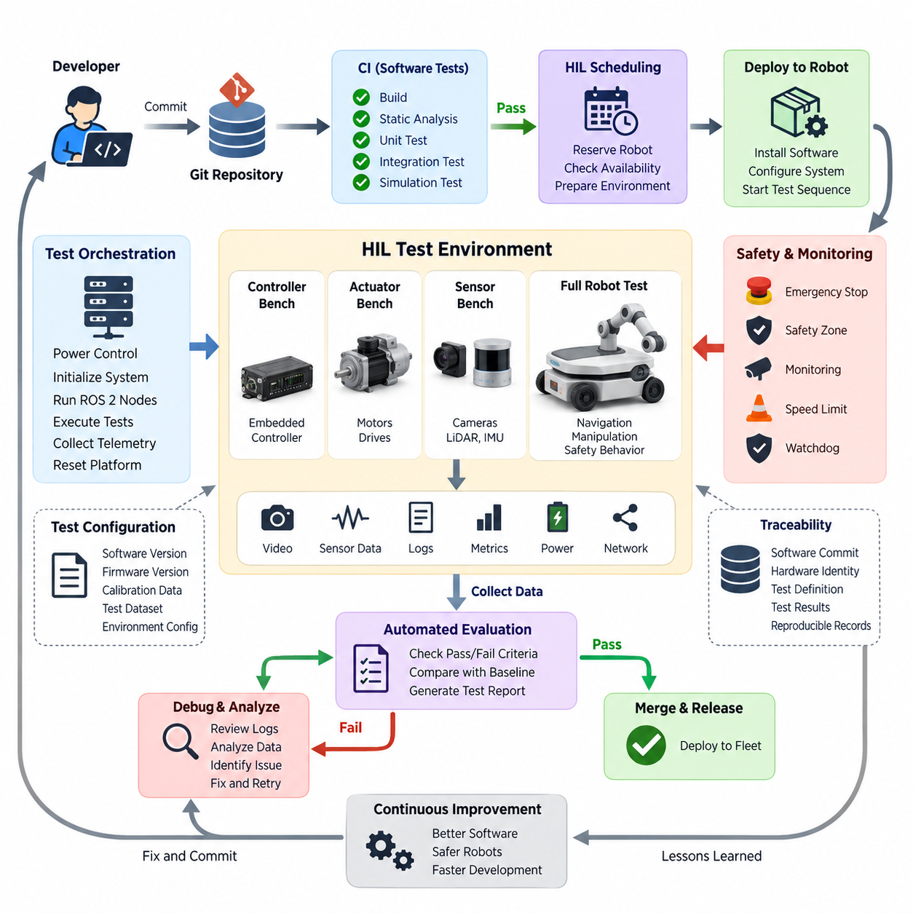
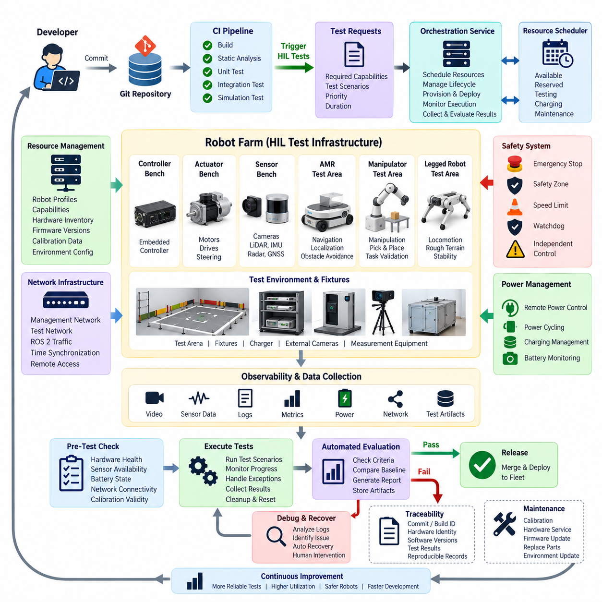
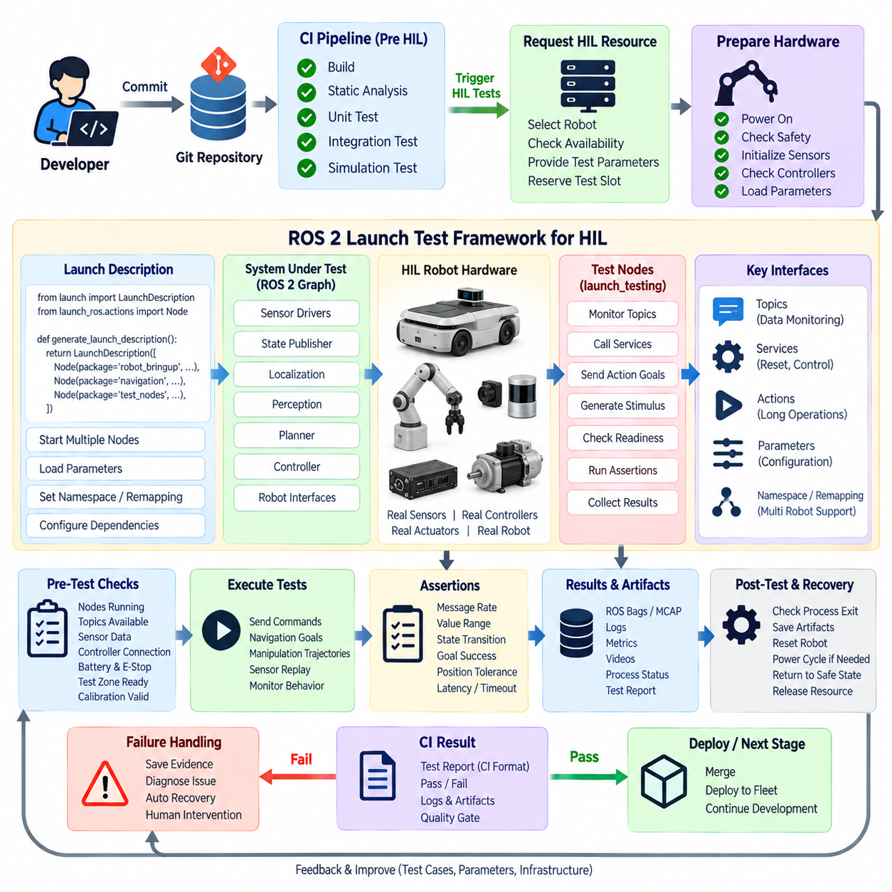
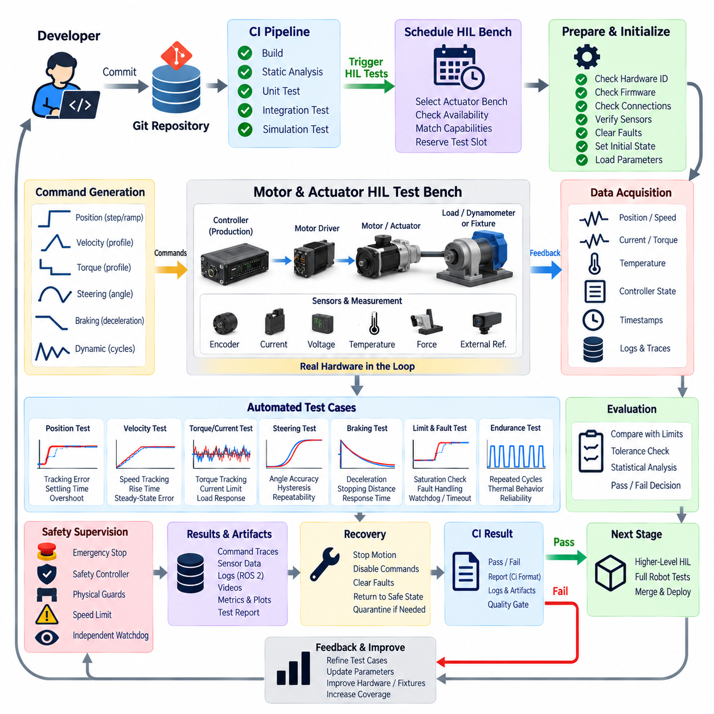
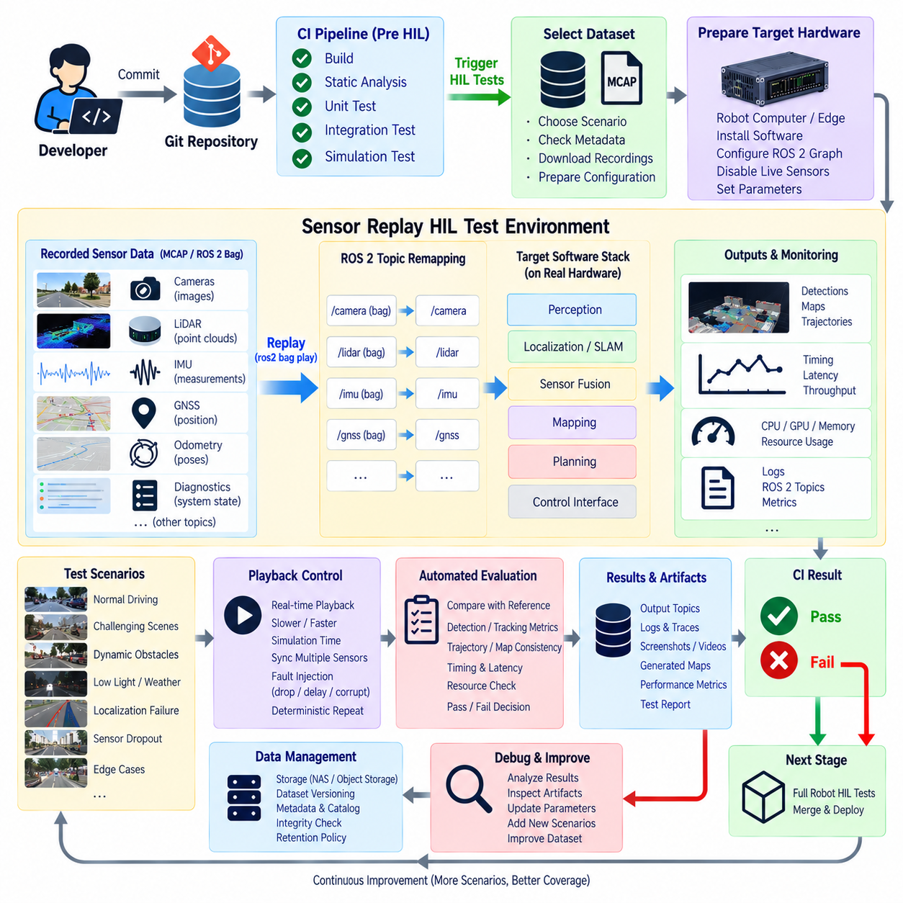
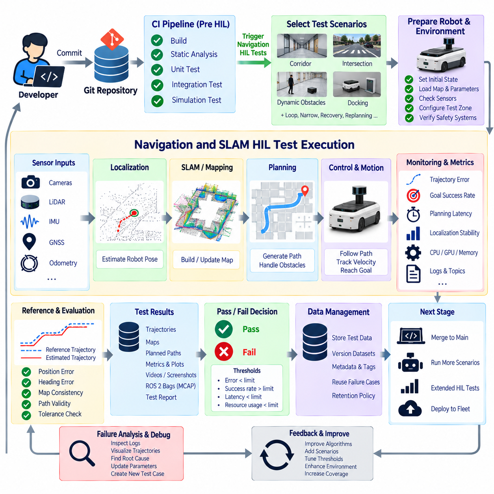
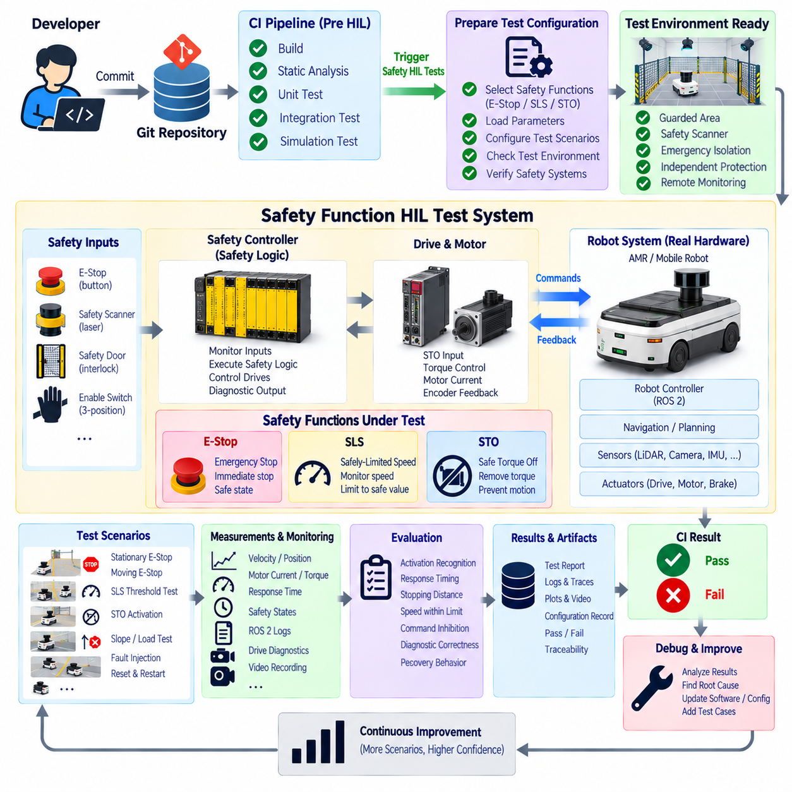
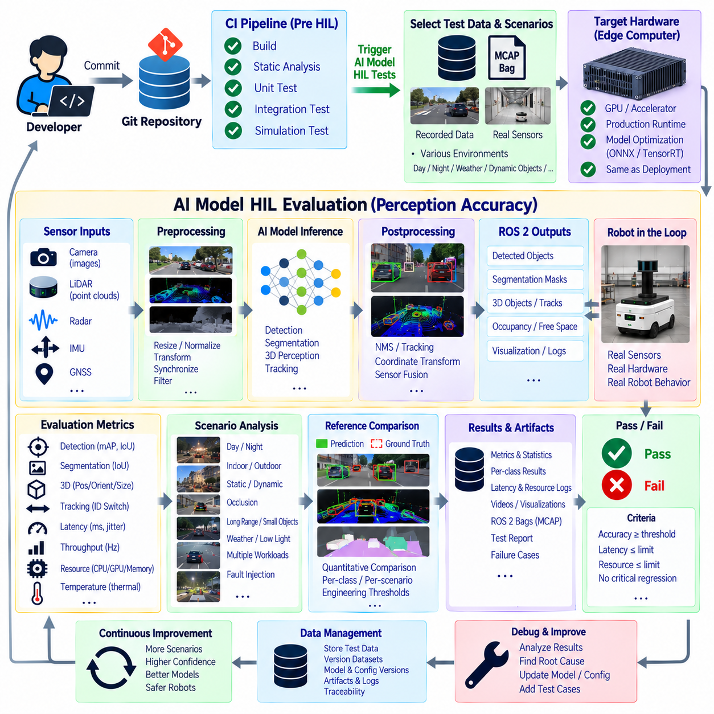
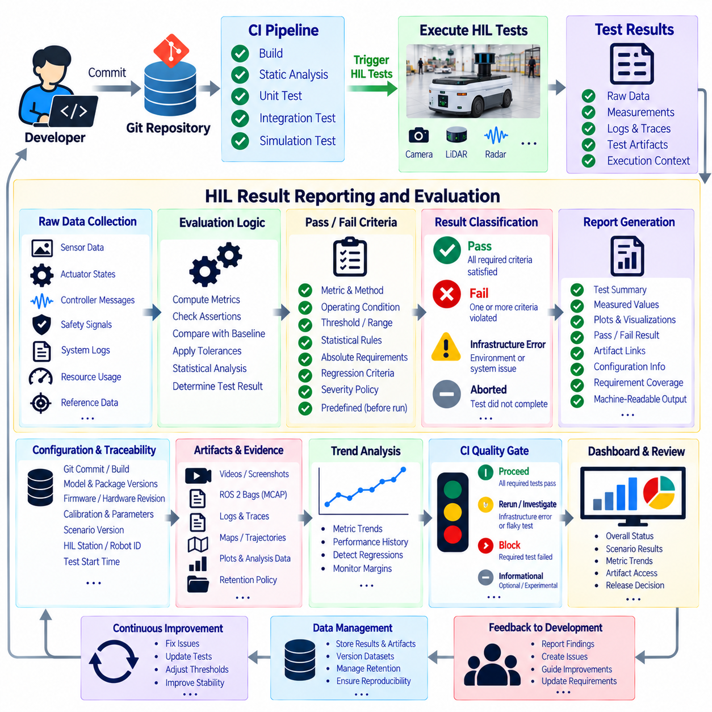
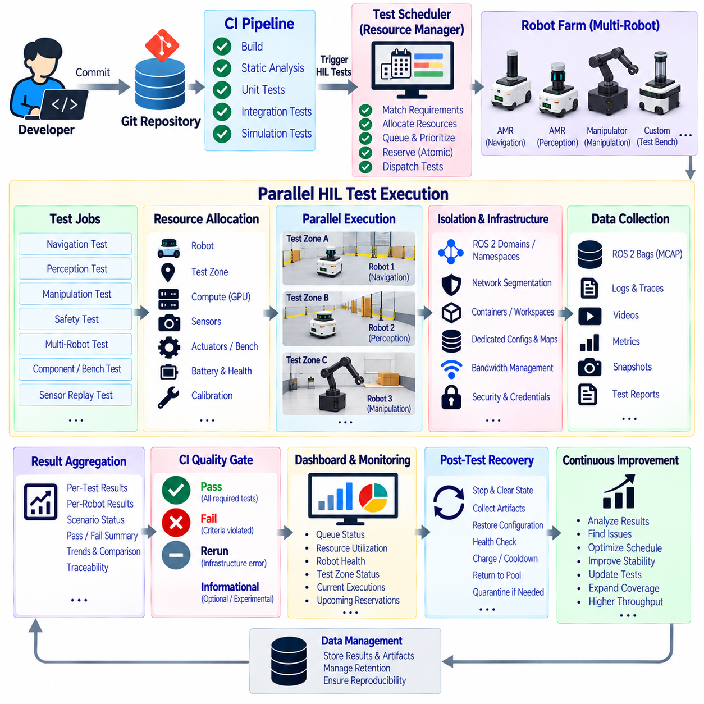

**Volume 10 Robot DevOps and MLOps**


# 10. Hardware in the Loop CI

##  

## 10.1. HIL CI Concepts Physical Robot in Automated Test Loop

{width="7.268055555555556in" height="7.268055555555556in"}

Hardware-in-the-Loop Continuous Integration (HIL CI) extends conventional software testing by placing real robot hardware directly inside an automated verification pipeline. Instead of validating every change only with unit tests or simulation, selected software revisions are deployed to physical controllers, sensors, actuators, or complete robots. The resulting behavior is measured automatically and converted into reproducible pass-or-fail evidence before software progresses toward release.

This approach is especially important in robotics because correct software execution does not necessarily imply correct physical behavior. A controller may compile successfully and pass simulation while producing unexpected timing, communication, electrical, thermal, or mechanical effects on actual hardware. HIL CI therefore connects software verification with the physical characteristics of the robot and exposes integration failures that conventional CI environments cannot realistically reproduce.

A typical HIL CI workflow begins when a developer commits or merges a software change. Conventional CI stages first build the software and execute static analysis, unit tests, integration tests, and possibly simulation-based validation. Only revisions satisfying these inexpensive gates proceed to hardware testing. The CI system then reserves an available robot or test bench, installs the candidate software, configures the required test environment, and starts the predefined physical test sequence automatically.

The physical robot becomes a controlled CI resource rather than an independently operated laboratory prototype. Test orchestration software can power the system, initialize embedded computers, launch ROS 2 nodes, configure sensors, command actuators, collect telemetry, and restore the platform after each test. This concept forms the foundation for later robot-farm architectures in which multiple physical platforms are remotely allocated to different builds and test jobs.

Automation requires the physical test environment to be deterministic enough for meaningful comparison. Software versions, firmware revisions, calibration parameters, robot configuration, test fixtures, environmental conditions, and test datasets should therefore be recorded together. Without configuration traceability, a failed experiment may be impossible to reproduce because the software revision alone does not completely describe the physical system that executed the test.

HIL CI can operate at several levels of hardware integration. A low-level bench may contain only an embedded controller connected to simulated electrical interfaces, while an actuator bench may include actual motor drivers, motors, encoders, brakes, or steering mechanisms. Higher-level configurations can integrate sensors and computing platforms, and the most complete form places an operational robot inside a controlled test area where navigation, manipulation, perception, and safety behavior can be exercised.

This layered approach allows organizations to balance execution cost against physical realism. Fast controller-level HIL tests can run frequently, whereas complete robot tests may be reserved for important merges, nightly builds, release candidates, or safety-related modifications. HIL therefore complements rather than replaces software-in-the-loop and simulation testing. Each stage progressively increases fidelity while reducing the number of defective builds that consume scarce physical testing resources.

A fundamental design principle is separation between test orchestration and the system under test. The robot executes the software being evaluated, while an independent controller observes its behavior and determines whether expected conditions have been satisfied. External measurement equipment, cameras, power monitors, motion tracking systems, network monitors, or dedicated safety controllers may provide evidence that cannot reliably be obtained from the robot\'s own software.

For ROS 2 robots, HIL CI can validate interactions extending across nodes, middleware, embedded controllers, and physical devices. The pipeline may verify topic publication rates, message latency, lifecycle transitions, sensor availability, actuator responses, localization outputs, or navigation results. Such tests expose failures caused by timing and interface dependencies that may remain invisible when individual ROS 2 packages are evaluated separately in conventional software CI.

Motor and actuator testing provides another important HIL layer. Automated commands can exercise velocity, steering, braking, manipulator joints, or other mechanisms while measured feedback is compared against expected ranges. The broader chapter structure consequently separates automated motor and actuator HIL testing as a dedicated topic, together with sensor replay, navigation regression, safety-function validation, AI evaluation, and result reporting.

Sensor-oriented HIL testing introduces real interfaces into repeatable data-driven experiments. Recorded camera, LiDAR, radar, GNSS, IMU, or other sensor streams can be replayed while the target computing hardware executes the production software stack. This arrangement combines reproducible input data with realistic processors, drivers, middleware, accelerators, and operating-system behavior, making it useful for identifying timing regressions and hardware-dependent processing failures.

Complete physical-robot tests extend verification from interfaces to observable behavior. An AMR can receive a mission, localize itself, plan a route, move through a controlled environment, avoid predefined obstacles, stop at specified positions, and report completion. Measurements such as mission success, localization error, stopping accuracy, execution time, CPU or GPU utilization, communication latency, and safety events can then become quantitative regression criteria.

Safety changes require particularly careful HIL design because automated testing itself can generate hazardous motion. Hardware emergency stops, independent power isolation, restricted test zones, speed limits, watchdogs, physical barriers, and supervisory controllers should remain independent of the software under evaluation. Tests involving emergency stop, safe limited speed, or safe torque off should verify not merely that a software message exists, but that the physical system reaches the required safe condition.

The CI pipeline must also distinguish infrastructure failures from product failures. A disconnected charger, unavailable robot, damaged sensor, network interruption, or test-area obstruction should not automatically be interpreted as a software regression. HIL infrastructure therefore requires health checks and preconditions before execution, followed by structured diagnostics capable of classifying setup errors, hardware faults, software failures, and inconclusive results.

Resource scheduling becomes increasingly important as HIL adoption grows. Unlike virtual CI runners, physical robots cannot be duplicated instantly, and each platform may require charging, calibration, maintenance, environmental reset, or manual recovery. A practical HIL scheduler therefore tracks robot availability and configuration while coordinating reservations, exclusive access, test duration, recovery operations, and maintenance states. Parallel robot farms can eventually increase throughput for large development organizations.

Traceability connects HIL CI with broader DevOps and MLOps practices. Every execution should associate the tested software commit with firmware versions, container images, configuration files, AI model versions, calibration data, hardware identity, test definition, and collected results. This makes a HIL result reproducible and allows engineers to determine precisely which physical configuration demonstrated a regression or satisfied a release criterion.

HIL-generated telemetry also provides valuable evidence for debugging. ROS 2 bags or MCAP recordings, controller logs, sensor streams, actuator states, CPU and GPU metrics, network statistics, power measurements, and video can be captured during each run. When a regression occurs, these synchronized artifacts allow engineers to reconstruct the sequence of events rather than depending on manual observation or incomplete operator notes.

Pass-or-fail criteria should be machine-readable wherever possible. Instead of reporting that the robot appeared to operate normally, a test can define numerical limits for trajectory error, stopping distance, message latency, actuator response time, localization stability, inference latency, or mission completion. Automated evaluation converts these measurements into CI results and prevents subjective interpretation from becoming the primary release gate.

HIL CI also provides an important bridge between simulation and field validation. Simulation can execute enormous numbers of scenarios quickly and safely, while physical HIL confirms that selected behaviors survive real sensors, processors, communication buses, actuators, timing constraints, and mechanical dynamics. Field testing then evaluates conditions that remain difficult to reproduce in either environment. Together these stages create progressively stronger evidence about system behavior.

For AI-enabled robots, the same principle applies to perception and decision components. A model that achieves acceptable offline accuracy may behave differently when executed on the target GPU with real sensor timing, preprocessing, memory limits, and concurrent workloads. HIL evaluation therefore helps verify not only model accuracy but also inference latency, dropped frames, synchronization, resource consumption, and the interaction between AI outputs and downstream robot behavior.

The ultimate objective of HIL CI is not simply to automate laboratory experiments. It is to make physical behavior part of the software delivery discipline. When a robot can be provisioned, exercised, measured, evaluated, and reset automatically, hardware validation becomes a repeatable extension of continuous integration. This reduces the gap between software commits and real-world consequences and establishes the foundation for robot farms, continuous regression testing, and scalable DevOps for physical robotic systems.

하드웨어 인 더 루프 지속적 통합(Hardware-in-the-Loop Continuous Integration, HIL CI)은 실제 로봇 하드웨어(Physical Robot Hardware)를 자동화된 검증 파이프라인(Automated Verification Pipeline)에 직접 포함함으로써 기존 소프트웨어 시험(Software Testing)을 확장하는 방법이다. 모든 변경 사항을 단위 시험(Unit Test)이나 시뮬레이션(Simulation)만으로 검증하는 대신, 선택된 소프트웨어 개정판(Software Revision)을 실제 제어기(Controller), 센서(Sensor), 액추에이터(Actuator) 또는 완전한 로봇에 배포하고 그 동작을 자동으로 측정하여 출시 이전에 재현 가능한 통과·실패(Pass-or-Fail) 근거를 생성한다.

이러한 접근 방식은 로보틱스(Robotics)에서 특히 중요하다. 소프트웨어가 올바르게 실행된다는 사실이 반드시 실제 물리적 동작(Physical Behavior)의 정확성을 의미하지는 않기 때문이다. 제어기(Controller)가 정상적으로 컴파일되고 시뮬레이션 시험을 통과하더라도 실제 하드웨어에서는 예상하지 못한 타이밍(Timing), 통신(Communication), 전기적(Electrical), 열적(Thermal), 기계적(Mechanical) 문제가 발생할 수 있다. 따라서 HIL CI는 소프트웨어 검증(Software Verification)과 로봇의 물리적 특성을 연결하여 기존 CI 환경에서 현실적으로 재현하기 어려운 통합 실패(Integration Failure)를 발견한다.

일반적인 HIL CI 워크플로(Workflow)는 개발자가 소프트웨어 변경 사항을 커밋(Commit)하거나 병합(Merge)할 때 시작된다. 기존 지속적 통합(Continuous Integration, CI) 단계에서는 먼저 소프트웨어를 빌드(Build)하고 정적 분석(Static Analysis), 단위 시험(Unit Test), 통합 시험(Integration Test), 필요한 경우 시뮬레이션 기반 검증(Simulation-Based Validation)을 수행한다. 이러한 비용이 낮은 검증 게이트(Verification Gate)를 통과한 개정판만 하드웨어 시험으로 진행된다. 이후 CI 시스템은 사용 가능한 로봇이나 시험 벤치(Test Bench)를 예약하고 후보 소프트웨어를 설치한 후 필요한 시험 환경을 구성하여 사전에 정의된 물리 시험 시퀀스(Physical Test Sequence)를 자동으로 실행한다.

물리적 로봇(Physical Robot)은 독립적으로 운영되는 실험실 시제품이 아니라 제어 가능한 CI 자원(CI Resource)이 된다. 시험 오케스트레이션 소프트웨어(Test Orchestration Software)는 시스템 전원을 제어하고, 임베디드 컴퓨터(Embedded Computer)를 초기화하며, ROS 2 노드(Node)를 실행하고, 센서를 구성하고, 액추에이터에 명령을 전달하며, 텔레메트리(Telemetry)를 수집하고, 각 시험이 종료된 후 플랫폼을 초기 상태로 복구할 수 있다. 이러한 개념은 여러 물리적 플랫폼을 서로 다른 빌드(Build)와 시험 작업(Test Job)에 원격으로 할당하는 로봇 팜 아키텍처(Robot Farm Architecture)의 기반이 된다.

자동화(Automation)를 구현하려면 물리적 시험 환경(Physical Test Environment)이 의미 있는 비교가 가능할 정도로 결정적(Deterministic)이어야 한다. 따라서 소프트웨어 버전(Software Version), 펌웨어 개정판(Firmware Revision), 캘리브레이션 파라미터(Calibration Parameter), 로봇 구성(Robot Configuration), 시험 지그(Test Fixture), 환경 조건(Environmental Condition), 시험 데이터셋(Test Dataset)을 함께 기록해야 한다. 구성 추적성(Configuration Traceability)이 확보되지 않으면 소프트웨어 버전만으로는 시험을 수행한 전체 물리 시스템을 설명할 수 없기 때문에 실패한 실험을 정확하게 재현하기 어렵다.

HIL CI는 여러 단계의 하드웨어 통합 수준(Hardware Integration Level)에서 운영할 수 있다. 저수준 시험 벤치(Low-Level Test Bench)는 시뮬레이션된 전기 인터페이스(Electrical Interface)에 연결된 임베디드 제어기만 포함할 수 있으며, 액추에이터 시험 벤치(Actuator Test Bench)는 실제 모터 드라이버(Motor Driver), 모터(Motor), 엔코더(Encoder), 브레이크(Brake), 조향 장치(Steering Mechanism)를 포함할 수 있다. 더 높은 수준에서는 센서와 컴퓨팅 플랫폼(Computing Platform)을 통합하고, 가장 완전한 형태에서는 실제 작동 가능한 로봇을 통제된 시험 공간에 배치하여 내비게이션(Navigation), 조작(Manipulation), 인지(Perception), 안전 동작(Safety Behavior)을 시험한다.

이러한 계층적 접근 방식(Layered Approach)을 통해 조직은 실행 비용(Execution Cost)과 물리적 현실성(Physical Realism) 사이의 균형을 조정할 수 있다. 빠른 제어기 수준 HIL 시험은 빈번하게 실행하고, 완전한 로봇 시험(Complete Robot Test)은 중요한 병합(Merge), 야간 빌드(Nightly Build), 출시 후보(Release Candidate), 안전 관련 변경 사항 등에 적용할 수 있다. 따라서 HIL은 소프트웨어 인 더 루프(Software-in-the-Loop)나 시뮬레이션 시험을 대체하는 것이 아니라 보완한다. 각 검증 단계에서 점진적으로 현실성을 높이면서 제한된 물리 시험 자원을 소비하는 결함 빌드(Defective Build)의 수를 줄인다.

HIL 설계의 기본 원칙 중 하나는 시험 오케스트레이션(Test Orchestration)과 시험 대상 시스템(System Under Test, SUT)을 분리하는 것이다. 로봇은 평가 대상 소프트웨어를 실행하지만 독립적인 제어 시스템이 로봇의 동작을 관찰하고 예상 조건의 충족 여부를 판단한다. 외부 측정 장비(External Measurement Equipment), 카메라(Camera), 전력 모니터(Power Monitor), 모션 추적 시스템(Motion Tracking System), 네트워크 모니터(Network Monitor), 전용 안전 제어기(Dedicated Safety Controller) 등을 활용하면 로봇 자체 소프트웨어만으로는 신뢰성 있게 확보하기 어려운 검증 근거를 얻을 수 있다.

ROS 2 로봇의 경우 HIL CI는 노드(Node), 미들웨어(Middleware), 임베디드 제어기(Embedded Controller), 물리 장치(Physical Device)에 걸친 상호작용을 검증할 수 있다. 파이프라인(Pipeline)은 토픽 발행 주기(Topic Publication Rate), 메시지 지연시간(Message Latency), 라이프사이클 전환(Lifecycle Transition), 센서 가용성(Sensor Availability), 액추에이터 응답(Actuator Response), 위치추정 출력(Localization Output), 내비게이션 결과(Navigation Result) 등을 검증할 수 있다. 이러한 시험은 개별 ROS 2 패키지(Package)를 기존 소프트웨어 CI에서 독립적으로 평가할 때 발견하기 어려운 타이밍 및 인터페이스 의존성(Timing and Interface Dependency) 문제를 드러낸다.

모터 및 액추에이터 시험(Motor and Actuator Testing)은 또 다른 중요한 HIL 계층을 제공한다. 자동화된 명령을 이용하여 속도(Velocity), 조향(Steering), 제동(Braking), 매니퓰레이터 관절(Manipulator Joint) 또는 기타 메커니즘을 동작시키면서 측정된 피드백(Feedback)을 예상 범위와 비교할 수 있다. 전체 장 구조에서는 자동화된 모터 및 액추에이터 HIL 시험과 함께 센서 재생(Sensor Replay), 내비게이션 회귀 시험(Navigation Regression Test), 안전 기능 검증(Safety Function Validation), AI 평가(AI Evaluation), 결과 보고(Result Reporting)를 각각 독립적인 주제로 구성한다.

센서 중심 HIL 시험(Sensor-Oriented HIL Testing)은 실제 인터페이스(Real Interface)를 반복 가능한 데이터 기반 실험(Data-Driven Experiment)에 포함한다. 기록된 카메라(Camera), 라이다(LiDAR), 레이더(Radar), 위성항법시스템(GNSS), 관성측정장치(IMU) 등의 센서 스트림(Sensor Stream)을 재생하는 동안 대상 컴퓨팅 하드웨어(Target Computing Hardware)에서는 실제 양산용 소프트웨어 스택(Production Software Stack)을 실행한다. 이를 통해 재현 가능한 입력 데이터와 실제 프로세서, 드라이버(Driver), 미들웨어, 가속기(Accelerator), 운영체제(Operating System)의 동작 특성을 결합하여 타이밍 회귀(Timing Regression)와 하드웨어 의존적 처리 실패를 식별할 수 있다.

완전한 물리 로봇 시험(Complete Physical-Robot Test)은 인터페이스 검증을 실제 관찰 가능한 동작(Observable Behavior)까지 확장한다. 자율이동로봇(Autonomous Mobile Robot, AMR)은 임무(Mission)를 수신하고, 자신의 위치를 추정하며, 경로를 계획하고, 통제된 환경에서 이동하고, 사전에 정의된 장애물을 회피하며, 지정된 위치에서 정지하고, 임무 완료를 보고할 수 있다. 이후 임무 성공 여부, 위치추정 오차(Localization Error), 정지 정확도(Stopping Accuracy), 실행 시간(Execution Time), CPU·GPU 사용률, 통신 지연시간(Communication Latency), 안전 이벤트(Safety Event) 등을 정량적인 회귀 기준(Regression Criterion)으로 활용할 수 있다.

안전 관련 변경 사항(Safety-Related Change)은 자동화된 시험 자체가 위험한 움직임을 발생시킬 수 있기 때문에 특히 신중한 HIL 설계가 필요하다. 하드웨어 비상 정지(Hardware Emergency Stop), 독립적인 전원 차단(Power Isolation), 제한된 시험 구역(Restricted Test Zone), 속도 제한(Speed Limit), 워치독(Watchdog), 물리적 방호 장치(Physical Barrier), 감독 제어기(Supervisory Controller)는 평가 대상 소프트웨어와 독립적으로 유지되어야 한다. 비상 정지(Emergency Stop), 안전 제한 속도(Safe Limited Speed, SLS), 안전 토크 차단(Safe Torque Off, STO) 시험에서는 단순히 소프트웨어 메시지가 존재하는지 확인하는 것이 아니라 실제 물리 시스템이 요구되는 안전 상태(Safe State)에 도달하는지를 검증해야 한다.

CI 파이프라인은 또한 인프라 장애(Infrastructure Failure)와 제품 장애(Product Failure)를 구분해야 한다. 충전기 연결 해제, 로봇 사용 불가, 센서 고장, 네트워크 중단, 시험 구역의 장애물과 같은 문제를 자동으로 소프트웨어 회귀(Software Regression)로 판단해서는 안 된다. 따라서 HIL 인프라(HIL Infrastructure)는 실행 전에 상태 점검(Health Check)과 사전 조건(Precondition)을 확인하고, 이후 구조화된 진단(Structured Diagnostics)을 통해 설정 오류(Setup Error), 하드웨어 결함(Hardware Fault), 소프트웨어 실패(Software Failure), 판정 불가 결과(Inconclusive Result)를 구분할 수 있어야 한다.

HIL 적용 규모가 증가할수록 자원 스케줄링(Resource Scheduling)의 중요성도 커진다. 가상 CI 실행기(Virtual CI Runner)와 달리 물리적 로봇은 즉시 복제할 수 없으며 각 플랫폼에는 충전(Charging), 캘리브레이션(Calibration), 유지보수(Maintenance), 환경 초기화(Environmental Reset), 수동 복구(Manual Recovery)가 필요할 수 있다. 따라서 실용적인 HIL 스케줄러(HIL Scheduler)는 로봇의 가용성과 구성을 추적하면서 예약(Reservation), 독점적 접근(Exclusive Access), 시험 시간, 복구 작업, 유지보수 상태를 조정해야 한다. 병렬 로봇 팜(Parallel Robot Farm)은 대규모 개발 조직에서 시험 처리량(Test Throughput)을 높이는 방법으로 활용할 수 있다.

추적성(Traceability)은 HIL CI를 보다 광범위한 데브옵스(DevOps) 및 머신러닝 운영(Machine Learning Operations, MLOps) 체계와 연결한다. 모든 시험 실행은 테스트된 소프트웨어 커밋(Software Commit)을 펌웨어 버전(Firmware Version), 컨테이너 이미지(Container Image), 구성 파일(Configuration File), AI 모델 버전(AI Model Version), 캘리브레이션 데이터(Calibration Data), 하드웨어 식별정보(Hardware Identity), 시험 정의(Test Definition), 수집된 결과와 연결해야 한다. 이를 통해 HIL 결과를 재현할 수 있으며 어떤 물리적 구성이 회귀 문제를 발생시켰거나 출시 기준을 만족했는지 정확하게 확인할 수 있다.

HIL에서 생성되는 텔레메트리(Telemetry)는 디버깅(Debugging)을 위한 중요한 근거도 제공한다. ROS 2 백(Bag) 또는 MCAP 기록, 제어기 로그(Controller Log), 센서 스트림, 액추에이터 상태, CPU 및 GPU 지표(Metric), 네트워크 통계(Network Statistics), 전력 측정값(Power Measurement), 비디오(Video) 등을 각 시험 과정에서 수집할 수 있다. 회귀 문제가 발생하면 이러한 동기화된 아티팩트(Synchronized Artifact)를 활용하여 수동 관찰이나 불완전한 작업자 기록에 의존하지 않고 이벤트의 발생 순서를 재구성할 수 있다.

통과·실패 기준(Pass-or-Fail Criteria)은 가능한 경우 기계 판독 가능(Machine-Readable)한 형태로 정의해야 한다. 로봇이 정상적으로 동작하는 것처럼 보였다고 기록하는 대신 궤적 오차(Trajectory Error), 정지 거리(Stopping Distance), 메시지 지연시간, 액추에이터 응답 시간(Actuator Response Time), 위치추정 안정성(Localization Stability), 추론 지연시간(Inference Latency), 임무 완료 여부 등에 수치적 한계를 정의할 수 있다. 자동화된 평가(Automated Evaluation)는 이러한 측정값을 CI 결과로 변환하여 주관적인 판단이 주요 출시 게이트(Release Gate)가 되는 것을 방지한다.

HIL CI는 시뮬레이션(Simulation)과 필드 검증(Field Validation)을 연결하는 중요한 가교 역할도 수행한다. 시뮬레이션은 매우 많은 시나리오를 빠르고 안전하게 실행할 수 있는 반면, 물리적 HIL은 선택된 동작이 실제 센서, 프로세서, 통신 버스(Communication Bus), 액추에이터, 타이밍 제약(Timing Constraint), 기계적 동역학(Mechanical Dynamics)에서도 유지되는지를 확인한다. 이후 필드 시험(Field Testing)은 시뮬레이션이나 HIL 환경에서 재현하기 어려운 실제 조건을 평가한다. 이러한 단계들을 결합하면 시스템 동작에 대한 검증 근거를 점진적으로 강화할 수 있다.

AI 기반 로봇(AI-Enabled Robot)에서도 동일한 원칙이 적용된다. 오프라인 정확도(Offline Accuracy)가 충분한 모델이라도 실제 센서 타이밍, 전처리(Preprocessing), 메모리 제한(Memory Constraint), 동시 실행 워크로드(Concurrent Workload)를 가진 대상 GPU에서 실행될 때는 다른 동작을 나타낼 수 있다. 따라서 HIL 평가는 모델 정확도(Model Accuracy)뿐만 아니라 추론 지연시간, 프레임 손실(Dropped Frame), 동기화(Synchronization), 자원 사용량(Resource Consumption), AI 출력과 후속 로봇 동작 사이의 상호작용까지 검증하는 데 활용된다.

HIL CI의 궁극적인 목적은 단순히 실험실 시험(Laboratory Experiment)을 자동화하는 것이 아니다. 핵심은 물리적 동작(Physical Behavior)을 소프트웨어 전달 규율(Software Delivery Discipline)의 일부로 만드는 것이다. 로봇을 자동으로 프로비저닝(Provisioning)하고, 동작시키고, 측정하고, 평가하고, 초기화할 수 있게 되면 하드웨어 검증(Hardware Validation)은 지속적 통합의 반복 가능한 확장 단계가 된다. 이는 소프트웨어 커밋과 실제 세계에서 발생하는 물리적 결과 사이의 간극을 줄이고, 로봇 팜(Robot Farm), 지속적 회귀 시험(Continuous Regression Testing), 확장 가능한 물리 로봇 데브옵스(DevOps)를 구축하기 위한 기반을 제공한다.

##  

## 10.2. HIL Test Infrastructure Design Robot Farm Architecture

{width="7.268055555555556in" height="7.268055555555556in"}

A Hardware-in-the-Loop robot farm extends HIL CI from a single laboratory test platform into shared infrastructure where multiple physical robots, controllers, sensors, and actuator benches can execute automated tests. The central architectural objective is to make scarce physical hardware behave like schedulable CI resources while preserving safety, reproducibility, hardware identity, and reliable recovery between test executions.

A robot farm normally separates orchestration infrastructure from the physical systems under test. CI servers receive software changes and determine which HIL tests are required, while a dedicated orchestration layer selects suitable hardware and manages the test lifecycle. This separation prevents individual CI jobs from directly controlling laboratory resources and provides a common management boundary for scheduling, access control, health monitoring, and failure recovery.

Each hardware resource should be represented by an explicit machine-readable profile. A resource description can identify robot type, controller architecture, CPU and GPU platform, firmware compatibility, connected sensors, actuator configuration, safety capabilities, test-area assignment, and supported software versions. CI jobs can then request capabilities rather than relying on manually assigned robot names, allowing the scheduler to select compatible hardware automatically.

Resource scheduling is a fundamental robot-farm service because physical robots cannot execute unlimited parallel workloads. The scheduler maintains states such as available, reserved, testing, charging, recovering, calibrating, maintenance, and unavailable. When a pipeline requests a particular hardware configuration, the scheduler reserves a compatible resource, prevents conflicting access, establishes an execution lease, and releases the hardware only after testing and recovery have completed.

The robot farm requires a provisioning layer that transforms reserved hardware into a known test state. Provisioning can install operating-system packages, containers, ROS 2 workspaces, firmware, configuration files, calibration parameters, and AI models associated with a particular build. Before execution, the infrastructure should verify software versions and hardware configuration so that every test starts from a controlled baseline rather than an unknown state left by a previous experiment.

A physical test station typically combines the robot with supporting infrastructure. Depending on the platform, this can include controllable power distribution, chargers, network switches, wireless access points, emergency-stop circuits, cameras, external computers, measurement equipment, and environmental fixtures. These components should be treated as part of the HIL system because their state can directly influence whether a test is executable, reproducible, or safe.

Remote power management is particularly useful for unattended operation. Network-controlled power distribution units, relays, or dedicated supervisory controllers can power-cycle computers and selected devices when software becomes unresponsive. However, automated recovery should remain separated from safety functions. A CI server that controls software deployment should not be the only mechanism capable of stopping hazardous physical motion or disconnecting actuator power.

Robot-farm networking must support both operational communication and infrastructure management. ROS 2 traffic, sensor streams, telemetry, deployment data, management commands, and test artifacts can generate substantially different network requirements. Separating management and test traffic logically or physically can reduce interference and simplify diagnosis, while synchronized clocks are important when results from robot computers, sensors, external observers, and orchestration servers must be correlated.

The orchestration service manages the complete execution state machine. After reservation, it checks hardware health, verifies safety prerequisites, provisions the target software, launches required processes, executes test scenarios, monitors progress, collects results, and initiates cleanup. A successful test does not end when the robot stops moving; the infrastructure must also archive evidence, restore the test station, verify readiness, and return the resource to the available pool.

Pre-test health checks reduce false failures caused by infrastructure problems. The robot farm can verify battery state, charging status, network connectivity, disk capacity, sensor availability, actuator communication, emergency-stop state, localization readiness, calibration validity, and required external equipment. If these prerequisites are not satisfied, the job should be classified as an infrastructure exception rather than immediately reported as a software regression.

Safety architecture must remain independent from normal test automation wherever practical. Physical emergency stops, safety relays, protected test areas, speed restrictions, watchdogs, access detection, and independent supervisory systems provide protection if experimental software behaves unpredictably. Automated HIL execution increases the importance of these controls because robots may operate without an engineer continuously standing beside every platform.

Environmental design depends strongly on the robot class. A controller or actuator bench may need only an enclosed rack or fixture, whereas an AMR requires a controlled navigation area containing known landmarks, obstacles, docking targets, and reference positions. Manipulators may require fixtures and replaceable test objects, while legged robots need protected operating zones. The environment itself therefore becomes a versioned component of the test infrastructure.

Observability should cover both the system under test and the robot farm. Infrastructure metrics can include reservation utilization, queue time, test duration, charging time, recovery frequency, hardware faults, network health, and unavailable resources. Robot-level telemetry can include ROS 2 messages, controller states, sensor data, CPU and GPU utilization, power consumption, localization results, actuator feedback, and safety events collected during each execution.

External observation provides an independent reference when internal robot telemetry is insufficient. Cameras, motion-capture systems, fiducial markers, distance sensors, force measurement devices, or other instrumentation can determine whether physical behavior matches expected results. This is particularly valuable when validating stopping position, trajectory accuracy, manipulator motion, collision avoidance, or other behaviors where relying solely on the robot\'s own estimated state could hide systematic errors.

Test artifacts should be associated with a unique execution identity. The record can connect the CI job, Git commit, container or package version, firmware revision, AI model, hardware identifier, robot configuration, calibration data, test scenario, environment configuration, logs, telemetry, video, and final verdict. This traceability transforms robot-farm execution from an informal laboratory experiment into reproducible engineering evidence.

Recovery automation is essential because physical systems fail in ways that virtual CI runners do not. A robot may stop outside its expected position, lose localization, discharge its battery, disconnect from the network, encounter an obstacle, or leave an actuator in an abnormal state. Recovery procedures should first determine whether automated restoration is safe and possible; otherwise, the platform should be quarantined and marked for human intervention rather than repeatedly restarting a potentially unsafe test.

Charging and energy management become scheduling concerns when mobile robots are continuously tested. The infrastructure should avoid assigning a long mission to a robot without sufficient energy and should account for charging time when estimating availability. Automated docking can improve utilization, but charging status and battery health must still be incorporated into readiness checks because power conditions can influence computational performance and physical behavior.

Parallel execution improves throughput by distributing tests across multiple compatible platforms. Identical robots can process independent regression jobs concurrently, while heterogeneous farms can route controller tests, perception tests, navigation tests, and complete mission tests to specialized resources. Parallelism should nevertheless preserve isolation so that wireless traffic, moving robots, shared environments, or external equipment from one test do not invalidate another test.

A scalable architecture benefits from separating logical test definitions from individual physical robots. Test specifications describe required capabilities, initial conditions, actions, expected observations, timeout rules, and pass-or-fail criteria. The scheduler maps those requirements onto available resources at runtime. This abstraction allows additional robots or upgraded hardware to enter the farm without requiring every CI pipeline to be rewritten around specific laboratory devices.

Robot farms also require lifecycle management for the infrastructure itself. Hardware inventory, firmware baselines, calibration expiration, maintenance history, damaged components, replacement parts, and configuration changes should be tracked alongside software. Otherwise, gradual changes in physical platforms can introduce unexplained differences between historical and current results even when the tested software remains identical.

Access control is important because HIL infrastructure can command real actuators and potentially safety-critical functions. Developers, CI services, administrators, and maintenance personnel should receive only the permissions required for their roles. Authentication, reservation ownership, audit records, controlled deployment credentials, and restricted interfaces help prevent accidental interference between tests and provide accountability for changes made to shared hardware.

The robot-farm architecture ultimately turns physical validation into an infrastructure service for robotics development. CI pipelines request hardware capabilities, the scheduler allocates suitable resources, provisioning establishes a reproducible configuration, orchestration executes the experiment, monitoring captures physical behavior, and automated evaluation returns structured results. Recovery and maintenance then prepare the platform for the next job, completing a repeatable HIL lifecycle.

As the number of robots grows, this architecture becomes the physical counterpart of scalable software CI infrastructure. Virtual runners provide inexpensive and highly parallel software verification, while the robot farm supplies controlled access to real sensors, processors, communication interfaces, actuators, and mechanical dynamics. Combining both layers allows frequent software iteration while reserving expensive physical execution for changes that have already passed earlier verification stages.

하드웨어 인 더 루프 로봇 팜(Hardware-in-the-Loop Robot Farm)은 단일 실험실 시험 플랫폼에서 수행하던 HIL CI를 여러 실제 로봇, 제어기, 센서, 액추에이터 시험 벤치(Actuator Bench)가 자동화 시험을 실행할 수 있는 공유 인프라(Shared Infrastructure)로 확장한다. 핵심 아키텍처 목표는 제한적인 실제 하드웨어를 스케줄링 가능한 CI 자원(Schedulable CI Resource)처럼 운영하면서 안전성(Safety), 재현성(Reproducibility), 하드웨어 식별성(Hardware Identity), 시험 간 안정적인 복구(Recovery)를 보장하는 것이다.

로봇 팜(Robot Farm)은 일반적으로 오케스트레이션 인프라(Orchestration Infrastructure)와 실제 시험 대상 시스템(Physical System Under Test)을 분리한다. CI 서버는 소프트웨어 변경 사항을 수신하고 필요한 HIL 시험을 결정하며, 전용 오케스트레이션 계층(Orchestration Layer)은 적절한 하드웨어를 선택하고 전체 시험 생명주기(Test Lifecycle)를 관리한다. 이러한 분리를 통해 개별 CI 작업이 실험실 자원을 직접 제어하는 것을 방지하고 스케줄링, 접근 제어(Access Control), 상태 모니터링(Health Monitoring), 장애 복구(Failure Recovery)를 위한 공통 관리 경계를 제공한다.

각 하드웨어 자원(Hardware Resource)은 명시적인 기계 판독 가능 프로파일(Machine-Readable Profile)로 표현되어야 한다. 자원 설명(Resource Description)에는 로봇 유형, 제어기 아키텍처(Controller Architecture), CPU 및 GPU 플랫폼, 펌웨어 호환성(Firmware Compatibility), 연결된 센서, 액추에이터 구성, 안전 기능(Safety Capability), 시험 구역 할당, 지원되는 소프트웨어 버전 등을 포함할 수 있다. 이를 통해 CI 작업은 특정 로봇 이름에 수동으로 의존하는 대신 필요한 기능(Capability)을 요청하고, 스케줄러(Scheduler)가 호환되는 하드웨어를 자동으로 선택할 수 있다.

자원 스케줄링(Resource Scheduling)은 실제 로봇이 무제한의 병렬 워크로드(Parallel Workload)를 실행할 수 없기 때문에 로봇 팜의 핵심 서비스이다. 스케줄러는 사용 가능(Available), 예약(Reserved), 시험 중(Testing), 충전 중(Charging), 복구 중(Recovering), 캘리브레이션 중(Calibrating), 유지보수(Maintenance), 사용 불가(Unavailable) 등의 상태를 관리한다. 파이프라인이 특정 하드웨어 구성을 요청하면 호환 가능한 자원을 예약하고 충돌하는 접근을 차단하며 실행 임대(Execution Lease)를 설정한 후 시험과 복구가 완료된 이후에만 해당 하드웨어를 해제한다.

로봇 팜에는 예약된 하드웨어를 알려진 시험 상태(Known Test State)로 변환하는 프로비저닝 계층(Provisioning Layer)이 필요하다. 프로비저닝 과정에서는 특정 빌드(Build)와 연결된 운영체제 패키지, 컨테이너(Container), ROS 2 워크스페이스(Workspace), 펌웨어, 구성 파일(Configuration File), 캘리브레이션 파라미터(Calibration Parameter), AI 모델 등을 설치할 수 있다. 실행 전에 소프트웨어 버전과 하드웨어 구성을 검증하여 모든 시험이 이전 실험에서 남겨진 불확실한 상태가 아니라 통제된 기준 상태(Controlled Baseline)에서 시작하도록 해야 한다.

실제 시험 스테이션(Physical Test Station)은 일반적으로 로봇과 이를 지원하는 인프라를 함께 구성한다. 플랫폼에 따라 제어 가능한 전력 분배 장치(Power Distribution), 충전기(Charger), 네트워크 스위치(Network Switch), 무선 액세스 포인트(Wireless Access Point), 비상 정지 회로(Emergency-Stop Circuit), 카메라, 외부 컴퓨터, 측정 장비(Measurement Equipment), 환경 시험 지그(Environmental Fixture) 등을 포함할 수 있다. 이러한 구성 요소의 상태가 시험 실행 가능성, 재현성, 안전성에 직접적인 영향을 미치므로 HIL 시스템의 일부로 관리해야 한다.

원격 전원 관리(Remote Power Management)는 무인 운영(Unattended Operation)에서 특히 유용하다. 네트워크 제어 전력 분배 장치(Network-Controlled Power Distribution Unit), 릴레이(Relay), 전용 감독 제어기(Supervisory Controller)를 사용하면 소프트웨어가 응답하지 않을 때 컴퓨터와 특정 장치의 전원을 재인가(Power Cycle)할 수 있다. 그러나 자동 복구 기능(Automated Recovery)은 안전 기능과 분리되어야 하며, 소프트웨어 배포를 제어하는 CI 서버가 위험한 물리적 움직임을 정지시키거나 액추에이터 전원을 차단할 수 있는 유일한 수단이 되어서는 안 된다.

로봇 팜 네트워크(Robot-Farm Network)는 운영 통신(Operational Communication)과 인프라 관리(Infrastructure Management)를 모두 지원해야 한다. ROS 2 트래픽(Traffic), 센서 스트림(Sensor Stream), 텔레메트리(Telemetry), 배포 데이터(Deployment Data), 관리 명령(Management Command), 시험 아티팩트(Test Artifact)는 서로 다른 네트워크 요구사항을 발생시킬 수 있다. 관리 트래픽과 시험 트래픽을 논리적 또는 물리적으로 분리하면 간섭을 줄이고 장애 진단을 단순화할 수 있으며, 로봇 컴퓨터, 센서, 외부 관측 시스템, 오케스트레이션 서버의 결과를 연계하려면 시간 동기화(Clock Synchronization)도 중요하다.

오케스트레이션 서비스(Orchestration Service)는 전체 실행 상태 머신(Execution State Machine)을 관리한다. 자원이 예약되면 하드웨어 상태를 확인하고 안전 사전 조건(Safety Prerequisite)을 검증하며 대상 소프트웨어를 프로비저닝하고 필요한 프로세스를 실행한 뒤 시험 시나리오(Test Scenario)를 수행한다. 이후 진행 상태를 모니터링하고 결과를 수집하여 정리 작업(Cleanup)을 시작한다. 성공적인 시험은 로봇이 정지하는 순간 끝나는 것이 아니라 검증 근거를 보관하고 시험 스테이션을 복원하며 준비 상태를 확인한 후 자원을 다시 사용 가능 풀(Available Pool)로 반환할 때 완료된다.

시험 전 상태 점검(Pre-Test Health Check)은 인프라 문제로 인한 잘못된 실패(False Failure)를 줄인다. 로봇 팜은 배터리 상태(Battery State), 충전 상태(Charging Status), 네트워크 연결, 디스크 용량, 센서 가용성, 액추에이터 통신, 비상 정지 상태, 위치추정 준비 상태(Localization Readiness), 캘리브레이션 유효성(Calibration Validity), 필수 외부 장비 등을 검증할 수 있다. 이러한 사전 조건이 충족되지 않으면 해당 작업을 즉시 소프트웨어 회귀(Software Regression)로 판단하는 대신 인프라 예외(Infrastructure Exception)로 분류해야 한다.

안전 아키텍처(Safety Architecture)는 가능한 경우 일반적인 시험 자동화(Test Automation)와 독립적으로 유지되어야 한다. 물리적 비상 정지(Physical Emergency Stop), 안전 릴레이(Safety Relay), 보호된 시험 구역(Protected Test Area), 속도 제한(Speed Restriction), 워치독(Watchdog), 접근 감지(Access Detection), 독립적인 감독 시스템(Independent Supervisory System)은 실험용 소프트웨어가 예측할 수 없는 방식으로 동작하는 경우에도 보호 기능을 제공한다. 자동화된 HIL 실행에서는 엔지니어가 모든 플랫폼 옆에서 지속적으로 감시하지 않을 수 있기 때문에 이러한 제어 장치가 더욱 중요하다.

환경 설계(Environmental Design)는 로봇 종류에 따라 크게 달라진다. 제어기 또는 액추에이터 시험 벤치는 밀폐된 랙(Rack)이나 지그(Fixture)만 필요할 수 있지만, 자율이동로봇(Autonomous Mobile Robot, AMR)은 알려진 랜드마크(Landmark), 장애물, 도킹 목표(Docking Target), 기준 위치(Reference Position)가 포함된 통제된 내비게이션 구역을 필요로 한다. 매니퓰레이터(Manipulator)는 지그와 교체 가능한 시험 물체가 필요할 수 있고, 보행 로봇(Legged Robot)은 보호된 작동 구역을 필요로 한다. 따라서 환경 자체도 버전 관리되는 시험 인프라 구성 요소가 된다.

관측 가능성(Observability)은 시험 대상 시스템뿐만 아니라 로봇 팜 자체도 포함해야 한다. 인프라 지표(Infrastructure Metric)에는 예약 자원 활용률, 대기 시간(Queue Time), 시험 시간, 충전 시간, 복구 빈도, 하드웨어 장애, 네트워크 상태, 사용 불가능한 자원 등이 포함될 수 있다. 로봇 수준의 텔레메트리에는 ROS 2 메시지, 제어기 상태, 센서 데이터, CPU 및 GPU 사용률, 전력 소비, 위치추정 결과, 액추에이터 피드백(Actuator Feedback), 안전 이벤트 등이 포함될 수 있으며 각 시험 실행 과정에서 수집된다.

외부 관측(External Observation)은 로봇 내부 텔레메트리만으로 충분하지 않을 때 독립적인 기준(Independent Reference)을 제공한다. 카메라, 모션 캡처 시스템(Motion-Capture System), 피듀셜 마커(Fiducial Marker), 거리 센서(Distance Sensor), 힘 측정 장치(Force Measurement Device) 등의 계측 장비를 사용하여 실제 물리적 동작이 예상 결과와 일치하는지를 판단할 수 있다. 이는 로봇 자체의 추정 상태에만 의존할 경우 체계적인 오류(Systematic Error)가 감춰질 수 있는 정지 위치, 궤적 정확도, 매니퓰레이터 움직임, 충돌 회피(Collision Avoidance) 등의 검증에서 특히 유용하다.

시험 아티팩트(Test Artifact)는 고유한 실행 식별자(Execution Identity)와 연결되어야 한다. 기록에는 CI 작업, Git 커밋(Git Commit), 컨테이너 또는 패키지 버전, 펌웨어 개정판(Firmware Revision), AI 모델, 하드웨어 식별자(Hardware Identifier), 로봇 구성, 캘리브레이션 데이터, 시험 시나리오, 환경 구성, 로그(Log), 텔레메트리, 비디오, 최종 판정(Final Verdict)을 연결할 수 있다. 이러한 추적성(Traceability)은 로봇 팜에서의 실행을 비공식적인 실험실 실험에서 재현 가능한 엔지니어링 검증 근거(Reproducible Engineering Evidence)로 전환한다.

물리 시스템은 가상 CI 실행기(Virtual CI Runner)와 다른 방식으로 실패하기 때문에 복구 자동화(Recovery Automation)가 필수적이다. 로봇은 예상 위치를 벗어나 정지하거나, 위치추정을 잃거나, 배터리가 방전되거나, 네트워크 연결이 끊기거나, 장애물을 만나거나, 액추에이터가 비정상 상태에 머무를 수 있다. 복구 절차는 먼저 자동 복원이 안전하고 가능한지 판단해야 하며, 그렇지 않은 경우 잠재적으로 위험한 시험을 반복적으로 재시작하는 대신 플랫폼을 격리(Quarantine)하고 사람의 개입(Human Intervention)이 필요한 상태로 표시해야 한다.

이동 로봇을 지속적으로 시험하는 환경에서는 충전 및 에너지 관리(Charging and Energy Management)도 스케줄링 문제의 일부가 된다. 인프라는 충분한 에너지가 없는 로봇에 장시간 임무를 할당하지 않아야 하며, 가용 시간을 계산할 때 충전 시간을 고려해야 한다. 자동 도킹(Automated Docking)은 자원 활용률을 높일 수 있지만 전력 상태가 컴퓨팅 성능과 물리적 동작에 영향을 줄 수 있으므로 충전 상태와 배터리 상태(Battery Health)를 준비 상태 점검에 포함해야 한다.

병렬 실행(Parallel Execution)은 여러 호환 가능한 플랫폼에 시험을 분산함으로써 처리량(Throughput)을 향상시킨다. 동일한 로봇들은 독립적인 회귀 시험 작업을 동시에 처리할 수 있으며, 이기종 로봇 팜(Heterogeneous Robot Farm)은 제어기 시험, 인지 시험(Perception Test), 내비게이션 시험, 완전한 임무 시험(Complete Mission Test)을 전문화된 자원으로 라우팅할 수 있다. 그러나 무선 트래픽, 움직이는 로봇, 공유 환경, 외부 장비 등이 다른 시험 결과에 영향을 주지 않도록 병렬 실행에서도 시험 간 격리(Isolation)를 유지해야 한다.

확장 가능한 아키텍처(Scalable Architecture)는 논리적 시험 정의(Logical Test Definition)를 개별 물리 로봇과 분리함으로써 이점을 얻는다. 시험 명세(Test Specification)는 필요한 기능, 초기 조건(Initial Condition), 동작(Action), 예상 관측 결과(Expected Observation), 시간 초과 규칙(Timeout Rule), 통과·실패 기준(Pass-or-Fail Criteria)을 정의한다. 스케줄러는 실행 시점에 이러한 요구사항을 사용 가능한 자원에 매핑한다. 이러한 추상화(Abstraction)를 통해 새로운 로봇이나 업그레이드된 하드웨어를 추가할 때 각 CI 파이프라인을 특정 실험실 장비에 맞추어 다시 작성할 필요가 줄어든다.

로봇 팜에는 인프라 자체에 대한 생명주기 관리(Lifecycle Management)도 필요하다. 하드웨어 인벤토리(Hardware Inventory), 펌웨어 기준선(Firmware Baseline), 캘리브레이션 만료(Calibration Expiration), 유지보수 이력(Maintenance History), 손상된 구성 요소, 교체 부품(Replacement Part), 구성 변경 사항 등을 소프트웨어와 함께 추적해야 한다. 그렇지 않으면 시험 대상 소프트웨어가 동일하더라도 실제 플랫폼의 점진적인 변화로 인해 과거와 현재 시험 결과 사이에 설명하기 어려운 차이가 발생할 수 있다.

HIL 인프라는 실제 액추에이터와 잠재적으로 안전 필수 기능(Safety-Critical Function)을 제어할 수 있기 때문에 접근 제어(Access Control)가 중요하다. 개발자, CI 서비스, 관리자, 유지보수 담당자는 각 역할에 필요한 권한만 부여받아야 한다. 인증(Authentication), 예약 소유권(Reservation Ownership), 감사 기록(Audit Record), 통제된 배포 자격 증명(Deployment Credential), 제한된 인터페이스(Restricted Interface)를 적용하면 시험 간 우발적인 간섭을 방지하고 공유 하드웨어에서 수행된 변경 사항에 대한 책임 추적성을 확보할 수 있다.

로봇 팜 아키텍처(Robot-Farm Architecture)의 궁극적인 목적은 물리적 검증(Physical Validation)을 로봇 개발을 위한 인프라 서비스(Infrastructure Service)로 전환하는 것이다. CI 파이프라인이 필요한 하드웨어 기능을 요청하면 스케줄러가 적절한 자원을 할당하고, 프로비저닝이 재현 가능한 구성을 설정하며, 오케스트레이션이 실험을 실행하고, 모니터링이 실제 물리적 동작을 수집하며, 자동 평가(Automated Evaluation)가 구조화된 결과를 반환한다. 이후 복구와 유지보수 과정이 플랫폼을 다음 작업을 위해 준비시키면서 반복 가능한 HIL 생명주기를 완성한다.

로봇의 수가 증가할수록 이러한 아키텍처는 확장 가능한 소프트웨어 CI 인프라(Scalable Software CI Infrastructure)에 대응하는 물리적 인프라로 발전한다. 가상 실행기(Virtual Runner)는 저비용으로 높은 병렬성을 갖는 소프트웨어 검증을 제공하고, 로봇 팜은 실제 센서, 프로세서, 통신 인터페이스, 액추에이터, 기계적 동역학(Mechanical Dynamics)에 대한 통제된 접근을 제공한다. 두 계층을 결합하면 빈번한 소프트웨어 반복 개발(Software Iteration)을 유지하면서 앞선 검증 단계를 통과한 변경 사항에 대해서만 비용이 높은 실제 물리 시험을 수행할 수 있다.

##  

## 10.3. ROS2 Launch Test Framework for HIL [w/Code]

{width="7.268055555555556in" height="7.268055555555556in"}

ROS 2 launch testing provides a practical framework for connecting software-level continuous integration with physical Hardware-in-the-Loop execution. In conventional ROS 2 development, launch files start multiple nodes and configure their parameters, namespaces, remappings, and dependencies. In HIL, the same mechanism can establish a controlled test configuration containing real sensors, controllers, actuators, robot computers, and supporting test processes.

The ROS 2 launch system is particularly suitable for HIL because robotic behavior rarely depends on a single executable. A navigation or manipulation function may require drivers, state publishers, localization components, perception nodes, planners, controllers, and lifecycle-managed services to operate together. Launch-based testing allows this distributed software graph to be instantiated consistently before automated assertions evaluate its behavior.

A HIL launch test normally separates system startup from test evaluation. The launch description defines which production nodes and supporting processes must run, while the test logic observes their behavior through ROS 2 interfaces. This separation allows engineers to execute essentially the same robot software used during operation while adding dedicated test nodes, monitoring processes, stimulus generators, and verification logic around the system under test.

The launch_testing framework extends ROS 2 launch functionality with automated test coordination. Tests can start required processes, wait for initialization, execute assertions while nodes are active, and evaluate process behavior after shutdown. In a HIL environment, these capabilities can be combined with hardware preparation steps so that software execution begins only after the robot, controller, sensors, communication interfaces, and safety systems have reached the required state.

Lifecycle management is important when hardware initialization takes different amounts of time. A camera may require several seconds before publishing valid images, a LiDAR may need initialization, and a motor controller may require communication and fault checks before accepting commands. Rather than relying on arbitrary delays, the test framework should observe explicit readiness conditions and continue only when required components report valid operational states.

ROS 2 topics provide one of the primary observation channels for automated HIL tests. A test node can subscribe to odometry, joint states, sensor streams, localization estimates, diagnostics, velocity commands, or application-specific messages. It can verify publication frequency, timestamp behavior, numerical ranges, state transitions, and relationships between commands and measured responses while the actual robot hardware executes the candidate software.

Services and actions provide additional interfaces for controlling HIL scenarios. Services can reset components, modify operating modes, clear faults, or request system states, while ROS 2 actions can represent longer operations such as navigation goals or manipulator trajectories. Automated tests can issue these requests, monitor feedback, enforce timeouts, inspect final results, and determine whether physical execution satisfies predefined acceptance criteria.

Parameters must also be controlled because small configuration differences can significantly change physical robot behavior. HIL launch descriptions should load known parameter sets for controllers, sensor drivers, navigation components, safety limits, and AI modules. The exact parameter files used during testing should be preserved with the test result so that a successful or failed execution can later be reproduced using the same configuration.

Namespaces and remapping become increasingly important when the same test framework supports multiple robots or test stations. A generic HIL test can target different platforms by assigning robot-specific namespaces and remapping standardized logical interfaces to actual topics. This reduces duplication and allows one test definition to operate across compatible hardware while maintaining isolation when several robots execute tests simultaneously in a robot farm.

Before the main test begins, a launch-based HIL workflow should perform explicit preconditions. The framework can verify that required nodes are running, expected topics exist, sensors publish data, controllers are connected, transforms are available, and diagnostic states are acceptable. Physical prerequisites such as battery level, emergency-stop status, test-zone readiness, or actuator availability may be supplied through dedicated monitoring interfaces.

The test stimulus should be deterministic whenever practical. Instead of relying on an operator to manually command the robot, the framework can publish predefined velocity commands, send trajectories, request navigation goals, replay sensor recordings, or activate known test sequences. Deterministic stimulus improves regression testing because the same software behavior can be compared across commits, firmware revisions, hardware configurations, and repeated physical executions.

Timing requires special attention in HIL because ROS 2 software interacts with real devices and real clocks. Tests should distinguish between functional failure and normal initialization variation while still detecting excessive latency, missed deadlines, stale messages, or communication loss. Explicit timeout policies and timestamp checks provide more reliable evidence than fixed sleep statements scattered throughout test scripts.

Process monitoring is another important capability of launch-based testing. The framework should detect nodes that terminate unexpectedly, fail to start, repeatedly restart, or exit with abnormal return codes. A robot may appear stationary because a planner failed, a driver crashed, or a controller never activated. Capturing process-level state together with ROS 2 communication data makes the resulting HIL failure considerably easier to diagnose.

Assertions convert observed physical behavior into machine-readable CI results. A test can require that a sensor maintain a minimum publication rate, an actuator reach a commanded position within tolerance, localization remain within an error bound, or a navigation action finish before a timeout. Assertions should focus on measurable behavior and explicitly defined limits rather than subjective observations that depend on an engineer watching the robot.

Physical HIL assertions often require tolerance ranges rather than exact equality. Encoder noise, mechanical backlash, sensor uncertainty, communication jitter, friction, and battery conditions introduce natural variation that does not exist in deterministic unit tests. Acceptance thresholds should therefore represent meaningful engineering limits while remaining strict enough to detect regressions in control performance, timing, perception, or system integration.

Post-shutdown testing is useful for evaluating information that becomes available only after execution. The framework can inspect process return codes, verify that expected nodes terminated correctly, examine generated files, summarize logs, and confirm that no critical errors occurred during shutdown. HIL infrastructure can then collect ROS bags or MCAP files, diagnostics, performance metrics, videos, and other artifacts before resetting the physical station.

Failure handling should preserve evidence before attempting recovery. When an assertion fails or a process crashes, the test controller should record the current robot state, relevant ROS 2 messages, logs, hardware diagnostics, and execution metadata. Only after this evidence has been secured should automated recovery restart nodes, power-cycle equipment, return actuators to safe positions, or request intervention from the robot-farm infrastructure.

Safety supervision must remain independent from ordinary ROS 2 test logic. A launch test may request robot motion and verify safety-related responses, but software assertions should not replace certified or independent protective mechanisms. Emergency-stop circuits, safety controllers, watchdogs, physical barriers, speed restrictions, and supervisory systems should continue protecting the test area even if the ROS 2 graph freezes or the experimental software behaves incorrectly.

Integration with CI transforms ROS 2 launch testing from a local engineering utility into an automated quality gate. After build, static analysis, unit tests, integration tests, and simulation succeed, the pipeline can request an appropriate HIL resource and execute the launch test package. Test results can then be exported in CI-compatible formats together with logs and physical evidence, allowing the pipeline to determine whether the candidate build may progress.

Within a robot farm, the launch configuration should remain independent of unnecessary station-specific details. Infrastructure variables can identify the assigned robot, network interface, sensor configuration, test zone, or hardware revision at runtime. The same logical test can therefore execute on different compatible stations while the orchestration system records exactly which physical platform and configuration were used for each run.

Reusable launch fixtures and test utilities reduce duplication across a large HIL test suite. Common functions can manage node readiness, topic observation, action execution, timeout handling, diagnostic checks, artifact collection, and cleanup. Individual tests then concentrate on the behavior being verified rather than repeatedly implementing infrastructure logic, improving consistency across controller, sensor, navigation, manipulation, and AI HIL tests.

The ROS 2 launch test framework ultimately acts as the software control layer connecting CI orchestration with physical robot execution. It establishes the required ROS 2 graph, waits for hardware readiness, generates deterministic stimuli, observes real responses, evaluates measurable assertions, preserves diagnostic evidence, and shuts the system down predictably. This makes physical robot behavior repeatable enough to participate directly in continuous integration.

ROS 2 실행 시험(ROS 2 Launch Testing)은 소프트웨어 수준의 지속적 통합(Continuous Integration)과 실제 하드웨어 인 더 루프(Hardware-in-the-Loop, HIL) 실행을 연결하기 위한 실용적인 프레임워크를 제공한다. 일반적인 ROS 2 개발에서 실행 파일(Launch File)은 여러 노드를 시작하고 해당 노드의 파라미터(Parameter), 네임스페이스(Namespace), 리매핑(Remapping), 의존성(Dependency)을 구성한다. HIL에서는 동일한 메커니즘을 이용하여 실제 센서, 제어기, 액추에이터, 로봇 컴퓨터와 시험 지원 프로세스를 포함하는 통제된 시험 구성을 설정할 수 있다.

ROS 2 실행 시스템(ROS 2 Launch System)은 로봇의 동작이 하나의 실행 파일에만 의존하는 경우가 드물기 때문에 HIL에 특히 적합하다. 내비게이션(Navigation)이나 조작(Manipulation) 기능은 드라이버(Driver), 상태 발행기(State Publisher), 위치추정 구성 요소(Localization Component), 인지 노드(Perception Node), 플래너(Planner), 제어기(Controller), 생명주기 관리 서비스(Lifecycle-Managed Service)가 함께 동작해야 할 수 있다. 실행 기반 시험(Launch-Based Testing)은 자동화된 검증(Automated Assertion)이 동작을 평가하기 전에 이러한 분산 소프트웨어 그래프(Distributed Software Graph)를 일관된 방식으로 구성할 수 있게 한다.

HIL 실행 시험(HIL Launch Test)은 일반적으로 시스템 시작(System Startup)과 시험 평가(Test Evaluation)를 분리한다. 실행 설명(Launch Description)은 어떤 실제 운영 노드와 지원 프로세스가 실행되어야 하는지를 정의하고, 시험 로직(Test Logic)은 ROS 2 인터페이스를 통해 해당 노드의 동작을 관찰한다. 이러한 분리를 통해 엔지니어는 실제 운영 환경에서 사용하는 것과 본질적으로 동일한 로봇 소프트웨어를 실행하면서 시험 대상 시스템 주변에 전용 시험 노드, 모니터링 프로세스, 자극 생성기(Stimulus Generator), 검증 로직(Verification Logic)을 추가할 수 있다.

런치 테스팅 프레임워크(launch_testing Framework)는 ROS 2 실행 기능을 자동화된 시험 조정(Automated Test Coordination) 기능으로 확장한다. 시험은 필요한 프로세스를 시작하고 초기화를 기다리며 노드가 활성화된 상태에서 검증을 수행하고 종료 이후 프로세스 동작을 평가할 수 있다. HIL 환경에서는 이러한 기능을 하드웨어 준비 단계와 결합하여 로봇, 제어기, 센서, 통신 인터페이스, 안전 시스템이 요구되는 상태에 도달한 이후에만 소프트웨어 실행이 시작되도록 할 수 있다.

하드웨어 초기화 시간이 서로 다를 수 있기 때문에 생명주기 관리(Lifecycle Management)가 중요하다. 카메라는 유효한 이미지를 발행하기까지 수 초가 필요할 수 있고, 라이다(LiDAR)는 초기화 과정이 필요하며, 모터 제어기(Motor Controller)는 명령을 수신하기 전에 통신 및 오류 검사를 수행해야 할 수 있다. 임의의 지연 시간에 의존하는 대신 시험 프레임워크는 명시적인 준비 상태 조건(Readiness Condition)을 관찰하고 필요한 구성 요소가 유효한 동작 상태를 보고한 이후에만 다음 단계로 진행해야 한다.

ROS 2 토픽(Topic)은 자동화된 HIL 시험의 주요 관측 채널(Observation Channel) 중 하나를 제공한다. 시험 노드는 오도메트리(Odometry), 관절 상태(Joint State), 센서 스트림(Sensor Stream), 위치추정 결과(Localization Estimate), 진단 정보(Diagnostics), 속도 명령(Velocity Command), 애플리케이션별 메시지(Application-Specific Message)를 구독할 수 있다. 실제 로봇 하드웨어에서 후보 소프트웨어가 실행되는 동안 발행 주기, 타임스탬프(Timestamp), 수치 범위, 상태 전환(State Transition), 명령과 측정 응답 사이의 관계를 검증할 수 있다.

서비스(Service)와 액션(Action)은 HIL 시나리오를 제어하기 위한 추가적인 인터페이스를 제공한다. 서비스는 구성 요소를 초기화하고, 동작 모드를 변경하고, 오류를 해제하거나 시스템 상태를 요청하는 데 사용할 수 있으며, ROS 2 액션은 내비게이션 목표(Navigation Goal)나 매니퓰레이터 궤적(Manipulator Trajectory)과 같이 장시간 수행되는 작업을 표현할 수 있다. 자동화된 시험은 이러한 요청을 전송하고 피드백을 모니터링하며 시간 제한(Timeout)을 적용하고 최종 결과를 검사하여 실제 실행이 사전에 정의된 허용 기준(Acceptance Criteria)을 충족하는지 판단할 수 있다.

작은 구성 차이도 실제 로봇의 동작을 크게 변화시킬 수 있으므로 파라미터(Parameter) 역시 통제되어야 한다. HIL 실행 설명은 제어기, 센서 드라이버, 내비게이션 구성 요소, 안전 제한(Safety Limit), AI 모듈에 대해 알려진 파라미터 세트를 로드해야 한다. 시험에 사용된 정확한 파라미터 파일(Parameter File)은 시험 결과와 함께 보존하여 성공 또는 실패한 실행을 이후 동일한 구성으로 재현할 수 있도록 해야 한다.

동일한 시험 프레임워크가 여러 로봇이나 시험 스테이션(Test Station)을 지원할 경우 네임스페이스(Namespace)와 리매핑(Remapping)의 중요성이 더욱 커진다. 범용 HIL 시험은 로봇별 네임스페이스를 할당하고 표준화된 논리 인터페이스(Logical Interface)를 실제 토픽에 리매핑하여 서로 다른 플랫폼을 대상으로 실행할 수 있다. 이를 통해 중복을 줄이고 하나의 시험 정의(Test Definition)를 호환 가능한 여러 하드웨어에서 사용할 수 있으며, 로봇 팜(Robot Farm)에서 여러 로봇이 동시에 시험을 실행하는 경우에도 격리(Isolation)를 유지할 수 있다.

주요 시험이 시작되기 전에 실행 기반 HIL 워크플로(Launch-Based HIL Workflow)는 명시적인 사전 조건(Precondition)을 확인해야 한다. 프레임워크는 필요한 노드가 실행 중인지, 예상 토픽이 존재하는지, 센서가 데이터를 발행하는지, 제어기가 연결되어 있는지, 변환 정보(Transform)가 사용 가능한지, 진단 상태가 허용 가능한지를 검증할 수 있다. 배터리 수준, 비상 정지 상태(Emergency-Stop Status), 시험 구역 준비 상태(Test-Zone Readiness), 액추에이터 가용성과 같은 물리적 사전 조건은 전용 모니터링 인터페이스를 통해 제공할 수 있다.

시험 자극(Test Stimulus)은 가능한 경우 결정적(Deterministic)이어야 한다. 작업자가 로봇에 수동으로 명령을 입력하는 방식 대신 프레임워크가 사전에 정의된 속도 명령을 발행하거나, 궤적(Trajectory)을 전송하거나, 내비게이션 목표를 요청하거나, 센서 기록을 재생하거나, 알려진 시험 시퀀스(Test Sequence)를 활성화할 수 있다. 결정적인 시험 자극은 동일한 소프트웨어 동작을 여러 커밋(Commit), 펌웨어 개정판(Firmware Revision), 하드웨어 구성, 반복적인 실제 실행 사이에서 비교할 수 있도록 하여 회귀 시험(Regression Testing)의 신뢰성을 높인다.

HIL에서는 ROS 2 소프트웨어가 실제 장치 및 실제 시계(Real Clock)와 상호작용하기 때문에 타이밍(Timing)에 특별한 주의가 필요하다. 시험은 정상적인 초기화 시간 변동과 기능적 실패(Functional Failure)를 구분하면서도 과도한 지연시간(Latency), 데드라인 누락(Missed Deadline), 오래된 메시지(Stale Message), 통신 손실(Communication Loss)을 탐지해야 한다. 명시적인 시간 제한 정책(Timeout Policy)과 타임스탬프 검사는 시험 스크립트 곳곳에 고정된 대기 명령을 사용하는 것보다 신뢰성 높은 검증 근거를 제공한다.

프로세스 모니터링(Process Monitoring) 역시 실행 기반 시험의 중요한 기능이다. 프레임워크는 예상하지 못하게 종료되거나, 시작에 실패하거나, 반복적으로 재시작되거나, 비정상 반환 코드(Return Code)로 종료되는 노드를 탐지해야 한다. 로봇이 움직이지 않는 원인은 플래너 실패, 드라이버 충돌(Crash), 제어기 비활성화 등 다양할 수 있다. 프로세스 수준 상태와 ROS 2 통신 데이터를 함께 수집하면 HIL 실패 원인을 훨씬 쉽게 진단할 수 있다.

검증 조건(Assertion)은 관찰된 물리적 동작을 기계 판독 가능한 CI 결과로 변환한다. 시험에서는 센서가 최소 발행 주기(Publication Rate)를 유지하고, 액추에이터가 허용 오차(Tolerance) 내에서 명령된 위치에 도달하며, 위치추정이 오차 한계(Error Bound) 내에 유지되고, 내비게이션 액션이 제한 시간 전에 완료되도록 요구할 수 있다. 검증 조건은 엔지니어가 로봇을 직접 관찰해야 하는 주관적인 판단 대신 측정 가능한 동작과 명시적으로 정의된 한계에 집중해야 한다.

실제 HIL 검증 조건(Physical HIL Assertion)에서는 정확한 값의 일치보다 허용 범위(Tolerance Range)가 필요한 경우가 많다. 엔코더 노이즈(Encoder Noise), 기계적 백래시(Mechanical Backlash), 센서 불확실성(Sensor Uncertainty), 통신 지터(Communication Jitter), 마찰(Friction), 배터리 상태 등은 결정적인 단위 시험에는 존재하지 않는 자연적인 변동을 발생시킨다. 따라서 허용 기준(Acceptance Threshold)은 의미 있는 공학적 한계를 나타내면서 제어 성능, 타이밍, 인지, 시스템 통합의 회귀 문제를 탐지할 수 있을 만큼 엄격하게 설정해야 한다.

종료 후 시험(Post-Shutdown Testing)은 실행이 종료된 이후에만 확인할 수 있는 정보를 평가하는 데 유용하다. 프레임워크는 프로세스 반환 코드를 검사하고, 예상된 노드가 정상적으로 종료되었는지 확인하며, 생성된 파일을 검사하고, 로그를 요약하고, 종료 과정에서 심각한 오류가 발생하지 않았는지 검증할 수 있다. 이후 HIL 인프라는 실제 시험 스테이션을 초기화하기 전에 ROS 백(ROS Bag) 또는 MCAP 파일, 진단 정보, 성능 지표, 비디오 등의 아티팩트(Artifact)를 수집할 수 있다.

장애 처리(Failure Handling)는 복구를 시도하기 전에 검증 근거를 보존해야 한다. 검증 조건이 실패하거나 프로세스가 충돌하면 시험 제어기는 현재 로봇 상태, 관련 ROS 2 메시지, 로그, 하드웨어 진단 정보(Hardware Diagnostics), 실행 메타데이터(Execution Metadata)를 기록해야 한다. 이러한 근거가 확보된 이후에만 자동 복구(Automated Recovery)를 통해 노드를 재시작하거나 장비의 전원을 재인가하거나 액추에이터를 안전 위치로 복귀시키거나 로봇 팜 인프라에 작업자의 개입을 요청해야 한다.

안전 감독(Safety Supervision)은 일반적인 ROS 2 시험 로직과 독립적으로 유지되어야 한다. 실행 시험은 로봇의 움직임을 요청하고 안전 관련 응답을 검증할 수 있지만 소프트웨어 검증 조건이 인증된 또는 독립적인 보호 메커니즘(Protective Mechanism)을 대체해서는 안 된다. 비상 정지 회로, 안전 제어기(Safety Controller), 워치독(Watchdog), 물리적 방호 장치(Physical Barrier), 속도 제한, 감독 시스템은 ROS 2 그래프가 정지하거나 실험용 소프트웨어가 비정상적으로 동작하더라도 시험 구역을 계속 보호해야 한다.

CI와의 통합은 ROS 2 실행 시험을 로컬 엔지니어링 도구(Local Engineering Utility)에서 자동화된 품질 게이트(Automated Quality Gate)로 전환한다. 빌드(Build), 정적 분석(Static Analysis), 단위 시험(Unit Test), 통합 시험(Integration Test), 시뮬레이션(Simulation)이 성공하면 파이프라인은 적절한 HIL 자원을 요청하고 실행 시험 패키지(Launch Test Package)를 수행할 수 있다. 이후 시험 결과는 로그 및 물리적 검증 근거와 함께 CI 호환 형식(CI-Compatible Format)으로 출력되어 후보 빌드가 다음 단계로 진행할 수 있는지를 파이프라인이 판단할 수 있게 한다.

로봇 팜에서는 실행 구성(Launch Configuration)이 불필요한 시험 스테이션별 세부 정보와 독립적으로 유지되어야 한다. 인프라 변수(Infrastructure Variable)는 실행 시 할당된 로봇, 네트워크 인터페이스, 센서 구성, 시험 구역, 하드웨어 개정판 등을 식별할 수 있다. 따라서 동일한 논리적 시험을 서로 다른 호환 스테이션에서 실행할 수 있으며, 오케스트레이션 시스템은 각 실행에 실제로 사용된 물리적 플랫폼과 구성을 정확하게 기록할 수 있다.

재사용 가능한 실행 픽스처(Launch Fixture)와 시험 유틸리티(Test Utility)는 대규모 HIL 시험 스위트(Test Suite)에서 중복을 줄인다. 공통 기능을 통해 노드 준비 상태, 토픽 관측, 액션 실행, 시간 제한 처리, 진단 점검, 아티팩트 수집, 정리 작업을 관리할 수 있다. 이를 통해 개별 시험은 인프라 로직을 반복해서 구현하는 대신 검증하려는 동작 자체에 집중할 수 있으며, 제어기, 센서, 내비게이션, 조작, AI HIL 시험 전반에서 일관성을 향상시킬 수 있다.

ROS 2 실행 시험 프레임워크(ROS 2 Launch Test Framework)는 궁극적으로 CI 오케스트레이션과 실제 로봇 실행을 연결하는 소프트웨어 제어 계층(Software Control Layer)의 역할을 한다. 필요한 ROS 2 그래프를 구성하고, 하드웨어 준비 상태를 기다리며, 결정적인 시험 자극을 생성하고, 실제 응답을 관찰하고, 측정 가능한 검증 조건을 평가하며, 진단 근거를 보존하고, 시스템을 예측 가능한 방식으로 종료한다. 이를 통해 실제 로봇의 물리적 동작을 충분히 반복 가능한 형태로 만들어 지속적 통합(Continuous Integration)에 직접 포함할 수 있다.

##  

## 10.4. Automated Motor and Actuator HIL Testing [w/Code]

{width="7.268055555555556in" height="7.268055555555556in"}

Automated motor and actuator Hardware-in-the-Loop testing brings real motion hardware into the continuous integration process so that control software can be verified against physical responses rather than software models alone. Motors, motor drivers, encoders, steering mechanisms, brakes, linear actuators, and robotic joints can become controlled HIL resources whose electrical and mechanical behavior is measured automatically whenever relevant software changes are introduced.

The purpose of actuator HIL is not merely to confirm that a command reaches a device. It verifies the complete path from application software through middleware, communication buses, embedded controllers, motor drivers, and physical mechanisms to measured feedback. This end-to-end approach exposes integration problems involving timing, scaling, direction, saturation, communication, firmware, and mechanical dynamics that may remain invisible in unit tests or simulation.

A typical automated test bench contains the production controller and motor drive connected to representative physical hardware. Depending on the system, the actuator may operate unloaded, against a controlled mechanical load, or through a dynamometer or fixture that reproduces expected resistance. Encoders, current sensors, voltage monitors, temperature sensors, force sensors, or external position references provide independent measurements of the resulting physical response.

Before motion begins, the HIL infrastructure should establish a known initial state. The test controller verifies hardware identity, firmware revision, communication status, supply voltage, emergency-stop condition, actuator temperature, encoder availability, and applicable calibration parameters. Any residual faults are cleared only when safe, and the actuator is placed in a defined position or disabled state before the automated sequence receives permission to proceed.

Command generation should be deterministic so that results can be compared across software revisions. The test framework can issue predefined position, velocity, torque, steering-angle, acceleration, or braking commands according to a repeatable profile. Step inputs, ramps, trajectories, direction reversals, start-stop cycles, and bounded dynamic sequences allow different aspects of controller and actuator behavior to be exercised under precisely defined conditions.

Measured feedback must be synchronized with the command stream to evaluate dynamic response accurately. Encoder position, rotational speed, motor current, torque estimate, joint angle, force, temperature, controller state, and timestamps can be captured together. External measurement devices may be added when the controller\'s internal feedback cannot provide an independent reference or when systematic sensor errors must be detected.

Position-control testing evaluates whether an actuator reaches the requested target within an acceptable tolerance and settling time. The automated evaluator can compare commanded and measured trajectories, calculate steady-state error, detect overshoot, identify oscillation, and determine whether the mechanism stabilizes before a timeout. Repeating the same motion in both directions can also reveal backlash, asymmetric friction, calibration errors, or direction-dependent controller behavior.

Velocity-control testing focuses on tracking performance across different operating ranges. The framework can command several speed levels and measure rise time, steady-state speed error, fluctuations, acceleration behavior, and response during transitions. For mobile robots, equivalent tests can be applied to individual wheel drives before complete vehicle-level navigation testing, helping isolate drivetrain problems from higher-level localization or planning failures.

Torque and current behavior provide important information about actuator loading and controller health. A HIL bench can compare requested torque with current consumption, measured force, or dynamometer output when suitable instrumentation is available. Unexpected current increases may indicate excessive mechanical resistance, incorrect control parameters, binding, or hardware degradation, while current limiting behavior can be tested without relying solely on software-reported values.

Steering systems require tests that combine position accuracy with mechanical response. Automated sequences can command multiple steering angles, center positions, reversals, and dynamic transitions while recording angle feedback and actuator current. The evaluator can measure steering error, response time, repeatability, hysteresis, and return-to-center behavior, providing regression evidence for mobile robots using independent or coordinated steering mechanisms.

Braking and stopping functions require physical verification because their performance depends on both software timing and actuator behavior. Test sequences can command motion followed by controlled deceleration or braking while measuring command latency, wheel speed reduction, actuator response, and stopping behavior. Where safety-related braking is involved, the automated test must operate inside an independently protected environment with appropriate physical safeguards.

Communication faults should also be represented in actuator HIL testing. The test infrastructure can intentionally interrupt or delay selected communication paths to verify watchdog behavior, command timeout handling, controller fault transitions, and recovery logic. The expected result is usually not continued normal operation but a predictable transition toward a predefined safe state when valid control commands are no longer available.

Limit conditions are another important test category. Software can be exercised near configured velocity, position, torque, current, or acceleration boundaries to verify that limits are enforced consistently across the control stack. Physical hard stops should not be used casually as test mechanisms; wherever possible, software and fixture design should keep automated motion inside controlled mechanical ranges while independently monitoring for abnormal excursions.

Thermal behavior becomes relevant during repeated or extended tests. An actuator that performs correctly during a short functional sequence may exhibit current limiting, reduced torque, communication faults, or protection shutdown after sustained operation. Temperature telemetry can therefore be recorded alongside performance measurements, allowing the test infrastructure to distinguish a software regression from behavior associated with known thermal operating limits.

Automated endurance sequences can repeat representative motions for many cycles to reveal intermittent failures that single executions may miss. Repeated acceleration, reversal, steering, lifting, or joint movement can expose communication instability, encoder anomalies, thermal accumulation, mechanical looseness, or controller-state errors. Such tests should remain bounded by defined duration, temperature, energy, and maintenance limits to avoid turning CI testing into uncontrolled lifetime testing.

Pass-or-fail criteria should translate physical performance into machine-readable engineering limits. Examples include maximum position error, velocity tracking error, response time, overshoot, settling time, current threshold, temperature threshold, communication timeout, or successful transition into a safe controller state. The thresholds should represent system requirements and hardware capability rather than arbitrary values chosen simply to make automated tests pass.

Natural physical variation requires statistical and tolerance-aware evaluation. Two actuator executions will rarely produce numerically identical traces because friction, temperature, supply voltage, sensor noise, mechanical loading, and communication timing vary. Regression analysis should therefore compare meaningful envelopes, summary metrics, or distributions while retaining sufficiently strict boundaries to identify real degradation in control performance.

Safety supervision must remain independent from the software being evaluated. Emergency-stop circuits, power contactors, safety controllers, mechanical restraints, guards, speed restrictions, and supervisory watchdogs should be capable of stopping hazardous motion even if the test program, ROS 2 graph, embedded controller, or communication network fails. Automated testing increases repeatability but must never make experimental software responsible for its own final protection.

When a test fails, the infrastructure should preserve evidence before resetting the bench. Command traces, encoder data, controller states, current and voltage measurements, temperatures, communication logs, ROS 2 messages, firmware information, and video can be associated with the CI execution. These synchronized artifacts allow engineers to determine whether the failure originated in application software, communication, embedded control, drive electronics, sensing, or mechanics.

Recovery procedures return the actuator bench to a known safe condition after successful and failed tests. Commands are disabled, stored energy is considered, moving mechanisms are stopped, faults are recorded, and the actuator is returned to a defined position when this can be done safely. If automated recovery cannot establish a trustworthy state, the hardware should be quarantined rather than immediately assigned to another CI job.

Within a robot farm, actuator benches can be registered as specialized HIL resources. CI jobs request capabilities such as motor type, controller family, communication interface, encoder configuration, load fixture, or measurement equipment, and the scheduler assigns a compatible station. This abstraction allows low-level actuator regression tests to execute independently from complete robots, preserving full platforms for higher-level navigation, manipulation, and mission testing.

The collected results can feed directly into the CI quality gate. Software changes that satisfy control accuracy, timing, safety, and hardware-health requirements can progress toward higher-level HIL tests, while regressions are blocked before reaching complete robot experiments. This layered strategy reduces debugging complexity because failures are detected close to the motor, controller, or actuator subsystem where their physical effects first become observable.

Automated motor and actuator HIL testing ultimately converts physical motion into a reproducible part of software verification. By combining deterministic commands, real production hardware, independent measurements, quantitative acceptance criteria, safety supervision, traceable artifacts, and automated recovery, robotics teams can continuously verify that changes in software and firmware still produce acceptable behavior in the mechanisms that physically move the robot.

자동화된 모터 및 액추에이터 하드웨어 인 더 루프 시험(Automated Motor and Actuator Hardware-in-the-Loop Testing)은 실제 구동 하드웨어를 지속적 통합(Continuous Integration) 프로세스에 포함하여 제어 소프트웨어를 소프트웨어 모델만이 아니라 실제 물리적 응답을 기준으로 검증한다. 모터, 모터 드라이버(Motor Driver), 엔코더(Encoder), 조향 장치(Steering Mechanism), 브레이크(Brake), 선형 액추에이터(Linear Actuator), 로봇 관절(Robotic Joint)은 관련 소프트웨어가 변경될 때마다 전기적·기계적 동작을 자동으로 측정하는 제어 가능한 HIL 자원(HIL Resource)이 될 수 있다.

액추에이터 HIL(Actuator HIL)의 목적은 단순히 명령이 장치에 전달되는지를 확인하는 것이 아니다. 애플리케이션 소프트웨어(Application Software)에서 미들웨어(Middleware), 통신 버스(Communication Bus), 임베디드 제어기(Embedded Controller), 모터 드라이버를 거쳐 실제 기계 장치와 측정 피드백(Measured Feedback)에 이르는 전체 경로를 검증한다. 이러한 종단 간 접근 방식(End-to-End Approach)은 단위 시험(Unit Test)이나 시뮬레이션에서 발견하기 어려운 타이밍, 스케일링(Scaling), 방향, 포화(Saturation), 통신, 펌웨어, 기계적 동역학(Mechanical Dynamics) 관련 통합 문제를 발견할 수 있다.

일반적인 자동화 시험 벤치(Automated Test Bench)는 실제 제품용 제어기와 모터 드라이브(Motor Drive)를 대표적인 실제 하드웨어에 연결하여 구성한다. 시스템에 따라 액추에이터는 무부하 상태로 동작하거나, 제어된 기계적 부하(Controlled Mechanical Load)를 받거나, 예상되는 저항을 재현하는 동력계(Dynamometer) 또는 지그(Fixture)에 연결될 수 있다. 엔코더, 전류 센서(Current Sensor), 전압 모니터(Voltage Monitor), 온도 센서, 힘 센서(Force Sensor), 외부 위치 기준(External Position Reference)은 실제 물리적 응답을 독립적으로 측정하는 데 사용된다.

움직임을 시작하기 전에 HIL 인프라는 알려진 초기 상태(Known Initial State)를 설정해야 한다. 시험 제어기(Test Controller)는 하드웨어 식별정보, 펌웨어 개정판(Firmware Revision), 통신 상태, 공급 전압, 비상 정지 상태(Emergency-Stop Condition), 액추에이터 온도, 엔코더 가용성, 적용되는 캘리브레이션 파라미터(Calibration Parameter)를 확인한다. 잔여 오류(Residual Fault)는 안전한 경우에만 해제하고, 자동 시험 시퀀스가 진행 허가를 받기 전에 액추에이터를 정의된 위치 또는 비활성 상태(Disabled State)에 배치한다.

명령 생성(Command Generation)은 소프트웨어 개정판 간의 결과를 비교할 수 있도록 결정적(Deterministic)이어야 한다. 시험 프레임워크는 반복 가능한 프로파일(Profile)에 따라 사전에 정의된 위치(Position), 속도(Velocity), 토크(Torque), 조향각(Steering Angle), 가속도(Acceleration), 제동(Braking) 명령을 생성할 수 있다. 계단 입력(Step Input), 램프(Ramp), 궤적(Trajectory), 방향 반전(Direction Reversal), 시작·정지 사이클(Start-Stop Cycle), 제한된 동적 시퀀스(Bounded Dynamic Sequence)를 통해 제어기와 액추에이터의 다양한 동작 특성을 정밀하게 시험할 수 있다.

동적 응답(Dynamic Response)을 정확하게 평가하려면 측정 피드백과 명령 스트림(Command Stream)을 동기화해야 한다. 엔코더 위치, 회전 속도, 모터 전류, 토크 추정값(Torque Estimate), 관절 각도, 힘, 온도, 제어기 상태, 타임스탬프(Timestamp)를 함께 수집할 수 있다. 제어기 내부 피드백만으로 독립적인 기준을 확보할 수 없거나 체계적인 센서 오류(Systematic Sensor Error)를 탐지해야 하는 경우에는 외부 측정 장비(External Measurement Device)를 추가할 수 있다.

위치 제어 시험(Position-Control Testing)은 액추에이터가 허용 오차(Tolerance)와 정착 시간(Settling Time) 내에서 요청된 목표 위치에 도달하는지를 평가한다. 자동 평가기(Automated Evaluator)는 명령 궤적과 측정 궤적을 비교하고 정상상태 오차(Steady-State Error)를 계산하며 오버슈트(Overshoot)와 진동(Oscillation)을 탐지하고 제한 시간 전에 기구가 안정화되는지를 판단할 수 있다. 동일한 동작을 양방향으로 반복하면 백래시(Backlash), 비대칭 마찰(Asymmetric Friction), 캘리브레이션 오류, 방향 의존적인 제어기 동작도 확인할 수 있다.

속도 제어 시험(Velocity-Control Testing)은 서로 다른 동작 범위에서의 추종 성능(Tracking Performance)에 초점을 맞춘다. 프레임워크는 여러 속도 수준을 명령하고 상승 시간(Rise Time), 정상상태 속도 오차, 변동, 가속 동작, 전환 구간의 응답을 측정할 수 있다. 이동 로봇(Mobile Robot)의 경우 완전한 차량 수준 내비게이션 시험을 수행하기 전에 개별 휠 드라이브(Wheel Drive)에 동일한 시험을 적용하여 구동계(Drivetrain) 문제를 상위 수준의 위치추정이나 경로 계획 문제와 분리할 수 있다.

토크 및 전류 동작(Torque and Current Behavior)은 액추에이터 부하와 제어기 상태에 관한 중요한 정보를 제공한다. 적절한 계측 장비가 있는 경우 HIL 벤치는 요청 토크를 전류 소비량(Current Consumption), 측정된 힘 또는 동력계 출력과 비교할 수 있다. 예상하지 못한 전류 증가는 과도한 기계적 저항, 잘못된 제어 파라미터, 기계적 걸림(Binding), 하드웨어 열화를 나타낼 수 있으며, 전류 제한(Current Limiting) 동작 역시 소프트웨어에서 보고되는 값에만 의존하지 않고 시험할 수 있다.

조향 시스템(Steering System)은 위치 정확도와 기계적 응답을 결합한 시험이 필요하다. 자동화된 시퀀스는 여러 조향각, 중앙 위치(Center Position), 방향 반전, 동적 전환을 명령하면서 각도 피드백과 액추에이터 전류를 기록할 수 있다. 평가기는 조향 오차(Steering Error), 응답 시간, 반복 정밀도(Repeatability), 히스테리시스(Hysteresis), 중앙 복귀 동작(Return-to-Center Behavior)을 측정하여 독립 조향 또는 협조 조향(Coordinated Steering) 메커니즘을 사용하는 이동 로봇에 대한 회귀 검증 근거를 제공할 수 있다.

제동 및 정지 기능(Braking and Stopping Function)은 성능이 소프트웨어 타이밍과 액추에이터 동작 모두에 영향을 받기 때문에 실제 물리적 검증이 필요하다. 시험 시퀀스는 움직임을 명령한 후 제어된 감속(Controlled Deceleration) 또는 제동을 수행하면서 명령 지연시간(Command Latency), 휠 속도 감소, 액추에이터 응답, 정지 동작을 측정할 수 있다. 안전 관련 제동이 포함된 경우 자동 시험은 적절한 물리적 보호 장치를 갖춘 독립적으로 보호되는 환경에서 수행되어야 한다.

통신 장애(Communication Fault) 역시 액추에이터 HIL 시험에 포함되어야 한다. 시험 인프라는 선택된 통신 경로를 의도적으로 차단하거나 지연시켜 워치독(Watchdog) 동작, 명령 시간 초과(Command Timeout) 처리, 제어기 오류 상태 전환(Fault Transition), 복구 로직(Recovery Logic)을 검증할 수 있다. 이러한 경우 기대되는 결과는 정상 동작의 지속이 아니라 유효한 제어 명령을 더 이상 사용할 수 없을 때 사전에 정의된 안전 상태(Safe State)로 예측 가능하게 전환되는 것이다.

제한 조건(Limit Condition)도 중요한 시험 범주이다. 소프트웨어를 설정된 속도, 위치, 토크, 전류, 가속도 한계 부근에서 동작시켜 전체 제어 스택(Control Stack)에서 제한이 일관되게 적용되는지를 검증할 수 있다. 물리적 하드 스톱(Hard Stop)을 시험 수단으로 무분별하게 사용해서는 안 되며, 가능한 경우 소프트웨어와 시험 지그 설계를 통해 자동화된 움직임을 통제된 기계적 범위 안에 유지하면서 비정상적인 범위 이탈을 독립적으로 감시해야 한다.

반복적이거나 장시간 수행되는 시험에서는 열적 동작(Thermal Behavior)이 중요해진다. 짧은 기능 시험에서는 정상적으로 동작하는 액추에이터도 지속적인 운전 이후에는 전류 제한, 토크 감소, 통신 오류, 보호 정지(Protection Shutdown)를 나타낼 수 있다. 따라서 온도 텔레메트리(Temperature Telemetry)를 성능 측정값과 함께 기록하여 시험 인프라가 소프트웨어 회귀와 알려진 열적 동작 한계(Thermal Operating Limit)에 따른 현상을 구분할 수 있도록 해야 한다.

자동화된 내구 시퀀스(Automated Endurance Sequence)는 대표적인 동작을 여러 차례 반복하여 단일 실행에서는 발견하기 어려운 간헐적 장애(Intermittent Failure)를 확인할 수 있다. 반복적인 가속, 방향 반전, 조향, 리프팅(Lifting), 관절 움직임은 통신 불안정, 엔코더 이상, 열 축적(Thermal Accumulation), 기계적 풀림(Mechanical Looseness), 제어기 상태 오류를 드러낼 수 있다. 이러한 시험은 CI 시험이 통제되지 않은 수명 시험(Lifetime Testing)으로 변하지 않도록 정의된 시간, 온도, 에너지, 유지보수 한계 내에서 수행되어야 한다.

통과·실패 기준(Pass-or-Fail Criteria)은 실제 물리적 성능을 기계 판독 가능한 공학적 한계(Machine-Readable Engineering Limit)로 변환해야 한다. 최대 위치 오차, 속도 추종 오차(Velocity Tracking Error), 응답 시간, 오버슈트, 정착 시간, 전류 임계값(Current Threshold), 온도 임계값, 통신 시간 초과, 안전한 제어기 상태로의 성공적인 전환 등을 기준으로 사용할 수 있다. 임계값은 자동화 시험을 단순히 통과시키기 위한 임의의 값이 아니라 시스템 요구사항(System Requirement)과 하드웨어 성능을 반영해야 한다.

자연적인 물리적 변동(Natural Physical Variation)을 고려하기 위해서는 통계적이며 허용 오차를 고려한 평가(Statistical and Tolerance-Aware Evaluation)가 필요하다. 마찰, 온도, 공급 전압, 센서 노이즈, 기계적 부하, 통신 타이밍 등이 달라지므로 두 번의 액추에이터 실행에서 완전히 동일한 수치 궤적이 생성되는 경우는 드물다. 따라서 회귀 분석(Regression Analysis)은 의미 있는 범위(Envelope), 요약 지표(Summary Metric), 분포(Distribution)를 비교하면서도 실제 제어 성능 저하를 식별할 수 있을 만큼 엄격한 경계를 유지해야 한다.

안전 감독(Safety Supervision)은 평가 대상 소프트웨어와 독립적으로 유지되어야 한다. 비상 정지 회로(Emergency-Stop Circuit), 전력 접촉기(Power Contactor), 안전 제어기(Safety Controller), 기계적 구속 장치(Mechanical Restraint), 방호 장치(Guard), 속도 제한, 감독용 워치독(Supervisory Watchdog)은 시험 프로그램, ROS 2 그래프, 임베디드 제어기 또는 통신 네트워크가 실패하더라도 위험한 움직임을 정지시킬 수 있어야 한다. 자동화는 반복성을 높이지만 실험용 소프트웨어가 최종적인 안전 보호 기능을 스스로 담당하도록 해서는 안 된다.

시험이 실패하면 시험 벤치를 초기화하기 전에 검증 근거(Evidence)를 보존해야 한다. 명령 궤적(Command Trace), 엔코더 데이터, 제어기 상태, 전류 및 전압 측정값, 온도, 통신 로그, ROS 2 메시지, 펌웨어 정보, 비디오를 CI 실행 정보와 연결할 수 있다. 이러한 동기화된 아티팩트(Synchronized Artifact)를 활용하면 장애가 애플리케이션 소프트웨어, 통신, 임베디드 제어, 드라이브 전자장치(Drive Electronics), 센싱(Sensing), 기계 시스템 중 어디에서 발생했는지를 분석할 수 있다.

복구 절차(Recovery Procedure)는 성공하거나 실패한 시험 이후 액추에이터 벤치를 알려진 안전 상태(Known Safe State)로 되돌린다. 명령을 비활성화하고 저장된 에너지(Stored Energy)를 고려하며 움직이는 기구를 정지시키고 오류를 기록한 후 안전하게 수행할 수 있는 경우 액추에이터를 정의된 위치로 복귀시킨다. 자동 복구가 신뢰할 수 있는 상태를 확립하지 못하면 해당 하드웨어를 즉시 다른 CI 작업에 할당하는 대신 격리(Quarantine)해야 한다.

로봇 팜(Robot Farm)에서는 액추에이터 벤치를 전문화된 HIL 자원(Specialized HIL Resource)으로 등록할 수 있다. CI 작업은 모터 유형, 제어기 제품군(Controller Family), 통신 인터페이스, 엔코더 구성, 부하 지그(Load Fixture), 측정 장비와 같은 기능을 요청하고 스케줄러가 호환되는 시험 스테이션을 할당한다. 이러한 추상화(Abstraction)를 통해 저수준 액추에이터 회귀 시험을 완전한 로봇과 독립적으로 실행하여 실제 로봇 플랫폼을 상위 수준의 내비게이션, 조작, 임무 시험에 활용할 수 있다.

수집된 결과는 CI 품질 게이트(CI Quality Gate)에 직접 반영할 수 있다. 제어 정확도(Control Accuracy), 타이밍, 안전성, 하드웨어 상태 요구사항을 충족한 소프트웨어 변경 사항은 상위 수준 HIL 시험으로 진행할 수 있으며, 회귀 문제가 발생한 변경 사항은 완전한 로봇 시험에 도달하기 전에 차단할 수 있다. 이러한 계층적 전략(Layered Strategy)은 물리적 영향이 처음 관찰되는 모터, 제어기, 액추에이터 서브시스템 근처에서 장애를 탐지하므로 디버깅 복잡도(Debugging Complexity)를 줄인다.

자동화된 모터 및 액추에이터 HIL 시험은 궁극적으로 실제 물리적 움직임을 재현 가능한 소프트웨어 검증(Software Verification)의 일부로 전환한다. 결정적인 명령, 실제 제품용 하드웨어, 독립적인 측정, 정량적인 허용 기준(Quantitative Acceptance Criteria), 안전 감독, 추적 가능한 아티팩트, 자동 복구를 결합함으로써 로봇 개발팀은 소프트웨어와 펌웨어의 변경 이후에도 로봇을 실제로 움직이는 기계 장치가 허용 가능한 물리적 동작을 지속적으로 제공하는지 검증할 수 있다.

##  

## 10.5. Sensor Replay Based HIL Test MCAP Bag Playback [w/Code]

{width="7.268055555555556in" height="7.268055555555556in"}

Sensor replay-based Hardware-in-the-Loop testing combines recorded robot sensor data with the actual computing hardware and production software stack used on the robot. Instead of requiring cameras, LiDAR, radar, GNSS, or IMUs to observe a live environment for every regression test, previously captured sensor streams are replayed through ROS 2 interfaces. This creates repeatable inputs while preserving hardware-dependent execution characteristics.

The method occupies an important position between simulation and complete physical robot testing. Simulation can generate controlled scenarios but may not reproduce every characteristic of real sensors, while live HIL experiments contain natural environmental variation. Sensor replay preserves measurements captured from real operation and feeds them repeatedly into target hardware, allowing software revisions to be evaluated against essentially the same observation sequence.

ROS 2 bag recording provides the basic mechanism for capturing and replaying topic-oriented robot data. A recording can contain camera images, point clouds, IMU measurements, odometry, GNSS information, transforms, diagnostics, control states, and other ROS 2 messages. When the same recording is replayed, downstream perception, localization, mapping, sensor-fusion, planning, and AI components can process a consistent stream without requiring the original physical environment.

MCAP provides a container format well suited to large robotics datasets and structured message streams. In ROS 2 workflows, MCAP-backed bag files can preserve multiple topics, timestamps, schemas, and associated metadata within a single recording structure. This makes the format useful for HIL regression testing where large camera images, dense LiDAR point clouds, high-rate IMU measurements, and lower-rate system information must remain temporally associated.

The quality of replay testing depends strongly on how the original data is recorded. A useful HIL dataset should capture the inputs required by the target software together with contextual information needed to reconstruct the experiment. Topic names, message types, frame identifiers, transforms, timestamps, calibration data, software configuration, sensor configuration, and scenario descriptions should be preserved so that the recording remains interpretable after the original experiment has ended.

Scenario selection determines the practical value of the replay library. Rather than recording only nominal operation, teams can preserve difficult intersections, reflective surfaces, low-light scenes, localization degradation, dynamic obstacles, GNSS disturbances, unusual object configurations, sensor dropouts, and previously discovered field failures. Each important real-world failure can become a permanent regression scenario that future software revisions must process successfully.

A replay-based HIL pipeline begins by provisioning the target robot computer or dedicated edge platform with the candidate software. The orchestration system then loads a selected recording, configures the ROS 2 graph, disables or isolates conflicting live sensor sources, and prepares downstream nodes to receive replayed data. The objective is to replace selected physical sensor inputs while keeping the production processing path as unchanged as practical.

Topic remapping can isolate recorded data from live interfaces without requiring application software to be rewritten. A recorded camera topic, for example, can be mapped to the logical input expected by a perception node, while the physical camera driver remains disabled. The same principle applies to LiDAR, radar, GNSS, IMU, odometry, or diagnostic streams, enabling a generic test configuration to support several robot and sensor arrangements.

Time handling is one of the most important design considerations in replay testing. Robotics algorithms frequently depend on message timestamps, transform availability, synchronization windows, timeout logic, and relative timing between sensors. The test environment must therefore define whether nodes operate from replayed simulation time or wall-clock time and ensure that the chosen clock model is applied consistently across the ROS 2 graph.

Playback rate can be controlled according to the objective of the test. Real-time playback evaluates whether the target computer can process recorded workloads at operational speed, while slower playback can support debugging or detailed analysis. Faster-than-real-time playback may be useful for selected offline algorithms, but it should not be interpreted as equivalent to operational HIL when scheduling, latency, buffering, or real-time processing behavior is part of the requirement.

Multi-sensor synchronization must be preserved when testing perception and localization pipelines. Camera frames, LiDAR scans, IMU samples, GNSS observations, radar detections, and odometry may arrive at different frequencies but represent related physical events. If replay alters their temporal relationships, failures may reflect the playback mechanism rather than the candidate software. Original timestamps and ordering therefore form part of the test evidence.

Replay also enables controlled fault injection. A test framework can intentionally omit selected messages, delay a topic, alter playback timing, interrupt a stream, or substitute a predefined degraded sequence to evaluate software behavior under abnormal sensing conditions. Such tests can verify timeout handling, sensor-health monitoring, fallback behavior, degraded operating modes, and recovery when valid data becomes available again.

Perception regression testing is a major application of sensor replay HIL. Recorded camera or LiDAR sequences can be processed by a candidate detector, segmenter, tracker, occupancy estimator, or multimodal perception stack on the target GPU. The resulting detections and inference timing can be compared with reference outputs or acceptance thresholds, exposing both algorithmic changes and hardware-dependent performance regressions.

Localization and SLAM systems also benefit from deterministic replay. The same sensor sequence can be processed by different software commits while trajectory estimates, map consistency, localization confidence, transform continuity, and processing latency are recorded. When suitable reference trajectories or landmarks are available, quantitative errors can be calculated; otherwise, regression metrics can compare candidate behavior with an established baseline.

Sensor-fusion testing requires special attention because synchronization itself is often part of the algorithm being evaluated. A fusion node may combine IMU, wheel odometry, GNSS, LiDAR, radar, and camera information using timestamp-dependent buffers. Replay-based HIL allows the same temporal sequence to be presented repeatedly, making changes in synchronization policy, filtering, queue sizes, or computational load observable across software revisions.

The actual target hardware remains important even though the physical sensors are replaced by recorded streams. CPU scheduling, GPU inference, accelerator behavior, memory bandwidth, storage throughput, ROS 2 middleware, serialization, and concurrent processes still influence execution. Replay HIL therefore reveals performance limitations that may not appear when the same dataset is processed offline on a powerful development workstation.

Resource monitoring should accompany functional evaluation. CPU and GPU utilization, memory consumption, inference latency, dropped messages, queue growth, disk throughput, and processing frequency can be captured while the recording is replayed. A candidate build may produce equivalent perception outputs yet consume substantially more resources, creating a regression that could affect other robot functions during real operation.

Deterministic evaluation requires a clearly versioned replay dataset. Each scenario should have a stable identifier and be associated with its recording, calibration information, metadata, expected outputs, evaluation configuration, and acceptance criteria. If recordings are modified or replaced without version tracking, differences in CI results may be incorrectly attributed to software changes rather than changes in the test input itself.

Large MCAP or bag collections require storage and data-management policies similar to other engineering datasets. Frequently executed regression scenarios may be cached near HIL runners, while larger archives can remain in centralized object storage or NAS infrastructure. Dataset integrity checks, retention policies, compression, indexing, and metadata catalogs help ensure that CI jobs retrieve the correct recording without silently using incomplete or corrupted files.

Test results should connect the replay input with the complete execution configuration. The CI record can associate the Git commit, container image, ROS 2 package versions, AI model, target hardware identity, firmware, recording identifier, playback configuration, parameter files, output topics, performance metrics, and final verdict. This traceability makes a failed replay test reproducible on the same or an equivalent HIL station.

Failure artifacts should preserve enough information for diagnosis without unnecessarily duplicating every source recording. Logs, output topics, selected message windows, performance traces, screenshots, generated maps, model predictions, and comparison reports can be stored with the CI job. The immutable source MCAP or bag can be referenced by dataset identity, allowing engineers to reconstruct the execution while controlling storage growth.

Replay-based tests can form a progressive quality gate. Fast and representative recordings can run for every important software merge, while larger scenario libraries execute nightly or before releases. Builds that pass sensor replay HIL can then progress to complete physical robot tests where real sensor acquisition, actuator behavior, environmental interaction, and closed-loop motion are evaluated together.

Sensor replay cannot replace live hardware testing because recorded data does not respond to actions produced by the current software. A planner changing the robot trajectory cannot cause a recorded camera or LiDAR sequence to observe a different environment. Replay is therefore fundamentally an open-loop or partially integrated technique for many applications, and closed-loop physical behavior still requires simulation with interactive environments or real robot execution.

Its major strength is reproducibility. A difficult field event can be captured once, converted into a managed regression asset, and executed repeatedly against future software and AI models on actual target compute hardware. By combining MCAP or ROS 2 bag playback, controlled timing, topic remapping, versioned scenarios, automated evaluation, performance monitoring, and CI traceability, sensor replay HIL turns real-world experience into continuously reusable verification evidence.

센서 재생 기반 하드웨어 인 더 루프 시험(Sensor Replay-Based Hardware-in-the-Loop Testing)은 기록된 로봇 센서 데이터와 실제 로봇에서 사용되는 대상 컴퓨팅 하드웨어(Target Computing Hardware) 및 실제 운영 소프트웨어 스택(Production Software Stack)을 결합한다. 모든 회귀 시험(Regression Test)에서 카메라, 라이다(LiDAR), 레이더(Radar), 위성항법시스템(GNSS), 관성측정장치(IMU)가 실제 환경을 다시 관측하도록 하는 대신, 이전에 수집된 센서 스트림(Sensor Stream)을 ROS 2 인터페이스를 통해 재생한다. 이를 통해 반복 가능한 입력을 제공하면서 하드웨어 의존적인 실행 특성을 유지할 수 있다.

이 방법은 시뮬레이션(Simulation)과 완전한 실제 로봇 시험(Complete Physical Robot Testing) 사이에서 중요한 위치를 차지한다. 시뮬레이션은 통제된 시나리오를 생성할 수 있지만 실제 센서의 모든 특성을 재현하지 못할 수 있으며, 실제 HIL 실험에는 자연적인 환경 변화가 포함된다. 센서 재생(Sensor Replay)은 실제 운용에서 수집된 측정값을 보존하여 대상 하드웨어에 반복적으로 입력함으로써 소프트웨어 개정판(Software Revision)을 본질적으로 동일한 관측 시퀀스(Observation Sequence)에 대해 평가할 수 있게 한다.

ROS 2 백 기록(ROS 2 Bag Recording)은 토픽 중심의 로봇 데이터를 수집하고 재생하기 위한 기본 메커니즘을 제공한다. 하나의 기록에는 카메라 이미지, 포인트 클라우드(Point Cloud), IMU 측정값, 오도메트리(Odometry), GNSS 정보, 좌표 변환(Transform), 진단 정보(Diagnostics), 제어 상태(Control State), 기타 ROS 2 메시지를 포함할 수 있다. 동일한 기록을 다시 재생하면 하위 단계의 인지(Perception), 위치추정(Localization), 매핑(Mapping), 센서 융합(Sensor Fusion), 경로 계획(Planning), AI 구성 요소가 원래의 실제 환경 없이도 일관된 데이터 스트림을 처리할 수 있다.

MCAP은 대규모 로보틱스 데이터셋과 구조화된 메시지 스트림(Structured Message Stream)에 적합한 컨테이너 형식(Container Format)을 제공한다. ROS 2 워크플로에서 MCAP 기반 백 파일(MCAP-Backed Bag File)은 여러 토픽, 타임스탬프(Timestamp), 스키마(Schema), 관련 메타데이터(Metadata)를 하나의 기록 구조 안에 보존할 수 있다. 따라서 대용량 카메라 이미지, 고밀도 라이다 포인트 클라우드, 고주파 IMU 측정값, 저주파 시스템 정보를 시간적으로 연계된 상태로 유지해야 하는 HIL 회귀 시험에 유용하다.

재생 시험(Replay Testing)의 품질은 원본 데이터가 어떻게 기록되었는지에 크게 좌우된다. 유용한 HIL 데이터셋은 대상 소프트웨어에 필요한 입력과 함께 실험을 재구성하는 데 필요한 상황 정보(Contextual Information)를 수집해야 한다. 토픽 이름, 메시지 유형(Message Type), 프레임 식별자(Frame Identifier), 좌표 변환, 타임스탬프, 캘리브레이션 데이터(Calibration Data), 소프트웨어 구성, 센서 구성, 시나리오 설명(Scenario Description)을 보존하여 원래 실험이 종료된 이후에도 기록의 의미를 정확하게 해석할 수 있도록 해야 한다.

시나리오 선택(Scenario Selection)은 재생 라이브러리(Replay Library)의 실질적인 가치를 결정한다. 정상 운용 상황만 기록하는 대신 복잡한 교차로, 반사 표면, 저조도 환경, 위치추정 성능 저하, 동적 장애물(Dynamic Obstacle), GNSS 교란, 비정상적인 물체 구성, 센서 데이터 손실(Sensor Dropout), 이전에 발견된 필드 장애(Field Failure)를 보존할 수 있다. 중요한 실제 장애 사례를 영구적인 회귀 시나리오(Permanent Regression Scenario)로 전환하여 이후의 모든 소프트웨어 개정판이 이를 성공적으로 처리하는지 검증할 수 있다.

재생 기반 HIL 파이프라인(Replay-Based HIL Pipeline)은 대상 로봇 컴퓨터 또는 전용 엣지 플랫폼(Edge Platform)에 후보 소프트웨어를 프로비저닝(Provisioning)하는 것으로 시작한다. 이후 오케스트레이션 시스템(Orchestration System)이 선택된 기록을 로드하고 ROS 2 그래프를 구성하며 충돌할 수 있는 실제 센서 입력을 비활성화하거나 격리한 뒤 하위 노드가 재생 데이터를 수신하도록 준비한다. 목표는 선택된 실제 센서 입력을 대체하면서 실제 운영 환경의 처리 경로(Production Processing Path)를 가능한 한 변경하지 않는 것이다.

토픽 리매핑(Topic Remapping)을 사용하면 애플리케이션 소프트웨어를 다시 작성하지 않고도 기록된 데이터를 실제 인터페이스와 분리할 수 있다. 예를 들어 기록된 카메라 토픽을 인지 노드가 기대하는 논리적 입력(Logical Input)에 매핑하면서 실제 카메라 드라이버는 비활성화할 수 있다. 동일한 원리를 라이다, 레이더, GNSS, IMU, 오도메트리, 진단 스트림에 적용하여 하나의 범용 시험 구성이 여러 로봇 및 센서 구성에 대응하도록 만들 수 있다.

시간 처리(Time Handling)는 재생 시험에서 가장 중요한 설계 고려사항 중 하나이다. 로봇 알고리즘은 메시지 타임스탬프, 좌표 변환 가용성(Transform Availability), 동기화 윈도(Synchronization Window), 시간 초과 로직(Timeout Logic), 센서 사이의 상대적 타이밍에 의존하는 경우가 많다. 따라서 시험 환경에서는 노드가 재생된 시뮬레이션 시간(Simulation Time)을 사용할 것인지 실제 벽시계 시간(Wall-Clock Time)을 사용할 것인지 정의하고, 선택한 시간 모델(Clock Model)을 전체 ROS 2 그래프에서 일관되게 적용해야 한다.

재생 속도(Playback Rate)는 시험 목적에 따라 제어할 수 있다. 실시간 재생(Real-Time Playback)은 대상 컴퓨터가 기록된 워크로드를 실제 운용 속도로 처리할 수 있는지를 평가하며, 느린 재생은 디버깅(Debugging)이나 상세 분석을 지원할 수 있다. 일부 오프라인 알고리즘에서는 실시간보다 빠른 재생(Faster-Than-Real-Time Playback)이 유용할 수 있지만 스케줄링, 지연시간, 버퍼링(Buffering), 실시간 처리 동작이 요구사항에 포함되는 경우 이를 실제 운용 HIL과 동일한 것으로 해석해서는 안 된다.

인지 및 위치추정 파이프라인을 시험할 때는 다중 센서 동기화(Multi-Sensor Synchronization)를 유지해야 한다. 카메라 프레임, 라이다 스캔, IMU 샘플, GNSS 관측값, 레이더 검출, 오도메트리는 서로 다른 주기로 도착하지만 서로 연관된 실제 물리적 사건을 나타낼 수 있다. 재생 과정에서 이러한 시간적 관계가 변경되면 장애 원인이 후보 소프트웨어가 아니라 재생 메커니즘일 수 있다. 따라서 원본 타임스탬프와 메시지 순서(Message Ordering) 자체가 시험 검증 근거의 일부가 된다.

재생은 제어된 장애 주입(Fault Injection)에도 활용할 수 있다. 시험 프레임워크는 선택된 메시지를 의도적으로 제거하거나 특정 토픽을 지연시키고, 재생 타이밍을 변경하거나, 데이터 스트림을 중단하거나, 사전에 정의된 성능 저하 시퀀스(Degraded Sequence)로 교체하여 비정상 센싱 조건에서 소프트웨어의 동작을 평가할 수 있다. 이를 통해 시간 초과 처리, 센서 상태 모니터링(Sensor-Health Monitoring), 폴백 동작(Fallback Behavior), 성능 저하 운용 모드(Degraded Operating Mode), 정상 데이터 복구 이후의 회복 동작을 검증할 수 있다.

인지 회귀 시험(Perception Regression Testing)은 센서 재생 HIL의 주요 응용 분야이다. 기록된 카메라 또는 라이다 시퀀스를 대상 GPU에서 실행되는 후보 검출기(Detector), 분할기(Segmenter), 추적기(Tracker), 점유 추정기(Occupancy Estimator), 다중모달 인지 스택(Multimodal Perception Stack)에 입력할 수 있다. 생성된 검출 결과와 추론 타이밍(Inference Timing)을 기준 출력(Reference Output) 또는 허용 임계값(Acceptance Threshold)과 비교하여 알고리즘 변경과 하드웨어 의존적인 성능 회귀를 모두 탐지할 수 있다.

위치추정 및 동시적 위치추정과 지도작성(Simultaneous Localization and Mapping, SLAM) 시스템도 결정적인 재생(Deterministic Replay)의 이점을 얻는다. 동일한 센서 시퀀스를 서로 다른 소프트웨어 커밋(Software Commit)으로 처리하면서 궤적 추정(Trajectory Estimate), 지도 일관성(Map Consistency), 위치추정 신뢰도(Localization Confidence), 좌표 변환 연속성(Transform Continuity), 처리 지연시간을 기록할 수 있다. 적절한 기준 궤적(Reference Trajectory)이나 랜드마크가 존재하면 정량적인 오차를 계산하고, 그렇지 않은 경우 후보 시스템의 동작을 기존 기준선(Baseline)과 비교할 수 있다.

센서 융합 시험(Sensor-Fusion Testing)에서는 동기화 자체가 평가 대상 알고리즘의 일부인 경우가 많기 때문에 특별한 주의가 필요하다. 융합 노드(Fusion Node)는 시간에 의존하는 버퍼를 사용하여 IMU, 휠 오도메트리(Wheel Odometry), GNSS, 라이다, 레이더, 카메라 정보를 결합할 수 있다. 재생 기반 HIL을 사용하면 동일한 시간 시퀀스를 반복적으로 입력할 수 있으므로 동기화 정책, 필터링(Filtering), 큐 크기(Queue Size), 계산 부하의 변경에 따른 영향을 소프트웨어 개정판 사이에서 관찰할 수 있다.

실제 센서를 기록된 스트림으로 대체하더라도 대상 하드웨어(Target Hardware)는 여전히 중요한 역할을 한다. CPU 스케줄링(CPU Scheduling), GPU 추론, 가속기 동작(Accelerator Behavior), 메모리 대역폭(Memory Bandwidth), 저장장치 처리량(Storage Throughput), ROS 2 미들웨어, 직렬화(Serialization), 동시 실행 프로세스(Concurrent Process)가 실제 실행 성능에 영향을 미치기 때문이다. 따라서 재생 HIL은 동일한 데이터셋을 고성능 개발 워크스테이션에서 오프라인으로 처리할 때 나타나지 않는 성능 한계를 발견할 수 있다.

기능 평가(Functional Evaluation)와 함께 자원 모니터링(Resource Monitoring)을 수행해야 한다. 기록이 재생되는 동안 CPU 및 GPU 사용률, 메모리 소비량, 추론 지연시간, 손실된 메시지(Dropped Message), 큐 증가(Queue Growth), 디스크 처리량, 처리 주기(Processing Frequency)를 수집할 수 있다. 후보 빌드가 동일한 인지 결과를 생성하더라도 훨씬 많은 자원을 소비한다면 실제 운용에서 다른 로봇 기능에 영향을 줄 수 있는 성능 회귀(Performance Regression)로 판단할 수 있다.

결정적인 평가를 위해서는 명확하게 버전 관리되는 재생 데이터셋(Versioned Replay Dataset)이 필요하다. 각 시나리오는 안정적인 식별자(Stable Identifier)를 가져야 하며 해당 기록, 캘리브레이션 정보, 메타데이터, 예상 출력(Expected Output), 평가 구성(Evaluation Configuration), 허용 기준과 연결되어야 한다. 버전 추적 없이 기록이 수정되거나 교체되면 CI 결과의 차이를 시험 입력 변경이 아니라 소프트웨어 변경으로 잘못 판단할 수 있다.

대규모 MCAP 또는 백 컬렉션(Bag Collection)은 다른 엔지니어링 데이터셋과 유사한 저장 및 데이터 관리 정책이 필요하다. 자주 실행되는 회귀 시나리오는 HIL 실행기(HIL Runner) 근처에 캐시(Cache)하고, 대규모 아카이브는 중앙 객체 스토리지(Object Storage)나 네트워크 결합 스토리지(Network Attached Storage, NAS)에 보관할 수 있다. 데이터셋 무결성 검사(Dataset Integrity Check), 보존 정책(Retention Policy), 압축(Compression), 인덱싱(Indexing), 메타데이터 카탈로그(Metadata Catalog)를 통해 CI 작업이 불완전하거나 손상된 파일 대신 올바른 기록을 가져오도록 해야 한다.

시험 결과는 재생 입력과 전체 실행 구성을 연결해야 한다. CI 기록에는 Git 커밋, 컨테이너 이미지(Container Image), ROS 2 패키지 버전, AI 모델, 대상 하드웨어 식별정보, 펌웨어, 기록 식별자(Recording Identifier), 재생 구성(Playback Configuration), 파라미터 파일, 출력 토픽, 성능 지표(Performance Metric), 최종 판정(Final Verdict)을 연결할 수 있다. 이러한 추적성(Traceability)을 통해 실패한 재생 시험을 동일하거나 동등한 HIL 스테이션에서 재현할 수 있다.

장애 아티팩트(Failure Artifact)는 모든 원본 기록을 불필요하게 복제하지 않으면서도 진단에 충분한 정보를 보존해야 한다. 로그, 출력 토픽, 선택된 메시지 구간(Message Window), 성능 추적 정보(Performance Trace), 스크린샷, 생성된 지도, 모델 예측값(Model Prediction), 비교 보고서(Comparison Report)를 CI 작업과 함께 저장할 수 있다. 변경되지 않는 원본 MCAP 또는 백은 데이터셋 식별자로 참조하여 저장 공간 증가를 제어하면서도 엔지니어가 실행 상황을 재구성할 수 있도록 한다.

재생 기반 시험은 점진적인 품질 게이트(Progressive Quality Gate)를 구성할 수 있다. 빠르고 대표적인 기록은 중요한 소프트웨어 병합(Merge)마다 실행하고, 더 큰 시나리오 라이브러리는 야간 시험(Nightly Test)이나 출시 전에 실행할 수 있다. 센서 재생 HIL을 통과한 빌드는 이후 실제 센서 데이터 수집, 액추에이터 동작, 환경과의 상호작용, 폐루프 운동(Closed-Loop Motion)을 함께 평가하는 완전한 실제 로봇 시험으로 진행할 수 있다.

센서 재생은 현재 소프트웨어가 생성한 행동에 기록 데이터가 반응하지 않기 때문에 실제 하드웨어 시험을 완전히 대체할 수 없다. 플래너(Planner)가 로봇의 궤적을 변경하더라도 기록된 카메라나 라이다 시퀀스가 다른 환경을 관측하도록 변화하지 않는다. 따라서 재생은 많은 응용에서 본질적으로 개루프(Open-Loop) 또는 부분 통합(Partially Integrated) 기법이며, 폐루프 물리적 동작은 여전히 상호작용 가능한 환경을 제공하는 시뮬레이션 또는 실제 로봇 실행을 통해 검증해야 한다.

센서 재생 기반 HIL의 가장 큰 강점은 재현성(Reproducibility)에 있다. 어려운 필드 이벤트(Field Event)를 한 번 수집하여 관리되는 회귀 자산(Managed Regression Asset)으로 변환한 후 실제 대상 컴퓨팅 하드웨어에서 미래의 소프트웨어와 AI 모델을 대상으로 반복적으로 실행할 수 있다. MCAP 또는 ROS 2 백 재생, 통제된 타이밍, 토픽 리매핑, 버전 관리된 시나리오, 자동 평가, 성능 모니터링, CI 추적성을 결합함으로써 실제 현장에서 축적된 경험을 지속적으로 재사용 가능한 검증 근거(Verification Evidence)로 전환할 수 있다.

##  

## 10.6. Navigation and SLAM Regression Test Automation [w/Code]

{width="7.268055555555556in" height="7.268055555555556in"}

Navigation and SLAM regression test automation verifies that changes to localization, mapping, planning, and motion software do not degrade previously validated robot behavior. Instead of relying on engineers to repeatedly drive a robot through the same route and inspect results manually, predefined scenarios are executed automatically and evaluated against quantitative baselines. This turns navigation performance into measurable evidence that can participate directly in continuous integration.

The test architecture should separate navigation functions into observable stages while still preserving end-to-end behavior. Sensor processing supplies environmental observations, localization estimates the robot pose, SLAM maintains a map or trajectory, planners generate paths, and controllers convert those paths into motion commands. Automated regression testing monitors these interfaces together so that a change in one component can be related to its downstream physical effects.

Regression scenarios should represent the operating conditions that matter to the robot rather than only simple demonstrations. Tests can include straight corridors, intersections, narrow passages, static obstacles, dynamic obstacles, repeated loops, docking approaches, localization recovery, and route replanning. Difficult field situations discovered during deployment should be preserved as permanent regression cases so that previously solved failures do not silently return in later software versions.

Testing can begin with deterministic sensor replay before progressing to complete physical navigation. Recorded MCAP or ROS 2 bag sequences provide repeatable camera, LiDAR, IMU, GNSS, odometry, and diagnostic inputs to localization and SLAM components. Because every candidate build processes essentially the same observations, differences in estimated trajectories, maps, processing latency, or resource usage can be attributed more reliably to changes in software or configuration.

Localization regression testing focuses on the stability and accuracy of the estimated robot pose. Automated evaluation can measure absolute position error when an external reference is available, relative trajectory consistency, heading error, pose jumps, covariance behavior, transform continuity, and recovery after temporary degradation. Tests should also detect cases where localization appears active but gradually diverges from the robot\'s actual physical position.

SLAM evaluation extends these measurements to the generated map and trajectory. A candidate build can be compared with a validated baseline using trajectory error, loop-closure behavior, map consistency, landmark alignment, occupancy changes, or other application-specific metrics. Repeated execution is particularly useful because mapping failures may emerge only after accumulated drift, incorrect loop closure, synchronization errors, or computational overload.

Reference data significantly improves regression quality. Ground-truth trajectories may be obtained from motion-capture systems, surveyed landmarks, high-accuracy GNSS/RTK, external tracking systems, or carefully validated reference runs. The appropriate reference depends on the operating environment, but it should remain independent enough from the localization algorithm under test to avoid evaluating an estimator solely against its own internal state.

Navigation planning tests evaluate whether the system produces feasible and consistent paths under predefined conditions. The framework can provide identical start poses, goals, maps, costmaps, and obstacle configurations, then compare path validity, path length, planning time, clearance, replanning frequency, and goal success. Exact path equality is usually unnecessary because multiple valid trajectories may satisfy the same navigation objective.

Controller regression testing examines how planned paths become physical motion. During HIL execution, the robot can follow predefined routes while cross-track error, heading error, velocity tracking, oscillation, acceleration, stopping accuracy, and goal-position tolerance are measured. This physical stage reveals drivetrain, timing, and control interactions that sensor replay or purely simulated navigation cannot reproduce completely.

A complete automated navigation test should define explicit initial conditions. The robot\'s starting position, map version, localization state, software configuration, sensor calibration, battery condition, test-zone configuration, and navigation goal should be recorded before execution. If the starting state varies significantly between runs, differences in results may reflect the test setup rather than an actual software regression.

Environment repeatability is equally important. A physical HIL navigation area can contain fixed reference markers, standardized obstacle locations, docking targets, corridor structures, and measured checkpoints. Movable fixtures should have known placement references so that the environment can be restored between tests. External cameras or tracking systems can independently verify robot motion and provide evidence when internal localization outputs are questionable.

Dynamic obstacle testing introduces controlled environmental variation without sacrificing reproducibility. Automated obstacles, scripted moving targets, or carefully orchestrated test agents can cross predefined regions at known times. The navigation stack can then be evaluated for detection, local replanning, deceleration, stopping, clearance, and mission recovery while the infrastructure ensures that independent safety systems protect the physical test area.

Failure and recovery behavior should be tested deliberately rather than waiting for accidental faults. Selected sensor streams can be interrupted, localization can be initialized with controlled offsets, transforms can be delayed, or navigation goals can be made temporarily unreachable. The expected result may be safe stopping, degraded operation, replanning, localization recovery, or explicit mission failure rather than uncontrolled continuation.

Timing metrics are essential because navigation is a real-time distributed workload. Planning latency, localization update rate, controller frequency, sensor-processing delay, transform age, message loss, and action completion time should be monitored during regression tests. A software revision may generate geometrically correct paths while becoming computationally slower, eventually producing unstable control or delayed responses on the target robot computer.

CPU, GPU, memory, and network utilization should therefore be captured alongside navigation metrics. New perception or SLAM algorithms may improve one metric while consuming resources required by controllers or safety-related processes. Regression automation can identify these tradeoffs by comparing resource envelopes between a candidate build and an accepted baseline on the same target hardware.

Pass-or-fail evaluation should use engineering tolerances instead of requiring identical trajectories. Physical robots experience wheel slip, sensor noise, friction, communication jitter, and small differences in initial pose. Thresholds can therefore define acceptable localization error, trajectory deviation, obstacle clearance, planning latency, stopping position, mission duration, or success rate while still identifying meaningful degradation.

Repeated trials help distinguish genuine regressions from normal physical variation. Important scenarios can be executed several times, and distributions of trajectory error, completion time, localization stability, or control performance can be compared with established limits. A single unusual run can be retained for investigation without automatically being treated as equivalent to a consistent performance deterioration across repeated executions.

Automated evaluation should preserve intermediate results rather than only producing a final pass-or-fail label. Estimated trajectories, planned paths, costmaps, maps, localization states, controller commands, diagnostic messages, system metrics, and external reference measurements provide the evidence required to identify where a navigation regression originated. Visual overlays of baseline and candidate trajectories can further accelerate engineering analysis.

ROS 2 bags or MCAP recordings generated during physical tests provide reusable regression assets. When a physical navigation failure occurs, its sensor and system data can be preserved and later replayed against modified software without repeatedly reproducing the original environment. This creates a feedback cycle in which expensive physical failures become inexpensive deterministic tests for future development.

CI orchestration can organize navigation testing into progressively more expensive stages. Fast algorithmic and replay tests can run after important commits, simulation can evaluate broader scenario coverage, and physical HIL can verify selected high-value routes on real hardware. Only builds that satisfy earlier gates need to consume limited robot-farm time, improving both test throughput and fault isolation.

Within a robot farm, the scheduler can allocate a compatible AMR, test zone, sensor configuration, and external measurement system to a navigation job. The orchestration layer establishes the initial state, launches the ROS 2 navigation stack, sends goals, monitors execution, collects artifacts, and returns the robot to a known safe state. Failed recovery should quarantine the platform instead of allowing another test to begin from an uncertain condition.

Safety supervision must remain independent of the navigation software being evaluated. Emergency stops, safety scanners, speed limits, protected zones, collision-prevention mechanisms, and supervisory controllers should continue operating even if localization, planning, ROS 2 communication, or experimental software fails. Regression automation measures navigation behavior but does not replace the robot\'s independent protective architecture.

Traceability connects each navigation result with the exact software and physical configuration that produced it. Git commits, container images, ROS 2 package versions, maps, parameters, AI models, firmware, sensor calibration, robot identity, test-zone version, scenario identifier, reference data, and evaluation thresholds should be associated with the execution so that both successful and failed tests can later be reproduced.

Navigation and SLAM regression automation ultimately transforms robot mobility from a manually demonstrated capability into a continuously measured engineering property. By combining deterministic replay, controlled physical scenarios, independent reference measurements, quantitative metrics, repeated trials, automated CI evaluation, and traceable artifacts, teams can detect changes in localization, mapping, planning, and control before those regressions propagate into field operation.

내비게이션 및 동시적 위치추정과 지도작성 회귀 시험 자동화(Navigation and SLAM Regression Test Automation)는 위치추정(Localization), 매핑(Mapping), 경로 계획(Planning), 모션 소프트웨어(Motion Software)의 변경으로 인해 이전에 검증된 로봇 동작이 저하되지 않는지를 확인한다. 엔지니어가 동일한 경로에서 로봇을 반복적으로 주행시키고 결과를 수동으로 검사하는 대신, 사전에 정의된 시나리오를 자동으로 실행하고 정량적인 기준선(Quantitative Baseline)과 비교하여 평가한다. 이를 통해 내비게이션 성능을 지속적 통합(Continuous Integration)에 직접 활용할 수 있는 측정 가능한 검증 근거로 전환한다.

시험 아키텍처(Test Architecture)는 종단 간 동작(End-to-End Behavior)을 유지하면서 내비게이션 기능을 관측 가능한 단계(Observable Stage)로 분리해야 한다. 센서 처리(Sensor Processing)는 환경 관측 정보를 제공하고, 위치추정은 로봇의 자세(Pose)를 추정하며, 동시적 위치추정과 지도작성(Simultaneous Localization and Mapping, SLAM)은 지도 또는 궤적을 유지하고, 플래너(Planner)는 경로를 생성하며, 제어기(Controller)는 해당 경로를 모션 명령으로 변환한다. 자동화된 회귀 시험은 이러한 인터페이스를 함께 모니터링하여 특정 구성 요소의 변경이 하위 단계의 물리적 동작에 미치는 영향을 추적할 수 있도록 한다.

회귀 시나리오(Regression Scenario)는 단순한 시연 상황뿐만 아니라 실제 로봇 운용에 중요한 조건을 대표해야 한다. 시험에는 직선 복도, 교차로, 좁은 통로, 정적 장애물(Static Obstacle), 동적 장애물(Dynamic Obstacle), 반복 루프(Repeated Loop), 도킹 접근(Docking Approach), 위치추정 복구(Localization Recovery), 경로 재계획(Route Replanning) 등을 포함할 수 있다. 실제 배포 과정에서 발견된 어려운 필드 상황(Field Situation)은 영구적인 회귀 시험 사례로 보존하여 이전에 해결한 문제가 이후 소프트웨어 버전에서 다시 발생하지 않도록 해야 한다.

시험은 완전한 실제 내비게이션(Physical Navigation)으로 진행하기 전에 결정적 센서 재생(Deterministic Sensor Replay)으로 시작할 수 있다. 기록된 MCAP 또는 ROS 2 백(Bag) 시퀀스는 반복 가능한 카메라, 라이다(LiDAR), 관성측정장치(IMU), 위성항법시스템(GNSS), 오도메트리(Odometry), 진단 정보(Diagnostics)를 위치추정 및 SLAM 구성 요소에 제공한다. 모든 후보 빌드가 본질적으로 동일한 관측 데이터를 처리하기 때문에 추정 궤적, 지도, 처리 지연시간, 자원 사용량의 차이를 소프트웨어 또는 구성 변경과 보다 신뢰성 있게 연결할 수 있다.

위치추정 회귀 시험(Localization Regression Testing)은 추정된 로봇 자세의 안정성과 정확도에 초점을 맞춘다. 외부 기준(External Reference)을 사용할 수 있는 경우 절대 위치 오차(Absolute Position Error), 상대 궤적 일관성(Relative Trajectory Consistency), 방향 오차(Heading Error), 자세 점프(Pose Jump), 공분산 동작(Covariance Behavior), 좌표 변환 연속성(Transform Continuity), 일시적인 성능 저하 이후의 복구 상태 등을 자동으로 측정할 수 있다. 위치추정 시스템이 정상적으로 동작하는 것처럼 보이지만 실제 로봇 위치에서 점진적으로 벗어나는 경우도 탐지해야 한다.

SLAM 평가는 이러한 측정을 생성된 지도와 궤적으로 확장한다. 후보 빌드는 궤적 오차(Trajectory Error), 루프 폐쇄 동작(Loop-Closure Behavior), 지도 일관성(Map Consistency), 랜드마크 정렬(Landmark Alignment), 점유 정보 변화(Occupancy Change), 기타 애플리케이션별 지표를 이용하여 검증된 기준선과 비교할 수 있다. 반복 실행은 누적 드리프트(Accumulated Drift), 잘못된 루프 폐쇄, 동기화 오류(Synchronization Error), 계산 과부하(Computational Overload) 이후에만 나타나는 매핑 실패를 탐지하는 데 특히 유용하다.

기준 데이터(Reference Data)는 회귀 시험의 품질을 크게 향상시킨다. 실제 기준 궤적(Ground-Truth Trajectory)은 모션 캡처 시스템(Motion-Capture System), 측량된 랜드마크(Surveyed Landmark), 고정밀 GNSS/RTK, 외부 추적 시스템(External Tracking System), 신중하게 검증된 기준 주행(Reference Run)을 통해 확보할 수 있다. 적절한 기준은 운용 환경에 따라 달라지지만 위치추정 알고리즘이 자체 내부 상태만을 기준으로 평가되는 것을 방지하기 위해 시험 대상 알고리즘과 충분히 독립적이어야 한다.

내비게이션 경로 계획 시험(Navigation Planning Test)은 사전에 정의된 조건에서 시스템이 실행 가능하고 일관된 경로를 생성하는지를 평가한다. 프레임워크는 동일한 시작 자세(Start Pose), 목표 위치(Goal), 지도(Map), 비용 지도(Costmap), 장애물 구성을 제공하고 경로 유효성(Path Validity), 경로 길이, 계획 시간(Planning Time), 장애물 여유 거리(Clearance), 재계획 빈도(Replanning Frequency), 목표 도달 성공 여부를 비교할 수 있다. 동일한 내비게이션 목표를 만족하는 여러 유효한 궤적이 존재할 수 있으므로 정확히 동일한 경로를 요구할 필요는 없다.

제어기 회귀 시험(Controller Regression Testing)은 계획된 경로가 실제 물리적 움직임으로 어떻게 변환되는지를 평가한다. HIL 실행 과정에서 로봇은 사전에 정의된 경로를 주행하고 횡방향 오차(Cross-Track Error), 방향 오차, 속도 추종(Velocity Tracking), 진동(Oscillation), 가속도, 정지 정확도(Stopping Accuracy), 목표 위치 허용 오차(Goal-Position Tolerance)를 측정할 수 있다. 이 실제 물리 단계는 센서 재생이나 순수 시뮬레이션 기반 내비게이션으로 완전히 재현하기 어려운 구동계(Drivetrain), 타이밍, 제어 상호작용을 드러낸다.

완전한 자동 내비게이션 시험(Automated Navigation Test)은 명확한 초기 조건(Initial Condition)을 정의해야 한다. 실행 전에 로봇의 시작 위치, 지도 버전, 위치추정 상태, 소프트웨어 구성, 센서 캘리브레이션(Sensor Calibration), 배터리 상태, 시험 구역 구성(Test-Zone Configuration), 내비게이션 목표를 기록해야 한다. 실행마다 초기 상태가 크게 달라지면 결과 차이가 실제 소프트웨어 회귀가 아니라 시험 설정의 차이에서 발생할 수 있다.

환경 재현성(Environment Repeatability)도 마찬가지로 중요하다. 실제 HIL 내비게이션 구역에는 고정 기준 마커(Reference Marker), 표준화된 장애물 위치, 도킹 목표(Docking Target), 복도 구조, 측정된 체크포인트(Checkpoint)를 배치할 수 있다. 이동 가능한 시험 지그(Fixture)는 알려진 배치 기준을 가져야 하며 각 시험 사이에 환경을 원래 상태로 복원할 수 있어야 한다. 외부 카메라나 추적 시스템은 로봇의 움직임을 독립적으로 검증하고 내부 위치추정 결과에 문제가 있는 경우 추가적인 검증 근거를 제공할 수 있다.

동적 장애물 시험(Dynamic Obstacle Testing)은 재현성을 유지하면서 통제된 환경 변화를 도입한다. 자동화된 장애물, 스크립트 기반 이동 표적(Scripted Moving Target), 정밀하게 조정된 시험 에이전트(Test Agent)가 정해진 시간에 사전에 정의된 영역을 통과하도록 구성할 수 있다. 이를 통해 내비게이션 스택(Navigation Stack)의 장애물 탐지, 지역 경로 재계획(Local Replanning), 감속, 정지, 안전 여유 거리, 임무 복구(Mission Recovery)를 평가하는 동시에 독립적인 안전 시스템으로 실제 시험 구역을 보호할 수 있다.

장애 및 복구 동작(Failure and Recovery Behavior)은 우발적인 오류가 발생하기를 기다리는 대신 의도적으로 시험해야 한다. 선택된 센서 스트림을 중단하거나, 위치추정 초기값에 통제된 오프셋(Controlled Offset)을 적용하거나, 좌표 변환을 지연시키거나, 내비게이션 목표를 일시적으로 도달 불가능하게 만들 수 있다. 기대되는 결과는 무제어 상태의 지속이 아니라 안전 정지(Safe Stopping), 성능 저하 운용(Degraded Operation), 경로 재계획, 위치추정 복구 또는 명시적인 임무 실패(Explicit Mission Failure)가 될 수 있다.

내비게이션은 실시간 분산 워크로드(Real-Time Distributed Workload)이므로 타이밍 지표(Timing Metric)가 필수적이다. 계획 지연시간(Planning Latency), 위치추정 업데이트 주기, 제어기 주기(Controller Frequency), 센서 처리 지연시간, 좌표 변환 정보의 경과 시간(Transform Age), 메시지 손실, 액션 완료 시간(Action Completion Time)을 회귀 시험 과정에서 모니터링해야 한다. 소프트웨어 개정판이 기하학적으로 올바른 경로를 생성하더라도 계산 속도가 느려지면 대상 로봇 컴퓨터에서 불안정한 제어나 지연된 응답을 발생시킬 수 있다.

따라서 CPU, GPU, 메모리, 네트워크 사용률(Network Utilization)도 내비게이션 지표와 함께 수집해야 한다. 새로운 인지 또는 SLAM 알고리즘이 특정 성능 지표를 향상시키면서 제어기나 안전 관련 프로세스에 필요한 자원을 과도하게 사용할 수 있다. 회귀 자동화는 동일한 대상 하드웨어에서 후보 빌드와 승인된 기준선 사이의 자원 사용 범위(Resource Envelope)를 비교하여 이러한 상충 관계를 식별할 수 있다.

통과·실패 평가(Pass-or-Fail Evaluation)는 완전히 동일한 궤적을 요구하기보다 공학적 허용 오차(Engineering Tolerance)를 사용해야 한다. 실제 로봇에는 휠 슬립(Wheel Slip), 센서 노이즈, 마찰, 통신 지터(Communication Jitter), 초기 자세의 미세한 차이가 존재한다. 따라서 위치추정 오차, 궤적 편차(Trajectory Deviation), 장애물 여유 거리, 계획 지연시간, 정지 위치, 임무 수행 시간, 성공률(Success Rate)에 허용 가능한 임계값을 정의하면서 의미 있는 성능 저하는 탐지할 수 있도록 해야 한다.

반복 시험(Repeated Trial)은 실제 회귀와 정상적인 물리적 변동을 구분하는 데 도움이 된다. 중요한 시나리오는 여러 차례 실행할 수 있으며 궤적 오차, 완료 시간, 위치추정 안정성, 제어 성능의 분포를 설정된 한계와 비교할 수 있다. 하나의 비정상적인 실행은 조사를 위해 보존하되 여러 번의 실행에서 일관되게 나타나는 성능 저하와 동일하게 취급하지 않을 수 있다.

자동화된 평가는 최종 통과·실패 결과만 생성하는 것이 아니라 중간 결과(Intermediate Result)도 보존해야 한다. 추정 궤적, 계획 경로(Planned Path), 비용 지도, 지도, 위치추정 상태, 제어기 명령, 진단 메시지, 시스템 지표, 외부 기준 측정값은 내비게이션 회귀가 어디에서 시작되었는지를 식별하기 위한 근거를 제공한다. 기준선과 후보 궤적을 중첩한 시각화(Visual Overlay)를 사용하면 엔지니어링 분석을 더욱 빠르게 수행할 수 있다.

실제 시험 중 생성된 ROS 2 백 또는 MCAP 기록은 재사용 가능한 회귀 자산(Reusable Regression Asset)을 제공한다. 실제 내비게이션 장애가 발생하면 해당 시점의 센서 및 시스템 데이터를 보존하고, 이후 원래 환경을 반복적으로 재현하지 않고도 수정된 소프트웨어에 대해 다시 재생할 수 있다. 이를 통해 비용이 높은 실제 물리적 장애 사례가 미래 개발을 위한 비용 효율적인 결정적 시험(Deterministic Test)으로 전환되는 피드백 순환(Feedback Cycle)을 구축할 수 있다.

CI 오케스트레이션(CI Orchestration)은 내비게이션 시험을 점진적으로 비용이 증가하는 여러 단계로 구성할 수 있다. 빠른 알고리즘 및 재생 시험은 중요한 커밋 이후 실행하고, 시뮬레이션은 더 넓은 시나리오 범위를 평가하며, 실제 HIL은 실제 하드웨어에서 선택된 핵심 경로를 검증할 수 있다. 이전 품질 게이트(Quality Gate)를 통과한 빌드만 제한된 로봇 팜(Robot Farm) 시간을 사용하도록 하여 시험 처리량(Test Throughput)과 장애 격리(Fault Isolation)를 향상시킬 수 있다.

로봇 팜에서는 스케줄러(Scheduler)가 내비게이션 작업에 적합한 자율이동로봇(Autonomous Mobile Robot, AMR), 시험 구역, 센서 구성, 외부 측정 시스템을 할당할 수 있다. 오케스트레이션 계층(Orchestration Layer)은 초기 상태를 설정하고 ROS 2 내비게이션 스택을 실행하며 목표를 전송하고 실행 상태를 모니터링하고 아티팩트(Artifact)를 수집한 뒤 로봇을 알려진 안전 상태(Known Safe State)로 복귀시킨다. 복구에 실패한 경우 불확실한 상태에서 다른 시험을 시작하지 않도록 해당 플랫폼을 격리(Quarantine)해야 한다.

안전 감독(Safety Supervision)은 평가 대상 내비게이션 소프트웨어와 독립적으로 유지되어야 한다. 비상 정지(Emergency Stop), 안전 스캐너(Safety Scanner), 속도 제한, 보호 구역(Protected Zone), 충돌 방지 메커니즘(Collision-Prevention Mechanism), 감독 제어기(Supervisory Controller)는 위치추정, 경로 계획, ROS 2 통신 또는 실험용 소프트웨어가 실패하더라도 계속 동작해야 한다. 회귀 자동화는 내비게이션 동작을 측정하는 것이며 로봇의 독립적인 보호 아키텍처(Protective Architecture)를 대체하지 않는다.

추적성(Traceability)은 각 내비게이션 결과를 해당 결과를 생성한 정확한 소프트웨어 및 물리적 구성과 연결한다. Git 커밋(Git Commit), 컨테이너 이미지(Container Image), ROS 2 패키지 버전, 지도, 파라미터, AI 모델, 펌웨어, 센서 캘리브레이션, 로봇 식별정보(Robot Identity), 시험 구역 버전, 시나리오 식별자(Scenario Identifier), 기준 데이터, 평가 임계값(Evaluation Threshold)을 실행 정보와 연결하여 성공한 시험과 실패한 시험 모두를 이후에 재현할 수 있도록 해야 한다.

내비게이션 및 SLAM 회귀 자동화(Navigation and SLAM Regression Automation)는 궁극적으로 로봇의 이동 능력을 수동으로 시연하는 기능에서 지속적으로 측정되는 공학적 속성(Engineering Property)으로 전환한다. 결정적 재생, 통제된 실제 물리 시나리오, 독립적인 기준 측정, 정량적 지표(Quantitative Metric), 반복 시험, 자동화된 CI 평가, 추적 가능한 아티팩트를 결합함으로써 위치추정, 매핑, 경로 계획, 제어의 성능 저하가 실제 현장 운용(Field Operation)으로 확산되기 전에 탐지할 수 있다.

##  

## 10.7. Safety Function HIL Test E Stop SLS STO [w/Code]

{width="7.268055555555556in" height="7.268055555555556in"}

Safety-function Hardware-in-the-Loop testing verifies that protective functions behave correctly when real controllers, drives, sensors, communication networks, and actuators are integrated with production robot software. Functions such as Emergency Stop, Safely-Limited Speed, and Safe Torque Off must be tested as physical system behaviors rather than software commands alone. HIL provides a controlled environment for measuring their activation, timing, state transitions, and recovery.

Emergency Stop, commonly abbreviated as E-Stop, is intended to initiate an emergency response when hazardous operation must be interrupted. In a robotic HIL environment, the test should verify the complete signal path from the physical emergency-stop device through safety inputs, safety logic, drive interfaces, and final motion response. The objective is to confirm that activation produces the defined protective state even when ordinary robot software is malfunctioning.

The architecture should maintain clear separation between functional robot control and the safety-related control path. Navigation, AI, ROS 2 nodes, motion planning, and ordinary motor commands may operate through the standard control stack, while safety functions are supervised by dedicated safety hardware or safety-rated control mechanisms. HIL testing should confirm that failure or freezing of the ordinary software stack cannot prevent the safety path from performing its intended function.

Safe Torque Off, or STO, prevents a drive from generating torque capable of producing commanded motor motion. HIL testing of STO should evaluate the actual drive state rather than merely checking whether a software flag has changed. The test infrastructure can observe STO input channels, drive status, motor current, encoder motion, controller diagnostics, and relevant electrical signals to confirm that torque-producing capability is removed as expected.

STO testing should also distinguish torque removal from mechanical stopping behavior. Removing motor torque does not inherently guarantee a controlled deceleration or holding position, particularly on slopes, vertical axes, or mechanisms with stored energy. The HIL scenario must therefore reflect the robot\'s mechanical architecture and verify interactions between STO, braking mechanisms, gravity, inertia, and other protective functions without assuming that one safety function performs another function\'s role.

Safely-Limited Speed, or SLS, supervises motion so that speed remains within a defined safety-related limit when the function is active. HIL testing should command representative motion while independently observing actual velocity. The test can verify activation thresholds, monitored speed, response to excessive velocity, transition into the required protective state, and restoration of normal operation after valid reset conditions have been satisfied.

Independent measurement is especially important for SLS because testing only the velocity value reported by the controller can hide common-mode errors. External encoders, reference sensors, motion-capture systems, or other suitable measurement equipment can provide a separate estimate of actual motion. The HIL evaluator can compare commanded velocity, controller-reported velocity, independently measured velocity, and safety-system state on a synchronized timeline.

Timing is a fundamental part of safety-function testing. The interval between an E-Stop event and the resulting protective response, or between an SLS violation and the corresponding safety action, can influence the distance or motion that occurs before the system reaches its required state. HIL instrumentation should therefore capture high-resolution timestamps across input activation, safety logic transitions, drive response, motor behavior, and final motion.

A deterministic test sequence begins from a verified safe initial condition. The infrastructure checks safety-controller communication, drive readiness, E-Stop state, STO status, sensor availability, actuator condition, and test-zone readiness before enabling motion. The robot is then placed into a predefined operating state so that repeated tests begin from sufficiently equivalent conditions and meaningful timing or stopping measurements can be compared.

Automated E-Stop tests can activate the emergency-stop input during several controlled operating conditions. The robot may be stationary, moving at a defined velocity, turning, carrying a representative load, or executing a predefined actuator sequence. Measurements can capture detection time, safety-state transition, drive response, velocity decay, final motion state, diagnostic reporting, and whether normal motion commands remain ineffective while the emergency condition persists.

Automated SLS tests can evaluate behavior below, near, and beyond the configured speed boundary. Commands within the permitted range should not cause unnecessary intervention, while a controlled violation should produce the defined safety response. Testing around the threshold is particularly useful for detecting incorrect scaling, configuration mismatches, measurement noise sensitivity, delayed supervision, or inconsistent behavior between forward and reverse motion.

Automated STO tests can exercise multiple operating states, including stationary drives, rotating motors, and predefined motion sequences. The evaluator can verify whether STO activation changes the drive state correctly and whether torque-producing commands remain ineffective while STO is active. Repeated activation also helps expose intermittent wiring, communication, drive-interface, or state-management problems that may not appear during a single manual test.

Fault injection extends testing beyond nominal activation. Selected input channels, communication paths, feedback signals, or state transitions can be disturbed within the limits of the test architecture to verify diagnostic behavior and fault responses. The objective is to determine whether the integrated system detects relevant abnormalities and moves toward its specified protective behavior rather than continuing operation based on invalid safety information.

Reset and restart behavior requires separate verification because a successful protective stop does not automatically imply safe recovery. After an E-Stop release, STO reset, or SLS-related event, the system should follow the defined restart sequence and should not unexpectedly resume hazardous motion. HIL automation can verify required acknowledgments, state transitions, command inhibition, controller readiness, and explicit conditions necessary before motion becomes available again.

The distinction between reset and restart should remain visible in test logic. Resetting a safety condition may clear or acknowledge a protective state, but it should not be assumed to authorize automatic motion in every architecture. Automated tests should therefore examine whether stored motion commands, pending navigation goals, actuator requests, or queued actions can produce unintended movement immediately after the safety system returns to an operational state.

ROS 2 and higher-level software can participate in safety HIL by recording commands, system states, diagnostics, and mission behavior, but they should not be treated as the sole source of safety evidence. The test framework should correlate ROS 2 information with safety-controller states, drive signals, physical measurements, and independent instrumentation. This creates an end-to-end record connecting application behavior with the actual protective response of the machine.

Pass-or-fail criteria should be based on explicitly defined system requirements. Relevant metrics can include activation recognition, state-transition completion, maximum permitted speed during SLS operation, response timing, residual motion, command inhibition during STO, diagnostic correctness, and restart behavior. Acceptance thresholds should originate from the robot\'s safety design and validation requirements rather than arbitrary values introduced by the CI framework.

Physical variation must be considered when evaluating stopping behavior. Vehicle mass, payload, floor friction, tire condition, battery voltage, actuator temperature, gradient, and initial velocity can influence the measured response. HIL records should therefore preserve relevant operating conditions so that changes in stopping distance or response time are not incorrectly attributed to software when the physical test configuration has materially changed.

Safety HIL infrastructure requires protection independent of the function currently under test. Testing an E-Stop cannot rely exclusively on that same E-Stop as the laboratory\'s final protective mechanism. Test cells may require separate emergency isolation, guarded areas, safety scanners, physical restraints, remote supervision, restricted energy, or other independent measures capable of bringing the experiment to a safe condition if the tested function fails.

Evidence collection is essential because safety tests may need later engineering review. The system should preserve synchronized safety-controller states, drive diagnostics, encoder traces, velocity measurements, current measurements, ROS 2 logs, event timestamps, configuration versions, and test observations. Video synchronized with measurement data can provide additional context for unexpected movement, mechanical behavior, or differences between commanded and actual responses.

Configuration traceability is particularly important for safety functions. The test record should identify the safety-controller configuration, drive parameters, firmware versions, safety limits, robot hardware revision, software build, sensor configuration, test procedure, and relevant parameter sets. A successful result is meaningful only when engineers can determine exactly which integrated configuration was tested and reproduce it when necessary.

Automated CI can schedule safety-function HIL after lower-risk software tests have completed successfully. Unit tests, integration tests, simulation, sensor replay, and ordinary actuator HIL can filter basic defects before physical safety scenarios consume specialized test resources. Safety HIL then becomes a controlled validation gate for selected builds rather than an uncontrolled experiment executed after every minor source-code modification.

Automation improves repeatability but does not replace formal machinery safety engineering or required validation activities. HIL results provide evidence about the tested integrated configuration and can reveal regressions in safety-related behavior, interfaces, timing, and diagnostics. The interpretation of those results must remain connected to the system\'s risk assessment, safety requirements, architecture, and applicable engineering lifecycle.

Safety-function HIL testing ultimately creates a measurable bridge between safety logic and physical robot behavior. By combining controlled E-Stop activation, SLS supervision, STO verification, independent measurements, synchronized timing, fault injection, recovery testing, configuration traceability, and protected test infrastructure, robotics teams can repeatedly verify that critical protective functions continue to behave as designed as software, firmware, and hardware evolve.

안전 기능 하드웨어 인 더 루프 시험(Safety-Function Hardware-in-the-Loop Testing)은 실제 제어기, 드라이브(Drive), 센서, 통신 네트워크, 액추에이터가 실제 운영 로봇 소프트웨어와 통합되었을 때 보호 기능(Protective Function)이 올바르게 동작하는지를 검증한다. 비상 정지(Emergency Stop), 안전 제한 속도(Safely-Limited Speed), 안전 토크 차단(Safe Torque Off)과 같은 기능은 단순한 소프트웨어 명령이 아니라 실제 물리 시스템의 동작으로 시험해야 한다. HIL은 이러한 기능의 활성화, 응답 시간, 상태 전이(State Transition), 복구 과정을 측정할 수 있는 통제된 환경을 제공한다.

일반적으로 이스톱(E-Stop)으로 약칭되는 비상 정지(Emergency Stop)는 위험한 운전을 중단해야 하는 상황에서 비상 대응을 시작하기 위한 기능이다. 로봇 HIL 환경에서는 실제 비상 정지 장치에서 안전 입력(Safety Input), 안전 로직(Safety Logic), 드라이브 인터페이스, 최종 모션 응답까지 이어지는 전체 신호 경로를 검증해야 한다. 목표는 일반 로봇 소프트웨어가 오작동하는 경우에도 비상 정지가 정의된 보호 상태(Protective State)를 발생시키는지 확인하는 것이다.

아키텍처는 일반적인 로봇 기능 제어(Functional Robot Control)와 안전 관련 제어 경로(Safety-Related Control Path)를 명확하게 분리해야 한다. 내비게이션, AI, ROS 2 노드, 모션 계획(Motion Planning), 일반 모터 명령은 표준 제어 스택을 통해 동작할 수 있지만 안전 기능은 전용 안전 하드웨어 또는 안전 등급 제어 메커니즘(Safety-Rated Control Mechanism)에 의해 감독될 수 있다. HIL 시험은 일반 소프트웨어 스택이 실패하거나 정지하더라도 안전 경로가 의도된 기능을 수행할 수 있는지를 확인해야 한다.

안전 토크 차단(Safe Torque Off, STO)은 드라이브가 명령된 모터 운동을 발생시킬 수 있는 토크를 생성하지 못하도록 한다. STO의 HIL 시험에서는 단순히 소프트웨어 플래그가 변경되었는지를 확인하는 것이 아니라 실제 드라이브 상태를 평가해야 한다. 시험 인프라는 STO 입력 채널, 드라이브 상태, 모터 전류, 엔코더 움직임, 제어기 진단 정보, 관련 전기 신호를 관측하여 토크 생성 능력이 의도한 대로 제거되었는지를 확인할 수 있다.

STO 시험에서는 토크 제거와 기계적 정지 동작(Mechanical Stopping Behavior)을 구분해야 한다. 모터 토크를 제거한다고 해서 반드시 제어된 감속이나 위치 유지가 보장되는 것은 아니며, 특히 경사면, 수직축(Vertical Axis), 저장 에너지(Stored Energy)를 가진 메커니즘에서는 더욱 그렇다. 따라서 HIL 시나리오는 로봇의 기계적 아키텍처를 반영하여 STO, 제동 메커니즘, 중력, 관성, 기타 보호 기능 사이의 상호작용을 검증해야 하며 하나의 안전 기능이 다른 기능의 역할까지 수행한다고 가정해서는 안 된다.

안전 제한 속도(Safely-Limited Speed, SLS)는 기능이 활성화되어 있을 때 움직임이 정의된 안전 관련 속도 한계 이내에 유지되도록 감독한다. HIL 시험에서는 대표적인 모션을 명령하면서 실제 속도를 독립적으로 관측해야 한다. 시험을 통해 활성화 임계값(Activation Threshold), 감시 속도, 과도한 속도에 대한 반응, 요구되는 보호 상태로의 전이, 유효한 리셋 조건이 충족된 이후 정상 운전으로의 복귀를 검증할 수 있다.

SLS에서는 독립 측정(Independent Measurement)이 특히 중요하다. 제어기가 보고하는 속도값만 시험하면 공통 원인 오류(Common-Mode Error)를 발견하지 못할 수 있기 때문이다. 외부 엔코더, 기준 센서(Reference Sensor), 모션 캡처 시스템(Motion-Capture System), 기타 적절한 측정 장비를 이용하여 실제 움직임을 독립적으로 추정할 수 있다. HIL 평가기는 명령 속도, 제어기 보고 속도, 독립적으로 측정한 속도, 안전 시스템 상태를 동기화된 시간축에서 비교할 수 있다.

타이밍(Timing)은 안전 기능 시험의 핵심 요소이다. E-Stop 이벤트 발생과 그에 따른 보호 응답 사이의 시간 또는 SLS 위반과 해당 안전 동작 사이의 시간은 시스템이 요구되는 상태에 도달하기 전까지 발생하는 이동 거리와 움직임에 영향을 줄 수 있다. 따라서 HIL 계측 시스템은 입력 활성화, 안전 로직 상태 전이, 드라이브 응답, 모터 동작, 최종 움직임까지 고해상도 타임스탬프(High-Resolution Timestamp)를 수집해야 한다.

결정적 시험 시퀀스(Deterministic Test Sequence)는 검증된 안전 초기 상태(Safe Initial Condition)에서 시작한다. 시험 인프라는 움직임을 허용하기 전에 안전 제어기 통신, 드라이브 준비 상태, E-Stop 상태, STO 상태, 센서 가용성, 액추에이터 상태, 시험 구역 준비 상태를 확인한다. 이후 로봇을 사전에 정의된 운전 상태로 설정하여 반복 시험이 충분히 동등한 조건에서 시작되도록 하고 의미 있는 응답 시간이나 정지 측정값을 비교할 수 있도록 한다.

자동화된 E-Stop 시험은 여러 통제된 운전 조건에서 비상 정지 입력을 활성화할 수 있다. 로봇이 정지해 있거나 정의된 속도로 이동하거나 회전하거나 대표적인 하중을 운반하거나 사전에 정의된 액추에이터 시퀀스를 수행하는 상황에서 시험할 수 있다. 측정을 통해 감지 시간, 안전 상태 전이, 드라이브 응답, 속도 감소, 최종 운동 상태, 진단 보고, 비상 상태가 지속되는 동안 일반 모션 명령이 계속 무효화되는지를 확인할 수 있다.

자동화된 SLS 시험은 설정된 속도 경계보다 낮은 영역, 경계 부근, 경계를 초과하는 영역에서의 동작을 평가할 수 있다. 허용 범위 내의 명령은 불필요한 안전 개입을 발생시키지 않아야 하며, 통제된 속도 위반은 정의된 안전 응답을 발생시켜야 한다. 특히 임계값 주변의 시험은 잘못된 스케일링(Scaling), 구성 불일치(Configuration Mismatch), 측정 노이즈 민감도, 지연된 감독, 전진 및 후진 운동 사이의 불일치 동작을 탐지하는 데 유용하다.

자동화된 STO 시험은 정지 상태의 드라이브, 회전 중인 모터, 사전에 정의된 모션 시퀀스 등 여러 운전 상태를 시험할 수 있다. 평가기는 STO 활성화가 드라이브 상태를 올바르게 변경하는지, STO가 활성화된 동안 토크를 생성하는 명령이 계속 무효화되는지를 검증할 수 있다. 반복적인 활성화 시험은 한 번의 수동 시험에서는 나타나지 않을 수 있는 간헐적인 배선, 통신, 드라이브 인터페이스 또는 상태 관리(State Management) 문제를 발견하는 데도 도움이 된다.

장애 주입(Fault Injection)은 정상적인 기능 활성화를 넘어 시험 범위를 확장한다. 시험 아키텍처가 허용하는 범위 내에서 선택된 입력 채널, 통신 경로, 피드백 신호, 상태 전이를 의도적으로 교란하여 진단 동작과 장애 대응을 검증할 수 있다. 목표는 통합 시스템이 관련 이상 상태를 탐지하고 잘못된 안전 정보를 기반으로 계속 운전하는 대신 정의된 보호 동작으로 전환하는지를 확인하는 것이다.

리셋 및 재시작 동작(Reset and Restart Behavior)은 별도로 검증해야 한다. 보호 정지가 성공적으로 수행되었다고 해서 안전한 복구까지 자동으로 보장되는 것은 아니기 때문이다. E-Stop 해제, STO 리셋 또는 SLS 관련 이벤트 이후 시스템은 정의된 재시작 시퀀스를 따라야 하며 예기치 않게 위험한 움직임을 재개해서는 안 된다. HIL 자동화는 필요한 승인(Acknowledgment), 상태 전이, 명령 억제(Command Inhibition), 제어기 준비 상태, 움직임을 다시 허용하기 위해 필요한 명시적인 조건을 검증할 수 있다.

시험 로직에서는 리셋(Reset)과 재시작(Restart)의 차이를 명확하게 유지해야 한다. 안전 상태를 리셋하면 보호 상태를 해제하거나 승인할 수 있지만 모든 아키텍처에서 자동적인 움직임을 허용한다고 가정해서는 안 된다. 따라서 자동 시험에서는 저장된 모션 명령, 대기 중인 내비게이션 목표, 액추에이터 요청, 큐에 저장된 동작이 안전 시스템이 운전 상태로 복귀한 직후 의도하지 않은 움직임을 발생시키는지 확인해야 한다.

ROS 2와 상위 수준 소프트웨어는 명령, 시스템 상태, 진단 정보, 임무 동작을 기록하여 안전 HIL에 참여할 수 있지만 유일한 안전 검증 근거로 사용해서는 안 된다. 시험 프레임워크는 ROS 2 정보를 안전 제어기 상태, 드라이브 신호, 물리적 측정값, 독립적인 계측 시스템(Independent Instrumentation)과 연계해야 한다. 이를 통해 애플리케이션 동작과 실제 기계의 보호 응답을 연결하는 종단 간 기록(End-to-End Record)을 생성할 수 있다.

통과·실패 기준(Pass-or-Fail Criteria)은 명확하게 정의된 시스템 요구사항을 기반으로 해야 한다. 관련 지표에는 활성화 인식(Activation Recognition), 상태 전이 완료, SLS 운전 중 최대 허용 속도, 응답 시간, 잔류 운동(Residual Motion), STO 활성화 중 명령 억제, 진단 정확성, 재시작 동작 등이 포함될 수 있다. 허용 임계값(Acceptance Threshold)은 CI 프레임워크에서 임의로 설정하는 값이 아니라 로봇의 안전 설계 및 검증 요구사항에서 도출되어야 한다.

정지 동작을 평가할 때는 물리적 변동(Physical Variation)을 고려해야 한다. 차량 질량, 페이로드(Payload), 바닥 마찰, 타이어 상태, 배터리 전압, 액추에이터 온도, 경사도, 초기 속도는 측정되는 응답에 영향을 줄 수 있다. 따라서 HIL 기록에는 관련 운전 조건을 보존하여 실제 시험 구성이 크게 변경되었는데도 정지 거리나 응답 시간의 차이를 소프트웨어 변경 때문이라고 잘못 판단하지 않도록 해야 한다.

안전 HIL 인프라는 현재 시험 중인 기능과 독립적인 보호 수단을 필요로 한다. E-Stop을 시험하면서 동일한 E-Stop만을 실험실의 최종 보호 수단으로 사용해서는 안 된다. 시험 셀(Test Cell)은 시험 대상 기능이 실패하더라도 실험을 안전한 상태로 전환할 수 있도록 별도의 비상 격리(Emergency Isolation), 보호 구역, 안전 스캐너, 물리적 구속 장치(Physical Restraint), 원격 감독(Remote Supervision), 제한된 에너지 또는 기타 독립적인 보호 수단을 갖출 수 있다.

안전 시험은 이후 엔지니어링 검토가 필요할 수 있으므로 검증 근거 수집(Evidence Collection)이 필수적이다. 시스템은 동기화된 안전 제어기 상태, 드라이브 진단 정보, 엔코더 추적값, 속도 측정값, 전류 측정값, ROS 2 로그, 이벤트 타임스탬프, 구성 버전, 시험 관측 결과를 보존해야 한다. 측정 데이터와 동기화된 영상은 예상하지 못한 움직임, 기계적 동작, 명령과 실제 응답 사이의 차이를 분석하는 데 추가적인 정보를 제공할 수 있다.

구성 추적성(Configuration Traceability)은 안전 기능에서 특히 중요하다. 시험 기록에는 안전 제어기 구성, 드라이브 파라미터, 펌웨어 버전, 안전 한계(Safety Limit), 로봇 하드웨어 리비전(Hardware Revision), 소프트웨어 빌드, 센서 구성, 시험 절차, 관련 파라미터 세트를 식별할 수 있어야 한다. 성공적인 시험 결과는 엔지니어가 정확히 어떤 통합 구성이 시험되었는지를 확인하고 필요한 경우 이를 재현할 수 있을 때 의미를 가진다.

자동화된 지속적 통합(Continuous Integration, CI)은 위험도가 낮은 소프트웨어 시험이 성공적으로 완료된 이후 안전 기능 HIL을 스케줄링할 수 있다. 단위 시험(Unit Test), 통합 시험(Integration Test), 시뮬레이션, 센서 재생(Sensor Replay), 일반 액추에이터 HIL을 통해 기본적인 결함을 먼저 걸러낸 후 전문적인 시험 자원이 필요한 실제 안전 시나리오를 수행할 수 있다. 이를 통해 안전 HIL은 사소한 소스 코드 변경마다 수행되는 통제되지 않은 실험이 아니라 선택된 빌드에 대한 통제된 검증 게이트(Validation Gate)가 된다.

자동화(Automation)는 반복 가능성(Repeatability)을 향상시키지만 공식적인 기계 안전 엔지니어링(Formal Machinery Safety Engineering)이나 요구되는 검증 활동을 대체하지 않는다. HIL 결과는 시험된 통합 구성의 동작에 대한 검증 근거를 제공하며 안전 관련 동작, 인터페이스, 타이밍, 진단 기능의 회귀를 발견하는 데 활용할 수 있다. 이러한 결과의 해석은 시스템의 위험성 평가(Risk Assessment), 안전 요구사항, 아키텍처, 적용되는 엔지니어링 수명주기(Engineering Lifecycle)와 연계되어야 한다.

안전 기능 HIL 시험(Safety-Function HIL Testing)은 궁극적으로 안전 로직과 실제 로봇의 물리적 동작 사이에 측정 가능한 연결 고리를 구축한다. 통제된 E-Stop 활성화, SLS 감독, STO 검증, 독립 측정, 동기화된 타이밍, 장애 주입, 복구 시험, 구성 추적성, 보호된 시험 인프라를 결합함으로써 로보틱스 개발팀은 소프트웨어, 펌웨어, 하드웨어가 지속적으로 변경되는 상황에서도 핵심 보호 기능이 설계된 대로 계속 동작하는지를 반복적으로 검증할 수 있다.

##  

## 10.8. AI Model HIL Evaluation Perception Accuracy [w/Code]

{width="7.268055555555556in" height="7.268055555555556in"}

AI model Hardware-in-the-Loop evaluation verifies whether perception models maintain required accuracy and execution performance when deployed on the actual computing hardware used by a robot. Offline dataset evaluation measures algorithmic quality, but it does not fully represent GPU behavior, memory pressure, preprocessing pipelines, ROS 2 communication, sensor timing, or concurrent workloads. HIL connects model accuracy with the conditions under which perception actually operates.

The evaluation pipeline should preserve the production inference path as closely as practical. Sensor messages pass through acquisition or replay, preprocessing, model inference, postprocessing, and ROS 2 output interfaces before results are evaluated. This approach tests more than the neural network itself because resizing, normalization, coordinate conversion, filtering, synchronization, and message serialization can all introduce errors that are invisible in isolated model benchmarks.

Perception HIL can use both recorded sensor sequences and live physical sensors. MCAP or ROS 2 bag replay provides deterministic camera, LiDAR, radar, and multimodal inputs that can be repeated across model versions. Live testing complements replay by exposing the system to changing illumination, motion blur, reflections, vibration, environmental geometry, and sensor behavior that cannot be completely represented by a fixed recording.

Reference annotations are required when quantitative perception accuracy is evaluated. Depending on the task, reference data may contain object classes, bounding boxes, segmentation masks, keypoints, tracks, depth, occupancy, or three-dimensional object poses. The evaluation framework associates these references with sensor timestamps and coordinate frames so that predictions can be compared with the correct physical observation.

Object detection evaluation can measure precision, recall, intersection over union, average precision, confidence behavior, and class-specific errors. A candidate model should not be judged only by one aggregate metric because a small overall change can hide substantial degradation for a safety-relevant or operationally important object class. HIL reports should therefore preserve per-class and scenario-specific results alongside overall model statistics.

Segmentation models require evaluation at the pixel or region level. Metrics such as intersection over union, class accuracy, boundary quality, and false-positive or false-negative regions can reveal whether environmental structures are being represented correctly. For mobile robots, errors affecting traversable space, obstacles, people, or restricted areas may be more operationally significant than equivalent errors in less important background regions.

Three-dimensional perception introduces additional geometric requirements. LiDAR-based or multimodal detectors can be evaluated using position error, orientation error, dimension error, three-dimensional overlap, range-dependent accuracy, and detection consistency. Coordinate transformations between sensor frames, robot frames, and map frames should also be verified because a correct model prediction can become physically incorrect after an erroneous calibration or transform is applied.

Tracking evaluation extends perception accuracy across time. Automated HIL tests can examine track continuity, identity switches, missed detections, false tracks, trajectory stability, and reacquisition after temporary occlusion. These temporal metrics are particularly important for navigation and interaction because downstream planners often consume object histories rather than independent frame-by-frame detections.

Perception performance should be analyzed across meaningful operating conditions. Scenario metadata can classify sequences by distance, object size, lighting, weather, motion, occlusion, background complexity, sensor modality, or robot speed. A model that improves average accuracy but becomes unreliable in low light or at long range may introduce a practical regression that would be hidden by a single dataset-wide score.

The actual target processor is a central part of AI HIL evaluation. GPU architecture, accelerator support, memory capacity, precision mode, runtime libraries, and thermal behavior can change both inference performance and numerical outputs. A model validated on a development workstation should therefore be tested again on the robot\'s edge computer using the same inference engine, model representation, and optimization settings intended for deployment.

Model conversion and optimization require explicit regression checks. Exporting a model through formats or runtimes such as ONNX or TensorRT can introduce precision changes, unsupported-operation substitutions, graph optimizations, quantization effects, or altered preprocessing assumptions. HIL evaluation should compare the deployed model against an accepted reference so that optimization does not silently produce unacceptable perception differences.

Latency is as important as accuracy for real-time perception. The system should measure sensor-to-model delay, preprocessing time, inference latency, postprocessing time, publication delay, and total end-to-end latency. Average latency alone is insufficient when occasional long delays can destabilize navigation or control, so percentile values, maximum observed latency, jitter, and deadline violations should also be captured.

Throughput evaluation determines whether the perception stack can sustain the required sensor rate. Camera frames or LiDAR scans may arrive faster than the model can process them, causing queues to grow or messages to be dropped. HIL monitoring should therefore relate input frequency, processing frequency, queue behavior, dropped frames, and output freshness rather than reporting only the maximum inference speed of the neural network.

Resource consumption must be evaluated simultaneously with model quality. GPU utilization, CPU utilization, memory usage, accelerator occupancy, power behavior, and temperature can reveal whether a new model leaves sufficient capacity for localization, planning, control, and other robot processes. An accuracy improvement may not represent a deployable improvement if it causes persistent resource saturation on the target platform.

Thermal effects become important during extended inference. A model may initially satisfy latency requirements but slow after the processor reaches a thermal limit. Long-duration HIL sequences can expose clock throttling, increasing latency, memory instability, or power-related performance changes. Monitoring temperature together with inference timing allows the test framework to distinguish algorithmic regression from hardware operating constraints.

Concurrent workload testing provides a more realistic deployment condition than running perception alone. Navigation, SLAM, logging, communication, visualization, and additional AI models may execute on the same computer. HIL can reproduce representative combinations of these workloads and determine whether perception accuracy, latency, throughput, or message delivery changes when the complete robot software stack competes for shared resources.

Multimodal AI models require synchronized evaluation of their input streams. Camera, LiDAR, radar, depth, and other observations may operate at different frequencies and latencies. The HIL framework should preserve or deliberately manipulate their temporal relationships to evaluate synchronization tolerance, missing-modality behavior, stale data handling, and degradation when one sensor becomes delayed or temporarily unavailable.

Controlled fault injection can test perception robustness beyond nominal accuracy. Frames can be dropped, sensor streams delayed, selected inputs removed, or predefined degraded recordings introduced. The expected response may include reduced confidence, diagnostic reporting, fallback to another modality, degraded operating mode, or explicit invalidation of perception outputs rather than continued publication of misleading high-confidence results.

Regression evaluation should compare candidate models with an approved baseline under identical scenarios. Differences in detections, segmentation, tracks, latency, memory use, and resource consumption can be calculated automatically. The objective is not necessarily to require identical predictions, but to determine whether the candidate remains within engineering tolerances defined for the robot\'s operational requirements.

Repeated physical tests are useful when live sensors are involved because environmental and sensor variation prevents perfectly identical inputs. Multiple runs allow accuracy, latency, and detection stability to be represented statistically rather than by a single measurement. Deterministic replay can then complement physical trials by confirming whether observed differences persist when the input sequence is held constant.

Pass-or-fail criteria should combine perception quality and deployment performance. A model may satisfy an accuracy threshold while violating latency, memory, thermal, or throughput requirements, or it may execute efficiently while producing unacceptable detection errors. The CI quality gate should therefore evaluate the model as a deployed robotic component rather than treating predictive accuracy and computing performance as unrelated properties.

Failure artifacts should contain sufficient evidence for model and system diagnosis. Predictions, confidence values, reference annotations, sensor frames, error cases, latency traces, resource measurements, ROS 2 messages, runtime logs, and visualization overlays can be retained. Engineers can then determine whether a failure originates from the model, preprocessing, calibration, synchronization, optimization runtime, hardware load, or downstream integration.

Traceability connects every evaluation result to the complete AI deployment configuration. The record should identify the Git commit, model version, training checkpoint, dataset or scenario version, preprocessing configuration, inference engine, precision mode, hardware identity, driver and runtime versions, ROS 2 packages, calibration data, evaluation thresholds, and generated artifacts. This allows a result to be reproduced and compared across future releases.

CI orchestration can organize AI evaluation into progressively more expensive stages. Fast offline model tests can screen basic regressions, deterministic sensor replay can validate the production inference stack on target hardware, and selected physical HIL scenarios can evaluate live sensing and integrated robot behavior. Only candidates that satisfy earlier gates need to consume scarce physical robot resources.

AI model HIL evaluation ultimately connects perception quality with deployability. By combining representative sensor data, reference annotations, target edge hardware, production inference pipelines, accuracy metrics, timing measurements, resource monitoring, fault injection, repeatable scenarios, and configuration traceability, robotics teams can verify that an AI model is not merely accurate in isolation but remains reliable when operating as part of the complete physical robot system.

AI 모델 하드웨어 인 더 루프 평가(AI Model Hardware-in-the-Loop Evaluation)는 로봇에서 실제로 사용되는 컴퓨팅 하드웨어에 배포된 인지 모델(Perception Model)이 요구되는 정확도와 실행 성능을 유지하는지를 검증한다. 오프라인 데이터셋 평가(Offline Dataset Evaluation)는 알고리즘 품질을 측정하지만 GPU 동작, 메모리 부하, 전처리 파이프라인(Preprocessing Pipeline), ROS 2 통신, 센서 타이밍, 동시 실행 워크로드를 완전히 반영하지는 못한다. HIL은 모델 정확도를 실제 인지 시스템이 동작하는 조건과 연결한다.

평가 파이프라인(Evaluation Pipeline)은 실제 운영 추론 경로(Production Inference Path)를 가능한 한 그대로 유지해야 한다. 센서 메시지는 획득 또는 재생, 전처리, 모델 추론(Model Inference), 후처리(Postprocessing), ROS 2 출력 인터페이스를 거쳐 평가된다. 이러한 접근은 신경망 자체뿐만 아니라 크기 조정(Resizing), 정규화(Normalization), 좌표 변환, 필터링, 동기화, 메시지 직렬화(Serialization) 과정에서 발생할 수 있는 독립적인 모델 벤치마크에서는 발견하기 어려운 오류까지 시험한다.

인지 HIL(Perception HIL)은 기록된 센서 시퀀스와 실제 물리 센서를 모두 사용할 수 있다. MCAP 또는 ROS 2 백(Bag) 재생은 모델 버전 간 반복할 수 있는 결정적인 카메라, 라이다(LiDAR), 레이더(Radar), 다중모달(Multimodal) 입력을 제공한다. 실제 센서 시험은 고정된 기록으로 완전히 표현하기 어려운 조명 변화, 모션 블러(Motion Blur), 반사, 진동, 환경 기하 구조, 센서 동작을 시스템에 노출함으로써 재생 기반 시험을 보완한다.

정량적인 인지 정확도(Perception Accuracy)를 평가하려면 기준 어노테이션(Reference Annotation)이 필요하다. 작업에 따라 기준 데이터에는 객체 클래스, 경계 상자(Bounding Box), 분할 마스크(Segmentation Mask), 키포인트(Keypoint), 추적 정보(Track), 깊이(Depth), 점유 정보(Occupancy), 3차원 객체 자세(Three-Dimensional Object Pose)가 포함될 수 있다. 평가 프레임워크는 이러한 기준 정보를 센서 타임스탬프와 좌표 프레임에 연결하여 예측 결과를 올바른 물리적 관측값과 비교할 수 있도록 한다.

객체 검출 평가(Object Detection Evaluation)는 정밀도(Precision), 재현율(Recall), 교집합 대비 합집합(Intersection over Union, IoU), 평균 정밀도(Average Precision, AP), 신뢰도 동작(Confidence Behavior), 클래스별 오류를 측정할 수 있다. 하나의 종합 지표만으로 후보 모델을 판단해서는 안 된다. 전체 지표의 작은 변화가 안전 또는 운용상 중요한 특정 객체 클래스의 상당한 성능 저하를 숨길 수 있으므로 HIL 보고서는 전체 모델 통계와 함께 클래스별 및 시나리오별 결과를 보존해야 한다.

분할 모델(Segmentation Model)은 픽셀 또는 영역 수준에서 평가해야 한다. 교집합 대비 합집합, 클래스 정확도(Class Accuracy), 경계 품질(Boundary Quality), 거짓 양성(False Positive) 및 거짓 음성(False Negative) 영역과 같은 지표를 통해 환경 구조가 올바르게 표현되는지를 확인할 수 있다. 이동 로봇에서는 주행 가능 영역(Traversable Space), 장애물, 사람, 제한 구역에 영향을 미치는 오류가 중요도가 낮은 배경 영역에서 발생하는 동일한 수준의 오류보다 운용상 더 큰 의미를 가질 수 있다.

3차원 인지(Three-Dimensional Perception)는 추가적인 기하학적 요구사항을 포함한다. 라이다 기반 또는 다중모달 검출기는 위치 오차, 방향 오차(Orientation Error), 크기 오차(Dimension Error), 3차원 중첩(Three-Dimensional Overlap), 거리별 정확도(Range-Dependent Accuracy), 검출 일관성을 이용하여 평가할 수 있다. 센서 프레임, 로봇 프레임, 지도 프레임 사이의 좌표 변환도 검증해야 한다. 모델 예측 자체가 정확하더라도 잘못된 캘리브레이션이나 좌표 변환이 적용되면 물리적으로 잘못된 결과가 될 수 있기 때문이다.

추적 평가(Tracking Evaluation)는 인지 정확도를 시간축으로 확장한다. 자동화된 HIL 시험은 추적 연속성(Track Continuity), 식별자 전환(Identity Switch), 미검출(Missed Detection), 잘못된 추적(False Track), 궤적 안정성(Trajectory Stability), 일시적인 가림(Occlusion) 이후의 재획득(Reacquisition)을 평가할 수 있다. 이러한 시간적 지표는 하위 경로 계획기가 개별 프레임의 독립적인 검출 결과보다 객체의 시간 이력(Object History)을 사용하는 경우가 많기 때문에 내비게이션과 상호작용에서 특히 중요하다.

인지 성능은 의미 있는 운용 조건별로 분석해야 한다. 시나리오 메타데이터(Scenario Metadata)를 이용하여 시퀀스를 거리, 객체 크기, 조명, 날씨, 움직임, 가림, 배경 복잡도, 센서 모달리티(Sensor Modality), 로봇 속도 등에 따라 분류할 수 있다. 평균 정확도가 향상되었더라도 저조도나 장거리에서 신뢰성이 저하되는 모델은 단일 데이터셋 전체 점수만으로는 발견하기 어려운 실질적인 성능 회귀(Performance Regression)를 발생시킬 수 있다.

실제 대상 프로세서(Target Processor)는 AI HIL 평가의 핵심 구성 요소이다. GPU 아키텍처, 가속기 지원(Accelerator Support), 메모리 용량, 정밀도 모드(Precision Mode), 런타임 라이브러리(Runtime Library), 열적 동작(Thermal Behavior)은 추론 성능과 수치적 출력 모두에 영향을 줄 수 있다. 따라서 개발 워크스테이션에서 검증된 모델도 실제 배포에 사용할 추론 엔진, 모델 표현(Model Representation), 최적화 설정을 사용하여 로봇의 엣지 컴퓨터(Edge Computer)에서 다시 시험해야 한다.

모델 변환 및 최적화(Model Conversion and Optimization)는 명시적인 회귀 검사를 필요로 한다. 모델을 ONNX 또는 TensorRT와 같은 형식이나 런타임으로 내보내는 과정에서 정밀도 변화, 지원되지 않는 연산의 대체, 그래프 최적화(Graph Optimization), 양자화 효과(Quantization Effect), 변경된 전처리 가정이 발생할 수 있다. HIL 평가는 배포된 모델을 승인된 기준 모델(Accepted Reference)과 비교하여 최적화 과정이 허용할 수 없는 인지 결과의 차이를 조용히 발생시키지 않는지 확인해야 한다.

실시간 인지(Real-Time Perception)에서는 정확도만큼 지연시간(Latency)도 중요하다. 시스템은 센서에서 모델까지의 지연, 전처리 시간, 추론 지연시간(Inference Latency), 후처리 시간, 발행 지연(Publication Delay), 전체 종단 간 지연시간(End-to-End Latency)을 측정해야 한다. 간헐적으로 발생하는 긴 지연이 내비게이션이나 제어를 불안정하게 만들 수 있으므로 평균 지연시간만으로는 충분하지 않으며 백분위 값(Percentile), 최대 관측 지연시간, 지터(Jitter), 마감시간 위반(Deadline Violation)도 함께 수집해야 한다.

처리량 평가(Throughput Evaluation)는 인지 스택이 요구되는 센서 입력 속도를 지속적으로 처리할 수 있는지를 판단한다. 카메라 프레임이나 라이다 스캔이 모델의 처리 속도보다 빠르게 입력되면 큐가 증가하거나 메시지가 손실될 수 있다. 따라서 HIL 모니터링에서는 신경망의 최대 추론 속도만 보고하는 것이 아니라 입력 주기, 처리 주기, 큐 동작, 손실 프레임(Dropped Frame), 출력 최신성(Output Freshness)의 관계를 함께 평가해야 한다.

자원 소비(Resource Consumption)는 모델 품질과 동시에 평가해야 한다. GPU 사용률, CPU 사용률, 메모리 사용량, 가속기 점유율(Accelerator Occupancy), 전력 동작(Power Behavior), 온도를 측정하면 새로운 모델이 위치추정, 경로 계획, 제어, 기타 로봇 프로세스에 충분한 자원을 남겨두는지 확인할 수 있다. 정확도 향상이 대상 플랫폼의 지속적인 자원 포화를 발생시킨다면 실제 배포 가능한 개선으로 보기 어려울 수 있다.

장시간 추론에서는 열적 영향(Thermal Effect)이 중요해진다. 모델이 처음에는 지연시간 요구사항을 만족하더라도 프로세서가 열적 한계(Thermal Limit)에 도달한 이후 성능이 저하될 수 있다. 장시간 HIL 시퀀스는 클럭 스로틀링(Clock Throttling), 증가하는 지연시간, 메모리 불안정성, 전력 관련 성능 변화를 드러낼 수 있다. 온도와 추론 시간을 함께 모니터링하면 시험 프레임워크가 알고리즘 회귀와 하드웨어 운용 제약을 구분할 수 있다.

동시 워크로드 시험(Concurrent Workload Testing)은 인지 모델만 단독으로 실행하는 것보다 실제 배포 환경에 가까운 조건을 제공한다. 내비게이션, SLAM, 로깅(Logging), 통신, 시각화, 추가 AI 모델이 동일한 컴퓨터에서 실행될 수 있다. HIL은 이러한 대표적인 워크로드 조합을 재현하여 전체 로봇 소프트웨어 스택이 공유 자원을 경쟁적으로 사용할 때 인지 정확도, 지연시간, 처리량 또는 메시지 전달이 변화하는지를 확인할 수 있다.

다중모달 AI 모델(Multimodal AI Model)은 입력 스트림의 동기화된 평가가 필요하다. 카메라, 라이다, 레이더, 깊이 센서 등의 관측 데이터는 서로 다른 주기와 지연시간으로 동작할 수 있다. HIL 프레임워크는 이러한 입력의 시간적 관계를 유지하거나 의도적으로 변경하여 동기화 허용 범위(Synchronization Tolerance), 모달리티 누락(Missing Modality) 상황의 동작, 오래된 데이터(Stale Data) 처리, 특정 센서가 지연되거나 일시적으로 사용할 수 없을 때의 성능 저하를 평가해야 한다.

통제된 장애 주입(Controlled Fault Injection)은 정상적인 정확도 평가를 넘어 인지 시스템의 강건성(Robustness)을 시험할 수 있다. 프레임을 제거하거나 센서 스트림을 지연시키거나 특정 입력을 제거하거나 사전에 정의된 성능 저하 기록을 입력할 수 있다. 기대되는 대응은 오해를 일으킬 수 있는 높은 신뢰도의 결과를 계속 발행하는 것이 아니라 신뢰도 감소, 진단 보고, 다른 모달리티로의 폴백(Fallback), 성능 저하 운용 모드(Degraded Operating Mode), 또는 인지 출력의 명시적인 무효화일 수 있다.

회귀 평가(Regression Evaluation)는 동일한 시나리오에서 후보 모델을 승인된 기준선(Baseline)과 비교해야 한다. 검출 결과, 분할 결과, 추적 결과, 지연시간, 메모리 사용량, 자원 소비량의 차이를 자동으로 계산할 수 있다. 목표는 반드시 동일한 예측 결과를 요구하는 것이 아니라 후보 모델이 로봇의 운용 요구사항을 기반으로 정의된 공학적 허용 오차(Engineering Tolerance) 내에서 성능을 유지하는지를 판단하는 것이다.

실제 센서를 사용하는 경우 환경과 센서의 변동으로 완전히 동일한 입력을 만들 수 없으므로 반복적인 물리 시험(Repeated Physical Test)이 유용하다. 여러 번의 실행을 통해 정확도, 지연시간, 검출 안정성을 단일 측정값이 아니라 통계적으로 표현할 수 있다. 이후 결정적 재생(Deterministic Replay)을 이용하여 입력 시퀀스를 동일하게 유지했을 때도 관측된 차이가 지속되는지를 확인함으로써 실제 물리 시험을 보완할 수 있다.

통과·실패 기준(Pass-or-Fail Criteria)은 인지 품질과 배포 성능을 함께 고려해야 한다. 모델이 정확도 임계값을 만족하면서도 지연시간, 메모리, 열적 특성, 처리량 요구사항을 위반할 수 있으며, 반대로 효율적으로 실행되지만 허용할 수 없는 검출 오류를 발생시킬 수도 있다. 따라서 CI 품질 게이트(Quality Gate)는 예측 정확도와 컴퓨팅 성능을 서로 독립적인 특성으로 취급하지 않고 실제 배포된 로봇 구성 요소로서 모델을 평가해야 한다.

장애 아티팩트(Failure Artifact)는 모델 및 시스템 진단에 충분한 검증 근거를 포함해야 한다. 예측 결과, 신뢰도 값, 기준 어노테이션, 센서 프레임, 오류 사례, 지연시간 추적값, 자원 측정값, ROS 2 메시지, 런타임 로그, 시각화 오버레이(Visualization Overlay)를 보존할 수 있다. 이를 통해 엔지니어는 장애가 모델, 전처리, 캘리브레이션, 동기화, 최적화 런타임, 하드웨어 부하 또는 하위 시스템 통합 중 어디에서 발생했는지를 판단할 수 있다.

추적성(Traceability)은 모든 평가 결과를 전체 AI 배포 구성과 연결한다. 기록에는 Git 커밋, 모델 버전, 학습 체크포인트(Training Checkpoint), 데이터셋 또는 시나리오 버전, 전처리 구성, 추론 엔진(Inference Engine), 정밀도 모드, 하드웨어 식별정보, 드라이버 및 런타임 버전, ROS 2 패키지, 캘리브레이션 데이터, 평가 임계값, 생성된 아티팩트를 포함해야 한다. 이를 통해 결과를 재현하고 향후 릴리스와 비교할 수 있다.

CI 오케스트레이션(CI Orchestration)은 AI 평가를 점진적으로 비용이 증가하는 단계로 구성할 수 있다. 빠른 오프라인 모델 시험을 통해 기본적인 회귀를 선별하고, 결정적 센서 재생을 통해 대상 하드웨어에서 실제 운영 추론 스택을 검증하며, 선택된 실제 HIL 시나리오를 통해 실제 센싱과 통합된 로봇 동작을 평가할 수 있다. 이전 품질 게이트를 통과한 후보만 제한된 실제 로봇 자원을 사용하도록 구성하면 시험 효율을 높일 수 있다.

AI 모델 HIL 평가(AI Model HIL Evaluation)는 궁극적으로 인지 품질(Perception Quality)과 배포 가능성(Deployability)을 연결한다. 대표적인 센서 데이터, 기준 어노테이션, 대상 엣지 하드웨어, 실제 운영 추론 파이프라인, 정확도 지표, 타이밍 측정, 자원 모니터링, 장애 주입, 반복 가능한 시나리오, 구성 추적성을 결합함으로써 로보틱스 개발팀은 AI 모델이 독립된 환경에서 단순히 높은 정확도를 보이는 것을 넘어 완전한 물리적 로봇 시스템의 일부로 동작할 때에도 신뢰성을 유지하는지를 검증할 수 있다.

##  

## 10.9. HIL Result Reporting and CI Pass Fail Criteria

{width="7.268055555555556in" height="7.268055555555556in"}

HIL result reporting converts physical test execution into structured engineering evidence that can be consumed by developers, reviewers, and Continuous Integration systems. A HIL job should not end with a simple statement that the robot moved correctly or that a test appeared successful. It should produce machine-readable results, quantitative measurements, execution context, diagnostic artifacts, and a clearly derived pass, fail, or infrastructure-related outcome.

The reporting architecture should separate raw observations from evaluated results. Raw data can include sensor streams, actuator states, controller messages, safety signals, system logs, timestamps, resource measurements, and external reference measurements. Evaluation logic transforms these observations into metrics and assertions, while the final report summarizes which requirements were tested, which criteria were satisfied, and which conditions caused failure.

Every report should identify the exact test configuration that produced the result. Relevant context includes the Git commit, software build, container image, ROS 2 package versions, model versions, firmware, robot identity, hardware revision, calibration data, parameter sets, scenario version, HIL station, and test start time. Without this traceability, a successful result cannot reliably demonstrate which integrated system configuration was actually validated.

Test cases should be connected to explicit engineering requirements whenever practical. A navigation test may verify localization accuracy or stopping position, while an actuator test may verify settling time or current limits. Safety tests may evaluate response timing and command inhibition, and AI tests may evaluate perception accuracy and inference latency. Requirement-linked reporting makes the meaning of a CI result clearer than isolated metric values.

Pass-or-fail criteria should be defined before test execution rather than selected after observing the result. Each criterion can specify a measured quantity, evaluation method, operating condition, acceptance range, and applicable test scenario. This prevents engineers from informally adjusting expectations to accommodate an unexpected result and enables the same engineering rule to be applied consistently across software revisions.

Not every criterion should be represented as a single fixed threshold. Some measurements require upper limits, lower limits, acceptable ranges, statistical distributions, or combinations of conditions. A localization error may require a maximum bound, an AI metric may require a minimum accuracy, and a thermal test may require both a temperature limit and sustained performance. The evaluation model should therefore support multiple forms of acceptance logic.

Physical HIL measurements contain natural variation that must be distinguished from meaningful regression. Wheel slip, friction, battery condition, sensor noise, environmental differences, mechanical tolerances, and communication jitter can change measured values between runs. Pass-or-fail logic should use engineering tolerances appropriate to the test rather than demanding numerical identity between executions that cannot physically be reproduced exactly.

Repeated trials can provide stronger evidence when physical variability is significant. Instead of evaluating only one stopping distance, trajectory error, or actuator response, the framework can evaluate several executions and calculate representative statistics. Acceptance rules may consider mean behavior, maximum values, variation, or the number of successful trials, provided these rules are defined by the relevant engineering requirements before evaluation.

Baseline comparison provides another method for detecting regressions. A candidate build can be executed under the same scenario as an accepted reference build, and differences in accuracy, latency, trajectory behavior, resource consumption, or control response can be calculated. Baselines should be versioned and explicitly identified so that the comparison does not silently change when reference software, hardware, parameters, or test data are updated.

Absolute requirements and regression criteria serve different purposes and can be evaluated together. A candidate may remain better than a previous baseline while still violating a required safety or performance limit, or it may satisfy the absolute requirement while showing a significant deterioration from previous behavior. Reports should preserve both perspectives rather than reducing all evaluation to a single relative comparison.

HIL infrastructure failures should be distinguished from product failures. A disconnected test sensor, unavailable robot, corrupted dataset, exhausted storage device, broken fixture, network outage, or invalid test initialization does not necessarily demonstrate a defect in the software under test. CI reporting should classify such executions separately so that infrastructure problems do not create misleading product-quality statistics or inappropriate release decisions.

Similarly, an aborted test should not automatically be treated as equivalent to a validated failure. Emergency intervention, facility shutdown, resource preemption, or loss of required instrumentation may prevent the test from producing sufficient evidence. The reporting system should record why execution ended, what data remained valid, and whether the job should be rerun rather than presenting an incomplete experiment as a conclusive engineering result.

Individual assertions should contribute to a hierarchical result structure. Measurements can be evaluated into assertions, assertions can belong to test cases, test cases can form scenarios, and scenarios can contribute to an overall HIL job. This hierarchy allows engineers to see that a complete job failed because one steering test exceeded its response-time limit instead of receiving only an opaque red status at the pipeline level.

Critical criteria may require different aggregation rules from ordinary performance criteria. A failure involving an explicitly required safety function may invalidate the test immediately, while a noncritical diagnostic warning may be recorded without failing the entire build. Such behavior should be determined by predefined requirement severity and test policy rather than by arbitrary logic embedded separately in individual CI scripts.

Result reports should include measured values alongside their acceptance limits. Reporting only "PASS" hides useful engineering information because a metric operating very close to its boundary may indicate decreasing margin. Showing the measured value, threshold, baseline, difference, and relevant uncertainty allows engineers to distinguish a comfortably passing system from one that is approaching a performance or safety limit.

Trend information extends HIL reporting beyond individual builds. Metrics such as localization error, inference latency, motor current, stopping distance, CPU load, or test duration can be tracked across commits and releases. A system may continue passing its formal threshold while gradually deteriorating. Trend analysis can expose this movement early and provide evidence for investigation before the quality gate is eventually crossed.

Artifacts should support rapid diagnosis when a result fails. Depending on the test, the report can link to ROS 2 bags or MCAP files, logs, command traces, sensor data, trajectories, maps, plots, videos, screenshots, model predictions, safety-controller events, and resource traces. Engineers should be able to move from a failed assertion to the evidence surrounding that failure without manually searching several unrelated storage systems.

Artifact retention should reflect both diagnostic value and storage cost. Small summaries and structured metrics may be retained for long periods, while large sensor recordings or videos may follow tiered retention policies. Important field failures, safety-related tests, release-validation evidence, and unusual regressions may justify longer preservation than routine passing runs. Metadata should remain available even when large artifacts are eventually removed.

Machine-readable output allows CI systems to consume HIL results automatically. Structured formats can represent test identifiers, status, duration, measurements, thresholds, failure messages, and artifact references. Human-readable dashboards or reports can then be generated from the same underlying evidence, reducing inconsistencies between what the automation evaluates and what engineers see during review.

The CI quality gate should aggregate HIL evidence according to an explicit policy. A build can advance when required tests have completed and mandatory acceptance criteria have been satisfied. Failed mandatory criteria can block progression, while infrastructure errors can request reruns or operator intervention. Optional or experimental tests can report information without necessarily controlling the release path until they become formally required.

Quality gates can also be staged according to test cost and risk. Fast sensor replay or component HIL can run frequently, while full navigation, safety, AI, or multi-robot tests may execute for selected builds or release candidates. Results from earlier stages determine whether a build is eligible for more expensive physical testing, preventing scarce robot resources from being consumed by software that already failed lower-level verification.

Flaky tests require explicit management because repeated inconsistent results weaken confidence in CI. The system should record reruns, failure frequency, environmental conditions, and infrastructure state rather than simply retrying until a pass appears. Tests with unresolved instability can be identified for engineering investigation so that randomness does not become an unofficial mechanism for bypassing the quality gate.

Manual overrides, when permitted by organizational policy, should remain visible and traceable. The original automated result should not be erased when an engineer authorizes continued testing or release for a documented reason. The report can preserve the failed criterion, responsible approval, justification, and subsequent action, ensuring that exceptional decisions remain distinguishable from genuine automated passes.

Dashboards should present information at several levels without hiding the underlying evidence. Teams may need an overall HIL status for rapid CI decisions, scenario-level summaries for subsystem owners, metric trends for performance analysis, and detailed artifacts for debugging. Effective reporting therefore connects high-level status with progressively deeper evidence rather than replacing engineering detail with a single status indicator.

HIL result reporting and CI pass-fail criteria ultimately transform complex physical experiments into reproducible quality decisions. By combining predefined requirements, quantitative thresholds, statistical treatment, baseline comparisons, failure classification, configuration traceability, diagnostic artifacts, trend monitoring, and explicit quality-gate policies, robotics teams can determine whether an integrated build is ready to progress while preserving the evidence needed to understand every decision.

HIL 결과 보고(HIL Result Reporting)는 실제 물리 시험 실행 결과를 개발자, 검토자, 지속적 통합(Continuous Integration, CI) 시스템이 활용할 수 있는 구조화된 엔지니어링 검증 근거(Engineering Evidence)로 변환한다. HIL 작업은 단순히 로봇이 올바르게 움직였거나 시험이 성공한 것처럼 보였다는 설명으로 끝나서는 안 된다. 기계 판독 가능한 결과(Machine-Readable Result), 정량적 측정값, 실행 환경 정보, 진단 아티팩트(Diagnostic Artifact), 명확하게 도출된 통과(Pass), 실패(Fail), 또는 인프라 관련 결과를 생성해야 한다.

보고 아키텍처(Reporting Architecture)는 원시 관측값(Raw Observation)과 평가된 결과(Evaluated Result)를 분리해야 한다. 원시 데이터에는 센서 스트림, 액추에이터 상태, 제어기 메시지, 안전 신호, 시스템 로그, 타임스탬프, 자원 측정값, 외부 기준 측정값이 포함될 수 있다. 평가 로직(Evaluation Logic)은 이러한 관측값을 지표와 검증 조건(Assertion)으로 변환하며, 최종 보고서는 어떤 요구사항이 시험되었고 어떤 기준이 충족되었으며 어떤 조건이 실패를 발생시켰는지를 요약한다.

모든 보고서는 해당 결과를 생성한 정확한 시험 구성(Test Configuration)을 식별해야 한다. 관련 실행 환경에는 Git 커밋, 소프트웨어 빌드, 컨테이너 이미지(Container Image), ROS 2 패키지 버전, 모델 버전, 펌웨어, 로봇 식별정보(Robot Identity), 하드웨어 리비전(Hardware Revision), 캘리브레이션 데이터(Calibration Data), 파라미터 세트, 시나리오 버전, HIL 스테이션, 시험 시작 시간이 포함된다. 이러한 추적성(Traceability)이 없다면 성공적인 결과가 실제로 어떤 통합 시스템 구성을 검증한 것인지 신뢰성 있게 입증할 수 없다.

가능한 경우 시험 사례(Test Case)는 명시적인 엔지니어링 요구사항(Engineering Requirement)과 연결해야 한다. 내비게이션 시험은 위치추정 정확도 또는 정지 위치를 검증할 수 있고, 액추에이터 시험은 정착 시간(Settling Time)이나 전류 제한을 검증할 수 있다. 안전 시험은 응답 시간과 명령 억제(Command Inhibition)를 평가하고, AI 시험은 인지 정확도(Perception Accuracy)와 추론 지연시간(Inference Latency)을 평가할 수 있다. 요구사항과 연결된 보고는 개별 지표값만 제공하는 것보다 CI 결과의 의미를 더욱 명확하게 만든다.

통과·실패 기준(Pass-or-Fail Criteria)은 시험 결과를 관찰한 이후가 아니라 시험 실행 전에 정의해야 한다. 각 기준에는 측정 대상, 평가 방법, 운전 조건, 허용 범위(Acceptance Range), 적용 가능한 시험 시나리오를 지정할 수 있다. 이를 통해 예상하지 못한 결과를 수용하기 위해 엔지니어가 비공식적으로 기대 수준을 조정하는 것을 방지하고 동일한 엔지니어링 규칙을 여러 소프트웨어 개정판에 일관되게 적용할 수 있다.

모든 기준을 하나의 고정 임계값(Fixed Threshold)으로 표현할 필요는 없다. 일부 측정값에는 상한값, 하한값, 허용 범위, 통계적 분포(Statistical Distribution), 또는 여러 조건의 조합이 필요하다. 위치추정 오차에는 최대 한계가 필요할 수 있고, AI 지표에는 최소 정확도가 필요할 수 있으며, 열 시험(Thermal Test)에는 온도 제한과 지속적인 성능 조건이 모두 필요할 수 있다. 따라서 평가 모델은 다양한 형태의 허용 로직(Acceptance Logic)을 지원해야 한다.

실제 물리 HIL 측정에는 의미 있는 회귀(Regression)와 구분해야 하는 자연적인 변동이 존재한다. 휠 슬립(Wheel Slip), 마찰, 배터리 상태, 센서 노이즈, 환경 차이, 기계적 공차(Mechanical Tolerance), 통신 지터(Communication Jitter)는 실행마다 측정값을 변화시킬 수 있다. 따라서 통과·실패 로직은 물리적으로 완전히 동일하게 재현할 수 없는 실행 결과의 수치적 동일성을 요구하기보다 해당 시험에 적합한 공학적 허용 오차(Engineering Tolerance)를 사용해야 한다.

물리적 변동성이 큰 경우 반복 시험(Repeated Trial)은 더 강력한 검증 근거를 제공할 수 있다. 하나의 정지 거리, 궤적 오차, 액추에이터 응답만 평가하는 대신 프레임워크는 여러 번의 실행을 평가하고 대표적인 통계값을 계산할 수 있다. 관련 엔지니어링 요구사항에 의해 평가 전에 규칙이 정의되어 있다면 허용 기준은 평균 동작, 최대값, 변동량 또는 성공한 시험 횟수 등을 고려할 수 있다.

기준선 비교(Baseline Comparison)는 회귀를 탐지하기 위한 또 다른 방법을 제공한다. 후보 빌드(Candidate Build)를 승인된 기준 빌드와 동일한 시나리오에서 실행하고 정확도, 지연시간, 궤적 동작, 자원 소비 또는 제어 응답의 차이를 계산할 수 있다. 기준선은 버전 관리되고 명확하게 식별되어야 하며, 기준 소프트웨어, 하드웨어, 파라미터 또는 시험 데이터가 변경될 때 비교 기준이 조용히 변경되는 상황을 방지해야 한다.

절대 요구사항(Absolute Requirement)과 회귀 기준(Regression Criteria)은 서로 다른 목적을 가지며 함께 평가할 수 있다. 후보 시스템이 이전 기준선보다 더 우수하더라도 필수적인 안전 또는 성능 한계를 위반할 수 있고, 절대 요구사항을 충족하면서도 이전 동작과 비교하여 상당한 성능 저하를 보일 수도 있다. 따라서 보고서는 모든 평가를 하나의 상대 비교 결과로 축소하지 않고 두 가지 관점을 모두 보존해야 한다.

HIL 인프라 장애(HIL Infrastructure Failure)는 제품 장애(Product Failure)와 구분해야 한다. 시험 센서의 연결 해제, 사용할 수 없는 로봇, 손상된 데이터셋, 저장장치 용량 부족, 파손된 지그(Fixture), 네트워크 장애, 잘못된 시험 초기화는 반드시 시험 대상 소프트웨어의 결함을 의미하지 않는다. CI 보고는 이러한 실행을 별도로 분류하여 인프라 문제가 제품 품질 통계나 릴리스 결정에 잘못 반영되지 않도록 해야 한다.

마찬가지로 중단된 시험(Aborted Test)을 검증된 실패와 자동으로 동일하게 취급해서는 안 된다. 비상 개입(Emergency Intervention), 시설 중단, 자원 선점(Resource Preemption), 필수 계측 장비의 손실로 인해 충분한 검증 근거를 확보하지 못한 상태에서 시험이 종료될 수 있다. 보고 시스템은 실행이 종료된 이유, 어떤 데이터가 여전히 유효한지, 작업을 다시 실행해야 하는지를 기록하여 불완전한 실험을 결정적인 엔지니어링 결과로 표현하지 않아야 한다.

개별 검증 조건(Assertion)은 계층적인 결과 구조(Hierarchical Result Structure)에 포함되어야 한다. 측정값은 검증 조건으로 평가되고, 검증 조건은 시험 사례에 포함되며, 시험 사례는 시나리오를 구성하고, 시나리오는 전체 HIL 작업 결과에 기여할 수 있다. 이러한 계층 구조를 통해 엔지니어는 파이프라인 수준에서 단순히 불투명한 실패 상태만 확인하는 대신 하나의 조향 시험이 응답 시간 한계를 초과했기 때문에 전체 작업이 실패했다는 원인을 확인할 수 있다.

핵심 기준(Critical Criteria)은 일반적인 성능 기준과 다른 집계 규칙(Aggregation Rule)을 요구할 수 있다. 명시적으로 요구되는 안전 기능과 관련된 실패는 시험을 즉시 무효화할 수 있지만 중요도가 낮은 진단 경고(Diagnostic Warning)는 전체 빌드를 실패시키지 않고 기록만 할 수 있다. 이러한 동작은 개별 CI 스크립트에 임의로 포함된 로직이 아니라 사전에 정의된 요구사항 중요도(Requirement Severity)와 시험 정책(Test Policy)에 따라 결정되어야 한다.

결과 보고서는 측정값과 허용 한계(Acceptance Limit)를 함께 포함해야 한다. 단순히 "PASS"만 보고하면 중요한 엔지니어링 정보가 사라진다. 특정 지표가 허용 경계에 매우 가까운 상태로 동작하는 경우 성능 여유도(Margin)가 감소하고 있음을 의미할 수 있다. 측정값, 임계값, 기준선, 차이, 관련 불확실성(Uncertainty)을 함께 표시하면 엔지니어가 충분한 여유를 가지고 통과한 시스템과 성능 또는 안전 한계에 접근하고 있는 시스템을 구분할 수 있다.

추세 정보(Trend Information)는 HIL 보고를 개별 빌드 수준 이상으로 확장한다. 위치추정 오차, 추론 지연시간, 모터 전류, 정지 거리, CPU 부하, 시험 지속시간과 같은 지표를 여러 커밋과 릴리스에 걸쳐 추적할 수 있다. 시스템이 공식 임계값을 계속 통과하면서도 점진적으로 성능이 저하될 수 있다. 추세 분석(Trend Analysis)은 이러한 변화를 조기에 발견하여 최종적으로 품질 게이트를 넘어서기 전에 조사할 수 있는 근거를 제공한다.

결과가 실패한 경우 아티팩트(Artifact)는 빠른 진단을 지원해야 한다. 시험 종류에 따라 보고서는 ROS 2 백(Bag) 또는 MCAP 파일, 로그, 명령 추적값(Command Trace), 센서 데이터, 궤적, 지도, 플롯(Plot), 영상, 스크린샷, 모델 예측값, 안전 제어기 이벤트, 자원 추적값(Resource Trace)을 연결할 수 있다. 엔지니어는 서로 관련 없는 여러 저장 시스템을 수동으로 검색하지 않고도 실패한 검증 조건에서 해당 장애와 관련된 근거로 직접 이동할 수 있어야 한다.

아티팩트 보존(Artifact Retention)은 진단 가치와 저장 비용을 함께 고려해야 한다. 작은 요약 정보와 구조화된 지표는 장기간 보존할 수 있지만 대용량 센서 기록이나 영상에는 계층화된 보존 정책(Tiered Retention Policy)을 적용할 수 있다. 중요한 현장 장애, 안전 관련 시험, 릴리스 검증 근거, 비정상적인 회귀는 일반적인 통과 시험보다 장기간 보존할 가치가 있을 수 있다. 대용량 아티팩트가 이후 삭제되더라도 메타데이터(Metadata)는 유지하는 것이 바람직하다.

기계 판독 가능한 출력(Machine-Readable Output)을 사용하면 CI 시스템이 HIL 결과를 자동으로 처리할 수 있다. 구조화된 형식(Structured Format)은 시험 식별자, 상태, 지속시간, 측정값, 임계값, 실패 메시지, 아티팩트 참조 정보를 표현할 수 있다. 이후 동일한 기본 검증 근거로부터 사람이 읽을 수 있는 대시보드(Dashboard)나 보고서를 생성하여 자동화 시스템이 평가한 내용과 엔지니어가 검토하는 내용 사이의 불일치를 줄일 수 있다.

CI 품질 게이트(Quality Gate)는 명확하게 정의된 정책에 따라 HIL 검증 근거를 집계해야 한다. 필수 시험이 완료되고 의무적인 허용 기준이 충족되면 빌드는 다음 단계로 진행할 수 있다. 필수 기준이 실패하면 진행을 차단할 수 있으며, 인프라 오류는 재실행이나 운영자 개입(Operator Intervention)을 요청할 수 있다. 선택적 또는 실험적 시험은 공식적인 필수 항목이 되기 전까지 릴리스 경로를 직접 제어하지 않고 정보만 제공하도록 구성할 수 있다.

품질 게이트는 시험 비용과 위험 수준에 따라 단계화할 수도 있다. 빠른 센서 재생 또는 구성 요소 HIL은 자주 실행하고, 완전한 내비게이션, 안전, AI 또는 다중 로봇 시험은 선택된 빌드나 릴리스 후보(Release Candidate)에 대해 실행할 수 있다. 초기 단계의 결과를 기반으로 더 비용이 높은 실제 물리 시험의 실행 자격을 결정하면 이미 하위 수준 검증에서 실패한 소프트웨어가 제한된 로봇 자원을 소비하는 것을 방지할 수 있다.

불안정 시험(Flaky Test)은 반복적으로 일관되지 않은 결과를 생성하여 CI에 대한 신뢰도를 저하시키므로 명시적으로 관리해야 한다. 시스템은 단순히 통과 결과가 나올 때까지 재시도하는 대신 재실행 횟수, 실패 빈도, 환경 조건, 인프라 상태를 기록해야 한다. 해결되지 않은 불안정성을 가진 시험은 엔지니어링 조사 대상으로 식별하여 무작위성이 품질 게이트를 우회하는 비공식적인 방법으로 사용되지 않도록 해야 한다.

조직 정책에서 수동 재정의(Manual Override)를 허용하는 경우에도 해당 결정은 명확하게 표시되고 추적 가능해야 한다. 엔지니어가 문서화된 이유에 따라 후속 시험이나 릴리스를 승인하더라도 원래의 자동화 결과를 삭제해서는 안 된다. 보고서는 실패한 기준, 승인 책임자, 승인 사유, 이후 조치를 보존하여 예외적인 의사결정이 실제 자동 통과 결과와 명확하게 구분되도록 할 수 있다.

대시보드는 기본 검증 근거를 숨기지 않으면서 여러 수준의 정보를 제공해야 한다. 팀은 빠른 CI 의사결정을 위한 전체 HIL 상태, 서브시스템 담당자를 위한 시나리오 수준 요약, 성능 분석을 위한 지표 추세, 디버깅을 위한 상세 아티팩트가 필요할 수 있다. 따라서 효과적인 보고 체계는 엔지니어링 세부 정보를 하나의 상태 표시기로 대체하는 것이 아니라 상위 수준의 상태와 단계적으로 더 상세한 검증 근거를 연결해야 한다.

HIL 결과 보고 및 CI 통과·실패 기준(HIL Result Reporting and CI Pass-Fail Criteria)은 궁극적으로 복잡한 실제 물리 실험을 재현 가능한 품질 의사결정(Reproducible Quality Decision)으로 변환한다. 사전에 정의된 요구사항, 정량적 임계값, 통계적 처리(Statistical Treatment), 기준선 비교, 장애 분류, 구성 추적성, 진단 아티팩트, 추세 모니터링, 명확한 품질 게이트 정책을 결합함으로써 로보틱스 개발팀은 통합 빌드가 다음 단계로 진행할 준비가 되었는지를 판단하고 모든 의사결정의 근거를 이해하는 데 필요한 검증 자료를 보존할 수 있다.

##  

## 10.10. Multi Robot HIL Parallel Test Execution Strategy

{width="7.268055555555556in" height="7.268055555555556in"}

Multi-robot HIL parallel test execution extends Hardware-in-the-Loop validation from a single robot or test bench into a shared infrastructure where multiple physical platforms can execute independent or coordinated tests simultaneously. The objective is not simply to run more robots at once, but to increase test throughput while preserving isolation, repeatability, safety, traceability, and confidence in the result produced by every individual HIL job.

A parallel HIL architecture typically combines a CI orchestration layer with a robot-farm resource manager. Incoming jobs describe the hardware capabilities they require, such as robot type, compute platform, sensor suite, actuator configuration, test zone, charging state, or external measurement equipment. The scheduler matches these requirements to available resources and reserves the necessary combination before deployment begins.

Resource modeling should describe capabilities rather than relying only on fixed robot names. One test may require an AMR with LiDAR and an edge GPU, while another may require a manipulator, safety controller, and force sensor. Capability-based scheduling allows equivalent platforms to execute the same test and prevents CI pipelines from becoming unnecessarily dependent on one specific physical machine.

Parallel execution requires strong isolation between test jobs. Each robot should receive the intended software build, parameters, models, maps, credentials, and test scenario without contamination from another execution. ROS 2 domains, namespaces, network segmentation, container boundaries, dedicated workspaces, or equivalent mechanisms can prevent messages, configuration files, and runtime state from crossing between concurrent HIL sessions.

Network design becomes increasingly important as the number of simultaneous robots grows. Multiple platforms may stream camera images, LiDAR point clouds, logs, telemetry, and test artifacts while receiving software deployments and commands. The infrastructure should provide sufficient bandwidth and predictable communication behavior so that network congestion created by one HIL job does not cause timing failures or message loss in another unrelated test.

Physical test-space allocation must also be treated as a schedulable resource. Two robots cannot safely execute independent navigation tests in the same area unless the scenario explicitly supports coordinated operation. Test zones, lanes, docking stations, motion envelopes, safety barriers, and external tracking regions can therefore be represented as resources that are reserved together with the robot itself.

A reservation should be atomic when several resources are required simultaneously. A navigation test may need one AMR, one physical test zone, an RTK reference system, and an external camera. Starting the job after reserving only the robot can create deadlock or idle time if the remaining resources are unavailable. The scheduler should allocate the required resource set before the test enters its physical execution phase.

Robot health must be considered during scheduling. A platform that is technically idle may still be unsuitable because of low battery state, excessive temperature, unresolved faults, damaged sensors, calibration expiration, or maintenance requirements. Pre-test health checks allow the scheduler to distinguish between available, temporarily unavailable, quarantined, charging, maintenance, and ready-to-test resources.

Queue policies determine how limited physical resources are shared among development teams and CI pipelines. Jobs may be prioritized according to release criticality, failure investigation, normal regression testing, or experimental work. Fairness controls can prevent one project from continuously occupying the robot farm, while priority mechanisms allow urgent release-validation or defect-reproduction jobs to receive appropriate access.

Parallelism can occur at several levels. Independent tests can run simultaneously on different robots, different actuator benches can execute component tests, and multiple edge computers can process sensor-replay workloads without requiring physical motion. Separating these resource classes allows the infrastructure to exploit parallel capacity without unnecessarily reserving a complete robot for tests that need only a controller, GPU, or sensor interface.

Test sharding can further reduce regression duration. A large scenario suite can be divided into independent groups and distributed across compatible robots or benches. If twenty navigation scenarios do not depend on one another, several platforms can execute subsets concurrently and return their results to one CI job. Sharding should preserve scenario identity so that failures remain attributable to the exact robot, configuration, and execution.

Not every test is suitable for parallel execution. Long endurance experiments, shared-environment navigation, radio-interference tests, coordinated fleet behavior, or tests requiring unique instrumentation may need exclusive access. The scheduler should therefore support resource constraints and exclusivity rules instead of assuming that maximum concurrency is always the correct operating strategy.

Multi-robot interaction tests form a different class from independent parallel tests. Fleet coordination, traffic management, intersection negotiation, task allocation, and collision avoidance may intentionally require several robots in one scenario. In these cases, the scheduler reserves a group of compatible robots and a shared test area, while the orchestration layer launches synchronized software configurations and coordinates scenario start conditions.

Synchronized execution is important when several robots participate in the same test. Clocks, scenario triggers, logging, external measurements, and event timestamps should be sufficiently aligned to reconstruct interactions after execution. Common time references make it possible to determine which robot entered a region first, when a fleet command was issued, and whether communication or planning delays contributed to an observed behavior.

Safety supervision must scale with parallelism. Each robot requires an independently identifiable protective state, while facility-level mechanisms must account for interactions between platforms. Emergency stops, safety scanners, speed limits, geofenced zones, remote supervision, and test-area access control should remain effective even if the software under test, CI network, or orchestration service becomes unavailable.

A facility-wide emergency event should be distinguished from a robot-specific test failure. Stopping every robot because a person enters a protected test area does not necessarily indicate that all concurrent software builds failed. The orchestration system should preserve the reason for interruption and classify affected jobs appropriately so that environmental or infrastructure events do not become misleading product regressions.

Test deployment should be transactional whenever practical. Before execution, the system verifies that the correct software, container image, AI model, firmware compatibility, parameters, maps, and scenario assets are present on the assigned platform. If preparation fails, the robot should not enter motion. This prevents partially updated systems from producing ambiguous results or interacting unpredictably with other active HIL jobs.

Data collection must preserve isolation while supporting centralized analysis. Each execution should have a unique job identifier associated with logs, ROS 2 bags or MCAP recordings, metrics, videos, configuration snapshots, and evaluation reports. Central storage can aggregate these artifacts after execution, but the metadata must retain the robot identity, test station, scenario, timestamps, and software configuration that generated them.

Parallel HIL creates substantial storage and compute demand. Several robots recording high-rate cameras and LiDAR while running AI inference can generate large data streams simultaneously. Local buffering near each test station can protect execution from temporary storage congestion, while asynchronous artifact upload prevents centralized storage performance from directly controlling the timing of physical robot tests.

Result aggregation should maintain both individual and suite-level visibility. A parallel CI job may contain dozens of scenarios distributed across several platforms, but one failure must remain traceable to its exact execution context. The overall pipeline can summarize completion and quality-gate status while retaining per-robot, per-scenario, and per-assertion results for engineering diagnosis.

Infrastructure failures should trigger targeted recovery rather than unnecessary repetition of the entire suite. If one robot loses network connectivity while five other shards complete successfully, only the affected shard may need rescheduling when the completed results remain valid. This reduces robot-farm occupancy and prevents expensive physical tests from being repeated solely because an unrelated resource failed.

Post-test recovery determines whether a resource can safely return to the scheduling pool. The robot should stop, clear temporary test state, preserve required artifacts, restore the expected software or configuration state, and complete health checks. Charging or thermal cooldown may be required before another job begins. Resources that cannot reach the defined ready state should be quarantined automatically.

Scheduling efficiency can be improved using historical execution data. Expected test duration, battery consumption, thermal load, setup time, failure frequency, and required recovery time can help the orchestrator reduce idle periods and avoid unsuitable job sequences. These estimates should support resource planning rather than altering engineering acceptance criteria, which remain defined independently by test requirements.

Observability should cover the robot farm itself as well as individual tests. Operators need visibility into queue depth, resource utilization, robot readiness, charging state, test-zone occupancy, infrastructure failures, current executions, and upcoming reservations. This operational view complements CI test reports and helps distinguish a product regression from a capacity, maintenance, or facility problem.

Traceability becomes more important as concurrency increases. Every result should connect the Git commit, build, container, model, firmware, robot identity, hardware revision, calibration, scenario, test-zone version, scheduler allocation, start time, and generated artifacts. Without this information, parallel execution can produce large volumes of results that are difficult to reproduce or compare reliably.

Multi-robot HIL parallel execution ultimately transforms a collection of physical robots into a managed verification infrastructure. Capability-based scheduling, resource isolation, atomic reservation, test sharding, synchronized multi-robot scenarios, independent safety supervision, structured artifact collection, automated recovery, and complete traceability allow CI systems to increase physical test throughput without sacrificing the engineering integrity of each result.

다중 로봇 HIL 병렬 시험 실행(Multi-Robot HIL Parallel Test Execution)은 하드웨어 인 더 루프(Hardware-in-the-Loop) 검증을 단일 로봇이나 시험 벤치에서 여러 실제 플랫폼이 독립적 또는 협조적인 시험을 동시에 실행할 수 있는 공유 인프라로 확장한다. 목표는 단순히 더 많은 로봇을 동시에 실행하는 것이 아니라 각각의 HIL 작업이 생성하는 결과의 격리성(Isolation), 반복 가능성(Repeatability), 안전성, 추적성(Traceability), 신뢰성을 유지하면서 시험 처리량(Test Throughput)을 향상시키는 것이다.

병렬 HIL 아키텍처(Parallel HIL Architecture)는 일반적으로 CI 오케스트레이션 계층(CI Orchestration Layer)과 로봇 팜 자원 관리자(Robot-Farm Resource Manager)를 결합한다. 입력되는 작업은 로봇 유형, 컴퓨팅 플랫폼, 센서 구성, 액추에이터 구성, 시험 구역, 충전 상태, 외부 측정 장비 등 필요한 하드웨어 기능을 기술한다. 스케줄러(Scheduler)는 이러한 요구사항을 사용 가능한 자원과 일치시키고 배포가 시작되기 전에 필요한 자원 조합을 예약한다.

자원 모델링(Resource Modeling)은 고정된 로봇 이름에만 의존하지 않고 기능(Capability)을 중심으로 정의해야 한다. 하나의 시험에는 라이다(LiDAR)와 엣지 GPU(Edge GPU)를 탑재한 자율이동로봇(Autonomous Mobile Robot, AMR)이 필요할 수 있으며, 다른 시험에는 매니퓰레이터(Manipulator), 안전 제어기(Safety Controller), 힘 센서(Force Sensor)가 필요할 수 있다. 기능 기반 스케줄링(Capability-Based Scheduling)을 사용하면 동등한 플랫폼이 동일한 시험을 실행할 수 있으며 CI 파이프라인이 특정 물리 장비 하나에 불필요하게 종속되는 것을 방지할 수 있다.

병렬 실행(Parallel Execution)에서는 시험 작업 사이의 강력한 격리가 필요하다. 각각의 로봇은 다른 실행의 영향을 받지 않고 의도된 소프트웨어 빌드, 파라미터, 모델, 지도, 자격정보(Credential), 시험 시나리오를 제공받아야 한다. ROS 2 도메인(Domain), 네임스페이스(Namespace), 네트워크 분할(Network Segmentation), 컨테이너 경계(Container Boundary), 전용 작업공간 또는 이에 상응하는 메커니즘을 사용하여 메시지, 구성 파일, 런타임 상태가 동시에 실행되는 HIL 세션 사이에서 교차하지 않도록 할 수 있다.

동시에 실행되는 로봇의 수가 증가할수록 네트워크 설계(Network Design)는 더욱 중요해진다. 여러 플랫폼이 카메라 이미지, 라이다 포인트 클라우드(Point Cloud), 로그, 텔레메트리(Telemetry), 시험 아티팩트(Test Artifact)를 스트리밍하면서 동시에 소프트웨어 배포와 명령을 수신할 수 있다. 하나의 HIL 작업에서 발생한 네트워크 혼잡이 다른 독립적인 시험의 타이밍 오류나 메시지 손실을 발생시키지 않도록 충분한 대역폭과 예측 가능한 통신 동작을 제공해야 한다.

실제 물리 시험 공간(Physical Test Space)의 할당도 스케줄링 가능한 자원으로 취급해야 한다. 시나리오가 명시적으로 협조 운전을 지원하지 않는다면 두 대의 로봇이 동일한 공간에서 독립적인 내비게이션 시험을 안전하게 수행할 수 없다. 따라서 시험 구역(Test Zone), 주행 차선, 도킹 스테이션(Docking Station), 모션 영역(Motion Envelope), 안전 장벽, 외부 추적 영역 등을 로봇 자체와 함께 예약되는 자원으로 표현할 수 있다.

여러 자원이 동시에 필요한 경우 예약은 원자적(Atomic)으로 이루어져야 한다. 하나의 내비게이션 시험에는 AMR 한 대, 실제 시험 구역 하나, RTK 기준 시스템, 외부 카메라가 동시에 필요할 수 있다. 로봇만 먼저 예약한 상태에서 작업을 시작하면 나머지 자원을 사용할 수 없을 경우 교착 상태(Deadlock)나 유휴 시간(Idle Time)이 발생할 수 있다. 따라서 스케줄러는 시험이 실제 물리 실행 단계에 진입하기 전에 필요한 자원 세트 전체를 할당해야 한다.

스케줄링 과정에서는 로봇 상태(Robot Health)를 고려해야 한다. 기술적으로 유휴 상태인 플랫폼이라도 배터리 잔량 부족, 과도한 온도, 해결되지 않은 장애, 손상된 센서, 캘리브레이션 유효기간 만료 또는 유지보수 요구사항으로 인해 시험에 적합하지 않을 수 있다. 시험 전 상태 검사(Pre-Test Health Check)를 통해 스케줄러는 자원을 사용 가능, 일시적 사용 불가, 격리(Quarantined), 충전 중, 유지보수 중, 시험 준비 완료 상태로 구분할 수 있다.

큐 정책(Queue Policy)은 제한된 실제 물리 자원을 여러 개발팀과 CI 파이프라인이 어떻게 공유할지를 결정한다. 작업은 릴리스 중요도, 장애 조사, 일반적인 회귀 시험(Regression Testing), 실험 작업 등에 따라 우선순위를 설정할 수 있다. 공정성 제어(Fairness Control)를 통해 하나의 프로젝트가 로봇 팜을 지속적으로 점유하는 것을 방지하고, 우선순위 메커니즘을 통해 긴급한 릴리스 검증이나 결함 재현 작업에 적절한 접근 권한을 제공할 수 있다.

병렬화(Parallelism)는 여러 수준에서 수행할 수 있다. 서로 다른 로봇에서 독립적인 시험을 동시에 실행할 수 있고, 여러 액추에이터 벤치에서 구성 요소 시험을 수행할 수 있으며, 여러 엣지 컴퓨터에서 실제 물리 운동 없이 센서 재생(Sensor Replay) 워크로드를 처리할 수도 있다. 이러한 자원 클래스를 분리하면 단순히 제어기, GPU 또는 센서 인터페이스만 필요한 시험에 완전한 로봇을 불필요하게 예약하지 않으면서 병렬 처리 능력을 활용할 수 있다.

시험 샤딩(Test Sharding)을 사용하면 회귀 시험 시간을 더욱 단축할 수 있다. 대규모 시나리오 모음을 서로 독립적인 그룹으로 나누고 호환 가능한 여러 로봇이나 시험 벤치에 분산할 수 있다. 예를 들어 20개의 내비게이션 시나리오가 서로 의존하지 않는다면 여러 플랫폼이 각각 일부 시나리오를 동시에 실행하고 결과를 하나의 CI 작업으로 반환할 수 있다. 장애가 정확한 로봇, 구성, 실행과 연결되도록 샤딩 과정에서도 시나리오 식별정보를 유지해야 한다.

모든 시험이 병렬 실행에 적합한 것은 아니다. 장시간 내구 시험(Long Endurance Experiment), 공유 환경 내비게이션, 무선 간섭 시험(Radio-Interference Test), 협조형 플릿 동작(Coordinated Fleet Behavior), 고유한 계측 장비가 필요한 시험은 독점적인 자원 접근(Exclusive Access)이 필요할 수 있다. 따라서 스케줄러는 항상 최대 동시 실행이 올바른 전략이라고 가정하는 대신 자원 제약조건(Resource Constraint)과 독점 규칙(Exclusivity Rule)을 지원해야 한다.

다중 로봇 상호작용 시험(Multi-Robot Interaction Test)은 독립적인 병렬 시험과는 다른 유형의 시험이다. 플릿 조정(Fleet Coordination), 교통 관리(Traffic Management), 교차로 협상(Intersection Negotiation), 작업 할당(Task Allocation), 충돌 회피(Collision Avoidance)는 의도적으로 하나의 시나리오에서 여러 로봇을 필요로 할 수 있다. 이 경우 스케줄러는 호환 가능한 로봇 그룹과 공유 시험 구역을 예약하고, 오케스트레이션 계층은 동기화된 소프트웨어 구성을 실행하여 시나리오 시작 조건을 조정한다.

여러 로봇이 동일한 시험에 참여하는 경우 동기화된 실행(Synchronized Execution)이 중요하다. 클럭, 시나리오 트리거(Scenario Trigger), 로깅, 외부 측정, 이벤트 타임스탬프를 충분히 정렬하여 실행 이후 로봇 사이의 상호작용을 재구성할 수 있어야 한다. 공통 시간 기준(Common Time Reference)을 사용하면 어떤 로봇이 특정 영역에 먼저 진입했는지, 플릿 명령이 언제 전달되었는지, 통신 또는 경로 계획 지연이 관측된 동작에 영향을 미쳤는지를 판단할 수 있다.

안전 감독(Safety Supervision)은 병렬 실행 규모에 맞게 확장되어야 한다. 각각의 로봇에는 독립적으로 식별 가능한 보호 상태(Protective State)가 필요하며 시설 수준의 보호 메커니즘은 플랫폼 사이의 상호작용까지 고려해야 한다. 비상 정지(Emergency Stop), 안전 스캐너(Safety Scanner), 속도 제한, 지오펜스 구역(Geofenced Zone), 원격 감독(Remote Supervision), 시험 구역 접근 제어는 시험 대상 소프트웨어, CI 네트워크 또는 오케스트레이션 서비스가 사용할 수 없게 되더라도 계속 유효해야 한다.

시설 전체의 비상 이벤트(Facility-Wide Emergency Event)는 특정 로봇의 시험 실패와 구분해야 한다. 사람이 보호 시험 구역에 진입하여 모든 로봇이 정지했다고 해서 동시에 실행되던 모든 소프트웨어 빌드가 실패한 것은 아니다. 오케스트레이션 시스템은 중단 원인을 보존하고 영향을 받은 작업을 적절하게 분류하여 환경 또는 인프라 이벤트가 잘못된 제품 회귀(Product Regression)로 기록되지 않도록 해야 한다.

시험 배포(Test Deployment)는 가능한 경우 트랜잭션 방식(Transactional)으로 수행해야 한다. 실행 전에 시스템은 올바른 소프트웨어, 컨테이너 이미지, AI 모델, 펌웨어 호환성, 파라미터, 지도, 시나리오 자산이 할당된 플랫폼에 존재하는지를 검증한다. 준비 과정이 실패하면 로봇은 움직임 단계로 진입해서는 안 된다. 이를 통해 부분적으로만 업데이트된 시스템이 모호한 시험 결과를 생성하거나 다른 활성 HIL 작업과 예측하기 어려운 방식으로 상호작용하는 것을 방지한다.

데이터 수집(Data Collection)은 중앙 집중식 분석을 지원하면서도 시험 사이의 격리를 유지해야 한다. 각 실행에는 로그, ROS 2 백(Bag) 또는 MCAP 기록, 지표, 영상, 구성 스냅샷(Configuration Snapshot), 평가 보고서와 연결되는 고유한 작업 식별자(Job Identifier)가 필요하다. 중앙 스토리지는 실행 이후 이러한 아티팩트를 통합할 수 있지만 메타데이터에는 해당 데이터를 생성한 로봇 식별정보, 시험 스테이션, 시나리오, 타임스탬프, 소프트웨어 구성이 유지되어야 한다.

병렬 HIL은 상당한 저장장치 및 컴퓨팅 수요를 발생시킨다. 여러 로봇이 AI 추론을 실행하면서 고주기 카메라와 라이다 데이터를 동시에 기록하면 대규모 데이터 스트림이 생성될 수 있다. 각 시험 스테이션 근처의 로컬 버퍼링(Local Buffering)은 일시적인 저장장치 혼잡으로부터 시험 실행을 보호할 수 있으며, 비동기식 아티팩트 업로드(Asynchronous Artifact Upload)는 중앙 저장장치 성능이 실제 물리 로봇 시험의 타이밍을 직접적으로 제어하는 것을 방지한다.

결과 집계(Result Aggregation)는 개별 실행과 전체 시험 스위트(Test Suite)의 가시성을 모두 유지해야 한다. 하나의 병렬 CI 작업에 여러 플랫폼으로 분산된 수십 개의 시나리오가 포함될 수 있지만 하나의 실패도 정확한 실행 환경까지 추적할 수 있어야 한다. 전체 파이프라인은 완료 상태와 품질 게이트(Quality Gate) 결과를 요약하면서 엔지니어링 진단을 위해 로봇별, 시나리오별, 검증 조건별(Per-Assertion) 결과를 유지할 수 있다.

인프라 장애(Infrastructure Failure)가 발생하면 전체 시험 스위트를 불필요하게 반복하기보다 영향을 받은 부분만 복구해야 한다. 한 대의 로봇에서 네트워크 연결이 끊어졌지만 다른 다섯 개의 샤드(Shard)가 정상적으로 완료되었다면 완료된 결과가 여전히 유효한 경우 영향을 받은 샤드만 다시 스케줄링할 수 있다. 이를 통해 로봇 팜 점유 시간을 줄이고 관련 없는 자원의 장애 때문에 비용이 높은 실제 물리 시험을 반복하는 것을 방지할 수 있다.

시험 후 복구(Post-Test Recovery)는 자원이 안전하게 스케줄링 풀(Scheduling Pool)로 복귀할 수 있는지를 결정한다. 로봇은 정지하고 임시 시험 상태를 제거하며 필요한 아티팩트를 보존하고 예상되는 소프트웨어 또는 구성 상태를 복원한 후 상태 검사를 완료해야 한다. 다음 작업을 시작하기 전에 충전 또는 열 냉각(Thermal Cooldown)이 필요할 수도 있다. 정의된 준비 상태(Ready State)에 도달하지 못한 자원은 자동으로 격리해야 한다.

과거 실행 데이터(Historical Execution Data)를 이용하여 스케줄링 효율을 향상시킬 수 있다. 예상 시험 시간, 배터리 소비량, 열 부하(Thermal Load), 설정 시간, 장애 빈도, 필요한 복구 시간은 오케스트레이터가 유휴 시간을 줄이고 부적절한 작업 순서를 방지하는 데 활용될 수 있다. 이러한 추정값은 자원 계획(Resource Planning)을 지원하는 데 사용되어야 하며, 시험 요구사항에 의해 독립적으로 정의되는 엔지니어링 허용 기준(Engineering Acceptance Criteria)을 변경하는 데 사용되어서는 안 된다.

관측 가능성(Observability)은 개별 시험뿐만 아니라 로봇 팜 자체까지 포함해야 한다. 운영자는 큐 깊이(Queue Depth), 자원 사용률, 로봇 준비 상태, 충전 상태, 시험 구역 점유 상태, 인프라 장애, 현재 실행 중인 작업, 예정된 예약 상태를 확인할 수 있어야 한다. 이러한 운영 관점(Operational View)은 CI 시험 보고를 보완하며 제품 회귀와 용량, 유지보수 또는 시설 문제를 구분하는 데 도움을 준다.

동시 실행 규모가 증가할수록 추적성은 더욱 중요해진다. 모든 결과는 Git 커밋, 빌드, 컨테이너, 모델, 펌웨어, 로봇 식별정보, 하드웨어 리비전, 캘리브레이션, 시나리오, 시험 구역 버전, 스케줄러 할당(Scheduler Allocation), 시작 시간, 생성된 아티팩트와 연결되어야 한다. 이러한 정보가 없으면 병렬 실행으로 많은 결과를 생성하더라도 이를 안정적으로 재현하거나 비교하기 어렵다.

다중 로봇 HIL 병렬 실행(Multi-Robot HIL Parallel Execution)은 궁극적으로 여러 실제 로봇의 집합을 관리 가능한 검증 인프라(Managed Verification Infrastructure)로 전환한다. 기능 기반 스케줄링, 자원 격리, 원자적 예약(Atomic Reservation), 시험 샤딩, 동기화된 다중 로봇 시나리오, 독립적인 안전 감독, 구조화된 아티팩트 수집, 자동 복구, 완전한 추적성을 결합함으로써 CI 시스템은 각각의 시험 결과가 갖는 엔지니어링 무결성(Engineering Integrity)을 희생하지 않으면서 실제 물리 시험의 처리량을 향상시킬 수 있다.
