**Volume 10 Robot DevOps and MLOps**

# 11. SW BOM and License Management

## 11.1. Software BOM SBOM Concepts SPDX CycloneDX Formats

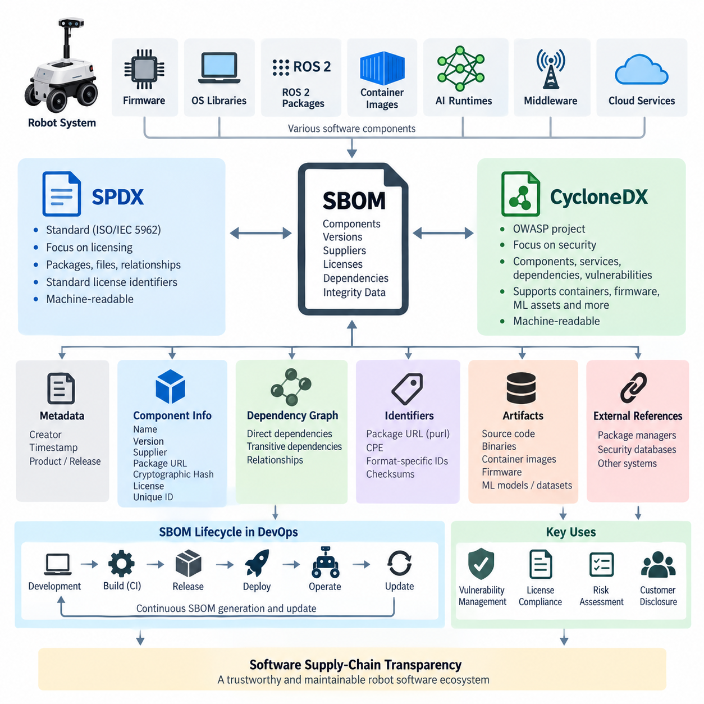{width="7.268055555555556in" height="7.268055555555556in"}

소프트웨어 자재 명세서(Software Bill of Materials, SBOM)는 제품 또는 소프트웨어 시스템에 포함된 소프트웨어 구성요소(Software Component)를 설명하는 구조화된 목록이다. 여기에는 구성요소 이름, 버전, 공급자, 라이선스(License), 패키지 식별자(Package Identifier), 의존성 관계(Dependency Relationship), 무결성 데이터(Integrity Data) 등이 기록된다. 로보틱스(Robotics)에서는 ROS 2 패키지, 운영체제 라이브러리, 펌웨어(Firmware), 컨테이너 이미지(Container Image), AI 런타임(Runtime), 통신 미들웨어(Middleware), 로봇 및 클라우드 시스템에 배포되는 서드파티 유틸리티(Third-Party Utility)까지 SBOM의 관리 대상이 될 수 있다.

SBOM의 기본 목적은 소프트웨어 공급망 투명성(Software Supply-Chain Transparency)을 확보하는 것이다. 현대의 소프트웨어는 자체 개발한 소스 코드만으로 만들어지는 경우가 드물며, 오픈소스 라이브러리(Open-Source Library), 상용 SDK, 운영체제 패키지, 미들웨어, 컨테이너 계층(Container Layer), 외부에서 관리되는 의존성(Dependency)을 조합하여 구성된다. 구조화된 목록이 없다면 개발 조직은 출시된 로봇에 어떤 서드파티 구성요소가 포함되어 있는지 정확하게 파악하기 어렵고, 취약점 대응(Vulnerability Response), 라이선스 준수(License Compliance), 장기 유지보수(Long-Term Maintenance)가 훨씬 어려워진다.

SBOM은 단순히 라이브러리를 나열한 정적 목록(Static List) 이상의 개념으로 이해해야 한다. 소프트웨어 패키지는 개발자가 직접 설치하지 않은 다른 패키지에 의존하는 경우가 많기 때문에 의존성 관계(Dependency Relationship)가 특히 중요하다. 이러한 전이 의존성(Transitive Dependency)은 의존성 그래프(Dependency Graph)의 여러 단계에 걸쳐 확장될 수 있다. 따라서 유용한 SBOM은 구성요소와 관계를 함께 표현하여 취약하거나 라이선스 문제가 있는 패키지가 어떤 경로로 배포 소프트웨어 이미지(Deployed Software Image)에 포함되었으며 어떤 상위 애플리케이션이 이에 의존하는지를 추적할 수 있어야 한다.

로봇 시스템(Robotic System)은 이기종 컴퓨팅 환경(Heterogeneous Computing Environment)에 걸쳐 소프트웨어 스택(Software Stack)이 구성되기 때문에 이러한 문제가 특히 복잡하다. 하나의 자율주행 로봇(Autonomous Robot)에도 임베디드 펌웨어(Embedded Firmware), 리눅스 엣지 컴퓨터(Linux Edge Computer), ROS 2 미들웨어, 내비게이션 패키지(Navigation Package), GPU 라이브러리, AI 추론 프레임워크(AI Inference Framework), 컨테이너화된 애플리케이션(Containerized Application), 클라우드 연계 플릿 서비스(Cloud-Connected Fleet Service)가 포함될 수 있다. 따라서 SBOM 관리는 독립적인 보안 활동이 아니라 CI/CD, 컨테이너화(Containerization), 배포(Deployment), 모니터링(Monitoring), HIL 시험과 연결되는 로봇 데브옵스(Robot DevOps) 및 머신러닝 운영(MLOps)의 일부로 다루는 것이 적절하다.

SPDX(Software Package Data Exchange)는 리눅스 재단(Linux Foundation) 생태계에서 발전하여 ISO/IEC 5962로 표준화된 체계로, 소프트웨어 구성요소, 라이선스, 저작권(Copyright), 보안(Security), 출처 정보(Provenance Information)를 기계 판독 가능(Machine-Readable)한 형태로 전달하기 위한 프레임워크(Framework)를 제공한다. SPDX 문서는 패키지와 파일을 식별하고 이들 사이의 관계를 표현할 수 있다. SPDX 식별자(Identifier)는 소프트웨어 라이선스를 표준화된 표현으로 기술하는 기능도 제공하여 자동화 시스템이 복잡한 의존성 트리에 연결된 라이선스 의무사항을 분석할 때 발생하는 모호성을 줄여준다.

SPDX 표현(Representation)은 일반적으로 문서(Document), 패키지(Package), 파일(File), 코드 조각(Snippet), 라이선스(License), 체크섬(Checksum), 외부 참조(External Reference), 관계(Relationship) 등의 요소를 모델링한다. 하나의 패키지가 특정 파일을 포함하거나 다른 패키지에 의존한다는 관계를 선언할 수 있으며, 외부 참조를 이용하여 구성요소를 패키지 관리자(Package Manager) 또는 보안 데이터베이스(Security Database)와 연결할 수도 있다. 이러한 관계 중심 구조(Relationship-Oriented Structure)를 통해 SBOM은 소프트웨어 구성을 단순한 패키지 이름과 버전의 표가 아니라 그래프(Graph) 형태로 표현할 수 있다.

CycloneDX는 널리 채택되고 있는 또 다른 SBOM 명세(Specification)로, OWASP를 중심으로 소프트웨어 공급망(Software Supply Chain)과 애플리케이션 보안(Application Security) 활용에 중점을 두고 발전하였다. CycloneDX는 구성요소(Component), 서비스(Service), 의존성(Dependency), 취약점(Vulnerability), 라이선스, 해시(Hash), 관련 메타데이터(Metadata)를 표준화된 기계 판독 구조로 표현한다. 또한 일반적인 소프트웨어 패키지뿐만 아니라 컨테이너(Container), 서비스, 펌웨어, 하드웨어 관련 요소, 머신러닝 자산(Machine-Learning Asset) 등 현대의 소프트웨어 집약적 시스템(Software-Intensive System)에 필요한 다양한 자산을 기술할 수 있다.

SPDX와 CycloneDX는 상당한 기능적 영역을 공유하지만 역사적으로 강조해 온 부분에는 차이가 있다. SPDX는 소프트웨어 라이선스, 지식재산권 정보(Intellectual-Property Information), 소프트웨어 구성정보 교환(Software Composition Exchange)을 중심으로 발전했으며, CycloneDX는 보안 중심의 자재 명세서(Security-Oriented Bill of Materials) 개념에서 발전하였다. 그러나 실제 데브섹옵스(DevSecOps) 환경에서는 두 형식 모두 광범위한 소프트웨어 공급망 관리에 활용된다. 따라서 어떤 형식을 선택할지는 고객 요구사항(Customer Requirement), 규제 요구사항(Regulatory Expectation), 기존 보안 도구(Security Tool), 조직의 개발 인프라(Development Infrastructure)와의 상호운용성(Interoperability)을 고려하여 결정해야 한다.

SBOM 문서에는 일반적으로 누가 문서를 생성했는지, 언제 생성했는지, 어떤 소프트웨어 제품 또는 릴리스(Release)를 설명하는지를 나타내는 메타데이터가 포함된다. 구성요소 레코드(Component Record)에는 패키지 이름, 버전, 공급자(Supplier), 패키지 URL(Package URL), 암호학적 해시(Cryptographic Hash), 라이선스 정보, 고유 식별자(Unique Identifier) 등의 속성이 기록된다. 의존성 정보는 이러한 레코드를 서로 연결하여 자동화 도구가 직접 의존성(Direct Dependency)과 전이 의존성을 확인할 수 있게 한다. 이러한 식별자는 패키지 이름만으로는 여러 저장소와 취약점 데이터베이스 사이에서 구성요소를 정확하게 연계하기 어려울 수 있기 때문에 중요하다.

패키지 URL(Package URL, purl)은 생태계(Ecosystem), 네임스페이스(Namespace), 이름(Name), 버전(Version), 관련 한정자(Qualifier)를 이용하여 소프트웨어 패키지를 식별하는 데 널리 사용된다. 그 밖에도 공통 플랫폼 열거(Common Platform Enumeration, CPE) 참조 또는 형식별 식별자(Format-Specific Identifier)가 사용될 수 있다. 암호학적 해시는 기록된 아티팩트(Artifact)가 특정 바이너리(Binary) 또는 패키지와 일치한다는 추가적인 근거를 제공한다. 이러한 필드를 결합하면 SBOM 생성기(Generator), 취약점 스캐너(Vulnerability Scanner), 아티팩트 저장소(Artifact Repository), CI 파이프라인(Pipeline), 보안 관리 플랫폼(Security Management Platform) 사이의 기계 간 연계(Machine-to-Machine Correlation)를 향상시킬 수 있다.

SBOM의 수명주기(Lifecycle)는 소프트웨어 자체의 수명주기를 따라야 한다. 개발 브랜치(Development Branch), 릴리스 후보(Release Candidate), 운영 컨테이너(Production Container), 로봇 펌웨어 이미지(Robot Firmware Image), 실제 배포된 플릿 버전(Deployed Fleet Version)은 서로 다른 의존성 집합을 포함할 수 있다. 따라서 초기 개발 과정에서 한 번 생성된 SBOM은 빠르게 오래된 정보가 될 수 있다. 성숙한 데브옵스 프로세스(DevOps Process)는 빌드(Build) 과정에서 SBOM을 생성하거나 갱신하고 이를 변경 불가능한 릴리스 아티팩트(Immutable Release Artifact), 컨테이너 다이제스트(Container Digest), 펌웨어 버전 또는 소프트웨어 릴리스 식별자와 연결한다.

이러한 수명주기 통합(Lifecycle Integration)은 CI 파이프라인에서의 자동화된 SBOM 생성(Automated SBOM Generation)과 직접적으로 연결되며, 이는 해당 장의 다음 주제로 이어진다. 이후에는 SBOM 개념을 오픈소스 라이선스 분류(Open-Source License Classification), 컴플라이언스 스캐닝(Compliance Scanning), ROS 2 패키지 감사(Package Audit), AI 모델 및 데이터셋 출처 추적(Provenance Tracking), 의존성 취약점 추적(Dependency Vulnerability Tracking), 고객 공개(Customer Disclosure), 내부 지식재산권 관리(Internal Intellectual-Property Management), 사이버보안 표준(Cybersecurity Standard)과의 통합으로 확장한다.

ROS 2 로봇의 경우 최종 구성 목록에는 ROS 패키지, 데비안 패키지(Debian Package), 파이썬 모듈(Python Module), C/C++ 라이브러리, DDS 구현체(Implementation), CUDA 관련 라이브러리, 추론 런타임(Inference Runtime), 장치 SDK(Device SDK), 컨테이너 기반 이미지(Base Image) 등이 포함될 수 있다. 따라서 ROS 작업공간(Workspace)만 검사하는 것으로는 충분하지 않다. 의존성은 운영체제, 패키지 관리자, 소스 빌드(Source Build), 공급업체 SDK 설치 또는 컨테이너 계층 등에서 발생할 수 있으므로 SBOM 생성 과정에서는 수동으로 관리되는 의존성 선언만 확인하는 것이 아니라 실제 빌드 및 배포 환경(Build and Deployment Environment)을 반영해야 한다.

컨테이너화된 로봇 소프트웨어(Containerized Robot Software)는 애플리케이션 이미지(Application Image)가 기반 이미지(Base Image)의 구성요소를 상속하기 때문에 또 다른 관리 차원을 추가한다. 작은 애플리케이션 계층이라도 Ubuntu, CUDA, ROS 2 또는 다른 런타임 이미지에서 간접적으로 상속된 수백 개의 패키지를 포함할 수 있다. 따라서 SBOM 도구는 이러한 상속 구성요소(Inherited Component)를 식별하고 생성된 목록과 정확한 이미지 다이제스트(Image Digest) 사이의 연결을 유지해야 한다. 이를 통해 보고된 취약점이 특정 로봇 플릿(Robot Fleet)에 실제 배포된 이미지에 영향을 미치는지를 판단할 수 있다.

SBOM은 취약점 관리(Vulnerability Management)의 기반도 제공한다. 새로운 공통 취약점 및 노출(Common Vulnerabilities and Exposures, CVE)이 공개되면 보안 시스템은 영향을 받는 패키지 식별자와 버전을 저장된 SBOM과 비교할 수 있다. 모든 저장소(Repository)를 수동으로 검사하는 대신 어떤 제품, 소프트웨어 릴리스, 컨테이너 또는 로봇에 해당 구성요소가 포함되어 있는지를 식별할 수 있다. SBOM 자체가 취약점의 실제 악용 가능성(Exploitability)을 증명하는 것은 아니지만 조사 범위를 크게 줄이고 체계적인 취약점 분류 및 대응(Vulnerability Triage)을 지원한다.

라이선스 관리(License Management)는 동일한 구성요소 목록을 다른 목적으로 활용한다. 조직은 허용적 라이선스(Permissive License), 약한 카피레프트(Weak Copyleft), 강한 카피레프트(Strong Copyleft), 독점 라이선스(Proprietary License) 또는 기타 라이선스 조건이 적용되는 구성요소를 식별하고 배포 제품에 어떤 의무사항이 적용되는지 판단할 수 있다. 로봇 제품은 여러 생태계의 소프트웨어를 결합하므로 가능한 범위에서 이러한 과정을 자동화해야 한다. SBOM 정보는 전용 컴플라이언스 시스템(Compliance System)이 고지문(Notice)을 생성하고 예외사항(Exception)을 검토하며 릴리스별 라이선스 기록을 관리하기 위한 근거 계층(Evidence Layer)을 제공할 수 있다.

따라서 SBOM의 완전성(Completeness)은 SBOM 형식 자체만큼 중요하다. 구문적으로 올바른 SPDX 또는 CycloneDX 파일이라도 주요 구성요소가 누락되거나 버전이 부정확하고, 의존성 관계가 불완전하거나, 해당 문서를 실제 배포 아티팩트와 연결할 수 없다면 운영상 가치가 크게 떨어진다. 조직은 파일 생성 성공 자체를 완전한 소프트웨어 투명성으로 간주해서는 안 되며, 구성요소 포함 범위(Coverage), 식별자 정확성(Identifier Accuracy), 의존성 깊이(Dependency Depth), 출처(Provenance), 최신성(Freshness), 재현성(Reproducibility) 등을 측정 가능한 엔지니어링 데이터로 관리해야 한다.

로보틱스 데브옵스(Robotics DevOps)의 관점에서 가장 유용한 접근 방식은 SBOM을 소프트웨어 공급망의 지속적으로 관리되는 디지털 목록(Continuously Maintained Digital Inventory)으로 간주하는 것이다. 소스 제어(Source Control)는 개발자가 무엇을 변경했는지를 기록하고, CI는 소프트웨어가 어떻게 빌드되었는지를 기록하며, 아티팩트 저장소는 무엇이 생성되었는지를 보존한다. SBOM은 최종 아티팩트에 무엇이 포함되어 있는지를 설명한다. 이후 취약점 및 라이선스 시스템은 이 목록을 평가하고, 배포 기록(Deployment Record)은 각각의 아티팩트가 로봇, 시험 시스템, 엣지 컴퓨터, 클라우드 인프라 중 어디에서 실행되고 있는지를 식별한다.

궁극적으로 SPDX와 CycloneDX는 이러한 소프트웨어 구성정보를 표현하기 위한 표준화된 언어(Standardized Language)를 제공하여 개발(Development), 보안(Security), 컴플라이언스(Compliance), 제조(Manufacturing), 고객 환경(Customer Environment) 사이에서 정보를 교환할 수 있게 한다. 그 가치는 단순히 SBOM 파일 하나를 생성하는 데 있는 것이 아니라 구성요소 식별(Component Identity), 의존성 관계, 출처, 라이선스, 취약점, 릴리스 아티팩트를 추적 가능한 소프트웨어 수명주기(Traceable Software Lifecycle)로 연결하는 데 있다. 이러한 기반을 통해 로봇 시스템 전반에서 SBOM 생성 자동화, 컴플라이언스 분석, 취약점 추적, 소프트웨어 공급망 거버넌스(Software Supply-Chain Governance)를 체계적으로 수행할 수 있다.

## 11.2. Automated SBOM Generation in CI Pipeline [w/Code]

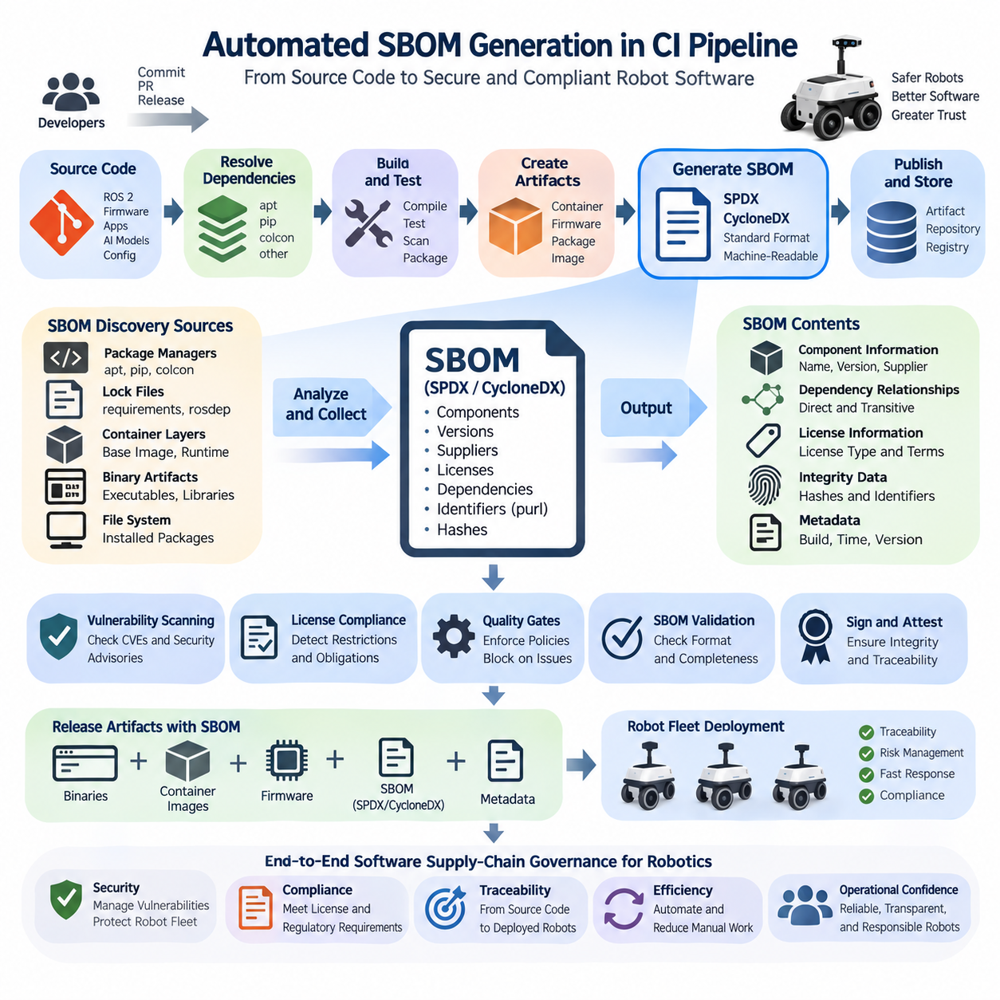{width="7.268055555555556in" height="7.268055555555556in"}

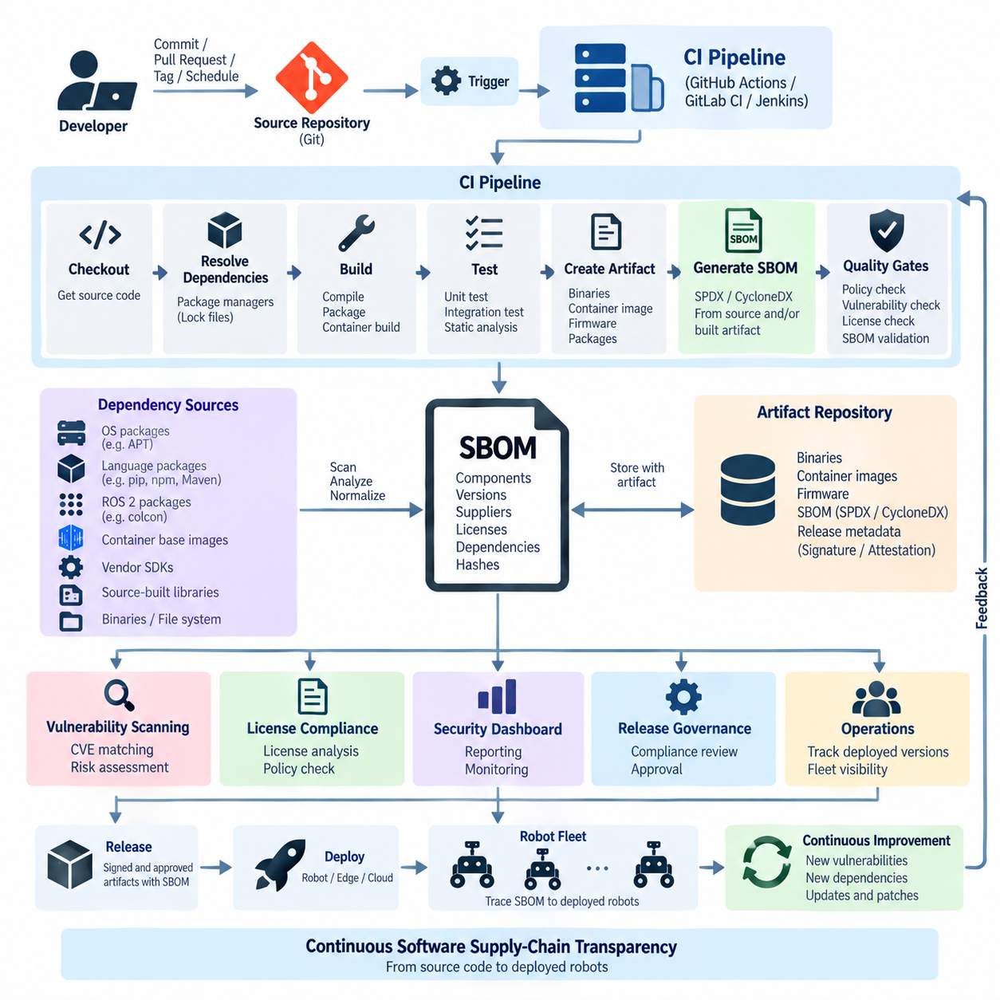{width="7.268055555555556in" height="7.268055555555556in"}

자동화된 소프트웨어 자재 명세서 생성(Automated SBOM Generation)을 지속적 통합 파이프라인(Continuous Integration Pipeline)에 적용하면 소프트웨어 구성 목록 작성이 수동 문서화 작업에서 반복 가능한 빌드 프로세스(Build Process)의 일부로 전환된다. 소스 코드가 컴파일(Compile), 패키징(Packaging), 또는 릴리스 아티팩트(Release Artifact)로 조립될 때마다 파이프라인은 의존성(Dependency)을 검사하고 이에 대응하는 소프트웨어 자재 명세서(Software Bill of Materials, SBOM)를 생성할 수 있다. 이를 통해 소프트웨어 구성정보를 로봇 시스템에 실제 전달되는 바이너리(Binary), 컨테이너(Container), 펌웨어(Firmware), 패키지(Package)와 지속적으로 동기화할 수 있다.

지속적 통합 파이프라인(CI Pipeline)은 소스 코드(Source Code)가 배포 가능한 아티팩트(Deployable Artifact)로 전환되는 통제된 과정을 이미 담당하기 때문에 SBOM을 생성하기에 효과적인 위치이다. 소스 저장소(Source Repository), 의존성 관리자(Dependency Manager), 컴파일러(Compiler), 컨테이너 빌더(Container Builder), 패키징 도구(Packaging Tool)가 이 단계에서 결합된다. 의존성이 확정되고 아티팩트가 조립된 이후 SBOM을 생성하면 개발자가 관리하는 의존성 선언에만 의존하지 않고 실제 생성된 소프트웨어의 구성을 설명할 수 있다.

일반적인 자동화 워크플로(Automated Workflow)는 커밋(Commit), 풀 리퀘스트(Pull Request), 릴리스 태그(Release Tag), 또는 예약 빌드(Scheduled Build)가 지속적 통합 시스템(CI System)을 실행하면서 시작된다. 파이프라인은 소스 코드를 가져오고 의존성을 해결하며 컴파일과 시험을 수행한 후 대상 아티팩트를 생성한다. 이후 SBOM 생성 단계(SBOM Generation Stage)가 작업공간(Workspace), 패키지 데이터베이스(Package Database), 컨테이너 파일시스템(Container Filesystem), 또는 생성된 바이너리 아티팩트를 분석하고 SPDX나 CycloneDX와 같은 표준 형식(Standardized Format)의 기계 판독 가능한 목록(Machine-Readable Inventory)을 생성한다.

SBOM 생성 단계의 위치는 최종 구성 목록의 정확성(Accuracy)에 영향을 준다. 소스 매니페스트(Source Manifest)에서 직접 SBOM을 생성하면 선언된 의존성을 조기에 파악할 수 있지만 최종 제품에 실제 포함된 모든 구성요소를 포착하지 못할 수 있다. 반대로 빌드된 컨테이너 이미지(Container Image)나 파일시스템에서 생성하면 설치된 패키지와 전이 의존성(Transitive Dependency)을 발견할 수 있다. 따라서 성숙한 파이프라인은 소스 수준 분석(Source-Level Analysis)과 아티팩트 수준 분석(Artifact-Level Analysis)을 결합하여 보다 광범위한 소프트웨어 구성 범위(Software Composition Coverage)를 확보할 수 있다.

자동화된 생성 도구(Automated Generation Tool)는 여러 메커니즘을 통해 구성요소를 발견한다. 패키지 관리자 메타데이터(Package-Manager Metadata), 잠금 파일(Lock File), 언어별 의존성 데이터베이스(Language-Specific Dependency Database), 운영체제 패키지 데이터베이스, 컨테이너 계층(Container Layer), 컴파일된 바이너리(Compiled Binary), 파일시스템 내용을 검사할 수 있다. 발견된 정보는 이름, 버전, 공급자(Supplier), 라이선스(License), 패키지 식별자(Package Identifier), 해시(Hash), 의존성 관계(Dependency Relationship)를 포함하는 구성요소 레코드(Component Record)로 정규화되며, 결과 문서는 해당 빌드의 소프트웨어 구성을 구조적으로 표현한다.

로보틱스(Robotics) 환경에서 SBOM 검색 과정은 이질적인 의존성 출처(Heterogeneous Dependency Source)를 고려해야 한다. ROS 2 애플리케이션은 colcon으로 빌드된 패키지, APT를 통해 설치된 데비안 패키지(Debian Package), pip로 설치된 파이썬 모듈(Python Module), 소스에서 빌드된 C 및 C++ 라이브러리, DDS 미들웨어(DDS Middleware), GPU 런타임(GPU Runtime), 공급업체 장치 SDK(Vendor Device SDK), 자체 개발 로봇 소프트웨어(Custom Robot Software)를 함께 포함할 수 있다. 따라서 자동화된 CI 워크플로는 하나의 패키지 관리자만으로 전체 로봇 소프트웨어 스택을 표현할 수 있다고 가정하지 않고 여러 의존성 영역(Dependency Domain)을 검사해야 한다.

컨테이너화된 로봇 애플리케이션(Containerized Robot Application)은 자동화된 SBOM 생성을 위한 특히 유용한 경계를 제공한다. 컨테이너 이미지가 빌드되면 SBOM 스캐너(SBOM Scanner)가 최종 이미지를 검사하여 기반 이미지(Base Image)에서 상속된 패키지와 빌드 과정에서 추가된 애플리케이션 전용 구성요소(Application-Specific Component)를 식별할 수 있다. 생성된 SBOM을 변경 불가능한 컨테이너 다이제스트(Immutable Container Digest)와 연결하면 보안 및 운영 조직은 특정 배포 이미지(Deployed Image)에 어떤 소프트웨어 구성 목록이 대응하는지 정확하게 판단할 수 있다.

생성된 SBOM은 임시적인 CI 출력(Temporary CI Output)이 아니라 릴리스 아티팩트(Release Artifact)로 관리해야 한다. 파이프라인은 이를 바이너리, 컨테이너 이미지, 펌웨어 패키지, 배포 매니페스트(Deployment Manifest), 릴리스 메타데이터(Release Metadata)와 함께 아티팩트 저장소(Artifact Repository) 또는 레지스트리(Registry)에 보존할 수 있다. SBOM을 커밋 식별자(Commit Identifier), 릴리스 버전, 빌드 번호(Build Number), 이미지 다이제스트(Image Digest), 암호학적 해시(Cryptographic Hash)와 연결하면 소스 코드, 빌드 실행, 소프트웨어 구성, 최종적으로 로봇에 배포된 아티팩트 사이의 추적성(Traceability)을 확보할 수 있다.

표준화된 출력 형식(Standardized Output Format)은 후속 자동화(Downstream Automation)를 가능하게 한다. SPDX와 CycloneDX 문서는 취약점 스캐너(Vulnerability Scanner), 라이선스 컴플라이언스 시스템(License-Compliance System), 소프트웨어 구성 분석 플랫폼(Software Composition Analysis Platform), 아티팩트 저장소, 보안 대시보드(Security Dashboard)에서 사용할 수 있다. 이를 통해 CI 파이프라인은 생성된 구성요소 정보가 보안 평가(Security Assessment), 컴플라이언스 검토(Compliance Review), 릴리스 거버넌스(Release Governance), 운영 모니터링(Operational Monitoring)으로 자동 전달되는 더 큰 소프트웨어 공급망 워크플로(Software Supply-Chain Workflow)의 출발점이 된다.

SBOM 생성(SBOM Generation)과 취약점 스캐닝(Vulnerability Scanning)은 서로 관련되어 있지만 구별되는 활동이다. SBOM은 어떤 구성요소가 존재하는지를 기록하고, 취약점 분석 시스템(Vulnerability Analysis System)은 이러한 구성요소를 알려진 공통 취약점 및 노출(Common Vulnerabilities and Exposures, CVE)과 보안 권고(Security Advisory) 등의 취약점 정보와 비교한다. 두 기능을 분리하면 SBOM은 소프트웨어 구성에 대한 지속적인 기록으로 유지되는 반면, 취약점 결과는 최초 소프트웨어 릴리스 이후 새로운 보안 정보가 공개됨에 따라 계속 갱신될 수 있다.

라이선스 분석(License Analysis)도 유사한 방식으로 통합할 수 있다. CI 파이프라인이 소프트웨어 구성요소와 관련 라이선스를 식별하면 자동화된 정책(Automated Policy)을 이용하여 라이선스 정보 누락, 금지된 구성요소(Prohibited Component), 호환되지 않는 라이선스 조건(Incompatible Licensing Condition), 추가 검토가 필요한 패키지를 탐지할 수 있다. 제품 출하 직전에 라이선스 문제를 발견하는 대신 개발 초기부터 컴플라이언스 검사(Compliance Check)를 도입하고 새로운 의존성이 로봇 소프트웨어 스택에 추가될 때마다 지속적으로 변경 사항을 평가할 수 있다.

품질 게이트(Quality Gate)는 SBOM 관련 탐지 결과가 빌드 또는 릴리스를 차단해야 하는지를 결정할 수 있다. 예를 들어 필수 구성요소 메타데이터가 누락되거나 금지된 의존성이 발견되거나 보안 정책(Security Policy)이 허용할 수 없는 취약점을 식별하면 파이프라인이 해당 아티팩트를 거부하도록 구성할 수 있다. 그러나 구성요소가 존재한다는 사실만으로 실제 악용 가능성(Exploitability), 운영상 노출(Operational Exposure), 또는 실제 라이선스 비준수(License Noncompliance)가 확정되는 것은 아니므로 자동 차단은 명확한 정책과 예외 처리 메커니즘(Exception Mechanism)에 따라 관리해야 한다.

재현성(Reproducibility)도 중요한 요구사항이다. 동일한 소스 리비전(Source Revision)과 고정된 의존성(Locked Dependency)을 동일한 조건에서 다시 빌드한다면 결과 SBOM도 실질적으로 일관성을 유지해야 한다. 의존성 잠금 파일(Dependency Lock File), 변경 불가능한 컨테이너 기반 이미지(Immutable Container Base Image), 고정된 패키지 버전(Pinned Package Version), 결정적 빌드 방식(Deterministic Build Practice), 통제된 CI 환경(Controlled CI Environment)은 이러한 특성을 향상시킨다. 재현 가능한 SBOM 생성은 예상하지 못한 변경을 쉽게 발견하게 하고 소프트웨어 공급망 기록에 대한 신뢰도를 높인다.

CI 파이프라인은 생성된 SBOM 자체도 검증해야 한다. 검증 과정에서는 문서가 선택한 SPDX 또는 CycloneDX 명세(Specification)를 준수하는지, 필수 메타데이터를 포함하는지, 의도한 제품과 버전을 정확히 식별하는지, 예상되는 구성요소 범주(Component Category)를 포함하는지를 확인할 수 있다. 또한 조직은 완전성(Completeness), 의존성 포함 범위(Dependency Coverage), 식별자 품질(Identifier Quality), 알려진 라이선스 또는 해시를 가진 구성요소의 비율 등을 측정하여 SBOM 품질을 관찰 가능한 엔지니어링 지표(Observable Engineering Metric)로 관리할 수 있다.

SBOM 생성 프로세스의 보안(Security)도 중요하다. 생성된 구성 목록은 출시된 소프트웨어에 무엇이 포함되어 있는지를 나타내는 증거(Evidence)가 되기 때문이다. 따라서 생성 도구와 해당 버전은 CI 환경에서 통제되어야 하며 생성된 문서는 신뢰할 수 있는 빌드 출력(Trusted Build Output)과 연결된 상태를 유지해야 한다. 암호학적 서명(Cryptographic Signing) 또는 증명 메커니즘(Attestation Mechanism)을 사용하면 SBOM을 특정 빌드 및 아티팩트와 더욱 명확하게 연결하여 구성 목록이 실제 출시된 소프트웨어와 일치하는지에 대한 모호성을 줄일 수 있다.

다중 아키텍처 로보틱스 파이프라인(Multi-Architecture Robotics Pipeline)은 추가적인 복잡성을 발생시킨다. AMD64 개발 또는 클라우드 이미지(Cloud Image)에 포함된 패키지는 Jetson이나 다른 엣지 컴퓨터(Edge Computer)에 배포되는 ARM64 이미지의 패키지와 동일하지 않을 수 있다. 펌웨어 대상(Firmware Target)은 또 다른 의존성을 포함할 수 있다. 따라서 CI 시스템은 하나의 구성 목록이 모든 플랫폼을 대표한다고 가정하지 않고 실제 대상 아티팩트(Target Artifact)별로 SBOM을 생성해야 한다. 이후 릴리스 메타데이터를 이용하여 각각의 아키텍처와 하드웨어 대상(Hardware Target)을 해당 SBOM과 연결할 수 있다.

로봇 플릿 배포(Robot Fleet Deployment)는 추적성을 CI 환경 밖으로 확장한다. 배포 시스템이 각 로봇에 설치된 소프트웨어 버전, 컨테이너 다이제스트 또는 펌웨어 이미지를 기록하면 SBOM을 실제 운영 자산(Operational Asset)과 연결할 수 있다. 이후 취약한 구성요소가 발견되었을 때 패키지 식별자에서 영향을 받는 아티팩트로, 다시 해당 아티팩트를 실행하고 있는 특정 로봇으로 추적할 수 있다. 이를 통해 모든 로봇을 무차별적으로 업데이트하는 대신 영향을 받는 시스템을 대상으로 한 수정(Targeted Remediation)이 가능해진다.

따라서 자동화된 SBOM 생성은 빌드 자동화(Build Automation)와 후속 소프트웨어 공급망 거버넌스(Software Supply-Chain Governance) 사이에 자연스럽게 위치한다. 소스 제어(Source Control)는 무엇이 변경되었는지를 정의하고, CI는 소프트웨어가 어떻게 빌드되었는지를 정의하며, 아티팩트는 무엇이 생성되었는지를 식별한다. SBOM은 해당 아티팩트 내부에 무엇이 포함되어 있는지를 정의한다. 이후 취약점 스캐닝, 라이선스 관리, 출처 추적(Provenance Tracking), 고객 공개(Customer Disclosure), 배포 기록(Deployment Record)이 이 정보를 활용하므로 소프트웨어 구성 목록을 반복해서 다시 구축할 필요가 없다.

로봇 데브옵스(Robot DevOps)와 머신러닝 운영(MLOps)의 장기적인 목표는 소스 코드와 서드파티 의존성(Third-Party Dependency)에서 시작하여 빌드(Build), 시험(Test), 릴리스(Release), 배포(Deployment), 운영(Operation), 업데이트(Update)까지 이어지는 연속적인 추적성 체계(Continuous Chain of Traceability)를 구축하는 것이다. 모든 주요 릴리스 아티팩트에 대해 SPDX 또는 CycloneDX SBOM을 자동으로 생성하면 소프트웨어 구성을 버전이 관리되는 운영 데이터(Versioned Operational Data)로 전환할 수 있다. 이를 통해 보안, 컴플라이언스, 엔지니어링, 플릿 운영(Fleet Operations) 조직이 로봇의 전체 수명주기(Robot Lifecycle)에 걸쳐 일관된 소프트웨어 공급망 정보를 공유할 수 있다.

## 11.3. Open Source License Classification GPL Apache MIT BSD

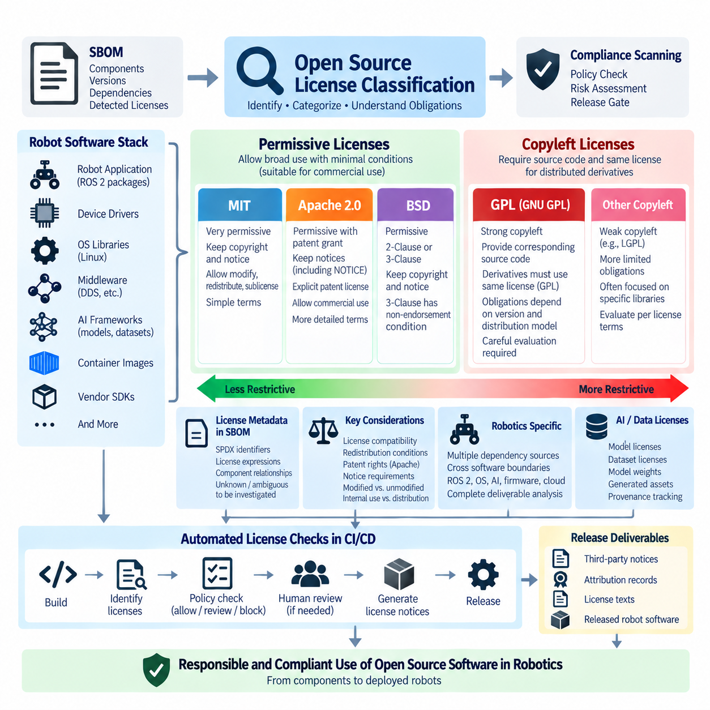{width="7.268055555555556in" height="7.268055555555556in"}

오픈소스 라이선스 분류(Open-Source License Classification)는 소프트웨어 구성요소에 적용되는 법적 권한, 의무사항, 재배포 조건(Redistribution Condition)을 체계적으로 이해하기 위한 방법을 제공한다. 로봇 데브옵스(Robot DevOps)에서는 하나의 로봇 소프트웨어 스택이 ROS 2 패키지, 리눅스 라이브러리, 장치 드라이버(Device Driver), AI 프레임워크(AI Framework), 미들웨어(Middleware), 컨테이너 이미지(Container Image), 공급업체 SDK(Vendor SDK)를 결합할 수 있기 때문에 이러한 분류가 중요하다. 따라서 이 장에서는 자동화된 SBOM 생성(Automated SBOM Generation) 이후, 자동화된 컴플라이언스 스캐닝(Automated Compliance Scanning) 이전에 라이선스 분류를 배치한다.

오픈소스 라이선스(Open-Source License)는 일반적으로 소프트웨어를 사용하고, 연구하고, 수정하고, 재배포할 수 있는 폭넓은 권한을 부여하지만 이러한 권한에 수반되는 조건에는 상당한 차이가 있다. 실용적인 엔지니어링 분류(Engineering Classification)는 허용적 라이선스(Permissive License)와 카피레프트 라이선스(Copyleft License)를 구분하고, 다시 약한 카피레프트(Weak Copyleft)와 강한 카피레프트(Strong Copyleft)를 구별한다. GPL, Apache, MIT, BSD는 이러한 스펙트럼의 주요 특성을 보여주며, 구성요소가 단순히 오픈소스인지 여부만 확인하는 것으로는 릴리스 거버넌스(Release Governance)에 충분하지 않다는 것을 보여준다.

허용적 라이선스(Permissive License)는 재배포에 상대적으로 제한적인 조건만을 부과하며 일반적으로 라이선스가 적용된 코드를 독점 소프트웨어(Proprietary Software) 또는 비공개 소스 제품(Closed-Source Product)에 포함하는 것을 허용한다. MIT, BSD, Apache 라이선스가 대체로 이 범주에 속하지만 각각의 정확한 조건에는 차이가 있다. 일반적으로 조직은 지정된 저작권(Copyright), 라이선스, 고지 정보(Notice Information)를 유지해야 하지만 원래 라이선스 조건을 충족한다면 주변의 독점 소프트웨어에는 별도로 선택한 라이선스를 적용할 수 있다.

MIT 라이선스(MIT License)는 의도적으로 간결하게 설계된 허용적 라이선스이다. 저작권 고지(Copyright Notice)와 허가 고지(Permission Notice)를 유지하는 것을 주요 조건으로 하여 소프트웨어의 사용, 복사, 수정, 병합, 게시, 배포, 재라이선스(Sublicensing), 복사본 판매를 허용한다. 또한 보증 및 책임 면책 조항(Warranty and Liability Disclaimer)을 포함한다. 이러한 단순성 때문에 MIT 라이선스 구성요소는 상용 로봇 소프트웨어에 비교적 쉽게 통합할 수 있지만, 필요한 고지사항은 해당되는 경우 반드시 유지해야 한다.

BSD 라이선스(BSD License)는 MIT와 유사한 허용적 철학을 따르지만 여러 형태가 존재한다. 널리 사용되는 2조항 BSD 라이선스(2-Clause BSD License)는 소스 및 바이너리 재배포 시 저작권, 라이선스 조건, 면책조항(Disclaimer)의 유지를 요구한다. 3조항 BSD 라이선스(3-Clause BSD License)는 여기에 기여자 이름을 허가 없이 파생 제품의 홍보에 사용하는 것을 제한하는 비보증 조건(Non-Endorsement Condition)을 추가한다. 따라서 라이선스 스캐너(License Scanner)는 모든 BSD 선언을 동일하게 처리하지 않고 실제 BSD 변형(Variant)을 식별해야 한다.

Apache 라이선스 2.0(Apache License 2.0)은 허용적 라이선스이지만 MIT나 BSD보다 명시적인 법적 메커니즘(Legal Mechanism)을 포함한다. 광범위한 저작권 사용 권한을 제공하며 기여자(Contributor)가 제공하는 명시적인 특허 라이선스(Patent License)를 포함하고, 재배포, 고지, 수정 사항, 특허 소송(Patent Litigation)과 관련된 조건을 규정한다. 프로젝트에 NOTICE 파일이 포함되어 있는 경우 재배포 과정에서 라이선스 조건에 따라 관련 귀속 고지(Attribution Notice)를 유지해야 할 수 있으므로 정확한 메타데이터와 릴리스 문서화가 중요하다.

Apache-2.0은 저작권뿐만 아니라 특허권(Patent Right)도 중요한 상업적 엔지니어링 환경에서 특히 의미가 있다. 이 라이선스에는 특정 기여자의 특허 청구권(Patent Claim)을 대상으로 하는 특허권 부여(Patent Grant)가 포함되어 있으며, 특정 상황에서 해당 특허권이 종료될 수 있는 조건도 규정한다. 이는 동등한 수준의 명시적 특허권 부여 조항을 포함하지 않는 보다 단순한 허용적 라이선스와 구별되는 특징이지만, 실제 법적 의무는 항상 적용되는 라이선스 원문과 배포 상황(Distribution Context)을 기준으로 평가해야 한다.

카피레프트 라이선스(Copyleft License)는 이와 다른 모델을 사용한다. 단순히 고지사항의 유지를 요구하는 것을 넘어 적용 대상 소프트웨어 또는 파생 저작물(Derivative Work)이 배포될 때 대응하는 소스 코드(Corresponding Source Code)의 제공과 특정 라이선스 조건의 적용을 요구할 수 있다. GNU 일반 공중 사용 허가서(GNU General Public License, GPL)는 대표적인 강한 카피레프트(Strong Copyleft) 계열이다. 따라서 GPL 적용 구성요소를 수정하거나 다른 소프트웨어와 결합하거나 배포되는 로봇 제품에 포함하는 경우 GPL 의무사항을 신중하게 검토해야 한다.

GPL 컴플라이언스(GPL Compliance)를 단순히 "GPL 소프트웨어를 사용하면 모든 것이 GPL이 된다"라는 규칙으로 축약해서는 안 된다. 적용되는 의무사항은 GPL 버전, 소프트웨어가 배포되는지 아니면 내부적으로만 사용되는지, 적용 대상 코드가 수정되었는지, 다른 코드와 어떤 방식으로 상호작용하는지 등의 요소에 따라 달라진다. 따라서 엔지니어링 조직은 패키지 이름이나 비공식적인 라이선스 명칭만으로 컴플라이언스 결정을 내리지 않고 정확한 라이선스 표현(License Expression)과 구성요소 관계(Component Relationship)를 기록해야 한다.

강한 카피레프트(Strong Copyleft)와 약한 카피레프트(Weak Copyleft)의 구분은 복잡한 소프트웨어 스택에서 중요해진다. GPL과 같은 강한 카피레프트 라이선스는 적용 대상 파생 저작물에 보다 광범위한 상호적 라이선스 의무(Reciprocal Licensing Obligation)를 부과할 수 있는 반면, 약한 카피레프트 라이선스는 일반적으로 특정 라이브러리나 수정된 구성요소를 중심으로 의무의 범위를 더 제한적으로 적용한다. 이 절에서는 GPL, Apache, MIT, BSD를 중심으로 다루지만 이러한 분류 체계는 실제 로봇 시스템에서 접하게 되는 추가 라이선스를 분석하기 위한 기반을 제공한다.

라이선스 호환성(License Compatibility)도 중요한 고려사항이다. 하나의 제품은 서로 다른 조건을 가진 여러 구성요소를 결합할 수 있으며, 두 라이선스가 모두 오픈소스라는 사실만으로 서로 호환된다는 의미는 아니다. 재배포, 고지, 소스 공개(Source Disclosure), 특허, 상호적 라이선스 조건을 의도된 소프트웨어 구성에서 동시에 충족할 수 있어야 한다. 따라서 의존성(Dependency)은 라이선스 목록의 개별 항목으로만 평가하는 것이 아니라 소프트웨어 아키텍처 내부의 관계(Relationship)로 평가해야 한다.

로보틱스(Robotics)는 오픈소스 구성요소가 여러 소프트웨어 경계를 넘나들기 때문에 추가적인 복잡성을 가진다. ROS 2 패키지는 시스템 라이브러리와 DDS 구현체(DDS Implementation)에 의존할 수 있고, 인지 애플리케이션(Perception Application)은 컴퓨터 비전 프레임워크(Computer-Vision Framework)를 포함할 수 있으며, AI 추론 서비스(AI Inference Service)는 GPU 런타임과 컨테이너 기반 이미지에 의존할 수 있다. 펌웨어, 임베디드 리눅스(Embedded Linux), 클라우드 서비스, 플릿 관리 소프트웨어(Fleet-Management Software) 역시 추가적인 라이선스를 도입할 수 있으므로 컴플라이언스 분석은 주 애플리케이션 저장소만이 아니라 전체 배포 대상(Complete Deliverable)을 포괄해야 한다.

소프트웨어 자재 명세서(Software Bill of Materials, SBOM)는 이러한 분류 프로세스의 기술적 기반을 제공한다. 각 구성요소 레코드(Component Record)는 패키지 및 버전을 탐지되거나 선언된 라이선스 정보와 연결할 수 있으며, 의존성 관계는 해당 구성요소가 최종 제품에 어떤 경로로 포함되는지를 보여준다. 표준화된 라이선스 식별자(Standardized License Identifier)와 표현식(Expression)을 사용하면 자동화 시스템이 이러한 정보를 보다 쉽게 처리할 수 있다. 알려지지 않았거나 모호하거나 서로 충돌하는 라이선스 메타데이터는 임의로 편리한 분류를 할당하기보다 추가 조사가 필요한 정보로 처리해야 한다.

라이선스 식별(License Identification)과 라이선스 컴플라이언스(License Compliance)는 서로 관련되어 있지만 별개의 작업이다. 분류는 어떤 라이선스가 적용되고 어떤 일반적 범주에 속하는지를 결정하며, 컴플라이언스는 실제 사용 및 배포 상황에서 어떤 의무사항이 발생하는지를 판단한다. Apache-2.0, MIT, BSD-3-Clause 또는 GPL-3.0으로 표시된 패키지는 중요한 입력정보를 제공하지만, 릴리스 결정을 내리기 위해서는 수정 여부, 링크 방식(Linking), 재배포 방식, 소스 제공 가능성(Source Availability), 고지사항, 제품 전달 모델(Product Delivery Model)에 대한 추가 정보가 필요하다.

CI/CD 시스템은 이러한 분류를 이용하여 자동화된 정책 검사(Automated Policy Check)를 구축할 수 있다. 필요한 메타데이터가 존재하는 허용적 라이선스 구성요소는 자동으로 통과시킬 수 있으며, 카피레프트 구성요소는 조직 정책에 따라 추가 검토(Additional Review) 대상으로 전달할 수 있다. 라이선스 정보가 누락된 구성요소, 사용자 정의 조건(Custom Terms), 서로 충돌하는 메타데이터, 승인되지 않은 라이선스 범주가 발견되면 경고 또는 품질 게이트(Quality Gate)를 실행할 수 있다. 자동화는 반복적인 검사를 줄이는 동시에 상황에 따른 법적 해석은 적절한 검토 절차에 남겨둘 수 있다.

라이선스 분류는 릴리스 문서(Release Documentation)의 생성도 지원한다. 소프트웨어 구성 목록이 정확한 라이선스 메타데이터와 연결되면 조직은 특정 릴리스에 대한 서드파티 소프트웨어 고지(Third-Party Software Notice), 귀속 기록(Attribution Record), 저작권 고지, 적용되는 라이선스 원문을 구성할 수 있다. 로봇 소프트웨어는 지속적으로 변경되므로 이러한 문서는 실제 배포 소프트웨어와 쉽게 불일치할 수 있는 별도의 수동 목록으로 관리하기보다 버전이 관리되는 빌드 정보(Versioned Build Information)에서 생성하는 것이 적절하다.

AI 기반 로보틱스(AI-Enabled Robotics)는 라이선스 관리를 기존 소스 코드 패키지를 넘어 확장한다. 로봇 시스템에는 사전학습 모델(Pretrained Model), 데이터셋(Dataset), 모델 가중치(Model Weight), 생성된 자산(Generated Asset), 특수 추론 라이브러리(Specialized Inference Library)가 점점 더 많이 포함되고 있으며, 이들의 라이선스 조건은 전통적인 오픈소스 소프트웨어 라이선스와 다를 수 있다. 따라서 이 장의 구조에서는 기존 라이선스 분류와 컴플라이언스 이후에 AI 모델 라이선스(AI Model License) 및 데이터셋 출처 추적(Dataset Provenance Tracking)을 명시적으로 다루어 소프트웨어 공급망 거버넌스를 더 넓은 피지컬 AI 아티팩트 수명주기(Physical AI Artifact Lifecycle)로 확장한다.

실용적인 로봇 데브옵스(Robot DevOps) 관점에서 GPL, Apache, MIT, BSD는 단순한 라이선스 이름이 아니라 소프트웨어의 통합, 수정, 재배포, 문서화, 유지보수 방식에 영향을 미치는 서로 다른 거버넌스 패턴(Governance Pattern)으로 이해해야 한다. SBOM 내부에서 정확한 분류를 유지하면 컴플라이언스 도구와 엔지니어링 프로세스가 적절한 정책을 일관되게 적용할 수 있으며, 개별 의존성에서 실제 출시된 로봇 소프트웨어까지의 추적성(Traceability)을 유지할 수 있다.

성숙한 라이선스 관리 프로그램(License-Management Program)은 궁극적으로 구성요소 탐색(Component Discovery), SBOM 생성, 라이선스 분류, 자동화된 스캐닝(Automated Scanning), 사람에 의한 검토(Human Review), 릴리스 문서화, 장기적인 출처 기록(Provenance Record)을 하나의 연속된 프로세스로 연결한다. 이를 통해 오픈소스 컴플라이언스를 개발 후반의 법적 체크리스트(Legal Checklist)가 아니라 지속적인 엔지니어링 프로세스(Continuous Engineering Process)로 전환할 수 있다. 빠르게 변화하는 소프트웨어 플릿(Software Fleet)을 관리하는 로보틱스 조직에서는 이러한 통합을 통해 불확실성을 줄이고 개발, 배포, 유지보수 전 과정에서 오픈소스 소프트웨어를 책임 있게 재사용할 수 있는 반복 가능한 기반을 구축할 수 있다.

## 11.4. License Compliance Scanning FOSSology FOSSA [w/Code]

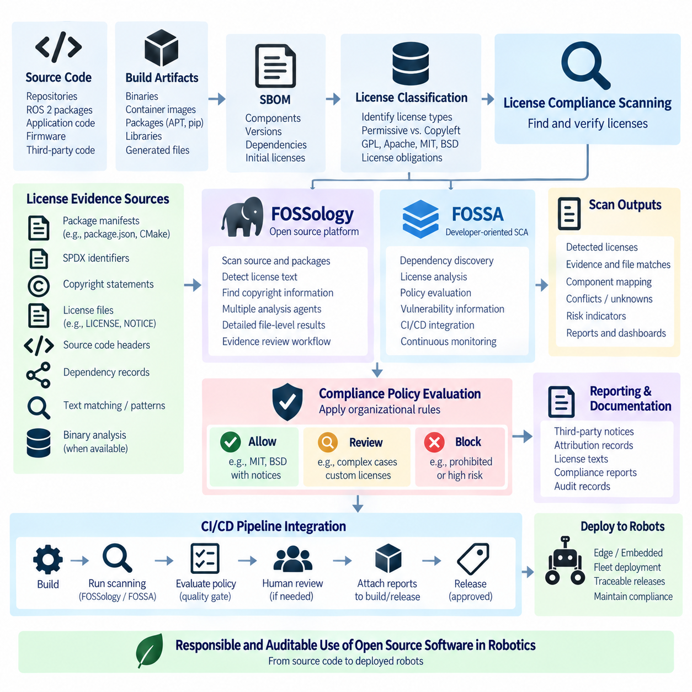{width="7.268055555555556in" height="7.268055555555556in"}

라이선스 컴플라이언스 스캐닝(License Compliance Scanning)은 오픈소스 라이선스 관리를 수동으로 유지되는 체크리스트에서 반복 가능한 소프트웨어 엔지니어링 프로세스(Software Engineering Process)로 전환한다. 소프트웨어 자재 명세서(Software Bill of Materials, SBOM)가 구성요소를 식별하고 라이선스 분류(License Classification)를 통해 일반적인 의무사항을 정의한 이후, 스캐닝 시스템(Scanning System)은 소스 코드, 의존성, 패키지 메타데이터, 고지사항(Notice), 기타 아티팩트(Artifact)를 검사하여 라이선스 관련 증거를 탐색한다. 로봇 데브옵스(Robot DevOps)에서는 이를 통해 빠르게 변화하는 ROS 2, 임베디드(Embedded), AI, 컨테이너(Container), 클라우드(Cloud) 소프트웨어 스택 전반의 추적성(Traceability)을 유지할 수 있다.

컴플라이언스 스캐너(Compliance Scanner)는 제품에 포함되는 소프트웨어에 어떤 라이선스가 적용되는지 확인하고, 발견된 증거가 선언된 메타데이터와 일치하는지를 판단한다. 탐지 과정에서는 패키지 매니페스트(Package Manifest), SPDX 식별자(SPDX Identifier), 저작권 표시(Copyright Statement), 라이선스 파일(License File), 소스 코드 헤더(Source-Code Header), 의존성 기록(Dependency Record), 라이선스 텍스트 패턴(Textual License Pattern) 등을 사용할 수 있다. 결과는 단순한 라이선스 이름 목록이 아니라 소프트웨어 출시 전에 엔지니어링 및 컴플라이언스 조직이 검토할 수 있는 증거 집합(Evidence Set)이 된다.

의존성 메타데이터(Dependency Metadata)는 불완전하거나 일관되지 않은 경우가 많기 때문에 스캐닝이 필요하다. 패키지 매니페스트에는 하나의 라이선스만 선언되어 있지만 번들로 포함된 소스 파일에는 추가적인 조건이 적용되는 코드가 존재할 수 있으며, 저장소(Repository)에 외부에서 복사한 서드파티 구성요소(Third-Party Component)가 포함될 수도 있다. 따라서 생성된 SBOM 정보는 중요한 출발점이지만 파일 수준(File-Level) 및 의존성 수준(Dependency-Level)의 검사를 수행하면 패키지 수준 메타데이터만으로는 확인할 수 없는 라이선스 정보를 발견할 수 있다.

FOSSology는 소프트웨어 라이선스 및 저작권 분석(Software License and Copyright Analysis)을 위해 설계된 오픈소스 플랫폼(Open-Source Platform)이다. 업로드된 소스 패키지와 저장소를 여러 전문 분석 에이전트(Analysis Agent)를 이용하여 검사하고 라이선스 관련 텍스트, 저작권 정보 및 기타 컴플라이언스 증거를 탐지할 수 있다. 또한 탐지 결과를 상세하게 검토할 수 있는 워크플로를 제공하여 자동화된 탐지 결과를 의심 없이 최종적인 법적 결론으로 간주하는 대신 검토자가 개별 파일을 확인하고 라이선스 정보를 판단할 수 있도록 한다.

FOSSology의 주요 강점 중 하나는 증거 중심 분석 모델(Evidence-Oriented Analysis Model)이다. 대규모 소스 트리(Source Tree)에는 서로 다른 출처, 라이선스 고지, 저작권 정보를 가진 수천 개의 파일이 포함될 수 있다. 자동화된 에이전트는 관련 자료를 찾아 검토 범위를 줄이고, 검토자는 탐지 결과를 확인하여 판단 결과를 기록할 수 있다. 따라서 감사 가능한 라이선스 검토 프로세스(Auditable License-Clearing Process)가 필요하거나 컴플라이언스 결론에 이르는 판단 근거를 보존해야 하는 조직에서 유용하게 활용할 수 있다.

FOSSology는 업로드된 소프트웨어를 스캔하고 결과를 검토하며 판단을 기록한 후 후속 릴리스 프로세스(Release Process)를 위한 보고서를 생성하는 구조화된 컴플라이언스 워크플로(Structured Compliance Workflow)도 지원할 수 있다. 로보틱스 조직에서는 ROS 2 작업공간(Workspace)의 소스 스냅샷(Source Snapshot), 펌웨어 패키지(Firmware Package), 공급업체가 제공한 소스 코드(Vendor-Delivered Source Code), 서드파티 라이브러리 등을 통제된 릴리스에 포함하기 전에 분석할 수 있다. 이렇게 생성된 증거는 CI/CD 시스템에서 관리되는 SBOM 기록을 보완할 수 있다.

FOSSA는 개발자 중심의 소프트웨어 구성 분석(Software Composition Analysis, SCA) 워크플로를 통해 소프트웨어 컴플라이언스에 접근한다. 의존성 탐색(Dependency Discovery), 라이선스 분석, 정책 평가(Policy Evaluation), 취약점 정보(Vulnerability Information), 프로젝트 모니터링(Project Monitoring)을 개발 프로세스와 통합한다. 주기적으로 소스 아카이브만 분석하는 방식에 한정되지 않고 저장소와 CI/CD 파이프라인에 통합할 수 있으므로 의존성 변경을 일상적인 엔지니어링 작업의 일부로 평가할 수 있다.

이러한 지속적 모델(Continuous Model)은 소프트웨어 의존성이 빠르게 변화하는 환경에서 특히 유용하다. 새로운 패키지를 추가하는 풀 리퀘스트(Pull Request)는 애플리케이션 코드 몇 줄만 수정하더라도 최종 제품의 라이선스 구성(Licensing Profile)을 변경할 수 있다. 컴플라이언스 분석을 CI와 통합하면 이러한 변경이 릴리스에 포함되기 전에 탐지할 수 있으므로 개발 수명주기(Development Lifecycle) 후반에 문제가 있는 의존성을 해결하는 데 필요한 비용을 줄일 수 있다.

따라서 FOSSology와 FOSSA는 정확히 동일한 워크플로를 구현하는 상호 대체 가능한 도구라기보다 서로 연관되지만 다른 운영 접근 방식(Operational Approach)을 나타낸다. FOSSology는 일반적으로 상세한 소스 검사(Source Inspection), 증거 검토(Evidence Review), 라이선스 검토 활동(License-Clearing Activity)에 적합하며, FOSSA는 의존성 관리, 개발자 워크플로, 정책 적용(Policy Enforcement), 지속적인 소프트웨어 구성 분석(Continuous Software Composition Analysis)과의 통합에 중점을 둔다. 조직은 거버넌스 요구사항(Governance Requirement)에 따라 하나의 접근 방식을 사용하거나 여러 도구를 결합할 수 있다.

스캐닝 파이프라인(Scanning Pipeline)은 라이선스 탐지(License Detection)와 컴플라이언스 정책(Compliance Policy)을 구분해야 한다. 탐지는 어떤 라이선스가 존재하고 이를 뒷받침하는 증거가 무엇인지를 식별하는 과정이며, 정책은 탐지된 조건이 특정 제품에 허용되는지를 결정하는 과정이다. 예를 들어 GPL, Apache-2.0, MIT 또는 BSD 코드를 발견하는 것은 사실에 기반한 분류 단계이며, 해당 구성요소를 승인할 수 있는지는 사용 방식, 수정 여부, 배포 모델(Distribution Model), 링크 관계(Linking Relationship), 조직의 컴플라이언스 규칙에 따라 달라진다.

정책 엔진(Policy Engine)은 탐지 결과를 자동 허용(Automatically Allowed), 검토 필요(Review Required), 릴리스 차단(Release Blocking) 등의 조치로 분류할 수 있다. 허용적 라이선스(Permissive License)는 일반적으로 고지사항 유지 정도만 필요할 수 있지만 카피레프트 라이선스(Copyleft License)는 소스 배포 및 통합 조건에 대해 보다 상세한 분석이 필요할 수 있다. 알려지지 않은 라이선스, 사용자 정의 조건(Custom Terms), 상충되는 탐지 결과, 누락된 귀속 정보(Attribution Data)는 임의로 편리한 라이선스를 추정하면 신뢰할 수 없는 컴플라이언스 기록이 생성될 수 있으므로 일반적으로 추가 조사가 필요하다.

자동화된 스캐닝에서는 오탐(False Positive)과 미탐(False Negative)을 피할 수 없는 문제로 고려해야 한다. 라이선스 텍스트가 수정되거나 축약되거나 주석(Comment)에 포함되거나 추가 조건과 결합될 수 있으며, 자동 생성 파일(Generated File)과 시험용 자산(Test Asset)이 불필요한 탐지 결과를 발생시킬 수도 있다. 반대로 바이너리 전용 구성요소(Binary-Only Component)는 스캐너가 분석할 수 있는 텍스트 증거가 거의 없을 수 있다. 따라서 자동화된 결과는 적절한 엔지니어링 및 법적 검토를 대체하는 것이 아니라 이를 지원하는 기계 생성 증거(Machine-Generated Evidence)로 취급해야 한다.

로보틱스(Robotics)는 소프트웨어 배포 대상(Software Deliverable)이 주 애플리케이션 저장소를 넘어 확장되기 때문에 상당한 복잡성을 추가한다. ROS 2 패키지는 APT와 pip에서 의존성을 가져올 수 있고, 컨테이너는 기반 이미지(Base Image)의 패키지를 상속하며, 펌웨어는 공급업체 라이브러리(Vendor Library)를 포함할 수 있고, GPU 또는 센서 SDK에도 별도의 조건이 적용될 수 있다. 따라서 컴플라이언스 스캐닝은 실제 빌드 그래프(Build Graph) 및 SBOM과 정렬되어 소스 수준 탐지 결과를 실제 출시되는 로봇 아티팩트에 포함된 구성요소와 연결할 수 있어야 한다.

CI 통합(CI Integration)을 통해 이러한 연계 과정을 반복 가능하게 만들 수 있다. 파이프라인은 SBOM을 생성하고, 라이선스 및 취약점 분석을 실행하며, 정책 규칙(Policy Rule)을 평가하고, 결과 보고서를 특정 빌드 또는 릴리스에 연결할 수 있다. 위반 사항이 정의된 정책 임계값(Policy Threshold)을 초과하면 파이프라인이 품질 게이트(Quality Gate)를 실패시키거나 사람의 승인(Human Approval)을 요청하도록 구성할 수 있다. 승인된 예외사항(Approved Exception)은 명시적으로 기록하여 향후 빌드에서 의도적으로 승인된 결정과 새롭게 발생한 컴플라이언스 문제를 구분할 수 있어야 한다.

기준선 관리(Baseline Management)를 적용하면 개발 조직이 변경되지 않은 탐지 결과를 반복해서 검토하는 문제를 줄일 수 있다. 기존 구성요소가 정의된 조건에 따라 분석되고 승인되면 이후 스캔에서는 새롭게 추가된 의존성, 변경된 라이선스 또는 수정된 소스 파일에 검토를 집중할 수 있다. 이러한 차등 분석 접근 방식(Differential Analysis Approach)은 수천 개의 안정적인 구성요소가 새로운 릴리스에서 추가된 소수의 중요한 변경 사항을 가릴 수 있는 대규모 로봇 소프트웨어 스택에서 특히 유용하다.

컴플라이언스 결과는 변경 불가능한 릴리스 식별자(Immutable Release Identifier)와 연결된 상태로 유지해야 한다. 개발 브랜치(Development Branch)에서 수행된 스캔 결과가 실제 고객에게 전달되는 컨테이너 이미지 또는 펌웨어 패키지를 반드시 설명하는 것은 아니다. 보고서를 커밋 해시(Commit Hash), 빌드 식별자(Build Identifier), SBOM 버전, 컨테이너 다이제스트(Container Digest), 릴리스 태그(Release Tag)와 연결하면 특정 컴플라이언스 결정이 대략적인 소스 스냅샷이 아니라 특정 소프트웨어 아티팩트와 대응한다는 증거를 확보할 수 있다.

라이선스 스캐닝의 결과는 서드파티 고지문(Third-Party Notice) 생성과 고객 공개(Customer Disclosure)에도 활용할 수 있다. 확인된 라이선스 정보, 저작권 기록, 귀속 요구사항(Attribution Requirement), 적용되는 라이선스 원문을 결합하여 릴리스 문서를 생성할 수 있다. 자동화는 수동 전사 오류(Manual Transcription Error)를 줄이지만, 스캐너가 여러 개의 후보 라이선스를 탐지하거나 상황에 따른 해석이 필요한 특수한 라이선스 조건을 이해하지 못할 수 있으므로 자동 생성된 문서 역시 검증해야 한다.

AI 기반 로보틱스(AI-Enabled Robotics)는 컴플라이언스의 범위를 더욱 확장한다. 기존의 소스 코드 스캐너(Source-Code Scanner)는 주로 소프트웨어 패키지를 대상으로 하지만 현대의 로봇 제품에는 사전학습 모델(Pretrained Model), 모델 가중치(Model Weight), 데이터셋(Dataset), 생성된 자산(Generated Asset), 특수 추론 구성요소(Specialized Inference Component)도 포함될 수 있다. 이러한 아티팩트에는 기존 오픈소스 소프트웨어 라이선스와 명확하게 대응되지 않는 조건이 적용될 수 있으므로 컴플라이언스 시스템은 궁극적으로 소프트웨어 스캐닝을 AI 모델 라이선스(AI Model Licensing) 및 데이터셋 출처 관리(Dataset Provenance Management)와 연결해야 한다.

성숙한 로봇 데브옵스(Robot DevOps) 워크플로는 SBOM 생성, 라이선스 분류, FOSSology 또는 FOSSA 방식의 스캐닝, 정책 평가, 사람에 의한 검토(Human Review), 예외 관리(Exception Management), 릴리스 문서화, 장기적인 추적성을 하나의 연속된 프로세스로 결합한다. 어떠한 개별 스캐너도 그 자체만으로 컴플라이언스를 확정하지 않는다. 엔지니어링의 목표는 어떤 구성요소가 사용되었고, 어떤 조건이 탐지되었으며, 탐지 결과가 어떻게 평가되었고, 최종적으로 어떤 승인된 아티팩트가 배포되었는지를 보여주는 통제된 증거 사슬(Controlled Evidence Chain)을 구축하는 것이다.

지속적인 개발 프로세스(Continuous Development Process)에 통합되면 라이선스 컴플라이언스 스캐닝은 제품 출하 직전에만 수행되는 작업이 아니라 소프트웨어 공급망 거버넌스(Software Supply-Chain Governance)의 일부가 된다. 개발자는 보다 빠른 피드백을 받을 수 있고, 컴플라이언스 전문가는 구조화된 증거를 확보하며, 릴리스 관리자는 반복 가능한 품질 게이트를 운영할 수 있다. 엣지(Edge), 임베디드, AI, 클라우드 환경에 걸쳐 오픈소스 소프트웨어를 결합하는 로봇 시스템에서 이러한 지속적 프로세스는 책임 있는 소프트웨어 재사용과 감사 가능한 제품 릴리스(Auditable Product Release)를 위한 확장 가능한 기반을 제공한다.

## 11.5. ROS2 Package License Audit and Compliance Report

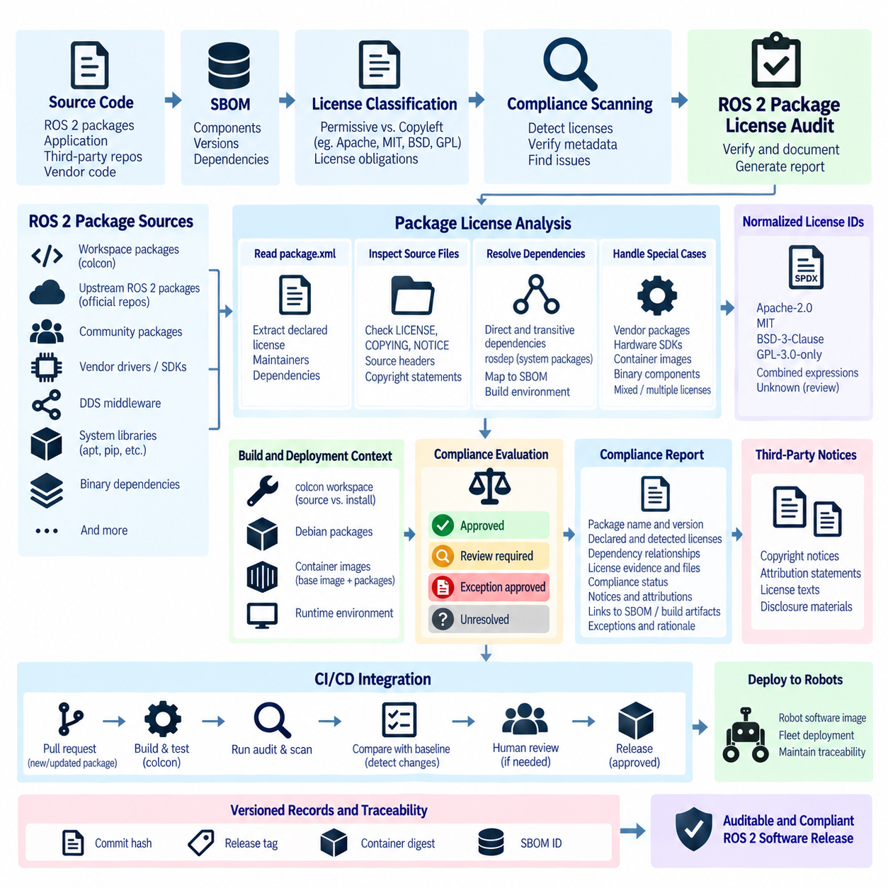{width="7.268055555555556in" height="7.268055555555556in"}

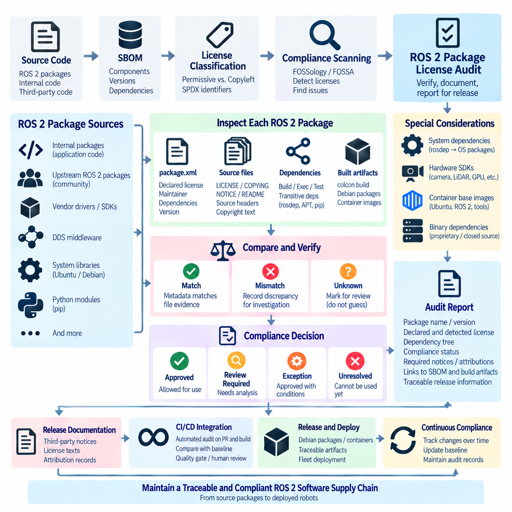{width="7.268055555555556in" height="7.268055555555556in"}

ROS 2 패키지 라이선스 감사(ROS 2 Package License Audit)는 로봇 소프트웨어 스택(Robot Software Stack)에 사용되는 패키지와 관련된 라이선스 조건을 식별하고, 검증하며, 문서화하는 체계적인 프로세스이다. 보다 광범위한 로봇 데브옵스(Robot DevOps) 구조에서 이 과정은 SBOM 생성(SBOM Generation), 라이선스 분류(License Classification), 자동화된 컴플라이언스 스캐닝(Automated Compliance Scanning)의 다음 단계에 위치한다. 감사 과정은 패키지 수준의 라이선스 정보를 릴리스 중심의 증거(Release-Oriented Evidence)로 전환하여 엔지니어링 검토, 컴플라이언스 판단, 장기적인 소프트웨어 추적성(Software Traceability)을 지원한다.

ROS 2 환경에서는 하나의 작업공간(Workspace)이 단일 조직에서 개발한 패키지만으로 구성되는 경우가 드물기 때문에 전용 감사가 필요하다. 로봇 애플리케이션은 내부 개발 패키지, 업스트림 ROS 2 패키지(Upstream ROS 2 Package), 커뮤니티 저장소(Community Repository), 공급업체 드라이버(Vendor Driver), DDS 미들웨어(DDS Middleware), 시스템 라이브러리(System Library), 파이썬 모듈(Python Module), 바이너리 의존성(Binary Dependency)을 결합할 수 있다. 각각의 구성요소가 서로 다른 라이선스 조건을 추가할 수 있으므로 애플리케이션의 주 저장소만 감사해서는 로봇에 실제 전달되는 전체 소프트웨어를 정확하게 나타낼 수 없다.

package.xml 매니페스트(Manifest)는 ROS 2 라이선스 분석의 중요한 출발점을 제공한다. ROS 패키지는 일반적으로 패키지, 유지관리자(Maintainer), 의존성, 라이선스 정보를 설명하는 메타데이터(Metadata)를 선언한다. 감사 도구(Audit Tool)는 작업공간 전체에서 이러한 선언을 추출하고 패키지 이름 및 버전과 연결할 수 있다. 그러나 선언된 메타데이터는 절대적인 증명이 아니라 하나의 증거로 취급해야 한다. 저장소 내용이나 함께 포함된 서드파티 파일(Third-Party File)에 추가적인 라이선스 조건이 존재할 수 있기 때문이다.

따라서 실용적인 감사는 패키지 메타데이터와 실제 소스 트리(Source Tree)를 비교해야 한다. LICENSE, COPYING, NOTICE, README, 소스 헤더(Source Header), 저작권 표시(Copyright Statement), 번들 의존성 정보(Bundled Dependency Information)는 적용되는 조건을 판단하기 위한 증거를 제공할 수 있다. package.xml에 선언된 라이선스와 저장소 내부 파일의 라이선스 정보가 서로 다르면 편리한 값을 자동으로 선택해서 해결하는 대신 해당 불일치를 기록하고 추가 조사해야 한다.

의존성 해결(Dependency Resolution)은 감사 범위를 크게 확장한다. ROS 2 패키지는 빌드(Build), 실행(Execution), 시험(Test) 또는 기타 의존성을 선언할 수 있으며, 이러한 의존성은 최종적으로 추가 ROS 패키지나 운영체제 구성요소로 연결될 수 있다. 전이 의존성(Transitive Dependency)은 애플리케이션의 소스 저장소에 직접 나타나지 않는 소프트웨어를 추가할 수 있다. 따라서 감사 과정에서는 ROS 의존성 정보와 SBOM 및 실제 빌드 환경(Build Environment)을 연계하여 어떤 구성요소가 최종 릴리스 아티팩트(Release Artifact)에 포함되는지를 확인해야 한다.

ROS 2 빌드 워크플로(Build Workflow)는 소스 패키지(Source Package)와 설치된 아티팩트(Installed Artifact)를 구분할 필요성도 만든다. colcon 작업공간에는 소스 디렉터리(Source Directory), 빌드 출력(Build Output), 설치 트리(Installation Tree), 생성된 메타데이터가 포함될 수 있으며, 실제 배포에서는 원래 작업공간 대신 데비안 패키지(Debian Package) 또는 컨테이너 이미지(Container Image)를 사용할 수 있다. 따라서 컴플라이언스 증거는 어떤 소스 패키지가 실제 배포되는 바이너리와 런타임 구성요소(Runtime Component)에 대응하는지를 식별해야 한다.

시스템 의존성(System Dependency)은 또 하나의 중요한 경계를 형성한다. rosdep은 ROS 의존성 키(Dependency Key)를 운영체제 패키지로 해결할 수 있으므로 단순한 ROS 의존성을 가진 것처럼 보이는 패키지가 실제로는 수많은 데비안 또는 플랫폼별 라이브러리(Platform-Specific Library)에 간접적으로 의존할 수 있다. 완전한 컴플라이언스 보고서(Compliance Report)는 ROS 패키지 메타데이터와 시스템 패키지 정보를 구분하면서도 이들 사이의 관계를 유지해야 한다. 이를 통해 작업공간 외부의 의존성이 컴플라이언스 분석에서 누락되는 것을 방지할 수 있다.

공급업체 패키지(Vendor Package)와 하드웨어 SDK(Hardware SDK)는 로보틱스에서 카메라, 라이다(LiDAR), 모터 컨트롤러(Motor Controller), GPU 플랫폼, 통신 장치 및 기타 하드웨어 전용 소프트웨어를 자주 통합하기 때문에 특별한 주의가 필요하다. ROS 래퍼(ROS Wrapper)는 허용적 라이선스(Permissive License)를 사용할 수 있지만 별도로 배포되는 독점 SDK(Proprietary SDK)에 의존할 수 있으며, 이 SDK에는 서로 다른 재배포 조건이 적용될 수 있다. 따라서 래퍼 패키지만 감사하면 실제 배포 가능한 로봇 시스템의 라이선스 의무사항을 불완전하게 파악할 수 있다.

컨테이너화된 ROS 2 배포(Containerized ROS 2 Deployment)는 분석 범위를 더욱 확장한다. 컨테이너는 애플리케이션 전용 패키지가 추가되기 전에 기반 이미지(Base Image)에서 Ubuntu 패키지, ROS 2 배포판(Distribution), 미들웨어, 개발 유틸리티(Development Utility), GPU 라이브러리를 상속할 수 있다. 감사 과정에서는 작업공간 수준의 탐지 결과를 컨테이너 수준의 SBOM 정보와 연결하여 컴플라이언스 보고서가 애플리케이션 팀이 관리하는 소스 코드만이 아니라 실제 배포되는 이미지를 설명하도록 해야 한다.

가능한 경우 라이선스 식별자(License Identifier)를 정규화(Normalization)해야 한다. Apache-2.0, MIT, BSD-3-Clause, GPL-3.0-only와 같은 표준화된 SPDX 식별자(SPDX Identifier)를 사용하면 임의의 텍스트 레이블보다 자동화된 비교와 보고의 신뢰성을 높일 수 있다. 복합적인 라이선스 상황(Compound Licensing Situation)에서는 대안 또는 조합을 표현하는 SPDX 라이선스 표현식(License Expression)이 필요할 수 있다. 알려지지 않았거나 사용자 정의된 라이선스 문구(Custom License Statement)는 유사한 표준 라이선스로 임의 변환하지 않고 명시적으로 검토 대상으로 표시해야 한다.

감사 프로세스에서는 탐지된 라이선스(Detected License)와 승인된 라이선스(Approved License)도 구분해야 한다. 탐지는 어떤 라이선스 증거가 존재하는지를 확인하는 과정이며, 승인은 특정 제품 및 배포 모델에서 해당 구성요소를 사용할 수 있는지에 대한 조직의 결정을 기록하는 과정이다. 이러한 구분을 통해 자동화 도구는 모든 탐지 결과를 법적 결론으로 전환하지 않고 증거를 수집할 수 있으며, 필요한 경우 엔지니어링, 컴플라이언스 또는 법무 검토(Legal Review)를 적용할 수 있는 통제된 지점을 제공한다.

ROS 2 컴플라이언스 보고서는 분석을 재현할 수 있을 정도로 충분한 정보를 보존해야 한다. 유용한 기록에는 패키지 식별정보(Package Identity), 버전 또는 리비전(Revision), 소스 위치(Source Location), 선언된 라이선스, 탐지된 라이선스 증거, 의존성 관계, 검토 상태(Review Status), 적용되는 고지사항, 관련 SBOM 또는 빌드 아티팩트(Build Artifact)에 대한 연결정보가 포함된다. 목적은 단순히 읽기 쉬운 문서를 만드는 것이 아니라 보고서와 해당 보고서가 설명하는 정확한 소프트웨어 릴리스 사이에 감사 가능한 연결(Auditable Connection)을 유지하는 것이다.

컴플라이언스 상태(Compliance Status)는 승인(Approved), 검토 필요(Review Required), 예외 승인(Exception Approved), 미해결(Unresolved)과 같은 통제된 범주로 표현할 수 있다. 각 상태의 의미는 개별 개발자가 독립적으로 추정하는 것이 아니라 조직 정책(Organizational Policy)에 따라 정의해야 한다. 라이선스 선언이 누락되거나 증거가 서로 충돌하거나 사용자 정의 조건이 존재하거나 예상하지 못한 카피레프트(Copyleft) 조건이 발견된 패키지는 기존 정책을 충족하는 구성요소의 자동 처리를 방해하지 않으면서 별도의 검토 절차로 전달할 수 있다.

서드파티 고지문 생성(Third-Party Notice Generation)은 감사 과정에서 자연스럽게 만들어지는 결과물이다. 패키지 식별정보와 라이선스 정보가 검증되면 릴리스 프로세스는 필요한 저작권 고지(Copyright Notice), 귀속 표시(Attribution Statement), 라이선스 원문(License Text), 기타 공개 자료(Disclosure Material)를 구성할 수 있다. 버전이 관리되는 감사 데이터(Versioned Audit Data)에서 이러한 기록을 생성하면 수동으로 유지되는 고지 파일이 실제 출시된 로봇 소프트웨어 이미지에 포함된 의존성과 달라지는 위험을 줄일 수 있다.

지속적 통합(Continuous Integration, CI)은 감사를 주기적으로 수행되는 작업에서 지속적 컴플라이언스(Continuous Compliance)로 전환할 수 있다. 풀 리퀘스트(Pull Request)가 ROS 2 의존성을 추가하거나 업데이트하면 파이프라인은 SBOM을 다시 생성하고, 패키지 라이선스 메타데이터를 검사하며, 컴플라이언스 스캐닝을 실행하고, 승인된 기준선(Approved Baseline)과 결과를 비교하여 중요한 변경 사항을 표시할 수 있다. 이를 통해 개발자는 릴리스 직전에 라이선스 문제를 발견하는 대신 의존성이 프로젝트에 추가되는 시점에 가까운 단계에서 문제를 해결할 수 있다.

기준선 비교(Baseline Comparison)는 대규모 ROS 2 시스템에서 특히 유용하다. 수백 개의 패키지가 릴리스 사이에서 변경되지 않을 수 있으므로 모든 구성요소를 매번 수동으로 다시 평가하는 것은 비효율적이다. 버전이 관리되는 컴플라이언스 기준선(Versioned Compliance Baseline)을 사용하면 자동화 시스템이 새롭게 추가된 패키지, 라이선스 변경, 업데이트된 의존성, 이전에 해결되지 않은 탐지 결과를 식별할 수 있다. 검토 작업은 변경분(Delta)에 집중하면서 승인 조건이 변하지 않은 구성요소에 대한 과거 증거는 계속 유지할 수 있다.

릴리스 추적성(Release Traceability)을 확보하려면 최종 보고서를 변경 불가능한 소프트웨어 식별자(Immutable Software Identifier)와 연결해야 한다. 커밋 해시(Commit Hash), 저장소 리비전(Repository Revision), 릴리스 태그(Release Tag), 컨테이너 다이제스트(Container Digest), 펌웨어 버전(Firmware Version), 빌드 식별자(Build Identifier), SBOM 식별자를 이용하여 이러한 관계를 구축할 수 있다. 이러한 연결이 없으면 컴플라이언스 보고서가 특정 시점의 작업공간을 정확하게 설명하더라도 고객 로봇에 실제 설치되거나 플릿 업데이트(Fleet Update)를 통해 배포된 소프트웨어에 대한 증거로서는 신뢰성이 낮아질 수 있다.

보고서에는 예외사항(Exception)과 그 판단 근거(Rationale)도 보존해야 한다. 일부 구성요소는 내부 전용 사용(Internal-Only Use), 특정 배포 아키텍처(Distribution Architecture), 지정된 고지사항 유지, 외부 릴리스 이전 교체와 같은 특정 조건에서 승인될 수 있다. 이러한 결정을 기록하면 향후 엔지니어가 동일한 문제를 반복적으로 다시 분석하는 것을 방지할 수 있으며, 패키지 버전이나 배포 조건이 변경되었을 때 기존 예외사항이 여전히 적용되는지를 자동화된 파이프라인이 판단하는 데 도움이 된다.

ROS 2 라이선스 감사는 궁극적으로 패키지 관리(Package Management)를 더 광범위한 소프트웨어 공급망 거버넌스(Software Supply-Chain Governance)와 연결한다. 패키지 매니페스트는 선언된 메타데이터를 식별하고, 의존성 도구는 관계를 파악하며, SBOM은 표준화된 구성 목록을 제공하고, 스캐너(Scanner)는 추가적인 라이선스 증거를 수집한다. 정책은 검토 요구사항을 결정하고 컴플라이언스 보고서는 승인된 결론을 보존한다. 이러한 메커니즘을 결합하면 개별 ROS 2 패키지에서 실제 배포되는 로봇 소프트웨어 아티팩트까지 이어지는 추적 가능한 경로를 구축할 수 있다.

따라서 로봇 데브옵스(Robot DevOps)에서 컴플라이언스 보고서는 일회성 법률 문서(One-Time Legal Document)가 아니라 버전이 관리되는 엔지니어링 아티팩트(Versioned Engineering Artifact)로 취급해야 한다. 이를 SBOM, 빌드 기록(Build Record), 릴리스 아티팩트, 배포 메타데이터(Deployment Metadata)와 함께 관리하면 소프트웨어의 변화에 따라 라이선스 관련 결정도 지속적으로 발전시킬 수 있다. 이러한 지속적 접근 방식은 ROS 2와 서드파티 소프트웨어의 책임 있는 재사용을 지원하는 동시에 소스 패키지에서 빌드, 릴리스, 실제 배포된 로봇 플릿(Deployed Robot Fleet)에 이르는 감사 가능한 증거(Auditable Evidence)를 제공한다.

## 11.6. AI Model License and Dataset Provenance Tracking

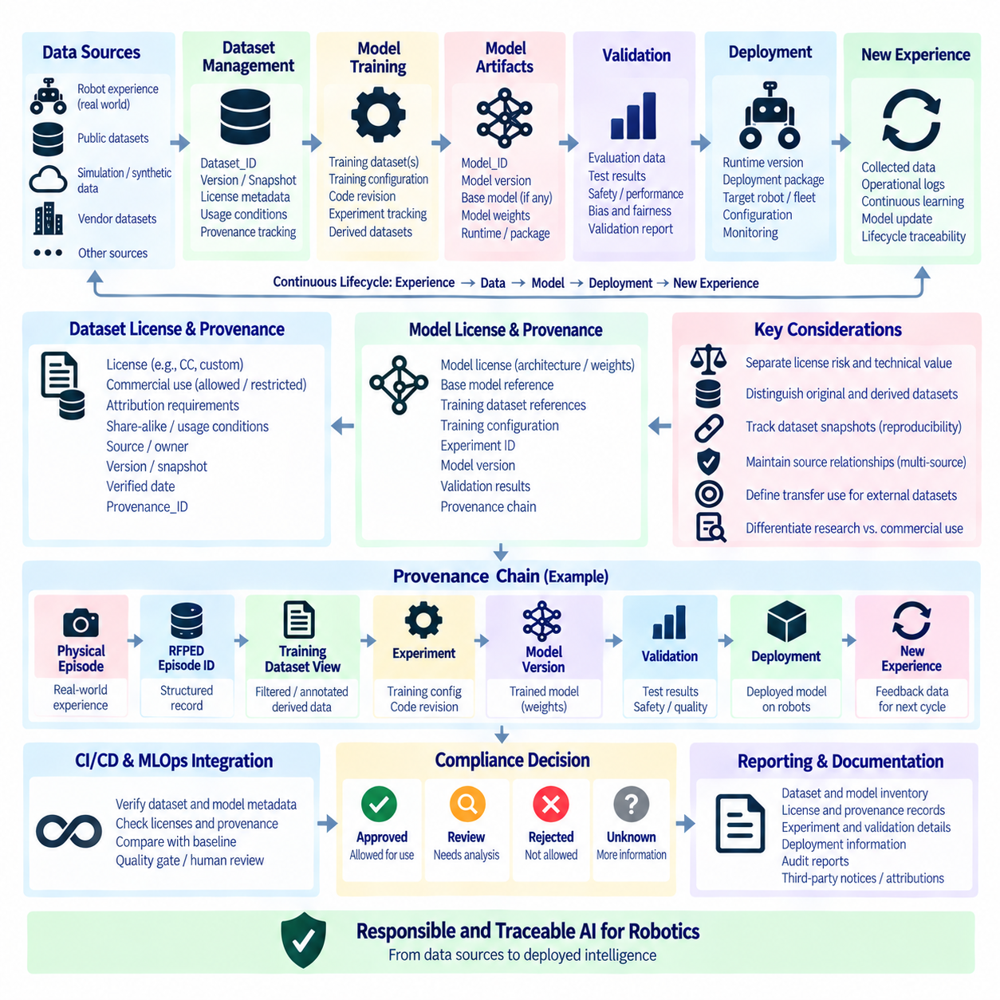{width="7.268055555555556in" height="7.268055555555556in"}

AI 모델 라이선스 관리(AI Model License Management)와 데이터셋 라이선스 관리(Dataset License Management)는 기존의 소스 코드 및 패키지를 넘어 머신러닝 아티팩트(Machine-Learning Artifact)까지 소프트웨어 공급망 거버넌스(Software Supply-Chain Governance)를 확장한다. 로봇은 사전학습 모델(Pretrained Model), 모델 가중치(Model Weight), 학습 데이터셋(Training Dataset), 파생 데이터셋(Derived Dataset), 임베딩(Embedding), 평가 데이터(Evaluation Data), 생성 자산(Generated Asset), 추론 런타임(Inference Runtime)에 의존할 수 있다. 각각의 아티팩트는 서로 다른 소유권, 라이선스, 사용 제한, 출처 정보(Provenance)를 가질 수 있으므로 모델과 데이터셋은 단순한 파일로 취급하지 않고 식별 가능한 라이프사이클 객체(Lifecycle Object)로 추적해야 한다.

AI 모델은 개발과 배포 전 과정에서 해당 버전과 연결된 상태로 유지되는 지속적인 식별자(Persistent Identity)를 가져야 한다. 유용한 메타데이터(Metadata)에는 Model_ID, Model_Version, 소스 또는 저장소 참조(Source or Repository Reference), 학습 데이터셋 참조(Training Dataset Reference), 런타임 버전(Runtime Version), 배포 패키지(Deployment Package), 검증 정보(Validation Information) 등이 포함된다. 모델 버전은 이를 생성한 데이터와 소프트웨어로부터 독립적인 것으로 간주해서는 안 된다. 모델을 재현하거나 감사(Audit)하려면 입력 데이터, 변환 과정, 학습 설정(Training Configuration), 그리고 생성된 아티팩트에 대한 정보가 필요하기 때문이다.

데이터셋의 식별정보(Dataset Identity) 역시 다양한 학습 또는 파생 뷰(Derived View)가 생성되는 동안 안정적으로 유지되어야 한다. 정본 데이터셋(Canonical Dataset)은 원래의 Dataset_ID를 유지하면서 파생된 학습 뷰(Training View)는 별도의 버전이 관리되는 식별정보를 가질 수 있다. 이러한 구분을 통해 원시 경험 데이터셋(Raw Experience Dataset)이 필터링, 어노테이션, 변환 또는 특정 학습 목적을 위해 만들어진 데이터와 혼동되는 것을 방지할 수 있다. 이러한 원칙은 Physical AI 시스템에서 특히 중요하다. 동일한 물리적 경험이 근본적으로 새로운 데이터셋이 되지 않고도 여러 학습 목적을 지원할 수 있기 때문이다.

데이터셋 라이선스(Dataset License)는 단순히 라이선스를 "확인해야 한다"고 기록하는 대신 구조화된 메타데이터(Structured Metadata)로 표현해야 한다. 관련 필드에는 License, Commercial Use, Attribution, Share-Alike, Source, Verified Date, 사용 조건(Usage Conditions), Provenance_ID 등이 포함될 수 있다. 상업적 사용 상태(Commercial-Use Status)는 ALLOWED, RESTRICTED, NON-COMMERCIAL ONLY, UNKNOWN 또는 REVIEW REQUIRED와 같은 통제된 값으로 표현할 수 있다. 이러한 구조를 사용하면 라이선스 정보를 기계가 읽을 수 있는 형태(Machine-Readable Form)로 관리하고 자동화된 컴플라이언스 워크플로(Automated Compliance Workflow)에 활용할 수 있다.

라이선스 위험(License Risk)과 기술적 유용성(Technical Usefulness)은 서로 독립적으로 평가해야 한다. 어떤 데이터셋은 인식(Perception), 내비게이션(Navigation), 조작(Manipulation), 월드 모델(World Model) 개발에 기술적으로 매우 유용할 수 있지만 특정 상업적 사용에 대해서는 제한을 가질 수 있다. 따라서 기술적 우선순위(Technical Priority)가 자동으로 프로덕션 학습(Production Learning) 사용 권한을 의미해서는 안 된다. 소프트웨어 공급망(Software Supply Chain)은 이 두 가지 차원을 독립적으로 유지해야 하며, 이를 통해 엔지니어링 팀은 데이터셋의 기술적 활용 가능성을 이해하고 컴플라이언스 팀은 의도된 사용이 허용되는지를 판단할 수 있어야 한다.

동적 데이터셋(Dynamic Dataset)은 공개된 이름이 동일하더라도 실제 내용이 변경될 수 있기 때문에 추가적인 버전 관리(Version Control)가 필요하다. 외부 저장소 또는 지속적으로 업데이트되는 플랫폼에서 가져오는 데이터셋은 이름, 가능한 경우 버전, 스냅샷 또는 커밋 식별자(Snapshot or Commit Identifier), 소스 위치(Source Location), 검증 날짜(Verification Date)를 기록해야 한다. 데이터셋 이름만 기록하는 것은 재현성(Reproducibility)을 보장하기에 충분하지 않다. 향후 다시 다운로드한 데이터셋에는 서로 다른 샘플이나 메타데이터가 포함될 수 있기 때문이다. 따라서 특정 스냅샷은 학습 실험(Training Experiment)의 출처 기록(Provenance Record)의 일부가 된다.

모델 출처 정보(Model Provenance)는 학습에 사용된 물리적 또는 운영 경험(Operational Experience)과 최종적으로 배포된 지능(Deployed Intelligence)을 연결해야 한다. 유용한 데이터 계보(Data Lineage)는 Physical Episode → RFPED Episode ID → Training Dataset View → Model Version → Validation → Deployment → New Experience와 같은 순서로 구성할 수 있다. 이를 통해 수집된 경험, 학습에 사용된 표현(Representation), 생성된 모델, 검증 증거(Validation Evidence), 그리고 이후 운영 데이터 사이의 지속적인 관계를 유지할 수 있다. 이러한 계보는 향후 지능 라이프사이클 관리(Intelligence Lifecycle Management)의 기반을 제공한다.

Physical AI에서는 하나의 모델이 여러 데이터 소스로부터 파생될 수 있기 때문에 출처 관리(Provenance)가 특히 중요하다. 학습 과정에서 내부 로봇 경험 데이터와 공개 데이터셋, 시뮬레이션 데이터(Simulation Data), 합성 데이터(Synthetic Data), 공급업체 제공 자원(Vendor-Provided Resource)을 함께 사용할 수 있다. 각각의 소스는 하나의 일반적인 학습 데이터셋 이름으로 통합하지 않고 계속 식별 가능해야 한다. 이렇게 하면 특정 모델 버전에 어떤 데이터셋이 기여했는지, 그리고 해당 소스의 사용 제한이 생성된 모델에도 어떤 방식으로 계속 적용될 수 있는지를 추적할 수 있다.

공개 데이터셋(Public Dataset)은 해당 데이터의 정보가 목표 로봇의 역량으로 어떻게 이전되는지에 따라서도 분류해야 한다. 자율주행(Autonomous Driving), 조작(Manipulation) 또는 다른 로봇 플랫폼을 위해 만들어진 데이터셋은 인식이나 표현 학습(Representation Learning)에 유용한 정보를 제공할 수 있지만, 다른 로봇의 고유한 행동에 대한 원시적인 행동 정답 데이터(Native Action Ground Truth)를 의미하지는 않을 수 있다. 명시적인 전이 분류(Transfer Classification)를 유지하면 엔지니어링 팀이 외부 데이터셋을 목표 로봇의 물리적 행동, 미션 또는 운용 조건을 직접 나타내는 데이터로 잘못 해석하는 것을 방지할 수 있다.

데이터셋 출처(Provenance)와 라이선스 정보는 서로 독립적인 기록으로 관리하기보다는 연결해야 한다. 데이터셋 레지스트리(Dataset Registry)는 소스, 소유자, 라이선스, 상업적 사용 조건, 귀속 요구사항(Attribution Requirement), 버전, 스냅샷, 검증 날짜를 식별할 수 있으며, 출처 기록은 해당 데이터셋이 어떻게 변환되고 사용되었는지를 식별할 수 있다. 이렇게 구성된 기록은 법적 추적성(Legal Traceability)과 기술적 재현성(Technical Reproducibility)을 모두 제공한다. 모델이 이후 배포되면 모델 레지스트리(Model Registry)는 해당 데이터셋 및 출처 기록을 참조할 수 있다.

동일한 원칙은 모델 가중치(Model Weight)에도 적용된다. 모델 아키텍처(Model Architecture)는 하나의 조건에 따라 공개되어 있지만 사전학습 가중치(Pretrained Weight)는 다른 조건에 따라 배포될 수 있다. 따라서 아키텍처, 소스 코드, 체크포인트(Checkpoint), 최종 미세조정 가중치(Fine-Tuned Weight)가 동일한 라이선스 조건을 가진다고 자동으로 가정해서는 안 된다. 각각의 아티팩트는 식별 가능한 기록을 가져야 하며, 해당 소스와 변환 이력(Transformation History)과의 관계를 명시해야 한다.

미세조정(Fine-Tuning)은 새로운 모델이 기존 체크포인트의 특성을 계승하면서 조직의 자체 학습 데이터를 추가할 수 있기 때문에 추가적인 출처 관리 요구사항(Provenance Requirement)을 발생시킨다. 기록에는 기반 모델 버전(Base Model Version), 추가 데이터셋, 학습 설정, 코드 리비전(Code Revision), 실험 식별자(Experiment Identifier), 생성된 모델 버전, 검증 결과가 포함되어야 한다. 이를 통해 조직은 어떤 외부 자산이 배포 모델에 기여했는지와 모델 적응 과정에서 어떤 내부 자산이 추가되었는지를 확인할 수 있다.

생성 데이터셋(Generated Dataset)과 파생 데이터셋(Derived Dataset)도 동일한 방식으로 관리해야 한다. 어노테이션(Annotation), 필터링(Filtering), 증강(Augmentation), 시뮬레이션(Simulation), 전처리(Preprocessing), 변환(Transformation)을 통해 새로운 학습 뷰가 생성될 수 있지만, 이것이 반드시 새로운 정본 데이터셋(Canonical Dataset)을 의미하는 것은 아니다. 따라서 원본 데이터와 파생 데이터 사이의 관계를 명시적으로 기록해야 한다. 이를 통해 데이터셋 식별정보(Dataset Identity)와 데이터셋 프로파일(Dataset Profile)의 차이를 유지하고, 파생 학습 아티팩트가 독립적으로 수집된 물리적 경험 데이터로 잘못 인식되는 것을 방지할 수 있다.

SBOM 개념은 모델, 데이터셋 및 관련 자원을 더 큰 AI 소프트웨어 공급망(AI Software Supply Chain)의 추적 가능한 구성요소로 취급함으로써 AI 아티팩트까지 확장할 수 있다. 릴리스 기록(Release Record)은 로봇 애플리케이션, 추론 런타임, 모델 패키지, 모델 버전, 데이터셋 참조, 출처 메타데이터를 서로 연결할 수 있다. 이를 통해 로봇에 어떤 소프트웨어 라이브러리가 포함되어 있는지만 확인하는 것이 아니라 어떤 모델과 데이터 자산이 로봇의 동작에 기여하는지도 확인할 수 있다.

CI/CD와 MLOps 파이프라인은 이러한 검사를 자동화할 수 있다. 학습 또는 릴리스 파이프라인은 아티팩트가 승격되기 전에 데이터셋 식별자, 스냅샷 참조, 라이선스 메타데이터, 모델 버전, 출처 연결정보, 배포 대상을 검증할 수 있다. 출처 정보가 누락되거나 라이선스 조건이 알려지지 않았거나 버전 참조가 일치하지 않는 경우 검토를 요청하도록 구성할 수 있다. 승인된 예외(Approved Exception)는 정책 메커니즘을 조용히 우회하는 대신 명시적으로 기록해야 한다.

모델 및 데이터셋 거버넌스(Model and Dataset Governance)는 개발 단계에서의 사용과 상업적 배포를 구분해야 한다. 어떤 데이터셋이나 모델은 연구 또는 평가 목적으로 사용할 수 있지만 상업적 사용, 재배포(Redistribution), 수정(Modification), 파생 저작물(Derivative Work)에 대해서는 제한을 가질 수 있다. 따라서 라이선스 자체뿐 아니라 의도된 사용 맥락(Intended Usage Context)도 함께 기록해야 한다. 기술적 검증 게이트(Technical Validation Gate)를 통과한 모델이라고 해서 모든 배포 상황에서 자동으로 사용 허가가 확보되는 것은 아니다.

추적성(Traceability)은 배포 이후에도 계속 유지되어야 한다. 배포된 모델 버전, 런타임 버전, 배포 패키지 식별자, 대상 로봇 또는 플릿(Fleet), 관련 출처 참조정보는 운영 기록(Operational Record)과 계속 연결되어야 한다. 새로운 모델이 승격되거나 이전 모델이 롤백(Rollback)될 때 시스템은 배포 상태와 모델 출처 사이의 관계를 보존해야 한다. 이를 통해 로봇 라이프사이클의 특정 시점에 어떤 지능 버전이 사용되었는지 감사 가능한 이력(Auditable History)을 만들 수 있다.

출처 계보(Provenance Chain)는 운영 중인 모델의 동작이 변경되었을 때 조사에도 활용할 수 있다. 배포된 모델 버전에서 학습 뷰, 데이터셋 스냅샷, 원본 에피소드, 소프트웨어 환경, 검증 결과까지 추적할 수 있다. 이것만으로 특정 동작의 원인이 자동으로 결정되는 것은 아니지만, 학습 이력을 기억에 의존하여 재구성하는 대신 체계적으로 조사하는 데 필요한 증거를 제공한다.

AI 모델 및 데이터셋 거버넌스는 궁극적으로 SBOM과 라이선스 관리 프레임워크를 더 광범위한 Physical AI 라이프사이클로 확장한다. 소프트웨어 구성요소(Software Component)는 실행 환경을 설명하고, 모델 기록(Model Record)은 학습된 지능을 설명하며, 데이터셋 기록(Dataset Record)은 학습 입력을 설명하고, 출처 기록(Provenance Record)은 이러한 아티팩트가 변환되는 과정 전체를 연결한다. 이러한 관계를 유지하면 보안(Security), 컴플라이언스(Compliance), 엔지니어링(Engineering), MLOps 팀이 AI 기반 로봇의 역량이 어떻게 생성되고 배포되었는지에 대해 일관된 관점을 공유할 수 있다.

장기적인 목표는 물리적 경험에서 배포된 지능까지 이어지는 지속적이고 재현 가능한 데이터 계보(Continuous and Reproducible Lineage)를 구축하는 것이다. 핵심 연결 구조는 Physical Experience → Dataset Identity → Dataset Snapshot → Training View → Experiment → Model Version → Validation → Deployment → New Experience이다. 라이선스 정보와 사용 제한(Usage Constraint)은 이 전체 과정에서 관련 소스 아티팩트에 계속 연결된 상태로 유지된다. 이러한 접근 방식은 AI 모델 및 데이터셋 거버넌스를 책임 있는 재사용(Responsible Reuse), 재현성(Reproducibility), 컴플라이언스 분석(Compliance Analysis), 추적 가능한 Physical AI 배포(Traceable Physical AI Deployment)를 지원하는 버전 관리형 엔지니어링 분야(Versioned Engineering Discipline)로 전환한다.

## 11.7. Third Party Dependency Vulnerability Tracking [w/Code]

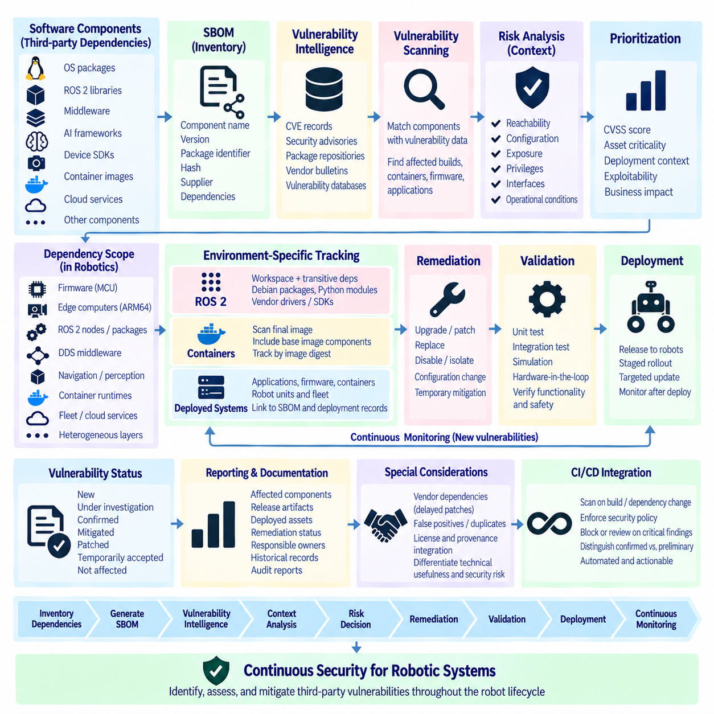{width="7.268055555555556in" height="7.268055555555556in"}

서드파티 의존성 취약점 추적(Third-Party Dependency Vulnerability Tracking)은 로봇 시스템에서 사용되는 외부 소프트웨어 구성요소의 보안 취약점(Security Vulnerability)을 식별하고, 어떤 릴리스 또는 배포된 아티팩트(Deployed Artifact)가 영향을 받는지를 지속적으로 확인하는 프로세스이다. 현대의 로봇은 운영체제 패키지, ROS 2 라이브러리, 미들웨어(Middleware), AI 프레임워크(AI Framework), 장치 SDK(Device SDK), 컨테이너 이미지(Container Image), 클라우드 서비스(Cloud Service)에 의존한다. 따라서 전체 수명주기에서 이러한 의존성을 추적하는 것은 소프트웨어 공급망 보안(Software Supply-Chain Security)과 로봇 데브옵스(Robot DevOps)의 기본 요소이다.

취약점 추적 프로세스(Vulnerability-Tracking Process)는 서드파티 구성요소(Third-Party Component)의 정확한 목록에서 시작한다. 소프트웨어 자재 명세서(Software Bill of Materials, SBOM)는 구성요소 이름, 버전, 패키지 식별자(Package Identifier), 해시(Hash), 공급자(Supplier), 의존성 관계(Dependency Relationship)를 기록함으로써 이러한 기반을 제공한다. 신뢰할 수 있는 구성요소 식별정보(Component Identity)가 없으면 취약점 정보를 실제 배포 소프트웨어와 정확하게 연계할 수 없다. 따라서 SBOM의 완전성(Completeness)과 버전 정확성(Version Accuracy)은 후속 보안 분석의 효과에 직접적인 영향을 미친다.

취약점 정보(Vulnerability Information)는 공통 취약점 및 노출(Common Vulnerabilities and Exposures, CVE) 기록, 보안 권고(Security Advisory), 패키지 저장소(Package Repository), 공급업체 보안 공지(Vendor Bulletin), 취약점 데이터베이스(Vulnerability Database) 등을 통해 지속적으로 공개된다. 자동화 시스템은 이러한 정보를 SBOM 또는 의존성 목록에 기록된 구성요소 식별정보와 비교한다. 일치하는 항목이 발견되면 조직은 어떤 빌드(Build), 컨테이너, 펌웨어 패키지(Firmware Package), 로봇 애플리케이션 또는 플릿 배포(Fleet Deployment)에 추가 조사가 필요한지를 확인할 수 있다.

패키지 식별자(Package Identifier)는 신뢰할 수 있는 연계를 위해 중요하다. 패키지 URL(Package URL, purl)은 생태계(Ecosystem), 네임스페이스(Namespace), 패키지 이름, 버전을 표현할 수 있으며, 공통 플랫폼 열거(Common Platform Enumeration, CPE) 식별자는 다른 취약점 기록에서 영향을 받는 제품을 식별하는 데 사용될 수 있다. 패키지 이름만으로는 서로 다른 생태계에 유사한 이름의 구성요소가 존재할 수 있기 때문에 모호성이 발생할 수 있다. 정규화된 식별자(Normalized Identifier)는 SBOM 생성기, 취약점 스캐너(Vulnerability Scanner), 아티팩트 저장소(Artifact Repository), 보안 관리 플랫폼(Security-Management Platform) 사이의 일치 정확도를 높인다.

탐지된 취약점을 배포된 로봇에서 실제로 악용 가능한 취약점(Exploitable Vulnerability)이라고 자동으로 해석해서는 안 된다. 취약한 라이브러리가 존재하더라도 영향을 받는 함수가 실제로 호출되지 않을 수 있고, 취약한 기능이 비활성화되어 있거나 시스템 아키텍처(System Architecture)가 필요한 공격 경로(Attack Path)를 차단하고 있을 수 있다. 따라서 취약점 추적에서는 구성요소 탐지와 함께 도달 가능성(Reachability), 설정(Configuration), 노출(Exposure), 권한(Privilege), 인터페이스(Interface), 운영 조건(Operational Condition)을 상황에 맞게 평가한 이후 수정 우선순위를 결정해야 한다.

심각도 점수(Severity Score)는 유용한 정보를 제공하지만 우선순위 결정의 유일한 기준으로 사용해서는 안 된다. 공통 취약점 점수 시스템(Common Vulnerability Scoring System, CVSS) 지표는 취약점의 기술적 특성을 설명할 수 있지만 실제 로봇 환경은 운영상의 관련성(Operational Relevance)을 결정한다. 플릿 관리 소프트웨어(Fleet-Management Software)에서 외부에 노출된 취약점은 격리된 개발 도구에서 발견된 동일한 심각도의 취약점과 다르게 처리할 필요가 있다. 따라서 자산 중요도(Asset Criticality)와 배포 환경(Deployment Context)을 일반적인 취약점 점수와 함께 고려해야 한다.

로보틱스(Robotics)는 의존성이 이기종 컴퓨팅 계층(Heterogeneous Computing Layer)에 분산되어 있기 때문에 독특한 취약점 관리 문제를 발생시킨다. 자율 로봇(Autonomous Robot)은 마이크로컨트롤러 펌웨어(Microcontroller Firmware), ARM64 엣지 컴퓨터(Edge Computer), GPU 라이브러리, ROS 2 노드(Node), DDS 미들웨어, 내비게이션 소프트웨어(Navigation Software), 인지 프레임워크(Perception Framework), 컨테이너 런타임(Container Runtime), 원격 플릿 서비스(Remote Fleet Service)를 포함할 수 있다. 따라서 하나의 취약점 관리 프로세스는 임베디드(Embedded), 엣지(Edge), 애플리케이션(Application), AI, 네트워크(Networking), 클라우드 구성요소 전반의 탐지 결과를 연계해야 한다.

ROS 2 의존성 추적(ROS 2 Dependency Tracking)은 작업공간(Workspace)에 표시되는 패키지를 넘어 확장되어야 한다. ROS 패키지는 다른 ROS 패키지, 데비안 패키지(Debian Package), 파이썬 모듈(Python Module), C/C++ 라이브러리, DDS 구현체(DDS Implementation)를 통해 전이 의존성(Transitive Dependency)을 추가할 수 있다. 공급업체 드라이버(Vendor Driver)는 독점 SDK(Proprietary SDK)에 추가로 의존할 수도 있다. ROS 의존성 정보를 SBOM 및 실제 배포 아티팩트와 결합하면 package.xml 파일이나 소스 저장소(Source Repository)만 분석했을 때 보이지 않는 취약한 구성요소까지 발견할 수 있다.

컨테이너(Container)는 유용하지만 복잡한 취약점 경계(Vulnerability Boundary)를 제공한다. 애플리케이션 이미지는 기반 이미지(Base Image)로부터 운영체제 라이브러리와 런타임 구성요소(Runtime Component)를 상속하기 때문에 애플리케이션 소스 코드가 변경되지 않았더라도 취약점이 존재할 수 있다. 따라서 컨테이너 스캐닝(Container Scanning)은 최종 이미지를 검사하고 탐지 결과를 변경 불가능한 이미지 다이제스트(Immutable Image Digest)와 연결해야 한다. 업데이트된 기반 이미지를 사용하여 애플리케이션을 다시 빌드하는 것만으로 애플리케이션 자체의 소스 코드를 수정하지 않고도 일부 취약점을 제거할 수 있다.

지속적 통합 파이프라인(Continuous Integration Pipeline)은 의존성 또는 빌드 아티팩트가 변경될 때마다 취약점 분석을 수행할 수 있다. SBOM을 생성한 이후 파이프라인은 식별된 구성요소를 최신 취약점 정보와 비교하고 정의된 보안 정책(Security Policy)을 적용할 수 있다. 새롭게 발견된 심각한 취약점은 검토를 요청하거나 릴리스 단계로의 승격(Promotion)을 차단할 수 있다. 그러나 자동화된 보안 게이트(Security Gate)가 실제 조치가 어려운 경고로 가득 차지 않도록 파이프라인 정책은 확인된 노출(Confirmed Exposure)과 초기 단계의 일치 결과(Preliminary Match)를 구분해야 한다.

취약점 정보는 시간이 지나면서 변경되기 때문에 지속적인 추적은 릴리스 이후에도 계속되어야 한다. 출시 당시 알려진 취약점이 없었던 소프트웨어 아티팩트도 수개월 후 새로운 CVE가 공개되면서 영향을 받을 수 있다. 따라서 저장된 SBOM을 사용하면 원래 제품을 다시 빌드하지 않고도 과거 릴리스에 대한 분석(Retrospective Analysis)을 수행할 수 있다. 보안 시스템은 기존 릴리스 목록을 새롭게 갱신된 취약점 정보와 반복적으로 비교하여 이미 배포된 아티팩트 중 재평가가 필요한 항목을 식별할 수 있다.

플릿 수준 추적성(Fleet-Level Traceability)은 취약점 정보를 실제 운영 조치(Operational Action)로 전환한다. 배포 기록(Deployment Record)이 각 로봇을 소프트웨어 릴리스, 컨테이너 다이제스트, 펌웨어 버전, SBOM과 연결하고 있다면 새롭게 공개된 취약점을 영향을 받는 구성요소에서 해당 아티팩트로, 다시 개별 로봇으로 추적할 수 있다. 이를 통해 플릿의 모든 로봇이 동일한 취약점에 노출되었다고 가정하는 대신 영향을 받는 시스템만을 대상으로 한 수정(Targeted Remediation), 단계적 배포(Staged Rollout), 임시 완화 조치(Temporary Mitigation)를 수행할 수 있다.

수정 조치(Remediation)는 영향을 받는 구성요소와 운영상의 제약조건에 따라 여러 형태로 수행할 수 있다. 취약한 의존성을 업그레이드(Upgrade), 패치(Patch), 교체(Replacement), 비활성화(Disable), 격리(Isolation)하거나 설정 변경(Configuration Change)을 통해 위험을 완화할 수 있다. 경우에 따라 즉각적인 구성요소 교체가 임시적인 격리보다 더 큰 운영 위험을 발생시킬 수도 있다. 따라서 선택된 조치는 영향을 받는 버전, 수정 결정(Remediation Decision), 담당자(Responsible Owner), 검증 결과(Validation Result), 대상 배포(Target Deployment)와 함께 기록해야 한다.

의존성 업데이트(Dependency Update) 자체도 인터페이스, 타이밍(Timing), 자원 사용량(Resource Usage), 동작(Behavior)을 변경할 수 있기 때문에 검증이 필요하다. 특히 로봇에서는 미들웨어, 인지(Perception), 내비게이션, 하드웨어 드라이버가 물리적 시스템과 상호작용하므로 이러한 검증이 중요하다. 영향을 받는 서브시스템(Subsystem)이 로봇의 동작에 영향을 줄 수 있다면 보안 패치는 플릿에 배포하기 전에 적절한 단위 시험(Unit Test), 통합 시험(Integration Test), 시뮬레이션(Simulation), 하드웨어 인 더 루프 시험(Hardware-in-the-Loop Testing)을 통과해야 한다.

취약점 상태(Vulnerability Status)는 패키지의 영구적인 속성이 아니라 버전이 관리되는 정보(Versioned Information)로 취급해야 한다. 탐지 결과는 신규 발견(Newly Discovered), 조사 중(Under Investigation), 확인됨(Confirmed), 완화됨(Mitigated), 패치됨(Patched), 일시적으로 수용됨(Temporarily Accepted), 또는 특정 설정에서는 영향을 받지 않는 것으로 판단됨(Not Affected) 등의 상태를 가질 수 있다. 이러한 상태를 유지하면 엔지니어링 및 보안 조직이 해결되지 않은 노출과 이미 기술적 평가 및 문서화된 위험 처리(Risk Treatment)를 거친 탐지 결과를 구분할 수 있다.

오탐(False Positive)과 중복 탐지(Duplicate Finding)는 체계적으로 관리해야 한다. 서로 다른 스캐너가 동일한 근본 취약점을 서로 다른 패키지 증거를 이용하여 보고할 수 있으며, 부정확한 버전 탐지로 인해 실제로 영향을 받지 않는 구성요소에 보안 권고가 연결될 수도 있다. 따라서 탐지 결과를 억제(Suppression)하려면 문서화된 근거가 필요하며 관련 패키지 버전과 배포 환경에 연결된 상태를 유지해야 한다. 영구적이고 전역적인 억제(Global Suppression)는 구성요소나 설정이 변경되었을 때 새로운 노출을 숨길 수 있다.

공급업체 의존성(Vendor Dependency)은 패치를 즉시 사용할 수 없는 경우가 있기 때문에 또 다른 문제를 발생시킨다. 카메라, 라이다(LiDAR), GPU, 통신 장치, 모터 제어기(Motor Controller), 임베디드 장치 SDK는 공급업체의 릴리스 일정(Vendor Release Schedule)에 의존할 수 있다. 조직은 취약한 구성요소, 공급업체 보안 권고(Vendor Advisory), 사용 가능한 완화 조치, 예상 업데이트 경로(Expected Update Path), 영향을 받는 제품을 추적해야 한다. 이를 통해 내부에서 관리하는 소스 저장소 외부의 미해결 취약점도 가시적으로 관리할 수 있다.

취약점 추적은 라이선스 및 출처 관리(License and Provenance Management)와도 연결되어야 한다. 동일한 서드파티 구성요소 목록을 보안 분석, 라이선스 컴플라이언스(License Compliance), 공급자 식별(Supplier Identification), 릴리스 문서화(Release Documentation)에 활용할 수 있다. 따라서 SBOM 기록은 여러 거버넌스 프로세스(Governance Process)가 공유하는 증거 계층(Shared Evidence Layer)의 역할을 한다. 구성요소 식별정보를 일관되게 유지하면 보안 조직과 컴플라이언스 조직이 소프트웨어 공급망을 각각 다시 구성하지 않고도 서로 다른 위험을 분석할 수 있다.

보고(Reporting)는 단순한 취약점 개수보다 실제 조치가 가능한 관계(Actionable Relationship)에 초점을 맞춰야 한다. 유용한 관점은 취약점 식별자를 영향을 받는 구성요소 버전, 릴리스 아티팩트, 배포된 자산(Deployed Asset), 수정 상태(Remediation Status), 담당자와 연결하는 것이다. 과거 기록(Historical Record)을 통해 취약점이 언제 탐지되고, 평가되고, 완화되고, 종료되었는지를 확인할 수 있다. 이러한 증거는 운영 보안 관리(Operational Security Management)를 지원하면서 소프트웨어 공급망 위험이 어떻게 처리되었는지를 보여주는 감사 가능한 기록(Auditable Record)을 제공한다.

성숙한 로봇 데브옵스(Robot DevOps) 워크플로는 따라서 의존성 목록(Dependency Inventory) → SBOM → 취약점 정보(Vulnerability Intelligence) → 상황 분석(Context Analysis) → 위험 결정(Risk Decision) → 수정(Remediation) → 검증(Validation) → 배포(Deployment) → 지속적 모니터링(Continuous Monitoring)을 연결한다. 이러한 연결 구조는 취약점 관리를 일회성 스캐닝에서 지속적인 수명주기 프로세스(Ongoing Lifecycle Process)로 전환한다. 각 단계는 증거를 보존하여 새롭게 공개된 취약점을 외부 보안 정보에서 실제 영향을 받을 수 있는 정확한 소프트웨어와 로봇 자산까지 추적할 수 있도록 한다.

궁극적인 목표는 로봇의 전체 수명주기에 걸쳐 서드파티 보안 위험(Third-Party Security Risk)을 지속적으로 파악하는 것이다. 의존성은 개발과 빌드(Build)에서 시작하여 릴리스(Release), 배포(Deployment), 유지보수(Maintenance), 폐기(Retirement)에 이르기까지 계속 식별 가능한 상태로 유지되어야 한다. SBOM 기반 구성 목록, 자동화된 스캐닝(Automated Scanning), 상황 기반 위험 분석(Contextual Risk Analysis), 통제된 수정 조치(Controlled Remediation), 시험, 플릿 수준 추적성을 결합하면 조직은 실제 배포된 로봇 시스템에 필요한 신뢰성(Reliability)과 운영 연속성(Operational Continuity)을 유지하면서 취약점에 체계적으로 대응할 수 있다.

## 11.8. SBOM Distribution and Customer Disclosure Policy

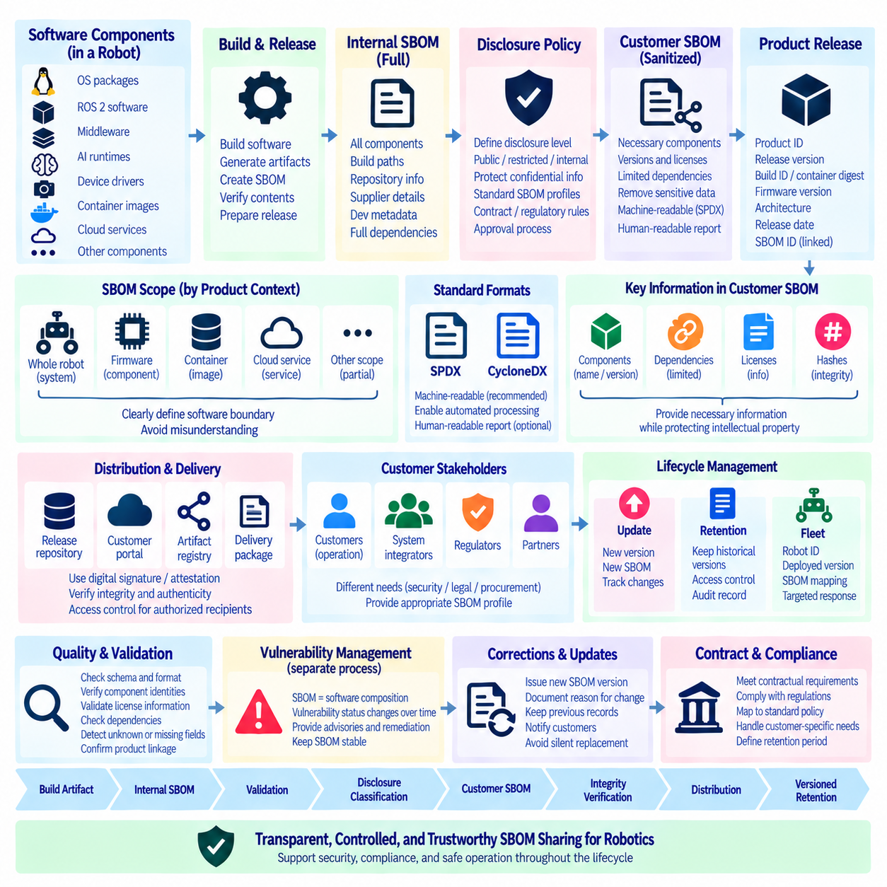{width="7.268055555555556in" height="7.268055555555556in"}

SBOM 배포(SBOM Distribution)는 소프트웨어 자재 명세서(Software Bill of Materials, SBOM) 정보를 고객, 파트너, 규제기관, 시스템 통합업체(System Integrator) 및 기타 승인된 이해관계자에게 통제된 방식으로 제공하는 프로세스이다. SBOM 생성은 첫 번째 단계일 뿐이며, 조직은 어떤 정보를 공개할 수 있는지, 누구에게 제공할 것인지, 어떤 형식으로 전달할 것인지, 제품 수명주기(Product Lifecycle)의 어느 시점에 제공할 것인지를 결정해야 한다. 정의된 공개 정책(Disclosure Policy)은 SBOM을 내부 구성 목록(Internal Inventory)에서 관리되는 공급망 커뮤니케이션 아티팩트(Supply-Chain Communication Artifact)로 전환한다.

공개 정책(Disclosure Policy)은 내부 SBOM 기록(Internal SBOM Record)과 외부 배포 가능한 SBOM(Externally Distributable SBOM)을 구분해야 한다. 내부 기록에는 상세한 빌드 경로(Build Path), 저장소 위치(Repository Location), 독점 구성요소 이름(Proprietary Component Name), 공급업체 정보(Supplier Information), 개발 메타데이터(Development Metadata), 보안에 민감한 관계(Security-Sensitive Relationship)가 포함될 수 있다. 고객용 SBOM(Customer-Facing SBOM)은 기밀 엔지니어링 정보(Confidential Engineering Information)와 지식재산권(Intellectual Property)을 보호하면서 소프트웨어 구성, 라이선스 컴플라이언스(License Compliance), 취약점 관리(Vulnerability Management), 계약 요구사항에 필요한 정보만 공개할 수 있다.

공개 범위(Disclosure Scope)는 제품 및 납품 환경(Delivery Context)에 따라 정의해야 한다. 완전한 로봇 시스템은 임베디드 펌웨어(Embedded Firmware), 운영체제 패키지, ROS 2 소프트웨어, 미들웨어(Middleware), AI 런타임(AI Runtime), 컨테이너 이미지(Container Image), 장치 드라이버(Device Driver), 플릿 관리 애플리케이션(Fleet-Management Application), 클라우드 연결 서비스(Cloud-Connected Service)를 포함할 수 있다. 배포되는 SBOM은 어떤 소프트웨어 경계(Software Boundary)를 나타내는지를 명확히 표시하여 고객이 부분적인 구성요소 목록을 전체 로봇 시스템에 대한 명세로 잘못 이해하지 않도록 해야 한다.

SBOM은 일반적인 문서로 배포하는 것이 아니라 특정 제품 릴리스(Product Release)와 연결해야 한다. 유용한 참조정보에는 제품 식별자(Product Identifier), 소프트웨어 릴리스 버전(Software Release Version), 빌드 식별자(Build Identifier), 컨테이너 다이제스트(Container Digest), 펌웨어 버전(Firmware Version), 아키텍처(Architecture), 릴리스 날짜(Release Date), SBOM 식별자(SBOM Identifier)가 포함된다. 이러한 관계를 통해 고객은 SBOM이 실제 로봇에 설치된 소프트웨어와 일치하는지를 판단할 수 있으며, 이후의 개정본이 이전 배포 버전의 구성 목록과 혼동되는 것을 방지할 수 있다.

SPDX 및 CycloneDX와 같은 기계 판독 가능 형식(Machine-Readable Format)은 SBOM 교환을 위한 실용적인 기반을 제공한다. 표준화된 형식(Standardized Format)을 사용하면 고객과 보안 플랫폼(Security Platform)이 구성요소 식별정보, 버전, 라이선스, 해시(Hash), 패키지 식별자(Package Identifier), 의존성 관계(Dependency Relationship)를 자동으로 처리할 수 있다. 사람이 읽을 수 있는 보고서(Human-Readable Report)를 기계 판독 가능 아티팩트와 함께 제공할 수 있지만, 자동화된 취약점 연계, 컴플라이언스 분석(Compliance Analysis), 고객 보안 시스템과의 통합이 필요한 경우 구조화된 SBOM을 대체해서는 안 된다.

배포 메커니즘(Distribution Mechanism)은 무결성(Integrity)과 진본성(Authenticity)을 보존해야 한다. SBOM 아티팩트는 통제된 릴리스 저장소(Release Repository), 아티팩트 레지스트리(Artifact Registry), 고객 포털(Customer Portal), 제품 납품 패키지(Product-Delivery Package)에 저장할 수 있다. 암호학적 해시(Cryptographic Hash), 디지털 서명(Digital Signature), 증명(Attestation)을 사용하면 수신자가 SBOM이 변경되지 않았으며 승인된 릴리스와 일치하는지 확인하는 데 도움이 된다. 공개가 고객, 통합 파트너 또는 기타 승인된 수신자로 제한되는 경우 접근 제어(Access Control)를 적용해야 한다.

고객 공개 정책(Customer Disclosure Policy)은 각각의 요청이 발생할 때마다 공개 수준을 개별적으로 결정하는 대신 납품 전에 예상되는 공개 수준(Disclosure Level)을 정의해야 한다. 조직은 표준 외부 필드(Standard External Field), 제한 필드(Restricted Field), 내부 전용 정보(Internal-Only Information)를 설정할 수 있다. 이러한 분류는 프로젝트마다 서로 다른 방식으로 대응하는 문제를 줄이고 독점 정보(Proprietary Information)의 우발적인 공개를 방지한다. 계약, 규제 또는 고객 보안 요구사항으로 추가적인 세부정보가 필요한 경우에는 예외(Exception)를 승인할 수 있다.

구성요소 이름과 버전은 일반적으로 취약점 관리(Vulnerability Management)의 핵심이지만 의존성 관계(Dependency Relationship)는 추가적인 검토가 필요할 수 있다. 상세한 의존성 그래프(Dependency Graph)는 구성요소가 제품에 어떻게 포함되어 있는지를 보여주어 보안 분석을 향상시킬 수 있지만 일부 관계는 내부 아키텍처(Internal Architecture)를 노출할 수 있다. 공개 정책은 고객의 보안 요구사항과 지식재산권 보호(Intellectual-Property Protection) 사이의 균형을 유지하고 각각의 외부 SBOM 프로파일(External SBOM Profile)에 어떤 의존성 정보를 포함하는지 문서화해야 한다.

라이선스 정보(License Information) 역시 고객 공개의 중요한 부분이다. 서드파티 소프트웨어(Third-Party Software)는 저작권 고지(Copyright Notice), 라이선스 원문(License Text), 귀속 표시(Attribution), 소스 코드 제공 제안(Source-Code Offer) 또는 기타 재배포 의무(Redistribution Obligation)를 요구할 수 있다. SBOM은 관련 구성요소와 라이선스를 식별하고, 별도의 서드파티 고지 문서(Third-Party Notice Documentation)는 필요한 법적 정보를 사람이 읽을 수 있는 형태로 제공할 수 있다. 따라서 SBOM 배포와 라이선스 공개(License Disclosure)는 서로 독립된 릴리스 활동으로 관리하기보다 상호 연계해야 한다.

취약점 정보(Vulnerability Information)를 SBOM 자체와 혼동해서는 안 된다. SBOM은 소프트웨어 구성(Software Composition)을 식별하지만 취약점 상태(Vulnerability Status)는 새로운 보안 정보가 공개됨에 따라 지속적으로 변경된다. 따라서 제품은 동일한 SBOM을 유지하면서도 취약점 평가(Vulnerability Assessment)는 변경될 수 있다. 고객 커뮤니케이션(Customer Communication)에서는 상대적으로 안정적인 구성요소 목록과 동적으로 변화하는 취약점 권고(Vulnerability Advisory), 수정 통지(Remediation Notice), 보안 업데이트(Security Update), 위험 평가(Risk Assessment)를 구분해야 한다.

SBOM 제공 시점(Delivery Timing)은 릴리스 관리(Release Management)에 통합해야 한다. 외부 SBOM(External SBOM)은 릴리스 후보(Release Candidate)가 승인될 때 검증된 내부 SBOM으로부터 생성하거나 파생할 수 있다. 이후 해당 아티팩트를 검증하고 공개 정책에 따라 분류하며 최종 제품 버전과 연결한 다음 적절한 릴리스 기록(Release Record)과 함께 배포해야 한다. 이러한 접근 방식은 수작업으로 작성된 고객용 문서가 실제로 빌드되고 배포된 소프트웨어와 달라지는 것을 방지한다.

업데이트(Update)에는 명확한 버전 관리(Version Management)가 필요하다. 로봇에 새로운 펌웨어, 업데이트된 컨테이너, 패치된 ROS 2 패키지 또는 새로운 애플리케이션 릴리스가 적용되면 해당 SBOM도 변경될 수 있다. 고객은 이전 SBOM과 업데이트된 SBOM을 구분하고 각각의 아티팩트가 어떤 제품 버전을 설명하는지 이해할 수 있어야 한다. 변경 불가능한 SBOM 식별자(Immutable SBOM Identifier)와 릴리스 참조정보(Release Reference)를 사용하면 유지보수 및 업그레이드 주기 전반의 이력을 감사 가능한 형태로 관리할 수 있다.

플릿 환경(Fleet Environment)에서는 서로 다른 로봇이 일시적으로 서로 다른 소프트웨어 버전을 운용할 수 있기 때문에 배포가 더욱 복잡해진다. 따라서 플릿 관리 시스템(Fleet-Management System)은 Robot_ID, 배포된 릴리스(Deployed Release), 펌웨어 버전, 컨테이너 다이제스트, 관련 SBOM 식별자 사이의 관계를 유지해야 한다. 고객 공개 자료는 승인된 릴리스 목록(Approved Release Inventory)을 설명하고, 운영 기록은 현재 각 버전을 실행하고 있는 실제 자산(Physical Asset)을 식별하여 표적화된 보안 조사(Targeted Security Investigation)와 유지보수를 지원할 수 있다.

고객의 요청 목적(Customer Request Purpose)도 서로 다를 수 있다. 조달팀(Procurement Team)은 공급망 거버넌스(Supply-Chain Governance)에 대한 증거가 필요할 수 있고, 보안팀(Security Team)은 기계 판독 가능한 구성요소 목록이 필요할 수 있으며, 법무팀(Legal Team)은 라이선스 의무에 집중할 수 있다. 또한 시스템 통합업체는 취약점 분석을 위한 의존성 정보가 필요할 수 있다. 공개 정책은 이해관계자마다 완전히 별개의 목록을 생성하는 대신 정의된 SBOM 프로파일을 통해 이러한 요구사항을 지원할 수 있다.

배포 전에는 기밀성 분류(Confidentiality Classification)를 적용해야 한다. 비공개 저장소 주소(Private Repository Address), 내부 패키지 네임스페이스(Internal Package Namespace), 미출시 모듈(Unreleased Module), 빌드 인프라(Build Infrastructure), 자격 증명(Credential), 개발 경로(Development Path), 상세 독점 아키텍처(Proprietary Architecture)와 같은 정보는 내부 SBOM에 포함되어 있다는 이유만으로 외부에 공개해서는 안 된다. 그러나 수작업으로 필드를 삭제하면 의존성 관계를 손상시키거나 일관되지 않은 고객용 아티팩트를 만들 수 있으므로 정제(Sanitization)는 통제되고 재현 가능한 방식으로 수행해야 한다.

자동화된 변환(Automated Transformation)을 통해 권위 있는 내부 소스(Authoritative Internal Source)에서 고객용 SBOM을 생성할 수 있다. 릴리스 파이프라인(Release Pipeline)은 내부 SBOM을 검증하고 공개 규칙(Disclosure Rule)을 적용하며 제한된 메타데이터를 제거하거나 변환하고 필수 구성요소 필드를 확인한 후 승인된 외부 프로파일(Approved External Profile)을 생성할 수 있다. 이러한 변환을 코드 또는 정책(Policy)으로 관리하면 공개 과정을 반복 가능하고 검토 가능한 형태로 유지하면서 내부 SBOM을 보다 완전한 증거 소스(Evidence Source)로 보존할 수 있다.

SBOM이 조직 외부로 배포되기 전에 품질 검사(Quality Check)를 수행해야 한다. 검증 과정에서는 스키마 정확성(Schema Correctness), 구성요소 식별자, 버전 정보, 라이선스 필드, 필수 관계(Required Relationship), 제품 참조정보, 무결성 메타데이터(Integrity Metadata)를 확인할 수 있다. 또한 검토가 필요한 알 수 없는 구성요소(Unknown Component) 또는 누락된 필드(Missing Field)를 탐지해야 한다. 문법적으로 유효한 SBOM이라도 중요한 구성요소를 식별하거나 실제 납품 제품과 연결할 수 없다면 실질적으로 유용한 SBOM이라고 할 수 없다.

고객 공개 프로세스(Customer Disclosure Process)에는 이후 발생하는 수정사항(Correction)을 처리하는 방법도 포함해야 한다. 릴리스가 생성될 당시 구성요소 정보가 불완전하거나 잘못 분류될 수 있다. SBOM을 수정하는 경우 조직은 이전 기록을 보존하고 새로운 버전을 발행하며 변경 이유를 문서화하고 정해진 고객 커뮤니케이션 채널(Customer Communication Channel)을 통해 수정 사실을 전달해야 한다. 기존 파일을 조용히 교체하면 수신자가 이전 시점에 어떤 정보가 제공되었는지 확인할 수 없으므로 추적성(Traceability)이 약화된다.

접근 및 보존 정책(Access and Retention Policy)도 배포 거버넌스(Distribution Governance)의 일부이다. 조직은 SBOM을 얼마나 오랫동안 보존할 것인지, 어떤 고객이 과거 버전을 조회할 수 있는지, 누가 외부 공개를 승인할 수 있는지, 접근 이력을 어떻게 기록할 것인지를 정의해야 한다. 장기간 운용되는 로봇 시스템(Long-Lived Robotic System)은 수년 동안 현장에서 사용될 수 있으므로 제품 최초 출시 이후 오랜 시간이 지난 뒤 취약점이 발견되는 경우를 대비해 과거 SBOM에 접근할 수 있어야 한다.

계약 및 규제 요구사항(Contractual and Regulatory Requirement)은 공개 프로파일, 제공 형식, 제공 시점, 보존 기간(Retention Period), 세부정보 수준에 영향을 줄 수 있다. 이러한 요구사항은 개별적인 수작업 프로세스로 구현하기보다 조직의 표준 SBOM 정책(Standard SBOM Policy)에 매핑해야 한다. 고객별 의무(Customer-Specific Obligation)가 표준 프로파일과 다른 경우에는 해당 차이를 관련 제품 또는 계약과 연결된 승인된 공개 규칙(Approved Disclosure Rule)으로 문서화해야 한다.

성숙한 릴리스 워크플로(Mature Release Workflow)는 따라서 빌드 아티팩트(Build Artifact) → 내부 SBOM(Internal SBOM) → 검증(Validation) → 공개 분류(Disclosure Classification) → 고객용 SBOM(Customer SBOM) → 무결성 검증(Integrity Verification) → 배포(Distribution) → 버전 기반 보존(Versioned Retention)을 연결한다. 취약점 권고(Vulnerability Advisory)와 수정 관련 커뮤니케이션(Remediation Communication)은 SBOM 내부에 영구적으로 포함되는 것이 아니라 이 연결 구조와 병행하여 운영된다. 이러한 분리는 안정적인 소프트웨어 구성 목록을 유지하면서 운영 수명주기 전체에서 보안 상태가 지속적으로 변화할 수 있도록 한다.

SBOM 배포의 목표는 최대한 많은 정보를 공개하는 것이 아니라 정확하고 통제되며 유용하고 추적 가능한 공개(Accurate, Controlled, Useful, and Traceable Disclosure)를 실현하는 것이다. 고객은 불필요한 독점 세부정보(Proprietary Detail)에 노출되지 않으면서 서드파티 소프트웨어 구성을 이해하고 자신의 보안 및 컴플라이언스 책임을 수행하는 데 충분한 정보를 제공받아야 한다. SBOM 생성, 분류(Classification), 검증, 릴리스 관리, 접근 제어, 고객 커뮤니케이션을 통합함으로써 로봇 데브옵스(Robot DevOps)는 소프트웨어 공급망 거버넌스를 내부 엔지니어링 프로세스에서 실제 배포된 로봇 시스템을 둘러싼 운영 생태계(Operational Ecosystem)까지 확장할 수 있다.

## 11.9. Internal Component IP Management and Classification

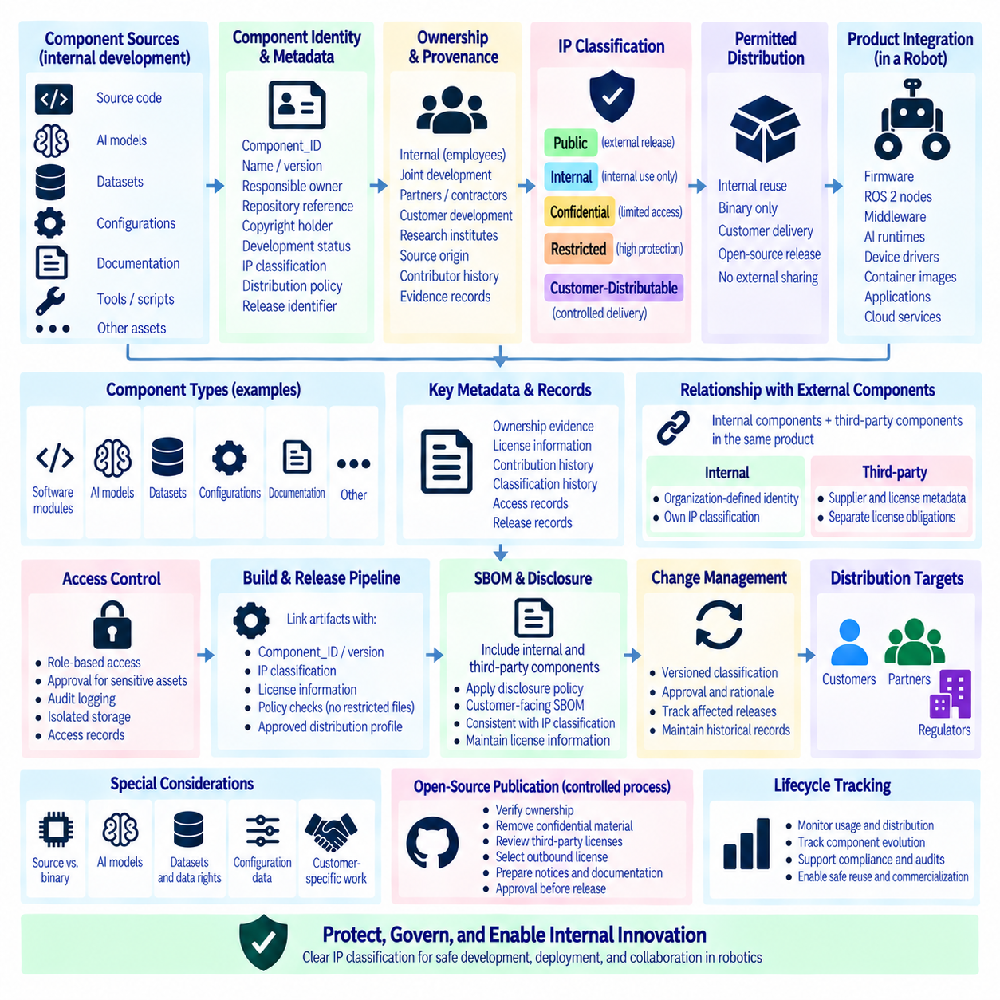{width="7.268055555555556in" height="7.268055555555556in"}

내부 구성요소 지식재산 관리(Internal Component Intellectual Property Management)는 조직에서 자체적으로 개발한 소프트웨어, 모델, 알고리즘, 설정(Configuration), 문서 및 엔지니어링 자산(Engineering Asset)을 어떻게 식별하고, 소유하고, 보호하고, 배포할 것인지를 정의한다. 로보틱스(Robotics)에서는 내부에서 개발한 구성요소가 동일한 제품 내에서 오픈소스 패키지(Open-Source Package) 및 공급업체 소프트웨어(Vendor Software)와 함께 사용되는 경우가 많다. 명확한 지식재산 분류(IP Classification)는 시스템이 개발, 통합, 배포되는 과정에서 독점 자산(Proprietary Asset)이 외부 라이선스 구성요소와 구별되지 않는 상태가 되는 것을 방지한다.

내부 구성요소(Internal Component)는 단순히 저장소(Repository)나 디렉터리 이름으로만 식별되는 것이 아니라 재사용 가능한 엔지니어링 자산이 되는 시점부터 지속적인 식별정보(Persistent Identity)를 가져야 한다. 유용한 메타데이터(Metadata)에는 Component_ID, 구성요소 이름, 버전, 담당 소유자(Responsible Owner), 저장소 참조정보(Repository Reference), 저작권자(Copyright Holder), 개발 상태(Development Status), 지식재산 분류(IP Classification), 배포 정책(Distribution Policy), 릴리스 식별자(Release Identifier)가 포함된다. 이러한 메타데이터를 유지하면 엔지니어링 형상 관리(Engineering Configuration Management)와 지식재산 거버넌스(Intellectual-Property Governance) 사이에 일관된 관계를 구축할 수 있다.

분류(Classification)는 소유권(Ownership)과 허용되는 배포 범위(Permitted Distribution)를 모두 설명해야 한다. 어떤 구성요소는 조직이 소유하고 내부적으로 자유롭게 재사용할 수 있지만 외부 공개는 금지될 수 있다. 다른 구성요소는 바이너리 형태(Binary Form)로만 고객에게 제공하도록 승인될 수 있으며, 일부 라이브러리는 향후 오픈소스 공개(Open-Source Release)가 승인될 수도 있다. 소유권과 배포 권한(Distribution Rights)을 분리하면 조직이 소유한 소프트웨어는 자동으로 조직 외부에 공유할 수 있다는 단순한 가정을 방지할 수 있다.

실용적인 분류 모델(Classification Model)은 조직 정책에 따라 공개(Public), 내부용(Internal), 기밀(Confidential), 제한(Restricted), 고객 배포 가능(Customer-Distributable) 자산을 구분할 수 있다. 공개 자산은 외부 배포가 승인된 자산이며 내부용 자산은 조직 내부에 유지된다. 기밀 또는 제한 구성요소에는 독점 알고리즘(Proprietary Algorithm), 제품 아키텍처(Product Architecture), 보안에 민감한 구현 세부정보(Security-Sensitive Implementation Detail), 전략 기술(Strategic Technology)이 포함될 수 있으므로 더욱 강력한 통제가 필요하다. 고객 배포 가능 자산은 정의된 납품 조건에 따라 명시적으로 제공이 승인된 자산이다.

분류는 적절한 구성요소 경계(Component Boundary)에 적용해야 한다. 하나의 저장소에는 서로 다른 공개 요구사항을 가진 소스 코드, 설정 파일(Configuration File), 학습된 모델(Trained Model), 캘리브레이션 데이터(Calibration Data), 배포 스크립트(Deployment Script), 시험 도구(Test Tool), 문서가 포함될 수 있다. 따라서 저장소 전체에 하나의 분류만 적용하는 것으로는 충분하지 않을 수 있다. 구성요소 수준(Component-Level) 또는 아티팩트 수준(Artifact-Level)의 분류를 사용하면 동일한 저장소에 존재하는 내부 개발 자산을 의도하지 않게 노출하지 않으면서 승인된 납품물을 외부에 제공할 수 있다.

소유권 기록(Ownership Record)은 내부 구성요소의 법적 또는 조직적 출처(Legal or Organizational Origin)를 식별해야 한다. 직원이 전적으로 작성한 소프트웨어는 대학, 계약업체(Contractor), 고객, 연구기관(Research Institute), 컨소시엄 파트너(Consortium Partner)와 공동 개발한 코드와 서로 다른 소유권 이력을 가질 수 있다. 공동개발 계약(Joint-Development Agreement), 정부 지원 과제(Government-Funded Project), 고객 지원 개발(Customer-Funded Development)은 특정한 권리 또는 제한을 발생시킬 수 있다. 따라서 지식재산 기록(IP Record)은 현재 저장소 위치만으로 소유권을 추정하지 않고 소유권에 대한 증거를 보존해야 한다.

기여 출처(Contribution Provenance)는 내부 소프트웨어가 여러 개발자와 외부 협력자를 통해 발전할 때 중요하다. 커밋 이력(Commit History), 기여자 식별정보(Contributor Identity), 프로젝트 계약(Project Agreement), 소스 출처(Source Origin), 검토 기록(Review Record)은 구성요소가 어떻게 만들어졌는지를 보여주는 증거를 제공할 수 있다. 예제 코드, 외부 저장소, 공급업체 SDK(Vendor SDK), 이전 프로젝트에서 복사한 코드를 자동으로 내부 소유 자산으로 분류해서는 안 된다. 출처 검토(Provenance Review)는 조직의 독자적인 지식재산과 포함된 서드파티 자료(Third-Party Material)를 구분하는 데 도움이 된다.

따라서 내부 지식재산 관리(Internal IP Management)는 오픈소스 라이선스 관리(Open-Source License Management)와 직접 연결되어야 한다. 독점 ROS 2 노드(Proprietary ROS 2 Node)는 조직이 소유한 로직을 포함하면서 Apache-2.0, BSD, MIT, LGPL 또는 다른 라이선스 구성요소에 의존할 수 있다. 이러한 의존성은 내부 코드와 동일한 소유권 또는 배포 정책을 자동으로 가지지 않는다. 구성요소별 식별정보와 라이선스 기록(License Record)을 별도로 유지하면 독점 자산 분류로 인해 납품 제품에 포함된 서드파티 의무(Third-Party Obligation)가 가려지는 것을 방지할 수 있다.

필요한 경우 소스 코드(Source Code)와 바이너리 배포(Binary Distribution)도 별도로 분류해야 한다. 일부 구성요소는 컴파일된 바이너리(Compiled Binary) 또는 컨테이너(Container) 형태로 배포가 승인될 수 있지만 해당 소스 코드는 기밀로 유지될 수 있다. 펌웨어(Firmware), 하드웨어 드라이버(Hardware Driver), 추론 엔진(Inference Engine), 고객 전용 모듈(Customer-Specific Module)에도 유사한 관리가 필요할 수 있다. 릴리스 메타데이터(Release Metadata)는 어떤 아티팩트 형태가 배포 승인되었는지를 기록하여 유효한 바이너리 릴리스가 소스 코드 공개 권한까지 암묵적으로 허용하는 상황을 방지해야 한다.

AI 및 Physical AI 시스템은 기존 소프트웨어를 넘어 지식재산 경계(IP Boundary)를 확장한다. 내부에서 학습된 모델 가중치(Model Weight), 모델 아키텍처(Model Architecture), 프롬프트(Prompt), 보상 정의(Reward Definition), 시뮬레이션 환경(Simulation Environment), 합성 데이터 생성기(Synthetic-Data Generator), 데이터셋 변환(Dataset Transformation), 캘리브레이션 절차(Calibration Procedure), 로봇 행동 정책(Robot Behavior Policy)은 중요한 지식재산이 될 수 있다. 이러한 아티팩트는 머신러닝 파이프라인의 부수적인 결과물로 취급하지 않고 명시적인 소유권 및 공개 분류(Disclosure Classification)를 가져야 한다.

데이터셋(Dataset)은 처리 파이프라인의 소유권이 기초 데이터(Underlying Data)의 소유권을 반드시 의미하지는 않기 때문에 추가적인 구분이 필요하다. 내부 데이터셋은 조직이 수집한 로봇 경험(Robot Experience)과 공개 데이터셋(Public Dataset), 고객 데이터(Customer Data), 시뮬레이션 출력(Simulation Output), 공급업체 제공 자산(Vendor-Provided Asset)을 결합할 수 있다. 따라서 데이터셋 식별정보(Dataset Identity), 출처(Provenance), 라이선스(License), 수집 출처(Collection Source), 허용된 사용(Permitted Use), 지식재산 분류를 서로 연결된 상태로 유지해야 한다. 파생 데이터셋(Derived Dataset) 역시 원본 자산 및 관련 제한사항과의 관계를 보존해야 한다.

설정 데이터(Configuration Data) 역시 중요한 독점 지식(Proprietary Knowledge)을 포함할 수 있다. 내비게이션 파라미터(Navigation Parameter), 인지 임계값(Perception Threshold), 제어기 튜닝(Controller Tuning), 캘리브레이션 프로파일(Calibration Profile), 미션 로직(Mission Logic), 안전 설정(Safety Setting), 배포 토폴로지(Deployment Topology), 플릿 오케스트레이션 규칙(Fleet Orchestration Rule)은 전통적인 소스 코드가 아니더라도 엔지니어링 노하우(Engineering Know-How)를 포함할 수 있다. 지식재산 관리는 이러한 아티팩트를 잠재적인 보호 자산(Protected Asset)으로 인식하고 운영상의 중요도에 적합한 분류, 접근 제어(Access Control), 버전 관리(Versioning), 릴리스 규칙을 적용해야 한다.

접근 제어(Access Control)는 단순히 저장소 멤버십(Repository Membership)에 의존하기보다 분류 수준을 반영해야 한다. 내부 구성요소는 소스 코드, 모델, 데이터셋, 빌드 아티팩트(Build Artifact), 문서에 대해 역할 기반 접근(Role-Based Access)을 요구할 수 있다. 높은 수준으로 제한된 자산은 추가 승인(Additional Approval), 감사 로그(Audit Logging), 격리된 저장소(Isolated Storage)를 요구할 수도 있다. 접근 기록(Access Record)은 민감한 자산을 누가 조회할 수 있었는지에 대한 증거를 제공하고 독점 정보가 의도된 개발 경계 외부로 전달되었을 때 조사를 지원한다.

빌드 및 릴리스 파이프라인(Build and Release Pipeline)은 중요한 정책 집행 지점(Enforcement Point)을 제공한다. CI/CD 시스템은 아티팩트를 Component_ID, 버전, 지식재산 분류, 라이선스 정보, 승인된 배포 프로파일(Approved Distribution Profile)과 연결할 수 있다. 고객용 릴리스는 제한된 소스 파일, 개발 도구, 비공개 설정(Private Configuration), 자격 증명(Credential), 승인되지 않은 모델이 포함되지 않았는지를 확인해야 한다. 자동화된 정책 검사(Automated Policy Check)는 패키징 과정에서 개발자 개인이 공개 제한사항을 기억하는 것에 대한 의존성을 줄인다.

SBOM 생성(SBOM Generation)은 내부 구성요소와 서드파티 구성요소의 차이를 보존해야 한다. 내부 구성요소는 조직에서 정의한 식별정보(Organization-Defined Identity)를 사용하여 제품 목록에 포함될 수 있으며 외부 의존성은 공급업체 및 라이선스 메타데이터를 유지한다. 이후 고객용 SBOM 변환(Customer-Facing SBOM Transformation)은 설정된 공개 정책을 적용하여 어떤 내부 세부정보를 외부에 공개할지를 결정할 수 있다. 이를 통해 지식재산 분류, SBOM 거버넌스(SBOM Governance), 고객 공개(Customer Disclosure)를 서로 독립된 프로세스로 취급하지 않고 연속적으로 연결할 수 있다.

소유권 또는 분류의 변경사항은 버전 관리되고 감사 가능해야 한다. 처음에 내부용(Internal)으로 분류된 구성요소가 이후 고객 배포 또는 오픈소스 공개 승인을 받을 수 있으며, 반대로 민감한 기술을 포함하게 된 구성요소가 제한(Restricted)으로 변경될 수도 있다. 분류 변경(Classification Change)은 결정 내용, 승인자(Approver), 적용 버전(Effective Version), 변경 근거(Rationale), 영향을 받는 릴리스(Affected Release)를 기록해야 한다. 과거 기록을 유지하면 현재의 권한이 이전 아티팩트에 잘못 적용되는 것을 방지할 수 있다.

오픈소스 공개(Open-Source Publication)는 단순히 내부 저장소를 공개 저장소로 전환하는 것이 아니라 의도적으로 관리되는 릴리스 프로세스(Release Process)를 필요로 한다. 조직은 소유권을 검증하고, 기밀 자료를 제거하며, 서드파티 라이선스를 검토하고, 기여자의 권리(Contributor Rights)를 확인하며, 적절한 외부 배포 라이선스(Outbound License)를 선정하고, 고지사항(Notice)과 문서를 준비한 후 정확한 릴리스 내용을 승인해야 한다. 이를 통해 외부 공개가 개발 작업공간(Development Workspace)의 우발적인 노출이 아니라 정의된 지식재산의 승인된 이전(Authorized Transfer)이 되도록 할 수 있다.

고객 전용 개발(Customer-Specific Development)에도 유사한 통제가 필요하다. 특정 고객을 위해 만들어진 구성요소에는 재사용 가능한 조직 지식재산과 고객 소유 요구사항(Customer-Owned Requirement), 데이터, 설정, 통합 로직(Integration Logic)이 함께 포함될 수 있다. 이러한 요소를 구성요소 및 아티팩트 수준에서 분리하면 향후 재사용을 보다 안전하게 수행하고 계약 준수(Contractual Compliance)를 단순화할 수 있다. 릴리스 기록은 어떤 자산이 조직 소유인지, 고객 전용인지, 외부 라이선스가 적용되는지, 추가 계약 제한(Contractual Restriction)을 받는지를 식별해야 한다.

지식재산 분류(IP Classification)는 엔지니어링 검토(Engineering Review)와 아키텍처 의사결정(Architecture Decision)에도 포함되어야 한다. 팀이 어떤 기능을 내부적으로 개발하거나, 오픈소스 소프트웨어를 채택하거나, 공급업체 기술을 라이선스하거나, 외부 조직과 공동 개발하는 선택은 향후 소유권, 유지보수(Maintenance), 공개, 상용화(Commercialization) 가능성을 변화시킨다. 이러한 관계를 초기 단계부터 기록하면 기술이 로봇 시스템에 깊이 통합된 이후 지식재산 경계를 다시 구성해야 하는 문제를 줄일 수 있다.

성숙한 거버넌스 워크플로(Mature Governance Workflow)는 따라서 구성요소 생성(Component Creation) → 식별정보(Identity) → 출처(Provenance) → 소유권(Ownership) → 지식재산 분류(IP Classification) → 접근 제어(Access Control) → 빌드(Build) → 릴리스 검토(Release Review) → 배포(Distribution) → 수명주기 추적(Lifecycle Tracking)을 연결한다. 라이선스 기록, SBOM 정보, 모델 및 데이터셋 출처(Model and Dataset Provenance), 고객 공개 정책이 이 연결 구조와 상호작용한다. 이를 통해 조직이 무엇을 소유하고, 무엇을 라이선스하며, 무엇을 배포할 수 있고, 어떤 조건에서 배포할 수 있는지를 보여주는 추적 가능한 증거 구조(Traceable Evidence Structure)를 구축할 수 있다.

내부 구성요소 지식재산 관리의 목표는 엔지니어링 협업(Engineering Collaboration)을 불필요하게 제한하는 것이 아니라 로봇 데브옵스(Robot DevOps) 수명주기 전체에서 지식재산 경계를 명확하고 집행 가능한 형태로 만드는 것이다. 지속적인 식별정보, 출처 기록, 분류, 접근 제어, 자동화된 릴리스 검사(Automated Release Check), 버전 관리된 승인(Versioned Approval)을 활용하면 내부 혁신을 연구 단계에서 실제 제품으로 안전하게 이전하면서 서드파티 의무, 계약 제한, 고객 권리(Customer Rights), 조직의 독점 기술(Proprietary Technology)을 함께 보호할 수 있다.

## 11.10. SBOM Integration with IEC 62443 and ISO 21434

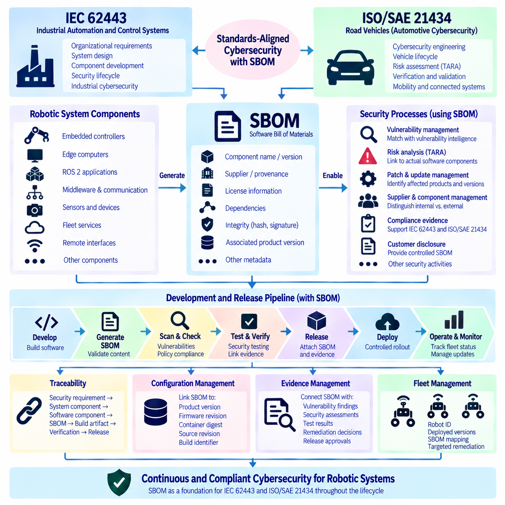{width="7.268055555555556in" height="7.268055555555556in"}

소프트웨어 자재 명세서(Software Bill of Materials, SBOM)는 소프트웨어 구성요소에 대한 구조화된 목록을 제공함으로써 IEC 62443 및 ISO/SAE 21434와 같은 표준에서 정의하는 보안 활동(Security Activity)과 연결되어 사이버보안 거버넌스(Cybersecurity Governance)를 지원할 수 있다. SBOM 자체가 이러한 표준을 대체하거나 단독으로 컴플라이언스(Compliance)를 입증하는 것은 아니다. SBOM의 가치는 개발, 릴리스, 운영, 유지보수 전 과정에서 보안 프로세스가 활용할 수 있는 구성요소, 버전, 공급업체, 라이선스, 의존성, 무결성 정보(Integrity Information)를 제공하는 데 있다.

IEC 62443는 조직, 시스템 설계, 구성요소 개발 및 보안 수명주기 활동(Security Lifecycle Activity)을 포괄하는 요구사항을 통해 산업 자동화 및 제어 시스템(Industrial Automation and Control Systems)의 사이버보안을 다룬다. 로봇 시스템은 임베디드 제어기(Embedded Controller), 엣지 컴퓨터(Edge Computer), ROS 2 애플리케이션, 통신 미들웨어(Communication Middleware), 센서, 플릿 서비스(Fleet Service), 원격 인터페이스(Remote Interface)를 포함하는 연결형 산업 자산(Connected Industrial Asset)으로 발전하고 있다. SBOM 정보는 이러한 이기종 자산(Heterogeneous Asset)의 소프트웨어 구성을 사이버보안 관리 프로세스에서 가시화하는 데 도움을 준다.

IEC 62443 지향 개발 환경(IEC 62443-Oriented Development Environment)에서 SBOM은 별도의 문서화 작업이 아니라 보안 제품 개발(Secure Product Development)을 지원하는 증거로 활용될 수 있다. 구성요소 식별정보(Component Identity)는 설계 기록, 보안 요구사항(Security Requirement), 취약점 평가(Vulnerability Assessment), 패치 결정(Patch Decision), 릴리스 아티팩트(Release Artifact)와 연결할 수 있다. 서드파티 의존성(Third-Party Dependency)이 변경되면 조직은 어떤 제품 구성이 영향을 받는지 확인하고 수정된 소프트웨어가 운영 환경에 적용되기 전에 적절한 보안 검토(Security Review)를 수행할 수 있다.

IEC 62443는 제품 수명주기 전반에 걸친 체계적인 취약점 관리(Vulnerability Management)를 강조한다. SBOM 기반 구성 목록은 새롭게 공개된 취약점을 이미 릴리스되거나 배포된 소프트웨어와 연계할 수 있기 때문에 이러한 프로세스를 강화한다. 보안팀은 소스 저장소(Source Repository)를 수작업으로 검색하는 대신 취약점 정보(Vulnerability Intelligence)를 저장된 SBOM과 비교하여 영향을 받는 제품, 펌웨어 패키지(Firmware Package), 컨테이너(Container), 로봇 애플리케이션을 식별할 수 있다. 이렇게 탐지된 결과는 수정 여부를 결정하기 전에 여전히 상황 기반 분석(Contextual Analysis)이 필요하다.

SBOM은 구성요소 및 공급업체 관리(Component and Supplier Management)도 지원할 수 있다. 산업용 로봇 제품은 일반적으로 운영체제 패키지, 오픈소스 라이브러리(Open-Source Library), 상용 미들웨어(Commercial Middleware), 공급업체 SDK(Vendor SDK), 펌웨어, 외부 개발 모듈(Externally Developed Module)을 포함한다. 공급업체와 구성요소 출처(Provenance)를 기록하면 이러한 의존성을 가시화하고 보안팀이 내부적으로 통제되는 소프트웨어와 유지보수 및 패치 제공 여부가 외부 조직에 의존하는 구성요소를 구분할 수 있다.

ISO/SAE 21434는 차량 수명주기(Vehicle Lifecycle) 전반에 걸쳐 도로 차량(Road Vehicle)의 사이버보안 엔지니어링(Cybersecurity Engineering)을 다룬다. 로봇 플랫폼이 차량 아키텍처(Vehicle Architecture), 커넥티드 모빌리티 시스템(Connected Mobility System), 자율 운송 플랫폼(Autonomous Transport Platform), 자동차 기반 전자 및 소프트웨어 기술(Automotive-Derived Electronic and Software Technology)과 중첩될수록 이 표준의 관련성은 높아진다. IEC 62443와 마찬가지로 SBOM은 구조화된 기술 증거(Structured Technical Evidence)를 제공할 수 있지만, 사이버보안 엔지니어링에는 구성 목록 자체를 넘어 위험 분석, 요구사항, 검증(Verification), 유효성 확인(Validation), 모니터링, 문서화된 수명주기 의사결정이 필요하다.

ISO/SAE 21434 지향 워크플로(ISO/SAE 21434-Oriented Workflow)에서 SBOM 데이터는 사이버보안 관련 기능 및 구성요소와 연계된 소프트웨어 자산(Software Asset)을 식별하는 데 활용할 수 있다. 패키지 버전, 펌웨어 리비전(Firmware Revision), 통신 라이브러리, 운영체제 모듈, 외부 공급 소프트웨어를 시스템 아키텍처 및 형상 기록(Configuration Record)과 연결할 수 있다. 이를 통해 사이버보안 분석은 상위 수준의 아키텍처 설명에만 의존하지 않고 차량 또는 로봇 플랫폼의 실제 소프트웨어 구성을 참조할 수 있다.

위협 분석 및 위험 평가(Threat Analysis and Risk Assessment, TARA)는 SBOM 생성과 명확하게 구분되어야 한다. SBOM은 어떤 소프트웨어 구성요소가 존재하고 서로 어떻게 연결되는지를 설명하지만, TARA는 사이버보안 자산(Cybersecurity Asset), 위협(Threat), 공격 경로(Attack Path), 영향(Impact), 위험(Risk)을 분석한다. 두 요소를 연결하면 식별된 위협을 구체적인 소프트웨어 구성요소와 연계할 수 있어 추적성(Traceability)이 향상되지만, 패키지 목록만으로 사이버보안 위험을 독립적으로 결정하거나 특정 공격 시나리오(Attack Scenario)의 실현 가능성을 판단할 수는 없다.

취약점 심각도(Vulnerability Severity)와 시스템 위험(System Risk)을 구분하는 것은 두 표준 지향 환경 모두에서 중요하다. 어떤 구성요소에 공개된 취약점이 존재하더라도 실제 위험은 설정(Configuration), 접근 가능성(Accessibility), 권한(Privilege), 인터페이스(Interface), 운영 노출(Operational Exposure), 주변 아키텍처에 따라 달라진다. SBOM 정보는 잠재적으로 영향을 받는 구성요소와 버전을 식별하고, 시스템 사이버보안 분석(System Cybersecurity Analysis)은 해당 취약점의 관련성과 적절한 완화(Mitigation), 패치(Patching), 격리(Isolation), 위험 수용(Acceptance) 결정을 판단한다.

추적성은 보안 요구사항(Security Requirement)을 구현 증거(Implementation Evidence)와 연결할 수 있다. 유용한 관계는 사이버보안 요구사항(Cybersecurity Requirement) → 시스템 구성요소(System Component) → 소프트웨어 구성요소(Software Component) → SBOM 항목(SBOM Entry) → 빌드 아티팩트(Build Artifact) → 검증 증거(Verification Evidence) → 릴리스 구성(Released Configuration)의 형태로 구성할 수 있다. 이러한 연결을 유지하면 어떤 소프트웨어가 보안 관련 기능을 구현하고 있으며 정확히 어떤 버전에 해당 시험 또는 평가 증거가 적용되는지를 확인할 수 있다.

형상 관리(Configuration Management)는 사이버보안 증거가 재현 가능한 제품 버전과 연결되지 않으면 그 가치가 감소하기 때문에 중요하다. 따라서 각 SBOM은 제품 버전(Product Version), 소프트웨어 릴리스(Software Release), 펌웨어 리비전, 컨테이너 다이제스트(Container Digest), 소스 리비전(Source Revision), 아키텍처, 빌드 식별자(Build Identifier)와 같은 식별정보와 연결해야 한다. 변경 불가능한 참조정보(Immutable Reference)를 사용하면 평가된 소프트웨어 구성을 재구성하고 이후 업데이트된 버전과 구분할 수 있다.

보안 개발 파이프라인(Secure Development Pipeline)은 이러한 추적성의 일부를 자동화할 수 있다. CI/CD 프로세스는 SBOM을 생성하고 스키마와 완전성(Completeness)을 검증하며, 구성요소의 알려진 취약점을 스캔하고 승인된 의존성을 검사하며, 보안 시험 결과(Security-Test Result)를 연결하고 관련 증거를 릴리스 후보(Release Candidate)에 첨부할 수 있다. 정책 게이트(Policy Gate)는 필요한 보안 정보가 누락되거나 정의된 취약점 조건이 해결되지 않은 경우 승격(Promotion)을 차단할 수 있으며, 승인된 예외(Approved Exception)는 문서화되고 감사 가능한 상태로 유지된다.

패치 및 업데이트 관리(Patch and Update Management)는 지속적으로 유지되는 SBOM 기록으로부터 직접적인 이점을 얻을 수 있다. 릴리스 이후 새로운 취약점이 공개되면 저장된 SBOM을 사용하여 제품을 다시 빌드하지 않고도 잠재적으로 영향을 받는 제품 버전을 식별할 수 있다. 이후 엔지니어링 팀은 업데이트 필요성을 판단하고 대체 구성요소를 검증하며 결과 시스템을 시험한 다음 통제된 릴리스(Controlled Release)를 발행할 수 있다. 이를 통해 사이버보안 평가를 최초 제품 출시 시점에 종료되는 활동이 아니라 지속적인 사이버보안 유지보수(Continuous Cybersecurity Maintenance)로 운영할 수 있다.

플릿 운영 로봇(Fleet-Operated Robot)은 제품 사이버보안 증거(Product Cybersecurity Evidence)와 실제 물리적 배포 상태(Physical Deployment State) 사이에 추가적인 연결이 필요하다. Robot_ID, 소프트웨어 릴리스, 펌웨어 버전, 컨테이너 다이제스트, SBOM 식별자를 배포 기록(Deployment Record)에 유지할 수 있다. 취약점 정보가 영향을 받는 구성요소를 식별하면 조직은 SBOM에서 해당 릴리스로, 다시 개별 로봇으로 문제를 추적하여 불필요하게 전체 플릿이 영향을 받는다고 가정하지 않고 표적화된 수정(Targeted Remediation)을 수행할 수 있다.

SBOM 통합은 기존 패키지 관리자(Package Manager)에서 표현되지 않을 수 있는 임베디드 및 독점 구성요소(Embedded and Proprietary Component)도 고려해야 한다. 모터 제어기(Motor Controller), 센서 펌웨어(Sensor Firmware), 통신 모듈(Communication Module), GPU 소프트웨어, 독점 장치 SDK(Proprietary Device SDK), 공급업체 바이너리(Vendor Binary)는 로봇의 사이버보안 상태에 영향을 줄 수 있다. 상세한 구성을 확인할 수 없는 경우에도 목록에는 이용 가능한 제품, 공급업체, 펌웨어, 버전 정보를 보존하고 구성요소를 조용히 누락하는 대신 가시성 한계(Visibility Limitation)를 명시적으로 표시해야 한다.

증거 관리(Evidence Management)는 SBOM, 취약점 탐지 결과(Vulnerability Finding), 보안 평가(Security Assessment), 시험 결과(Test Result), 수정 결정(Remediation Decision), 릴리스 승인(Release Approval) 사이의 관계를 보존해야 한다. 이러한 기록은 서로 다른 엔지니어링 시스템에서 생성될 수 있지만 안정적인 식별자(Stable Identifier)를 사용하면 연결된 증거 체인(Connected Evidence Chain)을 형성할 수 있다. 이러한 추적성은 정의된 구성에 대해 사이버보안 활동이 수행되었음을 입증하는 데 도움을 주며 이후 감사(Audit), 사고 조사(Incident Investigation), 유지보수 의사결정을 위한 기반을 제공한다.

동일한 SBOM은 여러 거버넌스 프로세스(Governance Process)를 지원할 수 있지만 각각의 요구사항이 동일하다는 것을 의미하지는 않는다. 소프트웨어 구성 정보는 IEC 62443 지향 산업 사이버보안 활동, ISO/SAE 21434 지향 차량 사이버보안 엔지니어링, 오픈소스 라이선스 컴플라이언스(Open-Source License Compliance), 공급업체 관리(Supplier Management), 고객 공개(Customer Disclosure)에 활용될 수 있다. 공유 구성요소 목록(Shared Component Inventory)은 중복된 증거 생성을 줄이지만 각 거버넌스 프레임워크는 고유한 적용 범위, 용어, 위험 분석 방법, 필수 엔지니어링 활동을 유지한다.

따라서 조직은 SBOM 스캐너(SBOM Scanner) 또는 취약점 보고서(Vulnerability Report)를 표준 준수의 증거로 표현해서는 안 된다. 컴플라이언스는 적용 범위와 조직, 엔지니어링, 검증, 운영, 문서화 요구사항의 광범위한 집합에 따라 결정된다. SBOM은 이러한 활동 전반에서 가시성과 추적성을 향상시키는 지원 증거 아티팩트(Enabling Evidence Artifact)로 이해하는 것이 적절하다. 그 효과는 완전성, 정확성(Accuracy), 버전 관리, 실제 사이버보안 워크플로와의 통합 수준에 따라 결정된다.

산업 및 모빌리티 영역(Industrial and Mobility Domain)에 걸쳐 있는 로봇 플랫폼에서는 통합 증거 아키텍처(Unified Evidence Architecture)를 통해 제품 아키텍처(Product Architecture) → 사이버보안 자산(Cybersecurity Assets) → 소프트웨어 구성요소(Software Components) → SBOM → 취약점 정보(Vulnerability Intelligence) → 위험 평가(Risk Assessment) → 보안 요구사항(Security Requirements) → 검증(Verification) → 릴리스(Release) → 배포 모니터링(Deployment Monitoring)을 연결할 수 있다. IEC 62443 지향 프로세스와 ISO/SAE 21434 지향 프로세스는 각각의 영역에 적합한 보안 개념과 수명주기 통제를 적용하면서 이러한 공통 증거 체인(Shared Evidence Chain)을 참조할 수 있다.

장기적인 목표는 개발 단계부터 실제 배포 및 운영까지 지속적인 사이버보안 추적성(Continuous Cybersecurity Traceability)을 확보하는 것이다. SBOM 정보는 어떤 소프트웨어가 존재하는지를 정의하고, 사이버보안 엔지니어링은 그것이 왜 중요한지, 어떤 위험이 존재하는지, 그리고 해당 위험을 어떻게 통제하는지를 정의한다. 구성요소 목록(Component Inventory), 형상 관리, 취약점 추적(Vulnerability Tracking), 위험 평가, 검증 증거, 릴리스 통제(Release Control), 플릿 모니터링(Fleet Monitoring)을 통합함으로써 로봇 데브옵스(Robot DevOps)는 SBOM을 표준 정렬형 사이버보안 수명주기 관리(Standards-Aligned Cybersecurity Lifecycle Management)를 위한 실질적인 기반으로 활용할 수 있다.
