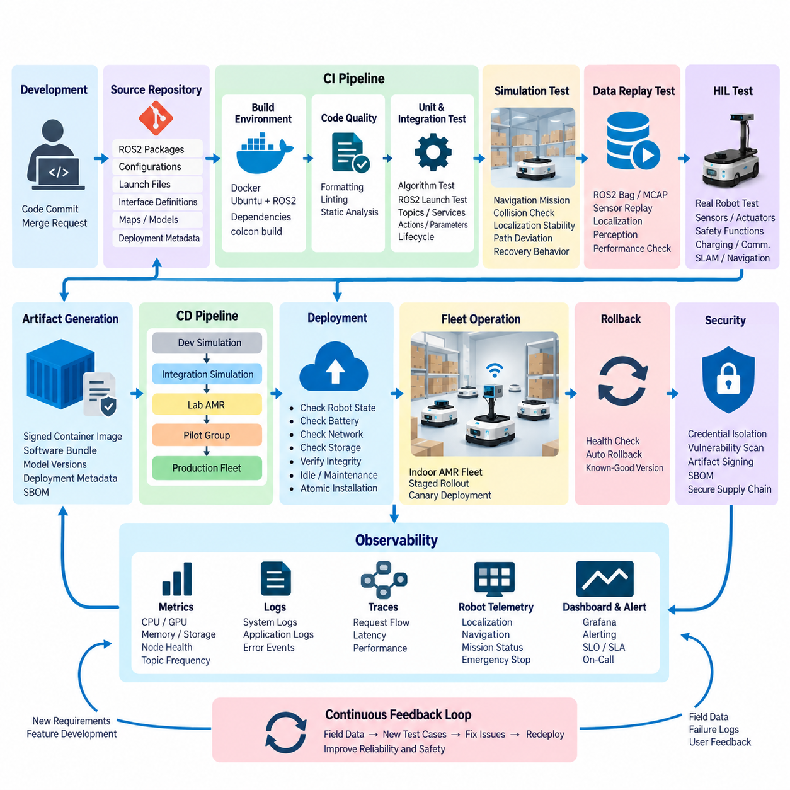
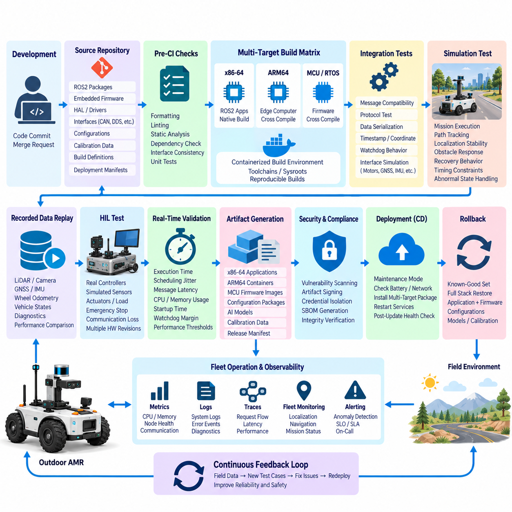
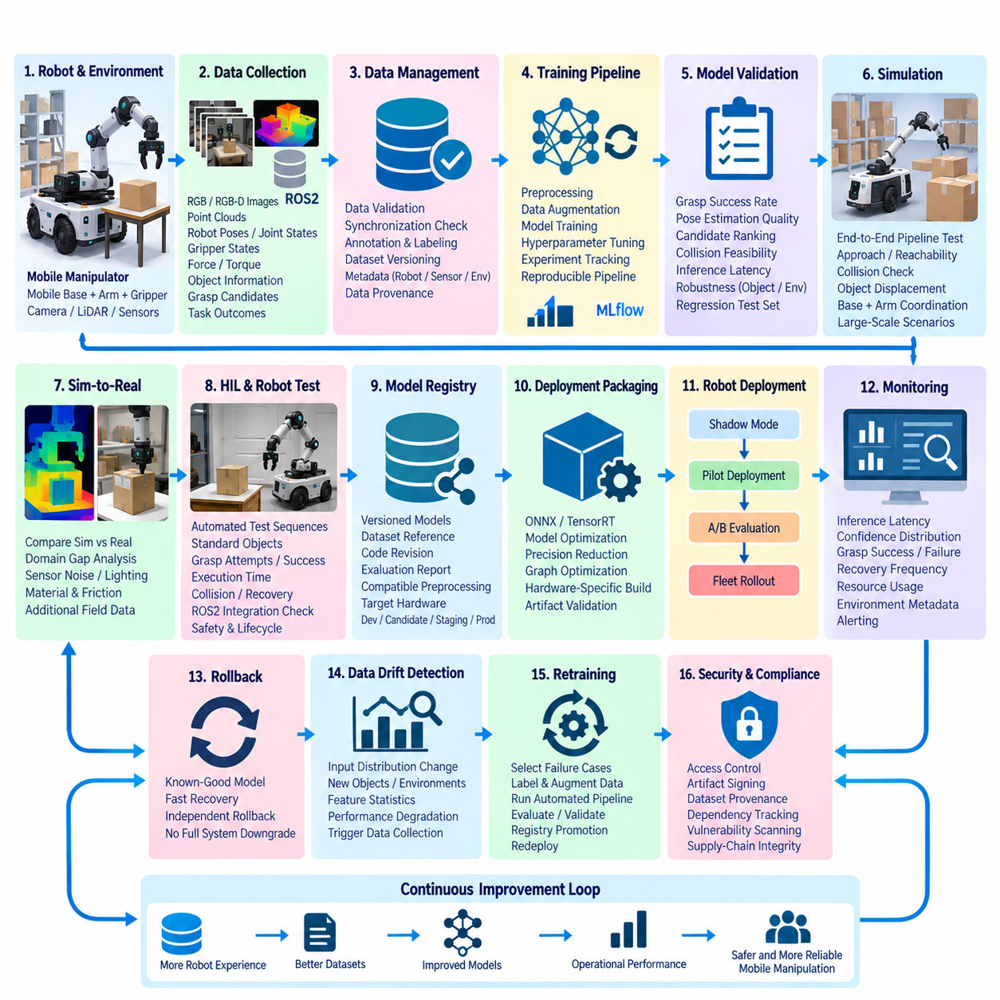
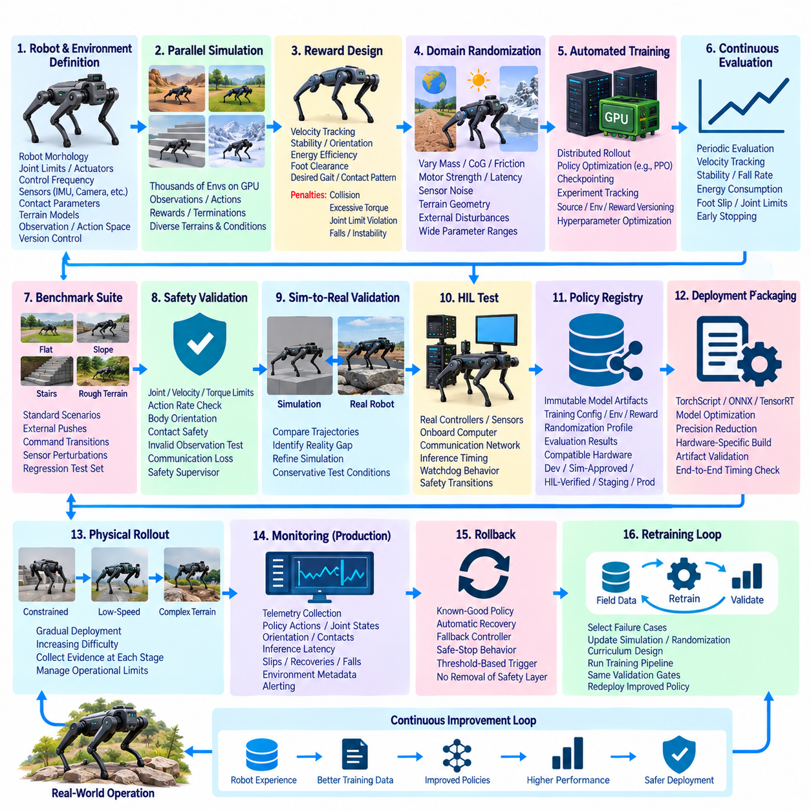
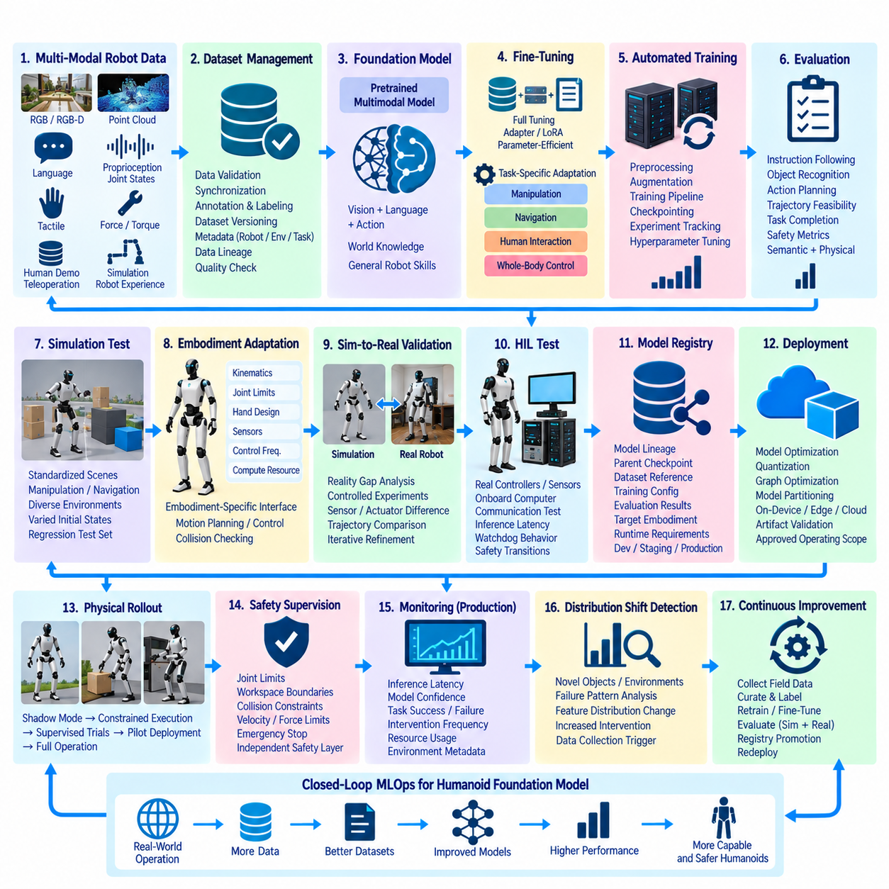
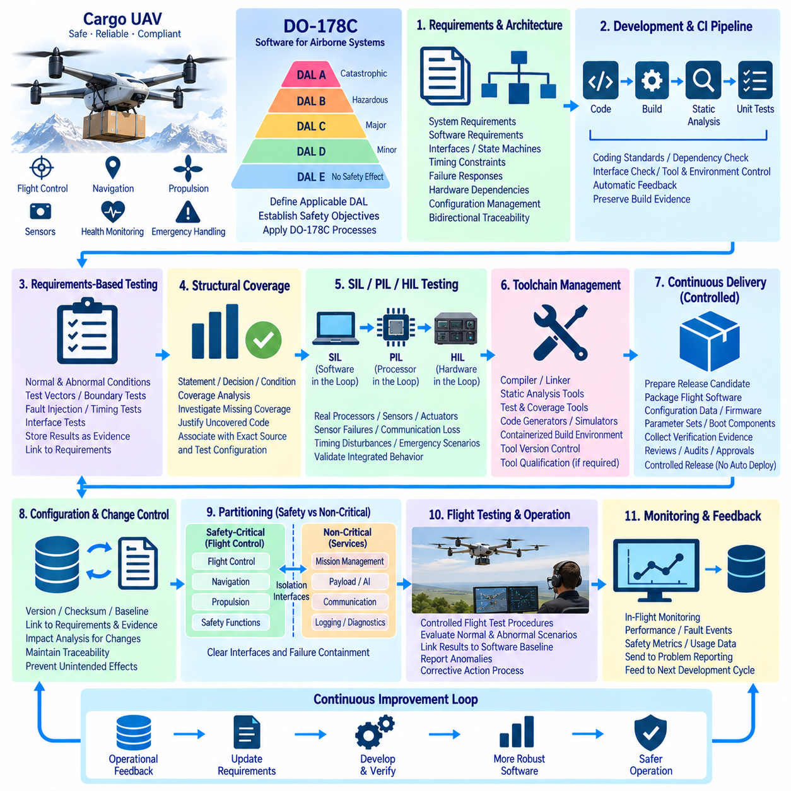
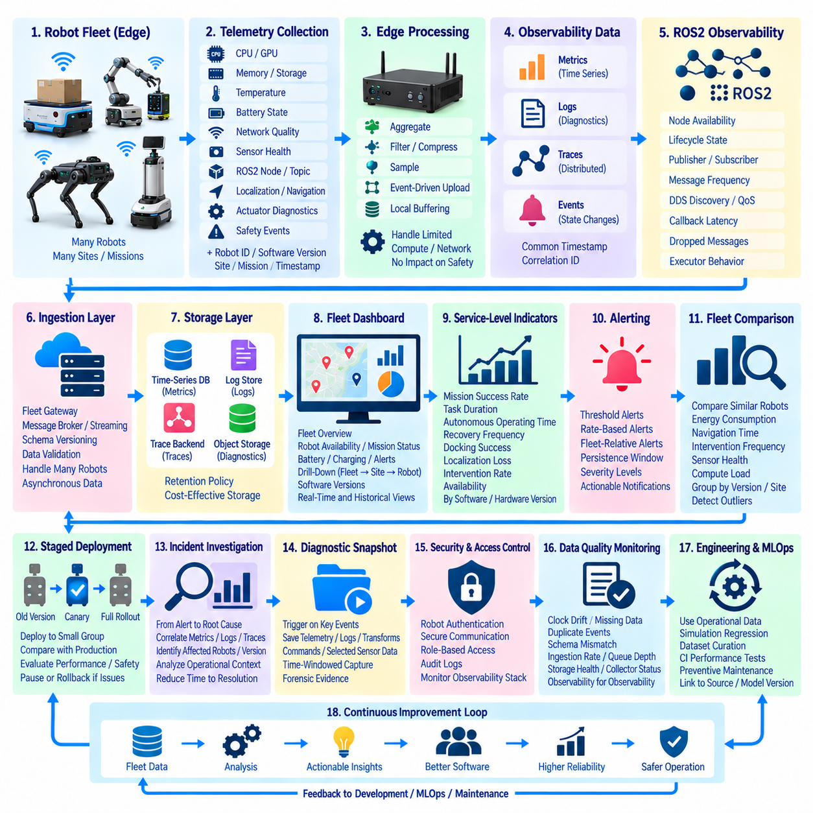
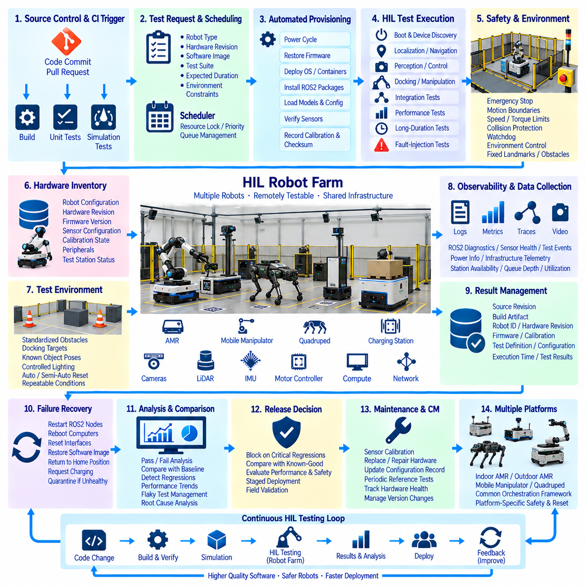
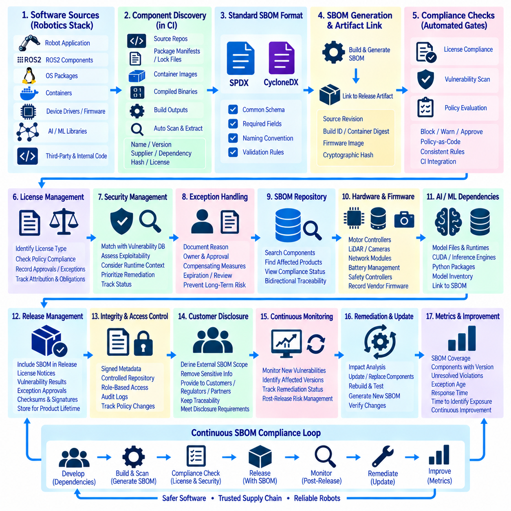
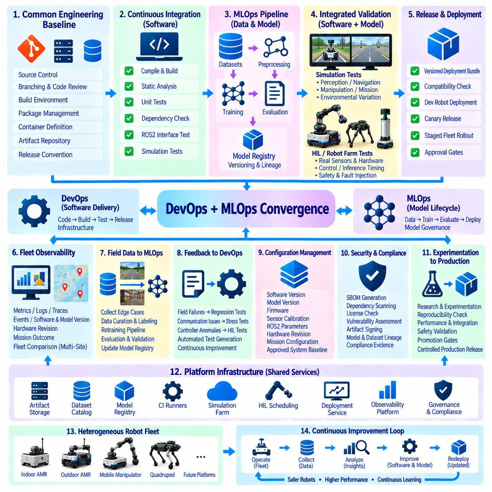

**Volume 10 Robot DevOps and MLOps**


# 12. DevOps Case Studies

##  

## 12.1. Indoor AMR ROS2 CI CD Pipeline Build and Operation

{width="7.268055555555556in" height="7.268055555555556in"}

An indoor Autonomous Mobile Robot (AMR) provides a useful case study for applying DevOps principles to a cyber-physical system. Unlike conventional web software, an AMR software release directly affects localization, navigation, motion control, sensor processing, and interaction with people and equipment. A ROS2 CI/CD pipeline must therefore validate not only whether software builds correctly, but also whether the integrated robot behaves predictably and safely after every change.

The software repository typically contains multiple ROS2 packages representing hardware interfaces, localization, mapping, Navigation2 components, mission management, diagnostics, and fleet communication. Source code, configuration files, launch descriptions, interface definitions, and deployment metadata should be versioned together according to clearly defined dependency relationships. This structure allows a specific software revision to be reconstructed and tested consistently across development computers, simulation systems, and physical AMRs.

Continuous Integration begins when developers push commits or submit merge requests. The pipeline creates a clean ROS2 build environment, installs declared dependencies, and builds the workspace using tools such as colcon. Compilation failures, missing package dependencies, malformed interface definitions, and incompatible API changes should terminate the pipeline immediately. Automated formatting, linting, and static analysis are executed before expensive integration tests so that simple defects are detected early and computational resources are conserved.

Unit testing verifies individual algorithms and software components independently from the complete robot. Examples include coordinate transformations, velocity constraints, trajectory calculations, state-machine transitions, map utilities, and message-processing functions. ROS2 components can additionally be tested through launch-based integration tests in which multiple nodes are started together and their topics, services, actions, parameters, and lifecycle transitions are inspected. This reflects the broader DevOps structure in which automated unit and integration testing form explicit CI stages.

Reproducibility becomes especially important because AMRs frequently operate on heterogeneous computing platforms. Development may occur on x86-64 workstations while production robots use ARM64 edge computers. Containerized build environments can fix the Ubuntu distribution, ROS2 release, compiler, libraries, and third-party dependencies used by the pipeline. Multi-stage container builds further separate compilation tools from runtime components, reducing deployed image size while making the resulting artifact easier to reproduce and audit.

After basic integration tests pass, simulation provides the next validation layer. A representative warehouse environment can contain walls, racks, narrow aisles, intersections, docking stations, and dynamic obstacles. The CI system launches the AMR model and executes predefined navigation missions automatically. Rather than merely checking whether the navigation stack remains alive, tests should evaluate measurable behavior such as mission completion, localization stability, collision occurrence, path deviation, recovery behavior, and navigation timeout.

Recorded sensor datasets provide another important regression mechanism. ROS2 bag or MCAP recordings containing LiDAR, camera, odometry, IMU, and other sensor streams can be replayed against candidate software versions. Because identical input data can be processed by both the previous and candidate builds, engineers can identify changes in localization estimates, obstacle detection, CPU utilization, memory consumption, or processing latency. This creates repeatable regression tests without requiring a physical robot for every software commit.

Hardware-in-the-Loop testing bridges the gap between simulation and actual deployment. A controlled AMR or robot test station can automatically receive a candidate build and execute predefined hardware scenarios involving sensors, motor controllers, emergency interfaces, charging systems, and communication devices. Navigation and SLAM regression, sensor replay, actuator testing, and safety-function validation can therefore become formal pipeline stages rather than irregular manual activities.

The pipeline should treat safety-related tests differently from ordinary application tests. Maximum velocity limits, command timeouts, watchdog behavior, emergency-stop handling, obstacle-stop logic, and loss-of-communication responses should become mandatory release gates. A navigation improvement cannot compensate for a regression in a safety mechanism. Consequently, failure of a safety-critical test blocks promotion even when all functional navigation benchmarks have improved.

Successful validation produces an immutable deployment artifact rather than rebuilding software separately on each robot. The artifact may be a signed container image or versioned software bundle containing ROS2 applications, configuration, compatible model versions, and deployment metadata. Its identifier should remain connected to the Git commit, build job, test results, dependency versions, and software bill of materials, enabling engineers to determine exactly which software configuration is operating on any robot.

Continuous Delivery then promotes the verified artifact through deployment environments. A practical sequence may progress from developer simulation to integration simulation, a laboratory AMR, a small pilot group, and finally the production fleet. Staged rollout limits the operational impact of defects that were not reproduced during testing. Canary deployment is particularly useful because telemetry from a small number of robots can be compared with the established release before fleet-wide promotion.

Deployment itself must account for unreliable wireless communication and the possibility that a robot is executing a mission. An update manager should verify battery level, robot state, network connectivity, available storage, artifact integrity, and compatibility before installation. Updates are preferably performed while the robot is idle or located in a controlled maintenance state. Atomic installation mechanisms reduce the possibility of leaving the system partially updated when power or network connectivity is interrupted.

Rollback is an essential part of AMR continuous deployment. The previous validated software version should remain available until the new release has demonstrated stable operation. If startup health checks fail, required ROS2 nodes disappear, localization cannot initialize, communication with the fleet manager is lost, or critical diagnostics exceed defined thresholds, the deployment system can return the robot to the previous known-good version instead of attempting uncontrolled operation.

Observability continues the CI/CD process after deployment. Robot telemetry should expose CPU and GPU utilization, memory consumption, storage status, ROS2 node health, topic frequency, communication latency, localization confidence, navigation failures, emergency-stop events, and mission completion statistics. Centralized metrics, logs, and traces allow engineers to correlate operational failures with software versions and identify regressions that appear only under real warehouse workloads.

Fleet deployment also requires configuration management to be separated carefully from executable software. Parameters such as velocity limits, footprint geometry, planner settings, localization thresholds, and site-specific maps may vary between robot models or facilities. These configurations should nevertheless be version controlled and traceable. A robot should therefore be identifiable not only by application version but by the combination of software, configuration, map, firmware, and relevant AI-model versions used during operation.

Security must extend across the complete software supply chain. CI credentials and signing keys should be isolated from ordinary build jobs, dependencies should be scanned for known vulnerabilities, and generated artifacts should be authenticated before installation. An SBOM records the third-party components incorporated into a release, while artifact signing provides evidence that the deployed package originated from the authorized pipeline. These mechanisms complement the repository\'s dedicated treatment of CI/CD security and automated SBOM management.

Operationally, the most effective pipeline is therefore not a single automated script but a sequence of progressively stronger evidence gates. A code change moves from static verification and unit testing through ROS2 integration, recorded-data regression, simulation, HIL validation, pilot deployment, and monitored fleet rollout. Expensive physical tests are reserved for candidates that have already survived cheaper automated checks, allowing development speed to increase without removing engineering controls.

The resulting workflow creates a continuous feedback loop between development and real robot operation. Field telemetry and failure logs become reproducible test scenarios, discovered defects produce new regression tests, and validated fixes travel through the same pipeline that exposed the problem. Over time, the CI/CD system becomes an accumulated engineering knowledge base describing not only how the indoor AMR software is built, but also the behavioral conditions that every future release must continue to satisfy.

실내 자율이동로봇(Autonomous Mobile Robot, AMR)은 사이버-물리 시스템(Cyber-Physical System)에 데브옵스(DevOps) 원칙을 적용하는 방법을 보여주는 유용한 사례이다. 일반적인 웹 소프트웨어와 달리 AMR 소프트웨어 릴리스(Software Release)는 위치추정(Localization), 내비게이션(Navigation), 모션 제어(Motion Control), 센서 처리(Sensor Processing), 사람 및 장비와의 상호작용에 직접적인 영향을 준다. 따라서 ROS2 지속적 통합/지속적 배포(Continuous Integration/Continuous Delivery, CI/CD) 파이프라인(Pipeline)은 소프트웨어가 정상적으로 빌드되는지만 확인하는 것이 아니라, 모든 변경 이후 통합된 로봇이 예측 가능하고 안전하게 동작하는지도 검증해야 한다.

소프트웨어 저장소(Software Repository)는 일반적으로 하드웨어 인터페이스(Hardware Interface), 위치추정(Localization), 매핑(Mapping), 내비게이션2(Navigation2) 구성요소, 임무 관리(Mission Management), 진단(Diagnostics), 플릿 통신(Fleet Communication)을 담당하는 여러 ROS2 패키지(Package)를 포함한다. 소스 코드(Source Code), 설정 파일(Configuration File), 실행 기술(Launch Description), 인터페이스 정의(Interface Definition), 배포 메타데이터(Deployment Metadata)는 명확하게 정의된 의존관계(Dependency Relationship)에 따라 함께 버전 관리되어야 한다. 이러한 구조를 통해 특정 소프트웨어 리비전(Software Revision)을 개발 컴퓨터, 시뮬레이션 시스템(Simulation System), 실제 AMR에서 일관되게 재구성하고 시험할 수 있다.

지속적 통합(Continuous Integration)은 개발자가 커밋(Commit)을 푸시하거나 병합 요청(Merge Request)을 제출할 때 시작된다. 파이프라인은 깨끗한 ROS2 빌드 환경(Build Environment)을 생성하고 선언된 의존성(Dependency)을 설치한 다음, colcon과 같은 도구를 사용하여 워크스페이스(Workspace)를 빌드한다. 컴파일 실패(Compilation Failure), 누락된 패키지 의존성, 잘못된 인터페이스 정의, 호환되지 않는 API 변경이 발견되면 파이프라인을 즉시 중단해야 한다. 자동 포매팅(Formatting), 린팅(Linting), 정적 분석(Static Analysis)은 비용이 높은 통합 시험(Integration Test)보다 먼저 실행하여 단순한 결함을 조기에 발견하고 컴퓨팅 자원을 절약하도록 구성한다.

단위 시험(Unit Testing)은 전체 로봇과 독립적으로 개별 알고리즘과 소프트웨어 구성요소를 검증한다. 대표적인 대상에는 좌표 변환(Coordinate Transformation), 속도 제한(Velocity Constraint), 궤적 계산(Trajectory Calculation), 상태 머신 전환(State-Machine Transition), 지도 유틸리티(Map Utility), 메시지 처리 함수(Message-Processing Function)가 포함된다. 또한 ROS2 구성요소는 여러 노드를 함께 실행하고 토픽(Topic), 서비스(Service), 액션(Action), 파라미터(Parameter), 라이프사이클 전환(Lifecycle Transition)을 검사하는 실행 기반 통합 시험(Launch-Based Integration Test)을 통해 검증할 수 있다.

AMR은 서로 다른 컴퓨팅 플랫폼(Computing Platform)에서 동작하는 경우가 많기 때문에 재현성(Reproducibility)은 특히 중요하다. 개발은 x86-64 워크스테이션(Workstation)에서 수행하고 실제 로봇은 ARM64 엣지 컴퓨터(Edge Computer)를 사용할 수 있다. 컨테이너화된 빌드 환경(Containerized Build Environment)을 사용하면 파이프라인에서 사용하는 Ubuntu 배포판, ROS2 릴리스, 컴파일러(Compiler), 라이브러리(Library), 서드파티 의존성(Third-Party Dependency)을 고정할 수 있다. 다단계 컨테이너 빌드(Multi-Stage Container Build)는 컴파일 도구와 런타임(Runtime) 구성요소를 분리하여 배포 이미지 크기를 줄이고 결과 산출물(Artifact)의 재현성과 감사 가능성(Auditability)을 높인다.

기본적인 통합 시험을 통과하면 시뮬레이션(Simulation)이 다음 검증 단계가 된다. 대표적인 창고 환경에는 벽, 랙(Rack), 좁은 통로, 교차로, 도킹 스테이션(Docking Station), 동적 장애물(Dynamic Obstacle)이 포함될 수 있다. CI 시스템은 AMR 모델을 실행하고 사전에 정의된 내비게이션 임무(Navigation Mission)를 자동으로 수행한다. 단순히 내비게이션 스택(Navigation Stack)이 계속 실행되는지를 확인하는 데 그치지 않고 임무 완료 여부, 위치추정 안정성, 충돌 발생, 경로 편차(Path Deviation), 복구 동작(Recovery Behavior), 내비게이션 시간초과(Navigation Timeout)와 같은 측정 가능한 동작을 평가해야 한다.

기록된 센서 데이터셋(Recorded Sensor Dataset)은 또 다른 중요한 회귀 시험(Regression Test) 수단을 제공한다. 라이다(LiDAR), 카메라(Camera), 오도메트리(Odometry), 관성측정장치(Inertial Measurement Unit, IMU) 및 기타 센서 스트림을 포함하는 ROS2 Bag 또는 MCAP 기록을 후보 소프트웨어 버전에 재생할 수 있다. 동일한 입력 데이터를 기존 빌드와 후보 빌드에서 모두 처리할 수 있기 때문에 위치추정 결과, 장애물 감지, CPU 사용률, 메모리 사용량, 처리 지연시간(Processing Latency)의 변화를 식별할 수 있다. 이를 통해 모든 소프트웨어 커밋마다 실제 로봇을 사용하지 않고도 반복 가능한 회귀 시험을 수행할 수 있다.

하드웨어 인 더 루프(Hardware-in-the-Loop, HIL) 시험은 시뮬레이션과 실제 배포 사이의 간극을 연결한다. 통제된 AMR 또는 로봇 시험 스테이션(Robot Test Station)에 후보 빌드를 자동으로 배포하고 센서, 모터 컨트롤러(Motor Controller), 비상 인터페이스(Emergency Interface), 충전 시스템(Charging System), 통신 장치와 관련된 사전 정의 하드웨어 시나리오를 실행할 수 있다. 따라서 내비게이션 및 SLAM 회귀 시험, 센서 재생, 액추에이터 시험(Actuator Testing), 안전 기능 검증(Safety-Function Validation)을 비정기적인 수동 작업이 아니라 공식적인 파이프라인 단계로 구성할 수 있다.

파이프라인은 안전 관련 시험(Safety-Related Test)을 일반적인 애플리케이션 시험(Application Test)과 다르게 취급해야 한다. 최대 속도 제한(Maximum Velocity Limit), 명령 시간초과(Command Timeout), 워치독 동작(Watchdog Behavior), 비상정지(Emergency Stop) 처리, 장애물 정지 로직(Obstacle-Stop Logic), 통신 손실 대응(Loss-of-Communication Response)은 필수 릴리스 게이트(Release Gate)로 설정해야 한다. 내비게이션 성능의 개선이 안전 메커니즘(Safety Mechanism)의 성능 저하를 상쇄할 수는 없다. 따라서 모든 기능적 내비게이션 벤치마크(Benchmark)가 향상되었더라도 안전 필수 시험에 실패하면 다음 단계로의 승격(Promotion)을 차단해야 한다.

검증에 성공하면 각 로봇에서 소프트웨어를 개별적으로 다시 빌드하는 대신 변경 불가능한 배포 산출물(Immutable Deployment Artifact)을 생성한다. 이 산출물은 ROS2 애플리케이션, 설정, 호환 가능한 모델 버전(Model Version), 배포 메타데이터를 포함하는 서명된 컨테이너 이미지(Signed Container Image) 또는 버전 관리된 소프트웨어 번들(Software Bundle)이 될 수 있다. 산출물 식별자는 Git 커밋, 빌드 작업(Build Job), 시험 결과, 의존성 버전, 소프트웨어 자재명세서(Software Bill of Materials, SBOM)와 연결되어야 하며, 이를 통해 어떤 소프트웨어 구성이 특정 로봇에서 실행되고 있는지 정확하게 추적할 수 있다.

지속적 전달(Continuous Delivery)은 검증된 산출물을 여러 배포 환경(Deployment Environment)을 거쳐 단계적으로 승격한다. 실용적인 순서는 개발자 시뮬레이션(Developer Simulation), 통합 시뮬레이션(Integration Simulation), 실험실 AMR, 소규모 파일럿 그룹(Pilot Group), 최종 생산 플릿(Production Fleet)으로 구성할 수 있다. 단계적 롤아웃(Staged Rollout)은 시험 과정에서 재현되지 않았던 결함의 운영 영향을 제한한다. 특히 카나리 배포(Canary Deployment)를 사용하면 소수 로봇에서 수집된 텔레메트리(Telemetry)를 기존 안정 릴리스와 비교한 후 전체 플릿으로 확대할 수 있다.

배포 과정에서는 불안정한 무선 통신과 로봇이 임무를 수행 중일 가능성도 고려해야 한다. 업데이트 관리자(Update Manager)는 설치 전에 배터리 수준, 로봇 상태, 네트워크 연결성(Network Connectivity), 사용 가능한 저장공간, 산출물 무결성(Artifact Integrity), 호환성을 확인해야 한다. 업데이트는 가능한 한 로봇이 유휴 상태(Idle State)이거나 통제된 유지보수 상태(Maintenance State)에 있을 때 수행하는 것이 적절하다. 원자적 설치 메커니즘(Atomic Installation Mechanism)은 전원 또는 네트워크 연결이 중단되었을 때 시스템이 부분적으로만 업데이트된 상태로 남는 위험을 줄인다.

롤백(Rollback)은 AMR 지속적 배포(Continuous Deployment)의 필수 요소이다. 새로운 릴리스가 안정적인 동작을 입증할 때까지 이전에 검증된 소프트웨어 버전을 유지해야 한다. 시작 상태 점검(Startup Health Check)이 실패하거나 필수 ROS2 노드가 사라지고, 위치추정을 초기화할 수 없거나 플릿 관리자(Fleet Manager)와의 통신이 끊기거나 핵심 진단 지표가 정의된 임계값(Threshold)을 초과하면, 배포 시스템은 불안정한 상태에서 계속 운용하는 대신 로봇을 이전의 정상 검증 버전(Known-Good Version)으로 되돌릴 수 있어야 한다.

관측 가능성(Observability)은 배포 이후에도 CI/CD 프로세스를 지속시킨다. 로봇 텔레메트리는 CPU 및 GPU 사용률, 메모리 사용량, 저장장치 상태, ROS2 노드 상태(Node Health), 토픽 주기(Topic Frequency), 통신 지연시간(Communication Latency), 위치추정 신뢰도(Localization Confidence), 내비게이션 실패, 비상정지 이벤트, 임무 완료 통계를 제공해야 한다. 중앙집중형 메트릭(Metrics), 로그(Log), 트레이스(Trace)를 통해 엔지니어는 운영 장애를 특정 소프트웨어 버전과 연관시키고 실제 창고 작업에서만 발생하는 회귀 문제를 식별할 수 있다.

플릿 배포(Fleet Deployment)에서는 설정 관리(Configuration Management)를 실행 소프트웨어(Executable Software)와 신중하게 분리해야 한다. 속도 제한, 로봇 외형 형상(Footprint Geometry), 플래너 설정(Planner Setting), 위치추정 임계값, 사이트별 지도(Site-Specific Map)와 같은 파라미터는 로봇 모델이나 시설에 따라 달라질 수 있다. 그러나 이러한 설정 역시 버전 관리되고 추적 가능해야 한다. 따라서 로봇은 애플리케이션 버전뿐만 아니라 운용 중 사용되는 소프트웨어, 설정, 지도, 펌웨어(Firmware), 관련 인공지능 모델(AI Model) 버전의 조합으로 식별할 수 있어야 한다.

보안(Security)은 전체 소프트웨어 공급망(Software Supply Chain)에 걸쳐 적용되어야 한다. CI 자격 증명(Credential)과 서명 키(Signing Key)는 일반 빌드 작업으로부터 격리해야 하며, 의존성은 알려진 취약점(Known Vulnerability)에 대해 검사하고 생성된 산출물은 설치 전에 인증해야 한다. 소프트웨어 자재명세서(SBOM)는 릴리스에 포함된 서드파티 구성요소를 기록하며, 산출물 서명(Artifact Signing)은 배포 패키지가 승인된 파이프라인에서 생성되었음을 확인하는 근거를 제공한다.

운영 관점에서 가장 효과적인 파이프라인은 하나의 자동화 스크립트(Automated Script)가 아니라 검증 강도가 점진적으로 증가하는 일련의 증거 기반 게이트(Evidence Gate)이다. 코드 변경은 정적 검증(Static Verification)과 단위 시험에서 시작하여 ROS2 통합 시험, 기록 데이터 회귀 시험, 시뮬레이션, HIL 검증, 파일럿 배포(Pilot Deployment), 모니터링 기반 플릿 롤아웃(Monitored Fleet Rollout)으로 이동한다. 비용이 높은 실제 하드웨어 시험은 상대적으로 저렴한 자동화 검증을 이미 통과한 후보에 집중함으로써 엔지니어링 통제를 유지하면서 개발 속도를 높일 수 있다.

결과적으로 이러한 워크플로(Workflow)는 개발과 실제 로봇 운용 사이에 지속적인 피드백 루프(Continuous Feedback Loop)를 형성한다. 현장 텔레메트리와 장애 로그(Failure Log)는 재현 가능한 시험 시나리오로 전환되고, 발견된 결함은 새로운 회귀 시험을 생성하며, 검증된 수정 사항은 문제를 발견하는 데 사용된 것과 동일한 파이프라인을 통해 다시 배포된다. 시간이 지나면서 CI/CD 시스템은 단순히 실내 AMR 소프트웨어를 빌드하는 자동화 도구를 넘어, 향후 모든 릴리스가 지속적으로 만족해야 하는 동작 조건과 검증 기준을 축적하는 엔지니어링 지식 기반(Engineering Knowledge Base)으로 발전한다.

##  

## 12.2. Outdoor AMR Embedded SW Multi Target CI Pipeline

{width="7.268055555555556in" height="7.268055555555556in"}

Outdoor Autonomous Mobile Robots (AMRs) introduce a more complex software integration problem than indoor platforms because their embedded systems must operate across heterogeneous processors, operating systems, communication buses, sensors, and real-time controllers. A multi-target Continuous Integration (CI) pipeline therefore treats every software change as a candidate for several hardware targets rather than producing a single executable. The objective is to maintain one controlled software baseline while continuously verifying compatibility across the complete outdoor AMR computing architecture.

A typical outdoor AMR may combine an x86-64 industrial computer for high-level autonomy, an ARM64 edge computer for perception and AI inference, and microcontrollers for deterministic motor, steering, braking, power, or safety functions. ROS2 applications may execute on Linux while lower-level firmware runs on an RTOS or bare-metal environment. The CI architecture must represent these targets explicitly so that software intended for one processor cannot accidentally be released using incompatible libraries, compiler options, middleware, or hardware interfaces.

The source repository becomes the common entry point for this heterogeneous software stack. ROS2 packages, embedded firmware, hardware abstraction layers, communication interfaces, configuration files, calibration parameters, deployment manifests, and build definitions should remain traceable to specific revisions. Interface specifications for CAN, Ethernet, serial links, DDS, and custom protocols are especially important because independently compiled components must continue exchanging commands, states, timestamps, diagnostics, and safety information without incompatible schema changes.

When a developer submits a commit or merge request, the CI pipeline first performs platform-independent quality checks. Formatting, linting, static analysis, dependency validation, interface consistency checks, and unit tests identify defects before target-specific compilation begins. This early stage should also detect unintended modifications to communication definitions, configuration schemas, safety parameters, or shared libraries. Fast failure at this level prevents expensive cross-compilation and hardware testing from being consumed by elementary software defects.

After common validation, the pipeline expands into a build matrix representing the supported targets. Native x86-64 builds can validate high-level ROS2 components, while ARM64 builds or cross-compilation jobs generate binaries for edge computers. Separate toolchains compile firmware for microcontrollers or real-time processors. Each target should use a controlled compiler, SDK, operating-system image, dependency set, and build configuration so that successful CI results can be reproduced outside the original developer workstation.

Cross-compilation is particularly valuable when embedded targets have limited processing capability. Instead of compiling large ROS2 workspaces directly on the robot, powerful CI runners generate ARM64 or other target binaries using defined sysroots and toolchain files. Containerized build environments can encapsulate these toolchains and prevent accidental dependency differences between developers. The resulting artifacts must retain metadata identifying architecture, compiler version, source revision, target board, build options, and compatible runtime environment.

Multi-target CI must verify more than successful compilation because many outdoor AMR failures occur at boundaries between computing domains. Automated integration tests should confirm message serialization, endian assumptions, timestamp handling, coordinate conventions, command ranges, watchdog behavior, and protocol compatibility. Simulated interfaces or software stubs can emulate motor controllers, battery management systems, GNSS receivers, IMUs, LiDAR devices, and other hardware so that interface regressions are detected before physical hardware is required.

Recorded field data provides another layer of repeatable validation. Sensor logs collected during outdoor operation can contain LiDAR point clouds, camera streams, GNSS observations, IMU measurements, wheel odometry, vehicle states, and diagnostic events. Replaying identical datasets through candidate builds makes it possible to compare localization, perception, sensor fusion, navigation, and resource utilization against a known software baseline. Difficult field conditions can therefore become permanent regression scenarios rather than one-time engineering observations.

Simulation extends testing from individual interfaces to complete vehicle behavior. Outdoor environments should represent uneven terrain, slopes, intersections, obstacles, changing traction conditions, GNSS degradation, sensor noise, and communication disturbances where appropriate. Candidate software can execute predefined missions while the CI system evaluates mission completion, path tracking, localization stability, obstacle response, recovery behavior, timing constraints, and abnormal-state handling. Simulation failures block promotion to hardware-dependent stages.

Hardware-in-the-Loop (HIL) testing verifies interactions that software-only environments cannot represent adequately. Real embedded controllers can be connected to simulated sensors, loads, networks, and actuator feedback while automated test sequences exercise steering, propulsion, braking, emergency-stop chains, watchdogs, communication loss, and degraded sensor conditions. Different hardware revisions should be represented as separate test targets when electrical interfaces, firmware behavior, timing characteristics, or supported peripherals differ between platform generations.

Real-time behavior requires dedicated acceptance criteria. A binary may produce correct functional results while violating control-cycle deadlines, communication latency limits, CPU budgets, or memory constraints. Multi-target CI should therefore measure execution time, scheduling jitter, message latency, processor utilization, memory consumption, startup duration, and watchdog margins on representative hardware. Performance regression thresholds prevent gradual software growth from silently reducing the timing margin required for reliable outdoor operation.

Artifact management becomes critical once the pipeline produces binaries for several processors. A single release may contain x86-64 applications, ARM64 containers, MCU firmware images, configuration packages, AI models, and calibration data. These components should be assembled into a versioned release manifest that describes their compatibility relationships. The manifest allows deployment systems and engineers to reconstruct exactly which combination of software components constituted a validated outdoor AMR release.

Security controls should operate across every target pipeline. Third-party libraries and container images require vulnerability scanning, firmware and application artifacts should be signed, and CI credentials must remain isolated from ordinary jobs. Software Bill of Materials (SBOM) information should cover both high-level applications and embedded dependencies whenever practical. Release promotion should verify artifact integrity so that binaries installed on the vehicle can be traced back to authorized source revisions and controlled CI jobs.

Continuous Delivery (CD) begins only after the complete multi-target release has satisfied its required gates. Deployment should respect dependency ordering because updating only one processor can create temporary interface incompatibility. The system may first place the AMR into a controlled maintenance state, verify battery and communication conditions, install compatible software and firmware components, restart required services or controllers, and execute post-update health checks before returning the vehicle to autonomous operation.

Rollback must also consider the release as a coordinated multi-target configuration. Returning only the ROS2 application to an earlier version while retaining incompatible controller firmware can produce a configuration that was never validated. A robust rollback mechanism therefore records the complete known-good combination of application software, embedded firmware, configuration, models, and calibration assets. Recovery restores a compatible release set rather than treating each computing device as an unrelated update target.

Fleet operation closes the engineering loop. Telemetry from deployed outdoor AMRs can reveal processor overload, communication errors, localization degradation, controller resets, sensor faults, navigation failures, or environmental conditions that were not adequately represented during laboratory testing. These events should be associated with vehicle hardware revision and software release so engineers can distinguish general software defects from target-specific or platform-specific failures.

The resulting multi-target CI pipeline transforms heterogeneous embedded development into a controlled release process. A change begins as shared source, passes common quality gates, branches into architecture-specific builds, converges through integration, simulation, replay, and HIL validation, and finally becomes a coordinated deployment package. Field evidence then returns to the pipeline as new regression tests, allowing each outdoor AMR release to preserve compatibility, timing behavior, safety functions, and operational reliability across an evolving hardware platform.

실외 자율이동로봇(Autonomous Mobile Robot, AMR)은 이기종 프로세서(Heterogeneous Processor), 운영체제(Operating System), 통신 버스(Communication Bus), 센서(Sensor), 실시간 컨트롤러(Real-Time Controller)를 함께 운용해야 하기 때문에 실내 플랫폼보다 복잡한 소프트웨어 통합 문제를 가진다. 따라서 다중 타깃 지속적 통합(Multi-Target Continuous Integration, CI) 파이프라인은 하나의 실행 파일만 생성하는 것이 아니라 모든 소프트웨어 변경을 여러 하드웨어 타깃(Hardware Target)에 대한 후보로 취급한다. 목표는 하나의 통제된 소프트웨어 기준선(Software Baseline)을 유지하면서 전체 실외 AMR 컴퓨팅 아키텍처(Computing Architecture)의 호환성을 지속적으로 검증하는 것이다.

일반적인 실외 AMR은 상위 수준 자율주행(High-Level Autonomy)을 위한 x86-64 산업용 컴퓨터(Industrial Computer), 인지(Perception)와 인공지능 추론(AI Inference)을 위한 ARM64 엣지 컴퓨터(Edge Computer), 그리고 결정론적 모터(Deterministic Motor), 조향(Steering), 제동(Braking), 전원(Power), 안전 기능(Safety Function)을 담당하는 마이크로컨트롤러(Microcontroller)를 결합할 수 있다. ROS2 애플리케이션은 Linux에서 실행되는 반면 하위 수준 펌웨어(Firmware)는 실시간 운영체제(Real-Time Operating System, RTOS) 또는 베어메탈(Bare-Metal) 환경에서 실행될 수 있다. CI 아키텍처는 이러한 타깃을 명시적으로 구분하여 특정 프로세서용 소프트웨어가 호환되지 않는 라이브러리, 컴파일러 옵션, 미들웨어(Middleware), 하드웨어 인터페이스를 사용하여 잘못 릴리스되는 것을 방지해야 한다.

소스 저장소(Source Repository)는 이러한 이기종 소프트웨어 스택(Heterogeneous Software Stack)의 공통 진입점이 된다. ROS2 패키지, 임베디드 펌웨어(Embedded Firmware), 하드웨어 추상화 계층(Hardware Abstraction Layer), 통신 인터페이스(Communication Interface), 설정 파일(Configuration File), 보정 파라미터(Calibration Parameter), 배포 매니페스트(Deployment Manifest), 빌드 정의(Build Definition)는 특정 리비전(Revision)까지 추적할 수 있어야 한다. 특히 CAN, Ethernet, 직렬 통신(Serial Link), DDS, 사용자 정의 프로토콜(Custom Protocol)의 인터페이스 명세는 독립적으로 컴파일된 구성요소들이 호환되지 않는 스키마 변경 없이 명령, 상태, 타임스탬프(Timestamp), 진단 정보, 안전 정보를 계속 교환할 수 있도록 관리해야 한다.

개발자가 커밋(Commit)이나 병합 요청(Merge Request)을 제출하면 CI 파이프라인은 먼저 플랫폼 독립적인 품질 검사(Platform-Independent Quality Check)를 수행한다. 포매팅(Formatting), 린팅(Linting), 정적 분석(Static Analysis), 의존성 검증(Dependency Validation), 인터페이스 일관성 검사(Interface Consistency Check), 단위 시험(Unit Test)을 통해 타깃별 컴파일을 시작하기 전에 결함을 찾아낸다. 또한 이 초기 단계에서는 통신 정의, 설정 스키마(Configuration Schema), 안전 파라미터, 공유 라이브러리(Shared Library)에 대한 의도하지 않은 변경도 탐지해야 한다. 이 단계에서 빠르게 실패(Fast Failure)하도록 구성하면 단순한 소프트웨어 결함 때문에 비용이 높은 교차 컴파일(Cross-Compilation)과 하드웨어 시험이 수행되는 것을 방지할 수 있다.

공통 검증을 통과하면 파이프라인은 지원되는 타깃을 나타내는 빌드 매트릭스(Build Matrix)로 확장된다. 네이티브 x86-64 빌드(Native x86-64 Build)는 상위 수준 ROS2 구성요소를 검증하고, ARM64 빌드 또는 교차 컴파일 작업은 엣지 컴퓨터용 바이너리(Binary)를 생성할 수 있다. 별도의 툴체인(Toolchain)은 마이크로컨트롤러나 실시간 프로세서용 펌웨어를 컴파일한다. 각 타깃은 통제된 컴파일러, 소프트웨어 개발 키트(Software Development Kit, SDK), 운영체제 이미지, 의존성 집합, 빌드 설정을 사용하여 성공한 CI 결과를 기존 개발자의 워크스테이션 외부에서도 재현할 수 있도록 해야 한다.

교차 컴파일(Cross-Compilation)은 임베디드 타깃의 처리 능력이 제한적인 경우 특히 유용하다. 대규모 ROS2 워크스페이스를 로봇에서 직접 컴파일하는 대신 고성능 CI 러너(CI Runner)가 정의된 시스템 루트(Sysroot)와 툴체인 파일(Toolchain File)을 사용하여 ARM64 또는 기타 타깃 바이너리를 생성할 수 있다. 컨테이너화된 빌드 환경(Containerized Build Environment)은 이러한 툴체인을 캡슐화하여 개발자 사이에서 발생할 수 있는 의도하지 않은 의존성 차이를 방지한다. 생성된 산출물(Artifact)은 아키텍처, 컴파일러 버전, 소스 리비전, 타깃 보드(Target Board), 빌드 옵션, 호환 가능한 런타임 환경(Runtime Environment)을 식별하는 메타데이터(Metadata)를 유지해야 한다.

다중 타깃 CI는 단순히 컴파일 성공 여부만 검증해서는 안 된다. 실외 AMR에서 발생하는 많은 장애는 서로 다른 컴퓨팅 영역(Computing Domain)의 경계에서 발생하기 때문이다. 자동화된 통합 시험(Automated Integration Test)은 메시지 직렬화(Message Serialization), 엔디언 가정(Endian Assumption), 타임스탬프 처리, 좌표 규약(Coordinate Convention), 명령 범위(Command Range), 워치독 동작(Watchdog Behavior), 프로토콜 호환성(Protocol Compatibility)을 확인해야 한다. 시뮬레이션 인터페이스(Simulated Interface) 또는 소프트웨어 스텁(Software Stub)을 이용하여 모터 컨트롤러, 배터리 관리 시스템(Battery Management System), GNSS 수신기, 관성측정장치(Inertial Measurement Unit, IMU), 라이다(LiDAR) 등의 하드웨어를 모사하면 실제 하드웨어를 사용하기 전에 인터페이스 회귀 문제(Interface Regression)를 발견할 수 있다.

기록된 현장 데이터(Recorded Field Data)는 반복 가능한 검증의 또 다른 계층을 제공한다. 실외 운용 중 수집된 센서 로그(Sensor Log)는 라이다 포인트 클라우드(LiDAR Point Cloud), 카메라 스트림(Camera Stream), GNSS 관측값, IMU 측정값, 휠 오도메트리(Wheel Odometry), 차량 상태, 진단 이벤트(Diagnostic Event)를 포함할 수 있다. 동일한 데이터셋을 후보 빌드에 재생하면 위치추정(Localization), 인지, 센서 융합(Sensor Fusion), 내비게이션(Navigation), 자원 사용률(Resource Utilization)을 기존 소프트웨어 기준선과 비교할 수 있다. 따라서 어려운 현장 조건을 일회성 엔지니어링 관찰이 아니라 영구적인 회귀 시험 시나리오(Regression Test Scenario)로 전환할 수 있다.

시뮬레이션(Simulation)은 개별 인터페이스 시험에서 전체 차량 동작 검증으로 시험 범위를 확장한다. 실외 환경은 필요한 경우 불규칙 지형(Uneven Terrain), 경사로(Slope), 교차로(Intersection), 장애물, 변화하는 접지 조건(Traction Condition), GNSS 성능 저하, 센서 노이즈(Sensor Noise), 통신 장애(Communication Disturbance)를 표현해야 한다. 후보 소프트웨어는 사전에 정의된 임무를 수행하고, CI 시스템은 임무 완료, 경로 추종(Path Tracking), 위치추정 안정성, 장애물 대응, 복구 동작(Recovery Behavior), 타이밍 제약(Timing Constraint), 비정상 상태 처리(Abnormal-State Handling)를 평가한다. 시뮬레이션 시험에 실패하면 하드웨어 의존 단계로의 승격을 차단한다.

하드웨어 인 더 루프(Hardware-in-the-Loop, HIL) 시험은 소프트웨어만으로 구성된 환경에서 충분히 표현하기 어려운 상호작용을 검증한다. 실제 임베디드 컨트롤러를 시뮬레이션 센서, 부하(Load), 네트워크, 액추에이터 피드백(Actuator Feedback)에 연결하고 자동화된 시험 시퀀스(Test Sequence)를 통해 조향, 추진(Propulsion), 제동, 비상정지 체인(Emergency-Stop Chain), 워치독, 통신 손실, 센서 성능 저하 조건을 시험할 수 있다. 플랫폼 세대별로 전기 인터페이스, 펌웨어 동작, 타이밍 특성, 지원 주변장치(Peripheral)가 다르다면 서로 다른 하드웨어 리비전(Hardware Revision)을 별도의 시험 타깃으로 관리해야 한다.

실시간 동작(Real-Time Behavior)에는 전용 승인 기준(Acceptance Criteria)이 필요하다. 바이너리가 기능적으로 정확한 결과를 생성하더라도 제어 주기(Control-Cycle) 데드라인, 통신 지연시간 한계, CPU 자원 한도, 메모리 제약을 위반할 수 있다. 따라서 다중 타깃 CI는 대표적인 하드웨어에서 실행 시간(Execution Time), 스케줄링 지터(Scheduling Jitter), 메시지 지연시간(Message Latency), 프로세서 사용률, 메모리 사용량, 시작 시간(Startup Duration), 워치독 마진(Watchdog Margin)을 측정해야 한다. 성능 회귀 임계값(Performance Regression Threshold)을 적용하면 소프트웨어 규모가 점진적으로 증가하면서 안정적인 실외 운용에 필요한 타이밍 마진이 조용히 감소하는 현상을 방지할 수 있다.

파이프라인이 여러 프로세서용 바이너리를 생성하기 시작하면 산출물 관리(Artifact Management)가 매우 중요해진다. 하나의 릴리스에는 x86-64 애플리케이션, ARM64 컨테이너(Container), MCU 펌웨어 이미지(Firmware Image), 설정 패키지(Configuration Package), AI 모델, 보정 데이터(Calibration Data)가 함께 포함될 수 있다. 이러한 구성요소는 서로 간의 호환 관계를 기술하는 버전 관리된 릴리스 매니페스트(Release Manifest)로 통합해야 한다. 이를 통해 배포 시스템과 엔지니어는 검증된 특정 실외 AMR 릴리스를 구성했던 정확한 소프트웨어 조합을 다시 재현할 수 있다.

보안 제어(Security Control)는 모든 타깃 파이프라인에 적용되어야 한다. 서드파티 라이브러리와 컨테이너 이미지는 취약점 검사(Vulnerability Scanning)를 수행하고, 펌웨어와 애플리케이션 산출물에는 서명(Signing)을 적용하며, CI 자격 증명(Credential)은 일반 작업으로부터 격리해야 한다. 가능한 경우 소프트웨어 자재명세서(Software Bill of Materials, SBOM)는 상위 수준 애플리케이션과 임베디드 의존성을 모두 포함해야 한다. 릴리스 승격 과정에서는 산출물 무결성(Artifact Integrity)을 검증하여 차량에 설치되는 바이너리를 승인된 소스 리비전과 통제된 CI 작업까지 추적할 수 있도록 해야 한다.

지속적 전달(Continuous Delivery, CD)은 전체 다중 타깃 릴리스가 필요한 모든 검증 게이트(Validation Gate)를 통과한 이후에만 시작한다. 하나의 프로세서만 업데이트하면 일시적인 인터페이스 비호환성이 발생할 수 있으므로 배포는 의존관계 순서(Dependency Ordering)를 고려해야 한다. 시스템은 먼저 AMR을 통제된 유지보수 상태(Maintenance State)로 전환하고 배터리와 통신 상태를 확인한 다음, 서로 호환되는 소프트웨어와 펌웨어 구성요소를 설치하고 필요한 서비스 또는 컨트롤러를 재시작한 후 업데이트 후 상태 점검(Post-Update Health Check)을 수행하여 차량을 자율 운용 상태로 복귀시킬 수 있다.

롤백(Rollback) 역시 릴리스를 서로 연계된 다중 타깃 구성(Multi-Target Configuration)으로 취급해야 한다. ROS2 애플리케이션만 이전 버전으로 되돌리면서 호환되지 않는 컨트롤러 펌웨어를 그대로 유지하면 한 번도 검증되지 않은 시스템 구성이 만들어질 수 있다. 따라서 견고한 롤백 메커니즘(Rollback Mechanism)은 애플리케이션 소프트웨어, 임베디드 펌웨어, 설정, 모델, 보정 자산(Calibration Asset)을 포함하는 전체 정상 검증 조합(Known-Good Combination)을 기록해야 한다. 복구 과정에서는 각 컴퓨팅 장치를 서로 독립적인 업데이트 대상으로 취급하는 대신 호환성이 검증된 릴리스 집합(Compatible Release Set)을 복원해야 한다.

플릿 운용(Fleet Operation)은 이러한 엔지니어링 루프(Engineering Loop)를 완성한다. 배포된 실외 AMR에서 수집되는 텔레메트리(Telemetry)는 프로세서 과부하, 통신 오류, 위치추정 성능 저하, 컨트롤러 재시작, 센서 장애, 내비게이션 실패 또는 실험실 시험에서 충분히 표현되지 않았던 환경 조건을 드러낼 수 있다. 이러한 이벤트는 차량 하드웨어 리비전과 소프트웨어 릴리스에 연결하여 엔지니어가 일반적인 소프트웨어 결함과 특정 타깃 또는 특정 플랫폼에 한정된 장애를 구분할 수 있도록 해야 한다.

결과적으로 다중 타깃 CI 파이프라인(Multi-Target CI Pipeline)은 이기종 임베디드 개발(Heterogeneous Embedded Development)을 통제된 릴리스 프로세스(Controlled Release Process)로 전환한다. 하나의 변경은 공유 소스(Shared Source)에서 시작하여 공통 품질 게이트(Common Quality Gate)를 통과하고 아키텍처별 빌드(Architecture-Specific Build)로 분기된 후, 통합 시험, 시뮬레이션, 데이터 재생(Data Replay), HIL 검증을 통해 다시 하나의 검증 흐름으로 수렴하여 최종적으로 조정된 배포 패키지(Coordinated Deployment Package)가 된다. 이후 현장 증거(Field Evidence)는 새로운 회귀 시험으로 파이프라인에 다시 유입되며, 이를 통해 실외 AMR의 하드웨어 플랫폼이 지속적으로 발전하더라도 각 릴리스가 호환성, 실시간 동작, 안전 기능, 운영 신뢰성(Operational Reliability)을 유지하도록 할 수 있다.

##  

## 12.3. Mobile Manipulator MLOps Grasp Model Deploy Case

{width="7.268055555555556in" height="7.268055555555556in"}

A mobile manipulator combines autonomous mobility with robotic manipulation, making its machine-learning lifecycle substantially more complex than that of a fixed industrial arm. A grasp model must operate while perception conditions, robot pose, object arrangement, illumination, and viewpoint continuously change. MLOps for grasp deployment therefore connects data collection, training, validation, model registration, edge deployment, monitoring, and retraining into a controlled lifecycle rather than treating model training as an isolated development activity.

The operational data pipeline begins with synchronized observations collected from the mobile manipulator. RGB or RGB-D images, point clouds, robot poses, joint states, gripper states, force or torque measurements, object information, grasp candidates, and task outcomes can be recorded together. Successful and failed grasps are both valuable because failures reveal difficult geometries, occlusions, reflective surfaces, localization errors, or unstable contacts that may not be sufficiently represented in the original training dataset.

Raw robot data must be transformed into reproducible training datasets before entering the learning pipeline. Data validation checks sensor synchronization, missing frames, corrupted measurements, coordinate-frame consistency, annotation quality, and label completeness. Dataset versions should preserve provenance linking samples to robot configuration, sensor calibration, environment, collection session, and preprocessing logic. This enables engineers to reconstruct which data produced a particular grasp model and to compare experiments without silently changing the training distribution.

The training pipeline converts versioned datasets into candidate grasp models through repeatable preprocessing, augmentation, training, and evaluation stages. Image augmentation, point-cloud perturbation, object-pose variation, and synthetic examples can broaden the range of conditions encountered during training. Hyperparameters, random seeds, software dependencies, dataset identifiers, model architecture, checkpoints, and evaluation results should be recorded automatically so that promising experiments can be reproduced rather than depending on manually maintained development notes.

A candidate model should not be promoted merely because its training loss decreases. Offline validation must evaluate metrics related to the actual manipulation task, including grasp success prediction, pose estimation quality, candidate ranking, collision feasibility, inference latency, and robustness across object categories or environmental conditions. Validation datasets should remain separated from training data, and difficult scenarios should be retained as regression sets so that later models cannot improve average performance while losing capabilities required in production.

Simulation provides an intermediate validation environment where candidate models can interact with complete manipulation pipelines. The mobile base, manipulator, gripper, sensors, objects, and workspace can be represented together so that perception output is evaluated through resulting actions rather than only static prediction metrics. Large numbers of grasp attempts can expose failure modes involving approach direction, reachability, collisions, object displacement, and coordination between base positioning and arm motion before physical hardware is used.

Sim-to-real validation becomes important because simulated perception and contact dynamics cannot perfectly reproduce physical operation. A model that performs well with synthetic depth images or ideal object poses may degrade when exposed to real sensor noise, calibration error, reflective materials, compliant objects, gripper wear, or imperfect friction. Controlled physical tests should therefore compare simulation results with real grasp outcomes and identify domain gaps that require improved randomization, additional field data, or model adaptation.

Hardware-in-the-Loop and robot-based evaluation form a deployment gate for candidate grasp models. Automated test sequences can present standardized objects and manipulation scenarios while recording grasp attempts, execution times, collision events, recovery actions, and final outcomes. The evaluation should verify not only model accuracy but also integration with ROS2 perception nodes, motion planning, transform trees, gripper control, safety logic, and lifecycle management. A model that cannot operate reliably within the complete robot stack must not be promoted.

Models that satisfy validation requirements are stored in a model registry together with immutable metadata. Each registered version should reference its training dataset, source code revision, framework version, hyperparameters, evaluation report, compatible preprocessing pipeline, expected input format, and target hardware. Promotion states such as development, candidate, staging, and production can separate experimental models from operationally approved versions and provide a controlled path toward deployment.

Deployment packaging transforms the registered model into an artifact suitable for the robot\'s edge computer. Depending on the target platform, this may include conversion to ONNX, TensorRT, or another optimized runtime representation. Precision reduction, graph optimization, operator fusion, or hardware-specific engine generation can reduce inference latency and memory consumption. Because optimization can alter numerical behavior, the optimized artifact must be evaluated again rather than assuming equivalence with the original training checkpoint.

The packaged grasp model should be integrated with the robot through a stable inference interface. A ROS2 AI node can receive sensor observations and return grasp poses, confidence values, object information, or ranked candidates without exposing internal model implementation details to downstream components. Separating the model interface from the model version allows the manipulation stack to replace or update models while preserving communication contracts, provided that input preprocessing and output semantics remain compatible.

Production deployment should proceed gradually rather than replacing the current model across every robot simultaneously. A candidate can first operate in shadow mode, processing real observations without controlling the manipulator, so its predictions can be compared with the active model. It can then move to a limited pilot deployment or controlled A/B evaluation before wider rollout. This staged approach reduces operational risk while generating evidence about performance under real workloads that laboratory datasets cannot completely reproduce.

Rollback capability is essential because model failures may appear only after deployment. The robot should retain a known-good model and compatible preprocessing configuration so that it can recover when the new model produces abnormal latency, repeated grasp failures, invalid outputs, excessive resource usage, or integration errors. Model rollback should be independent enough to restore grasp functionality without requiring a complete robot software downgrade when the surrounding ROS2 stack remains compatible.

Model monitoring extends evaluation into production. The system can record inference latency, confidence distributions, grasp attempts, success and failure rates, recovery frequency, rejected candidates, resource utilization, and relevant environmental metadata. Where immediate ground truth is unavailable, operational outcomes such as successful pickup, object retention, placement completion, or repeated retry behavior can provide indirect performance signals. Monitoring should distinguish software faults from changes in the data distribution encountered by the robot.

Data drift occurs when production observations differ from the distribution used during training. New objects, packaging, lighting conditions, camera positions, sensor degradation, workspace layouts, or customer-specific environments may gradually reduce grasp performance. Monitoring pipelines can compare feature or input statistics with reference datasets and associate detected changes with operational failures. Drift detection does not automatically prove that a model is incorrect, but it provides evidence for targeted investigation and data collection.

Failure cases should return to the data pipeline through a controlled feedback loop. Selected images, point clouds, robot states, and grasp outcomes can be reviewed, labeled, and incorporated into a new dataset version. Retraining should then execute through the same automated pipeline used for previous releases, followed by offline evaluation, simulation, physical validation, registry promotion, and staged deployment. This prevents emergency field fixes from bypassing the controls required for reproducibility and reliability.

Security and supply-chain integrity apply to grasp models as they do to conventional software artifacts. Training code, datasets, pretrained weights, third-party libraries, conversion tools, and runtime dependencies all contribute to the deployed behavior. Model artifacts should therefore be versioned, access-controlled, integrity-checked, and preferably signed. Dataset provenance and dependency records provide additional evidence about how a production model was created and support investigation when unexpected behavior or vulnerabilities are discovered.

The resulting MLOps architecture establishes a continuous evidence chain from physical interaction to model improvement. Robot experience produces data, controlled datasets produce candidate models, validation produces deployment evidence, staged rollout produces operational measurements, and monitoring identifies new learning requirements. By preserving traceability across these transitions, the mobile manipulator can improve its grasping capability while maintaining reproducibility, rollback, safety integration, and operational control throughout the model lifecycle.

모바일 매니퓰레이터(Mobile Manipulator)는 자율 이동(Autonomous Mobility)과 로봇 조작(Robotic Manipulation)을 결합하므로 고정형 산업용 로봇팔(Fixed Industrial Arm)보다 머신러닝 생명주기(Machine-Learning Lifecycle)가 훨씬 복잡하다. 파지 모델(Grasp Model)은 인지 조건, 로봇 자세, 객체 배치, 조명, 시점이 지속적으로 변화하는 상황에서 동작해야 한다. 따라서 파지 모델 배포를 위한 머신러닝 운영(MLOps)은 모델 학습을 독립적인 개발 작업으로 취급하는 대신 데이터 수집, 학습, 검증, 모델 등록, 엣지 배포(Edge Deployment), 모니터링, 재학습을 하나의 통제된 생명주기로 연결한다.

운영 데이터 파이프라인(Operational Data Pipeline)은 모바일 매니퓰레이터에서 수집된 동기화된 관측 데이터(Synchronized Observation)로 시작한다. RGB 또는 RGB-D 영상, 포인트 클라우드(Point Cloud), 로봇 자세, 관절 상태(Joint State), 그리퍼 상태(Gripper State), 힘 또는 토크 측정값, 객체 정보, 파지 후보(Grasp Candidate), 작업 결과를 함께 기록할 수 있다. 성공한 파지와 실패한 파지는 모두 중요하며, 특히 실패 사례는 초기 학습 데이터셋에 충분히 포함되지 않았을 수 있는 복잡한 형상, 가림(Occlusion), 반사 표면, 위치추정 오류, 불안정한 접촉을 보여준다.

원시 로봇 데이터(Raw Robot Data)는 학습 파이프라인에 입력되기 전에 재현 가능한 학습 데이터셋(Reproducible Training Dataset)으로 변환되어야 한다. 데이터 검증(Data Validation)은 센서 동기화, 누락 프레임, 손상된 측정값, 좌표 프레임 일관성(Coordinate-Frame Consistency), 어노테이션 품질(Annotation Quality), 레이블 완전성(Label Completeness)을 검사한다. 데이터셋 버전은 각 샘플을 로봇 구성, 센서 보정(Sensor Calibration), 환경, 데이터 수집 세션, 전처리 로직(Preprocessing Logic)과 연결하는 데이터 출처 정보(Provenance)를 보존해야 한다. 이를 통해 특정 파지 모델을 생성한 데이터를 재구성하고 학습 데이터 분포를 의도치 않게 변경하지 않으면서 실험을 비교할 수 있다.

학습 파이프라인(Training Pipeline)은 버전 관리된 데이터셋을 반복 가능한 전처리, 증강(Augmentation), 학습, 평가 단계를 통해 후보 파지 모델(Candidate Grasp Model)로 변환한다. 이미지 증강(Image Augmentation), 포인트 클라우드 교란(Point-Cloud Perturbation), 객체 자세 변화(Object-Pose Variation), 합성 데이터(Synthetic Example)를 이용하면 학습 과정에서 경험하는 조건의 범위를 확장할 수 있다. 하이퍼파라미터(Hyperparameter), 난수 시드(Random Seed), 소프트웨어 의존성, 데이터셋 식별자, 모델 아키텍처(Model Architecture), 체크포인트(Checkpoint), 평가 결과를 자동으로 기록하여 유망한 실험을 수동으로 관리하는 개발 기록에 의존하지 않고 재현할 수 있어야 한다.

후보 모델은 단순히 학습 손실(Training Loss)이 감소했다는 이유만으로 승격되어서는 안 된다. 오프라인 검증(Offline Validation)은 파지 성공 예측, 자세 추정 품질(Pose Estimation Quality), 후보 순위화(Candidate Ranking), 충돌 가능성(Collision Feasibility), 추론 지연시간(Inference Latency), 객체 범주 및 환경 조건에 대한 강건성(Robustness) 등 실제 조작 작업과 관련된 지표를 평가해야 한다. 검증 데이터셋은 학습 데이터와 분리되어야 하며, 어려운 시나리오는 회귀 시험 세트(Regression Set)로 유지하여 이후 모델이 평균 성능을 개선하면서 실제 운용에 필요한 능력을 상실하는 것을 방지해야 한다.

시뮬레이션(Simulation)은 후보 모델이 전체 조작 파이프라인(Manipulation Pipeline)과 상호작용할 수 있는 중간 검증 환경을 제공한다. 모바일 베이스(Mobile Base), 매니퓰레이터, 그리퍼, 센서, 객체, 작업공간(Workspace)을 함께 표현하여 정적인 예측 지표만 평가하는 것이 아니라 인지 결과가 실제 동작으로 이어졌을 때의 결과까지 검증할 수 있다. 대규모 파지 시도를 통해 실제 하드웨어를 사용하기 전에 접근 방향(Approach Direction), 도달 가능성(Reachability), 충돌, 객체 이동, 베이스 위치 선정과 로봇팔 동작 간의 협조 과정에서 발생하는 실패 유형을 발견할 수 있다.

시뮬레이션 투 리얼 검증(Sim-to-Real Validation)은 시뮬레이션된 인지와 접촉 동역학(Contact Dynamics)이 실제 물리적 운용을 완벽하게 재현할 수 없기 때문에 중요하다. 합성 깊이 영상(Synthetic Depth Image)이나 이상적인 객체 자세에서 우수한 모델도 실제 센서 노이즈, 보정 오차, 반사 재질, 변형 가능한 객체(Compliant Object), 그리퍼 마모, 불완전한 마찰 조건에서는 성능이 저하될 수 있다. 따라서 통제된 실제 시험을 통해 시뮬레이션 결과와 실제 파지 결과를 비교하고, 개선된 도메인 랜덤화(Domain Randomization), 추가 현장 데이터 또는 모델 적응(Model Adaptation)이 필요한 도메인 차이(Domain Gap)를 식별해야 한다.

하드웨어 인 더 루프(Hardware-in-the-Loop, HIL) 및 로봇 기반 평가(Robot-Based Evaluation)는 후보 파지 모델의 배포 게이트(Deployment Gate)를 구성한다. 자동화된 시험 시퀀스는 표준화된 객체와 조작 시나리오를 제공하면서 파지 시도, 실행 시간, 충돌 이벤트, 복구 동작(Recovery Action), 최종 결과를 기록할 수 있다. 평가는 모델 정확도뿐만 아니라 ROS2 인지 노드(Perception Node), 모션 계획(Motion Planning), 변환 트리(Transform Tree), 그리퍼 제어, 안전 로직(Safety Logic), 라이프사이클 관리(Lifecycle Management)와의 통합까지 검증해야 한다. 전체 로봇 스택에서 안정적으로 동작하지 못하는 모델은 승격해서는 안 된다.

검증 요구사항을 만족한 모델은 변경 불가능한 메타데이터(Immutable Metadata)와 함께 모델 레지스트리(Model Registry)에 저장된다. 등록된 각 버전은 학습 데이터셋, 소스 코드 리비전(Source Code Revision), 프레임워크 버전, 하이퍼파라미터, 평가 보고서, 호환 가능한 전처리 파이프라인, 예상 입력 형식, 대상 하드웨어를 참조해야 한다. 개발(Development), 후보(Candidate), 스테이징(Staging), 운영(Production)과 같은 승격 상태(Promotion State)를 사용하면 실험 모델과 운영 승인을 받은 모델을 구분하고 배포까지의 통제된 경로를 제공할 수 있다.

배포 패키징(Deployment Packaging)은 등록된 모델을 로봇의 엣지 컴퓨터에 적합한 산출물(Artifact)로 변환한다. 대상 플랫폼에 따라 ONNX, TensorRT 또는 다른 최적화된 런타임 표현(Optimized Runtime Representation)으로 변환할 수 있다. 정밀도 감소(Precision Reduction), 그래프 최적화(Graph Optimization), 연산자 융합(Operator Fusion), 하드웨어별 엔진 생성(Hardware-Specific Engine Generation)을 통해 추론 지연시간과 메모리 사용량을 줄일 수 있다. 그러나 최적화 과정에서 수치적 동작(Numerical Behavior)이 달라질 수 있으므로 최적화된 산출물이 원본 학습 체크포인트와 동일하다고 가정하지 말고 다시 평가해야 한다.

패키징된 파지 모델은 안정적인 추론 인터페이스(Inference Interface)를 통해 로봇과 통합되어야 한다. ROS2 AI 노드는 센서 관측값을 입력받아 파지 자세(Grasp Pose), 신뢰도(Confidence), 객체 정보 또는 순위화된 후보를 반환할 수 있으며, 하위 구성요소에 모델 내부 구현 세부사항을 노출하지 않는다. 모델 인터페이스와 모델 버전을 분리하면 입력 전처리와 출력 의미(Output Semantics)의 호환성이 유지되는 한 조작 스택의 통신 계약(Communication Contract)을 유지하면서 모델을 교체하거나 업데이트할 수 있다.

운영 환경 배포(Production Deployment)는 모든 로봇의 현재 모델을 동시에 교체하는 대신 단계적으로 진행해야 한다. 후보 모델은 먼저 섀도 모드(Shadow Mode)에서 실제 관측 데이터를 처리하되 매니퓰레이터를 직접 제어하지 않고 기존 활성 모델(Active Model)과 예측 결과를 비교할 수 있다. 이후 제한된 파일럿 배포(Pilot Deployment) 또는 통제된 A/B 평가(A/B Evaluation)를 거친 후 더 넓은 범위로 롤아웃(Rollout)할 수 있다. 이러한 단계적 접근은 운영 위험을 줄이는 동시에 실험실 데이터셋만으로 완전히 재현하기 어려운 실제 작업 환경의 성능 증거를 생성한다.

롤백(Rollback) 기능은 모델 장애가 배포 이후에만 나타날 수 있기 때문에 필수적이다. 로봇은 정상 검증 모델(Known-Good Model)과 호환되는 전처리 설정을 유지하여 새로운 모델에서 비정상적인 지연시간, 반복적인 파지 실패, 유효하지 않은 출력, 과도한 자원 사용 또는 통합 오류가 발생할 경우 복구할 수 있어야 한다. 주변 ROS2 스택이 계속 호환된다면 전체 로봇 소프트웨어를 이전 버전으로 되돌리지 않고도 파지 기능만 복원할 수 있도록 모델 롤백을 독립적으로 구성하는 것이 중요하다.

모델 모니터링(Model Monitoring)은 평가 과정을 실제 운영 환경까지 확장한다. 시스템은 추론 지연시간, 신뢰도 분포(Confidence Distribution), 파지 시도, 성공률과 실패율, 복구 빈도, 거부된 후보(Rejected Candidate), 자원 사용률, 관련 환경 메타데이터(Environmental Metadata)를 기록할 수 있다. 즉각적인 정답 데이터(Ground Truth)를 얻기 어려운 경우 성공적인 물체 집기, 객체 유지(Object Retention), 배치 완료(Placement Completion), 반복적인 재시도 동작과 같은 운영 결과를 간접적인 성능 신호(Performance Signal)로 사용할 수 있다. 모니터링에서는 소프트웨어 장애와 로봇이 경험하는 데이터 분포 변화를 구분해야 한다.

데이터 드리프트(Data Drift)는 운영 환경에서 관측되는 데이터가 학습에 사용된 분포와 달라질 때 발생한다. 새로운 객체, 포장 형태, 조명 조건, 카메라 위치, 센서 성능 저하, 작업공간 배치 또는 고객별 환경은 시간이 지나면서 파지 성능을 저하시킬 수 있다. 모니터링 파이프라인은 특징(Feature) 또는 입력 통계를 기준 데이터셋(Reference Dataset)과 비교하고 감지된 변화를 운영 장애와 연결할 수 있다. 드리프트 감지가 모델의 오류를 자동으로 증명하는 것은 아니지만 목표 지향적인 조사와 데이터 수집을 수행하기 위한 근거를 제공한다.

실패 사례(Failure Case)는 통제된 피드백 루프(Controlled Feedback Loop)를 통해 데이터 파이프라인으로 다시 전달되어야 한다. 선택된 이미지, 포인트 클라우드, 로봇 상태, 파지 결과를 검토하고 레이블링(Labeling)하여 새로운 데이터셋 버전에 포함할 수 있다. 이후 재학습(Retraining)은 이전 릴리스와 동일한 자동화 파이프라인을 통해 수행되고, 오프라인 평가, 시뮬레이션, 실제 로봇 검증, 레지스트리 승격, 단계적 배포를 다시 거쳐야 한다. 이를 통해 긴급한 현장 수정이 재현성과 신뢰성 확보에 필요한 통제 절차를 우회하는 것을 방지할 수 있다.

보안(Security)과 공급망 무결성(Supply-Chain Integrity)은 일반적인 소프트웨어 산출물과 마찬가지로 파지 모델에도 적용된다. 학습 코드, 데이터셋, 사전학습 가중치(Pretrained Weight), 서드파티 라이브러리(Third-Party Library), 변환 도구(Conversion Tool), 런타임 의존성(Runtime Dependency)은 모두 최종 배포 동작에 영향을 준다. 따라서 모델 산출물은 버전 관리, 접근 제어(Access Control), 무결성 검사(Integrity Check)를 적용하고 가능한 경우 서명해야 한다. 데이터셋 출처 정보(Dataset Provenance)와 의존성 기록은 운영 모델이 어떻게 생성되었는지에 대한 추가적인 증거를 제공하며 예상하지 못한 동작이나 취약점이 발견되었을 때 원인 조사에도 활용할 수 있다.

결과적으로 이러한 MLOps 아키텍처는 실제 물리적 상호작용(Physical Interaction)에서 모델 개선까지 이어지는 지속적인 증거 사슬(Continuous Evidence Chain)을 구축한다. 로봇의 경험은 데이터를 생성하고, 통제된 데이터셋은 후보 모델을 생성하며, 검증은 배포 근거를 만들고, 단계적 롤아웃은 운영 측정값을 생성하며, 모니터링은 새로운 학습 요구사항을 식별한다. 이러한 전환 과정 전체에서 추적성(Traceability)을 유지함으로써 모바일 매니퓰레이터는 모델 생명주기 전반에 걸쳐 재현성, 롤백, 안전 통합(Safety Integration), 운영 통제(Operational Control)를 유지하면서 파지 능력을 지속적으로 개선할 수 있다.

##  

## 12.4. Quadruped RL Policy Automated Training Deploy Case

{width="7.268055555555556in" height="7.268055555555556in"}

Reinforcement Learning (RL) has become an important approach for quadruped locomotion because walking, running, turning, balancing, and terrain adaptation require coordinated control of many joints under rapidly changing physical conditions. Unlike conventional model deployment, an RL policy is produced through interaction with an environment. An automated training and deployment pipeline must therefore manage simulation environments, reward definitions, policy checkpoints, evaluation scenarios, hardware constraints, and operational feedback as interconnected lifecycle components.

The training lifecycle begins with a reproducible representation of the quadruped and its environment. Robot morphology, joint limits, actuator characteristics, control frequency, sensor models, contact parameters, terrain properties, and observation and action spaces must be versioned alongside the training code. Changes to any of these elements can significantly alter learned behavior even when the policy network architecture remains unchanged. Environment configuration must consequently be treated as a first-class training artifact rather than temporary experimental metadata.

Large-scale parallel simulation provides the computational foundation for automated locomotion training. Thousands of simulated robot instances can execute simultaneously on GPUs, collecting experience much faster than a physical robot could. Each environment produces observations, actions, rewards, termination states, and trajectory information that feed the learning algorithm. Parallel execution allows the system to explore diverse velocities, headings, disturbances, terrain conditions, and robot states while reducing the wall-clock time required to generate useful experience.

Reward design defines which behaviors the automated training system encourages. Locomotion policies may receive rewards for velocity tracking, orientation stability, energy efficiency, foot clearance, smooth actions, or desired contact patterns while receiving penalties for collisions, excessive torque, joint-limit violations, unstable motion, or falls. Because small reward changes can produce unexpected strategies, reward definitions and coefficients should be version controlled and linked to every experiment so that behavioral changes can be traced to their training conditions.

Domain randomization is essential for preparing policies for physical deployment. Simulation episodes can vary mass, center of gravity, motor strength, friction, latency, sensor noise, terrain geometry, external disturbances, and other physical parameters. Instead of learning one idealized robot, the policy learns to operate across a distribution of possible dynamics. The randomization ranges themselves become important configuration data because overly narrow distributions reduce robustness while unrealistic ranges can make optimization unnecessarily difficult.

Automated training infrastructure orchestrates environment generation, distributed rollout, policy optimization, checkpointing, evaluation, and experiment tracking. Training jobs should record source revisions, simulator versions, environment definitions, reward parameters, randomization ranges, neural-network configurations, optimization settings, random seeds, hardware resources, and resulting checkpoints. This metadata allows engineers to reproduce promising policies and distinguish algorithmic improvements from changes caused by environments or infrastructure.

Policy checkpoints should be evaluated continuously rather than waiting until training completes. Periodic evaluation jobs can execute standardized terrain and command scenarios without exploratory behavior and measure velocity tracking, stability, fall rate, energy consumption, foot slip, joint-limit violations, and episode completion. Early stopping can terminate experiments that fail to improve or develop unstable behavior, conserving GPU resources while preventing weak candidates from consuming later validation capacity.

A benchmark suite provides consistent comparison between policy generations. Evaluation scenarios can include flat ground, slopes, stairs, irregular surfaces, low-friction regions, external pushes, command transitions, and sensor perturbations. Performance should be examined across multiple episodes and randomized initial conditions because a single successful trajectory does not demonstrate robustness. Difficult scenarios discovered during development should remain in the benchmark suite as regression tests for subsequent policies.

Automated hyperparameter optimization can explore learning rate, batch size, discount factors, entropy coefficients, network dimensions, rollout lengths, and other training parameters. Rather than selecting a policy only from final reward, the optimization process should consider deployment-oriented evaluation metrics. A policy with slightly lower simulated reward may be preferable for further validation when it exhibits smoother actions, lower torque demand, fewer falls, or greater robustness across randomized conditions.

Before physical deployment, policy outputs must pass safety-oriented validation. Joint position, velocity, torque, action-rate, body orientation, and contact-related limits should be checked across evaluation trajectories. The policy should also be tested against invalid observations, delayed sensor updates, communication interruptions, and abnormal initial states where applicable. Safety supervisors remain independent from the learned policy so that commanded actions can be constrained or rejected when they violate operational limits.

Sim-to-real validation determines whether behaviors learned in simulation transfer to the physical quadruped. Differences in actuator dynamics, mechanical compliance, communication latency, contact behavior, sensor characteristics, battery condition, and structural tolerances can produce a reality gap. Initial tests should therefore use controlled environments and conservative operating envelopes. Recorded physical trajectories can be compared with simulated trajectories to identify systematic mismatches and refine simulation parameters or randomization distributions.

Hardware-in-the-Loop testing adds another gate between simulation and unrestricted robot operation. Real motor controllers, onboard computers, communication networks, or sensor interfaces can participate in automated tests while parts of the physical environment remain simulated. The pipeline can verify policy inference timing, observation synchronization, actuator command rates, watchdog behavior, communication latency, and safety transitions before executing demanding locomotion on the complete physical robot.

Policies that pass validation are registered as immutable model artifacts. A policy registry should connect each version with its training configuration, simulator environment, reward specification, randomization profile, source revision, evaluation results, compatible robot hardware, and required preprocessing logic. Promotion states can distinguish experimental checkpoints from simulation-approved, hardware-tested, staging, and production policies, preventing an arbitrary training checkpoint from reaching operational robots.

Deployment packaging converts the selected policy into an efficient representation for the onboard computing platform. The training framework checkpoint may be exported to TorchScript, ONNX, TensorRT, or another supported runtime format. Optimization can reduce inference latency and memory usage, but the converted model must be revalidated because numerical changes can alter control outputs. End-to-end timing must include observation processing, inference, command generation, and delivery to the low-level controller.

Physical rollout should progress through increasingly demanding stages. A new policy may begin with the robot supported or constrained, continue to low-speed flat-ground walking, and then advance to turning, disturbances, slopes, irregular terrain, and mission-level operation. Each stage generates evidence before the next operating envelope is enabled. Automated deployment should therefore manage not only policy files but also the approved operational limits associated with each policy version.

Rollback is critical because unstable locomotion can create immediate physical risk. The robot should retain a known-good policy and configuration that can be restored when inference timing, stability metrics, actuator behavior, or safety monitoring exceeds defined limits. A fallback controller or safe-stop behavior should remain available independently of the learned policy. Policy replacement must never remove the lower-level mechanisms responsible for enforcing actuator and system safety.

Production monitoring transforms physical operation into a source of training evidence. Telemetry can record observations, policy actions, body orientation, joint states, actuator loads, foot contacts, inference latency, intervention events, slips, recoveries, and falls. These measurements should be associated with policy version, robot hardware revision, environment, and mission context so that engineers can determine whether degradation originates from the policy, platform, terrain, or changing physical condition.

Operational failures and difficult terrain can feed an automated retraining loop. Selected physical trajectories become reference scenarios for simulator refinement, domain randomization, curriculum design, or targeted evaluation. New training jobs then produce candidate policies that pass through the same benchmark, safety, HIL, sim-to-real, registry, and staged deployment gates. Field experience therefore improves future policies without allowing uncontrolled online learning to bypass validation requirements.

The resulting architecture turns quadruped RL development into a continuous engineering process rather than a sequence of isolated experiments. Parallel simulation generates experience, automated training creates candidate policies, evaluation gates establish evidence, hardware testing verifies execution, staged deployment controls physical exposure, and telemetry identifies new learning requirements. Traceability across this loop enables locomotion capability to improve while preserving reproducibility, rollback, safety supervision, and controlled deployment throughout the policy lifecycle.

강화학습(Reinforcement Learning, RL)은 보행, 주행, 방향 전환, 균형 유지, 지형 적응 과정에서 빠르게 변화하는 물리적 조건에 대응하며 다수의 관절을 협조 제어해야 하므로 사족보행 로봇(Quadruped Robot)의 이동 제어에 중요한 접근법으로 활용되고 있다. 일반적인 모델 배포와 달리 RL 정책(Policy)은 환경과의 상호작용을 통해 생성된다. 따라서 자동화된 학습 및 배포 파이프라인(Automated Training and Deployment Pipeline)은 시뮬레이션 환경, 보상 정의, 정책 체크포인트(Policy Checkpoint), 평가 시나리오, 하드웨어 제약, 운영 피드백을 서로 연결된 생명주기 구성요소로 관리해야 한다.

학습 생명주기(Training Lifecycle)는 사족보행 로봇과 주변 환경을 재현 가능한 형태로 표현하는 것에서 시작한다. 로봇 형상(Robot Morphology), 관절 제한(Joint Limit), 액추에이터 특성(Actuator Characteristics), 제어 주파수(Control Frequency), 센서 모델(Sensor Model), 접촉 파라미터(Contact Parameter), 지형 특성(Terrain Property), 관측 공간(Observation Space), 행동 공간(Action Space)을 학습 코드와 함께 버전 관리해야 한다. 정책 네트워크 아키텍처가 동일하더라도 이러한 요소의 변경은 학습된 동작을 크게 변화시킬 수 있으므로 환경 설정(Environment Configuration)을 임시 실험 메타데이터가 아니라 핵심 학습 산출물(Training Artifact)로 취급해야 한다.

대규모 병렬 시뮬레이션(Large-Scale Parallel Simulation)은 자동화된 보행 학습의 계산 기반을 제공한다. 수천 개의 시뮬레이션 로봇 인스턴스(Robot Instance)를 GPU에서 동시에 실행하여 실제 로봇보다 훨씬 빠르게 경험 데이터를 수집할 수 있다. 각 환경은 학습 알고리즘에 전달되는 관측값, 행동, 보상, 종료 상태(Termination State), 궤적 정보(Trajectory Information)를 생성한다. 병렬 실행을 사용하면 유용한 경험을 생성하는 데 필요한 실제 학습 시간을 줄이면서 다양한 속도, 진행 방향, 외란(Disturbance), 지형 조건, 로봇 상태를 탐색할 수 있다.

보상 설계(Reward Design)는 자동화된 학습 시스템이 어떤 행동을 강화할 것인지를 정의한다. 이동 정책(Locomotion Policy)은 속도 추종(Velocity Tracking), 자세 안정성(Orientation Stability), 에너지 효율(Energy Efficiency), 발 들림 높이(Foot Clearance), 부드러운 행동(Smooth Action), 원하는 접촉 패턴(Contact Pattern)에 대해 보상을 받을 수 있으며, 충돌, 과도한 토크, 관절 제한 위반, 불안정한 움직임, 넘어짐에 대해서는 페널티(Penalty)를 받을 수 있다. 작은 보상 변경도 예상하지 못한 전략을 만들어낼 수 있으므로 보상 정의와 계수(Coefficient)를 버전 관리하고 모든 실험과 연결하여 행동 변화를 학습 조건까지 추적할 수 있어야 한다.

도메인 랜덤화(Domain Randomization)는 정책을 실제 로봇에 배포하기 위해 필수적이다. 시뮬레이션 에피소드(Simulation Episode)마다 질량, 무게중심(Center of Gravity), 모터 출력, 마찰력, 지연시간(Latency), 센서 노이즈, 지형 형상, 외부 외란 및 기타 물리 파라미터를 변화시킬 수 있다. 이를 통해 하나의 이상적인 로봇에 대해서만 학습하는 대신 가능한 동역학(Dynamics)의 분포 전반에서 동작하도록 정책을 학습한다. 랜덤화 범위(Randomization Range)가 지나치게 좁으면 강건성(Robustness)이 감소하고, 비현실적으로 넓으면 최적화가 불필요하게 어려워질 수 있으므로 랜덤화 범위 자체도 중요한 설정 데이터로 관리해야 한다.

자동화된 학습 인프라(Automated Training Infrastructure)는 환경 생성, 분산 롤아웃(Distributed Rollout), 정책 최적화(Policy Optimization), 체크포인트 생성, 평가, 실험 추적(Experiment Tracking)을 오케스트레이션(Orchestration)한다. 학습 작업은 소스 리비전(Source Revision), 시뮬레이터 버전, 환경 정의, 보상 파라미터, 랜덤화 범위, 신경망 구성, 최적화 설정, 난수 시드(Random Seed), 하드웨어 자원, 생성된 체크포인트를 기록해야 한다. 이러한 메타데이터를 통해 유망한 정책을 재현하고 알고리즘 개선과 환경 또는 인프라 변화로 발생한 차이를 구분할 수 있다.

정책 체크포인트는 학습이 완전히 종료될 때까지 기다리지 않고 지속적으로 평가해야 한다. 주기적인 평가 작업(Periodic Evaluation Job)은 탐색 행동(Exploratory Behavior)을 제외한 표준화된 지형과 명령 시나리오를 실행하고 속도 추종, 안정성, 넘어짐 비율(Fall Rate), 에너지 소비, 발 미끄러짐(Foot Slip), 관절 제한 위반, 에피소드 완료율을 측정할 수 있다. 조기 종료(Early Stopping)를 적용하면 성능 개선이 없거나 불안정한 동작이 발생하는 실험을 중단하여 GPU 자원을 절약하고 성능이 낮은 후보가 후속 검증 자원을 소비하는 것을 방지할 수 있다.

벤치마크 모음(Benchmark Suite)은 정책 세대(Policy Generation) 사이에서 일관된 비교 기준을 제공한다. 평가 시나리오는 평지, 경사면, 계단, 불규칙한 표면, 저마찰 영역(Low-Friction Region), 외부 밀침(External Push), 명령 전환(Command Transition), 센서 교란(Sensor Perturbation)을 포함할 수 있다. 단 한 번의 성공적인 궤적만으로 강건성을 입증할 수 없으므로 여러 에피소드와 무작위 초기 조건(Randomized Initial Condition)에 걸쳐 성능을 평가해야 한다. 개발 과정에서 발견된 어려운 시나리오는 이후 정책을 위한 회귀 시험(Regression Test)으로 벤치마크에 계속 유지해야 한다.

자동화된 하이퍼파라미터 최적화(Automated Hyperparameter Optimization)는 학습률(Learning Rate), 배치 크기(Batch Size), 할인율(Discount Factor), 엔트로피 계수(Entropy Coefficient), 네트워크 크기, 롤아웃 길이(Rollout Length) 및 기타 학습 파라미터를 탐색할 수 있다. 정책을 선택할 때 최종 보상값만 고려하는 것이 아니라 실제 배포와 관련된 평가 지표를 함께 고려해야 한다. 시뮬레이션 보상이 약간 낮더라도 더 부드러운 행동, 낮은 토크 요구량, 적은 넘어짐, 다양한 랜덤 조건에서 높은 강건성을 나타내는 정책이 후속 검증 후보로 더 적합할 수 있다.

실제 로봇에 배포하기 전에 정책 출력은 안전 중심 검증(Safety-Oriented Validation)을 통과해야 한다. 평가 궤적 전체에서 관절 위치, 속도, 토크, 행동 변화율(Action Rate), 몸체 자세(Body Orientation), 접촉 관련 제한을 확인해야 한다. 필요한 경우 잘못된 관측값, 지연된 센서 업데이트, 통신 중단, 비정상적인 초기 상태(Abnormal Initial State)에 대해서도 정책을 시험해야 한다. 안전 감독기(Safety Supervisor)는 학습된 정책과 독립적으로 유지하여 정책이 생성한 명령이 운용 제한을 위반할 경우 해당 행동을 제한하거나 거부할 수 있어야 한다.

시뮬레이션 투 리얼 검증(Sim-to-Real Validation)은 시뮬레이션에서 학습한 행동이 실제 사족보행 로봇으로 전달될 수 있는지를 확인한다. 액추에이터 동역학, 기계적 유연성(Mechanical Compliance), 통신 지연, 접촉 동작, 센서 특성, 배터리 상태, 구조적 공차(Structural Tolerance)의 차이로 인해 현실 격차(Reality Gap)가 발생할 수 있다. 따라서 초기 시험은 통제된 환경과 보수적인 운용 범위(Conservative Operating Envelope)에서 수행해야 한다. 실제 로봇에서 기록한 궤적을 시뮬레이션 궤적과 비교하여 체계적인 차이를 식별하고 시뮬레이션 파라미터 또는 랜덤화 분포를 개선할 수 있다.

하드웨어 인 더 루프(Hardware-in-the-Loop, HIL) 시험은 시뮬레이션과 제한 없는 실제 로봇 운용 사이에 추가적인 검증 게이트를 제공한다. 실제 모터 컨트롤러, 온보드 컴퓨터(Onboard Computer), 통신 네트워크 또는 센서 인터페이스를 자동화된 시험에 포함하면서 물리 환경의 일부는 시뮬레이션으로 유지할 수 있다. 이를 통해 실제 로봇에서 고난도 보행을 수행하기 전에 정책 추론 시간(Policy Inference Timing), 관측 동기화, 액추에이터 명령 주기, 워치독 동작(Watchdog Behavior), 통신 지연, 안전 상태 전환(Safety Transition)을 검증할 수 있다.

검증을 통과한 정책은 변경 불가능한 모델 산출물(Immutable Model Artifact)로 등록한다. 정책 레지스트리(Policy Registry)는 각 버전을 학습 설정, 시뮬레이터 환경, 보상 명세(Reward Specification), 랜덤화 프로파일(Randomization Profile), 소스 리비전, 평가 결과, 호환 가능한 로봇 하드웨어, 필요한 전처리 로직과 연결해야 한다. 실험용 체크포인트와 시뮬레이션 승인, 하드웨어 검증, 스테이징(Staging), 운영(Production) 정책을 승격 상태(Promotion State)로 구분하여 임의의 학습 체크포인트가 실제 운용 로봇에 직접 배포되는 것을 방지할 수 있다.

배포 패키징(Deployment Packaging)은 선택된 정책을 온보드 컴퓨팅 플랫폼에서 효율적으로 실행할 수 있는 표현으로 변환한다. 학습 프레임워크의 체크포인트를 TorchScript, ONNX, TensorRT 또는 다른 지원 런타임(Runtime) 형식으로 내보낼 수 있다. 최적화를 통해 추론 지연시간과 메모리 사용량을 줄일 수 있지만 수치적 변화가 제어 출력에 영향을 줄 수 있으므로 변환된 모델을 다시 검증해야 한다. 종단 간 타이밍(End-to-End Timing)은 관측 처리, 추론, 명령 생성, 하위 수준 컨트롤러로의 명령 전달까지 포함해야 한다.

실제 로봇 롤아웃(Physical Rollout)은 점진적으로 난도가 증가하는 단계로 진행해야 한다. 새로운 정책은 로봇을 지지하거나 움직임을 제한한 상태에서 시작하고, 저속 평지 보행을 거쳐 방향 전환, 외란, 경사면, 불규칙 지형, 임무 수준 운용(Mission-Level Operation)으로 확장할 수 있다. 각 단계는 다음 운용 범위를 활성화하기 전에 검증 근거를 생성한다. 따라서 자동화된 배포는 정책 파일뿐만 아니라 각 정책 버전에 승인된 운용 한계(Approved Operational Limit)까지 함께 관리해야 한다.

롤백(Rollback)은 불안정한 보행이 즉각적인 물리적 위험을 발생시킬 수 있기 때문에 매우 중요하다. 로봇은 추론 시간, 안정성 지표, 액추에이터 동작 또는 안전 모니터링 값이 정의된 한계를 초과할 경우 복구할 수 있는 정상 검증 정책(Known-Good Policy)과 설정을 유지해야 한다. 대체 컨트롤러(Fallback Controller) 또는 안전 정지 동작(Safe-Stop Behavior)은 학습된 정책과 독립적으로 사용할 수 있어야 한다. 정책 교체 과정에서 액추에이터와 시스템 안전을 강제하는 하위 수준 안전 메커니즘을 제거해서는 안 된다.

운영 모니터링(Production Monitoring)은 실제 로봇 운용을 새로운 학습 근거의 원천으로 전환한다. 텔레메트리(Telemetry)는 관측값, 정책 행동, 몸체 자세, 관절 상태, 액추에이터 부하, 발 접촉, 추론 지연시간, 개입 이벤트(Intervention Event), 미끄러짐, 복구 동작, 넘어짐을 기록할 수 있다. 이러한 측정값은 정책 버전, 로봇 하드웨어 리비전(Hardware Revision), 환경, 임무 상황과 연결하여 성능 저하가 정책, 플랫폼, 지형 또는 변화하는 물리적 상태 중 어디에서 발생하는지 판단할 수 있도록 해야 한다.

운영 장애와 어려운 지형은 자동화된 재학습 루프(Automated Retraining Loop)로 다시 전달될 수 있다. 선택된 실제 로봇 궤적은 시뮬레이터 개선, 도메인 랜덤화, 커리큘럼 설계(Curriculum Design), 목표 지향적 평가(Targeted Evaluation)를 위한 기준 시나리오가 된다. 이후 새로운 학습 작업을 통해 후보 정책을 생성하고 동일한 벤치마크, 안전 검증, HIL, 시뮬레이션 투 리얼, 레지스트리, 단계적 배포 게이트를 다시 통과하도록 한다. 이를 통해 통제되지 않은 온라인 학습(Online Learning)이 검증 요구사항을 우회하지 않으면서 현장 경험을 미래 정책 개선에 활용할 수 있다.

결과적으로 이러한 아키텍처는 사족보행 로봇의 강화학습 개발을 서로 독립된 실험의 연속이 아니라 지속적인 엔지니어링 프로세스(Continuous Engineering Process)로 전환한다. 병렬 시뮬레이션은 경험을 생성하고, 자동화된 학습은 후보 정책을 만들며, 평가 게이트는 검증 근거를 확립하고, 하드웨어 시험은 실제 실행을 검증하며, 단계적 배포는 물리적 노출을 통제하고, 텔레메트리는 새로운 학습 요구사항을 식별한다. 이 전체 루프에서 추적성(Traceability)을 유지함으로써 정책 생명주기 전반에 걸쳐 재현성(Reproducibility), 롤백, 안전 감독(Safety Supervision), 통제된 배포를 유지하면서 사족보행 로봇의 이동 능력을 지속적으로 향상시킬 수 있다.

##  

## 12.5. Humanoid Foundation Model Fine Tuning MLOps Case

{width="7.268055555555556in" height="7.268055555555556in"}

A humanoid foundation model extends robot intelligence beyond a single perception or control task by combining multimodal observations, semantic knowledge, reasoning, action representations, and embodied experience within a reusable model architecture. Fine-tuning adapts this broad capability to specific humanoid tasks, hardware, environments, and operational constraints. MLOps provides the engineering framework required to connect foundation-model data, adaptation, evaluation, deployment, monitoring, and continuous improvement without losing reproducibility or traceability.

The data layer must represent the multimodal nature of humanoid interaction. Training examples may combine RGB or RGB-D video, point clouds, language instructions, proprioception, joint states, force and torque signals, tactile observations, robot trajectories, object states, and action sequences. Human demonstrations, teleoperation sessions, simulation trajectories, and autonomous robot experience can contribute complementary information. Accurate synchronization is essential because observations, language context, and physical actions must describe the same temporal interaction.

Dataset management becomes more difficult as heterogeneous data sources are combined. Every dataset version should preserve information about robot embodiment, sensor configuration, calibration, task definition, environment, collection method, annotation process, and preprocessing pipeline. Data quality checks should detect corrupted sequences, missing modalities, timestamp inconsistencies, invalid robot states, and incomplete action labels. Dataset lineage allows engineers to determine which physical experiences contributed to each fine-tuned model and reproduce later experiments.

A pretrained foundation model provides the starting checkpoint rather than training the complete intelligence stack from scratch. The base model may already contain visual, language, spatial, temporal, or action-related representations learned from large datasets. Fine-tuning specializes these representations for the target humanoid embodiment and task distribution. The original checkpoint, tokenizer or observation encoder, model architecture, license information, preprocessing rules, and dependency versions should therefore become immutable references within the MLOps pipeline.

Fine-tuning strategies depend on available data, computational resources, and the degree of specialization required. Full-parameter tuning can modify the entire model but demands substantial memory and computation. Parameter-efficient fine-tuning methods such as adapters or Low-Rank Adaptation (LoRA) update a smaller subset of parameters while preserving most pretrained weights. Different adaptation strategies should be represented as reproducible experiments rather than manually modified model copies distributed across development machines.

The automated training pipeline transforms a selected base model and versioned dataset into candidate humanoid models. Preprocessing, batching, augmentation, fine-tuning, checkpoint generation, evaluation, and experiment tracking should execute through controlled workflows. Each run records dataset identifiers, source revision, base-model version, hyperparameters, random seeds, compute environment, training metrics, and produced checkpoints. This establishes an evidence chain from the original foundation model to every specialized derivative.

Task-specific evaluation must measure more than conventional training loss. A humanoid model may need to interpret instructions, identify objects, estimate spatial relationships, select actions, generate trajectories, or coordinate whole-body behavior. Evaluation should therefore combine semantic correctness with physical feasibility and task completion. A response that is linguistically plausible but produces an unreachable grasp, unstable posture, collision, or incorrect manipulation sequence cannot be considered successful in an embodied system.

Simulation provides a scalable environment for evaluating candidate models before exposing physical humanoids to new behavior. Standardized scenes can test object manipulation, navigation, reaching, handover, tool interaction, and coordinated mobile manipulation. Variations in object placement, lighting, obstacles, instructions, and initial robot state reveal whether fine-tuning has produced genuine task robustness or merely memorized narrow demonstrations. Failed scenarios should become persistent regression cases for subsequent model generations.

Embodiment compatibility is a central concern when transferring a foundation model to a specific humanoid. Robots differ in kinematic structure, degrees of freedom, joint limits, hand design, actuator capability, sensor placement, control frequency, and onboard computing resources. Model outputs must therefore be mapped through embodiment-specific interfaces and constrained by the physical robot. Fine-tuning cannot eliminate the need for motion planning, control constraints, collision checking, or independent safety mechanisms.

Sim-to-real validation evaluates the gap between simulated behavior and physical execution. Sensor noise, calibration errors, actuator latency, compliance, contact dynamics, object properties, and environmental variation may cause behaviors that succeeded in simulation to fail on hardware. Controlled experiments should progressively expose candidate models to real tasks while recording observations, predictions, planned actions, controller responses, and task outcomes. These records provide evidence for further adaptation and simulator refinement.

Hardware-in-the-Loop testing creates an additional deployment gate. Real onboard computers, controllers, sensors, communication interfaces, or actuator subsystems can participate while dangerous or difficult interactions remain simulated. Tests can verify inference latency, data synchronization, resource consumption, communication timing, model-server availability, watchdog behavior, and transitions to safe states. This stage is particularly important when large foundation models interact with deterministic real-time control components.

Validated candidates enter a model registry that distinguishes the base foundation model from its fine-tuned derivatives. Each model version should reference its parent checkpoint, dataset lineage, adaptation method, training configuration, evaluation results, target embodiment, runtime requirements, and approved task scope. Relationships between models form a model lineage graph, allowing engineers to determine how a production policy evolved and which data or fine-tuning procedure introduced a particular capability.

Deployment packaging converts the selected model into a representation appropriate for the humanoid computing architecture. Depending on model size, inference may execute entirely onboard, across multiple edge accelerators, or through a partitioned architecture separating high-level reasoning from low-level control. Quantization, graph optimization, caching, model partitioning, and hardware-specific runtimes can reduce latency and memory requirements. Every optimized artifact must be revalidated because deployment transformations can alter numerical behavior.

Production rollout should expand gradually from controlled laboratory operation to increasingly complex tasks. A new model can initially operate in observation or shadow mode, followed by constrained execution with restricted actions, supervised task trials, pilot deployment, and broader operational use. The approved operating envelope should be associated with the model version so that deployment automation cannot silently enable capabilities that were never validated during testing.

Safety supervision must remain outside the foundation model\'s authority. Independent components should enforce joint limits, workspace boundaries, collision constraints, velocity and force limits, emergency-stop behavior, and communication watchdogs. High-level model outputs should be treated as proposals that pass through deterministic validation and control layers before physical execution. This separation prevents semantic or generative model errors from directly becoming unrestricted actuator commands.

Production monitoring should observe both artificial-intelligence behavior and physical robot outcomes. Relevant signals include inference latency, model confidence, task completion, action rejection, planning failures, intervention frequency, collision avoidance events, resource utilization, communication errors, and recovery behavior. Model version, robot hardware revision, task type, environment, and relevant dataset context should accompany telemetry so that failures can be associated with the correct combination of software and embodiment.

Distribution shift can occur when humanoids encounter objects, instructions, layouts, users, or interaction patterns that differ from fine-tuning data. Monitoring can identify unusual inputs, increased task failures, repeated safety interventions, or changes in internal feature distributions. These signals do not automatically justify immediate retraining, but they identify situations requiring review. Selected failures can be converted into curated examples for targeted data collection, evaluation, and future adaptation.

Continuous improvement closes the MLOps loop. Field demonstrations, corrected trajectories, simulation failures, human interventions, and successful recoveries can contribute to new dataset versions. Fine-tuning then produces another candidate derived from a controlled base checkpoint, and the model repeats semantic evaluation, simulation, embodiment validation, HIL testing, physical trials, registry promotion, and staged deployment. No field-generated model should bypass these gates simply because new data is available.

The resulting MLOps architecture treats humanoid foundation-model fine-tuning as a governed evolution of embodied intelligence. Foundation models provide reusable knowledge, multimodal robot experience provides specialization, automated pipelines provide reproducibility, evaluation establishes evidence, deployment controls operational exposure, and monitoring returns physical experience to the learning process. Maintaining lineage across data, models, hardware, validation, and deployment allows humanoid capabilities to evolve while preserving traceability, rollback, safety boundaries, and operational control.

휴머노이드 파운데이션 모델(Humanoid Foundation Model)은 다중모달 관측(Multimodal Observation), 의미론적 지식(Semantic Knowledge), 추론(Reasoning), 행동 표현(Action Representation), 체화된 경험(Embodied Experience)을 재사용 가능한 모델 아키텍처(Model Architecture) 안에서 결합함으로써 단일 인지 또는 제어 작업을 넘어 로봇 지능을 확장한다. 미세조정(Fine-Tuning)은 이러한 광범위한 능력을 특정 휴머노이드 작업, 하드웨어, 환경, 운영 제약에 맞게 적응시킨다. 머신러닝 운영(MLOps)은 재현성(Reproducibility)과 추적성(Traceability)을 유지하면서 파운데이션 모델 데이터, 적응, 평가, 배포, 모니터링, 지속적 개선을 연결하는 데 필요한 엔지니어링 프레임워크(Engineering Framework)를 제공한다.

데이터 계층(Data Layer)은 휴머노이드 상호작용의 다중모달 특성을 표현해야 한다. 학습 샘플은 RGB 또는 RGB-D 영상, 포인트 클라우드(Point Cloud), 언어 명령(Language Instruction), 고유수용감각(Proprioception), 관절 상태(Joint State), 힘 및 토크 신호, 촉각 관측(Tactile Observation), 로봇 궤적(Robot Trajectory), 객체 상태(Object State), 행동 시퀀스(Action Sequence)를 결합할 수 있다. 인간 시연(Human Demonstration), 원격조작 세션(Teleoperation Session), 시뮬레이션 궤적, 자율 로봇 경험은 서로 보완적인 정보를 제공할 수 있다. 관측, 언어 맥락, 물리적 행동이 동일한 시간적 상호작용을 표현해야 하므로 정확한 동기화(Synchronization)가 필수적이다.

서로 다른 이기종 데이터 소스(Heterogeneous Data Source)를 결합하면서 데이터셋 관리(Dataset Management)는 더욱 복잡해진다. 각 데이터셋 버전은 로봇 체화 구조(Robot Embodiment), 센서 구성, 보정(Calibration), 작업 정의, 환경, 수집 방법, 어노테이션 과정(Annotation Process), 전처리 파이프라인(Preprocessing Pipeline)에 대한 정보를 보존해야 한다. 데이터 품질 검사(Data Quality Check)는 손상된 시퀀스, 누락된 모달리티(Modality), 타임스탬프 불일치, 유효하지 않은 로봇 상태, 불완전한 행동 레이블을 탐지해야 한다. 데이터셋 계보(Dataset Lineage)를 통해 각 미세조정 모델에 어떤 물리적 경험이 사용되었는지 확인하고 이후 실험을 재현할 수 있다.

사전학습 파운데이션 모델(Pretrained Foundation Model)은 전체 지능 스택(Intelligence Stack)을 처음부터 학습하는 대신 시작 체크포인트(Starting Checkpoint)를 제공한다. 기반 모델(Base Model)은 이미 대규모 데이터셋으로부터 학습한 시각, 언어, 공간, 시간 또는 행동 관련 표현을 포함할 수 있다. 미세조정은 이러한 표현을 대상 휴머노이드의 체화 구조와 작업 분포(Task Distribution)에 맞게 특화한다. 따라서 원본 체크포인트, 토크나이저(Tokenizer) 또는 관측 인코더(Observation Encoder), 모델 아키텍처, 라이선스 정보, 전처리 규칙, 의존성 버전을 MLOps 파이프라인 내에서 변경 불가능한 참조 정보(Immutable Reference)로 관리해야 한다.

미세조정 전략(Fine-Tuning Strategy)은 사용 가능한 데이터, 컴퓨팅 자원, 필요한 특화 수준에 따라 달라진다. 전체 파라미터 미세조정(Full-Parameter Tuning)은 모델 전체를 수정할 수 있지만 상당한 메모리와 연산 자원을 요구한다. 어댑터(Adapter) 또는 저순위 적응(Low-Rank Adaptation, LoRA)과 같은 파라미터 효율적 미세조정(Parameter-Efficient Fine-Tuning)은 대부분의 사전학습 가중치를 유지하면서 일부 파라미터만 업데이트한다. 서로 다른 적응 전략은 개발 컴퓨터에 수동으로 수정된 모델 사본으로 분산시키는 대신 재현 가능한 실험으로 관리해야 한다.

자동화된 학습 파이프라인(Automated Training Pipeline)은 선택된 기반 모델과 버전 관리된 데이터셋을 후보 휴머노이드 모델(Candidate Humanoid Model)로 변환한다. 전처리, 배치 처리(Batching), 데이터 증강(Augmentation), 미세조정, 체크포인트 생성, 평가, 실험 추적(Experiment Tracking)은 통제된 워크플로(Controlled Workflow)를 통해 실행되어야 한다. 각 실행은 데이터셋 식별자, 소스 리비전(Source Revision), 기반 모델 버전, 하이퍼파라미터(Hyperparameter), 난수 시드(Random Seed), 컴퓨팅 환경, 학습 지표, 생성된 체크포인트를 기록한다. 이를 통해 원본 파운데이션 모델에서 모든 특화 파생 모델까지 이어지는 증거 사슬(Evidence Chain)을 구축할 수 있다.

작업별 평가(Task-Specific Evaluation)는 일반적인 학습 손실(Training Loss) 이상의 항목을 측정해야 한다. 휴머노이드 모델은 명령을 해석하고, 객체를 식별하고, 공간적 관계를 추정하고, 행동을 선택하고, 궤적을 생성하거나 전신 동작(Whole-Body Behavior)을 조정해야 할 수 있다. 따라서 평가는 의미론적 정확성(Semantic Correctness)과 물리적 실행 가능성(Physical Feasibility), 작업 완료(Task Completion)를 결합해야 한다. 언어적으로 타당한 응답이라도 도달할 수 없는 파지, 불안정한 자세, 충돌 또는 잘못된 조작 시퀀스를 생성한다면 체화 시스템(Embodied System)에서는 성공으로 간주할 수 없다.

시뮬레이션(Simulation)은 새로운 동작을 실제 휴머노이드에 적용하기 전에 후보 모델을 평가할 수 있는 확장 가능한 환경을 제공한다. 표준화된 장면(Standardized Scene)을 이용하여 객체 조작, 내비게이션, 도달 동작(Reaching), 물체 전달(Handover), 도구 상호작용(Tool Interaction), 협조된 이동 조작(Coordinated Mobile Manipulation)을 시험할 수 있다. 객체 배치, 조명, 장애물, 명령, 초기 로봇 상태를 변화시키면 미세조정이 실제 작업 강건성(Task Robustness)을 만들어냈는지 아니면 제한된 시연을 단순히 암기했는지 확인할 수 있다. 실패한 시나리오는 이후 모델 세대를 위한 지속적인 회귀 시험(Regression Test)으로 유지해야 한다.

체화 호환성(Embodiment Compatibility)은 파운데이션 모델을 특정 휴머노이드로 이전할 때 핵심적인 고려사항이다. 로봇마다 운동학적 구조(Kinematic Structure), 자유도(Degrees of Freedom), 관절 제한, 손 구조(Hand Design), 액추에이터 성능, 센서 배치, 제어 주파수, 온보드 컴퓨팅 자원(Onboard Computing Resource)이 다르다. 따라서 모델 출력은 체화 구조별 인터페이스(Embodiment-Specific Interface)를 통해 매핑되고 실제 로봇의 물리적 제약을 받아야 한다. 미세조정만으로 모션 계획(Motion Planning), 제어 제약(Control Constraint), 충돌 검사(Collision Checking), 독립적인 안전 메커니즘(Safety Mechanism)의 필요성을 제거할 수는 없다.

시뮬레이션 투 리얼 검증(Sim-to-Real Validation)은 시뮬레이션 동작과 실제 물리적 실행 사이의 차이를 평가한다. 센서 노이즈, 보정 오차, 액추에이터 지연시간, 기계적 유연성(Compliance), 접촉 동역학(Contact Dynamics), 객체 특성, 환경 변화로 인해 시뮬레이션에서 성공한 행동이 실제 하드웨어에서는 실패할 수 있다. 통제된 실험을 통해 후보 모델을 점진적으로 실제 작업에 적용하면서 관측값, 예측값, 계획된 행동, 컨트롤러 응답, 작업 결과를 기록해야 한다. 이러한 기록은 추가적인 모델 적응과 시뮬레이터 개선을 위한 근거를 제공한다.

하드웨어 인 더 루프(Hardware-in-the-Loop, HIL) 시험은 추가적인 배포 게이트(Deployment Gate)를 구성한다. 실제 온보드 컴퓨터, 컨트롤러, 센서, 통신 인터페이스 또는 액추에이터 하위 시스템을 시험에 포함하면서 위험하거나 구현하기 어려운 상호작용은 시뮬레이션으로 유지할 수 있다. 이를 통해 추론 지연시간(Inference Latency), 데이터 동기화, 자원 사용량, 통신 타이밍, 모델 서버 가용성(Model-Server Availability), 워치독 동작(Watchdog Behavior), 안전 상태 전환(Safe-State Transition)을 검증할 수 있다. 특히 대규모 파운데이션 모델이 결정론적 실시간 제어 구성요소와 상호작용할 때 이러한 단계가 중요하다.

검증된 후보 모델은 기반 파운데이션 모델과 미세조정된 파생 모델을 구분하는 모델 레지스트리(Model Registry)에 등록된다. 각 모델 버전은 상위 체크포인트(Parent Checkpoint), 데이터셋 계보, 적응 방법, 학습 설정, 평가 결과, 대상 체화 구조(Target Embodiment), 런타임 요구사항(Runtime Requirement), 승인된 작업 범위(Approved Task Scope)를 참조해야 한다. 모델 사이의 관계는 모델 계보 그래프(Model Lineage Graph)를 형성하며, 이를 통해 운영 정책이 어떻게 발전했는지와 특정 기능이 어떤 데이터 또는 미세조정 절차를 통해 도입되었는지를 확인할 수 있다.

배포 패키징(Deployment Packaging)은 선택된 모델을 휴머노이드 컴퓨팅 아키텍처(Humanoid Computing Architecture)에 적합한 형태로 변환한다. 모델 크기에 따라 추론은 온보드에서 완전히 실행하거나 여러 엣지 가속기(Edge Accelerator)에 분산하거나 상위 수준 추론과 하위 수준 제어를 분리하는 분할 아키텍처(Partitioned Architecture)를 사용할 수 있다. 양자화(Quantization), 그래프 최적화(Graph Optimization), 캐싱(Caching), 모델 분할(Model Partitioning), 하드웨어별 런타임을 통해 지연시간과 메모리 요구량을 줄일 수 있다. 배포 변환 과정에서 수치적 동작이 달라질 수 있으므로 모든 최적화 산출물은 다시 검증해야 한다.

운영 롤아웃(Production Rollout)은 통제된 실험실 운용에서 점차 복잡한 작업으로 확장해야 한다. 새로운 모델은 처음에는 관측 모드(Observation Mode) 또는 섀도 모드(Shadow Mode)에서 실행하고, 이후 제한된 행동을 허용하는 제약 실행(Constrained Execution), 감독된 작업 시험(Supervised Task Trial), 파일럿 배포(Pilot Deployment), 보다 광범위한 운영으로 확장할 수 있다. 승인된 운용 범위(Approved Operating Envelope)는 모델 버전과 연결하여 배포 자동화 과정에서 시험되지 않은 기능이 의도치 않게 활성화되지 않도록 해야 한다.

안전 감독(Safety Supervision)은 파운데이션 모델의 권한 밖에 독립적으로 유지되어야 한다. 독립적인 구성요소가 관절 제한, 작업공간 경계(Workspace Boundary), 충돌 제약, 속도 및 힘 제한, 비상정지(Emergency Stop), 통신 워치독을 강제해야 한다. 상위 수준 모델의 출력은 물리적으로 실행되기 전에 결정론적 검증(Deterministic Validation)과 제어 계층을 통과하는 제안(Proposal)으로 취급해야 한다. 이러한 분리는 의미론적 또는 생성형 모델 오류가 제한되지 않은 액추에이터 명령으로 직접 변환되는 것을 방지한다.

운영 모니터링(Production Monitoring)은 인공지능 동작과 실제 로봇의 물리적 결과를 모두 관찰해야 한다. 주요 신호에는 추론 지연시간, 모델 신뢰도(Model Confidence), 작업 완료율, 행동 거부(Action Rejection), 계획 실패(Planning Failure), 개입 빈도(Intervention Frequency), 충돌 회피 이벤트, 자원 사용량, 통신 오류, 복구 동작(Recovery Behavior)이 포함된다. 모델 버전, 로봇 하드웨어 리비전(Hardware Revision), 작업 유형, 환경, 관련 데이터셋 맥락을 텔레메트리(Telemetry)와 함께 기록하여 장애를 올바른 소프트웨어와 체화 구조의 조합에 연결할 수 있어야 한다.

분포 변화(Distribution Shift)는 휴머노이드가 미세조정 데이터와 다른 객체, 명령, 공간 배치, 사용자 또는 상호작용 패턴을 경험할 때 발생할 수 있다. 모니터링은 비정상적인 입력, 증가한 작업 실패, 반복적인 안전 개입 또는 내부 특징 분포(Feature Distribution)의 변화를 식별할 수 있다. 이러한 신호만으로 즉각적인 재학습이 필요하다고 판단해서는 안 되지만 검토가 필요한 상황을 식별하는 근거가 된다. 선택된 실패 사례는 목표 지향적 데이터 수집, 평가, 향후 모델 적응을 위한 정제된 샘플(Curated Example)로 변환할 수 있다.

지속적 개선(Continuous Improvement)은 MLOps 루프를 완성한다. 현장 시연(Field Demonstration), 수정된 궤적(Corrected Trajectory), 시뮬레이션 실패, 인간 개입(Human Intervention), 성공적인 복구 사례를 새로운 데이터셋 버전에 포함할 수 있다. 이후 미세조정을 통해 통제된 기반 체크포인트에서 새로운 후보 모델을 생성하고, 의미론적 평가, 시뮬레이션, 체화 검증(Embodiment Validation), HIL 시험, 실제 로봇 시험, 레지스트리 승격(Registry Promotion), 단계적 배포를 다시 수행한다. 새로운 현장 데이터가 확보되었다는 이유만으로 현장에서 생성된 모델이 이러한 검증 게이트를 우회해서는 안 된다.

결과적으로 이러한 MLOps 아키텍처는 휴머노이드 파운데이션 모델의 미세조정을 체화 지능(Embodied Intelligence)의 통제된 진화로 다룬다. 파운데이션 모델은 재사용 가능한 지식을 제공하고, 다중모달 로봇 경험은 특화를 제공하며, 자동화된 파이프라인은 재현성을 제공하고, 평가는 검증 근거를 확립하며, 배포는 운영 노출을 통제하고, 모니터링은 물리적 경험을 다시 학습 과정으로 반환한다. 데이터, 모델, 하드웨어, 검증, 배포 전반에서 계보(Lineage)를 유지함으로써 추적성, 롤백(Rollback), 안전 경계(Safety Boundary), 운영 통제를 보존하면서 휴머노이드의 능력을 지속적으로 발전시킬 수 있다.

##  

## 12.6. Cargo UAV Safety Critical SW CI CD DO 178C Case

{width="7.268055555555556in" height="7.268055555555556in"}

A Cargo Unmanned Aerial Vehicle (UAV) requires a software engineering process that treats flight functions as safety-critical systems rather than ordinary application software. Flight control, navigation, propulsion management, sensor processing, health monitoring, and emergency handling can directly influence aircraft behavior. A CI/CD architecture for such a platform must therefore combine rapid automated engineering feedback with disciplined verification, configuration control, traceability, and evidence generation appropriate to the applicable assurance level.

DO-178C provides guidance for the development and verification of airborne software and defines objectives according to Design Assurance Level (DAL). The level depends on the consequences associated with software failure, ranging from catastrophic conditions at DAL A to less severe conditions at lower levels. A Cargo UAV development program should establish the applicable DAL and system safety objectives before defining its CI/CD gates. The pipeline should then enforce those development and verification objectives rather than treating DO-178C as simply another software testing checklist.

The development baseline begins with controlled requirements and architecture. High-level system requirements, low-level software requirements, interfaces, state machines, timing constraints, failure responses, and hardware dependencies must be maintained under configuration management. Each software change should remain traceable from an approved requirement through implementation, verification results, and the released binary. This bidirectional traceability is essential because a successful build alone does not demonstrate that the intended airborne behavior has been correctly implemented and verified.

The CI pipeline should provide early feedback without weakening formal verification activities. Source-code checks, compilation, static analysis, coding-standard analysis, dependency validation, unit-level tests, and interface checks can execute automatically after each controlled change. The pipeline should preserve the exact source revision, compiler version, build configuration, toolchain, and test environment used for every result. Fast automated feedback identifies defects early, while formal review and approval gates remain responsible for changes that affect safety-related requirements or verified baselines.

Requirements-based testing forms the core of software verification. Test procedures should demonstrate that implemented software satisfies its allocated requirements and behaves correctly under both normal and defined abnormal conditions. Automated test execution can run deterministic test vectors, boundary conditions, fault-injection scenarios, timing checks, and interface tests. Test results should be stored as controlled evidence rather than temporary CI logs, allowing engineers to identify the exact software version, requirement, test procedure, expected result, and observed result associated with each verification activity.

Structural coverage provides another important verification dimension for applicable assurance levels. Coverage analysis can identify which statements, decisions, conditions, or other required structural elements were exercised by the verification set. Missing coverage should trigger investigation rather than simply increasing the number of tests. Engineers must determine whether the uncovered structure represents inadequate requirements-based testing, defensive code, unreachable code, or another justified condition. Coverage evidence should remain associated with the exact source and test configuration from which it was generated.

Hardware and flight-control behavior require testing beyond conventional host-based CI. Software-in-the-Loop (SIL), Processor-in-the-Loop (PIL), and Hardware-in-the-Loop (HIL) environments can progressively introduce real target processors, sensors, communication interfaces, and flight-control components. HIL scenarios can reproduce sensor failures, actuator limitations, communication loss, navigation errors, timing disturbances, and emergency transitions. The objective is to demonstrate that the integrated software behaves according to its requirements under controlled and repeatable conditions before flight testing.

The CI/CD environment must also control the software toolchain and verification infrastructure. Compilers, linkers, static-analysis tools, test frameworks, coverage tools, code generators, simulators, and build containers can influence verification results. Tool versions and configuration should therefore be identified and controlled. When a tool is relied upon for development or verification objectives, the development process must address the applicable tool-assurance considerations rather than assuming that an automated tool output is automatically equivalent to independent engineering evidence.

Continuous Delivery for safety-critical Cargo UAV software should not mean unrestricted automatic deployment to an aircraft. Instead, CD should automate the controlled preparation of release candidates and the collection of required evidence. A release package may contain flight software, configuration data, firmware, parameter sets, boot components, and associated verification records. Promotion should occur only after required reviews, tests, traceability checks, configuration audits, and approval activities have been completed for the applicable release baseline.

Configuration management and change control remain active throughout the CI/CD lifecycle. Every released software item should have an unambiguous identity, version, checksum, configuration baseline, and relationship to its requirements and verification evidence. Changes to flight software should generate a controlled impact analysis that identifies affected requirements, interfaces, tests, coverage results, and certification-related artifacts. This prevents apparently small code changes from silently invalidating previously established verification evidence.

A Cargo UAV also requires explicit separation between safety-critical flight functions and non-critical services. Mission management, payload applications, communications, logging, diagnostics, and AI-based functions may operate under different assurance constraints from primary flight-control software. The architecture should establish clear interfaces and failure-containment boundaries between these domains. A non-critical component should not be able to bypass safety constraints or directly issue unrestricted actuator commands simply because it has passed its own functional tests.

Operational flight testing provides the final evidence layer for software behavior in the physical aircraft. Controlled flight-test procedures can evaluate navigation transitions, propulsion responses, sensor degradation, communication failures, emergency procedures, and mission-level behavior under approved conditions. Flight-test results should remain linked to the software and configuration baseline used during the test. Any discovered anomaly should enter a controlled problem-reporting and corrective-action process before the affected software is considered for further operational use.

The resulting CI/CD architecture is therefore better understood as a continuous evidence pipeline rather than a conventional software delivery pipeline. Requirements establish intended behavior, controlled implementation creates the software baseline, automated CI detects defects, requirements-based testing verifies behavior, coverage analysis examines exercised structure, SIL/PIL/HIL stages validate increasingly realistic execution, and configuration management preserves the resulting evidence. CD then packages only an approved baseline for controlled release, while operational findings feed the problem-reporting and change process for subsequent development.

For a Cargo UAV, this approach allows modern DevOps automation to coexist with safety-critical software discipline. Automation can reduce repetitive engineering effort, accelerate defect detection, standardize builds, execute large verification suites, and preserve evidence automatically. It does not remove the need for defined requirements, independent verification where applicable, configuration control, formal reviews, safety analysis, or authorized release decisions. The central principle is that automation accelerates the production of trustworthy evidence while the safety process determines whether that evidence is sufficient for the intended airborne function.

화물 무인항공기(Cargo Unmanned Aerial Vehicle, UAV)는 비행 기능을 일반적인 애플리케이션 소프트웨어가 아니라 안전 필수 시스템(Safety-Critical System)으로 취급하는 소프트웨어 엔지니어링 프로세스를 필요로 한다. 비행 제어(Flight Control), 항법(Navigation), 추진 관리(Propulsion Management), 센서 처리(Sensor Processing), 상태 모니터링(Health Monitoring), 비상 처리(Emergency Handling)는 항공기의 동작에 직접적인 영향을 줄 수 있다. 따라서 이러한 플랫폼을 위한 CI/CD 아키텍처(CI/CD Architecture)는 신속한 자동화 엔지니어링 피드백과 함께 해당 보증 수준(Assurance Level)에 적합한 엄격한 검증(Verification), 형상 관리(Configuration Control), 추적성(Traceability), 증거 생성(Evidence Generation)을 결합해야 한다.

DO-178C는 항공 소프트웨어(Airborne Software)의 개발 및 검증을 위한 지침을 제공하며 설계 보증 수준(Design Assurance Level, DAL)에 따라 목표(Objective)를 정의한다. 해당 수준은 소프트웨어 고장과 관련된 결과에 따라 결정되며, DAL A의 치명적(Catastrophic) 조건부터 낮은 수준의 덜 심각한 조건까지 다양한 수준으로 구분된다. 화물 UAV 개발 프로그램은 CI/CD 게이트(CI/CD Gate)를 정의하기 전에 적용되는 DAL과 시스템 안전 목표(System Safety Objective)를 먼저 설정해야 한다. 이후 파이프라인은 DO-178C를 단순한 소프트웨어 테스트 체크리스트로 취급하는 것이 아니라 이러한 개발 및 검증 목표를 실제로 강제하도록 구성되어야 한다.

개발 기준선(Development Baseline)은 통제된 요구사항(Controlled Requirement)과 아키텍처(Architecture)에서 시작된다. 상위 수준 시스템 요구사항(High-Level System Requirement), 하위 수준 소프트웨어 요구사항(Low-Level Software Requirement), 인터페이스(Interface), 상태 머신(State Machine), 타이밍 제약(Timing Constraint), 고장 대응(Failure Response), 하드웨어 의존성(Hardware Dependency)은 형상 관리(Configuration Management) 아래에서 유지되어야 한다. 각각의 소프트웨어 변경은 승인된 요구사항에서 구현(Implementation), 검증 결과(Verification Result), 릴리스된 바이너리(Released Binary)까지 추적 가능해야 한다. 이러한 양방향 추적성(Bidirectional Traceability)은 성공적인 빌드(Build)만으로 의도된 항공기 동작이 올바르게 구현되고 검증되었다고 입증할 수 없기 때문에 중요하다.

CI 파이프라인(CI Pipeline)은 공식적인 검증 활동을 약화시키지 않으면서 조기에 피드백을 제공해야 한다. 소스 코드 검사(Source-Code Check), 컴파일(Compilation), 정적 분석(Static Analysis), 코딩 표준 분석(Coding-Standard Analysis), 의존성 검증(Dependency Validation), 단위 수준 테스트(Unit-Level Test), 인터페이스 검사는 각각의 통제된 변경 이후 자동으로 실행될 수 있다. 파이프라인은 모든 결과에 대해 사용된 정확한 소스 리비전(Source Revision), 컴파일러 버전(Compiler Version), 빌드 설정(Build Configuration), 테스트 환경(Test Environment)을 보존해야 한다. 빠른 자동화 피드백은 결함을 조기에 식별하는 반면, 안전 관련 요구사항이나 검증된 기준선에 영향을 미치는 변경에 대해서는 공식적인 검토와 승인 게이트가 계속 책임을 가져야 한다.

요구사항 기반 테스트(Requirements-Based Testing)는 소프트웨어 검증의 핵심을 구성한다. 테스트 절차(Test Procedure)는 구현된 소프트웨어가 할당된 요구사항을 충족하고 정상 조건과 정의된 비정상 조건 모두에서 올바르게 동작한다는 것을 입증해야 한다. 자동화된 테스트 실행은 결정론적 테스트 벡터(Deterministic Test Vector), 경계 조건(Boundary Condition), 고장 주입 시나리오(Fault-Injection Scenario), 타이밍 검사(Timing Check), 인터페이스 테스트를 실행할 수 있다. 테스트 결과는 일시적인 CI 로그가 아니라 관리되는 증거(Controlled Evidence)로 저장되어야 하며, 이를 통해 각 검증 활동과 연결된 정확한 소프트웨어 버전, 요구사항, 테스트 절차, 예상 결과, 관찰 결과를 식별할 수 있어야 한다.

구조적 커버리지(Structural Coverage)는 해당 보증 수준에 적용되는 또 하나의 중요한 검증 차원을 제공한다. 커버리지 분석(Coverage Analysis)은 테스트 세트(Verification Set)가 어떤 문장(Statement), 결정(Decision), 조건(Condition) 또는 기타 필요한 구조적 요소를 실행했는지를 식별할 수 있다. 누락된 커버리지는 단순히 테스트 수를 늘리는 것으로 처리해서는 안 된다. 엔지니어는 해당 미실행 구조가 불충분한 요구사항 기반 테스트, 방어적 코드(Defensive Code), 도달할 수 없는 코드(Unreachable Code) 또는 정당화가 필요한 다른 조건을 의미하는지를 조사해야 한다. 커버리지 증거(Coverage Evidence)는 생성에 사용된 정확한 소스와 테스트 설정에 연결되어야 한다.

하드웨어 및 비행 제어 동작은 일반적인 호스트 기반 CI를 넘어서는 테스트를 필요로 한다. 소프트웨어 인 더 루프(Software-in-the-Loop, SIL), 프로세서 인 더 루프(Processor-in-the-Loop, PIL), 하드웨어 인 더 루프(Hardware-in-the-Loop, HIL) 환경을 통해 실제 대상 프로세서, 센서, 통신 인터페이스, 비행 제어 구성요소를 점진적으로 도입할 수 있다. HIL 시나리오는 센서 고장, 액추에이터 제한, 통신 손실, 항법 오류, 타이밍 교란(Timing Disturbance), 비상 전환(Emergency Transition)을 재현할 수 있다. 목표는 실제 비행시험을 수행하기 전에 통제되고 반복 가능한 조건에서 통합 소프트웨어가 요구사항에 따라 동작한다는 것을 입증하는 것이다.

CI/CD 환경은 소프트웨어 도구체인(Software Toolchain)과 검증 인프라(Verification Infrastructure)도 통제해야 한다. 컴파일러, 링커(Linker), 정적 분석 도구, 테스트 프레임워크, 커버리지 도구, 코드 생성기(Code Generator), 시뮬레이터, 빌드 컨테이너는 검증 결과에 영향을 줄 수 있다. 따라서 도구 버전과 설정은 식별되고 통제되어야 한다. 개발 또는 검증 목표에 활용되는 도구에 대해서는 적용 가능한 도구 보증(Tool Assurance) 고려사항을 개발 프로세스에서 다루어야 하며, 자동화된 도구의 출력이 자동으로 독립적인 엔지니어링 증거와 동일하다고 가정해서는 안 된다.

안전 필수 화물 UAV 소프트웨어에서 지속적 전달(Continuous Delivery, CD)은 항공기에 대한 제한 없는 자동 배포를 의미해서는 안 된다. 대신 CD는 릴리스 후보(Release Candidate)의 통제된 준비와 필요한 증거의 수집을 자동화해야 한다. 릴리스 패키지(Release Package)는 비행 소프트웨어(Flight Software), 설정 데이터(Configuration Data), 펌웨어(Firmware), 파라미터 세트(Parameter Set), 부트 구성요소(Boot Component), 관련 검증 기록을 포함할 수 있다. 승격(Promotion)은 해당 릴리스 기준선에 필요한 검토, 테스트, 추적성 검사, 형상 감사(Configuration Audit), 승인 활동이 완료된 이후에만 이루어져야 한다.

형상 관리(Configuration Management)와 변경 관리(Change Control)는 CI/CD 생명주기 전체에서 지속적으로 적용되어야 한다. 릴리스된 각 소프트웨어 항목은 명확한 식별자, 버전, 체크섬(Checksum), 형상 기준선, 요구사항 및 검증 증거와의 관계를 가져야 한다. 비행 소프트웨어의 변경은 영향을 받는 요구사항, 인터페이스, 테스트, 커버리지 결과, 인증 관련 산출물(Certification-Related Artifact)을 식별하는 통제된 영향 분석(Impact Analysis)을 수행해야 한다. 이를 통해 겉보기에는 작은 코드 변경이 기존에 확립된 검증 증거를 조용히 무효화하는 것을 방지할 수 있다.

화물 UAV는 안전 필수 비행 기능과 비중요 서비스(Non-Critical Service) 사이의 명확한 분리도 필요로 한다. 임무 관리(Mission Management), 페이로드 애플리케이션(Payload Application), 통신, 로깅(Logging), 진단(Diagnostics), AI 기반 기능은 주 비행 제어 소프트웨어와 서로 다른 보증 제약(Assurance Constraint) 아래에서 동작할 수 있다. 아키텍처는 이러한 영역 사이에 명확한 인터페이스와 고장 격리 경계(Failure-Containment Boundary)를 설정해야 한다. 비중요 구성요소가 자체 기능 테스트를 통과했다는 이유만으로 안전 제약을 우회하거나 제한되지 않은 액추에이터 명령을 직접 발행할 수 있어서는 안 된다.

운영 비행시험(Operational Flight Testing)은 실제 항공기에서 소프트웨어 동작을 검증하기 위한 최종 증거 계층(Evidence Layer)을 제공한다. 통제된 비행시험 절차(Controlled Flight-Test Procedure)를 통해 항법 전환, 추진 응답, 센서 성능 저하, 통신 장애, 비상 절차, 승인된 조건에서의 임무 수준 동작을 평가할 수 있다. 비행시험 결과는 시험 당시 사용된 소프트웨어 및 형상 기준선과 연결되어야 한다. 발견된 모든 이상 현상(Anomaly)은 영향을 받는 소프트웨어가 추가적인 운영 사용을 위해 고려되기 전에 통제된 문제 보고(Problem Reporting) 및 시정 조치(Corrective Action) 프로세스에 포함되어야 한다.

결과적으로 이러한 CI/CD 아키텍처는 일반적인 소프트웨어 전달 파이프라인이라기보다 지속적인 증거 파이프라인(Continuous Evidence Pipeline)으로 이해하는 것이 적절하다. 요구사항은 의도된 동작을 정의하고, 통제된 구현은 소프트웨어 기준선을 생성하며, 자동화된 CI는 결함을 탐지하고, 요구사항 기반 테스트는 동작을 검증하며, 커버리지 분석은 실행된 구조를 검토한다. SIL/PIL/HIL 단계는 점점 더 현실적인 실행 환경을 검증하고, 형상 관리는 생성된 증거를 보존한다. 이후 CD는 승인된 기준선만을 통제된 릴리스로 패키징하며, 운영 과정에서 발견된 결과는 후속 개발을 위한 문제 보고 및 변경 관리 프로세스로 다시 전달된다.

화물 UAV를 위한 이러한 접근법은 최신 DevOps 자동화(DevOps Automation)와 안전 필수 소프트웨어 규율(Safety-Critical Software Discipline)을 함께 운용할 수 있도록 한다. 자동화는 반복적인 엔지니어링 작업을 줄이고, 결함 탐지를 가속하며, 빌드를 표준화하고, 대규모 검증 테스트 세트를 실행하며, 증거를 자동으로 보존할 수 있다. 그러나 자동화가 정의된 요구사항, 필요한 경우의 독립적인 검증(Independent Verification), 형상 관리, 공식 검토, 안전 분석(Safety Analysis), 승인된 릴리스 결정을 제거하는 것은 아니다. 핵심 원칙은 자동화가 신뢰할 수 있는 증거(Trustworthy Evidence)의 생산을 가속하는 반면, 안전 프로세스는 해당 증거가 의도된 항공 기능에 충분한지를 결정한다는 것이다.

##  

## 12.7. Fleet Wide Observability Stack Implementation Case

{width="7.268055555555556in" height="7.268055555555556in"}

Fleet-wide observability extends robot monitoring from individual machines to the behavior of an entire operational fleet. A single robot may appear healthy while systemic problems emerge only across dozens or hundreds of units, software versions, sites, or missions. An observability stack must therefore correlate metrics, logs, traces, events, robot states, and mission outcomes so engineers can move from a fleet-level symptom to the responsible robot, software component, hardware condition, or operational context.

The architecture begins at each robot with a standardized telemetry layer. CPU and GPU utilization, memory pressure, storage capacity, temperatures, battery state, network quality, sensor health, ROS2 node status, topic frequency, localization quality, navigation state, actuator diagnostics, and safety events can be collected continuously. Each observation should carry contextual labels such as robot identifier, hardware revision, software release, site, mission, and timestamp so fleet data remains comparable after aggregation.

Telemetry collection must respect the limited computing and communication resources available on mobile robots. High-frequency sensor streams cannot normally be transmitted continuously to a central platform, so edge collectors should aggregate, filter, compress, and sample data before transmission. Critical events can be forwarded immediately while routine metrics are summarized over time windows. Local buffering allows telemetry to survive temporary wireless outages and upload later without blocking navigation or other safety-relevant robot functions.

A practical observability implementation separates metrics, logs, traces, and events while preserving relationships among them. Metrics provide efficient numerical time-series data for fleet health and performance trends. Logs capture detailed software and diagnostic messages. Distributed traces reveal timing and dependencies across services, while events record operational transitions such as mission start, docking, recovery, emergency stop, or software update. Shared timestamps and correlation identifiers allow engineers to reconstruct a complete incident across these different signals.

ROS2 systems require additional observability because failures may originate from communication behavior rather than application code alone. The stack can monitor node availability, lifecycle states, publisher and subscriber counts, message frequency, DDS discovery, Quality of Service settings, callback latency, dropped messages, and executor behavior. These signals help distinguish a navigation algorithm failure from middleware congestion, overloaded computation, sensor publication loss, or an incorrectly configured communication policy.

At the fleet gateway or backend, telemetry enters an ingestion layer designed to handle asynchronous data from many robots. Message brokers or streaming infrastructure can decouple robot connections from downstream storage and analysis. Data schemas should be versioned so older and newer robot software can coexist during staged deployments. Validation at ingestion prevents malformed timestamps, invalid labels, duplicate events, or incompatible payloads from contaminating fleet-wide monitoring and analytics.

Different observability signals require different storage strategies. Time-series databases are suitable for numerical metrics, indexed log stores support diagnostic search, trace backends preserve distributed execution paths, and object storage can retain large diagnostic bundles or selected sensor recordings. Retention policies should reflect operational value and storage cost. High-resolution data may be retained briefly, while aggregated statistics, incidents, safety events, and release-level performance summaries remain available for longer-term analysis.

Fleet dashboards transform raw telemetry into operational views. An overview can show robot availability, mission completion, battery condition, charging status, localization failures, navigation recovery, communication quality, software versions, and active alerts. Engineers should be able to drill down from the entire fleet to a site, robot group, individual robot, mission, ROS2 node, or time interval. This hierarchy prevents operators from manually examining hundreds of independent robot dashboards.

Service-level indicators can translate robot telemetry into measurable operational performance. Useful indicators include mission success rate, task duration, autonomous operating time, recovery frequency, docking success, localization loss, intervention rate, and availability. These measures should be associated with software versions and hardware revisions. A release that appears functionally correct in laboratory testing may reveal increased recovery behavior or reduced mission throughput only after deployment across a statistically meaningful fleet population.

Alerting should focus on actionable conditions rather than every telemetry anomaly. Threshold alerts can detect overheating, low storage, repeated node crashes, communication loss, or excessive localization uncertainty. Rate-based and fleet-relative alerts can identify increases in navigation failures or unusual behavior affecting a subset of robots. Alert rules should include persistence windows and severity levels so short-lived fluctuations do not create excessive notifications that eventually cause operators to ignore important alarms.

Fleet-wide comparison provides information that cannot be obtained from isolated robot monitoring. Robots performing similar missions can be compared by energy consumption, navigation time, intervention frequency, sensor health, or compute load. Outliers can reveal mechanical degradation, calibration problems, network issues, or software regressions. Grouping by hardware revision, software release, facility, or operating condition helps engineers determine whether a problem is local to one robot or systematic across a larger population.

Observability becomes especially valuable during staged software deployment. A new release can first be installed on a small canary group while dashboards compare its behavior with the established production version. Mission success, latency, resource consumption, recovery events, and safety indicators can be evaluated before wider rollout. If the candidate exhibits abnormal behavior, deployment can be paused or rolled back while the known-good version continues operating on the remainder of the fleet.

Incident investigation requires movement from symptoms to correlated evidence. An operator may begin with a fleet alert showing increased mission failures, then narrow the problem to one software version, site, or robot model. Metrics may reveal CPU saturation, traces may expose delayed processing, logs may identify repeated node errors, and mission events may show the operational consequence. Correlation across these signals reduces the time required to isolate root causes compared with manually collecting data after a failure.

Diagnostic snapshots can preserve high-detail evidence around important events without continuously storing all raw robot data. When a collision avoidance event, emergency stop, localization failure, controller reset, or repeated recovery occurs, the robot can preserve a bounded window of relevant telemetry, logs, transforms, commands, and selected sensor data. These incident bundles provide engineers with richer forensic evidence while keeping normal network bandwidth and storage requirements manageable.

Security and access control are part of the observability architecture because telemetry may expose operational details, software configurations, locations, or diagnostic interfaces. Robot identities should be authenticated, communication channels protected, and backend permissions separated according to operational roles. Audit records should show who accessed sensitive diagnostic data or modified dashboards and alert rules. Monitoring infrastructure itself must also be observed because loss of telemetry can otherwise be mistaken for healthy robot operation.

Data quality must be monitored alongside robot quality. Clock drift, missing telemetry, duplicate events, inconsistent labels, schema mismatches, and collector failures can produce misleading dashboards even when the robots operate correctly. The observability platform should therefore expose its own ingestion rate, queue depth, dropped-data count, storage health, processing latency, and collector status. This creates observability for the observability system and prevents decisions from being based on incomplete or corrupted fleet evidence.

Operational telemetry should feed engineering and MLOps workflows rather than remaining only in dashboards. Repeated navigation failures can become simulation regression scenarios, perception anomalies can produce dataset candidates, latency regressions can enter CI performance tests, and hardware faults can refine preventive-maintenance rules. Linking incidents to source revisions, model versions, configuration baselines, and deployment history turns fleet operation into a continuous source of engineering evidence.

The resulting fleet-wide observability stack creates a feedback loop connecting robots, operations, software development, and model improvement. Edge collectors transform robot behavior into structured telemetry, centralized services correlate fleet signals, dashboards and alerts expose operational conditions, and incident analysis identifies actionable causes. When these findings return to CI/CD, simulation, MLOps, and maintenance processes, observability becomes more than monitoring: it becomes the evidence infrastructure for continuously improving fleet reliability, safety, and operational performance.

플릿 전체 관측 가능성(Fleet-Wide Observability)은 개별 로봇의 모니터링을 전체 운영 플릿(Operational Fleet)의 동작 수준으로 확장한다. 하나의 로봇은 정상적으로 보일 수 있지만 수십 또는 수백 대의 로봇, 소프트웨어 버전, 운영 사이트, 임무 전체에서만 시스템적인 문제가 나타날 수 있다. 따라서 관측 가능성 스택(Observability Stack)은 메트릭(Metrics), 로그(Logs), 트레이스(Traces), 이벤트(Events), 로봇 상태, 임무 결과를 서로 연계하여 엔지니어가 플릿 수준의 이상 현상에서 문제를 발생시킨 로봇, 소프트웨어 구성요소, 하드웨어 상태 또는 운영 상황까지 추적할 수 있도록 해야 한다.

아키텍처는 각 로봇에 구축된 표준화된 텔레메트리 계층(Standardized Telemetry Layer)에서 시작한다. CPU 및 GPU 사용률, 메모리 압력(Memory Pressure), 저장장치 용량, 온도, 배터리 상태, 네트워크 품질, 센서 상태, ROS2 노드 상태(Node Status), 토픽 주기(Topic Frequency), 위치추정 품질(Localization Quality), 내비게이션 상태, 액추에이터 진단(Actuator Diagnostics), 안전 이벤트(Safety Event)를 지속적으로 수집할 수 있다. 각각의 관측값에는 로봇 식별자, 하드웨어 리비전(Hardware Revision), 소프트웨어 릴리스, 사이트, 임무, 타임스탬프(Timestamp) 등의 상황 레이블(Contextual Label)을 포함하여 집계 이후에도 플릿 데이터를 비교할 수 있도록 해야 한다.

텔레메트리 수집(Telemetry Collection)은 모바일 로봇에서 사용할 수 있는 제한된 컴퓨팅 및 통신 자원을 고려해야 한다. 고주파 센서 스트림(High-Frequency Sensor Stream)을 중앙 플랫폼으로 지속적으로 전송하는 것은 일반적으로 어렵기 때문에 엣지 수집기(Edge Collector)는 데이터를 전송하기 전에 집계(Aggregation), 필터링(Filtering), 압축(Compression), 샘플링(Sampling)을 수행해야 한다. 중요 이벤트는 즉시 전송하고 일반적인 메트릭은 일정 시간 구간에 걸쳐 요약할 수 있다. 로컬 버퍼링(Local Buffering)을 사용하면 일시적인 무선 통신 장애가 발생하더라도 텔레메트리를 보존한 후 나중에 업로드할 수 있으며, 내비게이션이나 기타 안전 관련 로봇 기능을 차단하지 않는다.

실용적인 관측 가능성 구현은 메트릭, 로그, 트레이스, 이벤트를 서로 구분하면서 이들 사이의 관계를 유지한다. 메트릭은 플릿 상태와 성능 추세를 분석하기 위한 효율적인 수치형 시계열 데이터(Time-Series Data)를 제공한다. 로그는 상세한 소프트웨어 및 진단 메시지를 기록한다. 분산 트레이스(Distributed Trace)는 서비스 사이의 타이밍과 의존관계를 보여주며, 이벤트는 임무 시작, 도킹(Docking), 복구(Recovery), 비상정지(Emergency Stop), 소프트웨어 업데이트와 같은 운영 상태 전환을 기록한다. 공통 타임스탬프와 상관관계 식별자(Correlation Identifier)를 사용하면 서로 다른 신호를 연결하여 하나의 사고(Incident)를 전체적으로 재구성할 수 있다.

ROS2 시스템은 장애가 애플리케이션 코드 자체가 아니라 통신 동작에서 발생할 수도 있기 때문에 추가적인 관측 가능성이 필요하다. 관측 가능성 스택은 노드 가용성(Node Availability), 라이프사이클 상태(Lifecycle State), 퍼블리셔(Publisher) 및 서브스크라이버(Subscriber) 수, 메시지 주기, DDS 디스커버리(DDS Discovery), 서비스 품질(Quality of Service, QoS) 설정, 콜백 지연시간(Callback Latency), 손실된 메시지(Dropped Message), 실행기 동작(Executor Behavior)을 모니터링할 수 있다. 이러한 신호를 통해 내비게이션 알고리즘 장애와 미들웨어 혼잡(Middleware Congestion), 컴퓨팅 과부하, 센서 발행 손실 또는 잘못 설정된 통신 정책을 구분할 수 있다.

플릿 게이트웨이(Fleet Gateway) 또는 백엔드(Backend)에서 텔레메트리는 여러 로봇의 비동기 데이터(Asynchronous Data)를 처리하도록 설계된 수집 계층(Ingestion Layer)으로 전달된다. 메시지 브로커(Message Broker) 또는 스트리밍 인프라(Streaming Infrastructure)를 사용하면 로봇 연결을 후단의 저장 및 분석 시스템과 분리할 수 있다. 데이터 스키마(Data Schema)는 버전 관리하여 단계적 배포(Staged Deployment) 과정에서 이전 버전과 새로운 버전의 로봇 소프트웨어가 공존할 수 있도록 해야 한다. 수집 단계의 검증을 통해 잘못된 타임스탬프, 유효하지 않은 레이블, 중복 이벤트, 호환되지 않는 페이로드(Payload)가 플릿 전체 모니터링 및 분석 데이터를 오염시키는 것을 방지할 수 있다.

서로 다른 관측 가능성 신호에는 서로 다른 저장 전략(Storage Strategy)이 필요하다. 시계열 데이터베이스(Time-Series Database)는 수치형 메트릭에 적합하고, 인덱싱된 로그 저장소(Indexed Log Store)는 진단 검색을 지원하며, 트레이스 백엔드(Trace Backend)는 분산 실행 경로를 보존한다. 객체 저장소(Object Storage)는 대규모 진단 번들(Diagnostic Bundle)이나 선택된 센서 기록을 보존하는 데 사용할 수 있다. 보존 정책(Retention Policy)은 운영 가치와 저장 비용을 함께 고려해야 한다. 고해상도 데이터는 짧은 기간 동안 유지하고 집계 통계, 사고 기록, 안전 이벤트, 릴리스 수준의 성능 요약은 장기 분석을 위해 더 오래 보존할 수 있다.

플릿 대시보드(Fleet Dashboard)는 원시 텔레메트리를 운영 관점의 정보로 변환한다. 전체 화면에서는 로봇 가용성(Availability), 임무 완료 상태, 배터리 상태, 충전 상태, 위치추정 실패, 내비게이션 복구, 통신 품질, 소프트웨어 버전, 활성 경고(Active Alert)를 표시할 수 있다. 엔지니어는 전체 플릿에서 시작하여 특정 사이트, 로봇 그룹, 개별 로봇, 임무, ROS2 노드 또는 특정 시간 구간까지 단계적으로 상세 분석(Drill-Down)할 수 있어야 한다. 이러한 계층적 구조를 통해 운영자가 수백 개의 개별 로봇 대시보드를 수동으로 확인하는 문제를 방지할 수 있다.

서비스 수준 지표(Service-Level Indicator)는 로봇 텔레메트리를 측정 가능한 운영 성능으로 변환할 수 있다. 유용한 지표에는 임무 성공률(Mission Success Rate), 작업 수행 시간(Task Duration), 자율 운용 시간(Autonomous Operating Time), 복구 빈도(Recovery Frequency), 도킹 성공률(Docking Success), 위치추정 손실(Localization Loss), 개입률(Intervention Rate), 가용성이 포함된다. 이러한 측정값은 소프트웨어 버전과 하드웨어 리비전에 연결되어야 한다. 실험실 시험에서 기능적으로 정상으로 보였던 릴리스도 통계적으로 의미 있는 규모의 플릿에 배포된 이후 복구 동작 증가나 임무 처리량(Mission Throughput) 감소가 나타날 수 있다.

경고(Alerting)는 모든 텔레메트리 이상 현상을 알리는 것이 아니라 실제 조치가 필요한 조건(Actionable Condition)에 집중해야 한다. 임계값 기반 경고(Threshold Alert)는 과열, 저장공간 부족, 반복적인 노드 충돌(Node Crash), 통신 손실, 과도한 위치추정 불확실성을 탐지할 수 있다. 발생률 기반 경고(Rate-Based Alert)와 플릿 상대 비교 경고(Fleet-Relative Alert)는 내비게이션 실패 증가 또는 일부 로봇 그룹에서 발생하는 비정상 동작을 식별할 수 있다. 경고 규칙에는 지속 시간 구간(Persistence Window)과 심각도 수준(Severity Level)을 포함하여 일시적인 변동으로 과도한 알림이 발생하고 운영자가 중요한 경고까지 무시하게 되는 상황을 방지해야 한다.

플릿 전체 비교(Fleet-Wide Comparison)는 개별 로봇 모니터링만으로는 얻을 수 없는 정보를 제공한다. 유사한 임무를 수행하는 로봇을 에너지 소비, 내비게이션 시간, 개입 빈도, 센서 상태, 컴퓨팅 부하를 기준으로 비교할 수 있다. 이상치(Outlier)는 기계적 성능 저하, 보정 문제, 네트워크 문제 또는 소프트웨어 회귀(Software Regression)를 나타낼 수 있다. 하드웨어 리비전, 소프트웨어 릴리스, 시설 또는 운영 조건별로 그룹화하면 문제가 하나의 로봇에 국한된 것인지 더 큰 집단에서 발생하는 시스템적 문제인지를 판단할 수 있다.

관측 가능성은 단계적 소프트웨어 배포 과정에서 특히 중요한 가치를 가진다. 새로운 릴리스는 먼저 소규모 카나리 그룹(Canary Group)에 설치하고 대시보드를 통해 기존 운영 버전과 동작을 비교할 수 있다. 전체 롤아웃(Rollout)을 진행하기 전에 임무 성공률, 지연시간, 자원 소비, 복구 이벤트, 안전 지표를 평가할 수 있다. 후보 릴리스에서 비정상적인 동작이 나타나면 나머지 플릿은 기존 정상 검증 버전(Known-Good Version)을 계속 운용하면서 배포를 중단하거나 롤백(Rollback)할 수 있다.

사고 조사(Incident Investigation)는 증상에서 상호 연관된 증거(Correlated Evidence)로 이동하는 과정이 필요하다. 운영자는 임무 실패가 증가했다는 플릿 경고에서 분석을 시작한 후 특정 소프트웨어 버전, 사이트 또는 로봇 모델로 문제 범위를 좁힐 수 있다. 메트릭에서는 CPU 포화(CPU Saturation)를 발견하고, 트레이스에서는 처리 지연을 확인하며, 로그에서는 반복적인 노드 오류를 식별하고, 임무 이벤트에서는 이러한 문제가 실제 운영에 미친 결과를 확인할 수 있다. 이러한 신호의 상관관계 분석은 장애 이후 데이터를 수동으로 수집하는 방식보다 근본 원인(Root Cause)을 식별하는 데 필요한 시간을 줄인다.

진단 스냅샷(Diagnostic Snapshot)을 사용하면 모든 원시 로봇 데이터를 지속적으로 저장하지 않으면서 중요한 이벤트 전후의 상세 증거를 보존할 수 있다. 충돌 회피 이벤트(Collision Avoidance Event), 비상정지, 위치추정 실패, 컨트롤러 재설정(Controller Reset), 반복적인 복구가 발생하면 로봇은 관련 텔레메트리, 로그, 좌표 변환(Transform), 명령, 선택된 센서 데이터의 제한된 시간 구간을 저장할 수 있다. 이러한 사고 번들(Incident Bundle)은 정상 운영 중의 네트워크 대역폭과 저장공간 요구량을 관리 가능한 수준으로 유지하면서 엔지니어에게 더욱 풍부한 포렌식 증거(Forensic Evidence)를 제공한다.

보안(Security)과 접근 제어(Access Control)는 텔레메트리가 운영 세부사항, 소프트웨어 설정, 위치 또는 진단 인터페이스를 노출할 수 있기 때문에 관측 가능성 아키텍처의 일부가 되어야 한다. 로봇의 신원(Robot Identity)을 인증하고 통신 채널을 보호하며 백엔드 권한을 운영 역할에 따라 분리해야 한다. 감사 기록(Audit Record)은 민감한 진단 데이터에 누가 접근했는지 또는 대시보드와 경고 규칙을 누가 수정했는지를 보여줄 수 있어야 한다. 텔레메트리 손실이 정상적인 로봇 동작으로 잘못 해석될 수 있으므로 모니터링 인프라 자체도 관측되어야 한다.

데이터 품질(Data Quality)은 로봇 품질과 함께 모니터링해야 한다. 시계 오차(Clock Drift), 누락된 텔레메트리, 중복 이벤트, 일관되지 않은 레이블, 스키마 불일치(Schema Mismatch), 수집기 장애(Collector Failure)는 로봇이 정상적으로 동작하더라도 잘못된 대시보드 정보를 생성할 수 있다. 따라서 관측 가능성 플랫폼은 자체적인 데이터 수집률(Ingestion Rate), 큐 깊이(Queue Depth), 데이터 손실 개수(Dropped-Data Count), 저장소 상태(Storage Health), 처리 지연시간, 수집기 상태를 제공해야 한다. 이는 관측 가능성 시스템을 위한 관측 가능성(Observability for Observability)을 구축하여 불완전하거나 손상된 플릿 증거를 기반으로 의사결정을 내리는 것을 방지한다.

운영 텔레메트리는 대시보드에만 남아 있는 것이 아니라 엔지니어링 및 머신러닝 운영(MLOps) 워크플로로 전달되어야 한다. 반복적인 내비게이션 실패는 시뮬레이션 회귀 시나리오(Simulation Regression Scenario)가 될 수 있고, 인지 이상(Perception Anomaly)은 데이터셋 후보를 생성할 수 있으며, 지연시간 회귀(Latency Regression)는 CI 성능 시험으로 전달될 수 있다. 하드웨어 장애는 예방 정비 규칙(Preventive-Maintenance Rule)을 개선하는 데 활용할 수 있다. 사고를 소스 리비전(Source Revision), 모델 버전, 설정 기준선(Configuration Baseline), 배포 이력과 연결하면 플릿 운영 자체가 지속적인 엔지니어링 증거의 원천으로 전환된다.

결과적으로 플릿 전체 관측 가능성 스택(Fleet-Wide Observability Stack)은 로봇, 운영, 소프트웨어 개발, 모델 개선을 연결하는 피드백 루프(Feedback Loop)를 구축한다. 엣지 수집기는 로봇 동작을 구조화된 텔레메트리로 변환하고, 중앙집중형 서비스(Centralized Service)는 플릿 신호를 연계하며, 대시보드와 경고는 운영 상태를 가시화하고, 사고 분석은 실행 가능한 원인(Actionable Cause)을 식별한다. 이러한 결과가 CI/CD, 시뮬레이션, MLOps, 유지보수 프로세스로 다시 전달되면 관측 가능성은 단순한 모니터링을 넘어 플릿의 신뢰성(Reliability), 안전성(Safety), 운영 성능(Operational Performance)을 지속적으로 개선하기 위한 증거 인프라(Evidence Infrastructure)로 발전한다.

##  

## 12.8. HIL Robot Farm Build and Continuous Test Case

{width="7.268055555555556in" height="7.268055555555556in"}

A Hardware-in-the-Loop (HIL) robot farm extends continuous integration from software-only validation into repeatable testing on real robotic hardware. Instead of relying on engineers to manually prepare individual robots for every build, a shared facility maintains multiple robots, controllers, sensors, compute modules, and supporting infrastructure as remotely schedulable test resources. The objective is to detect integration failures that simulation cannot fully reproduce while preserving the automation, traceability, and repeatability expected from modern CI/CD workflows.

The robot farm should be designed as infrastructure rather than a collection of independently operated machines. Each test station requires a defined robot configuration, target computer, network connection, power control, charging capability, safety interface, and environmental setup. Hardware revisions, firmware versions, sensor configurations, calibration states, and attached peripherals must be recorded. This inventory allows the scheduler to select hardware that matches the requirements of a particular software build or regression scenario.

A centralized orchestration layer manages access to the physical resources. CI jobs submit test requests containing required robot type, hardware revision, software image, test suite, expected duration, and environmental constraints. The scheduler reserves an available station and prevents conflicting jobs from controlling the same hardware simultaneously. Resource locks, leases, priorities, and timeouts are important because physical robots cannot be duplicated instantly like virtual machines or software containers.

Before testing begins, automated provisioning places the selected station into a known baseline state. The pipeline can power-cycle devices, restore firmware, deploy operating-system images or containers, install ROS2 packages, load model artifacts, apply configuration files, and verify sensor connectivity. Calibration identifiers and configuration checksums should also be recorded. Establishing a deterministic starting condition prevents residual state from previous experiments from producing misleading test results.

The HIL test environment should reproduce the interfaces that the robot encounters during actual operation. Real motor controllers, embedded computers, communication buses, cameras, LiDAR, IMUs, safety controllers, or battery-management interfaces can participate while selected environmental components remain simulated. This hybrid architecture allows deterministic fault injection and scenario control while preserving real timing, device drivers, communication behavior, and hardware-specific execution characteristics that are difficult to reproduce in pure simulation.

Continuous testing can cover multiple layers of the robotic software stack. Basic tests verify boot behavior, device discovery, firmware communication, ROS2 node startup, and topic availability. Integration tests examine localization, navigation, perception, control, docking, manipulation, or mission orchestration. Performance tests measure callback latency, control-loop frequency, inference time, CPU and GPU utilization, network delay, and memory consumption. Long-duration tests expose resource leaks, thermal problems, timing drift, and intermittent communication failures.

Physical motion requires stronger safety mechanisms than conventional CI infrastructure. Each station should include independent emergency-stop capability, motion boundaries, speed or torque limits, collision protection, watchdogs, and mechanisms for remotely removing actuator power. Test software must not be the only safety layer because the software itself may be the component under evaluation. Safety controllers should therefore remain independent from experimental builds and force the robot into a safe state when predefined operational limits are violated.

Environmental control improves repeatability. Mobile robot stations can use fixed landmarks, fiducial markers, standardized obstacles, docking targets, floor regions, or controlled lighting. Manipulation stations can provide known object poses, fixtures, and reset mechanisms. Where complete physical reset is impractical, automated or semi-automated procedures should restore the environment between runs. A test that depends on an unknown object position or changing floor condition cannot provide reliable regression evidence.

Robot-farm testing should be connected directly to source-control and CI events. A pull request may trigger simulation and unit tests first, while successful candidates proceed to HIL validation. Nightly pipelines can execute larger regression suites, and release candidates can receive extended endurance and safety tests. Because physical capacity is limited, inexpensive software tests should normally reject defective builds before scarce robot time is allocated, creating a progressive validation funnel from virtual to physical environments.

Test scheduling must account for the scarcity and heterogeneity of physical hardware. Some jobs may require a specific actuator revision, sensor configuration, GPU module, payload mechanism, or robot model. Capability labels allow the scheduler to match jobs with compatible stations. Queue policies can prioritize release validation or safety regressions over exploratory experiments. Historical execution time can also help allocate test windows efficiently and reduce idle hardware between scheduled jobs.

Automatic reset and recovery determine whether the farm can operate continuously without constant human supervision. A failed test may leave a robot stopped, disconnected, displaced, or in an invalid software state. Recovery procedures can restart ROS2 nodes, reboot computers, reset communication interfaces, restore software images, return manipulators to home positions, or request charging. When automated recovery fails, the station should be quarantined and removed from scheduling until an operator verifies its condition.

Observability is required for both the software under test and the robot farm itself. Every execution should collect logs, ROS2 diagnostics, metrics, traces, sensor health, controller states, test events, power information, and relevant video or diagnostic snapshots. Infrastructure telemetry should also record station availability, queue depth, provisioning time, test duration, recovery frequency, hardware failures, and utilization. These signals distinguish product defects from failures caused by the test facility.

Test results must remain linked to the exact software and hardware configuration used during execution. A result record should identify source revision, build artifact, container or package version, robot identifier, hardware revision, firmware, calibration, test definition, configuration checksum, and execution time. This traceability allows engineers to reproduce failures and determine whether a regression follows a software change, hardware variation, firmware update, or environmental condition.

Flaky physical tests require systematic management because uncontrolled variability can quickly reduce trust in automation. Repeated failures should not simply be hidden through unlimited retries. The system should measure pass consistency, classify infrastructure failures separately from product failures, and identify tests sensitive to timing or environmental variation. Quarantining unstable tests while preserving their evidence allows engineers to improve them without allowing unreliable results to block every development pipeline.

A mature robot farm supports fault-injection testing that would be difficult or unsafe during normal field operation. Controlled scenarios can introduce sensor dropout, delayed messages, degraded networks, processor load, localization loss, communication interruption, actuator faults, or simulated battery conditions. The expected software response can then be evaluated automatically. These scenarios are particularly useful for validating watchdogs, recovery logic, degraded operating modes, and transitions to safe states.

Continuous HIL testing also provides evidence for software deployment decisions. A candidate release can be compared with a known-good baseline across identical hardware and scenarios. Navigation success, perception latency, controller stability, docking accuracy, resource consumption, recovery behavior, and safety events can be evaluated before fleet rollout. Significant regressions can automatically block promotion, while approved artifacts advance to staged deployment or field validation.

The robot farm itself requires configuration management and maintenance. Sensors drift, batteries age, wheels wear, connectors loosen, calibration changes, and compute hardware may be replaced. Maintenance events must therefore update the station\'s configuration record. Periodic reference tests can detect changes in the physical test infrastructure before they are mistaken for software regressions. A robot farm is only useful as a verification platform when the condition of its hardware is known and controlled.

As the number of stations grows, the farm can represent multiple target platforms and deployment generations. Indoor AMRs, outdoor AMRs, mobile manipulators, quadrupeds, embedded controllers, and edge-compute configurations can share a common orchestration framework while maintaining platform-specific safety and reset procedures. This transforms HIL from an occasional final-stage activity into a reusable validation service supporting multiple robotics programs and software branches.

The resulting architecture creates a continuous physical verification loop. Software changes move through static analysis, unit tests, simulation, and integration checks before reaching scheduled robot hardware. Automated provisioning establishes a known state, HIL scenarios execute repeatable tests, observability captures evidence, recovery prepares the station for the next job, and results feed release gates and engineering analysis. By treating real robots as managed CI resources, the organization can discover hardware-dependent regressions earlier while improving reproducibility, utilization, safety, and confidence in every software release.

하드웨어 인 더 루프(Hardware-in-the-Loop, HIL) 로봇 팜(Robot Farm)은 소프트웨어만을 대상으로 하는 검증을 실제 로봇 하드웨어에서 반복 가능한 시험으로 확장하여 지속적 통합(Continuous Integration)의 범위를 넓힌다. 모든 빌드마다 엔지니어가 개별 로봇을 수동으로 준비하는 대신, 공유 시설에서 여러 로봇, 컨트롤러, 센서, 컴퓨팅 모듈(Compute Module), 지원 인프라를 원격으로 스케줄링할 수 있는 시험 자원(Test Resource)으로 관리한다. 목표는 최신 CI/CD 워크플로에서 요구되는 자동화, 추적성(Traceability), 반복성(Repeatability)을 유지하면서 시뮬레이션만으로 완전히 재현하기 어려운 통합 장애(Integration Failure)를 탐지하는 것이다.

로봇 팜은 독립적으로 운용되는 여러 로봇의 집합이 아니라 하나의 인프라(Infrastructure)로 설계해야 한다. 각 시험 스테이션(Test Station)은 정의된 로봇 구성, 대상 컴퓨터(Target Computer), 네트워크 연결, 전원 제어, 충전 기능, 안전 인터페이스(Safety Interface), 환경 설정을 갖추어야 한다. 하드웨어 리비전(Hardware Revision), 펌웨어 버전, 센서 구성, 보정 상태(Calibration State), 연결된 주변장치(Peripheral)를 기록해야 한다. 이러한 인벤토리(Inventory)를 통해 스케줄러는 특정 소프트웨어 빌드 또는 회귀 시나리오(Regression Scenario)의 요구사항과 일치하는 하드웨어를 선택할 수 있다.

중앙집중형 오케스트레이션 계층(Centralized Orchestration Layer)은 물리적 자원에 대한 접근을 관리한다. CI 작업은 필요한 로봇 유형, 하드웨어 리비전, 소프트웨어 이미지, 테스트 스위트(Test Suite), 예상 실행 시간, 환경 제약조건을 포함하는 시험 요청을 제출한다. 스케줄러는 사용 가능한 스테이션을 예약하고 여러 작업이 동일한 하드웨어를 동시에 제어하는 것을 방지한다. 물리적 로봇은 가상 머신(Virtual Machine)이나 소프트웨어 컨테이너처럼 즉시 복제할 수 없으므로 자원 잠금(Resource Lock), 임대(Lease), 우선순위(Priority), 타임아웃(Timeout)이 중요하다.

시험을 시작하기 전에 자동 프로비저닝(Automated Provisioning)을 통해 선택된 스테이션을 알려진 기준 상태(Known Baseline State)로 설정한다. 파이프라인은 장치의 전원을 재인가(Power Cycle)하고, 펌웨어를 복원하며, 운영체제 이미지 또는 컨테이너를 배포하고, ROS2 패키지를 설치하며, 모델 산출물(Model Artifact)을 로드하고, 설정 파일을 적용하며, 센서 연결 상태를 검증할 수 있다. 보정 식별자(Calibration Identifier)와 설정 체크섬(Configuration Checksum)도 기록해야 한다. 결정론적 시작 조건(Deterministic Starting Condition)을 확립하면 이전 실험에서 남은 상태가 잘못된 시험 결과를 만들어내는 것을 방지할 수 있다.

HIL 시험 환경은 로봇이 실제 운용 과정에서 접하게 되는 인터페이스를 재현해야 한다. 실제 모터 컨트롤러, 임베디드 컴퓨터(Embedded Computer), 통신 버스(Communication Bus), 카메라, 라이다(LiDAR), 관성측정장치(Inertial Measurement Unit, IMU), 안전 컨트롤러 또는 배터리 관리 인터페이스(Battery-Management Interface)를 시험에 포함하면서 일부 환경 구성요소는 시뮬레이션 상태로 유지할 수 있다. 이러한 하이브리드 아키텍처(Hybrid Architecture)는 결정론적인 고장 주입(Fault Injection)과 시나리오 제어를 가능하게 하면서 순수 시뮬레이션에서 재현하기 어려운 실제 타이밍, 장치 드라이버, 통신 동작, 하드웨어별 실행 특성을 유지한다.

지속적 시험(Continuous Testing)은 로봇 소프트웨어 스택의 여러 계층을 검증할 수 있다. 기본 시험은 부팅 동작, 장치 탐색(Device Discovery), 펌웨어 통신, ROS2 노드 시작, 토픽 가용성(Topic Availability)을 검증한다. 통합 시험(Integration Test)은 위치추정(Localization), 내비게이션(Navigation), 인지(Perception), 제어(Control), 도킹(Docking), 조작(Manipulation), 임무 오케스트레이션(Mission Orchestration)을 검사한다. 성능 시험은 콜백 지연시간(Callback Latency), 제어 루프 주파수(Control-Loop Frequency), 추론 시간(Inference Time), CPU 및 GPU 사용률, 네트워크 지연, 메모리 사용량을 측정한다. 장시간 시험(Long-Duration Test)은 자원 누수(Resource Leak), 열 문제(Thermal Problem), 타이밍 드리프트(Timing Drift), 간헐적인 통신 장애를 발견할 수 있다.

물리적 움직임이 포함되는 시험에는 일반적인 CI 인프라보다 강력한 안전 메커니즘(Safety Mechanism)이 필요하다. 각 스테이션은 독립적인 비상정지(Emergency Stop) 기능, 동작 경계(Motion Boundary), 속도 또는 토크 제한, 충돌 보호(Collision Protection), 워치독(Watchdog), 액추에이터 전원을 원격으로 차단할 수 있는 메커니즘을 갖추어야 한다. 시험 대상이 되는 소프트웨어 자체에 결함이 있을 수 있으므로 시험 소프트웨어가 유일한 안전 계층이 되어서는 안 된다. 따라서 안전 컨트롤러(Safety Controller)는 실험용 빌드와 독립적으로 유지되고 사전에 정의된 운용 한계를 위반할 경우 로봇을 안전 상태(Safe State)로 강제 전환해야 한다.

환경 제어(Environmental Control)는 시험의 반복성을 향상시킨다. 모바일 로봇 시험 스테이션에서는 고정 랜드마크(Fixed Landmark), 피듀셜 마커(Fiducial Marker), 표준화된 장애물, 도킹 목표물(Docking Target), 지정된 바닥 영역, 통제된 조명을 사용할 수 있다. 조작 시험 스테이션에서는 알려진 객체 자세(Object Pose), 고정구(Fixture), 초기화 장치(Reset Mechanism)를 제공할 수 있다. 완전한 물리적 초기화가 어려운 경우 자동 또는 반자동 절차를 통해 시험 사이에 환경을 복원해야 한다. 알 수 없는 객체 위치나 변화하는 바닥 상태에 의존하는 시험은 신뢰할 수 있는 회귀 검증 근거를 제공하기 어렵다.

로봇 팜 시험은 소스 제어(Source Control) 및 CI 이벤트와 직접 연결되어야 한다. 풀 리퀘스트(Pull Request)는 먼저 시뮬레이션과 단위 시험(Unit Test)을 실행하고 이를 통과한 후보만 HIL 검증으로 진행할 수 있다. 야간 파이프라인(Nightly Pipeline)은 보다 대규모의 회귀 시험을 실행하고, 릴리스 후보(Release Candidate)는 장시간 내구성 시험(Endurance Test)과 안전 시험을 수행할 수 있다. 물리적 시험 용량은 제한되어 있으므로 비용이 낮은 소프트웨어 시험에서 결함이 있는 빌드를 먼저 제거한 후 희소한 로봇 시험 시간을 할당하여 가상 환경에서 물리 환경으로 이어지는 점진적 검증 퍼널(Progressive Validation Funnel)을 구성하는 것이 바람직하다.

시험 스케줄링(Test Scheduling)은 물리적 하드웨어의 희소성과 이질성(Heterogeneity)을 고려해야 한다. 일부 작업에는 특정 액추에이터 리비전, 센서 구성, GPU 모듈, 페이로드 메커니즘(Payload Mechanism), 로봇 모델이 필요할 수 있다. 기능 레이블(Capability Label)을 사용하면 스케줄러가 작업을 호환 가능한 스테이션과 연결할 수 있다. 큐 정책(Queue Policy)을 통해 릴리스 검증이나 안전 회귀 시험을 탐색적 실험보다 우선할 수 있다. 과거 실행 시간(Historical Execution Time)을 활용하면 시험 시간 구간을 효율적으로 할당하고 예약된 작업 사이의 하드웨어 유휴 시간을 줄일 수 있다.

자동 초기화 및 복구(Automatic Reset and Recovery)는 로봇 팜이 지속적인 사람의 감독 없이 연속적으로 운영될 수 있는지를 결정한다. 실패한 시험으로 인해 로봇이 정지하거나, 연결이 끊어지거나, 위치가 변경되거나, 잘못된 소프트웨어 상태에 남을 수 있다. 복구 절차는 ROS2 노드를 재시작하고, 컴퓨터를 재부팅하며, 통신 인터페이스를 초기화하고, 소프트웨어 이미지를 복원하고, 매니퓰레이터를 홈 위치(Home Position)로 복귀시키거나 충전을 요청할 수 있다. 자동 복구에 실패하면 운영자가 상태를 확인할 때까지 해당 스테이션을 격리(Quarantine)하고 스케줄링 대상에서 제외해야 한다.

관측 가능성(Observability)은 시험 대상 소프트웨어뿐만 아니라 로봇 팜 자체에도 필요하다. 각 실행에서는 로그, ROS2 진단 정보, 메트릭(Metrics), 트레이스(Traces), 센서 상태, 컨트롤러 상태, 시험 이벤트, 전원 정보, 관련 영상 또는 진단 스냅샷(Diagnostic Snapshot)을 수집해야 한다. 인프라 텔레메트리(Infrastructure Telemetry)는 스테이션 가용성, 큐 깊이(Queue Depth), 프로비저닝 시간, 시험 시간, 복구 빈도, 하드웨어 장애, 사용률(Utilization)도 기록해야 한다. 이러한 신호를 통해 제품 자체의 결함과 시험 시설에서 발생한 장애를 구분할 수 있다.

시험 결과는 실행에 사용된 정확한 소프트웨어 및 하드웨어 구성과 연결된 상태로 유지되어야 한다. 결과 기록(Result Record)은 소스 리비전(Source Revision), 빌드 산출물(Build Artifact), 컨테이너 또는 패키지 버전, 로봇 식별자, 하드웨어 리비전, 펌웨어, 보정 정보, 시험 정의(Test Definition), 설정 체크섬, 실행 시간을 식별해야 한다. 이러한 추적성을 통해 엔지니어는 장애를 재현하고 회귀 문제가 소프트웨어 변경, 하드웨어 차이, 펌웨어 업데이트 또는 환경 조건 중 어디에서 발생했는지 판단할 수 있다.

불안정한 물리 시험(Flaky Physical Test)은 통제되지 않은 변동성이 자동화에 대한 신뢰를 빠르게 떨어뜨릴 수 있으므로 체계적으로 관리해야 한다. 반복적인 실패를 무제한 재시도를 통해 단순히 숨겨서는 안 된다. 시스템은 통과 일관성(Pass Consistency)을 측정하고, 인프라 장애를 제품 장애와 별도로 분류하며, 타이밍이나 환경 변화에 민감한 시험을 식별해야 한다. 불안정한 시험을 격리하면서 해당 시험의 증거는 보존함으로써 모든 개발 파이프라인을 신뢰할 수 없는 결과로 차단하지 않고 엔지니어가 시험 자체를 개선할 수 있도록 해야 한다.

성숙한 로봇 팜은 일반적인 현장 운용에서는 구현하기 어렵거나 위험한 고장 주입 시험(Fault-Injection Testing)을 지원한다. 통제된 시나리오를 통해 센서 데이터 손실(Sensor Dropout), 지연된 메시지, 네트워크 성능 저하, 프로세서 부하, 위치추정 손실, 통신 중단, 액추에이터 장애 또는 시뮬레이션된 배터리 상태를 발생시킬 수 있다. 이후 예상되는 소프트웨어 대응을 자동으로 평가할 수 있다. 이러한 시나리오는 워치독, 복구 로직(Recovery Logic), 성능 저하 운용 모드(Degraded Operating Mode), 안전 상태 전환을 검증하는 데 특히 유용하다.

지속적인 HIL 시험은 소프트웨어 배포 결정(Deployment Decision)을 위한 근거도 제공한다. 후보 릴리스는 동일한 하드웨어와 동일한 시나리오에서 정상 검증 기준선(Known-Good Baseline)과 비교할 수 있다. 플릿 배포(Fleet Rollout) 전에 내비게이션 성공률, 인지 지연시간, 컨트롤러 안정성, 도킹 정확도, 자원 소비, 복구 동작, 안전 이벤트를 평가할 수 있다. 중대한 회귀가 발견되면 승격(Promotion)을 자동으로 차단하고, 승인된 산출물만 단계적 배포(Staged Deployment) 또는 현장 검증(Field Validation) 단계로 진행하도록 할 수 있다.

로봇 팜 자체도 형상 관리(Configuration Management)와 유지보수(Maintenance)가 필요하다. 센서는 드리프트(Drift)가 발생하고, 배터리는 노화되며, 휠은 마모되고, 커넥터는 느슨해질 수 있으며, 보정값이 변화하고, 컴퓨팅 하드웨어가 교체될 수 있다. 따라서 유지보수 이벤트는 해당 스테이션의 구성 기록(Configuration Record)에 반영되어야 한다. 주기적인 기준 시험(Reference Test)을 수행하면 물리적 시험 인프라의 변화를 소프트웨어 회귀로 잘못 판단하기 전에 이를 탐지할 수 있다. 로봇 팜은 하드웨어 상태가 명확하게 파악되고 통제될 때에만 신뢰할 수 있는 검증 플랫폼으로 활용될 수 있다.

스테이션 수가 증가하면 로봇 팜은 여러 대상 플랫폼과 배포 세대(Deployment Generation)를 표현할 수 있다. 실내 자율이동로봇(Indoor AMR), 실외 자율이동로봇(Outdoor AMR), 모바일 매니퓰레이터(Mobile Manipulator), 사족보행 로봇(Quadruped), 임베디드 컨트롤러(Embedded Controller), 엣지 컴퓨팅 구성(Edge-Compute Configuration)은 플랫폼별 안전 및 초기화 절차를 유지하면서 공통 오케스트레이션 프레임워크(Common Orchestration Framework)를 공유할 수 있다. 이를 통해 HIL은 개발 마지막 단계에서 간헐적으로 수행되는 시험이 아니라 여러 로보틱스 프로그램과 소프트웨어 브랜치를 지원하는 재사용 가능한 검증 서비스(Reusable Validation Service)로 발전한다.

결과적으로 이러한 아키텍처는 지속적인 물리 검증 루프(Continuous Physical Verification Loop)를 구축한다. 소프트웨어 변경은 정적 분석(Static Analysis), 단위 시험, 시뮬레이션, 통합 검사를 통과한 후 스케줄링된 실제 로봇 하드웨어로 이동한다. 자동 프로비저닝은 알려진 상태를 확립하고, HIL 시나리오는 반복 가능한 시험을 실행하며, 관측 가능성은 검증 증거를 수집하고, 복구 절차는 다음 작업을 위해 스테이션을 준비하며, 시험 결과는 릴리스 게이트(Release Gate)와 엔지니어링 분석으로 전달된다. 실제 로봇을 관리되는 CI 자원(Managed CI Resource)으로 취급함으로써 조직은 하드웨어 의존적 회귀를 더 조기에 발견하는 동시에 재현성, 자원 활용률, 안전성, 그리고 각 소프트웨어 릴리스에 대한 신뢰도를 향상시킬 수 있다.

##  

## 12.9. SBOM Compliance Program Implementation Case

{width="7.268055555555556in" height="7.268055555555556in"}

An SBOM compliance program transforms software component visibility from an occasional release activity into a controlled lifecycle process. In a robotics organization, deployed products may combine operating-system packages, ROS2 components, middleware, device drivers, AI frameworks, third-party libraries, firmware, containers, and internally developed software. The Software Bill of Materials (SBOM) provides a structured inventory of these components so engineering, security, legal, and operations teams can understand what software exists inside each released system.

The program begins by defining the scope of software assets that require SBOM coverage. Robot applications alone are insufficient because vulnerabilities and license obligations may originate from lower layers such as Linux packages, container base images, GPU runtimes, communication libraries, embedded firmware, or build dependencies. The organization should define which products, repositories, images, firmware packages, deployment bundles, and release artifacts belong to the controlled software supply chain and identify responsible owners for each asset.

Component discovery should be integrated into normal development rather than performed manually near release. Source repositories, package manifests, lock files, container images, compiled binaries, operating-system packages, and build outputs can be scanned automatically during CI. The resulting inventory should capture component names, versions, package identifiers, suppliers, dependency relationships, hashes, and available license information. Automated discovery reduces dependence on individual developer knowledge and improves consistency across large software stacks.

A standardized SBOM format allows information to move between engineering tools, security systems, customers, and external partners. Formats such as SPDX and CycloneDX can represent software components and their relationships in machine-readable structures. The organization should select supported formats, required fields, naming conventions, and validation rules. Consistent generation is especially important when multiple development teams produce software for different robots but the resulting products must be governed by one compliance program.

SBOM generation should be tied to reproducible build and release identities. Each generated document must correspond to a specific source revision, build artifact, container digest, firmware image, or software release rather than representing a continuously changing repository. Cryptographic hashes and immutable artifact identifiers can connect the SBOM to the exact binary or package delivered. This relationship prevents ambiguity when engineers later investigate which components were actually present in a deployed robot.

License compliance forms one major use of the SBOM. Components may be distributed under permissive, weak-copyleft, strong-copyleft, proprietary, commercial, or other licensing conditions. Automated scanners can identify declared licenses and compare them with organizational policies, but ambiguous or conflicting results may require legal review. The compliance workflow should record license findings, approvals, exceptions, attribution requirements, source-disclosure obligations, and other actions required before distribution.

Security management forms another major use case. SBOM components can be correlated with vulnerability intelligence to identify whether newly disclosed vulnerabilities affect released products. Matching should consider component identity and version while recognizing that a database match does not automatically prove exploitability in the deployed configuration. Security teams can combine SBOM information with reachability, runtime exposure, architecture, compensating controls, and vendor analysis to prioritize remediation according to actual product risk.

The CI pipeline should enforce policy through automated compliance gates. A build may be rejected when required SBOM fields are missing, prohibited licenses are detected, critical components lack identifiable versions, or policy-defined vulnerability conditions are violated. Other findings may generate warnings or require explicit approval. Policy-as-code approaches help ensure that the same rules are applied consistently across repositories instead of depending on manual interpretation by individual development teams.

Exceptions require a controlled workflow because real products cannot always satisfy every policy immediately. A legacy dependency, unavailable replacement, vendor-supplied binary, or temporarily unresolved vulnerability may require documented acceptance. The exception record should identify the affected component, product, reason, responsible owner, compensating measures, approval authority, and expiration or review condition. Time-bounded exceptions prevent temporary decisions from becoming permanent undocumented weaknesses in the software supply chain.

The SBOM repository becomes a central record connecting products, releases, and components. Engineers should be able to query which products contain a particular library, which versions are deployed, and which releases are affected by a newly discovered issue. Conversely, each robot software release should expose its complete component inventory and associated compliance status. This bidirectional relationship is essential when hundreds of deployed robots operate different hardware generations or software baselines.

Robotics products require careful treatment of firmware and hardware-associated software. Motor controllers, LiDAR devices, cameras, network modules, battery-management systems, safety controllers, and compute platforms may contain vendor firmware outside the primary application build. Where component information is available, these dependencies should be linked to the product inventory. Where suppliers do not provide sufficient transparency, the limitation should be recorded rather than silently assuming that the device introduces no software supply-chain risk.

AI and machine-learning deployments add another layer of dependency management. An inference service may depend on model files, preprocessing code, CUDA libraries, inference runtimes, Python packages, optimized engines, and hardware-specific drivers. The conventional SBOM can describe the software environment, while model inventories or complementary metadata can identify model versions and associated artifacts. Linking these records provides stronger traceability between an AI function and the software stack required to execute it.

Release management should treat the SBOM as part of the release evidence package. When a software candidate passes functional, integration, security, and compliance checks, the pipeline generates or finalizes the SBOM and associates it with the approved artifacts. Release records can include SBOM files, license notices, vulnerability assessment results, exception approvals, checksums, and signatures. The evidence should remain retrievable for the supported lifetime of the product rather than disappearing with temporary CI job logs.

SBOM integrity is important because an inventory that can be modified independently of its release provides weak evidence. Documents can be stored in controlled repositories and associated with signed or otherwise verifiable release metadata. Access controls should distinguish generation, review, approval, and publication responsibilities. Audit logs can record changes to compliance policies and exceptions, allowing the organization to demonstrate how a release satisfied the rules that were applicable when it was approved.

Customer disclosure requires a separate policy from internal SBOM generation. Internal records may contain build details, development dependencies, proprietary component names, or security-sensitive information that is inappropriate for unrestricted distribution. The organization should define which SBOM views can be provided to customers, regulators, integrators, or partners and under what conditions. External documents should remain traceable to the same release baseline without exposing information beyond the intended disclosure scope.

Continuous monitoring extends the value of an SBOM after release. A software version that passed every security check on its release date may become affected when a new vulnerability is disclosed months later. The compliance platform can periodically correlate stored component inventories with updated vulnerability information and identify affected product versions. This turns the SBOM from a static document into an operational index for post-release vulnerability response and maintenance planning.

When an issue requires remediation, the SBOM supports rapid impact analysis. Teams can identify affected repositories and deployed releases, update or replace the vulnerable component, rebuild the product, execute regression and security tests, and generate a new SBOM for the corrected version. The previous and updated inventories can be compared to confirm the intended dependency change. This creates a traceable chain from vulnerability discovery through engineering correction to verified software deployment.

Program effectiveness should be measured rather than assumed. Useful indicators include SBOM coverage across released products, percentage of components with identifiable versions and licenses, unresolved policy violations, exception age, vulnerability response time, and the time required to determine product exposure after a new advisory. These measurements reveal whether the organization merely generates SBOM files or actually maintains an effective software supply-chain governance process.

The resulting implementation creates a continuous compliance loop across development, release, deployment, and maintenance. Developers introduce or update dependencies, CI discovers components and generates the SBOM, automated policies evaluate licenses and security conditions, reviewers resolve exceptions, and approved evidence accompanies the release. Post-release monitoring then detects newly relevant risks and feeds remediation back into development. In this architecture, the SBOM becomes a living connection between software engineering, cybersecurity, legal compliance, configuration management, and long-term robot fleet support.

SBOM 컴플라이언스 프로그램(SBOM Compliance Program)은 소프트웨어 구성요소 가시성(Software Component Visibility)을 일회성 릴리스 활동에서 통제된 수명주기 프로세스(Lifecycle Process)로 전환한다. 로보틱스 조직의 배포 제품은 운영체제 패키지, ROS2 구성요소, 미들웨어(Middleware), 장치 드라이버(Device Driver), AI 프레임워크, 서드파티 라이브러리(Third-Party Library), 펌웨어(Firmware), 컨테이너(Container), 자체 개발 소프트웨어를 결합할 수 있다. 소프트웨어 자재명세서(Software Bill of Materials, SBOM)는 이러한 구성요소의 구조화된 인벤토리(Structured Inventory)를 제공하여 엔지니어링, 보안, 법무, 운영 조직이 각 릴리스 시스템 내부에 어떤 소프트웨어가 존재하는지 파악할 수 있도록 한다.

프로그램은 SBOM 적용 범위(SBOM Coverage)가 필요한 소프트웨어 자산의 범위를 정의하는 것에서 시작한다. 취약점(Vulnerability)과 라이선스 의무(License Obligation)는 리눅스 패키지, 컨테이너 베이스 이미지(Container Base Image), GPU 런타임, 통신 라이브러리, 임베디드 펌웨어 또는 빌드 의존성(Build Dependency)과 같은 하위 계층에서도 발생할 수 있으므로 로봇 애플리케이션만 관리하는 것으로는 충분하지 않다. 조직은 통제된 소프트웨어 공급망(Controlled Software Supply Chain)에 포함되는 제품, 저장소, 이미지, 펌웨어 패키지, 배포 번들(Deployment Bundle), 릴리스 산출물(Release Artifact)을 정의하고 각 자산의 책임자를 지정해야 한다.

구성요소 탐색(Component Discovery)은 릴리스 직전에 수동으로 수행하는 대신 일반적인 개발 과정에 통합해야 한다. 소스 저장소(Source Repository), 패키지 매니페스트(Package Manifest), 잠금 파일(Lock File), 컨테이너 이미지, 컴파일된 바이너리(Compiled Binary), 운영체제 패키지, 빌드 결과물을 CI 과정에서 자동으로 스캔할 수 있다. 생성된 인벤토리는 구성요소 이름, 버전, 패키지 식별자, 공급자(Supplier), 의존관계(Dependency Relationship), 해시(Hash), 사용 가능한 라이선스 정보를 포함해야 한다. 자동 탐색은 개별 개발자의 지식에 대한 의존도를 줄이고 대규모 소프트웨어 스택 전반의 일관성을 향상시킨다.

표준화된 SBOM 형식(Standardized SBOM Format)을 사용하면 엔지니어링 도구, 보안 시스템, 고객, 외부 파트너 사이에서 정보를 교환할 수 있다. SPDX와 CycloneDX 같은 형식은 소프트웨어 구성요소와 그 관계를 기계 판독 가능 구조(Machine-Readable Structure)로 표현할 수 있다. 조직은 지원할 형식, 필수 필드(Required Field), 명명 규칙(Naming Convention), 검증 규칙(Validation Rule)을 정의해야 한다. 여러 개발팀이 서로 다른 로봇용 소프트웨어를 개발하면서도 최종 제품을 하나의 컴플라이언스 프로그램으로 관리해야 하는 경우 일관된 생성 방식이 특히 중요하다.

SBOM 생성은 재현 가능한 빌드(Reproducible Build) 및 릴리스 식별자(Release Identity)와 연결되어야 한다. 각각의 생성된 문서는 지속적으로 변경되는 저장소 자체가 아니라 특정 소스 리비전(Source Revision), 빌드 산출물(Build Artifact), 컨테이너 다이제스트(Container Digest), 펌웨어 이미지 또는 소프트웨어 릴리스와 대응해야 한다. 암호학적 해시(Cryptographic Hash)와 불변 산출물 식별자(Immutable Artifact Identifier)를 사용하여 SBOM을 실제 전달된 바이너리 또는 패키지와 연결할 수 있다. 이러한 관계는 이후 엔지니어가 배포된 로봇에 실제로 어떤 구성요소가 포함되었는지를 조사할 때 발생할 수 있는 모호성을 방지한다.

라이선스 컴플라이언스(License Compliance)는 SBOM의 주요 활용 분야 중 하나이다. 구성요소는 허용적 라이선스(Permissive License), 약한 카피레프트(Weak Copyleft), 강한 카피레프트(Strong Copyleft), 독점 라이선스(Proprietary License), 상용 라이선스(Commercial License) 또는 기타 라이선스 조건에 따라 배포될 수 있다. 자동화된 스캐너는 명시된 라이선스를 식별하고 조직 정책과 비교할 수 있지만 모호하거나 상충하는 결과는 법무 검토(Legal Review)가 필요할 수 있다. 컴플라이언스 워크플로는 라이선스 분석 결과, 승인, 예외, 저작권 표시 요구사항(Attribution Requirement), 소스 공개 의무(Source-Disclosure Obligation), 배포 전에 필요한 기타 조치를 기록해야 한다.

보안 관리(Security Management)는 또 다른 주요 활용 사례이다. SBOM 구성요소를 취약점 정보(Vulnerability Intelligence)와 연계하여 새롭게 공개된 취약점이 릴리스된 제품에 영향을 미치는지를 식별할 수 있다. 구성요소의 식별 정보와 버전을 고려하여 매칭해야 하지만 취약점 데이터베이스와 일치한다는 사실만으로 실제 배포 구성에서 악용 가능성(Exploitability)이 입증되는 것은 아니다. 보안 조직은 SBOM 정보와 도달 가능성(Reachability), 런타임 노출(Runtime Exposure), 아키텍처, 보완 통제(Compensating Control), 공급업체 분석을 결합하여 실제 제품 위험에 따라 수정 작업의 우선순위를 결정할 수 있다.

CI 파이프라인은 자동화된 컴플라이언스 게이트(Automated Compliance Gate)를 통해 정책을 강제해야 한다. 필수 SBOM 필드가 누락되거나, 금지된 라이선스(Prohibited License)가 탐지되거나, 중요 구성요소의 버전을 식별할 수 없거나, 정책에서 정의한 취약점 조건을 위반하면 빌드를 거부할 수 있다. 다른 분석 결과는 경고를 생성하거나 명시적인 승인을 요구하도록 구성할 수 있다. 코드형 정책(Policy-as-Code) 접근법을 사용하면 개별 개발팀의 수동적인 해석에 의존하지 않고 여러 저장소에 동일한 규칙을 일관되게 적용할 수 있다.

실제 제품이 모든 정책을 즉시 만족시키는 것이 항상 가능하지는 않으므로 예외(Exception)는 통제된 워크플로를 필요로 한다. 레거시 의존성(Legacy Dependency), 대체 구성요소의 부재, 공급업체 제공 바이너리(Vendor-Supplied Binary), 일시적으로 해결되지 않은 취약점에는 문서화된 수용 절차가 필요할 수 있다. 예외 기록(Exception Record)은 영향을 받는 구성요소, 제품, 사유, 책임자, 보완 조치(Compensating Measure), 승인 권한, 만료 또는 재검토 조건을 식별해야 한다. 기간이 제한된 예외(Time-Bounded Exception)는 임시 결정이 소프트웨어 공급망에 영구적이고 문서화되지 않은 취약점으로 남는 것을 방지한다.

SBOM 저장소(SBOM Repository)는 제품, 릴리스, 구성요소를 연결하는 중앙 기록(Central Record)이 된다. 엔지니어는 특정 라이브러리를 포함하는 제품, 배포된 버전, 새롭게 발견된 문제의 영향을 받는 릴리스를 조회할 수 있어야 한다. 반대로 각각의 로봇 소프트웨어 릴리스에서는 전체 구성요소 인벤토리와 관련 컴플라이언스 상태(Compliance Status)를 확인할 수 있어야 한다. 이러한 양방향 관계(Bidirectional Relationship)는 서로 다른 하드웨어 세대나 소프트웨어 기준선(Software Baseline)을 사용하는 수백 대의 로봇이 배포된 환경에서 특히 중요하다.

로보틱스 제품에서는 펌웨어 및 하드웨어 연계 소프트웨어(Hardware-Associated Software)를 주의 깊게 관리해야 한다. 모터 컨트롤러, 라이다, 카메라, 네트워크 모듈, 배터리 관리 시스템(Battery-Management System), 안전 컨트롤러, 컴퓨팅 플랫폼에는 기본 애플리케이션 빌드 외부의 공급업체 펌웨어가 포함될 수 있다. 구성요소 정보를 확보할 수 있는 경우 이러한 의존성을 제품 인벤토리에 연결해야 한다. 공급업체가 충분한 투명성을 제공하지 않는 경우 해당 장치가 소프트웨어 공급망 위험을 발생시키지 않는다고 가정하는 대신 그 한계(Limitation)를 명확하게 기록해야 한다.

인공지능 및 머신러닝(AI and Machine Learning) 배포는 또 다른 의존성 관리 계층을 추가한다. 추론 서비스(Inference Service)는 모델 파일, 전처리 코드(Preprocessing Code), CUDA 라이브러리, 추론 런타임(Inference Runtime), Python 패키지, 최적화 엔진(Optimized Engine), 하드웨어별 드라이버에 의존할 수 있다. 기존 SBOM은 소프트웨어 환경을 기술할 수 있으며, 모델 인벤토리(Model Inventory) 또는 보완 메타데이터(Complementary Metadata)는 모델 버전과 관련 산출물을 식별할 수 있다. 이러한 기록을 연결하면 AI 기능과 이를 실행하는 데 필요한 소프트웨어 스택 사이에 더욱 강력한 추적성을 구축할 수 있다.

릴리스 관리(Release Management)는 SBOM을 릴리스 증거 패키지(Release Evidence Package)의 일부로 취급해야 한다. 소프트웨어 후보가 기능, 통합, 보안, 컴플라이언스 검사를 통과하면 파이프라인은 SBOM을 생성하거나 최종 확정하고 승인된 산출물과 연결한다. 릴리스 기록에는 SBOM 파일, 라이선스 고지(License Notice), 취약점 평가 결과, 예외 승인, 체크섬(Checksum), 서명(Signature)을 포함할 수 있다. 이러한 증거는 임시 CI 작업 로그와 함께 사라지는 것이 아니라 제품의 지원 수명(Supported Lifetime) 동안 검색할 수 있는 상태로 유지되어야 한다.

릴리스와 독립적으로 수정할 수 있는 인벤토리는 검증 근거로서 신뢰성이 낮기 때문에 SBOM 무결성(SBOM Integrity)이 중요하다. 문서는 통제된 저장소에 보관하고 서명되거나 다른 방식으로 검증 가능한 릴리스 메타데이터(Verifiable Release Metadata)와 연결할 수 있다. 접근 제어(Access Control)는 생성, 검토, 승인, 공개 책임을 구분해야 한다. 감사 로그(Audit Log)는 컴플라이언스 정책과 예외의 변경 사항을 기록하여 조직이 릴리스 승인 당시 적용된 규칙을 어떻게 충족했는지를 입증할 수 있도록 한다.

고객 공개(Customer Disclosure)에는 내부 SBOM 생성과 별도의 정책이 필요하다. 내부 기록에는 빌드 세부사항, 개발 의존성, 독점 구성요소 이름 또는 무제한 공개에 적합하지 않은 보안 민감 정보(Security-Sensitive Information)가 포함될 수 있다. 조직은 고객, 규제기관(Regulator), 시스템 통합업체(Integrator), 파트너에게 제공할 수 있는 SBOM 범위와 제공 조건을 정의해야 한다. 외부 문서는 의도된 공개 범위를 초과하는 정보를 노출하지 않으면서 동일한 릴리스 기준선까지 추적할 수 있어야 한다.

지속적 모니터링(Continuous Monitoring)은 릴리스 이후에도 SBOM의 가치를 확장한다. 릴리스 당일 모든 보안 검사를 통과한 소프트웨어 버전이라도 수개월 후 새로운 취약점이 공개되면 영향을 받을 수 있다. 컴플라이언스 플랫폼은 저장된 구성요소 인벤토리를 업데이트된 취약점 정보와 주기적으로 연계하여 영향을 받는 제품 버전을 식별할 수 있다. 이를 통해 SBOM은 정적인 문서에서 릴리스 이후 취약점 대응(Post-Release Vulnerability Response)과 유지보수 계획을 위한 운영 인덱스(Operational Index)로 전환된다.

문제 해결이 필요한 경우 SBOM은 신속한 영향 분석(Impact Analysis)을 지원한다. 팀은 영향을 받는 저장소와 배포 릴리스를 식별하고, 취약한 구성요소를 업데이트하거나 교체한 후 제품을 다시 빌드하고 회귀 시험(Regression Test)과 보안 시험을 실행하여 수정된 버전에 대한 새로운 SBOM을 생성할 수 있다. 이전 인벤토리와 업데이트된 인벤토리를 비교하여 의도한 의존성 변경이 이루어졌는지를 확인할 수 있다. 이를 통해 취약점 발견에서 엔지니어링 수정과 검증된 소프트웨어 배포까지 추적 가능한 연결 관계를 구축할 수 있다.

프로그램의 효과성(Program Effectiveness)은 단순히 가정하는 것이 아니라 측정해야 한다. 유용한 지표에는 릴리스 제품 전체의 SBOM 적용률, 식별 가능한 버전 및 라이선스를 가진 구성요소 비율, 해결되지 않은 정책 위반, 예외 지속 기간(Exception Age), 취약점 대응 시간(Vulnerability Response Time), 새로운 보안 권고(Security Advisory) 발생 후 제품의 영향 여부를 판단하는 데 필요한 시간이 포함된다. 이러한 측정값은 조직이 단순히 SBOM 파일을 생성하는 수준인지, 실제로 효과적인 소프트웨어 공급망 거버넌스(Software Supply-Chain Governance) 프로세스를 운영하는지를 보여준다.

결과적으로 이러한 구현은 개발, 릴리스, 배포, 유지보수 전반에 걸친 지속적 컴플라이언스 루프(Continuous Compliance Loop)를 구축한다. 개발자가 의존성을 추가하거나 업데이트하면 CI가 구성요소를 탐색하고 SBOM을 생성하며, 자동화된 정책이 라이선스와 보안 조건을 평가하고, 검토자가 예외를 해결하며, 승인된 증거가 릴리스와 함께 전달된다. 이후 릴리스 후 모니터링(Post-Release Monitoring)이 새롭게 관련된 위험을 탐지하여 수정 작업을 다시 개발 단계로 전달한다. 이러한 아키텍처에서 SBOM은 소프트웨어 엔지니어링, 사이버보안(Cybersecurity), 법적 컴플라이언스(Legal Compliance), 형상 관리(Configuration Management), 장기적인 로봇 플릿 지원(Long-Term Robot Fleet Support)을 연결하는 살아 있는 연결 체계(Living Connection)로 기능한다.

##  

## 12.10. DevOps MLOps Convergence Roadmap

{width="7.268055555555556in" height="7.268055555555556in"}

Robotics can treat DevOps and MLOps convergence as the operational foundation for evolving from individually developed robots into continuously improving Physical AI systems. Traditional DevOps manages source code, builds, tests, releases, and infrastructure, while MLOps governs datasets, training pipelines, models, evaluation, and deployment. Their convergence creates one engineering lifecycle in which robot software, AI models, configurations, and hardware-dependent artifacts advance through coordinated validation and release processes.

The roadmap begins by establishing a common engineering baseline across robotics programs. Source repositories, branching policies, code reviews, build environments, package management, container definitions, artifact repositories, and release conventions should be standardized where practical. Indoor AMRs, outdoor AMRs, mobile manipulators, and future robotic platforms can retain platform-specific components while sharing common CI/CD principles. This reduces duplicated infrastructure and allows engineering practices proven on one platform to migrate to others.

Continuous Integration provides the first automation layer. Every controlled software change can trigger compilation, static analysis, unit tests, dependency checks, ROS2 interface validation, and simulation-based regression tests. Reproducible containers or defined build environments reduce differences between developer machines and deployment targets. Build artifacts should be associated with source revisions, dependency versions, configuration identifiers, and test results so every executable deployed to a robot can be traced back to its engineering evidence.

MLOps introduces a parallel lifecycle for perception, prediction, planning, and other learned functions. Dataset versions, preprocessing pipelines, training configurations, source revisions, random seeds, checkpoints, evaluation results, and model artifacts should be tracked together. A model should not be identified only by a filename such as "best.pt." Its identity should describe the data, code, parameters, environment, and evaluation process that produced it, allowing experiments to become reproducible engineering assets rather than isolated research results.

The convergence point occurs when software and model artifacts enter the same release qualification process. A perception model may pass offline accuracy evaluation but still fail because inference latency, GPU memory consumption, ROS2 timing, or sensor preprocessing changed. Conversely, application software may pass conventional CI while degrading model behavior through altered inputs. Integrated pipelines should therefore validate the complete executable AI function rather than independently approving code and models that have never been tested together.

Simulation provides a scalable verification layer before scarce physical hardware is used. Navigation, perception, manipulation, fault handling, and mission logic can be evaluated across repeatable scenarios, while synthetic variations expose the system to environmental diversity. Simulation results can become regression gates for both software and models. Failed field scenarios can later be reconstructed as simulation cases, creating a growing validation library derived from actual robot operation.

Hardware-in-the-Loop and robot-farm testing form the next validation layer. Candidate releases that pass software and simulation gates can be scheduled automatically on representative robot hardware. Tests can verify sensors, embedded computers, ROS2 communication, control timing, GPU inference, navigation, docking, manipulation, and safety responses. This progressive pipeline moves validation from inexpensive virtual tests toward increasingly realistic physical tests while reserving limited robot resources for candidates that have already passed earlier gates.

Deployment should evolve from manual installation toward controlled fleet release. Software packages, containers, firmware, models, calibration data, and configuration files should form versioned deployment bundles with explicit compatibility information. A candidate can first reach development robots, then a small canary group, followed by staged fleet expansion. Deployment gates can compare mission success, latency, recovery behavior, resource consumption, and safety indicators with the established production baseline before broader promotion.

Fleet-wide observability closes the gap between development assumptions and real operational behavior. Robots should report structured metrics, logs, traces, events, software versions, model versions, hardware revisions, and mission outcomes. Engineers can then compare behavior across platforms, sites, and releases. A problem observed across several robots can be correlated with a particular software build, model version, sensor configuration, or hardware revision instead of being investigated as unrelated failures on individual machines.

Operational data should feed directly into the MLOps lifecycle. Difficult perception examples, navigation failures, unusual terrain, manipulation errors, and other edge cases can be identified from fleet telemetry and diagnostic snapshots. After privacy, quality, and relevance checks, selected samples can enter curated datasets. Training pipelines then produce candidate models that undergo offline evaluation, simulation, HIL testing, and staged deployment before becoming production models, creating a controlled data-to-model feedback loop.

The same operational feedback should improve conventional robot software. Repeated localization failures can become regression scenarios, communication problems can become middleware stress tests, and controller anomalies can become HIL fault-injection cases. DevOps and MLOps therefore share a common evidence loop: field behavior produces engineering cases, engineering cases become automated tests or training data, and improved software or models return to the fleet through controlled release pipelines.

Configuration management becomes increasingly important as the number of robot variants grows. A deployed behavior may depend simultaneously on software revision, model version, firmware, sensor calibration, ROS2 parameters, hardware revision, and mission configuration. These elements should be represented as a reproducible system baseline rather than managed independently. A fleet management system must be able to determine exactly which combination is running on each robot and whether that combination has been approved.

Software supply-chain governance should be integrated into the same lifecycle. SBOM generation, dependency scanning, license checks, vulnerability assessment, artifact signing, and provenance records can execute during CI/CD rather than being performed separately before delivery. Model artifacts and datasets require comparable lineage information. Combining security, compliance, software traceability, and model traceability creates a stronger release evidence package for enterprise and industrial robotics deployments.

The roadmap should also separate experimentation from production control. Researchers need flexible environments for new architectures, reinforcement learning, world models, perception models, and optimization methods, while operational robots require stable and controlled releases. Promotion gates provide the bridge between these domains. Experimental artifacts become production candidates only after reproducibility, performance, integration, safety, and deployment requirements are satisfied, preserving research speed without transferring uncontrolled changes directly into the fleet.

As Hills Robotics expands toward heterogeneous fleets, the platform layer becomes increasingly important. Common services can manage artifact storage, experiment tracking, CI runners, simulation jobs, HIL scheduling, deployment, observability, dataset catalogs, model registries, and compliance evidence. Individual robot programs then consume these shared capabilities instead of rebuilding their own engineering infrastructure. Platform standardization allows a relatively small engineering organization to support increasing numbers of robots and software variants.

The convergence roadmap can mature progressively rather than requiring a single large transformation. Early stages establish source control, reproducible builds, automated tests, artifact management, and basic model tracking. Intermediate stages connect simulation, model evaluation, HIL testing, staged deployment, and fleet observability. More advanced stages automate field-data selection, retraining, regression generation, cross-fleet comparison, compliance evidence, and release qualification while maintaining explicit human approval for safety-critical decisions.

At higher maturity, deployment information and operational evidence can support continuous improvement across the entire robot fleet. A newly observed failure can be linked to its robot configuration, reconstructed in simulation or HIL, converted into a regression test or dataset example, corrected through software development or model training, and validated before redeployment. The important transition is from isolated development projects toward a persistent learning infrastructure in which each operational experience can improve future releases.

This architecture supports Hills Robotics\' progression from individual autonomous robots toward coordinated Physical AI systems. Indoor AMRs can establish the initial CI/CD and fleet-management foundation, while outdoor AMRs introduce greater environmental variability and stronger field-data requirements. Mobile manipulation and increasingly intelligent platforms add model-intensive workflows, and larger heterogeneous fleets require unified orchestration, observability, governance, and lifecycle management across many hardware and software configurations.

The final objective is not simply faster software deployment or more frequent model training. It is an integrated engineering system in which code, data, models, simulation, hardware validation, fleet deployment, observability, security, and operational feedback remain connected by traceable evidence. DevOps supplies software delivery discipline, MLOps supplies learning-system discipline, and robotics validation connects both to the physical world. Their convergence enables Hills Robotics to build a scalable foundation for safer, reproducible, continuously improving robot intelligence.

로보틱스(Robotics)는 데브옵스(DevOps)와 머신러닝 운영(MLOps)의 융합을 개별적으로 개발되는 로봇에서 지속적으로 개선되는 피지컬 AI(Physical AI) 시스템으로 발전하기 위한 운영 기반으로 활용할 수 있다. 전통적인 데브옵스는 소스 코드, 빌드, 시험, 릴리스, 인프라를 관리하는 반면, MLOps는 데이터셋, 학습 파이프라인, 모델, 평가, 배포를 관리한다. 두 체계의 융합을 통해 로봇 소프트웨어, AI 모델, 설정, 하드웨어 의존 산출물(Hardware-Dependent Artifact)이 조정된 검증 및 릴리스 프로세스를 통해 함께 발전하는 하나의 엔지니어링 수명주기(Engineering Lifecycle)를 구축할 수 있다.

로드맵은 로보틱스 프로그램 전반에 공통 엔지니어링 기준선(Common Engineering Baseline)을 구축하는 것에서 시작한다. 소스 저장소(Source Repository), 브랜치 정책(Branching Policy), 코드 리뷰(Code Review), 빌드 환경, 패키지 관리, 컨테이너 정의(Container Definition), 산출물 저장소(Artifact Repository), 릴리스 규칙을 가능한 범위에서 표준화해야 한다. 실내 자율이동로봇(Indoor AMR), 실외 자율이동로봇(Outdoor AMR), 모바일 매니퓰레이터(Mobile Manipulator), 미래 로봇 플랫폼은 플랫폼별 구성요소를 유지하면서 공통 CI/CD 원칙을 공유할 수 있다. 이를 통해 중복 인프라를 줄이고 하나의 플랫폼에서 검증된 엔지니어링 방식을 다른 플랫폼으로 확장할 수 있다.

지속적 통합(Continuous Integration, CI)은 첫 번째 자동화 계층을 제공한다. 통제된 모든 소프트웨어 변경은 컴파일, 정적 분석(Static Analysis), 단위 시험(Unit Test), 의존성 검사(Dependency Check), ROS2 인터페이스 검증, 시뮬레이션 기반 회귀 시험(Simulation-Based Regression Test)을 실행할 수 있다. 재현 가능한 컨테이너(Reproducible Container) 또는 정의된 빌드 환경을 사용하면 개발자 시스템과 배포 대상 사이의 차이를 줄일 수 있다. 빌드 산출물은 소스 리비전(Source Revision), 의존성 버전, 설정 식별자(Configuration Identifier), 시험 결과와 연결하여 로봇에 배포된 모든 실행 파일을 해당 엔지니어링 증거까지 추적할 수 있도록 해야 한다.

MLOps는 인지(Perception), 예측(Prediction), 계획(Planning), 기타 학습 기반 기능(Learned Function)을 위한 병렬적인 수명주기를 제공한다. 데이터셋 버전, 전처리 파이프라인(Preprocessing Pipeline), 학습 설정, 소스 리비전, 난수 시드(Random Seed), 체크포인트(Checkpoint), 평가 결과, 모델 산출물을 함께 추적해야 한다. 모델은 단순히 "best.pt"와 같은 파일 이름으로만 식별해서는 안 된다. 모델을 생성한 데이터, 코드, 파라미터, 환경, 평가 프로세스를 함께 기술함으로써 실험 결과를 고립된 연구 결과가 아니라 재현 가능한 엔지니어링 자산(Reproducible Engineering Asset)으로 전환해야 한다.

융합 지점(Convergence Point)은 소프트웨어와 모델 산출물이 동일한 릴리스 적격성 검증 프로세스(Release Qualification Process)에 진입할 때 형성된다. 인지 모델이 오프라인 정확도 평가를 통과하더라도 추론 지연시간(Inference Latency), GPU 메모리 사용량, ROS2 타이밍 또는 센서 전처리가 변경되면 실제 시스템에서 실패할 수 있다. 반대로 애플리케이션 소프트웨어가 일반적인 CI를 통과하더라도 입력 변화로 인해 모델 동작이 저하될 수 있다. 따라서 통합 파이프라인은 서로 함께 시험된 적이 없는 코드와 모델을 독립적으로 승인하는 대신 실제 실행 가능한 전체 AI 기능(Executable AI Function)을 검증해야 한다.

시뮬레이션(Simulation)은 제한된 실제 하드웨어를 사용하기 전에 확장 가능한 검증 계층(Scalable Verification Layer)을 제공한다. 내비게이션, 인지, 조작, 고장 처리(Fault Handling), 임무 로직(Mission Logic)을 반복 가능한 시나리오에서 평가할 수 있으며, 합성 변형(Synthetic Variation)을 통해 다양한 환경 조건에 시스템을 노출할 수 있다. 시뮬레이션 결과는 소프트웨어와 모델 모두에 대한 회귀 게이트(Regression Gate)가 될 수 있다. 현장에서 실패한 시나리오는 이후 시뮬레이션 사례로 재구성할 수 있으며, 실제 로봇 운용에서 확보한 검증 사례 라이브러리(Validation Library)를 지속적으로 확장할 수 있다.

하드웨어 인 더 루프(Hardware-in-the-Loop, HIL) 및 로봇 팜(Robot Farm) 시험은 다음 검증 계층을 구성한다. 소프트웨어 및 시뮬레이션 게이트를 통과한 후보 릴리스는 대표적인 로봇 하드웨어에 자동으로 스케줄링할 수 있다. 시험에서는 센서, 임베디드 컴퓨터, ROS2 통신, 제어 타이밍, GPU 추론, 내비게이션, 도킹, 조작, 안전 대응을 검증할 수 있다. 이러한 점진적 파이프라인(Progressive Pipeline)은 저비용 가상 시험에서 점차 현실적인 물리 시험으로 검증을 이동시키면서 이전 단계의 게이트를 통과한 후보에 한해 제한된 로봇 자원을 사용하도록 한다.

배포(Deployment)는 수동 설치 방식에서 통제된 플릿 릴리스(Controlled Fleet Release) 방식으로 발전해야 한다. 소프트웨어 패키지, 컨테이너, 펌웨어, 모델, 보정 데이터(Calibration Data), 설정 파일은 명시적인 호환성 정보(Compatibility Information)를 포함하는 버전 관리된 배포 번들(Versioned Deployment Bundle)을 구성해야 한다. 후보 버전은 먼저 개발용 로봇에 배포한 후 소규모 카나리 그룹(Canary Group)을 거쳐 단계적으로 플릿 전체로 확장할 수 있다. 배포 게이트는 광범위한 승격(Promotion) 이전에 임무 성공률, 지연시간, 복구 동작, 자원 소비, 안전 지표를 기존 운영 기준선(Production Baseline)과 비교할 수 있다.

플릿 전체 관측 가능성(Fleet-Wide Observability)은 개발 단계의 가정과 실제 운영 동작 사이의 간극을 연결한다. 로봇은 구조화된 메트릭(Metrics), 로그(Logs), 트레이스(Traces), 이벤트(Events), 소프트웨어 버전, 모델 버전, 하드웨어 리비전(Hardware Revision), 임무 결과를 보고해야 한다. 이를 통해 엔지니어는 플랫폼, 사이트, 릴리스 간의 동작을 비교할 수 있다. 여러 로봇에서 관측되는 문제를 개별 장비의 독립적인 장애로 조사하는 대신 특정 소프트웨어 빌드, 모델 버전, 센서 구성 또는 하드웨어 리비전과 연계하여 분석할 수 있다.

운영 데이터(Operational Data)는 MLOps 수명주기로 직접 피드백되어야 한다. 어려운 인지 사례, 내비게이션 실패, 비정상적인 지형, 조작 오류 및 기타 엣지 케이스(Edge Case)를 플릿 텔레메트리(Fleet Telemetry)와 진단 스냅샷(Diagnostic Snapshot)에서 식별할 수 있다. 개인정보 보호, 품질, 관련성 검사를 거친 선택 데이터는 큐레이션된 데이터셋(Curated Dataset)에 포함할 수 있다. 이후 학습 파이프라인은 후보 모델을 생성하고, 해당 모델은 운영 모델이 되기 전에 오프라인 평가, 시뮬레이션, HIL 시험, 단계적 배포를 거치면서 통제된 데이터-모델 피드백 루프(Data-to-Model Feedback Loop)를 형성한다.

동일한 운영 피드백은 기존 로봇 소프트웨어도 개선해야 한다. 반복적인 위치추정 실패(Localization Failure)는 회귀 시나리오가 될 수 있고, 통신 문제는 미들웨어 스트레스 시험(Middleware Stress Test)으로 변환할 수 있으며, 컨트롤러 이상은 HIL 고장 주입 시험(Fault-Injection Test)이 될 수 있다. 따라서 DevOps와 MLOps는 공통 증거 루프(Common Evidence Loop)를 공유한다. 현장 동작은 엔지니어링 사례를 생성하고, 해당 사례는 자동화된 시험 또는 학습 데이터가 되며, 개선된 소프트웨어나 모델은 통제된 릴리스 파이프라인을 통해 다시 플릿으로 전달된다.

로봇 변형(Robot Variant)의 수가 증가할수록 형상 관리(Configuration Management)의 중요성도 증가한다. 배포된 동작은 소프트웨어 리비전, 모델 버전, 펌웨어, 센서 보정, ROS2 파라미터, 하드웨어 리비전, 임무 설정에 동시에 의존할 수 있다. 이러한 요소들은 서로 독립적으로 관리하기보다 재현 가능한 시스템 기준선(Reproducible System Baseline)으로 표현해야 한다. 플릿 관리 시스템(Fleet Management System)은 각 로봇에서 정확히 어떤 조합이 실행되고 있으며 해당 조합이 승인된 것인지를 판단할 수 있어야 한다.

소프트웨어 공급망 거버넌스(Software Supply-Chain Governance)도 동일한 수명주기에 통합해야 한다. SBOM 생성, 의존성 스캐닝(Dependency Scanning), 라이선스 검사, 취약점 평가(Vulnerability Assessment), 산출물 서명(Artifact Signing), 출처 기록(Provenance Record)을 제품 전달 직전에 별도로 수행하는 대신 CI/CD 과정에서 실행할 수 있다. 모델 산출물과 데이터셋에도 이에 대응하는 계보 정보(Lineage Information)가 필요하다. 보안, 컴플라이언스, 소프트웨어 추적성, 모델 추적성을 결합하면 기업 및 산업용 로보틱스 배포를 위한 더욱 강력한 릴리스 증거 패키지(Release Evidence Package)를 구축할 수 있다.

로드맵은 실험(Experimentation)과 운영 제어(Production Control)를 구분해야 한다. 연구자는 새로운 아키텍처, 강화학습(Reinforcement Learning), 월드 모델(World Model), 인지 모델, 최적화 방법을 위한 유연한 환경이 필요하지만 실제 운영 로봇에는 안정적이고 통제된 릴리스가 필요하다. 승격 게이트(Promotion Gate)는 이 두 영역을 연결한다. 실험 산출물은 재현성, 성능, 통합, 안전, 배포 요구사항을 만족한 이후에만 운영 후보로 전환되도록 하여 연구 속도를 유지하면서 통제되지 않은 변경 사항이 플릿으로 직접 전달되는 것을 방지한다.

힐스로보틱스가 이기종 플릿(Heterogeneous Fleet)으로 확장할수록 플랫폼 계층(Platform Layer)의 중요성은 더욱 커진다. 공통 서비스는 산출물 저장소, 실험 추적(Experiment Tracking), CI 러너(CI Runner), 시뮬레이션 작업, HIL 스케줄링, 배포, 관측 가능성, 데이터셋 카탈로그(Dataset Catalog), 모델 레지스트리(Model Registry), 컴플라이언스 증거를 관리할 수 있다. 개별 로봇 프로그램은 자체 엔지니어링 인프라를 반복적으로 구축하는 대신 이러한 공유 기능을 사용한다. 플랫폼 표준화(Platform Standardization)는 비교적 작은 엔지니어링 조직에서도 증가하는 로봇 수와 소프트웨어 변형을 지원할 수 있도록 한다.

융합 로드맵(Convergence Roadmap)은 한 번의 대규모 전환을 요구하기보다 단계적으로 성숙할 수 있다. 초기 단계에서는 소스 제어, 재현 가능한 빌드, 자동 시험, 산출물 관리, 기본적인 모델 추적을 구축한다. 중간 단계에서는 시뮬레이션, 모델 평가, HIL 시험, 단계적 배포, 플릿 관측 가능성을 연결한다. 더욱 발전된 단계에서는 현장 데이터 선택, 재학습(Retraining), 회귀 사례 생성, 플릿 간 비교, 컴플라이언스 증거, 릴리스 적격성 검증을 자동화하면서 안전 필수 결정(Safety-Critical Decision)에 대해서는 명시적인 사람의 승인(Human Approval)을 유지한다.

높은 성숙도 단계에서는 배포 정보와 운영 증거를 활용하여 전체 로봇 플릿의 지속적 개선(Continuous Improvement)을 지원할 수 있다. 새롭게 관측된 장애는 해당 로봇 구성과 연결하고, 시뮬레이션 또는 HIL 환경에서 재현하며, 회귀 시험이나 데이터셋 사례로 변환하고, 소프트웨어 개발 또는 모델 학습을 통해 수정한 후 재배포 전에 검증할 수 있다. 중요한 변화는 독립적인 개발 프로젝트에서 지속적인 학습 인프라(Persistent Learning Infrastructure)로 전환하는 것이며, 이를 통해 각각의 운영 경험을 미래 릴리스의 개선에 활용할 수 있다.

이러한 아키텍처는 힐스로보틱스가 개별 자율 로봇에서 협력적인 피지컬 AI 시스템(Coordinated Physical AI System)으로 발전하는 과정을 지원한다. 실내 AMR은 초기 CI/CD 및 플릿 관리 기반을 구축할 수 있으며, 실외 AMR은 더 큰 환경 변화와 강화된 현장 데이터 요구사항을 추가한다. 모바일 조작(Mobile Manipulation)과 더욱 지능화된 플랫폼은 모델 중심 워크플로(Model-Intensive Workflow)를 확대하고, 대규모 이기종 플릿은 다양한 하드웨어 및 소프트웨어 구성에 걸쳐 통합된 오케스트레이션(Orchestration), 관측 가능성, 거버넌스(Governance), 수명주기 관리를 요구한다.

최종 목표는 단순히 소프트웨어를 더 빠르게 배포하거나 모델을 더 자주 학습하는 것이 아니다. 코드, 데이터, 모델, 시뮬레이션, 하드웨어 검증, 플릿 배포, 관측 가능성, 보안, 운영 피드백이 추적 가능한 증거(Traceable Evidence)를 통해 연결되는 통합 엔지니어링 시스템(Integrated Engineering System)을 구축하는 것이다. DevOps는 소프트웨어 전달 규율(Software Delivery Discipline)을 제공하고, MLOps는 학습 시스템 규율(Learning-System Discipline)을 제공하며, 로보틱스 검증(Robotics Validation)은 이 두 체계를 물리적 세계와 연결한다. 이러한 융합을 통해 힐스로보틱스는 더욱 안전하고 재현 가능하며 지속적으로 개선되는 로봇 지능(Robot Intelligence)을 위한 확장 가능한 기반을 구축할 수 있다.
